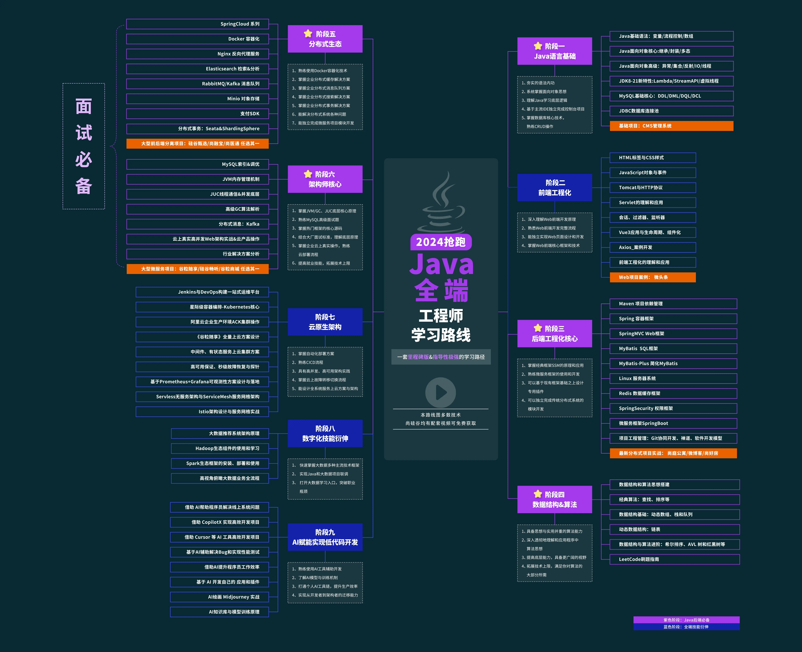
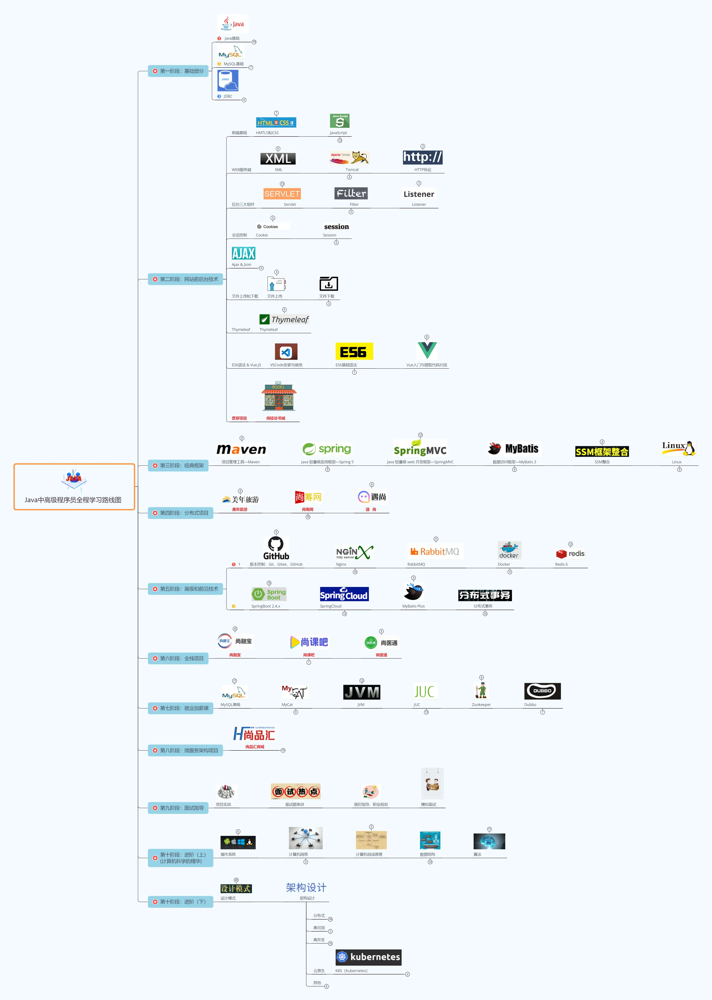

## 尚硅谷 Java 学习路线图

### Java 学习路线概览

### Java 中高级程序员全程学习路线

## 学习资源

### Java 从入门到精通

::: tip 说明
大多数资料来源于尚硅谷官方
:::

- [Java 从入门到精通（JDK17 版）](https://pan.quark.cn/list#/docpdf/3183c49474274ca5a2158450712b8a14)
- [尚硅谷 Java 入门教程 - java 电子书 + Java 面试真题（2023 新版）](https://pan.quark.cn/s/979d8951b09f)

### 尚硅谷 Java 学科全套教程

- [尚硅谷 Java 学科全套教程（百度网盘）](https://pan.baidu.com/s/1PhTeMkX5vOg0ZRcw0abjCw?pwd=yyds)
- [最新 Java 学习路线 - 哔哩哔哩](https://www.bilibili.com/opus/369163743450531164)
