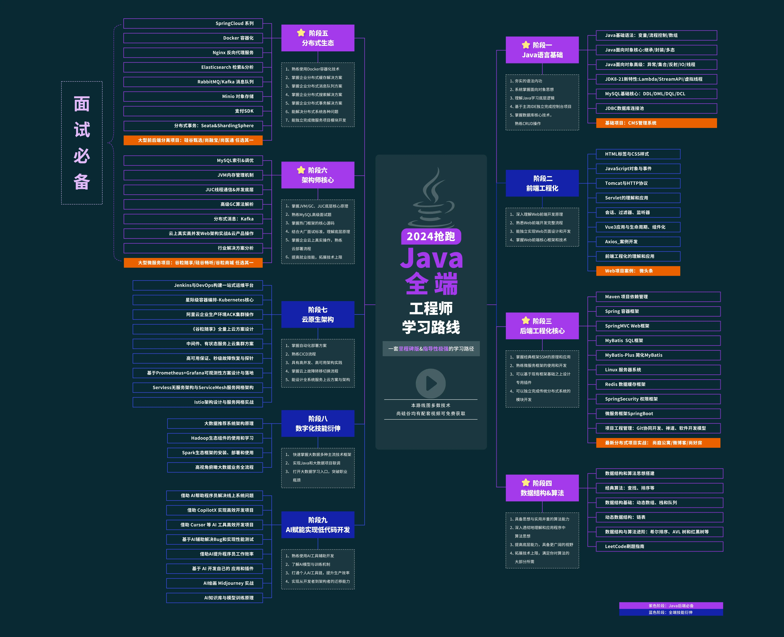
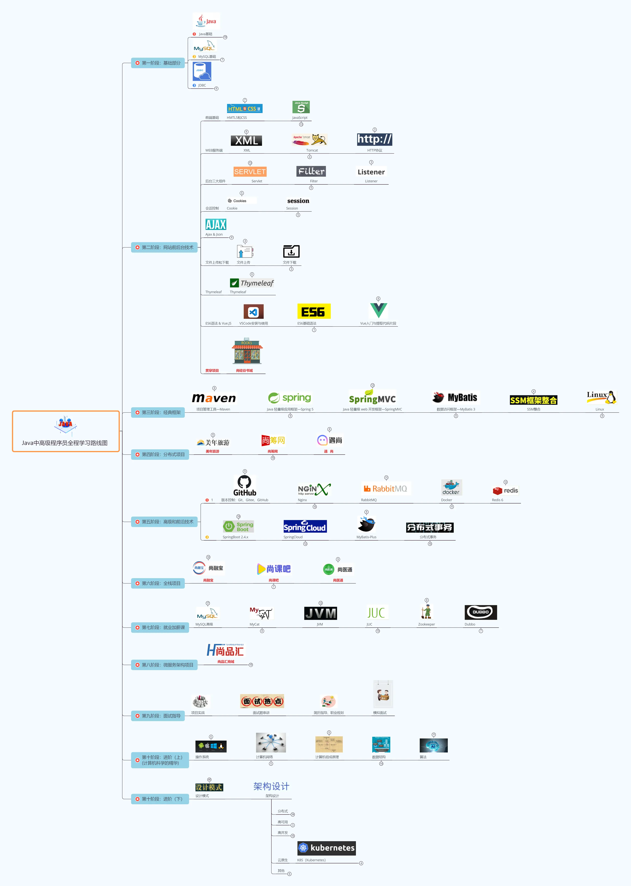

# 尚硅谷 Java 学习路线

本文整理尚硅谷 Java 学科的学习路线，并给出每个阶段的核心知识点与学习建议，便于在学习过程中对照进度、查漏补缺。

::: tip 说明
部分资料来源于尚硅谷官方公开渠道，仅供学习参考。
:::

## 学习路线概览

Java 后端开发的完整学习路径通常分为以下几个阶段：

1. **Java 基础（Java SE）**：语法、面向对象、集合、IO、异常、多线程。
2. **数据库与 SQL**：MySQL 基础、JDBC、SQL 优化。
3. **Java Web**：HTTP / Servlet / Tomcat / MVC 思想，以及 Thymeleaf、前后端分离（Vue 3 / React + REST API）现状。
4. **主流框架**：MyBatis、Spring、Spring MVC、Spring Boot。
5. **分布式与微服务**：Spring Cloud、Redis、RocketMQ、Elasticsearch、Nacos 等。
6. **云原生与工程化**：Docker、Kubernetes、DevOps、CI/CD。

## Java 中高级程序员全程学习路线

上图从 "Java 基础" 到 "云原生" 覆盖了中高级后端工程师所需的完整技能树。下面按阶段展开说明。

## 各阶段核心知识点

### 第一阶段：Java 基础（Java SE）

- **基础语法**：变量、数据类型、运算符、流程控制、数组。
- **面向对象**：封装、继承、多态、抽象类、接口、内部类。
- **常用 API**：`String`、集合框架（`List`、`Map`、`Set`）、IO 流、反射、注解。
- **异常处理**：受检异常与非受检异常、`try-catch-finally`、自定义异常。
- **多线程与并发**：线程创建方式、线程池、`synchronized`、`Lock`、`volatile`、JUC 包。

### 第二阶段：数据库

- **关系型数据库**：MySQL 安装、SQL 语句、索引、事务、锁、慢查询优化。
- **JDBC 与数据库连接池**：原生 JDBC、Druid / HikariCP 使用。
- **ORM 思想**：理解对象关系映射，为学习 MyBatis 做铺垫。

::: tip 版本提示
当前新项目和主流教程多基于 **MySQL 8.0**。MySQL 5.7 已于 2023 年 10 月停止官方长期支持，学习时建议以 8.0 为主，遇到老项目再回头了解 5.7 差异。
:::

### 第三阶段：Java Web

- **Web 核心**：HTTP 协议、请求方法、状态码、Cookie 与 Session。
- **Servlet 与过滤器**：理解请求处理流程、生命周期、责任链模式。
- **MVC 设计模式**：理解分层思想，为 Spring MVC 打基础。
- **模板引擎（传统）**：JSP、EL、JSTL 属于传统 JavaWeb 技术，目前新项目已极少直接使用，了解即可。
- **模板引擎（现代）**：Spring Boot 时代常用 **Thymeleaf**，语法更简洁，适合服务端渲染场景。
- **前后端分离**：当前主流是 **Vue 3 / React** 前端 + **Spring Boot REST API** 后端，前端通过 HTTP/JSON 与后端交互。

::: note
Spring Boot 普及后，传统 JavaWeb 中的 Servlet / JSP 使用频率已大幅下降，但 HTTP 协议、Servlet 原理和 MVC 分层思想仍是必备基础。实际工作中更常见的是前后端分离或 Thymeleaf 服务端渲染。
:::

### 第四阶段：主流框架

- **MyBatis**：Mapper 映射、动态 SQL、缓存、分页插件。
- **Spring**：IoC / DI、AOP、事务管理、Spring 常用注解。
- **Spring MVC**：请求处理流程、参数绑定、拦截器、异常处理。
- **Spring Boot**：自动配置、Starter、YAML 配置、actuator、Spring Boot 整合各类组件。

::: note 💡 个人注
推荐先掌握 Spring 核心思想，再过渡到 Spring Boot，否则容易陷入 "配置搬家" 而理解不透。Spring Boot 3.x 基于 **Spring Framework 6.x**，要求 **JDK 17+**，学习时请注意版本边界。
:::

### 第五阶段：分布式与微服务

- **服务注册与发现**：Nacos、Eureka。
- **远程调用**：OpenFeign、Dubbo。
- **服务网关**：Gateway。
- **配置中心**：Nacos Config、Spring Cloud Config。
- **缓存与消息**：Redis、RocketMQ / RabbitMQ / Kafka。
- **搜索与日志**：Elasticsearch、Logstash、Kibana（ELK）。
- **分布式理论**：CAP / BASE、分布式事务、限流降级、Sentinel。

::: warning 学习顺序建议
微服务涉及的概念和组件较多，建议先掌握单体 Spring Boot 项目，再引入 Nacos + Gateway + OpenFeign 搭建最小微服务链路，最后逐步叠加 Redis、RocketMQ、Elasticsearch 等中间件。
:::

### 第六阶段：云原生与工程化

- **容器化**：Docker 镜像、容器、Compose、网络与卷。
- **容器编排**：Kubernetes 基础概念（Pod、Deployment、Service）。
- **DevOps 与 CI/CD**：Jenkins、GitLab CI、GitHub Actions。
- **监控与链路追踪**：Prometheus、Grafana、SkyWalking。

## 学习建议

1. **先广度后深度**：先建立完整知识框架，再对工作中高频使用的技术深入钻研。
2. **以项目驱动学习**：每学完一个阶段，尝试用学到的技术完成一个小项目，避免 "只看不练"。
3. **重视源码与官方文档**：框架学习不要只记配置，理解底层设计才能应对实际排查问题。
4. **及时复习与笔记**：复杂知识点建议用思维导图或自己的话重新整理，形成个人知识库。
5. **保持技术敏感度**：关注 JDK 新版本特性、Spring 生态演进以及社区主流技术栈变化。

## 学习资源

### Java 从入门到精通

- [Java 从入门到精通（JDK17 版）](https://pan.quark.cn/list#/docpdf/3183c49474274ca5a2158450712b8a14)：适合零基础入门，覆盖 Java SE 核心语法与面向对象。
- [尚硅谷 Java 入门教程 - Java 电子书 + Java 面试真题（2023 新版）](https://pan.quark.cn/s/979d8951b09f)：可作为面试前的查漏补缺资料。

### 官方文档与参考资料

- [Oracle Java 官方文档](https://docs.oracle.com/en/java/)
- [Spring 官方文档](https://spring.io/docs)
- [MySQL 官方文档](https://dev.mysql.com/doc/)

### 尚硅谷 Java 学科全套教程

- [尚硅谷 Java 学科全套教程（百度网盘）](https://pan.baidu.com/s/1PhTeMkX5vOg0ZRcw0abjCw?pwd=yyds)：包含 Java 基础、Web、框架、微服务、云原生等完整视频。
- [最新 Java 学习路线 - 哔哩哔哩](https://www.bilibili.com/opus/369163743450531164)：官方发布的学习路线汇总，适合对照本文规划学习顺序。
