## 基础软件安装与配置

本指南涵盖 Java 开发环境的完整搭建过程，包括 JDK、Maven、IDEA、MySQL 和 Tomcat 的安装配置。

## JDK 安装与配置

### 下载与安装

1. 访问 [Oracle 官网](https://www.oracle.com/java/technologies/downloads/) 或 [OpenJDK](https://jdk.java.net/) 或 ([国内镜像](https://injdk.cn))下载 JDK
2. 推荐安装 JDK 17 或 JDK 21（长期支持版本）
3. 安装完成后配置环境变量

### 配置环境变量

#### 1. 配置 JAVA_HOME

在系统环境变量中添加：

```bash
变量名：JAVA_HOME
变量值：C:\Program Files\Java\jdk-17  # 根据实际安装路径调整
```

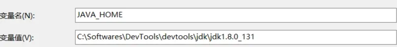

#### 2. 配置 Path

在系统变量 Path 中添加：

```
%JAVA_HOME%\bin
```

#### 3. 验证安装

打开命令提示符，执行：

```bash
java -version
javac -version
```

## Maven 安装与配置

### 下载与安装

1. 访问 [Maven 官网](https://maven.apache.org/download.cgi) 下载二进制包
2. 解压到指定目录，如：`C:\Softwares\DevTools\apache-maven-3.9.6`

### 配置环境变量

#### 1. 配置 MAVEN_HOME

```bash
变量名：MAVEN_HOME
变量值：C:\Softwares\DevTools\apache-maven-3.9.6
```

#### 2. 配置 Path

在系统变量 Path 中添加：

```
%MAVEN_HOME%\bin
```

#### 3. 验证安装

```bash
mvn -v
```

### 配置本地仓库

编辑 `conf/settings.xml` 文件，添加：

```xml
<localRepository>C:\Softwares\DevTools\MavenLocalRepository</localRepository>
```

### 配置阿里云镜像

在 `settings.xml` 的 `<mirrors>` 节点中添加：

```xml
<mirror>
    <id>aliyunmaven</id>
    <mirrorOf>*</mirrorOf>
    <name>阿里云公共仓库</name>
    <url>https://maven.aliyun.com/repository/public</url>
</mirror>
```

## IntelliJ IDEA 配置

### JVM 参数调优

编辑 `idea64.exe.vmoptions` 文件（位于 IDEA 安装目录的 bin 目录下）：

```
-Xms1024m
-Xmx4096m
-XX:ReservedCodeCacheSize=512m
-XX:+UseG1GC
```

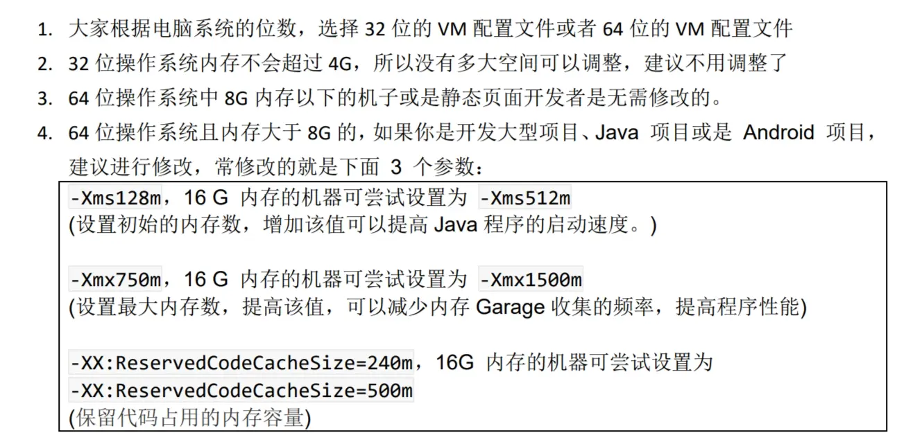

### 常用设置

#### 1. 鼠标滚轮调整字体大小

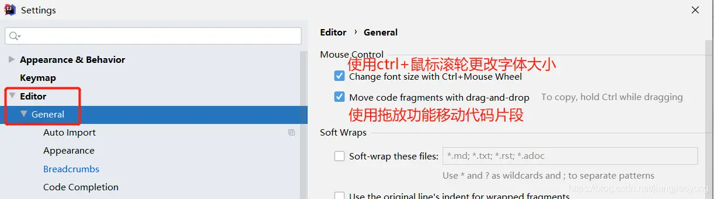

#### 2. 自动导包功能

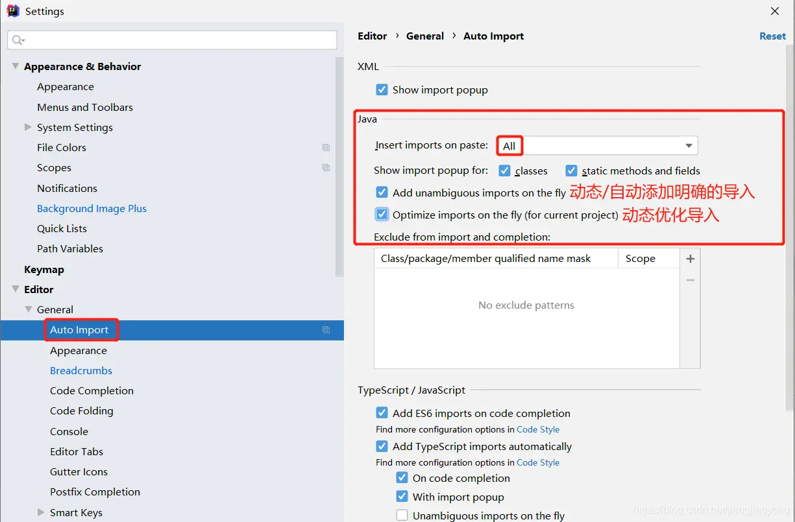

#### 3. 取消单行显示 tabs

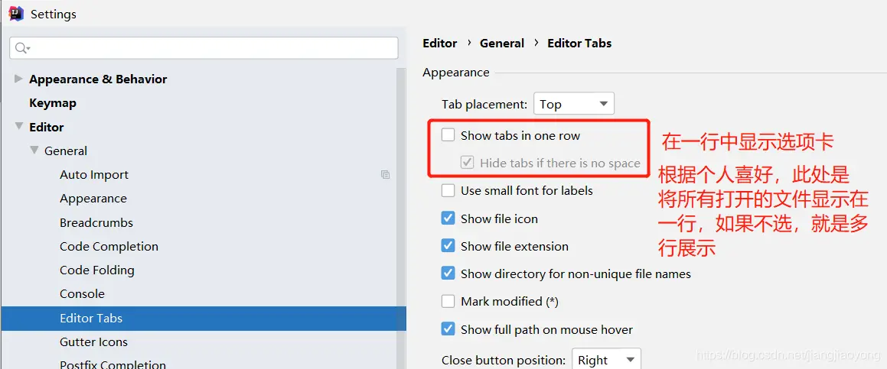

#### 4. 设置同时打开窗口数

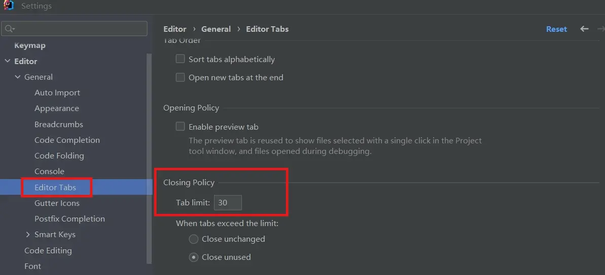

#### 5. 文件编码设置

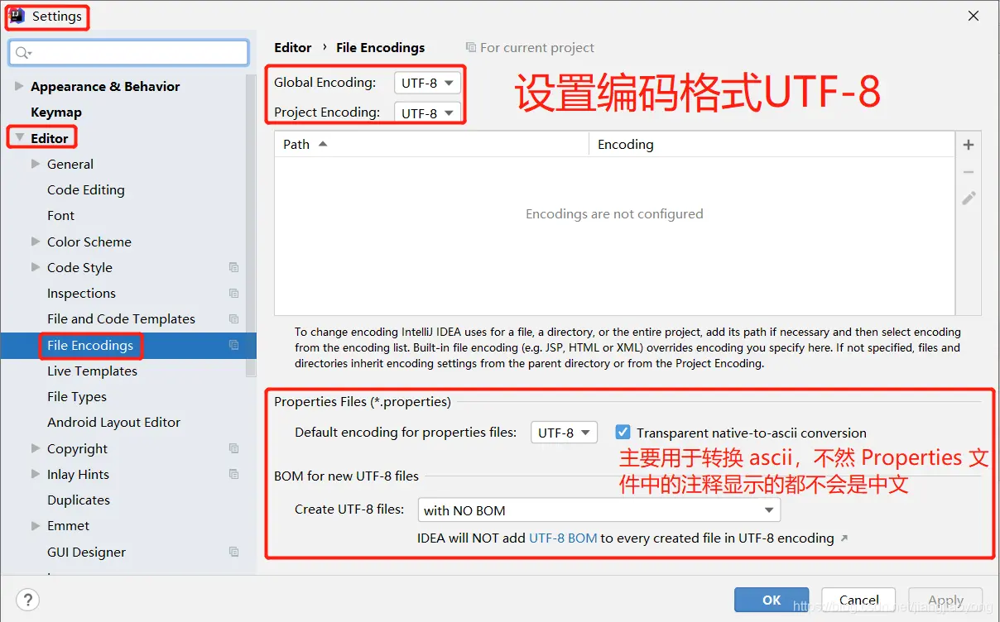

### Maven 集成配置

如果使用 IDEA 自带的 Maven，需要配置：

1. 本地仓库路径
2. 镜像源配置

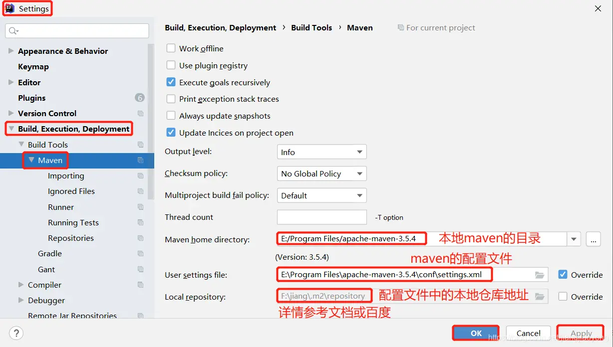

## MySQL 安装与配置

### 下载与安装

以 MySQL 8.0 为例：

1. 访问 [MySQL 官网](https://dev.mysql.com/downloads/mysql/) 下载
2. 推荐选择自定义安装（Custom）

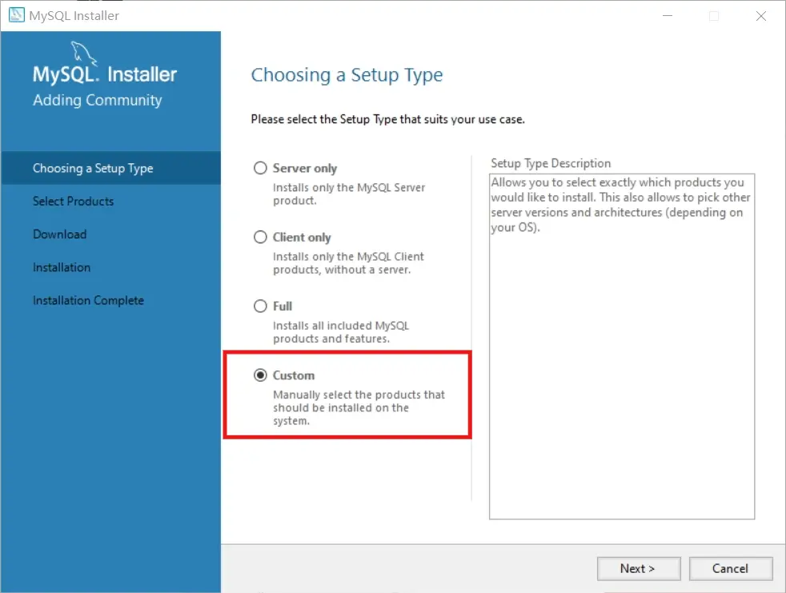

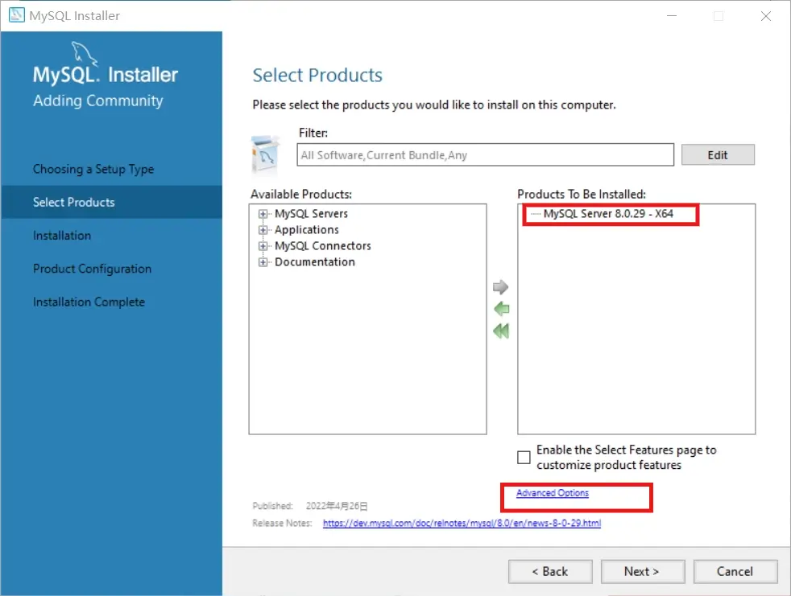

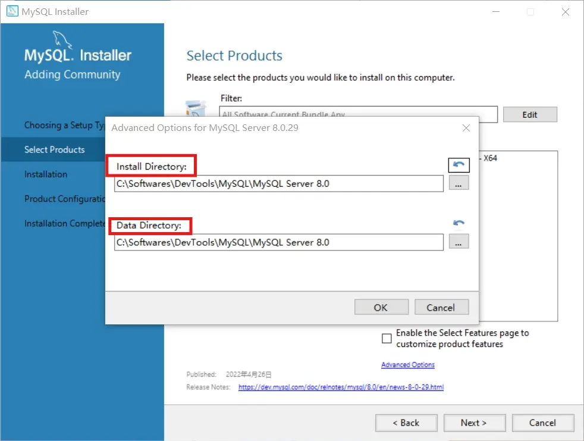

### 环境变量配置

在系统变量 Path 中添加：

```
C:\Softwares\DevTools\MySQL\MySQL Server 8.0\bin
```

### 验证安装

```bash
mysql -u root -p
```

## Tomcat 安装与配置

### 下载与安装

1. 访问 [Apache Tomcat 官网](https://tomcat.apache.org/) 下载
2. 解压到指定目录，如：`C:\Softwares\DevTools\apache-tomcat-9.0.85`

### 配置环境变量

#### 1. 配置 CATALINA_HOME

```bash
变量名：CATALINA_HOME
变量值：C:\Softwares\DevTools\apache-tomcat-9.0.85
```

#### 2. 配置 Path

在系统变量 Path 中添加：

```
%CATALINA_HOME%\bin
```

### 启动与验证

```bash
# 启动 Tomcat
startup.bat

# 访问测试
http://localhost:8080
```

### 中文编码问题处理

如果遇到中文乱码问题，修改 `conf/logging.properties` 文件：

```properties
# 将 UTF-8 替换为 GBK
java.util.logging.ConsoleHandler.encoding = GBK
```

## 环境验证清单

完成所有配置后，请验证以下命令是否正常执行：

```bash
java -version
javac -version
mvn -version
mysql -u root -p
curl http://localhost:8080
```

## 常见问题

### Q: JDK 安装后 java 命令无效？
A: 检查 JAVA_HOME 和 Path 配置是否正确，重启命令提示符

### Q: Maven 下载依赖失败？
A: 检查网络连接和镜像源配置，尝试清理本地仓库缓存

### Q: IDEA 启动缓慢？
A: 调整 VM 参数，增加内存分配，关闭不必要的插件

### Q: MySQL 无法连接？
A: 检查服务是否启动，端口是否被占用，防火墙设置

### Q: Tomcat 中文乱码？
A: 修改 logging.properties 文件编码设置，检查应用编码配置

