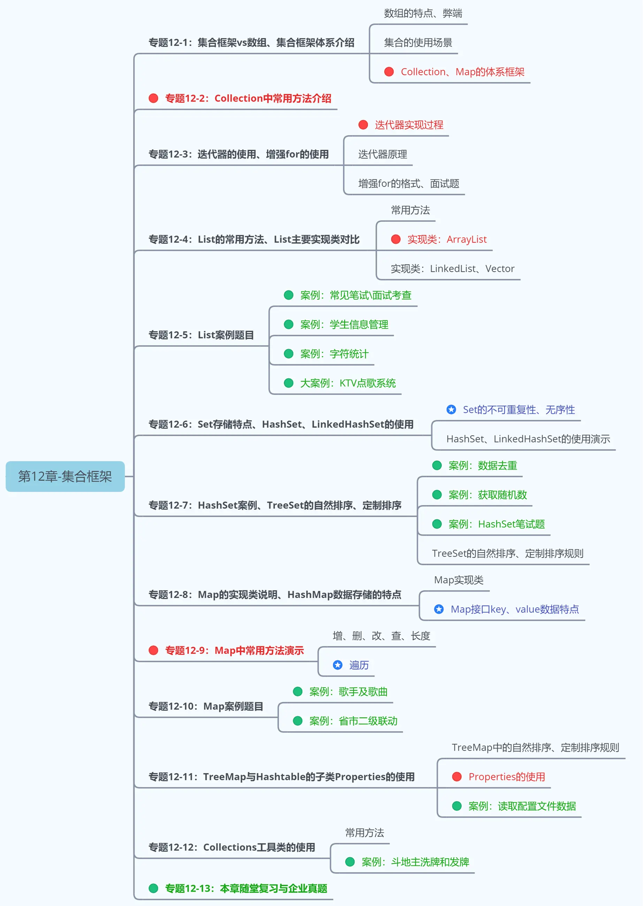
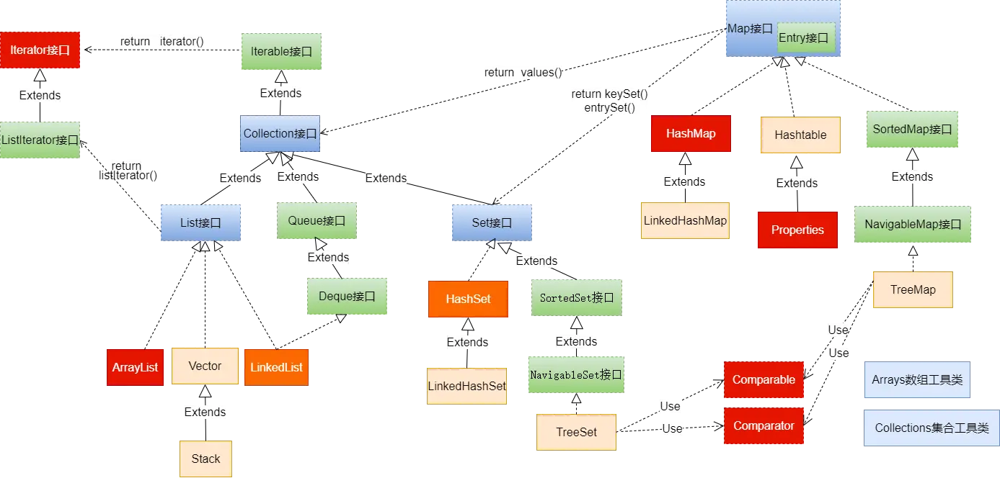
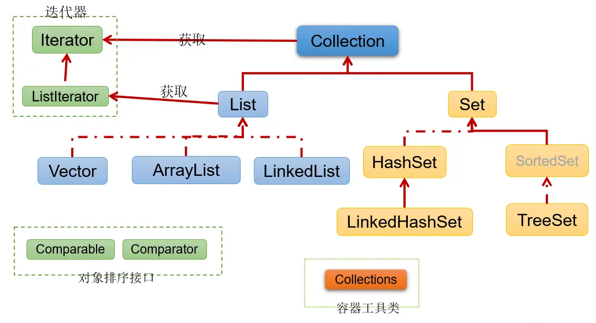
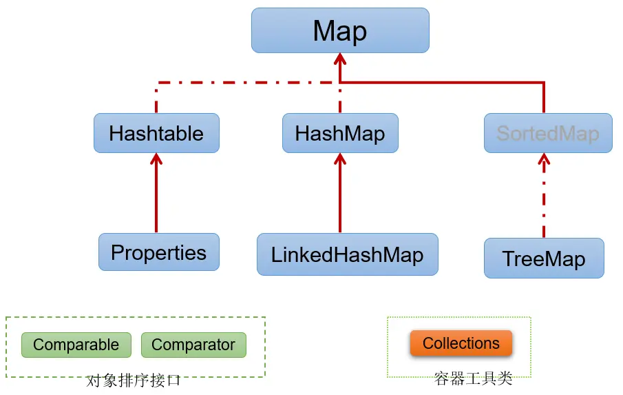
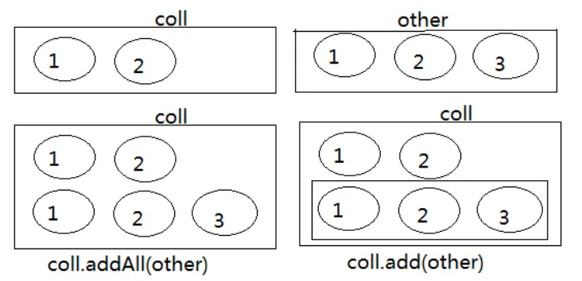
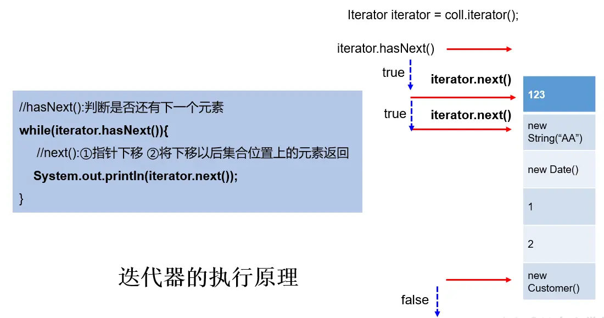
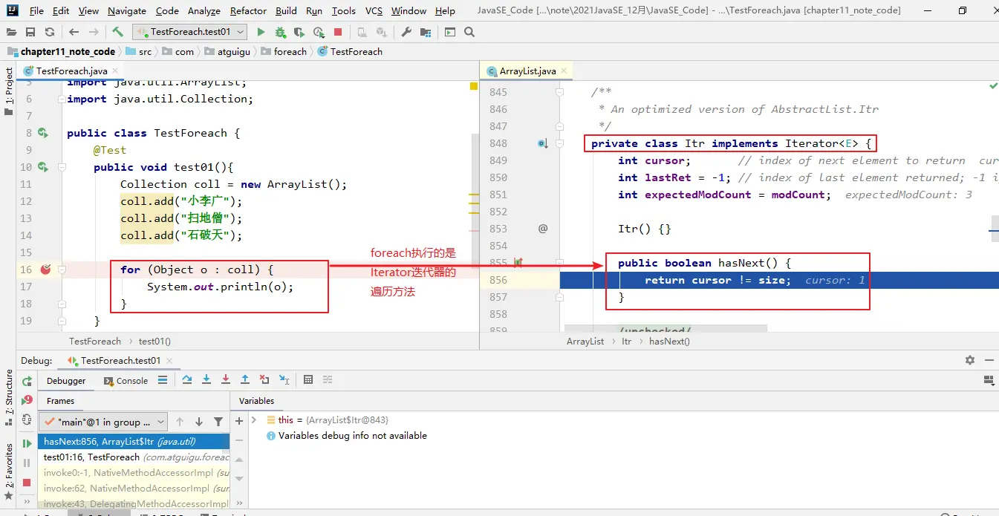
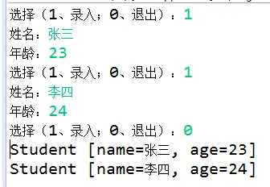

# 第 12 章_集合框架

讲师：尚硅谷-宋红康（江湖人称：康师傅）

官网：[http://www.atguigu.com](http://www.atguigu.com/)

***

## 本章专题与脉络



***

## 1. 集合框架概述

### 1.1 生活中的容器


### 1.2 数组的特点与弊端

- 一方面，面向对象语言对事物的体现都是以对象的形式，为了方便对多个对象的操作，就要对对象进行存储。
- 另一方面，使用数组存储对象方面具有`一些弊端`，而 Java 集合就像一种容器，可以`动态地`把多个对象的引用放入容器中。
- 数组在内存存储方面的`特点`：
  - 数组初始化以后，长度就确定了。
  - 数组中的添加的元素是依次紧密排列的，有序的，可以重复的。
  - 数组声明的类型，就决定了进行元素初始化时的类型。不是此类型的变量，就不能添加。
  - 可以存储基本数据类型值，也可以存储引用数据类型的变量
- 数组在存储数据方面的`弊端`：
  - 数组初始化以后，长度就不可变了，不便于扩展
  - 数组中提供的属性和方法少，不便于进行添加、删除、插入、获取元素个数等操作，且效率不高。
  - 数组存储数据的特点单一，只能存储有序的、可以重复的数据
- Java 集合框架中的类可以用于存储多个`对象`，还可用于保存具有`映射关系`的关联数组。

### 1.3 Java 集合框架体系

Java 集合可分为 Collection 和 Map 两大体系：

- Collection 接口：用于存储一个一个的数据，也称`单列数据集合`。
  - List 子接口：用来存储有序的、可以重复的数据（主要用来替换数组，"动态"数组）
    - 实现类：ArrayList（主要实现类）、LinkedList、Vector
- Set 子接口：用来存储无序的、不可重复的数据（类似于高中讲的"集合"）
    - 实现类：HashSet（主要实现类）、LinkedHashSet、TreeSet
- Map 接口：用于存储具有映射关系“key-value 对”的集合，即一对一对的数据，也称`双列数据集合`。（类似于高中的函数、映射。(x1,y1）,(x2,y2) ---> y = f(x) )
  - HashMap（主要实现类）、LinkedHashMap、TreeMap、Hashtable、Properties

- JDK 提供的集合 API 位于 java.util 包内
- 图示：集合框架全图



- 简图 1：**Collection 接口继承树**



- 简图 2：**Map 接口继承树**



### 1.4 集合的使用场景


## 2. Collection 接口及方法

- JDK 不提供此接口的任何直接实现，而是提供更具体的子接口（如：Set 和 List）去实现。
- Collection 接口是 List 和 Set 接口的父接口，该接口里定义的方法既可用于操作 Set 集合，也可用于操作 List 集合。方法如下：

### 2.1 添加

(1)add(E obj)：添加元素对象到当前集合中
(2)addAll(Collection other)：添加 other 集合中的所有元素对象到当前集合中，即 this = this ∪ other

注意：add 和 addAll 的区别

```java
package com.atguigu.collection;

import org.junit.Test;

import java.util.ArrayList;
import java.util.Collection;

public class TestCollectionAdd {
    @Test
    public void testAdd(){
        //ArrayList是Collection的子接口List的实现类之一。
        Collection coll = new ArrayList();
        coll.add("小李广");
        coll.add("扫地僧");
        coll.add("石破天");
        System.out.println(coll);
    }

    @Test
    public void testAddAll(){
        Collection c1 = new ArrayList();
        c1.add(1);
        c1.add(2);
        System.out.println("c1集合元素的个数：" + c1.size());//2
        System.out.println("c1 = " + c1);

        Collection c2 = new ArrayList();
        c2.add(1);
        c2.add(2);
        System.out.println("c2集合元素的个数：" + c2.size());//2
        System.out.println("c2 = " + c2);

        Collection other = new ArrayList();
        other.add(1);
        other.add(2);
        other.add(3);
        System.out.println("other集合元素的个数：" + other.size());//3
        System.out.println("other = " + other);
        System.out.println();

        c1.addAll(other);
        System.out.println("c1集合元素的个数：" + c1.size());//5
        System.out.println("c1.addAll(other) = " + c1);

        c2.add(other);
        System.out.println("c2集合元素的个数：" + c2.size());//3
        System.out.println("c2.add(other) = " + c2);
    }
}
```

> 注意：coll.addAll(other);与 coll.add(other);



### 2.2 判断

(3)int size()：获取当前集合中实际存储的元素个数
(4)boolean isEmpty()：判断当前集合是否为空集合
(5)boolean contains(Object obj)：判断当前集合中是否存在一个与 obj 对象 equals 返回 true 的元素
(6)boolean containsAll(Collection coll)：判断 coll 集合中的元素是否在当前集合中都存在。即 coll 集合是否是当前集合的“子集”
(7)boolean equals(Object obj)：判断当前集合与 obj 是否相等

```java
package com.atguigu.collection;

import org.junit.Test;

import java.util.ArrayList;
import java.util.Arrays;
import java.util.Collection;

public class TestCollectionContains {
    @Test
    public void test01() {
        Collection coll = new ArrayList();
        System.out.println("coll在添加元素之前，isEmpty = " + coll.isEmpty());
        coll.add("小李广");
        coll.add("扫地僧");
        coll.add("石破天");
        coll.add("佛地魔");
        System.out.println("coll的元素个数" + coll.size());

        System.out.println("coll在添加元素之后，isEmpty = " + coll.isEmpty());
    }

    @Test
    public void test02() {
        Collection coll = new ArrayList();
        coll.add("小李广");
        coll.add("扫地僧");
        coll.add("石破天");
        coll.add("佛地魔");
        System.out.println("coll = " + coll);
        System.out.println("coll是否包含“小李广” = " + coll.contains("小李广"));
        System.out.println("coll是否包含“宋红康” = " + coll.contains("宋红康"));

        Collection other = new ArrayList();
        other.add("小李广");
        other.add("扫地僧");
        other.add("尚硅谷");
        System.out.println("other = " + other);

        System.out.println("coll.containsAll(other) = " + coll.containsAll(other));
    }

    @Test
    public void test03(){
        Collection c1 = new ArrayList();
        c1.add(1);
        c1.add(2);
        System.out.println("c1集合元素的个数：" + c1.size());//2
        System.out.println("c1 = " + c1);

        Collection c2 = new ArrayList();
        c2.add(1);
        c2.add(2);
        System.out.println("c2集合元素的个数：" + c2.size());//2
        System.out.println("c2 = " + c2);

        Collection other = new ArrayList();
        other.add(1);
        other.add(2);
        other.add(3);
        System.out.println("other集合元素的个数：" + other.size());//3
        System.out.println("other = " + other);
        System.out.println();

        c1.addAll(other);
        System.out.println("c1集合元素的个数：" + c1.size());//5
        System.out.println("c1.addAll(other) = " + c1);
        System.out.println("c1.contains(other) = " + c1.contains(other));
        System.out.println("c1.containsAll(other) = " + c1.containsAll(other));
        System.out.println();

        c2.add(other);
        System.out.println("c2集合元素的个数：" + c2.size());
        System.out.println("c2.add(other) = " + c2);
        System.out.println("c2.contains(other) = " + c2.contains(other));
        System.out.println("c2.containsAll(other) = " + c2.containsAll(other));
    }

}
```

### 2.3 删除

(8)void clear()：清空集合元素
(9) boolean remove(Object obj) ：从当前集合中删除第一个找到的与 obj 对象 equals 返回 true 的元素。
(10)boolean removeAll(Collection coll)：从当前集合中删除所有与 coll 集合中相同的元素。即 this = this - this ∩ coll
(11)boolean retainAll(Collection coll)：从当前集合中删除两个集合中不同的元素，使得当前集合仅保留与 coll 集合中的元素相同的元素，即当前集合中仅保留两个集合的交集，即 this  = this ∩ coll；

注意几种删除方法的区别

```java
package com.atguigu.collection;

import org.junit.Test;

import java.util.ArrayList;
import java.util.Collection;
import java.util.function.Predicate;

public class TestCollectionRemove {
    @Test
    public void test01(){
        Collection coll = new ArrayList();
        coll.add("小李广");
        coll.add("扫地僧");
        coll.add("石破天");
        coll.add("佛地魔");
        System.out.println("coll = " + coll);

        coll.remove("小李广");
        System.out.println("删除元素\"小李广\"之后coll = " + coll);
        
        coll.clear();
        System.out.println("coll清空之后，coll = " + coll);
    }

    @Test
    public void test02() {
        Collection coll = new ArrayList();
        coll.add("小李广");
        coll.add("扫地僧");
        coll.add("石破天");
        coll.add("佛地魔");
        System.out.println("coll = " + coll);

        Collection other = new ArrayList();
        other.add("小李广");
        other.add("扫地僧");
        other.add("尚硅谷");
        System.out.println("other = " + other);

        coll.removeAll(other);
        System.out.println("coll.removeAll(other)之后，coll = " + coll);
        System.out.println("coll.removeAll(other)之后，other = " + other);
    }

    @Test
    public void test03() {
        Collection coll = new ArrayList();
        coll.add("小李广");
        coll.add("扫地僧");
        coll.add("石破天");
        coll.add("佛地魔");
        System.out.println("coll = " + coll);

        Collection other = new ArrayList();
        other.add("小李广");
        other.add("扫地僧");
        other.add("尚硅谷");
        System.out.println("other = " + other);

        coll.retainAll(other);
        System.out.println("coll.retainAll(other)之后，coll = " + coll);
        System.out.println("coll.retainAll(other)之后，other = " + other);
    }

}
```

### 2.4 其它

(12)Object[] toArray()：返回包含当前集合中所有元素的数组
(13)hashCode()：获取集合对象的哈希值
(14)iterator()：返回迭代器对象，用于集合遍历

```java
public class TestCollectionContains {
    @Test
    public void test01() {
        Collection coll = new ArrayList();

        coll.add("小李广");
        coll.add("扫地僧");
        coll.add("石破天");
        coll.add("佛地魔");
		//集合转换为数组：集合的toArray()方法
        Object[] objects = coll.toArray();
        System.out.println("用数组返回coll中所有元素：" + Arrays.toString(objects));
		
        //对应的，数组转换为集合：调用Arrays的asList(Object ...objs)
        Object[] arr1 = new Object[]{123,"AA","CC"};
        Collection list = Arrays.asList(arr1);
        System.out.println(list);
    }
}
```

## 3. Iterator（迭代器）接口

### 3.1 Iterator 接口

- 在程序开发中，经常需要遍历集合中的所有元素。针对这种需求，JDK 专门提供了一个接口`java.util.Iterator`。`Iterator`接口也是 Java 集合中的一员，但它与`Collection`、`Map`接口有所不同。
  - Collection 接口与 Map 接口主要用于`存储`元素
  - `Iterator`，被称为迭代器接口，本身并不提供存储对象的能力，主要用于`遍历`Collection 中的元素


- Collection 接口继承了 java.lang.Iterable 接口，该接口有一个 iterator() 方法，那么所有实现了 Collection 接口的集合类都有一个 iterator() 方法，用以返回一个实现了 Iterator 接口的对象。
  - `public Iterator iterator()`: 获取集合对应的迭代器，用来遍历集合中的元素的。
  - 集合对象每次调用 iterator()方法都得到一个全新的迭代器对象，默认游标都在集合的第一个元素之前。

- Iterator 接口的常用方法如下：
  - `public E next()`:返回迭代的下一个元素。
  - `public boolean hasNext()`:如果仍有元素可以迭代，则返回 true。

- 注意：在调用 it.next() 方法之前必须要调用 it.hasNext() 进行检测。若不调用，且下一条记录无效，直接调用 it.next() 会抛出`NoSuchElementException异常`。


举例：

```java
package com.atguigu.iterator;

import org.junit.Test;

import java.util.ArrayList;
import java.util.Collection;
import java.util.Iterator;

public class TestIterator {
    @Test
    public void test01(){
        Collection coll = new ArrayList();
        coll.add("小李广");
        coll.add("扫地僧");
        coll.add("石破天");

        Iterator iterator = coll.iterator();
        System.out.println(iterator.next());
        System.out.println(iterator.next());
        System.out.println(iterator.next());
        System.out.println(iterator.next()); //报NoSuchElementException异常
    }

    @Test
    public void test02(){
        Collection coll = new ArrayList();
        coll.add("小李广");
        coll.add("扫地僧");
        coll.add("石破天");

        Iterator iterator = coll.iterator();//获取迭代器对象
        while(iterator.hasNext()) {//判断是否还有元素可迭代
            System.out.println(iterator.next());//取出下一个元素
        }
    }
}

```

### 3.2 迭代器的执行原理

Iterator 迭代器对象在遍历集合时，内部采用指针的方式来跟踪集合中的元素，接下来通过一个图例来演示 Iterator 对象迭代元素的过程：



使用 Iterator 迭代器删除元素：java.util.Iterator 迭代器中有一个方法：void remove() ;

```java
Iterator iter = coll.iterator();//回到起点
while(iter.hasNext()){
    Object obj = iter.next();
    if(obj.equals("Tom")){
        iter.remove();
    }
}
```

注意：
- Iterator 可以删除集合的元素，但是遍历过程中通过迭代器对象的 remove 方法，不是集合对象的 remove 方法。
- 如果还未调用 next() 或在上一次调用 next() 方法之后已经调用了 remove() 方法，再调用 remove()都会报 IllegalStateException。

- Collection 已经有 remove(xx) 方法了，为什么 Iterator 迭代器还要提供删除方法呢？因为迭代器的 remove()可以按指定的条件进行删除。


例如：要删除以下集合元素中的偶数

```java
package com.atguigu.iterator;

import org.junit.Test;

import java.util.ArrayList;
import java.util.Collection;
import java.util.Iterator;

public class TestIteratorRemove {
    @Test
    public void test01(){
        Collection coll = new ArrayList();
        coll.add(1);
        coll.add(2);
        coll.add(3);
        coll.add(4);
        coll.add(5);
        coll.add(6);

        Iterator iterator = coll.iterator();
        while(iterator.hasNext()){
            Integer element = (Integer) iterator.next();
            if(element % 2 == 0){
                iterator.remove();
            }
        }
        System.out.println(coll);
    }
}

```

在 JDK8.0 时，Collection 接口有了 removeIf 方法，即可以根据条件删除。（第 18 章中再讲）

```java
package com.atguigu.collection;

import org.junit.Test;

import java.util.ArrayList;
import java.util.Collection;
import java.util.function.Predicate;

public class TestCollectionRemoveIf {
    @Test
    public void test01(){
        Collection coll = new ArrayList();
        coll.add("小李广");
        coll.add("扫地僧");
        coll.add("石破天");
        coll.add("佛地魔");
        System.out.println("coll = " + coll);

        coll.removeIf(new Predicate() {
            @Override
            public boolean test(Object o) {
                String str = (String) o;
                return str.contains("地");
            }
        });
        System.out.println("删除包含\"地\"字的元素之后coll = " + coll);
    }
}
```

### 3.3 foreach 循环

- foreach 循环（也称增强 for 循环）是 JDK5.0 中定义的一个高级 for 循环，专门用来`遍历数组和集合`的。


- foreach 循环的语法格式：


```java
for(元素的数据类型 局部变量 : Collection集合或数组){ 
  	//操作局部变量的输出操作
}
//这里局部变量就是一个临时变量，自己命名就可以
```

- 举例：


```java
package com.atguigu.iterator;

import org.junit.Test;

import java.util.ArrayList;
import java.util.Collection;

public class TestForeach {
    @Test
    public void test01(){
        Collection coll = new ArrayList();
        coll.add("小李广");
        coll.add("扫地僧");
        coll.add("石破天");
		//foreach循环其实就是使用Iterator迭代器来完成元素的遍历的。
        for (Object o : coll) {
            System.out.println(o);
        }
    }
    @Test
    public void test02(){
        int[] nums = {1,2,3,4,5};
        for (int num : nums) {
            System.out.println(num);
        }
        System.out.println("-----------------");
        String[] names = {"张三","李四","王五"};
        for (String name : names) {
            System.out.println(name);
        }
    }
}
```

- 对于集合的遍历，增强 for 的内部原理其实是个 Iterator 迭代器。如下图。



- 它用于遍历 Collection 和数组。通常只进行遍历元素，不要在遍历的过程中对集合元素进行增删操作。
  - 练习：判断输出结果为何？

```java
public class ForTest {
    public static void main(String[] args) {
        String[] str = new String[5];
        for (String myStr : str) {
            myStr = "atguigu";
            System.out.println(myStr);
        }
        for (int i = 0; i < str.length; i++) {
            System.out.println(str[i]);
        }
    }
}

```

## 4. Collection 子接口 1：List

### 4.1 List 接口特点

- 鉴于 Java 中数组用来存储数据的局限性，我们通常使用`java.util.List`替代数组
- List 集合类中`元素有序`、且`可重复`，集合中的每个元素都有其对应的顺序索引。

  - 举例：List 集合存储数据，就像银行门口客服，给每一个来办理业务的客户分配序号：第一个来的是“张三”，客服给他分配的是 0；第二个来的是“李四”，客服给他分配的 1；以此类推，最后一个序号应该是“总人数-1”。


- JDK API 中 List 接口的实现类常用的有：`ArrayList`、`LinkedList`和`Vector`。

### 4.2 List 接口方法

List 除了从 Collection 集合继承的方法外，List 集合里添加了一些`根据索引`来操作集合元素的方法。

- 插入元素
  - `void add(int index, Object ele)`:在 index 位置插入 ele 元素
  - boolean addAll(int index, Collection eles):从 index 位置开始将 eles 中的所有元素添加进来
- 获取元素
  - `Object get(int index)`:获取指定 index 位置的元素
  - List subList(int fromIndex, int toIndex):返回从 fromIndex 到 toIndex 位置的子集合
- 获取元素索引
  - int indexOf(Object obj):返回 obj 在集合中首次出现的位置
  - int lastIndexOf(Object obj):返回 obj 在当前集合中末次出现的位置
- 删除和替换元素
  - `Object remove(int index)`:移除指定 index 位置的元素，并返回此元素

  - `Object set(int index, Object ele)`:设置指定 index 位置的元素为 ele


举例：

```java
package com.atguigu.list;

import java.util.ArrayList;
import java.util.List;

public class TestListMethod {
    public static void main(String[] args) {
        // 创建List集合对象
        List<String> list = new ArrayList<String>();

        // 往 尾部添加 指定元素
        list.add("图图");
        list.add("小美");
        list.add("不高兴");

        System.out.println(list);
        // add(int index,String s) 往指定位置添加
        list.add(1,"没头脑");

        System.out.println(list);
        // String remove(int index) 删除指定位置元素  返回被删除元素
        // 删除索引位置为2的元素
        System.out.println("删除索引位置为2的元素");
        System.out.println(list.remove(2));

        System.out.println(list);

        // String set(int index,String s)
        // 在指定位置 进行 元素替代（改）
        // 修改指定位置元素
        list.set(0, "三毛");
        System.out.println(list);

        // String get(int index)  获取指定位置元素
        // 跟size() 方法一起用  来 遍历的
        for(int i = 0;i<list.size();i++){
            System.out.println(list.get(i));
        }
        //还可以使用增强for
        for (String string : list) {
            System.out.println(string);
        }
    }
}
```

> 注意：在 JavaSE 中 List 名称的类型有两个，一个是 java.util.List 集合接口，一个是 java.awt.List 图形界面的组件，别导错包了。

### 4.3 List 接口主要实现类：ArrayList

- ArrayList 是 List 接口的`主要实现类`

- 本质上，ArrayList 是对象引用的一个”变长”数组

- Arrays.asList(…) 方法返回的 List 集合，既不是 ArrayList 实例，也不是 Vector 实例。 Arrays.asList(…) 返回值是一个固定长度的 List 集合

  

### 4.4 List 的实现类之二：LinkedList

- 对于频繁的插入或删除元素的操作，建议使用 LinkedList 类，效率较高。这是由底层采用链表（双向链表）结构存储数据决定的。


- 特有方法：
  - void addFirst(Object obj)
  - void addLast(Object obj)	
  - Object getFirst()
  - Object getLast()
  - Object removeFirst()
  - Object removeLast()

### 4.5 List 的实现类之三：Vector

- Vector 是一个`古老`的集合，JDK1.0 就有了。大多数操作与 ArrayList 相同，区别之处在于 Vector 是`线程安全`的。
- 在各种 List 中，最好把`ArrayList作为默认选择`。当插入、删除频繁时，使用 LinkedList；Vector 总是比 ArrayList 慢，所以尽量避免使用。
- 特有方法：
  - void addElement(Object obj)
  - void insertElementAt(Object obj,int index)
  - void setElementAt(Object obj,int index)
  - void removeElement(Object obj)
  - void removeAllElements()

### 4.6 练习

**面试题：**

```java
@Test
public void testListRemove() {
    List list = new ArrayList();
    list.add(1);
    list.add(2);
    list.add(3);
    updateList(list);
    System.out.println(list);//[1,2]
}

private static void updateList(List list) {
    list.remove(2);  
}

```

**练习 1：**

- 定义学生类，属性为姓名、年龄，提供必要的 getter、setter 方法，构造器，toString()，equals()方法。
- 使用 ArrayList 集合，保存录入的多个学生对象。
- 循环录入的方式，1：继续录入，0：结束录入。
- 录入结束后，用 foreach 遍历集合。

* 代码实现，效果如图所示：

  

```java
package com.atguigu.test01;

import java.util.ArrayList;
import java.util.Scanner;

public class StudentTest {
    public static void main(String[] args) {

        Scanner scanner = new Scanner(System.in);
        ArrayList stuList = new ArrayList();

        for (;;) {

            System.out.println("选择（录入 1 ；结束 0）");
            int x = scanner.nextInt();//根据x的值，判断是否需要继续循环

            if (x == 1) {
                System.out.println("姓名");
                String name = scanner.next();
                System.out.println("年龄");
                int age = scanner.nextInt();
                Student stu = new Student(age, name);
                stuList.add(stu);

            } else if (x == 0) {
                break;

            } else {

                System.out.println("输入有误，请重新输入");
            }
        }

        for (Object stu : stuList) {
            System.out.println(stu);
        }
    }
}

public class Student {

    private int age;
    private String name;

    public Student() {
    }

    
    public Student(int age, String name) {
		super();
		this.age = age;
		this.name = name;
	}


	public int getAge() {
        return age;
    }

    public void setAge(int age) {
        this.age = age;
    }

    public String getName() {
        return name;
    }

    public void setName(String name) {
        this.name = name;

    }

	@Override
	public String toString() {
		return "Student [age=" + age + ", name=" + name + "]";
	}

}
```

**练习 2：**

1. 请定义方法 public static int listTest(Collection list,String s)统计集合中指定元素出现的次数

2. 创建集合，集合存放随机生成的 30 个小写字母

3. 用 listTest 统计，a、b、c、x 元素的出现次数

4. 效果如下


```java
package com.atguigu.test02;

import java.util.ArrayList;
import java.util.Collection;
import java.util.Random;

public class Test02 {
	public static void main(String[] args) {
		Collection list = new ArrayList();
		Random rand = new Random();
		for (int i = 0; i < 30; i++) {
			list.add((char)(rand.nextInt(26)+97)+"");
		}
		System.out.println(list);
		System.out.println("a:"+listTest(list, "a"));	
		System.out.println("b:"+listTest(list, "b"));	
		System.out.println("c:"+listTest(list, "c"));
		System.out.println("x:"+listTest(list, "x"));	
	}

	public static int listTest(Collection list, String string) {
		int count = 0;
		for (Object object : list) {
			if(string.equals(object)){
				count++;
			}
		}
		return count;
	}
}

```

**练习 3：KTV 点歌系统**

**描述**

分别使用 ArrayList 和 LinkedList 集合，编写一个`KTV点歌系统`的程序。在程序中：

- 指令 1 代表添加歌曲
- 指令 2 代表将所选歌曲置顶
- 指令 3 代表将所选歌曲提前一位
- 指令 4 代表退出该系统

要求根据用户输入的指令和歌曲名展现歌曲列表。例如输入指令 1，输入歌曲名"爱你一万年"，则输出“当前歌曲列表：[爱你一万年]”。

**提示**

* 为了指引用户操作，首先要将各个指令所表示的含义打印到控制台

  ```java
  System.out.println("-------------欢迎来到点歌系统------------");
  System.out.println("1.添加歌曲至列表");
  System.out.println("2.将歌曲置顶");
  System.out.println("3.将歌曲前移一位");
  System.out.println("4.退出");
  ```

* 程序中需要创建一个集合作为歌曲列表，并向其添加一部分歌曲

* 通过 ArrayList 或 LinkedList 集合定义的方法操作歌曲列表

**代码**

* 使用 ArrayList 集合模拟点歌系统的实现代码，如下所示：

  ```java
  /**
   * @author 尚硅谷-宋红康
   * @create 20:26
   */
  public class KTVByArrayList {
      private static ArrayList musicList = new ArrayList();// 创建歌曲列表
      private static Scanner sc = new Scanner(System.in);
  
      public static void main(String[] args) {
          addMusicList();// 添加一部分歌曲至歌曲列表
          boolean flag = true;
          while (flag) {
              System.out.println("当前歌曲列表：" + musicList);
              System.out.println("-------------欢迎来到点歌系统------------");
              System.out.println("1.添加歌曲至列表");
              System.out.println("2.将歌曲置顶");
              System.out.println("3.将歌曲前移一位");
              System.out.println("4.退出");
              System.out.print("请输入操作序号：");
              int key = sc.nextInt();// //接收键盘输入的功能选项序号
              // 执行序号对应的功能
              switch (key) {
                  case 1:// 添加歌曲至列表
                      addMusic();
                      break;
                  case 2:// 将歌曲置顶
                      setTop();
                      break;
                  case 3:// 将歌曲前移一位
                      setBefore();
                      break;
                  case 4:// 退出
                      System.out.println("----------------退出---------------");
                      System.out.println("您已退出系统");
                      flag = false;
                      break;
                  default:
                      System.out.println("----------------------------------");
                      System.out.println("功能选择有误，请输入正确的功能序号!");
                      break;
              }
  
          }
      }
  
      // 初始时添加歌曲名称
      private static void addMusicList() {
          musicList.add("本草纲目");
          musicList.add("你是我的眼");
          musicList.add("老男孩");
          musicList.add("白月光与朱砂痣");
          musicList.add("不谓侠");
          musicList.add("爱你");
      }
  
      // 执行添加歌曲
      private static void addMusic() {
          System.out.print("请输入要添加的歌曲名称：");
          String musicName = sc.next();// 获取键盘输入内容
          musicList.add(musicName);// 添加歌曲到列表的最后
          System.out.println("已添加歌曲：" + musicName);
      }
  
      // 执行将歌曲置顶
      private static void setTop() {
          System.out.print("请输入要置顶的歌曲名称：");
          String musicName = sc.next();// 获取键盘输入内容
          int musicIndex = musicList.indexOf(musicName);// 查找指定歌曲位置
          if (musicIndex < 0) {// 判断输入歌曲是否存在
              System.out.println("当前列表中没有输入的歌曲！");
          }else if(musicIndex == 0){
              System.out.println("当前歌曲默认已置顶！");
          }else {
              musicList.remove(musicName);// 移除指定的歌曲
              musicList.add(0, musicName);// 将指定的歌曲放到第一位
              System.out.println("已将歌曲《" + musicName + "》置顶");
          }
      }
  
      // 执行将歌曲置前一位
      private static void setBefore() {
          System.out.print("请输入要置前的歌曲名称：");
          String musicName = sc.next();// 获取键盘输入内容
          int musicIndex = musicList.indexOf(musicName);// 查找指定歌曲位置
          if (musicIndex < 0) {// 判断输入歌曲是否存在
              System.out.println("当前列表中没有输入的歌曲！");
          } else if (musicIndex == 0) {// 判断歌曲是否已在第一位
              System.out.println("当前歌曲已在最顶部！");
          } else {
              musicList.remove(musicName);// 移除指定的歌曲
              musicList.add(musicIndex - 1, musicName);// 将指定的歌曲放到前一位
              System.out.println("已将歌曲《" + musicName + "》置前一位");
          }
      }
  }
  ```

## 5. Collection 子接口 2：Set

### 5.1 Set 接口概述

- Set 接口是 Collection 的子接口，Set 接口相较于 Collection 接口没有提供额外的方法
- Set 集合不允许包含相同的元素，如果试把两个相同的元素加入同一个 Set 集合中，则添加操作失败。
- Set 集合支持的遍历方式和 Collection 集合一样：foreach 和 Iterator。
- Set 的常用实现类有：HashSet、TreeSet、LinkedHashSet。

### 5.2 Set 主要实现类：HashSet

#### 5.2.1 HashSet 概述

- HashSet 是 Set 接口的主要实现类，大多数时候使用 Set 集合时都使用这个实现类。

- HashSet 按 Hash 算法来存储集合中的元素，因此具有很好的存储、查找、删除性能。

- HashSet 具有以下`特点`：
  - 不能保证元素的排列顺序
  - HashSet 不是线程安全的
  - 集合元素可以是 null
  
- HashSet 集合`判断两个元素相等的标准`：两个对象通过 `hashCode()` 方法得到的哈希值相等，并且两个对象的 `equals() `方法返回值为 true。

- 对于存放在 Set 容器中的对象，**对应的类一定要重写 hashCode() 和 equals(Object obj) 方法**，以实现对象相等规则。即：“相等的对象必须具有相等的散列码”。

- HashSet 集合中元素的无序性，不等同于随机性。这里的无序性与元素的添加位置有关。具体来说：我们在添加每一个元素到数组中时，具体的存储位置是由元素的 hashCode()调用后返回的 hash 值决定的。导致在数组中每个元素不是依次紧密存放的，表现出一定的无序性。


#### 5.2.2 HashSet 中添加元素的过程：

- 第 1 步：当向 HashSet 集合中存入一个元素时，HashSet 会调用该对象的 hashCode() 方法得到该对象的 hashCode 值，然后根据 hashCode 值，通过某个散列函数决定该对象在 HashSet 底层数组中的存储位置。
  
- 第 2 步：如果要在数组中存储的位置上没有元素，则直接添加成功。
  
- 第 3 步：如果要在数组中存储的位置上有元素，则继续比较：
  
  - 如果两个元素的 hashCode 值不相等，则添加成功；
  - 如果两个元素的 hashCode() 值相等，则会继续调用 equals() 方法：
    - 如果 equals() 方法结果为 false，则添加成功。
    - 如果 equals() 方法结果为 true，则添加失败。
  
  > 第 2 步添加成功，元素会保存在底层数组中。
  >
  > 第 3 步两种添加成功的操作，由于该底层数组的位置已经有元素了，则会通过`链表`的方式继续链接，存储。

举例：

```java
package com.atguigu.set;

import java.util.Objects;

public class MyDate {
    private int year;
    private int month;
    private int day;

    public MyDate(int year, int month, int day) {
        this.year = year;
        this.month = month;
        this.day = day;
    }

    @Override
    public boolean equals(Object o) {
        if (this == o) return true;
        if (o == null || getClass() != o.getClass()) return false;
        MyDate myDate = (MyDate) o;
        return year == myDate.year &&
                month == myDate.month &&
                day == myDate.day;
    }

    @Override
    public int hashCode() {
        return Objects.hash(year, month, day);
    }

    @Override
    public String toString() {
        return "MyDate{" +
                "year=" + year +
                ", month=" + month +
                ", day=" + day +
                '}';
    }
}
```

```java
package com.atguigu.set;

import org.junit.Test;

import java.util.HashSet;

public class TestHashSet {
    @Test
    public void test01(){
        HashSet set = new HashSet();
        set.add("张三");
        set.add("张三");
        set.add("李四");
        set.add("王五");
        set.add("王五");
        set.add("赵六");

        System.out.println("set = " + set);//不允许重复，无序
    }

    @Test
    public void test02(){
        HashSet set = new HashSet();
        set.add(new MyDate(2021,1,1));
        set.add(new MyDate(2021,1,1));
        set.add(new MyDate(2022,2,4));
        set.add(new MyDate(2022,2,4));


        System.out.println("set = " + set);//不允许重复，无序
    }
}
```

#### 5.2.3 重写 hashCode() 方法的基本原则

- 在程序运行时，同一个对象多次调用 hashCode() 方法应该返回相同的值。
- 当两个对象的 equals() 方法比较返回 true 时，这两个对象的 hashCode() 方法的返回值也应相等。
- 对象中用作 equals() 方法比较的 Field，都应该用来计算 hashCode 值。


> 注意：如果两个元素的 equals() 方法返回 true，但它们的 hashCode() 返回值不相等，hashSet 将会把它们存储在不同的位置，但依然可以添加成功。

#### 5.2.4 重写 equals()方法的基本原则

- 重写 equals 方法的时候一般都需要同时复写 hashCode 方法。通常参与计算 hashCode 的对象的属性也应该参与到 equals()中进行计算。

- 推荐：开发中直接调用 Eclipse/IDEA 里的快捷键自动重写 equals()和 hashCode() 方法即可。

  - 为什么用 Eclipse/IDEA 复写 hashCode 方法，有 31 这个数字？

  ```
  首先，选择系数的时候要选择尽量大的系数。因为如果计算出来的hash地址越大，所谓的“冲突”就越少，查找起来效率也会提高。（减少冲突）
  
  其次，31只占用5bits,相乘造成数据溢出的概率较小。
  
  再次，31可以 由i*31== (i<<5)-1来表示,现在很多虚拟机里面都有做相关优化。（提高算法效率）
  
  最后，31是一个素数，素数作用就是如果我用一个数字来乘以这个素数，那么最终出来的结果只能被素数本身和被乘数还有1来整除！(减少冲突)
  ```

#### 5.2.5 练习

**练习 1：** 在 List 内去除重复数字值，要求尽量简单

```java
public static List duplicateList(List list) {
      HashSet set = new HashSet();
      set.addAll(list);
      return new ArrayList(set);
}
public static void main(String[] args) {
      List list = new ArrayList();
      list.add(new Integer(1));
      list.add(new Integer(2));
      list.add(new Integer(2));
      list.add(new Integer(4));
      list.add(new Integer(4));
      List list2 = duplicateList(list);
      for (Object integer : list2) {
          System.out.println(integer);
      }
}

```

**练习 2：** 获取随机数

编写一个程序，获取 10 个 1 至 20 的随机数，要求随机数不能重复。并把最终的随机数输出到控制台。

```java
/**
 * 
 * @Description 
 * @author 尚硅谷-宋红康
 * @date 2022年5月7日上午12:43:01
 *
 */
public class RandomValueTest {
	public static void main(String[] args) {
		HashSet hs = new HashSet(); // 创建集合对象
		Random r = new Random();
		while (hs.size() < 10) {
			int num = r.nextInt(20) + 1; // 生成1到20的随机数
			hs.add(num);
		}

		for (Integer integer : hs) { // 遍历集合
			System.out.println(integer); // 打印每一个元素
		}
	}
}

```

**练习 3：** 去重

使用 Scanner 从键盘读取一行输入，去掉其中重复字符，打印出不同的那些字符。比如：aaaabbbcccddd

```java
/**
 * 
 * @Description 
 * @author 尚硅谷-宋红康
 * @date 2022年5月7日上午12:44:01
 *
 */
public class DistinctTest {
	public static void main(String[] args) {
		Scanner sc = new Scanner(System.in); // 创建键盘录入对象
		System.out.println("请输入一行字符串:");
		String line = sc.nextLine(); // 将键盘录入的字符串存储在line中
		char[] arr = line.toCharArray(); // 将字符串转换成字符数组
        
		HashSet hs = new HashSet(); // 创建HashSet集合对象

		for (Object c : arr) { // 遍历字符数组
			hs.add(c); // 将字符数组中的字符添加到集合中
		}

		for (Object ch : hs) { // 遍历集合
			System.out.print(ch);
		}
	}
}

```

**练习 4：** 面试题

```java
HashSet set = new HashSet();
Person p1 = new Person(1001,"AA");
Person p2 = new Person(1002,"BB");

set.add(p1);
set.add(p2);
p1.name = "CC";
set.remove(p1);
System.out.println(set);

set.add(new Person(1001,"CC"));
System.out.println(set);

set.add(new Person(1001,"AA"));
System.out.println(set);

//其中Person类中重写了hashCode()和equal()方法

```

### 5.3 Set 实现类之二：LinkedHashSet

- LinkedHashSet 是 HashSet 的子类，不允许集合元素重复。

- LinkedHashSet 根据元素的 hashCode 值来决定元素的存储位置，但它同时使用`双向链表`维护元素的次序，这使得元素看起来是以`添加顺序`保存的。

- LinkedHashSet`插入性能略低`于 HashSet，但在`迭代访问` Set 里的全部元素时有很好的性能。


举例：

```java
package com.atguigu.set;

import org.junit.Test;

import java.util.LinkedHashSet;

public class TestLinkedHashSet {
    @Test
    public void test01(){
        LinkedHashSet set = new LinkedHashSet();
        set.add("张三");
        set.add("张三");
        set.add("李四");
        set.add("王五");
        set.add("王五");
        set.add("赵六");

        System.out.println("set = " + set);//不允许重复，体现添加顺序
    }
}
```

### 5.4 Set 实现类之三：TreeSet

#### 5.4.1 TreeSet 概述

- TreeSet 是 SortedSet 接口的实现类，TreeSet 可以按照添加的元素的指定的属性的大小顺序进行遍历。
- TreeSet 底层使用`红黑树`结构存储数据
- 新增的方法如下： （了解）
  - Comparator comparator()
  - Object first()
  - Object last()
  - Object lower(Object e)
  - Object higher(Object e)
  - SortedSet subSet(fromElement, toElement)
  - SortedSet headSet(toElement)
  - SortedSet tailSet(fromElement)
- TreeSet 特点：不允许重复、实现排序（自然排序或定制排序）
- TreeSet 两种排序方法：`自然排序`和`定制排序`。默认情况下，TreeSet 采用自然排序。
  - `自然排序`：TreeSet 会调用集合元素的 compareTo(Object obj) 方法来比较元素之间的大小关系，然后将集合元素按升序（默认情况）排列。
    - 如果试图把一个对象添加到 TreeSet 时，则该对象的类必须实现 Comparable 接口。
    - 实现 Comparable 的类必须实现 compareTo(Object obj) 方法，两个对象即通过 compareTo(Object obj) 方法的返回值来比较大小。
  - `定制排序`：如果元素所属的类没有实现 Comparable 接口，或不希望按照升序（默认情况）的方式排列元素或希望按照其它属性大小进行排序，则考虑使用定制排序。定制排序，通过 Comparator 接口来实现。需要重写 compare(T o1,T o2)方法。
    - 利用 int compare(T o1,T o2)方法，比较 o1 和 o2 的大小：如果方法返回正整数，则表示 o1 大于 o2；如果返回 0，表示相等；返回负整数，表示 o1 小于 o2。
    - 要实现定制排序，需要将实现 Comparator 接口的实例作为形参传递给 TreeSet 的构造器。
- 因为只有相同类的两个实例才会比较大小，所以向 TreeSet 中添加的应该是`同一个类的对象`。
- 对于 TreeSet 集合而言，它判断`两个对象是否相等的唯一标准`是：两个对象通过 `compareTo(Object obj) 或compare(Object o1,Object o2)`方法比较返回值。返回值为 0，则认为两个对象相等。

#### 5.4.2 举例

举例 1：

```java
package com.atguigu.set;


import org.junit.Test;
import java.util.Iterator;
import java.util.TreeSet;

/**
 * @author 尚硅谷-宋红康
 * @create 14:22
 */
public class TreeSetTest {
    /*
    * 自然排序：针对String类的对象
    * */
    @Test
    public void test1(){
        TreeSet set = new TreeSet();

        set.add("MM");
        set.add("CC");
        set.add("AA");
        set.add("DD");
        set.add("ZZ");
        //set.add(123);  //报ClassCastException的异常

        Iterator iterator = set.iterator();
        while(iterator.hasNext()){
            System.out.println(iterator.next());
        }
    }
    /*
    * 自然排序：针对User类的对象
    * */
    @Test
    public void test2(){
        TreeSet set = new TreeSet();

        set.add(new User("Tom",12));
        set.add(new User("Rose",23));
        set.add(new User("Jerry",2));
        set.add(new User("Eric",18));
        set.add(new User("Tommy",44));
        set.add(new User("Jim",23));
        set.add(new User("Maria",18));
        //set.add("Tom");

        Iterator iterator = set.iterator();
        while(iterator.hasNext()){
            System.out.println(iterator.next());
        }

        System.out.println(set.contains(new User("Jack", 23))); //true
    }
}
```

其中，User 类定义如下：

```java
/**
 * @author 尚硅谷-宋红康
 * @create 14:22
 */
public class User implements Comparable{
    String name;
    int age;
    
	public User() {
    }
    
    public User(String name, int age) {
        this.name = name;
        this.age = age;
    }
    
    @Override
    public String toString() {
        return "User{" +
                "name='" + name + '\'' +
                ", age=" + age +
                '}';
    }
    /*
    举例：按照age从小到大的顺序排列，如果age相同，则按照name从大到小的顺序排列
    * */
    public int compareTo(Object o) {
        if(this == o){
            return 0;
        }

        if(o instanceof User){
            User user = (User)o;
            int value = this.age - user.age;
            if(value != 0){
                return value;
            }
            return -this.name.compareTo(user.name);
        }
        throw new RuntimeException("输入的类型不匹配");
    }
}

```

举例 2：

```java
/*
 * 定制排序
 * */
@Test
public void test3(){
    //按照User的姓名的从小到大的顺序排列
    Comparator comparator = new Comparator() {
        @Override
        public int compare(Object o1, Object o2) {
            if(o1 instanceof User && o2 instanceof User){
                User u1 = (User)o1;
                User u2 = (User)o2;

                return u1.name.compareTo(u2.name);
            }
            throw new RuntimeException("输入的类型不匹配");
        }
    };
    TreeSet set = new TreeSet(comparator);

    set.add(new User("Tom",12));
    set.add(new User("Rose",23));
    set.add(new User("Jerry",2));
    set.add(new User("Eric",18));
    set.add(new User("Tommy",44));
    set.add(new User("Jim",23));
    set.add(new User("Maria",18));
    //set.add(new User("Maria",28));

    Iterator iterator = set.iterator();
    while(iterator.hasNext()){
        System.out.println(iterator.next());
    }
}
```

#### 5.4.3 练习

**练习 1：** 在一个 List 集合中存储了多个无大小顺序并且有重复的字符串，定义一个方法，让其有序（从小到大排序），并且不能去除重复元素。

提示：考查 ArrayList、TreeSet

```java
/**
 * 
 * @Description
 * @author 尚硅谷-宋红康
 * @date 2022年4月7日上午12:50:46
 *
 */
public class SortTest {
	public static void main(String[] args) {
		ArrayList list = new ArrayList();
		list.add("ccc");
		list.add("ccc");
		list.add("aaa");
		list.add("aaa");
		list.add("bbb");
		list.add("ddd");
		list.add("ddd");
		sort(list);
		System.out.println(list);
	}

	/*
	 * 对集合中的元素排序,并保留重复
	 */
	public static void sort(List list) {
		TreeSet ts = new TreeSet(new Comparator() { 
			@Override
			public int compare(Object o1, Object o2) { // 重写compare方法
                String s1 = (String)o1;
                String s2 = (String)o2;
				int num = s1.compareTo(s2); // 比较内容
				return num == 0 ? 1 : num; // 如果内容一样返回一个不为0的数字即可
			}
		});

		ts.addAll(list); // 将list集合中的所有元素添加到ts中
		list.clear(); // 清空list
		list.addAll(ts); // 将ts中排序并保留重复的结果在添加到list中
	}
}

```

**练习 2：** TreeSet 的自然排序和定制排序

1. 定义一个 Employee 类。
该类包含：private 成员变量 name,age,birthday，其中 birthday 为 MyDate 类的对象；
并为每一个属性定义 getter, setter 方法；
并重写 toString 方法输出 name, age, birthday

2. MyDate 类包含:
   private 成员变量 year,month,day；并为每一个属性定义 getter, setter 方法；

3. 创建该类的 5 个对象，并把这些对象放入 TreeSet 集合中（下一章：TreeSet 需使用泛型来定义）

4. 分别按以下两种方式对集合中的元素进行排序，并遍历输出：

   1). 使 Employee 实现 Comparable 接口，并按 name 排序
   2). 创建 TreeSet 时传入 Comparator 对象，按生日日期的先后排序。

代码实现：

```java
public class MyDate implements Comparable{
    private int year;
    private int month;
    private int day;

    public MyDate() {
    }

    public MyDate(int year, int month, int day) {
        this.year = year;
        this.month = month;
        this.day = day;
    }

    public int getYear() {
        return year;
    }

    public void setYear(int year) {
        this.year = year;
    }

    public int getMonth() {
        return month;
    }

    public void setMonth(int month) {
        this.month = month;
    }

    public int getDay() {
        return day;
    }

    public void setDay(int day) {
        this.day = day;
    }

    @Override
    public String toString() {
//        return "MyDate{" +
//                "year=" + year +
//                ", month=" + month +
//                ", day=" + day +
//                '}';
        return year + "年" + month + "月" + day + "日";
    }

    @Override
    public int compareTo(Object o) {
        if(this == o){
            return 0;
        }
        if(o instanceof MyDate){
            MyDate myDate = (MyDate) o;
            int yearDistance = this.getYear() - myDate.getYear();
            if(yearDistance != 0){
                return yearDistance;
            }
            int monthDistance = this.getMonth() - myDate.getMonth();
            if(monthDistance != 0){
                return monthDistance;
            }

            return this.getDay() - myDate.getDay();
        }
        throw new RuntimeException("输入的类型不匹配");
    }
}
```

```java
public class Employee implements Comparable{
    private String name;
    private int age;
    private MyDate birthday;


    public Employee() {
    }

    public Employee(String name, int age, MyDate birthday) {
        this.name = name;
        this.age = age;
        this.birthday = birthday;
    }

    public String getName() {
        return name;
    }

    public void setName(String name) {
        this.name = name;
    }

    public int getAge() {
        return age;
    }

    public void setAge(int age) {
        this.age = age;
    }

    public MyDate getBirthday() {
        return birthday;
    }

    public void setBirthday(MyDate birthday) {
        this.birthday = birthday;
    }

    @Override
    public String toString() {
        return "Employee{" +
                "name='" + name + '\'' +
                ", age='" + age + '\'' +
                ", birthday=" + birthday +
                '}';
    }

    @Override
    public int compareTo(Object o) {
        if(o == this){
            return 0;
        }
        if(o instanceof Employee){
            Employee emp = (Employee) o;
            return this.name.compareTo(emp.name);
        }
        throw new RuntimeException("传入的类型不匹配");
    }
}
```

```java
public class EmployeeTest {
    /*
    自然排序：
    创建该类的 5 个对象，并把这些对象放入 TreeSet 集合中
    * 需求1：使Employee 实现 Comparable 接口，并按 name 排序
    * */
    @Test
    public void test1(){
        TreeSet set = new TreeSet();

        Employee e1 = new Employee("Tom",23,new MyDate(1999,7,9));
        Employee e2 = new Employee("Rose",43,new MyDate(1999,7,19));
        Employee e3 = new Employee("Jack",54,new MyDate(1998,12,21));
        Employee e4 = new Employee("Jerry",12,new MyDate(2002,4,21));
        Employee e5 = new Employee("Tony",22,new MyDate(2001,9,12));

        set.add(e1);
        set.add(e2);
        set.add(e3);
        set.add(e4);
        set.add(e5);

        //遍历
        Iterator iterator = set.iterator();
        while(iterator.hasNext()){
            System.out.println(iterator.next());
        }
    }

    /*
    * 定制排序：
    * 创建 TreeSet 时传入 Comparator对象，按生日日期的先后排序。
    * */
    @Test
    public void test2(){
        Comparator comparator = new Comparator() {
            @Override
            public int compare(Object o1, Object o2) {
                if(o1 instanceof Employee && o2 instanceof Employee){
                    Employee e1 = (Employee) o1;
                    Employee e2 = (Employee) o2;
                    //对比两个employee的生日的大小
                    MyDate birth1 = e1.getBirthday();
                    MyDate birth2 = e2.getBirthday();
                    //方式1：
//                    int yearDistance = birth1.getYear() - birth2.getYear();
//                    if(yearDistance != 0){
//                        return yearDistance;
//                    }
//                    int monthDistance = birth1.getMonth() - birth2.getMonth();
//                    if(monthDistance != 0){
//                        return monthDistance;
//                    }
//
//                    return birth1.getDay() - birth2.getDay();

                    //方式2：
                    return birth1.compareTo(birth2);
                }

                throw new RuntimeException("输入的类型不匹配");

            }
        };
        TreeSet set = new TreeSet(comparator);

        Employee e1 = new Employee("Tom",23,new MyDate(1999,7,9));
        Employee e2 = new Employee("Rose",43,new MyDate(1999,7,19));
        Employee e3 = new Employee("Jack",54,new MyDate(1998,12,21));
        Employee e4 = new Employee("Jerry",12,new MyDate(2002,4,21));
        Employee e5 = new Employee("Tony",22,new MyDate(2001,9,12));

        set.add(e1);
        set.add(e2);
        set.add(e3);
        set.add(e4);
        set.add(e5);

        //遍历
        Iterator iterator = set.iterator();
        while(iterator.hasNext()){
            System.out.println(iterator.next());
        }

    }
}
```

## 6. Map 接口

现实生活与开发中，我们常会看到这样的一类集合：用户 ID 与账户信息、学生姓名与考试成绩、IP 地址与主机名等，这种一一对应的关系，就称作映射。Java 提供了专门的集合框架用来存储这种映射关系的对象，即`java.util.Map`接口。

### 6.1 Map 接口概述

- Map 与 Collection 并列存在。用于保存具有`映射关系`的数据：key-value
  - `Collection`集合称为单列集合，元素是孤立存在的（理解为单身）。
  - `Map`集合称为双列集合，元素是成对存在的（理解为夫妻）。
  
- Map 中的 key 和  value 都可以是任何引用类型的数据。但常用 String 类作为 Map 的“键”。

- Map 接口的常用实现类：`HashMap`、`LinkedHashMap`、`TreeMap`和``Properties`。其中，HashMap是 Map 接口使用`频率最高`的实现类。

  

### 6.2 Map 中 key-value 特点

这里主要以 HashMap 为例说明。HashMap 中存储的 key、value 的特点如下：


- Map 中的 `key用Set来存放`，`不允许重复`，即同一个 Map 对象所对应的类，须重写 hashCode() 和 equals() 方法

  

- key 和 value 之间存在单向一对一关系，即通过指定的 key 总能找到唯一的、确定的 value，不同 key 对应的`value可以重复`。value 所在的类要重写 equals()方法。

- key 和 value 构成一个 entry。所有的 entry 彼此之间是`无序的`、`不可重复的`。

### 6.2 Map 接口的常用方法

- **添加、修改操作：**
  - Object put(Object key,Object value)：将指定 key-value 添加到（或修改）当前 map 对象中
  - void putAll(Map m):将 m 中的所有 key-value 对存放到当前 map 中
- **删除操作：**
  - Object remove(Object key)：移除指定 key 的 key-value 对，并返回 value
  - void clear()：清空当前 map 中的所有数据
- **元素查询的操作：**
  - Object get(Object key)：获取指定 key 对应的 value
  - boolean containsKey(Object key)：是否包含指定的 key
  - boolean containsValue(Object value)：是否包含指定的 value
  - int size()：返回 map 中 key-value 对的个数
  - boolean isEmpty()：判断当前 map 是否为空
  - boolean equals(Object obj)：判断当前 map 和参数对象 obj 是否相等
- **元视图操作的方法：**
  - Set keySet()：返回所有 key 构成的 Set 集合
  - Collection values()：返回所有 value 构成的 Collection 集合
  - Set entrySet()：返回所有 key-value 对构成的 Set 集合

举例：

```java
package com.atguigu.map;

import java.util.HashMap;

public class TestMapMethod {
    public static void main(String[] args) {
        //创建 map对象
        HashMap map = new HashMap();

        //添加元素到集合
        map.put("黄晓明", "杨颖");
        map.put("李晨", "李小璐");
        map.put("李晨", "范冰冰");
        map.put("邓超", "孙俪");
        System.out.println(map);

        //删除指定的key-value
        System.out.println(map.remove("黄晓明"));
        System.out.println(map);

        //查询指定key对应的value
        System.out.println(map.get("邓超"));
        System.out.println(map.get("黄晓明"));

    }
}
```

举例：

```java
public static void main(String[] args) {
    HashMap map = new HashMap();
    map.put("许仙", "白娘子");
    map.put("董永", "七仙女");
    map.put("牛郎", "织女");
    map.put("许仙", "小青");

    System.out.println("所有的key:");
    Set keySet = map.keySet();
    for (Object key : keySet) {
        System.out.println(key);
    }

    System.out.println("所有的value:");
    Collection values = map.values();
    for (Object value : values) {
        System.out.println(value);
    }

    System.out.println("所有的映射关系:");
    Set entrySet = map.entrySet();
    for (Object mapping : entrySet) {
        //System.out.println(entry);
        Map.Entry entry = (Map.Entry) mapping;
        System.out.println(entry.getKey() + "->" + entry.getValue());
    }
}
```

### 6.3 Map 的主要实现类：HashMap

#### 6.3.1 HashMap 概述

- HashMap 是 Map 接口`使用频率最高`的实现类。
- HashMap 是线程不安全的。允许添加 null 键和 null 值。
- 存储数据采用的哈希表结构，底层使用`一维数组`+`单向链表`+`红黑树`进行 key-value 数据的存储。与 HashSet 一样，元素的存取顺序不能保证一致。
- HashMap `判断两个key相等的标准`是：两个 key 的 hashCode 值相等，通过 equals() 方法返回 true。
- HashMap `判断两个value相等的标准`是：两个 value 通过 equals() 方法返回 true。

#### 6.3.2 练习

**练习 1：** 添加你喜欢的歌手以及你喜欢他唱过的歌曲

例如：


```java
//方式1
/**
 * @author 尚硅谷-宋红康
 * @create 9:03
 */
public class SingerTest1 {
    public static void main(String[] args) {

        //创建一个HashMap用于保存歌手和其歌曲集

        HashMap singers = new HashMap();
        //声明一组key,value
        String singer1 = "周杰伦";

        ArrayList songs1 = new ArrayList();
        songs1.add("双节棍");
        songs1.add("本草纲目");
        songs1.add("夜曲");
        songs1.add("稻香");
        //添加到map中
        singers.put(singer1,songs1);
        //声明一组key,value
        String singer2 = "陈奕迅";
        List songs2 = Arrays.asList("浮夸", "十年", "红玫瑰", "好久不见", "孤勇者");
        //添加到map中
        singers.put(singer2,songs2);

        //遍历map
        Set entrySet = singers.entrySet();
        for(Object obj : entrySet){
            Map.Entry entry = (Map.Entry)obj;
            String singer = (String) entry.getKey();
            List songs = (List) entry.getValue();

            System.out.println("歌手：" + singer);
            System.out.println("歌曲有：" + songs);
        }

    }
}
```

```java
//方式2：改为HashSet实现
public class SingerTest2 {
	@Test
	public void test1() {

		Singer singer1 = new Singer("周杰伦");
		Singer singer2 = new Singer("陈奕迅");

		Song song1 = new Song("双节棍");
		Song song2 = new Song("本草纲目");
		Song song3 = new Song("夜曲");
		Song song4 = new Song("浮夸");
		Song song5 = new Song("十年");
		Song song6 = new Song("孤勇者");

		HashSet h1 = new HashSet();// 放歌手一的歌曲
		h1.add(song1);
		h1.add(song2);
		h1.add(song3);

		HashSet h2 = new HashSet();// 放歌手二的歌曲
		h2.add(song4);
		h2.add(song5);
		h2.add(song6);

		HashMap hashMap = new HashMap();// 放歌手和他对应的歌曲
		hashMap.put(singer1, h1);
		hashMap.put(singer2, h2);

		for (Object obj : hashMap.keySet()) {
			System.out.println(obj + "=" + hashMap.get(obj));
		}

	}
}

//歌曲
public class Song implements Comparable{
	private String songName;//歌名

	public Song() {
		super();
	}

	public Song(String songName) {
		super();
		this.songName = songName;
	}

	public String getSongName() {
		return songName;
	}

	public void setSongName(String songName) {
		this.songName = songName;
	}

	@Override
	public String toString() {
		return "《" + songName + "》";
	}

	@Override
	public int compareTo(Object o) {
		if(o == this){
			return 0;
		}
		if(o instanceof Song){
			Song song = (Song)o;
			return songName.compareTo(song.getSongName());
		}
		return 0;
	}
	
	
}
//歌手
public class Singer implements Comparable{
	private String name;
	private Song song;
	
	public Singer() {
		super();
	}

	public Singer(String name) {
		super();
		this.name = name;
		
	}

	public String getName() {
		return name;
	}

	public void setName(String name) {
		this.name = name;
	}

	public Song getSong() {
		return song;
	}

	public void setSong(Song song) {
		this.song = song;
	}

	@Override
	public String toString() {
		return name;
	}

	@Override
	public int compareTo(Object o) {
		if(o == this){
			return 0;
		}
		if(o instanceof Singer){
			Singer singer = (Singer)o;
			return name.compareTo(singer.getName());
		}
		return 0;
	}
}
```

**练习 2**：二级联动

将省份和城市的名称保存在集合中，当用户选择省份以后，二级联动，显示对应省份的地级市供用户选择。

效果演示：


```java
/**
 * 
 * @Description 
 * @author 尚硅谷-宋红康  Email:shkstart@126.com
 * @version 
 * @date 2021年5月7日上午12:26:59
 *
 */
class CityMap{
	
	public static Map model = new HashMap();
	
	static {
		model.put("北京", new String[] {"北京"});
		model.put("上海", new String[] {"上海"});
		model.put("天津", new String[] {"天津"});
		model.put("重庆", new String[] {"重庆"});
		model.put("黑龙江", new String[] {"哈尔滨","齐齐哈尔","牡丹江","大庆","伊春","双鸭山","绥化"});
		model.put("吉林", new String[] {"长春","延边","吉林","白山","白城","四平","松原"});
		model.put("河北", new String[] {"石家庄","张家口","邯郸","邢台","唐山","保定","秦皇岛"});
	}
	
}

public class ProvinceTest {
	public static void main(String[] args) {
		
		Set keySet = CityMap.model.keySet();
		for(Object s : keySet) {
			System.out.print(s + "\t");
		}
		System.out.println();
		System.out.println("请选择你所在的省份：");
		Scanner scan = new Scanner(System.in);
		String province = scan.next();
		
		String[] citys = (String[])CityMap.model.get(province);
		for(String city : citys) {
			System.out.print(city + "\t");
		}
		System.out.println();
		System.out.println("请选择你所在的城市：");
		String city = scan.next();
		
		System.out.println("信息登记完毕");
	}
	
}

```

**练习 3**：WordCount 统计

需求：统计字符串中每个字符出现的次数

String str = "aaaabbbcccccccccc";

提示：

char[] arr = str.toCharArray();   //将字符串转换成字符数组

HashMap hm = new HashMap();   //创建双列集合存储键和值，键放字符，值放次数

```java
/**
 * 
 * @author 尚硅谷-宋红康 
 * @date 2022年5月7日上午12:26:59
 *
 */
public class WordCountTest {
	public static void main(String[] args) {
        String str = "aaaabbbcccccccccc";
        char[] arr = str.toCharArray(); // 将字符串转换成字符数组
        HashMap map = new HashMap(); // 创建双列集合存储键和值

        for (char c : arr) { // 遍历字符数组
            if (!map.containsKey(c)) { // 如果不包含这个键
                map.put(c, 1); // 就将键和值为1添加
            } else { // 如果包含这个键
                map.put(c, (int)map.get(c) + 1); // 就将键和值再加1添加进来
            }

        }

        for (Object key : map.keySet()) { // 遍历双列集合
            System.out.println(key + "=" + map.get(key));
        }

    }
}

```

### 6.4 Map 实现类之二：LinkedHashMap

- LinkedHashMap 是 HashMap 的子类
- 存储数据采用的哈希表结构+链表结构，在 HashMap 存储结构的基础上，使用了一对`双向链表`来`记录添加元素的先后顺序`，可以保证遍历元素时，与添加的顺序一致。
- 通过哈希表结构可以保证键的唯一、不重复，需要键所在类重写 hashCode() 方法、equals() 方法。

```java
public class TestLinkedHashMap {
    public static void main(String[] args) {
        LinkedHashMap map = new LinkedHashMap();
        map.put("王五", 13000.0);
        map.put("张三", 10000.0);
        //key相同，新的value会覆盖原来的value
        //因为String重写了hashCode和equals方法
        map.put("张三", 12000.0);
        map.put("李四", 14000.0);
        //HashMap支持key和value为null值
        String name = null;
        Double salary = null;
        map.put(name, salary);

        Set entrySet = map.entrySet();
        for (Object obj : entrySet) {
        	Map.Entry entry = (Map.Entry)obj;
            System.out.println(entry);
        }
    }
}
```

### 6.5 Map 实现类之三：TreeMap

- TreeMap 存储 key-value 对时，需要根据 key-value 对进行排序。TreeMap 可以保证所有的 key-value 对处于`有序状态`。
- TreeSet 底层使用`红黑树`结构存储数据
- TreeMap 的 Key 的排序：
  - `自然排序`：TreeMap 的所有的 Key 必须实现 Comparable 接口，而且所有的 Key 应该是同一个类的对象，否则将会抛出 ClasssCastException
  - `定制排序`：创建 TreeMap 时，构造器传入一个 Comparator 对象，该对象负责对 TreeMap 中的所有 key 进行排序。此时不需要 Map 的 Key 实现 Comparable 接口
- TreeMap 判断`两个key相等的标准`：两个 key 通过 compareTo() 方法或者 compare() 方法返回 0。

```java
/**
 * @author 尚硅谷-宋红康
 * @create 1:23
 */
public class TestTreeMap {
    /*
    * 自然排序举例
    * */
    @Test
    public void test1(){
        TreeMap map = new TreeMap();

        map.put("CC",45);
        map.put("MM",78);
        map.put("DD",56);
        map.put("GG",89);
        map.put("JJ",99);

        Set entrySet = map.entrySet();
        for(Object entry : entrySet){
            System.out.println(entry);
        }

    }

    /*
    * 定制排序
    *
    * */
    @Test
    public void test2(){
        //按照User的姓名的从小到大的顺序排列

        TreeMap map = new TreeMap(new Comparator() {
            @Override
            public int compare(Object o1, Object o2) {
                if(o1 instanceof User && o2 instanceof User){
                    User u1 = (User)o1;
                    User u2 = (User)o2;

                    return u1.name.compareTo(u2.name);
                }
                throw new RuntimeException("输入的类型不匹配");
            }
        });

        map.put(new User("Tom",12),67);
        map.put(new User("Rose",23),"87");
        map.put(new User("Jerry",2),88);
        map.put(new User("Eric",18),45);
        map.put(new User("Tommy",44),77);
        map.put(new User("Jim",23),88);
        map.put(new User("Maria",18),34);

        Set entrySet = map.entrySet();
        for(Object entry : entrySet){
            System.out.println(entry);
        }
    }
}

class User implements Comparable{
    String name;
    int age;

    public User(String name, int age) {
        this.name = name;
        this.age = age;
    }

    public User() {
    }

    @Override
    public String toString() {
        return "User{" +
                "name='" + name + '\'' +
                ", age=" + age +
                '}';
    }
    /*
    举例：按照age从小到大的顺序排列，如果age相同，则按照name从大到小的顺序排列
    * */
    @Override
    public int compareTo(Object o) {
        if(this == o){
            return 0;
        }

        if(o instanceof User){
            User user = (User)o;
            int value = this.age - user.age;
            if(value != 0){
                return value;
            }
            return -this.name.compareTo(user.name);
        }
        throw new RuntimeException("输入的类型不匹配");
    }
}
```

### 6.6 Map 实现类之四：Hashtable

- Hashtable 是 Map 接口的`古老实现类`，JDK1.0 就提供了。不同于 HashMap，Hashtable 是线程安全的。
- Hashtable 实现原理和 HashMap 相同，功能相同。底层都使用哈希表结构（数组+单向链表），查询速度快。
- 与 HashMap 一样，Hashtable 也不能保证其中 Key-Value 对的顺序
- Hashtable 判断两个 key 相等、两个 value 相等的标准，与 HashMap 一致。
- 与 HashMap 不同，Hashtable 不允许使用 null 作为 key 或 value。

面试题：Hashtable 和 HashMap 的区别

```
HashMap:底层是一个哈希表（jdk7:数组+链表;jdk8:数组+链表+红黑树）,是一个线程不安全的集合,执行效率高
Hashtable:底层也是一个哈希表（数组+链表）,是一个线程安全的集合,执行效率低

HashMap集合:可以存储null的键、null的值
Hashtable集合,不能存储null的键、null的值

Hashtable和Vector集合一样,在jdk1.2版本之后被更先进的集合(HashMap,ArrayList)取代了。所以HashMap是Map的主要实现类，Hashtable是Map的古老实现类。

Hashtable的子类Properties（配置文件）依然活跃在历史舞台
Properties集合是一个唯一和IO流相结合的集合
```


### 6.7 Map 实现类之五：Properties

- Properties 类是 Hashtable 的子类，该对象用于处理属性文件

- 由于属性文件里的 key、value 都是字符串类型，所以 Properties 中要求 key 和 value 都是字符串类型

- 存取数据时，建议使用 setProperty(String key,String value)方法和 getProperty(String key)方法

```java
@Test
public void test01() {
    Properties properties = System.getProperties();
    String fileEncoding = properties.getProperty("file.encoding");//当前源文件字符编码
    System.out.println("fileEncoding = " + fileEncoding);
}
@Test
public void test02() {
    Properties properties = new Properties();
    properties.setProperty("user","songhk");
    properties.setProperty("password","123456");
    System.out.println(properties);
}

@Test
public void test03() throws IOException {
    Properties pros = new Properties();
    pros.load(new FileInputStream("jdbc.properties"));
    String user = pros.getProperty("user");
    System.out.println(user);
}
```

## 7. Collections 工具类

参考操作数组的工具类：Arrays，Collections 是一个操作 Set、List 和 Map 等集合的工具类。

### 7.1 常用方法

Collections 中提供了一系列静态的方法对集合元素进行排序、查询和修改等操作，还提供了对集合对象设置不可变、对集合对象实现同步控制等方法（均为 static 方法）：

**排序操作：**

- reverse(List)：反转 List 中元素的顺序
- shuffle(List)：对 List 集合元素进行随机排序
- sort(List)：根据元素的自然顺序对指定 List 集合元素按升序排序
- sort(List，Comparator)：根据指定的 Comparator 产生的顺序对 List 集合元素进行排序
- swap(List，int， int)：将指定 list 集合中的 i 处元素和 j 处元素进行交换

**查找**

- Object max(Collection)：根据元素的自然顺序，返回给定集合中的最大元素
- Object max(Collection，Comparator)：根据 Comparator 指定的顺序，返回给定集合中的最大元素
- Object min(Collection)：根据元素的自然顺序，返回给定集合中的最小元素
- Object min(Collection，Comparator)：根据 Comparator 指定的顺序，返回给定集合中的最小元素
- int binarySearch(List list,T key)在 List 集合中查找某个元素的下标，但是 List 的元素必须是 T 或 T 的子类对象，而且必须是可比较大小的，即支持自然排序的。而且集合也事先必须是有序的，否则结果不确定。
- int binarySearch(List list,T key,Comparator c)在 List 集合中查找某个元素的下标，但是 List 的元素必须是 T 或 T 的子类对象，而且集合也事先必须是按照 c 比较器规则进行排序过的，否则结果不确定。
- int frequency(Collection c，Object o)：返回指定集合中指定元素的出现次数

**复制、替换**

- void copy(List dest,List src)：将 src 中的内容复制到 dest 中
- boolean replaceAll(List list，Object oldVal，Object newVal)：使用新值替换 List 对象的所有旧值
- 提供了多个 unmodifiableXxx()方法，该方法返回指定 Xxx 的不可修改的视图。

**添加**

- boolean addAll(Collection  c,T... elements)将所有指定元素添加到指定 collection 中。

**同步**

- Collections 类中提供了多个 synchronizedXxx() 方法，该方法可使将指定集合包装成线程同步的集合，从而可以解决多线程并发访问集合时的线程安全问题：


### 7.2 举例

```java
package com.atguigu.collections;

import org.junit.Test;

import java.text.Collator;
import java.util.*;

public class TestCollections {
    @Test
    public void test01(){
        /*
        public static <T> boolean addAll(Collection<? super T> c,T... elements)
        将所有指定元素添加到指定 collection 中。Collection的集合的元素类型必须>=T类型
        */
        Collection<Object> coll = new ArrayList<>();
        Collections.addAll(coll, "hello","java");
        Collections.addAll(coll, 1,2,3,4);

        Collection<String> coll2 = new ArrayList<>();
        Collections.addAll(coll2, "hello","java");
        //Collections.addAll(coll2, 1,2,3,4);//String和Integer之间没有父子类关系
    }

	@Test
    public void test02(){
/*
 * public static <T extends Object & Comparable<? super T>> T max(Collection<? extends T> coll)
 * 在coll集合中找出最大的元素，集合中的对象必须是T或T的子类对象，而且支持自然排序
*  
*  public static <T> T max(Collection<? extends T> coll,Comparator<? super T> comp)
*  在coll集合中找出最大的元素，集合中的对象必须是T或T的子类对象，按照比较器comp找出最大者
*
*/
        List<Man> list = new ArrayList<>();
        list.add(new Man("张三",23));
        list.add(new Man("李四",24));
        list.add(new Man("王五",25));

        /*
         * Man max = Collections.max(list);//要求Man实现Comparable接口，或者父类实现
         * System.out.println(max);
         */

        Man max = Collections.max(list, new Comparator<Man>() {
            @Override
            public int compare(Man o1, Man o2) {
                return o2.getAge()-o2.getAge();
            }
        });
        System.out.println(max);
    }

	@Test
    public void test03(){
        /*
         * public static void reverse(List<?> list)
         * 反转指定列表List中元素的顺序。
         */
        List<String> list = new ArrayList<>();
        Collections.addAll(list,"hello","java","world");
        System.out.println(list);

        Collections.reverse(list);
        System.out.println(list);
    }
	@Test
    public void test04(){
        /*
         * public static void shuffle(List<?> list) 
         * List 集合元素进行随机排序，类似洗牌，打乱顺序
         */
        List<String> list = new ArrayList<>();
        Collections.addAll(list,"hello","java","world");

        Collections.shuffle(list);
        System.out.println(list);
    }
	@Test
    public void test05() {
        /*
         * public static <T extends Comparable<? super T>> void sort(List<T> list)
         * 根据元素的自然顺序对指定 List 集合元素按升序排序
         *
         * public static <T> void sort(List<T> list,Comparator<? super T> c)
         * 根据指定的 Comparator 产生的顺序对 List 集合元素进行排序
         */
        List<Man> list = new ArrayList<>();
        list.add(new Man("张三",23));
        list.add(new Man("李四",24));
        list.add(new Man("王五",25));

        Collections.sort(list);
        System.out.println(list);

        Collections.sort(list, new Comparator<Man>() {
            @Override
            public int compare(Man o1, Man o2) {
                return Collator.getInstance(Locale.CHINA).compare(o1.getName(),o2.getName());
            }
        });
        System.out.println(list);
    }
	@Test
    public void test06(){
        /*
         * public static void swap(List<?> list,int i,int j)
         * 将指定 list 集合中的 i 处元素和 j 处元素进行交换
         */
        List<String> list = new ArrayList<>();
        Collections.addAll(list,"hello","java","world");

        Collections.swap(list,0,2);
        System.out.println(list);
    }
	@Test
    public void test07(){
        /*
         * public static int frequency(Collection<?> c,Object o)
         * 返回指定集合中指定元素的出现次数
         */
        List<String> list = new ArrayList<>();
        Collections.addAll(list,"hello","java","world","hello","hello");
        int count = Collections.frequency(list, "hello");
        System.out.println("count = " + count);
    }
	@Test
    public void test08(){
        /*
         * public static <T> void copy(List<? super T> dest,List<? extends T> src)
         * 将src中的内容复制到dest中
         */
        List<Integer> list = new ArrayList<>();
        for(int i=1; i<=5; i++){//1-5
            list.add(i);
        }

        List<Integer> list2 = new ArrayList<>();
        for(int i=11; i<=13; i++){//11-13
            list2.add(i);
        }

        Collections.copy(list, list2);
        System.out.println(list);

        List<Integer> list3 = new ArrayList<>();
        for(int i=11; i<=20; i++){//11-20
            list3.add(i);
        }
		//java.lang.IndexOutOfBoundsException: Source does not fit in dest
        //Collections.copy(list, list3);
        //System.out.println(list);

    }
	
	@Test
    public void test09(){
        /*
         * public static <T> boolean replaceAll(List<T> list，T oldVal，T newVal)
         * 使用新值替换 List 对象的所有旧值
         */
        List<String> list = new ArrayList<>();
        Collections.addAll(list,"hello","java","world","hello","hello");

        Collections.replaceAll(list, "hello","song");
        System.out.println(list);
    }
}

```


### 7.3 练习

**练习 1：**

请从键盘随机输入 10 个整数保存到 List 中，并按倒序、从大到小的顺序显示出来

**练习 2：** 模拟斗地主洗牌和发牌，牌没有排序

效果演示：


提示：

```java
String[] num = {"A","2","3","4","5","6","7","8","9","10","J","Q","K"};

String[] color = {"方片","梅花","红桃","黑桃"};

ArrayList<String> poker = new ArrayList<>();
```

代码示例：

```java
/**
 * 
 * @author 尚硅谷-宋红康
 * @date 2022年5月7日上午12:26:59
 *
 */
public class PokerTest {
	
	public static void main(String[] args) {
		String[] num = {"A","2","3","4","5","6","7","8","9","10","J","Q","K"};
		String[] color = {"方片","梅花","红桃","黑桃"};
		ArrayList poker = new ArrayList();
		//1. 生成54张扑克牌
		for (String s1 : color) {
			for (String s2 : num) {
				poker.add(s1.concat(" " + s2));
			}
		}

		poker.add("小王");
		poker.add("大王");
		//2. 洗牌
		Collections.shuffle(poker);
		//3. 发牌
		ArrayList tomCards = new ArrayList();
        ArrayList jerryCards = new ArrayList();
        ArrayList meCards = new ArrayList();
        ArrayList lastCards = new ArrayList();

        for (int i = 0; i < poker.size(); i++) {

            if(i >= poker.size() - 3){
                lastCards.add(poker.get(i));
            }else if(i % 3 == 0){
                tomCards.add(poker.get(i));
            }else if(i % 3 == 1){
                jerryCards.add(poker.get(i));
            }else {
                meCards.add(poker.get(i));
            }

        }

		//4. 看牌
		System.out.println("Tom:\n" + tomCards);
        System.out.println("Jerry:\n" + jerryCards);
        System.out.println("me:\n" + meCards);
        System.out.println("底牌:\n" + lastCards);
	}
}

```

**练习 3：** 模拟斗地主洗牌和发牌并对牌进行排序的代码实现。


提示：考查 HashMap、TreeSet、ArrayList、Collections

代码示例：

```java
/**
 * @author 尚硅谷-宋红康
 * @create 0:23
 */
public class PokerTest1 {
    public static void main(String[] args) {
        String[] num = {"3", "4", "5", "6", "7", "8", "9", "10", "J", "Q", "K", "A", "2"};
        String[] color = {"方片", "梅花", "红桃", "黑桃"};
        HashMap map = new HashMap(); // 存储索引和扑克牌
        ArrayList list = new ArrayList(); // 存储索引
        int index = 0; // 索引的开始值
        for (String s1 : num) {
            for (String s2 : color) {
                map.put(index, s2.concat(s1)); // 将索引和扑克牌添加到HashMap中
                list.add(index); // 将索引添加到ArrayList集合中
                index++;
            }
        }
        map.put(index, "小王");
        list.add(index);
        index++;
        map.put(index, "大王");
        list.add(index);
        // 洗牌
        Collections.shuffle(list);
        // 发牌
        TreeSet Tom = new TreeSet();
        TreeSet Jerry = new TreeSet();
        TreeSet me = new TreeSet();
        TreeSet lastCards = new TreeSet();

        for (int i = 0; i < list.size(); i++) {
            if (i >= list.size() - 3) {
                lastCards.add(list.get(i)); // 将list集合中的索引添加到TreeSet集合中会自动排序
            } else if (i % 3 == 0) {
                Tom.add(list.get(i));
            } else if (i % 3 == 1) {
                Jerry.add(list.get(i));
            } else {
                me.add(list.get(i));
            }
        }

        // 看牌
        lookPoker("Tom", Tom, map);
        lookPoker("Jerry", Jerry, map);
        lookPoker("康师傅", me, map);
        lookPoker("底牌", lastCards, map);

    }

    public static void lookPoker(String name, TreeSet ts, HashMap map) {
        System.out.println(name + "的牌是:");
        for (Object index : ts) {
            System.out.print(map.get(index) + " ");
        }

        System.out.println();
    }
}
```

