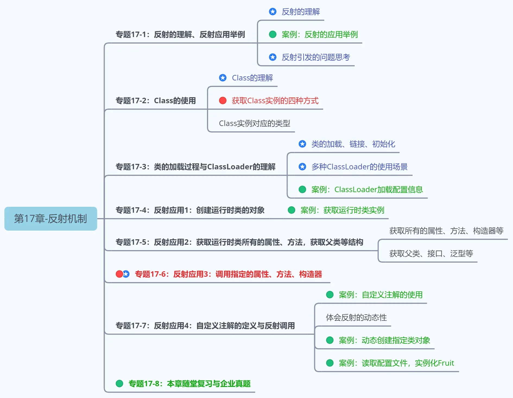
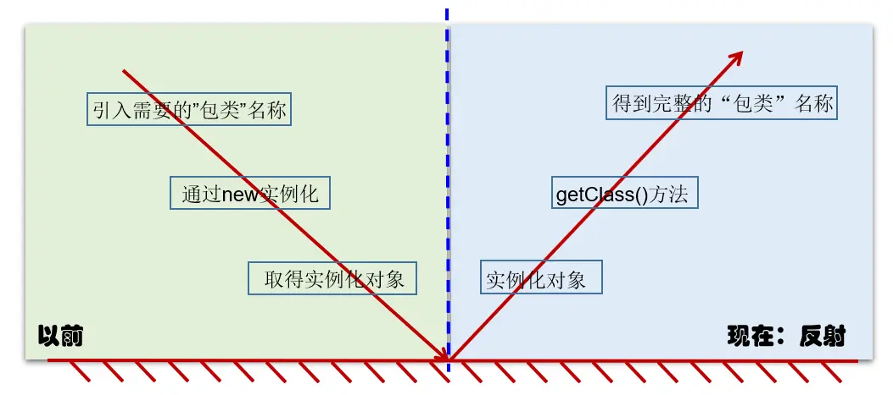
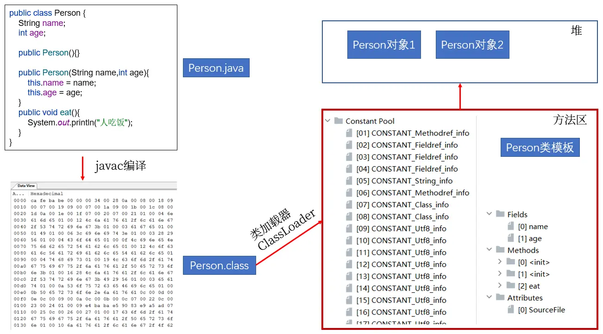
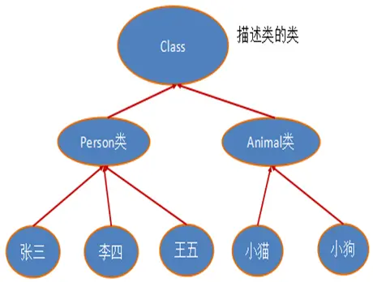
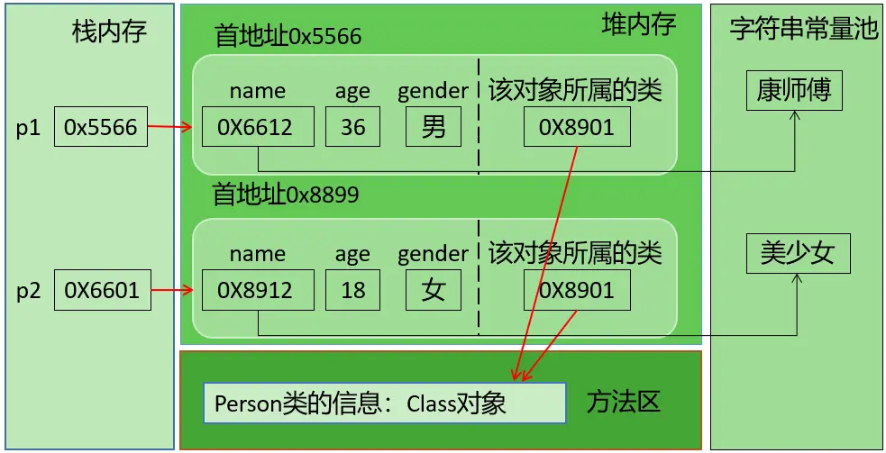

#  第 17 章_反射机制

讲师：尚硅谷-宋红康（江湖人称：康师傅）

官网：[http://www.atguigu.com](http://www.atguigu.com/)

***

## 本章专题与脉络



***

## 1. 反射(Reflection)的概念

### 1.1 反射的出现背景

Java 程序中，所有的对象都有两种类型：`编译时类型`和`运行时类型`，而很多时候对象的编译时类型和运行时类型`不一致`。 Object obj = new String("hello");    obj.getClass()

例如：某些变量或形参的声明类型是 Object 类型，但是程序却需要调用该对象运行时类型的方法，该方法不是 Object 中的方法，那么如何解决呢？

解决这个问题，有两种方案：

方案 1：在编译和运行时都完全知道类型的具体信息，在这种情况下，我们可以直接先使用`instanceof`运算符进行判断，再利用强制类型转换符将其转换成运行时类型的变量即可。

方案 2：编译时根本无法预知该对象和类的真实信息，程序只能依靠`运行时信息`来发现该对象和类的真实信息，这就必须使用反射。

### 1.2 反射概述

Reflection（反射）是被视为`动态语言`的关键，反射机制允许程序在`运行期间`借助于 Reflection API 取得任何类的内部信息，并能直接操作任意对象的内部属性及方法。

加载完类之后，在堆内存的方法区中就产生了一个 Class 类型的对象（一个类只有一个 Class 对象），这个对象就包含了完整的类的结构信息。我们可以通过这个对象看到类的结构。`这个对象就像一面镜子，透过这个镜子看到类的结构，所以，我们形象的称之为：反射。`



**从内存加载上看反射：**



### 1.3  Java 反射机制研究及应用

Java 反射机制提供的功能：

- 在运行时判断任意一个对象所属的类
- 在运行时构造任意一个类的对象
- 在运行时判断任意一个类所具有的成员变量和方法
- 在运行时获取泛型信息
- 在运行时调用任意一个对象的成员变量和方法
- 在运行时处理注解
- 生成动态代理

### 1.4 反射相关的主要 API

`java.lang.Class`：代表一个类
java.lang.reflect.Method：代表类的方法
java.lang.reflect.Field：代表类的成员变量
java.lang.reflect.Constructor：代表类的构造器
… …

### 1.5 反射的优缺点

**优点：**

- 提高了 Java 程序的灵活性和扩展性，`降低了耦合性`，提高`自适应`能力

- 允许程序创建和控制任何类的对象，无需提前`硬编码`目标类

**缺点：**

- 反射的`性能较低`。
  - 反射机制主要应用在对灵活性和扩展性要求很高的系统框架上

- 反射会`模糊`程序内部逻辑，`可读性较差`。

## 2.  理解 Class 类并获取 Class 实例

要想`解剖`一个类，必须先要获取到该类的 Class 对象。而剖析一个类或用反射解决具体的问题就是使用相关 API:

- java.lang.Class
- java.lang.reflect.*

所以，Class 对象是反射的根源。

### 2.1 理解 Class

#### 2.1.1 理论上

在 Object 类中定义了以下的方法，此方法将被所有子类继承：

```java
public final Class getClass()
```

以上的方法返回值的类型是一个 Class 类，此类是 Java 反射的源头，实际上所谓反射从程序的运行结果来看也很好理解，即：可以通过对象反射求出类的名称。



对象照镜子后可以得到的信息：某个类的属性、方法和构造器、某个类到底实现了哪些接口。对于每个类而言，JRE 都为其保留一个不变的 Class 类型的对象。一个 Class 对象包含了特定某个结构(class/interface/enum/annotation/primitive type/void/[])的有关信息。

- Class 本身也是一个类
- Class 对象只能由系统建立对象
- 一个加载的类在 JVM 中只会有一个 Class 实例 
- 一个 Class 对象对应的是一个加载到 JVM 中的一个.class 文件
- 每个类的实例都会记得自己是由哪个 Class 实例所生成
- 通过 Class 可以完整地得到一个类中的所有被加载的结构 
- Class 类是 Reflection 的根源，针对任何你想动态加载、运行的类，唯有先获得相应的 Class 对象

#### 2.1.2 内存结构上



说明：上图中字符串常量池在 JDK6 中存储在方法区；JDK7 及以后，存储在堆空间。

### 2.2 获取 Class 类的实例（四种方法）

方式 1：要求编译期间已知类型

前提：若已知具体的类，通过类的 class 属性获取，该方法最为安全可靠，程序性能最高

实例：

```java
Class clazz = String.class;
```

方式 2：获取对象的运行时类型

前提：已知某个类的实例，调用该实例的 getClass()方法获取 Class 对象

实例：

```java
Class clazz = "www.atguigu.com".getClass();
```

方式 3：可以获取编译期间未知的类型

前提：已知一个类的全类名，且该类在类路径下，可通过 Class 类的静态方法 forName()获取，可能抛出 ClassNotFoundException

实例：

```java
Class clazz = Class.forName("java.lang.String");
```

方式 4：其他方式（不做要求）

前提：可以用系统类加载对象或自定义加载器对象加载指定路径下的类型

实例：

```java
ClassLoader cl = this.getClass().getClassLoader();
Class clazz4 = cl.loadClass("类的全类名");
```

再举例：

```java
public class GetClassObject {
    @Test
    public void test01() throws ClassNotFoundException{
        Class c1 = GetClassObject.class;
        GetClassObject obj = new GetClassObject();
        Class c2 = obj.getClass();
        Class c3 = Class.forName("com.atguigu.classtype.GetClassObject");
        Class c4 = ClassLoader.getSystemClassLoader().loadClass("com.atguigu.classtype.GetClassObject");

        System.out.println("c1 = " + c1);
        System.out.println("c2 = " + c2);
        System.out.println("c3 = " + c3);
        System.out.println("c4 = " + c4);

        System.out.println(c1 == c2);
        System.out.println(c1 == c3);
        System.out.println(c1 == c4);
    }
}
```

### 2.3 哪些类型可以有 Class 对象

简言之，所有 Java 类型！

(1)class：外部类，成员（成员内部类，静态内部类），局部内部类，匿名内部类
(2)interface：接口
(3)[]：数组
(4)enum：枚举
(5)annotation：注解@interface
(6)primitive type：基本数据类型
(7)void

举例：

```java
Class c1 = Object.class;
Class c2 = Comparable.class;
Class c3 = String[].class;
Class c4 = int[][].class;
Class c5 = ElementType.class;
Class c6 = Override.class;
Class c7 = int.class;
Class c8 = void.class;
Class c9 = Class.class;

int[] a = new int[10];
int[] b = new int[100];
Class c10 = a.getClass();
Class c11 = b.getClass();
// 只要元素类型与维度一样，就是同一个Class
System.out.println(c10 == c11);
```

### 2.4 Class 类的常用方法

| **方法名**                                         | **功能说明**                                                 |
| -------------------------------------------------- | ------------------------------------------------------------ |
| `static  Class forName(String  name)`                | 返回指定类名  name  的  Class  对象                          |
| `Object  newInstance()` `                             | 调用缺省构造函数，返回该 Class 对象的一个实例                  |
| `getName()`                                          | 返回此 Class 对象所表示的实体（类、接口、数组类、基本类型或 void）名称 |
| `Class  getSuperClass()`                             | 返回当前 Class 对象的父类的 Class 对象                           |
| `Class  [] getInterfaces()`                          | 获取当前 Class 对象的接口                                      |
| `ClassLoader  getClassLoader()`                      | 返回该类的类加载器                                           |
| `Class  getSuperclass()`                             | 返回表示此 Class 所表示的实体的超类的 Class                     |
| `Constructor[]  getConstructors()`                   | 返回一个包含某些 Constructor 对象的数组                        |
| `Field[]  getDeclaredFields()`                       | 返回 Field 对象的一个数组                                      |
| `Method  getMethod(String  name,Class … paramTypes)` | 返回一个 Method 对象，此对象的形参类型为 paramType              |

举例：

```java
String str = "test4.Person";
Class clazz = Class.forName(str);

Object obj = clazz.newInstance();

Field field = clazz.getField("name");
field.set(obj, "Peter");
Object name = field.get(obj);
System.out.println(name);

//注：test4.Person是test4包下的Person类
```

## 3. 类的加载与 ClassLoader 的理解

### 3.1 类的生命周期

类在内存中完整的生命周期：加载-->使用-->卸载。其中加载过程又分为：装载、链接、初始化三个阶段。


### 3.2 类的加载过程

当程序主动使用某个类时，如果该类还未被加载到内存中，系统会通过加载、链接、初始化三个步骤来对该类进行初始化。如果没有意外，JVM 将会连续完成这三个步骤，所以有时也把这三个步骤统称为类加载。


类的加载又分为三个阶段：

(1)装载(Loading)

将类的 class 文件读入内存，并为之创建一个 java.lang.Class 对象。此过程由类加载器完成

(2)链接(Linking)

①验证 Verify：确保加载的类信息符合 JVM 规范，例如：以 cafebabe 开头，没有安全方面的问题。

②准备 Prepare：正式为类变量(static)分配内存并`设置类变量默认初始值`的阶段，这些内存都将在方法区中进行分配。

③解析 Resolve：虚拟机常量池内的符号引用（常量名）替换为直接引用（地址）的过程。

(3)初始化(Initialization)

- 执行`类构造器<clinit>()方法`的过程。`类构造器<clinit>()方法`是由编译期自动收集类中所有类变量的赋值动作和静态代码块中的语句合并产生的。（类构造器是构造类信息的，不是构造该类对象的构造器）。

- 当初始化一个类的时候，如果发现其父类还没有进行初始化，则需要先触发其父类的初始化。

- 虚拟机会保证一个`类的<clinit>()方法`在多线程环境中被正确加锁和同步。

### 3.3 类加载器（classloader)


#### 3.3.1 类加载器的作用

将 class 文件字节码内容加载到内存中，并将这些静态数据转换成方法区的运行时数据结构，然后在堆中生成一个代表这个类的 java.lang.Class 对象，作为方法区中类数据的访问入口。

类缓存：标准的 JavaSE 类加载器可以按要求查找类，但一旦某个类被加载到类加载器中，它将维持加载（缓存）一段时间。不过 JVM 垃圾回收机制可以回收这些 Class 对象。


#### 3.3.2 类加载器的分类（JDK8 为例）

JVM 支持两种类型的类加载器，分别为`引导类加载器（Bootstrap ClassLoader）`和`自定义类加载器（User-Defined ClassLoader）`。

从概念上来讲，自定义类加载器一般指的是程序中由开发人员自定义的一类类加载器，但是 Java 虚拟机规范却没有这么定义，而是将所有派生于抽象类 ClassLoader 的类加载器都划分为自定义类加载器。无论类加载器的类型如何划分，在程序中我们最常见的类加载器结构主要是如下情况：


**(1)启动类加载器（引导类加载器，Bootstrap ClassLoader）**

- 这个类加载使用`C/C++语言`实现的，嵌套在 JVM 内部。获取它的对象时往往返回 null
- 它用来加载 Java 的核心库（JAVA_HOME/jre/lib/rt.jar 或 sun.boot.class.path 路径下的内容）。用于提供 JVM 自身需要的类。
- 并不继承自 java.lang.ClassLoader，没有父加载器。
- 出于安全考虑，Bootstrap 启动类加载器只加载包名为 java、javax、sun 等开头的类
- 加载扩展类和应用程序类加载器，并指定为他们的父类加载器。

**(2)扩展类加载器(Extension ClassLoader)**

- Java 语言编写，由 sun.misc.Launcher$ExtClassLoader 实现。
- 继承于 ClassLoader 类
- 父类加载器为启动类加载器
- 从 java.ext.dirs 系统属性所指定的目录中加载类库，或从 JDK 的安装目录的 jre/lib/ext 子目录下加载类库。如果用户创建的 JAR 放在此目录下，也会自动由扩展类加载器加载。


**(3)应用程序类加载器（系统类加载器，AppClassLoader）**

- java 语言编写，由 sun.misc.Launcher$AppClassLoader 实现
- 继承于 ClassLoader 类
- 父类加载器为扩展类加载器
- 它负责加载环境变量 classpath 或系统属性 java.class.path 指定路径下的类库 
- 应用程序中的类加载器默认是系统类加载器。
- 它是用户自定义类加载器的默认父加载器
- 通过 ClassLoader 的 getSystemClassLoader()方法可以获取到该类加载器

**(4)用户自定义类加载器（了解）**

- 在 Java 的日常应用程序开发中，类的加载几乎是由上述 3 种类加载器相互配合执行的。在必要时，我们还可以自定义类加载器，来定制类的加载方式。
- 体现 Java 语言强大生命力和巨大魅力的关键因素之一便是，Java 开发者可以自定义类加载器来实现类库的动态加载，加载源可以是本地的 JAR 包，也可以是网络上的远程资源。
- 同时，自定义加载器能够实现`应用隔离`，例如 Tomcat，Spring 等中间件和组件框架都在内部实现了自定义的加载器，并通过自定义加载器隔离不同的组件模块。这种机制比 C/C++程序要好太多，想不修改 C/C++程序就能为其新增功能，几乎是不可能的，仅仅一个兼容性便能阻挡住所有美好的设想。
- 自定义类加载器通常需要继承于 ClassLoader。

#### 3.3.3 查看某个类的类加载器对象

(1)获取默认的系统类加载器

```java
ClassLoader classloader = ClassLoader.getSystemClassLoader();
```

(2)查看某个类是哪个类加载器加载的

```java
ClassLoader classloader = Class.forName("exer2.ClassloaderDemo").getClassLoader();

//如果是根加载器加载的类，则会得到null
ClassLoader classloader1 = Class.forName("java.lang.Object").getClassLoader();
```

(3)获取某个类加载器的父加载器

```java
ClassLoader parentClassloader = classloader.getParent();
```

示例代码：

```java
package com.atguigu.loader;

import org.junit.Test;

public class TestClassLoader {
    @Test
    public void test01(){
        ClassLoader systemClassLoader = ClassLoader.getSystemClassLoader();
        System.out.println("systemClassLoader = " + systemClassLoader);
    }

    @Test
    public void test02()throws Exception{
        ClassLoader c1 = String.class.getClassLoader();
        System.out.println("加载String类的类加载器：" + c1);

        ClassLoader c2 = Class.forName("sun.util.resources.cldr.zh.TimeZoneNames_zh").getClassLoader();
        System.out.println("加载sun.util.resources.cldr.zh.TimeZoneNames_zh类的类加载器：" + c2);

        ClassLoader c3 = TestClassLoader.class.getClassLoader();
        System.out.println("加载当前类的类加载器：" + c3);
    }

    @Test
    public void test03(){
        ClassLoader c1 = TestClassLoader.class.getClassLoader();
        System.out.println("加载当前类的类加载器c1=" + c1);

        ClassLoader c2 = c1.getParent();
        System.out.println("c1.parent = " + c2);

        ClassLoader c3 = c2.getParent();
        System.out.println("c2.parent = " + c3);

    }
}
```

#### 3.3.4 使用 ClassLoader 获取流

关于类加载器的一个主要方法：getResourceAsStream(String str):获取类路径下的指定文件的输入流

```java

InputStream in = null;
in = this.getClass().getClassLoader().getResourceAsStream("exer2\\test.properties");
System.out.println(in);

```

举例：

```java
//需要掌握如下的代码
    @Test
    public void test5() throws IOException {
        Properties pros = new Properties();
        //方式1：此时默认的相对路径是当前的module
//        FileInputStream is = new FileInputStream("info.properties");
//        FileInputStream is = new FileInputStream("src//info1.properties");

        //方式2：使用类的加载器
        //此时默认的相对路径是当前module的src目录
        InputStream is = ClassLoader.getSystemClassLoader().getResourceAsStream("info1.properties");


        pros.load(is);

        //获取配置文件中的信息
        String name = pros.getProperty("name");
        String password = pros.getProperty("password");
        System.out.println("name = " + name + ", password = " + password);
    }
```

## 4. 反射的基本应用

有了 Class 对象，能做什么？

### 4.1 应用 1：创建运行时类的对象

这是反射机制应用最多的地方。创建运行时类的对象有两种方式：

**方式 1：直接调用 Class 对象的 newInstance()方法**

要 求： 1）类必须有一个无参数的构造器。2）类的构造器的访问权限需要足够。

**方式 2：通过获取构造器对象来进行实例化**

方式一的步骤：

1）获取该类型的 Class 对象  2）调用 Class 对象的 newInstance()方法创建对象

方式二的步骤：

1）通过 Class 类的 getDeclaredConstructor(Class … parameterTypes)取得本类的指定形参类型的构造器
2）向构造器的形参中传递一个对象数组进去，里面包含了构造器中所需的各个参数。
3）通过 Constructor 实例化对象。

> 如果构造器的权限修饰符修饰的范围不可见，也可以调用 setAccessible(true)

示例代码：

```java
package com.atguigu.reflect;

import org.junit.Test;

import java.lang.reflect.Constructor;

public class TestCreateObject {
    @Test
    public void test1() throws Exception{
//        AtGuiguClass obj = new AtGuiguClass();//编译期间无法创建

        Class<?> clazz = Class.forName("com.atguigu.ext.demo.AtGuiguClass");
        //clazz代表com.atguigu.ext.demo.AtGuiguClass类型
        //clazz.newInstance()创建的就是AtGuiguClass的对象
        Object obj = clazz.newInstance();
        System.out.println(obj);
    }

    @Test
    public void test2()throws Exception{
        Class<?> clazz = Class.forName("com.atguigu.ext.demo.AtGuiguDemo");
        //java.lang.InstantiationException: com.atguigu.ext.demo.AtGuiguDemo
        //Caused by: java.lang.NoSuchMethodException: com.atguigu.ext.demo.AtGuiguDemo.<init>()
        //即说明AtGuiguDemo没有无参构造，就没有无参实例初始化方法<init>
        Object stu = clazz.newInstance();
        System.out.println(stu);
    }

    @Test
    public void test3()throws Exception{
        //(1)获取Class对象
        Class<?> clazz = Class.forName("com.atguigu.ext.demo.AtGuiguDemo");
        /*
         * 获取AtGuiguDemo类型中的有参构造
         * 如果构造器有多个，我们通常是根据形参【类型】列表来获取指定的一个构造器的
         * 例如：public AtGuiguDemo(String title, int num)
         */
        //(2)获取构造器对象
        Constructor<?> constructor = clazz.getDeclaredConstructor(String.class,int.class);

        //(3)创建实例对象
        // T newInstance(Object... initargs)  这个Object...是在创建对象时，给有参构造的实参列表
        Object obj = constructor.newInstance("尚硅谷",2022);
        System.out.println(obj);
    }
}
```

### 4.2 应用 2：获取运行时类的完整结构

可以获取：包、修饰符、类型名、父类（包括泛型父类）、父接口（包括泛型父接口）、成员（属性、构造器、方法）、注解（类上的、方法上的、属性上的）。

#### 4.2.1 相关 API

```java
//1.实现的全部接口
public Class<?>[] getInterfaces()   
//确定此对象所表示的类或接口实现的接口。 

//2.所继承的父类
public Class<? Super T> getSuperclass()
//返回表示此 Class 所表示的实体（类、接口、基本类型）的父类的 Class。

//3.全部的构造器
public Constructor<T>[] getConstructors()
//返回此 Class 对象所表示的类的所有public构造方法。
public Constructor<T>[] getDeclaredConstructors()
//返回此 Class 对象表示的类声明的所有构造方法。

//Constructor类中：
//取得修饰符: 
public int getModifiers();
//取得方法名称: 
public String getName();
//取得参数的类型：
public Class<?>[] getParameterTypes();

//4.全部的方法
public Method[] getDeclaredMethods()
//返回此Class对象所表示的类或接口的全部方法
public Method[] getMethods()  
//返回此Class对象所表示的类或接口的public的方法

//Method类中：
public Class<?> getReturnType()
//取得全部的返回值
public Class<?>[] getParameterTypes()
//取得全部的参数
public int getModifiers()
//取得修饰符
public Class<?>[] getExceptionTypes()
//取得异常信息

//5.全部的Field
public Field[] getFields() 
//返回此Class对象所表示的类或接口的public的Field。
public Field[] getDeclaredFields() 
//返回此Class对象所表示的类或接口的全部Field。

//Field方法中：
public int getModifiers()
//以整数形式返回此Field的修饰符
public Class<?> getType()  
//得到Field的属性类型
public String getName()  
//返回Field的名称。

//6. Annotation相关
get Annotation(Class<T> annotationClass) 
getDeclaredAnnotations() 

//7.泛型相关
//获取父类泛型类型：
Type getGenericSuperclass()
//泛型类型：ParameterizedType
//获取实际的泛型类型参数数组：
getActualTypeArguments()

//8.类所在的包
Package getPackage() 
```

#### 4.2.2 获取所有的属性及相关细节

```java
package com.atguigu.java2;

import java.lang.reflect.Field;
import java.lang.reflect.Modifier;

import org.junit.Test;

import com.atguigu.java1.Person;

public class FieldTest {
	
	@Test
	public void test1(){
		
		Class clazz = Person.class;
		//getFields():获取到运行时类本身及其所有的父类中声明为public权限的属性
//		Field[] fields = clazz.getFields();
//
//		for(Field f : fields){
//			System.out.println(f);
//		}
		
		//getDeclaredFields():获取当前运行时类中声明的所有属性
		Field[] declaredFields = clazz.getDeclaredFields();
		for(Field f : declaredFields){
			System.out.println(f);
		}
	}
	
	//权限修饰符  变量类型  变量名
	@Test
	public void test2(){
		Class clazz = Person.class;
        Field[] declaredFields = clazz.getDeclaredFields();
        for(Field f : declaredFields){
            //1.权限修饰符
            /*
         	* 0x是十六进制
         	* PUBLIC           = 0x00000001;  1    1
         	* PRIVATE          = 0x00000002;  2	10
         	* PROTECTED        = 0x00000004;  4	100
         	* STATIC           = 0x00000008;  8	1000
         	* FINAL            = 0x00000010;  16	10000
         	* ...
         	*
         	* 设计的理念，就是用二进制的某一位是1，来代表一种修饰符，整个二进制中只有一位是1，其余都是0
         	*
         	* mod = 17          0x00000011
         	* if ((mod & PUBLIC) != 0)  说明修饰符中有public
         	* if ((mod & FINAL) != 0)   说明修饰符中有final
         	*/
            int modifier = f.getModifiers();
            System.out.print(Modifier.toString(modifier) + "\t");

//            //2.数据类型
            Class type = f.getType();
            System.out.print(type.getName() + "\t");
//
//            //3.变量名
            String fName = f.getName();
            System.out.print(fName);
//
            System.out.println();
        }
	}
}

```

#### 4.2.3 获取所有的方法及相关细节

```java
package com.atguigu.java2;

import java.lang.annotation.Annotation;
import java.lang.reflect.Method;
import java.lang.reflect.Modifier;

import org.junit.Test;

import com.atguigu.java1.Person;

public class MethodTest {

	@Test
	public void test1() {

		Class clazz = Person.class;
		// getMethods():获取到运行时类本身及其所有的父类中声明为public权限的方法
		// Method[] methods = clazz.getMethods();
		//
		// for(Method m : methods){
		// System.out.println(m);
		// }

		// getDeclaredMethods():获取当前运行时类中声明的所有方法
		Method[] declaredMethods = clazz.getDeclaredMethods();
		for (Method m : declaredMethods) {
			System.out.println(m);
		}
		//
	}

	// 注解信息
	// 权限修饰符 返回值类型 方法名(形参类型1 参数1,形参类型2 参数2,...) throws 异常类型1,...{}
	@Test
	public void test2() {
		Class clazz = Person.class;
		Method[] declaredMethods = clazz.getDeclaredMethods();
		for (Method m : declaredMethods) {
			// 1.获取方法声明的注解
			Annotation[] annos = m.getAnnotations();
			for (Annotation a : annos) {
				System.out.println(a);
			}

			// 2.权限修饰符
			System.out.print(Modifier.toString(m.getModifiers()) + "\t");

			// 3.返回值类型
			System.out.print(m.getReturnType().getName() + "\t");

			// 4.方法名
			System.out.print(m.getName());
			System.out.print("(");
			// 5.形参列表
			Class[] parameterTypes = m.getParameterTypes();
			if (!(parameterTypes == null && parameterTypes.length == 0)) {
				for (int i = 0; i < parameterTypes.length; i++) {

					if (i == parameterTypes.length - 1) {
						System.out.print(parameterTypes[i].getName() + " args_" + i);
						break;
					}

					System.out.print(parameterTypes[i].getName() + " args_" + i + ",");
				}
			}

			System.out.print(")");

			// 6.抛出的异常
			Class[] exceptionTypes = m.getExceptionTypes();
			if (exceptionTypes.length > 0) {
				System.out.print("throws ");
				for (int i = 0; i < exceptionTypes.length; i++) {
					if (i == exceptionTypes.length - 1) {
						System.out.print(exceptionTypes[i].getName());
						break;
					}
					System.out.print(exceptionTypes[i].getName() + ",");
				}
			}
			System.out.println();
		}
	}
}

```

#### 4.2.4 获取其他结构（构造器、父类、接口、包、注解等）

```java
package com.atguigu.java2;

import com.atguigu.java1.Person;
import org.junit.Test;

import java.lang.annotation.Annotation;
import java.lang.reflect.Constructor;
import java.lang.reflect.ParameterizedType;
import java.lang.reflect.Type;

/**
 * @author 尚硅谷-宋红康
 * @create 2020 下午 2:47
 */
public class OtherTest {

    /*
    	获取当前类中的所有的构造器
     */
    @Test
    public void test1(){
        Class clazz = Person.class;
        Constructor[] cons = clazz.getDeclaredConstructors();
        for(Constructor c :cons){
            System.out.println(c);
        }
    }
    /*
    	获取运行时类的父类
     */
    @Test
    public void test2(){
        Class clazz = Person.class;
        Class superclass = clazz.getSuperclass();
        System.out.println(superclass);//class com.atguigu.java1.Creature
    }
    /*
    	获取运行时类的所在的包
     */
    @Test
    public void test3(){
        Class clazz = Person.class;
        Package pack = clazz.getPackage();
        System.out.println(pack);

    }
    /*
    	获取运行时类的注解
     */
    @Test
    public void test4(){
        Class clazz = Person.class;
        Annotation[] annos = clazz.getAnnotations();
        for (Annotation anno : annos) {

            System.out.println(anno);
        }

    }

    /*
    	获取运行时类所实现的接口
     */
    @Test
    public void test5(){
        Class clazz = Person.class;
        Class[] interfaces = clazz.getInterfaces();
        for (Class anInterface : interfaces) {

            System.out.println(anInterface);
        }

    }
    /*
    	获取运行时类的带泛型的父类
     */
    @Test
    public void test6(){
        Class clazz = Person.class;
        Type genericSuperclass = clazz.getGenericSuperclass();
        System.out.println(genericSuperclass);//com.atguigu.java1.Creature<java.lang.String>
    }
}

```

#### 4.2.5 获取泛型父类信息（选讲）

示例代码获取泛型父类信息：

```java
/* Type：
 * （1）Class
 * （2）ParameterizedType   
 * 		例如：Father<String,Integer>
 * 			ArrayList<String>
 * （3）TypeVariable
 * 		例如：T，U,E,K,V
 * （4）WildcardType
 * 		例如：
 * 		ArrayList<?>
 * 		ArrayList<? super 下限>
 * 		ArrayList<? extends 上限>
 * （5）GenericArrayType
 * 		例如：T[]
 * 	
 */
public class TestGeneric {
	public static void main(String[] args) {
		//需求：在运行时，获取Son类型的泛型父类的泛型实参<String,Integer>
		
		//（1）还是先获取Class对象
		Class clazz = Son.class;//四种形式任意一种都可以
		
		//（2）获取泛型父类
//		Class sc = clazz.getSuperclass();
//		System.out.println(sc);
		/*
		 * getSuperclass()只能得到父类名，无法得到父类的泛型实参列表
		 */
		Type type = clazz.getGenericSuperclass();
		
		// Father<String,Integer>属于ParameterizedType
		ParameterizedType pt = (ParameterizedType) type;
		
		//（3）获取泛型父类的泛型实参列表
		Type[] typeArray = pt.getActualTypeArguments();
		for (Type type2 : typeArray) {
			System.out.println(type2);
		}
	}
}
//泛型形参：<T,U>
class Father<T,U>{
	
}
//泛型实参：<String,Integer>
class Son extends Father<String,Integer>{
	
}
```

#### 4.2.6 获取内部类或外部类信息（选讲）

public Class<?>[] getClasses()：返回所有公共内部类和内部接口。包括从超类继承的公共类和接口成员以及该类声明的公共类和接口成员。

public Class<?>[] getDeclaredClasses()：返回 Class 对象的一个数组，这些对象反映声明为此 Class 对象所表示的类的成员的所有类和接口。包括该类所声明的公共、保护、默认（包）访问及私有类和接口，但不包括继承的类和接口。

public Class<?> getDeclaringClass()：如果此 Class 对象所表示的类或接口是一个内部类或内部接口，则返回它的外部类或外部接口，否则返回 null。

Class<?> getEnclosingClass() ：返回某个内部类的外部类

```java
	@Test
	public void test5(){
		Class<?> clazz = Map.class;
		Class<?>[] inners = clazz.getDeclaredClasses();
		for (Class<?> inner : inners) {
			System.out.println(inner);
		}
		
		Class<?> ec = Map.Entry.class;
		Class<?> outer = ec.getDeclaringClass();
		System.out.println(outer);
	}
```


#### 4.2.7 小 结

1. 在实际的操作中，取得类的信息的操作代码，并不会经常开发。

2. 一定要熟悉 java.lang.reflect 包的作用，反射机制。

### 4.3 应用 3：调用运行时类的指定结构

#### 4.3.1 调用指定的属性

在反射机制中，可以直接通过 Field 类操作类中的属性，通过 Field 类提供的 set() 和 get() 方法就可以完成设置和取得属性内容的操作。

(1)获取该类型的 Class 对象

Class clazz = Class.forName("包.类名");

(2)获取属性对象

Field field = clazz.getDeclaredField("属性名");

(3)如果属性的权限修饰符不是 public，那么需要设置属性可访问

field.setAccessible(true);

(4)创建实例对象：如果操作的是非静态属性，需要创建实例对象

Object obj = clazz.newInstance(); //有公共的无参构造

Object obj = 构造器对象.newInstance(实参...);//通过特定构造器对象创建实例对象

(4)设置指定对象 obj 上此 Field 的属性内容

field.set(obj,"属性值");

> 如果操作静态变量，那么实例对象可以省略，用 null 表示

(5)取得指定对象 obj 上此 Field 的属性内容

Object value = field.get(obj);

> 如果操作静态变量，那么实例对象可以省略，用 null 表示

示例代码：

```java
package com.atguigu.reflect;

public class Student {
    private int id;
    private String name;

    public int getId() {
        return id;
    }

    public void setId(int id) {
        this.id = id;
    }

    public String getName() {
        return name;
    }

    public void setName(String name) {
        this.name = name;
    }

    @Override
    public String toString() {
        return "Student{" +
                "id=" + id +
                ", name='" + name + '\'' +
                '}';
    }
}

```

```java
package com.atguigu.reflect;

import java.lang.reflect.Field;

public class TestField {
    public static void main(String[] args)throws Exception {
        //1、获取Student的Class对象
        Class clazz = Class.forName("com.atguigu.reflect.Student");

        //2、获取属性对象，例如：id属性
        Field idField = clazz.getDeclaredField("id");

        //3、如果id是私有的等在当前类中不可访问access的，我们需要做如下操作
        idField.setAccessible(true);

        //4、创建实例对象，即，创建Student对象
        Object stu = clazz.newInstance();

        //5、获取属性值
        /*
         * 以前：int 变量= 学生对象.getId()
         * 现在：Object id属性对象.get(学生对象)
         */
        Object value = idField.get(stu);
        System.out.println("id = "+ value);

        //6、设置属性值
        /*
         * 以前：学生对象.setId(值)
         * 现在：id属性对象.set(学生对象,值)
         */
        idField.set(stu, 2);

        value = idField.get(stu);
        System.out.println("id = "+ value);
    }
}
```

**关于 setAccessible 方法的使用：**

- Method 和 Field、Constructor 对象都有 setAccessible()方法。
- setAccessible 启动和禁用访问安全检查的开关。
- 参数值为 true 则指示反射的对象在使用时应该取消 Java 语言访问检查。
  - 提高反射的效率。如果代码中必须用反射，而该句代码需要频繁的被调用，那么请设置为 true。
  - 使得原本无法访问的私有成员也可以访问
- 参数值为 false 则指示反射的对象应该实施 Java 语言访问检查。

#### 4.3.2 调用指定的方法


(1)获取该类型的 Class 对象

Class clazz = Class.forName("包.类名");

(2)获取方法对象

Method method = clazz.getDeclaredMethod("方法名",方法的形参类型列表);

(3)创建实例对象

Object obj = clazz.newInstance();

(4)调用方法

Object result = method.invoke(obj, 方法的实参值列表);

> 如果方法的权限修饰符修饰的范围不可见，也可以调用 setAccessible(true)
>
> 如果方法是静态方法，实例对象也可以省略，用 null 代替

示例代码：

```java
package com.atguigu.reflect;

import org.junit.Test;

import java.lang.reflect.Method;

public class TestMethod {
    @Test
    public void test()throws Exception {
        // 1、获取Student的Class对象
        Class<?> clazz = Class.forName("com.atguigu.reflect.Student");

        //2、获取方法对象
        /*
         * 在一个类中，唯一定位到一个方法，需要：（1）方法名（2）形参列表，因为方法可能重载
         *
         * 例如：void setName(String name)
         */
        Method setNameMethod = clazz.getDeclaredMethod("setName", String.class);

        //3、创建实例对象
        Object stu = clazz.newInstance();

        //4、调用方法
        /*
         * 以前：学生对象.setName(值)
         * 现在：方法对象.invoke(学生对象，值)
         */
        Object setNameMethodReturnValue = setNameMethod.invoke(stu, "张三");

        System.out.println("stu = " + stu);
        //setName方法返回值类型void，没有返回值，所以setNameMethodReturnValue为null
        System.out.println("setNameMethodReturnValue = " + setNameMethodReturnValue);

        Method getNameMethod = clazz.getDeclaredMethod("getName");
        Object getNameMethodReturnValue = getNameMethod.invoke(stu);
        //getName方法返回值类型String，有返回值，getNameMethod.invoke的返回值就是getName方法的返回值
        System.out.println("getNameMethodReturnValue = " + getNameMethodReturnValue);//张三
    }

    @Test
    public void test02()throws Exception{
        Class<?> clazz = Class.forName("com.atguigu.ext.demo.AtGuiguClass");
        Method printInfoMethod = clazz.getMethod("printInfo", String.class);
        //printInfo方法是静态方法
        printInfoMethod.invoke(null,"尚硅谷");
    }
}

```

#### 4.3.3 练习

读取 user.properties 文件中的数据，通过反射完成 User 类对象的创建及对应方法的调用。

配置文件：user.properties

```
className:com.atguigu.bean.User
methodName:show
```

User.java 文件：

```java
package com.atguigu.bean;

/**
 * @author 尚硅谷-宋红康
 * @create 18:41
 */
public class User {
    private String name;

    public User() {
    }

    public User(String name) {
        this.name = name;
    }

    public void show(){
        System.out.println("我是一个脉脉平台的用户");
    }
}
```

ReflectTest.java 文件：

```java
package com.atguigu.java4;

import org.junit.Test;

import java.io.IOException;
import java.io.InputStream;
import java.lang.reflect.Method;
import java.util.Properties;

/**
 * @author 尚硅谷-宋红康
 * @create 18:43
 */
public class ReflectTest {
    @Test
    public void test() throws Exception {
        //1.创建Properties对象
        Properties pro = new Properties();

        //2.加载配置文件，转换为一个集合
        ClassLoader classLoader = ClassLoader.getSystemClassLoader();
        InputStream is = classLoader.getResourceAsStream("user.properties");
        pro.load(is);

        //3.获取配置文件中定义的数据
        String className = pro.getProperty("className");
        String methodName = pro.getProperty("methodName");

        //4.加载该类进内存
        Class clazz = Class.forName(className);

        //5.创建对象
        Object instance = clazz.newInstance();

        //6.获取方法对象
        Method showMethod = clazz.getMethod(methodName);

        //7.执行方法
        showMethod.invoke(instance);
    }
}

```


## 5. 应用 4：读取注解信息

一个完整的注解应该包含三个部分：
(1)声明
(2)使用
(3)读取

### 5.1 声明自定义注解

```java
package com.atguigu.annotation;

import java.lang.annotation.*;

@Inherited
@Target(ElementType.TYPE)
@Retention(RetentionPolicy.RUNTIME)
public @interface Table {
    String value();
}
```

```java
package com.atguigu.annotation;

import java.lang.annotation.*;

@Inherited
@Target(ElementType.FIELD)
@Retention(RetentionPolicy.RUNTIME)
public @interface Column {
    String columnName();
    String columnType();
}
```

* 自定义注解可以通过四个元注解@Retention,@Target，@Inherited,@Documented，分别说明它的声明周期，使用位置，是否被继承，是否被生成到 API 文档中。
* Annotation 的成员在 Annotation 定义中以无参数有返回值的抽象方法的形式来声明，我们又称为配置参数。返回值类型只能是八种基本数据类型、String 类型、Class 类型、enum 类型、Annotation 类型、以上所有类型的数组
* 可以使用 default 关键字为抽象方法指定默认返回值
* 如果定义的注解含有抽象方法，那么使用时必须指定返回值，除非它有默认值。格式是“方法名 = 返回值”，如果只有一个抽象方法需要赋值，且方法名为 value，可以省略“value=”，所以如果注解只有一个抽象方法成员，建议使用方法名 value。

### 5.2 使用自定义注解

```java
package com.atguigu.annotation;

@Table("t_stu")
public class Student {
    @Column(columnName = "sid",columnType = "int")
    private int id;
    @Column(columnName = "sname",columnType = "varchar(20)")
    private String name;

    public int getId() {
        return id;
    }

    public void setId(int id) {
        this.id = id;
    }

    public String getName() {
        return name;
    }

    public void setName(String name) {
        this.name = name;
    }

    @Override
    public String toString() {
        return "Student{" +
                "id=" + id +
                ", name='" + name + '\'' +
                '}';
    }
}

```

### 5.3 读取和处理自定义注解

自定义注解必须配上注解的信息处理流程才有意义。

我们自己定义的注解，只能使用反射的代码读取。所以自定义注解的声明周期必须是 RetentionPolicy.RUNTIME。

```java
package com.atguigu.annotation;

import java.lang.reflect.Field;

public class TestAnnotation {
    public static void main(String[] args) {
        Class studentClass = Student.class;
        Table tableAnnotation = (Table) studentClass.getAnnotation(Table.class);
        String tableName = "";
        if(tableAnnotation != null){
            tableName = tableAnnotation.value();
        }

        Field[] declaredFields = studentClass.getDeclaredFields();
        String[] columns = new String[declaredFields.length];
        int index = 0;
        for (Field declaredField : declaredFields) {
            Column column = declaredField.getAnnotation(Column.class);
            if(column!= null) {
                columns[index++] = column.columnName();
            }
        }
        
        String sql = "select ";
        for (int i=0; i<index; i++) {
            sql += columns[i];
            if(i<index-1){
                sql += ",";
            }
        }
        sql += " from " + tableName;
        System.out.println("sql = " + sql);
    }
}

```

## 6. 体会反射的动态性

**体会 1：**

```java
public class ReflectionTest {

    //体会反射的动态性：动态的创建给定字符串对应的类的对象
    public <T> T getInstance(String className) throws Exception {

        Class clazz = Class.forName(className);

        Constructor constructor = clazz.getDeclaredConstructor();
        constructor.setAccessible(true);
        return (T) constructor.newInstance();

    }

    @Test
    public void test1() throws Exception {
        String className = "com.atguigu.java1.Person";
        Person p1 = getInstance(className);
        System.out.println(p1);
    }
}
```

**体会 2：**

```java
public class ReflectionTest {
    //体会反射的动态性：动态的创建指定字符串对应类的对象，并调用指定的方法
    public Object  invoke(String className,String methodName) throws Exception {
        Class clazz = Class.forName(className);
        Constructor constructor = clazz.getDeclaredConstructor();
        constructor.setAccessible(true);
        //动态的创建指定字符串对应类的对象
        Object obj = constructor.newInstance();

        Method method = clazz.getDeclaredMethod(methodName);
        method.setAccessible(true);
        return method.invoke(obj);
    }

    @Test
    public void test2() throws Exception {
        String info = (String) invoke("com.atguigu.java1.Person", "show");

        System.out.println("返回值为：" + info);

    }
}
```

**体会 3：**

```java
public class ReflectionTest {
	@Test
    public void test1() throws Exception {
        //1.加载配置文件，并获取指定的fruitName值
        Properties pros = new Properties();
        InputStream is = ClassLoader.getSystemClassLoader().getResourceAsStream("config.properties");
        pros.load(is);
        String fruitStr = pros.getProperty("fruitName");
        //2.创建指定全类名对应类的实例
        Class clazz = Class.forName(fruitStr);
        Constructor constructor = clazz.getDeclaredConstructor();
        constructor.setAccessible(true);
        Fruit fruit = (Fruit) constructor.newInstance();
        //3. 调用相关方法，进行测试
        Juicer juicer = new Juicer();
        juicer.run(fruit);

    }

}

interface Fruit {
	public void squeeze();
}

class Apple implements Fruit {
	public void squeeze() {
		System.out.println("榨出一杯苹果汁儿");
	}
}

class Orange implements Fruit {
	public void squeeze() {
		System.out.println("榨出一杯桔子汁儿");
	}
}

class Juicer {
	public void run(Fruit f) {
		f.squeeze();
	}
}

```

其中，配置文件【config.properties】存放在当前 Module 的 src 下

```
com.atguigu.java1.Orange
```

