# 第 04 章_运算符

讲师：尚硅谷-宋红康（江湖人称：康师傅）

官网：[http://www.atguigu.com](http://www.atguigu.com/)

***

## 1. 算术运算符

算术运算符主要用于数学运算，其可以连接运算符前后的两个数值或表达式，对数值或表达式进行加(+)、减(-)、乘(*)、除(/)和取模(%)运算。

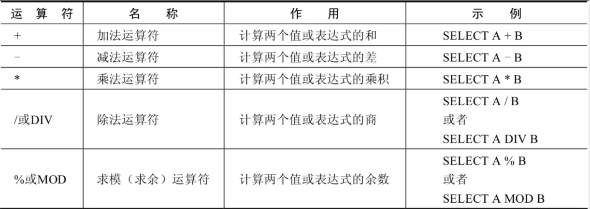

**1．加法与减法运算符**

```sql
mysql> SELECT 100, 100 + 0, 100 - 0, 100 + 50, 100 + 50 -30, 100 + 35.5, 100 - 35.5 FROM dual;
+-----+---------+---------+----------+--------------+------------+------------+
| 100 | 100 + 0 | 100 - 0 | 100 + 50 | 100 + 50 -30 | 100 + 35.5 | 100 - 35.5 |
+-----+---------+---------+----------+--------------+------------+------------+
| 100 |     100 |     100 |      150 |          120 |      135.5 |       64.5 |
+-----+---------+---------+----------+--------------+------------+------------+
1 row in set (0.00 sec)
```

由运算结果可以得出如下结论：
> - 一个整数类型的值对整数进行加法和减法操作，结果还是一个整数；
> - 一个整数类型的值对浮点数进行加法和减法操作，结果是一个浮点数；
> - 加法和减法的优先级相同，进行先加后减操作与进行先减后加操作的结果是一样的；
> - 在 Java 中，+的左右两边如果有字符串，那么表示字符串的拼接。但是**在 MySQL 中+只表示数值相加**。如果遇到非数值类型，先尝试转成数值（隐式转换），如果转失败，就按 0 计算。（补充：MySQL 中字符串拼接要使用字符串函数 CONCAT()实现）

**2．乘法与除法运算符**

```sql
mysql> SELECT 100, 100 * 1, 100 * 1.0, 100 / 1.0, 100 / 2,100 + 2 * 5 / 2,100 /3, 100 DIV 0 FROM dual;
+-----+---------+-----------+-----------+---------+-----------------+---------+-----------+
| 100 | 100 * 1 | 100 * 1.0 | 100 / 1.0 | 100 / 2 | 100 + 2 * 5 / 2 | 100 /3  | 100 DIV 0 |
+-----+---------+-----------+-----------+---------+-----------------+---------+-----------+
| 100 |     100 |     100.0 |  100.0000 | 50.0000 |        105.0000 | 33.3333 |      NULL |
+-----+---------+-----------+-----------+---------+-----------------+---------+-----------+
1 row in set (0.00 sec)
```

```sql
#计算出员工的年基本工资
SELECT employee_id,salary,salary * 12 annual_sal 
FROM employees;
```

由运算结果可以得出如下结论：

> - 一个数乘以整数 1 和除以整数 1 后仍得原数；
> - 一个数乘以浮点数 1 和除以浮点数 1 后变成浮点数，数值与原数相等；
> - 一个数除以整数后，不管是否能除尽，结果都为一个浮点数；
> - 一个数除以另一个数，除不尽时，结果为一个浮点数，并保留到小数点后 4 位；
> - 乘法和除法的优先级相同，进行先乘后除操作与先除后乘操作，得出的结果相同。
> - 在数学运算中，0 不能用作除数，在 MySQL 中，一个数除以 0 为 NULL。

**3．求模（求余）运算符**

将 t22 表中的字段 i 对 3 和 5 进行求模（求余）运算。

```sql
mysql> SELECT 12 % 3, 12 MOD 5 FROM dual;
+--------+----------+
| 12 % 3 | 12 MOD 5 |
+--------+----------+
|      0 |        2 |
+--------+----------+
1 row in set (0.00 sec)
```

```sql
#筛选出employee_id是偶数的员工
SELECT * FROM employees
WHERE employee_id MOD 2 = 0;
```

可以看到，100 对 3 求模后的结果为 3，对 5 求模后的结果为 0。

## 2. 比较运算符

比较运算符用来对表达式左边的操作数和右边的操作数进行比较，比较的结果为真则返回 1，比较的结果为假则返回 0，其他情况则返回 NULL。

比较运算符经常被用来作为 SELECT 查询语句的条件来使用，返回符合条件的结果记录。

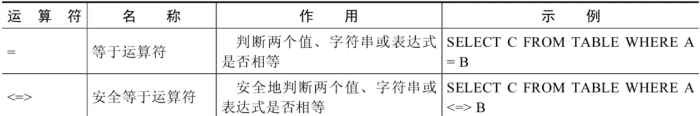

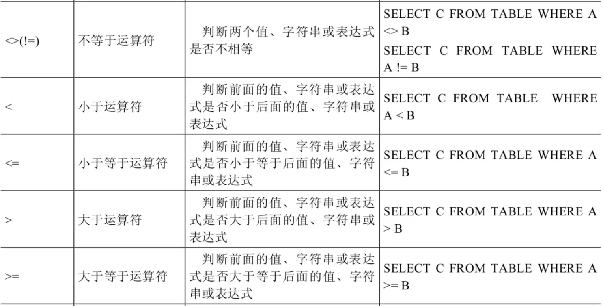

**1．等号运算符**

- 等号运算符(=)判断等号两边的值、字符串或表达式是否相等，如果相等则返回 1，不相等则返回 0。

- 在使用等号运算符时，遵循如下规则：
  - 如果`等号两边的值、字符串或表达式都为字符串`，则 MySQL 会**按照字符串进行比较**，其比较的是每个字符串中字符的 ANSI 编码是否相等。
  - 如果`等号两边的值都是整数`，则 MySQL 会按**照整数来比较两个值的大小**。
  - 如果`等号两边的值一个是整数，另一个是字符串`，则 MySQL 会**将字符串转化为数字进行比较**。
  - 如果`等号两边的值、字符串或表达式中有一个为 NULL`，则**比较结果为 NULL**。

- 对比：SQL 中赋值符号使用 `:=`

```sql
mysql> SELECT 1 = 1, 1 = '1', 1 = 0, 'a' = 'a', (5 + 3) = (2 + 6), '' = NULL , NULL = NULL; 
+-------+---------+-------+-----------+-------------------+-----------+-------------+
| 1 = 1 | 1 = '1' | 1 = 0 | 'a' = 'a' | (5 + 3) = (2 + 6) | '' = NULL | NULL = NULL |
+-------+---------+-------+-----------+-------------------+-----------+-------------+
|    1  |     1   |   0   |      1    |             1     |    NULL   |        NULL  |
+-------+---------+-------+-----------+-------------------+-----------+-------------+
1 row in set (0.00 sec)
```

```sql
mysql> SELECT 1 = 2, 0 = 'abc', 1 = 'abc' FROM dual;
+-------+-----------+-----------+
| 1 = 2 | 0 = 'abc' | 1 = 'abc' |
+-------+-----------+-----------+
|     0 |         1 |         0 |
+-------+-----------+-----------+
1 row in set, 2 warnings (0.00 sec)
```

```sql
#查询salary=10000，注意在Java中比较是==
SELECT employee_id,salary FROM employees WHERE salary = 10000;
```

**2．安全等于运算符**

安全等于运算符(<=>)与等于运算符(=)的作用是相似的，`唯一的区别`是 `<=>` 可以用来对 NULL 进行判断。在两个操作数均为 NULL 时，其返回值为 1，而不为 NULL；当一个操作数为 NULL 时，其返回值为 0，而不为 NULL。

```sql
mysql> SELECT 1 <=> '1', 1 <=> 0, 'a' <=> 'a', (5 + 3) <=> (2 + 6), '' <=> NULL,NULL <=> NULL FROM dual;
+-----------+---------+-------------+---------------------+-------------+---------------+
| 1 <=> '1' | 1 <=> 0 | 'a' <=> 'a' | (5 + 3) <=> (2 + 6) | '' <=> NULL | NULL <=> NULL |
+-----------+---------+-------------+---------------------+-------------+---------------+
|         1 |       0 |           1 |                   1 |           0 |             1 |
+-----------+---------+-------------+---------------------+-------------+---------------+
1 row in set (0.00 sec)
```

```sql
#查询commission_pct等于0.40
SELECT employee_id,commission_pct FROM employees WHERE commission_pct = 0.40;

SELECT employee_id,commission_pct FROM employees WHERE commission_pct <=> 0.40;

#如果把0.40改成 NULL 呢？
```

可以看到，使用安全等于运算符时，两边的操作数的值都为 NULL 时，返回的结果为 1 而不是 NULL，其他返回结果与等于运算符相同。

**3．不等于运算符**

不等于运算符（<>和!=）用于判断两边的数字、字符串或者表达式的值是否不相等，如果不相等则返回 1，相等则返回 0。不等于运算符不能判断 NULL 值。如果两边的值有任意一个为 NULL，或两边都为 NULL，则结果为 NULL。
SQL 语句示例如下：

```sql
mysql> SELECT 1 <> 1, 1 != 2, 'a' != 'b', (3+4) <> (2+6), 'a' != NULL, NULL <> NULL; 
+--------+--------+------------+----------------+-------------+--------------+
| 1 <> 1 | 1 != 2 | 'a' != 'b' | (3+4) <> (2+6) | 'a' != NULL | NULL <> NULL |
+--------+--------+------------+----------------+-------------+--------------+
|      0 |   1    |       1    |            1   |     NULL    |         NULL |
+--------+--------+------------+----------------+-------------+--------------+
1 row in set (0.00 sec)
```

此外，还有非符号类型的运算符：

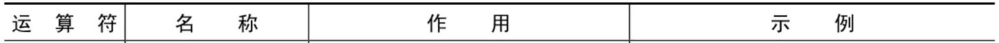

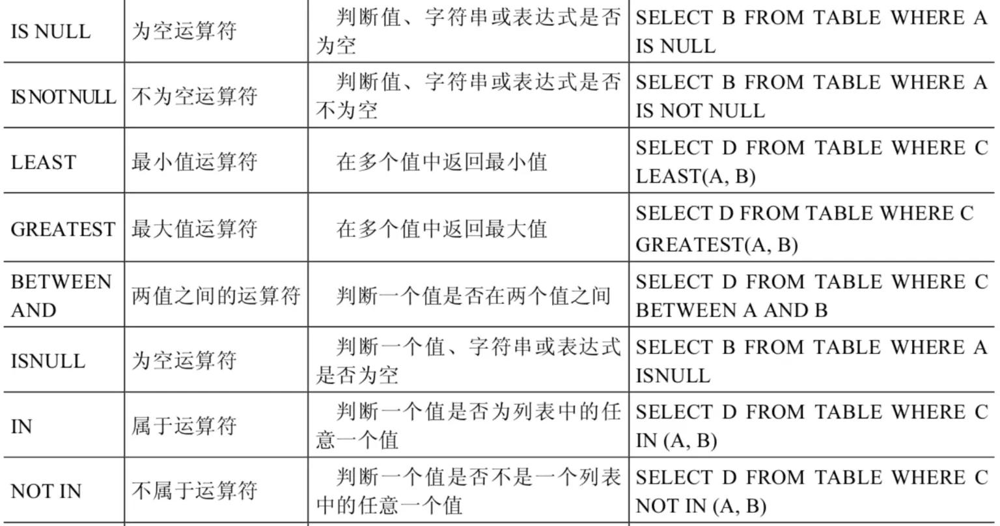

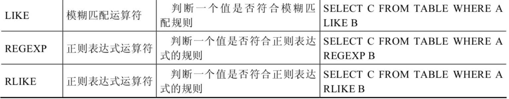

**4. 空运算符**

空运算符（IS NULL 或者 ISNULL）判断一个值是否为 NULL，如果为 NULL 则返回 1，否则返回 0。
SQL 语句示例如下：

```sql
mysql> SELECT NULL IS NULL, ISNULL(NULL), ISNULL('a'), 1 IS NULL;
+--------------+--------------+-------------+-----------+
| NULL IS NULL | ISNULL(NULL) | ISNULL('a') | 1 IS NULL |
+--------------+--------------+-------------+-----------+
|            1 |            1 |           0 |         0 |
+--------------+--------------+-------------+-----------+
1 row in set (0.00 sec)
```

```sql
#查询commission_pct等于NULL。比较如下的四种写法
SELECT employee_id,commission_pct FROM employees WHERE commission_pct IS NULL;
SELECT employee_id,commission_pct FROM employees WHERE commission_pct <=> NULL;
SELECT employee_id,commission_pct FROM employees WHERE ISNULL(commission_pct);
SELECT employee_id,commission_pct FROM employees WHERE commission_pct = NULL;
```

```sql
SELECT last_name, manager_id
FROM employees
WHERE manager_id IS NULL;
```

**5. 非空运算符**

非空运算符(IS NOT NULL)判断一个值是否不为 NULL，如果不为 NULL 则返回 1，否则返回 0。
SQL 语句示例如下：

```sql
mysql> SELECT NULL IS NOT NULL, 'a' IS NOT NULL,  1 IS NOT NULL; 
+------------------+-----------------+---------------+
| NULL IS NOT NULL | 'a' IS NOT NULL | 1 IS NOT NULL |
+------------------+-----------------+---------------+
|                0 |               1 |             1 |
+------------------+-----------------+---------------+
1 row in set (0.01 sec)
```

```sql
#查询commission_pct不等于NULL
SELECT employee_id,commission_pct FROM employees WHERE commission_pct IS NOT NULL;
SELECT employee_id,commission_pct FROM employees WHERE NOT commission_pct <=> NULL;
SELECT employee_id,commission_pct FROM employees WHERE NOT ISNULL(commission_pct);
```

**6. 最小值运算符**

语法格式为：`LEAST(值 1，值 2，...，值 n)`。其中，“值 n”表示参数列表中有 n 个值。在有两个或多个参数的情况下，返回最小值。

```sql
mysql> SELECT LEAST (1,0,2), LEAST('b','a','c'), LEAST(1,NULL,2);
+---------------+--------------------+-----------------+
| LEAST (1,0,2) | LEAST('b','a','c') | LEAST(1,NULL,2) |
+---------------+--------------------+-----------------+
|       0       |        a           |      NULL       |
+---------------+--------------------+-----------------+
1 row in set (0.00 sec)
```

由结果可以看到，当参数是整数或者浮点数时，LEAST 将返回其中最小的值；当参数为字符串时，返回字母表中顺序最靠前的字符；当比较值列表中有 NULL 时，不能判断大小，返回值为 NULL。

**7. 最大值运算符**

语法格式为：`GREATEST(值 1，值 2，...，值 n)`。其中，n 表示参数列表中有 n 个值。当有两个或多个参数时，返回值为最大值。假如任意一个自变量为 NULL，则 GREATEST()的返回值为 NULL。

```sql
mysql> SELECT GREATEST(1,0,2), GREATEST('b','a','c'), GREATEST(1,NULL,2);
+-----------------+-----------------------+--------------------+
| GREATEST(1,0,2) | GREATEST('b','a','c') | GREATEST(1,NULL,2) |
+-----------------+-----------------------+--------------------+
|               2 | c                     |               NULL |
+-----------------+-----------------------+--------------------+
1 row in set (0.00 sec)
```

由结果可以看到，当参数中是整数或者浮点数时，GREATEST 将返回其中最大的值；当参数为字符串时，返回字母表中顺序最靠后的字符；当比较值列表中有 NULL 时，不能判断大小，返回值为 NULL。

**8. BETWEEN AND 运算符**

BETWEEN 运算符使用的格式通常为 `SELECT D FROM TABLE WHERE C BETWEEN A AND B`，此时，当 C 大于或等于 A，并且 C 小于或等于 B 时，结果为 1，否则结果为 0。

```sql
mysql> SELECT 1 BETWEEN 0 AND 1, 10 BETWEEN 11 AND 12, 'b' BETWEEN 'a' AND 'c';
+-------------------+----------------------+-------------------------+
| 1 BETWEEN 0 AND 1 | 10 BETWEEN 11 AND 12 | 'b' BETWEEN 'a' AND 'c' |
+-------------------+----------------------+-------------------------+
|                 1 |                    0 |                       1 |
+-------------------+----------------------+-------------------------+
1 row in set (0.00 sec)
```

```sql
SELECT last_name, salary
FROM employees
WHERE salary BETWEEN 2500 AND 3500;
```

**9. IN 运算符**

IN 运算符用于判断给定的值是否是 IN 列表中的一个值，如果是则返回 1，否则返回 0。如果给定的值为 NULL，或者 IN 列表中存在 NULL，则结果为 NULL。
:::warning
- ✅ **如果值明确存在于列表中**（无论是否有 NULL），结果为 1(True)。
  - 示例：`'a' IN (NULL, 'a') → 1`

- ❓ **如果值不在列表中且列表包含 NULL**，结果为 NULL（表示“未知”）。
  - 示例：`'b' IN (NULL, 'a') → NULL`

- ❗ **如果值本身为 NULL**，结果为 NULL（无论列表内容）。
  - 示例：`NULL IN (1, 2) → NULL`
:::

```sql
mysql> SELECT 'a' IN ('a','b','c'), 1 IN (2,3), NULL IN ('a','b'), 'a' IN ('a', NULL);
+----------------------+------------+-------------------+--------------------+
| 'a' IN ('a','b','c') | 1 IN (2,3) | NULL IN ('a','b') | 'a' IN ('a', NULL) |
+----------------------+------------+-------------------+--------------------+
|            1         |        0   |         NULL      |         1          |
+----------------------+------------+-------------------+--------------------+
1 row in set (0.00 sec)
```

```sql
SELECT employee_id, last_name, salary, manager_id
FROM employees
WHERE manager_id IN (100, 101, 201);
```

**10. NOT IN 运算符**

NOT IN 运算符用于判断给定的值是否不是 IN 列表中的一个值，如果不是 IN 列表中的一个值，则返回 1，否则返回 0。

```sql
mysql> SELECT 'a' NOT IN ('a','b','c'), 1 NOT IN (2,3);
+--------------------------+----------------+
| 'a' NOT IN ('a','b','c') | 1 NOT IN (2,3) |
+--------------------------+----------------+
|                 0        |            1   |
+--------------------------+----------------+
1 row in set (0.00 sec)
```

**11. LIKE 运算符**

LIKE 运算符主要用来匹配字符串，通常用于模糊匹配，如果满足条件则返回 1，否则返回 0。如果给定的值或者匹配条件为 NULL，则返回结果为 NULL。

LIKE 运算符通常使用如下通配符：

- `%`：匹配 0 个或多个字符。
- `_`：只能匹配一个字符。

SQL 语句示例如下：

```sql
mysql> SELECT NULL LIKE 'abc', 'abc' LIKE NULL;  
+-----------------+-----------------+
| NULL LIKE 'abc' | 'abc' LIKE NULL |
+-----------------+-----------------+
|          NULL   |          NULL   |
+-----------------+-----------------+
1 row in set (0.00 sec)
```

```sql
SELECT first_name
FROM employees
WHERE first_name LIKE 'S%';
```

```sql
SELECT last_name
FROM employees
WHERE last_name LIKE '_o%';
```

**ESCAPE**

- 回避特殊符号的：**使用转义符**。例如：将`[%]`转为`[$%]`、`[]`转为`[$]`，然后再加上`[ESCAPE '$']`即可。

```sql
SELECT job_id
FROM jobs
WHERE job_id LIKE 'IT\_%';
```

- 如果使用`\`表示转义，要省略 ESCAPE。如果不是`\`，则要加上 ESCAPE。


```sql
SELECT job_id
FROM jobs
WHERE job_id LIKE 'IT$_%' escape '$';
```

**12. REGEXP 运算符**

REGEXP 运算符用来匹配字符串，语法格式为：`expr REGEXP 匹配条件`。如果 expr 满足匹配条件，返回 1；如果不满足，则返回 0。若 expr 或匹配条件任意一个为 NULL，则结果为 NULL。

REGEXP 运算符在进行匹配时，常用的有下面几种通配符：

```
（1）‘^’匹配以该字符后面的字符开头的字符串。
（2）‘$’匹配以该字符前面的字符结尾的字符串。
（3）‘.’匹配任何一个单字符。
（4）“[...]”匹配在方括号内的任何字符。例如，“[abc]”匹配“a”或“b”或“c”。为了命名字符的范围，使用一个‘-’。“[a-z]”匹配任何字母，而“[0-9]”匹配任何数字。
（5）‘*’匹配零个或多个在它前面的字符。例如，“x*”匹配任何数量的‘x’字符，“[0-9]*”匹配任何数量的数字，而“.*”匹配任何数量的任何字符。
```

SQL 语句示例如下：

```sql
mysql> SELECT 'shkstart' REGEXP '^s', 'shkstart' REGEXP 't$', 'shkstart' REGEXP 'hk';
+------------------------+------------------------+-------------------------+
| 'shkstart' REGEXP '^s' | 'shkstart' REGEXP 't$' | 'shkstart' REGEXP 'hk'  |
+------------------------+------------------------+-------------------------+
|                      1 |                      1 |                       1 |
+------------------------+------------------------+-------------------------+
1 row in set (0.01 sec)
```

```sql
mysql> SELECT 'atguigu' REGEXP 'gu.gu', 'atguigu' REGEXP '[ab]';
+--------------------------+-------------------------+
| 'atguigu' REGEXP 'gu.gu' | 'atguigu' REGEXP '[ab]' |
+--------------------------+-------------------------+
|                        1 |                       1 |
+--------------------------+-------------------------+
1 row in set (0.00 sec)
```

## 3. 逻辑运算符

逻辑运算符主要用来判断表达式的真假，在 MySQL 中，逻辑运算符的返回结果为 1、0 或者 NULL。

MySQL 中支持 4 种逻辑运算符如下：

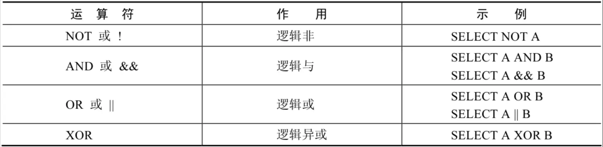

**1．逻辑非运算符**

逻辑非（NOT 或!）运算符表示当给定的值为 0 时返回 1；当给定的值为非 0 值时返回 0；当给定的值为 NULL 时，返回 NULL。

```sql
mysql> SELECT NOT 1, NOT 0, NOT(1+1), NOT !1, NOT NULL;    
+-------+-------+----------+--------+----------+
| NOT 1 | NOT 0 | NOT(1+1) | NOT !1 | NOT NULL |
+-------+-------+----------+--------+----------+
|     0 |     1 |        0 |      1 |     NULL |
+-------+-------+----------+--------+----------+
1 row in set, 1 warning (0.00 sec)
```

```sql
SELECT last_name, job_id
FROM employees
WHERE job_id NOT IN ('IT_PROG', 'ST_CLERK', 'SA_REP');
```

**2．逻辑与运算符**

逻辑与（AND 或 &&）运算符是当给定的所有值均为非 0 值，并且都不为 NULL 时，返回 1；当给定的一个值或者多个值为 0 时则返回 0；否则返回 NULL。

```sql
mysql> SELECT 1 AND -1, 0 AND 1, 0 AND NULL, 1 AND NULL;
+----------+---------+------------+------------+
| 1 AND -1 | 0 AND 1 | 0 AND NULL | 1 AND NULL |
+----------+---------+------------+------------+
|        1 |       0 |          0 |       NULL |
+----------+---------+------------+------------+
1 row in set (0.00 sec)
```

```sql
SELECT employee_id, last_name, job_id, salary
FROM employees
WHERE salary >=10000
AND job_id LIKE '%MAN%';
```

**3．逻辑或运算符**

逻辑或（OR 或 ||）运算符是当给定的值都不为 NULL，并且任何一个值为非 0 值时，则返回 1，否则返回 0；当一个值为 NULL，并且另一个值为非 0 值时，返回 1，否则返回 NULL；当两个值都为 NULL 时，返回 NULL。

```sql
mysql> SELECT 1 OR -1, 1 OR 0, 1 OR NULL, 0 || NULL, NULL || NULL;     
+---------+--------+-----------+-----------+--------------+
| 1 OR -1 | 1 OR 0 | 1 OR NULL | 0 || NULL | NULL || NULL |
+---------+--------+-----------+-----------+--------------+
|       1 |      1 |         1 |    NULL   |       NULL   |
+---------+--------+-----------+-----------+--------------+
1 row in set, 2 warnings (0.00 sec)
```

```sql
#查询基本薪资不在9000-12000之间的员工编号和基本薪资
SELECT employee_id,salary FROM employees 
WHERE NOT (salary >= 9000 AND salary <= 12000);

SELECT employee_id,salary FROM employees 
WHERE salary <9000 OR salary > 12000;

SELECT employee_id,salary FROM employees 
WHERE salary NOT BETWEEN 9000 AND 12000;
```

```sql
SELECT employee_id, last_name, job_id, salary
FROM employees
WHERE salary >= 10000
OR job_id LIKE '%MAN%';
```

:::warning
  OR 可以和 AND 一起使用，但是在使用时要注意两者的优先级，由于 **AND 的优先级高于 OR**，因此先对 AND 两边的操作数进行操作，再与 OR 中的操作数结合。
:::

**4．逻辑异或运算符**

逻辑异或(XOR)运算符是当给定的值中任意一个值为 NULL 时，则返回 NULL；如果两个非 NULL 的值都是 0 或者都不等于 0 时，则返回 0；如果一个值为 0，另一个值不为 0 时，则返回 1。

```sql
mysql> SELECT 1 XOR -1, 1 XOR 0, 0 XOR 0, 1 XOR NULL, 1 XOR 1 XOR 1, 0 XOR 0 XOR 0;
+----------+---------+---------+------------+---------------+---------------+
| 1 XOR -1 | 1 XOR 0 | 0 XOR 0 | 1 XOR NULL | 1 XOR 1 XOR 1 | 0 XOR 0 XOR 0 |
+----------+---------+---------+------------+---------------+---------------+
|        0 |       1 |       0 |       NULL |             1 |             0 |
+----------+---------+---------+------------+---------------+---------------+
1 row in set (0.00 sec)
```

```sql
select last_name,department_id,salary 
from employees
where department_id in (10,20) XOR salary > 8000;
```

## 4. 位运算符

位运算符是在二进制数上进行计算的运算符。位运算符会先将操作数变成二进制数，然后进行位运算，最后将计算结果从二进制变回十进制数。

MySQL 支持的位运算符如下：

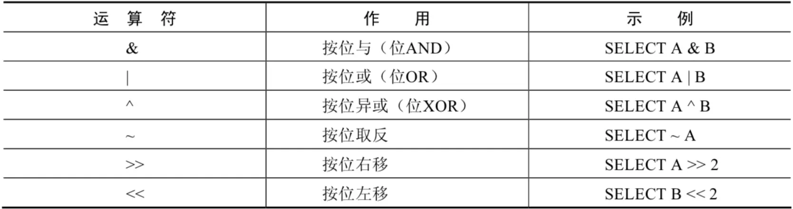

**1．按位与运算符**

按位与(&)运算符将给定值对应的二进制数逐位进行逻辑与运算。当给定值对应的二进制位的数值都为 1 时，则该位返回 1，否则返回 0。

```sql
mysql> SELECT 1 & 10, 20 & 30;
+--------+---------+
| 1 & 10 | 20 & 30 |
+--------+---------+
|      0 |      20 |
+--------+---------+
1 row in set (0.00 sec)
```

1 的二进制数为 0001，10 的二进制数为 1010，所以 1 & 10 的结果为 0000，对应的十进制数为 0。20 的二进制数为 10100，30 的二进制数为 11110，所以 20 & 30 的结果为 10100，对应的十进制数为 20。

**2. 按位或运算符**

按位或(|)运算符将给定的值对应的二进制数逐位进行逻辑或运算。当给定值对应的二进制位的数值有一个或两个为 1 时，则该位返回 1，否则返回 0。

```sql
mysql> SELECT 1 | 10, 20 | 30; 
+--------+---------+
| 1 | 10 | 20 | 30 |
+--------+---------+
|     11 |      30 |
+--------+---------+
1 row in set (0.00 sec)
```

1 的二进制数为 0001，10 的二进制数为 1010，所以 1 | 10 的结果为 1011，对应的十进制数为 11。20 的二进制数为 10100，30 的二进制数为 11110，所以 20 | 30 的结果为 11110，对应的十进制数为 30。

**3. 按位异或运算符**

按位异或(^)运算符将给定的值对应的二进制数逐位进行逻辑异或运算。当给定值对应的二进制位的数值不同时，则该位返回 1，否则返回 0。

```sql
mysql> SELECT 1 ^ 10, 20 ^ 30; 
+--------+---------+
| 1 ^ 10 | 20 ^ 30 |
+--------+---------+
|     11 |      10 |
+--------+---------+
1 row in set (0.00 sec)
```

1 的二进制数为 0001，10 的二进制数为 1010，所以 1 ^ 10 的结果为 1011，对应的十进制数为 11。20 的二进制数为 10100，30 的二进制数为 11110，所以 20 ^ 30 的结果为 01010，对应的十进制数为 10。

再举例：

```sql
mysql> SELECT 12 & 5, 12 | 5,12 ^ 5 FROM DUAL;
+--------+--------+--------+
| 12 & 5 | 12 | 5 | 12 ^ 5 |
+--------+--------+--------+
|      4 |     13 |      9 |
+--------+--------+--------+
1 row in set (0.00 sec)
```

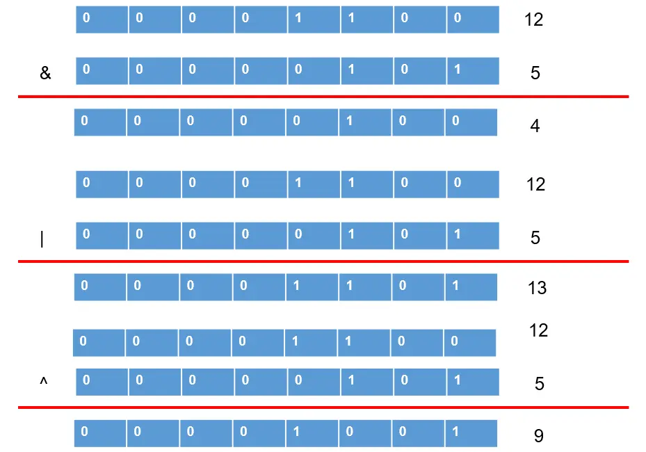

**4. 按位取反运算符**

按位取反(~)运算符将给定的值的二进制数逐位进行取反操作，即将 1 变为 0，将 0 变为 1。

```sql
mysql> SELECT 10 & ~1;
+---------+
| 10 & ~1 |
+---------+
|      10 |
+---------+
1 row in set (0.00 sec)
```

由于按位取反(~)运算符的优先级高于按位与(&)运算符的优先级，所以 10 & ~1，首先，对数字 1 进行按位取反操作，结果除了最低位为 0，其他位都为 1，然后与 10 进行按位与操作，结果为 10。

**5. 按位右移运算符**

按位右移(>>)运算符将给定的值的二进制数的所有位右移指定的位数。右移指定的位数后，右边低位的数值被移出并丢弃，左边高位空出的位置用 0 补齐。

```sql
mysql> SELECT 1 >> 2, 4 >> 2;
+--------+--------+
| 1 >> 2 | 4 >> 2 |
+--------+--------+
|      0 |      1 |
+--------+--------+
1 row in set (0.00 sec)
```

1 的二进制数为 0000 0001，右移 2 位为 0000 0000，对应的十进制数为 0。4 的二进制数为 0000 0100，右移 2 位为 0000 0001，对应的十进制数为 1。

**6. 按位左移运算符**

按位左移(<<)运算符将给定的值的二进制数的所有位左移指定的位数。左移指定的位数后，左边高位的数值被移出并丢弃，右边低位空出的位置用 0 补齐。

```sql
mysql> SELECT 1 << 2, 4 << 2;  
+--------+--------+
| 1 << 2 | 4 << 2 |
+--------+--------+
|      4 |     16 |
+--------+--------+
1 row in set (0.00 sec)
```

1 的二进制数为 0000 0001，左移两位为 0000 0100，对应的十进制数为 4。4 的二进制数为 0000 0100，左移两位为 0001 0000，对应的十进制数为 16。

## 5. 运算符的优先级

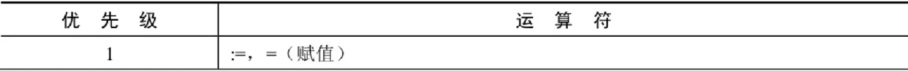

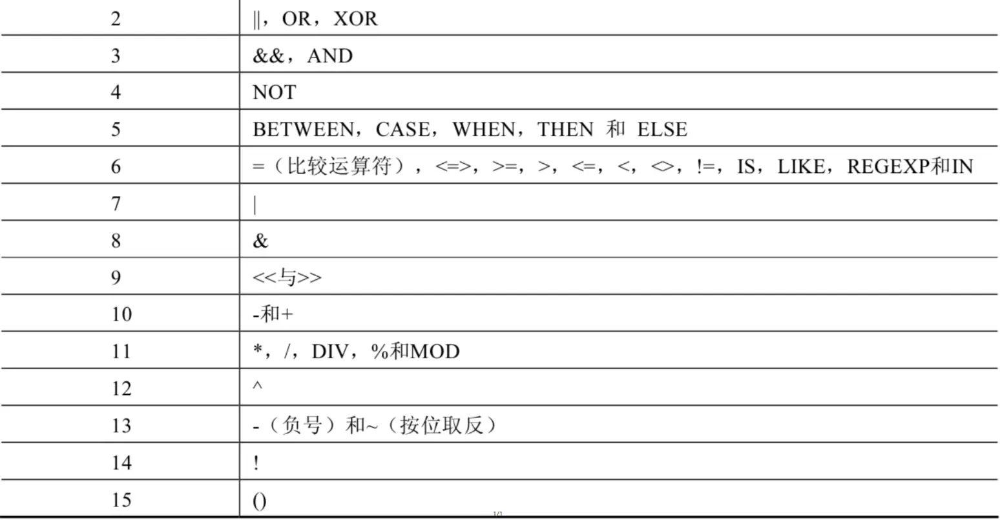

数字编号越大，优先级越高，优先级高的运算符先进行计算。可以看到，赋值运算符的优先级最低，使用“()”括起来的表达式的优先级最高。


## 拓展：使用正则表达式查询

正则表达式通常被用来检索或替换那些符合某个模式的文本内容，根据指定的匹配模式匹配文本中符合要求的特殊字符串。例如，从一个文本文件中提取电话号码，查找一篇文章中重复的单词或者替换用户输入的某些敏感词语等，这些地方都可以使用正则表达式。正则表达式强大而且灵活，可以应用于非常复杂的查询。

MySQL 中使用 REGEXP 关键字指定正则表达式的字符匹配模式。下表列出了 REGEXP 操作符中常用字符匹配列表。

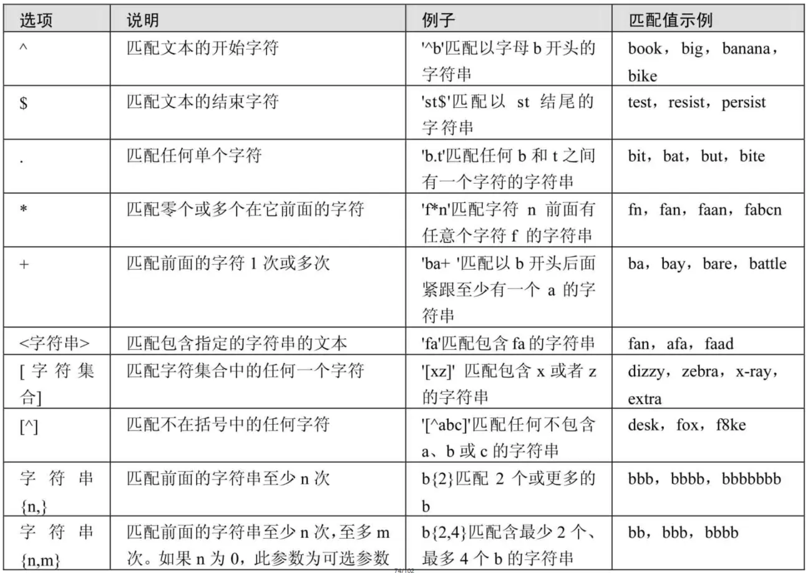

**1. 查询以特定字符或字符串开头的记录**

字符‘^’匹配以特定字符或者字符串开头的文本。

在 fruits 表中，查询 f_name 字段以字母‘b’开头的记录，SQL 语句如下：

```sql
mysql> SELECT * FROM fruits WHERE f_name REGEXP '^b';
```

**2. 查询以特定字符或字符串结尾的记录**

字符‘$’匹配以特定字符或者字符串结尾的文本。

在 fruits 表中，查询 f_name 字段以字母‘y’结尾的记录，SQL 语句如下：

```sql
mysql> SELECT * FROM fruits WHERE f_name REGEXP 'y$';
```

**3. 用符号"."来替代字符串中的任意一个字符**

字符‘.’匹配任意一个字符。

在 fruits 表中，查询 f_name 字段值包含字母‘a’与‘g’且两个字母之间只有一个字母的记录，SQL 语句如下：

```sql
mysql> SELECT * FROM fruits WHERE f_name REGEXP 'a.g';
```

**4. 使用"*"和"+"来匹配多个字符**

星号‘*’匹配前面的字符任意多次，包括 0 次。加号‘+’匹配前面的字符至少一次。

在 fruits 表中，查询 f_name 字段值以字母‘b’开头且‘b’后面出现字母‘a’的记录，SQL 语句如下：

```sql
mysql> SELECT * FROM fruits WHERE f_name REGEXP '^ba*';
```

在 fruits 表中，查询 f_name 字段值以字母‘b’开头且‘b’后面出现字母‘a’至少一次的记录，SQL 语句如下：

```sql
mysql> SELECT * FROM fruits WHERE f_name REGEXP '^ba+';
```

**5. 匹配指定字符串**

正则表达式可以匹配指定字符串，只要这个字符串在查询文本中即可，如要匹配多个字符串，多个字符串之间使用分隔符‘|’隔开。

在 fruits 表中，查询 f_name 字段值包含字符串“on”的记录，SQL 语句如下：

```sql
mysql> SELECT * FROM fruits WHERE f_name REGEXP 'on';
```

在 fruits 表中，查询 f_name 字段值包含字符串“on”或者“ap”的记录，SQL 语句如下：

```sql
mysql> SELECT * FROM fruits WHERE f_name REGEXP 'on|ap';
```

之前介绍过，LIKE 运算符也可以匹配指定的字符串，但与 REGEXP 不同，LIKE 匹配的字符串如果在文本中间出现，则找不到它，相应的行也不会返回。REGEXP 在文本内进行匹配，如果被匹配的字符串在文本中出现，REGEXP 将会找到它，相应的行也会被返回。对比结果如下所示。

在 fruits 表中，使用 LIKE 运算符查询 f_name 字段值为“on”的记录，SQL 语句如下：

```sql
mysql> SELECT * FROM fruits WHERE f_name like 'on';
Empty set(0.00 sec)
```

**6. 匹配指定字符中的任意一个**

方括号“[]”指定一个字符集合，只匹配其中任何一个字符，即为所查找的文本。

在 fruits 表中，查找 f_name 字段中包含字母‘o’或者‘t’的记录，SQL 语句如下：

```sql
mysql> SELECT * FROM fruits WHERE f_name REGEXP '[ot]';
```

在 fruits 表中，查询 s_id 字段中包含 4、5 或者 6 的记录，SQL 语句如下：

```sql
mysql> SELECT * FROM fruits WHERE s_id REGEXP '[456]';
```

**7. 匹配指定字符以外的字符**

`“[^字符集合]”`匹配不在指定集合中的任何字符。

在 fruits 表中，查询 f_id 字段中包含字母 a~e 和数字 1~2 以外字符的记录，SQL 语句如下：

```sql
mysql> SELECT * FROM fruits WHERE f_id REGEXP '[^a-e1-2]';
```

**8. 使用{n,}或者{n,m}来指定字符串连续出现的次数**

“字符串{n,}”表示至少匹配 n 次前面的字符；“字符串{n,m}”表示匹配前面的字符串不少于 n 次，不多于 m 次。例如，a{2,}表示字母 a 连续出现至少 2 次，也可以大于 2 次；a{2,4}表示字母 a 连续出现最少 2 次，最多不能超过 4 次。

在 fruits 表中，查询 f_name 字段值出现字母‘x’至少 2 次的记录，SQL 语句如下：

```sql
mysql> SELECT * FROM fruits WHERE f_name REGEXP 'x{2,}';
```

在 fruits 表中，查询 f_name 字段值出现字符串“ba”最少 1 次、最多 3 次的记录，SQL 语句如下：

```sql
mysql> SELECT * FROM fruits WHERE f_name REGEXP 'ba{1,3}';
```

## 课堂笔记 SQL
```sql
# 第04章_运算符
#1. 算术运算符： +  -  *  /  div  % mod

SELECT 100, 100 + 0, 100 - 0, 100 + 50, 100 + 50 * 30, 100 + 35.5, 100 - 35.5 
FROM DUAL;

# 在SQL中，+没有连接的作用，就表示加法运算。此时，会将字符串转换为数值（隐式转换）
SELECT 100 + '1'  # 在Java语言中，结果是：1001。 
FROM DUAL;

SELECT 100 + 'a' #此时将'a'看做0处理
FROM DUAL;

SELECT 100 + NULL  # null值参与运算，结果为null
FROM DUAL;

SELECT 100, 100 * 1, 100 * 1.0, 100 / 1.0, 100 / 2,
100 + 2 * 5 / 2,100 / 3, 100 DIV 0  # 分母如果为0，则结果为null
FROM DUAL;

# 取模运算： % mod
SELECT 12 % 3,12 % 5, 12 MOD -5,-12 % 5,-12 % -5
FROM DUAL;

#练习：查询员工id为偶数的员工信息
SELECT employee_id,last_name,salary
FROM employees
WHERE employee_id % 2 = 0;

#2. 比较运算符
#2.1 =  <=>  <> !=  <  <=  >  >= 

# = 的使用
SELECT 1 = 2,1 != 2,1 = '1',1 = 'a',0 = 'a' #字符串存在隐式转换。如果转换数值不成功，则看做0
FROM DUAL;

SELECT 'a' = 'a','ab' = 'ab','a' = 'b' #两边都是字符串的话，则按照ANSI的比较规则进行比较。
FROM DUAL;

SELECT 1 = NULL,NULL = NULL # 只要有null参与判断，结果就为null
FROM DUAL;

SELECT last_name,salary,commission_pct
FROM employees
#where salary = 6000;
WHERE commission_pct = NULL;  #此时执行，不会有任何的结果

# <=> ：安全等于。 记忆技巧：为NULL而生。

SELECT 1 <=> 2,1 <=> '1',1 <=> 'a',0 <=> 'a'
FROM DUAL;

SELECT 1 <=> NULL, NULL <=> NULL
FROM DUAL;

#练习：查询表中commission_pct为null的数据有哪些
SELECT last_name,salary,commission_pct
FROM employees
WHERE commission_pct <=> NULL;

SELECT 3 <> 2,'4' <> NULL, '' != NULL,NULL != NULL
FROM DUAL;

#2.2 
#① IS NULL \ IS NOT NULL \ ISNULL
#练习：查询表中commission_pct为null的数据有哪些
SELECT last_name,salary,commission_pct
FROM employees
WHERE commission_pct IS NULL;
#或
SELECT last_name,salary,commission_pct
FROM employees
WHERE ISNULL(commission_pct);

#练习：查询表中commission_pct不为null的数据有哪些
SELECT last_name,salary,commission_pct
FROM employees
WHERE commission_pct IS NOT NULL;
#或
SELECT last_name,salary,commission_pct
FROM employees
WHERE NOT commission_pct <=> NULL;

#② LEAST() \ GREATEST 

SELECT LEAST('g','b','t','m'),GREATEST('g','b','t','m')
FROM DUAL;

SELECT LEAST(first_name,last_name),LEAST(LENGTH(first_name),LENGTH(last_name))
FROM employees;

#③ BETWEEN 条件下界1 AND 条件上界2  （查询条件1和条件2范围内的数据，包含边界）
#查询工资在6000 到 8000的员工信息
SELECT employee_id,last_name,salary
FROM employees
#where salary between 6000 and 8000;
WHERE salary >= 6000 && salary <= 8000;

#交换6000 和 8000之后，查询不到数据
SELECT employee_id,last_name,salary
FROM employees
WHERE salary BETWEEN 8000 AND 6000;

#查询工资不在6000 到 8000的员工信息
SELECT employee_id,last_name,salary
FROM employees
WHERE salary NOT BETWEEN 6000 AND 8000;
#where salary < 6000 or salary > 8000;

#④ in (set)\ not in (set)

#练习：查询部门为10,20,30部门的员工信息
SELECT last_name,salary,department_id
FROM employees
#where department_id = 10 or department_id = 20 or department_id = 30;
WHERE department_id IN (10,20,30);

#练习：查询工资不是6000,7000,8000的员工信息
SELECT last_name,salary,department_id
FROM employees
WHERE salary NOT IN (6000,7000,8000);

#⑤ LIKE :模糊查询
# % : 代表不确定个数的字符 （0个，1个，或多个）

#练习：查询last_name中包含字符'a'的员工信息
SELECT last_name
FROM employees
WHERE last_name LIKE '%a%';

#练习：查询last_name中以字符'a'开头的员工信息
SELECT last_name
FROM employees
WHERE last_name LIKE 'a%';

#练习：查询last_name中包含字符'a'且包含字符'e'的员工信息
#写法1：
SELECT last_name
FROM employees
WHERE last_name LIKE '%a%' AND last_name LIKE '%e%';
#写法2：
SELECT last_name
FROM employees
WHERE last_name LIKE '%a%e%' OR last_name LIKE '%e%a%';

# _ ：代表一个不确定的字符

#练习：查询第3个字符是'a'的员工信息
SELECT last_name
FROM employees
WHERE last_name LIKE '__a%';

#练习：查询第2个字符是_且第3个字符是'a'的员工信息
#需要使用转义字符: \ 
SELECT last_name
FROM employees
WHERE last_name LIKE '_\_a%';

#或者  (了解)
SELECT last_name
FROM employees
WHERE last_name LIKE '_$_a%' ESCAPE '$';

#⑥ REGEXP \ RLIKE :正则表达式

SELECT 'shkstart' REGEXP '^shk', 'shkstart' REGEXP 't$', 'shkstart' REGEXP 'hk'
FROM DUAL;

SELECT 'atguigu' REGEXP 'gu.gu','atguigu' REGEXP '[ab]'
FROM DUAL;

#3. 逻辑运算符： OR ||  AND && NOT ! XOR

# or  and 
SELECT last_name,salary,department_id
FROM employees
#where department_id = 10 or department_id = 20;
#where department_id = 10 and department_id = 20;
WHERE department_id = 50 AND salary > 6000;

# not 
SELECT last_name,salary,department_id
FROM employees
#where salary not between 6000 and 8000;
#where commission_pct is not null;
WHERE NOT commission_pct <=> NULL;

# XOR :追求的"异"
SELECT last_name,salary,department_id
FROM employees
WHERE department_id = 50 XOR salary > 6000;

#注意：AND的优先级高于OR

#4. 位运算符： & |  ^  ~  >>   <<

SELECT 12 & 5, 12 | 5,12 ^ 5 
FROM DUAL;

SELECT 10 & ~1 FROM DUAL;

#在一定范围内满足：每向左移动1位，相当于乘以2；每向右移动一位，相当于除以2。
SELECT 4 << 1 , 8 >> 1
FROM DUAL;
```
## 课后练习 SQL
```sql
# 第04章_运算符课后练习

# 1.选择工资不在5000到12000的员工的姓名和工资

SELECT last_name,salary
FROM employees
#where salary not between 5000 and 12000;
WHERE salary < 5000 OR salary > 12000;

# 2.选择在20或50号部门工作的员工姓名和部门号
SELECT last_name,department_id
FROM employees
# where department_id in (20,50);
WHERE department_id = 20 OR department_id = 50;

# 3.选择公司中没有管理者的员工姓名及job_id

SELECT last_name,job_id,manager_id
FROM employees
WHERE manager_id IS NULL;

SELECT last_name,job_id,manager_id
FROM employees
WHERE manager_id <=> NULL;

# 4.选择公司中有奖金的员工姓名，工资和奖金级别
SELECT last_name,salary,commission_pct
FROM employees
WHERE commission_pct IS NOT NULL;


SELECT last_name,salary,commission_pct
FROM employees
WHERE NOT commission_pct <=> NULL;


# 5.选择员工姓名的第三个字母是a的员工姓名

SELECT last_name
FROM employees
WHERE last_name LIKE '__a%';


# 6.选择姓名中有字母a和k的员工姓名

SELECT last_name
FROM employees
WHERE last_name LIKE '%a%k%' OR last_name LIKE '%k%a%';
#where last_name like '%a%' and last_name LIKE '%k%';

# 7.显示出表 employees 表中 first_name 以 'e'结尾的员工信息

SELECT first_name,last_name
FROM employees
WHERE first_name LIKE '%e';

SELECT first_name,last_name
FROM employees
WHERE first_name REGEXP 'e$'; # 以e开头的写法：'^e'

# 8.显示出表 employees 部门编号在 80-100 之间的姓名、工种
SELECT last_name,job_id
FROM employees
#方式1：推荐
WHERE department_id BETWEEN 80 AND 100;
#方式2：推荐，与方式1相同
#where department_id >= 80 and department_id <= 100;
#方式3：仅适用于本题的方式。
#where department_id in (80,90,100);

SELECT * FROM departments;

# 9.显示出表 employees 的 manager_id 是 100,101,110 的员工姓名、工资、管理者id

SELECT last_name,salary,manager_id
FROM employees
WHERE manager_id IN (100,101,110);
```
