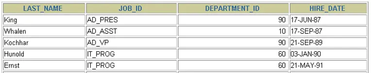
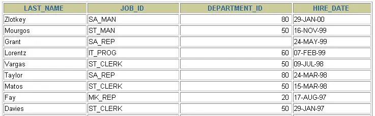
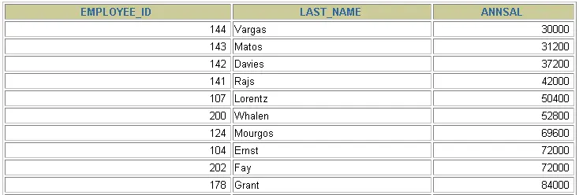
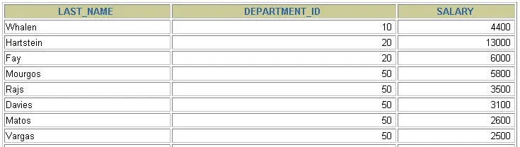

# 第 05 章_排序与分页

讲师：尚硅谷-宋红康（江湖人称：康师傅）

官网：[http://www.atguigu.com](http://www.atguigu.com/)

***

## 1. 排序数据

### 1.1 排序规则
- 如果没有使用排序操作，默认情况下查询返回的数据是按照添加数据的顺序显示的。
- 使用 ORDER BY 子句对查询到的数据进行排序操作
  - **ASC(ascend): 升序（默认排序方式）**
  - **DESC(descend):降序**
- **ORDER BY 子句在 SELECT 语句的结尾。**

### 1.2 单列排序

```sql
SELECT last_name, job_id, department_id, hire_date
FROM employees
ORDER BY hire_date;
```

 


```sql
SELECT last_name, job_id, department_id, hire_date
FROM employees
ORDER BY hire_date DESC ;
```

 


```sql
# 列的别名只能在 ORDER BY 中使用，不能在 WHERE 中使用
SELECT employee_id, last_name, salary*12 annsal
FROM employees
ORDER BY annsal;
```

 


### 1.3 多列排序

```sql
SELECT last_name, department_id, salary
FROM employees
ORDER BY department_id, salary DESC;
```




- 可以使用不在 SELECT 列表中的列排序。
- 在对多列进行排序的时候，首先排序的第一列必须有相同的列值，才会对第二列进行排序。如果第一列数据中所有值都是唯一的，将不再对第二列进行排序。

## 2. 分页

### 2.1 背景

背景 1：查询返回的记录太多了，查看起来很不方便，怎么样能够实现分页查询呢？

背景 2：表里有 4 条数据，我们只想要显示第 2、3 条数据怎么办呢？

### 2.2 实现规则

- 分页原理

  所谓分页显示，就是将数据库中的结果集，一段一段显示出来需要的条件。

- **MySQL 中使用 LIMIT 实现分页**

- 格式：

  ```sql
  LIMIT [位置偏移量,] 行数
  ```

  第一个“位置偏移量”参数指示 MySQL 从哪一行开始显示，是一个可选参数，如果不指定“位置偏移量”，将会从表中的第一条记录开始（第一条记录的位置偏移量是 0，第二条记录的位置偏移量是 1，以此类推）；第二个参数“行数”指示返回的记录条数。

- 举例

```sql
--前10条记录：
SELECT * FROM 表名 LIMIT 0,10;
或者
SELECT * FROM 表名 LIMIT 10;

--第11至20条记录：
SELECT * FROM 表名 LIMIT 10,10;

--第21至30条记录： 
SELECT * FROM 表名 LIMIT 20,10;
```

> MySQL 8.0 中可以使用 `LIMIT 3 OFFSET 4`，意思是获取从第 5 条记录开始后面的 3 条记录，和 `LIMIT 4,3;` 返回的结果相同。

- 分页显式公式：`(当前页数 - 1) * 每页条数，每页条数`

```sql
SELECT * FROM table 
LIMIT (PageNo - 1) * PageSize, PageSize;
```

- **注意：LIMIT 子句必须放在整个 SELECT 语句的最后！**
- 使用 LIMIT 的好处
  - 约束返回结果的数量可以`减少数据表的网络传输量`，也可以`提升查询效率`。如果我们知道返回结果只有 1 条，就可以使用`LIMIT 1`，告诉 SELECT 语句只需要返回一条记录即可。这样的好处就是 SELECT 不需要扫描完整的表，只需要检索到一条符合条件的记录即可返回。

### 2.3 拓展

在不同的 DBMS 中使用的关键字可能不同。在 MySQL、PostgreSQL、MariaDB 和 SQLite 中使用 LIMIT 关键字，而且需要放到 SELECT 语句的最后面。

- 如果是 SQL Server 和 Access，需要使用 `TOP` 关键字，比如：

```sql
SELECT TOP 5 name, hp_max FROM heros ORDER BY hp_max DESC
```

- 如果是 DB2，使用`FETCH FIRST 5 ROWS ONLY`这样的关键字：


```sql
SELECT name, hp_max FROM heros ORDER BY hp_max DESC FETCH FIRST 5 ROWS ONLY
```

- 如果是 Oracle，你需要基于 `ROWNUM` 来统计行数：


```sql
SELECT rownum,last_name,salary FROM employees WHERE rownum < 5 ORDER BY salary DESC;
```

需要说明的是，这条语句是先取出来前 5 条数据行，然后再按照 hp_max 从高到低的顺序进行排序。但这样产生的结果和上述方法的并不一样。我会在后面讲到子查询，你可以使用

```sql
SELECT rownum, last_name,salary
FROM (
    SELECT last_name,salary
    FROM employees
    ORDER BY salary DESC)
WHERE rownum < 10;
```

得到与上述方法一致的结果。

## 课堂笔记 SQL
```sql
#第05章_排序与分页

#1. 排序

# 如果没有使用排序操作，默认情况下查询返回的数据是按照添加数据的顺序显示的。
SELECT * FROM employees;


# 1.1 基本使用
# 使用 ORDER BY 对查询到的数据进行排序操作。
# 升序：ASC (ascend)
# 降序：DESC (descend)

# 练习：按照salary从高到低的顺序显示员工信息
SELECT employee_id,last_name,salary
FROM employees
ORDER BY salary DESC;

# 练习：按照salary从低到高的顺序显示员工信息
SELECT employee_id,last_name,salary
FROM employees
ORDER BY salary ASC;


SELECT employee_id,last_name,salary
FROM employees
ORDER BY salary; # 如果在ORDER BY 后没有显式指名排序的方式的话，则默认按照升序排列。


#2. 我们可以使用列的别名，进行排序
SELECT employee_id,salary,salary * 12 annual_sal
FROM employees
ORDER BY annual_sal;

#列的别名只能在 ORDER BY 中使用，不能在WHERE中使用。
#如下操作报错！
SELECT employee_id,salary,salary * 12 annual_sal
FROM employees
WHERE annual_sal > 81600;

#3. 强调格式：WHERE 需要声明在FROM后，ORDER BY之前。
SELECT employee_id,salary
FROM employees
WHERE department_id IN (50,60,70)
ORDER BY department_id DESC;

#4. 二级排序

#练习：显示员工信息，按照department_id的降序排列，salary的升序排列
SELECT employee_id,salary,department_id
FROM employees
ORDER BY department_id DESC,salary ASC;


#2. 分页
#2.1 mysql使用limit实现数据的分页显示

# 需求1：每页显示20条记录，此时显示第1页
SELECT employee_id,last_name
FROM employees
LIMIT 0,20;


# 需求2：每页显示20条记录，此时显示第2页
SELECT employee_id,last_name
FROM employees
LIMIT 20,20;


# 需求3：每页显示20条记录，此时显示第3页
SELECT employee_id,last_name
FROM employees
LIMIT 40,20;

#需求：每页显示pageSize条记录，此时显示第pageNo页：
#公式：LIMIT (pageNo-1) * pageSize,pageSize;


#2.2 WHERE ... ORDER BY ...LIMIT 声明顺序如下：

# LIMIT的格式： 严格来说：LIMIT 位置偏移量,条目数
# 结构"LIMIT 0,条目数" 等价于 "LIMIT 条目数"

SELECT employee_id,last_name,salary
FROM employees
WHERE salary > 6000
ORDER BY salary DESC
#limit 0,10;
LIMIT 10;

#练习：表里有107条数据，我们只想要显示第 32、33 条数据怎么办呢？

SELECT employee_id,last_name
FROM employees
LIMIT 31,2;

#2.3 MySQL8.0新特性：LIMIT ... OFFSET ...

#练习：表里有107条数据，我们只想要显示第 32、33 条数据怎么办呢？

SELECT employee_id,last_name
FROM employees
LIMIT 2 OFFSET 31;

#练习：查询员工表中工资最高的员工信息
SELECT employee_id,last_name,salary
FROM employees
ORDER BY salary DESC
#limit 0,1
LIMIT 1;

#2.4 LIMIT 可以使用在MySQL、PGSQL、MariaDB、SQLite 等数据库中使用，表示分页。
# 不能使用在SQL Server、DB2、Oracle！
```

## 课后练习 SQL
```sql
#第05章_排序与分页的课后练习


#1. 查询员工的姓名和部门号和年薪，按年薪降序,按姓名升序显示 

SELECT last_name,department_id,salary * 12 annual_salary
FROM employees
ORDER BY annual_salary DESC,last_name ASC;

#2. 选择工资不在 8000 到 17000 的员工的姓名和工资，按工资降序，显示第21到40位置的数据 

SELECT last_name,salary
FROM employees
WHERE salary NOT BETWEEN 8000 AND 17000
ORDER BY salary DESC
LIMIT 20,20;


#3. 查询邮箱中包含 e 的员工信息，并先按邮箱的字节数降序，再按部门号升序

SELECT employee_id,last_name,email,department_id
FROM employees
#where email like '%e%'
WHERE email REGEXP '[e]'
ORDER BY LENGTH(email) DESC,department_id;
```
