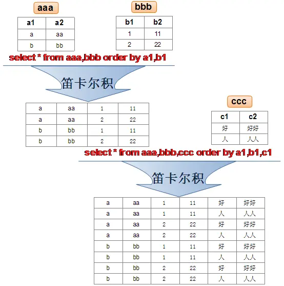

# 第 06 章_多表查询

讲师：尚硅谷-宋红康（江湖人称：康师傅）

官网：[http://www.atguigu.com](http://www.atguigu.com/)

***

多表查询，也称为关联查询，指两个或更多个表一起完成查询操作。

前提条件：这些一起查询的表之间是有关系的（一对一、一对多），它们之间一定是有关联字段，这个关联字段可能建立了外键，也可能没有建立外键。比如：员工表和部门表，这两个表依靠“部门编号”进行关联。

## 1. 一个案例引发的多表连接

### 1.1 案例说明


从多个表中获取数据：


```sql
#案例：查询员工的姓名及其部门名称
SELECT last_name, department_name
FROM employees, departments;
```


查询结果：

```sql
+-----------+----------------------+
| last_name | department_name      |
+-----------+----------------------+
| King      | AdministratiON |
| King      | Marketing            |
| King      | Purchasing           |
| King      | Human Resources      |
| King      | Shipping             |
| King      | IT                   |
| King      | Public Relations     |
| King      | Sales                |
| King      | Executive            |
| King      | Finance              |
| King      | Accounting           |
| King      | Treasury             |
...
| Gietz     | IT Support           |
| Gietz     | NOC                  |
| Gietz     | IT Helpdesk          |
| Gietz     | Government Sales     |
| Gietz     | Retail Sales         |
| Gietz     | Recruiting           |
| Gietz     | Payroll              |
+-----------+----------------------+
2889 rows in set (0.01 sec)
```

**分析错误情况：**

```sql
SELECT COUNT(employee_id) FROM employees;
#输出107行

SELECT COUNT(department_id)FROM departments;
#输出27行

SELECT 107*27 FROM dual;
```

我们把上述多表查询中出现的问题称为：笛卡尔积的错误。因为缺少了多表的连接条件。

### 1.2 笛卡尔积（或交叉连接）的理解

笛卡尔乘积是一个数学运算。假设我有两个集合 X 和 Y，那么 X 和 Y 的笛卡尔积就是 X 和 Y 的所有可能组合，也就是第一个对象来自于 X，第二个对象来自于 Y 的所有可能。组合的个数即为两个集合中元素个数的乘积数。



SQL92 中，笛卡尔积也称为`交叉连接`，英文是 `CROSS JOIN`。在 SQL99 中也是使用 CROSS JOIN 表示交叉连接。它的作用就是可以把任意表进行连接，即使这两张表不相关。在 MySQL 中如下情况会出现笛卡尔积：

```sql
#查询员工姓名和所在部门名称
SELECT last_name,department_name FROM employees,departments;
SELECT last_name,department_name FROM employees CROSS JOIN departments;
SELECT last_name,department_name FROM employees INNER JOIN departments;
SELECT last_name,department_name FROM employees JOIN departments;
```

### 1.3 案例分析与问题解决

- **笛卡尔积的错误会在下面条件下产生**：

  - 省略多个表的连接条件（或关联条件）
  - 连接条件（或关联条件）无效
  - 所有表中的所有行互相连接

- 为了避免笛卡尔积， 可以**在 WHERE 加入有效的连接条件。**

- 加入连接条件后，查询语法：

  ```sql
  SELECT table1.column, table2.column
  FROM table1, table2
  WHERE table1.column1 = table2.column2;  #连接条件
  ```

  - **在 WHERE 子句中写入连接条件。**

- 正确写法：

  ```sql
  #案例：查询员工的姓名及其部门名称
  SELECT last_name, department_name
  FROM employees, departments
  WHERE employees.department_id = departments.department_id;
  ```
  
- **在表中有相同列时，在列名之前加上表名前缀。**

## 2. 多表查询分类讲解

### 分类 1：等值连接 vs 非等值连接

#### 等值连接


```sql
SELECT employees.employee_id, employees.last_name, 
       employees.department_id, departments.department_id,
       departments.location_id
FROM employees, departments
WHERE employees.department_id = departments.department_id;
```


**拓展 1：多个连接条件与 AND 操作符** 


**拓展 2：区分重复的列名**

- **多个表中有相同列时，必须在列名之前加上表名前缀。**
- 在不同表中具有相同列名的列可以用`表名`加以区分。

```sql
SELECT employees.last_name, departments.department_name,employees.department_id
FROM employees, departments
WHERE employees.department_id = departments.department_id;
```

**拓展 3：表的别名**

- 使用别名可以简化查询。

- 列名前使用表名前缀可以提高查询效率。

```sql
SELECT e.employee_id, e.last_name, e.department_id,
       d.department_id, d.location_id
FROM employees e , departments d
WHERE e.department_id = d.department_id;
```

> 需要注意的是，如果我们使用了表的别名，在查询字段中、过滤条件中就只能使用别名进行代替，不能使用原有的表名，否则就会报错。

> `阿里开发规范`：
>
> 【`强制`】对于数据库中表记录的查询和变更，只要涉及多个表，都需要在列名前加表的别名（或 表名）进行限定。 
>
> `说明`：对多表进行查询记录、更新记录、删除记录时，如果对操作列没有限定表的别名（或表名），并且操作列在多个表中存在时，就会抛异常。 
>
> `正例`：select t1.name from table_first as t1 , table_second as t2 where t1.id=t2.id; 
>
> `反例`：在某业务中，由于多表关联查询语句没有加表的别名（或表名）的限制，正常运行两年后，最近在 某个表中增加一个同名字段，在预发布环境做数据库变更后，线上查询语句出现出 1052 异常：Column  'name' in field list is ambiguous。

**拓展 4：连接多个表**


**总结：连接 n 个表,至少需要 n-1 个连接条件**。比如，连接三个表，至少需要两个连接条件。

练习：查询出公司员工的 last_name,department_name, city

#### 非等值连接


```sql
SELECT e.last_name, e.salary, j.grade_level
FROM employees e, job_grades j
WHERE e.salary BETWEEN j.lowest_sal AND j.highest_sal;
```


### 分类 2：自连接 vs 非自连接


- 当 table1 和 table2 本质上是同一张表，只是用取别名的方式虚拟成两张表以代表不同的意义。然后两个表再进行内连接，外连接等查询。

**题目：查询 employees 表，返回“Xxx  works for Xxx”**

```sql
SELECT CONCAT(worker.last_name ,' works for ' 
       , manager.last_name)
FROM employees worker, employees manager
WHERE worker.manager_id = manager.employee_id ;
```


练习：查询出 last_name 为 ‘Chen’ 的员工的 manager 的信息。

### 分类 3：内连接 vs 外连接

除了查询满足条件的记录以外，外连接还可以查询某一方不满足条件的记录。


- 内连接: 合并具有同一列的两个以上的表的行, **结果集中不包含一个表与另一个表不匹配的行**

- 外连接: 两个表在连接过程中除了返回满足连接条件的行以外**还返回左（或右）表中不满足条件的行** **，这种连接称为左（或右） 外连接**。没有匹配的行时, 结果表中相应的列为空(NULL)。
  - 如果是左外连接，则连接条件中左边的表也称为`主表`，右边的表称为`从表`。
  - 如果是右外连接，则连接条件中右边的表也称为`主表`，左边的表称为`从表`。

#### SQL92：使用(+)创建连接

- 在 SQL92 中采用(+)代表从表所在的位置。即左或右外连接中，(+) 表示哪个是从表。

- Oracle 对 SQL92 支持较好，而 MySQL 则不支持 SQL92 的外连接。

  ```sql
  #左外连接
  SELECT last_name,department_name
  FROM employees ,departments
  WHERE employees.department_id = departments.department_id(+);
  
  #右外连接
  SELECT last_name,department_name
  FROM employees ,departments
  WHERE employees.department_id(+) = departments.department_id;
  ```

- 而且在 SQL92 中，只有左外连接和右外连接，没有满（或全）外连接。

## 3. SQL99 语法实现多表查询

### 3.1 基本语法

- 使用 JOIN...ON 子句创建连接的语法结构：

  ```sql
  SELECT table1.column, table2.column,table3.column
  FROM table1
      JOIN table2 ON table1 和 table2 的连接条件
          JOIN table3 ON table2 和 table3 的连接条件
  ```

  它的嵌套逻辑类似我们使用的 FOR 循环：

  ```sql
  for t1 in table1:
      for t2 in table2:
         if condition1:
             for t3 in table3:
                if condition2:
                    output t1 + t2 + t3
  ```

  SQL99 采用的这种嵌套结构非常清爽、层次性更强、可读性更强，即使再多的表进行连接也都清晰可见。如果你采用 SQL92，可读性就会大打折扣。

- 语法说明：
  - **可以使用** **ON** **子句指定额外的连接条件**。
  - 这个连接条件是与其它条件分开的。
  - **ON** **子句使语句具有更高的易读性**。
  - 关键字 JOIN、INNER JOIN、CROSS JOIN 的含义是一样的，都表示内连接。

### 3.2 内连接(INNER JOIN)的实现

- 语法：

```sql
SELECT 字段列表
FROM A表 INNER JOIN B表
ON 关联条件
WHERE 等其他子句;
```

题目 1：

```sql
SELECT e.employee_id, e.last_name, e.department_id, 
       d.department_id, d.location_id
FROM employees e JOIN departments d
ON (e.department_id = d.department_id);
```


题目 2：

```sql
SELECT employee_id, city, department_name
FROM employees e 
JOIN departments d
ON d.department_id = e.department_id 
JOIN locations l
ON d.location_id = l.location_id;
```


### 3.3 外连接(OUTER JOIN)的实现

#### 3.3.1 左外连接(LEFT OUTER JOIN)

- 语法：

```sql
#实现查询结果是A
SELECT 字段列表
FROM A表 LEFT JOIN B表
ON 关联条件
WHERE 等其他子句;
```

- 举例：

```sql
SELECT e.last_name, e.department_id, d.department_name
FROM employees e
LEFT OUTER JOIN departments d
ON (e.department_id = d.department_id) ;
```


#### 3.3.2 右外连接(RIGHT OUTER JOIN)

- 语法：

```sql
#实现查询结果是B
SELECT 字段列表
FROM A表 RIGHT JOIN B表
ON 关联条件
WHERE 等其他子句;
```

- 举例：

```sql
SELECT e.last_name, e.department_id, d.department_name
FROM employees e
RIGHT OUTER JOIN departments d
ON (e.department_id = d.department_id) ;
```


> 需要注意的是，LEFT JOIN 和 RIGHT JOIN 只存在于 SQL99 及以后的标准中，在 SQL92 中不存在，只能用 (+) 表示。

#### 3.3.3 满外连接(FULL OUTER JOIN)

- 满外连接的结果 = 左右表匹配的数据 + 左表没有匹配到的数据 + 右表没有匹配到的数据。
- SQL99 是支持满外连接的。使用 FULL JOIN 或 FULL OUTER JOIN 来实现。
- 需要注意的是，MySQL 不支持 FULL JOIN，但是可以用 `LEFT JOIN UNION RIGHT JOIN` 代替。

## 4. UNION 的使用

**合并查询结果**
利用 UNION 关键字，可以给出多条 SELECT 语句，并将它们的结果组合成单个结果集。合并时，两个表对应的列数和数据类型必须相同，并且相互对应。各个 SELECT 语句之间使用 UNION 或 UNION ALL 关键字分隔。

语法格式：

```sql
SELECT column,... FROM table1
UNION [ALL]
SELECT column,... FROM table2
```

**UNION 操作符**


UNION 操作符返回两个查询的结果集的并集，去除重复记录。

**UNION ALL 操作符**


UNION ALL 操作符返回两个查询的结果集的并集。对于两个结果集的重复部分，不去重。

> 注意：执行 UNION ALL 语句时所需要的资源比 UNION 语句少。如果明确知道合并数据后的结果数据不存在重复数据，或者不需要去除重复的数据，则尽量使用 UNION ALL 语句，以提高数据查询的效率。

举例：查询部门编号>90 或邮箱包含 a 的员工信息

```sql
#方式1
SELECT * FROM employees WHERE email LIKE '%a%' OR department_id>90;
```

```sql
#方式2
SELECT * FROM employees  WHERE email LIKE '%a%'
UNION
SELECT * FROM employees  WHERE department_id>90;
```

举例：查询中国用户中男性的信息以及美国用户中年男性的用户信息

```sql
SELECT id,cname FROM t_chinamale WHERE csex='男'
UNION ALL
SELECT id,tname FROM t_usmale WHERE tGender='male';
```

## 5. 7 种 SQL JOINS 的实现


### 5.7.1 代码实现

```sql
#中图：内连接 A∩B
SELECT employee_id,last_name,department_name
FROM employees e JOIN departments d
ON e.`department_id` = d.`department_id`;
```

```sql
#左上图：左外连接
SELECT employee_id,last_name,department_name
FROM employees e LEFT JOIN departments d
ON e.`department_id` = d.`department_id`;
```

```sql
#右上图：右外连接
SELECT employee_id,last_name,department_name
FROM employees e RIGHT JOIN departments d
ON e.`department_id` = d.`department_id`;
```

```sql
#左中图：A - A∩B
SELECT employee_id,last_name,department_name
FROM employees e LEFT JOIN departments d
ON e.`department_id` = d.`department_id`
WHERE d.`department_id` IS NULL
```

```sql
#右中图：B-A∩B
SELECT employee_id,last_name,department_name
FROM employees e RIGHT JOIN departments d
ON e.`department_id` = d.`department_id`
WHERE e.`department_id` IS NULL
```

```sql
#左下图：满外连接
# 左中图 + 右上图  A∪B
SELECT employee_id,last_name,department_name
FROM employees e LEFT JOIN departments d
ON e.`department_id` = d.`department_id`
WHERE d.`department_id` IS NULL
UNION ALL  #没有去重操作，效率高
SELECT employee_id,last_name,department_name
FROM employees e RIGHT JOIN departments d
ON e.`department_id` = d.`department_id`;
```

```sql
#右下图
#左中图 + 右中图  A ∪B- A∩B 或者 (A -  A∩B) ∪ （B - A∩B）
SELECT employee_id,last_name,department_name
FROM employees e LEFT JOIN departments d
ON e.`department_id` = d.`department_id`
WHERE d.`department_id` IS NULL
UNION ALL
SELECT employee_id,last_name,department_name
FROM employees e RIGHT JOIN departments d
ON e.`department_id` = d.`department_id`
WHERE e.`department_id` IS NULL
```

### 5.7.2 语法格式小结

- 左中图

```sql
#实现A -  A∩B
select 字段列表
from A表 left join B表
on 关联条件
where 从表关联字段 is null and 等其他子句;
```

- 右中图

```sql
#实现B -  A∩B
select 字段列表
from A表 right join B表
on 关联条件
where 从表关联字段 is null and 等其他子句;
```

- 左下图

```sql
#实现查询结果是A∪B
#用左外的A，union 右外的B
select 字段列表
from A表 left join B表
on 关联条件
where 等其他子句

union 

select 字段列表
from A表 right join B表
on 关联条件
where 等其他子句;
```

- 右下图

```sql
#实现A∪B -  A∩B  或   (A -  A∩B) ∪ （B - A∩B）
#使用左外的 (A -  A∩B)  union 右外的（B - A∩B）
select 字段列表
from A表 left join B表
on 关联条件
where 从表关联字段 is null and 等其他子句

union

select 字段列表
from A表 right join B表
on 关联条件
where 从表关联字段 is null and 等其他子句
```


## 6. SQL99 语法新特性

### 6.1 自然连接

SQL99 在 SQL92 的基础上提供了一些特殊语法，比如 `NATURAL JOIN` 用来表示自然连接。我们可以把自然连接理解为 SQL92 中的等值连接。它会帮你自动查询两张连接表中`所有相同的字段`，然后进行`等值连接`。

在 SQL92 标准中：

```sql
SELECT employee_id,last_name,department_name
FROM employees e JOIN departments d
ON e.`department_id` = d.`department_id`
AND e.`manager_id` = d.`manager_id`;
```

在 SQL99 中你可以写成：

```sql
SELECT employee_id,last_name,department_name
FROM employees e NATURAL JOIN departments d;
```

### 6.2 USING 连接

当我们进行连接的时候，SQL99 还支持使用 USING 指定数据表里的`同名字段`进行等值连接。但是只能配合 JOIN 一起使用。比如：

```sql
SELECT employee_id,last_name,department_name
FROM employees e JOIN departments d
USING (department_id);
```

你能看出与自然连接 NATURAL JOIN 不同的是，USING 指定了具体的相同的字段名称，你需要在 USING 的括号 () 中填入要指定的同名字段。同时使用 `JOIN...USING` 可以简化 JOIN ON 的等值连接。它与下面的 SQL 查询结果是相同的：

```sql
SELECT employee_id,last_name,department_name
FROM employees e ,departments d
WHERE e.department_id = d.department_id;
```

## 7. 章节小结

表连接的约束条件可以有三种方式：WHERE, ON, USING

- WHERE：适用于所有关联查询

- `ON`：只能和 JOIN 一起使用，只能写关联条件。虽然关联条件可以并到 WHERE 中和其他条件一起写，但分开写可读性更好。

- USING：只能和 JOIN 一起使用，而且要求**两个**关联字段在关联表中名称一致，而且只能表示关联字段值相等。

```sql
#关联条件
#把关联条件写在where后面
SELECT last_name,department_name 
FROM employees,departments 
WHERE employees.department_id = departments.department_id;

#把关联条件写在on后面，只能和JOIN一起使用
SELECT last_name,department_name 
FROM employees INNER JOIN departments 
ON employees.department_id = departments.department_id;

SELECT last_name,department_name 
FROM employees CROSS JOIN departments 
ON employees.department_id = departments.department_id;

SELECT last_name,department_name  
FROM employees JOIN departments 
ON employees.department_id = departments.department_id;

#把关联字段写在using()中，只能和JOIN一起使用
#而且两个表中的关联字段必须名称相同，而且只能表示=
#查询员工姓名与基本工资
SELECT last_name,job_title
FROM employees INNER JOIN jobs USING(job_id);

#n张表关联，需要n-1个关联条件
#查询员工姓名，基本工资，部门名称
SELECT last_name,job_title,department_name FROM employees,departments,jobs 
WHERE employees.department_id = departments.department_id 
AND employees.job_id = jobs.job_id;

SELECT last_name,job_title,department_name 
FROM employees INNER JOIN departments INNER JOIN jobs 
ON employees.department_id = departments.department_id 
AND employees.job_id = jobs.job_id;
```

**注意：**

我们要`控制连接表的数量`。多表连接就相当于嵌套 for 循环一样，非常消耗资源，会让 SQL 查询性能下降得很严重，因此不要连接不必要的表。在许多 DBMS 中，也都会有最大连接表的限制。

> 【强制】超过三个表禁止 join。需要 join 的字段，数据类型保持绝对一致；多表关联查询时， 保证被关联的字段需要有索引。 
>
> 说明：即使双表 join 也要注意表索引、SQL 性能。
>
> 来源：阿里巴巴《Java 开发手册》

## 附录：常用的 SQL 标准有哪些

在正式开始讲连接表的种类时，我们首先需要知道 SQL 存在不同版本的标准规范，因为不同规范下的表连接操作是有区别的。

SQL 有两个主要的标准，分别是 `SQL92` 和 `SQL99`。92 和 99 代表了标准提出的时间，SQL92 就是 92 年提出的标准规范。当然除了 SQL92 和 SQL99 以外，还存在 SQL-86、SQL-89、SQL:2003、SQL:2008、SQL:2011 和 SQL:2016 等其他的标准。

这么多标准，到底该学习哪个呢？**实际上最重要的 SQL 标准就是 SQL92 和 SQL99**。一般来说 SQL92 的形式更简单，但是写的 SQL 语句会比较长，可读性较差。而 SQL99 相比于 SQL92 来说，语法更加复杂，但可读性更强。我们从这两个标准发布的页数也能看出，SQL92 的标准有 500 页，而 SQL99 标准超过了 1000 页。实际上从 SQL99 之后，很少有人能掌握所有内容，因为确实太多了。就好比我们使用 Windows、Linux 和 Office 的时候，很少有人能掌握全部内容一样。我们只需要掌握一些核心的功能，满足日常工作的需求即可。

**SQL92 和 SQL99 是经典的 SQL 标准，也分别叫做 SQL-2 和 SQL-3 标准**。也正是在这两个标准发布之后，SQL 影响力越来越大，甚至超越了数据库领域。现如今 SQL 已经不仅仅是数据库领域的主流语言，还是信息领域中信息处理的主流语言。在图形检索、图像检索以及语音检索中都能看到 SQL 语言的使用。

## 课堂笔记 SQL
```sql
# 第06章_多表查询

/*
SELECT ...,....,....
FROM ....
WHERE .... AND / OR / NOT....
ORDER BY .... (ASC/DESC),....,...
LIMIT ...,...

*/
#1. 熟悉常见的几个表
DESC employees;

DESC departments;

DESC locations;

#查询员工名为'Abel'的人在哪个城市工作？
SELECT * 
FROM employees
WHERE last_name = 'Abel';

SELECT *
FROM departments
WHERE department_id = 80;


SELECT *
FROM locations 
WHERE location_id = 2500;

#2. 出现笛卡尔积的错误
#错误的原因：缺少了多表的连接条件

#错误的实现方式：每个员工都与每个部门匹配了一遍。
SELECT employee_id,department_name
FROM employees,departments;  #查询出2889条记录

#错误的方式
SELECT employee_id,department_name
FROM employees CROSS JOIN departments;#查询出2889条记录


SELECT *
FROM employees;  #107条记录

SELECT 2889 / 107
FROM DUAL;

SELECT *
FROM departments; # 27条记录


#3. 多表查询的正确方式：需要有连接条件

SELECT employee_id,department_name
FROM employees,departments
#两个表的连接条件
WHERE employees.`department_id` = departments.department_id;

#4. 如果查询语句中出现了多个表中都存在的字段，则必须指明此字段所在的表。
SELECT employees.employee_id,departments.department_name,employees.department_id
FROM employees,departments
WHERE employees.`department_id` = departments.department_id;

#建议：从sql优化的角度，建议多表查询时，每个字段前都指明其所在的表。

#5. 可以给表起别名，在SELECT和WHERE中使用表的别名。
SELECT emp.employee_id,dept.department_name,emp.department_id
FROM employees emp,departments dept
WHERE emp.`department_id` = dept.department_id;

#如果给表起了别名，一旦在SELECT或WHERE中使用表名的话，则必须使用表的别名，而不能再使用表的原名。
#如下的操作是错误的：
SELECT emp.employee_id,departments.department_name,emp.department_id
FROM employees emp,departments dept
WHERE emp.`department_id` = departments.department_id;


#6. 结论：如果有n个表实现多表的查询，则需要至少n-1个连接条件
#练习：查询员工的employee_id,last_name,department_name,city
SELECT e.employee_id,e.last_name,d.department_name,l.city,e.department_id,l.location_id
FROM employees e,departments d,locations l
WHERE e.`department_id` = d.`department_id`
AND d.`location_id` = l.`location_id`;

/*
演绎式：提出问题1 ---> 解决问题1 ----> 提出问题2 ---> 解决问题2 ....

归纳式：总--分

*/
#7. 多表查询的分类
/*

角度1：等值连接  vs  非等值连接

角度2：自连接  vs  非自连接

角度3：内连接  vs  外连接


*/

# 7.1 等值连接  vs  非等值连接

#非等值连接的例子：
SELECT *
FROM job_grades;

SELECT e.last_name,e.salary,j.grade_level
FROM employees e,job_grades j
#where e.`salary` between j.`lowest_sal` and j.`highest_sal`;
WHERE e.`salary` >= j.`lowest_sal` AND e.`salary` <= j.`highest_sal`;

#7.2 自连接  vs  非自连接

SELECT * FROM employees;

#自连接的例子：
#练习：查询员工id,员工姓名及其管理者的id和姓名

SELECT emp.employee_id,emp.last_name,mgr.employee_id,mgr.last_name
FROM employees emp ,employees mgr
WHERE emp.`manager_id` = mgr.`employee_id`;


#7.3 内连接  vs  外连接

# 内连接：合并具有同一列的两个以上的表的行, 结果集中不包含一个表与另一个表不匹配的行
SELECT employee_id,department_name
FROM employees e,departments d
WHERE e.`department_id` = d.department_id;  #只有106条记录

# 外连接：合并具有同一列的两个以上的表的行, 结果集中除了包含一个表与另一个表匹配的行之外，
#         还查询到了左表 或 右表中不匹配的行。

# 外连接的分类：左外连接、右外连接、满外连接

# 左外连接：两个表在连接过程中除了返回满足连接条件的行以外还返回左表中不满足条件的行，这种连接称为左外连接。
# 右外连接：两个表在连接过程中除了返回满足连接条件的行以外还返回右表中不满足条件的行，这种连接称为右外连接。

#练习：查询所有的员工的last_name,department_name信息 

SELECT employee_id,department_name
FROM employees e,departments d
WHERE e.`department_id` = d.department_id;   # 需要使用左外连接

#SQL92语法实现内连接：见上，略
#SQL92语法实现外连接：使用 +  ----------MySQL不支持SQL92语法中外连接的写法！
#不支持：
SELECT employee_id,department_name
FROM employees e,departments d
WHERE e.`department_id` = d.department_id(+);

#SQL99语法中使用 JOIN ...ON 的方式实现多表的查询。这种方式也能解决外连接的问题。MySQL是支持此种方式的。
#SQL99语法如何实现多表的查询。

#SQL99语法实现内连接：
SELECT last_name,department_name
FROM employees e INNER JOIN departments d
ON e.`department_id` = d.`department_id`;

SELECT last_name,department_name,city
FROM employees e JOIN departments d
ON e.`department_id` = d.`department_id`
JOIN locations l
ON d.`location_id` = l.`location_id`;

#SQL99语法实现外连接：

#练习：查询所有的员工的last_name,department_name信息 
# 左外连接：
SELECT last_name,department_name
FROM employees e LEFT JOIN departments d
ON e.`department_id` = d.`department_id`;

#右外连接：
SELECT last_name,department_name
FROM employees e RIGHT OUTER JOIN departments d
ON e.`department_id` = d.`department_id`;


#满外连接：mysql不支持FULL OUTER JOIN
SELECT last_name,department_name
FROM employees e FULL OUTER JOIN departments d
ON e.`department_id` = d.`department_id`;

#8. UNION 和 UNION ALL的使用
# UNION：会执行去重操作
# UNION ALL:不会执行去重操作
#结论：如果明确知道合并数据后的结果数据不存在重复数据，或者不需要去除重复的数据，
#则尽量使用UNION ALL语句，以提高数据查询的效率。

#9. 7种JOIN的实现：

# 中图：内连接
SELECT employee_id,department_name
FROM employees e JOIN departments d
ON e.`department_id` = d.`department_id`;

# 左上图：左外连接
SELECT employee_id,department_name
FROM employees e LEFT JOIN departments d
ON e.`department_id` = d.`department_id`;

# 右上图：右外连接
SELECT employee_id,department_name
FROM employees e RIGHT JOIN departments d
ON e.`department_id` = d.`department_id`;

# 左中图：
SELECT employee_id,department_name
FROM employees e LEFT JOIN departments d
ON e.`department_id` = d.`department_id`
WHERE d.`department_id` IS NULL;

# 右中图：
SELECT employee_id,department_name
FROM employees e RIGHT JOIN departments d
ON e.`department_id` = d.`department_id`
WHERE e.`department_id` IS NULL;


# 左下图：满外连接
# 方式1：左上图 UNION ALL 右中图

SELECT employee_id,department_name
FROM employees e LEFT JOIN departments d
ON e.`department_id` = d.`department_id`
UNION ALL
SELECT employee_id,department_name
FROM employees e RIGHT JOIN departments d
ON e.`department_id` = d.`department_id`
WHERE e.`department_id` IS NULL;


# 方式2：左中图 UNION ALL 右上图

SELECT employee_id,department_name
FROM employees e LEFT JOIN departments d
ON e.`department_id` = d.`department_id`
WHERE d.`department_id` IS NULL
UNION ALL
SELECT employee_id,department_name
FROM employees e RIGHT JOIN departments d
ON e.`department_id` = d.`department_id`;

# 右下图：左中图  UNION ALL 右中图
SELECT employee_id,department_name
FROM employees e LEFT JOIN departments d
ON e.`department_id` = d.`department_id`
WHERE d.`department_id` IS NULL
UNION ALL
SELECT employee_id,department_name
FROM employees e RIGHT JOIN departments d
ON e.`department_id` = d.`department_id`
WHERE e.`department_id` IS NULL;

#10. SQL99语法的新特性1:自然连接

SELECT employee_id,last_name,department_name
FROM employees e JOIN departments d
ON e.`department_id` = d.`department_id`
AND e.`manager_id` = d.`manager_id`;

# NATURAL JOIN : 它会帮你自动查询两张连接表中`所有相同的字段`，然后进行`等值连接`。
SELECT employee_id,last_name,department_name
FROM employees e NATURAL JOIN departments d;


#11. SQL99语法的新特性2:USING
SELECT employee_id,last_name,department_name
FROM employees e JOIN departments d
ON e.department_id = d.department_id;

SELECT employee_id,last_name,department_name
FROM employees e JOIN departments d
USING (department_id);


#拓展：
SELECT last_name,job_title,department_name 
FROM employees INNER JOIN departments INNER JOIN jobs 
ON employees.department_id = departments.department_id 
AND employees.job_id = jobs.job_id;
```

## 课后练习 SQL
```sql

# 第06章_多表查询的课后练习

# 1.显示所有员工的姓名，部门号和部门名称。
SELECT e.last_name,e.department_id,d.department_name
FROM employees e LEFT OUTER JOIN departments d
ON e.`department_id` = d.`department_id`;

# 2.查询90号部门员工的job_id和90号部门的location_id

SELECT e.job_id,d.location_id
FROM employees e JOIN departments d
ON e.`department_id` = d.`department_id`
WHERE d.`department_id` = 90;


DESC departments;

# 3.选择所有有奖金的员工的 last_name , department_name , location_id , city
SELECT e.last_name ,e.`commission_pct`, d.department_name , d.location_id , l.city
FROM employees e LEFT JOIN departments d
ON e.`department_id` = d.`department_id`
LEFT JOIN locations l
ON d.`location_id` = l.`location_id`
WHERE e.`commission_pct` IS NOT NULL; #也应该是35条记录


SELECT *
FROM employees
WHERE commission_pct IS NOT NULL; #35条记录


# 4.选择city在Toronto工作的员工的 last_name , job_id , department_id , department_name 

SELECT e.last_name , e.job_id , e.department_id , d.department_name
FROM employees e JOIN departments d
ON e.`department_id` = d.`department_id`
JOIN locations l
ON d.`location_id` = l.`location_id`
WHERE l.`city` = 'Toronto';

#sql92语法：
SELECT e.last_name , e.job_id , e.department_id , d.department_name
FROM employees e,departments d ,locations l
WHERE e.`department_id` = d.`department_id` 
AND d.`location_id` = l.`location_id`
AND l.`city` = 'Toronto';


# 5.查询员工所在的部门名称、部门地址、姓名、工作、工资，其中员工所在部门的部门名称为’Executive’

SELECT d.department_name,l.street_address,e.last_name,e.job_id,e.salary
FROM departments d LEFT JOIN employees e
ON e.`department_id` = d.`department_id`
LEFT JOIN locations l
ON d.`location_id` = l.`location_id`
WHERE d.`department_name` = 'Executive';


DESC departments;

DESC locations;

# 6.选择指定员工的姓名，员工号，以及他的管理者的姓名和员工号，结果类似于下面的格式
employees	Emp#	manager	Mgr#
kochhar		101	king	100

SELECT emp.last_name "employees",emp.employee_id "Emp#",mgr.last_name "manager", mgr.employee_id "Mgr#"
FROM employees emp LEFT JOIN employees mgr
ON emp.manager_id = mgr.employee_id;


# 7.查询哪些部门没有员工

SELECT d.department_id
FROM departments d LEFT JOIN employees e
ON d.`department_id` = e.`department_id`
WHERE e.`department_id` IS NULL;

#本题也可以使用子查询：暂时不讲

# 8. 查询哪个城市没有部门 

SELECT l.location_id,l.city
FROM locations l LEFT JOIN departments d
ON l.`location_id` = d.`location_id`
WHERE d.`location_id` IS NULL;

SELECT department_id
FROM departments
WHERE department_id IN (1000,1100,1200,1300,1600);


# 9. 查询部门名为 Sales 或 IT 的员工信息

SELECT e.employee_id,e.last_name,e.department_id
FROM employees e JOIN departments d
ON e.`department_id` = d.`department_id`
WHERE d.`department_name` IN ('Sales','IT');
```
