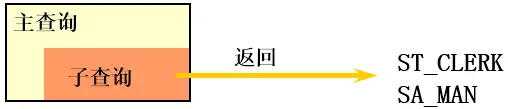
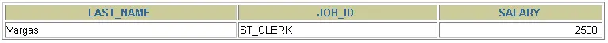

# 第 09 章_子查询

讲师：尚硅谷-宋红康（江湖人称：康师傅）

官网：[http://www.atguigu.com](http://www.atguigu.com/)

***

子查询指一个查询语句嵌套在另一个查询语句内部的查询，这个特性从 MySQL 4.1 开始引入。

SQL 中子查询的使用大大增强了 SELECT 查询的能力，因为很多时候查询需要从结果集中获取数据，或者需要从同一个表中先计算得出一个数据结果，然后与这个数据结果（可能是某个标量，也可能是某个集合）进行比较。

## 1. 需求分析与问题解决

### 1.1 实际问题


现有解决方式：

```sql
#方式一：
SELECT salary
FROM employees
WHERE last_name = 'Abel';

SELECT last_name,salary
FROM employees
WHERE salary > 11000;

#方式二：自连接
SELECT e2.last_name,e2.salary
FROM employees e1,employees e2
WHERE e1.last_name = 'Abel'
AND e1.`salary` < e2.`salary`
```

```sql
#方式三：子查询
SELECT last_name,salary
FROM employees
WHERE salary > (
		SELECT salary
		FROM employees
		WHERE last_name = 'Abel'
		);
```

 

### 1.2 子查询的基本使用

- 子查询的基本语法结构：

 

- 子查询（内查询）在主查询之前一次执行完成。
- 子查询的结果被主查询（外查询）使用 。
- **注意事项**
  - 子查询要包含在括号内
  - 将子查询放在比较条件的右侧
  - 单行操作符对应单行子查询，多行操作符对应多行子查询

### 1.3 子查询的分类

**分类方式 1：**

我们按内查询的结果返回一条还是多条记录，将子查询分为`单行子查询`、`多行子查询`。

- 单行子查询

  

- 多行子查询



**分类方式 2：**

我们按内查询是否被执行多次，将子查询划分为`相关(或关联)子查询`和`不相关(或非关联)子查询`。

子查询从数据表中查询了数据结果，如果这个数据结果只执行一次，然后这个数据结果作为主查询的条件进行执行，那么这样的子查询叫做不相关子查询。

同样，如果子查询需要执行多次，即采用循环的方式，先从外部查询开始，每次都传入子查询进行查询，然后再将结果反馈给外部，这种嵌套的执行方式就称为相关子查询。

## 2. 单行子查询

### 2.1 单行比较操作符

| 操作符 | 含义                     |
|:-------|:-------------------------|
| =      | equal to                 |
| >      | greater than             |
| >=     | greater than or equal to |
| <      | less than                |
| <=     | less than or equal to    |
| <>     | not equal to             |

### 2.2 代码示例

**题目：查询工资大于 149 号员工工资的员工的信息**

 

 

**题目：返回 job_id 与 141 号员工相同，salary 比 143 号员工多的员工姓名，job_id 和工资**

```sql
SELECT last_name, job_id, salary
FROM employees
WHERE job_id =  
                (SELECT job_id
                 FROM employees
                 WHERE employee_id = 141)
AND salary >
                (SELECT salary
                 FROM employees
                 WHERE employee_id = 143);
```


**题目：返回公司工资最少的员工的 last_name,job_id 和 salary**

```sql
SELECT last_name, job_id, salary
FROM employees
WHERE salary = 
                (SELECT MIN(salary)
                 FROM employees);
```



**题目：查询与 141 号或 174 号员工的 manager_id 和 department_id 相同的其他员工的 employee_id，manager_id，department_id**

实现方式 1：不成对比较

```
SELECT employee_id, manager_id, department_id
FROM employees
WHERE manager_id IN
		  (SELECT manager_id
                   FROM employees
                   WHERE employee_id IN (174,141))
AND department_id IN 
		  (SELECT department_id
                   FROM employees
                   WHERE employee_id IN (174,141))
AND	employee_id NOT IN(174,141);
```

实现方式 2：成对比较

```
SELECT employee_id, manager_id, department_id
FROM employees
WHERE (manager_id, department_id) IN
                      (SELECT manager_id, department_id
                       FROM employees
                       WHERE employee_id IN (141,174))
AND	employee_id NOT IN (141,174);
```

### 2.3 HAVING 中的子查询

- 首先执行子查询。
- 向主查询中的 HAVING 子句返回结果。

**题目：查询最低工资大于 50 号部门最低工资的部门 id 和其最低工资**

```sql
SELECT department_id, MIN(salary)
FROM employees
GROUP BY department_id
HAVING MIN(salary) >
                       (SELECT MIN(salary)
                        FROM employees
                        WHERE department_id = 50);
```

### 2.4 CASE 中的子查询

在 CASE 表达式中使用单列子查询：

**题目：显式员工的 employee_id,last_name 和 location。其中，若员工 department_id 与 location_id 为 1800 的 department_id 相同，则 location 为’Canada’，其余则为’USA’。**

```
SELECT employee_id, last_name,
       (CASE department_id
        WHEN
             (SELECT department_id FROM departments
	      WHERE location_id = 1800)           
        THEN 'Canada' ELSE 'USA' END) location
FROM employees;
```

### 2.5 子查询中的空值问题

```sql
SELECT last_name, job_id
FROM employees
WHERE job_id =
                (SELECT job_id
                 FROM employees
                 WHERE last_name = 'Haas');
```


> **子查询不返回任何行**

### 2.5 非法使用子查询

```sql
SELECT employee_id, last_name
FROM employees
WHERE salary =
                (SELECT MIN(salary)
                 FROM employees
                 GROUP BY department_id);
```


> **多行子查询使用单行比较符**

## 3. 多行子查询

- 也称为集合比较子查询
- 内查询返回多行
- 使用多行比较操作符

### 3.1 多行比较操作符

| 操作符 | 含义                                                         |
|:-------|:-------------------------------------------------------------|
| IN     | 等于列表中的**任意一个**                                     |
| ANY    | 需要和单行比较操作符一起使用，和子查询返回的**某一个**值比较 |
| ALL    | 需要和单行比较操作符一起使用，和子查询返回的**所有**值比较   |
| SOME   | 实际上是 ANY 的别名，作用相同，一般常使用 ANY                   |

> 体会 ANY 和 ALL 的区别

### 3.2 代码示例

**题目：返回其它 job_id 中比 job_id 为‘IT_PROG’部门任一工资低的员工的员工号、姓名、job_id 以及 salary**


**题目：返回其它 job_id 中比 job_id 为‘IT_PROG’部门所有工资都低的员工的员工号、姓名、job_id 以及 salary**


**题目：查询平均工资最低的部门 id**

```sql
#方式1：
SELECT department_id
FROM employees
GROUP BY department_id
HAVING AVG(salary) = (
			SELECT MIN(avg_sal)
			FROM (
				SELECT AVG(salary) avg_sal
				FROM employees
				GROUP BY department_id
				) dept_avg_sal
			)
```

```sql
#方式2：
SELECT department_id
FROM employees
GROUP BY department_id
HAVING AVG(salary) <= ALL (
				SELECT AVG(salary) avg_sal
				FROM employees
				GROUP BY department_id
)
```

### 3.3 空值问题

```sql
SELECT last_name
FROM employees
WHERE employee_id NOT IN (
			SELECT manager_id
			FROM employees
			);
```

 

## 4. 相关子查询

### 4.1 相关子查询执行流程

如果子查询的执行依赖于外部查询，通常情况下都是因为子查询中的表用到了外部的表，并进行了条件关联，因此每执行一次外部查询，子查询都要重新计算一次，这样的子查询就称之为`关联子查询`。

相关子查询按照一行接一行的顺序执行，主查询的每一行都执行一次子查询。


说明：**子查询中使用主查询中的列**

### 4.2 代码示例

**题目：查询员工中工资大于本部门平均工资的员工的 last_name,salary 和其 department_id**

**方式一：相关子查询**


**方式二：在 FROM 中使用子查询**

```sql
SELECT last_name,salary,e1.department_id
FROM employees e1,(SELECT department_id,AVG(salary) dept_avg_sal FROM employees GROUP BY department_id) e2
WHERE e1.`department_id` = e2.department_id
AND e2.dept_avg_sal < e1.`salary`;
```

> from 型的子查询：子查询是作为 from 的一部分，子查询要用()引起来，并且要给这个子查询取别名，
> 把它当成一张“临时的虚拟的表”来使用。

在 ORDER BY 中使用子查询：

**题目：查询员工的 id,salary,按照 department_name 排序**

```sql
SELECT employee_id,salary
FROM employees e
ORDER BY (
	  SELECT department_name
	  FROM departments d
	  WHERE e.`department_id` = d.`department_id`
	);
```

**题目：若 employees 表中 employee_id 与 job_history 表中 employee_id 相同的数目不小于 2，输出这些相同 id 的员工的 employee_id,last_name 和其 job_id**

```
SELECT e.employee_id, last_name,e.job_id
FROM employees e 
WHERE 2 <= (SELECT COUNT(*)
             FROM job_history 
             WHERE employee_id = e.employee_id);
```

### 4.3 EXISTS 与 NOT EXISTS 关键字

- 关联子查询通常也会和 EXISTS 操作符一起来使用，用来检查在子查询中是否存在满足条件的行。
- **如果在子查询中不存在满足条件的行：**
  - 条件返回 FALSE
  - 继续在子查询中查找
- **如果在子查询中存在满足条件的行：**
  - 不在子查询中继续查找
  - 条件返回 TRUE
- NOT EXISTS 关键字表示如果不存在某种条件，则返回 TRUE，否则返回 FALSE。

**题目：查询公司管理者的 employee_id，last_name，job_id，department_id 信息**

方式一：

```sql
SELECT employee_id, last_name, job_id, department_id
FROM employees e1
WHERE EXISTS ( SELECT *
                 FROM employees e2
                 WHERE e2.manager_id = 
                        e1.employee_id);
```

方式二：自连接

```sql
SELECT DISTINCT e1.employee_id, e1.last_name, e1.job_id, e1.department_id
FROM employees e1 JOIN employees e2
WHERE e1.employee_id = e2.manager_id;
```

方式三：

```sql
SELECT employee_id,last_name,job_id,department_id
FROM employees
WHERE employee_id IN (
		     SELECT DISTINCT manager_id
		     FROM employees
		     );
```

**题目：查询 departments 表中，不存在于 employees 表中的部门的 department_id 和 department_name**

```sql
SELECT department_id, department_name
FROM departments d
WHERE NOT EXISTS (SELECT 'X'
                  FROM employees
                  WHERE department_id = d.department_id);
```


### 4.4 相关更新

```sql
UPDATE table1 alias1
SET column = (SELECT expression
             FROM table2 alias2
             WHERE alias1.column = alias2.column);
```

使用相关子查询依据一个表中的数据更新另一个表的数据。

**题目：在 employees 中增加一个 department_name 字段，数据为员工对应的部门名称**

```sql
# 1）
ALTER TABLE employees
ADD(department_name VARCHAR2(14));

# 2）
UPDATE employees e
SET department_name =  (SELECT department_name 
	                       FROM departments d
	                       WHERE e.department_id = d.department_id);
```

### 4.4 相关删除
```sql
 DELETE FROM table1 alias1
 WHERE column operator (SELECT expression
                        FROM table2 alias2
                        WHERE alias1.column = alias2.column);
```

使用相关子查询依据一个表中的数据删除另一个表的数据。

**题目：删除表 employees 中，其与 emp_history 表皆有的数据**

```sql
DELETE FROM employees e
WHERE employee_id in  
           (SELECT employee_id
            FROM emp_history 
            WHERE employee_id = e.employee_id);
```

## 5. 抛一个思考题
**问题**：谁的工资比 Abel 的高？

**解答：**

```sql
#方式1：自连接
SELECT e2.last_name,e2.salary
FROM employees e1,employees e2
WHERE e1.last_name = 'Abel'
AND e1.`salary` < e2.`salary`
```

```sql
#方式2：子查询
SELECT last_name,salary
FROM employees
WHERE salary > (
		SELECT salary
		FROM employees
		WHERE last_name = 'Abel'
		);
```

**问题**：以上两种方式有好坏之分吗？

**解答**：自连接方式好！

题目中可以使用子查询，也可以使用自连接。一般情况建议你使用自连接，因为在许多 DBMS 的处理过程中，对于自连接的处理速度要比子查询快得多。

可以这样理解：子查询实际上是通过未知表进行查询后的条件判断，而自连接是通过已知的自身数据表进行条件判断，因此在大部分 DBMS 中都对自连接处理进行了优化。

## 课堂笔记 SQL
```sql
# 第09章_子查询

#1. 由一个具体的需求，引入子查询
#需求：谁的工资比Abel的高？
#方式1：
SELECT salary
FROM employees
WHERE last_name = 'Abel';

SELECT last_name,salary
FROM employees
WHERE salary > 11000;

#方式2：自连接
SELECT e2.last_name,e2.salary
FROM employees e1,employees e2
WHERE e2.`salary` > e1.`salary` #多表的连接条件
AND e1.last_name = 'Abel';

#方式3：子查询
SELECT last_name,salary
FROM employees
WHERE salary > (
		SELECT salary
		FROM employees
		WHERE last_name = 'Abel'
		);

#2. 称谓的规范：外查询（或主查询）、内查询（或子查询）
/*
- 子查询（内查询）在主查询之前一次执行完成。
- 子查询的结果被主查询（外查询）使用 。
- 注意事项
  - 子查询要包含在括号内
  - 将子查询放在比较条件的右侧
  - 单行操作符对应单行子查询，多行操作符对应多行子查询

*/

#不推荐：
SELECT last_name,salary
FROM employees
WHERE  (
	SELECT salary
	FROM employees
	WHERE last_name = 'Abel'
		) < salary;
		
/*
3. 子查询的分类
角度1：从内查询返回的结果的条目数
	单行子查询  vs  多行子查询

角度2：内查询是否被执行多次
	相关子查询  vs  不相关子查询
	
 比如：相关子查询的需求：查询工资大于本部门平均工资的员工信息。
       不相关子查询的需求：查询工资大于本公司平均工资的员工信息。
*/

#子查询的编写技巧（或步骤）：① 从里往外写  ② 从外往里写

#4. 单行子查询
#4.1 单行操作符： =  !=  >   >=  <  <= 
#题目：查询工资大于149号员工工资的员工的信息

SELECT employee_id,last_name,salary
FROM employees
WHERE salary > (
		SELECT salary
		FROM employees
		WHERE employee_id = 149
		);

#题目：返回job_id与141号员工相同，salary比143号员工多的员工姓名，job_id和工资
SELECT last_name,job_id,salary
FROM employees
WHERE job_id = (
		SELECT job_id
		FROM employees
		WHERE employee_id = 141
		)
AND salary > (
		SELECT salary
		FROM employees
		WHERE employee_id = 143
		);


#题目：返回公司工资最少的员工的last_name,job_id和salary
SELECT last_name,job_id,salary
FROM employees
WHERE salary = (
		SELECT MIN(salary)
		FROM employees
		);

#题目：查询与141号员工的manager_id和department_id相同的其他员工
#的employee_id，manager_id，department_id。
#方式1：
SELECT employee_id,manager_id,department_id
FROM employees
WHERE manager_id = (
		    SELECT manager_id
		    FROM employees
		    WHERE employee_id = 141
		   )
AND department_id = (
		    SELECT department_id
		    FROM employees
		    WHERE employee_id = 141
		   )
AND employee_id <> 141;

#方式2：了解
SELECT employee_id,manager_id,department_id
FROM employees
WHERE (manager_id,department_id) = (
				    SELECT manager_id,department_id
			            FROM employees
				    WHERE employee_id = 141
				   )
AND employee_id <> 141;

#题目：查询最低工资大于110号部门最低工资的部门id和其最低工资
SELECT department_id,MIN(salary)
FROM employees
WHERE department_id IS NOT NULL
GROUP BY department_id
HAVING MIN(salary) > (
			SELECT MIN(salary)
			FROM employees
			WHERE department_id = 110
		     );

#题目：显式员工的employee_id,last_name和location。
#其中，若员工department_id与location_id为1800的department_id相同，
#则location为’Canada’，其余则为’USA’。

SELECT employee_id,last_name,CASE department_id WHEN (SELECT department_id FROM departments WHERE location_id = 1800) THEN 'Canada'
						ELSE 'USA' END "location"
FROM employees;

#4.2 子查询中的空值问题
SELECT last_name, job_id
FROM   employees
WHERE  job_id =
                (SELECT job_id
                 FROM   employees
                 WHERE  last_name = 'Haas');
                 
#4.3 非法使用子查询
#错误：Subquery returns more than 1 row
SELECT employee_id, last_name
FROM   employees
WHERE  salary =
                (SELECT   MIN(salary)
                 FROM     employees
                 GROUP BY department_id);         

#5.多行子查询
#5.1 多行子查询的操作符： IN  ANY ALL SOME(同ANY)

#5.2举例：
# IN:
SELECT employee_id, last_name
FROM   employees
WHERE  salary IN
                (SELECT   MIN(salary)
                 FROM     employees
                 GROUP BY department_id); 
                 
# ANY / ALL:
#题目：返回其它job_id中比job_id为‘IT_PROG’部门任一工资低的员工的员工号、
#姓名、job_id 以及salary

SELECT employee_id,last_name,job_id,salary
FROM employees
WHERE job_id <> 'IT_PROG'
AND salary < ANY (
		SELECT salary
		FROM employees
		WHERE job_id = 'IT_PROG'
		);

#题目：返回其它job_id中比job_id为‘IT_PROG’部门所有工资低的员工的员工号、
#姓名、job_id 以及salary
SELECT employee_id,last_name,job_id,salary
FROM employees
WHERE job_id <> 'IT_PROG'
AND salary < ALL (
		SELECT salary
		FROM employees
		WHERE job_id = 'IT_PROG'
		);
		
#题目：查询平均工资最低的部门id
#MySQL中聚合函数是不能嵌套使用的。
#方式1：
SELECT department_id
FROM employees
GROUP BY department_id
HAVING AVG(salary) = (
			SELECT MIN(avg_sal)
			FROM(
				SELECT AVG(salary) avg_sal
				FROM employees
				GROUP BY department_id
				) t_dept_avg_sal
			);

#方式2：
SELECT department_id
FROM employees
GROUP BY department_id
HAVING AVG(salary) <= ALL(	
			SELECT AVG(salary) avg_sal
			FROM employees
			GROUP BY department_id
			) 
#5.3 空值问题
SELECT last_name
FROM employees
WHERE employee_id NOT IN (
			SELECT manager_id
			FROM employees
			);
			
#6. 相关子查询
#回顾：查询员工中工资大于公司平均工资的员工的last_name,salary和其department_id
#6.1 
SELECT last_name,salary,department_id
FROM employees
WHERE salary > (
		SELECT AVG(salary)
		FROM employees
		);
		
#题目：查询员工中工资大于本部门平均工资的员工的last_name,salary和其department_id
#方式1：使用相关子查询
SELECT last_name,salary,department_id
FROM employees e1
WHERE salary > (
		SELECT AVG(salary)
		FROM employees e2
		WHERE department_id = e1.`department_id`
		);

#方式2：在FROM中声明子查询
SELECT e.last_name,e.salary,e.department_id
FROM employees e,(
		SELECT department_id,AVG(salary) avg_sal
		FROM employees
		GROUP BY department_id) t_dept_avg_sal
WHERE e.department_id = t_dept_avg_sal.department_id
AND e.salary > t_dept_avg_sal.avg_sal


#题目：查询员工的id,salary,按照department_name 排序
SELECT employee_id,salary
FROM employees e
ORDER BY (
	 SELECT department_name
	 FROM departments d
	 WHERE e.`department_id` = d.`department_id`
	) ASC;

#结论：在SELECT中，除了GROUP BY 和 LIMIT之外，其他位置都可以声明子查询！
/*
SELECT ....,....,....(存在聚合函数)
FROM ... (LEFT / RIGHT)JOIN ....ON 多表的连接条件 
(LEFT / RIGHT)JOIN ... ON ....
WHERE 不包含聚合函数的过滤条件
GROUP BY ...,....
HAVING 包含聚合函数的过滤条件
ORDER BY ....,...(ASC / DESC )
LIMIT ...,....
*/

#题目：若employees表中employee_id与job_history表中employee_id相同的数目不小于2，
#输出这些相同id的员工的employee_id,last_name和其job_id
SELECT *
FROM job_history;

SELECT employee_id,last_name,job_id
FROM employees e
WHERE 2 <= (
	    SELECT COUNT(*)
	    FROM job_history j
	    WHERE e.`employee_id` = j.`employee_id`
		)

#6.2 EXISTS 与 NOT EXISTS关键字

#题目：查询公司管理者的employee_id，last_name，job_id，department_id信息
#方式1：自连接
SELECT DISTINCT mgr.employee_id,mgr.last_name,mgr.job_id,mgr.department_id
FROM employees emp JOIN employees mgr
ON emp.manager_id = mgr.employee_id;

#方式2：子查询
SELECT employee_id,last_name,job_id,department_id
FROM employees
WHERE employee_id IN (
			SELECT DISTINCT manager_id
			FROM employees
			);

#方式3：使用EXISTS
SELECT employee_id,last_name,job_id,department_id
FROM employees e1
WHERE EXISTS (
	       SELECT *
	       FROM employees e2
	       WHERE e1.`employee_id` = e2.`manager_id`
	     );

#题目：查询departments表中，不存在于employees表中的部门的department_id和department_name
#方式1：
SELECT d.department_id,d.department_name
FROM employees e RIGHT JOIN departments d
ON e.`department_id` = d.`department_id`
WHERE e.`department_id` IS NULL;

#方式2：
SELECT department_id,department_name
FROM departments d
WHERE NOT EXISTS (
		SELECT *
		FROM employees e
		WHERE d.`department_id` = e.`department_id`
		);

SELECT COUNT(*)
FROM departments;
```

## 课后练习 SQL
```sql
# 第09章_子查询的课后练习
#1.查询和Zlotkey相同部门的员工姓名和工资
SELECT last_name,salary
FROM employees
WHERE department_id IN (
			SELECT department_id
			FROM employees
			WHERE last_name = 'Zlotkey'
			);

#2.查询工资比公司平均工资高的员工的员工号，姓名和工资。
SELECT employee_id,last_name,salary
FROM employees
WHERE salary > (
		SELECT AVG(salary)
		FROM employees
		);

#3.选择工资大于所有JOB_ID = 'SA_MAN'的员工的工资的员工的last_name, job_id, salary
SELECT last_name,job_id,salary
FROM employees
WHERE salary > ALL(
		SELECT salary
		FROM employees
		WHERE job_id = 'SA_MAN'
		);


#4.查询和姓名中包含字母u的员工在相同部门的员工的员工号和姓名
SELECT employee_id,last_name
FROM employees 
WHERE department_id IN (
			SELECT DISTINCT department_id
			FROM employees
			WHERE last_name LIKE '%u%'
			);


#5.查询在部门的location_id为1700的部门工作的员工的员工号
SELECT employee_id
FROM employees
WHERE department_id IN (
			SELECT department_id
			FROM departments
			WHERE location_id = 1700
			);


#6.查询管理者是King的员工姓名和工资
SELECT last_name,salary,manager_id
FROM employees
WHERE manager_id IN (
			SELECT employee_id
			FROM employees
			WHERE last_name = 'King'
			);


#7.查询工资最低的员工信息: last_name, salary
SELECT last_name,salary
FROM employees
WHERE salary = (
		SELECT MIN(salary)
		FROM employees
		);


#8.查询平均工资最低的部门信息
#方式1：
SELECT *
FROM departments
WHERE department_id = (
			SELECT department_id
			FROM employees
			GROUP BY department_id
			HAVING AVG(salary ) = (
						SELECT MIN(avg_sal)
						FROM (
							SELECT AVG(salary) avg_sal
							FROM employees
							GROUP BY department_id
							) t_dept_avg_sal

						)
			);
#方式2：
SELECT *
FROM departments
WHERE department_id = (
			SELECT department_id
			FROM employees
			GROUP BY department_id
			HAVING AVG(salary ) <= ALL(
						SELECT AVG(salary)
						FROM employees
						GROUP BY department_id
						)
			);

#方式3： LIMIT
SELECT *
FROM departments
WHERE department_id = (
			SELECT department_id
			FROM employees
			GROUP BY department_id
			HAVING AVG(salary ) =(
						SELECT AVG(salary) avg_sal
						FROM employees
						GROUP BY department_id
						ORDER BY avg_sal ASC
						LIMIT 1		
						)
			);

#方式4：
SELECT d.*
FROM departments d,(
		SELECT department_id,AVG(salary) avg_sal
		FROM employees
		GROUP BY department_id
		ORDER BY avg_sal ASC
		LIMIT 0,1
		) t_dept_avg_sal
WHERE d.`department_id` = t_dept_avg_sal.department_id
		
#9.查询平均工资最低的部门信息和该部门的平均工资（相关子查询）
#方式1：
SELECT d.*,(SELECT AVG(salary) FROM employees WHERE department_id = d.`department_id`) avg_sal
FROM departments d
WHERE department_id = (
			SELECT department_id
			FROM employees
			GROUP BY department_id
			HAVING AVG(salary ) = (
						SELECT MIN(avg_sal)
						FROM (
							SELECT AVG(salary) avg_sal
							FROM employees
							GROUP BY department_id
							) t_dept_avg_sal

						)
			);

#方式2：
SELECT d.*,(SELECT AVG(salary) FROM employees WHERE department_id = d.`department_id`) avg_sal
FROM departments d
WHERE department_id = (
			SELECT department_id
			FROM employees
			GROUP BY department_id
			HAVING AVG(salary ) <= ALL(
						SELECT AVG(salary)
						FROM employees
						GROUP BY department_id
						)
			);

#方式3： LIMIT
SELECT d.*,(SELECT AVG(salary) FROM employees WHERE department_id = d.`department_id`) avg_sal
FROM departments d
WHERE department_id = (
			SELECT department_id
			FROM employees
			GROUP BY department_id
			HAVING AVG(salary ) =(
						SELECT AVG(salary) avg_sal
						FROM employees
						GROUP BY department_id
						ORDER BY avg_sal ASC
						LIMIT 1		
						)
			);

#方式4：
SELECT d.*,(SELECT AVG(salary) FROM employees WHERE department_id = d.`department_id`) avg_sal
FROM departments d,(
		SELECT department_id,AVG(salary) avg_sal
		FROM employees
		GROUP BY department_id
		ORDER BY avg_sal ASC
		LIMIT 0,1
		) t_dept_avg_sal
WHERE d.`department_id` = t_dept_avg_sal.department_id

#10.查询平均工资最高的 job 信息
#方式1：
SELECT *
FROM jobs
WHERE job_id = (
		SELECT job_id
		FROM employees
		GROUP BY job_id
		HAVING AVG(salary) = (
					SELECT MAX(avg_sal)
					FROM (
						SELECT AVG(salary) avg_sal
						FROM employees
						GROUP BY job_id
						) t_job_avg_sal
					)
		);

#方式2：
SELECT *
FROM jobs
WHERE job_id = (
		SELECT job_id
		FROM employees
		GROUP BY job_id
		HAVING AVG(salary) >= ALL(
				     SELECT AVG(salary) 
				     FROM employees
				     GROUP BY job_id
				     )
		);

#方式3：
SELECT *
FROM jobs
WHERE job_id = (
		SELECT job_id
		FROM employees
		GROUP BY job_id
		HAVING AVG(salary) =(
				     SELECT AVG(salary) avg_sal
				     FROM employees
				     GROUP BY job_id
				     ORDER BY avg_sal DESC
				     LIMIT 0,1
				     )
		);

#方式4：
SELECT j.*
FROM jobs j,(
		SELECT job_id,AVG(salary) avg_sal
		FROM employees
		GROUP BY job_id
		ORDER BY avg_sal DESC
		LIMIT 0,1		
		) t_job_avg_sal
WHERE j.job_id = t_job_avg_sal.job_id
		
#11.查询平均工资高于公司平均工资的部门有哪些?
SELECT department_id
FROM employees
WHERE department_id IS NOT NULL
GROUP BY department_id
HAVING AVG(salary) > (
			SELECT AVG(salary)
			FROM employees
			);


#12.查询出公司中所有 manager 的详细信息
#方式1：自连接  xxx worked for yyy
SELECT DISTINCT mgr.employee_id,mgr.last_name,mgr.job_id,mgr.department_id
FROM employees emp JOIN employees mgr
ON emp.manager_id = mgr.employee_id;

#方式2：子查询
SELECT employee_id,last_name,job_id,department_id
FROM employees
WHERE employee_id IN (
			SELECT DISTINCT manager_id
			FROM employees
			);

#方式3：使用EXISTS
SELECT employee_id,last_name,job_id,department_id
FROM employees e1
WHERE EXISTS (
	       SELECT *
	       FROM employees e2
	       WHERE e1.`employee_id` = e2.`manager_id`
	     );

	
#13.各个部门中 最高工资中最低的那个部门的 最低工资是多少?
#方式1：
SELECT MIN(salary)
FROM employees
WHERE department_id = (
			SELECT department_id
			FROM employees
			GROUP BY department_id
			HAVING MAX(salary) = (
						SELECT MIN(max_sal)
						FROM (
							SELECT MAX(salary) max_sal
							FROM employees
							GROUP BY department_id
							) t_dept_max_sal
						)
			);

SELECT *
FROM employees
WHERE department_id = 10;

#方式2：
SELECT MIN(salary)
FROM employees
WHERE department_id = (
			SELECT department_id
			FROM employees
			GROUP BY department_id
			HAVING MAX(salary) <= ALL (
						SELECT MAX(salary)
						FROM employees
						GROUP BY department_id
						)
			);

#方式3：
SELECT MIN(salary)
FROM employees
WHERE department_id = (
			SELECT department_id
			FROM employees
			GROUP BY department_id
			HAVING MAX(salary) = (
						SELECT MAX(salary) max_sal
						FROM employees
						GROUP BY department_id
						ORDER BY max_sal ASC
						LIMIT 0,1
						)
			);
			
#方式4：
SELECT MIN(salary)
FROM employees e,(
		SELECT department_id,MAX(salary) max_sal
		FROM employees
		GROUP BY department_id
		ORDER BY max_sal ASC
		LIMIT 0,1
		) t_dept_max_sal
WHERE e.department_id = t_dept_max_sal.department_id


#14.查询平均工资最高的部门的 manager 的详细信息: last_name, department_id, email, salary
#方式1：
SELECT last_name, department_id, email, salary
FROM employees
WHERE employee_id = ANY (
			SELECT DISTINCT manager_id
			FROM employees
			WHERE department_id = (
						SELECT department_id
						FROM employees
						GROUP BY department_id
						HAVING AVG(salary) = (
									SELECT MAX(avg_sal)
									FROM (
										SELECT AVG(salary) avg_sal
										FROM employees
										GROUP BY department_id
										) t_dept_avg_sal
									)
						)
			);

#方式2：
SELECT last_name, department_id, email, salary
FROM employees
WHERE employee_id = ANY (
			SELECT DISTINCT manager_id
			FROM employees
			WHERE department_id = (
						SELECT department_id
						FROM employees
						GROUP BY department_id
						HAVING AVG(salary) >= ALL (
								SELECT AVG(salary) avg_sal
								FROM employees
								GROUP BY department_id
								)
						)
			);

#方式3：
SELECT last_name, department_id, email, salary
FROM employees
WHERE employee_id IN (
			SELECT DISTINCT manager_id
			FROM employees e,(
					SELECT department_id,AVG(salary) avg_sal
					FROM employees
					GROUP BY department_id
					ORDER BY avg_sal DESC
					LIMIT 0,1
					) t_dept_avg_sal
			WHERE e.`department_id` = t_dept_avg_sal.department_id
			);


#15. 查询部门的部门号，其中不包括job_id是"ST_CLERK"的部门号
#方式1：
SELECT department_id
FROM departments
WHERE department_id NOT IN (
			SELECT DISTINCT department_id
			FROM employees
			WHERE job_id = 'ST_CLERK'
			);

#方式2：
SELECT department_id
FROM departments d
WHERE NOT EXISTS (
		SELECT *
		FROM employees e
		WHERE d.`department_id` = e.`department_id`
		AND e.`job_id` = 'ST_CLERK'
		);


#16. 选择所有没有管理者的员工的last_name
SELECT last_name
FROM employees emp
WHERE NOT EXISTS (
		SELECT *
		FROM employees mgr
		WHERE emp.`manager_id` = mgr.`employee_id`
		);

#17．查询员工号、姓名、雇用时间、工资，其中员工的管理者为 'De Haan'
#方式1：
SELECT employee_id,last_name,hire_date,salary
FROM employees
WHERE manager_id IN (
		SELECT employee_id
		FROM employees
		WHERE last_name = 'De Haan'
		);

#方式2：
SELECT employee_id,last_name,hire_date,salary
FROM employees e1
WHERE EXISTS (
		SELECT *
		FROM employees e2
		WHERE e1.`manager_id` = e2.`employee_id`
		AND e2.last_name = 'De Haan'
		); 


#18.查询各部门中工资比本部门平均工资高的员工的员工号, 姓名和工资（相关子查询）
#方式1：使用相关子查询
SELECT last_name,salary,department_id
FROM employees e1
WHERE salary > (
		SELECT AVG(salary)
		FROM employees e2
		WHERE department_id = e1.`department_id`
		);

#方式2：在FROM中声明子查询
SELECT e.last_name,e.salary,e.department_id
FROM employees e,(
		SELECT department_id,AVG(salary) avg_sal
		FROM employees
		GROUP BY department_id) t_dept_avg_sal
WHERE e.department_id = t_dept_avg_sal.department_id
AND e.salary > t_dept_avg_sal.avg_sal


#19.查询每个部门下的部门人数大于 5 的部门名称（相关子查询）
SELECT department_name
FROM departments d
WHERE 5 < (
	   SELECT COUNT(*)
	   FROM employees e
	   WHERE d.department_id = e.`department_id`
	  );


#20.查询每个国家下的部门个数大于 2 的国家编号（相关子查询）
SELECT * FROM locations;

SELECT country_id
FROM locations l
WHERE 2 < (
	   SELECT COUNT(*)
	   FROM departments d
	   WHERE l.`location_id` = d.`location_id`
	 );

/* 
子查询的编写技巧（或步骤）：① 从里往外写  ② 从外往里写

如何选择？
① 如果子查询相对较简单，建议从外往里写。一旦子查询结构较复杂，则建议从里往外写
② 如果是相关子查询的话，通常都是从外往里写。
*/
```
