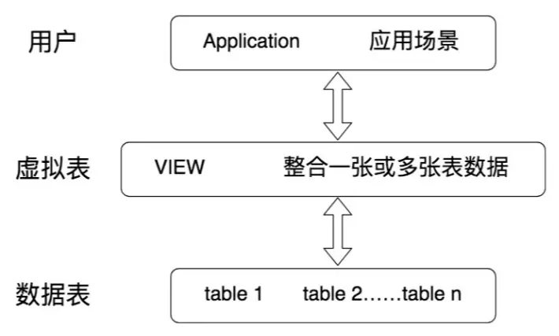
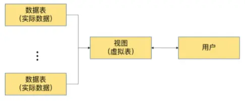

# 第 14 章_视图

讲师：尚硅谷-宋红康（江湖人称：康师傅）

官网：[http://www.atguigu.com](http://www.atguigu.com/)

***

## 1. 常见的数据库对象

| 对象                | 描述                                                         |
|:--------------------|:-------------------------------------------------------------|
| 表(TABLE)           | 表是存储数据的逻辑单元，以行和列的形式存在，列就是字段，行就是记录 |
| 数据字典            | 就是系统表，存放数据库相关信息的表。系统表的数据通常由数据库系统维护，程序员通常不应该修改，只可查看 |
| 约束(CONSTRAINT)    | 执行数据校验的规则，用于保证数据完整性的规则                 |
| 视图(VIEW)          | 一个或者多个数据表里的数据的逻辑显示，视图并不存储数据       |
| 索引(INDEX)         | 用于提高查询性能，相当于书的目录                             |
| 存储过程(PROCEDURE) | 用于完成一次完整的业务处理，没有返回值，但可通过传出参数将多个值传给调用环境 |
| 存储函数(FUNCTION)  | 用于完成一次特定的计算，具有一个返回值                       |
| 触发器(TRIGGER)     | 相当于一个事件监听器，当数据库发生特定事件后，触发器被触发，完成相应的处理 |

## 2. 视图概述


### 2.1 为什么使用视图？

视图一方面可以帮我们使用表的一部分而不是所有的表，另一方面也可以针对不同的用户制定不同的查询视图。比如，针对一个公司的销售人员，我们只想给他看部分数据，而某些特殊的数据，比如采购的价格，则不会提供给他。再比如，人员薪酬是个敏感的字段，那么只给某个级别以上的人员开放，其他人的查询视图中则不提供这个字段。

刚才讲的只是视图的一个使用场景，实际上视图还有很多作用。最后，我们总结视图的优点。

### 2.2 视图的理解

- 视图是一种`虚拟表`，本身是`不具有数据`的，占用很少的内存空间，它是 SQL 中的一个重要概念。

- **视图建立在已有表的基础上**，视图赖以建立的这些表称为**基表**。

  

- 视图的创建和删除只影响视图本身，不影响对应的基表。但是当对视图中的数据进行增加、删除和修改操作时，数据表中的数据会相应地发生变化，反之亦然。

- 向视图提供数据内容的语句为 SELECT 语句, 可以将视图理解为**存储起来的** **SELECT** **语句** 

  - 在数据库中，视图不会保存数据，数据真正保存在数据表中。当对视图中的数据进行增加、删除和修改操作时，数据表中的数据会相应地发生变化；反之亦然。

- 视图，是向用户提供基表数据的另一种表现形式。通常情况下，小型项目的数据库可以不使用视图，但是在大型项目中，以及数据表比较复杂的情况下，视图的价值就凸显出来了，它可以帮助我们把经常查询的结果集放到虚拟表中，提升使用效率。理解和使用起来都非常方便。

## 3. 创建视图

- **在** **CREATE VIEW** **语句中嵌入子查询**

```sql
CREATE [OR REPLACE] 
[ALGORITHM = {UNDEFINED | MERGE | TEMPTABLE}] 
VIEW 视图名称 [(字段列表)]
AS 查询语句
[WITH [CASCADED|LOCAL] CHECK OPTION]
```

- 精简版

```sql
CREATE VIEW 视图名称 
AS 查询语句
```

### 3.1 创建单表视图

举例：

```sql
CREATE VIEW empvu80
AS 
SELECT  employee_id, last_name, salary
FROM    employees
WHERE   department_id = 80;
```

查询视图：

```
SELECT *
FROM	salvu80;
```


举例：

```sql
CREATE VIEW emp_year_salary (ename,year_salary)
AS 
SELECT ename,salary*12*(1+IFNULL(commission_pct,0))
FROM t_employee;
```

举例：

```sql
CREATE VIEW salvu50
AS 
SELECT  employee_id ID_NUMBER, last_name NAME,salary*12 ANN_SALARY
FROM    employees
WHERE   department_id = 50;
```

说明 1：实际上就是我们在 SQL 查询语句的基础上封装了视图 VIEW，这样就会基于 SQL 语句的结果集形成一张虚拟表。

说明 2：在创建视图时，没有在视图名后面指定字段列表，则视图中字段列表默认和 SELECT 语句中的字段列表一致。如果 SELECT 语句中给字段取了别名，那么视图中的字段名和别名相同。

### 3.2 创建多表联合视图

举例：

```sql
CREATE VIEW empview 
AS 
SELECT employee_id emp_id,last_name NAME,department_name
FROM employees e,departments d
WHERE e.department_id = d.department_id;
```

```sql
CREATE VIEW emp_dept
AS 
SELECT ename,dname
FROM t_employee LEFT JOIN t_department
ON t_employee.did = t_department.did;
```

```sql
CREATE VIEW	dept_sum_vu(name, minsal, maxsal, avgsal)
AS 
SELECT d.department_name, MIN(e.salary), MAX(e.salary),AVG(e.salary)
FROM employees e, departments d
WHERE e.department_id = d.department_id 
GROUP BY  d.department_name;
```

- **利用视图对数据进行格式化**

我们经常需要输出某个格式的内容，比如想输出员工姓名和对应的部门名，对应格式为 `emp_name(department_name)`，就可以使用视图来完成数据格式化的操作：

```sql
CREATE VIEW emp_depart
AS
SELECT CONCAT(last_name,'(',department_name,')') AS emp_dept
FROM employees e JOIN departments d
WHERE e.department_id = d.department_id
```

### 3.3 基于视图创建视图

当我们创建好一张视图之后，还可以在它的基础上继续创建视图。

举例：联合“emp_dept”视图和“emp_year_salary”视图查询员工姓名、部门名称、年薪信息创建 “emp_dept_ysalary”视图。

```sql
CREATE VIEW emp_dept_ysalary
AS 
SELECT emp_dept.ename,dname,year_salary
FROM emp_dept INNER JOIN emp_year_salary
ON emp_dept.ename = emp_year_salary.ename;
```

## 4. 查看视图

语法 1：查看数据库的表对象、视图对象

```sql
SHOW TABLES;
```

语法 2：查看视图的结构

```sql
DESC / DESCRIBE 视图名称;
```

语法 3：查看视图的属性信息

```sql
# 查看视图信息（显示数据表的存储引擎、版本、数据行数和数据大小等）
SHOW TABLE STATUS LIKE '视图名称'\G
```

执行结果显示，注释 Comment 为 VIEW，说明该表为视图，其他的信息为 NULL，说明这是一个虚表。

语法 4：查看视图的详细定义信息

```sql
SHOW CREATE VIEW 视图名称;
```

## 5. 更新视图的数据

### 5.1 一般情况

MySQL 支持使用 INSERT、UPDATE 和 DELETE 语句对视图中的数据进行插入、更新和删除操作。当视图中的数据发生变化时，数据表中的数据也会发生变化，反之亦然。

举例：UPDATE 操作

```sql
mysql> SELECT ename,tel FROM emp_tel WHERE ename = '孙洪亮';
+---------+-------------+
| ename   | tel         |
+---------+-------------+
| 孙洪亮 	| 13789098765 |
+---------+-------------+
1 row in set (0.01 sec)

mysql> UPDATE emp_tel SET tel = '13789091234' WHERE ename = '孙洪亮';
Query OK, 1 row affected (0.01 sec)
Rows matched: 1  Changed: 1  Warnings: 0

mysql> SELECT ename,tel FROM emp_tel WHERE ename = '孙洪亮';
+---------+-------------+
| ename	  | tel         |
+---------+-------------+
| 	孙洪亮 | 13789091234 |
+---------+-------------+
1 row in set (0.00 sec)

mysql> SELECT ename,tel FROM t_employee WHERE ename = '孙洪亮';
+---------+-------------+
| ename   | tel         |
+---------+-------------+
| 孙洪亮 	| 13789091234 |
+---------+-------------+
1 row in set (0.00 sec)
```

举例：DELETE 操作

```sql
mysql> SELECT ename,tel FROM emp_tel WHERE ename = '孙洪亮';
+---------+-------------+
| ename  	| tel           |
+---------+-------------+
| 孙洪亮 	| 13789091234 |
+---------+-------------+
1 row in set (0.00 sec)

mysql> DELETE FROM emp_tel  WHERE ename = '孙洪亮';
Query OK, 1 row affected (0.01 sec)

mysql> SELECT ename,tel FROM emp_tel WHERE ename = '孙洪亮';
Empty set (0.00 sec)

mysql> SELECT ename,tel FROM t_employee WHERE ename = '孙洪亮';
Empty set (0.00 sec)
```

### 5.2 不可更新的视图

要使视图可更新，视图中的行和底层基本表中的行之间必须存在`一对一`的关系。另外当视图定义出现如下情况时，视图不支持更新操作：

- 在定义视图的时候指定了“ALGORITHM = TEMPTABLE”，视图将不支持 INSERT 和 DELETE 操作；
- 视图中不包含基表中所有被定义为非空又未指定默认值的列，视图将不支持 INSERT 操作；
- 在定义视图的 SELECT 语句中使用了`JOIN联合查询`，视图将不支持 INSERT 和 DELETE 操作；
- 在定义视图的 SELECT 语句后的字段列表中使用了`数学表达式`或`子查询`，视图将不支持 INSERT，也不支持 UPDATE 使用了数学表达式、子查询的字段值；
- 在定义视图的 SELECT 语句后的字段列表中使用`DISTINCT`、`聚合函数`、`GROUP BY`、`HAVING`、`UNION`等，视图将不支持 INSERT、UPDATE、DELETE；
- 在定义视图的 SELECT 语句中包含了子查询，而子查询中引用了 FROM 后面的表，视图将不支持 INSERT、UPDATE、DELETE；
- 视图定义基于一个`不可更新视图`；
- 常量视图。

举例：

```sql
mysql> CREATE OR REPLACE VIEW emp_dept
    -> (ename,salary,birthday,tel,email,hiredate,dname)
    -> AS SELECT ename,salary,birthday,tel,email,hiredate,dname
    -> FROM t_employee INNER JOIN t_department
    -> ON t_employee.did = t_department.did ;
Query OK, 0 rows affected (0.01 sec)
```

```sql
mysql> INSERT INTO emp_dept(ename,salary,birthday,tel,email,hiredate,dname)
    -> VALUES('张三',15000,'1995-01-08','18201587896',
    -> 'zs@atguigu.com','2022-02-14','新部门');
    
#ERROR 1393 (HY000): Can not modify more than one base table through a join view 'atguigu_chapter9.emp_dept'
```

从上面的 SQL 执行结果可以看出，在定义视图的 SELECT 语句中使用了 JOIN 联合查询，视图将不支持更新操作。

> 虽然可以更新视图数据，但总的来说，视图作为`虚拟表`，主要用于`方便查询`，不建议更新视图的数据。**对视图数据的更改，都是通过对实际数据表里数据的操作来完成的。**

## 6. 修改、删除视图

### 6.1 修改视图

方式 1：使用 CREATE **OR REPLACE** VIEW 子句**修改视图**

```sql
CREATE OR REPLACE VIEW empvu80(id_number, name, sal, department_id)
AS 
SELECT  employee_id, first_name || ' ' || last_name, salary, department_id
FROM employees
WHERE department_id = 80;
```

> 说明：CREATE VIEW 子句中各列的别名应和子查询中各列相对应。

方式 2：ALTER VIEW

修改视图的语法是：

```sql
ALTER VIEW 视图名称 
AS
查询语句
```

### 6.2 删除视图

- 删除视图只是删除视图的定义，并不会删除基表的数据。

- 删除视图的语法是：

  ```sql
  DROP VIEW IF EXISTS 视图名称;
  ```

  ```sql
  DROP VIEW IF EXISTS 视图名称1,视图名称2,视图名称3,...;
  ```

- 举例：

  ```sql
  DROP VIEW empvu80;
  ```

- 说明：基于视图 a、b 创建了新的视图 c，如果将视图 a 或者视图 b 删除，会导致视图 c 的查询失败。这样的视图 c 需要手动删除或修改，否则影响使用。

## 7. 总结

### 7.1 视图优点

**1. 操作简单**

将经常使用的查询操作定义为视图，可以使开发人员不需要关心视图对应的数据表的结构、表与表之间的关联关系，也不需要关心数据表之间的业务逻辑和查询条件，而只需要简单地操作视图即可，极大简化了开发人员对数据库的操作。

**2. 减少数据冗余**

视图跟实际数据表不一样，它存储的是查询语句。所以，在使用的时候，我们要通过定义视图的查询语句来获取结果集。而视图本身不存储数据，不占用数据存储的资源，减少了数据冗余。

**3. 数据安全**

MySQL 将用户对数据的`访问限制`在某些数据的结果集上，而这些数据的结果集可以使用视图来实现。用户不必直接查询或操作数据表。这也可以理解为视图具有`隔离性`。视图相当于在用户和实际的数据表之间加了一层虚拟表。



同时，MySQL 可以根据权限将用户对数据的访问限制在某些视图上，**用户不需要查询数据表，可以直接通过视图获取数据表中的信息**。这在一定程度上保障了数据表中数据的安全性。

**4. 适应灵活多变的需求**

当业务系统的需求发生变化后，如果需要改动数据表的结构，则工作量相对较大，可以使用视图来减少改动的工作量。这种方式在实际工作中使用得比较多。

**5. 能够分解复杂的查询逻辑**

数据库中如果存在复杂的查询逻辑，则可以将问题进行分解，创建多个视图获取数据，再将创建的多个视图结合起来，完成复杂的查询逻辑。

### 7.2 视图不足

如果我们在实际数据表的基础上创建了视图，那么，**如果实际数据表的结构变更了，我们就需要及时对相关的视图进行相应的维护**。特别是嵌套的视图（就是在视图的基础上创建视图），维护会变得比较复杂，`可读性不好`，容易变成系统的潜在隐患。因为创建视图的 SQL 查询可能会对字段重命名，也可能包含复杂的逻辑，这些都会增加维护的成本。

实际项目中，如果视图过多，会导致数据库维护成本的问题。

所以，在创建视图的时候，你要结合实际项目需求，综合考虑视图的优点和不足，这样才能正确使用视图，使系统整体达到最优。

## 课堂笔记 SQL
```sql
#第14章_视图(View)
/*
1. 视图的理解
① 视图，可以看做是一个虚拟表，本身是不存储数据的。
  视图的本质，就可以看做是存储起来的SELECT语句
  
② 视图中SELECT语句中涉及到的表，称为基表

③ 针对视图做DML操作，会影响到对应的基表中的数据。反之亦然。

④ 视图本身的删除，不会导致基表中数据的删除。

⑤ 视图的应用场景：针对于小型项目，不推荐使用视图。针对于大型项目，可以考虑使用视图。

⑥ 视图的优点：简化查询; 控制数据的访问
*/

#2. 如何创建视图
#准备工作
CREATE DATABASE dbtest14;

USE dbtest14;

CREATE TABLE emps
AS
SELECT *
FROM atguigudb.`employees`;

CREATE TABLE depts
AS
SELECT *
FROM atguigudb.`departments`;

SELECT * FROM emps;

SELECT * FROM depts;

DESC emps;

DESC atguigudb.employees;


#2.1 针对于单表
#情况1：视图中的字段与基表的字段有对应关系
CREATE VIEW vu_emp1
AS
SELECT employee_id,last_name,salary
FROM emps;

SELECT * FROM vu_emp1;

#确定视图中字段名的方式1：
CREATE VIEW vu_emp2
AS
SELECT employee_id emp_id,last_name lname,salary #查询语句中字段的别名会作为视图中字段的名称出现
FROM emps
WHERE salary > 8000;

#确定视图中字段名的方式2：
CREATE VIEW vu_emp3(emp_id,NAME,monthly_sal) #小括号内字段个数与SELECT中字段个数相同
AS
SELECT employee_id,last_name,salary 
FROM emps
WHERE salary > 8000;

SELECT * FROM vu_emp3;

#情况2：视图中的字段在基表中可能没有对应的字段
CREATE VIEW vu_emp_sal
AS
SELECT department_id,AVG(salary) avg_sal
FROM emps
WHERE department_id IS NOT NULL
GROUP BY department_id;

SELECT * FROM vu_emp_sal;

#2.2 针对于多表
CREATE VIEW vu_emp_dept
AS
SELECT e.employee_id,e.department_id,d.department_name
FROM emps e JOIN depts d
ON e.`department_id` = d.`department_id`;

SELECT * FROM vu_emp_dept;

#利用视图对数据进行格式化
CREATE VIEW vu_emp_dept1
AS
SELECT CONCAT(e.last_name,'(',d.department_name,')') emp_info
FROM emps e JOIN depts d
ON e.`department_id` = d.`department_id`;

SELECT * FROM vu_emp_dept1;

#2.3 基于视图创建视图
CREATE VIEW vu_emp4
AS
SELECT employee_id,last_name
FROM vu_emp1;

SELECT * FROM vu_emp4; 


#3. 查看视图
# 语法1：查看数据库的表对象、视图对象
SHOW TABLES;

#语法2：查看视图的结构
DESCRIBE vu_emp1;

#语法3：查看视图的属性信息
SHOW TABLE STATUS LIKE 'vu_emp1';

#语法4：查看视图的详细定义信息
SHOW CREATE VIEW vu_emp1;

#4."更新"视图中的数据
#4.1 一般情况，可以更新视图的数据
SELECT * FROM vu_emp1;

SELECT employee_id,last_name,salary
FROM emps;
#更新视图的数据，会导致基表中数据的修改
UPDATE vu_emp1
SET salary = 20000
WHERE employee_id = 101;

#同理，更新表中的数据，也会导致视图中的数据的修改
UPDATE emps
SET salary = 10000
WHERE employee_id = 101;

#删除视图中的数据，也会导致表中的数据的删除
DELETE FROM vu_emp1
WHERE employee_id = 101;

SELECT employee_id,last_name,salary
FROM emps
WHERE employee_id = 101;

#4.2 不能更新视图中的数据
SELECT * FROM vu_emp_sal;

#更新失败
UPDATE vu_emp_sal
SET avg_sal = 5000
WHERE department_id = 30;

#删除失败
DELETE FROM vu_emp_sal
WHERE department_id = 30;

#5. 修改视图
DESC vu_emp1;

#方式1
CREATE OR REPLACE VIEW vu_emp1
AS
SELECT employee_id,last_name,salary,email
FROM emps
WHERE salary > 7000;

#方式2
ALTER VIEW vu_emp1
AS 
SELECT employee_id,last_name,salary,email,hire_date
FROM emps;

#6. 删除视图
SHOW TABLES;

DROP VIEW vu_emp4;

DROP VIEW IF EXISTS vu_emp2,vu_emp3;
```

## 课后练习 SQL
```sql
#第14章_视图的课后练习
USE dbtest14;
#练习1：
#1. 使用表emps创建视图employee_vu，
#其中包括姓名（LAST_NAME），员工号（EMPLOYEE_ID），部门号(DEPARTMENT_ID)

CREATE OR REPLACE VIEW employee_vu(lname,emp_id,dept_id)
AS
SELECT last_name,employee_id,department_id
FROM emps;


#2. 显示视图的结构
DESC employee_vu;

#3. 查询视图中的全部内容
SELECT * FROM employee_vu;

#4. 将视图中的数据限定在部门号是80的范围内
CREATE OR REPLACE VIEW employee_vu(lname,emp_id,dept_id)
AS
SELECT last_name,employee_id,department_id
FROM emps
WHERE department_id = 80;

#练习2：
CREATE TABLE emps
AS
SELECT * FROM atguigudb.employees;

DESC emps;

#1. 创建视图emp_v1,要求查询电话号码以‘011’开头的员工姓名和工资、邮箱
CREATE OR REPLACE VIEW emp_v1
AS
SELECT last_name,salary,email
FROM emps
WHERE phone_number LIKE '011%';


#2. 要求将视图 emp_v1 修改为查询电话号码以‘011’开头的并且邮箱中包含 e 字符
#的员工姓名和邮箱、电话号码

CREATE OR REPLACE VIEW emp_v1
AS
SELECT last_name,email,phone_number,salary
FROM emps
WHERE phone_number LIKE '011%'
AND email LIKE '%e%';

SELECT * FROM emp_v1;

#3. 向 emp_v1 插入一条记录，是否可以？
DESC emps;

# 实测：失败了
INSERT INTO emp_v1
VALUES('Tom','tom@126.com','01012345');


#4. 修改emp_v1中员工的工资，每人涨薪1000
SELECT *
FROM emp_v1;

UPDATE emp_v1
SET salary = salary + 1000;

#5. 删除emp_v1中姓名为Olsen的员工
DELETE FROM emp_v1
WHERE last_name = 'Olsen';

#6. 创建视图emp_v2，要求查询部门的最高工资高于 12000 的部门id和其最高工资
CREATE OR REPLACE VIEW emp_v2(dept_id,max_sal)
AS
SELECT department_id,MAX(salary)
FROM emps
GROUP BY department_id
HAVING MAX(salary) > 12000;

SELECT * FROM emp_v2;

#7. 向 emp_v2 中插入一条记录，是否可以？
不可以！
#错误：The target table emp_v2 of the INSERT is not insertable-into
INSERT INTO emp_v2(dept_id,max_sal)
VALUES(4000,20000);


#8. 删除刚才的emp_v2 和 emp_v1
DROP VIEW IF EXISTS emp_v1,emp_v2;

SHOW TABLES;
```
