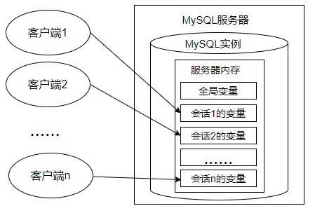
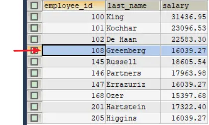

# 第 16 章_变量、流程控制与游标

讲师：尚硅谷-宋红康（江湖人称：康师傅）

官网：[http://www.atguigu.com](http://www.atguigu.com/)

***

## 1. 变量

在 MySQL 数据库的存储过程和函数中，可以使用变量来存储查询或计算的中间结果数据，或者输出最终的结果数据。

在 MySQL 数据库中，变量分为`系统变量`以及`用户自定义变量`。

### 1.1 系统变量

#### 1.1.1 系统变量分类

变量由系统定义，不是用户定义，属于`服务器`层面。启动 MySQL 服务，生成 MySQL 服务实例期间，MySQL 将为 MySQL 服务器内存中的系统变量赋值，这些系统变量定义了当前 MySQL 服务实例的属性、特征。这些系统变量的值要么是`编译MySQL时参数`的默认值，要么是`配置文件`（例如 my.ini 等）中的参数值。大家可以通过 [官方文档](https://dev.mysql.com/doc/refman/8.0/en/server-system-variables.html) 查看 MySQL 文档的系统变量。

系统变量分为全局系统变量（需要添加`global` 关键字）以及会话系统变量（需要添加 `session` 关键字），有时也把全局系统变量简称为全局变量，有时也把会话系统变量称为 local 变量。**如果不写，默认会话级别**。静态变量（在 MySQL 服务实例运行期间它们的值不能使用 set 动态修改）属于特殊的全局系统变量。

每一个 MySQL 客户机成功连接 MySQL 服务器后，都会产生与之对应的会话。会话期间，MySQL 服务实例会在 MySQL 服务器内存中生成与该会话对应的会话系统变量，这些会话系统变量的初始值是全局系统变量值的复制。如下图：



- 全局系统变量针对于所有会话（连接）有效，但`不能跨重启`
- 会话系统变量仅针对于当前会话（连接）有效。会话期间，当前会话对某个会话系统变量值的修改，不会影响其他会话同一个会话系统变量的值。
- 会话 1 对某个全局系统变量值的修改会导致会话 2 中同一个全局系统变量值的修改。

在 MySQL 中有些系统变量只能是全局的，例如 max_connections 用于限制服务器的最大连接数；有些系统变量作用域既可以是全局又可以是会话，例如 character_set_client 用于设置客户端的字符集；有些系统变量的作用域只能是当前会话，例如 pseudo_thread_id 用于标记当前会话的 MySQL 连接 ID。

#### 1.1.2 查看系统变量

- **查看所有或部分系统变量**

```sql
#查看所有全局变量
SHOW GLOBAL VARIABLES;

#查看所有会话变量
SHOW SESSION VARIABLES;
或
SHOW VARIABLES;
```

```sql
#查看满足条件的部分系统变量。
SHOW GLOBAL VARIABLES LIKE '%标识符%';

#查看满足条件的部分会话变量
SHOW SESSION VARIABLES LIKE '%标识符%';
```

举例：

```sql
SHOW GLOBAL VARIABLES LIKE 'admin_%';
```

- **查看指定系统变量**

作为 MySQL 编码规范，MySQL 中的系统变量以`两个“@”`开头，其中 `@@global` 仅用于标记全局系统变量，`@@session` 仅用于标记会话系统变量。“@@”首先标记会话系统变量，如果会话系统变量不存在，则标记全局系统变量。

```sql
#查看指定的系统变量的值
SELECT @@global.变量名;

#查看指定的会话变量的值
SELECT @@session.变量名;
#或者
SELECT @@变量名;
```

- **修改系统变量的值**

有些时候，数据库管理员需要修改系统变量的默认值，以便修改当前会话或者 MySQL 服务实例的属性、特征。具体方法：

方式 1：修改 MySQL`配置文件`，继而修改 MySQL 系统变量的值（该方法需要重启 MySQL 服务）

方式 2：在 MySQL 服务运行期间，使用“set”命令重新设置系统变量的值

```sql
#为某个系统变量赋值
#方式1：
SET @@global.变量名=变量值;
#方式2：
SET GLOBAL 变量名=变量值;


#为某个会话变量赋值
#方式1：
SET @@session.变量名=变量值;
#方式2：
SET SESSION 变量名=变量值;
```

举例：

```sql
SELECT @@global.autocommit;
SET GLOBAL autocommit=0;
```

```sql
SELECT @@session.tx_isolation;
SET @@session.tx_isolation='read-uncommitted';
```

```sql
SET GLOBAL max_connections = 1000;
SELECT @@global.max_connections;
```


### 1.2 用户变量

#### 1.2.1 用户变量分类

用户变量是用户自己定义的，作为 MySQL 编码规范，MySQL 中的用户变量以`一个“@”`开头。根据作用范围不同，又分为`会话用户变量`和`局部变量`。

- 会话用户变量：作用域和会话变量一样，只对`当前连接`会话有效。

- 局部变量：只在 BEGIN 和 END 语句块中有效。局部变量只能在`存储过程和函数`中使用。

#### 1.2.2 会话用户变量

- 变量的定义

```sql
#方式1：“=”或“:=”
SET @用户变量 = 值;
SET @用户变量 := 值;

#方式2：“:=” 或 INTO关键字
SELECT @用户变量 := 表达式 [FROM 等子句];
SELECT 表达式 INTO @用户变量  [FROM 等子句];
```

- 查看用户变量的值 （查看、比较、运算等）

```sql
SELECT @用户变量
```

- 举例

```sql
SET @a = 1;

SELECT @a;
```

```sql
SELECT @num := COUNT(*) FROM employees;

SELECT @num;
```

```sql
SELECT AVG(salary) INTO @avgsalary FROM employees;

SELECT @avgsalary;
```

```sql
SELECT @big;  #查看某个未声明的变量时，将得到NULL值
```

#### 1.2.3 局部变量

定义：可以使用`DECLARE`语句定义一个局部变量

作用域：仅仅在定义它的 BEGIN ... END 中有效

位置：只能放在 BEGIN ... END 中，而且只能放在第一句

```sql
BEGIN
	#声明局部变量
	DECLARE 变量名1 变量数据类型 [DEFAULT 变量默认值];
	DECLARE 变量名2,变量名3,... 变量数据类型 [DEFAULT 变量默认值];

	#为局部变量赋值
	SET 变量名1 = 值;
	SELECT 值 INTO 变量名2 [FROM 子句];

	#查看局部变量的值
	SELECT 变量1,变量2,变量3;
END
```

**1.定义变量**

```sql
DECLARE 变量名 类型 [default 值];  # 如果没有DEFAULT子句，初始值为NULL
```

举例：

```sql
DECLARE　myparam　INT　DEFAULT 100;
```

**2.变量赋值**

方式 1：一般用于赋简单的值

```sql
SET 变量名=值;
SET 变量名:=值;
```

方式 2：一般用于赋表中的字段值


```sql
SELECT 字段名或表达式 INTO 变量名 FROM 表;
```

**3.使用变量**（查看、比较、运算等）

```sql
SELECT 局部变量名;
```

举例 1：声明局部变量，并分别赋值为 employees 表中 employee_id 为 102 的 last_name 和 salary

```sql
DELIMITER //

CREATE PROCEDURE set_value()
BEGIN
	DECLARE emp_name VARCHAR(25);
	DECLARE sal DOUBLE(10,2);
	
	SELECT last_name,salary INTO emp_name,sal
	FROM employees 
	WHERE employee_id = 102;
	
	SELECT emp_name,sal;
END //

DELIMITER ;
```

举例 2：声明两个变量，求和并打印 （分别使用会话用户变量、局部变量的方式实现）

```sql
#方式1：使用用户变量
SET @m=1;
SET @n=1;
SET @sum=@m+@n;

SELECT @sum;
```

```sql
#方式2：使用局部变量
DELIMITER //

CREATE PROCEDURE add_value()
BEGIN
	#局部变量
	DECLARE m INT DEFAULT 1;
	DECLARE n INT DEFAULT 3;
	DECLARE SUM INT;
	
	SET SUM = m+n;
	SELECT SUM;
END //

DELIMITER ;
```

举例 3：创建存储过程“different_salary”查询某员工和他领导的薪资差距，并用 IN 参数 emp_id 接收员工 id，用 OUT 参数 dif_salary 输出薪资差距结果。

```sql
#声明
DELIMITER //

CREATE PROCEDURE different_salary(IN emp_id INT,OUT dif_salary DOUBLE)
BEGIN
	#声明局部变量
	DECLARE emp_sal,mgr_sal DOUBLE DEFAULT 0.0;
	DECLARE mgr_id INT;
	
	SELECT salary INTO emp_sal FROM employees WHERE employee_id = emp_id;
	SELECT manager_id INTO mgr_id FROM employees WHERE employee_id = emp_id;
	SELECT salary INTO mgr_sal FROM employees WHERE employee_id = mgr_id;
	SET dif_salary = mgr_sal - emp_sal;
END //

DELIMITER ;

#调用
SET @emp_id = 102;
CALL different_salary(@emp_id,@diff_sal);

#查看
SELECT @diff_sal;
```

#### 1.2.4 对比会话用户变量与局部变量

|        | 作用域              | 定义位置             | 语法              |
|:-------|:-----------------|:-----------------|:----------------|
| 会话用户变量 | 当前会话             | 会话的任何地方          | 加`@`符号，不用指定类型   |
| 局部变量   | 定义它的`BEGIN END`中 | `BEGIN END`的第一句话 | 一般不用加`@`,需要指定类型 |

## 2. 定义条件与处理程序

`定义条件`是事先定义程序执行过程中可能遇到的问题，`处理程序`定义了在遇到问题时应当采取的处理方式，并且保证存储过程或函数在遇到警告或错误时能继续执行。这样可以增强存储程序处理问题的能力，避免程序异常停止运行。

说明：定义条件和处理程序在存储过程、存储函数中都是支持的。

### 2.1 案例分析

**案例分析**：创建一个名称为“UpdateDataNoCondition”的存储过程。代码如下：

```sql
DELIMITER //

CREATE PROCEDURE UpdateDataNoCondition()
	BEGIN
		SET @x = 1;
		UPDATE employees SET email = NULL WHERE last_name = 'Abel';
		SET @x = 2;
		UPDATE employees SET email = 'aabbel' WHERE last_name = 'Abel';
		SET @x = 3;
	END //

DELIMITER ;
```

调用存储过程：

```sql
mysql> CALL UpdateDataNoCondition();
ERROR 1048 (23000): Column 'email' cannot be null

mysql> SELECT @x;
+------+
| @x   |
+------+
|   1  |
+------+
1 row in set (0.00 sec)
```

可以看到，此时@x 变量的值为 1。结合创建存储过程的 SQL 语句代码可以得出：在存储过程中未定义条件和处理程序，且当存储过程中执行的 SQL 语句报错时，MySQL 数据库会抛出错误，并退出当前 SQL 逻辑，不再向下继续执行。

### 2.2 定义条件

定义条件就是给 MySQL 中的错误码命名，这有助于存储的程序代码更清晰。它将一个`错误名字`和`指定的错误条件`关联起来。这个名字可以随后被用在定义处理程序的`DECLARE HANDLER`语句中。

定义条件使用 DECLARE 语句，语法格式如下：

```sql
DECLARE 错误名称 CONDITION FOR 错误码（或错误条件）
```

错误码的说明：

- `MySQL_error_code`和`sqlstate_value`都可以表示 MySQL 的错误。
  - MySQL_error_code 是数值类型错误代码。
  - sqlstate_value 是长度为 5 的字符串类型错误代码。
- 例如，在 ERROR 1418 (HY000)中，1418 是 MySQL_error_code，'HY000'是 sqlstate_value。
- 例如，在 ERROR 1142(42000)中，1142 是 MySQL_error_code，'42000'是 sqlstate_value。

**举例 1**：定义 `Field_Not_Be_NULL` 错误名与 MySQL 中违反非空约束的错误类型是 `ERROR 1048 (23000)` 对应。

```sql
#使用MySQL_error_code
DECLARE Field_Not_Be_NULL CONDITION FOR 1048;

#使用sqlstate_value
DECLARE Field_Not_Be_NULL CONDITION FOR SQLSTATE '23000';
```

**举例 2**：定义 `ERROR 1148(42000)` 错误，名称为 `command_not_allowed`。

```sql
#使用MySQL_error_code
DECLARE command_not_allowed CONDITION FOR 1148;

#使用sqlstate_value
DECLARE command_not_allowed CONDITION FOR SQLSTATE '42000';
```

### 2.3 定义处理程序

可以为 SQL 执行过程中发生的某种类型的错误定义特殊的处理程序。定义处理程序时，使用 DECLARE 语句的语法如下：

```sql
DECLARE 处理方式 HANDLER FOR 错误类型 处理语句
```

- **处理方式**：处理方式有 3 个取值：CONTINUE、EXIT、UNDO。
  - `CONTINUE`：表示遇到错误不处理，继续执行。
  - `EXIT`：表示遇到错误马上退出。
  - `UNDO`：表示遇到错误后撤回之前的操作。MySQL 中暂时不支持这样的操作。
- **错误类型**（即条件）可以有如下取值：
  - `SQLSTATE '字符串错误码'`：表示长度为 5 的 sqlstate_value 类型的错误代码；
  - `MySQL_error_code`：匹配数值类型错误代码；
  - `错误名称`：表示 DECLARE ... CONDITION 定义的错误条件名称。
  - `SQLWARNING`：匹配所有以 01 开头的 SQLSTATE 错误代码；
  - `NOT FOUND`：匹配所有以 02 开头的 SQLSTATE 错误代码；
  - `SQLEXCEPTION`：匹配所有没有被 SQLWARNING 或 NOT FOUND 捕获的 SQLSTATE 错误代码；
- **处理语句**：如果出现上述条件之一，则采用对应的处理方式，并执行指定的处理语句。语句可以是像“`SET 变量 = 值`”这样的简单语句，也可以是使用`BEGIN ... END`编写的复合语句。

定义处理程序的几种方式，代码如下：

```sql
#方法1：捕获sqlstate_value
DECLARE CONTINUE HANDLER FOR SQLSTATE '42S02' SET @info = 'NO_SUCH_TABLE';

#方法2：捕获mysql_error_value
DECLARE CONTINUE HANDLER FOR 1146 SET @info = 'NO_SUCH_TABLE';

#方法3：先定义条件，再调用
DECLARE no_such_table CONDITION FOR 1146;
DECLARE CONTINUE HANDLER FOR NO_SUCH_TABLE SET @info = 'NO_SUCH_TABLE';

#方法4：使用SQLWARNING
DECLARE EXIT HANDLER FOR SQLWARNING SET @info = 'ERROR';

#方法5：使用NOT FOUND
DECLARE EXIT HANDLER FOR NOT FOUND SET @info = 'NO_SUCH_TABLE';

#方法6：使用SQLEXCEPTION
DECLARE EXIT HANDLER FOR SQLEXCEPTION SET @info = 'ERROR';
```

### 2.4 案例解决

在存储过程中，定义处理程序，捕获 sqlstate_value 值，当遇到 MySQL_error_code 值为 1048 时，执行 CONTINUE 操作，并且将@proc_value 的值设置为-1。

```sql
DELIMITER //

CREATE PROCEDURE UpdateDataNoCondition()
	BEGIN
		#定义处理程序
		DECLARE CONTINUE HANDLER FOR 1048 SET @proc_value = -1;
		
		SET @x = 1;
		UPDATE employees SET email = NULL WHERE last_name = 'Abel';
		SET @x = 2;
		UPDATE employees SET email = 'aabbel' WHERE last_name = 'Abel';
		SET @x = 3;
	END //

DELIMITER ;
```

调用过程：

```sql
mysql> CALL UpdateDataWithCondition();
Query OK, 0 rows affected (0.01 sec)

mysql> SELECT @x,@proc_value;
+------+-------------+
| @x   | @proc_value |
+------+-------------+
|    3 |       	 -1  |
+------+-------------+
1 row in set (0.00 sec)
```

**举例：**

创建一个名称为“InsertDataWithCondition”的存储过程，代码如下。

在存储过程中，定义处理程序，捕获 sqlstate_value 值，当遇到 sqlstate_value 值为 23000 时，执行 EXIT 操作，并且将@proc_value 的值设置为-1。

```sql
#准备工作
CREATE TABLE departments
AS
SELECT * FROM atguigudb.`departments`;

ALTER TABLE departments
ADD CONSTRAINT uk_dept_name UNIQUE(department_id);
```

```sql
DELIMITER //

CREATE PROCEDURE InsertDataWithCondition()
	BEGIN
		DECLARE duplicate_entry CONDITION FOR SQLSTATE '23000' ;
		DECLARE EXIT HANDLER FOR duplicate_entry SET @proc_value = -1;
		
		SET @x = 1;
		INSERT INTO departments(department_name) VALUES('测试');
		SET @x = 2;
		INSERT INTO departments(department_name) VALUES('测试');
		SET @x = 3;
	END //

DELIMITER ;
```

调用存储过程：

```sql
mysql> CALL InsertDataWithCondition();
Query OK, 0 rows affected (0.01 sec)

mysql> SELECT @x,@proc_value;
+------+-------------+
| @x   | @proc_value |
+------+-------------+
|    2 |       	 -1  |
+------+-------------+
1 row in set (0.00 sec)
```

## 3. 流程控制

解决复杂问题不可能通过一个 SQL 语句完成，我们需要执行多个 SQL 操作。流程控制语句的作用就是控制存储过程中 SQL 语句的执行顺序，是我们完成复杂操作必不可少的一部分。只要是执行的程序，流程就分为三大类：

- `顺序结构`：程序从上往下依次执行
- `分支结构`：程序按条件进行选择执行，从两条或多条路径中选择一条执行
- `循环结构`：程序满足一定条件下，重复执行一组语句

针对于 MySQL 的流程控制语句主要有 3 类。注意：只能用于存储程序。

- `条件判断语句`：IF 语句和 CASE 语句
- `循环语句`：LOOP、WHILE 和 REPEAT 语句
- `跳转语句`：ITERATE 和 LEAVE 语句

### 3.1 分支结构之 IF

- IF 语句的语法结构是：


```sql
IF 表达式1 THEN 操作1
[ELSEIF 表达式2 THEN 操作2]……
[ELSE 操作N]
END IF
```

根据表达式的结果为 TRUE 或 FALSE 执行相应的语句。这里 `[]` 中的内容是可选的。

- 特点：① 不同的表达式对应不同的操作 ② 使用在 begin end 中

- **举例 1：**

  ```sql
  IF val IS NULL 
  	THEN SELECT 'val is null';
  ELSE SELECT 'val is not null';
  END IF;
  ```

- **举例 2**：声明存储过程 `update_salary_by_eid1`，定义 IN 参数 emp_id，输入员工编号。判断该员工薪资如果低于 8000 元并且入职时间超过 5 年，就涨薪 500 元；否则就不变。

  ```sql
  DELIMITER //
  
  CREATE PROCEDURE update_salary_by_eid1(IN emp_id INT)
  BEGIN
  	DECLARE emp_salary DOUBLE;
  	DECLARE hire_year DOUBLE;
  
  	SELECT salary INTO emp_salary FROM employees WHERE employee_id = emp_id;
  
  	SELECT DATEDIFF(CURDATE(),hire_date)/365 INTO hire_year
  	FROM employees WHERE employee_id = emp_id;
  
  	IF emp_salary < 8000 AND hire_year > 5
  	THEN UPDATE employees SET salary = salary + 500 WHERE employee_id = emp_id;
  	END IF;
  END //

  DELIMITER ;
  ```

- **举例 3**：声明存储过程 `update_salary_by_eid2`，定义 IN 参数 emp_id，输入员工编号。判断该员工薪资如果低于 9000 元并且入职时间超过 5 年，就涨薪 500 元；否则就涨薪 100 元。

  ```sql
  DELIMITER //
  
  CREATE PROCEDURE update_salary_by_eid2(IN emp_id INT)
  BEGIN
  	DECLARE emp_salary DOUBLE;
  	DECLARE hire_year DOUBLE;
  
  	SELECT salary INTO emp_salary FROM employees WHERE employee_id = emp_id;
  
  	SELECT DATEDIFF(CURDATE(),hire_date)/365 INTO hire_year
  	FROM employees WHERE employee_id = emp_id;
  
  	IF emp_salary < 8000 AND hire_year > 5
  		THEN UPDATE employees SET salary = salary + 500 WHERE employee_id = emp_id;
  	ELSE 
  		UPDATE employees SET salary = salary + 100 WHERE employee_id = emp_id;
  	END IF;
  END //

  DELIMITER ;
  ```
  
- **举例 4**：声明存储过程 `update_salary_by_eid3`，定义 IN 参数 emp_id，输入员工编号。判断该员工薪资如果低于 9000 元，就更新薪资为 9000 元；薪资如果大于等于 9000 元且低于 10000 的，但是奖金比例为 NULL 的，就更新奖金比例为 0.01；其他的涨薪 100 元。

  ```sql
  DELIMITER //
  
  CREATE PROCEDURE update_salary_by_eid3(IN emp_id INT)
  BEGIN
  	DECLARE emp_salary DOUBLE;
  	DECLARE bonus DECIMAL(3,2);
  
  	SELECT salary INTO emp_salary FROM employees WHERE employee_id = emp_id;
  	SELECT commission_pct INTO bonus FROM employees WHERE employee_id = emp_id;
  
  	IF emp_salary < 9000
  		THEN UPDATE employees SET salary = 9000 WHERE employee_id = emp_id;
  	ELSEIF emp_salary < 10000 AND bonus IS NULL
  		THEN UPDATE employees SET commission_pct = 0.01 WHERE employee_id = emp_id;
  	ELSE
  		UPDATE employees SET salary = salary + 100 WHERE employee_id = emp_id;
  	END IF;
  END //
  
  DELIMITER ;
  ```

### 3.2 分支结构之 CASE

CASE 语句的语法结构 1：

```sql
#情况一：类似于switch
CASE 表达式
WHEN 值1 THEN 结果1或语句1(如果是语句，需要加分号) 
WHEN 值2 THEN 结果2或语句2(如果是语句，需要加分号)
...
ELSE 结果n或语句n(如果是语句，需要加分号)
END [case]（如果是放在begin end中需要加上case，如果放在select后面不需要）
```

CASE 语句的语法结构 2：

```sql
#情况二：类似于多重if
CASE 
WHEN 条件1 THEN 结果1或语句1(如果是语句，需要加分号) 
WHEN 条件2 THEN 结果2或语句2(如果是语句，需要加分号)
...
ELSE 结果n或语句n(如果是语句，需要加分号)
END [case]（如果是放在begin end中需要加上case，如果放在select后面不需要）
```

- **举例 1：**

使用 CASE 流程控制语句的第 1 种格式，判断 val 值等于 1、等于 2，或者两者都不等。

```sql
CASE val
　　　WHEN 1 THEN SELECT 'val is 1';
　　　WHEN 2 THEN SELECT 'val is 2';
　　　ELSE SELECT 'val is not 1 or 2';
END CASE;
```

- **举例 2：**

使用 CASE 流程控制语句的第 2 种格式，判断 val 是否为空、小于 0、大于 0 或者等于 0。

```sql
CASE
	WHEN val IS NULL THEN SELECT 'val is null';
	WHEN val < 0 THEN SELECT 'val is less than 0';
	WHEN val > 0 THEN SELECT 'val is greater than 0';
	ELSE SELECT 'val is 0';
END CASE;
```

- **举例 3**：声明存储过程 `update_salary_by_eid4`，定义 IN 参数 emp_id，输入员工编号。判断该员工薪资如果低于 9000 元，就更新薪资为 9000 元；薪资大于等于 9000 元且低于 10000 的，但是奖金比例为 NULL 的，就更新奖金比例为 0.01；其他的涨薪 100 元。

```sql
DELIMITER //

CREATE PROCEDURE update_salary_by_eid4(IN emp_id INT)
BEGIN
	DECLARE emp_sal DOUBLE;
	DECLARE bonus DECIMAL(3,2);

	SELECT salary INTO emp_sal FROM employees WHERE employee_id = emp_id;
	SELECT commission_pct INTO bonus FROM employees WHERE employee_id = emp_id;

	CASE
	WHEN emp_sal<9000
		THEN UPDATE employees SET salary=9000 WHERE employee_id = emp_id;
	WHEN emp_sal<10000 AND bonus IS NULL
		THEN UPDATE employees SET commission_pct=0.01 WHERE employee_id = emp_id;
	ELSE
		UPDATE employees SET salary=salary+100 WHERE employee_id = emp_id;
	END CASE;
END //

DELIMITER ;
```

- **举例 4**：声明存储过程 update_salary_by_eid5，定义 IN 参数 emp_id，输入员工编号。判断该员工的入职年限，如果是 0 年，薪资涨 50；如果是 1 年，薪资涨 100；如果是 2 年，薪资涨 200；如果是 3 年，薪资涨 300；如果是 4 年，薪资涨 400；其他的涨薪 500。

```sql
DELIMITER //

CREATE PROCEDURE update_salary_by_eid5(IN emp_id INT)
BEGIN
	DECLARE emp_sal DOUBLE;
	DECLARE hire_year DOUBLE;

	SELECT salary INTO emp_sal FROM employees WHERE employee_id = emp_id;
	
	SELECT ROUND(DATEDIFF(CURDATE(),hire_date)/365) INTO hire_year FROM employees WHERE employee_id = emp_id;

	CASE hire_year
		WHEN 0 THEN UPDATE employees SET salary=salary+50 WHERE employee_id = emp_id;
		WHEN 1 THEN UPDATE employees SET salary=salary+100 WHERE employee_id = emp_id;
		WHEN 2 THEN UPDATE employees SET salary=salary+200 WHERE employee_id = emp_id;
		WHEN 3 THEN UPDATE employees SET salary=salary+300 WHERE employee_id = emp_id;
		WHEN 4 THEN UPDATE employees SET salary=salary+400 WHERE employee_id = emp_id;
		ELSE UPDATE employees SET salary=salary+500 WHERE employee_id = emp_id;
	END CASE;
END //

DELIMITER ;
```


### 3.3 循环结构之 LOOP

LOOP 循环语句用来重复执行某些语句。LOOP 内的语句一直重复执行直到循环被退出（使用 LEAVE 子句），跳出循环过程。

LOOP 语句的基本格式如下：

```sql
[loop_label:] LOOP
	循环执行的语句
END LOOP [loop_label]
```

其中，loop_label 表示 LOOP 语句的标注名称，该参数可以省略。

**举例 1：** 使用 LOOP 语句进行循环操作，id 值小于 10 时将重复执行循环过程。

```sql
DECLARE id INT DEFAULT 0;
add_loop:LOOP
	SET id = id +1;
	IF id >= 10 THEN LEAVE add_loop;
	END IF;

END LOOP add_loop;
```

**举例 2**：当市场环境变好时，公司为了奖励大家，决定给大家涨工资。声明存储过程“update_salary_loop()”，声明 OUT 参数 num，输出循环次数。存储过程中实现循环给大家涨薪，薪资涨为原来的 1.1 倍。直到全公司的平均薪资达到 12000 结束。并统计循环次数。

```sql
DELIMITER //

CREATE PROCEDURE update_salary_loop(OUT num INT)
BEGIN
	DECLARE avg_salary DOUBLE;
	DECLARE loop_count INT DEFAULT 0;
	
	SELECT AVG(salary) INTO avg_salary FROM employees;
	
	label_loop:LOOP
		IF avg_salary >= 12000 THEN LEAVE label_loop;
		END IF;
		
		UPDATE employees SET salary = salary * 1.1;
		SET loop_count = loop_count + 1;
		SELECT AVG(salary) INTO avg_salary FROM employees;
	END LOOP label_loop;
	
	SET num = loop_count;

END //

DELIMITER ;
```

### 3.4 循环结构之 WHILE

WHILE 语句创建一个带条件判断的循环过程。WHILE 在执行语句执行时，先对指定的表达式进行判断，如果为真，就执行循环内的语句，否则退出循环。WHILE 语句的基本格式如下：

```sql
[while_label:] WHILE 循环条件  DO
	循环体
END WHILE [while_label];
```

while_label 为 WHILE 语句的标注名称；如果循环条件结果为真，WHILE 语句内的语句或语句群被执行，直至循环条件为假，退出循环。

**举例 1：** WHILE 语句示例，i 值小于 10 时，将重复执行循环过程，代码如下：

```sql
DELIMITER //

CREATE PROCEDURE test_while()
BEGIN	
	DECLARE i INT DEFAULT 0;
	
	WHILE i < 10 DO
		SET i = i + 1;
	END WHILE;
	
	SELECT i;
END //

DELIMITER ;
#调用
CALL test_while();
```

**举例 2**：市场环境不好时，公司为了渡过难关，决定暂时降低大家的薪资。声明存储过程“update_salary_while()”，声明 OUT 参数 num，输出循环次数。存储过程中实现循环给大家降薪，薪资降为原来的 90%。直到全公司的平均薪资达到 5000 结束。并统计循环次数。

```sql
DELIMITER //

CREATE PROCEDURE update_salary_while(OUT num INT)
BEGIN
	DECLARE avg_sal DOUBLE ;
	DECLARE while_count INT DEFAULT 0;
	
	SELECT AVG(salary) INTO avg_sal FROM employees;
	
	WHILE avg_sal > 5000 DO
		UPDATE employees SET salary = salary * 0.9;
		
		SET while_count = while_count + 1;
		
		SELECT AVG(salary) INTO avg_sal FROM employees;
	END WHILE;
	
	SET num = while_count;

END //

DELIMITER ;
```


### 3.5 循环结构之 REPEAT

REPEAT 语句创建一个带条件判断的循环过程。与 WHILE 循环不同的是，REPEAT 循环首先会执行一次循环，然后在 UNTIL 中进行表达式的判断，如果满足条件就退出，即 END REPEAT；如果条件不满足，则会就继续执行循环，直到满足退出条件为止。

REPEAT 语句的基本格式如下：

```sql
[repeat_label:] REPEAT
　　　　循环体的语句
UNTIL 结束循环的条件表达式
END REPEAT [repeat_label]
```

repeat_label 为 REPEAT 语句的标注名称，该参数可以省略；REPEAT 语句内的语句或语句群被重复，直至 expr_condition 为真。

**举例 1：**

```sql
DELIMITER //

CREATE PROCEDURE test_repeat()
BEGIN	
	DECLARE i INT DEFAULT 0;
	
	REPEAT 
		SET i = i + 1;
	UNTIL i >= 10
	END REPEAT;
	
	SELECT i;
END //

DELIMITER ;
```

**举例 2**：当市场环境变好时，公司为了奖励大家，决定给大家涨工资。声明存储过程“update_salary_repeat()”，声明 OUT 参数 num，输出循环次数。存储过程中实现循环给大家涨薪，薪资涨为原来的 1.15 倍。直到全公司的平均薪资达到 13000 结束。并统计循环次数。

```sql
DELIMITER //

CREATE PROCEDURE update_salary_repeat(OUT num INT)
BEGIN
	DECLARE avg_sal DOUBLE ;
	DECLARE repeat_count INT DEFAULT 0;
	
	SELECT AVG(salary) INTO avg_sal FROM employees;
	
	REPEAT
		UPDATE employees SET salary = salary * 1.15;
		
		SET repeat_count = repeat_count + 1;
		
		SELECT AVG(salary) INTO avg_sal FROM employees;
	UNTIL avg_sal >= 13000
	END REPEAT;
	
	SET num = repeat_count;
		
END //

DELIMITER ;
```

**对比三种循环结构：**

1. 这三种循环都可以省略名称，但如果循环中添加了循环控制语句（LEAVE 或 ITERATE）则必须添加名称。
2. 区别：
   - LOOP：一般用于实现简单的"死"循环
   - WHILE：先判断后执行
   - REPEAT：先执行后判断，无条件至少执行一次

### 3.6 跳转语句之 LEAVE 语句

LEAVE 语句：可以用在循环语句内，或者以 BEGIN 和 END 包裹起来的程序体内，表示跳出循环或者跳出程序体的操作。如果你有面向过程的编程语言的使用经验，你可以把 LEAVE 理解为 break。

基本格式如下：

```sql
LEAVE 标记名
```

其中，label 参数表示循环的标志。LEAVE 和 BEGIN ... END 或循环一起被使用。

**举例 1**：创建存储过程 “leave_begin()”，声明 INT 类型的 IN 参数 num。给 BEGIN...END 加标记名，并在 BEGIN...END 中使用 IF 语句判断 num 参数的值。

- 如果 num<=0，则使用 LEAVE 语句退出 BEGIN...END；
- 如果 num=1，则查询“employees”表的平均薪资；
- 如果 num=2，则查询“employees”表的最低薪资；
- 如果 num>2，则查询“employees”表的最高薪资。

IF 语句结束后查询“employees”表的总人数。

```sql
DELIMITER //

CREATE PROCEDURE leave_begin(IN num INT)

	begin_label: BEGIN
		IF num<=0 
			THEN LEAVE begin_label;
		ELSEIF num=1 
			THEN SELECT AVG(salary) FROM employees;
		ELSEIF num=2 
			THEN SELECT MIN(salary) FROM employees;
		ELSE 
			SELECT MAX(salary) FROM employees;
		END IF;
		
		SELECT COUNT(*) FROM employees;
	END //


DELIMITER ;
```

**举例 2：** 当市场环境不好时，公司为了渡过难关，决定暂时降低大家的薪资。声明存储过程“leave_while()”，声明 OUT 参数 num，输出循环次数，存储过程中使用 WHILE 循环给大家降低薪资为原来薪资的 90%，直到全公司的平均薪资小于等于 10000，并统计循环次数。

```sql
DELIMITER //
CREATE PROCEDURE leave_while(OUT num INT)

BEGIN 
	DECLARE avg_sal DOUBLE;#记录平均工资
	DECLARE while_count INT DEFAULT 0; #记录循环次数
	
	SELECT AVG(salary) INTO avg_sal FROM employees; #① 初始化条件
	
	while_label:WHILE TRUE DO  #② 循环条件
		
		#③ 循环体
		IF avg_sal <= 10000 THEN
			LEAVE while_label;
		END IF;
		
		UPDATE employees SET salary  = salary * 0.9;
		SET while_count = while_count + 1;
		
		#④ 迭代条件
		SELECT AVG(salary) INTO avg_sal FROM employees;
	
	END WHILE;
	
	#赋值
	SET num = while_count;

END //

DELIMITER ;
```


### 3.7 跳转语句之 ITERATE 语句

ITERATE 语句：只能用在循环语句（LOOP、REPEAT 和 WHILE 语句）内，表示重新开始循环，将执行顺序转到语句段开头处。如果你有面向过程的编程语言的使用经验，你可以把 ITERATE 理解为 continue，意思为“再次循环”。

语句基本格式如下：

```sql
ITERATE label
```

label 参数表示循环的标志。ITERATE 语句必须跟在循环标志前面。

**举例：**  定义局部变量 num，初始值为 0。循环结构中执行 num + 1 操作。

- 如果 num < 10，则继续执行循环；
- 如果 num > 15，则退出循环结构；

```sql
DELIMITER //

CREATE PROCEDURE test_iterate()

BEGIN
	DECLARE num INT DEFAULT 0;
	
	my_loop:LOOP
		SET num = num + 1;
	
		IF num < 10 
			THEN ITERATE my_loop;
		ELSEIF num > 15 
			THEN LEAVE my_loop;
		END IF;
	
		SELECT '尚硅谷：让天下没有难学的技术';
	
	END LOOP my_loop;

END //

DELIMITER ;
```

## 4. 游标

### 4.1 什么是游标（或光标）

虽然我们也可以通过筛选条件 WHERE 和 HAVING，或者是限定返回记录的关键字 LIMIT 返回一条记录，但是，却无法在结果集中像指针一样，向前定位一条记录、向后定位一条记录，或者是`随意定位到某一条记录`，并对记录的数据进行处理。

这个时候，就可以用到游标。游标，提供了一种灵活的操作方式，让我们能够对结果集中的每一条记录进行定位，并对指向的记录中的数据进行操作的数据结构。**游标让 SQL 这种面向集合的语言有了面向过程开发的能力。**

在 SQL 中，游标是一种临时的数据库对象，可以指向存储在数据库表中的数据行指针。这里游标`充当了指针的作用`，我们可以通过操作游标来对数据行进行操作。

MySQL 中游标可以在存储过程和函数中使用。

比如，我们查询了 employees 数据表中工资高于 15000 的员工都有哪些：

```sql
SELECT employee_id,last_name,salary FROM employees
WHERE salary > 15000;
```

 

这里我们就可以通过游标来操作数据行，如图所示此时游标所在的行是“108”的记录，我们也可以在结果集上滚动游标，指向结果集中的任意一行。

### 4.2 使用游标步骤

游标必须在声明处理程序之前被声明，并且变量和条件还必须在声明游标或处理程序之前被声明。

如果我们想要使用游标，一般需要经历四个步骤。不同的 DBMS 中，使用游标的语法可能略有不同。

**第一步，声明游标**

在 MySQL 中，使用 DECLARE 关键字来声明游标，其语法的基本形式如下：

```sql
DECLARE cursor_name CURSOR FOR select_statement; 
```

这个语法适用于 MySQL，SQL Server，DB2 和 MariaDB。如果是用 Oracle 或者 PostgreSQL，需要写成：

```sql
DECLARE cursor_name CURSOR IS select_statement;
```

要使用 SELECT 语句来获取数据结果集，而此时还没有开始遍历数据，这里 select_statement 代表的是 SELECT 语句，返回一个用于创建游标的结果集。

比如：

```sql
DECLARE cur_emp CURSOR FOR 
SELECT employee_id,salary FROM employees;
```

```sql
DECLARE cursor_fruit CURSOR FOR 
SELECT f_name, f_price FROM fruits ;
```

**第二步，打开游标**

打开游标的语法如下：

```sql
OPEN cursor_name
```

当我们定义好游标之后，如果想要使用游标，必须先打开游标。打开游标的时候 SELECT 语句的查询结果集就会送到游标工作区，为后面游标的`逐条读取`结果集中的记录做准备。

```sql
OPEN　cur_emp ;
```

**第三步，使用游标（从游标中取得数据）**

语法如下：

```sql
FETCH cursor_name INTO var_name [, var_name] ...
```

这句的作用是使用 cursor_name 这个游标来读取当前行，并且将数据保存到 var_name 这个变量中，游标指针指到下一行。如果游标读取的数据行有多个列名，则在 INTO 关键字后面赋值给多个变量名即可。

注意：var_name 必须在声明游标之前就定义好。

```sql
FETCH　cur_emp INTO emp_id, emp_sal ;
```

注意：**游标的查询结果集中的字段数，必须跟 INTO 后面的变量数一致**，否则，在存储过程执行的时候，MySQL 会提示错误。

**第四步，关闭游标**

```sql
CLOSE cursor_name
```

有 OPEN 就会有 CLOSE，也就是打开和关闭游标。当我们使用完游标后需要关闭掉该游标。因为游标会`占用系统资源`，如果不及时关闭，**游标会一直保持到存储过程结束**，影响系统运行的效率。而关闭游标的操作，会释放游标占用的系统资源。

关闭游标之后，我们就不能再检索查询结果中的数据行，如果需要检索只能再次打开游标。

```sql
CLOSE　cur_emp;
```

### 4.3 举例

创建存储过程“get_count_by_limit_total_salary()”，声明 IN 参数 limit_total_salary，DOUBLE 类型；声明 OUT 参数 total_count，INT 类型。函数的功能可以实现累加薪资最高的几个员工的薪资值，直到薪资总和达到 limit_total_salary 参数的值，返回累加的人数给 total_count。

```sql
DELIMITER //

CREATE PROCEDURE get_count_by_limit_total_salary(IN limit_total_salary DOUBLE,OUT total_count INT)

BEGIN
	DECLARE sum_salary DOUBLE DEFAULT 0;  #记录累加的总工资
	DECLARE cursor_salary DOUBLE DEFAULT 0; #记录某一个工资值
	DECLARE emp_count INT DEFAULT 0; #记录循环个数
	#定义游标
	DECLARE emp_cursor CURSOR FOR SELECT salary FROM employees ORDER BY salary DESC;
	#打开游标
	OPEN emp_cursor;
	
	REPEAT
		#使用游标（从游标中获取数据）
		FETCH emp_cursor INTO cursor_salary;
		
		SET sum_salary = sum_salary + cursor_salary;
		SET emp_count = emp_count + 1;
		
		UNTIL sum_salary >= limit_total_salary
	END REPEAT;
	
	SET total_count = emp_count;
	#关闭游标
	CLOSE emp_cursor;
	
END //

DELIMITER ;
```

### 4.5 小结

游标是 MySQL 的一个重要的功能，为`逐条读取`结果集中的数据，提供了完美的解决方案。跟在应用层面实现相同的功能相比，游标可以在存储程序中使用，效率高，程序也更加简洁。

但同时也会带来一些性能问题，比如在使用游标的过程中，会对数据行进行`加锁`，这样在业务并发量大的时候，不仅会影响业务之间的效率，还会`消耗系统资源`，造成内存不足，这是因为游标是在内存中进行的处理。

建议：养成用完之后就关闭的习惯，这样才能提高系统的整体效率。


## 补充：MySQL 8.0 的新特性—全局变量的持久化

在 MySQL 数据库中，全局变量可以通过 SET GLOBAL 语句来设置。例如，设置服务器语句超时的限制，可以通过设置系统变量 max_execution_time 来实现：

```sql
SET GLOBAL MAX_EXECUTION_TIME=2000;
```

使用 SET GLOBAL 语句设置的变量值只会`临时生效`。`数据库重启`后，服务器又会从 MySQL 配置文件中读取变量的默认值。
MySQL 8.0 版本新增了`SET PERSIST`命令。例如，设置服务器的最大连接数为 1000：

```sql
SET PERSIST global max_connections = 1000;
```

MySQL 会将该命令的配置保存到数据目录下的`mysqld-auto.cnf`文件中，下次启动时会读取该文件，用其中的配置来覆盖默认的配置文件。

举例：

查看全局变量 max_connections 的值，结果如下：

```sql
mysql> show variables like '%max_connections%';
+------------------------+-------+
| Variable_name          | Value |
+------------------------+-------+
| max_connections        | 151   |
| mysqlx_max_connections | 100   |
+------------------------+-------+
2 rows in set, 1 warning (0.00 sec)
```

设置全局变量 max_connections 的值：

```sql
mysql> set persist max_connections=1000;
Query OK, 0 rows affected (0.00 sec)
```

`重启MySQL服务器`，再次查询 max_connections 的值：

```sql
mysql> show variables like '%max_connections%';
+------------------------+-------+
| Variable_name          | Value |
+------------------------+-------+
| max_connections        | 1000  |
| mysqlx_max_connections | 100   |
+------------------------+-------+
2 rows in set, 1 warning (0.00 sec)
```

## 课堂笔记 SQL
```sql
#第16章_变量、流程控制与游标

#1. 变量
#1.1 变量： 系统变量（全局系统变量、会话系统变量）  vs 用户自定义变量

#1.2 查看系统变量
#查询全局系统变量
SHOW GLOBAL VARIABLES; #617
#查询会话系统变量
SHOW SESSION VARIABLES; #640

SHOW VARIABLES; #默认查询的是会话系统变量

#查询部分系统变量
SHOW GLOBAL VARIABLES LIKE 'admin_%';

SHOW VARIABLES LIKE 'character_%';

#1.3 查看指定系统变量
SELECT @@global.max_connections;
SELECT @@global.character_set_client;

#错误：
SELECT @@global.pseudo_thread_id;

#错误：
SELECT @@session.max_connections;

SELECT @@session.character_set_client;

SELECT @@session.pseudo_thread_id;

SELECT @@character_set_client; #先查询会话系统变量，再查询全局系统变量

#1.4 修改系统变量的值
#全局系统变量：
#方式1：
SET @@global.max_connections = 161;
#方式2：
SET GLOBAL max_connections = 171;

#针对于当前的数据库实例是有效的，一旦重启mysql服务，就失效了。


#会话系统变量：
#方式1：
SET @@session.character_set_client = 'gbk';
#方式2：
SET SESSION character_set_client = 'gbk';

#针对于当前会话是有效的，一旦结束会话，重新建立起新的会话，就失效了。

#1.5 用户变量
/*
① 用户变量 ： 会话用户变量 vs 局部变量
② 会话用户变量：使用"@"开头，作用域为当前会话。
③ 局部变量：只能使用在存储过程和存储函数中的。
*/

#1.6 会话用户变量
/*
① 变量的声明和赋值：
#方式1：“=”或“:=”
SET @用户变量 = 值;
SET @用户变量 := 值;

#方式2：“:=” 或 INTO关键字
SELECT @用户变量 := 表达式 [FROM 等子句];
SELECT 表达式 INTO @用户变量  [FROM 等子句];

② 使用
SELECT @变量名
*/
#准备工作
CREATE DATABASE dbtest16;

USE dbtest16;

CREATE TABLE employees
AS
SELECT * FROM atguigudb.`employees`;

CREATE TABLE departments
AS
SELECT * FROM atguigudb.`departments`;

SELECT * FROM employees;
SELECT * FROM departments;

#测试：
#方式1：
SET @m1 = 1;
SET @m2 := 2;
SET @sum := @m1 + @m2;

SELECT @sum;

#方式2：
SELECT @count := COUNT(*) FROM employees;

SELECT @count;

SELECT AVG(salary) INTO @avg_sal FROM employees;

SELECT @avg_sal;

#1.7 局部变量
/*
1、局部变量必须满足：
① 使用DECLARE声明 
② 声明并使用在BEGIN ... END 中 （使用在存储过程、函数中）
③ DECLARE的方式声明的局部变量必须声明在BEGIN中的首行的位置。

2、声明格式：
DECLARE 变量名 类型 [default 值];  # 如果没有DEFAULT子句，初始值为NULL

3、赋值：
方式1：
SET 变量名=值;
SET 变量名:=值;

方式2：
SELECT 字段名或表达式 INTO 变量名 FROM 表;

4、使用
SELECT 局部变量名;
*/

#举例：
DELIMITER //

CREATE PROCEDURE test_var()

BEGIN
	#1、声明局部变量
	DECLARE a INT DEFAULT 0;
	DECLARE b INT ;
	#DECLARE a,b INT DEFAULT 0;
	DECLARE emp_name VARCHAR(25);
	
	#2、赋值
	SET a = 1;
	SET b := 2;
	
	SELECT last_name INTO emp_name FROM employees WHERE employee_id = 101;
	
	#3、使用
	SELECT a,b,emp_name;	
END //

DELIMITER ;

#调用存储过程
CALL test_var();

#举例1：声明局部变量，并分别赋值为employees表中employee_id为102的last_name和salary
DELIMITER //

CREATE PROCEDURE test_pro()
BEGIN
	#声明
	DECLARE emp_name VARCHAR(25);
	DECLARE sal DOUBLE(10,2) DEFAULT 0.0;
	#赋值
	SELECT last_name,salary INTO emp_name,sal
	FROM employees
	WHERE employee_id = 102;
	#使用
	SELECT emp_name,sal;
END //

DELIMITER ;

#调用存储过程

CALL test_pro();

SELECT last_name,salary FROM employees
WHERE employee_id = 102;

#举例2：声明两个变量，求和并打印 （分别使用会话用户变量、局部变量的方式实现）

#方式1：使用会话用户变量
SET @v1 = 10;
SET @v2 := 20;
SET @result := @v1 + @v2;

#查看
SELECT @result;

#方式2：使用局部变量
DELIMITER //

CREATE PROCEDURE add_value()
BEGIN
	#声明
	DECLARE value1,value2,sum_val INT;
	
	#赋值
	SET value1 = 10;
	SET value2 := 100;
	
	SET sum_val = value1 + value2;
	#使用
	SELECT sum_val;
END //

DELIMITER ;

#调用存储过程
CALL add_value();

#举例3：创建存储过程“different_salary”查询某员工和他领导的薪资差距，并用IN参数emp_id接收员工id，
#用OUT参数dif_salary输出薪资差距结果。

DELIMITER //

CREATE PROCEDURE different_salary(IN emp_id INT,OUT dif_salary DOUBLE)
BEGIN
	#分析：查询出emp_id员工的工资;查询出emp_id员工的管理者的id;查询管理者id的工资;计算两个工资的差值
	
	#声明变量
	DECLARE emp_sal DOUBLE DEFAULT 0.0; #记录员工的工资
	DECLARE mgr_sal DOUBLE DEFAULT 0.0; #记录管理者的工资
	
	DECLARE mgr_id INT DEFAULT 0; #记录管理者的id
	
	
	#赋值
	SELECT salary INTO emp_sal FROM employees WHERE employee_id = emp_id;
	
	SELECT manager_id INTO mgr_id FROM employees WHERE employee_id = emp_id;
	SELECT salary INTO mgr_sal FROM employees WHERE employee_id = mgr_id;
	
	SET dif_salary = mgr_sal - emp_sal;

END //
DELIMITER ;

#调用存储过程
SET @emp_id := 103;
SET @dif_sal := 0;
CALL different_salary(@emp_id,@dif_sal);

SELECT @dif_sal;


SELECT * FROM employees;


#2. 定义条件和处理程序
#2.1 错误演示：
#错误代码： 1364
#Field 'email' doesn't have a default value
INSERT INTO employees(last_name)
VALUES('Tom');

DESC employees;

#错误演示：
DELIMITER //

CREATE PROCEDURE UpdateDataNoCondition()
	BEGIN
		SET @x = 1;
		UPDATE employees SET email = NULL WHERE last_name = 'Abel';
		SET @x = 2;
		UPDATE employees SET email = 'aabbel' WHERE last_name = 'Abel';
		SET @x = 3;
	END //

DELIMITER ;

#调用存储过程
#错误代码： 1048
#Column 'email' cannot be null
CALL UpdateDataNoCondition();

SELECT @x;

#2.2 定义条件
#格式：DECLARE 错误名称 CONDITION FOR 错误码（或错误条件）

#举例1：定义“Field_Not_Be_NULL”错误名与MySQL中违反非空约束的错误类型
#是“ERROR 1048 (23000)”对应。
#方式1：使用MySQL_error_code
DECLARE Field_Not_Be_NULL CONDITION FOR 1048;

#方式2：使用sqlstate_value
DECLARE Field_Not_Be_NULL CONDITION FOR SQLSTATE '23000';

#举例2：定义"ERROR 1148(42000)"错误，名称为command_not_allowed。
#方式1：使用MySQL_error_code
DECLARE command_not_allowed CONDITION FOR 1148;

#方式2：使用sqlstate_value
DECLARE command_not_allowed CONDITION FOR SQLSTATE '42000';

#2.3 定义处理程序
#格式：DECLARE 处理方式 HANDLER FOR 错误类型 处理语句

#举例：
#方法1：捕获sqlstate_value
DECLARE CONTINUE HANDLER FOR SQLSTATE '42S02' SET @info = 'NO_SUCH_TABLE';

#方法2：捕获mysql_error_value
DECLARE CONTINUE HANDLER FOR 1146 SET @info = 'NO_SUCH_TABLE';

#方法3：先定义条件，再调用
DECLARE no_such_table CONDITION FOR 1146;
DECLARE CONTINUE HANDLER FOR no_such_table SET @info = 'NO_SUCH_TABLE';

#方法4：使用SQLWARNING
DECLARE EXIT HANDLER FOR SQLWARNING SET @info = 'ERROR';

#方法5：使用NOT FOUND
DECLARE EXIT HANDLER FOR NOT FOUND SET @info = 'NO_SUCH_TABLE';

#方法6：使用SQLEXCEPTION
DECLARE EXIT HANDLER FOR SQLEXCEPTION SET @info = 'ERROR';

#2.4 案例的处理

DROP PROCEDURE UpdateDataNoCondition;

#重新定义存储过程，体现错误的处理程序
DELIMITER //

CREATE PROCEDURE UpdateDataNoCondition()
	BEGIN
		#声明处理程序
		#处理方式1：
		DECLARE CONTINUE HANDLER FOR 1048 SET @prc_value = -1;
		#处理方式2：
		#DECLARE CONTINUE HANDLER FOR sqlstate '23000' SET @prc_value = -1;
		
		SET @x = 1;
		UPDATE employees SET email = NULL WHERE last_name = 'Abel';
		SET @x = 2;
		UPDATE employees SET email = 'aabbel' WHERE last_name = 'Abel';
		SET @x = 3;
	END //

DELIMITER ;

#调用存储过程：
CALL UpdateDataNoCondition();

#查看变量：
SELECT @x,@prc_value;

#2.5 再举一个例子：
#创建一个名称为“InsertDataWithCondition”的存储过程

#① 准备工作
CREATE TABLE departments
AS
SELECT * FROM atguigudb.`departments`;

DESC departments;

ALTER TABLE departments
ADD CONSTRAINT uk_dept_name UNIQUE(department_id);

#② 定义存储过程：
DELIMITER //

CREATE PROCEDURE InsertDataWithCondition()
	BEGIN		
		SET @x = 1;
		INSERT INTO departments(department_name) VALUES('测试');
		SET @x = 2;
		INSERT INTO departments(department_name) VALUES('测试');
		SET @x = 3;
	END //

DELIMITER ;

#③ 调用
CALL InsertDataWithCondition();

SELECT @x;  #2

#④ 删除此存储过程
DROP PROCEDURE IF EXISTS InsertDataWithCondition;

#⑤ 重新定义存储过程（考虑到错误的处理程序）

DELIMITER //

CREATE PROCEDURE InsertDataWithCondition()
	BEGIN		
		
		#处理程序
		#方式1：
		#declare exit handler for 1062 set @pro_value = -1;
		#方式2：
		#declare exit handler for sqlstate '23000' set @pro_value = -1;
		#方式3：
		#定义条件
		DECLARE duplicate_entry CONDITION FOR 1062;
		DECLARE EXIT HANDLER FOR duplicate_entry SET @pro_value = -1;
		
		SET @x = 1;
		INSERT INTO departments(department_name) VALUES('测试');
		SET @x = 2;
		INSERT INTO departments(department_name) VALUES('测试');
		SET @x = 3;
	END //

DELIMITER ;

#调用
CALL InsertDataWithCondition();

SELECT @x,@pro_value;

#3. 流程控制
#3.1 分支结构之 IF
#举例1

DELIMITER //

CREATE PROCEDURE test_if()

BEGIN	
	#情况1：
	#声明局部变量
	#declare stu_name varchar(15);
	
	#if stu_name is null 
	#	then select 'stu_name is null';
	#end if;
	
	#情况2：二选一
	#declare email varchar(25) default 'aaa';
	
	#if email is null
	#	then select 'email is null';
	#else
	#	select 'email is not null';
	#end if;
	
	#情况3：多选一
	DECLARE age INT DEFAULT 20;
	
	IF age > 40
		THEN SELECT '中老年';
	ELSEIF age > 18
		THEN SELECT '青壮年';
	ELSEIF age > 8
		THEN SELECT '青少年';
	ELSE
		SELECT '婴幼儿';
	END IF;
	

END //

DELIMITER ;

#调用
CALL test_if();

DROP PROCEDURE test_if;

#举例2：声明存储过程“update_salary_by_eid1”，定义IN参数emp_id，输入员工编号。
#判断该员工薪资如果低于8000元并且入职时间超过5年，就涨薪500元；否则就不变。

DELIMITER //

CREATE PROCEDURE update_salary_by_eid1(IN emp_id INT)
BEGIN
	#声明局部变量
	DECLARE emp_sal DOUBLE; #记录员工的工资
	DECLARE hire_year DOUBLE; #记录员工入职公司的年头
	
	
	#赋值
	SELECT salary INTO emp_sal FROM employees WHERE employee_id = emp_id;
	
	SELECT DATEDIFF(CURDATE(),hire_date)/365 INTO hire_year FROM employees WHERE employee_id = emp_id;
	
	#判断
	IF emp_sal < 8000 AND hire_year >= 5
		THEN UPDATE employees SET salary = salary + 500 WHERE employee_id = emp_id;
	END IF;
END //

DELIMITER ;

#调用存储过程
CALL update_salary_by_eid1(104);

SELECT DATEDIFF(CURDATE(),hire_date)/365, employee_id,salary
FROM employees
WHERE salary < 8000 AND DATEDIFF(CURDATE(),hire_date)/365 >= 5;

DROP PROCEDURE update_salary_by_eid1;


#举例3：声明存储过程“update_salary_by_eid2”，定义IN参数emp_id，输入员工编号。
#判断该员工薪资如果低于9000元并且入职时间超过5年，就涨薪500元；否则就涨薪100元。

DELIMITER //

CREATE PROCEDURE update_salary_by_eid2(IN emp_id INT)
BEGIN
	#声明局部变量
	DECLARE emp_sal DOUBLE; #记录员工的工资
	DECLARE hire_year DOUBLE; #记录员工入职公司的年头
	
	
	#赋值
	SELECT salary INTO emp_sal FROM employees WHERE employee_id = emp_id;
	
	SELECT DATEDIFF(CURDATE(),hire_date)/365 INTO hire_year FROM employees WHERE employee_id = emp_id;
	
	#判断
	IF emp_sal < 9000 AND hire_year >= 5
		THEN UPDATE employees SET salary = salary + 500 WHERE employee_id = emp_id;
	ELSE
		UPDATE employees SET salary = salary + 100 WHERE employee_id = emp_id;
	END IF;
END //

DELIMITER ;

#调用
CALL update_salary_by_eid2(103);
CALL update_salary_by_eid2(104);

SELECT * FROM employees
WHERE employee_id IN (103,104);


#举例4：声明存储过程“update_salary_by_eid3”，定义IN参数emp_id，输入员工编号。
#判断该员工薪资如果低于9000元，就更新薪资为9000元；薪资如果大于等于9000元且
#低于10000的，但是奖金比例为NULL的，就更新奖金比例为0.01；其他的涨薪100元。

DELIMITER //
CREATE PROCEDURE update_salary_by_eid3(IN emp_id INT)
BEGIN
	#声明变量
	DECLARE emp_sal DOUBLE; #记录员工工资
	DECLARE bonus DOUBLE; #记录员工的奖金率
	
	#赋值
	SELECT salary INTO emp_sal FROM employees WHERE employee_id = emp_id;
	SELECT commission_pct INTO bonus FROM employees WHERE employee_id = emp_id;
	
	
	#判断
	IF emp_sal < 9000 
		THEN UPDATE employees SET salary = 9000 WHERE employee_id = emp_id;
	ELSEIF emp_sal < 10000 AND bonus IS NULL
		THEN UPDATE employees SET commission_pct = 0.01 WHERE employee_id = emp_id;
	ELSE 
		UPDATE employees SET salary = salary + 100 WHERE employee_id = emp_id;
	END IF;
END //


DELIMITER ;

#调用
CALL update_salary_by_eid3(102);
CALL update_salary_by_eid3(103);
CALL update_salary_by_eid3(104);

SELECT *
FROM employees
WHERE employee_id IN (102,103,104);

##3.2 分支结构之case

#举例1:基本使用
DELIMITER //
CREATE PROCEDURE test_case()
BEGIN
	#演示1：case ... when ...then ...
	/*
	declare var int default 2;
	
	case var
		when 1 then select 'var = 1';
		when 2 then select 'var = 2';
		when 3 then select 'var = 3';
		else select 'other value';
	end case;
	*/
	#演示2：case when ... then ....
	DECLARE var1 INT DEFAULT 10;
	CASE 
	WHEN var1 >= 100 THEN SELECT '三位数';
	WHEN var1 >= 10 THEN SELECT '两位数';
	ELSE SELECT '个数位';
	END CASE;

END //

DELIMITER ;

#调用
CALL test_case();

DROP PROCEDURE test_case;

#举例2：声明存储过程“update_salary_by_eid4”，定义IN参数emp_id，输入员工编号。
#判断该员工薪资如果低于9000元，就更新薪资为9000元；薪资大于等于9000元且低于10000的，
#但是奖金比例为NULL的，就更新奖金比例为0.01；其他的涨薪100元。

DELIMITER //
CREATE PROCEDURE update_salary_by_eid4(IN emp_id INT)
BEGIN
	#局部变量的声明
	DECLARE emp_sal DOUBLE; #记录员工的工资
	DECLARE bonus DOUBLE; #记录员工的奖金率
	
	#局部变量的赋值
	SELECT salary INTO emp_sal FROM employees WHERE employee_id = emp_id;
	SELECT commission_pct INTO bonus FROM employees WHERE employee_id = emp_id;
	
	CASE
	WHEN emp_sal < 9000 THEN UPDATE employees SET salary = 9000 WHERE employee_id = emp_id;
	WHEN emp_sal < 10000 AND bonus IS NULL THEN UPDATE employees SET commission_pct = 0.01 
						    WHERE employee_id = emp_id;
	ELSE UPDATE employees SET salary = salary + 100 WHERE employee_id = emp_id;
	END CASE;
END //

DELIMITER ;

#调用
CALL update_salary_by_eid4(103);
CALL update_salary_by_eid4(104);
CALL update_salary_by_eid4(105);

SELECT *
FROM employees
WHERE employee_id IN (103,104,105);

#举例3：声明存储过程update_salary_by_eid5，定义IN参数emp_id，输入员工编号。
#判断该员工的入职年限，如果是0年，薪资涨50；如果是1年，薪资涨100；
#如果是2年，薪资涨200；如果是3年，薪资涨300；如果是4年，薪资涨400；其他的涨薪500。

DELIMITER //

CREATE PROCEDURE update_salary_by_eid5(IN emp_id INT)
BEGIN
	#声明局部变量
	DECLARE hire_year INT; #记录员工入职公司的总时间（单位：年）
	
	#赋值
	SELECT ROUND(DATEDIFF(CURDATE(),hire_date) / 365) INTO hire_year 
	FROM employees WHERE employee_id = emp_id;
	
	#判断
	CASE hire_year
		WHEN 0 THEN UPDATE employees SET salary = salary + 50 WHERE employee_id = emp_id;
		WHEN 1 THEN UPDATE employees SET salary = salary + 100 WHERE employee_id = emp_id;
		WHEN 2 THEN UPDATE employees SET salary = salary + 200 WHERE employee_id = emp_id;
		WHEN 3 THEN UPDATE employees SET salary = salary + 300 WHERE employee_id = emp_id;
		WHEN 4 THEN UPDATE employees SET salary = salary + 400 WHERE employee_id = emp_id;
		ELSE UPDATE employees SET salary = salary + 500 WHERE employee_id = emp_id;
	END CASE;
END //

DELIMITER ;

#调用
CALL update_salary_by_eid5(101);


SELECT *
FROM employees

DROP PROCEDURE update_salary_by_eid5;


#4.1 循环结构之LOOP
/*
[loop_label:] LOOP
	循环执行的语句
END LOOP [loop_label]
*/
#举例1：

DELIMITER //
CREATE PROCEDURE test_loop()
BEGIN
	#声明局部变量
	DECLARE num INT DEFAULT 1;
	
	loop_label:LOOP
		#重新赋值
		SET num = num + 1;
		
		#可以考虑某个代码程序反复执行。（略）
		
		IF num >= 10 THEN LEAVE loop_label;
		END IF;
	END LOOP loop_label;
	
	#查看num
	SELECT num;
END //

DELIMITER ;

#调用
CALL test_loop();


#举例2：当市场环境变好时，公司为了奖励大家，决定给大家涨工资。
#声明存储过程“update_salary_loop()”，声明OUT参数num，输出循环次数。
#存储过程中实现循环给大家涨薪，薪资涨为原来的1.1倍。直到全公司的平
#均薪资达到12000结束。并统计循环次数。

DELIMITER //

CREATE PROCEDURE update_salary_loop(OUT num INT)
BEGIN
	#声明变量
	DECLARE avg_sal DOUBLE ; #记录员工的平均工资
	
	DECLARE loop_count INT DEFAULT 0;#记录循环的次数
	
	#① 初始化条件
	#获取员工的平均工资
	SELECT AVG(salary) INTO avg_sal FROM employees;
	
	loop_lab:LOOP
		#② 循环条件
		#结束循环的条件
		IF avg_sal >= 12000
			THEN LEAVE loop_lab;
		END IF;
		
		#③ 循环体
		#如果低于12000，更新员工的工资
		UPDATE employees SET salary = salary * 1.1;
		
		#④ 迭代条件
		#更新avg_sal变量的值
		SELECT AVG(salary) INTO avg_sal FROM employees;
		
		#记录循环次数
		SET loop_count = loop_count + 1;
		
	END LOOP loop_lab;
			
	#给num赋值
	SET num = loop_count;	
END //


DELIMITER ;

SELECT AVG(salary) FROM employees;

CALL update_salary_loop(@num);
SELECT @num;


#4.2 循环结构之WHILE
/*
[while_label:] WHILE 循环条件  DO
	循环体
END WHILE [while_label];
*/
#举例1：
DELIMITER //
CREATE PROCEDURE test_while()

BEGIN	
	#初始化条件
	DECLARE num INT DEFAULT 1;
	#循环条件
	WHILE num <= 10 DO
		#循环体（略）
		
		#迭代条件
		SET num = num + 1;
	END WHILE;
	
	#查询
	SELECT num;

END //

DELIMITER ;

#调用
CALL test_while();

#举例2：市场环境不好时，公司为了渡过难关，决定暂时降低大家的薪资。
#声明存储过程“update_salary_while()”，声明OUT参数num，输出循环次数。
#存储过程中实现循环给大家降薪，薪资降为原来的90%。直到全公司的平均薪资
#达到5000结束。并统计循环次数。

DELIMITER //
CREATE PROCEDURE update_salary_while(OUT num INT)

BEGIN
	#声明变量
	DECLARE avg_sal DOUBLE ; #记录平均工资
	DECLARE while_count INT DEFAULT 0; #记录循环次数
	
	#赋值
	SELECT AVG(salary) INTO avg_sal FROM employees;
	
	WHILE avg_sal > 5000 DO
		UPDATE employees SET salary = salary * 0.9 ;
		SET while_count = while_count + 1;
		
		SELECT AVG(salary) INTO avg_sal FROM employees;		
	END WHILE;
	
	#给num赋值
	SET num = while_count;			
END //

DELIMITER ;

#调用
CALL update_salary_while(@num);

SELECT @num;

SELECT AVG(salary) FROM employees;

#4.3 循环结构之REPEAT
/*
[repeat_label:] REPEAT
　　　　循环体的语句
UNTIL 结束循环的条件表达式
END REPEAT [repeat_label]
*/

#举例1：
DELIMITER //

CREATE PROCEDURE test_repeat()
BEGIN
	#声明变量
	DECLARE num INT DEFAULT 1;
	
	REPEAT
		SET num = num + 1;
		UNTIL num >= 10
	END REPEAT;
	
	#查看
	SELECT num;
END //


DELIMITER ;

#调用
CALL test_repeat();

#举例2：当市场环境变好时，公司为了奖励大家，决定给大家涨工资。
#声明存储过程“update_salary_repeat()”，声明OUT参数num，输出循环次数。
#存储过程中实现循环给大家涨薪，薪资涨为原来的1.15倍。直到全公司的平均
#薪资达到13000结束。并统计循环次数。


DELIMITER //
CREATE PROCEDURE update_salary_repeat(OUT num INT)

BEGIN
	#声明变量
	DECLARE avg_sal DOUBLE ; #记录平均工资
	DECLARE repeat_count INT DEFAULT 0; #记录循环次数
	
	#赋值
	SELECT AVG(salary) INTO avg_sal FROM employees;
	
	REPEAT
		UPDATE employees SET salary = salary * 1.15;
		SET repeat_count = repeat_count + 1;
		
		SELECT AVG(salary) INTO avg_sal FROM employees;
		
		UNTIL avg_sal >= 13000
	
	END REPEAT;
	
	#给num赋值
	SET num = repeat_count;		
END //

DELIMITER ;

#调用
CALL update_salary_repeat(@num);
SELECT @num;


SELECT AVG(salary) FROM employees;


/*
凡是循环结构，一定具备4个要素：
1. 初始化条件
2. 循环条件
3. 循环体
4. 迭代条件
*/

#5.1 LEAVE的使用
/*
**举例1**：创建存储过程 “leave_begin()”，声明INT类型的IN参数num。给BEGIN...END加标记名，
并在BEGIN...END中使用IF语句判断num参数的值。

- 如果num<=0，则使用LEAVE语句退出BEGIN...END；
- 如果num=1，则查询“employees”表的平均薪资；
- 如果num=2，则查询“employees”表的最低薪资；
- 如果num>2，则查询“employees”表的最高薪资。

IF语句结束后查询“employees”表的总人数。
*/

DELIMITER //

CREATE PROCEDURE leave_begin(IN num INT)

begin_label:BEGIN
	IF num <= 0
		THEN LEAVE begin_label;
	ELSEIF num = 1
		THEN SELECT AVG(salary) FROM employees;
	ELSEIF num = 2
		THEN SELECT MIN(salary) FROM employees;
	ELSE 
		SELECT MAX(salary) FROM employees;
	END IF;
	
	#查询总人数
	SELECT COUNT(*) FROM employees;
END //

DELIMITER ;

#调用
CALL leave_begin(1);


#举例2：当市场环境不好时，公司为了渡过难关，决定暂时降低大家的薪资。
#声明存储过程“leave_while()”，声明OUT参数num，输出循环次数，存储过程中使用WHILE
#循环给大家降低薪资为原来薪资的90%，直到全公司的平均薪资小于等于10000，并统计循环次数。

DELIMITER //
CREATE PROCEDURE leave_while(OUT num INT)

BEGIN 
	#
	DECLARE avg_sal DOUBLE;#记录平均工资
	DECLARE while_count INT DEFAULT 0; #记录循环次数
	
	SELECT AVG(salary) INTO avg_sal FROM employees; #① 初始化条件
	
	while_label:WHILE TRUE DO  #② 循环条件
		
		#③ 循环体
		IF avg_sal <= 10000 THEN
			LEAVE while_label;
		END IF;
		
		UPDATE employees SET salary  = salary * 0.9;
		SET while_count = while_count + 1;
		
		#④ 迭代条件
		SELECT AVG(salary) INTO avg_sal FROM employees;
	END WHILE;
	
	#赋值
	SET num = while_count;
END //

DELIMITER ;

#调用
CALL leave_while(@num);
SELECT @num;

SELECT AVG(salary) FROM employees;


#5.2 ITERATE的使用
/*
举例： 定义局部变量num，初始值为0。循环结构中执行num + 1操作。
- 如果num < 10，则继续执行循环；
- 如果num > 15，则退出循环结构；
*/

DELIMITER //

CREATE PROCEDURE test_iterate()

BEGIN
	DECLARE num INT DEFAULT 0;
	
	loop_label:LOOP
		#赋值
		SET num = num + 1;
		
		IF num  < 10
			THEN ITERATE loop_label;
		ELSEIF num > 15
			THEN LEAVE loop_label;
		END IF;
		
		SELECT '尚硅谷：让天下没有难学的技术';
	END LOOP;
END //

DELIMITER ;

CALL test_iterate();


SELECT * FROM employees;

#6. 游标的使用
/*
游标使用的步骤：
① 声明游标
② 打开游标
③ 使用游标（从游标中获取数据）
④ 关闭游标
*/

#举例：创建存储过程“get_count_by_limit_total_salary()”，声明IN参数 limit_total_salary，
#DOUBLE类型；声明OUT参数total_count，INT类型。函数的功能可以实现累加薪资最高的几个员工的薪资值，
#直到薪资总和达到limit_total_salary参数的值，返回累加的人数给total_count。

DELIMITER //

CREATE PROCEDURE get_count_by_limit_total_salary(IN limit_total_salary DOUBLE,OUT total_count INT)
BEGIN

	#声明局部变量
	DECLARE sum_sal DOUBLE DEFAULT 0.0; #记录累加的工资总额
	DECLARE emp_sal DOUBLE; #记录每一个员工的工资
	DECLARE emp_count INT DEFAULT 0;#记录累加的人数
	
	#1.声明游标
	DECLARE emp_cursor CURSOR FOR SELECT salary FROM employees ORDER BY salary DESC;
	
	#2.打开游标
	OPEN emp_cursor;
	
	REPEAT	
		#3.使用游标
		FETCH emp_cursor INTO emp_sal;
		
		SET sum_sal = sum_sal + emp_sal;
		SET emp_count = emp_count + 1;
		UNTIL sum_sal >= limit_total_salary
	END REPEAT;
	
	SET total_count = emp_count;
	
	#4.关闭游标
	CLOSE emp_cursor;
END //


DELIMITER ;

#调用
CALL get_count_by_limit_total_salary(200000,@total_count);
SELECT @total_count;
```

## 课后练习 SQL
```sql
#第16章_变量、流程控制与游标的课后练习
/*
变量：
	系统变量 （全局系统变量、会话系统变量）
	
	用户自定义变量（会话用户变量、局部变量）
*/
#练习1：测试变量的使用  
#存储函数的练习

#0. 准备工作
CREATE DATABASE test16_var_cursor;

USE test16_var_cursor;

CREATE TABLE employees
AS
SELECT * FROM atguigudb.`employees`;

CREATE TABLE departments
AS
SELECT * FROM atguigudb.`departments`;

SET GLOBAL log_bin_trust_function_creators = 1;

#无参有返回
#1. 创建函数get_count(),返回公司的员工个数
DELIMITER $

CREATE FUNCTION get_count()
RETURNS INT

BEGIN
	#声明局部变量
	DECLARE emp_count INT;
	
	#赋值
	SELECT COUNT(*) INTO emp_count FROM employees;
	
	RETURN emp_count;
END $

DELIMITER ;

#调用
SELECT get_count();


#有参有返回
#2. 创建函数ename_salary(),根据员工姓名，返回它的工资
DELIMITER $

CREATE FUNCTION ename_salary(emp_name VARCHAR(15))
RETURNS DOUBLE

BEGIN
	#声明变量
	SET @sal = 0; #定义了一个会话用户变量
	
	#赋值
	SELECT salary INTO @sal FROM employees WHERE last_name = emp_name;	
	
	RETURN @sal;
END $

DELIMITER ;

#调用
SELECT ename_salary('Abel');

SELECT @sal;


#3. 创建函数dept_sal() ,根据部门名，返回该部门的平均工资
DELIMITER //

CREATE FUNCTION dept_sal(dept_name VARCHAR(15))
RETURNS DOUBLE

BEGIN
	DECLARE avg_sal DOUBLE;
	
	SELECT AVG(salary) INTO avg_sal
	FROM employees e JOIN departments d
	ON e.department_id = d.department_id
	WHERE d.department_name = dept_name;
	
	RETURN avg_sal;
END //

DELIMITER ;

#调用
SELECT * FROM departments;

SELECT dept_sal('Marketing');


#4. 创建函数add_float()，实现传入两个float，返回二者之和
DELIMITER //

CREATE FUNCTION add_float(value1 FLOAT,value2 FLOAT)
RETURNS FLOAT

BEGIN
	DECLARE sum_val FLOAT ;
	SET sum_val = value1 + value2;
	RETURN sum_val;
END //

DELIMITER ;

# 调用
SET @v1 := 12.2;
SET @v2 = 2.3;
SELECT add_float(@v1,@v2);


#2. 流程控制
/*
分支：if \ case ... when \ case when ...
循环：loop \ while \ repeat
其它：leave \ iterate
*/

#1. 创建函数test_if_case()，实现传入成绩，如果成绩>90,返回A，如果成绩>80,返回B，如果成绩>60,返回C，否则返回D
#要求：分别使用if结构和case结构实现

#方式1：if
DELIMITER $

CREATE FUNCTION test_if_case1(score DOUBLE)
RETURNS CHAR
BEGIN
	#声明变量
	DECLARE score_level CHAR;
	IF score > 90
		THEN SET score_level = 'A';
	ELSEIF score > 80 
		THEN SET score_level = 'B';
	ELSEIF score > 60
		THEN SET score_level = 'C';
	ELSE
		SET score_level = 'D';
	END IF;
	
	#返回
	RETURN score_level;
END $

DELIMITER ;

#调用
SELECT test_if_case1(56);


#方式2：case when ...
DELIMITER $

CREATE FUNCTION test_if_case2(score DOUBLE)
RETURNS CHAR
BEGIN
	#声明变量
	DECLARE score_level CHAR;
	
	CASE
	WHEN score > 90 THEN SET score_level = 'A';
	WHEN score > 80 THEN SET score_level = 'B';
	WHEN score > 60 THEN SET score_level = 'C';
	ELSE SET score_level = 'D';
	END CASE;
	
	#返回
	RETURN score_level;
END $

DELIMITER ;

#调用
SELECT test_if_case2(76);


#2. 创建存储过程test_if_pro()，传入工资值，如果工资值<3000,则删除工资为此值的员工，
# 如果3000 <= 工资值 <= 5000,则修改此工资值的员工薪资涨1000，否则涨工资500

DELIMITER $

CREATE PROCEDURE test_if_pro(IN sal DOUBLE)

BEGIN
	IF sal < 3000
		THEN DELETE FROM employees WHERE salary = sal;
	ELSEIF sal <= 5000
		THEN UPDATE employees SET salary = salary + 1000 WHERE salary = sal;
	ELSE 
		UPDATE employees SET salary = salary + 500 WHERE salary = sal;
	END IF;
END $

DELIMITER ;

#调用
CALL test_if_pro(24000);

SELECT * FROM employees;


#3. 创建存储过程insert_data(),传入参数为 IN 的 INT 类型变量 insert_count,实现向admin表中
#批量插入insert_count条记录
CREATE TABLE admin(
id INT PRIMARY KEY AUTO_INCREMENT,
user_name VARCHAR(25) NOT NULL,
user_pwd VARCHAR(35) NOT NULL
);

SELECT * FROM admin;

DELIMITER $

CREATE PROCEDURE insert_data(IN insert_count INT)

BEGIN
	#声明变量
	DECLARE init_count INT DEFAULT 1; #①初始化条件
	
	WHILE init_count <= insert_count DO #② 循环条件
		#③ 循环体
		INSERT INTO admin(user_name,user_pwd) VALUES (CONCAT('atguigu-',init_count),ROUND(RAND()*1000000));
		#④ 迭代条件
		SET init_count = init_count + 1;
	END WHILE;
END $


DELIMITER ;

#调用
CALL insert_data(100);

#3. 游标的使用
#创建存储过程update_salary()，参数1为 IN 的INT型变量dept_id，表示部门id；
#参数2为 IN的INT型变量change_sal_count，表示要调整薪资的员工个数。查询指定id部门的员工信息，
#按照salary升序排列，根据hire_date的情况，调整前change_sal_count个员工的薪资，详情如下。

DELIMITER $

CREATE PROCEDURE update_salary(IN dept_id INT,IN change_sal_count INT)
BEGIN
	#声明变量
	DECLARE emp_id INT ;#记录员工id
	DECLARE emp_hire_date DATE; #记录员工入职时间
	
	DECLARE init_count INT DEFAULT 1; #用于表示循环结构的初始化条件
	DECLARE add_sal_rate DOUBLE ; #记录涨薪的比例
	
	#声明游标
	DECLARE emp_cursor CURSOR FOR SELECT employee_id,hire_date FROM employees 
	WHERE department_id = dept_id ORDER BY salary ASC;
	
	#打开游标
	OPEN emp_cursor;
	
	WHILE init_count <= change_sal_count DO
		#使用游标
		FETCH emp_cursor INTO emp_id,emp_hire_date;
		
		#获取涨薪的比例
		IF (YEAR(emp_hire_date) < 1995)
			THEN SET add_sal_rate = 1.2;
		ELSEIF(YEAR(emp_hire_date) <= 1998)
			THEN SET add_sal_rate = 1.15;
		ELSEIF(YEAR(emp_hire_date) <= 2001)
			THEN SET add_sal_rate = 1.10;
		ELSE
			SET add_sal_rate = 1.05;
		END IF;
		
		#涨薪操作
		UPDATE employees SET salary = salary * add_sal_rate
		WHERE employee_id = emp_id;
		
		#迭代条件的更新
		SET init_count = init_count + 1;
	END WHILE;
	
	#关闭游标
	CLOSE emp_cursor;
END $


DELIMITER ;


#调用
CALL update_salary(50,3);

SELECT employee_id,hire_date,salary
FROM employees
WHERE department_id = 50
ORDER BY salary ASC;
```
