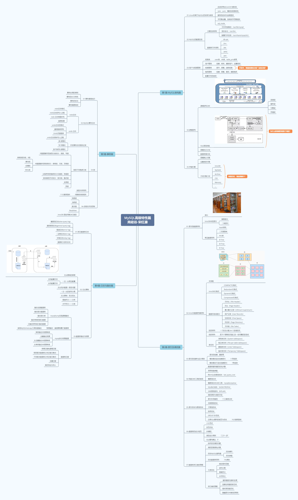

# 第 00 章_写在前面

讲师：尚硅谷-宋红康（江湖人称：康师傅）

官网：[http://www.atguigu.com](http://www.atguigu.com/)http://www.atguigu.com/)

***

## 一、MySQL 高级特性篇大纲

**MySQL 高级特性分为 4 个篇章：**

### 1. MySQL 架构篇

- [第 01 章：Linux 下 MySQL 的安装与使用](/java-basic/mysql-from-beginners-to-advanced/advanced/chapter-1/)
- [第 02 章：MySQL 的数据目录](/java-basic/mysql-from-beginners-to-advanced/advanced/chapter-2/)
- [第 03 章：用户与权限管理](/java-basic/mysql-from-beginners-to-advanced/advanced/chapter-3/)
- [第 04 章：逻辑架构](/java-basic/mysql-from-beginners-to-advanced/advanced/chapter-4/)
- [第 05 章：存储引擎](/java-basic/mysql-from-beginners-to-advanced/advanced/chapter-5/)

### 2. 索引及调优篇

- [第 06 章：索引的数据结构](/java-basic/mysql-from-beginners-to-advanced/advanced/chapter-6/)
- [第 07 章：InnoDB 数据存储结构](/java-basic/mysql-from-beginners-to-advanced/advanced/chapter-7/)
- [第 08 章：索引的创建与设计原则](/java-basic/mysql-from-beginners-to-advanced/advanced/chapter-8/)
- [第 09 章：性能分析工具的使用](/java-basic/mysql-from-beginners-to-advanced/advanced/chapter-9/)
- [第 10 章：索引优化与查询优化](/java-basic/mysql-from-beginners-to-advanced/advanced/chapter-10/)
- [第 11 章：数据库的设计规范](/java-basic/mysql-from-beginners-to-advanced/advanced/chapter-11/)
- [第 12 章：数据库其他调优策略](/java-basic/mysql-from-beginners-to-advanced/advanced/chapter-12/)

### 3. 事务篇

- [第 13 章：事务基础知识](/java-basic/mysql-from-beginners-to-advanced/advanced/chapter-13/)
- [第 14 章：MySQL 事务日志](/java-basic/mysql-from-beginners-to-advanced/advanced/chapter-15/)
- [第 15 章：锁](/java-basic/mysql-from-beginners-to-advanced/advanced/chapter-15/)
- [第 16 章：多版本并发控制(MVCC)](/java-basic/mysql-from-beginners-to-advanced/advanced/chapter-16/)

### 4. 日志与备份篇

- [第 17 章：其它数据库日志](/java-basic/mysql-from-beginners-to-advanced/advanced/chapter-17/)
- [第 18 章：主从复制](/java-basic/mysql-from-beginners-to-advanced/advanced/chapter-18/)
- [第 19 章：数据库备份与恢复](/java-basic/mysql-from-beginners-to-advanced/advanced/chapter-19/)
