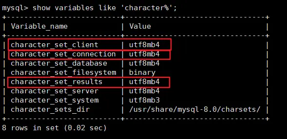

#   第 01 章 Linux 下 MySQL 的安装与使用

## 1. 安装前说明
### 1.1 查看是否安装过 MySQL
- 如果使用 rpm 安装, 检查一下 RPM PACKAGE
    ```bash
    rpm -qa | grep -i mysql # -i 忽略大小写
    # 或者
    yum list installed | grep mysql
	```

    如果存在 mysql-libs 的旧版本包，显示如下
    
    ```bash
    [root@node2 ~]# rpm -qa | grep -i mysql
    mysql-community-common-8.0.25-1.el7.x86_64
    mysql-community-server-8.0.25-1.el7.x86_64
    mysql-community-client-plugins-8.0.25-1.el7.x86_64
    mysql-community-client-8.0.25-1.el7.x86_64
    mysql-community-libs-8.0.25-1.el7.x86_64
    
    [root@node2 ~]# yum list installed | grep mysql
    mysql-community-client.x86_64          8.0.25-1.el7                    installed
    mysql-community-client-plugins.x86_64  8.0.25-1.el7                    installed
    mysql-community-common.x86_64          8.0.25-1.el7                    installed
    mysql-community-libs.x86_64            8.0.25-1.el7                    installed
    mysql-community-server.x86_64          8.0.25-1.el7                    installed
    ```
    
  :::tip
    "libs" 是 "libraries" 的缩写，意为库
  :::

* 检查 mysql service

    ```bash
    systemctl status mysqld.service
    mysqladmin --version
    ```

### 1.2 MySQL 的卸载
<h4>1. 关闭 mysql 服务</h4>

```shell
systemctl stop mysqld.service
```

<h4>2. 查看当前 mysql 安装状况</h4>

```shell
rpm -qa | grep -i mysql
# 或
yum list installed | grep mysql
```

<h4>3. 卸载上述命令查询出的已安装程序</h4>

```shell
yum remove mysql-xxx mysql-xxx mysql-xxx 
yum remove mysql-*
rpm -qa | grep -i mysql|xargs yum remove -y
```

务必卸载干净，反复执行`rpm -qa | grep -i mysql`确认是否有卸载残留

<h4>4. 查找删除 mysql 相关文件</h4>

- **查找相关文件**

```shell
# 注意不要误删
# 找出文件名为 mysql 的所有文件或目录
find / -name mysql
# 找出文件名包含 mysql 的所有文件或目录
# * 是通配符，代表任意字符
find / -name '*mysql*'
```

- **删除上述命令查找出的相关文件**

```shell
rm -rf xxx
# 容易误删,不要使用此命令
find / -name mysql|xargs rm -rf
```

<h4>5. 删除 `my.cnf`</h4>

```shell
 rm -rf /etc/my.cnf
```

<h4>6. 常见需要删除的目录和文件</h4>

- **数据目录** 通常是 `/var/lib/mysql/`，包含 MySQL 数据库的数据文件
- **配置文件** 包括但不限于 `/etc/my.cnf` 和 `/etc/mysql/` 目录下的配置文件
- **日志文件** MySQL 日志文件通常存储在 `/var/log/mysql/` 目录下
- **临时文件** MySQL 可能会在运行时创建临时文件，这些文件可能存储在 `/tmp/` 目录下或其他指定的临时目录中
- **启动脚本** 如果使用的是 systemd，可能需要删除位于 `/etc/systemd/system/` 目录下的 MySQL 启动脚本
- **用户和组** 如果安装 MySQL 时创建了专用的用户和组，可能需要删除这些用户和组。

## 2. MySQL 的 Linux 版安装
### 2.1 Linux 系统下安装 MySQL 的几种方式
<h4>方式一：rpm 命令安装</h4>

使用 rpm 命令安装扩展名为`.rpm`的软件包。

`.rpm`包的一般格式：


系统版本 el7 `Red Hat Enterprise Linux (RHEL) 7`

<h4>方式二：yum 命令</h4>

需联网，从互联网获取的 yum 源，直接使用 yum 命令安装。

<h4>方式三：编译安装源码包</h4>

针对 `tar.gz` 这样的压缩格式，要用 tar 命令来解压；如果是其它压缩格式，就使用其它命令。

| 安装方式           | 特点                         |
|:---------------|:---------------------------|
| rpm            | 安装简单，灵活性差，无法灵活选择版本、升级      |
| rpm repository | 安装包极小，版本安装简单灵活，升级方便，需要联网安装 |
| 通用二进制          | 包安装比较复杂，灵活性高，平台通用性好        |
| 源码包            | 安装最复杂，时间长，参数设置灵活，性能好       |

### 2.2 通过 rpm 包方式安装 MySQL
<h4>下载 rpm 包</h4>

* **通过[网页下载](https://downloads.mysql.com/archives/community/)，上传到服务器**

  这里不能直接选择 CentOS 系统的版本，所以选择与之对应的 Red Hat Enterprise Linux。

  直接点 Download 下载 RPM Bundle 全量包。包括了所有下面的组件。不需要一个一个下载了。

* **直接通过 wget 下载**

    ```shell
    mkdir /opt/mysql
    cd /opt/mysql
    #下载mysql安装包
    wget https://cdn.mysql.com/archives/mysql-8.0/mysql-8.0.25-1.el8.x86_64.rpm-bundle.tar
    wget https://cdn.mysql.com/archives/mysql-5.7/mysql-5.7.26-1.el7.x86_64.rpm-bundle.tar
    tar -xvf mysql-5.7.26-1.el7.x86_64.rpm-bundle.tar
    # 软件名mysql 版本号 5.7.26
    # 发布次数1 系统版本el7 硬件平台 x86_64
    ```

<h4>检查 MySQL 依赖</h4>

**检查 `/tmp`  临时目录权限（必不可少）**

由于 mysql 安装过程中，会通过 mysql 用户在 `/tmp` 目录下新建 `tmp_db` 文件，所以请给 `/tmp` 较大的权限。

```shell
chmod -R 777 /tmp
```

**可能缺失的依赖**

`libaio net-tools ncurses-compat-libs perl-interpreter`

```shell
# 检查依赖
rpm -qa|grep libaio
rpm -qa|grep net-tools
```

缺少依赖文件，可以通过以下命令查找安装

```bash
yum provides <缺失的文件名>
# 安装缺失的依赖
yum install xxx
```

```bash
错误: 依赖检测失败:
	/usr/bin/perl 被 mysql-community-server-8.0.25-1.el8.x86_64 需要
# yum provides /usr/bin/perl
perl-interpreter-4:5.26.3-419.el8.x86_64 : Standalone executable Perl interpreter
仓库: baseos
匹配来源:
文件名: /usr/bin/perl
# yum install perl-interpreter
```

<h4>RPM 包介绍</h4>

- `mysql-community-client.rpm`：MySQL 客户端软件包，用于连接到 MySQL 服务器并执行 SQL 查询和管理数据库。
- `mysql-community-common.rpm`：MySQL 的共享文件，包含了所有 MySQL 安装中共享的文件。
- `mysql-community-devel.rpm`：MySQL 开发文件，包含了用于编译和开发 MySQL 应用程序的头文件和库文件。
- `mysql-community-embedded.rpm`：MySQL 嵌入式服务器，适用于嵌入式应用程序和特殊用途场景。
- `mysql-community-embedded-compat.rpm`：MySQL 嵌入式兼容库，与嵌入式服务器一起使用。
- `mysql-community-embedded-devel.rpm`：MySQL 嵌入式开发文件，用于开发嵌入式应用程序。
- `mysql-community-libs.rpm` 包含 MySQL 客户端和服务器所需的共享库文件。这些共享库文件包括了 MySQL 的核心功能和支持文件。
- `mysql-community-libs-compat.rpm`：MySQL 客户端库的兼容库。兼任旧版本的 MySQL 库。
- `mysql-community-server.rpm`：MySQL 服务器软件包，用于安装和运行 MySQL 数据库服务器。
- `mysql-community-test.rpm`：MySQL 测试套件，用于测试 MySQL 服务器的性能和功能。

<h4>MySQL 安装过程</h4>

**将安装程序拷贝到 `/opt` 目录下**

在 mysql 的安装文件目录下执行：（必须按照顺序执行）

```shell
rpm -ivh mysql-community-common-8.0.25-1.el7.x86_64.rpm
# MySQL 5.7 没有 mysql-community-client-plugins，安装其他四个rpm包即可
rpm -ivh mysql-community-client-plugins-8.0.25-1.el7.x86_64.rpm 
rpm -ivh mysql-community-libs-8.0.25-1.el7.x86_64.rpm 
rpm -ivh mysql-community-client-8.0.25-1.el7.x86_64.rpm 
# 如果安装 MySQL 8.4 ，这里还需要安装 icu-data-files
# mysql-community-icu-data-files-8.4.5-1.el7.x86_64
rpm -ivh mysql-community-server-8.0.25-1.el7.x86_64.rpm
```

- `rpm` 是 Redhat Package Manage 缩写，通过 RPM 的管理，用户可以把源代码包装成以 rpm 为扩展名的文件形式，易于安装。
- `-i`, --install 安装软件包
- `-v`, --verbose 提供更多的详细信息输出
- `-h`, --hash 软件包安装的时候列出哈希标记 （和 -v 一起使用效果更好），展示进度条

::: warning
1. 如在检查工作时，没有检查 mysql 依赖环境，在安装 `mysql-community-server` 会报错。
2. 安装 `mysql-community-libs` 时，若存在 `mariadb-libs` 问题。 错误: 依赖检测失败：`mariadb-libs` 被 `mysql-community-libs-8.0.25-1.el7.x86_64` 取代。 执行 `yum remove mysql-libs` 即可。
:::

### 2.3 通过设置官方的 yum 仓库进行安装
[MySQL :: A Quick Guide to Using the MySQL Yum Repository](https://dev.mysql.com/doc/mysql-yum-repo-quick-guide/en/#repo-qg-yum-repo-setup)

官方仓库通常会提供额外的工具和插件，这些工具和插件可能不在系统默认仓库中。比如 `mysql shell`

[YUM 仓库配置文件下载地址](https://dev.mysql.com/downloads/repo/yum/)

<h4>安装仓库文件</h4>

```shell
# yum localinstall platform-and-version-specific-package-name.rpm
yum localinstall mysql84-community-release-el8-n.noarch.rpm
```

配置文件的名字开头是默认安装的 mysql 版本号，比如 `mysql84` 即  `mysql8.4 LTS` 版本

<h4>选择不同的发布系列</h4>

在 [MySQL Yum 仓库](https://repo.mysql.com/yum/)中，不同版本系列的 MySQL Community Server 存放在不同的子仓库中。最新的 LTS 系列的子仓库默认启用，而其他所有系列的子仓库默认禁用。

使用以下命令查看 MySQL Yum 仓库中的所有子仓库，可以查看子仓库的状态

```shell
yum repolist all | grep mysql
```

安装不同版本的 MySQL 需要切换子仓库的状态

切换默认的 mysql 版本 8.4 到 8.0

```shell
sudo yum-config-manager --disable mysql-8.4-lts-community
sudo yum-config-manager --disable mysql-tools-8.4-lts-community

sudo yum-config-manager --enable mysql80-community
sudo yum-config-manager --enable mysql-tools-community
```

**禁用 Centos yum 自带的 mysql 模块，防止冲突**

RHEL8 包含默认的 mysql 模块，如果不禁止该模块，它会优先于官方提供的模块。

```shell
yum module disable mysql
```

**安装 mysql**

```shell
yum install mysql-community-server
```

查看其他可以安装的 mysql 相关的组件和产品

```shell
yum --disablerepo=\* --enablerepo='mysql*-community*' list available
```

### 2.4 查看 MySQL 版本
```shell
mysql --version 
mysqladmin --version
#或者
rpm -qa|grep -i mysql
```

### 2.5 初始化 MySQL 数据目录
为了保证数据库目录与文件的所有者为 mysql 登录用户，如果你是以 root 身份运行 mysql 服务，需要执行下面的命令初始化：

```shell
mysqld --initialize --user=mysql
```

- `--initialize`：这是 `mysqld` 的一个选项，指示 `mysqld` 执行初始化操作。初始化操作包括创建 MySQL 数据目录并生成初始的系统表、权限表等。

- `--user=mysql`：这是一个可选的选项，指定在初始化过程中 `mysqld` 进程所使用的操作系统用户。在这个例子中，`mysqld` 进程将以 `mysql` 用户的身份运行。这有助于提高安全性，因为 MySQL 进程将以非特权用户的身份运行，从而减少了潜在的安全风险。

::: tip 说明
`--initialize`  选项默认以“安全”模式来初始化，则会为 root 用户生成一个密码并将`该密码标记为过期`，登录后你需要设置一个新的密码。生成的`临时密码`会往日志中记录一份。
:::

**查看密码：**

```shell
# mysql安装初次启动后，才会有日志内容可供查询
cat /var/log/mysqld.log|grep password
[Note] A temporary password is generated for root@localhost: <password>
```

::: tip rpm 安装方式，可以不执行此命令
在以下两种情况下，可能需要执行
  * 通过二进制包安装 `.tar.gz`或者`.zip`
  * 通过源代码编译安装

在以上两种情况下，MySQL 数据目录通常是空的或者不存在的，因此需要执行初始化命令来准备数据库系统的初始状态。
:::

### 2.6 启动 MySQL 查看状态
```shell
# 加不加.service后缀都可以 
启动: systemctl start mysqld.service 
关闭: systemctl stop mysqld.service 
重启: systemctl restart mysqld.service 
查看状态: systemctl status mysqld.service
```

::: tip
`mysqld` 这个可执行文件就代表着 `MySQL` 服务器程序，运行这个可执行文件就可以直接启动一个服务器进程。
:::

**查看进程**

```shell
ps -ef | grep -i mysql
```

### 2.7 查看 MySQL 服务是否自启动
```shell
systemctl list-unit-files|grep mysqld.service
```

- 如不是 enabled 可以运行如下命令设置自启动

```shell
systemctl enable mysqld.service
```

- 如果希望不进行自启动，运行如下命令设置

```shell
systemctl disable mysqld.service
```

## 3. MySQL 登录
### 3.1 首次登录
通过 `mysql -hlocalhost -P3306 -uroot -p` 进行登录

在 Enter password：录入初始化密码

::: tip
`--ssl-mode=DISABLED`  版本不同时可能需要用到这个参数，比如客户端 mysql 8.0.26 去连服务端 mysql 5.7.26。
:::

### 3.2 修改密码
* 因为初始化密码默认是过期的，所以查看数据库会报错。
* 修改密码：
    ```sql
    ALTER USER 'root'@'localhost' IDENTIFIED BY 'new_password';
    # 或者
    set password for 'root'@'localhost'=password('root1234')
    flush privileges
    ```
* 5.7 版本之后（不含 5.7），mysql 加入了全新的密码安全机制。设置新密码太简单会报错。
* 改为更复杂的密码规则之后，设置成功，可以正常使用数据库了。
* 测试环境可以修改安全策略降低，以便使用弱密码。
    ```sql
    # MySQL 5.7
    SET GLOBAL validate_password_policy=LOW;
    SET GLOBAL validate_password_policy=0; # 等同于LOW
    
    # MySQL 8.0 以上最后一个斜杠改成点
    SET GLOBAL validate_password.policy=LOW;
    ```

### 3.3 设置远程登录
<h4>确认网络</h4>

在远程机器上使用 ping ip 地址`保证网络畅通`

在远程机器上使用 telnet 命令`保证端口号开放`访问

```bash
telnet ip port
```

::: tip 开启 telnet
控制面板-->程序和功能-->启动或者关闭 windows 功能-->Telnet 客户端勾选-->确定
:::

<h4>关闭防火墙或开放端口</h4>

**方式一：关闭防火墙**

```shell
# CentOS6
service iptables stop

# CentOS7
#开启防火墙
systemctl start firewalld.service
#查看防火墙状态
systemctl status firewalld.service
#关闭防火墙
systemctl stop firewalld.service
#设置开机启用防火墙 
systemctl enable firewalld.service 
#设置开机禁用防火墙 
systemctl disable firewalld.service
```

**方式二：开放端口**

```shell
# 查看开放的端口号
firewall-cmd --list-all

# 设置开放的端口号
firewall-cmd --add-service=http --permanent
firewall-cmd --add-port=3306/tcp --permanent

# 重启防火墙
firewall-cmd --reload
```

<h4>Linux 下修改配置</h4>

- 修改允许远程登陆

```sql
use mysql;
select Host,User from user;
+-----------+------------------+
| Host      | User             |
+-----------+------------------+
| localhost | mysql.infoschema |
| localhost | mysql.session    |
| localhost | mysql.sys        |
| localhost | root             |
+-----------+------------------+

use mysql;
update user set host = '%' where user ='root';
flush privileges;
+-----------+------------------+
| Host      | User             |
+-----------+------------------+
| %         | root             |
| localhost | mysql.infoschema |
| localhost | mysql.session    |
| localhost | mysql.sys        |
+-----------+------------------+
```

::: tip
- Host 列指定了允许用户登录所使用的 IP
- `%` 是个通配符，如果 `Host=192.168.1.%`，表示只允许 IP 地址前缀为 `192.168.1.` 的客户端连接。如果 `Host=%`，表示所有 IP 都有连接权限。
- **注意**：在生产环境下不能为了省事将 host 设置为 `%` ，这样做会存在安全问题，具体的设置可以根据生产环境的 IP 进行设置。
:::

<h4>MySQL 8.0 配置新连接报错</h4>

- 错误号码 2058，Plugin caching_sha2_password could not be loaded.
- 原因是 mysql 8.0 默认的密码加密算法与 5.7 版本不同。
  - MySQL 5.7 默认的身份验证插件是 **mysql_native_password**
  - MySQL 8.0 默认的身份验证插件是 **aching_sha2_password**

**解决方法一**：升级远程连接工具版本

**解决方法二**：服务端设置使用 `mysql_native_password` 身份验证插件

```sql
#服务端执行该命令
ALTER USER 'root'@'%' IDENTIFIED WITH mysql_native_password BY 'abc123';
```

`IDENTIFIED WITH mysql_native_password`：指定要将用户的身份验证方式更改为使用 MySQL 的原生密码身份验证插件（`mysql_native_password`），与旧版本的 MySQL 兼容。

## 4. MySQL 密码验证插件和组件
[MySQL 5.7 Reference Manual :: The Password Validation Plugin](https://dev.mysql.com/doc/refman/5.7/en/validate-password.html)

[MySQL 8.0 Reference Manual :: The Password Validation Component](https://dev.mysql.com/doc/refman/8.0/en/validate-password.html)

### 4.1 MySQL8 之前的安全策略
在 MySQL 8.0 之前，MySQL 使用的是 validate_password 插件检测、验证账号密码强度，保障账号的安全性。

**安装/启用插件方式 1：在参数文件 my.cnf 中添加参数**

```properties
[mysqld]
plugin-load-add=validate_password.so

# ON/OFF/FORCE/FORCE_PLUS_PERMANENT: 启动时是否使用该插件(及强制/永久强制使用)
validate-password=FORCE_PLUS_PERMANENT

# 密码强度配置
validate_password_policy=MEDIUM
```

:::tip
1. plugin library 中的 `validate_password` 文件名的后缀名根据平台不同有所差异。 对于 Unix 和 Unix-like 系统而言，它的文件后缀名是 `.so`，对于 Windows 系统而言，它的文件后缀名是 `.dll`。
2. 修改参数后必须重启 MySQL 服务才能生效。
3. 参数 `FORCE_PLUS_PERMANENT` 是为了防止插件在 MySQL 运行时的时候被卸载。当你卸载插件时就会报错。
:::

`validate-password` 此选项控制服务器在启动时如何加载 validate_password 插件。

| **模式**                 | **是否启用密码验证** | **能否动态卸载** | **能否动态修改策略** | **重启后生效** |
|------------------------|--------------|------------|--------------|-----------|
| `OFF`                  | ❌ 否          | -          | -            | 否         |
| `ON`                   | ✅ 是          | ✅ 允许       | ✅ 允许         | 否         |
| `FORCE`                | ✅ 是          | ❌ 禁止       | ✅ 允许         | 否         |
| `FORCE_PLUS_PERMANENT` | ✅ 是          | ❌ 禁止       | ❌ 禁止         | ✅ 必须重启    |


```sql
SELECT PLUGIN_NAME, PLUGIN_LIBRARY, PLUGIN_STATUS, LOAD_OPTION
FROM INFORMATION_SCHEMA.PLUGINS
WHERE PLUGIN_NAME = 'validate_password';

+-------------------+----------------------+---------------+----------------------+
| PLUGIN_NAME       | PLUGIN_LIBRARY       | PLUGIN_STATUS | LOAD_OPTION          |
+-------------------+----------------------+---------------+----------------------+
| validate_password | validate_password.so | ACTIVE        | FORCE_PLUS_PERMANENT |
+-------------------+----------------------+---------------+----------------------+

mysql> UNINSTALL PLUGIN validate_password;
ERROR 1702 (HY000): Plugin 'validate_password' is force_plus_permanent and can not be
unloaded
```

**安装/启用插件方式 2：运行时命令安装（推荐）**

```sql
INSTALL PLUGIN validate_password SONAME 'validate_password.so';
```

此方法也会注册到元数据，也就是 `mysql.plugin` 表中，所以不用担心 MySQL 重启后插件会失效。

**卸载插件**

```sql
UNINSTALL PLUGIN validate_password;
```

### 4.2 MySQL8 的安全策略

<h4>validate_password 说明</h4>

MySQL 8.0 引入了服务器组件(Components)这个特性，validate_password 插件已用服务器组件重新实现。8.0.25 版本的数据库中，默认自动安装 validate_password 组件。

```sql
# 安装组件
INSTALL COMPONENT 'file://component_validate_password';
# 卸载组件
UNINSTALL COMPONENT 'file://component_validate_password';
```

`未安装插件前，执行如下两个指令`，执行效果

```sql
mysql> SELECT * FROM mysql.component;
ERROR 1146 (42S02): Table 'mysql.component' doesn't exist

mysql> show variables like 'validate_password%';
Empty set (0.04 sec)
```

`安装插件后，执行如下两个指令`，执行效果：

```sql
mysql> SELECT * FROM mysql.component;
+--------------+--------------------+------------------------------------+
| component_id | component_group_id | component_urn                      |
+--------------+--------------------+------------------------------------+
| 1            | 1                  | file://component_validate_password |
+--------------+--------------------+------------------------------------+
```

```sql
mysql> show variables like 'validate_password%';
# MySQL 5.7版本
+--------------------------------------+--------+
| Variable_name                        | Value  |
+--------------------------------------+--------+
| validate_password_check_user_name    | OFF    |
| validate_password_dictionary_file    |        |
| validate_password_length             | 8      |
| validate_password_mixed_case_count   | 1      |
| validate_password_number_count       | 1      |
| validate_password_policy             | MEDIUM |
| validate_password_special_char_count | 1      |
+--------------------------------------+--------+

# MySQL 8.0版本
+--------------------------------------+--------+
| Variable_name                        | Value  |
+--------------------------------------+--------+
| validate_password.check_user_name    | ON     |
| validate_password.dictionary_file    |        |
| validate_password.length             | 8      |
| validate_password.mixed_case_count   | 1      |
| validate_password.number_count       | 1      |
| validate_password.policy             | MEDIUM |
| validate_password.special_char_count | 1      |
+--------------------------------------+--------+
```

关于`validate_password` 组件对应的系统变量说明：

| 选项                                   | 默认值    | 参数描述                                                                                                                                            |
|:-------------------------------------|:-------|:------------------------------------------------------------------------------------------------------------------------------------------------|
| validate_password_check_user_name    | ON     | 设置为 ON 的时候表示能将密码设置成当前用户名。                                                                                                                       |
| validate_password_dictionary_file    |        | 用于检查密码的字典文件的路径名，默认为空                                                                                                                            |
| `validate_password_length`           | 8      | 密码的最小长度，也就是说密码长度必须大于或等于 8                                                                                                                       |
| validate_password_mixed_case_count   | 1      | 如果密码策略是中等或更强的，validate_password 要求密码具有的小写和大写字符的最小数量。对于给定的这个值密码必须有那么多小写字符和那么多大写字符。                                                               |
| validate_password_number_count       | 1      | 密码必须包含的数字个数                                                                                                                                     |
| `validate_password_policy`           | MEDIUM | 密码强度检验等级，可以使用数值 0、1、2 或相应的符号值 LOW、MEDIUM、STRONG 来指定。<br/>`0/LOW `：只检查长度。<br/>`1/MEDIUM`：检查长度、数字、大小写、特殊字符。<br/>`2/STRONG`：检查长度、数字、大小写、特殊字符、字典文件。 |
| validate_password_special_char_count | 1      | 密码必须包含的特殊字符个数                                                                                                                                   |

::: tip
组件和插件的默认值可能有所不同。

例如，MySQL 5.7 validate_password_check_user_name 的默认值为 OFF。
:::

<h4>修改安全策略</h4>

修改密码验证安全强度

| 策略          | 检查规则                                                                                                          |
|:------------|:--------------------------------------------------------------------------------------------------------------|
| 0 or LOW    | Length 验证长度（至少 8 位）                                                                                           |
| 1 or MEDIUM | Length;<br>numeric, lowercase/uppercase, and special characters<br>验证长度 数字 大小写 特殊字符                           |
| 2 or STRONG | Length; <br>numeric, lowercase/uppercase,<br>and special characters; dictionary file<br>验证长度 数字 大小写 特殊字符 字典文件 |

```sql
# MySQL 5.7
SET GLOBAL validate_password_policy=LOW;
SET GLOBAL validate_password_policy=MEDIUM;
SET GLOBAL validate_password_policy=STRONG;
SET GLOBAL validate_password_policy=0; # For LOW
SET GLOBAL validate_password_policy=1; # For MEDIUM
SET GLOBAL validate_password_policy=2; # For HIGH

# MySQL 8.0 以上最后一个下划线改成点
SET GLOBAL validate_password.policy=LOW;
```

此外，还可以修改密码中字符的长度

```sql
set global validate_password_length=1;
```

<h4>密码强度测试</h4>

如果创建密码遇到“Your password does not satisfy the current policy requirements“说明密码强度不符合设定的要求。

可以通过函数组件去检测密码是否满足条件：0-100。

当评估在 100 时就是说明使用上了最基本的规则：大写+小写+特殊字符+数字组成的 8 位以上密码。

```sql
mysql> SELECT VALIDATE_PASSWORD_STRENGTH('medium');
+--------------------------------------+
| VALIDATE_PASSWORD_STRENGTH('medium') |
+--------------------------------------+
| 25                                   |
+--------------------------------------+
```

```sql
mysql> SELECT VALIDATE_PASSWORD_STRENGTH('K354*45jKd5');
+-------------------------------------------+
| VALIDATE_PASSWORD_STRENGTH('K354*45jKd5') |
+-------------------------------------------+
| 100                                       |
+-------------------------------------------+
```

::: tip
如果没有安装 validate_password 组件或插件的话，那么这个函数永远都返回 0。
:::

关于密码复杂度对应的密码复杂度策略。如下表格所示：

| Password Test                             | Return Value |
|:------------------------------------------|:-------------|
| Length < 4                                | 0            |
| Length ≥ 4 and < validate_password.length | 25           |
| Satisfies policy 1 (LOW)                  | 50           |
| Satisfies policy 2 (MEDIUM)               | 75           |
| Satisfies policy 3 (STRONG)               | 100          |

::: tip
- 当有字典文件的时候，才会有 75 这个值。
- 当密码符合强度 MEDIUM，但是包含字典里的单词，则会返回强度值 75。
:::

```shell
# 在mysql数据目录下，创建目录，放字典文件
mkdir /var/lib/mysql/password_dictionary;
SET GLOBAL validate_password_dictionary_file='/path/to/password_dictionary/dictionary.txt';
```

## 5. 字符集的相关操作

MySQL 8.0 版本之前，默认字符集为 `latin1` ，utf8 字符集指向的是 `utf8mb3`

在数据库设计的时候往往会将编码修改为 utf8 字符集。如果遗忘修改默认的编码，就会出现乱码的问题。

MySQL 8.0 开始，数据库的默认编码将改为 `utf8mb4`

### 5.1 修改 MySQL 字符集

<h4>查看默认使用的字符集</h4>

```sql
show variables like 'character%';
# 或者
# 会多一个密码组件那边的变量，其他相同
show variables like '%char%';
```

```sql
show variables like 'character%';

# MySQL 8
+--------------------------+--------------------------------+
| Variable_name            | Value                          |
+--------------------------+--------------------------------+
| character_set_client     | utf8mb4                        |
| character_set_connection | utf8mb4                        |
| character_set_database   | utf8mb4                        |
| character_set_filesystem | binary                         |
| character_set_results    | utf8mb4                        |
| character_set_server     | utf8mb4                        |
| character_set_system     | utf8mb3                        |
| character_sets_dir       | /usr/share/mysql-8.0/charsets/ |
+--------------------------+--------------------------------+

# MySQL 5.7
+--------------------------+----------------------------+
| Variable_name            | Value                      |
+--------------------------+----------------------------+
| character_set_client     | utf8                       |
| character_set_connection | utf8                       |
| character_set_database   | latin1                     |
| character_set_filesystem | binary                     |
| character_set_results    | utf8                       |
| character_set_server     | latin1                     |
| character_set_system     | utf8                       |
| character_sets_dir       | /usr/share/mysql/charsets/ |
+--------------------------+----------------------------+
```

<h4>演示 mysql 5.7 字符集问题</h4>

MySQL 5.7 默认的服务器字符集是 `latin1`，不支持中文，保存中文会报错。

`character_set_database` **当前**数据库字符集，没有指定的话，和默认的数据库字符集保持一致

```sql
create database dbtest1;
use dbtest1;

create table empl(id int,lname varchar(15));
insert into empl(id,lname) values(1,'Tom');
insert into empl(id,lname) values(1,'张三');
ERROR 1366 (HY000): Incorrect string value: '\xE5\xBC\xA0\xE4\xB8\x89' for column 'lname' at row 1

# 查看具体数据库和表使用的字符集
show create database xxx;
show create table xxx;
```

<h4>修改字符集</h4>

```shell
vim /etc/my.cnf

# 在MySQL 5.7或之前的版本中，在文件最后加上中文字符集配置
character_set_server=utf8

# 重新启动MySQL服务
systemctl restart mysqld
```

::: tip
但是原库、原表的设定不会发生变化，参数修改只对新建的数据库生效。
:::

<4>修改已有库和表的字符集</h4>

```sql
# 修改已创建数据库的字符集
alter database dbtest1 character set 'utf8';

# 修改已创建数据表的字符集
alter table empl convert to character set 'utf8';
```

::: tip
但是原有的数据如果是用非`utf8`编码的话，数据本身编码不会发生改变。已有数据需要导出或删除，然后重新插入。
:::

### 5.2 各级别的字符集
MySQL 有 4 个级别的字符集和比较规则，分别是

* 服务器级别
* 数据库级别
* 表级别
* 列级别

```sql
show variables like 'character%';

+--------------------------+--------------------------------+
| Variable_name            | Value                          |
+--------------------------+--------------------------------+
| character_set_client     | utf8mb4                        |
| character_set_connection | utf8mb4                        |
| character_set_database   | utf8mb4                        |
| character_set_filesystem | binary                         |
| character_set_results    | utf8mb4                        |
| character_set_server     | utf8mb4                        |
| character_set_system     | utf8mb3                        |
| character_sets_dir       | /usr/share/mysql-8.0/charsets/ |
+--------------------------+--------------------------------+
```

- `character_set_server`：服务器级别的字符集。
- `character_set_database`：**动态参数，当前**数据库的字符集。
- `character_set_client`：服务器解码请求时使用的字符集。
- `character_set_connection`：服务器处理请求时会把请求字符串从 `character_set_client` 转为 `character_set_connection`。
- `character_set_results`：服务器向客户端返回数据时使用的字符集。

<h4>服务器级别</h4>

`character_set_server` 服务器级别的字符集

可以在启动服务器程序时通过启动选项修改

```bash
mysqld --character-set-server=utf8mb4 --collation-server=utf8mb4_unicode_ci
```

或者在服务器程序运行过程中使用`SET`语句修改这两个变量的值

```sql
SET character_set_server = 'utf8mb4', collation_server = 'utf8mb4_unicode_ci';
```

或者通过配置文件配置

```sql
[server]
character_set_server=gbk # 默认字符集
collation_server=gbk_chinese_ci #对应的默认的比较规则
```

<h4>数据库级别</h4>

`character_set_database` 当前数据库的字符集

在创建和修改数据库的时候可以指定该数据库的字符集和比较规则，具体语法如下：

```sql
CREATE DATABASE 数据库名
    [[DEFAULT] CHARACTER SET 字符集名称]
    [[DEFAULT] COLLATE 比较规则名称];

ALTER DATABASE 数据库名
    [[DEFAULT] CHARACTER SET 字符集名称]
    [[DEFAULT] COLLATE 比较规则名称];
```

`DEFAULT`可以省略，并不影响语义

::: tip
- 如果创建数据库时，不指定字符集和比较规则，则默认使用服务器级别的字符集和比较规则，作为数据库的字符集和比较规则。
- 修改数据库字符集必须显示的指明字符集。
:::

```sql
CREATE DATABASE charset_demo_db
CHARACTER SET gb2312
COLLATE gb2312_chinese_ci;
```

<h4>表级别</h4>

可以在创建和修改表的时候指定表的字符集和比较规则，语法如下：

```sql
CREATE TABLE 表名 (列的信息)
    [[DEFAULT] CHARACTER SET 字符集名称]
    [COLLATE 比较规则名称]]

ALTER TABLE 表名
    [[DEFAULT] CHARACTER SET 字符集名称]
    [COLLATE 比较规则名称]
```

::: tip
如果创建和修改表的语句中没有指明字符集和比较规则，将使用该表所在数据库的字符集和比较规则作为该表的字符集和比较规则。
:::

<h4>列级别</h4>
对于存储字符串的列，同一个表中的不同的列也可以有不同的字符集和比较规则。

在创建和修改列定义的时候可以指定该列的字符集和比较规则，语法如下：

```sql
CREATE TABLE 表名(
    列名 字符串类型 [CHARACTER SET 字符集名称] [COLLATE 比较规则名称],
    其他列...
);
ALTER TABLE 表名 MODIFY 列名 字符串类型 [CHARACTER SET 字符集名称] [COLLATE 比较规则名称];
```

::: tip
- 对于某个列来说，如果在创建和修改的语句中没有指明字符集和比较规则，将使用该列所在表的字符集和比较规则作为该列的字符集和比较规则。
- 在转换列的字符集时需要注意，如果转换前列中存储的数据不能用转换后的字符集进行表示会发生错误。比方说原先列使用的字符集是 utf8，列中存储了一些汉字，现在把列的字符集转换为 ascii 的话就会出错，因为 ascii 字符集并不能表示汉字字符。
:::

<h4>小结</h4>

- 如果`创建或修改列`时没有显式的指定字符集和比较规则，则该列`默认用表的`字符集和比较规则；
- 如果`创建表时`没有显式的指定字符集和比较规则，则该表`默认用数据库的`字符集和比较规则；
- 如果`创建数据库时`没有显式的指定字符集和比较规则，则该数据库`默认用服务器的`字符集和比较规则。

### 5.3 字符集与比较规则
<h4>utf8 与 utf8mb4</h4>

`utf8`字符集表示一个字符需要使用 1～4 个字节，但是我们常用的一些字符使用 1～3 个字节就可以表示了。字符集表示一个字符所用的最大字节长度，在某些方面会影响系统的存储和性能。

所以设计 MySQL 的设计者定义了两个概念：

`utf8mb3` ：阉割过的 utf8 字符集，只使用 1～3 个字节表示字符。
`utf8mb4` ：正宗的 utf8 字符集，使用 1～4 个字节表示字符。

::: tip
在 MySQL 中`utf8`是`utf8mb3`的别名，当存储需要 4 字节编码的字符时，要使用`utf8mb4`，比如`emoji 表情`
:::

<h4>字符集和比较规则</h4>

```sql
# 查看mysql支持的字符集
SHOW CHARSET;
SHOW CHARACTER SET;

# 总共41种仅摘录部分
+----------+---------------------------------+---------------------+--------+
| Charset  | Description                     | Default collation   | Maxlen |
+----------+---------------------------------+---------------------+--------+
| latin1   | cp1252 West European            | latin1_swedish_ci   |      1 |
| latin2   | ISO 8859-2 Central European     | latin2_general_ci   |      1 |
| ascii    | US ASCII                        | ascii_general_ci    |      1 |
| gb2312   | GB2312 Simplified Chinese       | gb2312_chinese_ci   |      2 |
| gbk      | GBK Simplified Chinese          | gbk_chinese_ci      |      2 |
| utf8     | UTF-8 Unicode                   | utf8_general_ci     |      3 |
| utf8mb4  | UTF-8 Unicode                   | utf8mb4_general_ci  |      4 |
| utf16    | UTF-16 Unicode                  | utf16_general_ci    |      4 |
| utf32    | UTF-32 Unicode                  | utf32_general_ci    |      4 |
| binary   | Binary pseudo charset           | binary              |      1 |
+----------+---------------------------------+---------------------+--------+
41 rows in set (0.00 sec)
```

上表中，MySQL 版本一共支持 41 种字符集，`Default collation` 列表示这种字符集中一种默认的比较规则，里面包含着该比较规则主要作用于哪种语言，比如 `utf8_polish_ci` 表示以波兰语的规则比较，`utf8_spanish_ci` 是以西班牙语的规则比较，`utf8_general_ci` 是一种通用的比较规则。

后缀表示该比较规则是否区分语言中的重音、大小写。具体如下：

| 后缀     | 英文释义                 | 描述       |
|:-------|:---------------------|:---------|
| `_ai`  | `accent insensitive` | 不区分重音    |
| `_as`  | `accent sensitive`   | 区分重音     |
| `_ci`  | `case insensitive`   | 不区分大小写   |
| `_cs`  | `case sensitive`     | 区分大小写    |
| `_bin` | `binary`             | 以二进制方式比较 |

最后一列`Maxlen` ，它代表该种字符集表示一个字符最多需要几个字节。

常见的字符集和对应的 Maxlen

| 字符集名称     | Maxlen |
|:----------|:-------|
| `ascii`   | 1      |
| `latin1`  | 1      |
| `gb2312`  | 2      |
| `gbk`     | 2      |
| `utf8`    | 3      |
| `utf8mb4` | 4      |

<h4>常用操作</h4>

```sql
#查看GBK字符集的比较规则
SHOW COLLATION LIKE 'gbk%';
#查看UTF-8字符集的比较规则
SHOW COLLATION LIKE 'utf8%';

#查看服务器的字符集和比较规则
SHOW VARIABLES LIKE '%_server';
#查看数据库的字符集和比较规则
SHOW VARIABLES LIKE '%_database';

#查看具体数据库的字符集
SHOW CREATE DATABASE dbtest1;
#修改具体数据库的字符集
ALTER DATABASE dbtest1 DEFAULT CHARACTER SET 'utf8' COLLATE 'utf8_general_ci';

#查看表的字符集
show create table employees;
#查看表的比较规则
show table status from atguigudb like 'employees';
#修改表的字符集和比较规则
ALTER TABLE emp1 DEFAULT CHARACTER SET 'utf8' COLLATE 'utf8_general_ci';
```

::: tip
1. utf8_unicode_ci 和 utf8_general_ci 对于中、英文来说没有实质的差别。
   - utf8_general_ci 较对速度快，但准确度稍差。 
   - utf8_unicode_ci 准确度高，但校对速度稍慢。
2. 一般情况，用 utf8_general_ci 就够了，但是如果应用有法语、德语或者俄语，请一定要使用 utf8_unicode_ci。
3. 修改数据库的默认字符集和比较规则之后，原来已经创建的表的字符集和比较规则并不会改变。
4. 如果有需要，必须单独对这些表进行修改。
:::

### 5.4 请求到响应过程中字符集的变化
客户端发往服务器的请求本质上是一个`字符串`，服务器向客户端返回的结果本质上也是一个字符串。而字符串其实是使用某种字符集编码的`二进制数据`。从发送请求到返回结果这个过程伴随着`多次字符集的转换`。



| 系统变量                       | 描述                                                                      |
|:---------------------------|:------------------------------------------------------------------------|
| `character_set_client`     | 服务器解码请求时使用的字符集                                                          |
| `character_set_connection` | 服务器处理请求时会把请求字符串从<br/>`character_set_client`转为`character_set_connection` |
| `character_set_results`    | 服务器向客户端返回数据时使用的字符集                                                      |

<h4>一个请求案例</h4>

**分析请求从发送到结果返回过程中字符集的变化**

```sql
# 假设此时，设置character_set_connection为gbk
mysql> set character_set_connection = gbk;
# 客户端发送的请求
SELECT * FROM t WHERE s = '我';
```

<h5>客户端发送请求所使用的字符集</h5>

一般情况下客户端所使用的字符集和当前操作系统一致，不同操作系统使用的字符集可能不一样，类`Unix`系统使用的是`utf8`,`Windows`使用`gbk`

当客户端使用的是`utf8`字符集，字符`我`在发送给服务器的请求中的字节形式就是：`0xE68891`

::: tip
如果你使用的是可视化工具，比如 navicat 之类的，这些工具可能会使用自定义的字符集来编码发送到服务器的字符串，而不采用操作系统默认的字符集。
:::

<h5>服务器接收到客户端发送来的请求</h5>

其实是一串二进制的字节，它会认为这串字节采用的字符集是`character_set_client` ，然后把这串字节转换为`character_set_connection`字符集编码的字符。

由于我的计算机上 `character_set_client` 的值是 `utf8` ，首先会按照 `utf8` 字符集对字节串 `0xE68891` 进行解码，得到的字符串就是'我' ，然后按照`character_set_connection` 代表的字符集，也就是 gbk 进行编码，得到的结果就是字节串 `0xCED2` 。

<h5>查找记录</h5>

因为表 `t` 的列 `col` 采用的是 `gbk` 字符集，与 `character_set_connection` 一致，所以直接到列中找字节值为 `0xCED2` 的记录，最后找到了一条记录。

::: tip
如果某个列使用的字符集和 character_set_connection 代表的字符集不一致的话，还需要进行一次字符集转换。
:::

<h5>服务端返回数据</h5>

上一步骤找到的记录中的`col` 列其实是一个字节串`0xCED2` ， `col` 列是采用 `gbk` 进行编码的，所以首先会将这个字节串使用 `gbk` 进行解码，得到字符串`'我'` ，然后再把这个字符串使用 `character_set_results` 代表的字符集，也就是 `utf8` 进行编码，得到了新的字节串：`0xE68891` ，然后发送给客户端。

<h5>客户端接受数据</h5>

由于客户端是用的字符集是`utf8` ，所以可以顺利的将 `0xE68891` 解释成字符我，从而显示到我们的显示器上，所以我们人类也读懂了返回的结果。

<h5>总结显示图</h5>


<h4>经验</h4>

开发中通常把 `character_set_client`、`character_set_connection`、`character_set_results` 这三个系统变量设置成和客户端使用的字符集一致，减少无谓的字符集转换。

* 在运行时设置

```sql
# 统一设置三个系统变量
SET NAMES 字符集名;
SET NAMES utf8;

# 相当于
SET character_set_client = 字符集名;
SET character_set_connection = 字符集名;
SET character_set_results = 字符集名;
```

* 在配置文件中设置

```properties
[client]
default-character-set=utf8
```

## 6. SQL 大小写规范
### 6.1 Windows 和 Linux 平台区别
在 SQL 中，关键字和函数名是不区分字母大小写的，如 SELECT、WHERE 等关键字，以及 ABS、MOD、MAX 等函数名。

`windows系统默认大小写不敏感`，但是 `linux系统是大小写敏感的`。

```sql
SHOW VARIABLES LIKE '%lower_case_table_names%'

# Windows
+------------------------+-------+
| Variable_name          | Value |
+------------------------+-------+
| lower_case_table_names | 1     |
+------------------------+-------+

# Linux
+------------------------+-------+
| Variable_name          | Value |
+------------------------+-------+
| lower_case_table_names | 0     |
+------------------------+-------+
```

`lower_case_table_names`参数值的设置：

* 默认为 0，大小写敏感。
* 设置 1，大小写不敏感。创建的表，数据库都是以小写形式存放在磁盘上，对于 sql 语句都是转换为小写对表和数据库进行查找。
* 设置 2，创建的表和数据库依据语句上格式存放，凡是查找都是转换为小写进行。

::: tip 在 Linux 环境下 MySQL 大小写规则
1. 数据库名、表名、表的别名、变量名是严格区分大小写的； 
2. 关键字、函数名称在 SQL 中不区分大小写；
3. 列名（或字段名）与列的别名（或字段别名）在所有的情况下均是忽略大小写的

**MySQL 在 Windows 的环境下全部不区分大小写**
:::

### 6.2 Linux 下大小写规则设置

可以通过配置文件`/etc/my.cnf` 设置大小写规则为大小写不敏感：

```properties
[mysqld]
lower_case_table_names=1
```

**注意：设置大小写不敏感后，在重启数据库实例之前就需要将原来的数据库和表转换为小写，否则将找不到数据库名。**

从 MySQL 8.0.11 开始，禁止在重新启动 MySQL 服务时将 `lower_case_table_names` 设置成不同于初始化 MySQL 服务时设置的 `lower_case_table_names` 值。因为数据字典表字段使用的排序规则基于服务器初始化时定义的`lower_case_table_names`设置，而重新启动具有不同设置的服务器将引入关于标识符如何排序和比较的不一致性。

::: tip
- 数据字典表是数据库中存储关于数据库结构、对象、权限等元数据(metadata)的特殊表。
- 在数据库中，标识符(identifier)指的是用于标识数据库对象（如表、列、索引等）的名称
:::

如果非要将 MySQL 8 设置为大小写不敏感，需重新初始化数据库，具体步骤为：

1. 停止 MySQL 服务
2. 删除数据目录，即删除 `/var/lib/mysql` 目录
3. 在 MySQL 配置文件 `/etc/my.cnf` 中添加 `lower_case_table_names=1`
4. 启动 MySQL  服务

### 6.3 SQL 编写规范建议
::: tip SQL 编写规范建议
- 关键字和函数名称全部大写；
- 数据库名、表名、表别名、字段名、字段别名等全部小写；
- SQL 语句必须以分号结尾。
:::

数据库名、表名和表的别名在 Linux MySQL 环境下是区分大小写的，因此建议你统一这些字段的命名规则，比如全部采用小写的方式。

虽然关键字和函数名称在 SQL 中不区分大小写，也就是如果小写的话同样可以执行。但是同时将关键词和函数名称全部大写，以便于区分。

## 7. sql_mode 的合理设置
### 7.1 介绍
sql_mode 会影响 MySQL 支持的 SQL 语法以及它执行的`数据验证检查`。通过设置 sql_mode，可以完成不同严格程度的数据校验，有效地保障数据准确性。

MySQL 服务器可以在不同的 SQL 模式下运行，并且可以针对不同的客户端以不同的方式应用这些模式，具体取决于 sql_mode 系统变量的值。

MySQL 5.6 和 MySQL 5.7 默认的 sql_mode 模式参数是不一样的：
* MySQL 5.6 的 mode 默认值为空（即：`NO_ENGINE_SUBSTITUTION`），其实表示的是一个空值，相当于没有什么模式设置，可以理解为`宽松模式`。在这种设置下是可以允许一些非法操作的，比如允许一些非法数据的插入。
* MySQL 5.7 的 mode 是`STRICT_TRANS_TABLES`，也就是`严格模式`。用于进行数据的严格校验，错误数据不能插入，报 error，并且事务回滚。

### 7.2 宽松模式 vs 严格模式
<h4>宽松模式</h4>

如果设置的是宽松模式，那么我们在插入数据的时候，即便是给了一个错误的数据，也可能会被接受，并且不报错。

**举例**：我在创建一个表时，该表中有一个字段为 name，给 name 设置的字段类型时 char(10) ，如果我在插入数据的时候，其中 name 这个字段对应的有一条数据的长度超过了 10 ，例如'1234567890abc'，超过了设定的字段长度 10，那么不会报错，并且取前 10 个字符存上，也就是说这个数据被存为了'1234567890'，而'abc'就没有了。但是，我们给的这条数据是错误的，因为超过了字段长度，但是并没有报错，并且 mysql 自行处理并接受了，这就是宽松模式的效果。

**应用场景**：通过设置 sql mode 为宽松模式，来保证大多数 sql 符合标准的 sql 语法，这样应用在不同数据库之间进行迁移时，则不需要对业务 sql 进行较大的修改。

<h4>严格模式</h4>

出现上面宽松模式的错误，应该报错才对，所以 MySQL 5.7 版本就将 sql_mode 默认值改为了严格模式。所以在`生产等环境`中，我们必须采用的是严格模式，进而`开发、测试环境`的数据库也必须要设置，这样在开发测试阶段就可以发现问题。并且我们即便是用的 MySQL 5.6，也应该自行将其改为严格模式。

**开发经验**：MySQL 等数据库总想把关于数据的所有操作都自己包揽下来，包括数据的校验，其实开发中，我们应该在自己`开发的项目程序级别将这些校验给做了`，虽然写项目的时候麻烦了一些步骤，但是这样做之后，我们在进行数据库迁移或者在项目的迁移时，就会方便很多。

**改为严格模式后可能会存在的问题**：若设置模式中包含了`NO_ZERO_DATE` ，那么 MySQL 数据库不允许插入零日期，插入零日期会抛出错误而不是警告。例如，表中含字段 TIMESTAMP 列（如果未声明为 NULL 或显示 DEFAULT 子句）将自动分配 DEFAULT '0000-00-00 00:00:00'（零时间戳），这显然是不满足 sql_mode 中的 NO_ZERO_DATE 而报错。

### 7.3 宽松模式再举例
**宽松模式举例 1**

```sql
select * from employees group by department_id limit 10;

set sql_mode = ONLY_FULL_GROUP_BY;
# 查询失败
select * from employees group by department_id limit 10;
```

**宽松模式举例 2**

```sql
set sql_mode = STRICT_TRANS_TABLES;
# 插入数据严格检查，不符合数据类型且无法转换的类型会导致插入失败
```

### 7.4 模式查看和设置
**查看当前的 sql_mode**

```sql
select @@session.sql_mode;
select @@global.sql_mode;
#或者
show variables like 'sql_mode';
```

**临时设置方式：设置当前窗口中设置 sql_mode**

```sql
SET GLOBAL sql_mode = 'modes...'; #全局
SET SESSION sql_mode = 'modes...'; #当前会话

-- 改为严格模式。此方法只在当前会话中生效，关闭当前会话就不生效了。
set SESSION sql_mode='STRICT_TRANS_TABLES';

-- 改为严格模式。此方法在当前服务中生效，重启MySQL服务后失效。
set GLOBAL sql_mode='STRICT_TRANS_TABLES';
```

**永久设置方式：在 `/etc/my.cnf ` 中配置 sql_mode**

在 `my.cnf` 文件（windows 系统是 `my.ini` 文件），新增以下内容，然后`重启MySQL`

```properties
[mysqld]
sql_mode=ONLY_FULL_GROUP_BY,STRICT_TRANS_TABLES,NO_ZERO_IN_DATE,NO_ZERO_DATE,ERROR_FOR_DIVISION_BY_ZERO,NO_ENGINE_SUBSTITUTION
```

::: tip
当然生产环境上是禁止重启 MySQL 服务的，所以采用`临时设置方式 + 永久设置`方式来解决线上的问题，那么即便是有一天真的重启了 MySQL 服务，也会永久生效了。
:::

### 7.5 sql_mode 常用值
[MySQL 5.7 Reference Manual :: Server SQL Modes](https://dev.mysql.com/doc/refman/5.7/en/sql-mode.html)

[MySQL 8.0 Reference Manual :: Server SQL Modes](https://dev.mysql.com/doc/refman/8.0/en/sql-mode.html)

| sql_mode                   | 解释                                                                                                                                                |
|:---------------------------|:--------------------------------------------------------------------------------------------------------------------------------------------------|
| ONLY_FULL_GROUP_BY         | 对于 GROUP BY 聚合操作，如果在 SELECT 中的列，没有在 GROUP BY 中出现，那么这个 SQL 是不合法的。                                                                                  |
| NO_AUTO_VALUE_ON_ZERO      | 该值影响自增长列的插入。默认设置下，插入 0 或 NULL 代表生成下一个自增长值。如果用户希望插入的值为 0，而该列又是自增长列，则使用该模式                                                                          |
| **STRICT_TRANS_TABLES**    | 在该模式下，如果一个值不能插入到一个事务表中，则中断当前操作，对非事务表不做限制。<br>**数据类型检查** 检查插入或更新的数据是否符合列的数据类型定义。<br>不会自动将插入或更新的数据转换为合适的类型。例如，如果插入字符串到整数列中，MySQL 将抛出错误，而不是尝试进行隐式转换。 |
| NO_ZERO_IN_DATE            | 不允许日期和月份为零                                                                                                                                        |
| NO_ZERO_DATE               | 不允许插入零日期，插入零日期会抛出错误而非警告。                                                                                                                          |
| ERROR_FOR_DIVISION_BY_ZERO | 在 INSERT 或者 UPDATE 过程中，如果数据被零除，则会产生错误而非警告。如果设置该模式那么数据被零除时 MySQL 会返回 NULL                                                                          |
| NO_AUTO_CREATE_USER        | 禁止 GRANT 创建密码为空的用户。<br>即将弃用该模式，GRANT 不再用于创建用户                                                                                                     |
| NO_ENGINE_SUBSTITUTION     | 如果需要的存储引擎被禁用或者未编译，那么抛出错误。不设置此值时，用默认的存储引擎替代，并抛出一个异常                                                                                                |


| sql_mode        | 解释                                                                                               |
|:----------------|:-------------------------------------------------------------------------------------------------|
| PIPES_AS_CONCAT | 将 `||` 视为字符串的连接操作符而非或运算符，这和 Oracle 数据库是一样的，也和字符串拼接函数 Concat 相类似                                  |
| ANSI_QUOTES     | 改变了标识符（如表名、列名）的引号解析方式<br>默认情况下，MySQL 使用反引号符号来引用标识符<br>启用 `ANSI_QUOTES` 模式后，MySQL 将支持使用双引号`"`来引用标识符 |
