# 第 06 章 索引的数据结构

## 1. 索引及其优缺点

### 1.1 索引概述

MySQL 官方对索引的定义为：**索引(Index) 是帮助 MySQL 高效获取数据的数据结构**。

**索引的本质**：索引是数据结构。可以简单理解为“排好序的快速查找数据结构”，满足特定查找算法。这些数据结构以某种方式指向数据，这样就可以在这些数据结构的基础上实现`高级查找算法`。

`索引是在存储引擎中实现的`，因此每种存储引擎的索引不一定完全相同，并且每种存储引擎不一定支持所有索引类型。同时，存储引擎可以定义每个表的`最大索引数`和`最大索引长度`。所有存储引擎支持每个表至少 16 个索引，总索引长度至少为 256 字节。有些存储引擎支持更多的索引数和更大的索引长度。

### 1.2 优点

1. 类似大学图书馆建书目索引，提高数据检索的效率，降低`数据库的 IO 成本`，这也是创建索引最主要的原因。 
2. 通过创建唯一索引，可以保证数据库表中每一行`数据的唯一性`。
3. 在实现数据的参考完整性方面，可以`加速表和表之间的连接`。换句话说，对于有依赖关系的子表和父表联合查询时，可以提高查询速度。
4. 在使用分组和排序子句进行数据查询时，可以显著`减少查询中分组和排序的时间`，降低了 CPU 的消耗。

### 1.3 缺点

1. 创建索引和维护索引要`耗费时间`，并且随着数据量的增加，所耗费的时间也会增加。
2. 索引需要占`磁盘空间`，除了数据表占数据空间之外，每一个索引还要占一定的物理空间`存储在磁盘上`，如果有大量的索引，索引文件就可能比数据文件更快达到最大文件尺寸。
3. 虽然索引大大提高了查询速度，同时却会`降低更新表的速度`。当对表中的数据进行增加、删除和修改的时候，索引也要动态地维护，这样就降低了数据的维护速度。

::: tip
索引可以提高查询的速度，但是会影响插入记录的速度。这种情况下，最好的办法是先删除表中的索引，然后插入数据，插入完成后再创建索引。
:::

## 2. InnoDB 中索引

```sql
SELECT [列名列表] FROM 表名 WHERE 列名 = xxx;
```

### 2.1 InnoDB 索引方案
#### 2.1.1 表的行格式

`行格式`指的是存储在表中的每一行数据的物理存储格式

```sql
CREATE TABLE index_demo(
    c1 INT,
    c2 INT,
    c3 CHAR(1),
    PRIMARY KEY(c1)
) ROW_FORMAT = Compact;
```

这个新建的`index_demo`表中有 2 个 `INT` 类型的列，1 个 `CHAR(1)` 类型的列，而且我们规定了 c1 列为主键，这个表使用`Compact`行格式来实际存储记录的。这里我们简化了 index_demo 表的行格式示意图：

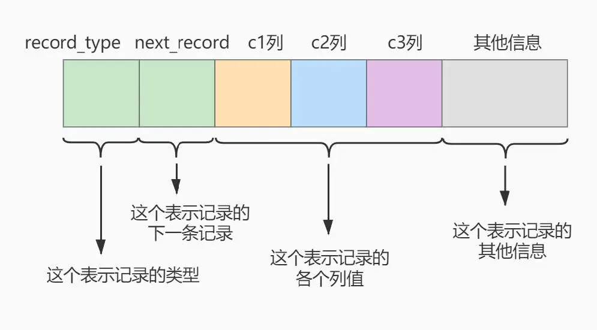

- `record_type`：记录头信息的一项属性，表示记录的类型，`0`表示普通记录、`1`表示目录项记录、`2`表示最小记录、`3`表示最大记录。
- `next_record`：记录头信息的一项属性，表示下一条地址相对于本条记录的地址偏移量，我们用箭头来表明下一条记录是谁。
- `各个列的值`：这里只记录在`index_demo`表中的三个列，分别是`c1`、`c2`和`c3`。 
- `其他信息`：除了上述 3 种信息以外的所有信息，包括其他隐藏列的值以及记录的额外信息。

将记录格式示意图的其他信息项暂时去掉并把它竖起来的效果就是这样：

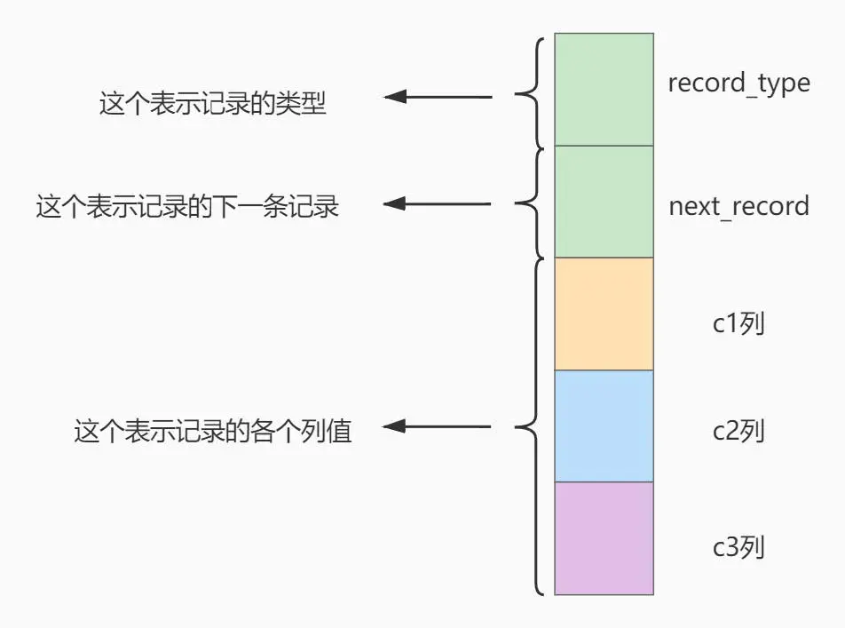

#### 2.1.2 数据页

**数据页**：多条记录根据主键值，从小到大排列存放在一个数据页中

**页目录**：数据页内存在以主键值生成的`Page Directory`（页目录），从而在按照主键值进行查找时可以使用`二分法`来加快查询速度。

**页分裂**：当向一个已满的数据页插入新记录时，数据库系统会动态地将该页分裂成两个新的数据页，以便容纳新的数据记录

两个数据页之间以双向链表的方式连接

**下一个数据页中用户记录的主键值大于上一个页中用户记录的主键值。**

**页编号**：每个页有页编号，页与页之间以双向链表连接，**数据页的编号不一定连续**

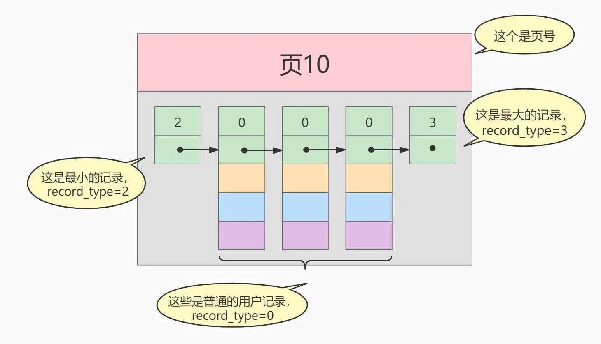

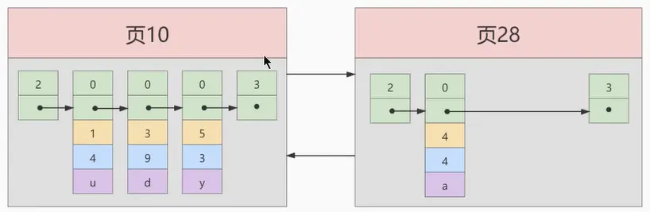

#### 2.1.3 目录页
为了快速定位记录所在的数据页，所以`建立一个目录`

**目录项**

每个数据页抽出一条记录，记录主键值和数据页编号等信息，作为一条目录项

`目录项记录`和普通的`用户记录`的**区别**：

- `目录项记录`的`record_type`值是 1，而`普通用户记录`的`record_type`值是 0。
- 目录项记录只有`主键值和页的编号`两个列，而普通的用户记录的列是用户自己定义的，可能包含`很多列`，另外还有 InnoDB 自己添加的隐藏列。
- 了解：记录头信息里还有一个叫`min_rec_mask`的属性，只有在存储`目录项记录`的页中的主键值最小的`目录项记录`的`min_rec_mask`值为`1`，其他别的记录的`min_rec_mask`值都是`0`。

**目录页**

多条目录项组成一个目录页

记录目录项的页中也存在页目录，按照主键值进行查找时可以使用 **二分法** 来加快查询速度。

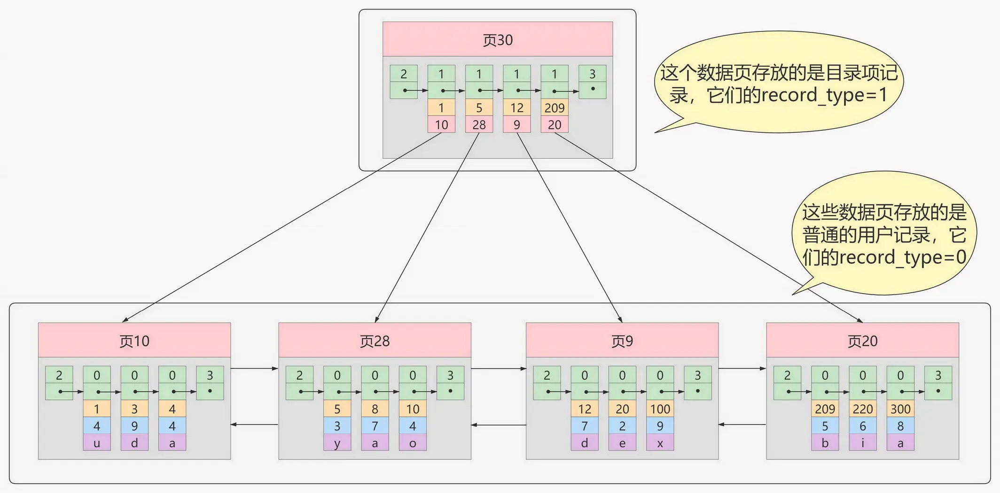

**多个目录项记录的页**

多个目录页之间以双向链表的方式连接

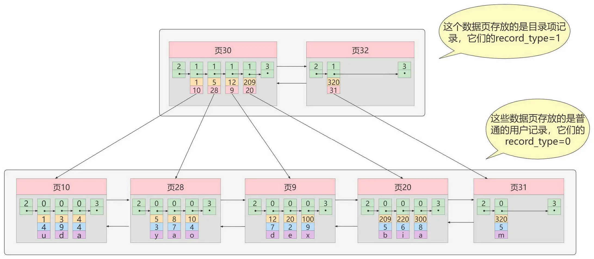

#### 2.1.4 B+Tree

表中的数据非常多则会`产生很多存储目录项记录的页`，为了根据主键值快速定位一个存储目录项记录的页，那就为这些存储目录项记录的页再生成一个`更高级的目录`，就像是一个多级目录一样，`大目录里嵌套小目录`

最终生成的这个数据结构，它的名称是`B+树`。 

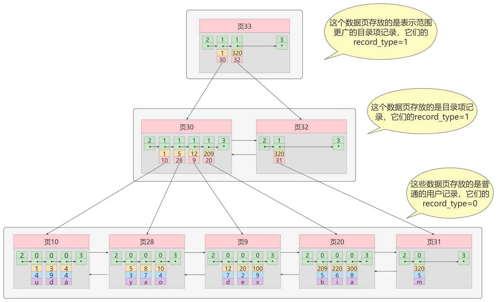

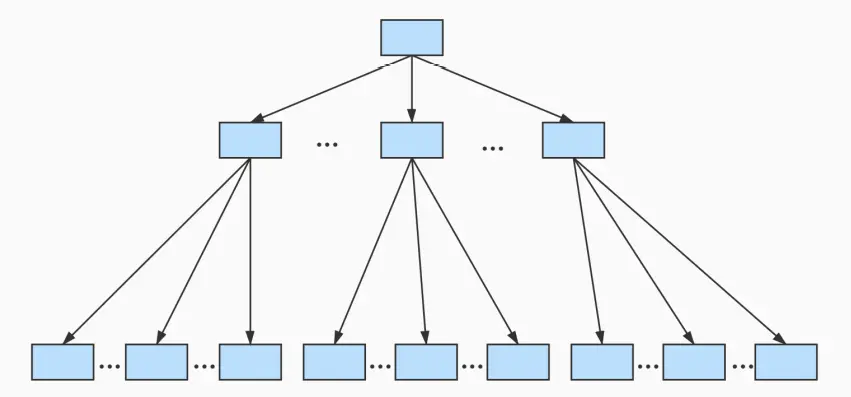


一个 B+树的节点其实可以分成好多层，规定最下边的那层，也就是存放我们用户记录的那层为第`0`层，之后依次往上加。之前我们做了一个非常极端的假设：存放用户记录的页`最多存放 3 条记录`，存放目录项记录的页`最多存放 4 条记录`。其实真实环境中一个页存放的记录数量是非常大的，假设所有存放用户记录的叶子节点代表的数据页可以存放`100 条用户记录`，所有存放目录项记录的内节点代表的数据页可以存放`1000 条目录项记录`，那么：

- 如果 B+树只有 1 层，也就是只有 1 个用于存放用户记录的节点，最多能存放`100`条记录。
- 如果 B+树有 2 层，最多能存放`1000×100=10,0000`条记录。
- 如果 B+树有 3 层，最多能存放`1000×1000×100=1,0000,0000`条记录。
- 如果 B+树有 4 层，最多能存放`1000×1000×1000×100=1000,0000,0000`条记录。相当多的记录！！！

你的表里能存放`100000000000`条记录吗？所以一般情况下，我们`用到的 B+ 树都不会超过 4 层`，那我们通过主键值去查找某条记录最多只需要做 4 个页面内的查找（查找 3 个目录项页和一个用户记录页），又因为在每个页面内有所谓的`Page Directory`（页目录），所以在页面内也可以通过`二分法`实现快速定位记录。

### 2.2 常见索引概念
索引按照物理实现方式，索引可以分为 2 种：聚簇（聚集）和非聚簇（非聚集）索引。我们也把非聚集索引称为二级索引或者辅助索引。

#### 聚簇索引
聚簇索引不仅是一种索引类型，也是**一种数据存储方式**（所有的用户记录都存储在了叶子结点），也就是所谓的`索引即数据，数据即索引`。

::: tip
聚簇索引中的“聚簇”指的是索引中存储数据行的方式。

索引键和实际数据行存储在同一个结构中，这种结构称为聚簇
:::

**特点：**

1. **使用记录主键值的大小进行记录和页的排序**，这包括三个方面的含义：
   - `页内`的记录是按照主键的大小顺序排成一个`单向链表`。
   - 各个存放`用户记录的页`也是根据页中用户记录的主键大小顺序排成一个`双向链表`。
   - 存放`目录项记录的页`分为不同的层次，在同一层次中的页也是根据页中目录项记录的主键大小顺序排成一个`双向链表`。 

2. **B+树的`叶子节点`存储的是完整的用户记录。**
   - 所谓完整的用户记录，就是指这个记录中存储了所有列的值（包括隐藏列）。

我们把具有这两种特性的 B+ 树称为聚簇索引，所有完整的用户记录都存放在这个`聚簇索引`的叶子节点处。这种聚簇索引并不需要我们在 MySQL 语句中显式的使用`INDEX`语句去创建，`InnoDB`存储引擎会`自动`的为我们创建聚簇索引。

**优点：**

- `数据访问更快`，因为聚簇索引将索引和数据保存在同一个 B+树中，因此从聚簇索引中获取数据比非聚簇索引更快
- 聚簇索引对于主键的`排序查找`和`范围查找`速度非常快
- 按照聚簇索引排列顺序，查询显示一定范围数据的时候，由于数据都是紧密相连，数据库不用从多个数据块中提取数据，所以`节省了大量的 io 操作`。

**缺点：**

- `插入速度严重依赖于插入顺序`，按照主键的顺序插入是最快的方式，否则将会出现页分裂，严重影响性能。因此，对于 InnoDB 表，我们一般都会定义一个**自增 ID 列为主键**
- `更新主键的代价很高`，因为将会导致被更新的行移动。因此，对于 InnoDB 表，我们一般定义**主键为不可更新**
- `二级索引访问需要两次索引查找`，第一次找到主键值，第二次根据主键值找到行数据

**限制：**

* 对于 MySQL 数据库，目前只有 InnoDB 数据引擎支持聚簇索引，而 MyISAM 并不支持聚簇索引。
* 由于数据物理存储排序方式只能有一种，所以每个 MySQL 的`表只能有一个聚簇索引`。一般情况下就是该表的主键。
* 如果没有定义主键，Innodb 会选择`非空的唯一索引`代替。如果没有这样的索引，Innodb 会隐式的定义一个主键来作为聚簇索引。
* 为了充分利用聚簇索引的聚簇的特性，所以 innodb 表的主键列尽量`选用有序的顺序id`，而不建议用无序的 id，比如 UUID, MD5, HASH, 字符串列作为主键无法保证数据的顺序增长。

#### 二级索引（辅助索引、非聚簇索引）
因为每个 MySQL 的`表只能有一个聚簇索引`，一般情况下就是该表的主键

* 以表中的非主键列或者列组合建立的索引即为`二级索引`。当非主键列作为查询或者连表、排序等操作的条件时，为了提高效率，就可以以非主键列建立二级索引
* 二级索引不存储完整的行数据，只包含索引列及主键信息。因为每建立一颗 B+ 树都把所有的用户记录再拷贝一遍，太浪费存储空间了。
* 因为数据和索引分开存储，所以二级索引属于**非聚簇索引**
* **概念：回表** 根据二级索引的 B+ 树只能确定要查找记录的主键值，如果想查找到完整的用户记录的话，仍然需要到`聚簇索引`中再查一遍，这个过程称为`回表`。查询一条完整的用户记录需要使用到`2`棵 B+ 树！
* **二级索引的目录项**，包含主键值，索引列，页号，**从而保证目录项的唯一性**。因为二级索引列的值是可以重复的，而主键是唯一的。

聚簇索引和非聚簇索引在使用上的区别：
1. 聚簇索引的`叶子节点`存储的是`数据记录`，非聚簇索引的叶子节点存储的是`数据位置`。非聚簇索引不会影响数据表的物理存储顺序。
2. 一个表`只能有一个聚簇索引`，因为只能有一个排序存储的方式，但可以有`多个非聚簇索引`，也就是多个索引目录提供数据检索。
3. 使用聚簇索引的时候，数据的`查询效率高`，但如果对数据进行插入、删除、更新等操作，效率会比非聚簇索引低。

#### 联合索引
`联合索引`同时以多个列的大小作为排序规则，也就是同时以多个列建立索引

例如 B+树按照`c2 和 c3 列`的大小进行排序，这个包含两层含义：

- 先把各个记录和页按照 c2 列进行排序。
- 在记录的 c2 列相同的情况下，采用 c3 列进行排序

以 c2 和 c3 列的大小为排序规则建立的 B+树称为`联合索引`

联合索引可以是聚簇索引也可以是非聚簇索引，当联合索引包含主键列时，就会建立聚簇索引

### 2.3 InnoDB 的 B+树索引的注意事项
#### 2.3.1 根页面位置万年不动
实际上 B+树的形成过程：

- 每当为某个表创建一个 B+ 树索引（聚簇索引不是人为创建的，默认就有）的时候，都会为这个索引创建一个`根节点`页面。最开始表中没有数据的时候，每个 B+树索引对应的`根节点`中既没有用户记录，也没有目录项记录。
- 随后向表中插入用户记录时，先把用户记录存储到这个`根节点`中。
- 当根节点中的可用`空间用完时`继续插入记录，此时会将根节点中的所有记录复制到一个新分配的页，比如`页 a`中，然后对这个新页进行`页分裂`的操作，得到另一个新页，比如`页 b`。这时新插入的记录根据键值（也就是聚簇索引中的主键值，二级索引中对应的索引列的值）的大小就会被分配到`页 a`或者`页 b`中，而`根节点`便升级为存储目录项记录的页。

这个过程特别注意的是：一个 B+ 树索引的根节点自诞生之日起，便不会再移动。这样只要我们对某个表建立一个索引，那么它的根节点的页号便会被记录到某个地方，然后凡是`InnoDB`存储引擎需要用到这个索引的时候，都会从那个固定的地方取出根节点的页号，从而来访问这个索引。

#### 2.3.2 内节点中目录项记录的唯一性
我们知道 B+ 树索引的内节点中目录项记录的内容是`索引列 + 页号`的搭配，但是这个搭配对于二级索引来说有点不严谨。还拿`index_demo`表为例，假设这个表中的数据是这样的：

| c1 | c2 | c3  |
|:---|:---|:----|
| 1  | 1  | 'u' |
| 3  | 1  | 'd' |
| 5  | 1  | 'y' |
| 7  | 1  | 'a' |

如果二级索引中目录项的内容只是`索引号+页号`的搭配的话，那么为`c2`列建立索引后的 B+树应该长这样：

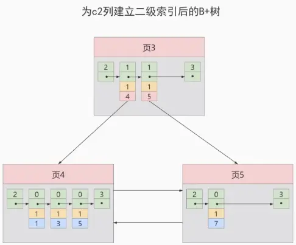

如果我们想要新插入一行记录，其中`c1`、`c2`、`c3`的值分别是：`9`、`1`、`c`，那么在修改这个为 c2 列建立的二级索引对应的 B+ 树时便碰到了个大问题：由于`页3`中存储的目录项记录是由`c2列+页号`的值构成的，`页3`中的两条目录项记录对应的 c2 列的值都是`1`，那么我们这条新插入的记录到底应该放在`页4`中，还是应该放在`页5`中啊？答案是：对不起，懵了。

为了让新插入记录能找到自己在哪个页里，我们需要**保证在 B+树的同一层内节点的目录项记录除页号这个字段以外是唯一的**。所以对于二级索引的内节点的目录项记录的内容实际上是由三个部分构成的：

- 索引列的值
- 主键值
- 页号

也就是我们把`主键值`也添加到二级索引内节点中的目录项记录了，这样就能保证 B+树每一层节点中各条目录项记录除页号这个字段外是唯一的，所以我们为 c2 列建立二级索引后的示意图实际上应该是这样子的：

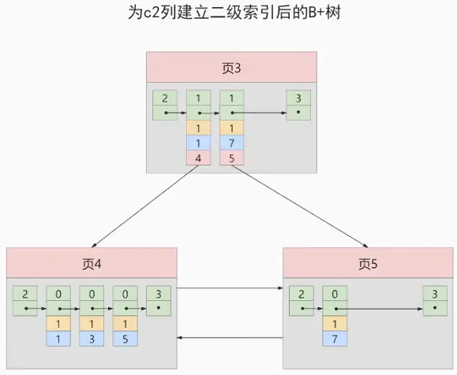

这样我们再插入记录`(9, 1, 'c')`时，由于`页3`中存储的目录项记录是由`c2列+主键+页号`的值构成的，可以先把新记录的`c2`列的值和`页3`中各目录项记录的`c2`列的值作比较，如果`c2`列的值相同的话，可以接着比较主键值，因为 B+树同一层中不同目录项记录的`c2列+主键`的值肯定是不一样的，所以最后肯定能定位唯一的一条目录项记录，在本例中最后确定新记录应该被插入到`页5`中。

#### 2.3.3 一个页面最少可以存储 2 条记录

一个 B+树只需要很少的层级就可以轻松存储数亿条记录，查询速度相当不错！这是因为 B+树本质上就是一个大的多层级目录，每经过一个目录时都会过滤掉许多无效的子目录，直到最后访问的存储真实数据的目录。那如果一个大的目录中只存放一个子目录是个啥效果呢？那就是目录层非常多，而且最后的那个存放真实数据的目录中存放一条记录。费了半天劲只能存放一条真实的用户记录？所以`InnoDB的一个数据页至少可以存放两条记录`

## 3. MyISAM 中的索引方案

**B 树索引适用存储引擎如表所示：**

| 索引/存储引擎   | MyISAM | InnoDB | Memory |
|:----------|:-------|:-------|:-------|
| B-Tree 索引 | 支持     | 支持     | 支持     |

即使多个存储引擎支持同一种类型的索引，但是他们的实现原理也是不同的。Innodb 和 MyISAM 默认的索引是 Btree 索引；而 Memory 默认的索引是 Hash 索引。

MyISAM 引擎使用`B+Tree`作为索引结构，叶子节点的 data 域存放的是`数据记录的地址`。

::: tip
MySQL 官方，凡是写 B-Tree 的地方，都是 B+树
:::

### 3.1 MyISAM 索引的原理

InnoDB 中索引即数据，也就是聚簇索引的那棵 B+树的叶子节点包含所有完整的用户记录，而 MyISAM 的索引方案虽然也使用树形结构，但是却将`索引和数据分开存储`：

- 将表中的记录`按照记录的插入顺序`单独存储在一个文件中，称之为`数据文件`。这个文件并不划分为若干个数据页，有多少记录就往这个文件中塞多少记录。由于在插入数据的时候并**没有刻意按照主键大小排序**，所以并不能在这些数据上使用二分法进行查找。
- 使用`MyISAM`存储引擎的表会把索引信息另外存储到一个称为`索引文件`的另一个文件中。MyISAM 会单独为表的主键创建一个索引，索引的叶子节点中存储的不是完整的用户记录，而是**主键值 + 数据记录地址**的组合。

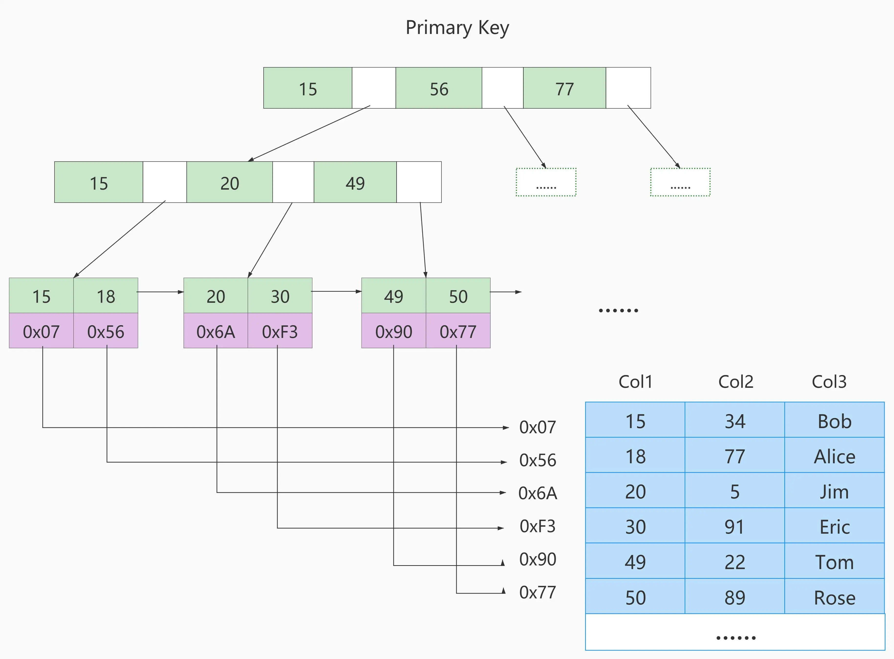

这里表一共有三列，假设我们以 Col1 为主键，上图是一个 MyISAM 表的主索引(Primary key)示意。可以看出**MyISAM 的索引文件仅仅保存数据记录的地址**。在 MyISAM 中，主键索引和二级索引(Secondary key)在结构上没有任何区别，只是主键索引要求 key 是唯一的，而二级索引的 key 可以重复。如果我们在 Col2 上建立一个二级索引，则此索引的结构如下图所示：

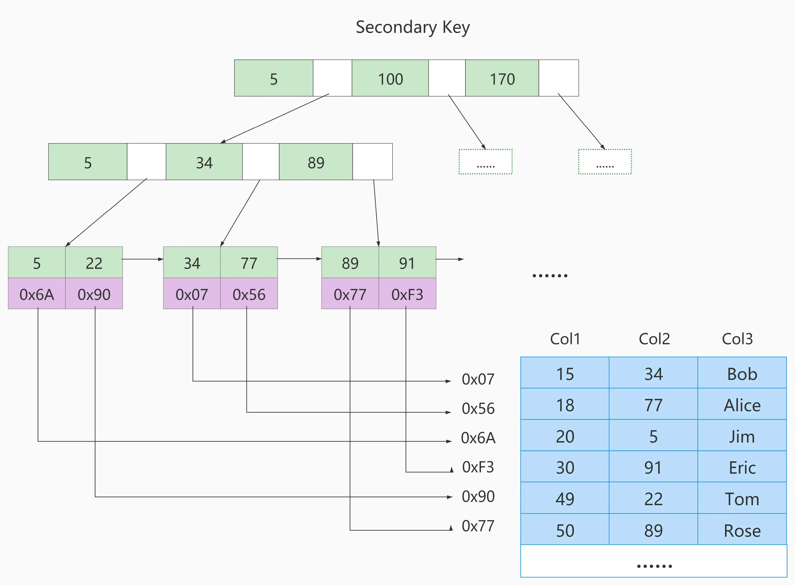

### 3.2 MyISAM 与 InnoDB 对比

**MyISAM 的索引方式都是“非聚簇”的，与 InnoDB 包含 1 个聚簇索引是不同的。**

**小结两种引擎中索引的区别：**

① 在 InnoDB 存储引擎中，我们只需要根据主键值对`聚簇索引`进行一次查找就能找到对应的记录，而在`MyISAM`中却需要进行一次`回表`操作，意味着 MyISAM 中建立的索引相当于全部都是`二级索引`。 

② InnoDB 的数据文件本身就是索引文件，而 MyISAM 索引文件和数据文件是`分离的`，索引文件仅保存数据记录的地址。

③ InnoDB 的非聚簇索引 data 域存储相应记录`主键的值`，而 MyISAM 索引记录的是`地址`。换句话说，InnoDB 的所有非聚簇索引都引用主键作为 data 域。

④ MyISAM 的回表操作是十分`快速`的，因为是拿着地址偏移量直接到文件中取数据的，反观 InnoDB 是通过获取主键之后再去聚簇索引里找记录，虽然说也不慢，但还是比不上直接用地址去访问。

⑤ InnoDB 要求表`必须有主键`（`MyISAM 可以没有`）。如果没有显式指定，则 MySQL 系统会自动选择一个可以非空且唯一标识数据记录的列作为主键。如果不存在这种列，则 MySQL 自动为 InnoDB 表生成一个隐含字段作为主键，这个字段长度为 6 个字节，类型为长整型。

**小结：**

了解不同存储引擎的索引实现方式对于正确使用和优化索引都非常有帮助。比如：

举例 1：知道了 InnoDB 的索引实现后，就很容易明白`为什么不建议使用过长的字段作为主键`，因为所有二级索引都引用主键索引，过长的主键索引会令二级索引变得过大。数据页大小固定，数据项越大，单页存储的记录数越少，B+数的层级越多。

举例 2：用非单调的字段作为主键在 InnoDB 中不是个好主意，因为 InnoDB 数据文件本身是一棵 B+Tree，非单调的主键会造成在插入新记录时，数据文件为了维持 B+Tree 的特性而频繁的分裂调整，十分低效，而`使用自增字段作为主键则是一个很好的选择`。

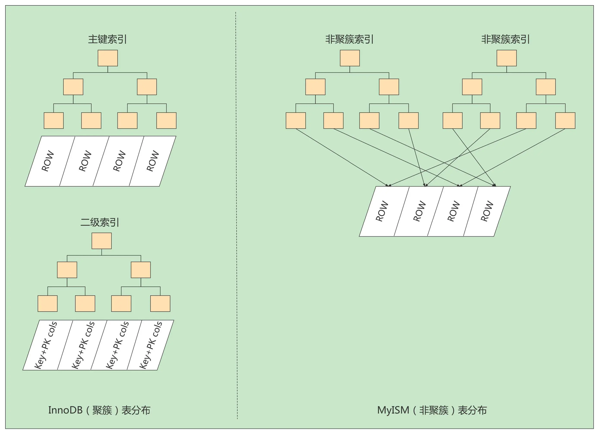

## 4. 索引的代价

索引是个好东西，可不能乱建，它在空间和时间上都会有消耗：

**空间上的代价**

每建立一个索引都要为它建立一棵 B+树，每一棵 B+树的每一个节点都是一个数据页，一个页默认会占用`16KB`的存储空间，一棵很大的 B+树由许多数据页组成，那就是很大的一片存储空间。

**时间上的代价**

每次对表中的数据进行`增、删、改`操作时，都需要去修改各个 B+树索引。而且我们讲过，B+树每层节点都是按照索引列的值`从小到大的顺序排序`而组成了`双向链表`。不论是叶子节点中的记录，还是内节点中的记录（也就是不论是用户记录还是目录项记录）都是按照索引列的值从小到大的顺序而形成了一个单向链表。而增、删、改操作可能会对节点和记录的排序造成破坏，所以存储引擎需要额外的时间进行一些`记录移位`，`页面分裂`、`页面回收`等操作来维护好节点和记录的排序。如果我们建了许多索引，每个索引对应的 B+树都要进行相关的维护操作，会给性能拖后腿。

:::tip
一个表上索引建的越多，就会占用越多的存储空间，在增删改记录的时候性能就越差。为了能建立又好又少的索引，我们得学学这些索引在哪些条件下起作用的。
:::

## 5. MySQL 数据结构选择的合理性

从 MySQL 的角度讲，不得不考虑一个现实问题就是磁盘 IO。如果我们能让索引的数据结构尽量减少硬盘的 IO 操作，所消耗的时间也就越小。可以说，`磁盘的 I/O 操作次数`对索引的使用效率至关重要。 

查找都是索引操作，一般来说索引非常大，尤其是关系型数据库，当数据量比较大的时候，索引的大小有可能几个 G 甚至更多，为了减少索引在内存的占用，**数据库索引是存储在外部磁盘上的**。当我们利用索引查询的时候，不可能把整个索引全部加载到内存，只能`逐一加载`，那么 MySQL 衡量查询效率的标准就是磁盘 IO 次数。

### 5.1 Hash 结构

Hash 本身是一个函数，又被称为散列函数，它可以帮助我们大幅提升检索数据的效率。

Hash 算法是通过某种确定性的算法（比如 MD5、SHA1、SHA2、SHA3）将输入转变为输出。`相同的输入永远可以得到相同的输出`，假设输入内容有微小偏差，在输出中通常会有不同的结果。

哈希结构效率很高，例如 HashMap，查询/插入/修改/删除的平均时间复杂度都是 `O(1)`; (key, value)

**Hash 结构效率高，那为什么索引结构要设计成树型呢？**

原因 1：Hash 索引仅能满足(=)(<>)和 IN 查询。如果进行`范围查询`，哈希型的索引，时间复杂度会退化为 O(n)；而树型的“有序”特性，依然能够保持 O(log2N)的高效率。

原因 2：Hash 索引还有一个缺陷，数据的存储是`没有顺序的`，在 ORDER BY 的情况下，使用 Hash 索引还需要对数据重新排序。

原因 3：对于联合索引的情况，Hash 值是将联合索引键合并后一起来计算的，无法对单独的一个键或者几个索引键进行查询。

原因 4：对于等值查询来说，通常 Hash 索引的效率更高，不过也存在一种情况，就是`索引列的重复值如果很多，效率就会降低`。这是因为遇到 Hash 冲突时，需要遍历桶中的行指针来进行比较，找到查询的关键字，非常耗时。所以，Hash 索引通常不会用到重复值多的列，比如列为性别、年龄的情况等。

**Hash 索引适用存储引擎如表所示：**

| 索引 / 存储引擎 | MyISAM | InnoDB | Memory |
|:----------|:-------|:-------|:-------|
| HASH 索引   | 不支持    | 不支持    | 支持     |

**Hash 索引的适用性：**

Hash 索引存在着很多限制，相比之下在数据库中 B+树索引的使用面会更广，不过也有一些场景采用 Hash 索引效率更高，比如在键值型(Key-Value)数据库中，`Redis 存储的核心就是 Hash 表`。

MySQL 中的 Memory 存储引擎支持 Hash 存储，如果我们需要用到查询的临时表时，就可以选择 Memory 存储引擎，把某个字段设置为 Hash 索引，比如字符串类型的字段，进行 Hash 计算之后长度可以缩短到几个字节。当字段的重复度低，而且经常需要进行`等值查询`的时候，采用 Hash 索引是个不错的选择。

另外，InnoDB 本身不支持 Hash 索引，但是提供`自适应 Hash 索引`(Adaptive Hash Index)。什么时候下才会使用自适应 Hash 索引呢？如果某个数据经常被访问，当满足一定条件的时候，就会将这个数据页的地址存放到 Hash 表中。这样下次查询的时候，就可以直接找到这个页面的所在位置。这样让 B+树也具备了 Hash 索引的优点。

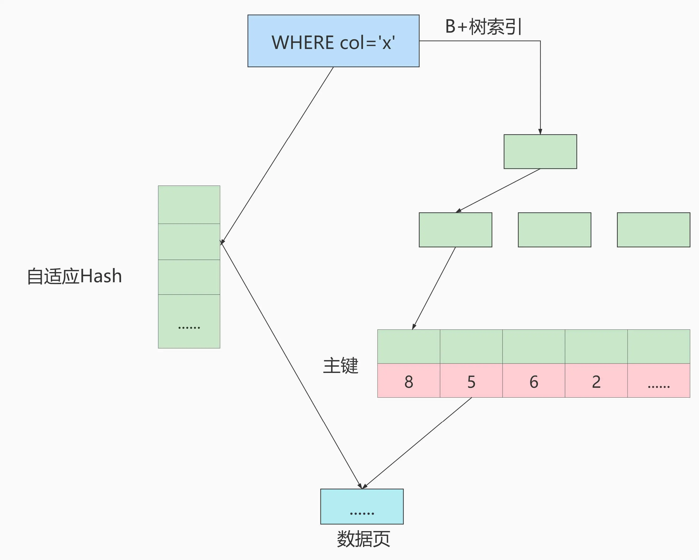

采用自适应 Hash 索引目的是方便根据 SQL 的查询条件加速定位到叶子节点，特别是当 B+树比较深的时候，通过自适应 Hash 索引可以明显提高数据的检索效率。

我们可以通过`innodb_adaptive_hash_index`变量来查看是否开启了自适应 Hash，比如：

```sql
mysql> show variables like '%adaptive_hash_index';
+----------------------------+-------+
| Variable_name              | Value |
+----------------------------+-------+
| innodb_adaptive_hash_index | ON    |
+----------------------------+-------+
```

### 5.2 二叉搜索树

如磁盘的 IO 次数和索引树的高度是相关的。为了提高查询效率，就需要`减少磁盘 IO 数`。为了减少磁盘 IO 的次数，就需要尽量`降低树的高度`，需要把原来“瘦高”的树结构变的“矮胖”，树的每层的分叉越多越好。

二叉搜索树无法自平衡，极端情况下会退化成链表

每个非叶子节点只能有两个子节点，树的层数太多，数太高，索引效率低。

### 5.3 AVL 树

AVL 树实现了自平衡，左右两个子树的高度差不会超过 1，并且左右两个子树都是一颗二叉平衡树

数据查询的时间主要依赖于磁盘 I/O 的次数，如果采用二叉树的形式，即使通过平衡二叉搜索树进行了改进，`树的深度也是 O(log2n)`，当 n 比较大时，深度也是比较高的

针对同样的数据，如果把二叉树改成`M 叉树`(M>2)当数据量 N 大的时候，以及树的分叉树 M 大的时候，M 叉树的高度会远小于二叉树的高度。我们需要把 `树从“瘦高” 变 “矮胖”`。

### 5.4 B-Tree

B 树的英文是 Balance Tree，也就是`多路平衡查找树`。简写为 B-Tree。它的高度远小于平衡二叉树的高度。

B 树的结构如下图所示：

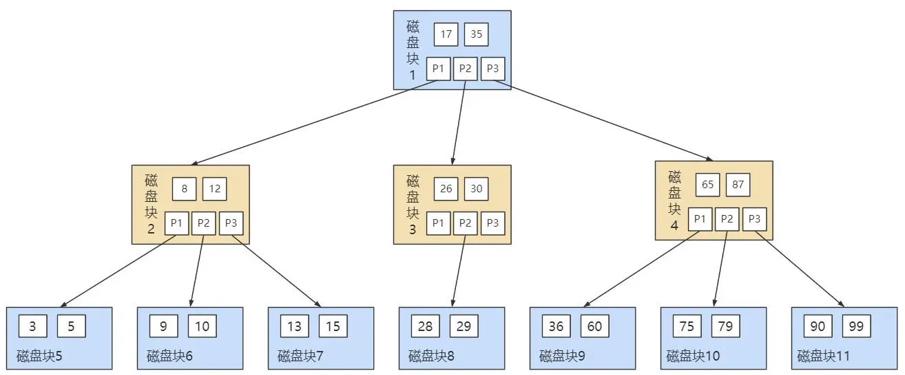

B 树作为多路平衡查找树，它的每一个节点最多可以包括 M 个子节点，`M 称为 B 树的阶`。每个磁盘块中包括了`关键字`和`子节点的指针`。如果一个磁盘块中包括了 x 个关键字，那么指针数就是 x+1。对于一个 100 阶的 B 树来说，如果有 3 层最多可以存储约 100 万的索引数据。对于大量的索引数据来说，采用 B 树的结构是非常适合的，因为树的高度要远小于二叉树的高度。

一个 M 阶的 B 树(M>2)有以下的特性：

* 根节点的儿子数的范围是 `[2,M]`。
* 每个中间节点包含 k-1 个关键字和 k 个孩子，孩子的数量 = 关键字的数量 +1，k 的取值范围为 `[ceil(M/2), M]`。 ceil 向上取整
* 叶子节点包括 k-1 个关键字（叶子节点没有孩子），k 的取值范围为 `[ceil(M/2), M]`。
* 假设中间节点节点的关键字为：`Key[1], Key[2], …, Key[k-1]`，且关键字按照升序排序，即 `Key[i] <Key[i+1]`。此时 `k-1` 个关键字相当于划分了 `k` 个范围，也就是对应着 `k` 个指针，即为：`P[1], P[2], …,P[k]`，其中 `P[1]` 指向关键字小于 `Key[1]` 的子树，`P[i]` 指向关键字属于 `(Key[i-1], Key[i])` 的子树，`P[k]` 指向关键字大于 `Key[k-1]` 的子树。
* 所有叶子节点位于同一层。

上面那张图所表示的 B 树就是一棵 3 阶的 B 树。我们可以看下磁盘块 2，里面的关键字为(8，12)，它有 3 个孩子 (3，5)，(9，10) 和 (13，15)，你能看到 (3，5) 小于 8，(9，10) 在 8 和 12 之间，而 (13，15)大于 12，刚好符合刚才我们给出的特征。

然后我们来看下如何用 B 树进行查找。假设我们想要`查找的关键字是 9`，那么步骤可以分为以下几步：

① 我们与根节点的关键字 (17，35) 进行比较，9 小于 17 那么得到指针 P1； 

② 按照指针 P1 找到磁盘块 2，关键字为(8，12)，因为 9 在 8 和 12 之间，所以我们得到指针 P2； 

③ 按照指针 P2 找到磁盘块 6，关键字为(9，10)，然后我们找到了关键字 9。

你能看出来在 B 树的搜索过程中，我们比较的次数并不少，但如果把数据读取出来然后在内存中进行比较，这个时间就是可以忽略不计的。而读取磁盘块本身需要进行 I/O 操作，消耗的时间比在内存中进行比较所需要的时间要多，是数据查找用时的重要因素。`B 树相比于平衡二叉树来说磁盘 I/O 操作要少`，在数据查询中比平衡二叉树效率要高。所以`只要树的高度足够低，IO 次数足够少，就可以提高查询性能`。

**小结**

* B 树在插入和删除节点的时候如果导致树不平衡，就通过自动调整节点的位置来保持树的自平衡。
* 关键字集合分布在整棵树中，即叶子节点和非叶子节点都存放数据。搜索有可能在非叶子节点结束。
* 其搜索性能等价于在关键字全集内做一次二分查找。

**再举例**

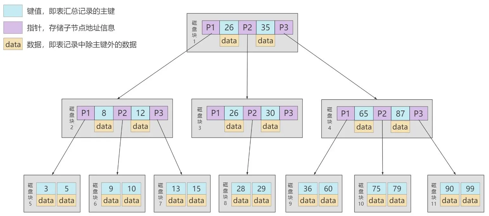

### 5.5 B+Tree

B+树也是一种多路搜索树，`基于 B 树做出了改进`，主流的 DBMS 都支持 B+ 树的索引方式，比如 MySQL。相比较于 B-Tree，`B+Tree 适合文件索引系统`。

**B+树和 B 树的差异：**

* 有 k 个孩子的节点就有 k 个关键字。也就是孩子数量=关键字数，而 B 树中，孩子数量=关键字数+1。
* 非叶子节点的关键字也会同时存在在子节点中，并且是在子节点中所有关键字的最大（或最小）。
* 非叶子节点仅用于索引，不保存数据记录，跟记录有关的信息都放在叶子节点中。而 B 树中，`非叶子节点既保存索引，也保存数据记录`。
* 所有关键字都在叶子节点出现，叶子节点构成一个有序链表，而且叶子节点本身按照关键字的大小从小到大顺序链接。

**B+树的优势**

B+树和 B 树有个根本的差异在于，**B+树的中间节点并不直接存储数据**。这种设计的好处有哪些呢？

首先，**B+树的查询效率更稳定**，因为 B+树每次只有访问到叶子节点才能找到对应的数据，而在 B 树中，非叶子节点也会存储数据，这样就会造成查询效率不稳定的情况。有时候访问到了非叶子节点就可以找到关键字，而有时需要访问到叶子节点才能找到关键字。

其次，**B+树的查询效率更高**。这是因为通常 B+树比 B 树`更矮胖（阶数更大，深度更低）`，查询所需要的磁盘 IO 也会更少。同样的磁盘页大小，B+树可以存储更多的节点关键字。

不仅是在单个关键字的查询上，**在查询范围上，B+树的效率也比 B 树高**。这是因为所有关键字都出现在 B+树的叶子节点中，叶子节点之间会有指针连接，数据又是递增的，这使得我们范围查询可以通过指针连接查找。而在 B 树中则需要通过中序遍历才能完成范围查询，效率要低很多。

::: tip
B 树和 B+树都可以作为索引的数据结构，在 MySQL 中采用的是 B+树。

但 B 树和 B+树各有自己的应用场景，不能说 B+树完全比 B 树好，反之亦然。
:::

::: note 思考题：为了减少 IO，索引树会一次性加载吗？
1. 数据库索引是存储在磁盘上的，如果数据量很大，必然导致索引的大小也会很大，超过几个 G。
2. 当我们利用索引查询时候，是不可能将全部几个 G 的索引都加载进内存的，我们能做的只能是：逐一加载每一个磁盘页，因为磁盘页对应着索引树的节点。
:::

::: note 思考题：B+树的存储能力如何？为何说一般查找行记录，最多只需 1~3 次磁盘 IO
InnoDB 存储引擎中页的大小为 16KB，一般表的主键类型为 INT（占用 4 个字节）或 BIGINT（占用 8 个字节），指针类型也一般为 4 或 8 个字节，也就是说一个页（B+Tree 中的一个节点）中大概存储 16KB/(8B+8B)=1K 个键值，因为是估算，为了方便计算，这里的 K 取值为 10^3。也就是说一个深度为 3 的 B+Tree 索引可以维护 10^3 * 10^3 * 10^3 = 10 亿条记录。（这里假定一个数据页也存储 10^3 条行记录数据了）

实际情况中每个节点可能不能填充满，因此在数据库中，`B+Tree的高度一般都在2~4层`。MySQL 的 InnoDB 存储引擎在设计时是将根节点常驻内存的，也就是说查找某一键值的行记录时最多只需要 1~3 次磁盘 I/O 操作
:::

::: note 思考题：为什么说 B+树比 B-树更适合实际应用中操作系统的文件索引和数据库索引？
1. B+树的磁盘读写代价更低

   B+树的内部结点并没有指向关键字具体信息的指针。因此其内部结点相对于 B 树更小。如果把所有同一内部结点的关键字存放在同一盘块中，那么盘块所能容纳的关键字数量也越多。一次性读入内存中的需要查找的关键字也就越多。相对来说 IO 读写次数也就降低了。
2. B+树的查询效率更加稳定

  由于非终结点并不是最终指向文件内容的节点，而只是叶子结点中关键字的索引。所有任何关键字的查找必须走一条从根结点到叶子结点的路。所有关键字查询的路径长度相同，导致每一个数据的查询效率相当。
:::

::: note 思考题：Hash 索引与 B+树索引的区别
1. Hash 索引`不能进行范围查询`，而 B+树可以。这是因为 Hash 索引指向的数据是无序的，而 B+树的叶子节点是个有序的链表。
2. Hash 索引`不支持联合索引的最左侧原则`（即联合索引的部分索引无法使用），而 B+树可以。对于联合索引来说，Hash 索引在计算 Hash 值的时候是将索引键合并后再一起计算 Hash 值，所以不会针对每个索引单独计算 Hash 值。因此如果用到联合索引的一个或者几个索引时，联合索引无法被利用。
3. Hash 索引`不支持 ORDER BY 排序`，因为 Hash 索引指向的数据是无序的，因此无法起到排序优化的作用，而 B+树索引数据是有序的，可以起到对该字段 ORDER BY 排序优化的作用。同理，我们也无法用 Hash 索引进行`模糊查询`，而 B+树使用 LIKE 进行模糊查询的时候，LIKE 后面后模糊查询（比如%结尾）的话就可以起到优化作用。
4. `InnoDB不支持哈希索引`
:::

::: note 思考题：Hash 索引与 B+ 树索引是在建索引的时候手动指定的吗？
针对 InnoDB 和 MyISAM 存储引擎，都会默认采用 B+树索引，而非使用 Hash 索引。InnoDB 提供的自适应 Hash 是不需要手动指定的。如果是 Memory/Heap 和 NDB 存储引擎，则可以选择使用 Hash 索引。
:::

### 5.6 R 树
R-Tree 在 MySQL 很少使用，仅支持`geometry 数据类型`，支持该类型的存储引擎只有 myisam、bdb、innodb、ndb、archive 几种。

举个 R 树在现实领域中能够解决的例子：查找 20 英里以内所有的餐厅。如果没有 R 树会怎么解决？一般情况下我们会把餐厅的坐标(x,y)分为两个字段存放在数据库中，一个字段记录经度，另一个字段记录纬度。这样的话我们就需要遍历所有的餐厅获取其位置信息，然后计算是否满足要求。如果一个地区有 100 家餐厅的话，我们就要进行 100 次位置计算操作了，如果应用到谷歌、百度地图这种超大数据库中，这种方法便必定不可行了。R 树就很好的`解决了这种高维空间搜索问题`。它把 B 树的思想很好的扩展到了多维空间，采用了 B 树分割空间的思想，并在添加、删除操作时采用合并、分解结点的方法，保证树的平衡性。因此，R 树就是一棵用来`存储高维数据的平衡树`。相对于 B-Tree，R-Tree 的优势在于范围查找。

| 索引 / 存储引擎 | MyISAM | InnoDB | Memory |
|:----------|:-------|:-------|:-------|
| R-Tree 索引 | 支持     | 支持     | 不支持    |

### 5.7 小结
使用索引可以帮助我们从海量的数据中快速定位想要查找的数据，不过索引也存在一些不足，比如占用存储空间、降低数据库写操作的性能等，如果有多个索引还会增加索引选择的时间。当我们使用索引时，需要平衡索引的利*提升查询效率）和弊（维护索引所需的代价）。

在实际工作中，我们还需要基于需求和数据本身的分布情况来确定是否使用索引，尽管`索引不是万能的`，但`数据量大的时候不适用索引是不可想象的`，毕竟索引的本质，是帮助我们提升数据检索的效率。
