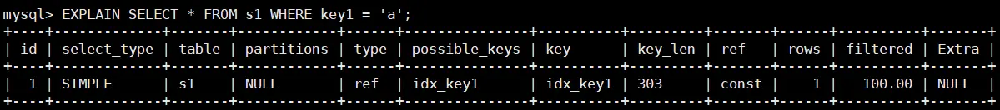
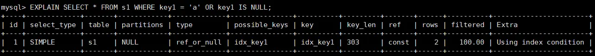

#  第 09 章 性能分析工具的使用

数据库调优的目标 `响应时间更快, 吞吐量更大` 。

利用宏观的监控工具和微观的日志分析可以帮我们快速找到调优的思路和方式。

## 1. 数据库服务器的优化步骤

当我们遇到数据库调优问题的时候，该如何思考呢？这里把思考的流程整理成下面这张图。

整个流程划分成了 `观察（Show status）` 和 `行动（Action）` 两个部分。字母 S 的部分代表观察（会使用相应的分析工具），字母 A 代表的部分是行动（对应分析可以采取的行动）。


通过观察了解数据库整体的运行状态，通过性能分析工具查询执行慢的 SQL 语句，查看具体的 SQL 执行计划，甚至是 SQL 执行中的每一步的成本代价，这样才能定位问题所在，找到了问题，再采取相应的行动。

**详细解释一下这张图**

首先在 S1 部分，我们需要观察服务器的状态是否存在周期性的波动。如果`存在周期性波动`，有可能是周期性节日的原因，比如双十一，促销活动等。这种情况下，我们可以通过 A1 这一步骤解决，也就是加缓存，或者更改缓存失效策略。

如果缓存策略没有解决，或者不是周期性波动的原因，我们就需要进一步`分析查询延迟和卡顿的原因`。接下来进入 S2 这一步骤，开启慢查询。慢查询可以定位执行慢的 SQL 语句。通过设置`long_query_time`参数定义慢的阈值，如果 SQL 执行时间超过了 long_query_time，则认为是慢查询。当收集到这些慢查询之后，就可以通过分析工具对慢查询日志进行分析。

在 S3 这一步骤中，知道了执行慢的 SQL 语句，可以对此针对性地用`EXPLAIN`查看对应 SQL 语句的执行计划，或者使用`show profile`查看 SQL 每一个步骤的时间成本。从而分析 SQL 查询慢的原因，是因为执行计划不好，还是等待的时间长。

如果是 SQL 等待时间长，进入 A2 步骤。调优服务器的参数，比如适当增加数据库缓存池等。如果是 SQL 执行时间长，就进入 A3 步骤，考虑索引设计的问题？还是查询关联的数据表过多？还是因为数据表的字段设计问题。然后在这些维度上进行对应的调整。

如果 A2 和 A3 都不能解决问题，需要考虑数据库自身的 SQL 查询性能是否已经达到了瓶颈，如果确认没有达到性能瓶颈，就需要重新检查，重复以上的步骤。如果已经达到了`性能瓶颈`，进入 A4 阶段，需要考虑`增加服务器`，采用`读写分离`的架构，或者考虑对数据库进行`分库分表`，比如垂直分库，垂直分表和水平分表等。


## 2. 查看系统性能参数

在 MySQL 中，可以使用`SHOW STATUS`语句查询一些 MySQL 数据库服务器的`性能参数`、`执行频率`。

SHOW STATUS 语句语法如下：

```sql
SHOW [GLOBAL|SESSION] STATUS LIKE '参数';
```

一些常用的性能参数如下：

- Connections：连接 MySQL 服务器的次数。 
- Uptime：MySQL 服务器的上线时间。 
- Slow_queries：慢查询的次数。 
- Innodb_rows_read：Select 查询返回的行数 
- Innodb_rows_inserted：执行 INSERT 操作插入的行数 
- Innodb_rows_updated：执行 UPDATE 操作更新的行数 
- Innodb_rows_deleted：执行 DELETE 操作删除的行数 
- Com_select：查询操作的次数。 
- Com_insert：插入操作的次数。对于批量插入的 INSERT 操作，只累加一次。 
- Com_update：更新操作的次数。 
- Com_delete：删除操作的次数。

若查询 MySQL 服务器的连接次数，则可以执行如下语句:

```sql
SHOW STATUS LIKE 'Connections';
```

若查询服务器工作时间，则可以执行如下语句:

```sql
SHOW STATUS LIKE 'Uptime';
```

若查询 MySQL 服务器的慢查询次数，则可以执行如下语句:

```sql
SHOW STATUS LIKE 'Slow_queries';
```

慢查询次数参数可以结合慢查询日志找出慢查询语句，然后针对慢查询语句进行`表结构优化`或者`查询语句优化`。

再比如，如下的指令可以查看相关的指令情况：

```sql
SHOW STATUS LIKE 'Innodb_rows_%';
```

## 3. 统计 SQL 的查询成本：last_query_cost

一条 SQL 查询语句在执行前需要查询执行计划，如果存在多种执行计划的话，MySQL 会计算每个执行计划所需要的成本，从中选择`成本最小`的一个作为最终执行的执行计划。

如果想要查看某条 SQL 语句的查询成本，可以在执行完这条 SQL 语句之后，通过查看当前会话中的`last_query_cost`变量值来得到当前查询的成本。它通常也是我们`评价一个查询的执行效率`的一个常用指标。这个查询成本对应的是`SQL语句所需要读取的读页的数量`。

```sql
SHOW STATUS LIKE 'last_query_cost';
```

以第 8 章的 student_info 表为例：

```sql
CREATE TABLE `student_info` (
    `id` INT(11) NOT NULL AUTO_INCREMENT,
    `student_id` INT NOT NULL ,
    `name` VARCHAR(20) DEFAULT NULL,
    `course_id` INT NOT NULL ,
    `class_id` INT(11) DEFAULT NULL,
    `create_time` DATETIME DEFAULT CURRENT_TIMESTAMP ON UPDATE CURRENT_TIMESTAMP,
    PRIMARY KEY (`id`)
) ENGINE=INNODB AUTO_INCREMENT=1 DEFAULT CHARSET=utf8;
```

查询 id=900001 的记录，查看查询成本，直接在聚簇索引上进行查找：

```sql
SELECT student_id, class_id, NAME, create_time FROM student_info WHERE id = 900001;
```

运行结果（1 条记录，运行时间为 0.042s）

然后再看下查询优化器的成本，实际上我们只需要检索一个页即可：

```sql
mysql> SHOW STATUS LIKE 'last_query_cost';
+-----------------+----------+
| Variable_name   |   Value  |
+-----------------+----------+
| Last_query_cost | 1.000000 |
+-----------------+----------+
```

想要查询 id 在 900001 到 9000100 之间的学生记录

```sql
SELECT student_id, class_id, NAME, create_time FROM student_info WHERE id BETWEEN 900001 AND 900100;
```

运行结果（100 条记录，运行时间为 0.046s）

然后再看下查询优化器的成本，这时我们大概需要进行 20 个页的查询。

```sql
mysql> SHOW STATUS LIKE 'last_query_cost';
+-----------------+-----------+
| Variable_name   |   Value   |
+-----------------+-----------+
| Last_query_cost | 21.134453 |
+-----------------+-----------+
```

页的数量是刚才的 20 倍，但是查询的效率并没有明显的变化，实际上这两个 SQL 查询的时间基本上一样，就是因为采用了顺序读取的方式将页面一次性加载到缓冲池中，然后再进行查找。虽然`页数量（last_query_cost）增加了不少`，但是通过缓冲池的机制，并`没有增加多少查询时间`。

**使用场景**：它对于比较开销是非常有用的，特别是我们有好几种查询方式可选的时候。

::: note SQL 查询是一个动态的过程，从页加载的角度来看，我们可以得到以下两点结论
* `位置决定效率`。如果页就在数据库`缓冲池`中，那么效率是最高的，否则还需要从`内存`或者`磁盘`中进行读取，当然针对单个页的读取来说，如果页存在于内存中，会比在磁盘中读取效率高很多。
* `批量决定效率`。如果我们从磁盘中对单一页进行随机读，那么效率是很低的（差不多 10ms），而采用顺序读取的方式，批量对页进行读取，平均一页的读取效率就会提升很多，甚至要快于单个页面在内存中的随机读取。

* 所以说，遇到 I/O 并不用担心，方法找对了，效率还是很高的。我们首先要考虑数据存放的位置，如果是经常使用的数据就要尽量放到`缓冲池`中，其次我们可以充分利用磁盘的吞吐能力，一次性批量读取数据，这样单个页的读取效率也就得到了提升。
:::

## 4. 定位执行慢的 SQL：慢查询日志

MySQL 的慢查询日志，用来记录在 MySQL 中`响应时间超过阈值`的语句，具体指运行时间超过`long_query_time`的值的 SQL，则会被记录到慢查询日志中。long_query_time 的默认值为`10`，意思是运行 10 秒以上（不含 10 秒）的语句，认为是超出了我们的最大忍耐时间值。

它的主要作用是，帮助我们发现那些执行时间特别长的 SQL 查询，并且有针对性地进行优化，从而提高系统的整体效率。当我们的数据库服务器发生阻塞、运行变慢的时候，检查一下慢查询日志，找到那些慢查询，结合 explain 进行全面分析。

默认情况下，MySQL 数据库`没有开启慢查询日志`，需要我们手动来设置这个参数。**如果不是调优需要的话，一般不建议启动该参数**，因为开启慢查询日志会或多或少带来一定的性能影响。

慢查询日志支持将日志记录写入文件。

### 4.1 开启慢查询日志参数

**1）开启 slow_query_log**

```sql
set global slow_query_log='ON';
```

查看慢查询日志开启状态，以及慢查询日志文件的位置：

```sql
show variables like '%slow_query_log%';
+---------------------+-----------------------------------+
| Variable_name       | Value                             |
+---------------------+-----------------------------------+
| slow_query_log      | ON                                |
| slow_query_log_file | /var/lib/mysql/localhost-slow.log |
+---------------------+-----------------------------------+
```

**2）修改 long_query_time 阈值**

```sql
show variables like '%long_query_time%'; # 默认值是10s
```

```sql
# 测试发现：设置global的方式对当前session的long_query_time失效。对新连接的客户端有效。
# 所以同时设置session和global变量
# global
set global long_query_time = 1; 
show global variables like '%long_query_time%'; 
# session
set long_query_time=1; 
show variables like '%long_query_time%';
```

**3）配置文件中持久化设置参数**

修改 `my.cnf` 文件，`[mysqld]` 下增加或修改参数`long_query_time、slow_query_log`和 `slow_query_log_file`后，然后重启 MySQL 服务器。

```properties
[mysqld]
slow_query_log=ON  # 开启慢查询日志开关
slow_query_log_file=/var/lib/mysql/atguigu-low.log  # 慢查询日志的目录和文件名信息
long_query_time=3  # 设置慢查询的阈值为3秒，超出此设定值的SQL即被记录到慢查询日志
log_output=FILE
```

如果不指定存储路径，慢查询日志默认存储到 MySQL 数据库的数据文件夹下。如果不指定文件名，默认文件名为`hostname_slow.log`。

### 4.2 查看慢查询数目

```sql
SHOW GLOBAL STATUS LIKE '%Slow_queries%';
```

::: tip 补充说明
除了上述变量，控制慢查询日志的还有一个系统变量：`min_examined_row_limit`。这个变量的意思是，`查询扫描过的最少记录数`。这个变量和查询执行时间，共同组成了判别一个查询是否是慢查询的条件。如果查询扫描过的记录数大于等于这个变量的值，并且查询执行时间超过 long_query_time 的值，那么，这个查询就被记录到慢查询日志中；反之，则不被记录到慢查询日志中。

```sql
 show variables like 'min%';
+------------------------+-------+
| Variable_name          | Value |
+------------------------+-------+
| min_examined_row_limit | 0     |
+------------------------+-------+
```

这个值默认为 0。与 long_query_time=10 合在一起，表示只要查询的执行时间超过 10 秒钟，哪怕一个记录也没有扫描过，都要被记录到慢查询日志中。可以根据需要，通过修改配置文件，来修改查询时长，或者通过 SET 指令，用 SQL 语句修改“min_examined_row_limit”的值。
:::

### 4.3 慢查询日志分析工具：mysqldumpslow

```bash
# mysqldumpslow --help
  -v --verbose    verbose
  -d --debug      debug
  -s ORDER     what to sort by (al, at, ar, c, l, r, t), 'at' is default
                al: average lock time  l: lock time
                ar: average rows sent  r: rows sent
                at: average query time t: query time  
                c: count 
  -r           reverse the sort order (largest last instead of first)
  -t NUM       just show the top n queries
  -a           don't abstract all numbers to N and strings to 'S'
  -n NUM       abstract numbers with at least n digits within names
  -g PATTERN   grep: only consider stmts that include this string
  -h HOSTNAME  hostname of db server for *-slow.log filename (can be wildcard),
               default is '*', i.e. match all
  -i NAME      name of server instance (if using mysql.server startup script)
  -l           don't subtract lock time from total time
```

`-a`: 不将数字抽象成 N，字符串抽象成 S

`-s`: 是表示按照何种方式排序：
  - at:平均查询时间（默认方式） t: 查询时间
  - al:平均锁定时间 l: 锁定时间
  - ar:平均返回记录数 r: 返回记录
  - c: 访问次数

`-g`: 后边搭配一个正则匹配模式，大小写不敏感的

`-r`: 默认结果排序从大到小，使用该参数后，从大到小排序

::: note
`-r` 参数在 `-s` 和 `-t` 之后影响查询结果的排序。

具体来说，首先会根据 `-s ORDER` 指定的字段进行排序，然后会根据 `-t NUM` 显示前 `NUM` 个查询结果，最后 `-r` 参数会反转这些结果的排序顺序。

所以，整个处理过程是先排序，再取前 `NUM` 个查询，然后反转排序顺序。
:::

**举例：按照查询时间排序，查看前五条 SQL 语句，这样写即可**

```bash
# mysqldumpslow -s t -t 5 /var/lib/mysql/localhost-slow.log

Reading mysql slow query log from /var/lib/mysql/localhost-slow.log

Count: 1  Time=4.53s (4s)  Lock=0.00s (0s)  Rows=1.0 (1), root[root]@[192.168.1.5]
  SELECT * FROM `table_name` WHERE column_name='S' LIMIT N, N
  
Died at /usr/bin/mysqldumpslow line 161, <> chunk 1.
```

**工作常用参考**

```shell
#得到返回记录集最多的10个SQL 
mysqldumpslow -s r -t 10 /var/lib/mysql/atguigu-slow.log

#得到访问次数最多的10个SQL 
mysqldumpslow -s c -t 10 /var/lib/mysql/atguigu-slow.log

#得到按照时间排序的前10条里面含有左连接的查询语句 
mysqldumpslow -s t -t 10 -g "left join" /var/lib/mysql/atguigu-slow.log 

#另外建议在使用这些命令时结合 | 和 more 使用 ，否则有可能出现爆屏情况
mysqldumpslow -s r -t 10 /var/lib/mysql/atguigu-slow.log | more
```

### 4.4 关闭慢查询日志

**方式 1：永久性方式**

```ini
[mysqld] 
slow_query_log=OFF
# 或者把slow_query_log一项注释掉或删除
[mysqld] 
# slow_query_log =OFF
```

**方式 2：临时性方式**

```sql
SET GLOBAL slow_query_log=off;
```

### 4.5 删除慢查询日志

```sql
show variables like '%slow_query_log%';
+---------------------+-----------------------------------+
| Variable_name       | Value                             |
+---------------------+-----------------------------------+
| slow_query_log      | ON                                |
| slow_query_log_file | /var/lib/mysql/localhost-slow.log |
+---------------------+-----------------------------------+
```

慢查询日志的目录默认为 MySQL 的数据目录，在该目录下`手动删除慢查询日志文件`即可。

使用命令`mysqladmin flush-logs`来重新生成查询日志文件，具体命令如下，执行完成会在数据目录下重新生成慢查询日志文件。

```sql
mysqladmin -uroot -p flush-logs slow
```

::: tip
慢查询日志都是使用 mysqladmin flush-logs 命令来删除重建的。使用时一定要注意，一旦执行了这个命令，慢查询日志都只存在新的日志文件中，如果需要旧的查询日志，就必须事先备份
:::

## 5.查看 SQL 执行成本：SHOW PROFILE

show profile 是 MySQL 提供的可以用来分析当前会话中 SQL 都做了什么、执行的资源消耗工具的情况，可用于 sql 调优的测量。`默认情况下处于关闭状态`，并保存最近 15 次的运行结果。

```sql
show variables like 'profiling';
#开启
set profiling = 'ON';
#查看
show profiles;

show profile;
show profile cpu,block io for query 2;
show profile all for query 6\G
```

**show profile 的常用查询参数：**

① ALL：显示所有的开销信息。 

② BLOCK IO：显示块 IO 开销。

③ CONTEXT SWITCHES：上下文切换开销。

④ CPU：显示 CPU 开销信息。

⑤ IPC：显示发送和接收开销信息。

⑥ MEMORY：显示内存开销信息。 

⑦ PAGE FAULTS：显示页面错误开销信息。 

⑧ SOURCE：显示和 Source_function，Source_file，Source_line 相关的开销信息。 

⑨ SWAPS：显示交换次数开销信息。

**日常开发需注意的结论：**

① `converting HEAP to MyISAM`: 查询结果太大，内存不够，数据往磁盘上搬了。 

② `Creating tmp table`：创建临时表。先拷贝数据到临时表，用完后再删除临时表。 

③ `Copying to tmp table on disk`：把内存中临时表复制到磁盘上，警惕！ 

④ `locked`。 

如果在 show profile 诊断结果中出现了以上 4 条结果中的任何一条，则 sql 语句需要优化。

**注意：**

不过 SHOW PROFILE 命令将被启用，我们可以从 information_schema 中的 profiling 数据表进行查看。

### sending data 时间说明

**mysql5.7 文档解释**

`Sending data` 线程正在为 SELECT 语句读取和处理行，并将数据发送到客户端。由于在此状态下进行的操作往往涉及大量磁盘访问（读取），因此它通常是一个查询生命周期中运行时间最长的状态。

`executing` The thread has begun executing a statement.

::: note
没有建立索引的查询情况下，executing 很快，Sending data 很慢

猜测：在 mysql5.7 中 executing 只代表开始执行，执行的时间在 Sending data 中
:::

**mysql8 文档解释**

mysql8.0 中，`Sending data` 包含在 executing 中

[MySQL 8.4 Reference Manual :: 10.14.3 General Thread States](https://dev.mysql.com/doc/refman/8.4/en/general-thread-states.html)

::: note
经执行验证，mysql8.0 中没有 Sending data，执行时间在 executing 中。
:::

**总之，理解成执行时间一部分**

## 6. 分析查询语句：EXPLAIN
### 6.1 概述
**定位了查询慢的 SQL 之后，就可以使用 EXPLAIN 或 DESCRIBE 工具针对性的分析查询语句。** DESCRIBE 语句的使用方法与 EXPLAIN 语句是一样的, 并且分析结果也是一样的。

MySQL 中有专门负责优化 SELECT 语句的优化器模块，主要功能: 通过计算分析系统中收集到的统计信息, 为客户端请求的 Query 提供它认为是最优的`执行计划`（他认为最优的数据检索方式,但不见得是 DBA 认为是最优的, 这部分最耗费时间） 。

这个执行计划展示了接下来具体执行查询的方式, 比如多表连接的顺序是什么,对于每个表采用什么访问方法来具体执行查询等等。MySQL 为我们提供了`EXPLAIN`语句来帮我们查看某个查询语句的具体执行计划, 大家看懂`EXPLAIN`语句的各个输出项, 可以有针对性的提升我们查询语句的性能。

**1. 能做什么？**

- 表的读取顺序
- 数据读取操作的操作类型
- 哪些索引可以使用
- 哪些索引被实际使用
- 表之间的引用
- 每张表有多少行被优化器查询

**2. 官网介绍**

https://dev.mysql.com/doc/refman/5.7/en/explain-output.html

https://dev.mysql.com/doc/refman/8.0/en/explain-output.html

`MySQL Reference Manual/optimization/Understanding the Query Execution Plan/EXPLAIN Output Format`

**3. 版本情况**

- MySQL5.6.3 以前只能`EXPLAIN SELECT`；MYSQL5.6.3 以后就可以`EXPLAIN SELECT，UPDATE，DELETE`
- 在 5.7 以前的版本中，想要显示`partitions`需要使用`explain partitions`命令；想要显示`filtered` 需要使用`explain extended`命令。在 5.7 版本后，默认 explain 直接显示 partitions 和 filtered 中的信息。

### 6.2 基本语法

**EXPLAN 可以查看语句的执行计划，执行 EXPLAN 时并没有真正的执行后面的语句。**

```sql
EXPLAIN SELECT select_options 
#或者
DESCRIBE SELECT select_options
```

`EXPLAIN`语句输出的各个列的作用如下：

| 列名              | 描述                                  |
|:----------------|:------------------------------------|
| `id`            | 在一个大的查询语句中每个 SELECT 关键字都对应一个`唯一的id` |
| `select_type`   | SELECT 关键字对应的那个查询的类型                |
| `table`         | 表名                                  |
| `partitions`    | 匹配的分区信息                             |
| `type`          | 针对单表的访问方法                           |
| `possible_keys` | 可能用到的索引                             |
| `key`           | 实际上使用的索引                            |
| `key_len`       | 实际使用到的索引长度                          |
| `ref`           | 当使用索引列等值查询时，与索引列进行等值匹配的对象信息         |
| `rows`          | 预估的需要读取的记录条数                        |
| `filtered`      | 某个表经过搜索条件过滤后剩余记录条数的百分比              |
| `Extra`         | 一些额外的信息                             |

### 6.3 数据准备

**1）建表**

建立两张相同的表 s1，s2

```sql
CREATE TABLE s1 (
    id INT AUTO_INCREMENT,
    key1 VARCHAR(100),
    key2 INT,
    key3 VARCHAR(100),
    key_part1 VARCHAR(100),
    key_part2 VARCHAR(100),
    key_part3 VARCHAR(100),
    common_field VARCHAR(100),
    PRIMARY KEY (id),
    INDEX idx_key1 (key1),
    UNIQUE INDEX idx_key2 (key2),
    INDEX idx_key3 (key3),
    INDEX idx_key_part(key_part1, key_part2, key_part3)
) ENGINE=INNODB CHARSET=utf8;
```

**2）设置参数 log_bin_trust_function_creators**

创建函数，假如报错，需开启如下命令：允许创建函数设置：

```sql
set global log_bin_trust_function_creators=1; # 不加global只是当前窗口有效。
```

**3）创建随机字符串函数**

```sql
DELIMITER //
CREATE FUNCTION rand_string(n INT)
	RETURNS VARCHAR(255) #该函数会返回一个字符串
BEGIN
	DECLARE chars_str VARCHAR(100) DEFAULT
'abcdefghijklmnopqrstuvwxyzABCDEFJHIJKLMNOPQRSTUVWXYZ';
    DECLARE return_str VARCHAR(255) DEFAULT '';
    DECLARE i INT DEFAULT 0;
    WHILE i < n DO
        SET return_str =CONCAT(return_str,SUBSTRING(chars_str,FLOOR(1+RAND()*52),1));
        SET i = i + 1;
    END WHILE;
    RETURN return_str;
END //
DELIMITER ;
```

**4）创建存储过程**

创建两个存储过程，分别插入数据到 s1，s2

```sql
DELIMITER //
CREATE PROCEDURE insert_s1 (IN min_num INT (10),IN max_num INT (10))
BEGIN
    DECLARE i INT DEFAULT 0;
    SET autocommit = 0;
    REPEAT
    SET i = i + 1;
    INSERT INTO s1 VALUES(
        (min_num + i),
        rand_string(6),
        (min_num + 30 * i + 5),
        rand_string(6),
        rand_string(10),
        rand_string(5),
        rand_string(10),
        rand_string(10));
    UNTIL i = max_num
    END REPEAT;
    COMMIT;
END //
DELIMITER ;
```

**5）调用存储过程**

```sql
CALL insert_s1(10001,10000);
CALL insert_s2(10001,10000);
```

### 6.4 EXPLAIN 各列作用

#### 1）table

不论查询语句有多复杂，`包含了多少个表`，到最后也是需要对每个表进行`单表访问`的，所以 MySQL 规定 **EXPLAIN 语句输出的每条记录都对应着某个单表的访问方法**，该条记录的 table 列代表着该表的表名（有时不是真实的表名字，可能是简称）。

```sql
EXPLAIN SELECT * FROM s1 JOIN s2 on s1.key1=s2.key1;

+-----------------+-----------------+-------------------------+
| Column Name     | Row1            | Row2                    |
+-----------------+-----------------+-------------------------+
| id              | 1               | 1                       |
| select_type     | SIMPLE          | SIMPLE                  |
| table           | s1              | s2                      |
| partitions      | NULL            | NULL                    |
| type            | ALL             | ref                     |
| possible_keys   | idx_key1        | idx_key1                |
| key             | NULL            | idx_key1                |
| key_len         | NULL            | 303                     |
| ref             | NULL            | dbtest_explain.s1.key1  |
| rows            | 9895            | 1                       |
| filtered        | 100.0           | 100.0                   |
| Extra           | Using where     | None                    |
+-----------------+-----------------+-------------------------+
```

::: note
临时表也有对应记录，比如 UNION 语句。UNION 需要对表进行去重，所以会产生临时表

注意：UNION ALL 不需要去重，所以不会有临时表
:::

```sql
EXPLAIN SELECT * FROM s1 UNION SELECT * FROM s2;
+------+--------------+------------+-----------------+
|  id  | select_type  |   table    |      Extra      |
+------+--------------+------------+-----------------+
|  1   | PRIMARY      | s1         | NULL            |
|  2   | UNION        | s2         | NULL            |
| NULL | UNION RESULT | <union1,2> | Using temporary |
+------+--------------+------------+-----------------+

EXPLAIN SELECT * FROM s1 UNION ALL  SELECT * FROM s2;
+----+-------------+-------+-------+
| id | select_type | table | Extra |
+----+-------------+-------+-------+
|  1 | PRIMARY     | s1    | NULL  |
|  2 | UNION       | s2    | NULL  |
+----+-------------+-------+-------+
```

#### 2）id

查询语句中每出现一个`SELECT`关键字，MySQL 就会为它分配一个唯一的`id`值。这个`id`值就是`EXPLAIN`语句的第一个列。

- **id 如果相同，可以认为是一组，从上往下顺序执行**
- **在所有组中，id 值越大，优先级越高，越先执行**
- **关注点：id 号每个号码，表示一趟独立的查询,一个 sql 的查询趟数越少越好**

**2.1）连接查询**

对于连接查询来说，一个 SELECT 关键字后边的 FROM 子句中可以跟随多个表，所以在连接查询的执行计划中，每个表都会对应一条记录，但是这些记录的 id 值都是相同的。出现在前边的表表示`驱动表`，出现在后边的表表示 `被驱动表`

::: note
在 join 连接查询中，驱动表在 SQL 语句执行的过程中总是先被读取。而被驱动表在 SQL 语句执行的过程中总是后被读取。在读取驱动表数据后，放入到 join_buffer 后，再去读取被驱动表中的数据来和驱动表中的数据进行匹配。如果匹配成功，就返回结果，否则该丢弃，继续匹配下一条
:::

**2.2）查询中包含子查询**

包含子查询的查询语句来说，就可能涉及多个 SELECT 关键字，所以在包含子查询的查询语句的执行计划中，每个 SELECT 关键字都会对应一个唯一的 id 值

```sql
EXPLAIN SELECT * FROM s1 WHERE key1 IN (SELECT key1 FROM s2) OR key3='a';

+--------------+------------+-------------+
| Column Name  | Row1       | Row2        |
+--------------+------------+-------------+
| id           | 1          | 2           |
| select_type  | PRIMARY    | SUBQUERY    |
| table        | s1         | s2          |
| partitions   | NULL       | NULL        |
| type         | ALL        | index       |
| possible_keys| NULL       | idx_key1    |
| key          | NULL       | idx_key1    |
| key_len      | NULL       | 303         |
| ref          | NULL       | NULL        |
| rows         | 9895       | 9895        |
| filtered     | 100.00     | 100.00      |
| Extra        | Using where| Using index |
+--------------+------------+-------------+
```

::: note
**查询优化器可能对涉及子查询的查询语句进行重写，从而转换为连接查询**

在大多数现代数据库系统中，查询优化器会尝试将子查询重写为等价的连接操作(JOIN)，以提高执行效率。这种优化过程称为子查询去关联(Subquery Unnesting)或子查询扁平化(Subquery Flattening)。
:::

```sql
######查询优化器可能对涉及子查询的查询语句进行重写######
EXPLAIN SELECT * FROM s1 WHERE key1 IN (SELECT key2 FROM s2 WHERE common_field = 'a');

+---------------+----------+---------------------------------------+
| Column Name   | Row 1    | Row 2                                 |
+---------------+----------+---------------------------------------+
| id            | 1        | 1                                     |
| select_type   | SIMPLE   | SIMPLE                                |
| table         | s1       | s2                                    |
| partitions    | NULL     | NULL                                  |
| type          | ALL      | eq_ref                                |
| possible_keys | idx_key1 | idx_key2                              |
| key           | NULL     | idx_key2                              |
| key_len       | NULL     | 5                                     |
| ref           | NULL     | dbtest_explain.s1.key1                |
| rows          | 9895     | 1                                     |
| filtered      | 100.00   | 10.00                                 |
| Extra         | Using where | Using index condition; Using where |
+---------------+----------+---------------------------------------+
```

```sql
SELECT s1.* 
FROM s1 
JOIN s2 ON s1.key1 = s2.key2 
WHERE s2.common_field = 'a';
```

虽然查询语句是一个子查询，但是执行计划中 s1 和 s2 表对应的记录的 id 值全部是 1，这就表明了查询优化器将子查询转换为了连接查询

**2.3）联合查询**

联合查询也会涉及多个 SELECT 关键字，每个 SELECT 关键字都会对应一个唯一的 id 值

#### 3）select_type

**SELECT 关键字对应的那个查询的类型，确定小查询在整个大查询中扮演了一个什么角色**

一条大的查询语句里边可以包含若干个 SELECT 关键字，`每个SELECT关键字代表着一个小的查询语句`，而每个 SELECT 关键字的 FROM 子句中都可以包含若干张表（这些表用来做连接查询），`每一张表都对应着执行计划输出中的一条记录`，对于在同一个 SELECT 关键字中的表来说，它们的 id 值是相同的。

MySQL 为每一个 SELECT 关键字代表的小查询都定义了一个称之为`select_type`的属性，意思是我们只要知道了某个小查询的`select_type 属性`，就知道了这个`小查询在整个大查询中扮演了一个什么角色`

**select_type 取值**

| 名称                     | 描述                                                                                                        |
|:-----------------------|:----------------------------------------------------------------------------------------------------------|
| `SIMPLE`               | Simple SELECT (not using UNION or subqueries)                                                             |
| `PRIMARY`              | Outermost SELECT 最外层的 SELECT<br>指包含子查询的 SELECT 语句最外层的 SELECT                                              |
| `UNION`                | Second or later SELECT statement in a UNION                                                               |
| `UNION RESULT`         | Result of a UNION                                                                                         |
| `SUBQUERY`             | First SELECT in subquery                                                                                  |
| `DEPENDENT SUBQUERY`   | First SELECT in subquery, dependent on outer query                                                        |
| `DEPENDENT UNION`      | Second or later SELECT statement in a UNION, dependent on outer query                                     |
| `DERIVED`              | Derived table                                                                                             |
| `MATERIALIZED`         | Materialized subquery                                                                                     |
| `UNCACHEABLE SUBQUERY` | A subquery for which the result cannot be cached and must be re-evaluated for each row of the outer query |
| `UNCACHEABLE UNION`    | The second or later select in a UNION that belongs to an uncacheable subquery (see UNCACHEABLE SUBQUERY)  |

**3.1）SIMPLE**

查询语句中不包含 UNION 或者子查询的查询都是`SIMPLE`类型。

```sql
EXPLAIN SELECT * FROM s1; # 单表查询
EXPLAIN SELECT * FROM s1 INNER JOIN s2; # 连接查询
```

**3.2）PRIMARY、UNION、UNION RESULT**

UNION 联合查询其左边的查询是`PRIMARY`，右边的查询类型是`UNION`，去重的临时表查询类型是：`UNION RESULT`

- 对于包含 UNION 或者 UNION ALL 的大查询来说，它是由几个小查询组成的，其中最左边的那个查询的 select_type 值就是 `PRIMARY`，其余的小查询的 select_type 值就是`UNION`
- MySQL 选择使用临时表来完成 UNION 查询的去重工作，针对该临时表的查询的 select_type 就是 `UNION RESULT`

对于包含子查询的大查询来说，其中最左边的那个查询的 select_type 值就是`PRIMARY`

```sql
EXPLAIN SELECT * FROM s1 UNION SELECT * FROM s2;
+----+--------------+------------+-----------------+
| id | select_type  | table      | Extra           |
+----+--------------+------------+-----------------+
|  1 | PRIMARY      | s1         | NULL            |
|  2 | UNION        | s2         | NULL            |
|NULL| UNION RESULT | <union1,2> | Using temporary |
+----+--------------+------------+-----------------+
```

**3.3）SUBQUERY、DEPENDENT SUBQUERY**

* 如果包含子查询的查询语句不能够转为对应的多表连接的形式（`semi-join`的形式）（也就是不会被优化器进行自动的优化），并且该子查询是不相关的子查询

  该子查询的第一个`SELECT`关键字代表的那个查询的 select_type 就是`SUBQUERY`。也就是外层查询是 Primary ，内层查询是 SUBQUERY

```sql
EXPLAIN SELECT * FROM s1 WHERE key1 IN (SELECT key1 FROM s2) OR key3 ='a';
+----+-------------+-------+-------------+
| id | select_type | table | Extra       |
+----+-------------+-------+-------------+
|  1 | PRIMARY     | s1    | Using where |
|  2 | SUBQUERY    | s2    | Using index |
+----+-------------+-------+-------------+
```

* 如果子查询不能被转换为多表连接的形式，并且该子查询是相关子查询。

  比如下面的查询在内部子查询使用了外部的表。则该子查询的第一个 SELECT 关键字代表的那个查询的 select_type 就是`DEPENDENT SUBQUERY`。外层查询是 Primary ，内层查询是 DEPENDENT SUBQUERY

```sql
EXPLAIN SELECT * FROM s1 WHERE key1 IN (SELECT key1 FROM s2 WHERE s1.key2 = s2.key2) OR key3 = 'a';
+----+--------------------+-------+-------------+
| id | select_type        | table | Extra       |
+----+--------------------+-------+-------------+
|  1 | PRIMARY            | s1    | Using where |
|  2 | DEPENDENT SUBQUERY | s2    | Using where |
+----+--------------------+-------+-------------+
```

::: note
select_type 为`DEPENDENT SUBQUERY` 的查询可能会被执行多次，

相关子查询依赖于外部查询中的列值。这使得子查询在每次外部查询处理行时都需要重新执行

**相关子查询和不相关子查询概念回顾**
- **相关子查询**(Correlated Subquery)是指子查询中引用了外部查询中的列，子查询的执行依赖于外部查询中的每一行。每次外部查询处理一行数据，子查询都会重新执行一次
- **不相关子查询**(Non-Correlated Subquery)是指子查询独立于外部查询，可以独立执行。子查询的结果在外部查询执行之前就已经确定。
:::

**3.4）DEPENDENT UNION**

在包含 UNION 或者 UNION ALL 的大查询中，如果各个小查询都依赖于外查询的话，那么除了最左边的小查询外，其余各个小查询的 select_type 值都是`DEPENDENT UNION`

```sql
EXPLAIN SELECT * FROM s1 WHERE key1 IN
(SELECT key1 FROM s2 WHERE key1 = 'a' UNION SELECT key1 FROM s1 WHERE key1 = 'b');

+------+--------------------+------------+--------------------------+
| id   | select_type        | table      | Extra                    |
+------+--------------------+------------+--------------------------+
|  1   | PRIMARY            | s1         | Using where              |
|  2   | DEPENDENT SUBQUERY | s2         | Using where; Using index |
|  3   | DEPENDENT UNION    | s1         | Using where; Using index |
| NULL | UNION RESULT       | <union2,3> | Using temporary          |
+------+--------------------+------------+--------------------------+
```

::: note
优化器有时会把 IN 优化成 EXISTS 语句，使得上面的语句变成相关子查询
:::

**3.5）DERIVED**

对于包含`派生表`的查询，该派生表对应的子查询的 select_type 就是`DERIVED`

```sql
EXPLAIN SELECT * FROM 
(SELECT key1, count(*) as c FROM s1 GROUP BY key1) AS derived_s1 
where c > 1;
+----+-------------+------------+
| id | select_type | table      | 
+----+-------------+------------+
|  1 | PRIMARY     | <derived2> |
|  2 | DERIVED     | s1         |
+----+-------------+------------+
```

**3.6）MATERIALIZED**

当查询优化器在执行包含子查询的语句时，选择将子查询物化之后与外层查询进行连接查询时，

该子查询对应的 select_type 属性就是`MATERIALIZED`

```sql
EXPLAIN SELECT * FROM s1 WHERE key1 IN (SELECT key1 FROM s2);#子查询被转为了物化表
+----+--------------+-------------+-------------+
| id | select_type  | table       | Extra       |
+----+--------------+-------------+-------------+
|  1 | SIMPLE       | s1          | Using where |
|  1 | SIMPLE       | <subquery2> | NULL        |
|  2 | MATERIALIZED | s2          | Using index |
+----+--------------+-------------+-------------+
```

`select_type` 属性为 `MATERIALIZED` 代表查询类型为物化查询，这表示该查询是一个物化表的创建或刷新操作。

外层查询，访问一张临时表（物化表）和一张普通表，查询的类型是简单查询 SIMPLE

**UNCACHEABLE SUBQUERY** **UNCACHEABLE UNION** 不常用，省略。

#### 4）partitions

代表分区表中的命中情况，非分区表，该项为`NULL`。一般情况下查询语句的执行计划的`partitions`列的值都是 NULL

[官方文档](https://dev.mysql.com/doc/refman/8.0/en/alter-table-partition-operations.html) 如果想详细了解，可以如下方式测试。创建分区表

```sql
-- 创建分区表，
-- 按照id分区，id<100 p0分区，其他p1分区
CREATE TABLE user_partitions (id INT auto_increment,
	NAME VARCHAR(12),PRIMARY KEY(id))
	PARTITION BY RANGE(id)(
	PARTITION p0 VALUES less than(100),
	PARTITION p1 VALUES less than MAXVALUE
);
```

查询 id 大于 200（200>100，p1 分区）的记录，查看执行计划，partitions 是 p1，符合我们的分区规则

```sql
DESC SELECT * FROM user_partitions WHERE id>200;
+----+-------------+-----------------+------------+-------------+
| id | select_type | table           | partitions | Extra       |
+----+-------------+-----------------+------------+-------------+
|  1 | SIMPLE      | user_partitions | p1         | Using where |
+----+-------------+-----------------+------------+-------------+
```

#### 5）type（重点）

执行计划的一条记录就代表着 MySQL 对某个表的`执行查询时的访问方法`，又称"访问类型”，其中的`type`列就表明了这个访问方法是啥，是较为重要的一个指标。比如，看到 type 列的值是 ref，表明 MySQL 即将使用 ref 访问方法来执行对 s1 表的查询

完整的访问方法如下，**结果值从最好到最坏依次是：**

`system` > `const` > `eq_ref` > `ref` > `fulltext` > `ref_or_null` > `index_merge` > `unique_subquery` > `index_subquery` > `range` > `index` > `ALL`

**SQL 性能优化的目标：至少要达到 range 级别，要求是 ref 级别，最好是 consts 级别。（阿里巴巴开发手册要求）**

* `system`

当表中`只有一条记录`并且该表使用的存储引擎的统计数据是精确的，比如 MyISAM、Memory，那么对该表的访问方法就是`system`。比方说我们新建一个`MyISAM`表，并为其插入一条记录：

```sql
CREATE TABLE t(i int) Engine=MyISAM;
INSERT INTO t VALUES(1);
EXPLAIN SELECT * FROM t;
```


::: note
把表改成使用 InnoDB 存储引擎，则执行计划的`type`列是 ALL
:::

* `const`

当我们根据主键或者唯一二级索引列与常数进行等值匹配时，对单表的访问方法就是`const`, 比如：

```sql
EXPLAIN SELECT * FROM s1 WHERE id = 10005;
```


* `eq_ref`

在连接查询时，如果被驱动表是通过主键或者唯一二级索引列等值匹配的方式进行访问的（如果该主键或者唯一二级索引是联合索引的话，所有的索引列都必须进行等值比较）。则对该被驱动表的访问方法就是`eq_ref`，比方说：

```sql
EXPLAIN SELECT * FROM s1 INNER JOIN s2 ON s1.id = s2.id;
```


从执行计划的结果中可以看出，MySQL 打算将 s2 作为驱动表，s1 作为被驱动表，重点关注 s1 的访问方法是 `eq_ref` ，表明在访问 s1 表的时候可以 `通过主键的等值匹配` 来进行访问。

* `ref`

当通过普通的二级索引列与常量进行等值匹配时来查询某个表，那么对该表的访问方法就可能是`ref`

```sql
EXPLAIN SELECT * FROM s1 WHERE key1 = 'a';
```



::: note
要求不存在隐式转换，存在隐式转换，索引失效，type 类型为 ALL
:::

* `fulltext` 全文索引

* `ref_or_null`

当对普通二级索引进行等值匹配查询，该索引列的值也可以是`NULL`值时，那么对该表的访问方法就可能是`ref_or_null`，比如说：

```sql
EXPLAIN SELECT * FROM s1 WHERE key1 = 'a' OR key1 IS NULL;
```



* `index_merge`

一般情况下对于某个表的查询只能使用到一个索引，但单表访问方法时在某些场景下可以使用`Interseation、union、Sort-Union`这三种索引合并的方式来执行查询。我们看一下执行计划中是怎么体现 MySQL 使用索引合并的方式来对某个表执行查询的：

```sql
EXPLAIN SELECT * FROM s1 WHERE key1 = 'a' OR key3 = 'a';
```


从执行计划的`type`列的值是 `index_merge` 就可以看出，MySQL 打算使用索引合并的方式来执行对 s1 表的查询。

* `unique_subquery`

类似于两表连接中被驱动表的`eq_ref`访问方法，`unique_subquery`是针对在一些包含`IN`子查询的查询语句中，如果查询优化器决定将`IN`子查询转换为`EXISTS`子查询，而且子查询可以使用到主键进行等值匹配的话，那么该子查询执行计划的`type`列的值就是`unique_subquery`

```sql
EXPLAIN 
SELECT * FROM s1 WHERE key2 IN (SELECT id FROM s2 where s1.key1 = s2.key1) OR key3 = 'a';
```


* `index_subquery`

`index_subquery` 与 `unique_subquery` 类似，只不过访问子查询中的表时使用的是普通的索引，比如这样：

```sql
EXPLAIN 
SELECT * FROM s1 WHERE common_field IN (SELECT key3 FROM s2 where s1.key1 = s2.key1) OR key3 = 'a';
```


::: danger
存疑，这里的执行结果是 ref
:::

* `range`

如果使用索引获取某些范围区间的记录，那么就可能使用到 range 访问方法

```sql
EXPLAIN SELECT * FROM s1 WHERE key1 IN ('a', 'b', 'c');
EXPLAIN SELECT * FROM s1 WHERE key1 > 'a' AND key1 < 'b';
```


* `index`

当我们可以使用索引覆盖，但需要扫描全部的索引记录时，该表的访问方法就是`index`，比如这样：

```sql
EXPLAIN SELECT key_part2 FROM s1 WHERE key_part3 = 'a';
```


上述查询中的所有列表中只有 key_part2 一个列，而且搜索条件中也只有 key_part3 一个列，这两个列又恰好包含在 idx_key_part 这个索引中，可是搜索条件 key_part3 不能直接使用该索引进行`ref`和`range`方式的访问，只能扫描整个`idx_key_part`索引的记录，所以查询计划的`type`列的值就是`index`。

::: tip
再一次强调，对于使用 InnoDB 存储引擎的表来说，二级索引的记录只包含索引列和主键列的值，而聚簇索引中包含用户定义的全部列以及一些隐藏列，所以扫描二级索引的代价比直接全表扫描，也就是扫描聚簇索引的代价更低一些。
:::

* `ALL`

全表扫描

```sql
EXPLAIN SELECT * FROM s1;
```


一般来说，这些访问方法中除了 All 这个访问方法外，其余的访问方法都能用到索引，除了 index_merge 访问方法外，其余的访问方法都最多只能用到一个索引。

#### 6）possible_keys 和 key

在 EXPLAIN 语句输出的执行计划中，`possible_keys`列表示在某个查询语句中，对某个列执行`单表查询时可能用到的索引`有哪些。一般查询涉及到的字段上若存在索引，则该索引将被列出，但不一定被查询使用。`key`列表示`实际用到的索引`有哪些，如果为 NULL，则没有使用索引。比方说下面这个查询：

```sql
EXPLAIN SELECT * FROM s1 WHERE key1 > 'z' AND key3 = 'a';
```


上述执行计划的`possible_keys`列的值是`idx_key1,idx_key3`，表示该查询可能使用到`idx_key1, idx_key3`两个索引，然后`key`列的值是`idx_key3`，表示经过查询优化器计算使用不同索引的成本后，最后决定采用`idx_key3`。

::: warning
key 并不一定是 possible_keys 的一个子集。有时候，`key`字段中显示的索引并不一定出现在`possible_keys`中。这通常是因为 MySQL 的优化器在特定情况下可能选择使用某些隐式索引或一些额外的索引优化策略，这些索引在`possible_keys`中未显示。
:::

#### 7）key_len（重点）

实际使用到的索引长度 （即：字节数）

检查`是否充分的利用了索引`，`值越大越好（相对于自身）`，主要针对于联合索引，有一定的参考意义。

**int 类型**

如果 INT 列不允许 `NULL`，`key_len` 为 4

```sql
EXPLAIN SELECT * FROM s1 WHERE id = 10005;
```


如果 `INT` 列允许 `NULL`，`key_len` 会增加 1 个字节，用于存储 `NULL` 标志，因此 `key_len` 为 5。

```sql
EXPLAIN SELECT * FROM s1 WHERE key2 = 10126;
```


**varchar 类型**

```sql
EXPLAIN SELECT * FROM s1 WHERE key1 = 'a';
```


key1 VARCHAR(100) 一个字符占 3 个字节，100*3，是否为 NULL 占用一个字节，varchar 的长度信息占两个字节。

```sql
EXPLAIN SELECT * FROM s1 WHERE key_part1 = 'a' AND key_part2 = 'b';
```


**key_len 的长度计算公式：**

```
varchar(10)变长字段且允许NULL = 10 * ( character set：utf8=3,gbk=2,latin1=1)+1(NULL)+2(变长字段) 

varchar(10)变长字段且不允许NULL = 10 * ( character set：utf8=3,gbk=2,latin1=1)+2(变长字段)

char(10)固定字段且允许NULL = 10 * ( character set：utf8=3,gbk=2,latin1=1)+1(NULL) 

char(10)固定字段且不允许NULL = 10 * ( character set：utf8=3,gbk=2,latin1=1)
```

#### 8）ref

当使用索引列等值查询时，与索引列进行等值匹配的对象信息。

当使用索引列等值匹配的条件去执行查询时，也就是在访问方法是 `const 、 eq_ref 、 ref 、 ref_or_null 、 unique_subquery 、 index_subquery` 其中之一时， ref 列展示的就是与索引列作等值匹配的结构是什么，比如只是一个常数或者是某个列。

* `const` **表示索引列与常量值进行匹配**

可以看到 ref 列的值是 const，表明在使用 idx_key1 索引执行查询时，与 key1 列作等值匹配的对象是一个常数

```sql
EXPLAIN SELECT * FROM s1 WHERE key1 = 'a';
```


* `column_name`：**表示使用某个列的值与索引进行匹配。**

通常用于多表连接的情况下，表与表之间的连接条件会用到这个列。

```sql
EXPLAIN SELECT * FROM s1 INNER JOIN s2 ON s1.id = s2.id;
```


* `func`：**表示索引列与一个返回值为常量的函数进行匹配。**

```sql
EXPLAIN SELECT * FROM s1 INNER JOIN s2 ON s2.key1 = UPPER(s1.key1);
```


#### 9）rows（重点）

预估的需要读取的记录条数，条目数越小越好。这是因为值越小，加载 I/O 的页数就越少

```sql
EXPLAIN SELECT * FROM s1 WHERE key1 > 'z';
```


#### 10）filtered

某个表经过搜索条件过滤后剩余记录条数的百分比

如果进行单表扫描时使用了索引，那么在计算时需要估算出除了符合索引条件外，满足其他搜索条件的记录数量。

```sql
EXPLAIN SELECT * FROM s1 WHERE key1 > 'z' AND common_field = 'a';
```


对于单表查询来说，这个 filtered 的值没有什么意义，我们`更关注在连接查询中驱动表对应的执行计划记录的 filtered 值`，它决定了被驱动表要执行的次数 （即: rows * filtered）

```sql
EXPLAIN SELECT * FROM s1 INNER JOIN s2 ON s1.key1 = s2.key1 WHERE s1.common_field = 'a';
```

  

从执行计划中可以看出来，查询优化器打算把 s1 当作驱动表，s2 当作被驱动表。我们可以看到驱动表 s1 表的执行计划的 rows 列为 9895，filtered 列为 10.00，这意味着驱动表 s1 的扇出值就是 9895×10.00%=989.5，这说明还要对被驱动表执行大约 989 次查询。

#### 11）Extra

Extra 列是用来说明一些额外信息的，包含不适合在其他列中显示但十分重要的额外信息。通过这些额外信息可以更准确的理解 MySQL 到底将如何执行给定的查询语句。MySQL 提供的额外信息有好几十个，仅介绍部分。

* `No tables used`

当查询语句的没有 FROM 子句时将会提示该额外信息

```sql
EXPLAIN SELECT 1;
+----+-------------+-------+----------------+
| id | select_type | table | Extra          |
+----+-------------+-------+----------------+
|  1 | SIMPLE      | NULL  | No tables used |
+----+-------------+-------+----------------+
```

* `Impossible WHERE`

查询语句的`WHERE`子句永远为`FALSE`时将会提示该额外信息。即查询条件永远不可能满足，查不到数据。

```sql
EXPLAIN SELECT * FROM s1 WHERE 1 != 1;
```

* `Using where`

除了使用索引来过滤数据以外，还使用了其他过滤条件

**情况一：没有使用索引，WHERE 子句中存在过滤条件**

当使用全表扫描来执行对某个表的查询，并且该语句的`WHERE`子句中有针对该表的搜索条件时，在 Extra 列中会提示上述额外信息。比如下边这个查询：

```sql
EXPLAIN SELECT * FROM s1 WHERE common_field = 'a';
```


**情况二：使用了索引作为过滤条件，WHERE 子句中除了索引列，还存在其他过滤条件**

```sql
EXPLAIN SELECT * FROM s1 WHERE key1 = 'a' AND common_field = 'a';
```

当使用索引访问来执行对某个表的查询，并且该语句的 WHERE 子句中有除了该索引包含的列之外的其他搜索条件时，在 Extra 列中也会提示上述额外信息。


**如果只使用了索引作为过滤条件，则不存在额外信息**

```sql
EXPLAIN SELECT * FROM s1 WHERE key1 = 'a';
```


* `No matching min/max row`

当查询列表处有`MIN`或者`MAX`聚合函数，但是并没有符合`WHERE`子句中的搜索条件的记录时。

```sql
EXPLAIN SELECT MIN(key1) FROM s1 WHERE key1 = 'abcdefg';
```


* `Select tables optimized away`

当查询列表处有`MIN`或者`MAX`聚合函数，存在符合`WHERE`子句中的搜索条件的记录时。

::: danger
存疑
:::

* `Using index`

当查询列表以及搜索条件中只包含属于某个索引的列，即使用覆盖索引的情况下

覆盖索引，就是索引中覆盖了需要查询的所有字段，不需要再使用聚簇索引进行回表查找。

```sql
EXPLAIN SELECT key1, id FROM s1 WHERE key1 = 'a';
```


* `Using index condition`

MySQL 使用了`Index Condition Pushdown (ICP)` 技术，提前在索引层面上过滤数据行。

**只出现在使用非主键索引的情况下，目的是减少回表的成本**。即使用二级索引的时候，先筛选再回表。而不是回表后再筛选。要求过滤的列包含在二级索引中。

```sql
EXPLAIN SELECT * FROM s1 WHERE key1 > 'z' ;
EXPLAIN SELECT * FROM s1 WHERE key1 > 'z' AND key1 LIKE '%a';
```


如果回表后，再进行筛选，则 extra 会出现`Using where`。即过滤条件的列，不在二级索引中。

如果同时在索引层面以及回表之后都进行了数据过滤，则会 extra 会同时出现`Using index condition`和`Using where`。

```sql
EXPLAIN SELECT * FROM s1 WHERE key1 > 'z' AND common_field LIKE '%a';
```


::: note
**Index Condition Pushdown (ICP)** 是 MySQL 的一项查询优化技术，引入于 MySQL 5.6，用于提高通过索引查找数据的效率。ICP 允许 MySQL 在索引扫描的过程中，提前应用部分查询条件，从而减少不必要的行访问（即减少从存储引擎读取的行数），提高查询性能。

**ICP 的工作原理：**

在没有 ICP 的情况下，MySQL 在进行索引扫描时通常会读取索引并将匹配的行提取出来，然后再检查这些行是否符合查询的其他条件。这意味着即使有些行不符合查询条件，它们仍然会被读取，这增加了 I/O 开销。

而在有 ICP 的情况下，MySQL 在读取索引时可以提前应用查询条件，即在索引层面就过滤掉不符合条件的行，从而减少需要从表中读取的行数。
:::

* `Using join buffer (Block Nested Loop)`

在连接查询执行过程中，当被驱动表不能有效的利用索引加快访问速度，MySQL 会使用缓存来提升性能。MySQL 一般会为其分配一块名叫`join buffer`的内存块来加快查询速度，也就是我们所讲的`基于块的嵌套循环算法`

```sql
EXPLAIN SELECT * FROM s1 INNER JOIN s2 ON s1.common_field = s2.common_field;
```


* `Not exists`

当我们使用左外或者右外连接时，如果 WHERE 子句中包含要求被驱动表的某个列等于`NULL`值的搜索条件，而且那个列又是不允许存储`NULL`值的，那么在该表的执行计划的 Extra 列就会提示`Not exists`额外信息

```sql
EXPLAIN SELECT * FROM s1 LEFT JOIN s2 ON s1.key1 = s2.key1 WHERE s2.id IS NULL;
```


* `Using intersect(...) 、 Using union(...) 和 Using sort_union(...)`

如果执行计划的`Extra`列出现以上内容，表示 MySQL 合并多个索引来执行查询，`Intersect`、`union`、`sort_union`是三种不同的索引合并方式。括号中的`...`表示需要进行索引合并的索引名称。

* * `Using intersect(...)`表示 MySQL 在查询执行时使用了多个索引的交集来满足查询条件。这意味着 MySQL 从多个索引扫描结果中取出公共部分（交集）以生成最终的结果集。通常用于查询条件是`AND`关系的情况

* * `Using union(...)`表示 MySQL 使用了多个索引扫描结果的并集来生成查询结果。MySQL 从多个索引的扫描结果中取出所有满足任一条件的记录，并将这些记录合并在一起。通常在查询条件之间是`OR`关系时使用

* * `Using sort_union(...)`表示 MySQL 在合并多个索引的扫描结果时，先对这些结果进行排序，然后再合并。与`Using union(...)`类似，它也用于处理多个索引的并集，但需要排序以确保正确的合并顺序。

```sql
mysql>  EXPLAIN SELECT * FROM s1 WHERE key1 = 'a' OR key3 = 'a'\G
*************************** 1. row ***************************
           id: 1
  select_type: SIMPLE
        table: s1
   partitions: NULL
         type: index_merge
possible_keys: idx_key1,idx_key3
          key: idx_key1,idx_key3
      key_len: 303,303
          ref: NULL
         rows: 2
     filtered: 100.00
        Extra: Using union(idx_key1,idx_key3); Using where
```

```sql
mysql> EXPLAIN SELECT SQL_NO_CACHE * FROM student WHERE age = 10 OR name = 'Abel'\G
*************************** 1. row ***************************
           id: 1
  select_type: SIMPLE
        table: student
   partitions: NULL
         type: index_merge
possible_keys: idx_age_name_classid,idx_name
          key: idx_age_name_classid,idx_name
      key_len: 5,63
          ref: NULL
         rows: 18867
     filtered: 100.00
        Extra: Using sort_union(idx_age_name_classid,idx_name); Using where
```

* `Zero limit`

当`LIMIT`子句的参数为 0 时，表示压根儿不打算从表中读出任何记录，将会提示该额外信息

```sql
EXPLAIN SELECT * FROM s1 LIMIT 0;
*************************** 1. row ***************************
           id: 1
  select_type: SIMPLE
        table: NULL
   partitions: NULL
         type: NULL
possible_keys: NULL
          key: NULL
      key_len: NULL
          ref: NULL
         rows: NULL
     filtered: NULL
        Extra: Zero limit
```

* `Using filesort`

有一些情况下对结果集中的记录进行排序是可以用到索引的。

```sql
EXPLAIN SELECT * FROM s1 ORDER BY key1 LIMIT 10;
```

很多情况下排序操作无法使用到索引，只能在内存中（记录较少的时候）或者磁盘中（记录较多的时候）进行排序，MySQL 把这种在内存中或者磁盘上进行排序的方式统称为文件排序（英文名：`filesort`）。如果某个查询需要使用文件排序的方式执行查询，就会在执行计划的`Extra`列显示`Using filesort`提示。

```sql
EXPLAIN SELECT * FROM s1 ORDER BY common_field LIMIT 10;
*************************** 1. row ***************************
           id: 1
  select_type: SIMPLE
        table: s1
   partitions: NULL
         type: ALL
possible_keys: NULL
          key: NULL
      key_len: NULL
          ref: NULL
         rows: 9895
     filtered: 100.00
        Extra: Using filesort
```

* `Using temporary`

在许多查询的执行过程中，MySQL 可能会借助临时表来完成一些功能，比如去重、排序之类的，比如我们在执行许多包含`DISTINCT`、`GROUP BY`、`UNION`等子句的查询过程中，如果不能有效利用索引来完成查询，MySQL 很有可能寻求通过建立内部的临时表来执行查询。如果查询中使用到了内部的临时表，在执行计划的`Extra`列将会显示`Using temporary`提示

```sql
EXPLAIN SELECT DISTINCT common_field FROM s1;
*************************** 1. row ***************************
           id: 1
  select_type: SIMPLE
        table: s1
   partitions: NULL
         type: ALL
possible_keys: NULL
          key: NULL
      key_len: NULL
          ref: NULL
         rows: 9895
     filtered: 100.00
        Extra: Using temporary
```

```sql
EXPLAIN SELECT common_field, COUNT(*) AS amount FROM s1 GROUP BY common_field\G
*************************** 1. row ***************************
           id: 1
  select_type: SIMPLE
        table: s1
   partitions: NULL
         type: ALL
possible_keys: NULL
          key: NULL
      key_len: NULL
          ref: NULL
         rows: 9895
     filtered: 100.00
        Extra: Using temporary
```

执行计划中出现`Using temporary`并不是一个好的征兆，因为建立与维护临时表要付出很大的成本的，所以我们`最好能使用索引来替代掉使用临时表`，比方说下边这个包含`GROUP BY`子句的查询就不需要使用临时表：

```sql
EXPLAIN SELECT key1, COUNT(*) AS amount FROM s1 GROUP BY key1;
```

#### 12）小结

- EXPLAIN 不考虑各种 Cache 
- EXPLAIN 不能显示 MySQL 在执行查询时所作的优化工作 
- EXPLAIN 不会告诉你关于触发器、存储过程的信息或用户自定义函数对查询的影响情况 
- 部分统计信息是估算的，并非精确值

## 7. EXPLAIN 的进一步使用

### 7.1 EXPLAIN 四种输出格式

EXPLAIN 可以输出四种格式：`传统格式`，`JSON格式`，`TREE格式`以及`可视化输出`。用户可以根据需要选择适用于自己的格式。

#### 1）传统格式

传统格式简单明了，输出是一个表格形式，概要说明查询计划。

```sql
EXPLAIN SELECT s1.key1, s2.key1 FROM s1 
LEFT JOIN s2 ON s1.key1 =s2.key1 
WHERE s2.common_field IS NOT NULL;
```

#### 2）JSON 格式

第 1 种格式中介绍的`EXPLAIN`语句输出中缺少了一个衡量执行好坏的重要属性 —— `成本`。而 JSON 格式是四种格式里面输出`信息最详尽`的格式，里面包含了执行的成本信息。

- JSON 格式：在 EXPLAIN 单词和真正的查询语句中间加上`FORMAT=JSON`。主要关注执行成本`cost_info`

```sql
EXPLAIN FORMAT = JSON SELECT ...
```

- 传统格式与 json 格式的各个字段存在如下表所示的对应关系（mysql5.7 官方文档）。

| Column        | JSON Name     | Meaning                                        |
|:--------------|:--------------|:-----------------------------------------------|
| **id**        | select_id     | The SELECT identifier                          |
| select_type   | None          | The SELECT type                                |
| table         | table_name    | The table for the output row                   |
| partitions    | partitions    | The matching partitions                        |
| **type**      | access_type   | The join type                                  |
| possible_keys | possible_keys | The possible indexes to choose                 |
| key           | key           | The index actually chosen                      |
| **key_len**   | key_length    | The length of the chosen key                   |
| ref           | ref           | The columns compared to the index              |
| rows          | rows          | Estimate of rows to be examined                |
| filtered      | filtered      | Percentage of rows filtered by table condition |
| **Extra**     | None          | Additional information                         |

这样我们就可以得到一个 json 格式的执行计划，里面包含该计划花费的成本。比如这样：

```sql
EXPLAIN FORMAT=JSON
SELECT * FROM s1 INNER JOIN s2 ON s1.key1 =s2.key2 WHERE s1.common_field ='a'\G;
*************************** 1. row ***************************
EXPLAIN: {
  "query_block": {
    "select_id": 1, # 整个查询语句只有1个SELECT关键字，该关键字对应的id号为1
    "cost_info": {
      "query_cost": "2160.13" # 整个查询的执行成本预计为2160.13
    },
    "nested_loop": [ # 几个表之间采用嵌套循环连接算法执行
	  # 以下是参与嵌套循环连接算法的各个表的信息
      {
        "table": {
          "table_name": "s1", # s1表是驱动表
          "access_type": "ALL", # 访问方法为ALL，意味着使用全表扫描访问
          "possible_keys": [ # 可能使用的索引
            "idx_key1"
          ],
          "rows_examined_per_scan": 9895,  #查询一次s1表大致需要扫描9895条记录
          "rows_produced_per_join": 989, #驱动表s1的扇出是989
          "filtered": "10.00", #condition filtering代表的百分比
          "cost_info": {
            "read_cost": "972.73",
            "eval_cost": "98.95",
            "prefix_cost": "1071.68", #单次查询s1表总共的成本
            "data_read_per_join": "1M" #读取的数据量
          },
          "used_columns": [ #执行查询中涉及到的列
            "id",
            "key1",
            "key2",
            "key3",
            "key_part1",
            "key_part2",
            "key_part3",
            "common_field"
          ],
          #对s1表访问时针对单表查询的条件
          "attached_condition": "((`dbtest_explain`.`s1`.`common_field` = 'a') and (`dbtest_explain`.`s1`.`key1` is not null))"
        }
      },
      {
        "table": {
          "table_name": "s2", #s2表是被驱动表
          "access_type": "eq_ref",
          "possible_keys": [ #可能使用的索引
            "idx_key2"
          ],
          "key": "idx_key2", #实际使用的索引
          "used_key_parts": [ #用到的索引列
            "key2"
          ],
          "key_length": "5", #key_len
          "ref": [ #与key2列进行等值匹配的对象
            "dbtest_explain.s1.key1"
          ],
          "rows_examined_per_scan": 1, #查询一次s2表大致需要扫描1条记录
          "rows_produced_per_join": 989,
          "filtered": "100.00",
          "index_condition": "(cast(`dbtest_explain`.`s1`.`key1` as double) = cast(`dbtest_explain`.`s2`.`key2` as double))",
          "cost_info": {
            "read_cost": "989.50",
            "eval_cost": "98.95",
            "prefix_cost": "2160.13", #单次查询s1、多次查询s2表息共的成本
            "data_read_per_join": "1M"
          },
          "used_columns": [
            "id",
            "key1",
            "key2",
            "key3",
            "key_part1",
            "key_part2",
            "key_part3",
            "common_field"
          ]
        }
      }
    ]
  }
}
```

**`"cost_info"` 成本计算**

```text
// s1 表的 "cost_info" 部分
"cost_info": {
    "read_cost": "972.73",
    "eval_cost": "98.95",
    "prefix_cost": "1071.68", 
    "data_read_per_join": "1M" 
},
```

* `read_cost` 是由下边这两部分组成的：
  * IO 成本
  * 检测 `rows × (1 - filter)` 条记录的 CPU 成本
* `eval_cost` ： 检测 `rows × filter` 条记录的成本。 **一般值为 0.1 × rows × filter**
* `prefix_cost` 就是单独查询 s1 表的成本，也就是： `read_cost + eval_cost`
* `data_read_per_join` 表示在此次查询中需要读取的数据量。

::: note
rows 和 filter 都是我们前边介绍执行计划的输出列

在 JSON 格式的执行计划中，rows 相当于 rows_examined_per_scan，filtered 名称不变。
:::


```sql
#  s2 表的 "cost_info" 部分
"cost_info": {
    "read_cost": "989.50",
    "eval_cost": "98.95",
    "prefix_cost": "2160.13", #单次查询s1、多次查询s2表息共的成本
    "data_read_per_join": "1M"
},
```

由于 s2 表是被驱动表，所以可能被读取多次，这里的`read_cost`和`eval_cost`是访问多次 s2 表后累加起来的值，这里的`prefix_cost`的值代表的是整个连接查询预计的成本，也就是单次查询 s1 表和多次查询 s2 表后的成本的和，也就是：

```
1071.68 + 989.50 + 98.95 = 2160.13
```

#### 3）TREE 格式

TREE 格式是 8.0.16 版本之后引入的新格式，主要根据查询的`各个部分之间的关系`和`各部分的执行顺序`来描述如何查询。

```sql
EXPLAIN FORMAT=tree 
SELECT * FROM s1 INNER JOIN s2 ON s1.key1 =s2.key2 WHERE s1.common_field = 'a'\G
*************************** 1. row ***************************
EXPLAIN: -> Nested loop inner join  (cost=2160.13 rows=990)
    -> Filter: ((s1.common_field = 'a') and (s1.key1 is not null))  (cost=1071.68 rows=990)
        -> Table scan on s1  (cost=1071.68 rows=9895)
    -> Single-row index lookup on s2 using idx_key2 (key2=s1.key1), with index condition: (cast(s1.key1 as double) = cast(s2.key2 as double))  (cost=1.00 rows=1)
```

#### 4）可视化输出

可视化输出，可以通过 MySQL Workbench 可视化查看 MySQL 的执行计划。通过点击 Workbench 的放大镜图标，即可生成可视化的查询计划。


上图按从左到右的连接顺序显示表。红色框表示`全表扫描`，而绿色框表示使用`索引查找`。对于每个表，显示使用的索引。还要注意的是，每个表格的框上方是每个表访问所发现的行数的估计值以及访问该表的成本。

### 7.2 SHOW WARNINGS 的使用

使用`EXPLAIN`语句查看了某个查询的执行计划后，紧接着还可以使用`SHOW WARNINGS`语句查看与这个查询的执行计划有关的一些扩展信息，比如这样：

```sql
EXPLAIN SELECT s1.key1, s2.key1 FROM s1 LEFT JOIN s2 ON s1.key1 = s2.key1 WHERE s2.common_field IS NOT NULL;
```


```sql
SHOW WARNINGS\G
*************************** 1. row ***************************
  Level: Note
   Code: 1003
Message: /* select#1 */ select `dbtest_explain`.`s1`.`key1` AS `key1`,`dbtest_explain`.`s2`.`key1` AS `key1` from `dbtest_explain`.`s1` join `dbtest_explain`.`s2` where ((`dbtest_explain`.`s1`.`key1` = `dbtest_explain`.`s2`.`key1`) and (`dbtest_explain`.`s2`.`common_field` is not null))
1 row in set (0.00 sec)
```

大家可以看到`SHOW WARNINGS`展示出来的信息有三个字段，分别是`Level、Code、Message`。我们最常见的就是 Code 为 1003 的信息，当 Code 值为 1003 时，`Message`字段展示的信息类似于查询优化器将我们的查询语句重写后的语句。比如我们上边的查询本来是一个左（外）连接查询，但是有一个 s2.common_field IS NOT NULL 的条件，这就会导致查询优化器把左（外）连接查询优化为内连接查询，从`SHOW WARNINGS`的`Message`字段也可以看出来，原本的 LEFE JOIN 已经变成了 JOIN。

但是大家一定要注意，我们说`Message`字段展示的信息类似于查询优化器将我们的查询语句`重写后的语句`，并不是等价于，也就是说`Message`字段展示的信息并不是标准的查询语句，在很多情况下并不能直接拿到黑框框中运行，它只能作为帮助我们理解 MySQL 将如何执行查询语句的一个参考依据而已。

## 8. 分析优化器执行计划：trace

`OPTIMIZE_TRACE`是 mysql5.6 中引入的一个跟踪功能，它可以跟踪优化器做出的各种决策，比如访问表的方法，各种开销计算，各种转换等，结果会被记录到`information_schema.optimizer_trace`表中。

此功能默认关闭。开启 trace，并设置格式为 JSON，同时设置 trace 最大能够使用的内存大小，避免解析过程中因为默认内存过小而不能够完整展示。命令如下：

```sql
# 开启
SET optimizer_trace="enabled=on",end_markers_in_json=on; 
# 设置大小
SET optimizer_trace_max_mem_size=1000000;
```

开启后，可分析如下语句： 

- INSERT 、DELETE 、UPDATE、SELECT
- REPLACE
- EXPLAIN 
- SET 
- DECLARE 
- CASE 
- IF 
- RETURN 
- CALL

测试：执行如下 SQL 语句

```sql
select * from student where id < 10;
```

最后， 查询 information_schema.optimizer_trace 就可以知道 MySQL 是如何执行 SQL 的

```sql
select * from information_schema.optimizer_trace\G
```

```text
*************************** 1. row ***************************
//第1部分：查询语句
QUERY: select * from student where id < 10
//第2部分：QUERY字段对应语句的跟踪信息
TRACE: {
"steps": [
{
    "join_preparation": { //预备工作
        "select#": 1,
        "steps": [
            {
            "expanded_query": "/* select#1 */ select `student`.`id` AS
            `id`,`student`.`stuno` AS `stuno`,`student`.`name` AS `name`,`student`.`age` AS
            `age`,`student`.`classId` AS `classId` from `student` where (`student`.`id` < 10)"
            }
        ] /* steps */
    } /* join_preparation */
},
{
    "join_optimization": { //进行优化
    "select#": 1,
    "steps": [
        {
        "condition_processing": { //条件处理
        "condition": "WHERE",
        "original_condition": "(`student`.`id` < 10)",
        "steps": [
        {
            "transformation": "equality_propagation",
            "resulting_condition": "(`student`.`id` < 10)"
        },
        {
            "transformation": "constant_propagation",
            "resulting_condition": "(`student`.`id` < 10)"
        },
        {
            "transformation": "trivial_condition_removal",
            "resulting_condition": "(`student`.`id` < 10)"
        }
        ] /* steps */
    } /* condition_processing */
    },
    {
        "substitute_generated_columns": { //替换生成的列
        } /* substitute_generated_columns */
    },
    {
        "table_dependencies": [ //表的依赖关系
        {
            "table": "`student`",
            "row_may_be_null": false,
            "map_bit": 0,
            "depends_on_map_bits": [
            ] /* depends_on_map_bits */
        }
    ] /* table_dependencies */
    },
    {
    "ref_optimizer_key_uses": [ //使用键
        ] /* ref_optimizer_key_uses */
        },
    {
        "rows_estimation": [ //行判断
        {
            "table": "`student`",
            "range_analysis": {
                "table_scan": {
                    "rows": 3973767,
                    "cost": 408558
            } /* table_scan */, //扫描表
            "potential_range_indexes": [ //潜在的范围索引
                {
                    "index": "PRIMARY",
                    "usable": true,
                    "key_parts": [
                    "id"
                    ] /* key_parts */
                }
            ] /* potential_range_indexes */,
        "setup_range_conditions": [ //设置范围条件
        ] /* setup_range_conditions */,
        "group_index_range": {
            "chosen": false,
            "cause": "not_group_by_or_distinct"
        } /* group_index_range */,
            "skip_scan_range": {
                "potential_skip_scan_indexes": [
                    {
                        "index": "PRIMARY",
                        "usable": false,
                        "cause": "query_references_nonkey_column"
                    }
                ] /* potential_skip_scan_indexes */
            } /* skip_scan_range */,
        "analyzing_range_alternatives": { //分析范围选项
            "range_scan_alternatives": [
                {
                "index": "PRIMARY",
                    "ranges": [
                        "id < 10"
                    ] /* ranges */,
                "index_dives_for_eq_ranges": true,
                "rowid_ordered": true,
                "using_mrr": false,
                "index_only": false,
                "rows": 9,
                "cost": 1.91986,
                "chosen": true
                }
            ] /* range_scan_alternatives */,
        "analyzing_roworder_intersect": {
            "usable": false,
            "cause": "too_few_roworder_scans"
        	} /* analyzing_roworder_intersect */
        } /* analyzing_range_alternatives */,
        "chosen_range_access_summary": { //选择范围访问摘要
            "range_access_plan": {
                "type": "range_scan",
                "index": "PRIMARY",
                "rows": 9,
                "ranges": [
                "id < 10"
                ] /* ranges */
                } /* range_access_plan */,
                "rows_for_plan": 9,
                "cost_for_plan": 1.91986,
                "chosen": true
                } /* chosen_range_access_summary */
                } /* range_analysis */
            }
        ] /* rows_estimation */
    },
    {
    "considered_execution_plans": [ //考虑执行计划
    {
    "plan_prefix": [
    ] /* plan_prefix */,
        "table": "`student`",
        "best_access_path": { //最佳访问路径
        "considered_access_paths": [
        {
            "rows_to_scan": 9,
            "access_type": "range",
            "range_details": {
            "used_index": "PRIMARY"
        } /* range_details */,
        "resulting_rows": 9,
        "cost": 2.81986,
        "chosen": true
    }
    ] /* considered_access_paths */
    } /* best_access_path */,
        "condition_filtering_pct": 100, //行过滤百分比
        "rows_for_plan": 9,
        "cost_for_plan": 2.81986,
        "chosen": true
    }
    ] /* considered_execution_plans */
    },
    {
        "attaching_conditions_to_tables": { //将条件附加到表上
        "original_condition": "(`student`.`id` < 10)",
        "attached_conditions_computation": [
        ] /* attached_conditions_computation */,
        "attached_conditions_summary": [ //附加条件概要
    {
        "table": "`student`",
        "attached": "(`student`.`id` < 10)"
    }
    ] /* attached_conditions_summary */
    } /* attaching_conditions_to_tables */
    },
    {
    "finalizing_table_conditions": [
    {
        "table": "`student`",
        "original_table_condition": "(`student`.`id` < 10)",
        "final_table_condition ": "(`student`.`id` < 10)"
    }
    ] /* finalizing_table_conditions */
    },
    {
    "refine_plan": [ //精简计划
    {
    	"table": "`student`"
    }
    ] /* refine_plan */
    }
    ] /* steps */
    } /* join_optimization */
},
	{
        "join_execution": { //执行
            "select#": 1,
            "steps": [
            ] /* steps */
        	} /* join_execution */
        }
    ] /* steps */
}
//第3部分：跟踪信息过长时，被截断的跟踪信息的字节数。
MISSING_BYTES_BEYOND_MAX_MEM_SIZE: 0 //丢失的超出最大容量的字节
//第4部分：执行跟踪语句的用户是否有查看对象的权限。当不具有权限时，该列信息为1且TRACE字段为空，一般在调用带有SQL SECURITY DEFINER的视图或者是存储过程的情况下，会出现此问题。
INSUFFICIENT_PRIVILEGES: 0 //缺失权限
1 row in set (0.00 sec)
```

## 9. MySQL 监控分析视图-sys schema

关于 MySQL 的性能监控和问题诊断，我们一般都从 performance_schema 中去获取想要的数据，在 MySQL5.7.7 版本中新增 sys schema，它将 performance_schema 和 information_schema 中的数据以更容易理解的方式总结归纳为"视图”，其目的就是为了`降低查询 performance_schema 的复杂度`，让 DBA 能够快速的定位问题。下面看看这些库中都有哪些监控表和视图，掌握了这些，在我们开发和运维的过程中就起到了事半功倍的效果。

### 9.1 Sys schema 视图使用场景

**主机相关**：以 host_summary 开头，主要汇总了 IO 延迟的信息。 

**Innodb 相关**：以 innodb 开头，汇总了 innodb buffer 信息和事务等待 innodb 锁的信息。 

**I/O 相关**：以 io 开头，汇总了等待 I/O、I/O 使用量情况。 

**内存使用情况**：以 memory 开头，从主机、线程、事件等角度展示内存的使用情况 

**连接与会话信息**：processlist 和 session 相关视图，总结了会话相关信息。 

**表相关**：以 schema_table 开头的视图，展示了表的统计信息。 

**索引信息**：统计了索引的使用情况，包含冗余索引和未使用的索引情况。 

**语句相关**：以 statement 开头，包含执行全表扫描、使用临时表、排序等的语句信息。 

**用户相关**：以 user 开头的视图，统计了用户使用的文件 I/O、执行语句统计信息。 

**等待事件相关信息**：以 wait 开头，展示等待事件的延迟情况。

**索引情况**

```sql
#1. 查询冗余索引 
select * from sys.schema_redundant_indexes; 

#2. 查询未使用过的索引 
select * from sys.schema_unused_indexes;

#3. 查询索引的使用情况 
select index_name,rows_selected,rows_inserted,rows_updated,rows_deleted from sys.schema_index_statistics
where table_schema='dbname' ;
```

**表相关**

```sql
# 1. 查询表的访问量 
select table_schema,table_name,sum(io_read_requests+io_write_requests) as io 
from sys.schema_table_statistics 
group by table_schema,table_name order by io desc;

# 2. 查询占用bufferpool较多的表 
select object_schema,object_name,allocated,data
from sys.innodb_buffer_stats_by_table order by allocated limit 10; 

# 3. 查看表的全表扫描情况 
select * from sys.statements_with_full_table_scans where db='dbname';
```

**语句相关**

```sql
#1. 监控SQL执行的频率 
select db,exec_count,query from sys.statement_analysis order by exec_count desc;

#2. 监控使用了排序的SQL 
select db,exec_count,first_seen,last_seen,query
from sys.statements_with_sorting limit 1; 

#3. 监控使用了临时表或者磁盘临时表的SQL 
select db,exec_count,tmp_tables,tmp_disk_tables,query
from sys.statement_analysis where tmp_tables>0 or tmp_disk_tables > 0 order by (tmp_tables+tmp_disk_tables) desc;
```

**IO 相关**

```sql
#1. 查看消耗磁盘IO的文件 
select file,avg_read,avg_write,avg_read+avg_write as avg_io
from sys.io_global_by_file_by_bytes 
order by avg_read limit 10;
```

**Innodb 相关**

```sql
#1. 行锁阻塞情况 
select * from sys.innodb_lock_waits;
```

::: danger 风险提示
通过 sys 库去查询时，MySQL 会`消耗大量资源`去收集相关信息，严重的可能会导致业务请求被阻塞，从而引起故障。建议生产上`不要频繁`的去查询 sys 或者 performance_schema、information_schema 来完成监控、巡检等工作。
:::

## 10. 小结
查询时数据库中最频繁的操作，提高查询速度可以有效地提高 MySQL 数据库的性能。通过对查询语句的分析可以了解查询语句的执行情况，找出查询语句执行的瓶颈，从而优化查询语句！
