# 第 15 章 锁

事务的`隔离性`由这章讲述的`锁`来实现。

## 1. 概述
`锁`是计算机协调多个进程或线程`并发访问某一资源`的机制。在程序开发中会存在多线程同步的问题，当多个线程并发访问某个数据的时候，尤其是针对一些敏感的数据（比如订单、金额等），我们就需要保证这个数据在任何时刻`最多只有一个线程`在访问，保证数据的`完整性`和`一致性`。在开发过程中加锁是为了保证数据的一致性，这个思想在数据库领域中同样很重要。

在数据库中，除传统的计算资源（如 CPU、RAM、I/O 等）的争用以外，数据也是一种供许多用户共享的资源。为保证数据的一致性，需要对`并发操作进行控制`，因此产生了`锁`。同时`锁机制`也为实现 MySQL 的各个隔离级别提供了保证。`锁冲突`也是影响数据库`并发访问性能`的一个重要因素。所以锁对数据库而言显得尤其重要，也更加复杂。

## 2. MySQL 并发事务访问相同记录
并发事务访问相同记录的情况大致可以划分为 3 种：

### 2.1 读-读情况
`读-读`情况，即并发事务相继`读取相同的记录`。读取操作本身不会对记录有任何影响，并不会引起什么问题，所以允许这种情况的发生。

### 2.2 写-写情况
`写-写`情况，即并发事务相继对相同的记录做出改动。

在这种情况下会发生`脏写`的问题，任何一种隔离级别都不允许这种问题的发生。所以在多个未提交事务相继对一条记录做改动时，需要让它们`排队执行`，这个排队的过程其实是通过锁来实现的。这个所谓的锁其实是一个`内存中的结构`，在事务执行前本来是没有锁的，也就是说一开始是没有`锁结构`和记录进行关联的，如图所示：


当一个事务想对这条记录做改动时，首先会看看内存中有没有与这条记录关联的`锁结构`，当没有的时候就会在内存中生成一个`锁结构`与之关联。比如，事务`T1`要对这条记录做改动，就需要生成一个`锁结构`与之关联：

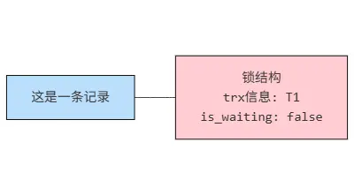


在锁结构里有很多信息，为了简化理解，只把两个比较重要的属性拿了出来:

- `trx信息`:代表这个锁结构是哪个事务生成的。
- `is_waiting` :代表当前事务是否在等待。

当事务`T1`改动了这条记录后，就生成了一个`锁结构`与该记录关联，因为之前没有别的事务为这条记录加锁，所以`is_waiting`属性就是`false`，我们把这个场景就称之为`获取锁成功`，或者`加锁成功`，然后就可以继续执行操作了。

在事务`T1`提交之前，另一个事务`T2`也想对该记录做改动，那么先看看有没有锁结构与这条记录关联，发现有一个锁结构与之关联后，然后也生成了一个锁结构与这条记录关联，不过锁结构的`is_waiting`属性值为`true` ,表示当前事务需要等待，我们把这个场景就称之为`获取锁失`败，或者`加锁失败`，图示:

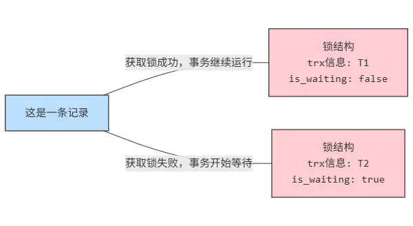

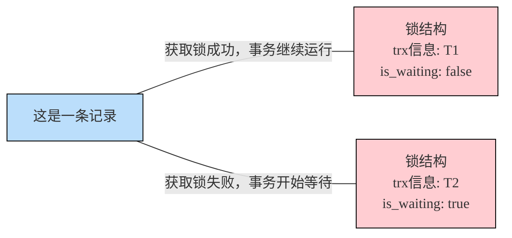

在事务 T1 提交之后，就会把该事务生成的`锁结构释放`掉，然后看看还有没有别的事务在等待获取锁，发现了事务 T2 还在等待获取锁，所以把事务 T2 对应的锁结构的`is_waiting`属性设置为`false`，然后把该事务对应的线程唤醒，让它继续执行，此时事务 T2 就算获取到锁了。效果图就是这样:

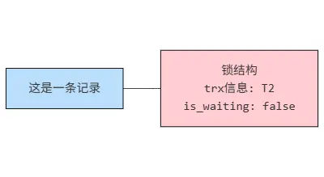


小结几种说法：

- **不加锁**：意思就是不需要在内存中生成对应的`锁结构`，可以直接执行操作。
- **获取锁成功，或者加锁成功**：意思就是在内存中生成了对应的`锁结构`，而且锁结构的`is_waiting`属性为`false`，也就是事务可以继续执行操作。
- **获取锁失败，或者加锁失败，或者没有获取到锁**：意思就是在内存中生成了对应的锁结构，不过锁结构的`is_waiting`属性为`true`，也就是事务需要等待，不可以继续执行操作。

### 2.3 读-写或写-读情况
`读-写`或`写-读`，即一个事务进行读取操作，另一个进行改动操作。这种情况下可能发生`脏读`、`不可重复读`、`幻读`的问题。

各个数据库厂商对`SQL 标准的`支持都可能不一样。比如 MySQL 在`REPEATABLE READ`隔离级别上就已经解决了幻读问题。

### 2.4 并发问题的解决方案

怎么解决`脏读`、`不可重复读`、`幻读`这些问题呢？其实有两种可选的解决方案：

- 方案一：读操作利用多版本并发控制（`MVCC`，下章讲解），写操作进行`加锁`。

所谓的`MVCC`，就是生成一个`ReadView`，通过 ReadView 找到符合条件的记录版本（历史版本由`undo 日志`构建）。查询语句只能`读`到在生成 ReadView 之前`已提交事务所做的更改`，在生成 ReadView 之前未提交的事务或者之后才开启的事务所做的更改是看不到的。而`写操作`肯定针对的是`最新版本的记录`，读记录的历史版本和改动记录的最新版本本身并不冲突，也就是采用 MVCC 时，`读-写`操作并不冲突。

::: note 普通的 SELECT 语句在 READ COMMITTED 和 REPEATABLE READ 隔离级别下会使用到 MVCC 读取记录
- 在`READ COMMITTED`隔离级别下，一个事务在执行过程中每次执行 SELECT 操作时都会生成一个 ReadView，ReadView 的存在本身就保证了`事务不可以读取到未提交的事务所做的更改`，也就是避免了脏读现象；
- 在`REPEATABLE READ`隔离级别下，一个事务在执行过程中只有`第一次执行 SELECT 操作`才会生成一个 ReadView，之后的 SELECT 操作都`复用`这 ReadView，这样也就避免了不可重复读和幻读的问题。
:::

- 方案二：读、写操作都采用`加锁`的方式。

如果我们的一些业务场景不允许读取记录的旧版本，而是每次都必须去`读取记录的最新版本`。比如，在银行存款的事务中，你需要先把账户的余额读出来，然后将其加上本次存款的数额最后再写到数据库中。在将账户余额读取出来后，就不想让别的事务再访问该余额，直到本次存款事务执行完成，其他事务才可以访问账户的余额。这样在读取记录的时候就需要对其进行`加锁`操作，这样也就意味着`读`操作和`写`操作也像`写-写`操作那样`排队`执行。

`脏读`的产生是因为当前事务读取了另一个未提交事务写的一条记录，如果另一个事务在写记录的时候就给这条记录加锁，那么当前事务就无法继续读取该记录了，所以也就不会有脏读问题的产生了。

`不可重复读`的产生是因为当前事务先读取一条记录，另外一个事务对该记录做了改动之后并提交之后，当前事务再次读取时会获得不同的值，如果在当前事务读取记录时就给该记录加锁那么另一个事务就无法修改该记录，自然也不会发生不可重复读了。

`幻读`问题的产生是因为当前事务读取了一个范围的记录，然后另外的事务向该范围内插入了新记录，当前事务再次读取该范围的记录时发现了新插入的新记录。采用加锁的方式解决幻读问题就有一些麻烦，因为当前事务在第一次读取记录时幻影记录并不存在，所以读取的时候加锁就有点尴尬（因为你并不知道给谁加锁）。

- 小结对比发现：
  - 采用`MVCC`方式的话，`读-写`操作彼此并不冲突，`性能更高`。
  - 采用`加锁`方式的话，`读-写`操作彼此需要`排队执行`，影响性能。

一般情况下我们当然愿意采用`MVCC`来解决`读-写`操作并发执行的问题，但是业务在某些特殊情况下，要求必须采用`加锁`的方式执行。

::: note
- 针对**快照读**（普通 select 语句），是通过 **MVCC 方式解决了幻读**。因为可重复读隔离级别下，事务执行过程中看到的数据，一直跟这个事务启动时看到的数据是一致的，即使中途有其他事务插入了一条数据，查询不出来这条数据的，所以就很好了避免幻读问题。
- 针对**当前读**（select … for update 等语句），是通过 **next-key lock（记录锁 + 间隙锁）方式解决了幻读**。因为当执行 select … for update 语句的时候，会加上 next-key lock，如果有其他事务在 next-key lock 锁范围内插入了一条记录，那么这个插入语句就会被阻塞，无法成功插入，所以就很好了避免幻读问题。
:::

## 3. 锁的不同角度分类
锁的分类图，如下：

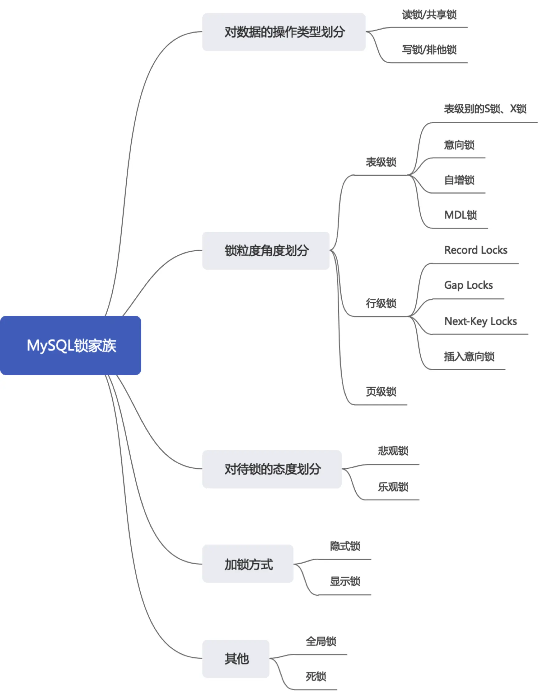

### 3.1 从数据操作的类型划分：读锁、写锁
对于数据库中并发事务的`读-读`情况并不会引起什么问题。对于`写-写`、`读-写`或`写-读`这些情况可能会引起一些问题，需要使用`MVCC`或者`加锁`的方式来解决它们。在使用`加锁`的方式解决问题时，由于既要允许`读-读`情况不受影响，又要使`写-写`、`读-写`或`写-读`情况中的操作相互阻塞，所以 MySQL 实现一个由两种类型的锁组成的锁系统来解决。这两种类型的锁通常被称为**共享锁(Shared Lock，SLock)**和**排他锁(Exclusive Lock，XLock),**也叫**读锁(readlock)**和**写锁(write lock)**。

- `读锁`：也称为`共享锁`、英文用`S`表示。针对同一份数据，多个事务的读操作可以同时进行而不会互相影响，相互不阻塞的。
- `写锁`：也称为`排他锁`、英文用`X`表示。当前写操作没有完成前，它会阻断其他写锁和读锁。这样就能确保在给定的时间里，只有一个事务能执行写入，并防止其他用户读取正在写入的同一资源。

**需要注意的是对于 InnoDB 引擎来说，读锁和写锁可以加在表上，也可以加在行上。**

**举例（行级读写锁）**：如果一个事务 T1 已经获得了某个行 r 的读锁，那么此时另外的一个事务 T2 是可以去获得这个行 r 的读锁的，因为读取操作并没有改变行 r 的数据;但是，如果某个事务 T3 想获得行 r 的写锁，则它必须等待事务 T1、T2 释放掉行 r 上的读锁才行。

总结:这里的兼容是指对同一张表或记录的锁的兼容性情况。

|     | X 锁 | S 锁    |
|:----|:----|:-------|
| X 锁 | 不兼容 | 不兼容    |
| S 锁 | 不兼容 | **兼容** |

#### 3.1.1 锁定读
在采用`加锁`方式解决`脏读`、`不可重复读`、`幻读`这些问题时，读取一条记录时需要获取该记录的`S 锁`，其实是不严谨的，有时候需要在读取记录时就获取记录的`X 锁`，来禁止别的事务读写该记录，为此 MySQL 提出了两种比较特殊的`SELECT`语句格式：

- 对读取的记录加`S 锁`：

```sql
SELECT ... LOCK IN SHARE MODE;
# 或
SELECT ... FOR SHARE; # (8.0新增语法)
```

在普通的 SELECT 语句后边加`LOCK IN SHARE MODE`，如果当前事务执行了该语句，那么它会为读取到的记录加 S 锁，这样允许别的事务继续获取这些记录的 S 锁(比方说别的事务也使用`SELECT ... LOCK IN SHAREMODE`语句来读取这些记录)，但是不能获取这些记录的`X 锁`(比如使用`SELECT ... FOR UPDATE`语句来读取这些记录，或者直接修改这些记录)。如果别的事务想要获取这些记录的`X 锁`，那么它们会阻塞，直到当前事务提交之后将这些记录上的`S 锁`释放掉。

- 对读取的记录加`X 锁`：

```sql
SELECT ... FOR UPDATE;
```

在普通的 SELECT 语句后边加`FOR UPDATE`，如果当前事务执行了该语句，那么它会为读取到的记录加`X 锁`，这样既不允许别的事务获取这些记录的 S 锁(比方说别的事务使用`SELECT ... LOCK IN SHARE MODE`语句来读取这些记录)，也不允许获取这些记录的 X 锁(比如使用`SELECT ... FOR UPDATE`语句来读取这些记录，或者直接修改这些记录)。如果别的事务想要获取这些记录的 S 锁或者 X 锁，那么它们会阻塞，直到当前事务提交之后将这些记录上的 X 锁释放掉。

<h5>MySQL8.0 新特性：NOWAIT、SKIP LOCKED</h5>

在 5.7 及之前的版本，`SELECT ... FOR UPDATE`，如果获取不到锁，会一直等待，直到`innodb_lock_wait_timeout`超时。在 8.0 版本中，`SELECT ... FOR UPDATE`, `SELECT ... FOR SHARE` 可以通过添加`NOWAIT`、`SKIP LOCKED`语法，跳过锁等待，或者跳过锁定。

- 如果查询的行已经加锁：
  - NOWAIT：如果查询的行已经加锁，会立即报错返回
  - SKIP LOCKED：如果查询的行已经加锁，只返回结果中不包含被锁定的行

```sql
# session1:
mysql> begin;
mysql> select * from t1 where c1 = 2 for update;
+----+------+
| c1 | c2   |
+----+------+
| 2  | 60530|
| 2  | 24678|
+----+------+
2 rows in set (0.00 sec)

# session2:
mysql> select * from t1 where c1 = 2 for update nowait;
ERROR 3572 (HY000): Statement aborted because lock(s) could not be acquired immediately and NOWAIT is set.

mysql> select * from t1 where c1 = 2 for update skip locked;
Empty set (0.00 sec)
```

#### 3.1.3 写操作

平常所用到的`写操作`无非是`DELETE`、`UPDATE`、`INSERT`这三种:

- `DELETE`：对一条记录做 DELETE 操作的过程其实是先在`B+`树中定位到这条记录的位置，然后获取这条记录的`X 锁`，再执行`delete mark`操作。我们也可以把这个定位待删除记录在 B+树中位置的过程看成是一个获取`X 锁`的`锁定读`。

- `UPDATE`：在对一条记录做 UPDATE 操作时分为三种情况:
  - 情况 1: 未修改该记录的`键值`，并且被更新的列占用的存储空间在修改前后`未发生变化`。 
    - 则先在`B+`树中定位到这条记录的位置，然后再获取一下记录的`X 锁`，最后在原记录的位置进行修改操作。我们也可以把这个定位待修改记录在 B+树中位置的过程看成是一个获取`X 锁`的`锁定读`。
  - 情况 2：未修改该记录的`键值`，并且至少有一个被更新的列占用的存储空间在修改前后发生变化。
    - 则先在 B+ 树中定位到这条记录的位置，然后获取一下记录的 X 锁，将该记录彻底删除掉（就是把记录彻底移入垃圾链表），最后再插入一条新记录。这个定位待修改记录在 B+树中位置的过程可以看成是一个获取`X 锁`的`锁定读`，新插入的记录由`INSERT`操作提供的`隐式锁`进行保护。
  - 情况 3：修改了该记录的键值，则相当于在原记录上做`DELETE`操作之后再来一次`INSERT`操作，加锁操作就需要按照`DELETE`和`INSERT`的规则进行了。
- `INSERT`：一般情况下，新插入一条记录的操作并不加锁，通过一种称之为`隐式锁`的结构来保护这条新插入的记录在本事务`提交前不被别的事务访问`。

### 3.2 从数据操作的粒度划分：表级锁、页级锁、行锁
为了尽可能提高数据库的并发度，每次锁定的数据范围越小越好，理论上每次只锁定当前操作的数据的方案会得到最大的并发度，但是管理锁是很`耗资源`的事情（涉及获取、检查、释放锁等动作）（越小消耗越大）。因此数据库系统需要在`高并响应`和`系统性能`两方面进行平衡，这样就产生了“`锁粒度(Lock granularity)`”的概念。

对一条记录加锁影响的也只是这条记录而已，我们就说这个锁的粒度比较细;其实一个事务也可以在`表级别`进行加锁，自然就被称之为`表级锁`或者`表锁`，对一个表加锁影响整个表中的记录，我们就说这个锁的粒度比较粗。锁的粒度主要分为表级锁、页级锁和行锁。

#### 3.2.1 表锁(Table Lock)
该锁会锁定整张表，它是 MySQL 中最基本的锁策略，并`不依赖于存储引擎`，并且表锁是`开销最少`的策略（因为粒度比较大）。由于表级锁一次会将整个表锁定，所以可以很好的`避免死锁`的问题。当然，锁的粒度大所带来最大的负面影响就是出现锁资源争用的概率也会最高，导致`并发率大打折扣`。

##### ① 表级别的 S 锁、X 锁
在对某个表执行 SELECT、INSERT、DELETE、UPDATE 语句时，InnoDB 存储引擎是不会为这个表添加表级别的`S 锁`或者`X 锁`的。在对某个表执行一些诸如`ALTER TABLE`、`DROP TABLE`这类的`DDL`语句时，其他事务对这个表并发执行诸如 SELECT、INSERT、DELETE、UPDATE 的语句会发生阻塞。同理，某个事务中对某个表执行 SELECT、INSERT、DELETE、UPDATE 语句时，在其他会话中对这个表执行`DDL`语句也会发生阻塞。这个过程其实是通过在`server 层`使用一种称之为`元数据锁`（英文名：`Metadata Locks`，简称`MDL`）结构来实现的。

一般情况下，不会使用 InnoDB 存储引擎提供的表级别的`S 锁`和`X 锁`。只会在一些特殊情况下，比方说`崩溃恢复`过程中用到。必须先设置系统变量`autocommit=0，innodb_table_locks = 1`，InnoDB 存储引擎才能识别 MySQL 添加的表级锁，手动获取 InnoDB 存储引擎提供的表 t 的`S 锁`或者`X 锁`可以这么写：

- `LOCK TABLES t READ`：InnoDB 存储引擎会对表`t`加表级别的`S 锁`。
- `LOCK TABLES t WRITE`：InnoDB 存储引擎会对表`t`加表级别的`X 锁`。

不过尽量避免在使用 InnoDB 存储引擎的表上使用`LOCK TABLES`这样的手动锁表语句，它们并不会提供什么额外的保护，只是会降低并发能力而已。InnoDB 的厉害之处还是在于实现了更细粒度的行锁，关于 InnoDB 表级别的 S 锁和 X 锁了解一下就可以了。

**举例：下面我们讲解 MyISAM 引擎下的表锁。**

步骤 1：创建表并添加数据

```sql
CREATE TABLE mylock(
  id INT NOT NULL PRIMARY KEY auto_increment,
  NAME VARCHAR(20)
)ENGINE myisam; # 存储引擎使用 InnoDB 也可以, 只是不建议

# 插入一条数据
INSERT INTO mylock(NAME) VALUES('a');

# 查询表中所有的数据
SELECT * FROM mylock;
+----+------+
| id | NAME |
+----+------+
|  1 | a    |
+----+------+
```

步骤 2：查看表上加过的锁

```sql
SHOW OPEN TABLES;  # 主要关注 In_use 字段的值
# 或者
SHOW OPEN TABLES where In_use > 0;
```

步骤 3：手动增加表锁命令

```sql
LOCK TABLES t READ;  # 存储引擎会对表t加表级别的共享锁。共享锁也叫读锁或 S 锁 (Share的缩写)
LOCK TABLES t WRITE;  
# 存储引擎会对表t加表级别的排他锁。排他锁也叫独占锁、写锁或 X 锁 (是eXclusive的缩写)
```

比如：

```sql
mysql> lock tables mylock write;
Query OK, 0 rows affected (0.00 sec)

mysql> SHOW OPEN TABLES where In_use > 0;
+------------+--------+--------+-------------+
| Database   | Table  | In_use | Name_locked |
+------------+--------+--------+-------------+
| atguigu14  | mylock | 1      | 0           |
+------------+--------+--------+-------------+
```

步骤 4：释放表锁

```sql
UNLOCK TABLES; # 使用此命令解锁当前加锁的表
```

比如：

```sql
mysql> unlock tables;
Query OK, 0 rows affected (0.01 秒)

# 可以看到已经没有 In_use > 0 的数据了
mysql> SHOW OPEN TABLES where In_use > 0;
```

步骤 5：加读锁

我们为 mylock 表加上 read 锁（读阻塞写），观察阻塞的情况，流程如下：

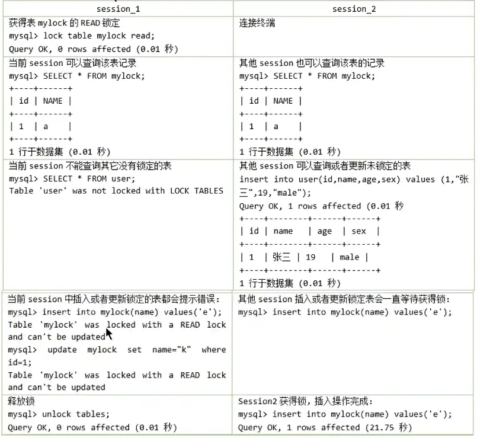

步骤 6：加写锁

为 mylock 表加上 write 锁，观察阻塞的情况，流程如下：

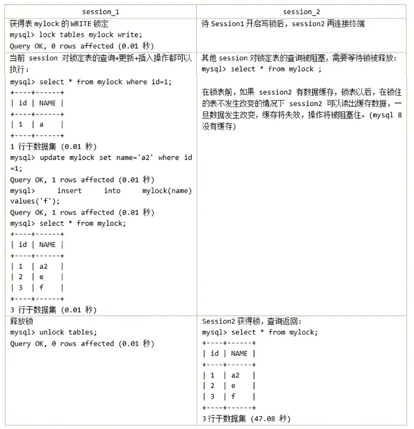

MyISAM 存储引擎的表在执行查询语句前，会自动给涉及的所有表加读锁，在执行增删改操作前，会自动给涉及的表加写锁。用户一般不需要直接使用 LOCK TABLES 语句来显式加锁。

`InnoDB`存储引擎是不会为这个表添加表级别的`读锁`或者`写锁`的。

MySQL 的表级锁有两种模式：（以 MyISAM 表进行操作的演示）

- 表共享读锁(Table Read Lock)
- 表独占写锁(Table Write Lock)

| 锁类型 | 自己可读 | 自己可写 | 自己可操作其他表 | 他人可读 | 他人可写 |
|:----|:-----|:-----|:---------|:-----|:-----|
| 读锁  | 是    | 否    | 否        | 是    | 否，等  |
| 写锁  | 是    | 是    | 否        | 否，等  | 否，等  |

##### ② 意向锁 (intention lock)
InnoDB 支持`多粒度锁（multiple granularity locking）`，它允许`行级锁`与`表级锁`共存，而**意向锁**就是其中的一种`表锁`。

1. 意向锁的存在是为了协调行锁和表锁的关系，支持多粒度（表锁与行锁）的锁并存。
2. 意向锁是一种`不与行级锁冲突的表级锁`，这一点非常重要。
3. 表明“某个事务正在某些行持有了锁或该事务准备去持有锁”

**意向锁分为两种：**

- **意向共享锁**(intention shared lock, IS)：事务有意向对表中的某些行加**共享锁**（S 锁）

```sql
-- 事务要获取某些行的 S 锁，必须先获得表的 IS 锁。 
SELECT column FROM table ... LOCK IN SHARE MODE;
```

- **意向排他锁**(intention exclusive lock, IX)：事务有意向对表中的某些行加**排他锁**（X 锁）

```sql
-- 事务要获取某些行的 X 锁，必须先获得表的 IX 锁。 
SELECT column FROM table ... FOR UPDATE;
```

即：意向锁是由存储引擎`自己维护的`，用户无法手动操作意向锁，在为数据行加共享 / 排他锁之前，InooDB 会先获取该数据行`所在数据表的对应意向锁`。

**意向锁要解决的问题**

现在有两个事务，分别是 T1 和 T2，其中 T2 试图在该表级别上应用共享或排它锁，如果没有意向锁存在，那么 T2 就需要去检查各个页或行是否存在锁；如果存在意向锁，那么此时就会受到由 T1 控制的`表级别意向锁的阻塞`。T2 在锁定该表前不必检查各个页或行锁，而只需检查表上的意向锁。简单来说就是给更大一级级别的空间示意里面是否已经上过锁。

在数据表的场景中，**如果我们给某一行数据加上了排它锁，数据库会自动给更大一级的空间，比如数据页或数据表加上意向锁，告诉其他人这个数据页或数据表已经有人上过排它锁了**，这样当其他人想要获取数据表排它锁的时候，只需要了解是否有人已经获取了这个数据表的意向排它锁即可。

- 如果事务想要获取数据表中某些记录的共享锁，就需要在数据表上`添加意向共享锁`
- 如果事务想要获取数据表中某些记录的排它锁，就需要在数据表上`添加意向排他锁`

这时，意向锁会告诉其他事务已经有人锁定了表中的某些记录。

**举例**：创建表 teacher，插入 6 条数据，事务的隔离级别默认为`Repeatable-Read`，如下所示。

```sql
CREATE TABLE `teacher` (
  `id` int NOT NULL,
  `name` varchar(255) NOT NULL,
  PRIMARY KEY (`id`)
) ENGINE=InnoDB DEFAULT CHARSET=utf8mb4 COLLATE=utf8mb4_0900_ai_ci;

INSERT INTO `teacher` VALUES
('1', 'zhangsan'),
('2', 'lisi'),
('3', 'wangwu'),
('4', 'zhaoliu'),
('5', 'songhongkang'),
('6', 'leifengyang');

SELECT @@transaction_isolation;
```

假设事务 A 获取了某一行的排他锁，并未提交，语句如下所示。

```sql
begin ;

SELECT * FROM teacher WHERE id = 6 FOR UPDATE;
```

事务 B 想要获取 teacher 表的表读锁，语句如下。

```sql
begin;

LOCK TABLES teacher READ;
```

因为共享锁与排他锁互斥，所以事务 B 在试图对 teacher 表加共享锁的时候，必须保证两个条件。

* 当前没有其他事务持有 teacher 表的排他锁
* 当前没有其他事务持有 teacher 表中任意一行的排他锁。

为了检测是否满足第二个条件，事务 B 必须在确保 teacher 表不存在任何排他锁的前提下，去检测表中的每一行是否存在排他锁。很明显这是一个效率很差的做法，但是有了意向锁之后，情况就不一样了。

意向锁是怎么解决这个问题的呢？首先，我们需要知道意向锁之间的兼容互斥性，如下所示。

|           | 意向共享锁(lS) | 意向排他锁(IX) |
|:----------|:----------|:----------|
| 意向共享锁(IS) | 兼容        | 兼容        |
| 意向排他锁(IX) | 兼容        | 兼容        |

即意向锁之间是互相兼容的，虽然意向锁和自家兄弟互相兼容，但是它会与普通的排他/共享锁互斥

|         | 意向共享锁(lS) | 意向排他锁(IX) |
|:--------|:----------|:----------|
| 共享锁(S)表 | 兼容        | 互斥        |
| 排他锁(X)表 | 互斥        | 互斥        |

注意这里的排他/共享锁指的都是表锁，意向锁不会与行级的共享/排他锁互斥。回到刚才 teacher 表的例子。

事务 A 获取了某一行的排他锁，并未提交:

```sql
# 事务A
BEGIN;
SELECT *FROM teacher WHERE id = 6 FOR UPDATE;
```

此时 teacher 表存在两把锁：teacher 表上的意向排他锁与 id 为 6 的数据行上的排他锁。事务 B 想要获取 teacher 表的共享锁。

```sql
# 事务B
BEGIN;
LOCK TABLES teacher READ;
```

此时事务 B 检测事务 A 持有 teacher 表的意向排他锁，就可以得知事务 A 必然持有该表中某些数据行的排他锁，那么事务 B 对 teacher 表的加锁请求就会被排斥（阻塞），而无需去检测表中的每一行数据是否存在排他锁。

**意向锁的并发性**

意向锁不会与行级的共享/排他锁互斥！正因为如此，意向锁并不会影响到多个事务对不同数据行加排他锁时的并发性。（不然我们直接用普通的表锁就行了）

我们扩展一下上面 teacher 表的例子来概括一下意向锁的作用（一条数据从被锁定到被释放的过程中，可能存在多种不同锁，但是这里我们只着重表现意向锁）。

事务 A 先获取了一行的排他锁，并未提交：

```sql
BEGIN;
SELECT * FROM teacher WHERE id = 6 FOR UPDATE;
```

事务 A 获取了 teacher 表上的意向排他锁，事务 A 获取了 id 为 6 的数据行上的排他锁。之后事务 B 想要获取 teacher 表的共享锁。

```sql
BEGIN;
LOCK TABLES teacher READ;
```

事务 B 检测到事务 A 持有 teacher 表的意向排他锁。事务 B 对 teacher 表的加锁请求被阻塞（排斥）。最后事务 C 也想获取 teacher 表中某一行的排他锁。

```sql
BEGIN;
SELECT * FROM teacher WHERE id = 5 FOR UPDATE;
```

事务 C 申请 teacher 表的意向排他锁。事务 C 检测到事务 A 持有 teacher 表的意向排他锁。因为意向锁之间并不互斥，所以事务 C 获取到了 teacher 表的意向排他锁。因为 id 为 5 的数据行上不存在任何排他锁，最终事务 C 成功获取到了该数据行上的排他锁。

**从上面的案例可以得到如下结论：**

1. InnoDB 支持`多粒度锁`，特定场景下，行级锁可以与表级锁共存。
2. 意向锁之间互不排斥，但除了 IS 与 S 兼容外，`意向锁会与共享锁/排他锁互斥`。
3. IX，IS 是表级锁，不会和行级的 X，S 锁发生冲突。只会和表级的 X，S 发生冲突。
4. 意向锁在保证并发性的前提下，实现了`行锁和表锁共存`且`满足事务隔离性`的要求。

##### ③ 自增锁（AUTO-INC 锁）
在使用 MySQL 过程中，我们可以为表的某个列添加`AUTO_INCREMENT`属性。举例：

```sql
CREATE TABLE `teacher` (
	`id` int NOT NULL AUTO_INCREMENT,
	`name` varchar( 255 ) NOT NULL,
	PRIMARY KEY (`id`)
) ENGINE=InnoDB DEFAULT CHARSET=utf8mb4 COLLATE=utf8mb4_0900_ai_ci;
```

由于这个表的 id 字段声明了 AUTO_INCREMENT，意味着在书写插入语句时不需要为其赋值

```sql
INSERT INTO `teacher` (name) VALUES ('zhangsan'), ('lisi');
```

上边的插入语句并没有为 id 列显式赋值，所以系统会自动为它赋上递增的值，结果如下所示。

```sql
mysql> select * from teacher;
+----+----------+
| id | name     |
+----+----------+
| 1  | zhangsan |
| 2  | lisi     |
+----+----------+
```

现在我们看到的上面插入数据只是一种简单的插入模式，所有插入数据的方式总共分为三类，分别是`Simple inserts`，`Bulk inserts`和`Mixed-mode inserts`。

**1. Simple inserts（简单插入）**

可以`预先确定要插入的行数`（当语句被初始处理时）的语句。包括没有嵌套子查询的单行和多行`INSERT...VALUES()`和`REPLACE`语句。不包括`INSERT...ON DUPLICATE KEY UPDATE`语句。

**2. Bulk inserts （批量插入）**

`事先不知道要插入的行数`（和所需自动递增值的数量）的语句。比如`INSERT ... SELECT`，`REPLACE ... SELECT`和`LOAD DATA`语句，但不包括纯 INSERT。 InnoDB 在每处理一行，为 AUTO_INCREMENT 列分配一个新值。

**3. Mixed-mode inserts（混合模式插入）**

这些是`Simple inserts`语句但是指定部分新行的自动递增值。例如`INSERT INTO teacher (id,name) VALUES (1,'a'), (NULL,'b'), (5,'c'), (NULL,'d');`只是指定了部分 id 的值。另一种类型的“混合模式插入”是`INSERT ... ON DUPLICATE KEY UPDATE`。 

对于上面数据插入的案例，MySQL 采用了`自增锁`的方式来实现，**AUTO-INT 锁是当向使用含有 AUTO_INCREMENT 列的表中插入数据时需要获取的一种特殊的表级锁**，在执行插入语句时就在表级别加一个 AUTO-INT 锁，然后为每条待插入记录的 AUTO_INCREMENT 修饰的列分配递增的值，在该语句执行结束后，再把 AUTO-INT 锁释放掉。**一个事务在持有 AUTO-INC 锁的过程中，其他事务的插入语句都要被阻塞**，可以保证一个语句中分配的递增值是连续的。也正因为此，其并发性显然并不高，**当我们向一个有 AUTO_INCREMENT 关键字的主键插入值的时候，每条语句都要对这个表锁进行竞争**，这样的并发潜力其实是很低下的，所以 innodb 通过`innodb_autoinc_lock_mode`的不同取值来提供不同的锁定机制，来显著提高 SQL 语句的可伸缩性和性能。

innodb_autoinc_lock_mode 有三种取值，分别对应与不同锁定模式：

`（1）innodb_autoinc_lock_mode = 0(“传统”锁定模式)`

在此锁定模式下，所有类型的 insert 语句都会获得一个特殊的表级 AUTO-INC 锁，用于插入具有 AUTO_INCREMENT 列的表。这种模式其实就如我们上面的例子，即每当执行 insert 的时候，都会得到一个表级锁（AUTO-INC 锁），使得语句中生成的 auto_increment 为顺序，且在 binlog 中重放的时候，可以保证 master 与 slave 中数据的 auto_increment 是相同的。因为是表级锁，当在同一时间多个事务中执行 insert 的时候，对于 AUTO-INC 锁的争夺会`限制并发`能力。

`（2）innodb_autoinc_lock_mode = 1(“连续”锁定模式)`

在 MySQL 8.0 之前，连续锁定模式是`默认`的。

在这个模式下，`bulk inserts`仍然使用 AUTO-INC 表级锁，并保持到语句结束。这适用于所有 INSERT ... SELECT，REPLACE ... SELECT 和 LOAD DATA 语句。同一时刻只有一个语句可以持有 AUTO-INC 锁。

对于`Simple inserts`（要插入的行数事先已知），则通过在`mutex（轻量锁）`的控制下获得所需数量的自动递增值来避免表级 AUTO-INC 锁， 它只在分配过程的持续时间内保持，而不是直到语句完成。不使用表级 AUTO-INC 锁，除非 AUTO-INC 锁由另一个事务保持。如果另一个事务保持 AUTO-INC 锁，则`Simple inserts`等待 AUTO-INC 锁，如同它是一个`bulk inserts`。 

`（3）innodb_autoinc_lock_mode = 2(“交错”锁定模式)`

从 MySQL 8.0 开始，交错锁模式是`默认`设置。

在这种锁定模式下，所有 INSERT 语句都不会使用表级 AUTO-INC 锁，并且可以同时执行多个语句。这是最快和最可拓展的锁定模式，但是当使用基于语句的复制或恢复方案时，**从二进制日志重播 SQL 语句时，这是不安全的。**

在此锁定模式下，自动递增值`保证`在所有并发执行的所有类型的 insert 语句中是`唯一`且`单调递增`的。但是，由于多个语句可以同时生成数字（即，跨语句交叉编号），**为任何给定语句插入的行生成的值可能不是连续的。**

如果执行的语句是`simple inserts`，其中要插入的行数已提前知道，除了`Mixed-mode inserts`之外，为单个语句生成的数字不会有间隙。然而，当执行`bulk inserts`时，在由任何给定语句分配的自动递增值中可能存在间隙。

##### ④ 元数据锁（MDL 锁）
MySQL5.5 引入了 meta data lock，简称 MDL 锁，属于表锁范畴。MDL 的作用是，保证读写的正确性。比如，如果一个查询正在遍历一个表中的数据，而执行期间另一个线程对这个`表结构做变更`，增加了一列，那么查询线程拿到的结果跟表结构对不上，肯定是不行的。

因此，**当对一个表做增删改查操作的时候，加 MDL 读锁；当要对表做结构变更操作的时候，加 MDL 写锁。**

读锁之间不互斥，因此你可以有多个线程同时对一张表增删改查。读写锁之间、写锁之间是互斥的，用来保证变更表结构操作的安全性，解决了 DML 和 DDL 操作之间的一致性问题。`不需要显式使用`，在访问一个表的时候会被自动加上。

**举例：元数据锁的使用场景模拟**

会话 A：从表中查询数据

```sql
mysql> begin;
Query 0K,0 rows affected (0.00 sec)
# 默认加了MDL读锁
mysql> select count(1) from teacher;
```

会话 B：修改表结构，增加新列

```sql
begin;

# 这个时候就会阻塞在这里，有其他事务在读数据。
# 修改表结构需要加MDL写锁
alter table teacher add age int not null;
```

会话 C：查看当前 MySQL 的进程

```sql
# 查看线程，以及线程等待具体锁的状态
SHOW PROCESSLIST;
```

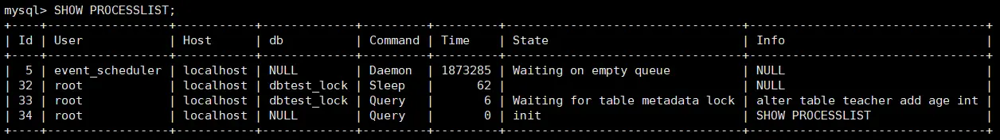

通过会话 C 可以看出会话 B 被阻塞，这是由于会话 A 拿到了 teacher 表的元数据读锁，会话 B 想申请 teacher 表的元数据写锁，由于读写锁互斥，会话 B 需要等待会话 A 释放元数据锁才能执行。

**元数据锁可能带来的问题**

| Session A                    | Session B                        | Session C              |
|:-----------------------------|:---------------------------------|:-----------------------|
| begin;select * from teacher; |                                  |                        |
|                              | alter table teacher add age int; |                        |
|                              |                                  | select * from teacher; |

我们可以看到 session A 会对表 teacher 加一个 MDL 读锁，之后 session B 要加 MDL 写锁会被 blocked，因为 session A 的 MDL 读锁还没有释放，而 session C 要在表 teacher 上新申请 MDL 读锁的请求也会被 session B 阻塞。前面我们说了，所有对表的增删改查操作都需要先申请 MDL 读锁，就都被阻塞，等于这个表现在完全不可读写了。

#### 3.2.2 InnoDB 中的行锁
行锁(Row Lock)也称为记录锁，顾名思义，就是锁住某一行（某条记录 row）。需要注意的是，MySQL 服务器层并没有实现行锁机制，**行级锁只在存储引擎层实现。**

**优点**：锁定力度小，发生`锁冲突概率低`，可以实现的`并发度高`

**缺点**：对于`锁的开销比较大`，加锁会比较慢，容易出现`死锁`情况

::: note
InnoDB 与 MyISAM 的最大不同有两点：一是支持事务；二是采用了行级锁。
:::

创建学生表 student，并插入数据，用于讲解以下行锁

```sql
CREATE TABLE student (
	id INT,name VARCHAR(20) ,
    class varchar(10) ,
    PRIMARY KEY (id)
) Engine=InnoDB CHARSET=utf8;
```

```sql
INSERT INTO student VALUES 
(1,'张三','一班'),
(3,'李四','一班') ,
(8,'王五','二班') ,
(15,'赵六','二班') ,
(20,'钱七','三班');
```

##### ① 记录锁(Record Locks)
记录锁用于锁定某一条记录，官方的类型名称为：`LOCK_REC_NOT_GAP`。

记录锁仅锁定一条记录，对其他记录没有影响。

记录锁是有 S 锁和 X 锁之分的，称之为`S 型记录锁`和`X 型记录锁`。

- 当一个事务获取了一条记录的 S 型记录锁后，其他事务也可以继续获取该记录的 S 型记录锁，但不可以继续获取 X 型记录锁；
- 当一个事务获取了一条记录的 X 型记录锁后，其他事务既不可以继续获取该记录的 S 型记录锁，也不可以继续获取 X 型记录锁。

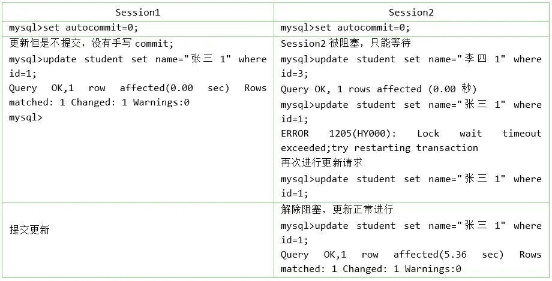

设置非自动提交事务；在会话 1 中更新 id=1 的记录但不提交；

在会话 2 中更新 id=3 的记录，没有被阻塞。

在会话 2 中更新 id=1 的记录，被阻塞，超时后再次发出更新请求，此时会话 1 提交事务，会发现会话 2 中的语句解除了阻塞。这说明只有 id=1 的记录被锁定了，也就是只锁定了一条记录。

##### ② 间隙锁(Gap Locks)
`MySQL`在`REPEATABLE READ`隔离级别下是可以解决幻读问题的，解决方案有两种，可以使用`MVCC`方案解决，也可以采用`加锁`方案解决。但是在使用加锁方案解决时有个大问题，就是事务在第一次执行读取操作时，那些幻影记录尚不存在，我们无法给这些`幻影记录`加上`记录锁`。InnoDB 提出了一种称之为`Gap Locks`的锁，官方的类型名称为：`LOCK_GAP`，我们可以简称为`gap 锁`。

**间隙锁用于锁定索引记录之间的间隙**，其主要目的是为了防止在当前事务执行期间有其他事务在这些间隙中插入新的记录，从而维持事务的一致性。

**举例**

表 student 中存在 `(Infimum,1]`、`(1,3]`、`(3,8]`、`(8,15]`、`(15,20] `和`(20,Supremum)`等间隙，其中, Infimum 表示该页面中的最小记录，Supremum 表示该页面中的最大记录。

给 id=8 的记录加间隙锁的示意图如图所示，锁定区间是`(3,8)`，注意是开区间。

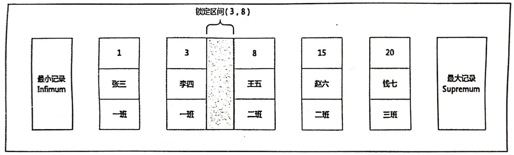

当另外一个事务再想插入一条 id 值为 4 的新记录，它定位到该条新记录的下一条记录的 id 值为 8，而这条记录上又有一个 gap 锁，所以就会阻塞插入操作，直到拥有这个 gap 锁的事务提交之后，id 列的值在区间`(3,8)`中的新记录才可以被插入。

```sql
BEGIN;
SELECT * FROM student WHERE id=5 LOCK IN SHARE MODE;
SELECT * FROM performance_schema.data_locks\G
*************************** row ***************************
               ENGINE: INNODB
       ENGINE_LOCK_ID: 139647109607664:39:4:4:139647036503760
ENGINE_TRANSACTION_ID: 421122086318320
            THREAD_ID: 89
             EVENT_ID: 18
        OBJECT_SCHEMA: dbtest_lock
          OBJECT_NAME: student
       PARTITION_NAME: NULL
    SUBPARTITION_NAME: NULL
           INDEX_NAME: PRIMARY
OBJECT_INSTANCE_BEGIN: 139647036503760
            LOCK_TYPE: RECORD
            LOCK_MODE: S,GAP
          LOCK_STATUS: GRANTED
            LOCK_DATA: 8
```

::: note
- 5 这条记录不存在，所以是间隙锁，锁的是(3,8)这个区间。
- 如果 5 这条记录存在，则不是间隙锁，而是记录锁。 `LOCK_DATA` 显示的是该间隙的**右边界**
:::

**gap 锁的提出仅仅是为了防止插入幻影记录而提出的**。虽然有`共享 gap 锁`和`独占 gap 锁`这样的说法，但是它们起到的作用是相同的。而且如果对一条记录加了 gap 锁（不论是共享 gap 锁还是独占 gap 锁），并不会限制其他事务对这条记录加记录锁或者继续加 gap 锁。

| 会话 1 session1                                                  | 会话 2 session2                                           |
|:---------------------------------------------------------------|:--------------------------------------------------------|
| BEGIN;<br>SELECT * FROM student WHERE id=5 LOCK IN SHARE MODE; |                                                         |
|                                                                | BEGIN<br>SELECT * FROM student WHERE id = 7 FOR UPDATE; |

这里 session 2 并不会被堵住。因为表里并没有 id=5 这个记录，因此 session 1 加的是间隙锁 (3,8)。而 session 2 也是在这个间隙加的间隙锁。它们有共同的目标，即，保护这个间隙，不允许插入值。但，它们之间是不冲突的。

```sql
SELECT * FROM performance_schema.data_locks\G
*************************** row ***************************
               ENGINE: INNODB
       ENGINE_LOCK_ID: 139647109607664:39:4:4:139647036503760
ENGINE_TRANSACTION_ID: 122366
            THREAD_ID: 93
             EVENT_ID: 20
        OBJECT_SCHEMA: dbtest_lock
          OBJECT_NAME: student
       PARTITION_NAME: NULL
    SUBPARTITION_NAME: NULL
           INDEX_NAME: PRIMARY
OBJECT_INSTANCE_BEGIN: 139647036503760
            LOCK_TYPE: RECORD
            LOCK_MODE: X,GAP
          LOCK_STATUS: GRANTED
            LOCK_DATA: 8
*************************** row ***************************
               ENGINE: INNODB
       ENGINE_LOCK_ID: 139647109606808:39:4:4:139647036497536
ENGINE_TRANSACTION_ID: 421122086317464
            THREAD_ID: 92
             EVENT_ID: 22
        OBJECT_SCHEMA: dbtest_lock
          OBJECT_NAME: student
       PARTITION_NAME: NULL
    SUBPARTITION_NAME: NULL
           INDEX_NAME: PRIMARY
OBJECT_INSTANCE_BEGIN: 139647036497536
            LOCK_TYPE: RECORD
            LOCK_MODE: S,GAP
          LOCK_STATUS: GRANTED
            LOCK_DATA: 8
```

::: note
实际结果会显示 4 把锁，两把意向锁 IS IX,两把间隙锁
:::

**锁定区间 （最后一条记录,Supremum 记录）**

给一条记录加了`gap`锁后，不允许其他事务往这条记录前边的间隙插入新记录，那对于最后一条记录之后的间隙，也就是 student 表中 id 值为 20 的记录之后的间隙。给哪条记录加 gap 锁才能阻止其他事务插入 id 值在（20，正无穷）这个区间的新记录呢？这时候我们在讲数据页时介绍的两条伪记录派上用场了：

* `Infimum`记录，表示该页面中最小的记录。 
* `Supremum`记录，表示该页面中最大的记录。

只要锁定的记录的 id 值，大于当前数据库最大的 id 值，就可以锁定该间隙。实现阻止其他事务插入 id 值在（20,正无穷）这个区间的新记录

```sql
BEGIN;
SELECT * FROM student WHERE id >20 LOCK IN SHARE MODE;
# 或者
SELECT * FROM student WHERE id = 25 FOR UPDATE;
```

检测：

```sql
SELECT * FROM performance_schema.data_locks\G
*************************** row ***************************
               ENGINE: INNODB
       ENGINE_LOCK_ID: 139647109606808:39:4:1:139647036497536
ENGINE_TRANSACTION_ID: 122365
            THREAD_ID: 88
             EVENT_ID: 20
        OBJECT_SCHEMA: dbtest_lock
          OBJECT_NAME: student
       PARTITION_NAME: NULL
    SUBPARTITION_NAME: NULL
           INDEX_NAME: PRIMARY
OBJECT_INSTANCE_BEGIN: 139647036497536
            LOCK_TYPE: RECORD
            LOCK_MODE: X
          LOCK_STATUS: GRANTED
            LOCK_DATA: supremum pseudo-record
```

**间隙锁的死锁问题**

间隙锁的引入，可能会导致同样的语句锁定更大的范围，影响并发度。下面的例子就会产生死锁。

| 会话 1                                                                                                                                      | 会话 2                                                     |
|:------------------------------------------------------------------------------------------------------------------------------------------|:---------------------------------------------------------|
| BEGIN;<br>SELECT * FROM student WHERE id =5 FOR UPDATE;                                                                                   | BEGIN;<br/>SELECT * FROM student WHERE id =5 FOR UPDATE; |
|                                                                                                                                           | INSERT INTO student VALUES（5,'test','二班'）;#阻塞            |
| INSERT INTO student VALUES(5,'test','二班');#阻塞<br>`ERROR 1213 (40001): Deadlock found when trying to get lock; try restarting transaction` | 插入语句执行成功                                                 |

1. 会话 1 执行 `SELECT...FOR UPDATE` 语句，由于 `id=5` 的记录并不存在，因此会加上间隙锁(3,8)。
2. 会话 2 执行 `SELECT...FOR UPDATE` 语句，同样会加上间隙锁(3,8)。由于间隙锁之间不会产生冲突，因此这条语句可以执行成功。
3. 会话 2 试图插入一条 `id=5` 的记录，被会话 1 的间隙锁阻塞了，只好进入等待状态。
4. 会话 1 试图插入一条 `id=5` 的记录，被会话 2 的间隙锁阻塞了，也只好进入等待状态。

至此，两个会话进入互相等待状态，产生了死锁。当然，`InnoDB` 存储引擎中的死锁检测机制马上就会检测到这对死锁关系，会话 1 中的 `INSERT` 语句会返回报错信息。会话 2 中的语句返回插入成功的信息。

##### ③ 临键锁(Next-Key Locks)
有时候我们既想`锁住某条记录`，又想`阻止`其他事务在该记录前边的`间隙插入新记录`，所以 InnoDB 就提出了一种称之为`Next-Key Locks`的锁，官方的类型名称为：`LOCK_ORDINARY`，我们也可以简称为`next-key 锁`。Next-Key Locks 是在存储引擎`innodb`、事务级别在`可重复读`的情况下使用的数据库锁，innodb 默认的锁就是 Next-Key locks。 

比如，我们把 id 值为 8 的那条记录加一个 next-key 锁。

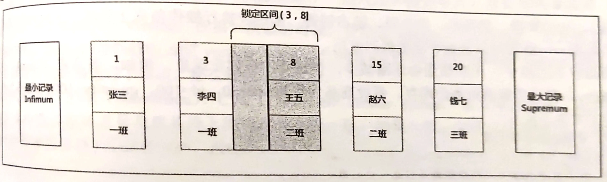

::: note
`next-key` 锁的本质就是一个记录锁和一个 gap 锁的合体，它既能保护该条记录，又能阻止别的事务将新记录插入被保护记录前边的间隙。
:::

```sql
begin; 
select * from student where id <= 8 and id > 3 for update;
```

##### ④ 插入意向锁(Insert Intention Locks)
我们说一个事务在`插入`一条记录时需要判断一下插入位置是不是被别的事务加了`gap 锁`（`next-key 锁`也包含`gap 锁`），如果有的话，插入操作需要等待，直到拥有`gap 锁`的那个事务提交。**InnoDB 规定事务在等待的时候也需要在内存中生成一个锁结构**，表明有事务想在某个`间隙`中`插入`新记录，但是现在在等待。InnoDB 就把这种类型的锁命名为`Insert Intention Locks`，官方的类型名称为：`LOCK_INSERT_INTENTION`，我们称为`插入意向锁`。

插入意向锁是在插入一条记录行前，由`INSERT 操作产生的一种锁`，该锁用于表示插入的意向。

**插入意向锁是一种声明式的锁。**插入意向锁之间互不排斥，所以即使多个事务在同一区间插入多条记录，只要记录本身 （主键、唯一索引） 不冲突，那么事务之间就不会出现冲突等待。事实上**插入意向锁并不会阻止别的事务继续获取该记录上任何类型的锁。**

**插入意向锁和意向锁**

虽然插入意向锁中含有“意向锁”三个字，但它不同于意向锁，意向锁是表锁而插入意向锁是行锁。

**插入意向锁是一种特殊的间隙锁**，用来配合间隙锁或临键锁一起防止幻读操作。

```C
 const ulint type_mode = 
              LOCK_X | 
              LOCK_GAP | 
              LOCK_INSERT_INTENTION;
```

在排他(LOCK_X)间隙锁(LOCK_GAP)的基础上增加 LOCK_INSERT_INTENTION 标志，就得到了插入意向锁，所以，从本质上来说，插入意向锁是个特殊的间隙锁。

插入意向锁也不同于普通间隙锁，插入意向锁，是一种声明式的锁，用来告知数据库当前事务打算在某个间隙进行插入，它不阻止其他事务的插入操作。而间隙锁会阻塞其他事务的插入操作。

其他事务的插入操作前，会获取插入意向锁，间隙锁会阻塞插入意向锁的获取。

**案例**

表 student 中存在 id 值为 3 和 8 的两条记录，两个不同的事务分别试图插入 id 值为 5 和 6 的两条记录，每个事务在获取插入行上的独占锁前，都会先检查 (3,8) 区间内的间隙锁。如果此时该区间内存在间隙锁，那么 MySQL 会为插入记录的两个事务生成插入意向锁，并且使这两个事务都处于等待状态，它们都要等待间隙锁被释放才能继续执行插入操作。需要注意的是，因为插入的记录之间并不冲突，所以两个插入记录的事务之间并不会互相阻塞。

现在为 id 值为 8 的记录加的锁的示意图就如下所示:

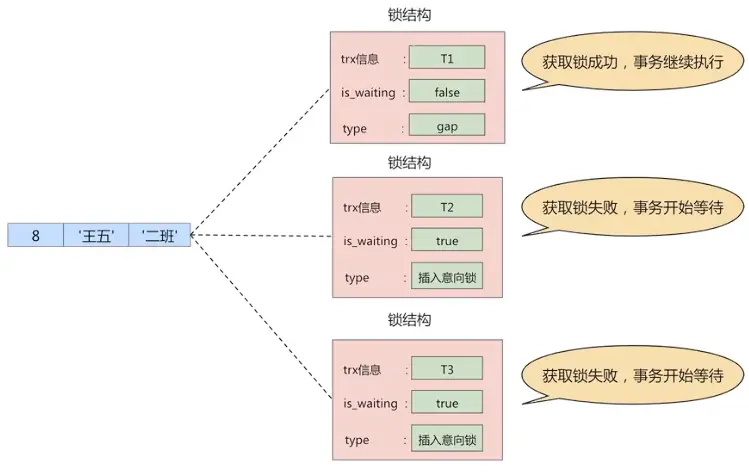

从图中可以看到，由于 T1 持有 gap 锁，所以 T2 和 T3 需要生成一个插入意向锁的锁结构并且处于等待状态。当 T1 提交后会把它获取到的锁都释放掉，这样 T2 和 T3 就能获取到对应的插入意向锁了（本质上就是把插入意向锁对应锁结构的 is_waiting 属性改为 false），T2 和 T3 之间也并不会相互阻塞，它们可以同时获取到 id 值为 8 的插入意向锁，然后执行插入操作。

```sql
##############################SessionA####################################
# 表级锁IX，行级锁GAP，X
# 成功获取状态
begin;
select * from student where id = 4 for update;
commit;
SELECT * FROM performance_schema.data_locks\G

##############################SessionB####################################
# 表级锁的IX，行级锁X,GAP,INSERT_INTENTION
# 等待状态
begin;
insert into student(id,name,class) values(5,'Tim','一班');

##############################SessionC####################################
# 表级锁的IX，行级锁X,GAP,INSERT_INTENTION
# 等待状态
begin;
insert into student(id,name,class) values(6,'Tim','一班');

# 事务B和事务C同时处于等待状态，事务A的间隙锁阻塞了事务B和C的插入意向锁
# 事务B和C的插入意向锁不冲突。

# 如果两个事务B和事务C并不是同时被阻塞，即事务A提交后，事务B阻塞结束，事务C刚开始BEGIN
# 则事务B获得到表级锁的IX，行级锁X,GAP,INSERT_INTENTION
# 事务C获取到表级锁的IX意向锁。(插入操作一般不加锁，只有一个隐式锁，详情看下面的隐式锁)
```

#### 3.2.3 页锁
页锁就是在`页的粒度`上进行锁定，锁定的数据资源比行锁要多，因为一个页中可以有多个行记录。当我们使用页锁的时候，会出现数据浪费的现象，但这样的浪费最多也就是一个页上的数据行。**页锁的开销介于表锁和行锁之间，会出现死锁。锁定粒度介于表锁和行锁之间，并发度一般。**

每个层级的锁数量是有限制的，因为锁会占用内存空间，`锁空间的大小是有限的`。当某个层级的锁数量超过了这个层级的阈值时，就会进行`锁升级`。锁升级就是用更大粒度的锁替代多个更小粒度的锁，比如 InnoDB 中行锁升级为表锁，这样做的好处是占用的锁空间降低了，但同时数据的并发度也下降了。

### 3.3 从对待锁的态度划分：乐观锁、悲观锁
从对待锁的态度来看锁的话，可以将锁分成乐观锁和悲观锁，从名字中也可以看出这两种锁是两种看待`数据并发的思维方式`。需要注意的是，乐观锁和悲观锁并不是锁，而是锁的`设计思想`。

#### 3.3.1 悲观锁(Pessimistic Locking)
悲观锁是一种思想，顾名思义，就是很悲观，对数据被其他事务的修改保持保守态度，依靠数据库自身的锁机制来实现，从而保证数据操作的排它性。

悲观锁总是假设最坏的情况，每次去拿数据的时候都认为别人会修改，所以每次在拿数据的时候都会上锁，这样别人想拿这个数据就会`阻塞`直到它拿到锁（**共享资源每次只给一个线程使用，其它线程阻塞，用完后再把资源转让给其它线程**）。比如行锁，表锁等，读锁，写锁等，都是在做操作之前先上锁，当其他线程想要访问数据时，都需要阻塞挂起。Java 中`synchronized`和`ReentrantLock`等独占锁就是悲观锁思想的实现。

**秒杀案例 1**

在商品秒杀过程中，库存数量会逐渐减少，要避免出现`超卖`的情况。比如，商品表中有一个字段为 quantity，表示当前该商品的库存量。假设商品为华为 mate40，id 为 1001，quantity=100 个。如果不使用锁的情况下，操作方法如下所示

```sql
#第1步：查出商品库存
select quantity from items where id = 1001;
#第2步：如果库存大于0，则根据商品信息生产订单
insert into orders (item_id) values(1001);
#第3步：修改商品的库存，num表示购买数量
update items set quantity = quantity - num where id = 1001;
```

这样写的话，在并发量小的公司没有大的问题，但是如果在`高并发环境`下可能出现以下问题

| 序号 | 线程 A                 | 线程 B                 |
|:---|:---------------------|:---------------------|
| 1  | step1（查询还有 100 部手机）  | step1（查询还有 100 部手机）  |
| 2  |                      | step2（生成订单）          |
| 3  | step2（生成订单）          |                      |
| 4  |                      | step3（减库存 1，减 100 台） |
| 5  | step3（减库存 2，减 100 台） |                      |

其中线程 B 此时已经下单并且减完库存，这个时候线程 A 依然根据它最初查询到的库存（100 台）去执行 step3，就造成了超卖！

我们使用悲观锁可以解决这个问题，商品信息从查询出来到修改，中间有一个生成订单的过程，使用悲观锁的原理就是，当我们在查询 items 信息后就把当前的数据锁定，直到我们修改完毕后再解锁。那么整个过程中，因为数据被锁定了，就不会出现有第三者来对其进行修改了。而这样做的前提是**需要将要执行的 SQL 语句放在同一个事务中，否则达不到锁定数据的目的。**

修改如下：

```sql
#第1步：查出商品库存
select quantity from items where id = 1001 for update;
#第2步：如果库存大于0，则根据商品信息生产订单
insert into orders (item_id) values(1001);
#第3步：修改商品的库存，num表示购买数量
update items set quantity = quantity - num where id = 1001;
```

`select .... for update`是 MySQL 中悲观锁。此时在 items 表中，id 为 1001 的那条数据就被我们锁定了，其他的要执行`select quantity from items where id = 1001 for update;`语句的事务必须等本次事务提交之后才能执行。这样我们可以保证当前的数据不会被其它事务修改。

::: warning
- 当执行`select quantity from items where id = 1001 for update;`语句之后，如果在其他事务中执行`select quantity from items where id = 1001;`语句，并不会受第一个事务的影响，仍然可以正常查询出数据。不过读取的数据可能是已提交的旧值，具体取决于数据库的隔离级别。
- **select .... for update 语句执行过程中所有扫描的行都会被锁上，因此在 MySQL 中用悲观锁必须确定使用了索引，而不是全表扫描，否则将会把整个表锁住。**
:::

悲观锁不适用的场景较多，它存在一些不足，因为悲观锁大多数情况下依靠数据库的锁机制来实现，以保证程序的并发访问性，同时这样对数据库性能的打影响也很大，特别是`长事务`而言，这样的`开销往往无法承受`，这时就需要乐观锁。

#### 3.3.2 乐观锁(Optimistic Locking)
乐观锁认为对同一数据的并发操作不会总发生，属于小概率事件，不用每次都对数据上锁，但是在更新的时候会判断一下在此期间别人有没有去更新这个数据，也就是**不采用数据库自身的锁机制，而是通过程序来实现**。在程序上，我们可以采用`版本号机制`或者`CAS机制`实现。**乐观锁适用于多读的应用类型，这样可以提高吞吐量**。在 Java 中`java.util.concurrent.atomic`包下的原子变量类就是使用了乐观锁的一种实现方式：CAS 实现的。

**① 乐观锁的版本号机制**

在表中设计一个`版本字段 version`，第一次读的时候，会获取 version 字段的取值。然后对数据进行更新或删除操作时，会执行`UPDATE ... SET version=version+1 WHERE version=version`。此时如果已经有事务对这条数据进行了更改，修改就不会成功。

**② 乐观锁的时间戳机制**

时间戳和版本号机制一样，也是在更新提交的时候，将当前数据的时间戳和更新之前取得的时间戳进行比较，如果两者一致则更新成功，否则就是版本冲突。

你能看到乐观锁就是程序员自己控制数据并发操作的权限，基本是通过给数据行增加一个戳（版本号或者时间戳），从而证明当前拿到的数据是否最新。

**秒杀案例 2**

依然使用上面秒杀的案例，执行流程如下

```sql
#第1步：查出商品库存
select quantity from items where id = 1001;

#第2步：如果库存大于0，则根据商品信息生产订单
insert into orders (item_id) values(1001);

#第3步：修改商品的库存，num表示购买数量
update items set quantity = quantity-num,version = version+1 where id = 1001 and version = # {version};
```

注意，如果数据表是`读写分离`的表，当 master 表中写入的数据没有及时同步到 slave 表中时，会造成更新一直失败的问题。此时需要`强制读取 master 表`中的数据（即将 select 语句放到事务中即可，这时候查询的就是 master 主库了。）

::: note
- 读写分离时，主机负责写，从机负责读
- 从机读取到旧的版本号 version1，但是主机上的版本号，已经更新过了，更新到了 version3。
- 导致更新操作失败，因为 version1 != version3
- 重新到从机读取版本号，因为从机没及时更新数据，又读取到版本号 version1，再次更新失败。
:::

如果我们对同一条数据进行`频繁的修改`的话，那么就会出现这么一种场景，每次修改都只有一个事务能更新成功，在业务感知上面就有大量的失败操作。我们把代码修改如下:

```sql
#第1步：查出商品库存
select quantity from items where id = 1001;

#第2步：如果库存大于0，则根据商品信息生产订单
insert into orders (item_id) values(1001);

#第3步：修改商品的库存，num表示购买数量
update items set quantity = quantity-num where id = 1001 and quantity-num>0;
```

这样就会使每次修改都能成功，而且不会出现超卖的现象。

::: warning 存疑，猜测如下
- UPDATE 会获取当前记录行的 X 锁，每次只有一个事务，持有当前记录行的 X 锁。可以避免超卖。
- 也就是采取了悲观锁的策略。
:::

#### 3.3.3 两种锁的适用场景
从这两种锁的设计思想中，我们总结一下乐观锁和悲观锁的适用场景：

* `乐观锁`适合`读操作多`的场景，相对来说写的操作比较少。它的优点在于`程序实现`，`不存在死锁`问题，不过适用场景也会相对乐观，因为它阻止不了除了程序以外的数据库操作。

* `悲观锁`适合`写操作多`的场景，因为写的操作具有`排它性`。采用悲观锁的方式，可以在数据库层面阻止其他事务对该数据的操作权限，防止`读 - 写`和`写 - 写`的冲突。

我们把乐观锁和悲观锁总结如下图所示。

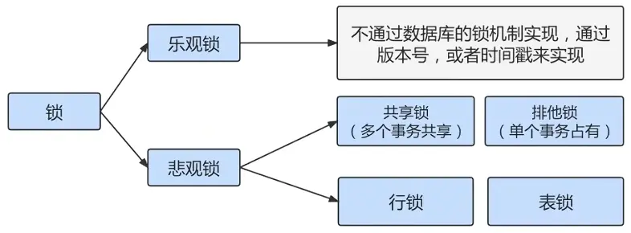

### 3.4 按加锁的方式划分：显式锁、隐式锁
#### 3.4.1 隐式锁
一个事务在执行`INSERT`操作时，如果即将插入的`间隙`已经被其他事务加了 gap 锁，那么本次 INSERT 操作会阻塞，并且当前事务会在该间隙上加一个插入意向锁，否则一般情况下 INSERT 操作是不加锁的。

那如果一个事务首先插入了一条记录（此时并没有在内存中存在与该记录关联的锁结构），然后另一个事务：

- 立即使用`SELECT ... LOCK IN SHARE MODE`语句读取这条记录，也就是要获取这条记录的 S 锁，或者使用`SELECT ... FOR UPDATE`语句读取这条记录，也就是要获取这条记录的 X 锁，怎么办？
  
  如果允许这种情况的发生，那么可能产生脏读问题。
  
- 立即修改这条记录，也就是要获取这条记录的 X 锁，怎么办？

  如果允许这种情况的发生，那么可能产生脏写的问题。

这时候我们要把过程中的`事务id`又要起作用了。我们把聚簇索引和二级索引中的记录分开看一下：

- **情景一**：对于聚簇索引记录来说，有一个`trx_id`隐藏列，该隐藏列记录着最后改动该记录的`事务 id`。那么如果在当前事务中新插入一条聚簇索引记录后，该记录的`trx_id`隐藏列代表的的就是当前事务的`事务id`，如果其他事务此时想对该记录添加`S 锁`或者`X 锁`时，首先会看一下该记录的`trx_id`隐藏列代表的事务是否是当前的活跃事务，如果是的话，那么就帮助当前事务创建一个`X 锁`（也就是为当前事务创建一个锁结构，`is_waiting`属性是`false`），然后自己进入等待状态（也就是为自己也创建一个锁结构，`is_waiting`属性是`true`）。

- **情景二**：对于二级索引记录来说，本身并没有`trx_id`隐藏列，但是在二级索引页面的`Page Header`部分有一个`PAGE_MAX_TRX_ID`属性，该属性代表对该页面做改动的最大的`事务 id`，如果`PAGE_MAX_TRX_ID`属性值小于当前最小的活跃`事务 id`，那么说明对该页面做修改的事务都已经提交了，否则就需要在页面中定位到对应的二级索引记录，然后回表找到它对应的聚簇索引记录，然后再重复`情景一`的做法。

即：一个事务对新插入的记录可以不显示的加锁（生成一个锁结构），但是由于`事务 id`的存在，相当于加了一个`隐式锁`。别的事务在对这条记录加`S 锁`或者`X 锁`时，由于`隐式锁`的存在，会先帮助当前事务生成一个锁结构，然后自己再生成一个锁结构后进入等待状态。隐式锁是一种`延迟加锁`的机制，从而来减少加锁的数量。

隐式锁在实际内存对象中并不含有这个锁信息。只有当产生锁等待时，隐式锁转化为显式锁。

InnoDB 的 insert 操作，对插入的记录不加锁，但是此时如果另一个线程进行当前读，类似以下的用例，session 2 会锁等待 session 1，那么这是如何实现的呢？

**session 1：**

```sql
begin;
insert INTO student VALUES(34,"周八","二班");
```

**session2**

```sql
begin;
select * from student lock in share mode; #执行完, 当前事务被阻塞
```

执行下述语句，输出结果：

```sql
# 只执行session1，session2没有执行之前
# session1中的插入操作，只会获取到一个表级别的意向锁
SELECT * FROM performance_schema.data_locks\G
*************************** 1. row ***************************
               ENGINE: INNODB
       ENGINE_LOCK_ID: 139647109606808:1098:139647036500528
ENGINE_TRANSACTION_ID: 122410
            THREAD_ID: 96
             EVENT_ID: 13
        OBJECT_SCHEMA: dbtest_lock
          OBJECT_NAME: student
       PARTITION_NAME: NULL
    SUBPARTITION_NAME: NULL
           INDEX_NAME: NULL
OBJECT_INSTANCE_BEGIN: 139647036500528
            LOCK_TYPE: TABLE
            LOCK_MODE: IX
          LOCK_STATUS: GRANTED
            LOCK_DATA: NULL
# 执行session1后执行session2
# session1中的插入操作，会获取到一个表级别的意向锁和一个记录锁
# 说明隐式锁变成了真实存在的记录锁
SELECT * FROM performance_schema.data_locks\G
*************************** 1. row ***************************
               ENGINE: INNODB
       ENGINE_LOCK_ID: 139647109606808:1098:139647036500528
ENGINE_TRANSACTION_ID: 122410
            THREAD_ID: 96
             EVENT_ID: 13
        OBJECT_SCHEMA: dbtest_lock
          OBJECT_NAME: student
       PARTITION_NAME: NULL
    SUBPARTITION_NAME: NULL
           INDEX_NAME: NULL
OBJECT_INSTANCE_BEGIN: 139647036500528
            LOCK_TYPE: TABLE
            LOCK_MODE: IX
          LOCK_STATUS: GRANTED
            LOCK_DATA: NULL
*************************** 2. row ***************************
               ENGINE: INNODB
       ENGINE_LOCK_ID: 139647109606808:39:4:10:139647036497536
ENGINE_TRANSACTION_ID: 122410
            THREAD_ID: 97
             EVENT_ID: 13
        OBJECT_SCHEMA: dbtest_lock
          OBJECT_NAME: student
       PARTITION_NAME: NULL
    SUBPARTITION_NAME: NULL
           INDEX_NAME: PRIMARY
OBJECT_INSTANCE_BEGIN: 139647036497536
            LOCK_TYPE: RECORD
            LOCK_MODE: X,REC_NOT_GAP
          LOCK_STATUS: GRANTED
            LOCK_DATA: 34
```

隐式锁的逻辑过程如下:

1. InnoDB 的每条记录中都含有一个隐含的 trx_id 字段，这个字段存在于聚簇索引的 B+Tree 中。
2. 在操作一条记录前，首先根据记录中的 trx_id 检查该事务是否是活动的事务（未提交或回滚）。如果是活动的事务，首先将`隐式锁`转换为`显式锁`（就是为该事务添加一个锁）。
3. 检查是否有锁冲突，如果有冲突，创建锁，并设置 waiting 状态。如果没有冲突不加锁，跳到 E。
4. 等待加锁成功，被唤醒，或者超时。
5. 写数据，并将自己的 trx_id 写入 trx_id 字段。

#### 3.4.2 显式锁
通过特定的语句进行加锁，我们一般称之为显示加锁。例如：

显示加共享锁：

```sql
select .... lock in share mode
```

显示加排它锁：

```sql
select .... for update
```

### 3.5 其它锁之：全局锁
全局锁就是对`整个数据库实例`加锁。当你需要让整个库处于`只读状态`的时候，可以使用这个命令，之后其他线程的以下语句会被阻塞：数据更新语句（数据的增删改）、数据定义语句（包括建表、修改表结构等）和更新类事务的提交语句。全局锁的典型使用`场景`是：做`全库逻辑备份`。

全局锁的命令：

```sql
Flush tables with read lock
```

### 3.6 其它锁之：死锁
死锁是指两个或多个事务在同一资源上相互占用，并请求锁定对方占用的资源，从而导致恶性循环。

#### 3.6.1 概念
两个事务都持有对方需要的锁，并且在等待对方释放锁，并且双方都不会释放自己的锁。

**举例：**

|   | 事务 1                                                           | 事务 2                                     |
|:--|:---------------------------------------------------------------|:-----------------------------------------|
| 1 | start transaction;<br>update account set money=100 where id=1; | start transaction;                       |
| 2 |                                                                | update account set money=100 where id=2; |
| 3 | update account set money=200 where id=2;                       |                                          |
| 4 |                                                                | update account set money=200 where id=1; |

#### 3.6.2 产生死锁的必要条件
* 两个或者两个以上事务
* 每个事务都已经持有锁并且申请新的锁
* 锁资源同时只能被同一个事务持有或者不兼容
* 事务之间因为持有锁和申请锁导致彼此循环等待

::: note
死锁的关键在于：两个（或以上）的 Session 加锁的顺序不一致。
:::

#### 3.6.3 如何处理死锁
**方式 1**：等待，直到超时(innodb_lock_wait_timeout=50s)

即当两个事务互相等待时，当一个事务等待时间超过设置的阈值时，就将其`回滚`，另外事务继续进行。这种方法简单有效，在 innodb 中，参数`innodb_lock_wait_timeout`用来设置超时时间。

缺点: 对于在线服务来说，这个等待时间往往是无法接受的。

那将此值修改短一些，比如 1s，0.1s 是否合适？不合适，容易误伤到普通的锁等待。

```sql
show variables like 'innodb_lock_wait_timeout';
+--------------------------+-------+
| Variable_name            | Value |
+--------------------------+-------+
| innodb_lock_wait_timeout | 50    |
+--------------------------+-------+
```

**方式 2**：使用死锁检测进行死锁处理

方式 1 检测死锁太过被动，innodb 还提供了`wait-for graph 算法`来主动进行死锁检测，每当加锁请求无法立即满足需要并进入等待时，wait-for graph 算法都会被触发。

这是一种较为`主动的死锁检测机制`，要求数据库保存`锁的信息链表`和`事务等待链表`两部分信息。

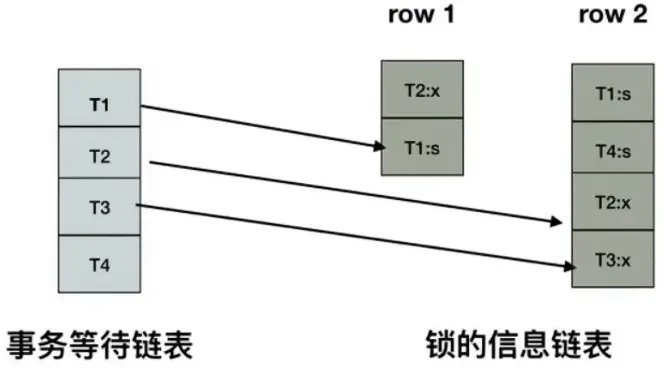

基于这两个信息，可以绘制 wait-for graph（等待图）

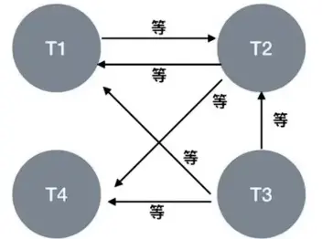

::: note
死锁检测的原理是构建一个以事务为顶点、锁为边的有向图，判断有向图是否存在环，存在即有死锁。
:::

一旦检测到回路，有死锁，这时候 InnoDB 存储引擎会选择**回滚 undo 量最小的事务**，让其他事务继续执行（`innodb_deadlock_detect=on` 表示开启这个逻辑）。

缺点：每个新的被阻塞的线程，都要判断是不是由于自己加入导致了死锁，这个操作时间复杂度是 O(n)。如果 100 个并发线程同时更新同一行，意味着要检测 100 \* 100 = 1 万次，1 万个线程就会有 1 千万次检测。

**如何解决**

* 方式 1：关闭死锁检测，但意味着可能会出现大量的超时，会导致业务有损。
* 方式 2：控制并发访问的数量。比如在中间件中实现对于相同行的更新，在进入引擎之前排队，这样在 InnoDB 内部就不会有大量的死锁检测工作。

**进一步的思路：**

可以考虑通过将一行改成逻辑上的多行来减少`锁冲突`。比如，连锁超市账户总额的记录，可以考虑放到多条记录上。账户总额等于这多条记录的值的总和。

#### 3.6.4 如何避免死锁
* 合理设计索引，使业务 SQL 尽可能通过索引定位更少的行，减少锁竞争。
* 调整业务逻辑 SQL 执行顺序，避免 update/delete 长时间持有锁的 SQL 在事务前面。
* 避免大事务，尽量将大事务拆成多个小事务来处理，小事务缩短锁定资源的时间，发生锁冲突的几率也更小。
* 在并发比较高的系统中，不要显式加锁，特别是在事务里显式加锁。如 select ... for update 语句，如果是在事务里运行了 start transaction 或设置了 autocommit 等于 0，那么就会锁定所查找到的记录。
* 降低隔离级别。如果业务允许，将隔离级别调低也是很好的选择，比如将隔离级别从 RR 调整为 RC，可以避免掉很多因为 gap 锁造成的死锁。

## 4. 锁的内存结构
对一条记录加锁的本质就是在内存中创建一个`锁结构`与之关联，那么是不是一个事务对多条记录加锁，就要创建多个锁结构呢？比如：

```sql
# 事务T1
SELECT * FROM user LOCK IN SHARE MODE;
```

理论上创建多个锁结构没问题，但是如果一个事务要获取 10000 条记录的锁，生成 10000 个锁结构也太崩溃了！

所以决定对不同记录加锁时，符合下边这些条件的记录会放到一个锁结构中。

- 在同一个事务中进行加锁操作
- 被加锁的记录在同一个页面中
- 加锁的类型是一样的
- 等待状态是一样的

**InnoDB 存储引擎中的锁结构如下：**

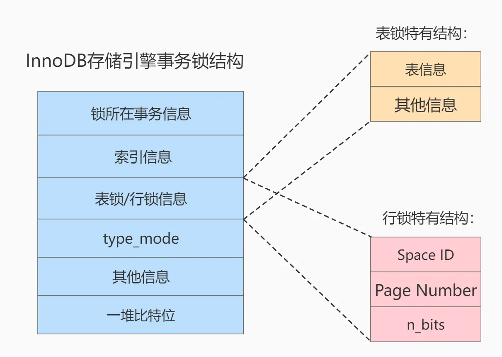

结构解析：

**1）锁所在的事务信息：**

不论是`表锁`还是`行锁`，都是在事务执行过程中生成的，哪个事务生成了这个锁结构，这里就记录这个事务的信息。

此`锁所在的事务信息`在内存结构中只是一个指针，通过指针可以找到内存中关于该事务的更多信息，比方说事务 id 等。

**2）索引信息**

对于`行锁`来说，需要记录一下加锁的记录是属于哪个索引的。这里也是一个指针。

**3）表锁/行锁信息**

`表锁结构`和`行锁结构`在这个位置的内容是不同的：

- 表锁：记载着是对哪个表加的锁，还有其他的一些信息。
- 行锁：记载了三个重要的信息：
  - `Space ID` ：记录所在表空间。
  - `Page Number` ：记录所在页号。
  - `n_bits` ：对于行锁来说，一条记录就对应着一个比特位，一个页面中包含很多记录，用不同的比特位来区分到底是哪一条记录加了锁。为此在行锁结构的末尾放置了一堆比特位，这个`n_bits`属性代表使用了多少比特位。

    ::: note
    n_bits 的值一般都比页面中记录条数多一些。主要是为了之后在页面中插入了新记录后也不至于重新分配锁结构    
    :::

**4）type_mode**

这是一个 32 位的数，被分成了`lock_mode`、`lock_type`和`rec_lock_type`三个部分，如图所示：

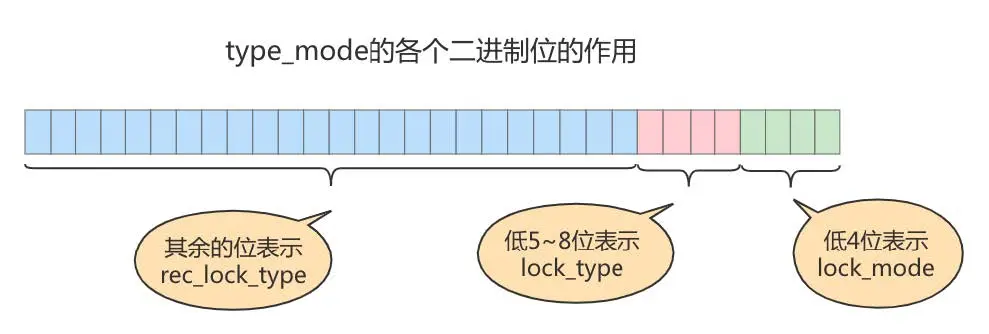

- 锁的模式（`lock_mode`），占用低 4 位，可选的值如下：
  - `LOCK_IS`（十进制的`0`）：表示共享意向锁，也就是`IS 锁`。 
  - `LOCK_IX`（十进制的`1`）：表示独占意向锁，也就是`IX 锁`。 
  - `LOCK_S`（十进制的`2`）：表示共享锁，也就是`S 锁`。 
  - `LOCK_X`（十进制的`3`）：表示独占锁，也就是`X 锁`。 
  - `LOCK_AUTO_INC`（十进制的`4`）：表示`AUTO-INC 锁`。 

在 InnoDB 存储引擎中，LOCK_IS，LOCK_IX，LOCK_AUTO_INC 都算是表级锁的模式，LOCK_S 和 LOCK_X 既可以算是表级锁的模式，也可以是行级锁的模式。

- 锁的类型（`lock_type`），占用第 5～8 位，不过现阶段只有第 5 位和第 6 位被使用：
  - `LOCK_TABLE`（十进制的`16`），也就是当第 5 个比特位置为 1 时，表示表级锁。
  - `LOCK_REC`（十进制的`32`），也就是当第 6 个比特位置为 1 时，表示行级锁。
- 行锁的具体类型（`rec_lock_type`），使用其余的位来表示。只有在 `lock_type`的值为`LOCK_REC`时，也就是只有在该锁为行级锁时，才会被细分为更多的类型：
  - `LOCK_ORDINARY`（十进制的`0`）：表示`next-key锁`。 
  - `LOCK_GAP`（十进制的`512`）：也就是当第 10 个比特位置为 1 时，表示`gap锁`。 
  - `LOCK_REC_NOT_GAP`（十进制的`1024`）：也就是当第 11 个比特位置为 1 时，表示正经`记录锁`。
  - `LOCK_INSERT_INTENTION`（十进制的`2048`）：也就是当第 12 个比特位置为 1 时，表示插入意向锁。其他的类型：还有一些不常用的类型我们就不多说了。
- `is_waiting`属性呢？基于内存空间的节省，所以把`is_waiting`属性放到了`type_mode`这个 32 位的数字中：
  - `LOCK_WAIT`（十进制的`256`） ：当第 9 个比特位置为`1`时，表示`is_waiting`为`true`，也就是当前事务尚未获取到锁，处在等待状态；当这个比特位为`0`时，表示`is_waiting`为`false`，也就是当前事务获取锁成功。

**5）其他信息**

为了更好的管理系统运行过程中生成的各种锁结构而设计了各种哈希表和链表。

**6) 一堆比特位**

如果是`行锁结构`的话，在该结构末尾还放置了一堆比特位，比特位的数量是由上边提到的`n_bits`属性表示的。InnoDB 数据页中的每条记录在`记录头信息`中都包含一个`heap_no`属性，伪记录`Infimum`的`heap_no`值为`0`，`Supremum`的`heap_no`值为`1`，之后每插入一条记录，`heap_no`值就增 1。`锁结构`最后的一堆比特位就对应着一个页面中的记录，一个比特位映射一个`heap_no`，即一个比特位映射到页内的一条记录。

## 5. 锁监控
关于 MySQL 锁的监控，我们一般可以通过检查`InnoDB_row_lock`等状态变量来分析系统上的行锁的争夺情况

```sql
mysql> show status like 'innodb_row_lock%';
+-------------------------------+--------+
| Variable_name                 | Value  |
+-------------------------------+--------+
| Innodb_row_lock_current_waits | 0      |
| Innodb_row_lock_time          | 490002 |
| Innodb_row_lock_time_avg      | 28823  |
| Innodb_row_lock_time_max      | 51010  |
| Innodb_row_lock_waits         | 17     |
+-------------------------------+--------+
```

- Innodb_row_lock_current_waits：当前正在等待锁定的数量；
- `Innodb_row_lock_time`：从系统启动到现在锁定总时间长度；（等待总时长）
- `Innodb_row_lock_time_avg`：每次等待所花平均时间；（等待平均时长）
- Innodb_row_lock_time_max：从系统启动到现在等待最常的一次所花的时间；
- `Innodb_row_lock_waits`：系统启动后到现在总共等待的次数；（等待总次数）

**其他监控方法：**

MySQL 把事务和锁的信息记录在了`information_schema`库中，涉及到的三张表分别是`INNODB_TRX`、`INNODB_LOCKS`和`INNODB_LOCK_WAITS`。 

`MySQL5.7及之前`，可以通过 information_schema.INNODB_LOCKS 查看事务的锁情况，但只能看到阻塞事务的锁；如果事务并未被阻塞，则在该表中看不到该事务的锁情况。

MySQL8.0 删除了 information_schema.INNODB_LOCKS，添加了`performance_schema.data_locks`，可以通过 performance_schema.data_locks 查看事务的锁情况，和 MySQL5.7 及之前不同，performance_schema.data_locks 不但可以看到阻塞该事务的锁，还可以看到该事务所持有的锁。

同时，information_schema.INNODB_LOCK_WAITS 也被`performance_schema.data_lock_waits`所代替。

* 查询正在被锁阻塞的 sql 语句。

```sql
SELECT * FROM information_schema.INNODB_TRX\G
```

* 查询锁等待情况

```sql
SELECT * FROM performance_schema.data_lock_waits\G
*************************** 1. row ***************************
                          ENGINE: INNODB
       REQUESTING_ENGINE_LOCK_ID: 139647109608520:39:4:2:139647036509792
REQUESTING_ENGINE_TRANSACTION_ID: 421122086319176
            REQUESTING_THREAD_ID: 101
             REQUESTING_EVENT_ID: 12
REQUESTING_OBJECT_INSTANCE_BEGIN: 139647036509792
         BLOCKING_ENGINE_LOCK_ID: 139647109607664:39:4:2:139647036503760
  BLOCKING_ENGINE_TRANSACTION_ID: 122418
              BLOCKING_THREAD_ID: 100
               BLOCKING_EVENT_ID: 11
  BLOCKING_OBJECT_INSTANCE_BEGIN: 139647036503760
```

```sql
# 查看线程，以及线程等待具体锁的状态
SHOW PROCESSLIST;
```

* 查询锁的情况

```sql
# mysql8.0以后
SELECT * FROM performance_schema.data_locks\G
*************************** 1. row ***************************
               ENGINE: INNODB
       ENGINE_LOCK_ID: 139647109608520:1098:139647036512704
ENGINE_TRANSACTION_ID: 122419
            THREAD_ID: 101
             EVENT_ID: 12
        OBJECT_SCHEMA: dbtest_lock
          OBJECT_NAME: student
       PARTITION_NAME: NULL
    SUBPARTITION_NAME: NULL
           INDEX_NAME: NULL
OBJECT_INSTANCE_BEGIN: 139647036512704
            LOCK_TYPE: TABLE
            LOCK_MODE: IS
          LOCK_STATUS: GRANTED
            LOCK_DATA: NULL
```

::: warning
- MyISAM 的表锁，要通过 `performance_schema.metadata_locks` 查询
- `data_locks` 查不到
:::

* 查 MyISAM 引擎，数据表的锁

```sql
SELECT * FROM performance_schema.metadata_locks
WHERE OBJECT_NAME = 'table_name';
```

## 6. 增删改查语句设置的锁(InnoDB)
[MySQL 8.4 Reference Manual :: 17.7.3 Locks Set by Different SQL Statements in InnoDB](https://dev.mysql.com/doc/refman/8.4/en/innodb-locks-set.html)

```sql
SELECT * FROM performance_schema.data_locks\G
*************************** 锁住的索引 ***************************
INDEX_NAME 
*************************** 锁的类型 ***************************
LOCK_MODE: X,REC_NOT_GAP # 记录锁
LOCK_MODE: X,GAP         # 间隙锁
LOCK_MODE: X             # 临键锁
*************************** 锁住的数据 ***************************
LOCK_DATA: 10, 10 # 二级索引
LOCK_DATA: 10     # 主键索引
```

### 6.1 通用的加锁规则
锁定读取、更新或删除操作会在处理 SQL 语句时对**每个扫描到的索引记录**设置锁。这与语句中是否包含可以排除该行的 WHERE 条件无关。InnoDB 不记得确切的 WHERE 条件，而仅知道扫描了哪些索引范围。

**加锁的基本单位是`临键锁`**。阻止在记录前的间隙中插入新数据。**`临键锁`是前开后闭区间**。每个被扫描到的索引记录，是加锁区间的右确界。不过，可以显式禁用间隙锁定，这样就不会使用临键锁定。

::: note
想象一个前开后闭的区间，一直向右滑动。(上一条索引记录，当前的索引记录]
:::

#### 6.1.1 没有使用索引情况
如果 SQL 语句没有合适的索引，导致 MySQL 必须扫描整个表以处理该语句，那么表的每一行都会被锁定。

**如何避免这种事故的发生？**

可以将 MySQL 里的 `sql_safe_updates` 参数设置为 1，开启安全更新模式。

**update 语句必须满足如下条件之一才能执行成功：**
- 使用 where，并且 where 条件中必须有索引列；
- 使用 limit；
- 同时使用 where 和 limit，此时 where 条件中可以没有索引列；

**delete 语句必须满足以下条件才能执行成功：**
- 同时使用 where 和 limit，此时 where 条件中可以没有索引列；

如果 where 条件带上了索引列，但是优化器最终扫描选择的是全表，而不是索引的话，我们可以使用 `force index([index_name])` 可以告诉优化器使用哪个索引，以此避免有几率锁全表带来的隐患。

#### 6.1.2 唯一索引 VS 非唯一索引，等值查询 VS 范围查询
锁定读取（`SELECT ... FOR UPDATE` 或 `FOR SHARE`）、`UPDATE` 和 `DELETE` 语句，所采取的锁取决于 where 子句中的搜索条件（唯一索引等值查询或范围类型的搜索条件）

- **唯一索引等值查询**
  - 当查询的记录存在，`next-key lock` 会**退化成记录锁**，InnoDB 只锁定找到的索引记录
  - 当查询的记录不存在，`next-key lock` 会**退化成间隙锁**
- **非唯一索引等值查询** 
  - 会给每条扫描到的记录，加上临键锁`(上一条记录，当前扫描到的记录]`。一直向右扫描，直到扫到不相等的记录。不相等的记录上，不加锁。所以表现上来看。
    - 当查询的记录如果不存在，临键锁退化为间隙锁。因为非唯一，所以向右继续扫描，直到扫到不相等记录为止，右区间退化为间隙锁。
    - 当查询的记录存在，会给查询到的等值记录，加临键锁。因为非唯一，所以要给区间加锁，所以是临键锁，区间内包含多条相同值。
    ::: tip
    - 为什么要向右扫描直到遇上不等值记录，然后加间隙锁？**防止幻读**
    - 因为非唯一，如果只在等值记录上加临键锁，那么插入和当前查询值相同的值的记录，就会出现幻读，所以要对等值记录右边的间隙加锁。
    :::
- **唯一索引范围查询**
  - 先拆分条件，拆出一个等于，比如 `>=` 拆成 `=` 和 `>`
    - 等值按照之前的规则，如果查询的值存在降级为行锁，查询的值不存在，降级为间隙锁 
    - 不等值查询，碰到第一个不满足的记录时，降级为间隙锁。
- **非唯一索引范围查询**
  - 先拆分条件，拆成等于和大于和小于，比如 `>=` 拆成 `=` 和 `>`
    - 等值按照之前的规则，如果查询的值存在加临建锁，右区间加间隙锁，查询的值不存在，降级为间隙锁
    - 不等值查询，碰到第一个不满足的索引记录时，加**临键锁**

#### 6.1.3 limit 规则
满足 limit 条件后，终止范围扫描

比如：非唯一索引，等值查询，当查询的记录存在，会给查询到的等值记录，加临键锁

无 limit 条件的情况下，会继续向右扫描，直到不符合条件为止。向右扫描的区间，加间隙锁。

如果存在 limit 条件，当符合 limit 条件之后，将不继续扫描。

#### 6.1.4 order 规则
注意倒序，前开后闭的区间，向左滑动，直到右边界，直到碰到不符合的记录，会给不符合的记录加上间隙锁。

#### 6.1.5 主键索引和非主键规则
如果在查询中使用了二级索引并且需要设置独占的索引记录锁，InnoDB 还会检索相应的聚簇索引记录并对其设置锁。

::: note
因为修改操作，最终要回表到聚簇索引，在聚簇索引上修改数据。所以对二级索引加独占锁的同时，会对主键索加**行锁。**
:::

- 查询中使用二级索引，但非覆盖索引，则会对主键索引同时进行加锁，因为需要回表到主键索引上。主键索引只加记录锁，二级索引可以加范围锁+记录锁。 
- 查询中使用二级索引，并且是覆盖索引，如果二级索引上是共享锁，那么不会对主键索引进行加锁，因为不会访问主键索引上的数据。如果二级索引上加了独占锁，则对应的主键索引，也会被上锁，主键索引只加记录锁，二级索引可以是范围锁+记录锁。

### 6.2 SELECT 语句设置的锁

`SELECT ... FROM`，它是一个一致性读取，会读取数据库的快照，读取的过程中，忽略读取视图中存在的记录上的任何锁,并且不会设置任何锁。除非事务隔离级别设置为`SERIALIZABLE`。在 `SERIALIZABLE` 级别下，搜索会对其遇到的索引记录设置共享的临键锁。对于使用唯一索引来查找唯一行的语句，只添加记录锁。

**主键索引和二级索引加锁情况**
- `SELECT ... FOR UPDATE` 和 `SELECT ... FOR SHARE` 语句在使用唯一索引时会为扫描到的行获取锁，并对不符合结果集条件的行（例如不满足 WHERE 子句中的条件）释放锁。
- `SELECT ... FOR UPDATE`  在对二级索引加锁的同时，会对主键索引加锁。二级索引上如果加了临键锁，回表到主键索引加的是行锁。
- `SELECT ... FOR SHARE`   如果是覆盖索引，则只在二级索引上加锁，不会对主键索引加锁。二级索引上如果加了临键锁，回表到主键索引加的是行锁。

::: warning
- 在某些情况下，由于在查询执行过程中结果行与其原始来源的关系丢失，行可能不会立即解锁。
- 例如，在 `UNION` 中，从表中扫描（并锁定）的行可能会在插入临时表后才被评估是否符合结果集条件。在这种情况下，临时表中的行与原始表中的行之间的关系丢失，因此原始表中的行在查询执行结束之前不会被解锁。
::: 

### 6.3 UPDATE 语句设置的锁
`UPDATE ... WHERE ...` 会对搜索遇到的每个记录设置独占的临键锁。

唯一索引等值查询，情况同通用规则。查询记录存在，临键锁退化为独占的记录锁。查询记录不存在，临键锁退化为独占的间隙锁。

当 `UPDATE` 修改聚簇索引记录时，会对受影响的二级索引记录隐式加锁。

`UPDATE` 修改唯一索引时，需要删除旧的索引，插入新的索引。旧的索引记录上会加上记录锁，插入的新索引记录则隐式加锁。`加锁的逻辑 = DELETE 操作 + INSERT 操作`。

在唯一索引上插入新的索引记录之前，`UPDATE` 操作还会在执行重复检查扫描时对受影响的索引记录加共享锁。

### 6.4 DELETE 语句设置的锁
`DELETE FROM ... WHERE ...` 对搜索遇到的每个记录设置独占的临键锁。

唯一索引等值查询，情况同通用规则。查询记录存在，临键锁退化为独占的记录锁。查询记录不存在，临键锁退化为独占的间隙锁。

### 6.5 INSERT 语句设置的锁
参考插入意向锁和隐式锁

普通 INSERT 语句，只有隐式锁，参考隐式锁章节。

当插入的间隙，存在意向锁的时候，则去获取插入意向锁。参考插入意向锁章节。

## 7. 附录
**间隙锁加锁规则（共 11 个案例）**

间隙锁是在可重复读隔离级别下才会生效的：`next-key lock`实际上是由间隙锁加行锁实现的，如果切换到读提交隔离级别 (read-committed) 的话，就好理解了，过程中去掉间隙锁的部分，也就是只剩下行锁的部分。而**在读提交隔离级别下**间隙锁就没有了，**为了解决可能出现的数据和日志不一致问题，需要把 binlog 格式设置为 row**。也就是说，许多公司的配置为：读提交隔离级别加 `binlog_format=row`。业务不需要可重复读的保证，这样考虑到读提交下操作数据的锁范围更小（没有间隙锁），这个选择是合理的。

**next-key lock 的加锁规则**

总结的加锁规则里面，包含了两个原则、两个优化。

* 原则 1 ：加锁的基本单位是`next-key lock`。`next-key lock`是前开后闭区间。
* 原则 2 ：查找过程中访问到的对象才会加锁。
* 优化 1 ：索引上的等值查询，给唯一索引加锁的时候，`next-key lock`退化为行锁。
* 优化 2 ：索引上的等值查询，给非唯一索引加锁的时候，向右遍历时且最后一个值不满足等值条件的时候， `next-key lock`退化为间隙锁。

我们以表 test 作为例子，建表语句和初始化语句如下：其中 id 为主键索引

```sql
CREATE TABLE `test` (
    `id` int(11) NOT NULL,
    `col1` int(11) DEFAULT NULL,
    `col2` int(11) DEFAULT NULL,
    PRIMARY KEY (`id`),
    KEY `c` (`col1`)
) ENGINE=InnoDB;
insert into test values(0,0,0),(5,5,5),
(10,10,10),(15,15,15),(20,20,20),(25,25,25);
```

#### 案例 1：唯一索引等值查询

| sessionA                                            | sessionB                                     | sessionC                                                  |
|:----------------------------------------------------|:---------------------------------------------|:----------------------------------------------------------|
| begin;<br>update test set col2 = col2+1 where id=7; |                                              |                                                           |
|                                                     | insert into test  values(8,8,8)<br>(blocked) |                                                           |
|                                                     |                                              | update test set col2 = col2+1 where id=10;<br/>(Query OK) |

sessionA 唯一索引等值查询，查询的记录不存在，临键锁退化为间隙锁，锁定间隙(5,10)，因为是 Update 操作，所以设置是独占的间隙锁。

sessionC 唯一索引等值查询，查询的记录存在，临键锁退化为记录锁，只锁定一条记录 id=10。

```sql
*************************** Session A ***************************
               ENGINE: INNODB
       ENGINE_LOCK_ID: 140059072585112:40:4:4:140058950704768
ENGINE_TRANSACTION_ID: 122892
            THREAD_ID: 48
             EVENT_ID: 16
        OBJECT_SCHEMA: dbtest_lock
          OBJECT_NAME: test
       PARTITION_NAME: NULL
    SUBPARTITION_NAME: NULL
           INDEX_NAME: PRIMARY
OBJECT_INSTANCE_BEGIN: 140058950704768
            LOCK_TYPE: RECORD
            LOCK_MODE: X,GAP
          LOCK_STATUS: GRANTED
            LOCK_DATA: 10
*************************** Session C ***************************
               ENGINE: INNODB
       ENGINE_LOCK_ID: 140059072585968:40:4:4:140058950710992
ENGINE_TRANSACTION_ID: 122896
            THREAD_ID: 49
             EVENT_ID: 37
        OBJECT_SCHEMA: dbtest_lock
          OBJECT_NAME: test
       PARTITION_NAME: NULL
    SUBPARTITION_NAME: NULL
           INDEX_NAME: PRIMARY
OBJECT_INSTANCE_BEGIN: 140058950710992
            LOCK_TYPE: RECORD
            LOCK_MODE: X,REC_NOT_GAP
          LOCK_STATUS: GRANTED
            LOCK_DATA: 10
```

#### 案例 2：非唯一索引等值查询

| sessionA                                                         | sessionB                                                | sessionC                                      |
|:-----------------------------------------------------------------|:--------------------------------------------------------|:----------------------------------------------|
| begin;<br>select id from test where col1 = 5 lock in share mode; |                                                         |                                               |
|                                                                  | update test set col2 = col2+1 where id=5;<br>(Query OK) |                                               |
|                                                                  |                                                         | insert into test values(7,7,7);<br/>(blocked) |

* SessionA 非唯一索引等值查询

查询的值 col1=5 存在，加临键锁 (0,5]

因为是非唯一索引，继续向右遍历，直到遇到第一条不满足条件的索引 col1=10，临键锁降级为间隙锁(5,10)

因为是覆盖索引，且是共享锁，并不需要访问主键索引，所以不对主键索引进行加锁

* SessionB 唯一索引等值查询

因为，SessionA 只在索引 c 上加锁，没有对主键索引进行加锁

所以 SessionB 对主键索引加锁，不会被阻塞

如果 SessionA 是 for update，独占锁，会同时对主键索引加行锁，则 SessionB 的操作会被阻塞

* Session C 要插入一个 (7,7,7) 的记录，被 Session A 的间隙锁 (5,10) 锁住

::: tip
如果要用 lock in share mode 来给行加读锁避免数据被更新的话，就必须得绕过覆盖索引的优化，因为覆盖索引不会访问主键索引，不会给主键索引上加锁
:::

#### 案例 3：唯一索引范围查询 1
上面两个例子是等值查询的，这个例子是关于范围查询的，也就是说下面的语句

```sql
select * from test where id=10 for update
select * from tets where id>=10 and id<11 for update;
```

这两条查语句肯定是等价的，但是它们的加锁规则不太一样

| sessionA                                                        | sessionB                                                                                      | sessionC                                            |
|:----------------------------------------------------------------|:----------------------------------------------------------------------------------------------|:----------------------------------------------------|
| begin;<br>select * from test where id>=10 and id<11 for update; |                                                                                               |                                                     |
|                                                                 | insert into test values(8,8,8);<br>(Query OK)<br>insert into test values(13,13,13); (blocked) |                                                     |
|                                                                 |                                                                                               | update test set col2=col2+1 where id=15; (Query OK) |

先拆分出等值条件 id = 10，唯一索引等值查询，查询的值存在，降级为行锁。锁住 id=10 这一行

因为是范围查询，从左往右遍历，直到遇到第一条不满足查询条件的索引记录 id=15，临键锁降级为间隙锁。锁住间隙 (10,15)

最终，session A 锁的范围就是主键索引上，行锁 id=10 和 间隙锁 (10,15)。

**首次 session A 定位查找 id=10 的行的时候，是当做等值查询来判断的，而向右扫描到 id=15 的时候，用的是范围查询判断。**

#### 案例 4：非唯一索引范围查询
与案例三不同的是，案例四中查询语句的 where 部分用的是字段 col1 ，它是普通索引

这两条查语句肯定是等价的，但是它们的加锁规则不太一样

```sql
# IX表级锁 索引C上 (5,10] (10,15) 主键索引上 行级锁 10
select * from test where col1=10 for update; 

# IX表级锁 索引C上 间隙锁(5,10] (10,15] 主键索引上 行级锁 10
select * from test where col1>=10 and col1<11 for update;
```

| sessionA                                                            | sessionB                                     | sessionC                                                |
|:--------------------------------------------------------------------|:---------------------------------------------|:--------------------------------------------------------|
| begin;<br>select * from test where col1>=10 and col1<11 for update; |                                              |                                                         |
|                                                                     | insert into test values(8,8,8);<br>(blocked) |                                                         |
|                                                                     |                                              | update test set col2=col2+1 where id=15; <br>(Query OK) |
|                                                                     |                                              | update test set col1=col1+1 where id=15; <br/>(blocked) |

非唯一索引范围查询，从左往右扫描，直到遇到第一条不满足查询条件的索引记录，扫到的索引记录，全加临键锁。因此锁定的范围是索引 c 上 (5,10] 和 (10,15]

同时因为是二级索引上的排他锁，同时需要对主键索引记录，id=10 和 id=15 加行锁。

#### 案例 5：唯一索引范围查询锁 2

| sessionA                                                        | sessionB                                            | sessionC                                         |
|:----------------------------------------------------------------|:----------------------------------------------------|:-------------------------------------------------|
| begin;<br>select * from test where id>10 and id<=15 for update; |                                                     |                                                  |
|                                                                 | update test set col2=col2+1 where id=20; (query ok) |                                                  |
|                                                                 |                                                     | insert into test values(16,16,16);<br>(query ok) |

拆分条件，拆成 id = 15 和 10<id<15

id=15，唯一索引等值查询，行锁锁定 15

10<id<15，遇到第一个不符合条件的值，15，降级为间隙锁，锁定(10，15)

因此总的锁定范围为 （10,15] 临键锁

#### 案例 6：非唯一索引上存在"等值"的例子
给表 t 插入一条新记录：`insert into test values(30,10,30);`

也就是说，现在表里面有两个 col1=10 的行。但是它们的主键值 id 是不同的（分别是 10 和 30 ），因此这两个 col1=10 的记录之间，也是有间隙的。

| sessionA                                  | sessionB                                         | sessionC                                                   |
|:------------------------------------------|:-------------------------------------------------|:-----------------------------------------------------------|
| begin;<br>delete from test where col1=10; |                                                  |                                                            |
|                                           | insert into test values(12,12,12); <br>(blocked) |                                                            |
|                                           |                                                  | update test set col2=col2+1 where col1=15; <br/>(query ok) |

这次我们用 delete 语句来验证。注意，delete 语句加锁的逻辑，其实跟 select ... for update 是类似的。

这时，session A 在遍历的时候，先访问第一个 col1=10 的记录。同样地，根据原则 1 ，这里加的是
(col1=5,id=5) 到 (col1=10,id=10) 这个 next-key lock 。

由于 c 是普通索引，所以继续向右查找，直到碰到 (col1=15,id=15) 这一行循环才结束。根据优化 2 ，这是
一个等值查询，向右查找到了不满足条件的行，所以会退化成 (col1=10,id=10) 到 (col1=15,id=15) 的间隙锁。

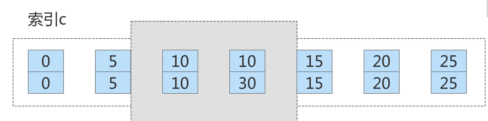

这个 delete 语句在索引 c 上的加锁范围，就是上面图中蓝色区域覆盖的部分。这个蓝色区域左右两边都
是虚线，表示开区间，即 (col1=5,id=5) 和 (col1=15,id=15) 这两行上都没有锁

在`非聚簇索引`上，锁住(col1=5,id=5) 到 (col1=15,id=15)

在`聚簇索引`上，只锁住 col=10 的那两行

#### 案例 7：limit 语句加锁
例子 6 也有一个对照案例，场景如下所示：

| sessionA                                           | sessionB                                          |
|:---------------------------------------------------|:--------------------------------------------------|
| begin; <br>delete from test where col1=10 limit 2; |                                                   |
|                                                    | insert into test values(12,12,12); <br>(Query OK) |

session A 的 delete 语句加了 limit 2。你知道表 t 里 c=10 的记录其实只有两条，因此加不加 limit2，删除的效果都是一样的。但是加锁效果却不一样

这是因为，案例七里的 delete 语句明确加了 limit2 的限制，因此在遍历到 (col1=10,id=30)这一行之后， 满足条件的语句已经有两条，循环就结束了。因此，索引 col1 上的加锁范围就变成了从 (col1=5,id=5) 到 (col1=10,id=30)这个前开后闭区间，如下图所示：

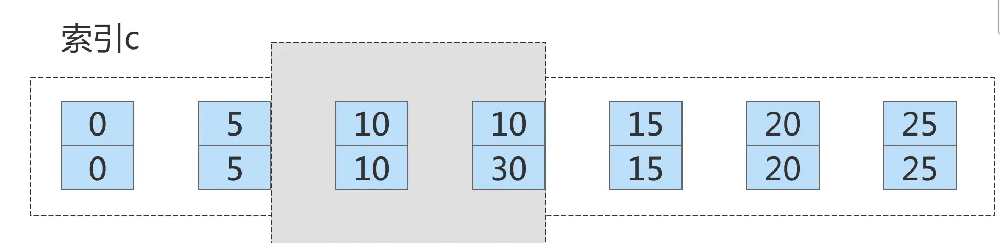

这个例子对我们实践的指导意义就是，在删除数据的时候尽量加 limit。 

这样不仅可以**控制删除数据的条数，让操作更安全，还可以减小加锁的范围。**

```sql
select col1 from test where col1 = 5 for share;
select col1 from test where col1 = 5  limit 1 for share;
select col1 from test where col1 = 5  limit 2 for share;
```

语句 1：没有 limit 的情况下，索引 C 上锁定范围 (0,5] (5,10)

语句 2：存在 limit 的情况下，索引 C 上锁定范围 (0,5] ，limit 限制只扫描一条，不需要再继续向扫描了。

语句 3：存在 limit 的情况下，索引 C 上锁定范围 (0,5] (5,10) 因为 limit 要扫两条，找不到第二条，一直扫到遇上第一条不符合的记录为止，临键锁降级为间隙锁。

#### 案例 8：一个死锁的例子
| sessionA                                                        | sessionB                                                                               |
|:----------------------------------------------------------------|:---------------------------------------------------------------------------------------|
| begin;<br>select id from test where col1=10 lock in share mode; |                                                                                        |
|                                                                 | update test set col2=col2+1 where col1=10;<br>(blocked)                                |
| insert into test values(8,8,8);                                 |                                                                                        |
|                                                                 | ERROR 1213 (40001): Deadlock found when trying to get lock; try restarting transaction |

* sessionA 启动事务后执行查询语句加 lock in share mode，在索引 col1 上加了 next-keylock (5,10]和间隙锁 (10,15)（索引向右遍历退化为间隙锁）；
* sessionB 的 update 语句也要在索引 c 上加 next-keylock (5,10]，进入锁等待；实际上分成了两步，先是加 (5,10) 的间隙锁，加锁成功；然后加 col1=10 的行锁，因为 sessionA 上已经给这行加上了读锁，此时申请死锁时会被阻塞
* sessionA 要再插入(8,8,8)这一行，被 sessionB 的间隙锁锁住。由于出现了死锁，InnoDB 让 sessionB 回滚

#### 案例 9：order by 索引排序的间隙锁 1
如下面一条语句

```sql
begin;
# 正序情况下，锁定(5,10]  (10,15]
select * from test where id>9 and id<12 order by id  for update;

# 下面的解释是倒叙
select * from test where id>9 and id<12 order by id desc for update;
```

下图为这个表的索引 id 的示意图。


首先这个查询语句的语义是 order by id desc ，要拿到满足条件的所有行，优化器必须先找到第一个 id<12 的值。

这个过程是通过索引树的搜索过程得到的，在引擎内部，其实是要找到 id=12 的这个值，只是最终没找到，但找到了 (10,15) 这个间隙。id=15 不满足条件，所以 next-key lock 退化为了间隙锁 (10,15)

然后向左遍历，在遍历过程中，就不是等值查询了，会扫描到 id=5 这一行，又因为区间是左开右闭的，所以会加一个 next-key lock (0,5] 。 也就是说，在执行过程中，通过树搜索的方式定位记录的时候，用的是 “ 等值查询 ” 的方法。

#### 案例 10：order by 索引排序的间隙锁 2
| sessionA                                                                                        | sessionB                                               |
|:------------------------------------------------------------------------------------------------|:-------------------------------------------------------|
| begin;<br>select * from test where col1>=15 and col1<=20 order by col1 desc lock in share mode; |                                                        |
|                                                                                                 | insert into test values(6,6,6);<br>(blocked)           |
|                                                                                                 | insert into test values(11,11,11);<br/>(blocked)       |
|                                                                                                 | update test set col2 = col2 +1 where id =10;(Query OK) |
|                                                                                                 | update test set col2 = col2 +1 where col1=10;(blocked) |

* 由于是 order by col1 desc，第一个要定位的是索引 col1 上最右边的 col1=20 的行。这是一个非唯一索引的等值查询：

  左开右闭区间，首先加上 next-keylock（15,20]。向右遍历，col1=25 不满足条件，退化为间隙锁所以会 加上间隙锁 (20,25)和 next-keylock(15,20]。

* 在索引 col1 上向左遍历，要扫描到 col1=10 才停下来。同时又因为左开右闭区间，所以 next-key lock 会加到 (10,15]，这正是阻塞 session B 的 insert into test values(11,11,11)语句的原因。
* 在扫描过程中，col1=20、col1=15、col1=10 这三行都存在值，由于是 select *，所以会在主键 id 上加上行锁。因此，session A 的 select 语句锁的范围就是：
* * 索引 c 上 (5,10] (10,15] (15,20] (20,25) ；
  * 主键索引上 id=15、20 两个行锁。

#### 案例 11：update 的例子
当 `UPDATE` 修改聚簇索引记录时，会对受影响的二级索引记录隐式加锁。

| sessionA                                     | sessionB                                      |
|:---------------------------------------------|:----------------------------------------------|
| begin;<br>update test set col1=1 where id=5; |                                               |
|                                              | update test set col1=5 where col1=1;(blocked) |

SessionA 执行 Update 语句，唯一索引等值查询，会在聚簇索引上加一条行锁，锁 id=5 这条记录

在二级索引 C 上，并没有显示的加锁

```sql
*************************** row ***************************
               ENGINE: INNODB
       ENGINE_LOCK_ID: 140059072585112:40:4:3:140058950704768
ENGINE_TRANSACTION_ID: 122988
            THREAD_ID: 63
             EVENT_ID: 21
        OBJECT_SCHEMA: dbtest_lock
          OBJECT_NAME: test
       PARTITION_NAME: NULL
    SUBPARTITION_NAME: NULL
           INDEX_NAME: PRIMARY
OBJECT_INSTANCE_BEGIN: 140058950704768
            LOCK_TYPE: RECORD
            LOCK_MODE: X,REC_NOT_GAP
          LOCK_STATUS: GRANTED
            LOCK_DATA: 5
```

SessionB 尝试修改二级索引，导致二级索引上的隐式锁，变为记录锁

```sql
*************************** row ***************************
               ENGINE: INNODB
       ENGINE_LOCK_ID: 140059072585112:40:4:3:140058950704768
ENGINE_TRANSACTION_ID: 122988
            THREAD_ID: 63
             EVENT_ID: 21
        OBJECT_SCHEMA: dbtest_lock
          OBJECT_NAME: test
       PARTITION_NAME: NULL
    SUBPARTITION_NAME: NULL
           INDEX_NAME: PRIMARY
OBJECT_INSTANCE_BEGIN: 140058950704768
            LOCK_TYPE: RECORD
            LOCK_MODE: X,REC_NOT_GAP
          LOCK_STATUS: GRANTED
            LOCK_DATA: 5
*************************** 隐式锁变成记录锁 ***************************
               ENGINE: INNODB
       ENGINE_LOCK_ID: 140059072585112:40:5:8:140058950705112
ENGINE_TRANSACTION_ID: 122988
            THREAD_ID: 64
             EVENT_ID: 13
        OBJECT_SCHEMA: dbtest_lock
          OBJECT_NAME: test
       PARTITION_NAME: NULL
    SUBPARTITION_NAME: NULL
           INDEX_NAME: c
OBJECT_INSTANCE_BEGIN: 140058950705112
            LOCK_TYPE: RECORD
            LOCK_MODE: X,REC_NOT_GAP
          LOCK_STATUS: GRANTED
            LOCK_DATA: 1, 5
```

#### 案例 12 Update 例子——非唯一索引上的操作
| Session A                                     | SessionB |
|:----------------------------------------------|:---------|
| begin<br>update test set col1=4 where col1=5; |          |
|                                               |          |

非唯一索引等值查询，col1=5 存在，索引 C 上锁定范围 (0,5]  (5,10)

插入新的二级索引 col1=4，锁定范围 (0,4)

```sql
*************************** 2. row ***************************
               ENGINE: INNODB
       ENGINE_LOCK_ID: 140059072585112:40:5:3:140058950704768
ENGINE_TRANSACTION_ID: 123017
            THREAD_ID: 63
             EVENT_ID: 74
        OBJECT_SCHEMA: dbtest_lock
          OBJECT_NAME: test
       PARTITION_NAME: NULL
    SUBPARTITION_NAME: NULL
           INDEX_NAME: c
OBJECT_INSTANCE_BEGIN: 140058950704768
            LOCK_TYPE: RECORD
            LOCK_MODE: X
          LOCK_STATUS: GRANTED
            LOCK_DATA: 5, 5
*************************** 3. row ***************************
               ENGINE: INNODB
       ENGINE_LOCK_ID: 140059072585112:40:4:3:140058950705112
ENGINE_TRANSACTION_ID: 123017
            THREAD_ID: 63
             EVENT_ID: 74
        OBJECT_SCHEMA: dbtest_lock
          OBJECT_NAME: test
       PARTITION_NAME: NULL
    SUBPARTITION_NAME: NULL
           INDEX_NAME: PRIMARY
OBJECT_INSTANCE_BEGIN: 140058950705112
            LOCK_TYPE: RECORD
            LOCK_MODE: X,REC_NOT_GAP
          LOCK_STATUS: GRANTED
            LOCK_DATA: 5
*************************** 4. row ***************************
               ENGINE: INNODB
       ENGINE_LOCK_ID: 140059072585112:40:5:4:140058950705456
ENGINE_TRANSACTION_ID: 123017
            THREAD_ID: 63
             EVENT_ID: 74
        OBJECT_SCHEMA: dbtest_lock
          OBJECT_NAME: test
       PARTITION_NAME: NULL
    SUBPARTITION_NAME: NULL
           INDEX_NAME: c
OBJECT_INSTANCE_BEGIN: 140058950705456
            LOCK_TYPE: RECORD
            LOCK_MODE: X,GAP
          LOCK_STATUS: GRANTED
            LOCK_DATA: 10, 10
*************************** 5. row ***************************
               ENGINE: INNODB
       ENGINE_LOCK_ID: 140059072585112:40:5:8:140058950705456
ENGINE_TRANSACTION_ID: 123017
            THREAD_ID: 63
             EVENT_ID: 74
        OBJECT_SCHEMA: dbtest_lock
          OBJECT_NAME: test
       PARTITION_NAME: NULL
    SUBPARTITION_NAME: NULL
           INDEX_NAME: c
OBJECT_INSTANCE_BEGIN: 140058950705456
            LOCK_TYPE: RECORD
            LOCK_MODE: X,GAP
          LOCK_STATUS: GRANTED
            LOCK_DATA: 4, 5
```

::: note
唯一索引的话，update 操作，删除的记录加行锁，新的记录加隐式锁
:::
