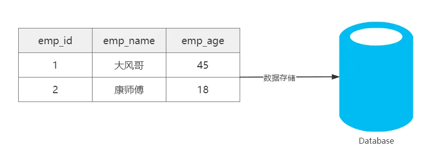
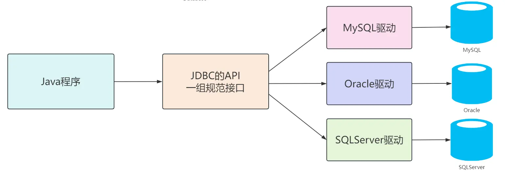
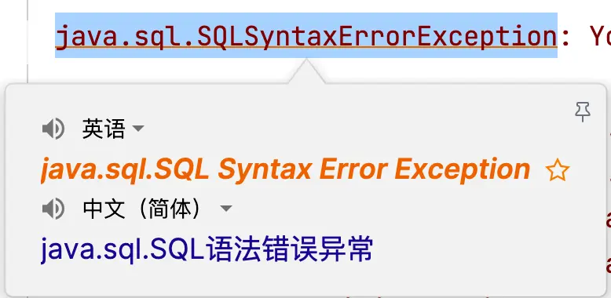
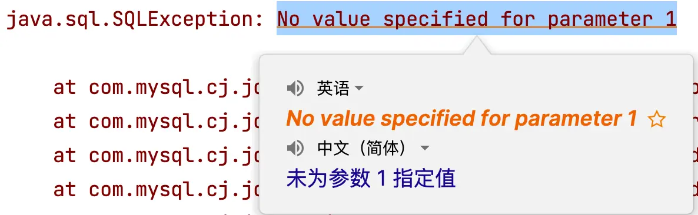
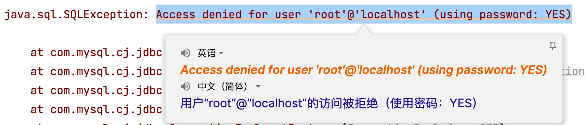
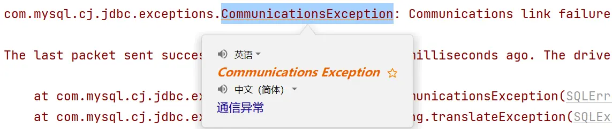
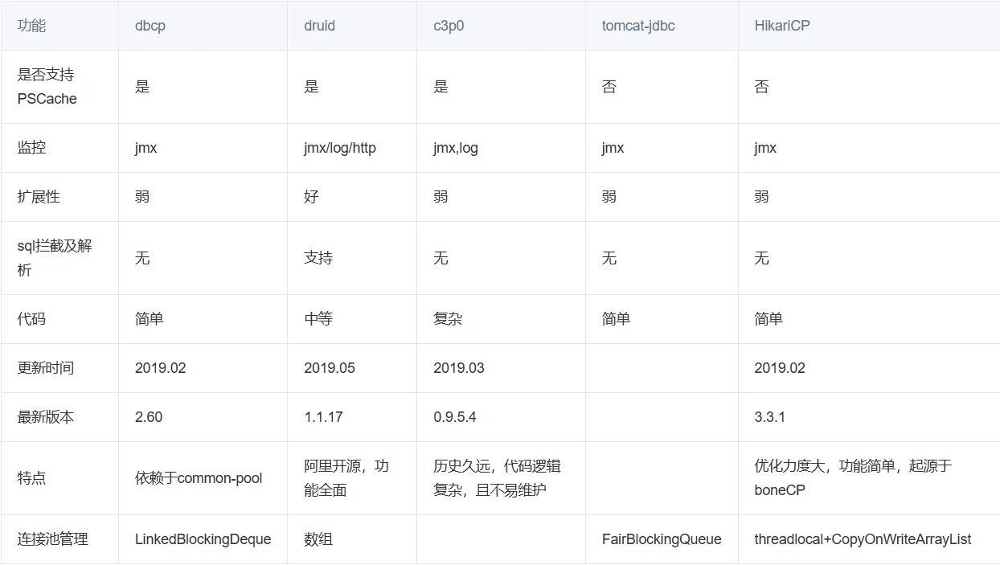
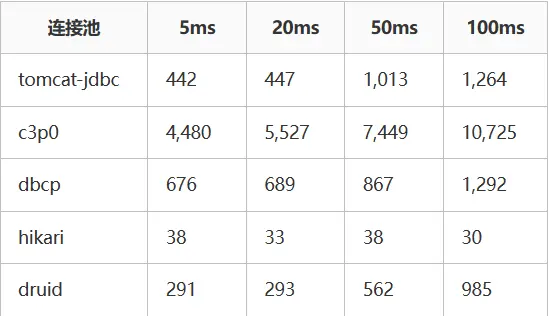
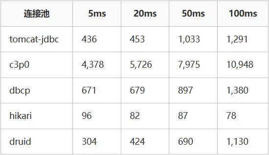
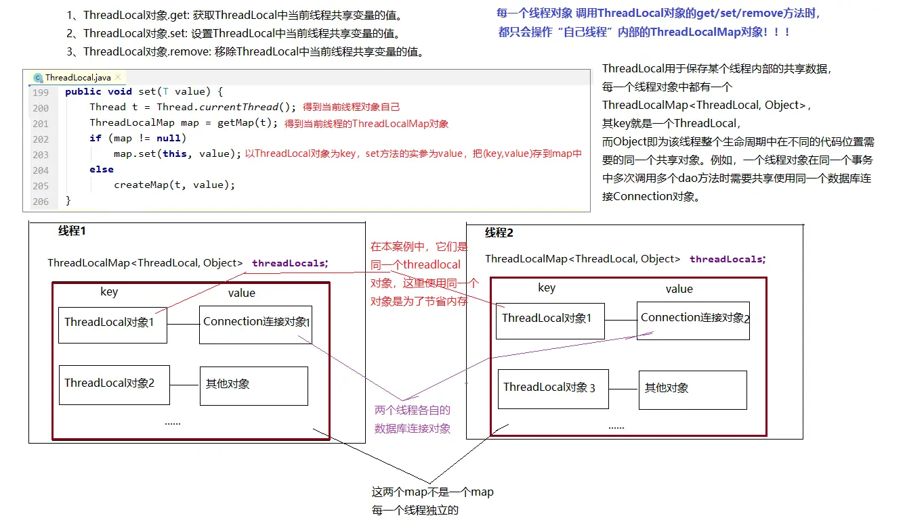

# 尚硅谷 Java 技术之 8.x 数据库+JDK21 版 JDBC 数据库连接技术

Java 技术之 8.x 数据库 + JDK21 版 JDBC 数据库连接技术

***

## 基础篇
### 一、引言
#### 1.1 数据的存储
在开发 Java 程序时，数据都是存储在内存中，属于临时存储，当程序停止或重启时，内存中的数据就丢失了！

为了解决数据的长期存储问题，有如下解决方案：

1. 数据通 I/O 流技术，存储在本地磁盘中，解决了持久化问题，但是没有结构和逻辑，不方便管理和维护。
2. 通过关系型数据库，将数据按照特定的格式交由数据库管理系统维护。关系型数据库是通过库和表分隔不同的数据，表中数据存储的方式是行和列，区分相同格式不同值的数据。

|                               数据库存储数据                                |
|:--------------------------------------------------------------------:|
|  |

#### 1.2 数据的操作
数据存储在数据库，仅仅解决了数据存储的问题，但当程序运行时，需要读取数据，以及对数据做增删改的操作，那么如何通过 Java 程序对数据库中的数据做增删改查呢？

|                             Java 程序读取数据库                             |
|:--------------------------------------------------------------------:|
|  |

### 二、JDBC
#### 2.1 JDBC 的概念
- JDBC：Java Database Connectivity，意为 Java 数据库连接。
- JDBC 是 Java 提供的一组独立于任何数据库管理系统的 API。
- Java 提供接口规范，由各个数据库厂商提供接口的实现，厂商提供的实现类封装成 jar 文件，俗称数据库驱动 jar 包。
- 学习 JDBC，充分体现了面向接口编程的好处，程序员只关心标准和规范，而无需关注实现过程。

|                             JDBC 简单执行过程                              |
|:--------------------------------------------------------------------:|
|  |

#### 2.2 JDBC 的核心组成
- 接口规范：
    - 为了项目代码的可移植性，可维护性，SUN 公司从最初就制定了 Java 程序连接各种数据库的统一接口规范。这样的话，不管是连接哪一种 DBMS 软件，Java 代码可以保持一致性。
      - 接口存储在 `java.sql` 和 `javax.sql` 包下。
- 实现规范：
    - 因为各个数据库厂商的 DBMS 软件各有不同，那么各自的内部如何通过 SQL 实现增、删、改、查等操作管理数据，只有这个数据库厂商自己更清楚，因此把接口规范的实现交给各个数据库厂商自己实现。
    - 厂商将实现内容和过程封装成 jar 文件，程序员只需要将 jar 文件引入到项目中集成即可，就可以开发调用实现过程操作数据库了。

### 三、JDBC 快速入门
#### 3.1 JDBC 搭建步骤
1. 准备数据库。
2. [官网](https://downloads.mysql.com/archives/c-j/)下载数据库连接驱动 jar 包。
3. 创建 Java 项目，在项目下创建 lib 文件夹，将下载的驱动 jar 包复制到文件夹里。
4. 选中 lib 文件夹右键->Add as Library，与项目集成。
5. 编写代码

#### 3.2 代码实现
<h5>3.2.1 数据库</h5>

```sql
CREATE DATABASE atguigu;
USE atguigu;

CREATE TABLE t_emp (
                       emp_id INT auto_increment COMMENT '员工编号' PRIMARY KEY,
                       emp_name VARCHAR ( 100 ) NOT NULL COMMENT '员工姓名',
                       emp_salary DOUBLE ( 10, 5 ) NOT NULL COMMENT '员工薪资',
                       emp_age INT NOT NULL COMMENT '员工年龄'
);

INSERT INTO t_emp ( emp_name, emp_salary, emp_age )
VALUES ( 'andy', 777.77, 32 ),
       ( '大风哥', 666.66, 41 ),
       ( '康师傅', 111, 23 ),
       ( 'Gavin', 123, 26 ),
       ( '小鱼儿', 123, 28 );
```

<h5>3.2.2 Java 代码</h5>

```java
import java.sql.*;

public class JDBCQuick {
    public static void main(String[] args) throws ClassNotFoundException, SQLException {
        // 1. 注册驱动
        Class.forName("com.mysql.cj.jdbc.Driver");

        // 2. 获取连接对象
        String url = "jdbc:mysql://localhost:3306/atguigu";
        String user = "root";
        String password = "123456";
        Connection connection = DriverManager.getConnection(url, user, password);

        // 3. 获取执行 SQL语句的对象
        Statement statement = connection.createStatement();

        // 4. 编写 SQL 语句
        String sql = "SELECT emp_id, emp_name, emp_salary, emp_age FROM t_emp";
        ResultSet resultSet = statement.executeQuery(sql);

        // 5. 处理结果：遍历 resultSet 结果集
        while (resultSet.next()) {
            int empId = resultSet.getInt("emp_id");
            String empName = resultSet.getString("emp_name");
            double empSalary = resultSet.getDouble("emp_salary");
            int empAge = resultSet.getInt("emp_age");
            System.out.println(empId + "\t" + empName + "\t" + empSalary + "\t" + empAge);
        }

        // 6. 释放资源（先关后关原则）
        resultSet.close();
        statement.close();
        connection.close();
    }
}
```

#### 3.3 步骤总结
1. 注册驱动【依赖的驱动类，进行安装】
2. 获取连接【Connection 建立连接】
3. 创建发送 SQL 语句对象【Connection 创建发送 SQL 语句的 Statement】
4. 发送 SQL 语句，并获取返回结果【Statement 发送 sql 语句到数据库并且取得返回结果】
5. 结果集解析【结果集解析，将查询结果解析出来】
6. 资源关闭【释放 ResultSet、Statement 、Connection】

### 四、核心 API 理解
#### 4.1 注册驱动
```java
Class.forName("com.mysql.cj.jdbc.Driver");
```

- 在 Java 中，当使用 JDBC（Java Database Connectivity）连接数据库时，需要加载数据库特定的驱动程序，以便与数据库进行通信。加载驱动程序的目的是为了注册驱动程序，使得 JDBC API 能够识别并与特定的数据库进行交互。
-  从 JDK6 开始，不再需要显式地调用 `Class.forName()` 来加载 JDBC 驱动程序，只要在类路径中集成了对应的 jar 文件，会自动在初始化时注册驱动程序。

#### 4.2 Connection
- Connection 接口是 JDBC API 的重要接口，用于建立与数据库的通信通道。换而言之，Connection 对象不为空，则代表一次数据库连接。
- 在建立连接时，需要指定数据库 URL、用户名、密码参数。
    - URL：`jdbc:mysql://localhost:3306/atguigu`
        - `jdbc:mysql://IP 地址:端口号/数据库名称?key1=value1&key2=value2`
- `Connection` 接口还负责管理事务，`Connection` 接口提供了 `commit` 和 `rollback` 方法，用于提交事务和回滚事务。
- 可以创建 `Statement` 对象，用于执行 SQL 语句并与数据库进行交互。
- 在使用 JDBC 技术时，必须要先获取 Connection 对象，在**使用完毕后，要释放资源**，避免资源占用浪费及泄漏。

#### 4.3 Statement
- `Statement` 接口用于执行 SQL 语句并与数据库进行交互。它是 JDBC API 中的一个重要接口。通过 `Statement` 对象，可以向数据库发送 SQL 语句并获取执行结果。
- 结果可以是一个或多个结果。
    - 增删改：受影响行数单个结果。
    - 查询：单行单列、多行多列、单行多列等结果。
- 但是`Statement` 接口在执行 SQL 语句时，会产生`SQL 注入攻击问题`:
    - 当使用 `Statement` 执行动态构建的 SQL 查询时，往往需要将查询条件与 SQL 语句拼接在一起，直接将参数和 SQL 语句一并生成，让 SQL 的查询条件始终为 true 得到结果。

#### 4.4 PreparedStatement
- `PreparedStatement`是 `Statement` 接口的子接口，用于执行`预编译`的 SQL 查询，作用如下：
    - 预编译 SQL 语句：在创建 PreparedStatement 时，就会预编译 SQL 语句，也就是 SQL 语句已经固定。
    - 防止 SQL 注入：`PreparedStatement` 支持参数化查询，将数据作为参数传递到 SQL 语句中，采用`?`占位符的方式，将传入的参数用一对单引号包裹起来`''`，无论传递什么都作为值。有效防止传入关键字或值导致 SQL 注入问题。
    - 性能提升：PreparedStatement 是预编译 SQL 语句，同一 SQL 语句多次执行的情况下，可以复用，不必每次重新编译和解析。
- 后续的学习都是基于 PreparedStatement 进行实现，更安全、效率更高！

#### 4.5 ResultSet
- `ResultSet`是 JDBC API 中的一个接口，用于表示从数据库中`执行查询语句所返回的结果集`。它提供了一种用于遍历和访问查询结果的方式。
- 遍历结果：ResultSet 可以使用 `next()` 方法将游标移动到结果集的下一行，逐行遍历数据库查询的结果，返回值为 boolean 类型，true 代表有下一行结果，false 则代表没有。
- 获取单列结果：可以通过 `getXxx()` 的方法获取单列的数据，该方法为重载方法，支持索引和列名进行获取。

### 五、基于 PreparedStatement 实现 CRUD
#### 5.1 查询单行单列
```java
@Test
public void testQuerySingleRowAndCol() throws SQLException {
    // 1. 注册驱动（可以省略）
    // 2. 获取连接对象
    Connection connection = DriverManager.getConnection("jdbc:mysql:///atguigu", "root", "123456");

    // 3. 预编译 SQL 语句得到 prepareStatement
    PreparedStatement preparedStatement = connection.prepareStatement("select count(*) as count from t_emp");

    // 4. 执行 SQL 语句，获取结果
    ResultSet resultSet = preparedStatement.executeQuery();

    // 5. 处理结果
    if (resultSet.next()) {
        int count = resultSet.getInt("count");
        System.out.println(count);
    }

    // 6. 释放资源
    resultSet.close();
    preparedStatement.close();
    connection.close();
}
```

#### 5.2 查询单行多列
```java
@Test
public void testQuerySingleRow() throws SQLException {
    // 1. 注册驱动（可以省略）
    // 2. 获取连接对象
    Connection connection = DriverManager.getConnection("jdbc:mysql:///atguigu", "root", "123456");

    // 3. 预编译 SQL 语句得到 prepareStatement
    PreparedStatement preparedStatement = connection.prepareStatement("select emp_id,emp_name,emp_salary,emp_age from t_emp where emp_id = ?");

    // 4. 为占位符赋值，索引从 1 开始，执行 SQL 语句，获取结果
    preparedStatement.setInt(1, 5);
    ResultSet resultSet = preparedStatement.executeQuery();

    // 5. 处理结果
    while (resultSet.next()) {
        int empId = resultSet.getInt("emp_id");
        String empName = resultSet.getString("emp_name");
        double empSalary = resultSet.getDouble("emp_salary");
        int empAge = resultSet.getInt("emp_age");
        System.out.println(empId + "\t" + empName + "\t" + empSalary + "\t" + empAge);
    }

    // 6. 释放资源（先关后关原则）
    resultSet.close();
    preparedStatement.close();
    connection.close();
}
```

#### 5.3 查询多行多列
```java
@Test
public void testQueryMoreRow() throws SQLException {
    Connection connection = DriverManager.getConnection("jdbc:mysql:///atguigu", "root", "123456");

    PreparedStatement preparedStatement = connection.prepareStatement("select emp_id,emp_name,emp_salary,emp_age from t_emp where emp_age > ?");

    preparedStatement.setInt(1, 25);
    ResultSet resultSet = preparedStatement.executeQuery();

    while (resultSet.next()) {
        int empId = resultSet.getInt("emp_id");
        String empName = resultSet.getString("emp_name");
        double empSalary = resultSet.getDouble("emp_salary");
        int empAge = resultSet.getInt("emp_age");
        System.out.println(empId + "\t" + empName + "\t" + empSalary + "\t" + empAge);
    }

    resultSet.close();
    preparedStatement.close();
    connection.close();
}
```

#### 5.4 新增
```java
@Test
public void testInsert() throws SQLException {
    Connection connection = DriverManager.getConnection("jdbc:mysql:///atguigu", "root", "123456");

    PreparedStatement preparedStatement = connection.prepareStatement("insert into t_emp (emp_name, emp_salary, emp_age) values (?,?,?)");

    preparedStatement.setString(1, "rose");
    preparedStatement.setDouble(2, 345.67);
    preparedStatement.setInt(3, 28);
    int resultSet = preparedStatement.executeUpdate();

    if (resultSet > 0) {
        System.out.println("成功");
    } else {
        System.out.println("失败");
    }

    preparedStatement.close();
    connection.close();
}
```

#### 5.5 修改
```java
@Test
public void testUpdate() throws SQLException {
    Connection connection = DriverManager.getConnection("jdbc:mysql:///atguigu", "root", "123456");

    PreparedStatement preparedStatement = connection.prepareStatement("update t_emp set emp_salary = ? where emp_id = ?");

    preparedStatement.setDouble(1, 888.88);
    preparedStatement.setInt(2, 6);
    int resultSet = preparedStatement.executeUpdate();

    if (resultSet > 0) {
        System.out.println("成功");
    } else {
        System.out.println("失败");
    }

    preparedStatement.close();
    connection.close();
}
```

#### 5.6 删除
```java
@Test
public void testDelete() throws SQLException {
    Connection connection = DriverManager.getConnection("jdbc:mysql:///atguigu", "root", "123456");

    PreparedStatement preparedStatement = connection.prepareStatement("delete from t_emp where emp_id = ?");

    preparedStatement.setInt(1, 6);
    int resultSet = preparedStatement.executeUpdate();

    if (resultSet > 0) {
        System.out.println("成功");
    } else {
        System.out.println("失败");
    }

    preparedStatement.close();
    connection.close();
}
```

### 六、常见问题
#### 6.1 资源的管理
在使用 JDBC 的相关资源时，比如 Connection、PreparedStatement、ResultSet，使用完毕后，要及时关闭这些资源以释放数据库服务器资源和避免内存泄漏是很重要的。

#### 6.2 SQL 语句问题
`java.sql.SQLSyntaxErrorException`：SQL 语句错误异常，一般有几种可能：
1. SQL 语句有错误，检查 SQL 语句！建议 SQL 语句在 SQL 工具中测试后再复制到 Java 程序中！
2. 连接数据库的 URL 中，数据库名称编写错误，也会报该异常！



#### 6.3 SQL 语句未设置参数问题
`java.sql.SQLException：No value specified for parameter 1`

在使用预编译 SQL 语句时，如果有`?`占位符，要为每一个占位符赋值，否则报该错误！



#### 6.4 用户名或密码错误问题
连接数据库时，如果用户名或密码输入错误，也会报 SQLException，容易混淆！所以一定要看清楚异常后面的原因描述



#### 6.5 通信异常
在连接数据库的 URL 中，如果 IP 或端口写错了，会报如下异常：`com.mysql.cj.jdbc.exceptions.CommunicationsException: Communications link failure`



## 进阶篇
### 七、JDBC 扩展
#### 7.1 实体类和 ORM
- 在使用 JDBC 操作数据库时，会发现数据都是零散的，明明在数据库中是一行完整的数据，到了 Java 中变成了一个一个的变量，不利于维护和管理。而 Java 是面向对象的，一个表对应的是一个类，一行数据就对应的是 Java 中的一个对象，一个列对应的是对象的属性，所以要把数据存储在一个载体里，这个载体就是实体类！
- ORM（Object Relational Mapping）思想，**对象到关系数据库的映射**，作用是在编程中，把面向对象的概念跟数据库中表的概念对应起来，以面向对象的角度操作数据库中的数据，即一张表对应一个类，一行数据对应一个对象，一个列对应一个属性！
- 当下 JDBC 中这种过程被称其为手动 ORM。后续也会学习 ORM 框架，比如 MyBatis、JPA 等。

```java
//类名和数据库名对应，但是表名一般缩写，类名要全写！
public class Employee {
    private Integer empId;//emp_id = empId 数据库中列名用下划线分隔，属性名用驼峰！
    private String empName;//emp_name = empName
    private Double empSalary;//emp_salary = empSalary
    private Integer empAge;//emp_age = empAge

    //省略get、set、无参、有参、toString方法。
}
```

封装代码：

```java
@Test
public void querySingleRow() throws SQLException {
    //1.注册驱动
//    Class.forName("com.mysql.cj.jdbc.Driver");

    //2.获取数据库连接
    Connection connection = DriverManager.getConnection("jdbc:mysql://localhost:3306/atguigu", "root","atguigu");

    //3.创建PreparedStatement对象，并预编译SQL语句，使用?占位符
    PreparedStatement preparedStatement = connection.prepareStatement("select emp_id,emp_name,emp_salary,emp_age from t_emp where emp_id = ?");

    //4.为占位符赋值，索引从1开始，执行SQL语句，获取结果
    preparedStatement.setInt(1, 1);
    ResultSet resultSet = preparedStatement.executeQuery();
    //预先创建实体类变量
    Employee employee = null;
    //5.处理结果
    while (resultSet.next()) {
        int empId = resultSet.getInt("emp_id");
        String empName = resultSet.getString("emp_name");
        Double empSalary = Double.valueOf(resultSet.getString("emp_salary"));
        int empAge = resultSet.getInt("emp_age");
        //当结果集中有数据，再进行对象的创建
        employee = new Employee(empId,empName,empSalary,empAge);
    }

    System.out.println("employee = " + employee);

    //6.释放资源(先开后关原则)
    resultSet.close();
    preparedStatement.close();
    connection.close();
}
```

#### 7.2 主键回显
在数据中，执行新增操作时，主键列为自动增长，可以在表中直观的看到，但是在 Java 程序中，执行完新增后，只能得到受影响行数，无法得知当前新增数据的主键值。在 Java 程序中获取数据库中插入新数据后的主键值，并赋值给 Java 对象，此操作为主键回显。

代码实现：

```java
@Test
public void testReturnPK() throws SQLException {
    Connection connection = DriverManager.getConnection("jdbc:mysql:///atguigu", "root", "atguigu");

    // 预编译 SQL语句，告知 preparedStatement 返回新增数据的主键列的值
    String sql = "insert into t_emp (emp_name, emp_salary, emp_age) values (?,?,?)";
    PreparedStatement preparedStatement = connection.prepareStatement(sql, Statement.RETURN_GENERATED_KEYS);

    // 创建对象，将对象的属性值填充到 ？ 占位符上（ORM）
    Employee employee = new Employee(null, "jack", 123.45, 29);
    preparedStatement.setString(1, employee.getEmpName());
    preparedStatement.setDouble(2, employee.getSalary());
    preparedStatement.setInt(3, employee.getEmpAge());

    int result = preparedStatement.executeUpdate();
    ResultSet resultSet = null;

    // 处理结果
    if (result > 0) {
        System.out.println("成功！");

        // 获取当前新增数据的主键列，回显到Java中employee对象的empId属性上
        // 返回的主键值，是一个单行单列的结果存储在 ResultSet 中
        resultSet = preparedStatement.getGeneratedKeys();
        if (resultSet.next()) {
            int empId = resultSet.getInt(1);
            employee.setEmpId(empId);
        }
        System.out.println(employee);
    } else {
        System.out.println("失败");
    }

    if (resultSet != null) {
        resultSet.close();
    }
    preparedStatement.close();
    connection.close();
}
```

#### 7.3 批量操作
插入多条数据时，一条一条发送给数据库执行，效率低下！通过批量操作，可以提升多次操作效率！

代码实现：

```java
@Test
public void testBatch() throws Exception {
     //1.注册驱动
//     Class.forName("com.mysql.cj.jdbc.Driver");

    //2.获取连接
    Connection connection = DriverManager.getConnection("jdbc:mysql:///atguigu?rewriteBatchedStatements=true", "root", "atguigu");

    //3.编写SQL语句
    /*
        注意：1、必须在连接数据库的URL后面追加?rewriteBatchedStatements=true，允许批量操作
            2、新增SQL必须用values。且语句最后不要追加;结束
            3、调用addBatch()方法，将SQL语句进行批量添加操作
            4、统一执行批量操作，调用executeBatch()
     */
    String sql = "insert into t_emp (emp_name,emp_salary,emp_age) values (?,?,?)";

    //4.创建预编译的PreparedStatement，传入SQL语句
    PreparedStatement preparedStatement = connection.prepareStatement(sql);

    //获取当前行代码执行的时间。毫秒值
    long start = System.currentTimeMillis();
    for(int i = 0;i<10000;i++){
        //5.为占位符赋值
        preparedStatement.setString(1, "marry"+i);
        preparedStatement.setDouble(2, 100.0+i);
        preparedStatement.setInt(3, 20+i);

        preparedStatement.addBatch();
    }

    //执行批量操作
    preparedStatement.executeBatch();

    long end = System.currentTimeMillis();

    System.out.println("消耗时间："+(end - start));

    preparedStatement.close();
    connection.close();
}
```

### 八、连接池
#### 8.1 现有问题
- 每次操作数据库都要获取新连接，使用完毕后就 close 释放，频繁的创建和销毁造成资源浪费。
- 连接的数量无法把控，对服务器来说压力巨大。

#### 8.2 连接池
- 连接池就是**数据库连接对象的缓冲区**，通过配置，由连接池负责创建连接、管理连接、释放连接等操作。
- 预先创建数据库连接放入连接池，用户在请求时，通过池直接获取连接，使用完毕后，将连接放回池中，避免了频繁的创建和销毁，同时解决了创建的效率。
- 当池中无连接可用，且未达到上限时，连接池会新建连接。
- 池中连接达到上限，用户请求会等待，可以设置超时时间。

#### 8.3 常见连接池
JDBC 的数据库连接池使用 `javax.sql.DataSource` 接口进行规范，所有的第三方连接池都实现此接口，自行添加具体实现！也就是说，所有连接池获取连接的和回收连接方法都一样，不同的只有性能和扩展功能!

- DBCP 是 Apache 提供的数据库连接池，速度相对 C3P0 较快，但自身存在一些 BUG。
- C3P0 是一个开源组织提供的一个数据库连接池，速度相对较慢，稳定性还可以。
- Proxool 是 sourceforge 下的一个开源项目数据库连接池，有监控连接池状态的功能， 稳定性较 c3p0 差一点。
- **Druid 是阿里提供的数据库连接池，是集 DBCP 、C3P0 、Proxool 优点于一身的数据库连接池，性能、扩展性、易用性都更好，功能丰富**。
- **Hikari（ひかり[shi ga li]） 取自日语，是光的意思，是 SpringBoot2.x 之后内置的一款连接池，基于 BoneCP （已经放弃维护，推荐该连接池）做了不少的改进和优化，口号是快速、简单、可靠。**

|                              主流连接池的功能对比                              |
|:--------------------------------------------------------------------:|
|  |

|                           mock 性能数据（单位：ms）                           |
|:--------------------------------------------------------------------:|
|  |

|                          mysql 性能数据 (单位：ms)                          |
|:--------------------------------------------------------------------:|
|  |

#### 8.4 Druid 连接池使用
- 使用步骤：
    - 引入 jar 包。
    - 编码。
- 代码实现：
    - 硬编码方式（了解）：

    ```java
    @Test
    public void testHardCodeDruid() throws SQLException {
        /*
            硬编码：将连接池的配置信息和Java代码耦合在一起。
            1、创建DruidDataSource连接池对象。
            2、设置连接池的配置信息【必须 | 非必须】
            3、通过连接池获取连接对象
            4、回收连接【不是释放连接，而是将连接归还给连接池，给其他线程进行复用】
         */
        
        //1.创建DruidDataSource连接池对象。
        DruidDataSource druidDataSource = new DruidDataSource();
        
        //2.设置连接池的配置信息【必须 | 非必须】
        //2.1 必须设置的配置
        druidDataSource.setDriverClassName("com.mysql.cj.jdbc.Driver");
        druidDataSource.setUrl("jdbc:mysql:///atguigu");
        druidDataSource.setUsername("root");
        druidDataSource.setPassword("atguigu");
        
        //2.2 非必须设置的配置
        druidDataSource.setInitialSize(10);
        druidDataSource.setMaxActive(20);
            
        //3.通过连接池获取连接对象
        Connection connection = druidDataSource.getConnection();
        System.out.println(connection);
        
        //基于connection进行CRUD
        
        //4.回收连接
        connection.close();
    }
    ```

    - 软编码方式（推荐）：
        - 在项目目录下创建 resources 文件夹，标识该文件夹为资源目录，创建 db.properties 配置文件，将连接信息定义在该文件中。

        ```properties
        # druid连接池需要的配置参数，key固定命名
        driverClassName=com.mysql.cj.jdbc.Driver
        url=jdbc:mysql:///atguigu
        username=root
        password=atguigu
        initialSize=10
        maxActive=20
        ```

       - Java 代码：

        ```java
        @Test
        public void testResourcesDruid() throws Exception {
            //1.创建Properties集合，用于存储外部配置文件的key和value值。
            Properties properties = new Properties();
        
            //2.读取外部配置文件，获取输入流，加载到Properties集合里。
            InputStream inputStream = DruidTest.class.getClassLoader().getResourceAsStream("db.properties");
            properties.load(inputStream);
        
            //3.基于Properties集合构建DruidDataSource连接池
            DataSource dataSource = DruidDataSourceFactory.createDataSource(properties);
        
            //4.通过连接池获取连接对象
            Connection connection = dataSource.getConnection();
            System.out.println(connection);
        
            //5.开发CRUD
        
            //6.回收连接
            connection.close();
        }
        ```

#### 8.5 Druid 其他配置【了解】
| 配置                            | 缺省    | 说明                                                                                                                                         |
|-------------------------------|-------|--------------------------------------------------------------------------------------------------------------------------------------------|
| name                          |       | 配置这个属性的意义在于，如果存在多个数据源，监控的时候可以通过名字来区分开来。 如果没有配置，将会生成一个名字，格式是：`"DataSource-" + System.identityHashCode(this)`                                |
| jdbcUrl                       |       | 连接数据库的 url，不同数据库不一样。例如：<br/>mysql : `jdbc:mysql://10.20.153.104:3306/druid2`；<br/>oracle : `jdbc:oracle:thin:@10.20.149.85:1521:ocnauto`   |
| username                      |       | 连接数据库的用户名                                                                                                                                  |
| password                      |       | 连接数据库的密码。如果你不希望密码直接写在配置文件中，可以使用 ConfigFilter。详细看这里：[使用 ConfigFilter](https://github.com/alibaba/druid/wiki/%E4%BD%BF%E7%94%A8ConfigFilter) |
| driverClassName               |       | 根据 url 自动识别 这一项可配可不配，如果不配置 druid 会根据 url 自动识别 dbType，然后选择相应的 driverClassName(建议配置下)                                                        |
| initialSize                   | 0     | 初始化时建立物理连接的个数。初始化发生在显示调用 init 方法，或者第一次 getConnection 时                                                                                     |
| maxActive                     | 8     | 最大连接池数量                                                                                                                                    |
| maxIdle                       | 8     | 已经不再使用，配置了也没效果                                                                                                                             |
| minIdle                       |       | 最小连接池数量                                                                                                                                    |
| maxWait                       |       | 获取连接时最大等待时间，单位毫秒。配置了 maxWait 之后，缺省启用公平锁，并发效率会有所下降，如果需要可以通过配置 useUnfairLock 属性为 true 使用非公平锁。                                                |
| poolPreparedStatements        | false | 是否缓存 preparedStatement，也就是 PSCache。PSCache 对支持游标的数据库性能提升巨大，比如说 oracle。在 mysql 下建议关闭。                                                       |
| maxOpenPreparedStatements     | -1    | 要启用 PSCache，必须配置大于 0，当大于 0 时，poolPreparedStatements 自动触发修改为 true。在 Druid 中，不会存在 Oracle 下 PSCache 占用内存过多的问题，可以把这个数值配置大一些，比如说 100            |
| validationQuery               |       | 用来检测连接是否有效的 sql，要求是一个查询语句。如果 validationQuery 为 null，testOnBorrow、testOnReturn、testWhileIdle 都不会其作用。                                        |
| testOnBorrow                  | true  | 申请连接时执行 validationQuery 检测连接是否有效，做了这个配置会降低性能。                                                                                              |
| testOnReturn                  | false | 归还连接时执行 validationQuery 检测连接是否有效，做了这个配置会降低性能                                                                                               |
| testWhileIdle                 | false | 建议配置为 true，不影响性能，并且保证安全性。申请连接的时候检测，如果空闲时间大于 timeBetweenEvictionRunsMillis，执行 validationQuery 检测连接是否有效。                                     |
| timeBetweenEvictionRunsMillis |       | 有两个含义： 1) Destroy 线程会检测连接的间隔时间 2) testWhileIdle 的判断依据，详细看 testWhileIdle 属性的说明                                                              |
| numTestsPerEvictionRun        |       | 不再使用，一个 DruidDataSource 只支持一个 EvictionRun                                                                                                  |
| minEvictableIdleTimeMillis    |       |                                                                                                                                            |
| connectionInitSqls            |       | 物理连接初始化的时候执行的 sql                                                                                                                          |
| exceptionSorter               |       | 根据 dbType 自动识别 当数据库抛出一些不可恢复的异常时，抛弃连接                                                                                                       |
| filters                       |       | 属性类型是字符串，通过别名的方式配置扩展插件，常用的插件有： 监控统计用的 filter:stat 日志用的 filter:log4j 防御 sql 注入的 filter:wall                                                 |
| proxyFilters                  |       | 类型是 List，如果同时配置了 filters 和 proxyFilters，是组合关系，并非替换关系                                                                                       |

#### 8.6 HikariCP 连接池使用
- 使用步骤：
    - 引入 jar 包
    - 硬编码方式：

    ```java
    @Test
    public void testHardCodeHikari() throws SQLException {
        /*
            硬编码：将连接池的配置信息和Java代码耦合在一起。
            1、创建HikariDataSource连接池对象
            2、设置连接池的配置信息【必须 ｜ 非必须】
            3、通过连接池获取连接对象
            4、回收连接
        */
        //1.创建HikariDataSource连接池对象
        HikariDataSource hikariDataSource = new HikariDataSource();
    
        //2.设置连接池的配置信息【必须 ｜ 非必须】
        //2.1必须设置的配置
        hikariDataSource.setDriverClassName("com.mysql.cj.jdbc.Driver");
        hikariDataSource.setJdbcUrl("jdbc:mysql:///atguigu");
        hikariDataSource.setUsername("root");
        hikariDataSource.setPassword("atguigu");
    
        //2.2 非必须设置的配置
        hikariDataSource.setMinimumIdle(10);
        hikariDataSource.setMaximumPoolSize(20);
    
        //3.通过连接池获取连接对象
        Connection connection = hikariDataSource.getConnection();
    
        System.out.println(connection);
    
        //回收连接
        connection.close();
    }
    ```

    - 软编码方式：
        - 在项目下创建 resources/hikari.properties 配置文件

        ```properties
        driverClassName=com.mysql.cj.jdbc.Driver
        jdbcUrl=jdbc:mysql:///atguigu
        username=root
        password=atguigu
        minimumIdle=10
        maximumPoolSize=20
        ```

        - 编写代码：

        ```java
        @Test
        public void testResourcesHikari()throws Exception{
            //1.创建Properties集合，用于存储外部配置文件的key和value值。
            Properties properties = new Properties();
        
            //2.读取外部配置文件，获取输入流，加载到Properties集合里。
            InputStream inputStream = HikariTest.class.getClassLoader().getResourceAsStream("db.properties");
            properties.load(inputStream);
            
            // 3.创建Hikari连接池配置对象，将Properties集合传进去
            HikariConfig hikariConfig = new HikariConfig(properties);
            
            // 4. 基于Hikari配置对象，构建连接池
            HikariDataSource hikariDataSource = new HikariDataSource(hikariConfig);
        
            // 5. 获取连接
            Connection connection = hikariDataSource.getConnection();
            System.out.println("connection = " + connection);
            
            //6.回收连接
            connection.close();
        }
        ```

#### 8.7 HikariCP 其他配置【了解】
| 属性                  | 默认值          | 说明                                                              |
|---------------------|--------------|-----------------------------------------------------------------|
| isAutoCommit        | true         | 自动提交从池中返回的连接                                                    |
| connectionTimeout   | 30000        | 等待来自池的连接的最大毫秒数                                                  |
| maxLifetime         | 1800000      | 池中连接最长生命周期如果不等于 0 且小于 30 秒则会被重置回 30 分钟                          |
| minimumIdle         | 10           | 池中维护的最小空闲连接数 minIdle<0 或者 minIdle>maxPoolSize，则被重置为 maxPoolSize |
| maximumPoolSize     | 10           | 池中最大连接数，包括闲置和使用中的连接                                             |
| metricRegistry      | null         | 连接池的用户定义名称，主要出现在日志记录和 JMX 管理控制台中以识别池和池配置                        |
| healthCheckRegistry | null         | 报告当前健康信息                                                        |
| poolName            | HikariPool-1 | 连接池的用户定义名称，主要出现在日志记录和 JMX 管理控制台中以识别池和池配置                        |
| idleTimeout         |              | 是允许连接在连接池中空闲的最长时间                                               |

## 高级篇
### 九、JDBC 优化及工具类封装
#### 9.1 现有问题
在使用 JDBC 的过程中，部分代码存在以下冗余问题：

- 创建连接池。
- 获取连接。
- 连接的回收。

#### 9.2 JDBC 工具类封装 V1.0
- `resources/db.properties` 配置文件：

```properties
# druid连接池需要的配置参数，key固定命名
driverClassName=com.mysql.cj.jdbc.Driver
username=root
password=atguigu
url=jdbc:mysql:///atguigu
```

- 工具类代码：

```java
import com.alibaba.druid.pool.DruidDataSourceFactory;

import javax.sql.DataSource;
import java.io.InputStream;
import java.sql.Connection;
import java.sql.SQLException;
import java.util.Properties;

/**
 *
 * JDBC 工具类（V1.0）
 *      1. 维护一个连接池对象
 *      2. 对外提供在连接池中获取连接的方法
 *      3. 对外提供回收连接的方法
 *  注意：工具类仅对外提供共性的功能代码，所以方法均为静态方法！
 */
public class JDBCUtil {
    // 创建连接池引用，因为要提供给当前项目的全局使用，所以创建为静态的。
    private static DataSource dataSource;

    // 在项目启动时，即创建连接池对象，赋值给 dataSource
    static {
        try {
            Properties properties = new Properties();
            InputStream inputStream = JDBCUtil.class.getClassLoader().getResourceAsStream("db.properties");
            properties.load(inputStream);
            dataSource = DruidDataSourceFactory.createDataSource(properties);
        } catch (Exception e) {
            throw new RuntimeException(e);
        }
    }

    // 对外提供在连接池中获取连接的方法
    public static Connection getConnection() {
        try {
            return dataSource.getConnection();
        } catch (SQLException e) {
            throw new RuntimeException(e);
        }
    }

    // 对外提供回收连接的方法
    public static void release(Connection connection) {
        if (connection != null) {
            try {
                connection.close();
            } catch (SQLException e) {
                throw new RuntimeException(e);
            }
        }
    }
}
```

::: warning
此种封装方式，无法保证单个请求连接的线程，多次操作数据库时，连接是同一个，无法保证事务！
:::

#### 9.3 ThreadLocal
JDK 1.2 的版本中就提供 `java.lang.ThreadLocal`，为解决多线程程序的并发问题提供了一种新的思路。使用这个工具类可以很简洁地编写出优美的多线程程序。通常用来在在多线程中管理共享数据库连接、Session 等。

ThreadLocal 用于保存某个线程共享变量，原因是在 Java 中，每一个线程对象中都有一个 `ThreadLocalMap<ThreadLocal, Object>`，其 key 就是一个 ThreadLocal，而 Object 即为该线程的共享变量。

而这个 map 是通过 ThreadLocal 的 set 和 get 方法操作的。对于同一个 static ThreadLocal，不同线程只能从中 get，set，remove 自己的变量，而不会影响其他线程的变量。

- 在进行对象跨层传递的时候，使用 ThreadLocal 可以避免多次传递，打破层次间的约束。
- 线程间数据隔离。
- 进行事务操作，用于存储线程事务信息。
- 数据库连接，`Session`会话管理。

1. ThreadLocal 对象.get：获取 ThreadLocal 中当前线程共享变量的值。
2. ThreadLocal 对象.set：设置 ThreadLocal 中当前线程共享变量的值。
3. ThreadLocal 对象.remove：移除 ThreadLocal 中当前线程共享变量的值。



#### 9.4 JDBC 工具类封装 V2.0
在 V1.0 的版本基础上，将连接对象放在每个线程的 ThreadLocal 中，保证从头到尾当前线程操作的是同一连接对象。

代码实现：

```java

import com.alibaba.druid.pool.DruidDataSourceFactory;

import javax.sql.DataSource;
import java.io.InputStream;
import java.sql.Connection;
import java.sql.SQLException;
import java.util.Properties;

/**
 *
 * JDBC 工具类（V2.0）
 *      1. 维护一个连接池对象、维护了一个线程绑定遍历的 ThreadLocal 对象
 *      2. 对外提供在 ThreadLocal 中获取链接的方法
 *      3. 对外提供回收连接的方法，回收过程中将，将要回收的连接从 ThreadLocal 中移除！
 *  注意：工具类仅对外提供共性的功能代码，所以方法均为静态方法！
 *  注意：使用 ThreadLocal 就是为了一个线程在多次数据库连接过程中，使用的是同一个连接。
 */
public class JDBCUtilV2 {
    // 创建连接池引用，因为要提供给当前项目的全局使用，所以创建为静态的。
    private static DataSource dataSource;
    private static ThreadLocal<Connection> threadLocal = new ThreadLocal<>();

    // 在项目启动时，即创建连接池对象，赋值给 dataSource
    static {
        try {
            Properties properties = new Properties();
            InputStream inputStream = JDBCUtilV2.class.getClassLoader().getResourceAsStream("db.properties");
            properties.load(inputStream);
            dataSource = DruidDataSourceFactory.createDataSource(properties);
        } catch (Exception e) {
            throw new RuntimeException(e);
        }
    }

    // 对外提供在连接池中获取连接的方法
    public static Connection getConnection() {
        try {
            // 在 ThreadLocal 中获取 Connection
            Connection connection = threadLocal.get();
            if (connection == null) {
                // 在连接池中获取一个连接，存储在 threadLocal 里
                connection = dataSource.getConnection();
                threadLocal.set(connection);
            }
            return connection;
        } catch (SQLException e) {
            throw new RuntimeException(e);
        }
    }

    // 对外提供回收连接的方法
    public static void release() {
        try {
            Connection connection = threadLocal.get();
            if (connection != null) {
                // 从 threadLocal 中移除当前已经存储的 Connection 对象
                threadLocal.remove();
                // 如果开启了事务的手动提交，操作完毕后，归还给连接池之前，要将事务的自动提交改为 true
                connection.setAutoCommit(true);
                // 将 Connection 对象归还给连接池
                connection.close();
            }
        } catch (SQLException e) {
            throw new RuntimeException(e);
        }
    }
}
```

### 十、DAO 封装及 BaseDAO 工具类
#### 10.1 DAO 概念
DAO：Data Access Object，数据访问对象。

Java 是面向对象语言，数据在 Java 中通常以对象的形式存在。一张表对应一个实体类，一张表的操作对应一个 DAO 对象！

在 Java 操作数据库时，将对同一张表的增删改查操作统一维护起来，维护的这个类就是 DAO 层。

DAO 层只关注对数据库的操作，供业务层 Service 调用，将职责划分清楚！

#### 10.2 BaseDAO 概念
基本上每一个数据表都应该有一个对应的 DAO 接口及其实现类，发现对所有表的操作（增、删、改、查）代码重复度很高，所以可以抽取公共代码，给这些 DAO 的实现类可以抽取一个公共的父类，复用增删改查的基本操作，称为 BaseDAO。

#### 10.3 BaseDAO 搭建

```java
/**
 * 将共性的数据库的操作代码封装到 BaseDAO 里。
 */
public class BaseDAO {

    /**
     * 通用的增删改的方法。
     * @param sql 调用者要执行的 SQL
     * @param param SQL 语句中的占位符要赋值的参数
     * @return 受影响的行数
     */
    public int executeUpdate(String sql, Object... param) throws SQLException {
        // 1. 通过 JDBCUtilV2 获取数据库连接
        Connection connection = JDBCUtilV2.getConnection();

        // 2. 预编译 SQL 语句
        PreparedStatement preparedStatement = connection.prepareStatement(sql);

        // 3. 未占位符赋值，执行 SQL，接收返回结果
        if (param != null && param.length > 0) {
            for (int i = 0; i < param.length; i++) {
                // 占位符是 1 开始，参数的数组是从 0 开始的
                preparedStatement.setObject(i + 1, param[i]);
            }
        }
        int row = preparedStatement.executeUpdate();

        // 5. 释放资源
        preparedStatement.close();
        if (connection.getAutoCommit()) {
            JDBCUtilV2.release();
        }
        // 4. 处理结果
        return row;
    }


    /**
     * 通用的查询：多行多列、单行多列、多行多列
     *      多行多列：List<Employee>
     *      多行多列：Employee
     *      单行单列：封装的是一个结果。Double、Integer
     * 封装过程：
     *      1. 返回的类型：泛型：类型不确定，调用者知道，调用时，将此次查询的结果类型告知 BaseDAO 就可以了。
     *      2. 返回的结果：通用，List    可以存储多个结果，也可以存储一个结果 get(0)
     *      3. 结果的封装：反射！ 要求调用者告知 BaseDAO 要封装对象的类对象。Class
     */
    public <T> List<T> executeQuery(Class<T> clazz, String sql, Object... param) throws Exception {
        // 获取连接
        Connection connection = JDBCUtilV2.getConnection();

        // 预编译 SQL 语句
        PreparedStatement preparedStatement = connection.prepareStatement(sql);

        // 设置占位符的值
        if (param != null && param.length > 0) {
            for (int i = 0; i < param.length; i++) {
                preparedStatement.setObject(i + 1, param[i]);
            }
        }

        // 执行 SQL，并接受返回的结果
        ResultSet resultSet = preparedStatement.executeQuery();

        // 获取结果集中的元数据对象
        // 包含了：列的数量、每个列的名称
        ResultSetMetaData metaData = resultSet.getMetaData();
        int columnCount = metaData.getColumnCount();
        // 处理结果
        List<T> list = new ArrayList<>();
        while (resultSet.next()) {
            // 循环一次，代表有一行数据，通过反射创建一次对象
            T t = clazz.getDeclaredConstructor().newInstance();
            // 循环遍历当前行的列，循环几次，看有多少列
            for (int i = 1; i <= columnCount; i++) {
                Object value = resultSet.getObject(i);

                // 获取到的列的 value 值，这个值就是 t 这个对象中的某一个属性
                // 获取当前拿到的列的名字 = 对象的属性名
                String fieldName = metaData.getColumnLabel(i);
                // 通过类对象和 fieldName 获取要封装的对象的属性
                Field field = clazz.getDeclaredField(fieldName);
                // 突破封装的 private
                field.setAccessible(true);
                field.set(t, value);
            }
            list.add(t);
        }

        resultSet.close();
        preparedStatement.close();
        if (connection.getAutoCommit()) {
            JDBCUtilV2.release();
        }
        return list;
    }

    /**
     * 通用查询：在上面查询的几个结果中获取第一个结果。简化了获取单行单列的获取、当行多列的获取
     */
    public <T> T executeQueryBean(Class<T> clazz, String sql, Object... param) throws Exception {
        List<T> list = this.executeQuery(clazz, sql, param);
        if (list != null && !list.isEmpty()) {
            return list.getFirst();
        }
        return null;
    }
}
```

#### 10.4 BaseDAO 的应用
##### 10.4.1 创建员工 DAO 接口
```java
import com.bombax.senior.pojo.Employee;

import java.util.List;

/**
 * EmployeeDao 这个类对应的是 t_emp 这张表的增删改查的操作
 */
public interface EmployeeDao {
    /**
     * 数据库对应的查询所有的操作
     * @return 表中所有的数据
     */
    List<Employee> selectAll();

    /**
     * 数据库对应的根据 empId 查询单个员工数据操作
     * @param empId 主键列
     * @return 一个员工对象（一行数据）
     */
    Employee selectByEmpId(Integer empId);

    /**
     * 数据库对应的新增一条数据
     * @param employee ORM 思想中的一个员工对象
     * @return 受影响的行数
     */
    int insert(Employee employee);

    /**
     * 数据库对应的修改一条数据
     * @param employee ORM 思想中的一个员工对象
     * @return 受影响的行数
     */
    int update(Employee employee);

    /**
     * 数据库对应的根据 empId 删除一条员工数据
     * @param empId 主键列
     * @return 受影响的行数
     */
    int delete(Integer empId);
}
```

##### 10.4.2 创建员工 DAO 接口实现类
```java
package com.bombax.senior.dao.impl;

import com.bombax.senior.dao.BaseDAO;
import com.bombax.senior.dao.EmployeeDao;
import com.bombax.senior.pojo.Employee;

import java.sql.SQLException;
import java.util.List;

public class EmployeeDaoImpl extends BaseDAO implements EmployeeDao {
    @Override
    public List<Employee> selectAll() {
        try {
            String sql = "select emp_id empId, emp_name empName, emp_salary empSalary, emp_age empAge from t_emp";
            return executeQuery(Employee.class, sql, null);
        } catch (Exception e) {
            throw new RuntimeException(e);
        }
    }

    @Override
    public Employee selectByEmpId(Integer empId) {
        try {
            String sql = "select emp_id empId, emp_name empName, emp_salary empSalary, emp_age empAge from t_emp where emp_id = ?";
            return executeQueryBean(Employee.class, sql, empId);
        } catch (Exception e) {
            throw new RuntimeException(e);
        }
    }

    @Override
    public int insert(Employee employee) {
        try {
            String sql = "insert into t_emp(emp_name, emp_salary, emp_age) values (?, ?, ?) ";
            return executeUpdate(sql, employee.getEmpName(), employee.getEmpSalary(), employee.getEmpAge());
        } catch (SQLException e) {
            throw new RuntimeException(e);
        }
    }

    @Override
    public int update(Employee employee) {
        try {
            String sql = "update t_emp set emp_salary = ? where emp_id = ?";
            return executeUpdate(sql, employee.getEmpSalary(), employee.getEmpId());
        } catch (SQLException e) {
            throw new RuntimeException(e);
        }
    }

    @Override
    public int delete(Integer empId) {
        try {
            String sql = "delete from t_emp where emp_id = ?";
            return executeUpdate(sql, empId);
        } catch (SQLException e) {
            throw new RuntimeException(e);
        }
    }
}
```

### 十一、事务
#### 11.1 事务回顾
- 数据库事务就是一种 SQL 语句执行的缓存机制，不会单条执行完毕就更新数据库数据，最终根据缓存内的多条语句执行结果统一判定！一个事务内所有语句都成功及事务成功，可以触发 commit 提交事务来结束事务，更新数据！一个事务内任意一条语句失败，即为事务失败，可以触发 rollback 回滚结束事务，数据回到事务之前状态！
- 一个业务涉及多条修改数据库语句！例如：
    -  经典的转账案例，转账业务(A 账户减钱和 B 账户加钱，要一起成功)
    -  批量删除(涉及多个删除)
    -  批量添加(涉及多个插入)
- 事务的特性：
    1. `原子性（Atomicity）`原子性是指事务是一个不可分割的工作单位，事务中的操作要么都发生，要么都不发生。
    2. `一致性（Consistency）`事务必须使数据库从一个一致性状态变换到另外一个一致性状态。
    3. `隔离性（Isolation）`事务的隔离性是指一个事务的执行不能被其他事务干扰，即一个事务内部的操作及使用的数据对并发的其他事务是隔离的，并发执行的各个事务之间不能互相干扰。
    4. `持久性（Durability）`持久性是指一个事务一旦被提交，它对数据库中数据的改变就是永久性的，接下来的其他操作和数据库故障不应该对其有任何影响。
- 事务的提交方式：
    - 自动提交：每条语句自动存储一个事务中，执行成功自动提交，执行失败自动回滚！
    - 手动提交：手动开启事务，添加语句，手动提交或者手动回滚即可！

#### 11.2 JDBC 中事务实现
- 关键代码：

```java
try{
    connection.setAutoCommit(false); //关闭自动提交了
    //connection.setAutoCommit(false)也就类型于SET autocommit = off
    
    //注意，只要当前connection对象，进行数据库操作，都不会自动提交事务
    //数据库动作!
    //prepareStatement - 单一的数据库动作 c r u d 
    //connection - 操作事务 
    
    //所有操作执行正确，提交事务！
    connection.commit();
  }catch(Execption e){
    //出现异常，则回滚事务！
    connection.rollback();
  }
```

#### 11.3  JDBC 事务代码实现
- 准备数据库表：

```sql
-- 继续在atguigu的库中创建银行表
CREATE TABLE t_bank(
                       id INT PRIMARY KEY AUTO_INCREMENT COMMENT '账号主键',
                       account VARCHAR(20) NOT NULL UNIQUE COMMENT '账号',
                       money  INT UNSIGNED COMMENT '金额，不能为负值') ;

INSERT INTO t_bank(account,money) VALUES
                                      ('zhangsan',1000),('lisi',1000);
```

- DAO 接口代码：

```java
public interface BankDao{
    int addMoney(Integer id,Integer money);

    int subMoney(Integer id,Integer money);
}
```

- DAO 实现类代码：

```java
public class BankDaoImpl  extends BaseDao implements BankDao{
    public int addMoney(Integer id,Integer money){
        try {
            String sql = "update t_bank set money = money + ? where id = ? ";
            return executeUpdate(sql,money,id);
        } catch (SQLException e) {
            throw new RuntimeException(e);
        }
    }

   public int subMoney(Integer id,Integer money){
        try {
            String sql = "update t_bank set money = money - ? where id = ? ";
            return executeUpdate(sql,money,id);
        } catch (SQLException e) {
            throw new RuntimeException(e);
        }
    }
}
```

- 测试代码：

```java
@Test
public void testTransaction(){
    BankDao bankDao = new BankDaoImpl();
    Connection connection=null;
    try {
        //1.获取连接，将连接的事务提交改为手动提交
        connection = JDBCUtilV2.getConnection();
        connection.setAutoCommit(false);//开启事务，当前连接的自动提交关闭。改为手动提交！

        //2.操作减钱
        bankDao.subMoney(1,100);

        int i = 10 / 0;

        //3.操作加钱
        bankDao.addMoney(2,100);

        //4.前置的多次dao操作，没有异常，提交事务！
        connection.commit();
    } catch (Exception e) {
        try {
            connection.rollback();
        } catch (Exception ex) {
            throw new RuntimeException(ex);
        }
    }finally {
        JDBCUtilV2.release();
    }
}
```

::: warning
当开启事务后，切记一定要根据代码执行结果来决定是否提交或回滚！否则数据库看不到数据的操作结果！
:::
