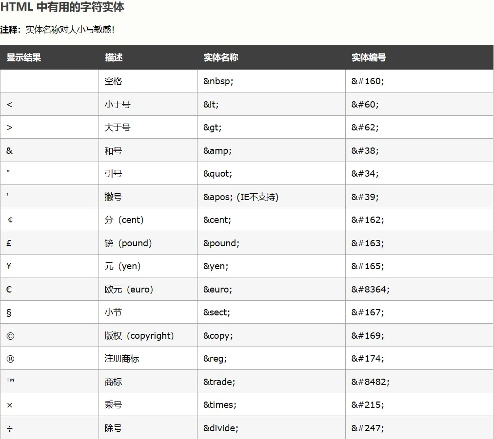
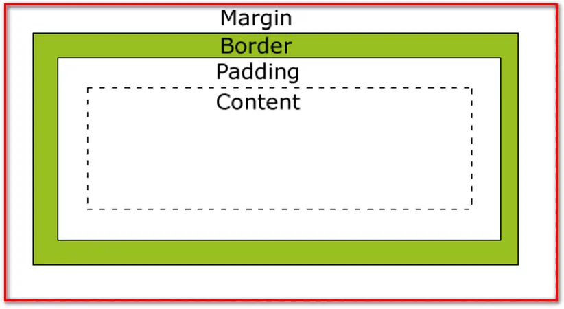

# 第二章 HTML&CSS

## 一、HTML 入门
### 1.1 HTML&CSS&JavaScript 的作用
- **HTML** (HyperText Markup Language)：超文本标记语言，用于创建网页的结构和内容
- **CSS** (Cascading Style Sheets)：层叠样式表，用于设置网页的外观和布局
- **JavaScript**：脚本语言，用于实现网页的交互和动态效果

这三种技术共同构成了现代网页开发的基础，它们之间的关系是：HTML 定义了网页的结构，CSS 美化了网页的外观，JavaScript 则赋予了网页交互能力。

::: tip 总结
HTML 用于构建网页结构，CSS 用于美化页面，JavaScript 用于控制页面行为
:::

###  1.2 什么是 HTML
- `HTML` 是 `HyperText Markup Language`（超文本标记语言）的缩写，是一种**用于创建网页的标准标记语言**
- **超文本**：指页面中可以包含图片、链接、音频、视频等非文字元素
- **标记语言**：使用特殊标记（标签）来描述网页内容的格式和结构
- 最新稳定版本：HTML5，提供了更多语义化标签和多媒体支持

### 1.3 HTML 基础结构
HTML 文档由一系列标签组成，这些标签按照一定的层次结构组织

```html
<!DOCTYPE html> <!-- 文档类型声明 -->
<html>         <!-- 根标签，整个HTML文档的容器 -->
    <head>     <!-- 头部，包含文档的元数据 -->
        <meta charset="UTF-8"> <!-- 设置字符编码 -->
        <title>Hello HTML</title> <!-- 设置页面标题 -->
    </head>
    <body>     <!-- 主体，包含页面的可见内容 -->
        <!-- 这是HTML注释 -->
        <h1>Hello World!</h1> <!-- 一级标题 -->
    </body>
</html>
```

- `<!DOCTYPE html>`：文档类型声明，告诉浏览器当前文档使用的 HTML 版本
- `<html>`：根标签，所有 HTML 元素都嵌套在其中
- `<head>`：头部标签，包含文档的元数据（如字符编码、标题等）
- `<body>`：主体标签，包含用户可以看到的内容
- `注释`：使用 `<!-- 注释内容 -->` 格式，不会在浏览器中显示

HTML5 还引入了一系列语义化标签，如 `<header>`、`<nav>`、`<main>`、`<section>`、`<article>`、`<footer>` 等，用于更清晰地描述网页结构。

### 1.4 HTML 入门程序
创建一个简单的 HTML 文件：

```html
<!DOCTYPE html>
<html lang="zh-CN">
<head>
    <meta charset="UTF-8">
    <meta name="viewport" content="width=device-width, initial-scale=1.0">
    <title>我的第一个HTML页面</title>
</head>
<body>
    <h1>欢迎来到HTML世界</h1>
    <p>这是一个段落。</p>
    <a href="https://www.atguigu.com">访问尚硅谷</a>
</body>
</html>
```

<!DOCTYPE html>
<html lang="zh-CN">
<head>
    <meta charset="UTF-8">
    <meta name="viewport" content="width=device-width, initial-scale=1.0">
    <title>我的第一个HTML页面</title>
</head>
<body>
    <h1>欢迎来到HTML世界</h1>
    <p>这是一个段落。</p>
    <a href="https://www.atguigu.com">访问尚硅谷</a>
</body>
</html>

- 使用文本编辑器（如记事本、VSCode 等）创建文件，保存为 `.html` 扩展名
- 使用浏览器打开该文件即可查看效果

### 1.5 HTML 基本概念
- **标签**：由尖括号包围的关键词，如 `<html>`、`<body>` 等
- **双标签**：有开始标签和结束标签，如 `<p>内容</p>`
- **单标签**：只有开始标签，没有结束标签，如 `<br>`、`` 等
- **属性**：提供有关 HTML 元素的额外信息，如 `<a href="url">链接文本</a>` 中的 `href` 属性
- **文本**：双标签中间的文字内容，包含空格和换行等结构
- **元素**：完整的 HTML 元素包括开始标签、属性、内容和结束标签（单标签除外）

### 1.6 HTML 语法规则
1. **根标签**：一个 HTML 文档有且只能有一个根标签，通常是 `<html>`
2. **标签闭合**：无论是双标签还是单标签都需要正确关闭
3. **正确嵌套**：标签可以嵌套，但不能交叉嵌套（如 `<p><strong></p></strong>` 是错误的）
4. **注释语法**：使用 `<!-- 注释内容 -->`，注释内容不会在浏览器中显示，注意注释不能嵌套
5. **属性值**：属性必须有值，值必须加引号（单引号或双引号均可），在 HTML5 中，当属性名和值相同时可以省略属性值
6. **引号使用**：HTML 中不严格区分字符串使用单引号还是双引号
7. **大小写规则**：HTML 标签和属性名称不区分大小写，但为了规范，建议使用小写，并且不要大小写混用
8. **自定义标签**：HTML 中不允许自定义标签名，强行自定义则无效

### 1.7 前端开发工具选择与配置
目前前端开发领域，Visual Studio Code (VSCode) 是使用最广泛的代码编辑器，而 WebStorm 则是一款功能强大的专业 IDE 选择。下面分别介绍这两款主流工具：

#### 1.7.1 Visual Studio Code (VSCode)
Visual Studio Code (VSCode) 是一款流行的代码编辑器，特别适合前端开发：

1. **下载安装**：从 [VSCode 官网](https://code.visualstudio.com/) 下载适合自己操作系统的安装包，按照提示安装
2. **安装插件**：推荐安装以下前端开发常用插件
    - `Live Server`：提供本地开发服务器，支持实时预览
    - `Prettier - Code formatter`：代码格式化工具
    - `HTML CSS Support`：HTML 和 CSS 智能提示
    - `Auto Rename Tag`：自动重命名配对的 HTML 标签
    - `Intellij IDEA Keybindings`：IDEA 快捷键支持
    - `Vetur`：VScode 中的 Vue 工具插件
    - `vscode-icons`：文件显示图标插件
    - `Vue 3 snipptes`：生成 VUE 模板插件
    - `Vue Official`：语言特征插件
3. **常用设置**：
    - 字体大小调整：在设置中搜索 "font size" 进行调整
    - 设置字体大小可以用滚轮控制：齿轮>设置>搜索 "Mouse Wheel Zoom"
    - 自动保存：在设置中搜索 "auto save"，选择 "afterDelay"
    - 文件图标主题：在设置中搜索 "icon theme" 进行选择
    - 设置左侧树缩进：齿轮>设置>搜索 "树缩进"
    - 设置文件夹折叠：齿轮>设置>搜索 "compact" 取消第一个勾选
4. **优势**：轻量级、启动速度快、内存占用小、插件生态丰富、完全免费

#### 1.7.2 WebStorm
对于喜欢功能更全面的 IDE 的开发者，JetBrains 公司的 [WebStorm](https://www.jetbrains.com.cn/webstorm/) 是一个专业选择：

1. **主要特性**：
    - 智能代码补全和重构功能
    - 内置版本控制支持
    - 强大的调试器
    - 集成的终端
    - 全面的代码导航功能
2. **优势**：功能更全面、开箱即用、专业级代码分析和重构工具
3. **注意事项**：收费软件、内存占用相对较大

#### 1.7.3 工具选择建议
- 如果你是前端开发新手或喜欢轻量级工具，VSCode 是最佳选择
- 如果你需要更全面的 IDE 功能并愿意为专业工具付费，WebStorm 值得考虑
- VSCode 通过丰富的插件可以实现接近专业 IDE 的大部分功能，是目前前端开发社区使用最广泛的工具
- WebStorm 特别适合大型项目开发，其代码重构和导航功能更为强大

### 1.8 HTML 常见标签
[w3school 在助文档](http://www.w3school.com.cn)

#### 1.8.1 标题标签 (h1-h6)
```html
<h1>一级标题</h1> <!-- 最重要的标题，一个页面通常只有一个h1 -->
<h2>二级标题</h2>
<h3>三级标题</h3>
<h4>四级标题</h4>
<h5>五级标题</h5>
<h6>六级标题</h6>
```

标题标签用于定义页面的标题层次结构，h1 级别最高，h6 级别最低。

#### 1.8.2 段落标签 (p)
```html
<p>这是一个段落。</p>
<p>这是另一个段落。</p>
```

段落标签用于定义文本段落，浏览器会自动在段落前后添加空白。

#### 1.8.3 换行与分隔线标签 (br/hr)
```html
<p>第一行<br>第二行</p> <!-- br标签用于换行 -->
<hr> <!-- hr标签用于创建分隔线 -->
```

- `<br>`：单标签，用于在不创建新段落的情况下换行
- `<hr>`：单标签，用于创建水平线，常用于分隔内容

#### 1.8.4 列表标签
**有序列表 (ol)**：

```html
<ol>
    <li>第一项</li>
    <li>第二项</li>
    <li>第三项</li>
</ol>
```

**无序列表 (ul)**：

```html
<ul>
    <li>苹果</li>
    <li>香蕉</li>
    <li>橙子</li>
</ul>
```

**嵌套列表**：

```html
<ul>
    <li>水果
        <ol>
            <li>苹果</li>
            <li>香蕉</li>
        </ol>
    </li>
    <li>蔬菜
        <ol>
            <li>西红柿</li>
            <li>黄瓜</li>
        </ol>
    </li>
</ul>
```

- `<ol>`：有序列表，默认使用数字编号
- `<ul>`：无序列表，默认使用圆点符号
- `<li>`：列表项，用于表示列表中的每一项
- 可以通过 CSS 的 `list-style-type` 属性自定义列表项的标记样式

#### 1.8.5 超链接标签 (a)
```html
<a href="https://www.atguigu.com">访问尚硅谷</a>
<a href="https://www.atguigu.com" target="_blank">在新窗口打开尚硅谷</a>
<a href="#section1">跳转到页面中的某个部分</a>

<a href="01html的基本结构.html" target="_blank">相对路径本地资源连接</a> <br>
<a href="/day01-html/01html的基本结构.html" target="_self">绝对路径本地资源连接</a> <br>
<a href="https://www.atguigu.com" target="_blank">外部资源链接</a> <br>
```

- `href` 属性：指定链接的目标地址
  - 可以使用绝对路径，以`/`开头，始终以一个固定路径作为基准路径作为出发点
  - 也可以使用相对路径，不以`/`开头，以当前文件所在路径为出发点
  - 也可以定义完整的 URL
- `target` 属性：指定链接的打开方式，`_blank` 表示在新窗口打开
  - `_blank` 表示在新窗口中打开目标资源
  - `_self` 表示在当前窗口中打开目标资源
- 链接可以指向外部网站、内部页面或页面内的特定部分

### 1.9 多媒体标签
#### 1.9.1 图片标签 (img)
图片可以通过两种主要方式引入：HTML 的``标签和 Markdown 的图片语法。这两种方式适用于不同的场景：

**方式一：HTML 的``标签（在 HTML 文档中使用）**
```html

```

- `src` 属性：指定图片的路径（必需）
- `alt` 属性：指定图片无法显示时的替代文本（提高可访问性）
- `width` 和 `height` 属性：指定图片的宽度和高度
- 建议同时设置宽度和高度，以避免页面布局在图片加载过程中发生变化
- 还可以添加其他属性如`title`（鼠标悬停时显示的提示文本）、`loading`（控制图片加载行为）等

**方式二：Markdown 的图片语法（在 Markdown 文档中使用）**
```markdown

```

- `!` 感叹号表示这是一个图片
- `[]` 方括号内是图片的替代文本（相当于 HTML 的`alt`属性）
- `()` 圆括号内是图片的路径
- 引号内的部分是可选的标题文本（相当于 HTML 的`title`属性）
- Markdown 的图片语法最终会被解析为 HTML 的``标签

**注意事项：**
- 在纯 HTML 开发中，应使用``标签
- 在 Markdown 文档中（如 README、博客文章等），使用 Markdown 的图片语法更简洁
- 路径问题：两种方式都支持相对路径和绝对路径，但相对路径的基准目录可能不同（取决于文档所在位置）

#### 1.9.2 音频标签 (audio)
HTML5 提供了两种主要的音频引入方式，这两种方式都是正确的，但各有优势：

**方式一：使用 source 标签（推荐方式）**
```html
<audio controls>
    <source src="audio/music.mp3" type="audio/mpeg">
    您的浏览器不支持音频播放。
</audio>
```

**方式二：直接在 audio 标签上使用 src 属性**
```html
<audio src="audio/music.mp3" controls="controls" autoplay="autoplay" loop="loop"></audio>
```

**两种方式的说明：**
- `controls` 属性：显示音频控件（播放/暂停按钮等），可以简化为`controls`或完整写为`controls="controls"`
- `<source>` 标签方式的优势：可以提供多个不同格式的音频文件（添加多个 source 标签），浏览器会选择第一个支持的格式播放
- `src` 属性直接指定方式：语法更简洁，但不支持多格式回退
- `autoplay` 属性：设置音频自动播放，但现代浏览器通常会阻止自动播放音频以提升用户体验
- `loop` 属性：设置音频循环播放
- 包含降级内容（如"您的浏览器不支持音频播放"）可以提高页面的兼容性
- 注意：在 HTML5 中，建议使用完整的闭合标签`</audio>`而不是自闭合标签`/>`

#### 1.9.3 视频标签 (video)
HTML5 提供了两种主要的视频引入方式，这两种方式都是正确的，但各有优势：

**方式一：使用 source 标签（推荐方式）**
```html
<video controls width="400" height="300">
    <source src="video/movie.mp4" type="video/mp4">
    您的浏览器不支持视频播放。
</video>
```

**方式二：直接在 video 标签上使用 src 属性**
```html
<video src="video/movie.mp4" controls="controls" autoplay="autoplay" loop="loop" width="400px">
    您的浏览器不支持视频播放。
</video>
```

**两种方式的说明：**
- `controls` 属性：显示视频控件（播放/暂停按钮、进度条等），可以简化为`controls`或完整写为`controls="controls"`
- `<source>` 标签方式的优势：可以提供多个不同格式的视频文件（添加多个 source 标签），浏览器会选择第一个支持的格式播放
- `src` 属性直接指定方式：语法更简洁，但不支持多格式回退
- `autoplay` 属性：设置视频自动播放，但现代浏览器通常会阻止自动播放视频以提升用户体验
- `loop` 属性：设置视频循环播放
- `width` 和 `height` 属性：指定视频播放器的宽度和高度
- 包含降级内容（如"您的浏览器不支持视频播放"）可以提高页面的兼容性
- 注意：在 HTML5 中，建议使用完整的闭合标签`</video>`而不是自闭合标签`/>`

### 1.10 表格标签(重点)
表格用于展示二维数据，HTML 表格由多个标签组成：

```html
<table border="1" width="500">
    <thead> <!-- 表头部分 -->
        <tr> <!-- 行 -->
            <th>姓名</th> <!-- 表头单元格 -->
            <th>年龄</th>
            <th>成绩</th>
        </tr>
    </thead>
    <tbody> <!-- 表格主体 -->
        <tr>
            <td>张三</td> <!-- 普通单元格 -->
            <td>20</td>
            <td>85</td>
        </tr>
        <tr>
            <td>李四</td>
            <td>22</td>
            <td>90</td>
        </tr>
    </tbody>
    <tfoot> <!-- 表格底部 -->
        <tr>
            <td colspan="2">平均分</td> <!-- colspan属性：跨列 -->
            <td>87.5</td>
        </tr>
    </tfoot>
</table>
```

<table border="1" width="500">
    <thead> <!-- 表头部分 -->
        <tr> <!-- 行 -->
            <th>姓名</th> <!-- 表头单元格 -->
            <th>年龄</th>
            <th>成绩</th>
        </tr>
    </thead>
    <tbody> <!-- 表格主体 -->
        <tr>
            <td>张三</td> <!-- 普通单元格 -->
            <td>20</td>
            <td>85</td>
        </tr>
        <tr>
            <td>李四</td>
            <td>22</td>
            <td>90</td>
        </tr>
    </tbody>
    <tfoot> <!-- 表格底部 -->
        <tr>
            <td colspan="2">平均分</td> <!-- colspan属性：跨列 -->
            <td>87.5</td>
        </tr>
    </tfoot>
</table>

- `<table>`：定义表格
- `<thead>`：定义表格的表头
- `<tbody>`：定义表格的主体
- `<tfoot>`：定义表格的底部
- `<tr>`：定义表格的行
- `<th>`：定义表头单元格（默认加粗居中）
- `<td>`：定义普通单元格
- `border` 属性：设置表格边框
- `width` 属性：设置表格宽度
- `colspan` 属性：指定单元格横跨的列数
- `rowspan` 属性：指定单元格纵跨的行数

**单元格跨行与跨列**

```html
<table border="1" width="400">
    <tr>
        <td rowspan="2">1-1</td> <!-- 跨行，占据2行 -->
        <td>1-2</td>
        <td>1-3</td>
    </tr>
    <tr>
        <td>2-2</td>
        <td>2-3</td>
    </tr>
    <tr>
        <td colspan="3">3-1（跨3列）</td> <!-- 跨列，占据3列 -->
    </tr>
</table>
```

<table border="1" width="400">
    <tr>
        <td rowspan="2">1-1</td> <!-- 跨行，占据2行 -->
        <td>1-2</td>
        <td>1-3</td>
    </tr>
    <tr>
        <td>2-2</td>
        <td>2-3</td>
    </tr>
    <tr>
        <td colspan="3">3-1（跨3列）</td> <!-- 跨列，占据3列 -->
    </tr>
</table>

- `rowspan="2"` 表示该单元格横跨 2 行
- `colspan="3"` 表示该单元格横跨 3 列
- 使用跨行跨列可以创建复杂的表格布局

### 1.11 表单标签(重点)
表单用于收集用户输入的数据并提交给服务器：

```html
<form action="/submit" method="post">
    <!-- 表单内容 -->
</form>

<form action="https://www.atguigu.com" method="get">
    用户名 <input type="text" name="username"/> <br>
    密&nbsp;&nbsp;&nbsp;码 <input type="password" name="password"/> <br>
    <input type="submit" value="登录"/>
    <input type="reset" value="重置"/>
</form>
```

<form action="" method="get">
    用户名 <input type="text" name="username"/> <br>
    密&nbsp;&nbsp;&nbsp;码 <input type="password" name="password"/> <br>
    <input type="submit" value="登录"/>
    <input type="reset" value="重置"/>
</form>

- `<form>`：定义表单
- `action` 属性：指定表单提交的目标 URL
- `method` 属性：指定表单提交的 HTTP 方法（主要有 GET 和 POST 两种）
    - **GET**：数据会附加在 URL 后面，适合提交少量、非敏感的数据
    - **POST**：数据会在请求体中发送，适合提交大量、敏感的数据

**input 标签**

`input` 标签是最常用的表单元素，通过 `type` 属性可以创建不同类型的输入字段：

```html
<!-- 单行文本输入框 -->
<input type="text" name="username" placeholder="请输入用户名">

<!-- 密码输入框 -->
<input type="password" name="password" placeholder="请输入密码">

<!-- 提交按钮 -->
<input type="submit" value="提交">

<!-- 重置按钮 -->
<input type="reset" value="重置">
```

<!-- 单行文本输入框 -->
<input type="text" name="username" placeholder="请输入用户名">

<!-- 密码输入框 -->
<input type="password" name="password" placeholder="请输入密码">

<!-- 提交按钮 -->
<input type="submit" value="提交">

<!-- 重置按钮 -->
<input type="reset" value="重置">

- `type` 属性：指定输入字段的类型
- `name` 属性：指定输入字段的名称，用于表单提交时标识数据
- `value` 属性：指定输入字段的初始值
- `placeholder` 属性：指定输入字段的提示文本
- `readonly`：设置文本框只读，提交时会携带
- `disabled`：设置文本框不可修改，提交时不携带

### 1.12 常见表单项标签(重点)
#### 1.12.1 单行文本框 (text)
```html
<input type="text" name="username" placeholder="请输入用户名" maxlength="20">
```

<input type="text" name="username" placeholder="请输入用户名" maxlength="20">

- `maxlength` 属性：限制输入的最大字符数

#### 1.12.2 密码框 (password)
```html
<input type="password" name="password" placeholder="请输入密码">
```

<input type="password" name="password" placeholder="请输入密码">

- 输入的内容会显示为密码字符（通常是星号或圆点）

#### 1.12.3 单选框 (radio)
```html
<input type="radio" name="gender" value="male" checked>男
<input type="radio" name="gender" value="female">女
```

<input type="radio" name="gender" value="male" checked>男
<input type="radio" name="gender" value="female">女

- 同一组单选框必须使用相同的 `name` 属性
- `checked` 属性：设置默认选中

#### 1.12.4 复选框 (checkbox)
```html
<input type="checkbox" name="hobby" value="reading">阅读
<input type="checkbox" name="hobby" value="music">音乐
<input type="checkbox" name="hobby" value="sports">运动
```

<input type="checkbox" name="hobby" value="reading">阅读
<input type="checkbox" name="hobby" value="music">音乐
<input type="checkbox" name="hobby" value="sports">运动

- 可以选择多个选项
- 同一组复选框通常使用相同的 `name` 属性

#### 1.12.5 下拉框 (select/option)
```html
<select name="city">
    <option value="">请选择城市</option>
    <option value="beijing">北京</option>
    <option value="shanghai" selected>上海</option>
    <option value="guangzhou">广州</option>
</select>
```

<select name="city">
    <option value="">请选择城市</option>
    <option value="beijing">北京</option>
    <option value="shanghai" selected>上海</option>
    <option value="guangzhou">广州</option>
</select>

- `<select>`：定义下拉选择框
- `<option>`：定义下拉选项
- `selected` 属性：设置默认选中的选项

#### 1.12.6 按钮 (button)
```html
<!-- 提交按钮 -->
<input type="submit" value="提交">

<!-- 重置按钮 -->
<input type="reset" value="重置">

<!-- 普通按钮 -->
<input type="button" value="点击我" onclick="alert('Hello!')">

<!-- button标签 -->
<button type="submit">提交</button>
<button type="reset">重置</button>
<button type="button">普通按钮</button>
```

<!-- 提交按钮 -->
<input type="submit" value="提交">

<!-- 重置按钮 -->
<input type="reset" value="重置">

<!-- 普通按钮 -->
<input type="button" value="点击我" onclick="alert('Hello!')">

<!-- button标签 -->
<button type="submit">提交</button>
<button type="reset">重置</button>
<button type="button">普通按钮</button>

- 除了使用 `input` 标签创建按钮外，还可以使用 `button` 标签
- `button` 标签提供了更灵活的内容（可以包含文本、图片等）

#### 1.12.7 隐藏域 (hidden)
```html
<input type="hidden" name="id" value="123">
```

- 隐藏域不会在页面上显示，但会随表单一起提交
- 通常用于存储页面需要但用户不需要看到的数据

#### 1.12.8 多行文本框 (textarea)
```html
<textarea name="description" rows="4" cols="50" placeholder="请输入描述信息"></textarea>
```

<textarea name="description" rows="4" cols="50" placeholder="请输入描述信息"></textarea>

- `<textarea>`：定义多行文本输入框
- `rows` 属性：指定可见的行数
- `cols` 属性：指定可见的列数

#### 1.12.9 文件上传 (file)
```html
<input type="file" name="avatar">

<!-- 允许多文件上传 -->
<input type="file" name="photos" multiple>
```

<input type="file" name="photos" multiple>

- `multiple` 属性：允许选择多个文件
- 当表单包含文件上传时，需要设置表单的 `enctype` 属性为 `multipart/form-data`

### 1.13 布局相关标签
#### 1.13.1 div 标签
```html
<div style="width: 500px; height: 400px; background-color: cadetblue;">
    <div style="width: 400px; height: 100px; background-color: beige; margin: 10px auto;">
        <span style="color: blueviolet;">页面开头部分</span>
    </div>
    <div style="width: 400px; height: 100px; background-color: blanchedalmond; margin: 10px auto;">
        <span style="color: blueviolet;">页面中间部分</span>
    </div>
    <div style="width: 400px; height: 100px; background-color: burlywood; margin: 10px auto;">
        <span style="color: blueviolet;">页面结尾部分</span>
    </div>
</div>
```

<div style="width: 500px; height: 400px; background-color: cadetblue;">
    <div style="width: 400px; height: 100px; background-color: beige; margin: 10px auto;">
        <span style="color: blueviolet;">页面开头部分</span>
    </div> 
    <div style="width: 400px; height: 100px; background-color: blanchedalmond; margin: 10px auto;">
        <span style="color: blueviolet;">页面中间部分</span>
    </div> 
    <div style="width: 400px; height: 100px; background-color: burlywood; margin: 10px auto;">
        <span style="color: blueviolet;">页面结尾部分</span>
    </div> 
</div>

- `<div>` 标签（块级元素）：主要用于划分页面结构，进行页面布局
- 默认情况下，每个 div 元素会独占一行
- 常与 CSS 结合使用，实现复杂的页面布局

#### 1.13.2 span 标签
```html
<p>这是一段<span style="color: blue; font-weight: bold;">重要的</span>文本。</p>
```

<p>这是一段<span style="color: blue; font-weight: bold;">重要的</span>文本。</p>

- `<span>` 标签（行内元素）：主要用于对文本的一部分进行样式化
- 不会独占一行，只会占据内容所需的宽度
- 常用于在段落中高亮显示某些文本

#### 1.13.3 HTML5 语义化布局标签

HTML5 引入了一系列语义化标签，用于更清晰地描述页面结构：

```html
<header> <!-- 头部区域 -->
    <nav> <!-- 导航菜单 -->
        <!-- 导航链接 -->
    </nav>
</header>
<main> <!-- 主要内容区域 -->
    <section> <!-- 内容区块 -->
        <article> <!-- 独立的内容单元 -->
            <!-- 文章内容 -->
        </article>
    </section>
</main>
<footer> <!-- 底部区域 -->
    <!-- 版权信息等 -->
</footer>
```

- `<header>`：定义页面或区域的头部
- `<nav>`：定义导航链接区域
- `<main>`：定义页面的主要内容
- `<section>`：定义文档中的节或区域
- `<article>`：定义独立的、完整的内容（如文章、博客等）
- `<footer>`：定义页面或区域的底部

使用语义化标签可以提高代码的可读性和可维护性，同时有助于 SEO（搜索引擎优化）和无障碍访问。

### 1.14 特殊字符
在 HTML 中，某些字符具有特殊含义（如 `<`、`>`、`&` 等），需要使用特殊的代码（实体名称或实体编号）来表示：




示例：

```html
&lt;span&gt;  <br> 
&lt;a href="https://www.atguigu.com"&gt;尚&nbsp;硅&nbsp;谷&lt;/a&gt; <br> 
&amp;amp;
```

&lt;span&gt;  <br>
&lt;a href="https://www.atguigu.com"&gt;尚&nbsp;硅&nbsp;谷&lt;/a&gt; <br>
&amp;amp;

使用特殊字符可以确保在 HTML 文档中正确显示这些字符，避免浏览器将它们解释为 HTML 代码。

## 二、CSS 的使用
CSS（Cascading Style Sheets）层叠样式表，用于控制网页的外观和布局

CSS 能够对网页中元素位置的排版进行像素级精确控制，支持几乎所有的字体字号样式，拥有对网页对象和模型样式编辑的能力。简单来说，CSS 的主要作用是美化页面。

### 2.1 CSS 引入方式
#### 2.1.1 行内式
行内式是通过元素的 `style` 属性直接定义样式，样式语法为`样式名:样式值; 样式名:样式值;`：

```html
<input 
    type="button" 
    value="按钮"
    style="
        display: block;
        width: 60px; 
        height: 40px; 
        background-color: rgb(140, 235, 100); 
        color: white;
        border: 3px solid green;
        font-size: 22px;
        font-family: '隶书';
        line-height: 30px;
        border-radius: 5px;
        "
/>
```

<input 
    type="button" 
    value="按钮"
    style="
        display: block;
        width: 60px; 
        height: 40px; 
        background-color: rgb(140, 235, 100); 
        color: white;
        border: 3px solid green;
        font-size: 22px;
        font-family: '隶书';
        line-height: 30px;
        border-radius: 5px;
        "
/>

**缺点**：
- HTML 代码和 CSS 样式代码交织在一起，增加阅读难度和维护成本
- CSS 样式代码仅对当前元素有效，代码重复量高，复用度低
- 不便于维护和统一修改

**适用场景**：仅需要为个别元素添加特殊样式的情况

#### 2.1.2 内嵌式
内嵌式是将 CSS 代码写在 HTML 文档的 `<head>` 标签内，使用 `<style>` 标签包裹：

```html
<head>
    <meta charset="UTF-8">
    <style>
        /* 通过选择器确定样式的作用范围 */
        input {
            display: block;
            width: 80px; 
            height: 40px; 
            background-color: rgb(140, 235, 100); 
            color: white;
            border: 3px solid green;
            font-size: 22px;
            font-family: '隶书';
            line-height: 30px;
            border-radius: 5px;
        }
    </style>
</head>
<body>
    <input type="button" value="按钮1"/>
    <input type="button" value="按钮2"/>
    <input type="button" value="按钮3"/>
    <input type="button" value="按钮4"/>
</body>
```

**说明**：
- 内嵌式样式需要在 `head` 标签中，通过一对 `style` 标签定义 CSS 样式
- CSS 样式的作用范围控制要依赖选择器
- CSS 的样式代码中注释的方式为 `/* 注释内容 */`
- 内嵌式虽然对样式代码做了抽取，但是 CSS 代码仍然在 HTML 文件中
- 内嵌样式仅仅能作用于当前文件，代码复用度还是不够，不利于网站风格统一

**适用场景**：单页面应用或需要为特定页面添加独特样式的情况

#### 2.1.3 连接式/外部样式表
连接式是将 CSS 代码单独放在一个 `.css` 文件中，然后在 HTML 文件中通过 `<link>` 标签引入：

1. 创建外部 CSS 文件（例如 `css/buttons.css`）
2. 在 HTML 文件的 `<head>` 标签中引入 CSS 文件：

```html
<head>
    <meta charset="UTF-8">
    <link href="css/buttons.css" rel="stylesheet" type="text/css"/>
</head>
<body>
    <input type="button" value="按钮1"/>
    <input type="button" value="按钮2"/>
    <input type="button" value="按钮3"/>
    <input type="button" value="按钮4"/>
</body>
```

**说明**：
- CSS 样式代码从 HTML 文件中剥离，利于代码的维护
- CSS 样式文件可以被多个不同的 HTML 引入，利于网站风格统一
- 可以充分利用浏览器的缓存机制，提高页面加载速度

**适用场景**：多页面网站，需要统一风格和便于维护的情况

**推荐实践**：在实际开发中，通常推荐使用外部样式表的方式引入 CSS，这样可以更好地分离结构和样式，提高代码的可维护性和复用性。

### 2.2 CSS 选择器
CSS 选择器用于指定 CSS 规则作用于哪些 HTML 元素。常见的 CSS 选择器包括：

#### 2.2.1 元素选择器
元素选择器根据 HTML 标签名称来选择元素：

```html
<head>
    <meta charset="UTF-8">
   <style>
    input {
        display: block;
        width: 80px; 
        height: 40px; 
        background-color: rgb(140, 235, 100); 
        color: white;
        border: 3px solid green;
        font-size: 22px;
        font-family: '隶书';
        line-height: 30px;
        border-radius: 5px;
    }
   </style>
</head>
<body>
    <input type="button" value="按钮1"/>
    <input type="button" value="按钮2"/>
    <input type="button" value="按钮3"/>
    <input type="button" value="按钮4"/>
    <button>按钮5</button> <!-- 不会应用上述样式 -->
</body>
```

**说明**：
- 根据标签名确定样式的作用范围
- 语法为 `元素名 {CSS样式}`
- 样式只能作用到同名标签上，其他标签不可用
- 相同的标签未必需要相同的样式，会造成样式的作用范围太大

#### 2.2.2 id 选择器
id 选择器根据元素的 `id` 属性值来选择元素：

```html
<head>
    <meta charset="UTF-8">
   <style>
    #btn1 {
        display: block;
        width: 80px; 
        height: 40px; 
        background-color: rgb(140, 235, 100); 
        color: white;
        border: 3px solid green;
        font-size: 22px;
        font-family: '隶书';
        line-height: 30px;
        border-radius: 5px;
    }
   </style>
</head>
<body>
    <input id="btn1" type="button" value="按钮1"/>
    <input id="btn2" type="button" value="按钮2"/>
    <input id="btn3" type="button" value="按钮3"/>
    <input id="btn4" type="button" value="按钮4"/>
    <button id="btn5">按钮5</button>
</body>
```

**说明**：
- 根据元素 `id` 属性的值确定样式的作用范围
- 语法为 `#id值 {CSS样式}`
- `id` 属性的值在页面上具有唯一性，所以 id 选择器也只能影响一个元素的样式
- 因为 id 属性值不够灵活，所以在 CSS 中，使用该选择器的情况较少
- 通常用于需要通过 JavaScript 进行精确控制的元素

#### 2.2.3 class 选择器
class 选择器根据元素的 `class` 属性值来选择元素：

```html
<head>
    <meta charset="UTF-8">
   <style>
    .shapeClass {
        display: block;
        width: 80px; 
        height: 40px; 
        border-radius: 5px;
    }
    .colorClass{
        background-color: rgb(140, 235, 100); 
        color: white;
        border: 3px solid green;
    }
    .fontClass {
        font-size: 22px;
        font-family: '隶书';
        line-height: 30px;
    }
   </style>
</head>
<body>
    <input class="shapeClass colorClass fontClass" type="button" value="按钮1"/>
    <input class="shapeClass colorClass" type="button" value="按钮2"/>
    <input class="colorClass fontClass" type="button" value="按钮3"/>
    <input class="fontClass" type="button" value="按钮4"/>
    <button class="shapeClass colorClass fontClass">按钮5</button>
</body>
```

**说明**：
- 根据元素 `class` 属性的值确定样式的作用范围
- 语法为 `.class值 {CSS样式}`
- `class` 属性值可以有一个，也可以有多个（多个 class 值之间用空格分隔）
- 多个不同的标签也可以使用相同的 class 值
- 多个选择器的样式可以在同一个元素上进行叠加
- 因为 class 选择器非常灵活，所以在 CSS 中，使用该选择器的情况较多
- 是实际开发中最常用的选择器类型

#### 2.2.4 其他常用选择器
除了上述三种基本选择器外，还有一些常用的复合选择器：

1. **后代选择器**：选择某个元素的所有后代元素
   ```css
   div p { /* 选择div元素内的所有p元素 */
       color: blue;
   }
   ```

2. **子元素选择器**：选择某个元素的直接子元素
   ```css
   div > p { /* 选择div元素的直接子元素p */
       color: red;
   }
   ```

3. **相邻兄弟选择器**：选择某个元素之后紧接的兄弟元素
   ```css
   h1 + p { /* 选择h1元素之后紧接的p元素 */
       margin-top: 0;
   }
   ```

4. **属性选择器**：根据元素的属性来选择元素
   ```css
   input[type="text"] { /* 选择type属性值为text的input元素 */
       width: 200px;
   }
   ```

5. **伪类选择器**：选择处于特定状态的元素
   ```css
   a:hover { /* 选择鼠标悬停的a元素 */
       color: red;
   }
   input:focus { /* 选择获得焦点的input元素 */
       border: 2px solid blue;
   }
   ```

6. **伪元素选择器**：选择元素的特定部分
   ```css
   p::first-line { /* 选择p元素的第一行 */
       font-weight: bold;
   }
   ::before { /* 在元素内容前插入内容 */
       content: "前缀 ";
   }
   ```

### 2.3 CSS 浮动
#### 2.3.1 什么是浮动
CSS 的 Float（浮动）使元素脱离文档流，按照指定的方向（左或右）移动，直到它的外边缘碰到包含框或另一个浮动框的边框为止。

- 浮动设计的初衷是为了解决文字环绕图片问题
- 浮动后元素不会将文字挡住，这是设计初衷
- 文档流是文档中可显示对象在排列时所占用的位置/空间
- 脱离文档流就是元素在页面中不占位置了

#### 2.3.2 浮动原理
1. 当把框 1 向右浮动时，它脱离文档流并且向右移动，直到它的右边缘碰到包含框的右边缘
2. 当框 1 向左浮动时，它脱离文档流并且向左移动，直到它的左边缘碰到包含框的左边缘。因为它不再处于文档流中，所以它不占据空间，实际上覆盖住了框 2，使框 2 从视图中消失。
3. 如果把所有三个框都向左移动，那么框 1 向左浮动直到碰到包含框，另外两个框向左浮动直到碰到前一个浮动框。
4. 如果包含框太窄，无法容纳水平排列的三个浮动元素，那么其它浮动块向下移动，直到有足够的空间。如果浮动元素的高度不同，那么当它们向下移动时可能被其它浮动元素"卡住"

#### 2.3.3 浮动的语法
```css
float: none | left | right;
```

- `none`：默认值，元素不浮动
- `left`：元素向左浮动
- `right`：元素向右浮动

#### 2.3.4 浮动的示例
```html
<head>
    <meta charset="UTF-8">
   <style>
    .outerDiv {
        width: 500px;
        height: 300px;
        border: 1px solid green;
        background-color: rgb(230, 224, 224);
    }
    .innerDiv{
        width: 100px;
        height: 100px;
        border: 1px solid blue;
        float: left;
    }
    .d1{
        background-color: greenyellow;
        /* float: right; */
    }
    .d2{
        background-color: rgb(79, 230, 124);
    }
    .d3{
        background-color: rgb(26, 165, 208);
    }
   </style>
</head>
<body>
   <div class="outerDiv">
        <div class="innerDiv d1">框1</div>
        <div class="innerDiv d2">框2</div>
        <div class="innerDiv d3">框3</div>
   </div>
</body>
```

<head>
    <meta charset="UTF-8">
   <style>
    .outerDiv {
        width: 500px;
        height: 300px;
        border: 1px solid green;
        background-color: rgb(230, 224, 224);
    }
    .innerDiv{
        width: 100px;
        height: 100px;
        border: 1px solid blue;
        float: left;
    }
    .d1{
        background-color: greenyellow;
        /* float: right; */
    }
    .d2{
        background-color: rgb(79, 230, 124);
    }
    .d3{
        background-color: rgb(26, 165, 208);
    }
   </style>
</head>
<body>
   <div class="outerDiv">
        <div class="innerDiv d1">框1</div>
        <div class="innerDiv d2">框2</div>
        <div class="innerDiv d3">框3</div>
   </div>
</body>

#### 2.3.5 清除浮动
浮动元素会脱离文档流，可能会导致父元素高度塌陷等问题。常用的清除浮动方法有：

1. **使用 clear 属性**：在浮动元素后添加一个空元素，并设置`clear: both;`
   ```html
   <div class="outerDiv">
       <div class="innerDiv d1">框1</div>
       <div class="innerDiv d2">框2</div>
       <div class="innerDiv d3">框3</div>
       <div style="clear: both;"></div> <!-- 清除浮动 -->
   </div>
   ```

2. **使用 overflow 属性**：给父元素设置`overflow: hidden;`或`overflow: auto;`
   ```css
   .outerDiv {
       width: 500px;
       border: 1px solid green;
       background-color: rgb(230, 224, 224);
       overflow: hidden; /* 清除浮动 */
   }
   ```

3. **使用伪元素**：通过 CSS 伪元素清除浮动（推荐方法）
   ```css
   .outerDiv::after {
       content: "";
       display: block;
       clear: both;
   }
   ```

### 2.4 CSS 定位
#### 2.4.1 什么是定位
CSS 的 position 属性用于指定元素的定位类型，定义了建立元素布局所用的定位机制。任何元素都可以定位，不过绝对或固定元素会生成一个块级框，而不论该元素本身是什么类型。相对定位元素会相对于它在正常流中的默认位置偏移。

元素可以使用的顶部（top）、底部（bottom）、左侧（left）和右侧（right）属性定位。然而，这些属性无法工作，除非是先设定 position 属性。它们也有不同的工作方式，这取决于定位方法。

#### 2.4.2 定位类型
```css
position: static | relative | absolute | fixed | sticky;
```

- `static`：静态定位（默认值）
- `relative`：相对定位
- `absolute`：绝对定位
- `fixed`：固定定位
- `sticky`：粘性定位（CSS3 新增）

#### 2.4.3 静态定位 (static)

```html
<head>
    <meta charset="UTF-8">
    <style>
        .innerDiv{
            width: 100px;
            height: 100px;
        }
        .d1{
            background-color: rgb(166, 247, 46);
            position: static; /* 默认值，可以省略 */
        }
        .d2{
            background-color: rgb(79, 230, 124);
        }
        .d3{
            background-color: rgb(26, 165, 208);
        }
    </style>
</head>
<body>
    <div class="innerDiv d1">框1</div>
    <div class="innerDiv d2">框2</div>
    <div class="innerDiv d3">框3</div>
</body>
```

**说明**：
- 不设置 position 属性时的默认值就是 static，静态定位
- 元素遵循正常的文档流，没有定位
- 块级元素垂直排列，行内元素水平排列
- top、bottom、left、right 属性对静态定位的元素无效

#### 2.4.4 绝对定位 (absolute)
```html
<head>
    <meta charset="UTF-8">
    <style>
        .innerDiv{
            width: 100px;
            height: 100px;
        }
        .d1{
            background-color: rgb(166, 247, 46);
            position: absolute;
            left: 300px;
            top: 100px;
        }
        .d2{
            background-color: rgb(79, 230, 124);
        }
        .d3{
            background-color: rgb(26, 165, 208);
        }
    </style>
</head>
<body>
    <div class="innerDiv d1">框1</div>
    <div class="innerDiv d2">框2</div>
    <div class="innerDiv d3">框3</div>
</body>
```

**说明**：
- 通过 top、left、right、bottom 指定元素在页面上的固定位置
- 元素会脱离文档流，不再占据原来的位置
- 绝对定位的元素会相对于最近的已定位（非 static）祖先元素进行定位
- 如果没有已定位的祖先元素，则相对于浏览器窗口进行定位
- 常用于创建弹出菜单、模态框等元素

#### 2.4.5 相对定位 (relative)
```html
<head>
    <meta charset="UTF-8">
    <style>
        .innerDiv{
            width: 100px;
            height: 100px;
        }
        .d1{
            background-color: rgb(166, 247, 46);
            position: relative;
            left: 30px;
            top: 30px;
        }
        .d2{
            background-color: rgb(79, 230, 124);
        }
        .d3{
            background-color: rgb(26, 165, 208);
        }
    </style>
</head>
<body>
    <div class="innerDiv d1">框1</div>
    <div class="innerDiv d2">框2</div>
    <div class="innerDiv d3">框3</div>
</body>
```

**说明**：
- 相对于元素自己原来的位置进行定位
- 元素不会脱离文档流，仍然保留原来的占位
- 其他元素不会移动到该位置
- 常用于微调元素位置或作为绝对定位元素的参考容器

#### 2.4.6 固定定位 (fixed)
```html
<head>
    <meta charset="UTF-8">
    <style>
        .innerDiv{
            width: 100px;
            height: 100px;
        }
        .d1{
            background-color: rgb(166, 247, 46);
            position: fixed;
            right: 30px;
            top: 30px;
        }
        .d2{
            background-color: rgb(79, 230, 124);
        }
        .d3{
            background-color: rgb(26, 165, 208);
        }
    </style>
</head>
<body>
    <div class="innerDiv d1">框1</div>
    <div class="innerDiv d2">框2</div>
    <div class="innerDiv d3">框3</div>
    <!-- 此处省略大量内容，用于测试滚动效果 -->
</body>
```

**说明**：
- 元素始终固定在浏览器窗口的某个位置，不会随着页面的滚动而移动
- 元素会脱离文档流，不再占据原来的位置
- 常用于创建固定的导航栏、回到顶部按钮等元素
- 固定定位的元素总是相对于浏览器窗口进行定位

#### 2.4.7 粘性定位 (sticky)
粘性定位是 CSS3 新增的定位方式，它结合了相对定位和固定定位的特点：

```css
.sticky-nav {
    position: sticky;
    top: 0;
    background-color: white;
    z-index: 100;
}
```

**说明**：
- 元素在正常文档流中滚动，当滚动到指定位置时，会固定在该位置
- 粘性定位的元素会根据滚动位置在相对定位和固定定位之间切换
- 常用于创建滚动时固定的标题栏、导航栏等
- 需要设置 top、bottom、left 或 right 属性才能生效

### 2.5 CSS 盒子模型
#### 2.5.1 什么是盒子模型
所有 HTML 元素可以看作盒子，在 CSS 中，"box model"（盒子模型）这一术语是用来设计和布局时使用的。CSS 盒模型本质上是一个盒子，封装周围的 HTML 元素，它包括：边距（margin）、边框（border）、填充（padding）和实际内容（content）。



**各部分说明**：
- **Content(内容)**：盒子的内容，显示文本和图像
- **Padding(内边距)**：清除内容周围的区域，内边距是透明的
- **Border(边框)**：围绕在内边距和内容外的边框
- **Margin(外边距)**：清除边框外的区域，外边距是透明的

#### 2.5.2 盒子模型的尺寸计算

一个元素的总宽度 = width + left padding + right padding + left border + right border + left margin + right margin

一个元素的总高度 = height + top padding + bottom padding + top border + bottom border + top margin + bottom margin

#### 2.5.3 代码示例
```html
<head>
    <meta charset="UTF-8">
   <style>
    .outerDiv {
        width: 800px;
        height: 300px;
        border: 1px solid green;
        background-color: rgb(230, 224, 224);
        margin: 0px auto;
    }
    .innerDiv{
        width: 100px;
        height: 100px;
        border: 1px solid blue;
        float: left;
        /* margin-top: 10px;
        margin-right: 20px;
        margin-bottom: 30px;
        margin-left: 40px; */
        margin: 10px 20px 30px 40px; /* 上、右、下、左 */
    }
    .d1{
        background-color: greenyellow;
        /* padding-top: 10px;
        padding-right: 20px;
        padding-bottom: 30px;
        padding-left: 40px; */
        padding: 10px 20px 30px 40px; /* 上、右、下、左 */
    }
    .d2{
        background-color: rgb(79, 230, 124);
    }
    .d3{
        background-color: rgb(26, 165, 208);
    }
   </style>
</head>
<body>
   <div class="outerDiv">
        <div class="innerDiv d1">框1</div>
        <div class="innerDiv d2">框2</div>
        <div class="innerDiv d3">框3</div>
   </div>
</body>
```

#### 2.5.4 标准盒子模型与 IE 盒子模型
CSS 有两种盒子模型：标准盒子模型和 IE 盒子模型（也称为怪异盒子模型）。

1. **标准盒子模型**：
    - `width` 和 `height` 仅包括内容区域（content）
    - 总宽度 = width + padding + border + margin
    - 这是默认的盒子模型

2. **IE 盒子模型**：
    - `width` 和 `height` 包括内容区域（content）、内边距（padding）和边框（border）
    - 总宽度 = width + margin
    - 可以通过设置 `box-sizing: border-box;` 来启用

```css
/* 使用IE盒子模型 */
.box {
    box-sizing: border-box;
    width: 200px;
    padding: 20px;
    border: 5px solid black;
    /* 实际内容区域宽度 = 200 - 20*2 - 5*2 = 150px */
}

/* 使用标准盒子模型（默认） */
.standard-box {
    box-sizing: content-box;
    width: 200px;
    padding: 20px;
    border: 5px solid black;
    /* 实际内容区域宽度 = 200px，总宽度 = 200 + 20*2 + 5*2 = 250px */
}
```

在实际开发中，为了避免计算盒子尺寸的麻烦，很多开发者会选择使用 `box-sizing: border-box;`，这样可以更直观地控制元素的尺寸。
