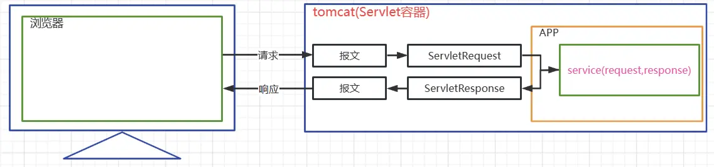
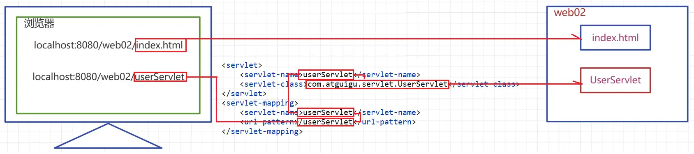

# 第五章 Servlet
## 一、Servlet 简介
### 1.1 动态资源和静态资源
**静态资源**

- 预先编写好的文件，服务器直接返回给客户端，如：HTML、CSS、JS、图片、音视频文件
- 特点：内容固定，不需要服务器端程序处理

**动态资源** 

- 程序运行时生成的内容，根据请求参数、用户状态等动态产生，如：Servlet、JSP、API 接口
- 特点：内容可变，需要服务器端程序实时处理和生成

**现代 Web 开发理解**

- **前后端分离架构**：前端负责静态资源（SPA 应用），后端提供 API 服务（动态资源）
- **CDN 优化**：静态资源通过 CDN 分发，动态资源通过应用服务器处理
- **缓存策略**：静态资源可长期缓存，动态资源需要灵活的缓存策略

### 1.2 Servlet 简介
Servlet (Server Applet) 是运行在服务端的 Java 小程序，是 Sun 公司制定的一套处理动态 Web 资源的技术规范。从代码层面讲，Servlet 是一个接口。

**核心功能**

- **请求处理**：接收并解析 HTTP 请求
- **业务逻辑**：协调调用业务层组件
- **响应生成**：构建并返回 HTTP 响应
- **控制器角色**：在 MVC 架构中充当控制器


**技术特点**

- 基于 Java 平台，跨平台性强
- 生命周期由 Servlet 容器（如 Tomcat）管理
- 支持多线程并发处理请求
- 提供丰富的 API 用于 HTTP 协议处理

**运行环境**

- 必须部署在 Servlet 容器中（如 Tomcat、Jetty）
- 遵循 Servlet 规范（当前主流为 Jakarta Servlet 5.0+）
- 与 Web 应用其他组件协同工作

::: tip 请求响应流程
客户端请求 → Servlet 容器 → Servlet 实例 → 业务处理 → 响应返回


:::

## 二、Servlet 开发流程
### 2.1 开发目标

实现用户名校验功能：接收客户端 username 参数，若值为'atguigu'则响应'NO'，否则响应'YES'。

### 2.2 开发步骤

**步骤 1：创建 Servlet 类**

``` java
/**
 * 用户名校验Servlet
 * 功能：验证用户名是否可用
 * <p>
 *
 * servlet 开发流程
 * 1. 创建 JavaWeb 项目，同时将 tomcat 添加为当前项目的依赖
 * 2. 重写 service 方法 service(HttpServletRequest req, HttpServletResponse resp)
 * 3. 在 service 方法中，定义业务处理代码
 * 4. 在 web.xml 中，配置 Servlet 对应的请求映射路径
 * <p>
 *
 * 1. servlet-api 导入问题
 *      servlet-api 编码的时候需要，运行的时候，在服务器的环境中，由服务软件（Tomcat）提供
 *      因此，在JavaWeb项目中，在打包/构建的时候，是无需携带 servlet-api 的 jar 包
 * 2. Content-Type 响应头问题
 *      MIME 类型响应头 媒体类型，文件类型，响应的数据类型
 *      MIME 类型用于告诉客户端响应的数据是什么类型的数据，客户端以此类型决定用什么方式解析响应体
 *
 * @author bombax
 * @date 2025/11/10
 */
public class UserServlet extends HttpServlet {

    @Override
    protected void service(HttpServletRequest request, HttpServletResponse response) throws ServletException, IOException {
        // 1. 从 request 对象中获取请求中的任何信息(username 参数)
        // 根据参数名获取参数值 无论参数是在 url ? 后还是在请求体中
        String username = request.getParameter("username");

        // 2. 处理业务的代码
        String info = "<h1>YES</h1>";
        if("atguigu".equals(username)){
            info = "<h1>NO</h1>";
        }

        // 3. 将要响应的数据放入 response
        // 应该设置 Content-Type
        // response.setHeader("Content-Type","text/html");
        response.setContentType("text/html;charset=UTF-8");

        // 该方法返回的是一个向响应体中打印字符串的 打印流
        PrintWriter writer = response.getWriter();

        writer.write(info);
    }
}
```

**关键要点**：

- 继承`HttpServlet`类
- 重写`service()`方法处理请求
- `HttpServletRequest`：封装客户端请求信息
- `HttpServletResponse`：构建服务端响应内容
- Servlet 生命周期由容器管理

**步骤 2：配置 Servlet 映射**

``` xml
<?xml version="1.0" encoding="UTF-8"?>
<web-app xmlns="https://jakarta.ee/xml/ns/jakartaee"
         xmlns:xsi="http://www.w3.org/2001/XMLSchema-instance"
         xsi:schemaLocation="https://jakarta.ee/xml/ns/jakartaee https://jakarta.ee/xml/ns/jakartaee/web-app_6_0.xsd"
         version="6.0">
    <!--
	 Servlet声明
     配置 Servlet 类，并起一个别名
     servlet-class 告诉 Tomcat 对应的要实例化的 Servlet 类
     servlet-name 用于关联请求的路径映射
     -->
    <servlet>
        <servlet-name>userServlet</servlet-name>
        <servlet-class>com.bombax.servlet.UserServlet</servlet-class>
    </servlet>
    
    <!-- URL映射 -->
    <servlet-mapping>
        <servlet-name>userServlet</servlet-name>
        <url-pattern>/userServlet</url-pattern>
    </servlet-mapping>

    <!--
        一个 servlet-name 可以同时对应多个 url-pattern
        一个 servlet 标签可以同时对应多个 servlet-mapping 标签

        url-pattern
            1. 精确匹配
                /servlet1
            2. 模糊匹配
                * 作为通配符， * 在哪里，哪里就是模糊的
                /       匹配全部，不包含 jsp 文件
                /*      匹配全部，包含 jsp 文件
                /a/*    匹配前缀，后缀模糊
                *.action
     -->
    <!-- <servlet>
        <servlet-name>servlet1</servlet-name>
        <servlet-class>com.bombax.servlet.Servlet1</servlet-class>
    </servlet>

    <servlet-mapping>
        <servlet-name>servlet1</servlet-name>
        &lt;!&ndash; 精确匹配 &ndash;&gt;
        &lt;!&ndash; <url-pattern>/servlet1</url-pattern> &ndash;&gt;
        <url-pattern>*.action</url-pattern>
    </servlet-mapping> -->

    <!-- <servlet>
        <servlet-name>servletLifeCycle</servlet-name>
        <servlet-class>com.bombax.servlet.ServletLifeCycle</servlet-class>
        &lt;!&ndash;
            默认值是 -1，表示 tomcat 启动时不会实例化该 servlet
            其它正整数，表示 tomcat 在启动时，实例化该 servlet 的顺序
                        如果序号冲突了，tomcat 会自动协调启动顺序
        &ndash;&gt;
        <load-on-startup>6</load-on-startup>
    </servlet>

    <servlet-mapping>
        <servlet-name>servletLifeCycle</servlet-name>
        <url-pattern>/servletLifeCycle</url-pattern>
    </servlet-mapping> -->
</web-app>
```

**URL 模式说明**：

| 模式        | 匹配规则       | 示例              |
|-----------|------------|-----------------|
| `/path`   | 精确匹配       | `/userServlet`  |
| `/path/*` | 路径匹配       | `/user/*`       |
| `*.ext`   | 扩展名匹配      | `*.action`      |
| `/`       | 默认 Servlet | 匹配全部，不包含 jsp 文件 |
| `/*`      | -          | 匹配全部，包含 jsp 文件  |

**步骤 3：创建客户端页面**

```html
<!DOCTYPE html>
<html lang="en">
<head>
    <meta charset="UTF-8">
    <title>用户名校验</title>
</head>
<body>
    <form action="userServlet" method="get">
        用户名：<input type="text" name="username" required>
        <input type="submit" value="校验">
    </form>
</body>
</html>
```

**步骤 4：部署与测试**

1. 启动 Tomcat 服务器
2. 访问页面提交表单
3. 验证响应结果



**开发要点总结**

- **职责分离**：Servlet 专注控制逻辑，业务逻辑分离到 Service 层
- **配置管理**：XML 配置 vs 注解配置的选择
- **异常处理**：合理处理 ServletException 和 IOException
- **线程安全**：注意 Servlet 实例的多线程访问问题

## 三、Servlet 注解方式配置

### 3.1 `@WebServlet`  注解概述

Servlet 3.0 引入了注解配置方式，简化了传统 XML 配置，提升开发效率。

**Servlet 3.0+ 新特性**

- **注解驱动配置**：`@WebServlet`、`@WebFilter`、`@WebListener`
- **异步处理支持**：`asyncSupported`属性支持异步 Servlet
- **编程式注册**：动态注册 Servlet、Filter、Listener
- **文件上传**：`@MultipartConfig`原生支持文件上传
- **可插拔性**：通过`ServletContainerInitializer`实现模块化

**`@WebServlet`  核心属性**

| 属性                      | 类型               | 说明         | 示例                                              |
|-------------------------|------------------|------------|-------------------------------------------------|
| `value` / `urlPatterns` | `String[]`       | URL 映射模式   | `{"/user", "/user/*"}`                          |
| `name`                  | `String`         | Servlet 名称 | `"userServlet"`                                 |
| `loadOnStartup`         | `int`            | 启动顺序       | `1`（启动时加载）                                      |
| `initParams`            | `WebInitParam[]` | 初始化参数      | `@WebInitParam(name="encoding", value="UTF-8")` |
| `asyncSupported`        | `boolean`        | 异步支持       | `true`                                          |

### 3.2 配置方式对比

| 特性       | XML 配置    | 注解配置    |
|----------|-----------|---------|
| **配置位置** | `web.xml` | Java 类上 |
| **可读性**  | 集中管理      | 就近配置    |
| **灵活性**  | 运行时修改     | 编译时确定   |
| **维护性**  | 配置分离      | 代码耦合    |
| **开发效率** | 较低        | 较高      |
| **适用场景** | 大型项目      | 快速开发    |

**建议**：中小项目/教学示例快速迭代用注解；生产关键入口/需合规审计的 Servlet 保留在 web.xml。

### 3.3 现代注解最佳实践

**基础用法**

```java
@WebServlet("/api/users")
public class UserServlet extends HttpServlet {
    @Override
    protected void doGet(HttpServletRequest req, HttpServletResponse resp) 
            throws ServletException, IOException {
        // 处理GET请求
    }
}
```

**高级配置**

```java
@WebServlet(
    name = "userManagementServlet",
    urlPatterns = {"/api/users", "/api/users/*"},
    initParams = {
        @WebInitParam(name = "encoding", value = "UTF-8"),
        @WebInitParam(name = "pageSize", value = "20")
    },
    loadOnStartup = 1,
    asyncSupported = true
)
public class UserManagementServlet extends HttpServlet {
    
    private String encoding;
    private int pageSize;
    
    @Override
    public void init() throws ServletException {
        // 获取初始化参数
        this.encoding = getInitParameter("encoding");
        this.pageSize = Integer.parseInt(getInitParameter("pageSize"));
    }
    
    @Override
    protected void doGet(HttpServletRequest req, HttpServletResponse resp) 
            throws ServletException, IOException {
        
        // 设置响应编码
        resp.setCharacterEncoding(encoding);
        resp.setContentType("application/json;charset=" + encoding);
        
        // 处理分页逻辑
        String pageParam = req.getParameter("page");
        int page = pageParam != null ? Integer.parseInt(pageParam) : 1;
        
        // 业务处理...
    }
}
```

**异步 Servlet 示例（Servlet 3.0+）**

```java
@WebServlet(value = "/async", asyncSupported = true)
public class AsyncServlet extends HttpServlet {
    
    @Override
    protected void doGet(HttpServletRequest req, HttpServletResponse resp) 
            throws ServletException, IOException {
        
        // 开启异步上下文
        AsyncContext asyncContext = req.startAsync();
        asyncContext.setTimeout(30000); // 30秒超时
        
        // 异步处理
        asyncContext.start(() -> {
            try {
                // 模拟耗时操作
                Thread.sleep(5000);
                
                // 响应处理
                resp.setContentType("text/plain;charset=UTF-8");
                resp.getWriter().write("异步处理完成");  
            } catch (Exception e) {
                // 异常处理
            } finally {
                asyncContext.complete(); // 完成异步处理
            }
        });
    }
}
```

**现代 Java 特性集成**

```java
@WebServlet("/api/validation")
public class ValidationServlet extends HttpServlet {
    
    @Override
    protected void doPost(HttpServletRequest req, HttpServletResponse resp) 
            throws ServletException, IOException {
        
        // 使用Optional处理可选参数
        Optional<String> username = Optional.ofNullable(req.getParameter("username"))
                .filter(s -> !s.trim().isEmpty());
        
        // 使用Stream API处理多值参数
        List<String> roles = Optional.ofNullable(req.getParameterValues("roles"))
                .map(Arrays::stream)
                .orElse(Stream.empty())
                .filter(role -> !role.trim().isEmpty())
                .collect(Collectors.toList());
        
        // 业务验证逻辑
        String result = username
                .map(name -> validateUser(name, roles))
                .orElse("用户名不能为空");
        
        // 响应结果
        resp.setContentType("application/json;charset=UTF-8");
        resp.getWriter().write(JsonUtils.toJson(Map.of("result", result)));
    }
    
    private String validateUser(String username, List<String> roles) {
        // 验证逻辑
        return roles.isEmpty() ? "角色不能为空" : "验证通过";
    }
}
```

## 四、Servlet 生命周期
### 4.1 生命周期概述

Servlet 生命周期是指 Servlet 实例从创建到销毁的整个过程，完全由 Servlet 容器管理。

**生命周期阶段**

| 阶段       | 方法          | 执行时机       | 执行次数 | 说明            |
|----------|-------------|------------|------|---------------|
| **实例化**  | 构造器         | 首次请求或容器启动  | 1 次  | 创建 Servlet 实例 |
| **初始化**  | `init()`    | 实例化后立即执行   | 1 次  | 初始化资源和配置      |
| **服务处理** | `service()` | 每次 HTTP 请求 | 多次   | 处理用户请求        |
| **销毁**   | `destroy()` | 容器关闭或应用卸载  | 1 次  | 清理资源          |

### 4.2 线程安全与最佳实践

**关键特点**

- **单例模式**：Servlet 实例在容器中通常是单例的
- **多线程访问**：多个请求线程共享同一个 Servlet 实例
- **线程安全风险**：成员变量的并发修改可能导致数据不一致

**线程安全最佳实践**

```java
@WebServlet("/thread-safe")
public class ThreadSafeServlet extends HttpServlet {
    
    // ❌ 避免：可变的成员变量（线程不安全）
    // private int requestCount = 0;
    // private String userName;
    
    // ✅ 推荐：只读的成员变量（线程安全）
    private final String ENCODING = "UTF-8";
    private final int MAX_RETRY = 3;
    
    // ✅ 推荐：线程安全的成员变量
    private final AtomicInteger requestCount = new AtomicInteger(0);
    
    @Override
    protected void doGet(HttpServletRequest req, HttpServletResponse resp) 
            throws ServletException, IOException {
        
        // ✅ 局部变量（线程安全）
        String sessionId = req.getSession().getId();
        int currentCount = requestCount.incrementAndGet();
        
        // ✅ 使用ThreadLocal存储线程相关数据
        ThreadLocal<String> userContext = new ThreadLocal<>();
        userContext.set(req.getParameter("user"));
        
        try {
            // 业务处理
            processRequest(sessionId, currentCount);
        } finally {
            // 清理ThreadLocal
            userContext.remove();
        }
    }
    
    private void processRequest(String sessionId, int count) {
        // 线程安全的业务处理
    }
}
```

**多线程环境注意事项**

1. **避免成员变量状态**

   ```java
   // ❌ 错误示例
   public class UnsafeServlet extends HttpServlet {
       private String userName; // 多线程共享，线程不安全
       
       protected void doPost(HttpServletRequest req, HttpServletResponse resp) {
           userName = req.getParameter("user"); // 可能被其他线程覆盖
           // 处理逻辑...
       }
   }
   
   // ✅ 正确示例  
   public class SafeServlet extends HttpServlet {
       protected void doPost(HttpServletRequest req, HttpServletResponse resp) {
           String userName = req.getParameter("user"); // 局部变量，线程安全
           // 处理逻辑...
       }
   }
   ```

2. **资源同步访问**

   ```java
   @WebServlet("/resource")
   public class ResourceServlet extends HttpServlet {
       private final Object lock = new Object();
       private final Map<String, String> cache = new ConcurrentHashMap<>();
       
       @Override
       protected void doGet(HttpServletRequest req, HttpServletResponse resp) {
           String key = req.getParameter("key");
           
           // 使用线程安全的集合
           String value = cache.computeIfAbsent(key, this::loadFromDatabase);
           
           // 对于非线程安全操作，使用同步
           synchronized (lock) {
               // 临界区代码
           }
       }
   }
   ```

### 4.3 生命周期管理

**初始化最佳实践**

```java
@WebServlet(value = "/lifecycle", loadOnStartup = 1)
public class LifecycleServlet extends HttpServlet {
    
    private DataSource dataSource;
    private ExecutorService executorService;
    
    @Override
    public void init() throws ServletException {
        try {
            // 初始化数据源
            dataSource = createDataSource();
            
            // 初始化线程池
            executorService = Executors.newFixedThreadPool(10);
            
            // 记录初始化完成
            log("Servlet initialized successfully");  
        } catch (Exception e) {
            throw new ServletException("Failed to initialize servlet", e);
        }
    }
    
    @Override
    protected void service(HttpServletRequest req, HttpServletResponse resp) 
            throws ServletException, IOException {
        // 服务处理逻辑
        log("Processing request: " + req.getRequestURI());
    }
    
    @Override
    public void destroy() {
        try {
            // 清理资源
            if (executorService != null && !executorService.isShutdown()) {
                executorService.shutdown();
                if (!executorService.awaitTermination(30, TimeUnit.SECONDS)) {
                    executorService.shutdownNow();
                }
            }
            
            // 关闭数据源
            if (dataSource instanceof Closeable) {
                ((Closeable) dataSource).close();
            }
            
            log("Servlet destroyed successfully");
        } catch (Exception e) {
            log("Error during servlet destruction", e);
        }
    }
    
    private DataSource createDataSource() {
        // 创建数据源逻辑
        return null;
    }
}
```

**启动优先级配置**

```xml
<!-- 系统级Servlet：优先级1-5 -->
<servlet>
    <servlet-name>systemServlet</servlet-name>
    <servlet-class>com.system.SystemServlet</servlet-class>
    <load-on-startup>1</load-on-startup>
</servlet>

<!-- 应用级Servlet：优先级6+ -->
<servlet>
    <servlet-name>appServlet</servlet-name>
    <servlet-class>com.app.AppServlet</servlet-class>
    <load-on-startup>6</load-on-startup>
</servlet>
```

**关键要点总结**

- Servlet 实例是单例且线程不安全
- 避免使用可变成员变量存储请求相关数据
- 正确管理资源的初始化和清理
- 合理设置 load-on-startup 优先级（避免 1-5）
- 使用线程安全的数据结构和同步机制

## 五、Servlet 继承结构

### 5.1 继承体系概述

Servlet 规范采用分层继承设计，为开发者提供了灵活的实现方式。

```text
jakarta.servlet.Servlet (接口)

jakarta.servlet.GenericServlet (抽象类)

jakarta.servlet.http.HttpServlet (抽象类)

自定义 Servlet 类 (具体实现)
```

### 5.2 Servlet 接口

**核心方法定义**

| 方法                                                 | 作用            | 调用时机    |
|----------------------------------------------------|---------------|---------|
| `init(ServletConfig config)`                       | 初始化 Servlet   | 实例创建后   |
| `service(ServletRequest req, ServletResponse res)` | 处理请求          | 每次请求时   |
| `destroy()`                                        | 清理资源          | 实例销毁前   |
| `getServletConfig()`                               | 获取配置对象        | 需要配置信息时 |
| `getServletInfo()`                                 | 获取 Servlet 信息 | 容器查询时   |

**接口特点**

- 定义了 Servlet 的基本生命周期规范
- 提供了协议无关的请求处理抽象
- 所有 Servlet 实现都必须遵循此接口

### 5.3 GenericServlet 抽象类

**主要功能**

- 实现了 Servlet 接口的通用功能
- 提供了便捷的参数访问方法
- 简化了子类的实现复杂度

**核心方法**

```java
public abstract class GenericServlet implements Servlet {
    private transient ServletConfig config;
    
    // 配置管理
    public ServletConfig getServletConfig() { return config; }
    public ServletContext getServletContext() { return config.getServletContext(); }
    public String getServletName() { return config.getServletName(); }
    
    // 参数访问
    public String getInitParameter(String name) { return config.getInitParameter(name); }
    public Enumeration<String> getInitParameterNames() { return config.getInitParameterNames(); }
    
    // 生命周期管理
    public void init(ServletConfig config) throws ServletException {
        this.config = config;
        init(); // 调用无参init方法
    }
    
    public void init() throws ServletException {} // 子类可重写
    public void destroy() {} // 默认空实现
    
    // 抽象方法，子类必须实现
    public abstract void service(ServletRequest req, ServletResponse res) 
        throws ServletException, IOException;
}
```

### 5.4 HttpServlet 抽象类

**HTTP 协议专用实现**

HttpServlet 专门为 HTTP 协议设计，提供了完整的 HTTP 方法支持。

**请求方法映射**

| HTTP 方法 | 对应方法          | 默认行为       | 常用场景  |
|---------|---------------|------------|-------|
| GET     | `doGet()`     | 405 错误     | 查询数据  |
| POST    | `doPost()`    | 405 错误     | 提交数据  |
| PUT     | `doPut()`     | 405 错误     | 更新资源  |
| DELETE  | `doDelete()`  | 405 错误     | 删除资源  |
| HEAD    | `doHead()`    | 调用 doGet() | 获取头信息 |
| OPTIONS | `doOptions()` | 返回支持的方法    | 预检请求  |
| TRACE   | `doTrace()`   | 回显请求       | 调试用途  |

**核心实现机制**

```java
@Override
public void service(ServletRequest req, ServletResponse res) 
        throws ServletException, IOException {
    
    // 类型转换
    HttpServletRequest httpReq = (HttpServletRequest) req;
    HttpServletResponse httpResp = (HttpServletResponse) res;
    
    // 调用HTTP专用service方法
    service(httpReq, httpResp);
}

protected void service(HttpServletRequest req, HttpServletResponse resp) 
        throws ServletException, IOException {
    
    String method = req.getMethod();
    
    // 根据HTTP方法分发到对应的doXxx方法
    switch (method) {
        case "GET" -> doGet(req, resp);
        case "POST" -> doPost(req, resp);
        case "PUT" -> doPut(req, resp);
        case "DELETE" -> doDelete(req, resp);
        // 其他方法...
    }
}
```

### 5.5 自定义 Servlet 最佳实践

**继承关系图**


**实现选择指南**

| 场景          | 推荐继承           | 重写方法           | 适用情况        |
|-------------|----------------|----------------|-------------|
| **HTTP 应用** | HttpServlet    | doGet/doPost 等 | 99%的 Web 应用 |
| **通用协议**    | GenericServlet | service        | 非 HTTP 协议   |
| **完全自定义**   | 实现 Servlet 接口  | 所有方法           | 特殊需求        |

**现代开发示例**

```java
@WebServlet("/api/users")
public class UserServlet extends HttpServlet {
    
    // ✅ 推荐：重写具体的HTTP方法
    @Override
    protected void doGet(HttpServletRequest req, HttpServletResponse resp) 
            throws ServletException, IOException {
        // 处理GET请求 - 查询用户
        handleUserQuery(req, resp);
    }
    
    @Override
    protected void doPost(HttpServletRequest req, HttpServletResponse resp) 
            throws ServletException, IOException {
        // 处理POST请求 - 创建用户
        handleUserCreation(req, resp);
    }
    
    // ❌ 不推荐：重写通用service方法（除非有特殊需求）
    // @Override
    // protected void service(HttpServletRequest req, HttpServletResponse resp) { ... }
    
    private void handleUserQuery(HttpServletRequest req, HttpServletResponse resp) {
        // 具体业务逻辑
    }
    
    private void handleUserCreation(HttpServletRequest req, HttpServletResponse resp) {
        // 具体业务逻辑
    }
}
```

**关键设计原则**

- **单一职责**：每个 doXxx 方法处理特定的 HTTP 操作
- **REST 风格**：遵循 HTTP 语义，GET 查询、POST 创建、PUT 更新、DELETE 删除
- **异常处理**：合理处理 ServletException 和 IOException
- **资源管理**：在 init()中初始化资源，在 destroy()中清理资源

## 六、ServletConfig 和 ServletContext

### 6.1 ServletConfig 配置对象

#### 6.1.1 核心概念

ServletConfig 是 Jakarta EE Servlet API 中为每个 Servlet 实例提供配置信息的核心对象。

| 特性       | 说明                                            |
|----------|-----------------------------------------------|
| **实例关系** | 每个 Servlet 拥有独立的 ServletConfig 对象             |
| **生命周期** | 通过 init(ServletConfig) 方法传入，伴随 Servlet 整个生命周期 |
| **主要功能** | 提供初始化参数、访问 ServletContext、获取 Servlet 名称       |
| **作用域**  | 仅限当前 Servlet 实例，不共享                           |

#### 6.1.2 API 接口定义

```java
public interface ServletConfig {
    String getServletName();                    // 获取 Servlet 名称
    ServletContext getServletContext();         // 获取应用上下文
    String getInitParameter(String name);       // 获取指定初始化参数
    Enumeration<String> getInitParameterNames(); // 获取所有参数名枚举
}
```

#### 6.1.3 现代配置方式对比

**传统 XML 配置方式：**

```xml
<servlet>
    <servlet-name>ConfigServlet</servlet-name>
    <servlet-class>com.example.ConfigServlet</servlet-class>
    <init-param>
        <param-name>maxConnections</param-name>
        <param-value>100</param-value>
    </init-param>
    <init-param>
        <param-name>timeout</param-name>
        <param-value>30</param-value>
    </init-param>
</servlet>
```

**现代注解配置方式：**

```java
@WebServlet(
    urlPatterns = "/config",
    initParams = {
        @WebInitParam(name = "maxConnections", value = "100"),
        @WebInitParam(name = "timeout", value = "30")
    }
)
public class ConfigServlet extends HttpServlet {
    private int maxConnections;
    private int timeout;
    
    @Override
    public void init() throws ServletException {
        // 类型安全的参数获取
        this.maxConnections = Optional.ofNullable(getInitParameter("maxConnections"))
            .map(Integer::valueOf).orElse(50);
        this.timeout = Optional.ofNullable(getInitParameter("timeout"))
            .map(Integer::valueOf).orElse(10);
    }
    
    @Override
    protected void doGet(HttpServletRequest req, HttpServletResponse resp) 
            throws ServletException, IOException {
        resp.setContentType("text/plain");
        resp.getWriter().printf("Max Connections: %d, Timeout: %d%n", 
                               maxConnections, timeout);
    }
}
```

#### 6.1.4 与现代依赖注入框架的对比

| 方面       | ServletConfig | 现代依赖注入框架    |
|----------|---------------|-------------|
| **配置来源** | `web.xml` 或注解 | 外部配置文件、环境变量 |
| **类型安全** | 字符串，需手动转换     | 强类型，自动转换    |
| **验证机制** | 手动验证          | 自动验证和约束     |
| **热更新**  | 需重启应用         | 支持动态刷新      |
| **作用域**  | Servlet 级别    | 多种作用域选择     |

**现代依赖注入示例（Spring Boot）：**

```java
@Component
public class ConfigService {
    @Value("${app.max-connections:100}")
    private int maxConnections;
    
    @Value("${app.timeout:30}")
    private Duration timeout;
    
    @Validated
    @ConfigurationProperties("app")
    public static class AppConfig {
        @Min(1) @Max(1000)
        private int maxConnections = 100;
        
        @NotNull
        private Duration timeout = Duration.ofSeconds(30);
        
        // getters and setters
    }
}
```

### 6.2 ServletContext 应用上下文

#### 6.2.1 核心概念

ServletContext 是 Web 应用程序级别的上下文对象，为所有 Servlet 提供共享的应用环境。

| 特性       | 说明                               |
|----------|----------------------------------|
| **实例关系** | 每个 Web 应用创建唯一的 ServletContext 对象 |
| **共享范围** | 应用内所有 Servlet、Filter、Listener 共享 |
| **主要功能** | 全局参数管理、资源访问、域数据存储                |
| **生命周期** | 随 Web 应用启动/停止而创建/销毁              |

#### 6.2.2 基础配置示例

**全局参数配置：**

```xml
<?xml version="1.0" encoding="UTF-8"?>
<web-app xmlns="https://jakarta.ee/xml/ns/jakartaee"
         xmlns:xsi="http://www.w3.org/2001/XMLSchema-instance"
         xsi:schemaLocation="https://jakarta.ee/xml/ns/jakartaee 
         https://jakarta.ee/xml/ns/jakartaee/web-app_5_0.xsd"
         version="5.0">

    <context-param>
        <param-name>database.url</param-name>
        <param-value>jdbc:mysql://localhost:3306/demo</param-value>
    </context-param>
    <context-param>
        <param-name>cache.timeout</param-name>
        <param-value>3600</param-value>
    </context-param>
</web-app>
```

**参数访问与全局配置管理：**

```java
@WebServlet("/context-demo")
public class ContextDemoServlet extends HttpServlet {
    
    @Override
    public void init() throws ServletException {
        ServletContext context = getServletContext();
        
        // 从 ServletContext 加载全局配置
        String dbUrl = context.getInitParameter("database.url");
        String poolSize = context.getInitParameter("connection.pool.size");
        String timeout = context.getInitParameter("cache.timeout");
        
        // 初始化全局组件并存储到应用域
        DataSource dataSource = createDataSource(dbUrl, poolSize);
        context.setAttribute("dataSource", dataSource);
        
        CacheManager cacheManager = new CacheManager(Integer.parseInt(timeout));
        context.setAttribute("cacheManager", cacheManager);
    }
    
    @Override
    protected void doGet(HttpServletRequest req, HttpServletResponse resp) 
            throws ServletException, IOException {
        
        ServletContext context = getServletContext();
        
        // 获取已初始化的全局组件
        DataSource dataSource = (DataSource) context.getAttribute("dataSource");
        CacheManager cacheManager = (CacheManager) context.getAttribute("cacheManager");
        
        resp.setContentType("text/plain");
        resp.getWriter().printf("DataSource: %s%nCache Manager: %s%n", 
                               dataSource != null ? "已配置" : "未配置",
                               cacheManager != null ? "已启用" : "未启用");
    }
    
    private DataSource createDataSource(String url, String poolSize) {
        // 数据源创建逻辑
        return null;
    }
}
```

### 6.3 ServletContext 实际应用场景

#### 6.3.1 核心 API 方法

| 方法分类     | API                                         | 功能        | 应用场景       |
|----------|---------------------------------------------|-----------|------------|
| **路径管理** | `getRealPath(String path)`                  | 获取资源真实路径  | 文件上传、模板加载  |
|          | `getContextPath()`                          | 获取应用上下文路径 | URL 构建、重定向 |
| **参数访问** | `getInitParameter(String name)`             | 获取全局配置参数  | 数据库连接、系统配置 |
| **域数据**  | `setAttribute/getAttribute/removeAttribute` | 应用级数据共享   | 缓存、全局状态    |
| **资源访问** | `getResource/getResourceAsStream`           | 获取应用内资源   | 配置文件、静态资源  |

#### 6.3.2 实际应用示例

**1. 文件路径管理**

```java
@WebServlet("/file-upload")
public class FileUploadServlet extends HttpServlet {
    
    @Override
    protected void doPost(HttpServletRequest req, HttpServletResponse resp) 
            throws ServletException, IOException {
        
        ServletContext context = getServletContext();
        
        // 获取上传目录的真实路径
        String uploadPath = context.getRealPath("/uploads");
        Path uploadDir = Paths.get(uploadPath);
        
        // 确保目录存在
        if (!Files.exists(uploadDir)) {
            Files.createDirectories(uploadDir);
        }
        
        // 处理文件上传逻辑
        // ...
    }
}
```

**2. 应用级数据共享与线程安全考虑**

```java
// 统计访问次数的示例 - 展示线程安全的重要性
@WebServlet("/visitor-counter")
public class VisitorCounterServlet extends HttpServlet {
    
    @Override
    protected void doGet(HttpServletRequest req, HttpServletResponse resp) 
            throws ServletException, IOException {
        
        ServletContext context = getServletContext();
        
        // ✅ 正确：使用线程安全的AtomicLong
        AtomicLong counter = (AtomicLong) context.getAttribute("visitorCount");
        if (counter == null) {
            // 双重检查锁定模式确保只创建一次
            synchronized (this) {
                counter = (AtomicLong) context.getAttribute("visitorCount");
                if (counter == null) {
                    counter = new AtomicLong(0);
                    context.setAttribute("visitorCount", counter);
                }
            }
        }
        
        long currentCount = counter.incrementAndGet();
        
        resp.setContentType("text/html");
        resp.getWriter().printf("<h2>您是第 %d 位访客</h2>", currentCount);
    }
}

// ❌ 错误示例：非线程安全的实现
@WebServlet("/unsafe-counter")
public class UnsafeCounterServlet extends HttpServlet {
    
    @Override
    protected void doGet(HttpServletRequest req, HttpServletResponse resp) 
            throws ServletException, IOException {
        
        ServletContext context = getServletContext();
        
        // ❌ 危险：非原子操作，存在竞态条件
        Integer count = (Integer) context.getAttribute("unsafeCount");
        if (count == null) {
            count = 0;
        }
        count++; // 非线程安全的递增操作
        context.setAttribute("unsafeCount", count);
        
        // 在高并发情况下，计数可能不准确
    }
}
```

**ServletContext 线程安全核心考虑点：**

- **读操作**：getAttribute() 是线程安全的
- **写操作**：setAttribute() 是线程安全的，但业务逻辑可能不是
- **复合操作**：读-修改-写需要额外同步机制
- **对象状态**：存储的对象本身必须是线程安全的或不可变的

#### 6.3.3 与现代应用框架的对比

| 功能需求     | ServletContext 方式                | 现代框架方式                            |
|----------|----------------------------------|-----------------------------------|
| **配置管理** | context-param + getInitParameter | `@ConfigurationProperties` + 外部配置 |
| **依赖注入** | setAttribute/getAttribute        | `@Autowired` + IoC 容器             |
| **缓存管理** | 手动实现应用域缓存                        | `@Cacheable` + 专业缓存框架             |
| **文件处理** | getRealPath + 文件操作               | 资源抽象 + 云存储集成                      |
| **生命周期** | ServletContextListener           | `@PostConstruct` + 应用事件           |

**现代 Spring Boot 对比示例：**

```java
// ServletContext 方式
context.setAttribute("userService", new UserService());
UserService service = (UserService) context.getAttribute("userService");

// Spring Boot 方式
@Service
public class UserService { }

@Controller
public class UserController {
    @Autowired
    private UserService userService; // 自动注入
}
```

#### 6.3.4 最佳实践建议

**适用场景：**

- 简单的 Web 应用程序
- 学习 Servlet 基础概念
- 遗留系统维护

**现代替代方案：**

- **配置管理**：使用 Spring Boot 的 `@ConfigurationProperties`
- **依赖注入**：使用成熟的 IoC 容器
- **缓存管理**：使用 Redis、Caffeine 等专业缓存
- **资源管理**：使用云存储服务或资源抽象层

**关键注意事项：**

- **线程安全**：ServletContext 是应用级单例，多线程访问时需要特别注意
- **内存管理**：避免在 ServletContext 中存储大量数据，可能导致内存泄漏
- **生命周期管理**：合理管理存储对象的创建和销毁，避免资源泄漏
- **域对象选择**：根据数据共享范围选择合适的域（request、session、application）
- **异常处理**：初始化全局组件时要有完善的异常处理机制
- **监控与诊断**：在生产环境中监控 ServletContext 中存储的数据状态

**实际应用场景权衡：**

- **简单 Web 应用**：ServletContext 是合理的选择
- **企业级应用**：优先考虑成熟的 IoC 框架和配置管理方案
- **微服务架构**：使用外部配置中心和服务注册发现机制
- **云原生应用**：采用云平台提供的配置和缓存服务

## 七、HttpServletRequest 请求对象

### 7.1 核心概念

HttpServletRequest 是 Jakarta EE Servlet API 中处理 HTTP 请求的核心接口，封装了客户端发送的所有请求信息。

| 特性       | 说明                              |
|----------|---------------------------------|
| **接口继承** | 继承自 ServletRequest，专门处理 HTTP 协议 |
| **对象来源** | Tomcat 容器解析 HTTP 请求报文后创建        |
| **生命周期** | 每个请求创建一个实例，请求结束后销毁              |
| **主要功能** | 获取请求行、请求头、请求参数、请求体数据            |

### 7.2 核心 API 方法

| 方法分类     | 方法                                | 功能         | 现代应用场景               |
|----------|-----------------------------------|------------|----------------------|
| **请求行**  | `getMethod()`                     | 获取请求方式     | REST API 方法判断        |
|          | `getRequestURI()`                 | 获取请求 URI   | 路由解析、日志记录            |
|          | `getRequestURL()`                 | 获取完整请求 URL | 重定向、链接生成             |
|          | `getProtocol()`                   | 获取协议版本     | 协议兼容性检查              |
| **请求头**  | `getHeader(String name)`          | 获取指定请求头    | JWT Token、API Key 验证 |
|          | `getHeaderNames()`                | 获取所有请求头名称  | 请求分析、安全检查            |
|          | `getContentType()`                | 获取内容类型     | 文件上传类型验证             |
|          | `getContentLength()`              | 获取内容长度     | 大文件上传限制              |
| **请求参数** | `getParameter(String name)`       | 获取单个参数值    | 配合验证框架使用             |
|          | `getParameterValues(String name)` | 获取多值参数数组   | 复选框、多选列表             |
|          | `getParameterMap()`               | 获取所有参数     | 参数批量处理               |

### 7.3 现代请求处理最佳实践

#### 7.3.1 使用 Optional 和 Stream API 处理参数

**现代参数处理示例：**

```java
@WebServlet("/modern-params")
public class ModernParamsServlet extends HttpServlet {
    
    @Override
    protected void doGet(HttpServletRequest req, HttpServletResponse resp) 
            throws ServletException, IOException {
        
        // ✅ 使用 Optional 处理可选参数
        Optional<String> username = Optional.ofNullable(req.getParameter("username"));
        Optional<Integer> age = Optional.ofNullable(req.getParameter("age"))
            .filter(s -> !s.trim().isEmpty())
            .map(Integer::valueOf);
        
        // ✅ 使用 Stream API 处理多值参数
        List<String> hobbies = Optional.ofNullable(req.getParameterValues("hobbies"))
            .map(Arrays::stream)
            .orElse(Stream.empty())
            .filter(s -> !s.trim().isEmpty())
            .map(String::trim)
            .distinct()
            .collect(Collectors.toList());
        
        // ✅ 使用 Stream API 处理参数映射
        Map<String, String> filteredParams = req.getParameterMap().entrySet().stream()
            .filter(entry -> entry.getValue().length > 0)
            .filter(entry -> !entry.getValue()[0].trim().isEmpty())
            .collect(Collectors.toMap(
                Map.Entry::getKey,
                entry -> entry.getValue()[0]
            ));
        
        // 构建响应
        resp.setContentType("application/json");
        resp.setCharacterEncoding("UTF-8");
        
        String response = String.format("""
            {
                "username": "%s",
                "age": %s,
                "hobbies": [%s],
                "paramsCount": %d
            }
            """,
            username.orElse("未提供"),
            age.map(String::valueOf).orElse("null"),
            hobbies.stream().map(h -> "\"" + h + "\"").collect(Collectors.joining(", ")),
            filteredParams.size()
        );
        
        resp.getWriter().write(response);
    }
}
```

#### 7.3.2 现代异常处理模式

**结构化异常处理：**

```java
@WebServlet("/user-registration")
public class UserRegistrationServlet extends HttpServlet {
    
    @Override
    protected void doPost(HttpServletRequest req, HttpServletResponse resp) 
            throws ServletException, IOException {
        
        // 设置请求编码
        req.setCharacterEncoding("UTF-8");
        resp.setContentType("application/json");
        resp.setCharacterEncoding("UTF-8");
        
        try {
            // ✅ 现代方式：使用 try-with-resources 和 Optional
            UserRequest userRequest = parseAndValidateUserRequest(req);
            
            // 业务逻辑处理
            User createdUser = createUser(userRequest);
            
            // 成功响应
            sendSuccessResponse(resp, createdUser);
        } catch (ValidationException e) {
            // ✅ 结构化异常处理
            sendErrorResponse(resp, HttpServletResponse.SC_BAD_REQUEST, 
                            "VALIDATION_ERROR", e.getMessage());
        } catch (DuplicateUserException e) {
            sendErrorResponse(resp, HttpServletResponse.SC_CONFLICT, 
                            "USER_EXISTS", e.getMessage());
        } catch (ServiceException e) {
            sendErrorResponse(resp, HttpServletResponse.SC_INTERNAL_SERVER_ERROR, 
                            "SERVICE_ERROR", "服务暂时不可用");
        } catch (Exception e) {
            // 记录详细错误日志
            logger.error("Unexpected error during user registration", e);
            sendErrorResponse(resp, HttpServletResponse.SC_INTERNAL_SERVER_ERROR, 
                            "INTERNAL_ERROR", "系统内部错误");
        }
    }
    
    /**
     * 使用 Optional 和 Stream API 解析和验证用户请求
     */
    private UserRequest parseAndValidateUserRequest(HttpServletRequest req) 
            throws ValidationException {
        
        // ✅ 使用 Optional 链式调用进行参数验证
        String username = Optional.ofNullable(req.getParameter("username"))
            .filter(s -> !s.trim().isEmpty())
            .orElseThrow(() -> new ValidationException("用户名不能为空"));
        
        String email = Optional.ofNullable(req.getParameter("email"))
            .filter(this::isValidEmail)
            .orElseThrow(() -> new ValidationException("邮箱格式不正确"));
        
        Integer age = Optional.ofNullable(req.getParameter("age"))
            .filter(s -> !s.trim().isEmpty())
            .map(s -> {
                try {
                    return Integer.valueOf(s);
                } catch (NumberFormatException e) {
                    throw new ValidationException("年龄必须是数字");
                }
            })
            .filter(a -> a >= 18 && a <= 100)
            .orElseThrow(() -> new ValidationException("年龄必须在18-100之间"));
        
        // ✅ 使用 Stream API 处理多选标签
        Set<String> tags = Optional.ofNullable(req.getParameterValues("tags"))
            .map(Arrays::stream)
            .orElse(Stream.empty())
            .filter(s -> !s.trim().isEmpty())
            .map(String::trim)
            .collect(Collectors.toSet());
        
        return UserRequest.builder()
            .username(username)
            .email(email)
            .age(age)
            .tags(tags)
            .build();
    }
    
    /**
     * 发送结构化成功响应
     */
    private void sendSuccessResponse(HttpServletResponse resp, User user) throws IOException {
        resp.setStatus(HttpServletResponse.SC_CREATED);
        
        String jsonResponse = String.format("""
            {
                "success": true,
                "data": {
                    "id": %d,
                    "username": "%s",
                    "email": "%s"
                },
                "message": "用户创建成功"
            }
            """, user.getId(), user.getUsername(), user.getEmail());
        
        resp.getWriter().write(jsonResponse);
    }
    
    /**
     * 发送结构化错误响应
     */
    private void sendErrorResponse(HttpServletResponse resp, int status, 
                                 String errorCode, String message) throws IOException {
        resp.setStatus(status);
        
        String jsonResponse = String.format("""
            {
                "success": false,
                "error": {
                    "code": "%s",
                    "message": "%s",
                    "timestamp": "%s"
                }
            }
            """, errorCode, message, Instant.now().toString());
        
        resp.getWriter().write(jsonResponse);
    }
    
    private boolean isValidEmail(String email) {
        return email.contains("@") && email.contains(".");
    }
}
```

#### 7.3.3 请求内容类型处理

```java
@WebServlet("/api/data")
@MultipartConfig // 启用文件上传支持
public class ContentTypeHandlerServlet extends HttpServlet {
    
    @Override
    protected void doPost(HttpServletRequest req, HttpServletResponse resp) 
            throws ServletException, IOException {
        
        // ✅ 使用 Optional 安全处理 Content-Type
        Optional<String> contentType = Optional.ofNullable(req.getContentType());
        
        try {
            contentType.ifPresentOrElse(
                type -> handleRequestByContentType(type, req, resp),
                () -> sendErrorResponse(resp, 400, "MISSING_CONTENT_TYPE", "缺少 Content-Type 头")
            );
        } catch (Exception e) {
            sendErrorResponse(resp, 500, "PROCESSING_ERROR", "请求处理失败");
        }
    }
    
    private void handleRequestByContentType(String contentType, 
                                          HttpServletRequest req, 
                                          HttpServletResponse resp) {
        try {
            if (contentType.startsWith("application/json")) {
                handleJsonRequest(req, resp);
            } else if (contentType.startsWith("multipart/form-data")) {
                handleFileUploadRequest(req, resp);
            } else if (contentType.startsWith("application/x-www-form-urlencoded")) {
                handleFormRequest(req, resp);
            } else {
                sendErrorResponse(resp, 415, "UNSUPPORTED_MEDIA_TYPE", 
                                "不支持的内容类型: " + contentType);
            }
        } catch (Exception e) {
            sendErrorResponse(resp, 500, "PROCESSING_ERROR", "请求处理失败");
        }
    }
    
    /**
     * ✅ 使用 try-with-resources 处理 JSON 请求
     */
    private void handleJsonRequest(HttpServletRequest req, HttpServletResponse resp) 
            throws IOException {
        try (BufferedReader reader = req.getReader()) {
            String jsonData = reader.lines()
                .collect(Collectors.joining(System.lineSeparator()));
            
            // 处理 JSON 数据...
            resp.setContentType("application/json");
            resp.getWriter().write("{\"status\":\"JSON processed\"}");
        }
    }
    
    /**
     * ✅ 使用 Stream API 处理文件上传
     */
    private void handleFileUploadRequest(HttpServletRequest req, HttpServletResponse resp) 
            throws ServletException, IOException {
        
        Collection<Part> parts = req.getParts();
        
        List<String> uploadedFiles = parts.stream()
            .filter(part -> part.getSubmittedFileName() != null)
            .map(part -> {
                try {
                    return saveUploadedFile(part);
                } catch (IOException e) {
                    throw new RuntimeException("文件保存失败", e);
                }
            })
            .collect(Collectors.toList());
        
        resp.setContentType("application/json");
        resp.getWriter().printf("{\"uploadedFiles\": %d}", uploadedFiles.size());
    }
    
    private String saveUploadedFile(Part part) throws IOException {
        String fileName = part.getSubmittedFileName();
        // 实际的文件保存逻辑...
        return fileName;
    }
}
```
### 7.4 现代框架对比与最佳实践

| 功能需求        | Servlet 原生方式                  | Spring Boot 现代方式           |
|-------------|-------------------------------|----------------------------|
| **参数绑定**    | 手动解析 + Optional 链式调用          | `@RequestParam` 自动绑定       |
| **JSON 处理** | 手动序列化/反序列化                    | `@RequestBody` 自动转换        |
| **参数验证**    | Optional + 自定义验证逻辑            | `@Valid` + Bean Validation |
| **异常处理**    | 结构化 try-catch                 | `@ExceptionHandler` 统一处理   |
| **文件上传**    | `@MultipartConfig` + Part API | `MultipartFile` 自动处理       |

**现代 Spring Boot 等效实现：**

```java
@RestController
@RequestMapping("/api/users")
@Validated
public class UserController {
    
    @PostMapping
    public ResponseEntity<User> createUser(
            @Valid @RequestBody UserRequest request) {
        // 自动参数绑定、验证、JSON 转换
        User user = userService.createUser(request);
        return ResponseEntity.status(201).body(user);
    }
    
    @GetMapping
    public List<User> searchUsers(
            @RequestParam Optional<String> username,
            @RequestParam Optional<Integer> minAge,
            @RequestParam(defaultValue = "0") int page) {
        return userService.search(username, minAge, page);
    }
}
```

**关键最佳实践总结：**

- **字符编码**：始终设置 `req.setCharacterEncoding("UTF-8")`
- **资源管理**：使用 try-with-resources 管理 I/O 资源
- **函数式编程**：充分利用 Optional 和 Stream API 提升代码质量
- **异常处理**：建立结构化的异常处理体系，提供有意义的错误信息
- **安全考虑**：严格验证所有输入参数，防止注入攻击
- **现代化迁移**：在新项目中优先考虑 Spring Boot 等现代框架

## 八、HttpServletResponse 响应对象

### 8.1 核心概念

HttpServletResponse 是处理 HTTP 响应的核心接口，负责构建发送给客户端的响应信息。

| 特性       | 说明                               |
|----------|----------------------------------|
| **接口继承** | 继承自 ServletResponse，专门处理 HTTP 响应 |
| **对象来源** | Tomcat 容器创建，在 service 方法中传入      |
| **主要功能** | 设置响应状态码、响应头、响应体内容                |
| **数据流向** | 服务器 → 客户端的数据传递载体                 |

### 8.2 核心 API 方法

| 功能分类    | 方法                          | 功能说明       | 现代应用场景           |
|---------|-----------------------------|------------|------------------|
| **状态码** | `setStatus(int)`            | 设置响应状态码    | RESTful API 状态控制 |
|         | `sendError(int, String)`    | 发送错误状态和消息  | 统一错误处理           |
|         | `sendRedirect(String)`      | 发送重定向响应    | 用户登录跳转、URL 重写    |
| **响应头** | `setHeader(String, String)` | 设置/覆盖响应头   | CORS 配置、安全策略     |
|         | `addHeader(String, String)` | 添加响应头（多值）  | Cookie 设置、缓存控制   |
|         | `setContentType(String)`    | 设置内容类型和字符集 | **统一 UTF-8 编码**  |
|         | `setContentLength(int)`     | 设置内容长度     | 文件传输、进度显示        |
| **响应体** | `getWriter()`               | 获取字符输出流    | JSON/HTML 内容输出   |
|         | `getOutputStream()`         | 获取字节输出流    | 文件下载、图片输出        |

**🔥 统一 UTF-8 解决方案：**

```java
// ✅ 标准UTF-8响应设置模板
resp.setContentType("application/json;charset=UTF-8");  // JSON API
resp.setContentType("text/html;charset=UTF-8");         // HTML页面  
resp.setContentType("text/plain;charset=UTF-8");        // 纯文本

// ✅ 通用响应工具方法
private void setUtf8JsonResponse(HttpServletResponse resp) {
    resp.setContentType("application/json;charset=UTF-8");
    resp.setCharacterEncoding("UTF-8");
    resp.setHeader("Cache-Control", "no-cache");
}
```

### 8.3 现代响应处理最佳实践

#### 8.3.1 统一响应工具类

```java
/**
 * 现代响应处理工具类 - 提供统一的UTF-8和最佳实践
 */
public class ResponseUtils {
    
    /**
     * ✅ 统一JSON响应方法 - 自动处理UTF-8编码
     */
    public static void sendJsonResponse(HttpServletResponse resp, Object data, int status) 
            throws IOException {
        resp.setStatus(status);
        resp.setContentType("application/json;charset=UTF-8");
        resp.setCharacterEncoding("UTF-8");
        resp.setHeader("Cache-Control", "no-cache");
        
        try (PrintWriter writer = resp.getWriter()) {
            String json = (data instanceof String) ? (String) data : JsonUtils.toJson(data);
            writer.write(json);
        }
    }
    
    /**
     * ✅ 统一错误响应 - 标准化错误格式
     */
    public static void sendErrorResponse(HttpServletResponse resp, int status, 
                                       String errorCode, String message) throws IOException {
        ErrorResponse error = ErrorResponse.builder()
            .status(status)
            .error(errorCode)
            .message(message)
            .timestamp(Instant.now().toString())
            .build();
            
        sendJsonResponse(resp, error, status);
    }
    
    /**
     * ✅ 成功响应包装器
     */
    public static void sendSuccessResponse(HttpServletResponse resp, Object data) 
            throws IOException {
        SuccessResponse response = SuccessResponse.builder()
            .success(true)
            .data(data)
            .timestamp(Instant.now().toString())
            .build();
            
        sendJsonResponse(resp, response, 200);
    }
    
    /**
     * ✅ 设置现代安全响应头
     */
    public static void setSecurityHeaders(HttpServletResponse resp) {
        resp.setHeader("X-Frame-Options", "DENY");
        resp.setHeader("X-Content-Type-Options", "nosniff");
        resp.setHeader("X-XSS-Protection", "1; mode=block");
        resp.setHeader("Referrer-Policy", "strict-origin-when-cross-origin");
    }
}
```

#### 8.3.2 RESTful API 响应模式

```java
@WebServlet("/api/users/*")
public class UserApiServlet extends HttpServlet {
    
    @Override
    protected void service(HttpServletRequest req, HttpServletResponse resp) 
            throws ServletException, IOException {
        
        // ✅ 全局设置安全响应头
        ResponseUtils.setSecurityHeaders(resp);
        super.service(req, resp);
    }
    
    @Override
    protected void doGet(HttpServletRequest req, HttpServletResponse resp) 
            throws ServletException, IOException {
        
        String pathInfo = Optional.ofNullable(req.getPathInfo()).orElse("/");
        
        try {
            if ("/".equals(pathInfo)) {
                // GET /api/users - 分页查询用户列表
                handleUserList(req, resp);
            } else {
                // GET /api/users/{id} - 获取特定用户
                handleUserById(pathInfo.substring(1), resp);
            }
        } catch (ValidationException e) {
            ResponseUtils.sendErrorResponse(resp, 400, "VALIDATION_ERROR", e.getMessage());
        } catch (NotFoundException e) {
            ResponseUtils.sendErrorResponse(resp, 404, "NOT_FOUND", e.getMessage());
        } catch (Exception e) {
            logger.error("Unexpected error in user API", e);
            ResponseUtils.sendErrorResponse(resp, 500, "INTERNAL_ERROR", "服务暂时不可用");
        }
    }
    
    private void handleUserList(HttpServletRequest req, HttpServletResponse resp) 
            throws IOException {
        
        // ✅ 使用Optional处理查询参数
        int page = Optional.ofNullable(req.getParameter("page"))
            .map(Integer::valueOf).orElse(0);
        int size = Optional.ofNullable(req.getParameter("size"))
            .map(Integer::valueOf).orElse(10);
        String keyword = Optional.ofNullable(req.getParameter("keyword")).orElse("");
        
        PageResult<User> result = userService.search(keyword, page, size);
        
        // ✅ 设置分页响应头
        resp.setHeader("X-Total-Count", String.valueOf(result.getTotal()));
        resp.setHeader("X-Page", String.valueOf(page));
        resp.setHeader("X-Page-Size", String.valueOf(size));
        
        ResponseUtils.sendSuccessResponse(resp, result);
    }
    
    @Override
    protected void doPost(HttpServletRequest req, HttpServletResponse resp) 
            throws ServletException, IOException {
        
        try {
            // ✅ 设置请求编码
            req.setCharacterEncoding("UTF-8");
            
            User user = parseUserFromJson(req);
            User createdUser = userService.createUser(user);
            
            // ✅ 201 Created状态码 + Location头
            resp.setStatus(201);
            resp.setHeader("Location", "/api/users/" + createdUser.getId());
            
            ResponseUtils.sendSuccessResponse(resp, createdUser);
        } catch (JsonProcessingException e) {
            ResponseUtils.sendErrorResponse(resp, 400, "INVALID_JSON", "JSON格式错误");
        } catch (ValidationException e) {
            ResponseUtils.sendErrorResponse(resp, 400, "VALIDATION_ERROR", e.getMessage());
        } catch (DuplicateException e) {
            ResponseUtils.sendErrorResponse(resp, 409, "DUPLICATE_ERROR", e.getMessage());
        }
    }
    
    @Override
    protected void doPut(HttpServletRequest req, HttpServletResponse resp) 
            throws ServletException, IOException {
        
        String userId = req.getPathInfo().substring(1);
        
        try {
            req.setCharacterEncoding("UTF-8");
            User user = parseUserFromJson(req);
            user.setId(Long.valueOf(userId));
            
            User updatedUser = userService.updateUser(user);
            ResponseUtils.sendSuccessResponse(resp, updatedUser);
        } catch (NotFoundException e) {
            ResponseUtils.sendErrorResponse(resp, 404, "NOT_FOUND", "用户不存在");
        }
    }
    
    @Override
    protected void doDelete(HttpServletRequest req, HttpServletResponse resp) 
            throws ServletException, IOException {
        
        String userId = req.getPathInfo().substring(1);
        
        try {
            userService.deleteUser(Long.valueOf(userId));
            
            // ✅ 204 No Content - 删除成功但无返回内容
            resp.setStatus(204);
        } catch (NotFoundException e) {
            ResponseUtils.sendErrorResponse(resp, 404, "NOT_FOUND", "用户不存在");
        }
    }
}
```

#### 8.3.3 文件下载与二进制响应

```java
@WebServlet("/download/*")
public class FileDownloadServlet extends HttpServlet {
    
    @Override
    protected void doGet(HttpServletRequest req, HttpServletResponse resp) 
            throws ServletException, IOException {
        
        String fileName = req.getPathInfo().substring(1);
        Path filePath = getSecureFilePath(fileName);
        
        if (!Files.exists(filePath)) {
            ResponseUtils.sendErrorResponse(resp, 404, "NOT_FOUND", "文件不存在");
            return;
        }
        
        try {
            // ✅ 自动检测MIME类型
            String mimeType = Optional.ofNullable(Files.probeContentType(filePath))
                .orElse("application/octet-stream");
            
            // ✅ 统一UTF-8文件名编码
            String encodedFileName = URLEncoder.encode(fileName, StandardCharsets.UTF_8);
            
            // 设置响应头
            resp.setContentType(mimeType);
            resp.setContentLengthLong(Files.size(filePath));
            resp.setHeader("Content-Disposition", 
                          "attachment; filename*=UTF-8''" + encodedFileName);
            resp.setHeader("Cache-Control", "max-age=3600");
            
            // ✅ 高效文件传输
            try (InputStream fileInput = Files.newInputStream(filePath);
                 ServletOutputStream output = resp.getOutputStream()) {
                fileInput.transferTo(output); // Java 9+ 高效传输
            }
        } catch (IOException e) {
            ResponseUtils.sendErrorResponse(resp, 500, "IO_ERROR", "文件读取失败");
        }
    }
    
    private Path getSecureFilePath(String fileName) {
        // ✅ 安全检查 - 防止路径遍历攻击
        if (fileName.contains("..") || fileName.contains("/") || fileName.contains("\\")) {
            throw new SecurityException("非法文件名");
        }
        return Paths.get(System.getProperty("java.io.tmpdir"), fileName);
    }
}
```

### 8.4 常用 MIME 类型与现代框架对比

**精简 MIME 类型表：**

| 内容类型       | MIME 类型                    | 使用场景             |
|------------|----------------------------|------------------|
| **API 数据** | `application/json`         | RESTful API 数据交换 |
| **网页内容**   | `text/html;charset=UTF-8`  | HTML 页面响应        |
| **文件下载**   | `application/octet-stream` | 通用二进制文件          |
| **图片资源**   | `image/jpeg`, `image/png`  | 图片内容             |
| **文档下载**   | `application/pdf`          | PDF 文档           |

**与现代框架对比：**

| 功能需求         | Servlet 原生方式     | Spring Boot 方式               |
|--------------|------------------|------------------------------|
| **UTF-8 编码** | 手动设置 ContentType | 自动 UTF-8 配置                  |
| **JSON 序列化** | 手动序列化            | `@ResponseBody`自动转换          |
| **错误处理**     | 手动`sendError()`  | `@ExceptionHandler`统一处理      |
| **状态码设置**    | `setStatus(int)` | `@ResponseStatus`注解          |
| **文件下载**     | 手动流操作            | `ResponseEntity<Resource>`简化 |

### 8.5 现代响应最佳实践总结

**✅ 必须遵循的原则：**

1. **统一 UTF-8 编码**：所有文本响应都设置`charset=UTF-8`
2. **结构化响应**：使用统一的 JSON 响应格式
3. **正确状态码**：语义化使用 HTTP 状态码
4. **安全响应头**：设置必要的安全防护头
5. **资源管理**：正确关闭输出流资源
6. **异常处理**：提供有意义的错误信息

**🚀 现代化建议：**

- 在新项目中优先使用 Spring Boot 等现代框架
- 利用 ResponseUtils 等工具类标准化响应处理
- 采用 RESTful API 设计规范
- 实施统一的错误处理和日志记录

## 九、请求转发和响应重定向

### 9.1 核心概念与技术选择

请求转发和响应重定向是 Web 应用中控制页面跳转的两种核心机制，在现代 Web 开发中需要根据具体场景选择合适的方式。

| 特性            | 请求转发 (Forward)                              | 响应重定向 (Redirect)                     |
|---------------|---------------------------------------------|--------------------------------------|
| **实现方式**      | `HttpServletRequest.getRequestDispatcher()` | `HttpServletResponse.sendRedirect()` |
| **执行位置**      | 服务器内部跳转                                     | 客户端重新请求                              |
| **HTTP 请求次数** | 1 次                                         | 2 次或更多                               |
| **浏览器地址栏**    | 不变                                          | 变化                                   |
| **数据传递**      | 请求域数据可传递                                    | 请求域数据不可传递                            |
| **性能影响**      | 高效（服务器内部）                                   | 较低效（网络往返）                            |
| **应用场景**      | 内部数据处理、错误页面                                 | 页面跳转、重定向到外部 URL                      |

### 9.2 性能对比与使用场景选择

#### 9.2.1 性能分析

**请求转发性能优势：**

- **网络开销**：仅一次 HTTP 请求，减少网络延迟
- **服务器资源**：复用请求/响应对象，节省内存
- **处理速度**：服务器内部调用，无需重新解析请求

**响应重定向性能考虑：**

- **网络开销**：至少两次 HTTP 请求，增加延迟
- **带宽消耗**：额外的 302 响应和新请求
- **客户端负载**：浏览器需要重新发起请求

```java
// ✅ 性能测试示例
@WebServlet("/performance-test")
public class PerformanceTestServlet extends HttpServlet {
    
    @Override
    protected void doGet(HttpServletRequest req, HttpServletResponse resp) 
            throws ServletException, IOException {
        
        String action = req.getParameter("action");
        long startTime = System.nanoTime();
        
        if ("forward".equals(action)) {
            // 请求转发：服务器内部跳转，高效
            req.setAttribute("startTime", startTime);
            req.getRequestDispatcher("/target").forward(req, resp);     
        } else if ("redirect".equals(action)) {
            // 响应重定向：需要两次请求，相对较慢
            resp.sendRedirect("/target?startTime=" + startTime);
        } else {
            ResponseUtils.sendErrorResponse(resp, 400, "INVALID_ACTION", "无效的操作类型");
        }
    }
}
```

#### 9.2.2 现代 Web 开发中的应用场景

**✅ 使用请求转发的场景：**

- **内部数据处理**：Controller 层向 View 层传递处理结果
- **错误处理**：跳转到错误页面并保持错误信息
- **权限验证失败**：跳转到登录页面并保持原始请求信息
- **表单处理失败**：返回表单页面并保持用户输入数据
- **API 内部调用**：微服务内部的请求转发

**✅ 使用响应重定向的场景：**

- **PRG 模式**：Post-Redirect-Get 防止重复提交
- **用户登录成功**：重定向到用户主页或原访问页面
- **资源创建成功**：重定向到新资源的详情页面
- **外部链接跳转**：跳转到第三方网站
- **URL 规范化**：重定向到标准 URL 格式
- **负载均衡**：重定向到不同的服务器实例

### 9.3 请求转发 (Forward) 现代实践

**核心机制：**


**关键特点：**

- 服务器内部跳转，客户端无感知
- 请求域数据共享，适合数据传递
- 单次 HTTP 请求，性能优异
- 可访问 WEB-INF 受保护资源

**现代实现模式：**

```java
@WebServlet("/user/profile")
public class UserProfileServlet extends HttpServlet {
    
    @Override
    protected void doGet(HttpServletRequest req, HttpServletResponse resp) 
            throws ServletException, IOException {
        
        try {
            // ✅ 获取用户信息
            String userId = req.getParameter("id");
            User user = userService.findById(Long.valueOf(userId));
            
            if (user == null) {
                // 转发到错误页面，保持请求信息
                req.setAttribute("errorType", "USER_NOT_FOUND");
                req.setAttribute("errorMessage", "用户不存在");
                req.getRequestDispatcher("/WEB-INF/views/error.jsp").forward(req, resp);
                return;
            }
            
            // ✅ 数据传递到视图层
            req.setAttribute("user", user);
            req.setAttribute("permissions", getUserPermissions(user));
            req.setAttribute("lastLoginTime", getLastLoginTime(user.getId()));
            
            // 转发到用户详情页面
            req.getRequestDispatcher("/WEB-INF/views/user/profile.jsp").forward(req, resp);
        } catch (NumberFormatException e) {
            req.setAttribute("errorType", "INVALID_PARAMETER");
            req.setAttribute("errorMessage", "无效的用户ID");
            req.getRequestDispatcher("/WEB-INF/views/error.jsp").forward(req, resp);
        } catch (Exception e) {
            logger.error("Error loading user profile", e);
            req.setAttribute("errorType", "SYSTEM_ERROR");
            req.setAttribute("errorMessage", "系统异常，请稍后重试");
            req.getRequestDispatcher("/WEB-INF/views/error.jsp").forward(req, resp);
        }
    }
    
    @Override
    protected void doPost(HttpServletRequest req, HttpServletResponse resp) 
            throws ServletException, IOException {
        
        // ✅ 表单验证失败时保持用户输入
        req.setCharacterEncoding("UTF-8");
        
        try {
            User user = parseUserFromForm(req);
            validateUser(user);
            
            userService.updateProfile(user);
            
            // 更新成功后重定向，避免重复提交
            resp.sendRedirect("/user/profile?id=" + user.getId() + "&updated=true");
        } catch (ValidationException e) {
            // 验证失败：转发回表单页面，保持用户输入
            req.setAttribute("user", parseUserFromForm(req));
            req.setAttribute("validationErrors", e.getErrors());
            req.getRequestDispatcher("/WEB-INF/views/user/edit-profile.jsp").forward(req, resp);
        }
    }
}
```

### 9.4 响应重定向 (Redirect) 现代实践

**核心机制：**


**关键特点：**

- 客户端重新发起请求，地址栏改变
- 无法传递请求域数据，适合页面跳转
- 可以跳转到外部资源
- 实现 PRG (Post-Redirect-Get) 模式

**现代实现模式：**

```java
@WebServlet("/user/login")
public class UserLoginServlet extends HttpServlet {
    
    @Override
    protected void doPost(HttpServletRequest req, HttpServletResponse resp) 
            throws ServletException, IOException {
        
        req.setCharacterEncoding("UTF-8");
        
        try {
            String username = req.getParameter("username");
            String password = req.getParameter("password");
            String returnUrl = req.getParameter("returnUrl");
            
            // ✅ 用户登录验证
            User user = userService.authenticate(username, password);
            
            if (user != null) {
                // 登录成功：创建会话并重定向
                HttpSession session = req.getSession();
                session.setAttribute("currentUser", user);
                session.setAttribute("loginTime", Instant.now());
                
                // ✅ 重定向到原访问页面或默认主页
                String redirectUrl = Optional.ofNullable(returnUrl)
                    .filter(url -> isValidReturnUrl(url))
                    .orElse("/dashboard");
                    
                resp.sendRedirect(redirectUrl + "?loginSuccess=true");
            } else {
                // 登录失败：重定向回登录页面（避免表单重复提交）
                resp.sendRedirect("/login?error=INVALID_CREDENTIALS&username=" + 
                                URLEncoder.encode(username, StandardCharsets.UTF_8));
            }
        } catch (Exception e) {
            logger.error("Login error", e);
            resp.sendRedirect("/login?error=SYSTEM_ERROR");
        }
    }
}

@WebServlet("/user/registration")
public class UserRegistrationServlet extends HttpServlet {
    
    @Override
    protected void doPost(HttpServletRequest req, HttpServletResponse resp) 
            throws ServletException, IOException {
        
        req.setCharacterEncoding("UTF-8");
        
        try {
            User user = parseUserFromForm(req);
            validateUserRegistration(user);
            
            // ✅ 用户注册
            User createdUser = userService.registerUser(user);
            
            // ✅ PRG模式：注册成功后重定向，防止重复提交
            resp.sendRedirect("/user/profile?id=" + createdUser.getId() + 
                            "&message=REGISTRATION_SUCCESS");
        } catch (ValidationException e) {
            // 验证失败：重定向回注册页面，通过URL传递错误信息
            String errorParams = e.getErrors().entrySet().stream()
                .map(entry -> entry.getKey() + "=" + URLEncoder.encode(entry.getValue(), StandardCharsets.UTF_8))
                .collect(Collectors.joining("&"));
                
            resp.sendRedirect("/register?" + errorParams); 
        } catch (DuplicateUserException e) {
            resp.sendRedirect("/register?error=USER_EXISTS&username=" + 
                            URLEncoder.encode(user.getUsername(), StandardCharsets.UTF_8));
        }
    }
}

/**
 * ✅ 现代重定向工具类
 */
public class RedirectUtils {
    
    /**
     * 安全重定向 - 防止开放重定向漏洞
     */
    public static void safeRedirect(HttpServletResponse resp, String url) throws IOException {
        if (isValidRedirectUrl(url)) {
            resp.sendRedirect(url);
        } else {
            resp.sendRedirect("/"); // 重定向到首页
        }
    }
    
    /**
     * 带参数的重定向
     */
    public static void redirectWithParams(HttpServletResponse resp, String baseUrl, 
                                        Map<String, String> params) throws IOException {
        if (params.isEmpty()) {
            resp.sendRedirect(baseUrl);
            return;
        }
        
        String queryString = params.entrySet().stream()
            .map(entry -> entry.getKey() + "=" + 
                 URLEncoder.encode(entry.getValue(), StandardCharsets.UTF_8))
            .collect(Collectors.joining("&"));
            
        resp.sendRedirect(baseUrl + "?" + queryString);
    }
    
    private static boolean isValidRedirectUrl(String url) {
        // 只允许相对URL或本域名的URL
        return url.startsWith("/") || url.startsWith("./") || 
               url.startsWith(getCurrentDomain());
    }
}
```

### 9.5 现代 Web 开发中的应用考虑

#### 9.5.1 RESTful API 中的重定向策略

```java
@WebServlet("/api/resources/*")
public class ResourceRedirectServlet extends HttpServlet {
    
    @Override
    protected void doPost(HttpServletRequest req, HttpServletResponse resp) 
            throws ServletException, IOException {
        
        try {
            // 创建资源
            Resource resource = createResourceFromRequest(req);
            Resource createdResource = resourceService.create(resource);
            
            // ✅ REST API重定向：201 Created + Location头
            resp.setStatus(HttpServletResponse.SC_CREATED);
            resp.setHeader("Location", "/api/resources/" + createdResource.getId());
            
            // 对于API，通常返回JSON而不是重定向页面
            ResponseUtils.sendJsonResponse(resp, createdResource, 201);
        } catch (ValidationException e) {
            ResponseUtils.sendErrorResponse(resp, 400, "VALIDATION_ERROR", e.getMessage());
        }
    }
}
```

#### 9.5.2 与现代框架的对比

| 功能需求     | Servlet 原生方式                  | Spring MVC               | 适用场景   |
|----------|-------------------------------|--------------------------|--------|
| **请求转发** | `RequestDispatcher.forward()` | `return "viewName"`      | 内部数据传递 |
| **重定向**  | `response.sendRedirect()`     | `return "redirect:/url"` | 页面跳转导航 |
| **错误处理** | 手动转发到错误页面                     | `@ExceptionHandler`      | 统一异常处理 |
| **参数传递** | 手动设置 request 属性               | `Model.addAttribute()`   | 数据绑定   |

**现代 Spring Boot 等效实现：**

```java
@Controller
@RequestMapping("/users")
public class UserController {
    
    // ✅ 请求转发等效实现
    @GetMapping("/{id}")
    public String userProfile(@PathVariable Long id, Model model) {
        try {
            User user = userService.findById(id);
            model.addAttribute("user", user);
            return "user/profile"; // 转发到视图
        } catch (NotFoundException e) {
            model.addAttribute("error", "用户不存在");
            return "error/404"; // 转发到错误页面
        }
    }
    
    // ✅ 重定向等效实现  
    @PostMapping("/login")
    public String login(@RequestParam String username, 
                       @RequestParam String password) {
        try {
            userService.authenticate(username, password);
            return "redirect:/dashboard"; // 重定向到主页
        } catch (AuthenticationException e) {
            return "redirect:/login?error=INVALID_CREDENTIALS";
        }
    }
}
```

### 9.6 最佳实践总结

**✅ 技术选择指南：**

- **内部数据传递** → 使用请求转发，保持数据共享
- **页面跳转导航** → 使用响应重定向，更新地址栏
- **表单提交后** → 使用重定向实现 PRG 模式，防止重复提交
- **错误页面显示** → 使用请求转发，保持错误信息
- **API 设计** → 合理使用 Location 头和状态码

**🚀 现代化建议：**

- 在新项目中优先使用 Spring MVC 等现代框架
- 重视 RESTful API 的重定向语义和状态码规范
- 实施统一的跳转和错误处理策略
- 注意安全性，防止开放重定向漏洞
- 考虑性能影响，合理选择转发与重定向

## 十、web 乱码和路径问题总结

### 10.1 统一 UTF-8 编码解决方案

#### 10.1.1 乱码问题根本原因

**核心原理：** 数据的编码和解码使用了不同的字符集，或使用了不支持特定语言的字符集。

**现代解决策略：** 全面采用 UTF-8 编码，统一前后端字符集处理。

#### 10.1.2 统一 UTF-8 配置方案

**✅ 完整的 UTF-8 解决方案：**

```java
/**
 * 统一编码过滤器 - 现代Web应用的标准配置
 */
@WebFilter("/*")
public class EncodingFilter implements Filter {
    
    @Override
    public void doFilter(ServletRequest request, ServletResponse response, 
                        FilterChain chain) throws IOException, ServletException {
        
        // ✅ 统一设置请求编码
        request.setCharacterEncoding("UTF-8");
        
        // ✅ 统一设置响应编码
        response.setContentType("text/html;charset=UTF-8");
        response.setCharacterEncoding("UTF-8");
        
        chain.doFilter(request, response);
    }
}
```

**1. 项目级 UTF-8 配置**

```xml
<!-- ✅ web.xml中的统一编码配置 -->
<filter>
    <filter-name>CharacterEncodingFilter</filter-name>
    <filter-class>com.example.filter.EncodingFilter</filter-class>
</filter>
<filter-mapping>
    <filter-name>CharacterEncodingFilter</filter-name>
    <url-pattern>/*</url-pattern>
</filter-mapping>
```

**2. HTML 页面 UTF-8 配置**

```html
<!DOCTYPE html>
<html lang="zh-CN">
<head>
    <meta charset="UTF-8">
    <meta name="viewport" content="width=device-width, initial-scale=1.0">
    <title>UTF-8 页面</title>
</head>
<body>
    <!-- ✅ 统一UTF-8，支持中文显示 -->
    <h1>中文内容测试</h1>
</body>
</html>
```

**3. Servlet 响应 UTF-8 配置**

```java
@WebServlet("/api/data")
public class DataServlet extends HttpServlet {
    
    @Override
    protected void doGet(HttpServletRequest req, HttpServletResponse resp) 
            throws ServletException, IOException {
        
        // ✅ 统一的UTF-8响应设置
        resp.setContentType("application/json;charset=UTF-8");
        resp.setCharacterEncoding("UTF-8");
        
        // 中文内容正常显示
        resp.getWriter().write("{\"message\": \"中文测试成功\"}");
    }
    
    @Override
    protected void doPost(HttpServletRequest req, HttpServletResponse resp) 
            throws ServletException, IOException {
        
        // ✅ 请求编码设置（通常由过滤器统一处理）
        req.setCharacterEncoding("UTF-8");
        
        String chineseParam = req.getParameter("name");
        System.out.println("接收到的中文参数: " + chineseParam);
        
        // 响应处理
        resp.setContentType("text/plain;charset=UTF-8");
        resp.getWriter().write("处理成功: " + chineseParam);
    }
}
```

**4. IDE 和环境配置**

- **项目编码**：设置为 UTF-8 (File → Settings → Editor → File Encodings)
- **JVM 参数**：`-Dfile.encoding=UTF-8`（JDK21 使用 `-Dstdout.encoding=UTF-8` ）
- **Tomcat 配置**: `server.xml` 中确保 URIEncoding="UTF-8"

#### 10.1.3 现代 Web 开发最佳实践

**✅ 统一编码工具类：**

```java
public class EncodingUtils {
    
    /**
     * 统一设置HTTP响应编码
     */
    public static void setUtf8Response(HttpServletResponse response, String contentType) {
        response.setContentType(contentType + ";charset=UTF-8");
        response.setCharacterEncoding("UTF-8");
    }
    
    /**
     * 安全的URL参数编码
     */
    public static String encodeUrlParam(String param) {
        try {
            return URLEncoder.encode(param, StandardCharsets.UTF_8);
        } catch (Exception e) {
            return param;
        }
    }
    
    /**
     * 安全的URL参数解码
     */
    public static String decodeUrlParam(String param) {
        try {
            return URLDecoder.decode(param, StandardCharsets.UTF_8);
        } catch (Exception e) {
            return param;
        }
    }
}
```

**🚀 现代框架自动处理：**

```yaml
# Spring Boot application.yml - 自动UTF-8配置
server:
  servlet:
    encoding:
      charset: UTF-8
      enabled: true
      force: true
spring:
  http:
    encoding:
      charset: UTF-8
      enabled: true
```

### 10.2 现代 Web 路径处理最佳实践

#### 10.2.1 路径概念与选择原则

| 路径类型      | 格式                                                        | 特点         | 现代应用场景   |
|-----------|-----------------------------------------------------------|------------|----------|
| **相对路径**  | `static/css/style.css`                                    | 相对当前资源位置   | 组件内部资源引用 |
| **绝对路径**  | `/app/static/css/style.css`                               | 基于 Web 根目录 | 跨页面资源引用  |
| **上下文路径** | `${pageContext.request.contextPath}/static/css/style.css` | 动态获取应用根路径  | 多环境部署    |

#### 10.2.2 现代路径处理工具类

```java
/**
 * 路径处理工具类 - 适配现代Web开发需求
 */
public class PathUtils {
    
    /**
     * 获取应用上下文路径
     */
    public static String getContextPath(HttpServletRequest request) {
        return request.getContextPath();
    }
    
    /**
     * 构建安全的资源路径
     */
    public static String buildResourcePath(HttpServletRequest request, String resourcePath) {
        // 确保路径以/开头
        if (!resourcePath.startsWith("/")) {
            resourcePath = "/" + resourcePath;
        }
        return request.getContextPath() + resourcePath;
    }
    
    /**
     * 构建API路径
     */
    public static String buildApiPath(HttpServletRequest request, String apiPath) {
        return buildResourcePath(request, "/api" + apiPath);
    }
    
    /**
     * 安全路径检查 - 防止路径遍历攻击
     */
    public static boolean isValidPath(String path) {
        if (path == null || path.isEmpty()) {
            return false;
        }
        
        // 防止路径遍历
        if (path.contains("..") || path.contains("\\")) {
            return false;
        }
        
        // 只允许特定字符
        return path.matches("^[/\\w.-]+$");
    }
    
    /**
     * 标准化路径格式
     */
    public static String normalizePath(String path) {
        if (path == null) return "/";
        
        // 移除重复的斜杠
        path = path.replaceAll("/+", "/");
        
        // 确保以/开头
        if (!path.startsWith("/")) {
            path = "/" + path;
        }
        
        return path;
    }
}
```

#### 10.2.3 前端资源路径最佳实践

**✅ 推荐的 HTML 资源引用方式：**

```html
<!DOCTYPE html>
<html lang="zh-CN">
<head>
    <meta charset="UTF-8">
    <meta name="viewport" content="width=device-width, initial-scale=1.0">
    <title>现代Web应用</title>
    
    <!-- ✅ 使用绝对路径引用静态资源 -->
    <link rel="stylesheet" href="/app/static/css/bootstrap.min.css">
    <link rel="stylesheet" href="/app/static/css/custom.css">
</head>
<body>
    <!-- ✅ 图片资源使用绝对路径 -->
    
    
    <!-- ✅ JavaScript文件使用绝对路径 -->
    <script src="/app/static/js/jquery.min.js"></script>
    <script src="/app/static/js/app.js"></script>
    
    <!-- ✅ 表单提交使用绝对路径 -->
    <form action="/app/api/users" method="post">
        <input type="text" name="username" required>
        <button type="submit">提交</button>
    </form>
</body>
</html>
```

#### 10.2.4 Servlet 中的路径处理

```java
@WebServlet("/path-demo")
public class PathDemoServlet extends HttpServlet {
    
    @Override
    protected void doGet(HttpServletRequest req, HttpServletResponse resp) 
            throws ServletException, IOException {
        
        // ✅ 获取各种路径信息
        String contextPath = req.getContextPath();           // /app
        String servletPath = req.getServletPath();           // /path-demo
        String requestURI = req.getRequestURI();             // /app/path-demo
        String requestURL = req.getRequestURL().toString();   // http://localhost:8080/app/path-demo
        
        // ✅ 构建重定向路径
        String redirectPath = PathUtils.buildResourcePath(req, "/dashboard");
        resp.sendRedirect(redirectPath);
    }
    
    @Override
    protected void doPost(HttpServletRequest req, HttpServletResponse resp) 
            throws ServletException, IOException {
        
        String targetPath = req.getParameter("targetPath");
        
        // ✅ 安全路径检查
        if (!PathUtils.isValidPath(targetPath)) {
            resp.sendError(400, "非法路径参数");
            return;
        }
        
        // ✅ 请求转发到安全路径
        String safePath = PathUtils.normalizePath(targetPath);
        req.getRequestDispatcher(safePath).forward(req, resp);
    }
}
```

#### 10.2.5 现代 Web 框架路径处理对比

| 功能需求       | Servlet 原生方式              | Spring MVC                              | 现代前端框架            |
|------------|---------------------------|-----------------------------------------|-------------------|
| **静态资源**   | 手动配置绝对路径                  | `spring.web.resources.static-locations` | Webpack/Vite 自动处理 |
| **API 路径** | 手动拼接上下文路径                 | `@RequestMapping` 自动处理                  | 相对/绝对 API 路径配置    |
| **页面跳转**   | `getContextPath()` + 路径拼接 | `return "redirect:/path"`               | 路由系统自动处理          |
| **路径安全**   | 手动验证                      | Spring Security 集成                      | 框架内置安全机制          |

**现代 Spring Boot 配置示例：**

```yaml
# application.yml - 现代化路径配置
server:
  servlet:
    context-path: /app
    
spring:
  web:
    resources:
      static-locations: classpath:/static/
      cache:
        period: 3600
  mvc:
    static-path-pattern: /static/**
```

### 10.3 最佳实践总结

**✅ 编码问题解决方案：**

1. **统一 UTF-8**：项目全流程使用 UTF-8 编码
2. **过滤器统一处理**：使用 Filter 统一设置编码
3. **工具类封装**：创建编码处理工具类

**✅ 路径问题解决方案：**

1. **绝对路径优先**：前端资源引用使用绝对路径
2. **安全验证**：对所有路径参数进行安全检查
3. **工具类支持**：使用 PathUtils 等工具类标准化处理

**🚀 现代化建议：**

- 新项目优先使用 Spring Boot 等现代框架的自动化配置
- 前端使用 Webpack、Vite 等构建工具自动处理资源路径
- 实施 CSP 等安全策略防止路径注入攻击
- 采用微服务架构时考虑服务间的路径路由策略

## 十一、MVC 架构模式与现代化演进

### 11.1 MVC 核心概念

**MVC（Model View Controller）**是软件工程中的一种**软件架构模式**，它实现了**关注点分离**，将业务逻辑、数据表示和用户界面分离，提高代码的可维护性和可扩展性。

**传统 MVC 三层架构：**

- Model 层 - 数据与业务逻辑
- View 层 - 现代化视图处理
- Controller 层 - 现代化控制器

**现代化架构层次：**

| 传统 MVC 层       | 现代等价物          | 职责描述      | 现代实现                  |
|----------------|----------------|-----------|-----------------------|
| **Model**      | Domain/Entity  | 业务实体与领域逻辑 | JPA Entity, Record 类型 |
| **View**       | Presentation   | 数据展示层     | RESTful API, GraphQL  |
| **Controller** | Application    | 应用控制与协调   | Spring MVC, WebFlux   |
| -              | **Repository** | 数据访问抽象    | Spring Data JPA       |
| -              | **Service**    | 业务逻辑封装    | @Service 注解类          |

### 11.2 架构演进对比

| 架构模式           | 前端实现              | 后端角色         | 通信方式         | 适用场景      |
|----------------|-------------------|--------------|--------------|-----------|
| **传统 MVC**     | JSP/Thymeleaf     | 全栈(含视图)      | 表单提交         | 简单企业应用    |
| **前后端分离**      | Vue/React/Angular | 纯 API 服务     | RESTful API  | 中型 Web 应用 |
| **微前端**        | Module Federation | 微服务集群        | GraphQL/REST | 大型企业应用    |
| **Serverless** | JAMstack          | Function 即服务 | GraphQL/gRPC | 现代云原生     |

### 11.3 传统 Servlet 到 Spring Boot

| 传统 Servlet 方式            | Spring Boot 现代方式  | 改进优势       |
|--------------------------|-------------------|------------|
| `@WebServlet`            | `@RestController` | 类型安全、自动序列化 |
| `request.getParameter()` | `@RequestParam`   | 参数验证、类型转换  |
| `RequestDispatcher`      | `return "view"`   | 视图解析、模板引擎  |
| 手动 JSON 处理               | `@ResponseBody`   | 自动序列化/反序列化 |
| Filter 链                 | AOP/Interceptor   | 横切关注点分离    |

### 11.4 最佳实践总结

**✅ 现代 MVC 设计原则：**

1. **单一职责**：每层专注自己的职责
2. **依赖注入**：使用 Spring 的 IoC 容器
3. **接口分离**：面向接口编程
4. **开闭原则**：对扩展开放，对修改关闭

**🚀 技术选型建议：**

- **新项目**：直接使用 Spring Boot + 微服务架构
- **遗留系统**：采用适配器模式渐进迁移
- **高并发场景**：考虑响应式编程（WebFlux）
- **复杂业务**：引入领域驱动设计（DDD）

**📊 性能考虑：**

- 合理使用缓存策略（本地缓存 + 分布式缓存）
- 实施数据库读写分离和分库分表
- 采用异步处理和事件驱动架构
- 建立完善的监控和链路追踪体系

## 十二、案例开发-日程管理-第二期
### 12.1 数据库准备

- 创建 schedule_system 数据库并执行如下语句

``` sql
SET NAMES utf8mb4;
SET FOREIGN_KEY_CHECKS = 0;

-- ----------------------------
-- 创建日程表
-- ----------------------------
DROP TABLE IF EXISTS `sys_schedule`;
CREATE TABLE `sys_schedule`  (
  `sid` int NOT NULL AUTO_INCREMENT,
  `uid` int NULL DEFAULT NULL,
  `title` varchar(20) CHARACTER SET utf8mb4 COLLATE utf8mb4_0900_ai_ci NULL DEFAULT NULL,
  `completed` int(1) NULL DEFAULT NULL,
  PRIMARY KEY (`sid`) USING BTREE
) ENGINE = InnoDB AUTO_INCREMENT = 1 CHARACTER SET = utf8mb4 COLLATE = utf8mb4_0900_ai_ci ROW_FORMAT = Dynamic;

-- ----------------------------
-- 插入日程数据
-- ----------------------------

-- ----------------------------
-- 创建用户表
-- ----------------------------
DROP TABLE IF EXISTS `sys_user`;
CREATE TABLE `sys_user`  (
  `uid` int NOT NULL AUTO_INCREMENT,
  `username` varchar(10) CHARACTER SET utf8mb4 COLLATE utf8mb4_0900_ai_ci NULL DEFAULT NULL,
  `user_pwd` varchar(100) CHARACTER SET utf8mb4 COLLATE utf8mb4_0900_ai_ci NULL DEFAULT NULL,
  PRIMARY KEY (`uid`) USING BTREE,
  UNIQUE INDEX `username`(`username`) USING BTREE
) ENGINE = InnoDB CHARACTER SET = utf8mb4 COLLATE = utf8mb4_0900_ai_ci ROW_FORMAT = Dynamic;

-- ----------------------------
-- 插入用户数据
-- ----------------------------
INSERT INTO `sys_user` VALUES (1, 'zhangsan', 'e10adc3949ba59abbe56e057f20f883e');
INSERT INTO `sys_user` VALUES (2, 'lisi', 'e10adc3949ba59abbe56e057f20f883e');

SET FOREIGN_KEY_CHECKS = 1;
```

### 12.2 项目结构


### 12.3 导入依赖

**现代化 Maven 依赖配置（Servlet 6.0 + JDK 21）**

```xml
<?xml version="1.0" encoding="UTF-8"?>
<project xmlns="http://maven.apache.org/POM/4.0.0"
         xmlns:xsi="http://www.w3.org/2001/XMLSchema-instance"
         xsi:schemaLocation="http://maven.apache.org/POM/4.0.0 
         http://maven.apache.org/xsd/maven-4.0.0.xsd">
    <modelVersion>4.0.0</modelVersion>

    <groupId>com.atguigu</groupId>
    <artifactId>schedule-system</artifactId>
    <version>1.0-SNAPSHOT</version>
    <packaging>war</packaging>

    <properties>
        <maven.compiler.source>21</maven.compiler.source>
        <maven.compiler.target>21</maven.compiler.target>
        <project.build.sourceEncoding>UTF-8</project.build.sourceEncoding>
    </properties>

    <dependencies>
        <!-- Servlet 6.0 API (Jakarta EE 10+) -->
        <dependency>
            <groupId>jakarta.servlet</groupId>
            <artifactId>jakarta.servlet-api</artifactId>
            <version>6.0.0</version>
            <scope>provided</scope>
        </dependency>

        <!-- 数据库驱动 - MySQL 8.x -->
        <dependency>
            <groupId>com.mysql</groupId>
            <artifactId>mysql-connector-j</artifactId>
            <version>8.3.0</version>
        </dependency>

        <!-- 连接池 - Druid (主推) -->
        <dependency>
            <groupId>com.alibaba</groupId>
            <artifactId>druid</artifactId>
            <version>1.2.21</version>
        </dependency>

        <!-- 连接池 - HikariCP (备选) -->
        <dependency>
            <groupId>com.zaxxer</groupId>
            <artifactId>HikariCP</artifactId>
            <version>5.1.0</version>
        </dependency>

        <!-- 日志框架 - SLF4J + Logback -->
        <dependency>
            <groupId>org.slf4j</groupId>
            <artifactId>slf4j-api</artifactId>
            <version>2.0.12</version>
        </dependency>
        <dependency>
            <groupId>ch.qos.logback</groupId>
            <artifactId>logback-classic</artifactId>
            <version>1.4.14</version>
        </dependency>

        <!-- JSON 处理 - Jackson -->
        <dependency>
            <groupId>com.fasterxml.jackson.core</groupId>
            <artifactId>jackson-databind</artifactId>
            <version>2.16.1</version>
        </dependency>

        <!-- Lombok - 简化 POJO -->
        <dependency>
            <groupId>org.projectlombok</groupId>
            <artifactId>lombok</artifactId>
            <version>1.18.30</version>
            <scope>provided</scope>
        </dependency>

        <!-- 测试依赖 -->
        <dependency>
            <groupId>org.junit.jupiter</groupId>
            <artifactId>junit-jupiter</artifactId>
            <version>5.10.2</version>
            <scope>test</scope>
        </dependency>
    </dependencies>

    <build>
        <plugins>
            <plugin>
                <groupId>org.apache.maven.plugins</groupId>
                <artifactId>maven-war-plugin</artifactId>
                <version>3.4.0</version>
            </plugin>
        </plugins>
    </build>
</project>
```

**传统 vs 现代依赖对比**

| 依赖类型            | 传统方式                         | 现代方式                        | 改进说明                 |
|-----------------|------------------------------|-----------------------------|----------------------|
| **Servlet API** | `javax.servlet-api 4.0.1`    | `jakarta.servlet-api 6.0.0` | Jakarta EE 迁移，支持最新特性 |
| **MySQL 驱动**    | `mysql-connector-java 8.0.x` | `mysql-connector-j 8.3.0`   | 新包名，性能优化             |
| **连接池**         | 仅 Druid                      | Druid + HikariCP            | 提供高性能备选方案            |
| **日志**          | 无                            | SLF4J + Logback             | 统一日志门面，生产级配置         |
| **JSON**        | 手动序列化                        | Jackson 2.16+               | 自动序列化/反序列化           |
| **JDK 版本**      | JDK 8/11                     | JDK 21                      | 长期支持版本，性能提升          |

::: tip 依赖选择建议
- **Servlet API**：使用 `provided` 作用域，由 Tomcat 容器提供
- **连接池**：教学示例使用 Druid（功能丰富），生产环境可选 HikariCP（性能优异）
- **日志框架**：SLF4J 作为门面，Logback 作为实现，便于后期切换
:::

### 12.4 加密工具类的使用

- 导入 MD5Util 工具类

``` java
package com.bombax.schedule.util;

import java.security.MessageDigest;
import java.security.NoSuchAlgorithmException;
public final class MD5Util {
    public static String encrypt(String strSrc) {
        try {
            char[] hexChars = { '0', '1', '2', '3', '4', '5', '6', '7', '8',
                    '9', 'a', 'b', 'c', 'd', 'e', 'f' };
            byte[] bytes = strSrc.getBytes();
            MessageDigest md = MessageDigest.getInstance("MD5");
            md.update(bytes);
            bytes = md.digest();
            int j = bytes.length;
            char[] chars = new char[j * 2];
            int k = 0;
            for (byte b : bytes) {
                chars[k++] = hexChars[b >>> 4 & 0xf];
                chars[k++] = hexChars[b & 0xf];
            }
            return new String(chars);
        } catch (NoSuchAlgorithmException e) {
            e.printStackTrace();
            throw new RuntimeException("MD5加密出错!!!");
        }
    }
}
```

### 12.5 pojo 包处理

使用 Lombok 简化实体类代码，添加序列化版本号

- `SysUser` 

``` java
package com.bombax.schedule.pojo;

import lombok.AllArgsConstructor;
import lombok.Data;
import lombok.NoArgsConstructor;

import java.io.Serializable;

/**
 * 系统用户实体类
 */
@Data
@NoArgsConstructor
@AllArgsConstructor
public class SysUser implements Serializable {
    private static final long serialVersionUID = 1L;

    private Integer uid;
    private String username;
    private String userPwd;
}
```

- `SysSchedule`

```java
package com.bombax.schedule.pojo;

import lombok.AllArgsConstructor;
import lombok.Data;
import lombok.NoArgsConstructor;

import java.io.Serializable;

/**
 * 日程安排实体类
 */
@Data
@NoArgsConstructor
@AllArgsConstructor
public class SysSchedule implements Serializable {
    private static final long serialVersionUID = 1L;

    private Integer sid;
    private Integer uid;
    private String title;
    private Integer completed;
}
```

**Lombok 注解说明**

| 注解                    | 功能    | 生成的代码                                  |
|-----------------------|-------|----------------------------------------|
| `@Data`               | 综合注解  | getter/setter、toString、equals、hashCode |
| `@NoArgsConstructor`  | 无参构造器 | `public SysUser() {}`                  |
| `@AllArgsConstructor` | 全参构造器 | `public SysUser(Integer uid, ...)`     |

::: tip 为什么不使用 Record？
- **兼容性考虑**：Record 是 JDK 14+ 特性，需要开发者熟悉
- **框架支持**：部分 ORM 框架要求实体类可变（setter）
- **教学目的**：传统 POJO + Lombok 更易理解和维护
- **扩展性**：后续可灵活添加业务方法和验证逻辑

如需了解 Record 在实体类中的应用，请参考"十三章 JDK 21 扩展特性"
:::

### 12.6 dao 包处理

**现代化 JDBCUtil 工具类（Druid + HikariCP + SLF4J）**

``` java
package com.bombax.schedule.util;

import com.alibaba.druid.pool.DruidDataSourceFactory;
import com.zaxxer.hikari.HikariConfig;
import com.zaxxer.hikari.HikariDataSource;
import org.slf4j.Logger;
import org.slf4j.LoggerFactory;

import javax.sql.DataSource;
import java.io.InputStream;
import java.sql.Connection;
import java.sql.SQLException;
import java.util.Properties;

/**
 * 数据库连接工具类 - 现代化版本
 * 支持 Druid 和 HikariCP 两种连接池
 */
public class JDBCUtil {
    private static final Logger logger = LoggerFactory.getLogger(JDBCUtil.class);
    private static final ThreadLocal<Connection> threadLocal = new ThreadLocal<>();
    private static DataSource dataSource;

    // 连接池类型配置 // 可选: druid 或 hikari
    private static final String POOL_TYPE = "druid";

    static {
        initDataSource();
    }

    /**
     * 初始化数据源
     */
    private static void initDataSource() {
        try (InputStream is = JDBCUtil.class.getClassLoader().getResourceAsStream("jdbc.properties")) {

            if (is == null) {
                throw new RuntimeException("找不到 jdbc.properties 配置文件");
            }

            Properties properties = new Properties();
            properties.load(is);

            // 根据配置选择连接池
            if ("hikari".equalsIgnoreCase(POOL_TYPE)) {
                dataSource = createHikariDataSource(properties);
                logger.info("HikariCP 连接池初始化成功");
            } else {
                dataSource = DruidDataSourceFactory.createDataSource(properties);
                logger.info("Druid 连接池初始化成功");
            }
        } catch (Exception e) {
            logger.error("数据源初始化失败", e);
            throw new RuntimeException("数据源初始化失败", e);
        }
    }

    /**
     * 创建 HikariCP 数据源
     */
    private static HikariDataSource createHikariDataSource(Properties props) {
        HikariConfig config = new HikariConfig();
        config.setJdbcUrl(props.getProperty("url"));
        config.setUsername(props.getProperty("username"));
        config.setPassword(props.getProperty("password"));
        config.setDriverClassName(props.getProperty("driverClassName"));

        // HikariCP 性能优化配置
        config.setMaximumPoolSize(Integer.parseInt(props.getProperty("maxActive", "10")));
        config.setMinimumIdle(Integer.parseInt(props.getProperty("initialSize", "5")));
        config.setConnectionTimeout(Long.parseLong(props.getProperty("maxWait", "30000")));

        return new HikariDataSource(config);
    }

    /**
     * 获取数据源
     */
    public static DataSource getDataSource() {
        return dataSource;
    }

    /**
     * 获取数据库连接（线程安全）
     */
    public static Connection getConnection() {
        Connection connection = threadLocal.get();
        if (connection == null) {
            try {
                connection = dataSource.getConnection();
                threadLocal.set(connection);
            } catch (SQLException e) {
                logger.error("获取数据库连接失败", e);
                throw new RuntimeException("获取数据库连接失败", e);
            }
        }
        return connection;
    }

    /**
     * 释放数据库连接
     */
    public static void releaseConnection() {
        Connection connection = threadLocal.get();
        if (connection != null) {
            try {
                if (!connection.getAutoCommit()) {
                    threadLocal.remove();
                    // 恢复自动提交
                    connection.setAutoCommit(true);
                    // 归还连接池
                    connection.close();
                    logger.debug("数据库连接已释放");
                }
            } catch (SQLException e) {
                logger.error("释放数据库连接失败", e);
            }
        }
    }
}
```

**数据库配置文件 - jdbc.properties**

``` properties
# MySQL 8.x 驱动配置
driverClassName=com.mysql.cj.jdbc.Driver
url=jdbc:mysql://localhost:3306/schedule_system?useUnicode=true&characterEncoding=UTF-8&serverTimezone=Asia/Shanghai
username=root
password=123456

# 连接池配置
initialSize=5
maxActive=10
maxWait=30000

# Druid 监控配置（可选）
filters=stat,wall,slf4j
```

**连接池对比说明**

| 特性       | Druid      | HikariCP |
|----------|------------|----------|
| **性能**   | 优秀         | 极致（业界最快） |
| **功能**   | 丰富（监控、防火墙） | 简洁（专注性能） |
| **配置**   | 复杂         | 简单       |
| **监控**   | 内置 Web 监控  | 需第三方工具   |
| **适用场景** | 企业级应用、需要监控 | 高并发、追求性能 |
| **推荐指数** | ⭐⭐⭐⭐       | ⭐⭐⭐⭐⭐    |

::: tip 连接池选择建议
- **教学示例**：使用 Druid（功能丰富，便于理解连接池原理）
- **生产环境**：优先 HikariCP（Spring Boot 2.0+ 默认选择）
- **企业应用**：需要 SQL 监控时选择 Druid

切换方式：修改 `POOL_TYPE` 常量即可
:::

**Logback 配置文件 - logback.xml**

```xml
<?xml version="1.0" encoding="UTF-8"?>
<configuration>
    <!-- 控制台输出 -->
    <appender name="CONSOLE" class="ch.qos.logback.core.ConsoleAppender">
        <encoder>
            <pattern>%d{HH:mm:ss.SSS} [%thread] %-5level %logger{36} - %msg%n</pattern>
            <charset>UTF-8</charset>
        </encoder>
    </appender>

    <!-- 文件输出 -->
    <appender name="FILE" class="ch.qos.logback.core.rolling.RollingFileAppender">
        <file>logs/schedule-system.log</file>
        <rollingPolicy class="ch.qos.logback.core.rolling.TimeBasedRollingPolicy">
            <fileNamePattern>logs/schedule-system-%d{yyyy-MM-dd}.log</fileNamePattern>
            <maxHistory>30</maxHistory>
        </rollingPolicy>
        <encoder>
            <pattern>%d{yyyy-MM-dd HH:mm:ss} [%thread] %-5level %logger{50} - %msg%n</pattern>
            <charset>UTF-8</charset>
        </encoder>
    </appender>

    <!-- 根日志级别 -->
    <root level="INFO">
        <appender-ref ref="CONSOLE"/>
        <appender-ref ref="FILE"/>
    </root>

    <!-- 特定包日志级别 -->
    <logger name="com.bombax.schedule" level="DEBUG"/>
    <logger name="com.alibaba.druid" level="INFO"/>
</configuration>
```

**现代化 BaseDao 封装（try-with-resources + 日志）**

``` java
package com.bombax.schedule.dao;


import com.bombax.schedule.util.JDBCUtil;
import org.slf4j.Logger;
import org.slf4j.LoggerFactory;

import java.lang.reflect.Field;
import java.sql.*;
import java.time.LocalDateTime;
import java.util.ArrayList;
import java.util.List;

/**
 * 通用数据访问基类 - 现代化版本
 * 使用 try-with-resources 自动管理资源
 */
public class BaseDAO {
    private static final Logger logger = LoggerFactory.getLogger(BaseDAO.class);

    /**
     * 通用的增删改的方法。
     *
     * @param sql  调用者要执行的 SQL
     * @param args SQL 语句中的占位符要赋值的参数
     * @return 受影响的行数
     */
    public int baseUpdate(String sql, Object... args) {
        Connection connection = JDBCUtil.getConnection();
        try (PreparedStatement preparedStatement = connection.prepareStatement(sql)) {
              // 设置参数
            setParameters(preparedStatement, args);

            // 执行更新
            int rows = preparedStatement.executeUpdate();
            logger.debug("更新成功 - SQL: {}, 影响行数: {}", sql, rows);
            return rows;
        } catch (SQLException e) {
            logger.error("执行更新失败 - SQL: {}", sql, e);
            return 0;
        } finally {
            JDBCUtil.releaseConnection();
        }
    }

    /**
     * 查询对象列表（自动映射）-通用的查询：多行多列、单行多列、单行单列
     */
    public <T> List<T> baseQuery(Class<T> clazz, String sql, Object... args) {
        List<T> list = new ArrayList<>();
        Connection connection = JDBCUtil.getConnection();
        try (PreparedStatement preparedStatement = connection.prepareStatement(sql)) {
            // 设置参数
            setParameters(preparedStatement, args);

            // 执行查询并映射
            try (ResultSet resultSet = preparedStatement.executeQuery()) {
                ResultSetMetaData metaData = resultSet.getMetaData();
                int columnCount = metaData.getColumnCount();

                while (resultSet.next()) {
                    T obj = mapResultSetToObject(resultSet, clazz, metaData, columnCount);
                    list.add(obj);
                }
            }

            logger.debug("查询成功 - SQL: {}, 结果数: {}", sql, list.size());
        } catch (Exception e) {
            logger.error("查询对象列表失败 - SQL: {}", sql, e);
            throw new RuntimeException("数据库查询失败", e);
        } finally {
            JDBCUtil.releaseConnection();
        }

        return list;
    }

    /**
     * 通用查询：在上面查询的几个结果中获取第一个结果。简化了单行单列、单行多列的获取
     */
    public <T> T baseQueryObject(Class<T> clazz, String sql, Object... args) {
        List<T> list = this.baseQuery(clazz, sql, args);
        if (list != null && !list.isEmpty()) {
            return list.getFirst();
        }
        return null;
    }

    /**
     * 设置 PreparedStatement 参数
     */
    private void setParameters(PreparedStatement preparedStatement, Object... args) throws SQLException {
        for (int i = 0; i < args.length; i++) {
            preparedStatement.setObject(i + 1, args[i]);
        }
    }

    /**
     * 将 ResultSet 映射为对象
     */
    private <T> T mapResultSetToObject(ResultSet resultSet, Class<T> clazz,
                                       ResultSetMetaData metaData, int columnCount)
            throws Exception {
        // 对于简单类型且单行单列的情况，直接返回结果值
        if (isSimpleType(clazz) && columnCount == 1) {
            return (T) resultSet.getObject(1);
        }
        // 对于普通对象，使用反射创建实例
        T obj = clazz.getDeclaredConstructor().newInstance();

        for (int i = 1; i <= columnCount; i++) {
            String columnName = metaData.getColumnLabel(i);
            Object value = resultSet.getObject(columnName);

            if (value != null) {
                // 处理 LocalDateTime 转 Timestamp
                if (value instanceof LocalDateTime) {
                    value = Timestamp.valueOf((LocalDateTime) value);
                }

                // 反射设置字段值
                Field field = clazz.getDeclaredField(columnName);
                field.setAccessible(true);
                field.set(obj, value);
            }
        }

        return obj;
    }

    /**
     * 判断是否为简单类型（基本类型、包装类、String等）
     */
    private boolean isSimpleType(Class<?> clazz) {
        return clazz.isPrimitive() ||
                Number.class.isAssignableFrom(clazz) ||
                clazz == String.class ||
                clazz == Boolean.class ||
                clazz == Character.class ||
                Date.class.isAssignableFrom(clazz);
    }
}
```

**现代化改进要点**

| 改进项      | 传统方式                  | 现代方式               | 优势        |
|----------|-----------------------|--------------------|-----------|
| **资源管理** | 手动 try-finally 关闭     | try-with-resources | 自动关闭，避免泄漏 |
| **异常处理** | `e.printStackTrace()` | SLF4J 日志记录         | 生产级日志管理   |
| **代码结构** | 方法冗长                  | 提取私有方法             | 可读性提升     |
| **空值检查** | 无                     | 显式检查               | 避免 NPE    |
| **日志级别** | 无                     | DEBUG/ERROR 分级     | 便于问题排查    |

::: warning 注意事项
- **Connection 获取**：每次从 ThreadLocal 获取，确保线程安全
- **资源释放**：finally 块中必须调用 `releaseConnection()`
- **事务管理**：复杂业务需在 Service 层手动管理事务
- **性能优化**：批量操作建议使用 `executeBatch()`
:::

- dao 层所有接口

`SysUserDao`

``` java
package com.bombax.schedule.dao;

import com.bombax.schedule.pojo.SysUser;

public interface SysUserDao {

    /**
     * 向数据库中增加一条用户记录的方法
     * @param sysUser 要增加的记录的 username 和 user_pwd 字段以 SysUser 实体类对象的形式接收
     * @return 增加成功返回1，失败返回 0
     */
    int addSysUser(SysUser sysUser);

    /**
     * 根据用户名获得完整用户信息的方法
     * @param username 要查询的用户名
     * @return 如果找到了返回 SysUser 对象，否则返回 null
     */
    SysUser findByUsername(String username);
}
```

`SysScheduleDao`

```java
package com.bombax.schedule.dao;

import com.bombax.schedule.pojo.SysSchedule;

import java.sql.SQLException;
import java.util.List;

public interface SysScheduleDao {

    /**
     * 用于向数据库中增加一条日常记录
     * @param schedule 日常数据以 SysSchedule 实体类对象形式入参
     * @return 返回影响数据库记录的行数，行数为 0 说明增加失败，行数大于 0 说明增加成功
     */
    int addSchedule(SysSchedule schedule) throws SQLException;

    /**
     * 查询所有用户的所有日程
     * @return 将所有日志放入一个 List<SysSchedule> 集合中返回
     */
    List<SysSchedule> findAll() throws Exception;
}
```

- dao 层所有实现类

`SysUserDaoImpl`

``` java
package com.bombax.schedule.dao.impl;

import com.bombax.schedule.dao.BaseDAO;
import com.bombax.schedule.dao.SysUserDao;
import com.bombax.schedule.pojo.SysUser;

public class SysUserDaoImpl extends BaseDAO implements SysUserDao {
    @Override
    public int addSysUser(SysUser sysUser) {
        String sql = "insert into sys_user values(DEFAULT, ?, ?)";
        return baseUpdate(sql, sysUser.getUsername(), sysUser.getUserPwd());
    }

    @Override
    public SysUser findByUsername(String username) {
        String sql = "select uid, username, user_pwd userPwd from sys_user where username = ?";
        return baseQueryObject(SysUser.class, sql, username);
    }
}
```

`SysScheduleDaoImpl`

```java
package com.bombax.schedule.dao.impl;

import com.bombax.schedule.dao.BaseDAO;
import com.bombax.schedule.dao.SysScheduleDao;
import com.bombax.schedule.pojo.SysSchedule;

import java.sql.SQLException;
import java.util.List;

public class SysScheduleDaoImpl extends BaseDAO implements SysScheduleDao {
    @Override
    public int addSchedule(SysSchedule schedule) throws SQLException {
        String sql = "insert into sys_schedule values(DEFAULT, ?, ?, ?)";
        return baseUpdate(sql, schedule.getUid(), schedule.getTitle(), schedule.getCompleted());
    }

    @Override
    public List<SysSchedule> findAll() throws Exception {
        String sql = "select sid, uid, title, completed from sys_schedule";
        return baseQuery(SysSchedule.class, sql);
    }
}
```

### 12.7 service 包处理

- 接口

`SysUserService` 

``` java
package com.bombax.schedule.service;

import com.bombax.schedule.pojo.SysUser;

public interface SysUserService {

    /**
     * 注册用户
     * @param user 要注册的用户名和明文密码以 SysUser 对象的形式接收
     * @return 注册成功返回1，失败返回0
     */
    int regist(SysUser user);

    /**
     * 根据用户名获得完整用户信息的方法
     * @param username 要查询的用户名
     * @return 如果找到了返回 SysUser 对象，否则返回 null
     */
    SysUser findByUsername(String username);
}
```

`SysScheduleService`

```java
package com.bombax.schedule.service;

public interface SysScheduleService {}
```

- 实现类

`SysUserService` 

```java
package com.bombax.schedule.service;

import com.bombax.schedule.pojo.SysUser;

/**
 *
 * 该接口定义了以 sys_user 表格为核心的业务处理功能
 */
public interface SysUserService {

    /**
     * 注册用户
     * @param user 要注册的用户名和明文密码以 SysUser 对象的形式接收
     * @return 注册成功返回1，失败返回0
     */
    int regist(SysUser user);

    /**
     * 根据用户名获得完整用户信息的方法
     * @param username 要查询的用户名
     * @return 如果找到了返回 SysUser 对象，否则返回 null
     */
    SysUser findByUsername(String username);
}
```

`SysScheduleServiceImpl`

```java
package com.atguigu.schedule.service.impl;
import com.atguigu.schedule.service.SysScheduleService;
public class SysScheduleServiceImpl implements SysScheduleService {}
```

### 12.8 controller 包处理

- BaseController 处理请求路径问题

``` java
package com.bombax.schedule.controller;

import jakarta.servlet.ServletException;
import jakarta.servlet.http.HttpServlet;
import jakarta.servlet.http.HttpServletRequest;
import jakarta.servlet.http.HttpServletResponse;
import org.slf4j.Logger;
import org.slf4j.LoggerFactory;

import java.io.IOException;
import java.lang.reflect.Method;

public class BaseController extends HttpServlet {
    protected final Logger logger = LoggerFactory.getLogger(this.getClass());

    @Override
    protected void service(HttpServletRequest req, HttpServletResponse resp) throws ServletException, IOException {
        // 统一设置请求编码
        req.setCharacterEncoding("UTF-8");
        // 解析方法名
        String requestURI = req.getRequestURI();
        String methodName = requestURI.substring(requestURI.lastIndexOf("/") + 1);

        // 使用 反射 通过方法名获取下面的方法
        try {
            // 获取方法
            Method declaredMethod = this.getClass().getDeclaredMethod(methodName, HttpServletRequest.class, HttpServletResponse.class);
            // 暴力 破解方法的访问修饰符的限制
            declaredMethod.setAccessible(true);
            // 执行方法
            declaredMethod.invoke(this, req, resp);
            logger.debug("请求处理成功 - URI: {}, Method: {}", requestURI, methodName);
        } catch (NoSuchMethodException e) {
            logger.error("未找到处理方法: {}", methodName);
        } catch (Exception e) {
            logger.error("请求处理失败 - URI: {}", requestURI, e);
        }
    }
}
```

- 多个处理器继承 BaseController

`SysUserController`

```java
package com.bombax.schedule.controller;

import com.bombax.schedule.pojo.SysUser;
import com.bombax.schedule.service.SysUserService;
import com.bombax.schedule.service.impl.SysUserServiceImpl;
import com.bombax.schedule.util.MD5Util;
import jakarta.servlet.ServletException;
import jakarta.servlet.annotation.WebServlet;
import jakarta.servlet.http.HttpServletRequest;
import jakarta.servlet.http.HttpServletResponse;

import java.io.IOException;

@WebServlet("/user/*")
public class SysUserController extends BaseController {

    private SysUserService userService =  new SysUserServiceImpl();

    /**
     * 接收用户注册请求的业务处理方法（业务接口）
     * @param req
     * @param resp
     * @throws ServletException
     * @throws IOException
     */
    protected void regist(HttpServletRequest req, HttpServletResponse resp) throws ServletException, IOException {
        // 1. 接收客户端提交的参数
        String username = req.getParameter("username");
        String userPwd = req.getParameter("userPwd");
        // 2. 调用服务层方法，完成注册功能
        // 2.1 将参数放入一个 SysUser 对象中，在调用 regist 方法时传入
        SysUser sysUser = new SysUser();
        sysUser.setUsername(username);
        sysUser.setUserPwd(userPwd);
        int rows = userService.regist(sysUser);
        // 3. 根据注册结果（成功 or 失败）做页面跳转
        if (rows > 0) {
            resp.sendRedirect("/registSuccess.html");
        } else  {
            resp.sendRedirect("/registFail.html");
        }
    }

    /**
     * 接收登录请求，完成登陆业务接口
     * @param req
     * @param resp
     * @throws ServletException
     * @throws IOException
     */
    protected void login(HttpServletRequest req, HttpServletResponse resp) throws ServletException, IOException {
        // 1. 接受用户名和密码
        String username = req.getParameter("username");
        String userPwd = req.getParameter("userPwd");

        // 2. 调用服务处方法，根据用户名查询用户信息
        SysUser loginUser = userService.findByUsername(username);
        if (null == loginUser) {
            // 跳转到用户名有误提示页
            resp.sendRedirect("/loginUsernameError.html");
        } else if (!MD5Util.encrypt(userPwd).equals(loginUser.getUserPwd())) {
            // 3. 判断密码是否匹配
            // 跳转到密码有误提示页
            resp.sendRedirect("/loginUserPwdError.html");
        }  else {
            // 4. 调整到首页
            resp.sendRedirect("/showSchedule.html");
        }
    }
}
```

`SysScheduleController`

```  java
package com.bombax.schedule.controller;

import jakarta.servlet.annotation.WebServlet;

@WebServlet("/schedule/*")
public class SysScheduleController extends BaseController {}
```

### 12.9 页面文件的导入

- 复制资源下的日程管理中的 HTML 到项目的 web 目录下即可


## 十三、JDK 21 现代特性扩展（可选）

本章节介绍 JDK 21 中的现代特性在 Servlet 开发中的应用场景。这些特性不是必须的，但可以在合适的场景下提升代码质量和开发效率。

### 13.1 Record 类型在实体类中的应用

**传统 POJO vs Record 对比**

```java
// 传统 POJO（使用 Lombok）
@Data
@AllArgsConstructor
@NoArgsConstructor
public class SysUser implements Serializable {
    private static final long serialVersionUID = 1L;
    private Integer uid;
    private String username;
    private String userPwd;
}

// JDK 16+ Record 类型
public record SysUserRecord(Integer uid, String username, String userPwd) 
        implements Serializable {
    // 自动生成：构造器、getter、equals、hashCode、toString
    
    // 可添加自定义方法
    public boolean isValid() {
        return username != null && !username.isEmpty();
    }
    
    // 紧凑构造器（验证逻辑）
    public SysUserRecord {
        if (username == null || username.trim().isEmpty()) {
            throw new IllegalArgumentException("用户名不能为空");
        }
    }
}
```

**Record 的优势与限制**

| 特性       | Record  | 传统 POJO      |
|----------|---------|--------------|
| **代码量**  | 极简      | 需 Lombok 或手写 |
| **不可变性** | 默认不可变   | 可变           |
| **继承**   | 不可继承    | 可继承          |
| **框架支持** | 部分框架需适配 | 完全支持         |
| **适用场景** | DTO、值对象 | 实体类、复杂业务对象   |

::: warning 使用建议
- **适合**：API 响应对象、查询结果封装、配置类
- **不适合**：JPA 实体类（需要无参构造器和 setter）、需要继承的场景
:::

### 13.2 虚拟线程（Virtual Threads）在高并发场景下的应用

**传统线程 vs 虚拟线程**

```java
// 传统平台线程方式
@WebServlet("/traditional")
public class TraditionalServlet extends HttpServlet {
    private final ExecutorService executor = Executors.newFixedThreadPool(100);
    
    @Override
    protected void doGet(HttpServletRequest req, HttpServletResponse resp) 
            throws IOException {
        executor.submit(() -> {
            processLongRunningTask();
        });
        resp.getWriter().write("Task submitted");
    }
}

// JDK 21 虚拟线程方式
@WebServlet("/virtual")
public class VirtualThreadServlet extends HttpServlet {
    private final ExecutorService executor = Executors.newVirtualThreadPerTaskExecutor();
    
    @Override
    protected void doGet(HttpServletRequest req, HttpServletResponse resp) 
            throws IOException {
        executor.submit(() -> {
            processLongRunningTask();
        });
        resp.getWriter().write("Task submitted to virtual thread");
    }
    
    private void processLongRunningTask() {
        try {
            Thread.sleep(5000); // 虚拟线程不会阻塞操作系统线程
        } catch (InterruptedException e) {
            Thread.currentThread().interrupt();
        }
    }
}
```

**虚拟线程的优势**

| 特性       | 平台线程      | 虚拟线程      |
|----------|-----------|-----------|
| **创建成本** | 高（MB 级内存） | 低（KB 级内存） |
| **数量限制** | 数千个       | 数百万个      |
| **阻塞影响** | 阻塞系统线程    | 不阻塞系统线程   |
| **适用场景** | CPU 密集型   | I/O 密集型   |

::: tip 使用场景
- **推荐**：数据库查询、HTTP 调用、文件 I/O 等阻塞操作
- **不推荐**：CPU 密集型计算（与平台线程性能相当）
- **性能提升**：高并发 I/O 场景下可提升 10-100 倍吞吐量
:::

### 13.3 Pattern Matching 增强型 Switch

**传统 Switch vs 模式匹配 Switch**

```java
// 传统 Switch 语句
@WebServlet("/api/action")
public class ActionServlet extends HttpServlet {
    @Override
    protected void doPost(HttpServletRequest req, HttpServletResponse resp) 
            throws IOException {
        String action = req.getParameter("action");
        String result;
        
        switch (action) {
            case "create":
                result = handleCreate(req);
                break;
            case "update":
                result = handleUpdate(req);
                break;
            case "delete":
                result = handleDelete(req);
                break;
            default:
                result = "Unknown action";
        }
        
        resp.getWriter().write(result);
    }
}

// JDK 21 增强型 Switch 表达式
@WebServlet("/api/modern-action")
public class ModernActionServlet extends HttpServlet {
    @Override
    protected void doPost(HttpServletRequest req, HttpServletResponse resp) 
            throws IOException {
        String action = req.getParameter("action");
        
        // 现代 Switch 表达式（更简洁、安全）
        String result = switch (action) {
            case "create" -> handleCreate(req);
            case "update" -> handleUpdate(req);
            case "delete" -> handleDelete(req);
            case null -> "Action cannot be null";
            default -> "Unknown action: " + action;
        };
        
        resp.getWriter().write(result);
    }
}
```

**Switch 表达式的优势**

| 特性        | 传统 Switch   | Switch 表达式 |
|-----------|-------------|------------|
| **返回值**   | 需手动赋值       | 直接返回       |
| **穷尽性检查** | 无           | 编译器检查      |
| **空值处理**  | 需额外判断       | 支持 null 分支 |
| **代码量**   | 冗长（需 break） | 简洁         |

### 13.4 Sequenced Collections（有序集合）

```java
// JDK 21 新增有序集合接口
@WebServlet("/api/schedule/ordered")
public class OrderedScheduleServlet extends HttpServlet {
    @Override
    protected void doGet(HttpServletRequest req, HttpServletResponse resp) 
            throws IOException {
        
        List<String> schedules = new ArrayList<>();
        schedules.add("Task 1");
        schedules.add("Task 2");
        schedules.add("Task 3");
        
        // 新方法：getFirst() 和 getLast()
        String firstTask = schedules.getFirst();  // 替代 get(0)
        String lastTask = schedules.getLast();    // 替代 get(size()-1)
        
        // 新方法：addFirst() 和 addLast()
        schedules.addFirst("Urgent Task");
        schedules.addLast("Future Task");
        
        // 新方法：reversed() 返回反转视图
        List<String> reversedView = schedules.reversed();
        
        resp.setContentType("application/json;charset=UTF-8");
        resp.getWriter().write(formatSchedules(schedules));
    }
}
```

### 13.5 实践建议总结

**特性采用优先级**

| 特性                        | 推荐程度  | 适用场景    | 注意事项          |
|---------------------------|-------|---------|---------------|
| **Switch 表达式**            | ⭐⭐⭐⭐⭐ | 所有场景    | 已稳定，推荐使用      |
| **try-with-resources**    | ⭐⭐⭐⭐⭐ | 资源管理    | JDK 7+，必须掌握   |
| **虚拟线程**                  | ⭐⭐⭐⭐  | 高并发 I/O | 需 JDK 21，性能显著 |
| **Sequenced Collections** | ⭐⭐⭐⭐  | 集合操作    | JDK 21+，简化代码  |
| **Record**                | ⭐⭐⭐   | DTO/值对象 | 不适合 JPA 实体    |
