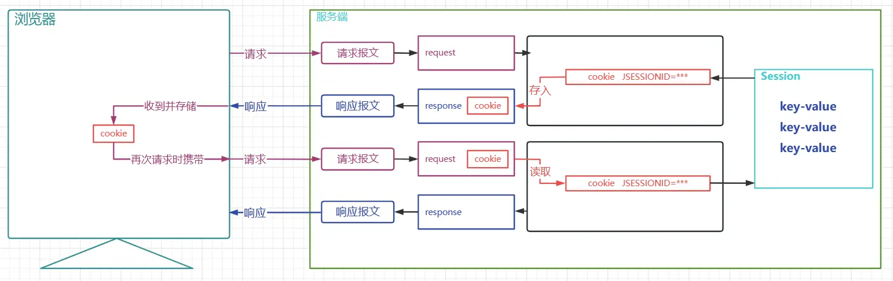
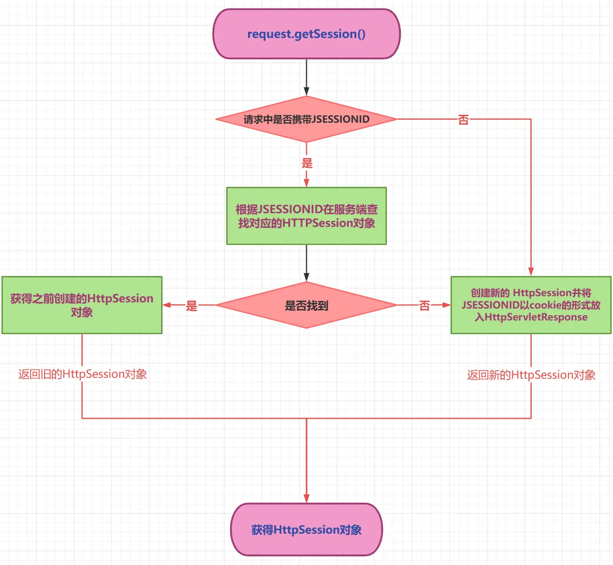
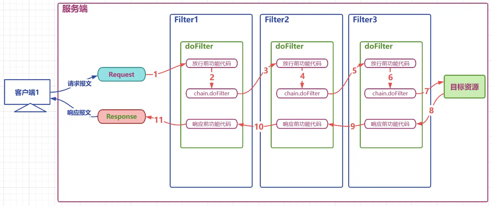
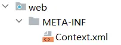
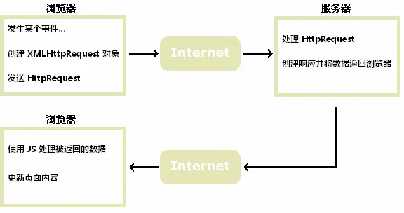

# 第六章 会话、过滤器、监听器

## 一、会话

### 1.1 会话管理概述

#### 1.1.1 为什么需要会话管理

**HTTP 是无状态协议**

+ 无状态就是不保存状态，即无状态协议(stateless)，HTTP 协议自身不对请求和响应之间的通信状态进行保存，也就是说，在 HTTP 协议这个级别，协议对于发送过的请求或者响应都不做持久化处理
+ 简单理解：浏览器发送请求，服务器接收并响应，但是服务器不记录请求是否来自哪个浏览器，服务器没记录浏览器的特征，就是客户端的状态

**举例说明：**

张三去一家饭馆点了几道菜，觉得味道不错，第二天又去了，对老板说，还点上次的那几道菜。

+ 无状态：老板没有记录张三是否来过，更没有记录上次他点了那些菜，张三只能重新再点一遍
+ 有状态：老板把每次来吃饭的用户都做好记录，查阅一下之前的记录，查到了张三之前的菜单，直接下单

#### 1.1.2 会话管理实现的手段

**Cookie 和 Session 配合解决**

+ Cookie 是在客户端保留少量数据的技术，主要通过响应头向客户端响应一些客户端要保留的信息
+ Session 是在服务端保留更多数据的技术，主要通过 HttpSession 对象保存一些和客户端相关的信息
+ Cookie 和 Session 配合记录请求状态

**举例说明：**

+ 张三第一次去某个银行办业务，银行会为张三开户(Session)，并向张三发放一张银行卡(cookie)
+ 张三后面每次去银行，就可以携带之间的银行卡(cookie)，银行根据银行卡找到之前张三的账户(session)

### 1.2 Cookie

#### 1.2.1 Cookie 概述

Cookie 是一种客户端会话技术，由服务端产生并存储在浏览器中的小型数据片段，用于在客户端和服务器之间传递状态信息。

**Cookie 工作机制：**

+ 服务端创建 Cookie 对象，将其放入响应对象中，Tomcat 容器自动将 Cookie 转化为 `Set-Cookie` 响应头，发送给客户端
+ 客户端浏览器接收到 Cookie 后，会将其存储在本地（内存或硬盘）
+ 后续请求该服务器时，浏览器会自动在请求头中添加 `Cookie` 字段，将之前收到的 Cookie 携带到服务器
+ Cookie 以键值对形式存储数据，从 Tomcat 8.5 开始支持中文，但**不推荐使用中文**，建议使用 URL 编码

**Cookie 的特点与限制：**

+ **数据大小限制**：单个 Cookie 不能超过 4KB
+ **数量限制**：不同浏览器对同一域名下的 Cookie 数量有限制（一般 20-50 个）
+ **安全性**：Cookie 存储在客户端，容易被窃取或篡改，**不应存储敏感信息**（如密码、身份证号等）
+ **作用域**：Cookie 默认只能在同一域名下共享，可通过 `setDomain()` 和 `setPath()` 控制作用范围

**原理图：**


**应用场景举例：**

1. **记录用户名**：当我们在用户名的输入框中输入完用户名后，浏览器记录用户名，下一次再访问登录页面时，用户名自动填充到用户名的输入框。
2. **保存电影播放进度**：在网页上播放电影的时候，如果中途退出浏览器了，下载再打开浏览器播放同一部电影的时候，会自动跳转到上次退出时候的进度，因为在播放的时候会将播放进度保存到 cookie 中

#### 1.2.2 Cookie 的使用

**示例 1：ServletA 向响应中添加 Cookie**

``` java
@WebServlet("/servletA")
public class ServletA extends HttpServlet {
    @Override
    protected void service(HttpServletRequest req, HttpServletResponse resp) throws ServletException, IOException {
        // 创建Cookie
        Cookie cookie1 =new Cookie("c1","c1_message");
        Cookie cookie2 =new Cookie("c2","c2_message");
        // 将cookie放入响应对象
        resp.addCookie(cookie1);
        resp.addCookie(cookie2);
    }
}
```

**示例 2：ServletB 从请求中读取 Cookie**

``` java
@WebServlet("/servletB")
public class ServletB extends HttpServlet {
    @Override
    protected void service(HttpServletRequest req, HttpServletResponse resp) throws ServletException, IOException {
        //获取请求中的cookie
        Cookie[] cookies = req.getCookies();
        // 请求中的多个 cookie 会进入该数组 请求中如果没有 cookie，cookies 数组为 null
        if (null != cookies && cookies.length!= 0) {
            for (Cookie cookie : cookies) {
                System.out.println(cookie.getName()+":"+cookie.getValue());
            }
        }
    }
}
```

#### 1.2.3  Cookie 的时效性

Cookie 的生命周期由 `setMaxAge(int expiry)` 方法控制，参数单位为**秒**。

**Cookie 时效性分类：**

| 类型              | MaxAge 设置 | 存储位置  | 生命周期    | 应用场景                |
|:----------------|:----------|:------|:--------|:--------------------|
| **会话级 Cookie**  | 不设置或 `-1` | 浏览器内存 | 浏览器关闭前  | 临时购物车、临时登录状态        |
| **持久化 Cookie**  | 正整数(秒)    | 浏览器硬盘 | 指定时间后过期 | 记住用户名、7 天免登录、视频播放进度 |
| **立即删除 Cookie** | `0`       | -     | 立即失效    | 用户登出、清除历史记录         |

**时效性控制详解：**

- **会话级 Cookie(默认)**
  - 服务器端不调用 `setMaxAge()` 或设置为 `-1`
  - Cookie 数据存储在**浏览器内存**中，浏览器关闭后立即释放
  - 适用于临时性数据，如短期会话状态
- **持久化 Cookie**
  - 调用 `setMaxAge(秒数)` 设置存活时间，如 `setMaxAge(7*24*60*60)` 表示 7 天
  - Cookie 数据持久化到**浏览器硬盘**，不受浏览器关闭影响
  - 到达预设时间后自动过期，适用于"记住我"、播放进度保存等功能
- **删除 Cookie**
  - 调用 `setMaxAge(0)` 可立即删除浏览器中已存在的 Cookie
  - **注意**：删除时需确保 Cookie 的 `name`、`path`、`domain` 与原 Cookie 完全一致

**示例 1：ServletA 设置持久化 Cookie**

``` java
@WebServlet("/servletA")
public class ServletA extends HttpServlet {
    @Override
    protected void service(HttpServletRequest req, HttpServletResponse resp) throws ServletException, IOException {
        // 创建Cookie
        Cookie cookie1 =new Cookie("c1","c1_message");
        cookie1.setMaxAge(60);
        Cookie cookie2 =new Cookie("c2","c2_message");
        // 将cookie放入响应对象
        resp.addCookie(cookie1);
        resp.addCookie(cookie2);
    }
}
```

**示例 2：ServletB 接收 Cookie(浏览器重启后测试)**

``` java
@WebServlet("/servletB")
public class ServletB extends HttpServlet {
    @Override
    protected void service(HttpServletRequest req, HttpServletResponse resp) throws ServletException, IOException {
        //获取请求中的cookie
        Cookie[] cookies = req.getCookies();
        //迭代cookies数组
        if (null != cookies && cookies.length!= 0) {
            for (Cookie cookie : cookies) {
                System.out.println(cookie.getName()+":"+cookie.getValue());
            }
        }
    }
}
```

#### 1.2.4 Cookie 的提交路径

访问互联网资源时不能每次都需要把所有 Cookie 带上。访问不同的资源时，可以携带不同的 cookie，可以通过 cookie 的 setPath(String path) 对 cookie 的路径进行设置

**从 ServletA 中获取 cookie**

``` java
public class ServletA extends HttpServlet {
    @Override
    protected void service(HttpServletRequest req, HttpServletResponse resp) throws ServletException, IOException {
        // 创建Cookie
        Cookie cookie1 =new Cookie("c1","c1_message");
        // 设置cookie的提交路径
        cookie1.setPath("/web03_war_exploded/servletB");
        Cookie cookie2 =new Cookie("c2","c2_message");
        // 将cookie放入响应对象
        resp.addCookie(cookie1);
        resp.addCookie(cookie2);
    }
}
```

**结果**：向 ServletB 请求时携带携带了 c1，向其他资源请求时就不携带 c1 了

#### 1.2.5 Cookie 安全性最佳实践

**Cookie 安全风险：**

+ **XSS 攻击**：恶意脚本通过 `document.cookie` 窃取 Cookie
+ **CSRF 攻击**：跨站请求伪造利用用户的 Cookie 发起恶意请求
+ **中间人攻击**：HTTP 明文传输时 Cookie 可能被截获

**安全防护措施：**

| 属性           | 设置方法                | 作用                      | 应用场景                                |
|:-------------|:--------------------|:------------------------|:------------------------------------|
| **HttpOnly** | `setHttpOnly(true)` | 禁止 JavaScript 访问 Cookie | 防止 XSS 攻击，保护敏感 Cookie(如 JSESSIONID) |
| **Secure**   | `setSecure(true)`   | 仅通过 HTTPS 传输 Cookie     | 生产环境必须启用，防止中间人攻击                    |
| **SameSite** | 通过响应头设置             | 限制跨站请求携带 Cookie         | 防止 CSRF 攻击(需服务器配置)                  |

**代码示例：**

```java
@WebServlet("/secureServlet")
public class SecureServlet extends HttpServlet {
    @Override
    protected void service(HttpServletRequest req, HttpServletResponse resp) 
            throws ServletException, IOException {
        // 创建敏感Cookie
        Cookie sessionCookie = new Cookie("userToken", "encrypted_token_value");
        
        // 安全配置
        sessionCookie.setHttpOnly(true);     // 防止XSS攻击
        sessionCookie.setSecure(true);       // 仅HTTPS传输
        sessionCookie.setPath("/");           // 限制作用域
        sessionCookie.setMaxAge(30 * 60);    // 30分钟有效期
        
        resp.addCookie(sessionCookie);
    }
}
```

**安全建议：**

1. **敏感信息加密存储**：Cookie 中不存储明文密码、身份证号等
2. **使用 HTTPS**：生产环境强制 HTTPS，避免 Cookie 被明文窃取
3. **最小化存储**：仅存储必要数据，大数据存储在 Session 中
4. **及时清理**：用户登出时立即删除相关 Cookie
5. **域名限制**：通过 `setDomain()` 限制 Cookie 的有效域名范围

### 1.3 Session

#### 1.3.1 HttpSession 概述

HttpSession 是一种在服务端保留更多信息的技术。服务器会为每一个客户端开辟一块内存空间，即 Session 对象。客户端在发送请求时都可以使用自己的 Session，这样服务端就可以通过 Session 来记录某个客户端的状态了。

+ 服务端在为客户端创建 session 时，会同时将 session 对象的 id，即 JSESSIONID 以 cookie 的形式放入响应对象
+ 后端创建完 session 后，客户端会收到一个特殊的 cookie，叫做 JSESSIONID
+ 客户端下一次请求时携带 JSESSIONID，后端收到后，根据 JSESSIONID 找到对应的 session 对象
+ 通过该机制，服务端通过 session 就可以存储一些专门针对某个客户端的信息了
+ Session 也是域对象

**原理图：**



**应用场景：**

1. **记录用户的登录状态**：用户登录后，将用户的账号等敏感信息存入 Session
2. **记录用户操作的历史** ：例如记录用户的访问痕迹、用户的购物车信息等临时性的信息

#### 1.3.2 HttpSession 的使用

**场景说明：** 用户提交表单到 ServletA 携带用户名，ServletA 获取 Session 将用户名存入，用户再请求其他任意 Servlet 可获取之前存储的用户信息。

**步骤 1：定义表单页**

``` html
<form action="servletA" method="post">
    用户名:
    <input type="text" name="username">
    <input type="submit" value="提交">
</form>
```

**步骤 2：定义 ServletA，将用户名存入 session，响应中收到 JSESSIONID**

``` java
@WebServlet("/servletA")
public class ServletA extends HttpServlet {
    @Override
    protected void service(HttpServletRequest req, HttpServletResponse resp) throws ServletException, IOException {
        // 获取请求中的参数
        String username = req.getParameter("username");
        // 获取session对象
        HttpSession session = req.getSession();
         // 获取Session的ID
        String jSessionId = session.getId();
        System.out.println(jSessionId);
        // 判断session是不是新创建的session
        boolean isNew = session.isNew();
        System.out.println(isNew);
        // 向session对象中存入数据
        session.setAttribute("username",username);
    }
}
```

**步骤 3：定义 ServletB 从 Session 中读取用户名，请求中携带 JSESSIONID**

``` java
@WebServlet("/servletB")
public class ServletB extends HttpServlet {
    @Override
    protected void service(HttpServletRequest req, HttpServletResponse resp) throws ServletException, IOException {
        // 获取session对象
        HttpSession session = req.getSession();
         // 获取Session的ID
        String jSessionId = session.getId();
        System.out.println(jSessionId);
        // 判断session是不是新创建的session
        boolean isNew = session.isNew();
        System.out.println(isNew);
        // 从session中取出数据
        String username = (String)session.getAttribute("username");
        System.out.println(username);
    }
}
```

**getSession() 方法的处理逻辑：**



**工作流程说明：**

```java
// getSession() 方法的内部处理逻辑
HttpSession session = req.getSession();

/**
 * 执行步骤：
 * 1. 检查请求中是否携带 JSESSIONID Cookie
 * 2. 如果有 JSESSIONID：
 *    - 在服务器中查找对应的 Session 对象
 *    - 找到则返回该 Session(isNew()返回false)
 *    - 未找到(可能已过期)则创建新 Session(isNew()返回true)
 * 3. 如果没有 JSESSIONID：
 *    - 创建新的 Session 对象
 *    - 生成唯一的 JSESSIONID
 *    - 通过 Set-Cookie 响应头发送给客户端
 *    - isNew()返回true
 */
```

**相关 API 说明：**

| 方法                      | 说明                                        |
|:------------------------|:------------------------------------------|
| `req.getSession()`      | 获取 Session，不存在则创建新的                       |
| `req.getSession(true)`  | 同上，与 `getSession()` 效果一致                  |
| `req.getSession(false)` | 获取 Session，不存在则返回 `null`，**不创建新 Session** |
| `session.getId()`       | 获取 Session 的 JSESSIONID                   |
| `session.isNew()`       | 判断是否为新创建的 Session                         |

#### 1.3.3 HttpSession 时效性

**为什么需要设置 Session 时效？**

+ **内存管理**：用户量大时，Session 对象会大量创建并占用服务器内存。若不及时释放，可能导致内存溢出(OOM)
+ **客户端状态不可知**：服务端无法直接检测客户端是否关闭浏览器或离开网站
+ **安全性考虑**：长时间不活动的 Session 应自动失效，防止会话劫持等安全风险

**Session 时效性配置方式：**

**方式一：Tomcat 全局配置(默认 30 分钟)**

在 `tomcat/conf/web.xml` 中配置，影响所有部署的应用：

```xml
<session-config>
    <session-timeout>30</session-timeout> <!-- 单位：分钟 -->
</session-config>
```

**方式二：项目级配置(推荐)**

在项目的 `web.xml` 中配置，仅影响当前应用：

```xml
<session-config>
    <session-timeout>60</session-timeout> <!-- 设置为60分钟 -->
</session-config>
```

**方式三：编程式配置（动态设置）**

通过 `HttpSession` API 动态设置，**单位为秒**：

```java
// 设置最大闲置时间为 60 秒(1分钟)
session.setMaxInactiveInterval(60);

// 获取当前最大闲置时间(秒)
int timeout = session.getMaxInactiveInterval();
```

**方式四：手动销毁 Session**

适用于用户主动登出等场景：

```java
// 立即使 session 失效，释放相关资源
session.invalidate();
```

::: tip 配置建议
- 一般网站：30 分钟
- 电商/支付类：15-20 分钟(安全性要求高)
- 后台管理系统：2-4 小时(便于长时间操作)
- 金融类应用：5-10 分钟(高安全级别)
:::

### 1.4 三大域对象

#### 1.4.1 域对象概述

**什么是域对象？**

域对象是用于存储数据和传递数据的对象。传递数据的范围不同，我们称之为不同的域。不同的域对象代表不同的域，共享数据的范围也不同。

+ **请求域对象**：`HttpServletRequest`，传递数据的范围是一次请求之内及请求转发
+ **会话域对象**：`HttpSession`，传递数据的范围是一次会话之内，可以跨多个请求
+ **应用域对象**：`ServletContext`，传递数据的范围是本应用之内，可以跨多个会话

**生活举例**：热水器摆放位置不同，使用的范围就不同

1. 摆在张三工位下，就只有张三一个人能用(类似请求域)
2. 摆在办公室的公共区，办公室内的所有人都可以用(类似会话域)
3. 摆在楼层的走廊区，该楼层的所有人都可以用(类似应用域)

**三大域对象的数据作用范围图解：**


#### 1.4.2 域对象的使用

**域对象的 API：**

| API                                           | 功能           |
|-----------------------------------------------|--------------|
| `void setAttribute(String name,String value)` | 向域对象中添加/修改数据 |
| `Object getAttribute(String name); `          | 从域对象中获取数据    |
| `removeAttribute(String name);`               | 移除域对象中的数据    |

**API 测试：**

+ ServletA 向三大域中放入数据

``` java
@WebServlet("/servletA")
public class ServletA extends HttpServlet {
    @Override
    protected void service(HttpServletRequest req, HttpServletResponse resp) throws ServletException, IOException {
        // 向请求域中放入数据
        req.setAttribute("request","request-message");
        //req.getRequestDispatcher("servletB").forward(req,resp);
        // 向会话域中放入数据
        HttpSession session = req.getSession();
        session.setAttribute("session","session-message");
        // 向应用域中放入数据
        ServletContext application = getServletContext();
        application.setAttribute("application","application-message");
    }
}
```

+ ServletB 从三大于中取出数据

``` java
@WebServlet("/servletB")
public class ServletB extends HttpServlet {
    @Override
    protected void service(HttpServletRequest req, HttpServletResponse resp) throws ServletException, IOException {
        // 从请求域中获取数据
        String reqMessage =(String)req.getAttribute("request");
        System.out.println(reqMessage);
        
        // 从会话域中获取数据
        HttpSession session = req.getSession();
        String sessionMessage =(String)session.getAttribute("session");
        System.out.println(sessionMessage);
        // 从应用域中获取数据
        ServletContext application = getServletContext();
        String applicationMessage =(String)application.getAttribute("application");
        System.out.println(applicationMessage);
    }
}
```

**三大域对象的使用场景与注意事项：**

| 域对象             | 作用范围  | 生命周期             | 典型应用场景                          | 注意事项                   |
|:----------------|:------|:-----------------|:--------------------------------|:-----------------------|
| **Request**     | 一次请求内 | 请求开始到响应结束        | 查询结果数据、表单验证错误信息、请求转发数据传递        | 仅在请求转发时有效，重定向会丢失       |
| **Session**     | 一次会话内 | 用户首次访问到会话超时或主动销毁 | 用户登录信息、购物车数据、用户偏好设置、多步骤向导       | 注意及时清理，避免内存泄漏，设置合理超时时间 |
| **Application** | 整个应用  | 服务器启动到关闭         | 全局配置信息、应用计数器、Spring IOC 容器、全局缓存 | 线程安全问题，数据所有用户可见，谨慎修改   |

**使用原则：**

+ **请求域(Request)**：优先使用，生命周期最短，资源占用最小
  - 适用于本次请求的业务数据传递，如查询到的部门列表、商品详情等
  - **注意**：请求转发(`forward`)时有效，重定向(`redirect`)时数据丢失
  - **示例**：`req.setAttribute("deptList", deptList)`
+ **会话域(Session)**：需要跨请求保持状态时使用
  - 适用于用户相关的临时数据，如登录用户信息、购物车、多步骤表单的中间数据
  - **注意**：避免存储大量数据，及时清理过期数据，防止内存溢出
  - **示例**：`session.setAttribute("loginUser", user)`
+ **应用域(Application)**：谨慎使用，仅用于全局共享数据
  - 适用于应用级配置、全局缓存、访问统计等所有用户共享的数据
  - **注意**：需考虑线程安全问题（使用同步机制），数据对所有用户可见，修改需谨慎
  - **示例**：`application.setAttribute("visitCount", count)`

**最佳实践**：遵循"**能小不大**"原则，优先使用作用范围最小的域对象，避免数据泄漏和资源浪费

## 二、过滤器

### 2.1 过滤器概述

**什么是过滤器？**

Filter(过滤器)是 JavaEE 技术规范之一，用于对目标资源的请求进行过滤和预处理，是 Java Web 项目中`最为实用的技术之一`。

**过滤器核心特性：**

+ **拦截请求**：Filter 的工作位置在目标资源之前，容器创建 HttpServletRequest 和 HttpServletResponse 后，会先调用 Filter 的 doFilter 方法
+ **控制放行**：doFilter 方法可以决定请求是否继续(放行)或拒绝(拦截)
+ **双向过滤**：不仅可以过滤请求，还可以在响应前再次处理响应内容
+ **责任链模式**：Filter 是 GOF 责任链模式的典型实现

**常见应用场景：**

| 场景       | 具体应用         | 示例                  |
|:---------|:-------------|:--------------------|
| **权限控制** | 登录校验、角色鉴权    | 未登录用户访问受保护资源时重定向登录页 |
| **编码处理** | 请求/响应编码转换    | 解决中文乱码问题            |
| **日志记录** | 请求日志、性能分析    | 记录用户访问路径、耗时统计       |
| **内容过滤** | 敏感词过滤、XSS 防护 | 过滤用户输入的敏感字符         |
| **事务控制** | 数据库事务统一管理    | 自动开启和提交事务           |
| **跨域处理** | CORS 响应头设置   | 解决前后端分离的跨域问题        |

**生活中的过滤器类比：**

+ **公司前台**：审核来访人员，游客拒绝，客户放行并提醒离开时不要遗忘物品
+ **停车场安保**：检查车位，无车位拒绝，有车位发放停车卡并放行，离开时收取停车费
+ **地铁闸机**：验票后放行，无票拒绝

**过滤器工作位置图解：**


**Filter 接口 API 说明：**

| API                                                                                         | 目标                                     |
|---------------------------------------------------------------------------------------------|----------------------------------------|
| `default public void init(FilterConfig filterConfig)`                                       | 初始化方法，由容器调用并传入初始配置信息 filterConfig 对象   |
| `public void doFilter(ServletRequest request, ServletResponse response, FilterChain chain)` | 过滤方法，核心方法，过滤请求，决定是否放行，响应之前的其他处理等都在该方法中 |
| `default public void destroy()`                                                             | 销毁方法，容器在回收过滤器对象之前调用的方法                 |

### 2.2 过滤器使用

**目标：** 开发一个日志记录过滤器

**功能需求：**

+ 用户请求到达目标资源之前，记录用户的请求资源路径
+ 响应之前记录本次请求目标资源运算的耗时
+ 可以选择将日志记录进入文件，为了方便测试，这里将日志直接在控制台打印

**步骤 1：定义一个过滤器类**

``` java
package com.bombax.filters;

import jakarta.servlet.*;
import jakarta.servlet.http.HttpServletRequest;
import jakarta.servlet.http.HttpServletResponse;

import java.io.IOException;
import java.text.SimpleDateFormat;
import java.util.Date;
public class LoggingFilter implements Filter {

    private SimpleDateFormat dateFormat = new SimpleDateFormat("yyyy-MM-dd HH:mm:ss");
    @Override
    public void doFilter(ServletRequest servletRequest, ServletResponse servletResponse, FilterChain filterChain) throws IOException, ServletException {
        // 参数父转子
        HttpServletRequest request =(HttpServletRequest)  servletRequest;
        HttpServletResponse  response =(HttpServletResponse)  servletResponse;
        // 拼接日志文本
        String requestURI = request.getRequestURI();
        String time = dateFormat.format(new Date());
        String beforeLogging =requestURI+"在"+time+"被请求了";
        // 打印日志
        System.out.println(beforeLogging);
        // 获取系统时间
        long t1 = System.currentTimeMillis();
        // 放行请求
        filterChain.doFilter(request,response);
        // 获取系统时间
        long t2 = System.currentTimeMillis();
        //  拼接日志文本
        String afterLogging =requestURI+"在"+time+"的请求耗时:"+(t2-t1)+"毫秒";
        // 打印日志
        System.out.println(afterLogging);
    }
}
```

**代码说明：**

+ `doFilter` 方法中的请求和响应对象是以父接口的形式声明的，实际传入的实参就是 `HttpServletRequest` 和 `HttpServletResponse` 子接口级别的，可以安全强转
+ `filterChain.doFilter(request,response);` 这行代码的功能是**放行请求**，如果没有这一行代码，则请求到此为止
+ `filterChain.doFilter(request,response);` 在放行时需要传入 `request` 和 `response`，意味着请求和响应对象要继续传递给后续的资源，这里没有产生新的 `request` 和 `response` 对象

**步骤 2：定义目标 Servlet 资源**

**ServletA：**

``` java 
@WebServlet(urlPatterns = "/servletA",name = "servletAName")
public class ServletA extends HttpServlet {
    @Override
    protected void service(HttpServletRequest req, HttpServletResponse resp) throws ServletException, IOException {
        // 处理器请求
        System.out.println("servletA处理请求的方法，耗时10毫秒");
        // 模拟处理请求耗时
        try {
            Thread.sleep(10);
        } catch (InterruptedException e) {
            throw new RuntimeException(e);
        }
    }
}
```

+ ServletB

``` java 
@WebServlet(urlPatterns = "/servletB", name = "servletBName")
public class ServletB extends HttpServlet {
    @Override
    protected void service(HttpServletRequest req, HttpServletResponse resp) throws ServletException， IOException {
        // 处理器请求
        System.out.println("servletB处理请求的方法,耗时15毫秒");
        // 模拟处理请求耗时
        try {
            Thread.sleep(15);
        } catch (InterruptedException e) {
            throw new RuntimeException(e);
        }
    }
}
```

**步骤 3：配置过滤器及过滤范围**

在 `web.xml` 中配置：

``` xml
<?xml version="1.0" encoding="UTF-8"?>
<web-app xmlns="https://jakarta.ee/xml/ns/jakartaee"
         xmlns:xsi="http://www.w3.org/2001/XMLSchema-instance"
         xsi:schemaLocation="https://jakarta.ee/xml/ns/jakartaee https://jakarta.ee/xml/ns/jakartaee/web-app_5_0.xsd"
         version="5.0">

    <!--配置filter，并为filter起别名-->
   <filter>
       <filter-name>loggingFilter</filter-name>
       <filter-class>com.bombax.filters.LoggingFilter</filter-class>
   </filter>
    <!--为别名对应的filter配置要过滤的目标资源-->
    <filter-mapping>
        <filter-name>loggingFilter</filter-name>
        <!--通过映射路径确定过滤资源-->
        <url-pattern>/servletA</url-pattern>
        <!--通过后缀名确定过滤资源-->
        <url-pattern>*.html</url-pattern>
        <!--通过servlet别名确定过滤资源-->
        <servlet-name>servletBName</servlet-name>
    </filter-mapping>
</web-app>
```

**配置说明：**

+ `filter-mapping` 标签中定义了过滤器对哪些资源进行过滤
+ 子标签 `url-pattern` 通过映射路径确定过滤范围：
  - `/servletA` - 精确匹配，表示对 servletA 资源的请求进行过滤
  - `*.html` - 表示对以 .html 结尾的路径进行过滤
  - `/*` - 表示对所有资源进行过滤
  - 一个 `filter-mapping` 下可以配置多个 `url-pattern`
+ 子标签 `servlet-name` 通过 servlet 别名确定对哪些 servlet 进行过滤
  - 使用该标签确定目标资源的前提是 servlet 已经起了别名
  - 一个 `filter-mapping` 下可以定义多个 `servlet-name`
  - 一个 `filter-mapping` 下，`servlet-name` 和 `url-pattern` 子标签可以同时存在

**过滤过程图解：**


### 2.3 过滤器生命周期

过滤器作为 Web 项目的组件之一，和 Servlet 的生命周期类似但略有不同。过滤器没有 `load-on-startup` 的配置，默认在系统启动时立刻构造。

**生命周期阶段：**

| 阶段       | 对应方法                                                          | 执行时机      | 执行次数 | 说明                   |
|----------|---------------------------------------------------------------|-----------|------|----------------------|
| **创建对象** | 构造器                                                           | Web 应用启动时 | 1    | 服务器启动时立即创建 Filter 实例 |
| **初始化**  | `void init(FilterConfig filterConfig)`                        | 构造完毕后     | 1    | 可获取初始化参数，完成资源加载      |
| **过滤请求** | `void doFilter(ServletRequest, ServletResponse, FilterChain)` | 每次请求      | 多次   | 核心方法，处理请求过滤逻辑        |
| **销毁**   | `default void destroy()`                                      | Web 应用关闭时 | 1    | 释放资源（如关闭文件流、数据库连接等）  |

**生命周期详细说明：**

1. **创建阶段**
   - Web 应用启动时，服务器自动扫描并创建所有 Filter 对象
   - **与 Servlet 的区别**：Servlet 默认首次访问时创建，Filter 一定是启动时创建
2. **初始化阶段**
   ```java
   @Override
   public void init(FilterConfig filterConfig) throws ServletException {
       // 获取初始化参数
       String encoding = filterConfig.getInitParameter("encoding");
       // 初始化资源(如数据库连接池、配置文件等)
   }
   ```
   - `FilterConfig` 对象包含 Filter 的配置信息
   - 只执行一次，适合进行一次性的初始化工作
3. **过滤阶段**
   - 每次请求匹配过滤器时都会调用 `doFilter()` 方法
   - **必须调用** `chain.doFilter(request, response)` 才能放行请求
4. **销毁阶段**
   ```java
   @Override
   public void destroy() {
       // 释放资源(关闭文件流、数据库连接等)
       System.out.println("Filter 销毁");
   }
   ```
   - 服务器正常关闭或项目重新部署时调用
   - 用于清理资源，防止内存泄漏

**测试代码：**

``` java
package com.bombax.filters;

import jakarta.servlet.*;
import jakarta.servlet.annotation.WebServlet;

import java.io.IOException;

@WebServlet("/*")
public class LifeCycleFilter implements Filter {
    public LifeCycleFilter(){
        System.out.println("LifeCycleFilter constructor method invoked");
    }
    
    @Override
    public void init(FilterConfig filterConfig) throws ServletException {
        System.out.println("LifeCycleFilter init method invoked");
    }

    @Override
    public void doFilter(ServletRequest servletRequest, ServletResponse servletResponse, FilterChain filterChain) throws IOException, ServletException {
        System.out.println("LifeCycleFilter doFilter method invoked");
        filterChain.doFilter(servletRequest,servletResponse);
    }

    @Override
    public void destroy() {
        System.out.println("LifeCycleFilter destory method invoked");
    }
}
```

### 2.4 过滤器链的使用

**过滤器链概念：**

一个 Web 项目中可以同时定义多个过滤器，当多个过滤器对同一个资源进行过滤时，工作位置有先后顺序，整体形成一个工作链，称为**过滤器链(Filter Chain)**。

**过滤器链的特点：**

+ 每个过滤器过滤的范围不同，针对同一个资源，过滤器链中的过滤器个数可能不同
+ 过滤器按顺序执行，形成"洋葱模型"的嵌套结构

**过滤器执行顺序规则(重要)：**

| 配置方式                | 执行顺序决定因素                 | 优先级 |
|:--------------------|:-------------------------|:----|
| **XML 配置**          | `<filter-mapping>` 的配置顺序 | 最高  |
| **注解配置**            | 类名字典序(A-Z)               | 较低  |
| **servlet-name 匹配** | 执行优先级最低                  | 最低  |

**注意事项：**

1. **XML 配置优先级最高**
   ```xml
   <!-- 执行顺序：filter1 -> filter2 -> filter3 -->
   <filter-mapping>
       <filter-name>filter1</filter-name>
       <url-pattern>/servletC</url-pattern>
   </filter-mapping>
   <filter-mapping>
       <filter-name>filter2</filter-name>
       <url-pattern>/servletC</url-pattern>
   </filter-mapping>
   ```

2. **注解配置按类名排序**
   - `AFilter` 会在 `BFilter` 之前执行
   - **建议**：生产环境使用 XML 配置，更可控

3. **servlet-name 匹配优先级低**
   - 使用 `<servlet-name>` 匹配的 Filter 执行顺序最后

4. **嵌套执行逻辑**
   ```
   Filter1 前置处理
     -> Filter2 前置处理
       -> Filter3 前置处理
         -> Servlet 执行
       <- Filter3 后置处理
     <- Filter2 后置处理
   <- Filter1 后置处理
   ```

**过滤器链工作原理图：**


**过滤器链功能测试：**

定义三个过滤器对目标资源 ServletC 的请求进行过滤。

**步骤 1：目标 Servlet 资源**

``` java
package com.bombax.servlet;

import jakarta.servlet.ServletException;
import jakarta.servlet.annotation.WebServlet;
import jakarta.servlet.http.HttpServlet;
import jakarta.servlet.http.HttpServletRequest;
import jakarta.servlet.http.HttpServletResponse;

import java.io.IOException;

@WebServlet("/servletC")
public class ServletC extends HttpServlet {
    @Override
    protected void service(HttpServletRequest req, HttpServletResponse resp) throws ServletException, IOException {
        System.out.println("servletC service method  invoked");
    }
}
```

**步骤 2：定义三个过滤器**

``` java
public class Filter1 implements Filter {
    @Override
    public void doFilter(ServletRequest servletRequest, ServletResponse servletResponse, FilterChain filterChain) throws IOException, ServletException {
        System.out.println("filter1 before chain.doFilter code invoked");

        filterChain.doFilter(servletRequest,servletResponse);

        System.out.println("filter1 after  chain.doFilter code invoked");
    }
}

public class Filter2 implements Filter {
    @Override
    public void doFilter(ServletRequest servletRequest, ServletResponse servletResponse, FilterChain filterChain) throws IOException, ServletException {
        System.out.println("filter2 before chain.doFilter code invoked");

        filterChain.doFilter(servletRequest,servletResponse);

        System.out.println("filter2 after  chain.doFilter code invoked");
    }
}

public class Filter3 implements Filter {
    @Override
    public void doFilter(ServletRequest servletRequest, ServletResponse servletResponse, FilterChain filterChain) throws IOException, ServletException {
        System.out.println("filter3 before chain.doFilter code invoked");

        filterChain.doFilter(servletRequest,servletResponse);

        System.out.println("filter3 after  chain.doFilter code invoked");
    }
}
```

**步骤 3：配置过滤器链**

``` xml
<?xml version="1.0" encoding="UTF-8"?>
<web-app xmlns="https://jakarta.ee/xml/ns/jakartaee"
         xmlns:xsi="http://www.w3.org/2001/XMLSchema-instance"
         xsi:schemaLocation="https://jakarta.ee/xml/ns/jakartaee https://jakarta.ee/xml/ns/jakartaee/web-app_5_0.xsd"
         version="5.0">
    <filter>
        <filter-name>filter1</filter-name>
        <filter-class>com.bombax.filters.Filter1</filter-class>
    </filter>

    <filter>
        <filter-name>filter2</filter-name>
        <filter-class>com.bombax.filters.Filter2</filter-class>
    </filter>

    <filter>
        <filter-name>filter3</filter-name>
        <filter-class>com.bombax.filters.Filter3</filter-class>
    </filter>

    <!--filter-mapping的顺序决定了过滤器的工作顺序-->
    <filter-mapping>
        <filter-name>filter1</filter-name>
        <url-pattern>/servletC</url-pattern>
    </filter-mapping>

    <filter-mapping>
        <filter-name>filter2</filter-name>
        <url-pattern>/servletC</url-pattern>
    </filter-mapping>

    <filter-mapping>
        <filter-name>filter3</filter-name>
        <url-pattern>/servletC</url-pattern>
    </filter-mapping>

</web-app>
```

::: warning
`filter-mapping` 的顺序决定了过滤器的工作顺序。
:::

**工作流程图解：**



### 2.5 注解方式配置过滤器

**`@WebFilter`注解的使用：**

- 源码

``` java
package jakarta.servlet.annotation;

import jakarta.servlet.DispatcherType;
import java.lang.annotation.Documented;
import java.lang.annotation.ElementType;
import java.lang.annotation.Retention;
import java.lang.annotation.RetentionPolicy;
import java.lang.annotation.Target;

@Target({ElementType.TYPE})
@Retention(RetentionPolicy.RUNTIME)
@Documented
public @interface WebFilter {
    String description() default "";

    String displayName() default "";

    WebInitParam[] initParams() default {};

    String filterName() default "";

    String smallIcon() default "";

    String largeIcon() default "";

    String[] servletNames() default {};

    String[] value() default {};

    String[] urlPatterns() default {};

    DispatcherType[] dispatcherTypes() default {DispatcherType.REQUEST};

    boolean asyncSupported() default false;
}
```

+ 一个比较完整的 Filter 的 XML 配置

``` xml
<!--配置filter,并为filter起别名-->
<filter>
    <filter-name>loggingFilter</filter-name>
    <filter-class>com.bombax.filters.LoggingFilter</filter-class>
    <!--配置filter的初始参数-->
    <init-param>
        <param-name>dateTimePattern</param-name>
        <param-value>yyyy-MM-dd HH:mm:ss</param-value>
    </init-param>
</filter>
<!--为别名对应的filter配置要过滤的目标资源-->
<filter-mapping>
    <filter-name>loggingFilter</filter-name>
    <!--通过映射路径确定过滤资源-->
    <url-pattern>/servletA</url-pattern>
    <!--通过后缀名确定过滤资源-->
    <url-pattern>*.html</url-pattern>
    <!--通过servlet别名确定过滤资源-->
    <servlet-name>servletBName</servlet-name>
</filter-mapping>
```

+ 将 xml 配置转换成注解方式实现

``` java
package com.bombax.filters;

import jakarta.servlet.*;
import jakarta.servlet.annotation.WebFilter;
import jakarta.servlet.annotation.WebInitParam;
import jakarta.servlet.http.HttpServletRequest;
import jakarta.servlet.http.HttpServletResponse;

import java.io.IOException;
import java.text.SimpleDateFormat;
import java.util.Date;

@WebFilter(
        filterName = "loggingFilter",
        initParams = {@WebInitParam(name="dateTimePattern",value="yyyy-MM-dd HH:mm:ss")},
        urlPatterns = {"/servletA","*.html"},
        servletNames = {"servletBName"}
)
public class LoggingFilter implements Filter {
    private SimpleDateFormat dateFormat;

    /**
     * init 初始化方法,通过 FilterConfig 获取初始化参数
     * init 方法中可用于定义其他初始化功能代码
     */
    @Override
    public void init(FilterConfig filterConfig) throws ServletException {
        // 1. 获取单个初始化参数
        String dateTimePattern = filterConfig.getInitParameter("dateTimePattern");
        
        // 2. 获取所有参数名
        // Enumeration<String> paramNames = filterConfig.getInitParameterNames();
        
        // 3. 获取 Filter 名称
        // String filterName = filterConfig.getFilterName();
        
        // 4. 获取 ServletContext 对象
        // ServletContext servletContext = filterConfig.getServletContext();
        
        // 初始化成员变量
        dateFormat = new SimpleDateFormat(dateTimePattern);
    }
	
    @Override
    public void doFilter(ServletRequest servletRequest, ServletResponse servletResponse, FilterChain filterChain) throws IOException, ServletException {
        // 参数父转子
        HttpServletRequest request = (HttpServletRequest) servletRequest;
        HttpServletResponse response = (HttpServletResponse) servletResponse;
        // 拼接日志文本
        String requestURI = request.getRequestURI();
        String time = dateFormat.format(new Date());
        String beforeLogging = requestURI + "在" + time + "被请求了";
        // 打印日志
        System.out.println(beforeLogging);
        // 获取系统时间
        long t1 = System.currentTimeMillis();
        // 放行请求
        filterChain.doFilter(request, response);
        // 获取系统时间
        long t2 = System.currentTimeMillis();
        String afterLogging = requestURI + "在" + time + "的请求耗时:" + (t2 - t1) + "毫秒";
        // 打印日志
        System.out.println(afterLogging);
    }
}
```

**FilterConfig 接口 API 说明：**

| 方法                                            | 功能                   | 示例                                          |
|:----------------------------------------------|:---------------------|:--------------------------------------------|
| `String getInitParameter(String name)`        | 获取指定名称的初始化参数值        | `filterConfig.getInitParameter("encoding")` |
| `Enumeration<String> getInitParameterNames()` | 获取所有初始化参数名           | 用于遍历所有参数                                    |
| `String getFilterName()`                      | 获取过滤器名称              | 日志记录、调试信息                                   |
| `ServletContext getServletContext()`          | 获取 ServletContext 对象 | 访问全局配置、共享数据                                 |

**实际应用示例：**

```java
@WebFilter(
    filterName = "encodingFilter",
    initParams = {
        @WebInitParam(name="encoding", value="UTF-8"),
        @WebInitParam(name="forceEncoding", value="true")
    },
    urlPatterns = {"/*"}
)
public class EncodingFilter implements Filter {
    private String encoding;
    private boolean forceEncoding;
    
    @Override
    public void init(FilterConfig config) throws ServletException {
        // 获取编码配置
        encoding = config.getInitParameter("encoding");
        String force = config.getInitParameter("forceEncoding");
        forceEncoding = "true".equalsIgnoreCase(force);
    }
    
    @Override
    public void doFilter(ServletRequest request, ServletResponse response, 
                         FilterChain chain) throws IOException, ServletException {
        if (forceEncoding || request.getCharacterEncoding() == null) {
            request.setCharacterEncoding(encoding);
            response.setCharacterEncoding(encoding);
        }
        chain.doFilter(request, response);
    }
}
```

## 三、监听器

### 3.1 监听器概述

**什么是监听器？**

监听器是专门用于对域对象身上发生的事件或状态改变进行监听和相应处理的对象。

**监听器的特点：**

+ **观察者模式**：监听器是 GOF 设计模式中观察者模式的典型实现，当被观察对象发生改变时，观察者自动响应
+ **事件驱动**：使用感觉类似 JavaScript 事件，被观察对象发生某些情况时自动触发代码执行
+ **监听范围**：仅监听 **三大域对象**(ServletContext、HttpSession、ServletRequest)的相关事件

**监听器的分类：**

Web 中定义了八个监听器接口，按不同维度分类如下：

| 分类维度      | 监听器类型         | 具体接口                                                                                                              |
|:----------|:--------------|:------------------------------------------------------------------------------------------------------------------|
| **按监听对象** | Application 域 | `ServletContextListener`、`ServletContextAttributeListener`                                                        |
|           | Session 域     | `HttpSessionListener`、`HttpSessionAttributeListener`、`HttpSessionBindingListener`、`HttpSessionActivationListener` |
|           | Request 域     | `ServletRequestListener`、`ServletRequestAttributeListener`                                                        |
| **按监听事件** | 域对象创建/销毁      | `ServletContextListener`、`HttpSessionListener`、`ServletRequestListener`                                           |
|           | 域对象属性增删改      | `ServletContextAttributeListener`、`HttpSessionAttributeListener`、`ServletRequestAttributeListener`                |
|           | Session 特殊监听  | `HttpSessionBindingListener`(绑定/解绑)、`HttpSessionActivationListener`(钝化/活化)                                        |

**实际应用场景：**

| 监听器                               | 应用场景        | 具体示例                                |
|:----------------------------------|:------------|:------------------------------------|
| **ServletContextListener**        | 应用初始化/销毁    | 加载配置文件、初始化 Spring 容器、启动定时任务         |
| **HttpSessionListener**           | 在线用户统计      | 统计在线人数、用户登录日志、Session 数量监控          |
| **ServletRequestListener**        | 请求日志记录      | 记录请求 IP、访问时间、请求参数、性能监控              |
| **AttributeListener**             | 数据变化监听      | 缓存同步、数据审计、敏感操作记录                    |
| **HttpSessionBindingListener**    | 对象绑定监听      | 监听特定对象放入/移出 Session，无需 @WebListener |
| **HttpSessionActivationListener** | Session 持久化 | Session 钝化到硬盘、服务器重启后恢复数据            |

### 3.2 监听器的六个主要接口

#### 3.2.1 Application 域监听器

**ServletContextListener - 监听 ServletContext 对象的创建与销毁**

| 方法名                                         | 作用                   |
|---------------------------------------------|----------------------|
| contextInitialized(ServletContextEvent sce) | ServletContext 创建时调用 |
| contextDestroyed(ServletContextEvent sce)   | ServletContext 销毁时调用 |

::: tip 说明
ServletContextEvent 对象代表从 ServletContext 对象身上捕获到的事件，通过这个事件对象我们可以获取到 ServletContext 对象。
:::

**ServletContextAttributeListener - 监听 ServletContext 中属性的添加、移除和修改**

| 方法名                                                  | 作用                          |
|------------------------------------------------------|-----------------------------|
| attributeAdded(ServletContextAttributeEvent scab)    | 向 ServletContext 中添加属性时调用   |
| attributeRemoved(ServletContextAttributeEvent scab)  | 从 ServletContext 中移除属性时调用   |
| attributeReplaced(ServletContextAttributeEvent scab) | 当 ServletContext 中的属性被修改时调用 |

::: tip 说明
ServletContextAttributeEvent 对象代表属性变化事件，它包含的方法如下：

| 方法名                 | 作用                   |
|---------------------|----------------------|
| getName()           | 获取修改或添加的属性名          |
| getValue()          | 获取被修改或添加的属性值         |
| getServletContext() | 获取 ServletContext 对象 |
:::

**测试代码：**

+ 步骤 1：定义监听器

``` java
package com.bombax.listeners;

import jakarta.servlet.*;
import jakarta.servlet.annotation.WebListener;

@WebListener
public class ApplicationListener implements ServletContextListener , ServletContextAttributeListener {
    // 监听初始化
    @Override
    public void contextInitialized(ServletContextEvent sce) {
        ServletContext application = sce.getServletContext();
        System.out.println("application"+application.hashCode()+" initialized");
    }
    // 监听销毁
    @Override
    public void contextDestroyed(ServletContextEvent sce) {
        ServletContext application = sce.getServletContext();
        System.out.println("application"+application.hashCode()+" destroyed");
    }

    // 监听数据增加
    @Override
    public void attributeAdded(ServletContextAttributeEvent scae) {
        String name = scae.getName();
        Object value = scae.getValue();
        ServletContext application = scae.getServletContext();
        System.out.println("application"+application.hashCode()+" add:"+name+"="+value);
    }

    // 监听数据移除
    @Override
    public void attributeRemoved(ServletContextAttributeEvent scae) {
        String name = scae.getName();
        Object value = scae.getValue();
        ServletContext application = scae.getServletContext();
        System.out.println("application"+application.hashCode()+" remove:"+name+"="+value);
    }
    // 监听数据修改
    @Override
    public void attributeReplaced(ServletContextAttributeEvent scae) {
        String name = scae.getName();
        Object value = scae.getValue();
        ServletContext application = scae.getServletContext();
        Object newValue = application.getAttribute(name);
        System.out.println("application"+application.hashCode()+" change:"+name+"="+value+" to "+newValue);
    }
}
```

+ 步骤 2：定义触发监听器的代码

``` java
// ServletA用于向application域中放入数据
@WebServlet(urlPatterns = "/servletA",name = "servletAName")
public class ServletA extends HttpServlet {
    @Override
    protected void service(HttpServletRequest req, HttpServletResponse resp) throws ServletException, IOException {
        // 向application域中放入数据
        ServletContext application = this.getServletContext();
        application.setAttribute("k1","v1");
        application.setAttribute("k2","v2");
    }
}

// ServletB用于向application域中修改和移除数据
@WebServlet(urlPatterns = "/servletB", name = "servletBName")
public class ServletB extends HttpServlet {
    @Override
    protected void service(HttpServletRequest req, HttpServletResponse resp) throws ServletException, IOException {
        ServletContext appliation  = getServletContext();
        //  修改application域中的数据
        appliation.setAttribute("k1","value1");
        //  删除application域中的数据
        appliation.removeAttribute("k2");
    }
}
```

#### 3.2.2 Session 域监听器

**HttpSessionListener - 监听 HttpSession 对象的创建与销毁**

| 方法名                                    | 作用                  |
|----------------------------------------|---------------------|
| sessionCreated(HttpSessionEvent hse)   | HttpSession 对象创建时调用 |
| sessionDestroyed(HttpSessionEvent hse) | HttpSession 对象销毁时调用 |

::: tip 说明
HttpSessionEvent 对象代表从 HttpSession 对象身上捕获到的事件，通过这个事件对象我们可以获取到触发事件的 HttpSession 对象。
:::

**HttpSessionAttributeListener - 监听 HttpSession 中属性的添加、移除和修改**

| 方法名                                           | 作用                       |
|-----------------------------------------------|--------------------------|
| attributeAdded(HttpSessionBindingEvent se)    | 向 HttpSession 中添加属性时调用   |
| attributeRemoved(HttpSessionBindingEvent se)  | 从 HttpSession 中移除属性时调用   |
| attributeReplaced(HttpSessionBindingEvent se) | 当 HttpSession 中的属性被修改时调用 |

::: tip 说明
HttpSessionBindingEvent 对象代表属性变化事件，它包含的方法如下：

| 方法名          | 作用                     |
|--------------|------------------------|
| getName()    | 获取修改或添加的属性名            |
| getValue()   | 获取被修改或添加的属性值           |
| getSession() | 获取触发事件的 HttpSession 对象 |
:::

**测试代码：**

+ 步骤 1：定义监听器

``` java
package com.bombax.listeners;

import jakarta.servlet.*;
import jakarta.servlet.annotation.WebListener;
import jakarta.servlet.http.*;

@WebListener
public class SessionListener implements HttpSessionListener, HttpSessionAttributeListener {
    // 监听session创建
    @Override
    public void sessionCreated(HttpSessionEvent se) {
        HttpSession session = se.getSession();
        System.out.println("session"+session.hashCode()+" created");
    }

    // 监听session销毁
    @Override
    public void sessionDestroyed(HttpSessionEvent se) {
        HttpSession session = se.getSession();
        System.out.println("session"+session.hashCode()+" destroyed");
    }
    // 监听数据增加
    @Override
    public void attributeAdded(HttpSessionBindingEvent se) {
        String name = se.getName();
        Object value = se.getValue();
        HttpSession session = se.getSession();
        System.out.println("session"+session.hashCode()+" add:"+name+"="+value);
    }
    // 监听数据移除
    @Override
    public void attributeRemoved(HttpSessionBindingEvent se) {
        String name = se.getName();
        Object value = se.getValue();
        HttpSession session = se.getSession();
        System.out.println("session"+session.hashCode()+" remove:"+name+"="+value);
    }
    // 监听数据修改
    @Override
    public void attributeReplaced(HttpSessionBindingEvent se) {
        String name = se.getName();
        Object value = se.getValue();
        HttpSession session = se.getSession();
        Object newValue = session.getAttribute(name);
        System.out.println("session"+session.hashCode()+" change:"+name+"="+value+" to "+newValue);
    }
}
```

+ 步骤 2：定义触发监听器的代码

``` java
// servletA用于创建session并向session中放数据
@WebServlet(urlPatterns = "/servletA",name = "servletAName")
public class ServletA extends HttpServlet {
    @Override
    protected void service(HttpServletRequest req, HttpServletResponse resp) throws ServletException, IOException {
        // 创建session,并向session中放入数据
        HttpSession session = req.getSession();

        session.setAttribute("k1","v1");
        session.setAttribute("k2","v2");
    }
}

// servletB用于修改删除session中的数据并手动让session不可用
@WebServlet(urlPatterns = "/servletB", name = "servletBName")
public class ServletB extends HttpServlet {
    @Override
    protected void service(HttpServletRequest req, HttpServletResponse resp) throws ServletException, IOException {
        HttpSession session = req.getSession();
        //  修改session域中的数据
        session.setAttribute("k1","value1");
        //  删除session域中的数据
        session.removeAttribute("k2");
        // 手动让session不可用
        session.invalidate();
    }
}
```

#### 3.2.3 Request 域监听器

**ServletRequestListener - 监听 ServletRequest 对象的创建与销毁**

| 方法名                                         | 作用                     |
|---------------------------------------------|------------------------|
| requestInitialized(ServletRequestEvent sre) | ServletRequest 对象创建时调用 |
| requestDestroyed(ServletRequestEvent sre)   | ServletRequest 对象销毁时调用 |

::: tip 说明
ServletRequestEvent 对象代表从 HttpServletRequest 对象身上捕获到的事件，通过这个事件对象我们可以获取到触发事件的 HttpServletRequest 对象。另外还有一个方法可以获取到当前 Web 应用的 ServletContext 对象。
:::

**ServletRequestAttributeListener - 监听 ServletRequest 中属性的添加、移除和修改**

| 方法名                                                  | 作用                          |
|------------------------------------------------------|-----------------------------|
| attributeAdded(ServletRequestAttributeEvent srae)    | 向 ServletRequest 中添加属性时调用   |
| attributeRemoved(ServletRequestAttributeEvent srae)  | 从 ServletRequest 中移除属性时调用   |
| attributeReplaced(ServletRequestAttributeEvent srae) | 当 ServletRequest 中的属性被修改时调用 |

::: tip 说明
ServletRequestAttributeEvent 对象代表属性变化事件，它包含的方法如下：

| 方法名                  | 作用                        |
|----------------------|---------------------------|
| getName()            | 获取修改或添加的属性名               |
| getValue()           | 获取被修改或添加的属性值              |
| getServletRequest () | 获取触发事件的 ServletRequest 对象 |
:::

**测试代码：**

+ 步骤 1：定义监听器

``` java
package com.bombax.listeners;

import jakarta.servlet.*;
import jakarta.servlet.annotation.WebListener;

@WebListener
public class RequestListener implements ServletRequestListener , ServletRequestAttributeListener {
    // 监听初始化
    @Override
    public void requestInitialized(ServletRequestEvent sre) {
        ServletRequest request = sre.getServletRequest();
        System.out.println("request"+request.hashCode()+" initialized");
    }

    // 监听销毁
    @Override
    public void requestDestroyed(ServletRequestEvent sre) {
        ServletRequest request = sre.getServletRequest();
        System.out.println("request"+request.hashCode()+" destoryed");
    }

    // 监听数据增加
    @Override
    public void attributeAdded(ServletRequestAttributeEvent srae) {
        String name = srae.getName();
        Object value = srae.getValue();
        ServletRequest request = srae.getServletRequest();
        System.out.println("request"+request.hashCode()+" add:"+name+"="+value);
    }

    //  监听数据移除
    @Override
    public void attributeRemoved(ServletRequestAttributeEvent srae) {
        String name = srae.getName();
        Object value = srae.getValue();
        ServletRequest request = srae.getServletRequest();
        System.out.println("request"+request.hashCode()+" remove:"+name+"="+value);
    }
    // 监听数据修改
    @Override
    public void attributeReplaced(ServletRequestAttributeEvent srae) {
        String name = srae.getName();
        Object value = srae.getValue();
        ServletRequest request = srae.getServletRequest();
        Object newValue = request.getAttribute(name);
        System.out.println("request"+request.hashCode()+" change:"+name+"="+value+" to "+newValue);
    }
}
```

+ 步骤 2：定义触发监听器的代码

``` java
//  servletA向请求域中放数据
@WebServlet(urlPatterns = "/servletA",name = "servletAName")
public class ServletA extends HttpServlet {
    @Override
    protected void service(HttpServletRequest req, HttpServletResponse resp) throws ServletException, IOException {
        // 向request中增加数据
        req.setAttribute("k1","v1");
        req.setAttribute("k2","v2");
        // 请求转发
        req.getRequestDispatcher("servletB").forward(req,resp);
    }
}

// servletB修改删除域中的数据
@WebServlet(urlPatterns = "/servletB", name = "servletBName")
public class ServletB extends HttpServlet {
    @Override
    protected void service(HttpServletRequest req, HttpServletResponse resp) throws ServletException, IOException {
        //  修改request域中的数据
        req.setAttribute("k1","value1");
        //  删除session域中的数据
        req.removeAttribute("k2");

    }
}
```

### 3.3 Session 域的两个特殊监听器

#### 3.3.1  Session 绑定监听器

**HttpSessionBindingListener - 监听当前监听器对象在 Session 域中的增加与移除**

| 方法名                                         | 作用                     |
|---------------------------------------------|------------------------|
| valueBound(HttpSessionBindingEvent event)   | 该类的实例被放到 Session 域中时调用 |
| valueUnbound(HttpSessionBindingEvent event) | 该类的实例从 Session 中移除时调用  |

::: tip 说明
HttpSessionBindingEvent 对象代表属性变化事件，它包含的方法如下：

| 方法名          | 作用                     |
|--------------|------------------------|
| getName()    | 获取当前事件涉及的属性名           |
| getValue()   | 获取当前事件涉及的属性值           |
| getSession() | 获取触发事件的 HttpSession 对象 |
:::

**测试代码：**

+ 步骤 1：定义监听器

``` java
package com.bombax.listeners;

import jakarta.servlet.http.HttpSession;
import jakarta.servlet.http.HttpSessionBindingEvent;
import jakarta.servlet.http.HttpSessionBindingListener;

/**
 * Session 绑定监听器
 * 特点：不需要 @WebListener 注解，当对象被放入/移出 Session 时自动触发
 */
public class MySessionBindingListener implements HttpSessionBindingListener {
    
    /**
     * 当对象被绑定到 Session 时调用
     * @param event 绑定事件，包含 Session 和属性信息
     */
    @Override
    public void valueBound(HttpSessionBindingEvent event) {
        HttpSession session = event.getSession();
        String name = event.getName();
        System.out.println("MySessionBindingListener" + this.hashCode() + 
                         " binding into session" + session.hashCode() + 
                         " with name " + name);
    }

    /**
     * 当对象从 Session 中移除时调用
     * @param event 解绑事件，包含 Session 和属性信息
     */
    @Override
    public void valueUnbound(HttpSessionBindingEvent event) {
        HttpSession session = event.getSession();
        String name = event.getName();
        System.out.println("MySessionBindingListener" + this.hashCode() + 
                         " unbond outof session" + session.hashCode() + 
                         " with name " + name);
    }
}
```

+ 步骤 2：定义触发监听器的代码

``` java
@WebServlet(urlPatterns = "/servletA", name = "servletAName")
public class ServletA extends HttpServlet {
    @Override
    protected void service(HttpServletRequest req, HttpServletResponse resp) 
            throws ServletException, IOException {
        HttpSession session = req.getSession();
        
        // 绑定监听器 - 自动触发 valueBound()
        session.setAttribute("bindingListener", new MySessionBindingListener());
        
        // 解除绑定监听器 - 自动触发 valueUnbound()
        session.removeAttribute("bindingListener");
    }
}
```

**使用场景：**
- 监听特定对象的生命周期（如购物车对象）
- 不需要全局配置，由对象自身决定是否监听

#### 3.3.2 钝化活化监听器

**HttpSessionActivationListener - 监听对象在 Session 中的序列化与反序列化**

| 方法名                                       | 作用                       |
|-------------------------------------------|--------------------------|
| sessionWillPassivate(HttpSessionEvent se) | 该类实例和 Session 一起钝化到硬盘时调用 |
| sessionDidActivate(HttpSessionEvent se)   | 该类实例和 Session 一起活化到内存时调用 |

::: tip 说明
HttpSessionEvent 对象代表事件对象，通过 `getSession()` 方法获取事件涉及的 HttpSession 对象。
:::

**什么是钝化活化？**

+ **Session 对象的存储问题**：Session 对象在服务端以对象形式存储于内存，Session 过多时服务器内存压力大
+ **服务器重启问题**：一旦服务器发生重启，所有的 Session 对象都将被清除，意味着 Session 中存储的不同客户端的登录状态丢失
+ **解决方案**：为了分摊内存压力并且保证 Session 重启不丢失，我们可以设置将 Session 进行钝化处理
  + **钝化(Passivation)**：在关闭服务器前或到达设定时间时，对 Session 进行序列化到磁盘
  + **活化(Activation)**：在服务器启动后或再次获取某个 Session 时，将磁盘上的 Session 进行反序列化到内存

**如何配置钝化活化：**

**步骤 1：创建配置文件**

在 Web 目录下，添加 `META-INF/Context.xml` 文件：



**步骤 2：配置钝化参数**

``` xml
<?xml version="1.0" encoding="UTF-8"?>
<Context>
    <Manager className="org.apache.catalina.session.PersistentManager" maxIdleSwap="1">
        <Store className="org.apache.catalina.session.FileStore" directory="d:\mysession"></Store>
    </Manager>
</Context>
```

**步骤 3：测试钝化功能**

请求 ServletA 获得 Session 并存入数据，然后重启服务器：

``` java
@WebServlet(urlPatterns = "/servletA",name = "servletAName")
public class ServletA extends HttpServlet {
    @Override
    protected void service(HttpServletRequest req, HttpServletResponse resp) throws ServletException, IOException {
        HttpSession session = req.getSession();
        // 添加数据
        session.setAttribute("k1","v1");
    }
}
```

**步骤 4：测试活化功能**

请求 ServletB 获取 Session，读取重启前存入的数据：

``` java
@WebServlet(urlPatterns = "/servletB", name = "servletBName")
public class ServletB extends HttpServlet {
    @Override
    protected void service(HttpServletRequest req, HttpServletResponse resp) throws ServletException, IOException {
        HttpSession session = req.getSession();
        Object v1 = session.getAttribute("k1");
        System.out.println(v1);

    }
}
```

**如何监听钝化活化：**

**步骤 1：定义监听器**

``` java
package com.bombax.listeners;

import jakarta.servlet.http.HttpSession;
import jakarta.servlet.http.HttpSessionActivationListener;
import jakarta.servlet.http.HttpSessionEvent;

import java.io.Serializable;

/**
 * Session 钝化活化监听器
 * 注意：必须实现 Serializable 接口，否则无法跟随 Session 一起序列化
 */
public class ActivationListener implements HttpSessionActivationListener, Serializable {
    private static final long serialVersionUID = 1L;
    
    /**
     * Session 即将钝化时调用(序列化到磁盘前)
     * @param se Session 事件，包含当前 Session 对象
     */
    @Override
    public void sessionWillPassivate(HttpSessionEvent se) {
        HttpSession session = se.getSession();
        System.out.println("[Passivate] Session with JSESSIONID " + session.getId() + 
                         " will passivate at " + new java.util.Date());
    }

    /**
     * Session 已活化时调用(从磁盘反序列化后)
     * @param se Session 事件，包含当前 Session 对象
     */
    @Override
    public void sessionDidActivate(HttpSessionEvent se) {
        HttpSession session = se.getSession();
        System.out.println("[Activate] Session with JSESSIONID " + session.getId() + 
                         " did activate at " + new java.util.Date());
    }
}
```

**步骤 2：定义触发监听器的代码**

``` java
@WebServlet(urlPatterns = "/servletA", name = "servletAName")
public class ServletA extends HttpServlet {
    @Override
    protected void service(HttpServletRequest req, HttpServletResponse resp) 
            throws ServletException, IOException {
        HttpSession session = req.getSession();
        
        // 添加普通数据
        session.setAttribute("k1", "v1");
        
        // 添加钝化活化监听器 - 会跟随 Session 一起钝化/活化
        session.setAttribute("activationListener", new ActivationListener());
        
        resp.getWriter().write("Data and listener added to session");
    }
}
```

**测试步骤：**

1. 启动服务器，访问 ServletA
2. 等待 1 分钟(根据 maxIdleSwap 配置)
3. 观察控制台输出 `sessionWillPassivate` 日志
4. 重启服务器
5. 再次访问任意页面，观察 `sessionDidActivate` 日志
6. Session 中的数据得以保留

**注意事项：**

1. 监听器对象**必须实现 Serializable**
2. 监听器会跟随 Session 一起钝化，不需要 `@WebListener`
3. 钝化文件存储在配置的 directory 目录下
4. 生产环境建议使用数据库或 Redis 存储 Session

## 四、案例开发-日程管理-第三期

###  4.1 过滤器控制登录校验

**需求说明**：未登录状态下不允许访问 `showSchedule.html` 和 `SysScheduleController` 相关增删改处理，重定向到 `login.html`，登录成功后可以自由访问

**步骤 1：开发登录过滤器，对指定资源的请求进行过滤**

``` java
package com.bombax.schedule.filter;

import com.bombax.schedule.pojo.SysUser;
import jakarta.servlet.*;
import jakarta.servlet.annotation.WebFilter;
import jakarta.servlet.http.HttpServletRequest;
import jakarta.servlet.http.HttpServletResponse;
import jakarta.servlet.http.HttpSession;

import java.io.IOException;

/**
 * 登录过滤器，用于拦截未登录用户对 schedule 模块的访问，确保用户登录后才能访问该模块的资源
 */
@WebFilter(urlPatterns = {"/showSchedule.html", "/schedule/*"})
public class LoginFilter implements Filter {
    @Override
    public void doFilter(ServletRequest servletRequest, ServletResponse servletResponse, FilterChain filterChain) throws IOException, ServletException {
        // 向下转型
        HttpServletRequest req = (HttpServletRequest) servletRequest;
        HttpServletResponse resp = (HttpServletResponse) servletResponse;
        // 获得 session 域对象
        HttpSession session = req.getSession();
        // 从 session 域中获得登录的用户信息
        SysUser loginUser = (SysUser) session.getAttribute("sysUser");
        // 判断用户对象是否为空
        if (loginUser == null) {
            // 没登录 跳转到 login.html
            resp.sendRedirect("/login.html");
        } else {
            // 登录过 放行
            filterChain.doFilter(req, resp);
        }
    }
}
```

**步骤 2：修改用户登录方法**

修改用户登录请求的 `login` 方法，登录成功时将用户信息存入 Session：

``` java
    /**
     * 接收登录请求，完成登陆业务接口
     * @param req
     * @param resp
     * @throws ServletException
     * @throws IOException
     */
    protected void login(HttpServletRequest req, HttpServletResponse resp) throws ServletException, IOException {
        // 1. 接受用户名和密码
        String username = req.getParameter("username");
        String userPwd = req.getParameter("userPwd");

        // 2. 调用服务处方法，根据用户名查询用户信息
        SysUser loginUser = userService.findByUsername(username);
        if (null == loginUser) {
            // 跳转到用户名有误提示页
            resp.sendRedirect("/loginUsernameError.html");
        } else if (!MD5Util.encrypt(userPwd).equals(loginUser.getUserPwd())) {
            // 3. 判断密码是否匹配
            // 跳转到密码有误提示页
            resp.sendRedirect("/loginUserPwdError.html");
        }  else {
            // 登录成功后，将登录的用户信息保存到 session 中
            req.getSession().setAttribute("sysUser", loginUser);
            resp.sendRedirect("/showSchedule.html");
        }
    }
```

## 五、Ajax

### 5.1 Ajax 概述

**什么是 Ajax？**

Ajax(Asynchronous JavaScript and XML) 是一种在不重新加载整个页面的情况下，与服务器交换数据并更新部分网页的技术。

**Ajax 核心特点：**

| 特点       | 说明          | 传统方式      | Ajax 方式    |
|:---------|:------------|:----------|:-----------|
| **异步请求** | 不阻塞用户操作     | 同步，页面卡顿   | 异步，用户可继续操作 |
| **局部更新** | 只更新需要改变的部分  | 整页刷新      | 局部 DOM 更新  |
| **无需跳转** | 不重新加载页面     | 跳转新页面     | 当前页面内更新    |
| **动态请求** | JS 代码控制请求时机 | 表单提交/链接点击 | 任意时机发起请求   |

**Ajax 工作原理：**



**实现方式对比：**

| 实现方式               | 浏览器兼容性        | 使用难度 | 推荐程度 | 适用场景          |
|:-------------------|:--------------|:-----|:-----|:--------------|
| **XMLHttpRequest** | IE7+, 现代浏览器   | 中等   | ★★☆  | 传统项目，学习基础     |
| **Fetch API**      | 现代浏览器(IE 不支持) | 简单   | ★★★  | 现代项目，推荐使用     |
| **jQuery.ajax()**  | 所有浏览器         | 简单   | ★★☆  | 使用 jQuery 的项目 |
| **Axios**          | 所有浏览器         | 简单   | ★★★  | Vue/React 项目  |

### 5.2 Ajax 实现方式

#### 5.2.1 传统方式：XMLHttpRequest(了解)

```javascript
// 创建 XMLHttpRequest 对象
let xhr = new XMLHttpRequest();

// 设置回调函数处理响应
xhr.onreadystatechange = function() {
    // readyState === 4: 请求完成  status === 200: 成功响应
    if (xhr.readyState === 4 && xhr.status === 200) {
        let response = JSON.parse(xhr.responseText);
        console.log(response);
        // 处理响应数据
        document.getElementById("result").innerHTML = response.data;
    }
};

// 配置请求: 方法，URL，是否异步
xhr.open("GET", "/api/data?id=123", true);

// 发送请求
xhr.send();
```

**readyState 状态说明：**

| 值 | 状态               | 描述                           |
|:--|:-----------------|:-----------------------------|
| 0 | UNSENT           | 代理被创建，但尚未调用 open()           |
| 1 | OPENED           | open() 方法已经被调用               |
| 2 | HEADERS_RECEIVED | send() 方法已经被调用，并且头部和状态已经可获得  |
| 3 | LOADING          | 下载中， responseText 属性已经包含部分数据 |
| 4 | DONE             | 下载操作已完成                      |

#### 5.2.2 现代方式：Fetch API(推荐)

**Fetch API 优势：**
- 基于 Promise，支持 async/await
- 语法简洁，易于理解
- 原生支持，无需引入外部库

**基本用法：**

```javascript
// 1. 简单 GET 请求
fetch('/api/data?id=123')
    .then(response => response.json())  // 解析 JSON
    .then(data => {
        console.log(data);
        document.getElementById("result").innerHTML = data.message;
    })
    .catch(error => console.error('Error:', error));

// 2. POST 请求发送 JSON 数据
fetch('/api/user/register', {
    method: 'POST',
    headers: {
        'Content-Type': 'application/json'
    },
    body: JSON.stringify({
        username: 'zhangsan',
        password: '123456'
    })
})
.then(response => response.json())
.then(data => {
    if (data.code === 200) {
        alert('注册成功!');
    } else {
        alert(data.message);
    }
})
.catch(error => console.error('Error:', error));

// 3. 使用 async/await (更推荐)
async function checkUsername(username) {
    try {
        const response = await fetch(`/user/checkUsernameUsed?username=${username}`);
        const data = await response.json();
        
        if (data.code === 200) {
            console.log('用户名可用');
            return true;
        } else {
            console.log('用户名已被占用');
            return false;
        }
    } catch (error) {
        console.error('请求失败:', error);
        return false;
    }
}
```

**Fetch API 常用配置：**

```javascript
fetch(url, {
    method: 'POST',           // GET, POST, PUT, DELETE 等
    headers: {
        'Content-Type': 'application/json',
        'Authorization': 'Bearer token123'
    },
    body: JSON.stringify(data), // 请求体
    mode: 'cors',              // cors, no-cors, same-origin
    credentials: 'include',    // include, same-origin, omit
    cache: 'no-cache'          // 缓存模式
})
```

#### 5.2.3 实际应用对比

**同一功能的不同实现：**

```javascript
// ========== XMLHttpRequest 实现 ==========
function checkUsernameXHR(username) {
    var xhr = new XMLHttpRequest();
    xhr.onreadystatechange = function() {
        if (xhr.readyState == 4 && xhr.status == 200) {
            var data = JSON.parse(xhr.responseText);
            handleResponse(data);
        }
    };
    xhr.open("GET", "/user/checkUsernameUsed?username=" + username, true);
    xhr.send();
}

// ========== Fetch API 实现 ==========
async function checkUsernameFetch(username) {
    const response = await fetch(`/user/checkUsernameUsed?username=${username}`);
    const data = await response.json();
    handleResponse(data);
}

// 处理响应的公共逻辑
function handleResponse(data) {
    const msgSpan = document.getElementById("usernameMsg");
    if (data.code === 200) {
        msgSpan.innerText = "OK";
        msgSpan.style.color = "green";
    } else {
        msgSpan.innerText = "已占用";
        msgSpan.style.color = "red";
    }
}
```

## 六、案例开发-日程管理-第四期

### 6.1 注册提交前校验用户名是否占用功能

**功能需求**：在用户注册页面，当用户输入用户名并离开输入框时，通过 Ajax 实时校验用户名是否已被占用。

#### 6.1.1 客户端代码编写

**regist.html 页面代码：**

``` html
<!DOCTYPE html>
<html lang="en">
<head>
    <meta charset="UTF-8">
    <title>Title</title>
    <style>
        .ht{
            text-align: center;
            color: cadetblue;
            font-family: 幼圆;
        }
        .tab{
            width: 500px;
            border: 5px solid cadetblue;
            margin: 0px auto;
            border-radius: 5px;
            font-family: 幼圆;
        }
        .ltr td{
            border: 1px solid  powderblue;
        }
        .ipt{
            border: 0px;
            width: 50%;
        }
        .btn1{
            border: 2px solid powderblue;
            border-radius: 4px;
            width:60px;
            background-color: antiquewhite;
        }
        .msg {
            color: gold;
        }
        .buttonContainer{
            text-align: center;
        }
    </style>

    <script>
        // 校验用户名的方法
        function checkUsername(){
            // 定义正则
            var usernameReg=/^[a-zA-Z0-9]{5,10}$/
            var username =document.getElementById("usernameInput").value
            var usernameMsgSpan =document.getElementById("usernameMsg")
            if(!usernameReg.test(username)){
                usernameMsgSpan.innerText="不合法"
                return false
            }
            // 发送ajax请求校验用户名是否被占用
            var request;
            if(window.XMLHttpRequest){
                request= new XMLHttpRequest();
            }else{
                request= new ActiveXObject("Microsoft.XMLHTTP");
            }
            request.onreadystatechange= function (){
                // request.readyState == 4 代表请求结束，已经接收到响应结果
                // request.status== 200  表示后端响应状态码是200
                if(request.readyState == 4  && request.status== 200){
                    // 后端的响应的JSON字符串转换为前端的对象
                    var response =JSON.parse(request.responseText)
                    console.log(response)
                    //  判断业务码是否是200
                    if (response.code != 200){
                        usernameMsgSpan.innerText="已占用"
                        return false
                    }
                }
            }
            // 设置请求方式，请求资源路径，是否为异步请求
            request.open("GET",'/user/checkUsernameUsed?username='+username,true)
            // 发送请求
            request.send();
            // 前面校验都通过
            // usernameMsgSpan.innerText="OK"
            // return true
        }

        // 校验密码的方法
        function checkUserPwd(){
            // 定义正则
            var passwordReg=/^[0-9]{6}$/
            var userPwd =document.getElementById("userPwdInput").value
            var userPwdMsgSpan =document.getElementById("userPwdMsg")
            if(!passwordReg.test(userPwd)){
                userPwdMsgSpan.innerText="不合法"
                return false
            }
            userPwdMsgSpan.innerText="OK"
            return true
        }

        // 校验密码的方法
        function checkReUserPwd(){
            // 定义正则
            var passwordReg=/^[0-9]{6}$/
            var userPwd =document.getElementById("userPwdInput").value
            var reUserPwd =document.getElementById("reUserPwdInput").value
            var reUserPwdMsgSpan =document.getElementById("reUserPwdMsg")
            if(!passwordReg.test(userPwd)){
                reUserPwdMsgSpan.innerText="不合法"
                return false
            }
            if(userPwd != reUserPwd){
                reUserPwdMsgSpan.innerText="不一致"
                return false
            }
            reUserPwdMsgSpan.innerText="OK"
            return true
        }

        //表单提交时统一校验
        function checkForm(){
            return checkUsername() && checkUserPwd() && checkReUserPwd()
        }
    </script>
</head>
<body>
<h1 class="ht">欢迎使用日程管理系统</h1>
<h3 class="ht">请注册</h3>
<form method="post" action="/user/regist" onsubmit="return checkForm()">
    <table class="tab" cellspacing="0px">
        <tr class="ltr">
            <td>请输入账号</td>
            <td>
                <input class="ipt" id="usernameInput" type="text" name="username" onblur="checkUsername()">
                <span id="usernameMsg" class="msg"></span>
            </td>
        </tr>
        <tr class="ltr">
            <td>请输入密码</td>
            <td>
                <input class="ipt" id="userPwdInput" type="password" name="userPwd" onblur="checkUserPwd()">
                <span id="userPwdMsg" class="msg"></span>
            </td>
        </tr>
        <tr class="ltr">
            <td>确认密码</td>
            <td>
                <input class="ipt" id="reUserPwdInput" type="password" onblur="checkReUserPwd()">
                <span id="reUserPwdMsg" class="msg"></span>
            </td>
        </tr>
        <tr class="ltr">
            <td colspan="2" class="buttonContainer">
                <input class="btn1" type="submit" value="注册">
                <input class="btn1" type="reset" value="重置">
                <button class="btn1"><a  href="/login.html">去登录</a></button>
            </td>
        </tr>
    </table>
</form>
</body>
</html>
```

#### 6.1.2 服务端代码处理

**步骤 1：添加公共的 JSON 数据响应格式类**

**ResultCodeEnum.java - 业务状态码枚举：**

``` java
package com.bombax.schedule.common;

/**
 * 业务含义和状态码对应关系的枚举
 */
public enum ResultCodeEnum {

    SUCCESS(200,"success"),
    USERNAME_ERROR(501,"usernameError"),
    PASSWORD_ERROR(503,"passwordError"),
    NOTLOGIN(504,"notLogin"),
    USERNAME_USED(505,"userNameUsed")
    ;

    private Integer code;
    private String message;
    private ResultCodeEnum(Integer code, String message) {
        this.code = code;
        this.message = message;
    }
    public Integer getCode() {
        return code;
    }
    public String getMessage() {
        return message;
    }
}
```

**Result.java - 全局统一响应的 JSON 格式处理类：**

``` java
package com.bombax.schedule.common;

import lombok.Getter;
import lombok.Setter;

/**
 * 全局统一响应的JSON格式处理类
 */
@Setter
@Getter
public class Result<T> {
    // 返回码
    private Integer code;
    // 返回消息
    private String message;
    // 返回数据
    private T data;

    public Result(){}
    // 返回数据
    protected static <T> Result<T> build(T data) {
        Result<T> result = new Result<T>();
        if (data != null)
            result.setData(data);
        return result;
    }
    public static <T> Result<T> build(T body, Integer code, String message) {
        Result<T> result = build(body);
        result.setCode(code);
        result.setMessage(message);
        return result;
    }
    public static <T> Result<T> build(T body, ResultCodeEnum resultCodeEnum) {
        Result<T> result = build(body);
        result.setCode(resultCodeEnum.getCode());
        result.setMessage(resultCodeEnum.getMessage());
        return result;
    }
    /**
     * 操作成功
     * @param data  baseCategory1List
     * @param <T>
     * @return
     */
    public static<T> Result<T> ok(T data){
        Result<T> result = build(data);
        return build(data, ResultCodeEnum.SUCCESS);
    }
    public Result<T> message(String msg){
        this.setMessage(msg);
        return this;
    }
    public Result<T> code(Integer code){
        this.setCode(code);
        return this;
    }
}
```

**步骤 2：增加 Jackson 依赖**

```yaml
<!-- JSON 处理 - Jackson -->
<dependency>
    <groupId>com.fasterxml.jackson.core</groupId>
    <artifactId>jackson-databind</artifactId>
    <version>2.16.1</version>
</dependency>
```

**步骤 3：添加 WebUtil 工具类**

``` java
package com.bombax.schedule.util;


import com.bombax.schedule.common.Result;
import com.fasterxml.jackson.databind.ObjectMapper;
import jakarta.servlet.http.HttpServletRequest;
import jakarta.servlet.http.HttpServletResponse;

import java.io.BufferedReader;
import java.io.IOException;
import java.text.SimpleDateFormat;

/**
 * Web 工具类 - 处理 JSON 数据与 HTTP 对象的转换
 */
public class WebUtil {
    private static ObjectMapper objectMapper;
	
    // 静态初始化 ObjectMapper
    static{
        objectMapper=new ObjectMapper();
        // 设置 JSON 和 Object 转换时的日期格式
        objectMapper.setDateFormat(new SimpleDateFormat("yyyy-MM-dd HH:mm:ss"));
    }
    
    /**
     * 从请求中读取 JSON 字符串并转换为 Java 对象
     * @param request HTTP 请求对象
     * @param clazz 目标类型
     * @return 转换后的 Java 对象
     */
    public static <T> T readJson(HttpServletRequest request, Class<T> clazz) {
        T t = null;
        BufferedReader reader = null;
        try {
            reader = request.getReader();
            StringBuffer buffer = new StringBuffer();
            String line = null;
            while ((line = reader.readLine()) != null) {
                buffer.append(line);
            }
			// JSON 字符串转 Java 对象
            t = objectMapper.readValue(buffer.toString(), clazz);
        } catch (IOException e) {
            throw new RuntimeException(e);
        }
        return t;
    }
    /**
     * 将 Result 对象转换为 JSON 并写入响应对象
     * @param response HTTP 响应对象
     * @param result 统一响应结果对象
     */
    public static void writeJson(HttpServletResponse response, Result result) {
        response.setContentType("application/json;charset=UTF-8");
        try {
            String json = objectMapper.writeValueAsString(result);
            response.getWriter().write(json);
        } catch (IOException e) {
            throw new RuntimeException(e);
        }
    }
}
```

**Result 类使用场景说明：**

| 场景            | 使用方法                            | 示例                                                 |
|:--------------|:--------------------------------|:---------------------------------------------------|
| **成功响应(有数据)** | `Result.ok(data)`               | `Result.ok(user)` - 返回用户信息                         |
| **成功响应(无数据)** | `Result.ok(null)`               | `Result.ok(null)` - 用户名可用                          |
| **业务失败**      | `Result.build(null, 枚举)`        | `Result.build(null, ResultCodeEnum.USERNAME_USED)` |
| **自定义消息**     | `Result.ok(data).message("消息")` | `Result.ok(list).message("查询成功")`                  |

**最佳实践：**

1. **统一使用 Result 封装**：所有 Ajax 请求的响应都使用 Result 格式
2. **明确业务码**：通过 ResultCodeEnum 定义清晰的业务状态码
3. **前端统一处理**：前端根据 `code` 字段判断业务是否成功
4. **数据包装**：使用泛型 `<T>` 支持任意类型的数据返回

**步骤 4：用户名校验业务接口代码**

``` java
    /** 
     * SysUserController下，注册时校验用户名是否被占用的业务接口
     * @param req
     * @param resp
     * @throws ServletException
     * @throws IOException
     */
    protected void checkUsernameUsed(HttpServletRequest req, HttpServletResponse resp) throws ServletException, IOException {
        String username = req.getParameter("username");
        SysUser registUser = userService.findByUsername(username);

        //封装结果对象
        Result result=null;
        if(null ==registUser){
            // 未占用，创建一个code为200的对象
            result= Result.ok(null);
        }else{
            // 占用， 创建一个结果为505的对象
            result= Result.build(null, ResultCodeEnum.USERNAME_USED);
        }
        // 将result对象转换成JSON并响应给客户端
        WebUtil.writeJson(resp,result);
    }
```
