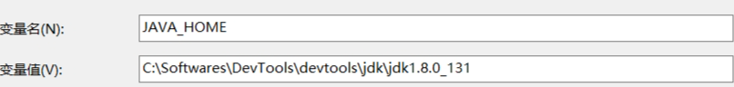
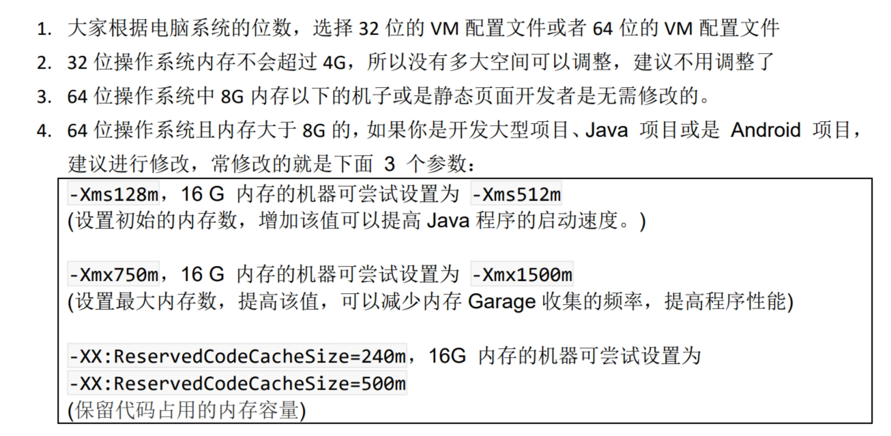
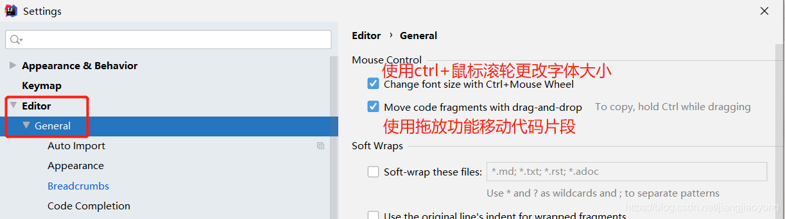
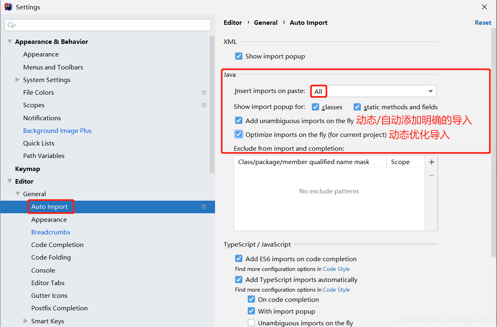
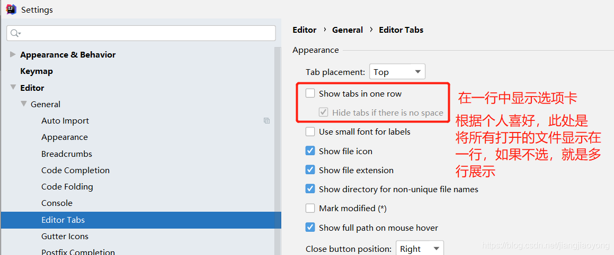
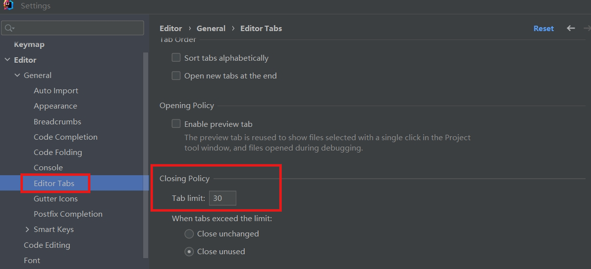
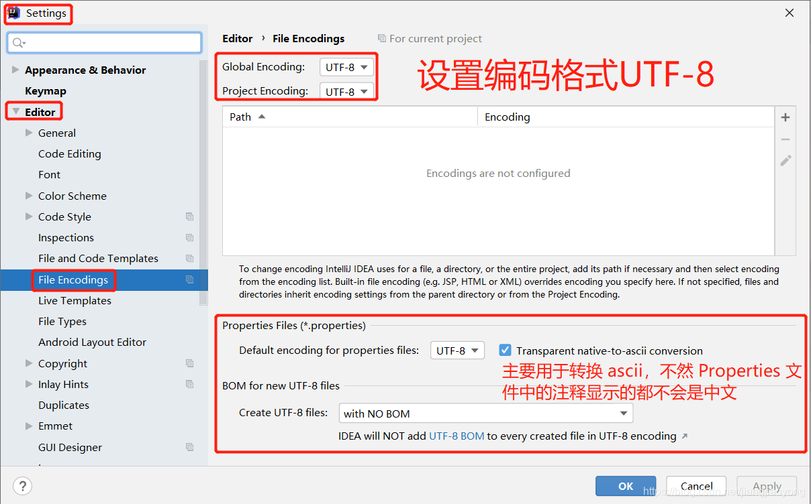
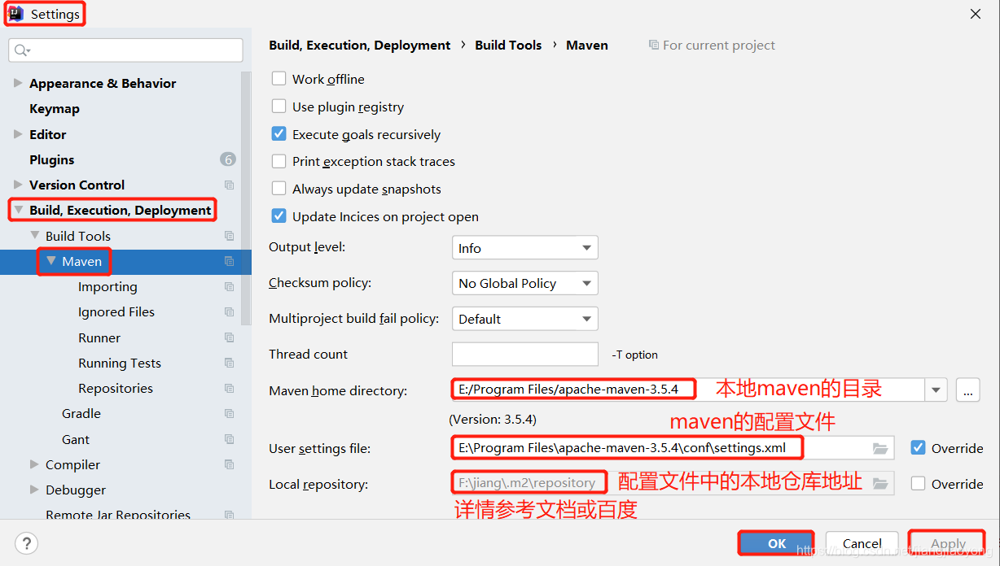
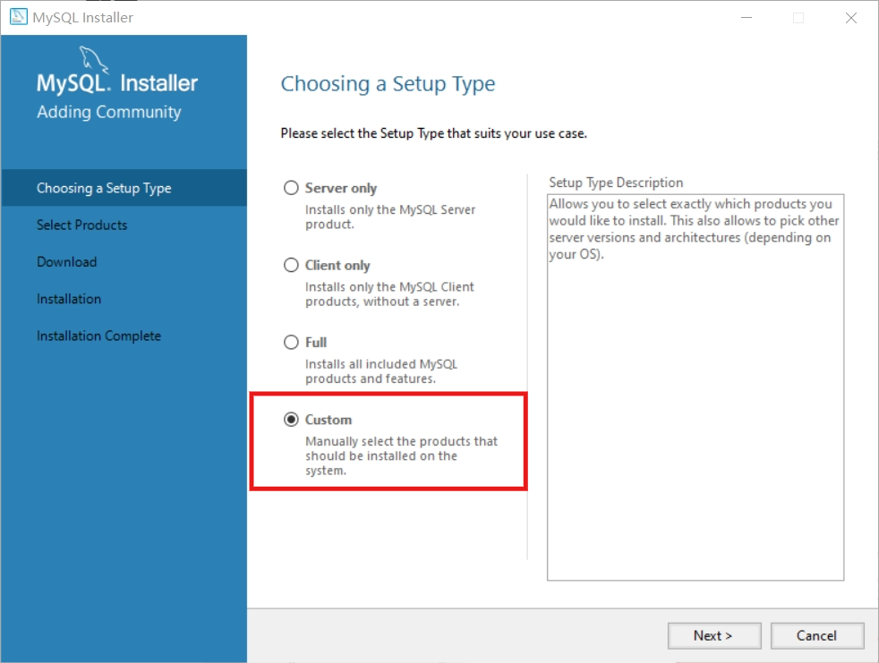
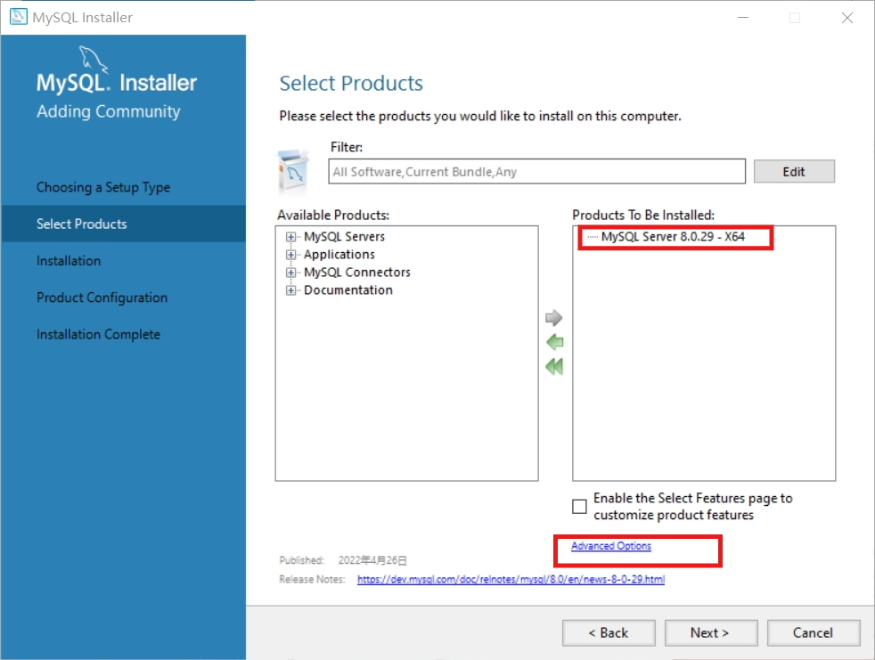

# 基础软件安装与配置

## JDK

### 配置环境变量

1. 添加系统变量 JAVA_HOME
```java
变量名：JAVA_HOME
变量值：JDK的安装路径
```


2. 在系统变量 Path 环境变量中添加：%JAVA_HOME%\bin
3. java -version

## maven

### 配置环境变量

1. 添加系统变量 MAVEN_HOME
```java
变量名：MAVEN_HOME
变量值：maven的安装路径或IDEA中的maven路径
```

2. 在系统变量 Path 环境变量中添加：%MAVEN_HOME%\bin
3. mvn -v
### 本地仓储配置
```java
<localRepository>C:\Softwares\DevTools\devtools\MavenLocalRepository</localRepository>
```
### 设置阿里云镜像
```xml
<mirror>
  <id>aliyunmaven</id>
  <mirrorOf>*</mirrorOf>
  <name>阿里云公共仓库</name>
  <url>https://maven.aliyun.com/repository/public</url>
</mirror>
```
## IDEA
### 调整 VM 配置文件 idea64.exe.vmoptions

### 设置鼠标滚轮修改字体大小

### 设置自动导包功能

### 设置取消单行显示 tabs 的操作

### 设置同时打开窗口数

### File Encodings 设置编码格式

### 配置 maven
如果使用 IDEA 自带的，注意修改 maven 的配置文件中本地仓库地址和下载源

## MySQL
以 mysql8.0 为例
### 推荐自定义安装



### 环境变量配置
在系统变量 Path 环境变量中添加：C:\Softwares\DevTools\MySQL\MySQL Server 8.0\bin
## tomcat
### 配置环境变量

1. 添加系统变量 CATALINA_HOME
2. 在系统变量 Path 环境变量中添加：%CATALINA_HOME%\bin
3. 启动：startup

### 中文编码问题
找到 conf 目录下的 logging.properties 文件，将原文件中的 UTF-8 全部替换为 GBK 然后保存即可

