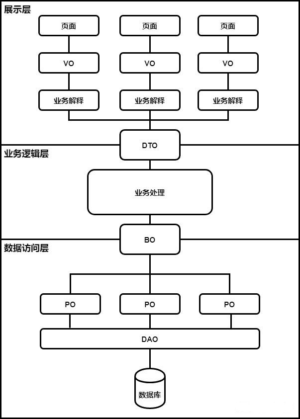

# POJO 中的 DTO、VO、BO、PO、DO

## 架构图

## VO、BO、 PO、 DTO、DO 的定义与区别

POJO 的定义是无规则简单的对象，在日常的代码分层中 pojo 会被分为 VO、BO、 PO、 DTO。

**数据的流转角度**：前端 --> VO --> DTO --> BO --> DAO --> 数据库

**VO(View Object/Value Oobject)表示层对象**

1. 前端展示的数据，在接口数据返回给前端的时候需要转成 VO。
2. VO 主要的存在形式就是 js 里面的对象（也可以简单理解成 json）。
3. 使用场景：接口层服务中，将 DTO 转成 VO，返回给前端。
4. **注**：在展示业务不复杂的系统，可直接使用 DTO。

**DTO(Data Transfer Object)数据传输对象**

1. 表示一个数据传输对象，通常用于不同服务或服务不同分层之间的数据传输。，
2. DTO 与 VO 与类似，但也有一些不同，这个不同主要是设计理念上的，比如 API 服务需要使用的是 DTO，而用于展示层页面的使用的是 VO。
3. 它存在两种形式：
    1. 在后端，它的存在形式是请求的入参，也就是在 controller 里面定义的参数。
    2. 在前端，它的存在形式通常是 js 里面的对象（也可以简单理解成 json），也就是通过 ajax 请求的那个数据体。
4. 服务和服务之间调用的传输对象能叫 DTO 吗？
    1. DTO 本身的一个隐含的意义是要能够完整的表达一个业务模块的输出。
    2. 如果服务和服务之间相对独立，那就可以叫 DTO。
    3. 如果服务和服务之间不独立，每个都不是一个完整的业务模块，拆开可能仅仅是因为计算复杂度或者性能的问题，那这就不能够叫做 DTO，只能是 BO。

**BO(Bussines Object)业务层对象**

1. 主要在服务内部使用的业务对象。
2. 是 PO 的组合，可以包含多个对象，可以用于对象的聚合操作。
3. 使用场景：在服务层服务中，由 DTO 转成 BO 然后进行业务处理后，转成 DTO 返回到接口层。

**PO(Persistent Object)持久对象**

1. 数据库记录，用来存储数据库提取的记录，等同于常说的 Entity。
2. 只存储数据，不包含数据操作，除了 get，set 之外没有别的方法。
3. PO 的属性是跟数据库表的字段一一对应的。
4. PO 对象需要实现序列化接口。
5. 数量是相对固定的，一定不会超过数据库表的数量。
3. 使用场景：在数据库层中，获取的数据库数据存储到 PO 中，然后转为 DTO 返回到服务层中。

**DO(Domain Object)领域实体对象**

DO 现在主要有两个版本：

1. 阿里巴巴的开发手册中的定义，DO( Data Object)这个等同于上面的 PO
2. DDD(Domain-Driven Design)领域驱动设计中，DO(Domain Object)这个等同于上面的 BO

**VO 和 DTO 的区别**

1. 字段不一样，VO 根据需要会删减一些字段。
2. 值不一样，VO 会根据需要对 DTO 中的值进行展示业务的解释。

**BO 和 DTO 的区别**

1. 主要是就是字段的删减。
2. BO 对内，为了进行业务计算需要辅助数据，或者是一个业务有多个对外的接口，BO 可能会含有很多接口对外所不需要的数据，因此 DTO 需要在 BO 的基础上，只要自己需要的数据，然后对外提供。
3. 在这个关系上，DTO 通常不会有数据内容的变化，内容变化要么在 BO 内部业务计算的时候完成，要么在解释 VO 的时候完成。

## 实际应用建议

1. 系统和系统的复杂度不同，协作水平不同，完全没有必要教条主义。
2. PO 必须有，不管叫 PO 还是 Entity。
3. 一些工具类的系统和一些业务不是很复杂的系统 DTO 是可以和 BO 合并成一个，当业务扩展的时候注意拆分就行。
4. VO 是可以优化掉的，展示业务不复杂的可以不要 VO，直接用 DTO。

