## SpringCloud Alibaba 入门简介

### 是什么

[alibaba/spring-cloud-alibaba (github.com)](https://github.com/alibaba/spring-cloud-alibaba)

[README-zh](https://github.com/alibaba/spring-cloud-alibaba/blob/2023.x/README-zh.md)

[Spring Cloud Alibaba 参考文档（中文](https://spring-cloud-alibaba-group.github.io/github-pages/2022/zh-cn/2022.0.0.0-RC2.html)

[Spring Cloud Alibaba Reference Documentation （英文）](https://spring-cloud-alibaba-group.github.io/github-pages/2022/en-us/2022.0.0.0-RC2.html)

[Spring Cloud Alibaba 官网](https://sca.aliyun.com/)

- 简单易用：Spring Cloud Alibaba 作为**一站式的微服务构建方案**，用户只需要添加一些注解和少量配置，就可以通过阿里中间件来迅速搭建分布式应用系统。
- 扩展性强：Spring Cloud Alibaba 基于 Spring Cloud 微服务解决方案规范，可便捷地对其中的组件进行扩展和替换。
- 生产等级：核心组件都经过过阿里巴巴多年双十一洪峰考验，成熟稳定。
- 能力全面：针对微服务架构中的服务注册与发现、分布式消息、微服务限流降级、分布式事务和微服务治理等重要领域，都提供了对应解决方案。

组件：

**[Sentinel](https://github.com/alibaba/Sentinel)**：把流量作为切入点，从流量控制、熔断降级、系统负载保护等多个维度保护服务的稳定性。

**[Nacos](https://github.com/alibaba/Nacos)**：一个更易于构建云原生应用的动态服务发现、配置管理和服务管理平台。

**[RocketMQ](https://rocketmq.apache.org/)**：一款开源的分布式消息系统，基于高可用分布式集群技术，提供低延时的、高可靠的消息发布与订阅服务。

**[Seata](https://github.com/seata/seata)**：阿里巴巴开源产品，一个易于使用的高性能微服务分布式事务解决方案。

**[Alibaba Cloud OSS](https://www.aliyun.com/product/oss)**: 阿里云对象存储服务（Object Storage Service，简称 OSS），是阿里云提供的海量、安全、低成本、高可靠的云存储服务。您可以在任何应用、任何时间、任何地点存储和访问任意类型的数据。

**[Alibaba Cloud SchedulerX](https://cn.aliyun.com/aliware/schedulerx)**: 阿里中间件团队开发的一款分布式任务调度产品，提供秒级、精准、高可靠、高可用的定时（基于 Cron 表达式）任务调度服务。

**[Alibaba Cloud SMS](https://www.aliyun.com/product/sms)**: 覆盖全球的短信服务，友好、高效、智能的互联化通讯能力，帮助企业迅速搭建客户触达通道。

### 能干嘛

- **服务限流降级**：默认支持 WebServlet、WebFlux、OpenFeign、RestTemplate、Spring Cloud Gateway、Dubbo 和 RocketMQ 限流降级功能的接入，可以在运行时通过控制台实时修改限流降级规则，还支持查看限流降级 Metrics 监控。
- **服务注册与发现**：适配 Spring Cloud 服务注册与发现标准，默认集成对应 Spring Cloud 版本所支持的负载均衡组件的适配。
- **分布式配置管理**：支持分布式系统中的外部化配置，配置更改时自动刷新。
- **消息驱动能力**：基于 Spring Cloud Stream 为微服务应用构建消息驱动能力。
- **分布式事务**：使用 `@GlobalTransactional` 注解， 高效并且对业务零侵入地解决分布式事务问题。
- **阿里云对象存储**：阿里云提供的海量、安全、低成本、高可靠的云存储服务。支持在任何应用、任何时间、任何地点存储和访问任意类型的数据。
- **分布式任务调度**：提供秒级、精准、高可靠、高可用的定时（基于 Cron 表达式）任务调度服务。同时提供分布式的任务执行模型，如网格任务。网格任务支持海量子任务均匀分配到所有 Worker(schedulerx-client)上执行。
- **阿里云短信服务**：覆盖全球的短信服务，友好、高效、智能的互联化通讯能力，帮助企业迅速搭建客户触达通道。

### 怎么玩

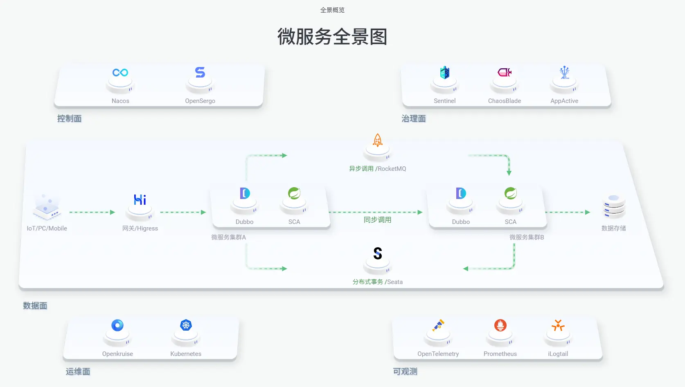

## SpringCloud Alibaba Nacos 服务注册和配置中心

### 总体介绍

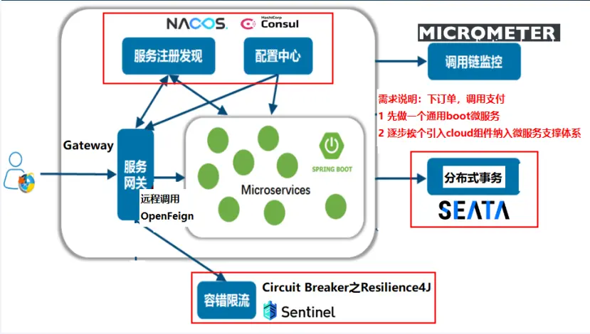

### Nacos 简介

#### 为什么叫 Nacos 这个名字

Nacos: Dynamic Naming and Configuration Service

前四个字母分别为 Naming 和 Configuration 的前两个字母，最后的 s 为 Service。

#### 是什么

[Nacos 官网](https://nacos.io/)

**一个更易于构建云原生应用的动态服务发现、配置管理和服务管理平台。**

**总结**：Nacos 就是注册中心 + 配置中心的组合

等价于

- Nacos = Eureka+Config +Bus
- Nacos = Spring Cloud Consul

#### 能干啥

1. 替代 Eureka/Consul 做服务注册中心
2. 替代(Config+Bus)/Consul 做服务配置中心和满足动态刷新广播通知

#### 去哪下

[Nacos Server 下载 | Nacos](https://nacos.io/download/nacos-server/)

#### 各种注册中心比较

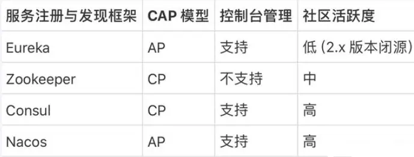

据说 Nacos 在阿里巴巴内部有超过 10 万的实例运行，已经过了类似双十一等各种大型流量的考验，Nacos 默认是 AP 模式，但也可以调整切换为 CP，我们一般用默认 AP 即可。

### Nacos 下载安装

[Nacos 快速开始](https://nacos.io/docs/v2/quickstart/quick-start/)

[Nacos 旧版文档](https://nacos.io/zh-cn/docs/v2/quickstart/quick-start.html)

启动命令（standalone 代表着单机模式运行，非集群模式）:

```shell
# Linux/Unix/Mac
sh startup.sh -m standalone
# 如果您使用的是ubuntu系统，或者运行脚本报错提示[[符号找不到，可尝试如下运行：
bash startup.sh -m standalone

# Windows 
startup.cmd -m standalone
```

关闭服务器

```shell
# Linux/Unix/Mac
sh shutdown.sh

# Windows
shutdown.cmd
```

命令运行成功后直接访问 http://localhost:8848/nacos

默认账号密码都是 `nacos`

### Nacos Discovery 服务注册中心

通过 `Nacos Server` 和 `spring-cloud-starter-alibaba-nacos-discovery` 实现服务的注册与发现。

#### 基于 Nacos 的服务提供者

1. 新建 Module：cloudalibaba-provider-payment9001

2. POM.xml 添加依赖

    ```xml
    <?xml version="1.0" encoding="UTF-8"?>
    <project xmlns="http://maven.apache.org/POM/4.0.0"
             xmlns:xsi="http://www.w3.org/2001/XMLSchema-instance"
             xsi:schemaLocation="http://maven.apache.org/POM/4.0.0 http://maven.apache.org/xsd/maven-4.0.0.xsd">
        <modelVersion>4.0.0</modelVersion>
        <parent>
            <groupId>com.atguigu.cloud</groupId>
            <artifactId>cloud2024</artifactId>
            <version>1.0-SNAPSHOT</version>
        </parent>
    
        <artifactId>cloudalibaba-provider-payment9001</artifactId>
    
        <properties>
            <maven.compiler.source>17</maven.compiler.source>
            <maven.compiler.target>17</maven.compiler.target>
            <project.build.sourceEncoding>UTF-8</project.build.sourceEncoding>
        </properties>
    
        <dependencies>
            <!--nacos-discovery-->
            <dependency>
                <groupId>com.alibaba.cloud</groupId>
                <artifactId>spring-cloud-starter-alibaba-nacos-discovery</artifactId>
            </dependency>
            <!-- 引入自己定义的api通用包 -->
            <dependency>
                <groupId>com.atguigu.cloud</groupId>
                <artifactId>cloud-api-commons</artifactId>
                <version>1.0-SNAPSHOT</version>
            </dependency>
            <!--SpringBoot通用依赖模块-->
            <dependency>
                <groupId>org.springframework.boot</groupId>
                <artifactId>spring-boot-starter-web</artifactId>
            </dependency>
            <dependency>
                <groupId>org.springframework.boot</groupId>
                <artifactId>spring-boot-starter-actuator</artifactId>
            </dependency>
            <!--hutool-->
            <dependency>
                <groupId>cn.hutool</groupId>
                <artifactId>hutool-all</artifactId>
            </dependency>
            <!--lombok-->
            <dependency>
                <groupId>org.projectlombok</groupId>
                <artifactId>lombok</artifactId>
                <version>1.18.28</version>
                <scope>provided</scope>
            </dependency>
            <!--test-->
            <dependency>
                <groupId>org.springframework.boot</groupId>
                <artifactId>spring-boot-starter-test</artifactId>
                <scope>test</scope>
            </dependency>
        </dependencies>
    
        <build>
            <plugins>
                <plugin>
                    <groupId>org.springframework.boot</groupId>
                    <artifactId>spring-boot-maven-plugin</artifactId>
                </plugin>
            </plugins>
        </build>
    
    </project>
    ```

3. YML 添加配置

    ```yml
    server:
      port: 9001
    
    spring:
      application:
        name: nacos-payment-provider
      cloud:
        nacos:
          discovery:
            server-addr: localhost:8848 #配置Nacos地址
    ```

    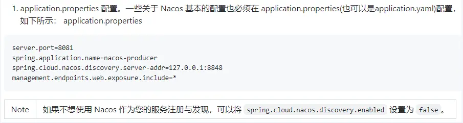

4. 主启动类

    ```java
    package com.atguigu.cloud;
    
    @SpringBootApplication
    @EnableDiscoveryClient
    public class Main9001 {
        public static void main(String[] args) {
            SpringApplication.run(Main9001.class, args);
        }
    }
    ```
    
5. 业务类 PayAlibabaController

    ```java
    package com.atguigu.cloud.controller;
    
    @RestController
    public class PayAlibabaController {
        @Value("${server.port}")
        private String serverPort;
    
        @GetMapping(value = "/pay/nacos/{id}")
        public String getPayInfo(@PathVariable("id") Integer id) {
            return "nacos registry, serverPort: " + serverPort + "\t id" + id;
        }
    }
    ```
    
6. 测试

    - http://localhost:9001/pay/nacos/11
    - http://localhost:8848/nacos
    - 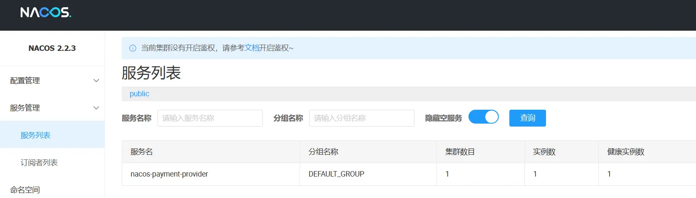
    - nacos8848 注册中心+服务提供者 pay9001 都 OK 了

#### 基于 Nacos 的服务消费者

1. 新建 Module：cloudalibaba-consumer-nacos-order83

2. POM.xml 添加依赖

    ```xml
    <?xml version="1.0" encoding="UTF-8"?>
    <project xmlns="http://maven.apache.org/POM/4.0.0"
             xmlns:xsi="http://www.w3.org/2001/XMLSchema-instance"
             xsi:schemaLocation="http://maven.apache.org/POM/4.0.0 http://maven.apache.org/xsd/maven-4.0.0.xsd">
        <modelVersion>4.0.0</modelVersion>
        <parent>
            <groupId>com.atguigu.cloud</groupId>
            <artifactId>cloud2024</artifactId>
            <version>1.0-SNAPSHOT</version>
        </parent>
    
        <artifactId>cloudalibaba-consumer-nacos-order83</artifactId>
    
        <properties>
            <maven.compiler.source>17</maven.compiler.source>
            <maven.compiler.target>17</maven.compiler.target>
            <project.build.sourceEncoding>UTF-8</project.build.sourceEncoding>
        </properties>
    
        <dependencies>
            <!--nacos-discovery-->
            <dependency>
                <groupId>com.alibaba.cloud</groupId>
                <artifactId>spring-cloud-starter-alibaba-nacos-discovery</artifactId>
            </dependency>
            <!--loadbalancer-->
            <dependency>
                <groupId>org.springframework.cloud</groupId>
                <artifactId>spring-cloud-starter-loadbalancer</artifactId>
            </dependency>
            <!--web + actuator-->
            <dependency>
                <groupId>org.springframework.boot</groupId>
                <artifactId>spring-boot-starter-web</artifactId>
            </dependency>
            <dependency>
                <groupId>org.springframework.boot</groupId>
                <artifactId>spring-boot-starter-actuator</artifactId>
            </dependency>
            <!--lombok-->
            <dependency>
                <groupId>org.projectlombok</groupId>
                <artifactId>lombok</artifactId>
                <optional>true</optional>
            </dependency>
        </dependencies>
    
        <build>
            <plugins>
                <plugin>
                    <groupId>org.springframework.boot</groupId>
                    <artifactId>spring-boot-maven-plugin</artifactId>
                </plugin>
            </plugins>
        </build>
    </project>
    ```

3. YML 添加配置

    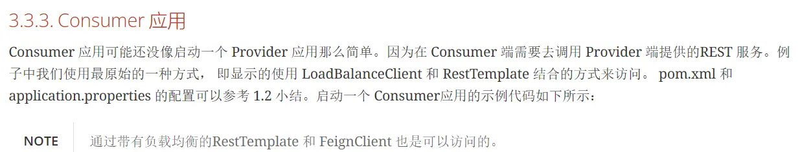

    ```yml
    server:
      port: 83
    
    spring:
      application:
        name: nacos-order-consumer
      cloud:
        nacos:
          discovery:
            server-addr: localhost:8848
    #消费者将要去访问的微服务名称(nacos微服务提供者叫什么你写什么)
    service-url:
      nacos-user-service: http://nacos-payment-provider
    ```

4. 主启动类

    ```java
    package com.atguigu.cloud;
    
    @EnableDiscoveryClient
    @SpringBootApplication
    public class Main83 {
        public static void main(String[] args) {
            SpringApplication.run(Main83.class, args);
        }
    }
    ```

5. 业务类

    - 配置 config

        ```java
        package com.atguigu.cloud.config;
        
        @Configuration
        public class RestTemplateConfig {
            @Bean
            @LoadBalanced //赋予RestTemplate负载均衡的能力
            public RestTemplate restTemplate() {
                return new RestTemplate();
            }
        }
        ```

    - OrderNacosController

        ```java
        package com.atguigu.cloud.controller;
        
        @RestController
        public class OrderNacosController {
            @Resource
            private RestTemplate restTemplate;
        
            @Value("$server-url.nacos-user-service")
            private String serverURL;
        
            @GetMapping("/consumer/pay/nacos/{id}")
            public String paymentInfo(@PathVariable("id") Integer id) {
                String result = restTemplate.getForObject(serverURL + "/pay/nacos/" + id, String.class);
                return result + "\t" + "    我是OrderNacosController83调用者。。。。。。"；
            }
        }
        ```

6. 测试

    - nacos 控制台

        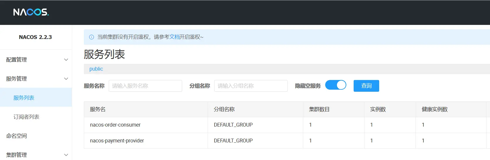

    - http://localhost:83/consumer/pay/nacos/14

#### 负载均衡

1. 参照 9001 新建 9002（直接拷贝虚拟端口映射）`-DServer.port=9002`
    - 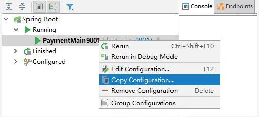
    - 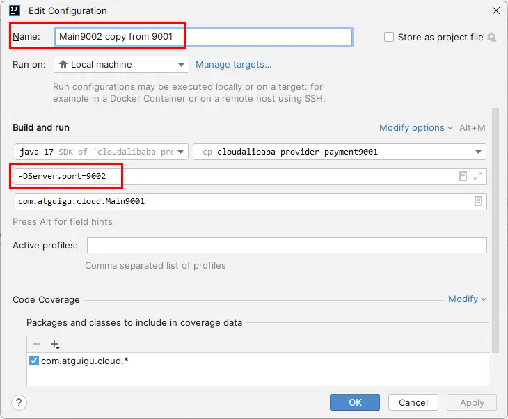
    - 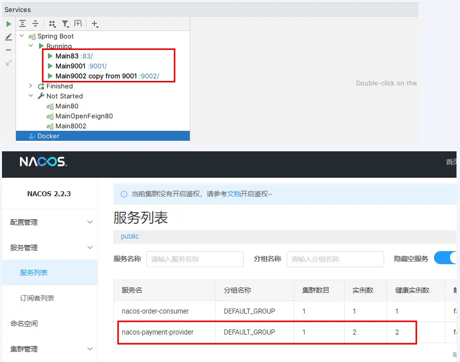
2. 测试
    - http://localhost:83/consumer/pay/nacos/14
    - 看到端口号 9001/9002 交替出现，负载均衡达到

### Nacos Config 服务配置中心

#### 概述

- 之前案例 Consul 8500 服务配置动态变更功能可以被 Nacos 取代
- 通过 Nacos 和 spring-cloud-starter-alibaba-nacos-config 实现中心化全局配置的动态变更

[Spring Cloud Alibaba 参考中文文档](https://spring-cloud-alibaba-group.github.io/github-pages/2022/zh-cn/2022.0.0.0-RC2.html#_spring_cloud_alibaba_nacos_config)

#### Nacos 作为配置中心配置步骤

##### 建 Module

新建 module `cloudalibaba-config-nacos-client3377`

##### POM

```xml
<?xml version="1.0" encoding="UTF-8"?>
<project xmlns="http://maven.apache.org/POM/4.0.0"
         xmlns:xsi="http://www.w3.org/2001/XMLSchema-instance"
         xsi:schemaLocation="http://maven.apache.org/POM/4.0.0 http://maven.apache.org/xsd/maven-4.0.0.xsd">
    <modelVersion>4.0.0</modelVersion>
    <parent>
        <groupId>com.atguigu.cloud</groupId>
        <artifactId>cloud2024</artifactId>
        <version>1.0-SNAPSHOT</version>
    </parent>

    <artifactId>cloudalibaba-config-nacos-client3377</artifactId>

    <properties>
        <maven.compiler.source>17</maven.compiler.source>
        <maven.compiler.target>17</maven.compiler.target>
        <project.build.sourceEncoding>UTF-8</project.build.sourceEncoding>
    </properties>

    <dependencies>
        <!--bootstrap-->
        <dependency>
            <groupId>org.springframework.cloud</groupId>
            <artifactId>spring-cloud-starter-bootstrap</artifactId>
        </dependency>
        <!--nacos-config-->
        <dependency>
            <groupId>com.alibaba.cloud</groupId>
            <artifactId>spring-cloud-starter-alibaba-nacos-config</artifactId>
        </dependency>
        <!--nacos-discovery-->
        <dependency>
            <groupId>com.alibaba.cloud</groupId>
            <artifactId>spring-cloud-starter-alibaba-nacos-discovery</artifactId>
        </dependency>
        <!--web + actuator-->
        <dependency>
            <groupId>org.springframework.boot</groupId>
            <artifactId>spring-boot-starter-web</artifactId>
        </dependency>
        <dependency>
            <groupId>org.springframework.boot</groupId>
            <artifactId>spring-boot-starter-actuator</artifactId>
        </dependency>
        <!--lombok-->
        <dependency>
            <groupId>org.projectlombok</groupId>
            <artifactId>lombok</artifactId>
            <optional>true</optional>
        </dependency>
    </dependencies>

    <build>
        <plugins>
            <plugin>
                <groupId>org.springframework.boot</groupId>
                <artifactId>spring-boot-maven-plugin</artifactId>
            </plugin>
        </plugins>
    </build>
</project>
```

##### YML

- Nacos 同 Consul 一样，在项目初始化时，要保证先从配置中心进行配置拉取，
- 拉取配置之后，才能保证项目的正常启动，为了满足**动态刷新**和**全局广播通知**
- springboot 中配置文件的加载是存在优先级顺序的，bootstrap 优先级高于 application

1. bootstrap.yml:

```
# nacos配置
spring:
  application:
    name: nacos-config-client
  cloud:
    nacos:
      discovery:
        server-addr: localhost:8848 #Nacos服务注册中心地址
      config:
        server-addr: localhost:8848 #Nacos作为配置中心地址
        file-extension: yaml #指定yaml格式的配置

# nacos端配置文件DataId的命名规则是：
# ${spring.application.name}-${spring.profile.active}.${spring.cloud.nacos.config.file-extension}
# 本案例的DataID是:nacos-config-client-dev.yaml
```

2. application.yml

```yml
server:
  port: 3377

spring:
  profiles:
    active: dev # 表示开发环境
      #active: prod # 表示生产环境
    #active: test # 表示测试环境
```

##### 主启动

```java
package com.atguigu.cloud;

@EnableDiscoveryClient
@SpringBootApplication
public class NacosConfigClient3377 {
    public static void main(String[] args) {
        SpringApplication.run(NacosConfigClient3377.class, args);
    }
}
```

##### 业务类

- 通过 Spring Cloud 原生注解 `@RefreshScope` 实现配置自动更新

- NacosConfigClientController.java:

```java
package com.atguigu.cloud.controller;

@RestController
@RefreshScope //在控制器类加入@RefreshScope注解使当前类下的配置支持Nacos的动态刷新功能。
public class NacosConfigClientController {
    @Value("${config.info}")
    private String configInfo;

    @GetMapping("/config/info")
    public String getConfigInfo() {
        return configInfo;
    }
}
```

##### 在 Nacos 中添加配置信息（重点）

###### Nacos 中的匹配规则

[Nacos 融合 Spring Cloud，成为注册配置中心 | Nacos](https://nacos.io/docs/v2/ecology/use-nacos-with-spring-cloud/)

Nacos 中的 `dataid` 的组成格式及与 SpringBoot 配置文件中的匹配规则：

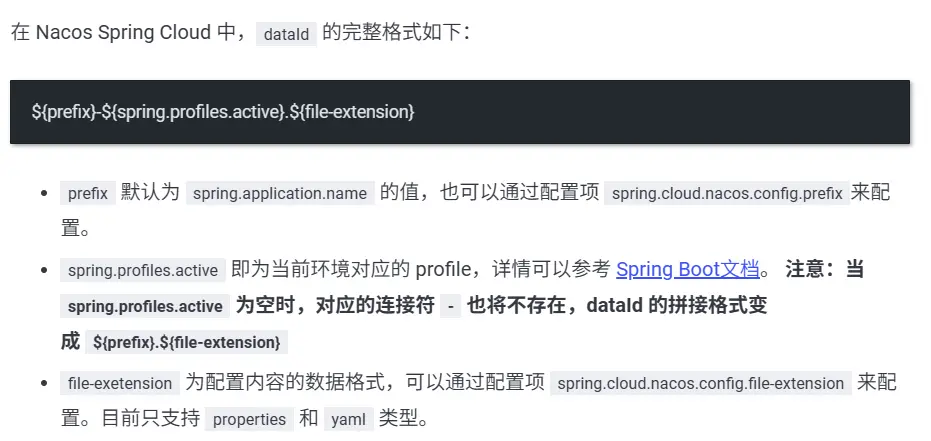

 最后公式：

```
${spring.application.name}-${spring.profiles.active}.${spring.cloud.nacos.config.file-extension}
```

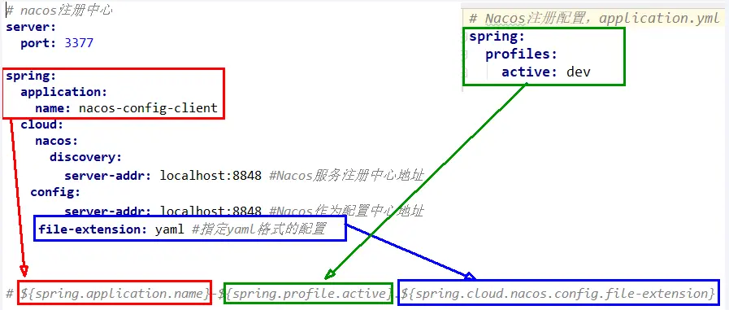

###### 案例步骤

nacos 后台管理->配置管理->配置列表->创建配置

本案例的 DataID 是：`nacos-config-client-dev.yaml`

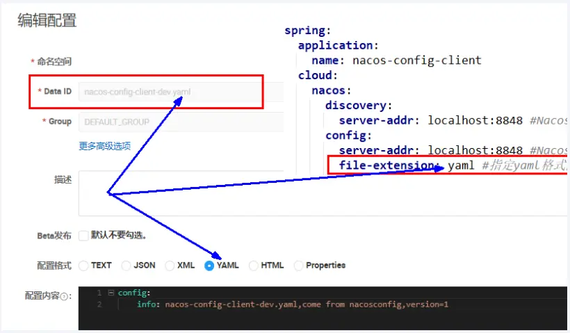

##### 测试

1. 启动 Nacos 且在 nacos 后台管理-配置列表下已经存在对应的 yaml 配置文件
2. 运行 cloud-config-nacos-client3377 的主启动类
3. 调用接口查看配置信息：http://localhost:3377/config/info

##### 自带动态刷新调用接口查看配置信息

修改下 Nacos 中的 yaml 配置文件，再次调用查看配置的接口，就会发现配置已经刷新

##### 历史配置

- Nacos 会记录配置文件的历史版本默认保留 30 天，此外还有一键回滚功能，回滚操作将会触发配置更新

- 回滚

    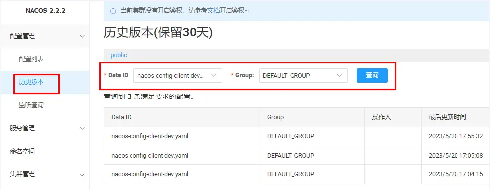

### Nacos 数据模型之 Namespace-Group-DataId

#### 问题：多环境多项目管理

问题 1：

实际开发中，通常一个系统会准备

dev 开发环境

test 测试环境

prod 生产环境。

如何保证指定环境启动时服务能正确读取到 Nacos 上相应环境的配置文件呢？

 

问题 2：

一个大型分布式微服务系统会有很多微服务子项目，

每个微服务项目又都会有相应的开发环境、测试环境、预发环境、正式环境......

那怎么对这些微服务配置进行分组和命名空间管理呢？

#### 官网

[Nacos 架构](https://nacos.io/zh-cn/docs/architecture.html)

#### Namespace+Group+DataId 三者关系？为什么这么设计？

Nacos 数据模型 Key 由三元组唯一确定, Namespace 默认是空串，公共命名空间(public)，分组默认是 DEFAULT_GROUP。

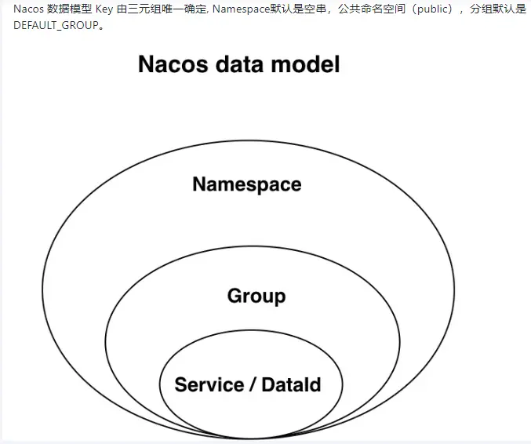

1. 是什么：类似 Java 里面的 package 名和类名，最外层的 Namespace 是可以用于区分部署环境的，Group 和 DataID 逻辑上区分两个目标对象
2. 默认值：Namespace=public，Group=DEFAULT_GROUP
    - Nacos 默认的命名空间是 public，Namespace 主要用来实现隔离。
    - 比方说我们现在有三个环境：开发、测试、生产环境，我们就可以创建三个 Namespace，不同的 Namespace 之间是隔离的。
    - Group 默认是 DEFAULT_GROUP，Group 可以把不同的微服务划分到同一个分组里面去
3. Service 就是微服务：一个 Service 可以包含一个或者多个 Cluster（集群），Nacos 默认 Cluster 是 DEFAULT，Cluster 是对指定微服务的一个虚拟划分。

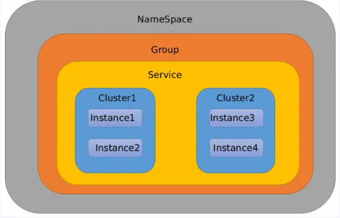

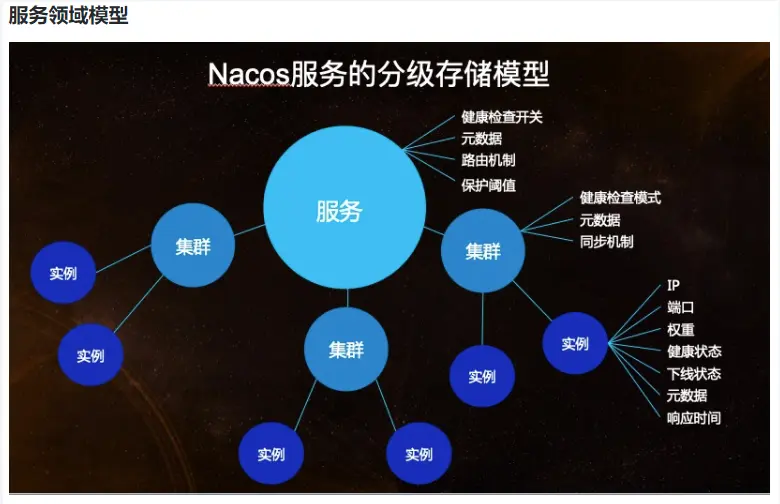

#### Nacos 的图形化管理界面

- 命名空间 Namespace

    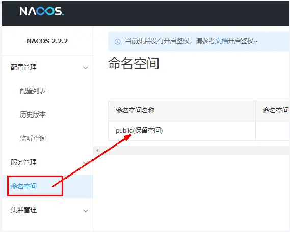

- 配置管理

    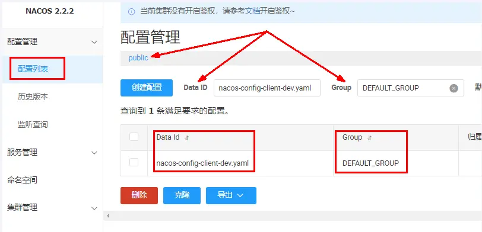

#### 三种方案加载配置

##### DataID 方案

- 指定 `spring.profile.active` 和配置文件的 `DataID` 来使不同环境下读取不同的配置

- 默认空间 public+默认分组 DEFAULT_GROUP+**新建 DataID**

    - 新建 test 配置 DataID：`nacos-config-client-test.yaml`：

        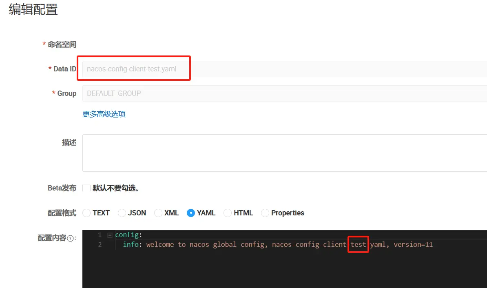

        ```yml
        config:
          info: welcome to nacos global config, nacos-config-client-dev.yaml, version=2
        ```

- 修改 YML

    - 通过 spring.profile.active 属性就能进行多环境下配置文件的读取

    - application.yml：

        ```yml
        server:
          port: 3377
        
        spring:
          profiles:
            #active: dev # 表示开发环境
            #active: prod # 表示生产环境
            active: test # 表示测试环境
        ```

    - bootstrap.yml：

        ```yml
        # nacos配置 一种:默认空间+默认分组+新建DataID
        spring:
          application:
            name: nacos-config-client
          cloud:
            nacos:
              discovery:
                server-addr: localhost:8848 #Nacos服务注册中心地址
              config:
                server-addr: localhost:8848 #Nacos作为配置中心地址
                file-extension: yaml #指定yaml格式的配置
        
        # nacos端配置文件DataId的命名规则是：
        # ${spring.application.name}-${spring.profile.active}.${spring.cloud.nacos.config.file-extension}
        # 本案例的DataID是:nacos-config-client-dev.yaml
        ```

- 测试：http://localhost:3377/config/info

##### Group 方案

- 通过 Group 实现环境区分

- 默认空间 public + **新建 PROD_GROUP** + **新建 DataID**

    - 新建 prod 配置 DataID：`nacos-config-client-prod.yaml`

    - 新建 Group：`PROD_GROUP`

        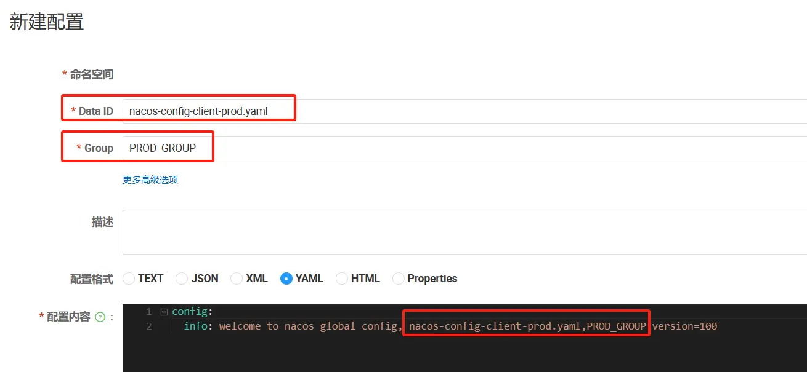

- 修改 YML

    - 在 config 下增加一条 group 的配置即可。

        - 可配置为 `PROD_GROUP`

    - application.yml：

        ```yml
        server:
          port: 3377
        
        spring:
          profiles:
            #active: dev # 表示开发环境
            active: prod # 表示生产环境
            #active: test # 表示测试环境
        ```

    - bootstrap.yml：

        ```yml
        # nacos配置 第2种:默认空间+新建分组+新建DataID
        spring:
          application:
            name: nacos-config-client
          cloud:
            nacos:
              discovery:
                server-addr: localhost:8848 #Nacos服务注册中心地址
              config:
                server-addr: localhost:8848 #Nacos作为配置中心地址
                file-extension: yaml #指定yaml格式的配置
                group: PROD_GROUP
        
        # nacos端配置文件DataId的命名规则是：
        # ${spring.application.name}-${spring.profile.active}.${spring.cloud.nacos.config.file-extension}
        # 本案例的DataID是:nacos-config-client-dev.yaml
        ```

- 测试：http://localhost:3377/config/info

##### Namespace 方案

- 通过 Namespace 实现命名空间环境区分

    - 新建 Namespace：`Prod_Namespace`

    - 新建 Namespace 但命名空间 ID 不填（系统自动生成）：`Prod2_Namespace`

        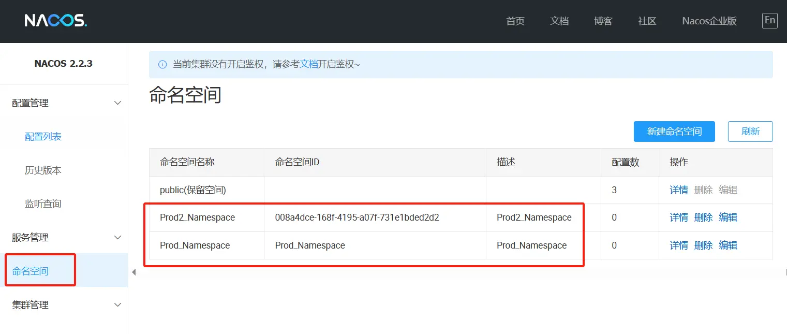

- **Prod_Namespace** + PROD_GROUP + DataID(nacos-config-client-prod.yaml)

    - 选定 Prod_Namespace 后新建

        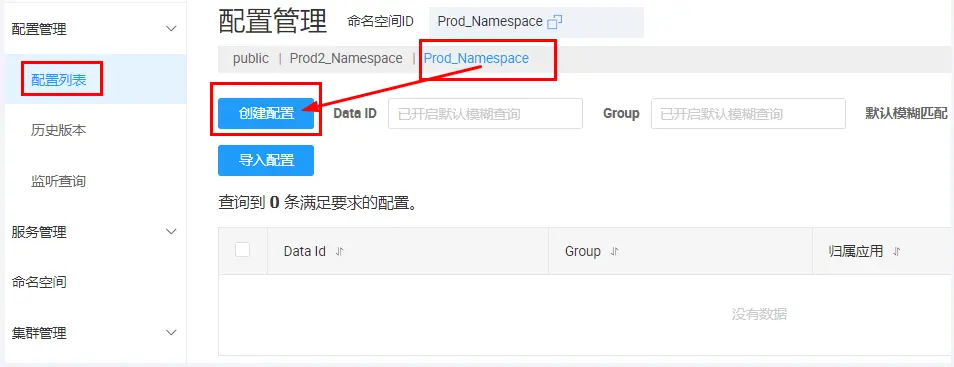

    - 命名空间：`Prod_Namespace`

    - Data ID：`nacos-config-client-prod.yaml`

    - GROUP：`PROD_GROUP`

        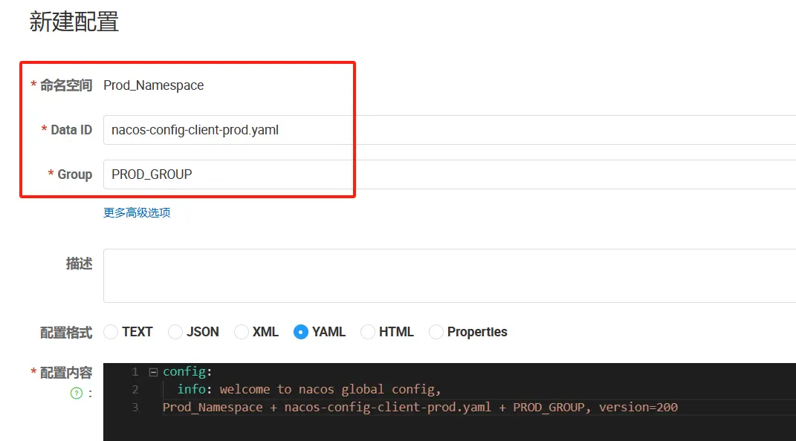

- 修改 YML

    - 在 config 下增加一条 `namespace: Prod_Namespace` 

    - application.yml：

        ```yml
        server:
          port: 3377
        
        spring:
          profiles:
            #active: dev # 表示开发环境
            active: prod # 表示生产环境
            #active: test # 表示测试环境
        ```

    - bootstrap.yml：

        ```yml
        # nacos配置 第3种:新建空间+新建分组+新建DataID
        spring:
          application:
            name: nacos-config-client
          cloud:
            nacos:
              discovery:
                server-addr: localhost:8848 #Nacos服务注册中心地址
              config:
                server-addr: localhost:8848 #Nacos作为配置中心地址
                file-extension: yaml #指定yaml格式的配置
                group: PROD_GROUP
                namespace: Prod_Namespace
        
        # nacos端配置文件DataId的命名规则是：
        # ${spring.application.name}-${spring.profile.active}.${spring.cloud.nacos.config.file-extension}
        # 本案例的DataID是:nacos-config-client-dev.yaml
        ```

- 测试：http://localhost:3377/config/info

## SpringCloud Alibaba Sentinel 实现熔断与限流

### Sentinel

#### 是什么

[中文文档](https://sentinelguard.io/zh-cn/docs/introduction.html)

[介绍 · alibaba/Sentinel Wiki (github.com)](https://github.com/alibaba/Sentinel/wiki/介绍)

[Spring Cloud Alibaba 参考文档 ](https://spring-cloud-alibaba-group.github.io/github-pages/2022/zh-cn/2022.0.0.0-RC2.html#_spring_cloud_alibaba_sentinel)

[alibaba/Sentinel(github.com)](https://github.com/alibaba/Sentinel)

- Sentinel 是面向分布式、多语言异构化服务架构的流量治理组件，主要以流量为切入点，从流量路由、流量控制、流量整形、熔断降级、系统自适应过载保护、热点流量防护等多个维度来帮助开发者保障微服务的稳定性。
- 等价对标：Spring Cloud Circuit Breaker

- Sentinel 具有以下特征:

    - **丰富的应用场景**：Sentinel 承接了阿里巴巴近 10 年的双十一大促流量的核心场景，例如秒杀（即突发流量控制在系统容量可以承受的范围）、消息削峰填谷、集群流量控制、实时熔断下游不可用应用等。

    - **完备的实时监控**：Sentinel 同时提供实时的监控功能。您可以在控制台中看到接入应用的单台机器秒级数据，甚至 500 台以下规模的集群的汇总运行情况。

    - **广泛的开源生态**：Sentinel 提供开箱即用的与其它开源框架/库的整合模块，例如与 Spring Cloud、Apache Dubbo、gRPC、Quarkus 的整合。您只需要引入相应的依赖并进行简单的配置即可快速地接入 Sentinel。同时 Sentinel 提供 Java/Go/C++ 等多语言的原生实现。

    - **完善的 SPI 扩展机制**：Sentinel 提供简单易用、完善的 SPI 扩展接口。您可以通过实现扩展接口来快速地定制逻辑。例如定制规则管理、适配动态数据源等。


#### 怎么玩

##### 服务雪崩

- 多个微服务之间调用的时候，假设微服务 A 调用微服务 B 和微服务 C，微服务 B 和微服务 C 又调用其它的微服务，这就是所谓的“扇出”。如果扇出的链路上某个微服务的调用响应时间过长或者不可用，对微服务 A 的调用就会占用越来越多的系统资源，进而引起系统崩溃，所谓的“雪崩效应”。
- 对于高流量的应用来说，单一的后端依赖可能会导致所有服务器上的所有资源都在几秒钟内饱和。比失败更糟糕的是，这些应用程序还可能导致服务之间的延迟增加，备份队列，线程和其他系统资源紧张，导致整个系统发生更多的级联故障。这些都表示需要对故障和延迟进行隔离和管理，以便单个依赖关系的失败，不能取消整个应用程序或系统。
- 所以，通常当你发现一个模块下的某个实例失败后，这时候这个模块依然还会接收流量，然后这个有问题的模块还调用了其他的模块，这样就会发生级联故障，或者叫雪崩。

##### 服务降级

- 服务降级，说白了就是一种服务托底方案，如果服务无法完成正常的调用流程，就使用默认的托底方案来返回数据。
- 例如，在商品详情页一般都会展示商品的介绍信息，一旦商品详情页系统出现故障无法调用时，会直接获取缓存中的商品介绍信息返回给前端页面。

##### 服务熔断

- 在分布式与微服务系统中，如果下游服务因为访问压力过大导致响应很慢或者一直调用失败时，上游服务为了保证系统的整体可用性，会暂时断开与下游服务的调用连接。这种方式就是熔断。
- 类比保险丝达到最大服务访问后，直接拒绝访问，拉闸限电，然后调用服务降级的方法并返回友好提示。 

服务熔断一般情况下会有三种状态：闭合、开启和半熔断

- 闭合状态（保险丝闭合通电 OK）：服务一切正常，没有故障时，上游服务调用下游服务时，不会有任何限制。
- 开启状态（保险丝断开通电 Error）：上游服务不再调用下游服务的接口，会直接返回上游服务中预定的方法。
- 半熔断状态：处于开启状态时，上游服务会根据一定的规则，尝试恢复对下游服务的调用。此时，上游服务会以有限的流量来调用下游服务，同时，会监控调用的成功率。如果成功率达到预期，则进入关闭状态。如果未达到预期，会重新进入开启状态。

##### 服务限流

- 服务限流就是限制进入系统的流量，以防止进入系统的流量过大而压垮系统。
- 其主要的作用就是保护服务节点或者集群后面的数据节点，防止瞬时流量过大使服务和数据崩溃（如前端缓存大量实效），造成不可用；
- 还可用于平滑请求，类似秒杀高并发等操作，严禁一窝蜂的过来拥挤，大家排队，一秒钟 N 个，有序进行。

限流算法有两种，一种就是简单的请求总量计数，一种就是时间窗口限流（一般为 1s），如令牌桶算法和漏牌桶算法就是时间窗口的限流算法。

##### 服务隔离

- 有点类似于系统的垂直拆分，就按照一定的规则将系统划分成多个服务模块，并且每个服务模块之间是互相独立的，不会存在强依赖的关系。
- 如果某个拆分后的服务发生故障后，能够将故障产生的影响限制在某个具体的服务内，不会向其他服务扩散，自然也就不会对整体服务产生致命的影响。

互联网行业常用的服务隔离方式有：线程池隔离和信号量隔离。

##### 服务超时

- 整个系统采用分布式和微服务架构后，系统被拆分成一个个小服务，就会存在服务与服务之间互相调用的现象，从而形成一个个调用链。
- 形成调用链关系的两个服务中，主动调用其他服务接口的服务处于调用链的上游，提供接口供其他服务调用的服务处于调用链的下游。
- 服务超时就是在上游服务调用下游服务时，设置一个最大响应时间，如果超过这个最大响应时间下游服务还未返回结果，则断开上游服务与下游服务之间的请求连接，释放资源。

### 安装 Sentinel

Sentinel 分为两个部分:

- 核心库（Java 客户端）不依赖任何框架/库，能够运行于所有 Java 运行时环境，同时对 Dubbo / Spring Cloud 等框架也有较好的支持。
- 控制台(Dashboard)基于 Spring Boot 开发，打包后可以直接运行，不需要额外的 Tomcat 等应用容器。

[Releases · alibaba/Sentinel (github.com)](https://github.com/alibaba/Sentinel/releases)

**运行命令：**

- 前提：1. Java 环境 OK；2. 8080 端口不能被占用

- 命令：`java -jar sentinel-dashboard-1.8.7.jar`

**访问 sentinel 管理界面：**

- 登录账号密码均为 sentinel
- http://localhost:8080

### 微服务 8401 整合 Sentinel 入门案例

#### 启动 Nacos8848 成功

- `startup.cmd -m standalone`
- http://localhost:8848/nacos/#/login

#### 启动 Sentinel8080 成功

- `java -jar sentinel-dashboard-1.8.7.jar`

#### 新建微服务 8401

1. cloudalibaba-sentinel-service8401：将被哨兵纳入管控的 8401 微服务提供者 

2. POM

    ```xml
    <?xml version="1.0" encoding="UTF-8"?>
    <project xmlns="http://maven.apache.org/POM/4.0.0"
             xmlns:xsi="http://www.w3.org/2001/XMLSchema-instance"
             xsi:schemaLocation="http://maven.apache.org/POM/4.0.0 http://maven.apache.org/xsd/maven-4.0.0.xsd">
        <modelVersion>4.0.0</modelVersion>
        <parent>
            <groupId>com.atguigu.cloud</groupId>
            <artifactId>cloud2024</artifactId>
            <version>1.0-SNAPSHOT</version>
        </parent>
    
        <artifactId>cloudalibaba-sentinel-service8401</artifactId>
    
        <properties>
            <maven.compiler.source>17</maven.compiler.source>
            <maven.compiler.target>17</maven.compiler.target>
            <project.build.sourceEncoding>UTF-8</project.build.sourceEncoding>
        </properties>
    
        <dependencies>
            <!--SpringCloud alibaba sentinel -->
            <dependency>
                <groupId>com.alibaba.cloud</groupId>
                <artifactId>spring-cloud-starter-alibaba-sentinel</artifactId>
            </dependency>
            <!--nacos-discovery-->
            <dependency>
                <groupId>com.alibaba.cloud</groupId>
                <artifactId>spring-cloud-starter-alibaba-nacos-discovery</artifactId>
            </dependency>
            <!-- 引入自己定义的api通用包 -->
            <dependency>
                <groupId>com.atguigu.cloud</groupId>
                <artifactId>cloud-api-commons</artifactId>
                <version>1.0-SNAPSHOT</version>
            </dependency>
            <!--SpringBoot通用依赖模块-->
            <dependency>
                <groupId>org.springframework.boot</groupId>
                <artifactId>spring-boot-starter-web</artifactId>
            </dependency>
            <dependency>
                <groupId>org.springframework.boot</groupId>
                <artifactId>spring-boot-starter-actuator</artifactId>
            </dependency>
            <!--hutool-->
            <dependency>
                <groupId>cn.hutool</groupId>
                <artifactId>hutool-all</artifactId>
            </dependency>
            <!--lombok-->
            <dependency>
                <groupId>org.projectlombok</groupId>
                <artifactId>lombok</artifactId>
                <version>1.18.28</version>
                <scope>provided</scope>
            </dependency>
            <!--test-->
            <dependency>
                <groupId>org.springframework.boot</groupId>
                <artifactId>spring-boot-starter-test</artifactId>
                <scope>test</scope>
            </dependency>
        </dependencies>
    
        <build>
            <plugins>
                <plugin>
                    <groupId>org.springframework.boot</groupId>
                    <artifactId>spring-boot-maven-plugin</artifactId>
                </plugin>
            </plugins>
        </build>
    
    </project>
    ```

3. YML

    ```yml
    server:
      port: 8401
    
    spring:
      application:
        name: cloudalibaba-sentinel-service
      cloud:
        nacos:
          discovery:
            server-addr: localhost:8848         #Nacos服务注册中心地址
        sentinel:
          transport:
            dashboard: localhost:8080 #配置Sentinel dashboard控制台服务地址
            port: 8719 #默认8719端口，假如被占用会自动从8719开始依次+1扫描,直至找到未被占用的端口
    ```

4. 主启动

    ```java
    package com.atguigu.cloud;
    
    @EnableDiscoveryClient
    @SpringBootApplication
    public class Main8401 {
        public static void main(String[] args) {
            SpringApplication.run(Main8401.class, args);
        }
    }
    ```

5. 业务类 FlowLimitController

    ```java
    package com.atguigu.cloud.controller;
    
    @RestController
    public class FlowLimitController {
        @GetMapping("/testA")
        public String testA() {
            return "------testA";
        }
    
        @GetMapping("/testB")
        public String testB() {
            return "------testB";
        }
    }
    ```

6. 启动微服务 8401 并访问

#### 启动 8401 微服务后查看 sentienl 控制台

空空如也，啥都没有

**Sentinel 采用的懒加载说明:**

- 注意：想使用 Sentinel 对某个接口进行限流和降级等操作，一定要先访问下接口，使 Sentinel 检测出相应的接口
- 执行一次访问即可
    - http://localhost:8401/testA
    - http://localhost:8401/testB

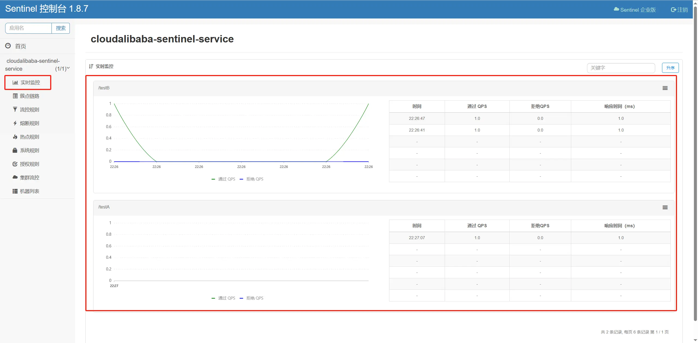

### 流控规则

#### 基本介绍

Sentinel 能够对流量进行控制，主要是监控应用的 QPS 流量或者并发线程数等指标，如果达到指定的阈值时，就会被流量进行控制，以避免服务被瞬时的高并发流量击垮，保证服务的高可靠性。参数见最下方：

| 参数     | 介绍                                                         |
| -------- | :----------------------------------------------------------- |
| 资源名   | 资源的唯一名称，默认就是请求的接口路径，可以自行修改，但是要保证唯一。 |
| 针对来源 | 具体针对某个微服务进行限流，默认值为 default，表示不区分来源，全部限流。 |
| 阈值类型 | QPS 表示通过 QPS 进行限流，并发线程数表示通过并发线程数限流。 |
| 单机阈值 | 与阈值类型组合使用。如果阈值类型选择的是 QPS，表示当调用接口的 QPS 达到阈值时，进行限流操作。<br />如果阈值类型选择的是并发线程数，则表示当调用接口的并发线程数达到阈值时，进行限流操作。 |
| 是否集群 | 选中则表示集群环境，不选中则表示非集群环境。                 |

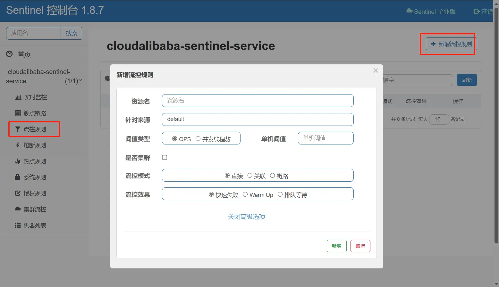

#### 流控模式

##### 直接

- 默认的流控模式，当接口达到限流条件时，直接开启限流功能。

- 配置及说明

    - 表示 1 秒钟内查询 1 次就是 OK，若超过次数 1，就直接-快速失败，报默认错误

        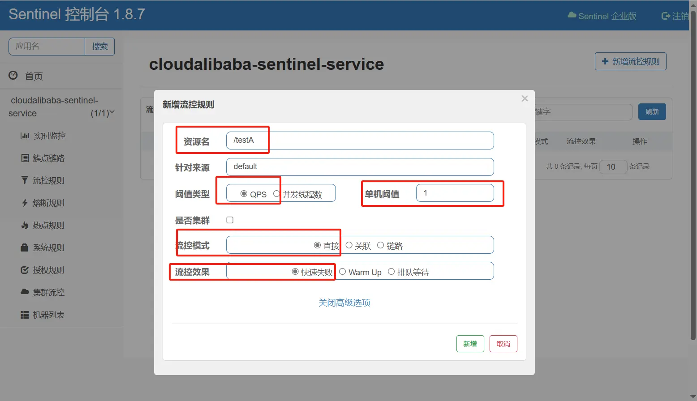

- 测试

    - 快速点击访问http://localhost:8401/testA
    - 结果：`Blocked by Sentinel (flow limiting)`
    - 直接调用默认报错信息，技术方面 OK，but,是否应该有我们自己的后续处理？类似有个 fallback 的兜底方法？

##### 关联

- 是什么

    - 当关联的资源达到阈值时，就限流自己
    - 当与 A 关联的资源 B 达到阀值后，就限流 A 自己

- 配置 A

    - 设置效果：当关联资源/testB 的 qps 阀值超过 1 时，就限流/testA 的 Rest 访问地址，当关联资源到阈值后限制配置好的资源名

        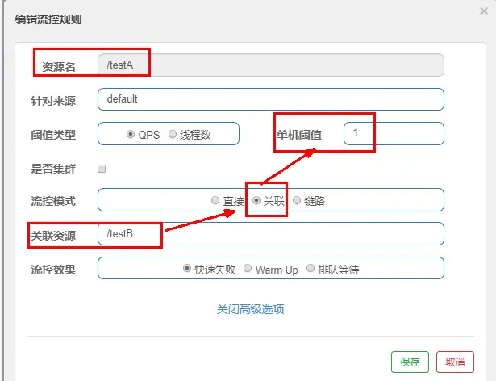

    - Jmeter 模拟并发密集访问 testB

        - https://jmeter.apache.org/download_jmeter.cgi
    
            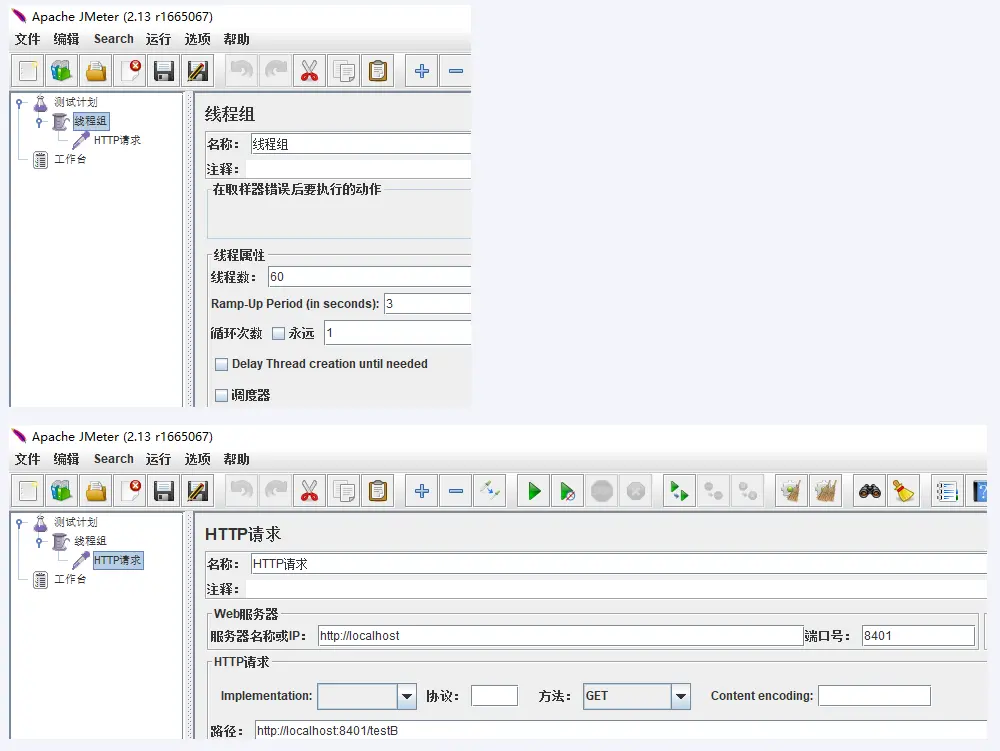

        - 大批量线程高并发访问 B，导致 A 失效了
    
    - 运行后发现 testA 挂了

##### 链路

- 来自不同链路的请求对同一个目标访问时，实施针对性的不同限流措施，比如 C 请求来访问就限流，D 请求来访问就是 OK

- 修改微服务 cloudalibaba-sentinel-service8401

    - 新建 FlowLimitService

        ```java
        package com.atguigu.cloud.service;
        
        @Service
        public class FlowLimitService {
            @SentinelResource(value = "common")
            public void common() {
                System.out.println("------FlowLimitService come in");
            }
        }
        ```

    - 修改 FlowLimitController

        ```java
        /**
         * 流控-链路演示demo
         * C和D两个请求都访问flowLimitService.common()方法，阈值到达后对C限流，对D不管
         */
        @Resource
        private FlowLimitService flowLimitService;
        @GetMapping("/testC")
        public String testC() {
            flowLimitService.common();
            return "------testC";
        }
        @GetMapping("/testD")
        public String testD() {
            flowLimitService.common();
            return "------testD";
        }
        ```

    - 修改 YML

        ```yml
        server:
          port: 8401
        
        spring:
          application:
            name: cloudalibaba-sentinel-service
          cloud:
            nacos:
              discovery:
                server-addr: localhost:8848         #Nacos服务注册中心地址
            sentinel:
              transport:
                dashboard: localhost:8080 #配置Sentinel dashboard控制台服务地址
                port: 8719 #默认8719端口，假如被占用会自动从8719开始依次+1扫描,直至找到未被占用的端口
              ###添加以下内容###
              web-context-unify: false # controller层的方法对service层调用不认为是同一个根链路
        ```

- sentinel 配置

    - 说明：C 和 D 两个请求都访问 `flowLimitService.common()` 方法，对 C 限流，对 D 不管

        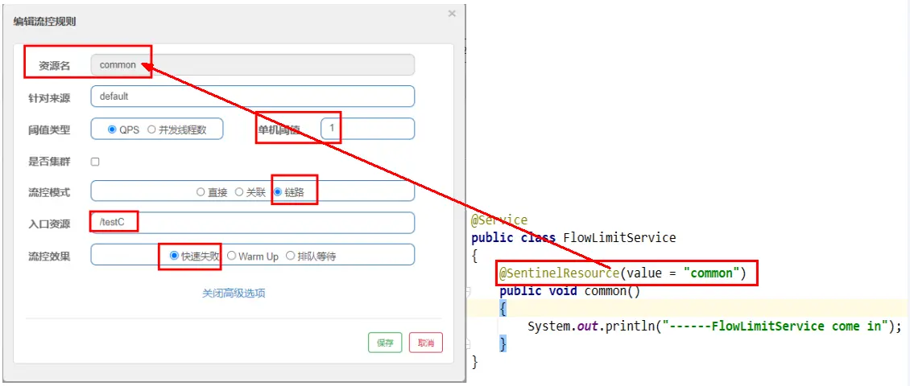

- 测试

    - http://localhost:8401/testC
    - C 链路超过一秒钟一次后，就发生限流
    - D 链路 Ok

#### 流控效果

##### 快速失败（默认的流控处理）

直接失败，抛出异常 `Blocked by Sentinel (flow limiting)`

##### 预热 WarmUp

1. [限流 冷启动 · alibaba/Sentinel Wiki (github.com)](https://github.com/alibaba/Sentinel/wiki/限流---冷启动)

    

2. 公式：阈值除以冷却因子 coldFactor（默认值为 3）,经过预热时长后才会达到阈值

    `com.alibaba.csp.sentinel.slots.block.flow.controller.WarmUpController`

    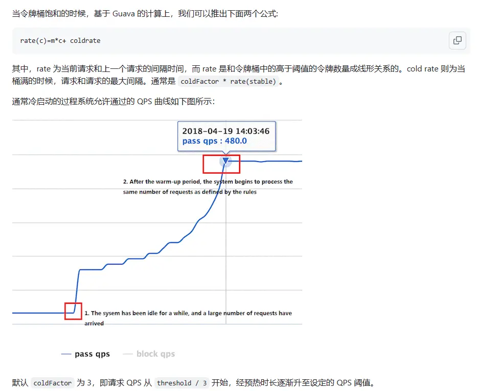

3. WarmUp 配置

    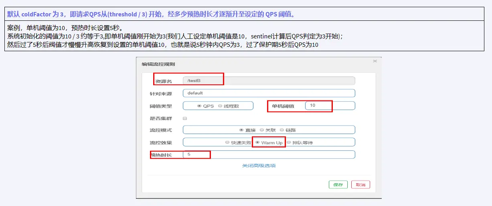

4. 多次点击http://localhost:8401/testB，刚开始不行，后续慢慢 OK

5. 应用场景：如：秒杀系统在开启的瞬间，会有很多流量上来，很有可能把系统打死，预热方式就是把为了保护系统，可慢慢的把流量放进来，慢慢的把阈值增长到设置的阈值。

##### 排队等待

1. 是什么

    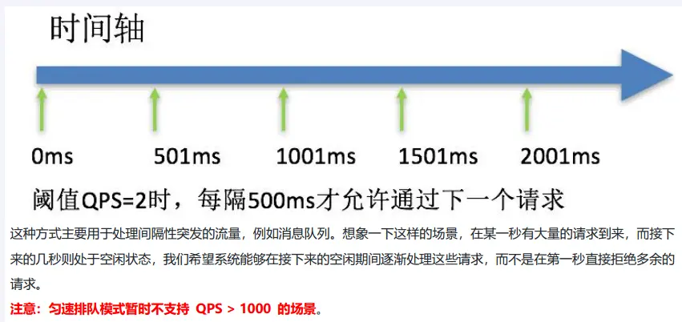

2. 修改 FlowLimitController

    ```java
    @GetMapping("/testE")
    public String testE() {
        System.out.println(System.currentTimeMillis()+"      testE,排队等待");
        return "------testE";
    }
    ```

3. http://localhost:8401/testE

4. sentinel 配置

    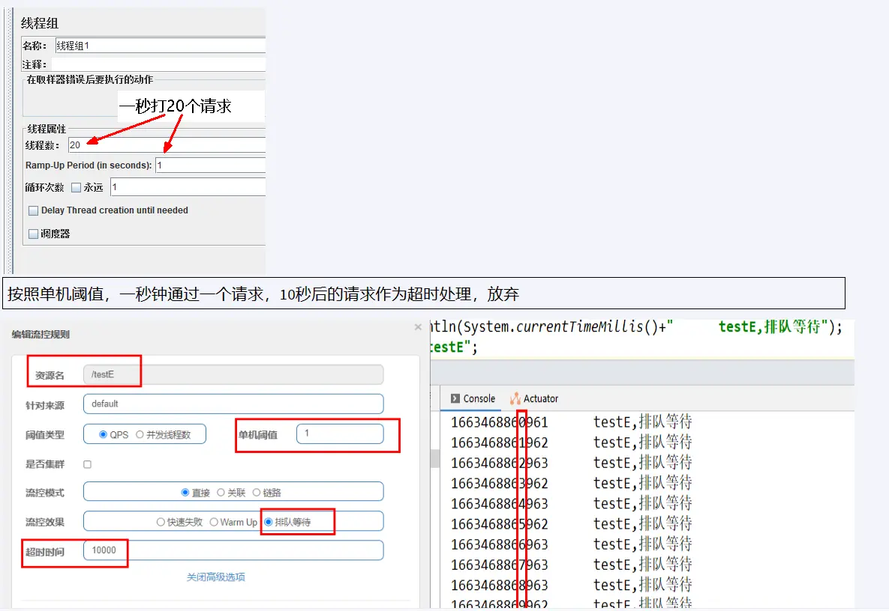

#### 流控效果 V2（并发线程数）

- sentinel 配置

    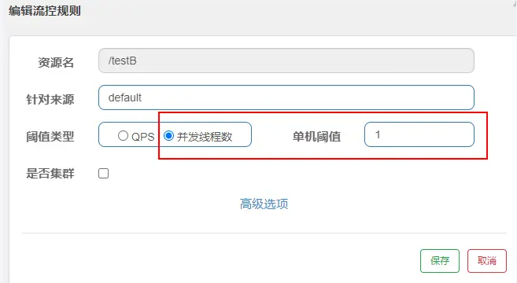

- Jmeter 模拟多个线程并发+循环请求

    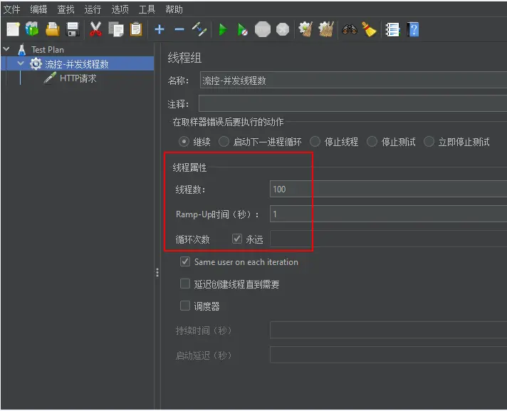

- http://localhost:8401/testB

    - Jmeter 给它打满了，大部分我们自己访问都不好使，偶尔 Jmeter 线程切换系统判定没访问，我们自己的点击才有点机会

### 熔断规则

#### 官网

[熔断降级 · alibaba/Sentinel Wiki (github.com)](https://github.com/alibaba/Sentinel/wiki/熔断降级)

#### 基本介绍

- Sentinel 熔断降级会在调用链路中某个资源出现不稳定状态时（例如调用超时或异常比例升高），对这个资源的调用进行限制，让请求快速失败，避免影响到其它的资源而导致级联错误。
- 当资源被降级后，在接下来的降级时间窗口之内，对该资源的调用都自动熔断（默认行为是抛出 DegradeException）。

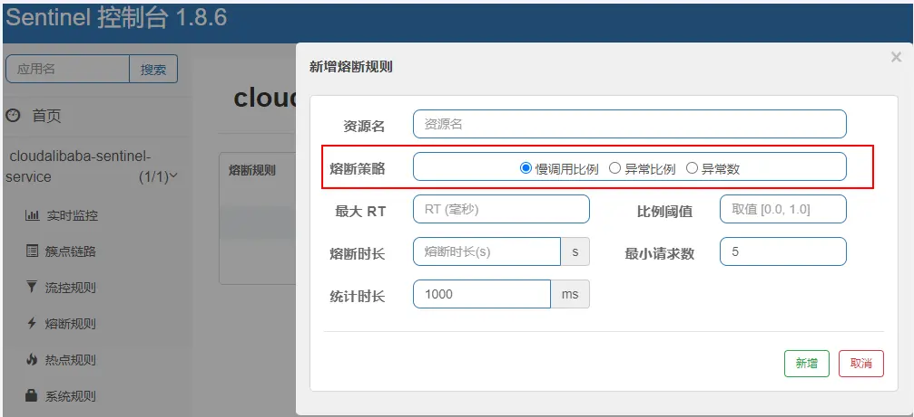

**Sentinel 主要提供了三个熔断策略**

- 慢调用比例 (`SLOW_REQUEST_RATIO`)：选择以慢调用比例作为阈值，需要设置允许的慢调用 RT（即最大的响应时间），请求的响应时间大于该值则统计为慢调用。当单位统计时长（`statIntervalMs`）内请求数目大于设置的最小请求数目，并且慢调用的比例大于阈值，则接下来的熔断时长内请求会自动被熔断。经过熔断时长后熔断器会进入探测恢复状态（HALF-OPEN 状态），若接下来的一个请求响应时间小于设置的慢调用 RT 则结束熔断，若大于设置的慢调用 RT 则会再次被熔断。
- 异常比例 (`ERROR_RATIO`)：当单位统计时长（`statIntervalMs`）内请求数目大于设置的最小请求数目，并且异常的比例大于阈值，则接下来的熔断时长内请求会自动被熔断。经过熔断时长后熔断器会进入探测恢复状态（HALF-OPEN 状态），若接下来的一个请求成功完成（没有错误）则结束熔断，否则会再次被熔断。异常比率的阈值范围是 `[0.0, 1.0]`，代表 0% - 100%。
- 异常数 (`ERROR_COUNT`)：当单位统计时长内的异常数目超过阈值之后会自动进行熔断。经过熔断时长后熔断器会进入探测恢复状态（HALF-OPEN 状态），若接下来的一个请求成功完成（没有错误）则结束熔断，否则会再次被熔断。

#### 新增熔断规则实战

##### 慢调用比例

###### 是什么

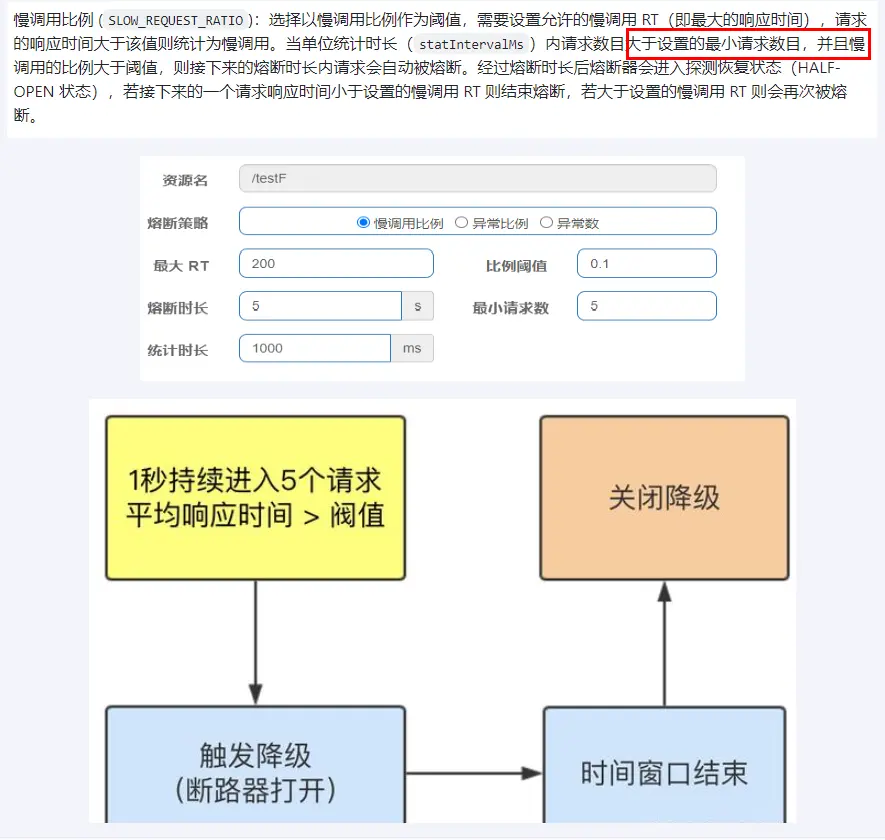

###### 名词解释

进入熔断状态判断依据：在统计时长内，**实际请求数目＞设定的最小请求数**  且   **实际慢调用比例＞比例阈值** ，进入熔断状态。

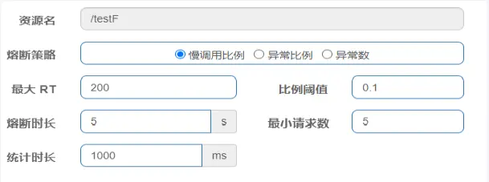

1. 调用：一个请求发送到服务器，服务器给与响应，一个响应就是一个调用。
2. 最大 RT：即最大的响应时间，指系统对请求作出响应的业务处理时间。
3. 慢调用：处理业务逻辑的实际时间>设置的最大 RT 时间，这个调用叫做慢调用。
4. 慢调用比例：在所有调用中，慢调用占有实际的比例＝慢调用次数➗总调用次数
5. 比例阈值：自己设定的 ， 比例阈值＝慢调用次数➗调用次数
6. 统计时长：时间的判断依据
7. 最小请求数：设置的调用最小请求数，上图比如 1 秒钟打进来 10 个线程（大于我们配置的 5 个了）调用被触发

###### 触发条件+熔断状态

1. 熔断状态（保险丝跳闸断电，不可访问）：在接下来的熔断时长内请求会自动被熔断
2. 探测恢复状态（探路先锋）：熔断时长结束后进入探测恢复状态

3. 结束熔断（保险丝闭合恢复，可以访问）：在探测恢复状态，如果接下来的一个请求响应时间小于设置的慢调用 RT，则结束熔断，否则继续熔断。

###### 测试

1. 代码

    ```java
    /**
     * 新增熔断规则-慢调用比例
     * @return
     */
    @GetMapping("/testF")
    public String testF() {
        //暂停几秒钟线程
        try { TimeUnit.SECONDS.sleep(1); } catch (InterruptedException e) { e.printStackTrace(); }
        System.out.println("----测试:新增熔断规则-慢调用比例 ");
        return "------testF 新增熔断规则-慢调用比例";
    }
    ```

2. 配置

    

3. jmeter 压测

    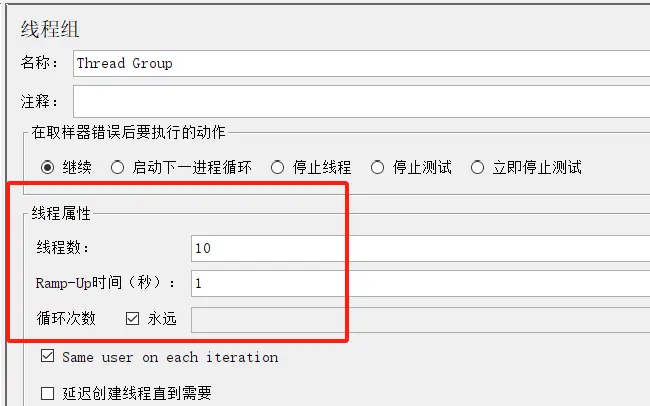

4. 结论

    **假如在统计时长内，实际请求数目＞最小请求数且慢调用比例＞比例阈值 ，断路器打开（保险丝跳闸）微服务不可用(Blocked by Sentinel (flow limiting))，进入熔断状态 5 秒**；后续停止 jmeter，没有这么大的访问量了，单独用浏览器访问 rest 地址，断路器关闭（保险丝恢复，合上闸口），微服务恢复 OK。

##### 异常比例

###### 是什么

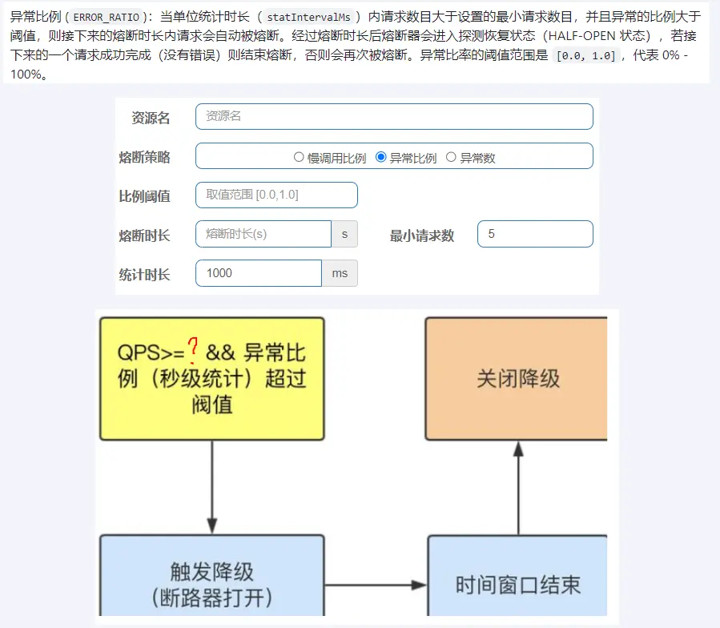

###### 测试

1. 代码

    ```java
    /**
     * 新增熔断规则-异常比例
     * @return
     */
    @GetMapping("/testG")
    public String testG() {
        System.out.println("----测试:新增熔断规则-异常比例 ");
        int age = 10/0;
        return "------testG,新增熔断规则-异常比例 ";
    }
    ```

2. 配置

    - 不配置 Sentinel，对于`int age=10/0`，调一次错一次报错 error，页面报【Whitelabel Error Page】或全局异常
    - 配置 Sentinel，对于`int age=10/0`，如符合如下异常比例启动熔断，页面报【Blocked by Sentinel (flow limiting)】

    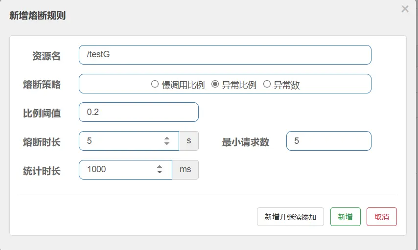

3. jmeter 压测：修改调用请求，其余设置同满调用比例

4. 结论

    - 注：将全局异常 Handler 关了，否则看不出效果来，都会被捕获。
    - 按照上述配置，单独访问一次，必然来一次报错一次(int age = 10/0)达到 100%，调一次错一次报错 error；
    - 开启 jmeter 后，直接高并发发送请求，多次调用达到我们的配置条件了。
    - 断路器开启（保险丝跳闸），微服务不可用了，不再报错 error 而是服务熔断+服务降级，出提示 Blocked by Sentinel (flow limiting)。

##### 异常数

###### 是什么

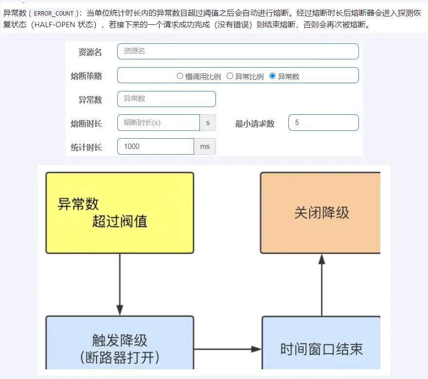

###### 测试

1. 代码

    ```java
    /**
     * 新增熔断规则-异常数
     * @return
     */
    @GetMapping("/testH")
    public String testH() {
        System.out.println("----测试:新增熔断规则-异常数 ");
        int age = 10/0;
        return "------testH,新增熔断规则-异常数 ";
    }
    ```

2. 配置

    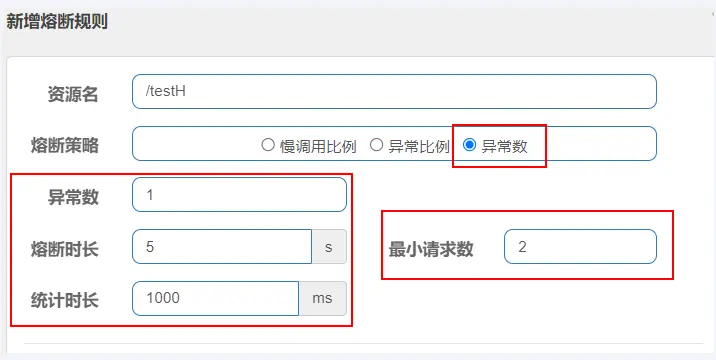

3. jmeter 压测：修改调用请求，其余设置同满调用比例

4. 结论

    - http://localhost:8401/testH，第一次访问绝对报错，因为除数不能为零，我们看到 error 窗口；
    - 开启 jmeter 后，直接高并发干爆他发送请求，多次调用达到我们的配置条件了。
    - 但是 jmeter 开工，上述配置表示，在 1 秒钟内最少请求 2 次，当异常数大于 1 时，会触发熔断操作断路器开启（保险丝跳闸），微服务不可用了，熔断的时长为 5 秒，不再报错 error 而是服务降级了出提示 Blocked by Sentinel (flow limiting) 。

### `@SentinelResource` 注解

#### 是什么

- SentinelResource 是一个**流量防卫防护组件注解，用于指定防护资源，对配置的资源进行流量控制、熔断降级等功能**。

- @SentinelResource 注解说明

    ```java
    @Target({ElementType.METHOD, ElementType.TYPE})
    @Retention(RetentionPolicy.RUNTIME)
    @Inherited
    public @interface SentinelResource {
    
        //资源名称
        String value() default "";
    
        //entry类型，标记流量的方向，取值IN/OUT，默认是OUT
        EntryType entryType() default EntryType.OUT;
        //资源分类
        int resourceType() default 0;
    
        //处理BlockException的函数名称,函数要求：
        //1. 必须是 public
        //2.返回类型 参数与原方法一致
        //3. 默认需和原方法在同一个类中。若希望使用其他类的函数，可配置blockHandlerClass ，并指定blockHandlerClass里面的方法。
        String blockHandler() default "";
    
        //存放blockHandler的类,对应的处理函数必须static修饰。
        Class<?>[] blockHandlerClass() default {};
    
        //用于在抛出异常的时候提供fallback处理逻辑。 fallback函数可以针对所
        //有类型的异常（除了 exceptionsToIgnore 里面排除掉的异常类型）进行处理。函数要求：
        //1. 返回类型与原方法一致
        //2. 参数类型需要和原方法相匹配
        //3. 默认需和原方法在同一个类中。若希望使用其他类的函数，可配置fallbackClass ，并指定fallbackClass里面的方法。
        String fallback() default "";
    
        //存放fallback的类。对应的处理函数必须static修饰。
        String defaultFallback() default "";
    
        //用于通用的 fallback 逻辑。默认fallback函数可以针对所有类型的异常进
        //行处理。若同时配置了 fallback 和 defaultFallback，以fallback为准。函数要求：
        //1. 返回类型与原方法一致
        //2. 方法参数列表为空，或者有一个 Throwable 类型的参数。
        //3. 默认需要和原方法在同一个类中。若希望使用其他类的函数，可配置fallbackClass ，并指定 fallbackClass 里面的方法。
        Class<?>[] fallbackClass() default {};
     
    
        //需要trace的异常
        Class<? extends Throwable>[] exceptionsToTrace() default {Throwable.class};
    
        //指定排除忽略掉哪些异常。排除的异常不会计入异常统计，也不会进入fallback逻辑，而是原样抛出。
        Class<? extends Throwable>[] exceptionsToIgnore() default {};
    }
    ```

#### 启动 Nacos、Sentinel

```shell
startup.cmd -m standalone
java -jar sentinel-dashboard-1.8.7.jar
```

#### 按照 rest 地址限流+默认限流返回

1. 通过访问的 rest 地址来限流，会返回 Sentinel 自带默认的限流处理信息

2. 业务类 RateLimitController

    ```java
    package com.atguigu.cloud.controller;
    
    @RestController
    @Slf4j
    public class RateLimitController {
        @GetMapping("/rateLimit/byUrl")
        public String byUrl() {
            return "按rest地址限流测试OK";
        }
    }
    ```

3. 访问一次 http://localhost:8401/rateLimit/byUrl

4. Sentinel 控制台配置

    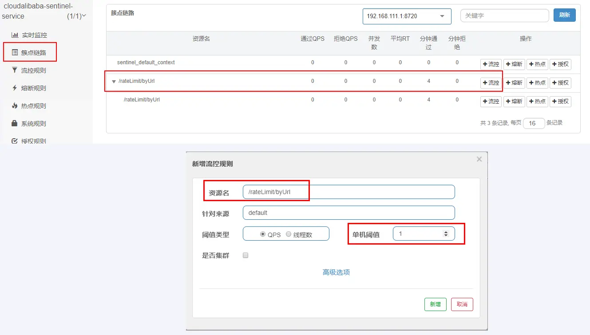

5. 测试：疯狂点击http://localhost:8401/rateLimit/byUrl，会返回**Sentinel 自带的限流处理结果 Blocked by Sentinel (flow limiting)，默认**

#### 按 SentinelResource 资源名称限流+自定义限流返回

不想用默认的限流提示(Blocked by Sentinel (flow limiting))，**想返回自定义限流的提示**

1. RateLimitController 添加方法

    ```java
    @GetMapping("/rateLimit/byResource")
    @SentinelResource(value = "byResourceSentinelResource", blockHandler = "handleException")
    public String byResource() {
        return "按资源名称SentinelResource限流测试OK，O(∩_∩)O";
    }
    public String handleException(BlockException exception) {
        return "服务不可用@SentinelResource启动" + "\t" + "o(╥﹏╥)o";
    }
    ```

2. 测试地址：http://localhost:8401/rateLimit/byResource

3. 配置流控规则

    - 配置步骤

        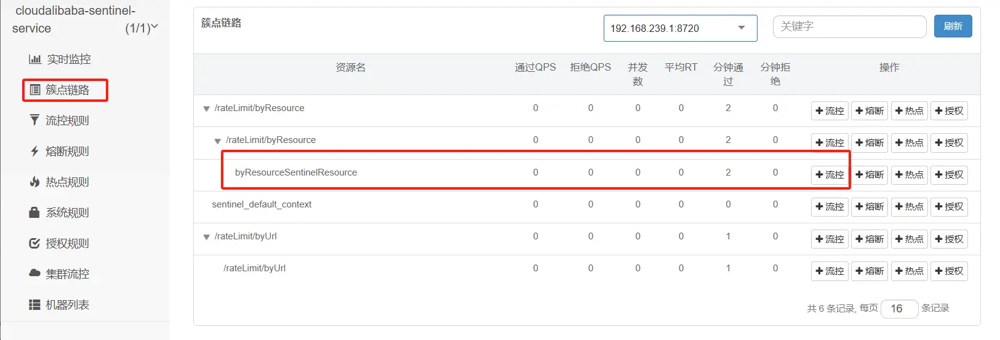

    - 图形配置和代码关系

        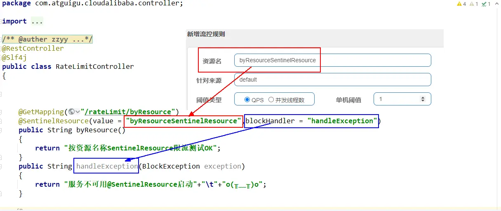

4. 测试

    - 1 秒钟点击 1 下，OK

    - 超过上述，疯狂点击，返回了自定义的限流处理信息，限流发生

        - sentinel 默认

            

        - 自定义限流提示

            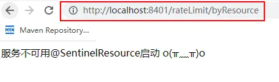

#### 按 SentinelResource 资源名称限流+自定义限流返回+服务降级处理

按 SentinelResource 配置，点击超过限流配置返回自定义限流提示+**程序异常返回 fallback 服务降级**

1. RateLimitController 添加方法

    ```java
    @GetMapping("/rateLimit/doAction/{p1}")
    @SentinelResource(value = "doActionSentinelResource",
            blockHandler = "doActionBlockHandler", fallback = "doActionFallback")
    public String doAction(@PathVariable("p1") Integer p1) {
        if (p1 == 0) { throw new RuntimeException("p1等于零直接异常"); }
        return "doAction";
    }
    public String doActionBlockHandler(@PathVariable("p1") Integer p1, BlockException e) {
        log.error("sentinel配置自定义限流了:{}", e);
        return "sentinel配置自定义限流了";
    }
    public String doActionFallback(@PathVariable("p1") Integer p1, Throwable e) {
        log.error("程序逻辑异常了:{}", e);
        return "程序逻辑异常了" + "\t" + e.getMessage();
    }
    ```

2. 测试地址：http://localhost:8401/rateLimit/doAction/2

3. 配置流控规则

    - 图形配置和代码关系

        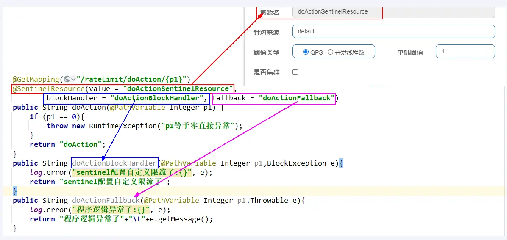

    - 表示 1 秒钟内查询次数大于 1，就跑到我们自定义的处流，限流

4. 测试

    - http://localhost:8401/rateLimit/doAction/2 
        - 1 秒钟点击 1 下，OK。
        - 超过上述，疯狂点击，**返回了自己定义的限流处理信息**，限流发生，配合了 sentinel 设定的规则
    - http://localhost:8401/rateLimit/doAction/0
        - p1 参数为零，异常发生，**返回了自己定义的服务降级处理**

5. 小结

    - blockHandler，主要针对 sentinel 配置后出现的违规情况处理
    - fallback，程序异常了 JVM 抛出的异常服务降级
    - 两者可以同时共存

### 热点规则

#### 基本介绍

[热点参数限流 · alibaba/Sentinel Wiki (github.com)](https://github.com/alibaba/Sentinel/wiki/热点参数限流)

何为热点？热点即经常访问的数据。很多时候我们希望统计某个热点数据中访问频次最高的 Top K 数据，并对其访问进行限制。比如：

- 商品 ID 为参数，统计一段时间内最常购买的商品 ID 并进行限制
- 用户 ID 为参数，针对一段时间内频繁访问的用户 ID 进行限制

#### 代码

RateLimitController 添加方法

```java
@GetMapping("/testHotKey")
@SentinelResource(value = "testHotKey", blockHandler = "dealHandler_testHotKey")
public String testHotKey(@RequestParam(value = "p1", required = false) String p1, 
                         @RequestParam(value = "p2", required = false) String p2) {
    return "------testHotKey";
}
public String dealHandler_testHotKey(String p1, String p2, BlockException exception) {
    return "-----dealHandler_testHotKey";
}
```

#### 配置

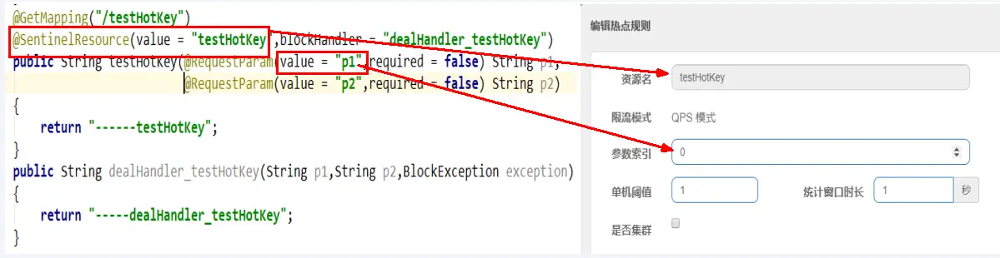

- 限流模式只支持 QPS 模式，固定写死了。（这才叫热点）
- `@SentinelResource`注解的方法参数索引，0 代表第一个参数，1 代表第二个参数，以此类推
- 单机阀值以及统计窗口时长表示在此窗口时间超过阀值就限流。
- 上面的抓图就是第一个参数有值的话，1 秒的 QPS 为 1，超过就限流，限流后调用 `dealHandler_testHotKey` 支持方法。

#### 测试

1. error
    - http://localhost:8401/testHotKey?p1=abc
    - 含有参数 P1，当每秒访问的频率超过 1 次时，会触发 Sentinel 的限流操作
2. error
    - http://localhost:8401/testHotKey?p1=abc&p2=33
    - 含有参数 P1，当每秒访问的频率超过 1 次时，会触发 Sentinel 的限流操作
3. right
    - http://localhost:8401/testHotKey?p2=abc
    - 没有热点参数 P1，不断访问则不会触发限流操作

#### 参数例外项

上述案例演示了第一个参数 p1，当 QPS 超过 1 秒 1 次点击后马上被限流

##### 特例情况

1. 普通正常限流
    - 含有 P1 参数，超过 1 秒钟一个后，达到阈值 1 后马上被限流
2. 例外特殊限流
    - 我们期望 p1 参数当它是某个特殊值时，到达某个约定值后【普通正常限流】规则突然例外、失效了，它的限流值和平时不一样
    - 假如当 p1 的值等于 5 时，它的阈值可以达到 200 或其它值

##### 配置

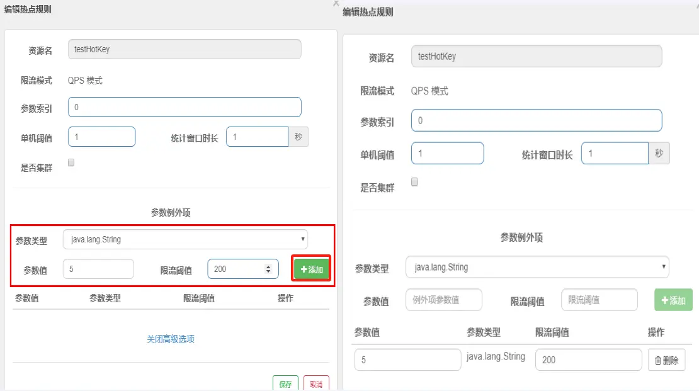

##### 测试

- http://localhost:8401/testHotKey?p1=5
    - 超过 1 秒钟一个后，达到阈值 200 后才会被限流
    - 当 p1 等于 5 的时候，阈值变为 200
- http://localhost:8401/testHotKey?p1=3
    - 超过 1 秒钟一个后，达到阈值后马上被限流
    - 当 p1 不等于 5 的时候，阈值就是平常的【普通正常限流】规则

##### 前提条件

热点参数的注意点，参数必须是基本类型或者 String

### 授权规则

#### 授权规则概述

[黑白名单控制 · alibaba/Sentinel Wiki (github.com)](https://github.com/alibaba/Sentinel/wiki/黑白名单控制)

- 在某些场景下，需要根据调用接口的来源判断是否允许执行本次请求。此时就可以使用 Sentinel 提供的授权规则来实现，Sentinel 的授权规则能够根据请求的来源判断是否允许本次请求通过。
- 在 Sentinel 的授权规则中，提供了 白名单与黑名单 两种授权类型。白放行、黑禁止

#### 演示授权规则，黑名单禁止

1. 添加 EmpowerController

    ```java
    package com.atguigu.cloud.controller;
    
    @RestController
    @Slf4j
    public class EmpowerController //Empower授权规则，用来处理请求的来源
    {
        @GetMapping(value = "/empower")
        public String requestSentinel4() {
            log.info("测试Sentinel授权规则empower");
            return "Sentinel授权规则";
        }
    }
    ```

2. 添加 MyRequestOriginParser

    ```java
    package com.atguigu.cloud.handler;
    
    @Component
    public class MyRequestOriginParser implements RequestOriginParser {
        @Override
        public String parseOrigin(HttpServletRequest httpServletRequest) {
            return httpServletRequest.getParameter("serverName");
        }
    }
    ```

3. 启动 8401 后先访问成功 http://localhost:8401/empower

#### 配置

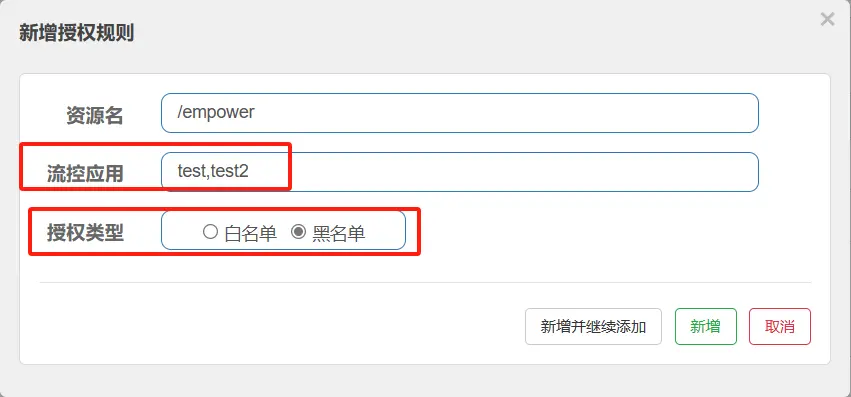

#### 测试

- error
    - http://localhost:8401/empower?serverName=test
    - http://localhost:8401/empower?serverName=test2
    - Blocked by Sentinel (flow limiting)
- 说明：上述 2 个 rest 地址，serverName=test 或 serverName=test2 是处于黑名单的状态，无法访问，会发现无法访问，被 Sentinel 限流了
- right：http://localhost:8401/empower?serverName=ab

### 规则持久化

#### 是什么

一旦我们重启微服务应用，sentinel 规则将消失，生产环境需要将配置规则进行持久化

#### 怎么玩

将限流配置规则持久化进 Nacos 保存，只要刷新 8401 某个 rest 地址，sentinel 控制台的流控规则就能看到，只要 Nacos 里面的配置不删除，针对 8401 上 sentinel 上的流控规则持续有效

#### 步骤

修改 cloudalibaba-sentinel-service8401

1. POM

    ```xml
    <!--SpringCloud ailibaba sentinel-datasource-nacos -->
    <dependency>
        <groupId>com.alibaba.csp</groupId>
        <artifactId>sentinel-datasource-nacos</artifactId>
    </dependency>
    ```

2. YML

    ```yml
    server:
      port: 8401
    
    spring:
      application:
        name: cloudalibaba-sentinel-service
      cloud:
        nacos:
          discovery:
            server-addr: localhost:8848         #Nacos服务注册中心地址
        sentinel:
          transport:
            dashboard: localhost:8080 #配置Sentinel dashboard控制台服务地址
            port: 8719 #默认8719端口，假如被占用会自动从8719开始依次+1扫描,直至找到未被占用的端口
          web-context-unify: false # controller层的方法对service层调用不认为是同一个根链路
          # 添加Nacos数据源配置
          datasource:
            ds1:
              nacos:
                server-addr: localhost:8848
                dataId: ${spring.application.name}
                groupId: DEFAULT_GROUP
                data-type: json
                rule-type: flow # com.alibaba.cloud.sentinel.datasource.RuleType
    ```

    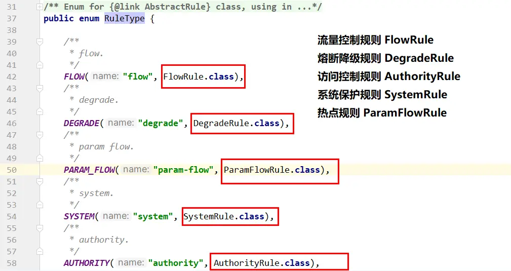

    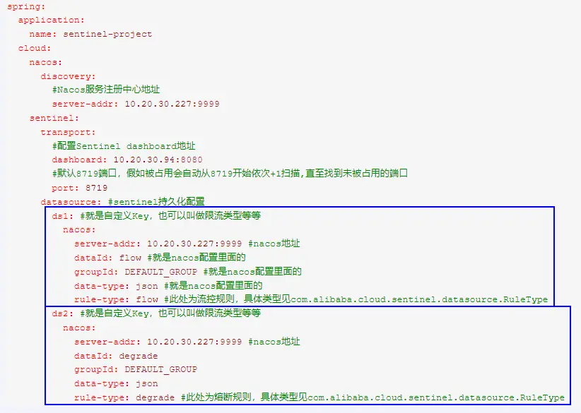

3. 添加 Nacos 业务规则配置

    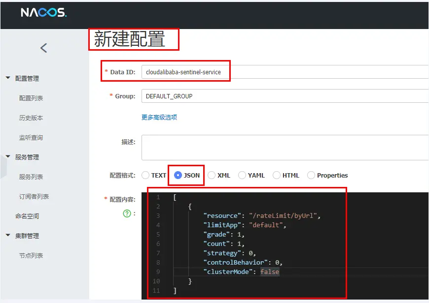

    ```json
    [
        {
            "resource": "/rateLimit/byUrl",
            "limitApp": "default",
            "grade": 1,
            "count": 1,
            "strategy": 0,
            "controlBehavior": 0,
            "clusterMode": false
        }
    ]
    ```

    ```
    resource：资源名称；
    limitApp：来源应用；
    grade：阈值类型，0表示线程数，1表示QPS；
    count：单机阈值；
    strategy：流控模式，0表示直接，1表示关联，2表示链路；
    controlBehavior：流控效果，0表示快速失败，1表示Warm Up，2表示排队等待；
    clusterMode：是否集群。
    ```

4. 快速访问测试接口：http://localhost:8401/rateLimit/byUrl

    - 上面地址访问后等待 3 秒钟
    - 启动 8401 后刷新 sentinel 发现业务规则有了

5. 停止 8401 再看 sentinel

    - 停机后流量控制规则没有了

6. 重新启动 8401 再看 sentinel

    - 开始还是没有，稍等一会儿，多次调用
    - 配置出现了，持久化验证通过

### OpenFeign 和 Sentinel 集成实现 fallback 服务降级

#### 需求说明

`cloudalibaba-consumer-nacos-order83`  通过 OpenFeign 调用  `cloudalibaba-provider-payment9001`

1. 83  通过 OpenFeign 调用 9001 微服务，正常访问 OK
2. 83  通过 OpenFeign 调用 9001 微服务，异常访问 error
    - 访问者要有 fallback 服务降级的情况，不要持续访问 9001 加大微服务负担，但是通过 feign 接口调用的又方法各自不同，
    - 如果每个不同方法都加一个 fallback 配对方法，会导致代码膨胀不好管理，工程埋雷....../(ㄒoㄒ)/~~

3. `public @interface FeignClient`
    - 通过 fallback 属性进行统一配置，feign 接口里面定义的全部方法都走统一的服务降级，**一个搞定即可**。

4. 9001 微服务自身还带着 sentinel 内部配置的流控规则，如果满足也会被触发，也即本例有 2 个 Case
    - OpenFeign 接口的统一 fallback 服务降级处理
    - Sentinel 访问触发了自定义的限流配置,在注解@SentinelResource 里面配置的 blockHandler 方法。

#### 程序解耦

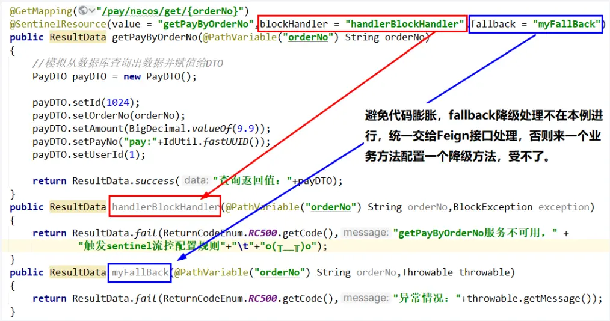

#### 编码步骤

##### 启动 Nacos、Sentinel

```shell
startup.cmd -m standalone
java -jar sentinel-dashboard-1.8.7.jar
```

##### 修改服务提供方 cloudalibaba-provider-payment9001

1. 改 POM，增加 sentinel 依赖

    ```xml
    <!--alibaba-sentinel-->
    <dependency>
        <groupId>com.alibaba.cloud</groupId>
        <artifactId>spring-cloud-starter-alibaba-sentinel</artifactId>
    </dependency>
    ```

2. 写 YML，增加 sentinel  配置

    ```yml
    server:
      port: 9001
    
    spring:
      application:
        name: nacos-payment-provider
      cloud:
        nacos:
          discovery:
            server-addr: localhost:8848 #配置Nacos地址
        sentinel:
          transport:
            dashboard: localhost:8080 #配置Sentinel dashboard控制台服务地址
            port: 8719 #默认8719端口，假如被占用会自动从8719开始依次+1扫描,直至找到未被占用的端口
    ```

3. 业务类

    ```java
    package com.atguigu.cloud.controller;
    
    @RestController
    public class PayAlibabaController {
        @Value("${server.port}")
        private String serverPort;
    
        @GetMapping(value = "/pay/nacos/{id}")
        public String getPayInfo(@PathVariable("id") Integer id) {
            return "nacos registry, serverPort: " + serverPort + "\t id" + id;
        }
    
        @GetMapping("/pay/nacos/get/{orderNo}")
        @SentinelResource(value = "getPayByOrderNo", blockHandler = "handlerBlockHandler")
        public ResultData getPayByOrderNo(@PathVariable("orderNo") String orderNo) {
            //模拟从数据库查询出数据并赋值给DTO
            PayDTO payDTO = new PayDTO();
            payDTO.setId(1024);
            payDTO.setOrderNo(orderNo);
            payDTO.setAmount(BigDecimal.valueOf(9.9));
            payDTO.setPayNo("pay:" + IdUtil.fastUUID());
            payDTO.setUserId(1);
            return ResultData.success("查询返回值：" + payDTO);
        }
    
        public ResultData handlerBlockHandler(@PathVariable("orderNo") String orderNo, BlockException exception) {
            return ResultData.fail(ReturnCodeEnum.RC500.getCode(), "getPayByOrderNo服务不可用，" +
                    "触发sentinel流控配置规则" + "\t" + "o(╥﹏╥)o");
        }
        /*
        fallback服务降级方法纳入到Feign接口统一处理，全局一个
        public ResultData myFallBack(@PathVariable("orderNo") String orderNo,Throwable throwable)
        {
            return ResultData.fail(ReturnCodeEnum.RC500.getCode(),"异常情况："+throwable.getMessage());
        }
        */
    }
    ```

4. 启动 9001 微服务自测：http://localhost:9001/pay/nacos/get/ord1024

##### 修改 cloud-api-commons

1. POM，增加 sentinel 依赖

    ```xml
    <!--alibaba-sentinel-->
    <dependency>
        <groupId>com.alibaba.cloud</groupId>
        <artifactId>spring-cloud-starter-alibaba-sentinel</artifactId>
    </dependency>
    ```

2. 新增 PayFeignSentinelApi 接口

    ```java
    package com.atguigu.cloud.apis;
    
    @FeignClient(value = "nacos-payment-provider", fallback = PayFeignSentinelApiFallBack.class)
    public interface PayFeignSentinelApi {
        @GetMapping("/pay/nacos/get/{orderNo}")
        public ResultData getPayByOrderNo(@PathVariable("orderNo") String orderNo);
    }
    ```

3. 为远程调用新建全局统一服务降级类 fallback = PayFeignSentinelApiFallBack.class

    ```java
    package com.atguigu.cloud.apis;
    
    @Component
    public class PayFeignSentinelApiFallBack implements PayFeignSentinelApi {
        @Override
        public ResultData getPayByOrderNo(String orderNo) {
            return ResultData.fail(ReturnCodeEnum.RC500.getCode(), "对方服务宕机或不可用，FallBack服务降级o(╥﹏╥)o");
        }
    }
    ```

4. gav 坐标

    ```xml
    <!-- 引入自己定义的api通用包 -->
    <dependency>
        <groupId>com.atguigu.cloud</groupId>
        <artifactId>cloud-api-commons</artifactId>
        <version>1.0-SNAPSHOT</version>
    </dependency>
    ```

##### 修改 cloudalibaba-consumer-nacos-order83

1. 改 POM

    ```xml
    <!-- 引入自己定义的api通用包 -->
    <dependency>
        <groupId>com.atguigu.cloud</groupId>
        <artifactId>cloud-api-commons</artifactId>
        <version>1.0-SNAPSHOT</version>
    </dependency>
    <!--    cloud-api-commons中已经引入openfeign和 sentinel，这里也可以不引入   -->
    <!--openfeign-->
    <dependency>
        <groupId>org.springframework.cloud</groupId>
        <artifactId>spring-cloud-starter-openfeign</artifactId>
    </dependency>
    <!--alibaba-sentinel-->
    <dependency>
        <groupId>com.alibaba.cloud</groupId>
        <artifactId>spring-cloud-starter-alibaba-sentinel</artifactId>
    </dependency>
    ```

2. 写 YML，激活 Sentinel 对 Feign 的支持

    ```yml
    server:
      port: 83
    
    spring:
      application:
        name: nacos-order-consumer
      cloud:
        nacos:
          discovery:
            server-addr: localhost:8848
    #消费者将要去访问的微服务名称(nacos微服务提供者叫什么你写什么)
    service-url:
      nacos-user-service: http://nacos-payment-provider
    
    # 激活Sentinel对Feign的支持
    feign:
      sentinel:
        enabled: true
    ```

3. 主启动：添加 `@EnableFeignClients` 启动 Feign 的功能

4. 业务类

    ```java
    @Resource
    private PayFeignSentinelApi payFeignSentinelApi;
    
    @GetMapping(value = "/consumer/pay/nacos/get/{orderNo}")
    public ResultData getPayByOrderNo(@PathVariable("orderNo") String orderNo) {
        return payFeignSentinelApi.getPayByOrderNo(orderNo);
    }
    ```

5. 启动 83 微服务，第 1 次

    - 故障现象

        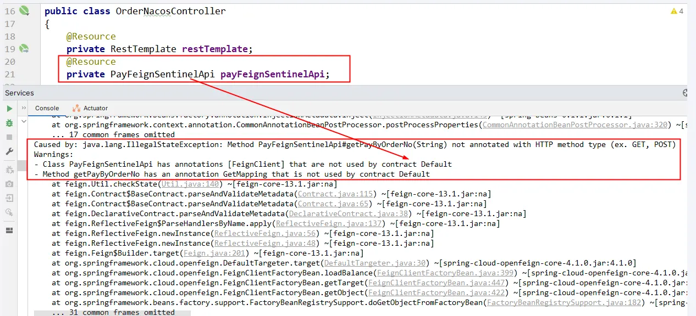

    - 导致原因

        - springboot+springcloud 版本太高导致和阿里巴巴 Sentinel 不兼容

    - 解决方案

        - 方法一：总体父工程 POM.xml 中，boot+cloud 降低版本，cloud-alibaba 版本不变

            ```xml
            <!--<spring.boot.version>3.2.0</spring.boot.version>
            <spring.cloud.version>2023.0.0</spring.cloud.version>-->
            <!-- 上面的配置暂时为本案例注释掉，版本降级一下。
            讲解完后请恢复上述高版本保持前后配置一致，请用下面的版本替代上述 -->
            <spring.boot.version>3.0.9</spring.boot.version>
            <spring.cloud.version>2022.0.2</spring.cloud.version>
            <spring.cloud.alibaba.version>2022.0.0.0-RC2</spring.cloud.alibaba.version>
            ```

        - 方法二：总体父工程 POM.xml 中，boot+cloud 版本不变，cloud-alibaba 版本升级

            ```xml
            <spring.boot.version>3.2.0</spring.boot.version>
            <spring.cloud.version>2023.0.0</spring.cloud.version>
            <!--<spring.cloud.alibaba.version>2022.0.0.0-RC2</spring.cloud.alibaba.version>-->
            <spring.cloud.alibaba.version>2023.0.0.0-RC1</spring.cloud.alibaba.version>     
            ```

6. 启动 83 微服务，第 2 次>：一切正常

#### 测试验证

1. 9001 正常启动后，再启动 83 通过 feign 调用

2. 测试地址：http://localhost:83/consumer/pay/nacos/get/1024

    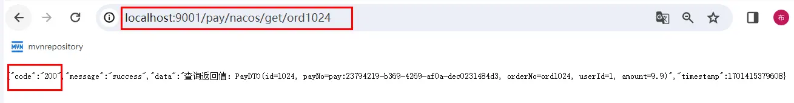

3. sentinel 流控为例，进行配置

    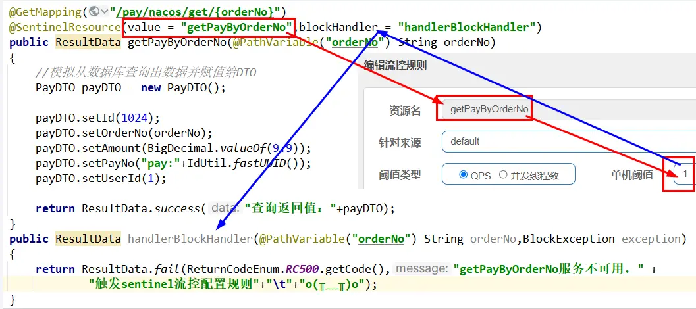

    - 继续频繁访问测试地址后触发了 Sentinel 的流控规则，**blockHandler 起效**

        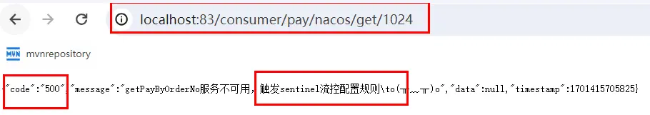

4. 9001 宕机了，83 通过 feign 调用

    - 测试 83 调用 9001，此时**故意关闭 9001 微服务提供者**，看 83 消费侧自动降级，不会被耗死

        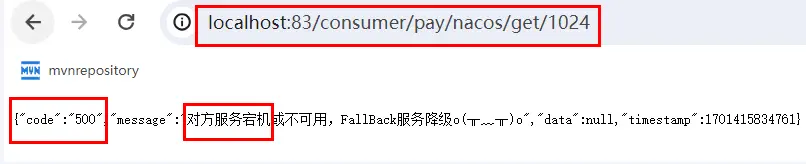

5. 恢复父工程版本号

### GateWay 和 Sentinel 集成实现服务限流

#### 需求说明

`cloudalibaba-sentinel-gateway9528` 保护 `cloudalibaba-provider-payment9001`

#### 启动 Nacos、Sentinel

```shell
startup.cmd -m standalone
java -jar sentinel-dashboard-1.8.7.jar
```

#### 编码步骤

1. 建 Module：`cloudalibaba-sentinel-gateway9528`

2. 改 POM

    ```xml
    <?xml version="1.0" encoding="UTF-8"?>
    <project xmlns="http://maven.apache.org/POM/4.0.0"
             xmlns:xsi="http://www.w3.org/2001/XMLSchema-instance"
             xsi:schemaLocation="http://maven.apache.org/POM/4.0.0 http://maven.apache.org/xsd/maven-4.0.0.xsd">
        <modelVersion>4.0.0</modelVersion>
        <parent>
            <groupId>com.atguigu.cloud</groupId>
            <artifactId>cloud2024</artifactId>
            <version>1.0-SNAPSHOT</version>
        </parent>
    
        <artifactId>cloudalibaba-sentinel-gateway9528</artifactId>
    
        <properties>
            <maven.compiler.source>17</maven.compiler.source>
            <maven.compiler.target>17</maven.compiler.target>
            <project.build.sourceEncoding>UTF-8</project.build.sourceEncoding>
        </properties>
    
        <dependencies>
            <dependency>
                <groupId>org.springframework.cloud</groupId>
                <artifactId>spring-cloud-starter-gateway</artifactId>
            </dependency>
            <dependency>
                <groupId>com.alibaba.csp</groupId>
                <artifactId>sentinel-transport-simple-http</artifactId>
                <version>1.8.6</version>
            </dependency>
            <dependency>
                <groupId>com.alibaba.csp</groupId>
                <artifactId>sentinel-spring-cloud-gateway-adapter</artifactId>
                <version>1.8.6</version>
            </dependency>
            <dependency>
                <groupId>javax.annotation</groupId>
                <artifactId>javax.annotation-api</artifactId>
                <version>1.3.2</version>
                <scope>compile</scope>
            </dependency>
        </dependencies>
    
        <build>
            <plugins>
                <plugin>
                    <groupId>org.springframework.boot</groupId>
                    <artifactId>spring-boot-maven-plugin</artifactId>
                </plugin>
            </plugins>
        </build>
    </project>
    ```

3. 写 YML

    ```yml
    server:
      port: 9528
    
    spring:
      application:
        name: cloudalibaba-sentinel-gateway     # sentinel+gataway整合Case
      cloud:
        gateway:
          routes:
            - id: pay_routh1 #pay_routh1                #路由的ID(类似mysql主键ID)，没有固定规则但要求唯一，建议配合服务名
              uri: http://localhost:9001                #匹配后提供服务的路由地址
              predicates:
                - Path=/pay/**                      # 断言，路径相匹配的进行路由
    ```

4. 主启动

    ```java
    package com.atguigu.cloud;
    
    @SpringBootApplication
    @EnableDiscoveryClient
    public class Main9528 {
        public static void main(String[] args) {
            SpringApplication.run(Main9528.class, args);
        }
    }
    ```

5. 业务类

    - 参考官网配置说明案例改写 [网关限流 · alibaba/Sentinel Wiki (github.com)](https://github.com/alibaba/Sentinel/wiki/网关限流#spring-cloud-gateway)

    - 配置 config

        ```java
        package com.atguigu.cloud.config;
        
        // 使用时只需注入对应的 SentinelGatewayFilter 实例以及 SentinelGatewayBlockExceptionHandler 实例即可
        @Configuration
        public class GatewayConfiguration {
            private final List<ViewResolver> viewResolvers;
            private final ServerCodecConfigurer serverCodecConfigurer;
        
            public GatewayConfiguration(ObjectProvider<List<ViewResolver>> viewResolversProvider,
                                        ServerCodecConfigurer serverCodecConfigurer) {
                this.viewResolvers = viewResolversProvider.getIfAvailable(Collections::emptyList);
                this.serverCodecConfigurer = serverCodecConfigurer;
            }
        
            @Bean
            @Order(Ordered.HIGHEST_PRECEDENCE)
            public SentinelGatewayBlockExceptionHandler sentinelGatewayBlockExceptionHandler() {
                // Register the block exception handler for Spring Cloud Gateway.
                return new SentinelGatewayBlockExceptionHandler(viewResolvers, serverCodecConfigurer);
            }
        
            @Bean
            @Order(Ordered.HIGHEST_PRECEDENCE)
            public GlobalFilter sentinelGatewayFilter() {
                return new SentinelGatewayFilter();
            }
        
            @PostConstruct //javax.annotation.PostConstruct
            public void doInit() {
                initBlockHandler();
            }
        
        
            //处理/自定义返回的例外信息
            private void initBlockHandler() {
                Set<GatewayFlowRule> rules = new HashSet<>();
                rules.add(new GatewayFlowRule("pay_routh1").setCount(2).setIntervalSec(1));
        
                GatewayRuleManager.loadRules(rules);
                BlockRequestHandler handler = new BlockRequestHandler() {
                    @Override
                    public Mono<ServerResponse> handleRequest(ServerWebExchange exchange, Throwable t) {
                        Map<String, String> map = new HashMap<>();
        
                        map.put("errorCode", HttpStatus.TOO_MANY_REQUESTS.getReasonPhrase());
                        map.put("errorMessage", "请求太过频繁，系统忙不过来，触发限流(sentinel+gataway整合Case)");
        
                        return ServerResponse.status(HttpStatus.TOO_MANY_REQUESTS)
                                .contentType(MediaType.APPLICATION_JSON)
                                .body(BodyInserters.fromValue(map));
                    }
                };
                GatewayCallbackManager.setBlockHandler(handler);
            }
        }
        ```

#### 测试验证

1. 原生 url：http://localhost:9001/pay/nacos/333

2. 加网关：http://localhost:9528/pay/nacos/333

3. sentinel+gateway：加快点击频率，出现限流容错

    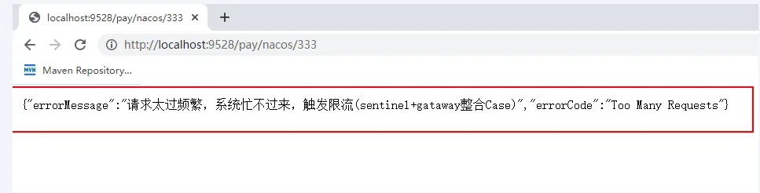

## SpringCloud Alibaba Seate 处理分布式事务

### 面试题

1. 你简历上写用微服务 boot/cloud 做过项目，你不可能只有一个数据库吧？请你谈谈多个数据库之间你如何处理分布式事务？

    - 在订单支付成功后，交易中心会调用订单中心的服务把订单状态更新，并调用物流中心的服务通知商品发货，同时还要调用积分中心的服务为用户增加相应的积分。**如何保障分布式事务一致性，成为了确保订单业务稳定运行的核心诉求之一**。

        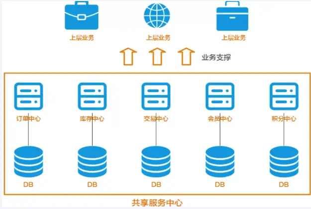

2. 阿里巴巴的 Seata-AT 模式如何做到对业务的无侵入？

3. 对于分布式事务问题，你知道的解决方案有哪些?请你谈谈？

    1. 2PC（两阶段提交）
    2. 3PC（三阶段提交）
    3. TCC 方案
        - TCC(Try-Confirm-Cancel)又被称补偿事务
        - 类似 2PC 的柔性分布式解决方案，2PC 改良版
    4. LocalMessage 本地消息表
    5. 独立消息微服务+RabbitMQ/KafKa 组件，实现可靠消息最终一致性方案
    6. 最大努力通知方案

### 分布式事务问题如何产生？

**面试题都指向一个重要问题：** 

- 一次业务操作需要**跨多个数据源**或需要跨多个系统进行远程调用，就会产生分布式事务问题；
- but，关系型数据库提供的能力是基于**单机事务**的，一旦遇到分布式事务场景，就需要通过更多其他技术手段来解决问题。

 **分布式事务 before：**

- 单机单库没这个问题
- 表结构的关系从 1:1 → 1:N → N:N

**分布式事务 after：**

- 单体应用被拆分成微服务应用，原来的三个模块被拆分成**三个独立的应用**，分别使用**三个独立的数据源**，业务操作需要调用三个服务来完成。

- 此时**每个服务自己内部的数据一致性由本地事务来保证，但是全局的数据一致性问题没法保证**。

    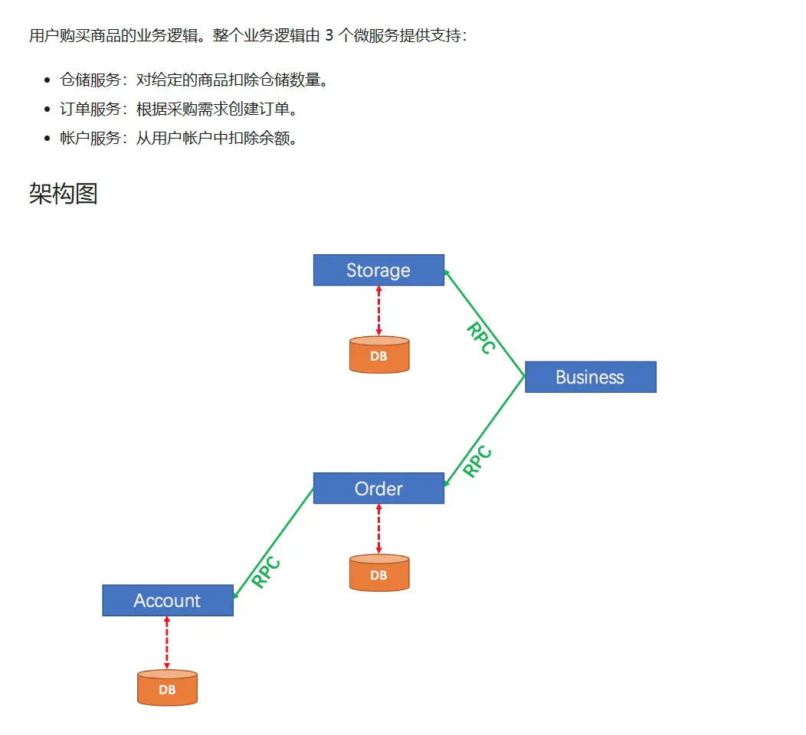

**结论**：迫切希望提供一种分布式事务框架，解决微服务架构下的分布式事务问题

### Seata 简介

**官网：**

[apache/incubator-seata](https://github.com/apache/incubator-seata)

[Apache Seata](https://seata.apache.org/zh-cn/)

Seata: Simple Extensible Autonomous Transaction Architecture 简单可扩展自治事务框架

**官网解释：Seata 是一款开源的分布式事务解决方案，致力于提供高性能和简单易用的分布式事务服务。**

**发展历程：**

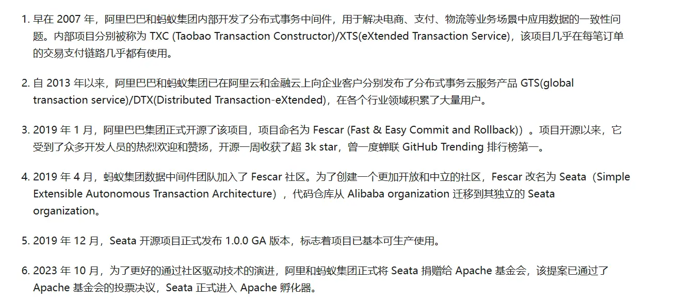

**怎么玩：**

- 本地 `@Transactional`

- 全局 `@GlobalTransactional`

- Seata 的分布式交易解决方案：

    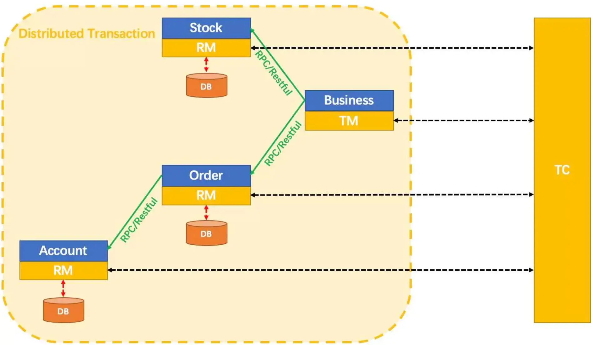

    只需要使用一个 `@GlobalTransactional` 注解在业务方法上。

**`@Transactional` 失效场景：**

1. 表不支持事务
2. 方法不是 public
3. 方法是静态的
4. 事务方法被内部调用，使用 this 调用
5. 异常处理不当
6. 注解没有被 Spring 扫描到
7. 事务内新开的子线程
8. ...

### Seata 工作流程简介

**纵观整个分布式事务的管理，就是全局事务 ID 的传递和变更，要让开发者无感知**

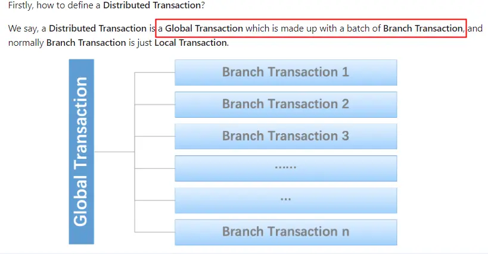

**Seata 对分布式事务的协调和控制就是 1+3：**

- 1 个 XID：XID 是全局事务的唯一标识，它可以在服务的调用链路中传递，绑定到服务的事务上下文中。
- 官网版 3 个概念(TC → TM → RM)：
    - **TC (Transaction Coordinator) - 事务协调者**
        - 维护全局和分支事务的状态，驱动全局事务提交或回滚。
    - **TM (Transaction Manager) - 事务管理器**
        - 定义全局事务的范围：开始全局事务、提交或回滚全局事务。
    - **RM (Resource Manager) - 资源管理器**
        - 管理分支事务处理的资源，与 TC 交谈以注册分支事务和报告分支事务的状态，并驱动分支事务提交或回滚。
- 周阳版本 3 个概念(TC → TM → RM)：
    - **TC (Transaction Coordinator) - 事务协调者**
        - **就是 Seata**，负责维护全局事务和分支事务的状态，驱动全局事务提交或回滚。
    - **TM (Transaction Manager) - 事务管理器**
        - **标注全局 `@GlobalTransactional` 启动入口动作的微服务模块**（比如订单模块），它是事务的发起者，负责定义全局事务的范围，并根据 TC 维护的全局事务和分支事务状态，做出开始事务、提交事务、回滚事务的决议。
    - **RM (Resource Manager) - 资源管理器**
        - **就是 mysql 数据库本身**，可以是多个 RM，负责管理分支事务上的资源，向 TC 注册分支事务，汇报分支事务状态，驱动分支事务的提交或回滚。

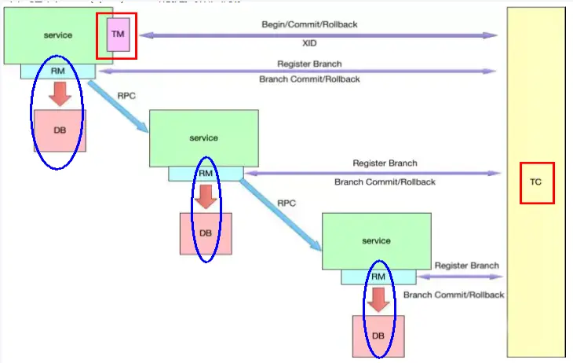

**分布式事务的执行流程-小总结：**

- 三个组件相互协作，TC 以 Seata 服务器(Server)形式独立部署，TM 和 RM 则是以 Seata Client 的形式集成在微服务中运行，
- 流程如下：
    1. TM 向 TC 申请开启一个全局事务，全局事务创建成功并生成一个全局唯一的 XID；
    2. XID 在微服务调用链路的上下文中传播；
    3. RM 向 TC 注册分支事务，将其纳入 XID 对应全局事务的管辖；
    4. TM 向 TC 发起针对 XID 的全局提交或回滚决议；
    5. TC 调度 XID 下管辖的全部分支事务完成提交或回滚请求。

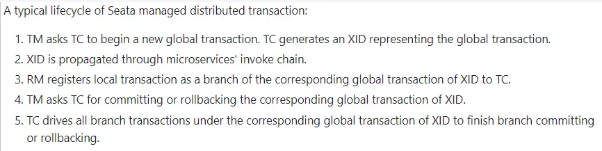

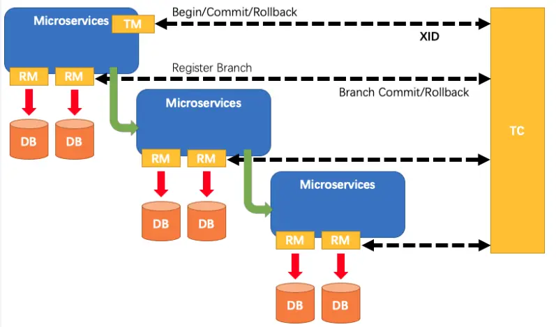


**各事务模式**：[Seata 各事务模式](https://seata.apache.org/zh-cn/docs/user/mode/at/)

### Seata-Server2.0.0 安装

1. [下载地址](https://seata.apache.org/zh-cn/unversioned/download/seata-server)

2. [下载版本 Releases](https://github.com/apache/incubator-seata/releases)

3. [各种 seata 参数配置官网参考](https://seata.apache.org/zh-cn/docs/user/configurations)

4. [Seata 新手部署指南](https://seata.apache.org/zh-cn/docs/ops/deploy-guide-beginner)

5. mysql8.0 数据库里面建库+建表

    - 建库 seata

        ```mysql
        CREATE DATABASE seata;
        USE seata;
        ```

    - 在上一步 seata 库里建表

        - 建表 SQL 地址：https://github.com/apache/incubator-seata/blob/develop/script/server/db/mysql.sql

            ```mysql
            -- -------------------------------- The script used when storeMode is 'db' --------------------------------
            -- the table to store GlobalSession data
            CREATE TABLE IF NOT EXISTS `global_table`
            (
                `xid`                       VARCHAR(128) NOT NULL,
                `transaction_id`            BIGINT,
                `status`                    TINYINT      NOT NULL,
                `application_id`            VARCHAR(32),
                `transaction_service_group` VARCHAR(32),
                `transaction_name`          VARCHAR(128),
                `timeout`                   INT,
                `begin_time`                BIGINT,
                `application_data`          VARCHAR(2000),
                `gmt_create`                DATETIME,
                `gmt_modified`              DATETIME,
                PRIMARY KEY (`xid`),
                KEY `idx_status_gmt_modified` (`status` , `gmt_modified`),
                KEY `idx_transaction_id` (`transaction_id`)
            ) ENGINE = InnoDB
              DEFAULT CHARSET = utf8mb4;
            
            -- the table to store BranchSession data
            CREATE TABLE IF NOT EXISTS `branch_table`
            (
                `branch_id`         BIGINT       NOT NULL,
                `xid`               VARCHAR(128) NOT NULL,
                `transaction_id`    BIGINT,
                `resource_group_id` VARCHAR(32),
                `resource_id`       VARCHAR(256),
                `branch_type`       VARCHAR(8),
                `status`            TINYINT,
                `client_id`         VARCHAR(64),
                `application_data`  VARCHAR(2000),
                `gmt_create`        DATETIME(6),
                `gmt_modified`      DATETIME(6),
                PRIMARY KEY (`branch_id`),
                KEY `idx_xid` (`xid`)
            ) ENGINE = InnoDB
              DEFAULT CHARSET = utf8mb4;
            
            -- the table to store lock data
            CREATE TABLE IF NOT EXISTS `lock_table`
            (
                `row_key`        VARCHAR(128) NOT NULL,
                `xid`            VARCHAR(128),
                `transaction_id` BIGINT,
                `branch_id`      BIGINT       NOT NULL,
                `resource_id`    VARCHAR(256),
                `table_name`     VARCHAR(32),
                `pk`             VARCHAR(36),
                `status`         TINYINT      NOT NULL DEFAULT '0' COMMENT '0:locked ,1:rollbacking',
                `gmt_create`     DATETIME,
                `gmt_modified`   DATETIME,
                PRIMARY KEY (`row_key`),
                KEY `idx_status` (`status`),
                KEY `idx_branch_id` (`branch_id`),
                KEY `idx_xid` (`xid`)
            ) ENGINE = InnoDB
              DEFAULT CHARSET = utf8mb4;
            
            CREATE TABLE IF NOT EXISTS `distributed_lock`
            (
                `lock_key`       CHAR(20) NOT NULL,
                `lock_value`     VARCHAR(20) NOT NULL,
                `expire`         BIGINT,
                primary key (`lock_key`)
            ) ENGINE = InnoDB
              DEFAULT CHARSET = utf8mb4;
            
            INSERT INTO `distributed_lock` (lock_key, lock_value, expire) VALUES ('AsyncCommitting', ' ', 0);
            INSERT INTO `distributed_lock` (lock_key, lock_value, expire) VALUES ('RetryCommitting', ' ', 0);
            INSERT INTO `distributed_lock` (lock_key, lock_value, expire) VALUES ('RetryRollbacking', ' ', 0);
            INSERT INTO `distributed_lock` (lock_key, lock_value, expire) VALUES ('TxTimeoutCheck', ' ', 0);
            ```

6. 更改配置

    - 修改 `seata-server-2.0.0\conf\application.yml` 配置文件，记得先备份

        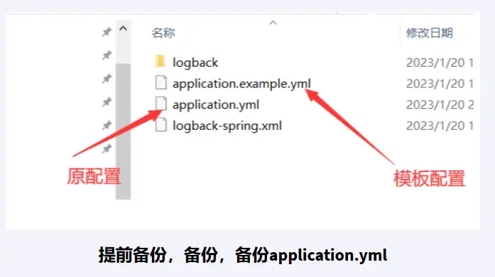

    - `application.yml` 定稿版

        ```yml
        server:
          port: 7091
        
        spring:
          application:
            name: seata-server
        
        logging:
          config: classpath:logback-spring.xml
          file:
            path: ${log.home:${user.home}/logs/seata}
          extend:
            logstash-appender:
              destination: 127.0.0.1:4560
            kafka-appender:
              bootstrap-servers: 127.0.0.1:9092
              topic: logback_to_logstash
        
        console:
          user:
            username: seata
            password: seata
        seata:
          config:
            # support: nacos, consul, apollo, zk, etcd3
            type: nacos
            nacos:
              server-addr: 127.0.0.1:8848
              namespace:
              group: SEATA_GROUP #后续自己在nacos里面新建,不想新建SEATA_GROUP，就写DEFAULT_GROUP
              username: nacos
              password: nacos
              context-path:
          registry:
            # support: nacos, eureka, redis, zk, consul, etcd3, sofa
            type: nacos
            nacos:
              application: seata-server
              server-addr: 127.0.0.1:8848
              group: SEATA_GROUP #后续自己在nacos里面新建,不想新建SEATA_GROUP，就写DEFAULT_GROUP
              namespace:
              cluster: default
              username: nacos
              password: nacos
          store:
            # support: file 、 db 、 redis 、 raft
            mode: db
            db:
              datasource: druid
              db-type: mysql
              driver-class-name: com.mysql.cj.jdbc.Driver
              url: jdbc:mysql://localhost:3306/seata?characterEncoding=utf8&useSSL=false&serverTimezone=GMT%2B8&rewriteBatchedStatements=true&allowPublicKeyRetrieval=true
              user: root
              password: 123456
              min-conn: 10
              max-conn: 100
              global-table: global_table
              branch-table: branch_table
              lock-table: lock_table
              distributed-lock-table: distributed_lock
              query-limit: 1000
              max-wait: 5000
          #  server:
          #    service-port: 8091 #If not configured, the default is '${server.port} + 1000'
          security:
            secretKey: SeataSecretKey0c382ef121d778043159209298fd40bf3850a017
            tokenValidityInMilliseconds: 1800000
            ignore:
              urls: /,/**/*.css,/**/*.js,/**/*.html,/**/*.map,/**/*.svg,/**/*.png,/**/*.jpeg,/**/*.ico,/api/v1/auth/login,/metadata/v1/**
        ```

7. 先启动 Nacos2.2.3 端口号 8848

    - `startup.cmd -m standalone`
    - 命令运行成功后直接访问 http://localhost:8848/nacos
        - 默认账号密码都是 nacos

8. 再启动 seata-server-2.0.0

    - `D:\devSoft\seata-server-2.0.0\bin`

    - `seata-server.bat` 命令执行后

    - http://localhost:7091

        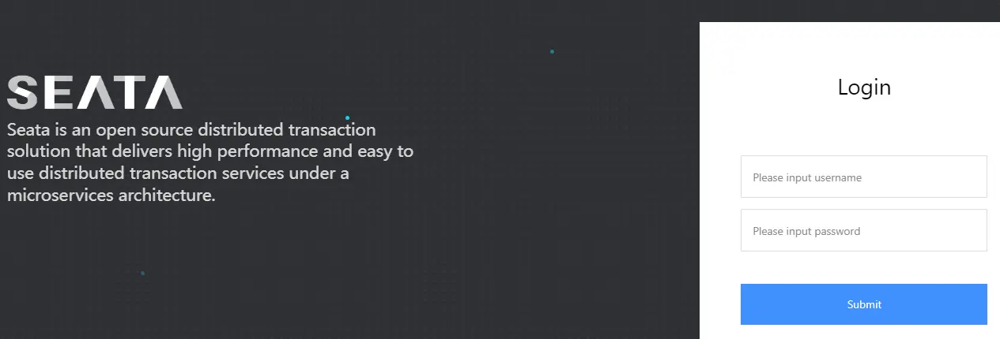

        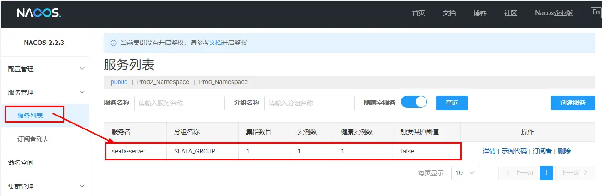

### Seata 案例实战-数据库和表准备

**订单 + 库存+ 账户 3 个业务数据库 MySQL 准备**

**分布式事务本案例业务说明：**

- 这里我们创建三个服务，一个订单服务，一个库存服务，一个账户服务。
- 当用户下单时，会在订单服务中创建一个订单，然后通过远程调用库存服务来扣减下单商品的库存；
- 再通过远程调用账户服务来扣减用户账户里面的余额；
- 最后在订单服务中修改订单状态为已完成。该操作跨越三个数据库，有两次远程调用，很明显会有分布式事务问题。
- 下订单 → 减库存 → 扣余额 → 改（订单）状态

**数据库和表的创建：**

1. 创建 3 个业务数据库 DATABASE
    - seata_order：存储订单的数据库；
    - seata_storage：存储库存的数据库；
    - seata_account：存储账户信息的数据库。
2. 按照上述 3 库分别建对应的 undo_log 回滚日志表
    - 订单-库存-账户 3 个库下都需要建各自的 undo_log 回滚日志表
    - [官网创建 sql](https://github.com/apache/incubator-seata/blob/v2.0.0/script/client/at/db/mysql.sql)
    - **注：undo_log 为 AT 模式专用，其它模式不需要**
3. 按照上述 3 库分别建对应业务表

**完整 sql：**

1. 建 seata_order 库+建 t_order 表+undo_log 表

    ```mysql
    # order
    CREATE DATABASE seata_order;
    USE seata_order;
    
    CREATE TABLE t_order (
    	`id` BIGINT ( 11 ) NOT NULL AUTO_INCREMENT PRIMARY KEY,
    	`user_id` BIGINT ( 11 ) DEFAULT NULL COMMENT '用户id',
    	`product_id` BIGINT ( 11 ) DEFAULT NULL COMMENT '产品id',
    	`count` INT ( 11 ) DEFAULT NULL COMMENT '数量',
    	`money` DECIMAL ( 11, 0 ) DEFAULT NULL COMMENT '金额',
    	`status` INT ( 1 ) DEFAULT NULL COMMENT '订单状态: 0:创建中; 1:已完结' 
    ) ENGINE = INNODB AUTO_INCREMENT = 1 DEFAULT CHARSET = utf8;
    
    SELECT * FROM t_order;
    
    
    -- for AT mode you must to init this sql for you business database. the seata server not need it.
    CREATE TABLE IF NOT EXISTS `undo_log`
    (
        `branch_id`     BIGINT       NOT NULL COMMENT 'branch transaction id',
        `xid`           VARCHAR(128) NOT NULL COMMENT 'global transaction id',
        `context`       VARCHAR(128) NOT NULL COMMENT 'undo_log context,such as serialization',
        `rollback_info` LONGBLOB     NOT NULL COMMENT 'rollback info',
        `log_status`    INT(11)      NOT NULL COMMENT '0:normal status,1:defense status',
        `log_created`   DATETIME(6)  NOT NULL COMMENT 'create datetime',
        `log_modified`  DATETIME(6)  NOT NULL COMMENT 'modify datetime',
        UNIQUE KEY `ux_undo_log` (`xid`, `branch_id`)
    ) ENGINE = InnoDB AUTO_INCREMENT = 1 DEFAULT CHARSET = utf8mb4 COMMENT ='AT transaction mode undo table';
    
    ALTER TABLE `undo_log` ADD INDEX `ix_log_created` (`log_created`);
    ```

2. 建 seata_storage 库+建 t_storage 表+undo_log 表

    ```mysql
    #storage
    CREATE DATABASE seata_storage;
    USE seata_storage;
    
    CREATE TABLE t_storage (
    	`id` BIGINT ( 11 ) NOT NULL AUTO_INCREMENT PRIMARY KEY,
    	`product_id` BIGINT ( 11 ) DEFAULT NULL COMMENT '产品id',
    	`total` INT ( 11 ) DEFAULT NULL COMMENT '总库存',
    	`used` INT ( 11 ) DEFAULT NULL COMMENT '已用库存',
    	`residue` INT ( 11 ) DEFAULT NULL COMMENT '剩余库存' 
    ) ENGINE = INNODB AUTO_INCREMENT = 1 DEFAULT CHARSET = utf8;
    
    INSERT INTO t_storage(`id`,`product_id`,`total`,`used`,`residue`)VALUES('1','1','100','0','100');
    
    SELECT * FROM t_storage;
    
    -- for AT mode you must to init this sql for you business database. the seata server not need it.
    CREATE TABLE IF NOT EXISTS `undo_log`
    (
        `branch_id`     BIGINT       NOT NULL COMMENT 'branch transaction id',
        `xid`           VARCHAR(128) NOT NULL COMMENT 'global transaction id',
        `context`       VARCHAR(128) NOT NULL COMMENT 'undo_log context,such as serialization',
        `rollback_info` LONGBLOB     NOT NULL COMMENT 'rollback info',
        `log_status`    INT(11)      NOT NULL COMMENT '0:normal status,1:defense status',
        `log_created`   DATETIME(6)  NOT NULL COMMENT 'create datetime',
        `log_modified`  DATETIME(6)  NOT NULL COMMENT 'modify datetime',
        UNIQUE KEY `ux_undo_log` (`xid`, `branch_id`)
    ) ENGINE = InnoDB AUTO_INCREMENT = 1 DEFAULT CHARSET = utf8mb4 COMMENT ='AT transaction mode undo table';
    
    ALTER TABLE `undo_log` ADD INDEX `ix_log_created` (`log_created`);
    ```

3. 建 seata_account 库+建 t_account 表+undo_log 表

    ```mysql
    #account
    CREATE DATABASE seata_account;
    USE seata_account;
    
    CREATE TABLE t_account (
    	`id` BIGINT ( 11 ) NOT NULL AUTO_INCREMENT PRIMARY KEY COMMENT 'id',
    	`user_id` BIGINT ( 11 ) DEFAULT NULL COMMENT '用户id',
    	`total` DECIMAL ( 10, 0 ) DEFAULT NULL COMMENT '总额度',
    	`used` DECIMAL ( 10, 0 ) DEFAULT NULL COMMENT '已用余额',
    	`residue` DECIMAL ( 10, 0 ) DEFAULT '0' COMMENT '剩余可用额度' 
    ) ENGINE = INNODB AUTO_INCREMENT = 2 DEFAULT CHARSET = utf8;
    
    INSERT INTO t_account(`id`,`user_id`,`total`,`used`,`residue`)VALUES('1','1','1000','0','1000');
    
    SELECT * FROM t_account;
    
    -- for AT mode you must to init this sql for you business database. the seata server not need it.
    CREATE TABLE IF NOT EXISTS `undo_log`
    (
        `branch_id`     BIGINT       NOT NULL COMMENT 'branch transaction id',
        `xid`           VARCHAR(128) NOT NULL COMMENT 'global transaction id',
        `context`       VARCHAR(128) NOT NULL COMMENT 'undo_log context,such as serialization',
        `rollback_info` LONGBLOB     NOT NULL COMMENT 'rollback info',
        `log_status`    INT(11)      NOT NULL COMMENT '0:normal status,1:defense status',
        `log_created`   DATETIME(6)  NOT NULL COMMENT 'create datetime',
        `log_modified`  DATETIME(6)  NOT NULL COMMENT 'modify datetime',
        UNIQUE KEY `ux_undo_log` (`xid`, `branch_id`)
    ) ENGINE = InnoDB AUTO_INCREMENT = 1 DEFAULT CHARSET = utf8mb4 COMMENT ='AT transaction mode undo table';
    
    ALTER TABLE `undo_log` ADD INDEX `ix_log_created` (`log_created`);
    ```

### Seata 案例实战-微服务编码落地实现

**订单/库存/账户业务微服务 Java 开发准备**

#### 业务需求

<font color="red" size="5"><b>下订单 → 减库存 → 扣余额 → 改（订单）状态</b></font>

#### Mybaits 一键生成

1. config.properties

    ```properties
    #t_pay表包名
    package.name=com.atguigu.cloud
    
    # mysql8.0
    jdbc.driverClass = com.mysql.cj.jdbc.Driver
    jdbc.url= jdbc:mysql://localhost:3306/db2024?characterEncoding=utf8&useSSL=false&serverTimezone=GMT%2B8&rewriteBatchedStatements=true&allowPublicKeyRetrieval=true
    jdbc.user = root
    jdbc.password =123456
    
    # seata_order
    #jdbc.driverClass = com.mysql.cj.jdbc.Driver
    #jdbc.url = jdbc:mysql://localhost:3306/seata_order?characterEncoding=utf8&useSSL=false&serverTimezone=GMT%2B8&rewriteBatchedStatements=true&allowPublicKeyRetrieval=true
    #jdbc.user = root
    #jdbc.password =123456
    
    # seata_storage
    #jdbc.driverClass = com.mysql.cj.jdbc.Driver
    #jdbc.url = jdbc:mysql://localhost:3306/seata_storage?characterEncoding=utf8&useSSL=false&serverTimezone=GMT%2B8&rewriteBatchedStatements=true&allowPublicKeyRetrieval=true
    #jdbc.user = root
    #jdbc.password =123456
    
    # seata_account
    #jdbc.driverClass = com.mysql.cj.jdbc.Driver
    #jdbc.url = jdbc:mysql://localhost:3306/seata_account?characterEncoding=utf8&useSSL=false&serverTimezone=GMT%2B8&rewriteBatchedStatements=true&allowPublicKeyRetrieval=true
    #jdbc.user = root
    #jdbc.password =123456
    ```

2. generatorConfig.xml

    ```xml
    <?xml version="1.0" encoding="UTF-8"?>
    <!DOCTYPE generatorConfiguration
            PUBLIC "-//mybatis.org//DTD MyBatis Generator Configuration 1.0//EN"
            "http://mybatis.org/dtd/mybatis-generator-config_1_0.dtd">
    
    <generatorConfiguration>
        <properties resource="config.properties"/>
    
        <context id="Mysql" targetRuntime="MyBatis3Simple" defaultModelType="flat">
            <property name="beginningDelimiter" value="`"/>
            <property name="endingDelimiter" value="`"/>
    
            <plugin type="tk.mybatis.mapper.generator.MapperPlugin">
                <property name="mappers" value="tk.mybatis.mapper.common.Mapper"/>
                <property name="caseSensitive" value="true"/>
            </plugin>
    
            <jdbcConnection driverClass="${jdbc.driverClass}"
                            connectionURL="${jdbc.url}"
                            userId="${jdbc.user}"
                            password="${jdbc.password}">
            </jdbcConnection>
    
            <javaModelGenerator targetPackage="${package.name}.entities" targetProject="src/main/java"/>
    
            <sqlMapGenerator targetPackage="${package.name}.mapper" targetProject="src/main/java"/>
    
            <javaClientGenerator targetPackage="${package.name}.mapper" targetProject="src/main/java" type="XMLMAPPER"/>
    
            <table tableName="t_pay" domainObjectName="Pay">
                <generatedKey column="id" sqlStatement="JDBC"/>
            </table>
    
            <!--  seata_order -->
            <!--<table tableName="t_order" domainObjectName="Order">
                <generatedKey column="id" sqlStatement="JDBC"/>
            </table>-->
    
            <!--seata_storage-->
            <!--<table tableName="t_storage" domainObjectName="Storage">
                <generatedKey column="id" sqlStatement="JDBC"/>
            </table>-->
    
            <!--seata_account-->
            <!--<table tableName="t_account" domainObjectName="Account">
                <generatedKey column="id" sqlStatement="JDBC"/>
            </table>-->
    
        </context>
    </generatorConfiguration>
    ```

#### 修改公共 cloud-api-commons 新增库存和账户两个 Feign 服务接口

1. StorageFeignApi

    ```java
    package com.atguigu.cloud.apis;
    
    @FeignClient(value = "seata-storage-service")
    public interface StorageFeignApi {
    
        /**
         * 扣减库存
         * @param productId
         * @param count
         * @return
         */
        @PostMapping("/storage/decrease")
        ResultData decrease(@RequestParam("productId") Long productId, @RequestParam("count") Integer count);
    }
    ```

2. AccountFeignApi

    ```java
    package com.atguigu.cloud.apis;
    
    @FeignClient(value = "seata-account-service")
    public interface AccountFeignApi {
        /**
         * 扣减账户余额
         * @param userId
         * @param money
         * @return
         */
        @PostMapping("/account/decrease")
        ResultData decrease(@RequestParam("userId") Long userId, @RequestParam("money") Long money);
    }
    ```

#### 新建订单 Order 微服务

##### 建 Module

新建 module：`seata-order-service2001`

##### 改 POM

```xml
<?xml version="1.0" encoding="UTF-8"?>
<project xmlns="http://maven.apache.org/POM/4.0.0"
         xmlns:xsi="http://www.w3.org/2001/XMLSchema-instance"
         xsi:schemaLocation="http://maven.apache.org/POM/4.0.0 http://maven.apache.org/xsd/maven-4.0.0.xsd">
    <modelVersion>4.0.0</modelVersion>
    <parent>
        <groupId>com.atguigu.cloud</groupId>
        <artifactId>cloud2024</artifactId>
        <version>1.0-SNAPSHOT</version>
    </parent>

    <artifactId>seata-order-service2001</artifactId>

    <properties>
        <maven.compiler.source>17</maven.compiler.source>
        <maven.compiler.target>17</maven.compiler.target>
        <project.build.sourceEncoding>UTF-8</project.build.sourceEncoding>
    </properties>

    <dependencies>
        <!-- nacos -->
        <dependency>
            <groupId>com.alibaba.cloud</groupId>
            <artifactId>spring-cloud-starter-alibaba-nacos-discovery</artifactId>
        </dependency>
        <!--alibaba-seata-->
        <dependency>
            <groupId>com.alibaba.cloud</groupId>
            <artifactId>spring-cloud-starter-alibaba-seata</artifactId>
        </dependency>
        <!--openfeign-->
        <dependency>
            <groupId>org.springframework.cloud</groupId>
            <artifactId>spring-cloud-starter-openfeign</artifactId>
        </dependency>
        <!--loadbalancer-->
        <dependency>
            <groupId>org.springframework.cloud</groupId>
            <artifactId>spring-cloud-starter-loadbalancer</artifactId>
        </dependency>
        <!--cloud-api-commons-->
        <dependency>
            <groupId>com.atguigu.cloud</groupId>
            <artifactId>cloud-api-commons</artifactId>
            <version>1.0-SNAPSHOT</version>
        </dependency>
        <!--web + actuator-->
        <dependency>
            <groupId>org.springframework.boot</groupId>
            <artifactId>spring-boot-starter-web</artifactId>
        </dependency>
        <dependency>
            <groupId>org.springframework.boot</groupId>
            <artifactId>spring-boot-starter-actuator</artifactId>
        </dependency>
        <!--SpringBoot集成druid连接池-->
        <dependency>
            <groupId>com.alibaba</groupId>
            <artifactId>druid-spring-boot-starter</artifactId>
        </dependency>
        <!-- Swagger3 调用方式 http://你的主机IP地址:5555/swagger-ui/index.html -->
        <dependency>
            <groupId>org.springdoc</groupId>
            <artifactId>springdoc-openapi-starter-webmvc-ui</artifactId>
        </dependency>
        <!--mybatis和springboot整合-->
        <dependency>
            <groupId>org.mybatis.spring.boot</groupId>
            <artifactId>mybatis-spring-boot-starter</artifactId>
        </dependency>
        <!--Mysql数据库驱动8 -->
        <dependency>
            <groupId>mysql</groupId>
            <artifactId>mysql-connector-java</artifactId>
        </dependency>
        <!--persistence-->
        <dependency>
            <groupId>javax.persistence</groupId>
            <artifactId>persistence-api</artifactId>
        </dependency>
        <!--通用Mapper4-->
        <dependency>
            <groupId>tk.mybatis</groupId>
            <artifactId>mapper</artifactId>
        </dependency>
        <!--hutool-->
        <dependency>
            <groupId>cn.hutool</groupId>
            <artifactId>hutool-all</artifactId>
        </dependency>
        <!-- fastjson2 -->
        <dependency>
            <groupId>com.alibaba.fastjson2</groupId>
            <artifactId>fastjson2</artifactId>
        </dependency>
        <!--lombok-->
        <dependency>
            <groupId>org.projectlombok</groupId>
            <artifactId>lombok</artifactId>
            <version>1.18.28</version>
            <scope>provided</scope>
        </dependency>
        <!--test-->
        <dependency>
            <groupId>org.springframework.boot</groupId>
            <artifactId>spring-boot-starter-test</artifactId>
            <scope>test</scope>
        </dependency>
    </dependencies>

    <build>
        <plugins>
            <plugin>
                <groupId>org.springframework.boot</groupId>
                <artifactId>spring-boot-maven-plugin</artifactId>
            </plugin>
        </plugins>
    </build>
</project>
```

##### 写 YML

```yml
server:
  port: 2001

spring:
  application:
    name: seata-order-service
  cloud:
    nacos:
      discovery:
        server-addr: localhost:8848         #Nacos服务注册中心地址
  # ==========applicationName + druid-mysql8 driver===================
  datasource:
    type: com.alibaba.druid.pool.DruidDataSource
    driver-class-name: com.mysql.cj.jdbc.Driver
    url: jdbc:mysql://localhost:3306/seata_order?characterEncoding=utf8&useSSL=false&serverTimezone=GMT%2B8&rewriteBatchedStatements=true&allowPublicKeyRetrieval=true
    username: root
    password: 123456
# ========================mybatis===================
mybatis:
  mapper-locations: classpath:mapper/*.xml
  type-aliases-package: com.atguigu.cloud.entities
  configuration:
    map-underscore-to-camel-case: true

# ========================seata===================
seata:
  registry:
    type: nacos
    nacos:
      server-addr: 127.0.0.1:8848
      namespace: ""
      group: SEATA_GROUP
      application: seata-server
  tx-service-group: default_tx_group # 事务组，由它获得TC服务的集群名称
  service:
    vgroup-mapping: # 点击源码分析
      default_tx_group: default # 事务组与TC服务集群的映射关系
  data-source-proxy-mode: AT

logging:
  level:
    io:
      seata: info
```

**seata 配置详细过度版**（了解即可，太详细也不好维护）：

```yml
#seata:
#  registry: # seata注册配置
#    type: nacos # seata注册类型
#    nacos:
#      application: seata-server #seata应用名称
#      server-addr: 127.0.0.1:8848
#      namespace: ""
#      group: SEATA_GROUP
#      cluster: default
#  config:             # seata配置抓取
#    nacos:
#      server-addr: 127.0.0.1:8848
#      namespace: ""
#      group: SEATA_GROUP
#      username: nacos
#      password: nacos
#  tx-service-group: default_tx_group # 事务组，由它获得TC服务的集群名称
#  service:
#    vgroup-mapping:
#      default_tx_group: default # 事务群组的映射配置关系
#  data-source-proxy-mode: AT
#  application-id: seata-server
```

##### 主启动

```java
package com.atguigu.cloud;

@SpringBootApplication
@MapperScan("com.atguigu.cloud.mapper") //import tk.mybatis.spring.annotation.MapperScan;
@EnableDiscoveryClient //服务注册和发现
@EnableFeignClients
public class SeataOrderMainApp2001 {
    public static void main(String[] args) {
        SpringApplication.run(SeataOrderMainApp2001.class, args);
    }
}
```

##### 业务类

###### entities

```java
package com.atguigu.cloud.entities;

/**
 * 表名：t_order
*/
@Table(name = "t_order")
@Data
public class Order implements Serializable {
    @Id
    @GeneratedValue(generator = "JDBC")
    private Long id;

    /**
     * 用户id
     */
    @Column(name = "user_id")
    private Long userId;

    /**
     * 产品id
     */
    @Column(name = "product_id")
    private Long productId;

    /**
     * 数量
     */
    private Integer count;

    /**
     * 金额
     */
    private Long money;

    /**
     * 订单状态: 0:创建中; 1:已完结
     */
    private Integer status;
}
```

###### OrderMapper

1. OrderMapper 接口

    ```java
    package com.atguigu.cloud.mapper;
    
    public interface OrderMapper extends Mapper<Order> {}
    ```

2. resources 文件夹下新建 mapper 文件夹后添加 OrderMapper.xml

    ```xml
    <?xml version="1.0" encoding="UTF-8"?>
    <!DOCTYPE mapper PUBLIC "-//mybatis.org//DTD Mapper 3.0//EN" "http://mybatis.org/dtd/mybatis-3-mapper.dtd">
    <mapper namespace="com.atguigu.cloud.mapper.OrderMapper">
        <resultMap id="BaseResultMap" type="com.atguigu.cloud.entities.Order">
            <!--
              WARNING - @mbg.generated
            -->
            <id column="id" jdbcType="BIGINT" property="id"/>
            <result column="user_id" jdbcType="BIGINT" property="userId"/>
            <result column="product_id" jdbcType="BIGINT" property="productId"/>
            <result column="count" jdbcType="INTEGER" property="count"/>
            <result column="money" jdbcType="DECIMAL" property="money"/>
            <result column="status" jdbcType="INTEGER" property="status"/>
        </resultMap>
    </mapper>
    ```

###### Service 接口及实现

1. OrderService

    ```java
    package com.atguigu.cloud.service;
    
    import com.atguigu.cloud.entities.Order;
    
    public interface OrderService {
        /**
         * 创建订单
         * @param order
         */
        void create(Order order);
    }
    ```

2. OrderServiceImpl

    ```java
    package com.atguigu.cloud.service.impl;
    
    /**
     * 下订单->减库存->扣余额->改(订单)状态
     */
    @Service
    @Slf4j
    public class OrderServiceImpl implements OrderService {
        @Resource
        private OrderMapper orderMapper;
        @Resource //订单微服务通过OpenFeign去调用库存微服务
        private StorageFeignApi storageFeignApi;
        @Resource //订单微服务通过OpenFeign去调用账户微服务
        private AccountFeignApi accountFeignApi;
    
        @Override
        @GlobalTransactional(name = "zzyy-create-order", rollbackFor = Exception.class)
        public void create(Order order) {
            // xid 全局事务id的检查，重要
            String xid = RootContext.getXID();
            // 1. 新建订单
            log.info("------------------开始新建订单" + "\t" + "xid:" + xid);
            // 订单新建时默认初始订单状态是零
            // 订单状态 status：0：创建中；1：已完结
            order.setStatus(0);
            int result = orderMapper.insertSelective(order);
            // 插入订单成功后获得插入mysql的实体对象
            Order orderFromDB;
            if (result > 0) {
                // 从mysql里面查出刚插入的记录
                orderFromDB = orderMapper.selectOne(order);
                // orderFromDB = orderMapper.selectByPrimaryKey(order.getId());
                log.info("-------> 新建订单成功，orderFromDB info: " + orderFromDB);
                System.out.println();
                // 2. 扣减库存
                log.info("-------> 订单微服务开始调用Storage库存，做扣减count");
                storageFeignApi.decrease(orderFromDB.getProductId(), orderFromDB.getCount());
                log.info("-------> 订单微服务结束调用Storage库存，做扣减完成");
                System.out.println();
                // 3. 扣减账号余额
                log.info("-------> 订单微服务开始调用Account账号，做扣减money");
                accountFeignApi.decrease(orderFromDB.getUserId(), orderFromDB.getMoney());
                log.info("-------> 订单微服务结束调用Account账号，做扣减完成");
                System.out.println();
                // 4. 修改订单状态
                // 将订单状态从0修改为1，表示已经完成
                log.info("-------> 修改订单状态");
                orderFromDB.setStatus(1);
    
                Example whereCondition = new Example(Order.class);
                Example.Criteria criteria = whereCondition.createCriteria();
                criteria.andEqualTo("userId", orderFromDB.getUserId());
                criteria.andEqualTo("status", 0);
    
                int updateResult = orderMapper.updateByExampleSelective(orderFromDB, whereCondition);
                log.info("-------> 修改订单状态完成" + "\t" + updateResult);
                log.info("-------> orderFromDB info: " + orderFromDB);
            }
            System.out.println();
            log.info("------------------结束新建订单" + "\t" + "xid:" + xid);
        }
    }
    ```

###### OrderController

```java
package com.atguigu.cloud.controller;

@RestController
public class OrderController {
    @Resource
    private OrderService orderService;
    /**
     * 创建订单
     */
    @GetMapping("/order/create")
    public ResultData create(Order order) {
        orderService.create(order);
        return ResultData.success(order);
    }
}
```

#### 新建库存 Storage 微服务

##### 建 Module

新建 Module：`seata-storage-service2002`

##### 改 POM

```xml
<?xml version="1.0" encoding="UTF-8"?>
<project xmlns="http://maven.apache.org/POM/4.0.0"
         xmlns:xsi="http://www.w3.org/2001/XMLSchema-instance"
         xsi:schemaLocation="http://maven.apache.org/POM/4.0.0 http://maven.apache.org/xsd/maven-4.0.0.xsd">
    <modelVersion>4.0.0</modelVersion>
    <parent>
        <groupId>com.atguigu.cloud</groupId>
        <artifactId>cloud2024</artifactId>
        <version>1.0-SNAPSHOT</version>
    </parent>

    <artifactId>seata-storage-service2002</artifactId>

    <properties>
        <maven.compiler.source>17</maven.compiler.source>
        <maven.compiler.target>17</maven.compiler.target>
        <project.build.sourceEncoding>UTF-8</project.build.sourceEncoding>
    </properties>

    <dependencies>
        <!-- nacos -->
        <dependency>
            <groupId>com.alibaba.cloud</groupId>
            <artifactId>spring-cloud-starter-alibaba-nacos-discovery</artifactId>
        </dependency>
        <!--alibaba-seata-->
        <dependency>
            <groupId>com.alibaba.cloud</groupId>
            <artifactId>spring-cloud-starter-alibaba-seata</artifactId>
        </dependency>
        <!--openfeign-->
        <dependency>
            <groupId>org.springframework.cloud</groupId>
            <artifactId>spring-cloud-starter-openfeign</artifactId>
        </dependency>
        <!--loadbalancer-->
        <dependency>
            <groupId>org.springframework.cloud</groupId>
            <artifactId>spring-cloud-starter-loadbalancer</artifactId>
        </dependency>
        <!--cloud_commons_utils-->
        <dependency>
            <groupId>com.atguigu.cloud</groupId>
            <artifactId>cloud-api-commons</artifactId>
            <version>1.0-SNAPSHOT</version>
        </dependency>
        <!--web + actuator-->
        <dependency>
            <groupId>org.springframework.boot</groupId>
            <artifactId>spring-boot-starter-web</artifactId>
        </dependency>
        <dependency>
            <groupId>org.springframework.boot</groupId>
            <artifactId>spring-boot-starter-actuator</artifactId>
        </dependency>
        <!--SpringBoot集成druid连接池-->
        <dependency>
            <groupId>com.alibaba</groupId>
            <artifactId>druid-spring-boot-starter</artifactId>
        </dependency>
        <!-- Swagger3 调用方式 http://你的主机IP地址:5555/swagger-ui/index.html -->
        <dependency>
            <groupId>org.springdoc</groupId>
            <artifactId>springdoc-openapi-starter-webmvc-ui</artifactId>
        </dependency>
        <!--mybatis和springboot整合-->
        <dependency>
            <groupId>org.mybatis.spring.boot</groupId>
            <artifactId>mybatis-spring-boot-starter</artifactId>
        </dependency>
        <!--Mysql数据库驱动8 -->
        <dependency>
            <groupId>mysql</groupId>
            <artifactId>mysql-connector-java</artifactId>
        </dependency>
        <!--persistence-->
        <dependency>
            <groupId>javax.persistence</groupId>
            <artifactId>persistence-api</artifactId>
        </dependency>
        <!--通用Mapper4-->
        <dependency>
            <groupId>tk.mybatis</groupId>
            <artifactId>mapper</artifactId>
        </dependency>
        <!--hutool-->
        <dependency>
            <groupId>cn.hutool</groupId>
            <artifactId>hutool-all</artifactId>
        </dependency>
        <!-- fastjson2 -->
        <dependency>
            <groupId>com.alibaba.fastjson2</groupId>
            <artifactId>fastjson2</artifactId>
        </dependency>
        <!--lombok-->
        <dependency>
            <groupId>org.projectlombok</groupId>
            <artifactId>lombok</artifactId>
            <version>1.18.28</version>
            <scope>provided</scope>
        </dependency>
        <!--test-->
        <dependency>
            <groupId>org.springframework.boot</groupId>
            <artifactId>spring-boot-starter-test</artifactId>
            <scope>test</scope>
        </dependency>
    </dependencies>

    <build>
        <plugins>
            <plugin>
                <groupId>org.springframework.boot</groupId>
                <artifactId>spring-boot-maven-plugin</artifactId>
            </plugin>
        </plugins>
    </build>
</project>
```

##### 写 YML

```yml
server:
  port: 2002

spring:
  application:
    name: seata-storage-service
  cloud:
    nacos:
      discovery:
        server-addr: localhost:8848         #Nacos服务注册中心地址
  # ==========applicationName + druid-mysql8 driver===================
  datasource:
    type: com.alibaba.druid.pool.DruidDataSource
    driver-class-name: com.mysql.cj.jdbc.Driver
    url: jdbc:mysql://localhost:3306/seata_storage?characterEncoding=utf8&useSSL=false&serverTimezone=GMT%2B8&rewriteBatchedStatements=true&allowPublicKeyRetrieval=true
    username: root
    password: 123456
# ========================mybatis===================
mybatis:
  mapper-locations: classpath:mapper/*.xml
  type-aliases-package: com.atguigu.cloud.entities
  configuration:
    map-underscore-to-camel-case: true
# ========================seata===================
seata:
  registry:
    type: nacos
    nacos:
      server-addr: 127.0.0.1:8848
      namespace: ""
      group: SEATA_GROUP
      application: seata-server
  tx-service-group: default_tx_group # 事务组，由它获得TC服务的集群名称
  service:
    vgroup-mapping:
      default_tx_group: default # 事务组与TC服务集群的映射关系
  data-source-proxy-mode: AT

logging:
  level:
    io:
      seata: info
```

##### 主启动

```java
package com.atguigu.cloud;

@SpringBootApplication
@MapperScan("com.atguigu.cloud.mapper") //import tk.mybatis.spring.annotation.MapperScan;
@EnableDiscoveryClient //服务注册和发现
@EnableFeignClients
public class SeataStorageMainApp2002 {
    public static void main(String[] args) {
        SpringApplication.run(SeataStorageMainApp2002.class, args);
    }
}
```

##### 业务类

###### entities

```java
package com.atguigu.cloud.entities;

/**
 * 表名：t_storage
*/
@Table(name = "t_storage")
@Data
public class Storage implements Serializable {
    @Id
    @GeneratedValue(generator = "JDBC")
    private Long id;

    /**
     * 产品id
     */
    @Column(name = "product_id")
    private Long productId;

    /**
     * 总库存
     */
    private Integer total;

    /**
     * 已用库存
     */
    private Integer used;

    /**
     * 剩余库存
     */
    private Integer residue;
}
```

###### OrderMapper

1. StorageMapper 接口

    ```java
    package com.atguigu.cloud.mapper;
    
    public interface StorageMapper extends Mapper<Storage> {
        /**
         * 减库存
         * @param productId
         * @param count
         */
        void decrease(@Param("productId") Long productId, @Param("count") Integer count);
    }
    ```

2. resources 文件夹下新建 mapper 文件夹后添加 StorageMapper.xml

    ```xml
    <?xml version="1.0" encoding="UTF-8"?>
    <!DOCTYPE mapper PUBLIC "-//mybatis.org//DTD Mapper 3.0//EN" "http://mybatis.org/dtd/mybatis-3-mapper.dtd">
    <mapper namespace="com.atguigu.cloud.mapper.StorageMapper">
        <resultMap id="BaseResultMap" type="com.atguigu.cloud.entities.Storage">
            <!--
              WARNING - @mbg.generated
            -->
            <id column="id" jdbcType="BIGINT" property="id"/>
            <result column="product_id" jdbcType="BIGINT" property="productId"/>
            <result column="total" jdbcType="INTEGER" property="total"/>
            <result column="used" jdbcType="INTEGER" property="used"/>
            <result column="residue" jdbcType="INTEGER" property="residue"/>
        </resultMap>
      
        <update id="decrease">
            UPDATE
                t_storage
            SET used    = used + #{count},
                residue = residue - #{count}
            WHERE product_id = #{productId}
        </update>
    </mapper>
    ```

###### Service 接口及实现

1. StorageService

    ```java
    package com.atguigu.cloud.service;
    
    public interface StorageService {
        /**
         * 扣减库存
         * @param productId
         * @param count
         */
        void decrease(Long productId, Integer count);
    }
    ```

2. StorageServiceImpl

    ```java
    package com.atguigu.cloud.service.impl;
    
    @Service
    @Slf4j
    public class StorageServiceImpl implements StorageService {
        @Resource
        private StorageMapper storageMapper;
    
        /**
         * 扣减库存
         * @param productId
         * @param count
         */
        @Override
        public void decrease(Long productId, Integer count) {
            log.info("------->storage-service中扣减库存开始");
            storageMapper.decrease(productId, count);
            log.info("------->storage-service中扣减库存结束");
        }
    }
    ```

###### Controller

```java
package com.atguigu.cloud.controller;

@RestController
public class StorageController {
    @Resource
    private StorageService storageService;

    /**
     * 扣减库存
     * @param productId
     * @param count
     * @return
     */
    @RequestMapping("/storage/decrease")
    public ResultData decrease(Long productId, Integer count) {
        storageService.decrease(productId, count);
        return ResultData.success("扣减库存成功!");
    }
}
```

#### 新建账户 Account 微服务

##### 建 Module

新建 module：`seata-account-service2003`

##### 改 POM

```xml
<?xml version="1.0" encoding="UTF-8"?>
<project xmlns="http://maven.apache.org/POM/4.0.0"
         xmlns:xsi="http://www.w3.org/2001/XMLSchema-instance"
         xsi:schemaLocation="http://maven.apache.org/POM/4.0.0 http://maven.apache.org/xsd/maven-4.0.0.xsd">
    <modelVersion>4.0.0</modelVersion>
    <parent>
        <groupId>com.atguigu.cloud</groupId>
        <artifactId>cloud2024</artifactId>
        <version>1.0-SNAPSHOT</version>
    </parent>

    <artifactId>seata-account-service2003</artifactId>

    <properties>
        <maven.compiler.source>17</maven.compiler.source>
        <maven.compiler.target>17</maven.compiler.target>
        <project.build.sourceEncoding>UTF-8</project.build.sourceEncoding>
    </properties>

    <dependencies>
        <!-- nacos -->
        <dependency>
            <groupId>com.alibaba.cloud</groupId>
            <artifactId>spring-cloud-starter-alibaba-nacos-discovery</artifactId>
        </dependency>
        <!--alibaba-seata-->
        <dependency>
            <groupId>com.alibaba.cloud</groupId>
            <artifactId>spring-cloud-starter-alibaba-seata</artifactId>
        </dependency>
        <!--openfeign-->
        <dependency>
            <groupId>org.springframework.cloud</groupId>
            <artifactId>spring-cloud-starter-openfeign</artifactId>
        </dependency>
        <!--loadbalancer-->
        <dependency>
            <groupId>org.springframework.cloud</groupId>
            <artifactId>spring-cloud-starter-loadbalancer</artifactId>
        </dependency>
        <!--cloud_commons_utils-->
        <dependency>
            <groupId>com.atguigu.cloud</groupId>
            <artifactId>cloud-api-commons</artifactId>
            <version>1.0-SNAPSHOT</version>
        </dependency>
        <!--web + actuator-->
        <dependency>
            <groupId>org.springframework.boot</groupId>
            <artifactId>spring-boot-starter-web</artifactId>
        </dependency>
        <dependency>
            <groupId>org.springframework.boot</groupId>
            <artifactId>spring-boot-starter-actuator</artifactId>
        </dependency>
        <!--SpringBoot集成druid连接池-->
        <dependency>
            <groupId>com.alibaba</groupId>
            <artifactId>druid-spring-boot-starter</artifactId>
        </dependency>
        <!-- Swagger3 调用方式 http://你的主机IP地址:5555/swagger-ui/index.html -->
        <dependency>
            <groupId>org.springdoc</groupId>
            <artifactId>springdoc-openapi-starter-webmvc-ui</artifactId>
        </dependency>
        <!--mybatis和springboot整合-->
        <dependency>
            <groupId>org.mybatis.spring.boot</groupId>
            <artifactId>mybatis-spring-boot-starter</artifactId>
        </dependency>
        <!--Mysql数据库驱动8 -->
        <dependency>
            <groupId>mysql</groupId>
            <artifactId>mysql-connector-java</artifactId>
        </dependency>
        <!--persistence-->
        <dependency>
            <groupId>javax.persistence</groupId>
            <artifactId>persistence-api</artifactId>
        </dependency>
        <!--通用Mapper4-->
        <dependency>
            <groupId>tk.mybatis</groupId>
            <artifactId>mapper</artifactId>
        </dependency>
        <!--hutool-->
        <dependency>
            <groupId>cn.hutool</groupId>
            <artifactId>hutool-all</artifactId>
        </dependency>
        <!-- fastjson2 -->
        <dependency>
            <groupId>com.alibaba.fastjson2</groupId>
            <artifactId>fastjson2</artifactId>
        </dependency>
        <!--lombok-->
        <dependency>
            <groupId>org.projectlombok</groupId>
            <artifactId>lombok</artifactId>
            <version>1.18.28</version>
            <scope>provided</scope>
        </dependency>
        <!--test-->
        <dependency>
            <groupId>org.springframework.boot</groupId>
            <artifactId>spring-boot-starter-test</artifactId>
            <scope>test</scope>
        </dependency>
    </dependencies>

    <build>
        <plugins>
            <plugin>
                <groupId>org.springframework.boot</groupId>
                <artifactId>spring-boot-maven-plugin</artifactId>
            </plugin>
        </plugins>
    </build>
</project>
```

##### 写 YML

```yml
server:
  port: 2003

spring:
  application:
    name: seata-account-service
  cloud:
    nacos:
      discovery:
        server-addr: localhost:8848         #Nacos服务注册中心地址
  # ==========applicationName + druid-mysql8 driver===================
  datasource:
    type: com.alibaba.druid.pool.DruidDataSource
    driver-class-name: com.mysql.cj.jdbc.Driver
    url: jdbc:mysql://localhost:3306/seata_account?characterEncoding=utf8&useSSL=false&serverTimezone=GMT%2B8&rewriteBatchedStatements=true&allowPublicKeyRetrieval=true
    username: root
    password: 123456
# ========================mybatis===================
mybatis:
  mapper-locations: classpath:mapper/*.xml
  type-aliases-package: com.atguigu.cloud.entities
  configuration:
    map-underscore-to-camel-case: true

# ========================seata===================
seata:
  registry:
    type: nacos
    nacos:
      server-addr: 127.0.0.1:8848
      namespace: ""
      group: SEATA_GROUP
      application: seata-server
  tx-service-group: default_tx_group # 事务组，由它获得TC服务的集群名称
  service:
    vgroup-mapping:
      default_tx_group: default # 事务组与TC服务集群的映射关系
  data-source-proxy-mode: AT

logging:
  level:
    io:
      seata: info
```

##### 主启动

```java
package com.atguigu.cloud;

@EnableDiscoveryClient
@EnableFeignClients
@MapperScan("com.atguigu.cloud.mapper") //import tk.mybatis.spring.annotation.MapperScan;
@SpringBootApplication
public class SeataAccountMainApp2003 {
    public static void main(String[] args) {
        SpringApplication.run(SeataAccountMainApp2003.class, args);
    }
}
```

##### 业务类

###### entities

```java
package com.atguigu.cloud.entities;

/**
 * 表名：t_account
*/
@Table(name = "t_account")
@Data
public class Account implements Serializable {
    /**
     * id
     */
    @Id
    @GeneratedValue(generator = "JDBC")
    private Long id;

    /**
     * 用户id
     */
    @Column(name = "user_id")
    private Long userId;

    /**
     * 总额度
     */
    private Long total;

    /**
     * 已用余额
     */
    private Long used;

    /**
     * 剩余可用额度
     */
    private Long residue;
}
```

###### OrderMapper

1. AccountMapper 接口

    ```java
    package com.atguigu.cloud.mapper;
    
    public interface AccountMapper extends Mapper<Account> {
        /**
         * 本次消费金额
         * @param userId
         * @param money
         */
        void decrease(@Param("userId") Long userId, @Param("money") Long money);
    }
    ```

2. resources 文件夹下新建 mapper 文件夹后添加 AccountMapper.xml

    ```xml
    <?xml version="1.0" encoding="UTF-8"?>
    <!DOCTYPE mapper PUBLIC "-//mybatis.org//DTD Mapper 3.0//EN" "http://mybatis.org/dtd/mybatis-3-mapper.dtd">
    <mapper namespace="com.atguigu.cloud.mapper.AccountMapper">
        <resultMap id="BaseResultMap" type="com.atguigu.cloud.entities.Account">
            <!--
              WARNING - @mbg.generated
            -->
            <id column="id" jdbcType="BIGINT" property="id"/>
            <result column="user_id" jdbcType="BIGINT" property="userId"/>
            <result column="total" jdbcType="DECIMAL" property="total"/>
            <result column="used" jdbcType="DECIMAL" property="used"/>
            <result column="residue" jdbcType="DECIMAL" property="residue"/>
        </resultMap>
    
        <!--
              money   本次消费金额
              t_account数据库表
              total总额度 = 累计已消费金额(used) + 剩余可用额度(residue)
          -->
        <update id="decrease">
            UPDATE
                t_account
            SET residue = residue - #{money},
                used    = used + #{money}
            WHERE user_id = #{userId};
        </update>
    </mapper>
    ```

###### Service 接口及实现

1. AccountService

    ```java
    package com.atguigu.cloud.service;
    
    public interface AccountService {
        /**
         * 扣减账户余额
         * @param userId 用户id
         * @param money 本次消费金额
         */
        void decrease(@Param("userId") Long userId, @Param("money") Long money);
    }
    ```

2. AccountServiceImpl

    ```java
    package com.atguigu.cloud.service.impl;
    
    @Service
    @Slf4j
    public class AccountService implements com.atguigu.cloud.service.AccountService {
        @Resource
        AccountMapper accountMapper;
    
        /**
         * 扣减账户余额
         * @param userId 用户id
         * @param money 本次消费金额
         */
        @Override
        public void decrease(Long userId, Long money) {
            log.info("------->account-service中扣减账户余额开始");
            accountMapper.decrease(userId, money);
    
            //myTimeOut();
            //int age = 10/0;
            log.info("------->account-service中扣减账户余额结束");
        }
    
        /**
         * 模拟超时异常，全局事务回滚
         */
        private static void myTimeOut() {
            try {
                TimeUnit.SECONDS.sleep(65);
            } catch (InterruptedException e) {
                e.printStackTrace();
            }
        }
    }
    ```

###### Controller

```java
package com.atguigu.cloud.controller;

@RestController
public class AccountController {
    @Resource
    AccountService accountService;

    /**
     * 扣减账户余额
     * @param userId
     * @param money
     * @return
     */
    @RequestMapping("/account/decrease")
    public ResultData decrease(@RequestParam("userId") Long userId, @RequestParam("money") Long money){
        accountService.decrease(userId,money);
        return ResultData.success("扣减账户余额成功！");
    }
}
```

### Seata 案例实战-测试

#### 服务启动情况

1. 启动 Nacos
2. 启动 Seata
3. 启动订单微服务 2001
4. 启动库存微服务 2002
5. 启动账户微服务 2003

#### 数据库初始情况

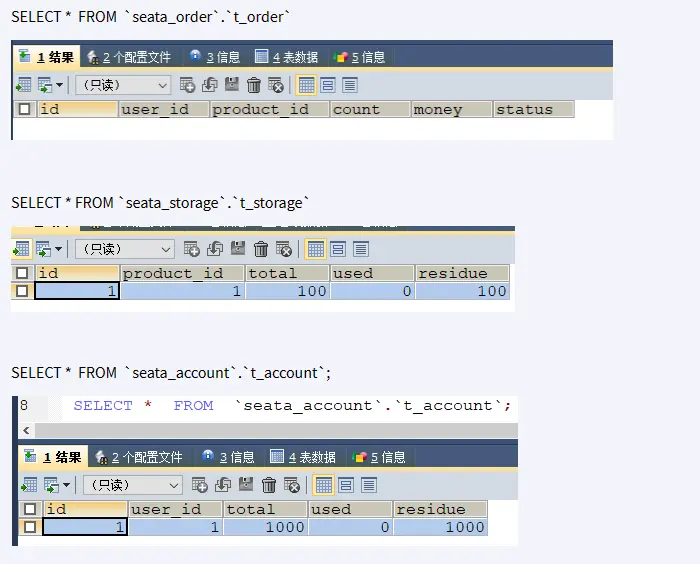

#### 正常下单

此注：此时我们没有在订单模块添加 `@GlobalTransactional` 注解

测试地址：http://localhost:2001/order/create?userId=1&productId=1&count=10&money=100

1 号用户花费 100 块钱买了 10 个 1 号产品

**正常下单，第 1 次：**

- 故障现象：

    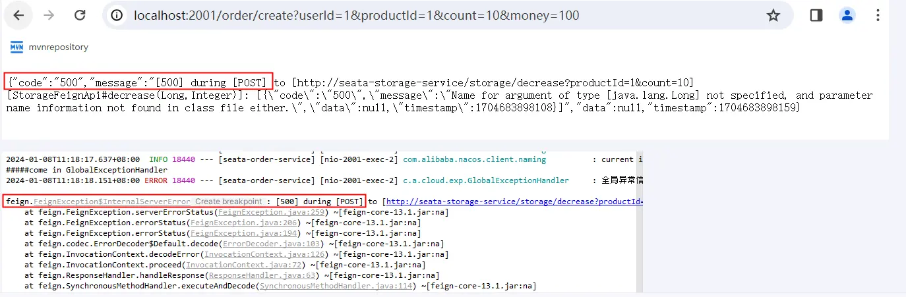

- 故障原因：springboot+springcloud 版本太高导致和阿里巴巴 Seata 不兼容

- 解决方案：总体父工程，boot+cloud 降低版本

    ```xml
    <!--<spring.boot.version>3.2.0</spring.boot.version>
    <spring.cloud.version>2023.0.0</spring.cloud.version> -->
    <!--上面的配置暂时为本案例注释掉，版本降级一下。
    讲解完后请恢复上述高版本保持前后配置一致，请用下面的任一个版本替代上述 -->
    <spring.boot.version>3.0.9</spring.boot.version>
    <spring.cloud.version>2022.0.2</spring.cloud.version>
    <!--仅为了整合openfeign + alibaba seata的案例，降低版本处理下-->
    <spring.boot.version>3.1.7</spring.boot.version>
    <spring.cloud.version>2022.0.4</spring.cloud.version>
    ```

**正常下单，第 2 次**：一切正常

#### 超时异常出错，没有@GlobalTransactional

1. 修改 seata-account-service2003 微服务 AccountServiceImpl 添加超时

    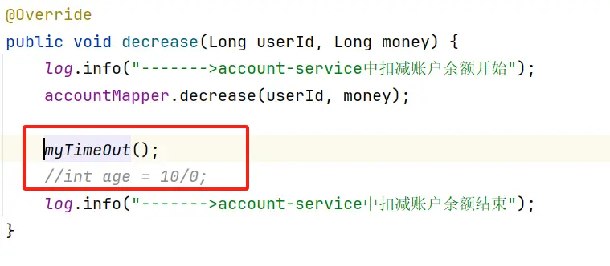

2. 故障情况：当库存和账户金额扣减后，订单状态并没有设置为已经完成，没有从零改为 1

3. 运行时异常同理。

#### 超时异常解决，添加@GlobalTransactional

1. AccountServiceImpl 保留超时方法

2. OrderServiceImpl 添加 `@GlobalTransactional`

    ```java
    @Override
    @GlobalTransactional(name = "zzyy-create-order", rollbackFor = Exception.class)
    public void create(Order order) {
    }
    ```

    此时，订单模块就是 TM，也是其中一个 RM

3. 查看 Seata 后台：http://localhost:7091/#/login

    - 全局事务 ID

        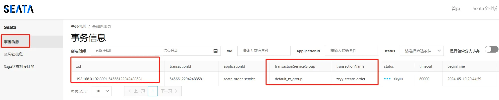

    - 全局锁

        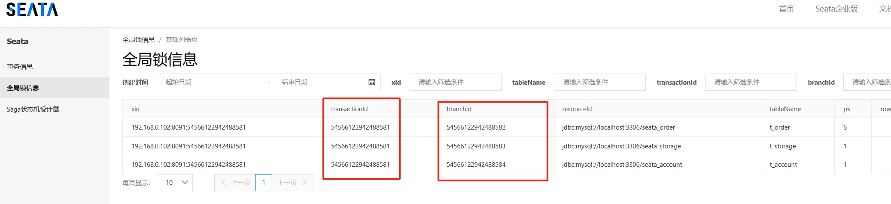

4. 下单后数据库 3 个库数据并没有任何改变，被回滚了

    - 业务中...

        - 按照正常逻辑，本该有新记录入库，等待最后完成提交。

            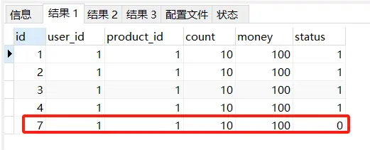

    - 回滚后

        - order 记录都添加不进来

            - 上一步准备新增的记录被彻底回滚了，保证的一致性。

                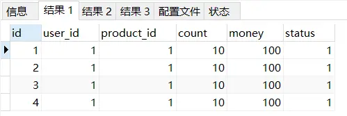

        - 全部回退

### Seata 原理小总结和面试题

**AT 模式如何做到对业务的无侵入**

**是什么：**

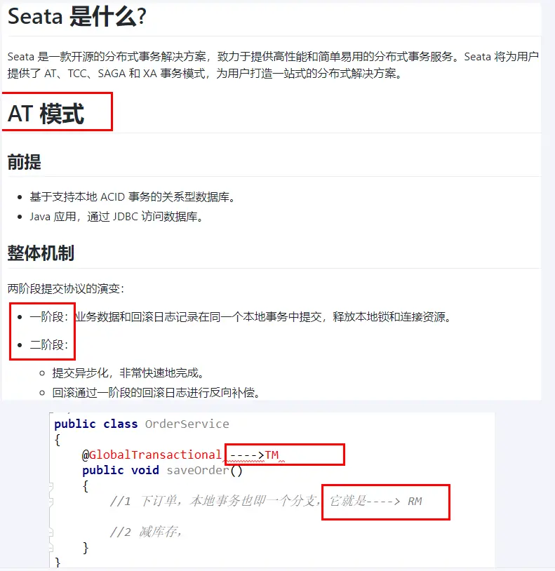

**一阶段加载：**

在一阶段，Seata 会拦截“业务 SQL”，

1. 解析 SQL 语义，找到“业务 SQL”要更新的业务数据，在业务数据被更新前，将其保存成“before image”，
2. 执行“业务 SQL”更新业务数据，在业务数据更新之后，
3. 其保存成“after image”，最后生成行锁。

以上操作全部在一个数据库事务内完成，这样保证了一阶段操作的原子性。

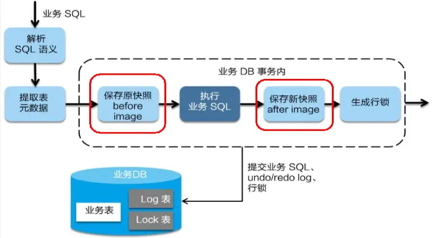

**二阶段分 2 种情况：**

1. 正常提交

    - 二阶段如是顺利提交的话，因为“业务 SQL”在一阶段已经提交至数据库，所以 Seata 框架只需**将一阶段保存的快照数据和行锁删掉，完成数据清理即可**。

        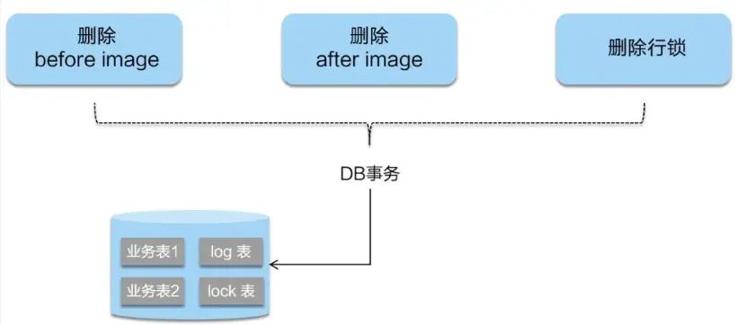

2. 异常回滚

    - 二阶段回滚：

        - **二阶段如果是回滚的话，Seata 就需要回滚一阶段已经执行的“业务 SQL”，还原业务数据**。

        - 回滚方式便是用“before image”还原业务数据；但在还原前要首先要校验脏写，对比“数据库当前业务数据”和 “after image”，

        - 如果两份数据完全一致就说明没有脏写，可以还原业务数据，如果不一致就说明有脏写，出现脏写就需要转人工处理。

            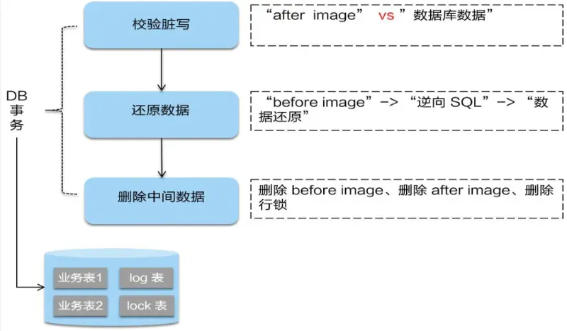
