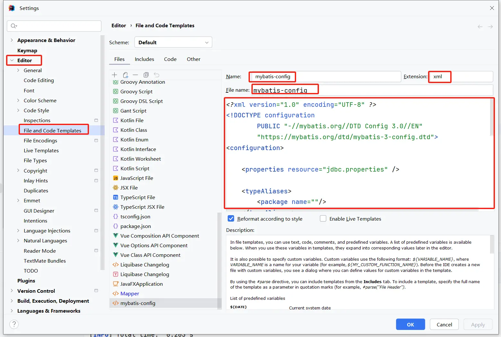
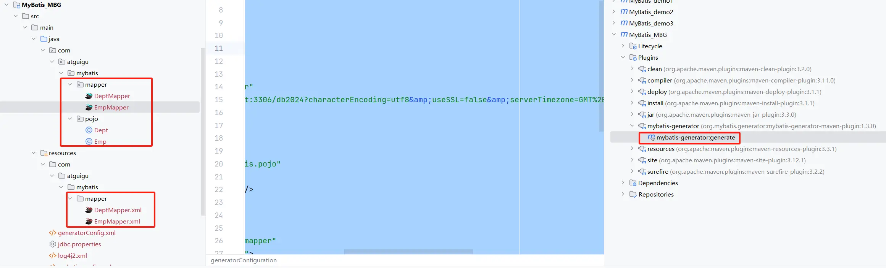

## MyBatis 简介

### MyBatis 历史

- MyBatis 最初是 Apache 的一个开源项目 **iBatis**，2010 年 6 月这个项目由 Apache Software Foundation 迁移到了 Google Code。随着开发团队转投 Google Code 旗下， iBatis3.x 正式更名为 MyBatis。代码于 2013 年 11 月迁移到 Github。
- iBatis 一词来源于“internet”和“abatis”的组合，是一个基于 Java 的持久层框架。 iBatis 提供的持久层框架包括 SQL Maps 和 Data Access Objects(DAO)。

### MyBatis 特性

1. MyBatis 是支持定制化 SQL、存储过程以及高级映射的优秀的持久层框架
2. MyBatis 避免了几乎所有的 JDBC 代码和手动设置参数以及获取结果集
3. MyBatis 可以使用简单的 XML 或注解用于配置和原始映射，将接口和 Java 的 POJO（Plain Old Java Objects，普通的 Java 对象）映射成数据库中的记录
4. MyBatis 是一个 半自动的 ORM(Object Relation Mapping)框架

### MyBatis 下载

MyBatis 下载地址：[https://github.com/mybatis/mybatis-3](https://github.com/mybatis/mybatis-3)

[mybatis 文档](https://mybatis.org/mybatis-3/zh_CN/index.html)

### 和其它持久化层技术对比

- JDBC
    - SQL 夹杂在 Java 代码中耦合度高，导致硬编码内伤
    - 维护不易且实际开发需求中 SQL 有变化，频繁修改的情况多见代码冗长，开发效率低

- Hibernate 和 JPA
    - 操作简便，开发效率高
    - 程序中的长难复杂 SQL 需要绕过框架
    - 内部自动生产的 SQL，不容易做特殊优化
    - 基于全映射的全自动框架，大量字段的 POJO 进行部分映射时比较困难。反射操作太多，导致数据库性能下降

- MyBatis
    - 轻量级，性能出色
    - SQL 和 Java 编码分开，功能边界清晰。Java 代码专注业务、SQL 语句专注数据
    - 开发效率稍逊于 Hibernate ，但是完全能够接受

## 搭建 MyBatis

### 创建 maven 工程

```xml
<project xmlns="http://maven.apache.org/POM/4.0.0" xmlns:xsi="http://www.w3.org/2001/XMLSchema-instance"
  xsi:schemaLocation="http://maven.apache.org/POM/4.0.0 http://maven.apache.org/xsd/maven-4.0.0.xsd">
  <modelVersion>4.0.0</modelVersion>

  <groupId>com.atguigu.mybatis</groupId>
  <artifactId>MyBatis_demo1</artifactId>
  <version>1.0-SNAPSHOT</version>
  <packaging>jar</packaging>

  <properties>
    <project.build.sourceEncoding>UTF-8</project.build.sourceEncoding>
  </properties>

  <dependencies>
    <!-- Mybatis核心 -->
    <dependency>
      <groupId>org.mybatis</groupId>
      <artifactId>mybatis</artifactId>
      <version>3.5.16</version>
    </dependency>
    <!-- junit测试 -->
    <dependency>
      <groupId>junit</groupId>
      <artifactId>junit</artifactId>
      <version>4.13.2</version>
      <scope>test</scope>
    </dependency>
    <!-- MySQL驱动 -->
    <dependency>
      <groupId>mysql</groupId>
      <artifactId>mysql-connector-java</artifactId>
      <version>8.0.33</version>
    </dependency>
    <!-- lombok -->
    <dependency>
      <groupId>org.projectlombok</groupId>
      <artifactId>lombok</artifactId>
      <version>1.18.30</version>
      <scope>provided</scope>
    </dependency>
  </dependencies>
</project>
```

### 创建 MyBatis 的核心配置文件

> 习惯上命名为 `mybatis-config.xml`，这个文件名仅仅只是建议，并非强制要求。将来整合 Spring 之后，这个配置文件可以省略，所以大家操作时可以直接复制、粘贴。
>
> 核心配置文件主要用于配置连接数据库的环境以及 MyBatis 的全局配置信息
>
> 核心配置文件存放的位置是 `src/main/resources` 目录下

```xml
<?xml version="1.0" encoding="UTF-8" ?>
<!DOCTYPE configuration
        PUBLIC "-//mybatis.org//DTD Config 3.0//EN"
        "https://mybatis.org/dtd/mybatis-3-config.dtd">
<configuration>
    <!-- 配置连接数据库的环境 -->
    <environments default="development">
        <environment id="development">
            <transactionManager type="JDBC"/>
            <dataSource type="POOLED">
                <property name="driver" value="com.mysql.cj.jdbc.Driver"/>
                <property name="url" value="jdbc:mysql://localhost:3306/db2024?characterEncoding=utf8&amp;useSSL=false&amp;serverTimezone=GMT%2B8&amp;rewriteBatchedStatements=true&amp;allowPublicKeyRetrieval=true"/>
                <property name="username" value="root"/>
                <property name="password" value="123456"/>
            </dataSource>
        </environment>
    </environments>
    <!-- 引入映射文件 -->
    <mappers>
        <mapper resource="mappers/UserMapper.xml"/>
    </mappers>
</configuration>
```

### 创建 mapper 接口

> MyBatis 中的 mapper 接口相当于以前的 dao。但是区别在于，mapper 仅仅是接口，我们不需要提供实现类。

1. 创建数据库表 t_user

    ```mysql
    CREATE TABLE `t_user` (
      `id` int NOT NULL AUTO_INCREMENT,
      `username` varchar(20) DEFAULT NULL,
      `password` varchar(20) DEFAULT NULL,
      `age` int DEFAULT NULL,
      `sex` char(1) DEFAULT NULL,
      `email` varchar(20) DEFAULT NULL,
      PRIMARY KEY (`id`)
    ) ENGINE=InnoDB DEFAULT CHARSET=utf8mb4 COLLATE=utf8mb4_0900_ai_ci;
    ```

2. 创建实体类 User

    ```java
    package com.atguigu.mybatis.pojo;
    
    @Data
    @AllArgsConstructor
    @NoArgsConstructor
    public class User {
        private Integer id;
        private String username;
        private String password;
        private Integer age;
        private String sex;
        private String email;
    }
    ```

3. 创建 UserMapper 接口

    ```java
    package com.atguigu.mybatis.mapper;
    
    public interface UserMapper {
        /**
         * Mybatis 面向接口编成的两个一直
         * 1. 映射文件的 namespace 要和 mapper 接口的全类名保持一致
         * 2. 映射文件中 SQL 语句的 id 要和 mapper 接口中的方法名一致
         *
         * 表 -- 实体类 -- mapper 接口 -- 映射文件
         */
        /**
         * 添加用户信息
         * @return
         */
        int insertUser();
    }
    
    ```

### 创建 MyBatis 的映射文件

相关概念：**ORM**（**O**bject **R**elationship **M**apping）对象关系映射。

- 对象：Java 的实体类对象
- 关系：关系型数据库
- 映射：二者之间的对应关系

| Java 概念 | 数据库概念 |
| :------: | :--------: |
|    类    |     表     |
|   属性   |  字段/列   |
|   对象   |  记录/行   |

> 1. 映射文件的命名规则：
>     - 表所对应的实体类的类名 + Mapper.xml
>     - 例如：表 t_user，映射的实体类为 User，所对应的映射文件为 `UserMapper.xml`
>     - 因此一个映射文件对应一个实体类，对应一张表的操作
>     - MyBatis 映射文件用于编写 SQL，访问以及操作表中的数据
>     - MyBatis 映射文件存放的位置是 `src/main/resources/mappers` 目录下
> 2. MyBatis 中可以面向接口操作数据，要保证两个一致：
>     - mapper 接口的全类名和映射文件的命名空间(namespace)保持一致
>     - mapper 接口中方法的方法名和映射文件中编写 SQL 的标签的 id 属性保持一致

```xml
<?xml version="1.0" encoding="UTF-8" ?>
<!DOCTYPE mapper PUBLIC "-//mybatis.org//DTD Mapper 3.0//EN" "http://mybatis.org/dtd/mybatis-3-mapper.dtd" >
<mapper namespace="com.atguigu.mybatis.mapper.UserMapper">
    <!-- int insertUser(); -->
    <insert id="insertUser">
        insert into t_user(username, password, age, sex, email)
        values ('admin', '123456', 23, '男', '12345@qq.com')
    </insert>
</mapper>
```

### 通过 junit 测试功能

```java
package com.atguigu.mybatis;

public class MybatisTest {
    /**
     * SqlSession 默认不自动提交事务,如需要自动提交事务
     * 可以使用 sqlSessionFactory.openSession(true);
     * @throws IOException
     */
    @Test
    public void testMyBatis() throws IOException {
        // 读取 MyBatis 的核心配置文件
        InputStream is = Resources.getResourceAsStream("mybatis-config.xml");
        // 创建 SqlSessionFactoryBuilder 对象
        SqlSessionFactoryBuilder sqlSessionFactoryBuilder = new SqlSessionFactoryBuilder();
        // 通过核心配置文件所对应的字节输入流创建工厂类 SqlSessionFactory，生产 SqlSession 对象
        SqlSessionFactory sqlSessionFactory = sqlSessionFactoryBuilder.build(is);
        // 创建 SqlSession 对象，此时通过 SqlSession 对象所操作的 sql 都必须手动提交或回滚事务
//        SqlSession sqlSession = sqlSessionFactory.openSession();
        // 创建 SqlSession 对象，此时通过 SqlSession 对象所操作的 sql 都会自动提交
        SqlSession sqlSession = sqlSessionFactory.openSession(true);
        // 通过代理模式创建 UserMapper 接口的代理实现类对象
        UserMapper userMapper = sqlSession.getMapper(UserMapper.class);
        // 调用 UserMapper 接口中的方法，就可以根据 UserMapper 的全类名匹配元素文件，
        // 通过调用的方法名匹配映射文件中的 SQL 标签，并执行标签中的 SQL 语句
        int result = userMapper.insertUser();
        // 提交事务
//        sqlSession.commit();
        System.out.println("result = " + result);
        sqlSession.close();
        is.close();
    }
}
```

- SqlSession：代表 Java 程序和**数据库**之间的**会话**。（HttpSession 是 Java 程序和浏览器之间的会话）
- SqlSessionFactory：是“生产”SqlSession 的“工厂”。
- 工厂模式：如果创建某一个对象，使用的过程基本固定，那么我们就可以把创建这个对象的相关代码封装到一个“工厂类”中，以后都使用这个工厂类来“生产”我们需要的对象。

### 加入 log4j2 日志功能

1. 引入依赖

    ```xml
    <!-- 使用 log4j2 的适配器 -->
    <dependency>
      <groupId>org.apache.logging.log4j</groupId>
      <artifactId>log4j-slf4j-impl</artifactId>
      <version>2.17.1</version>
    </dependency>
    ```

2. 加入 log4j2 的配置文件

    log4j2 的配置文件名为 `log4j2.xml`，存放的位置是 `src/main/resources` 目录下

    ```xml
    <?xml version="1.0" encoding="UTF-8" ?>
    <Configuration status="warn" monitorInterval="5">
        <Appenders>
            <!-- 控制台输出 appender，如果想要红色，可以 target="SYSTEM_ERR" -->
            <Console name="Console" target="SYSTEM_OUT">
                <PatternLayout pattern="%d{yyyy-MM-dd HH:mm:ss.SSS} [%-5level] %m%n" />
            </Console>
        </Appenders>
    
        <Loggers>
            <Root level="debug">
                <AppenderRef ref="Console" />
            </Root>
            <Logger name="java.sql" level="debug">
                <AppenderRef ref="Console" />
            </Logger>
            <Logger name="org.apache.ibatis" level="info">
                <AppenderRef ref="Console" />
            </Logger>
        </Loggers>
    </Configuration>
    ```

> 日志的级别
>
> - FATAL（致命）> ERROR（错误）> WARN（警告）> INFO（信息）> DEBUG（调试）
> - 从左到右打印的内容越来越详细

## MyBatis 的增删改查

1. `UserMapper.java`

    ```java
    package com.atguigu.mybatis.mapper;
    
    public interface UserMapper {
        /**
         * 添加用户信息
         * @return
         */
        int insertUser();
    
        /**
         * 修改用户信息
         */
        void updateUser();
    
        /**
         * 删除用户信息
         */
        void deleteUser();
    
        /**
         * 根据 id 查询用户信息
         * @return
         */
        User getUserById();
    
        /**
         * 查询所有用户信息
         * @return
         */
        List<User> getAllUser();
    }
    ```

2. `UserMapper.xml`

    ```xml
    <?xml version="1.0" encoding="UTF-8" ?>
    <!DOCTYPE mapper PUBLIC "-//mybatis.org//DTD Mapper 3.0//EN" "http://mybatis.org/dtd/mybatis-3-mapper.dtd" >
    <mapper namespace="com.atguigu.mybatis.mapper.UserMapper">
        <!-- int insertUser(); -->
        <insert id="insertUser">
            insert into t_user(username, password, age, sex, email)
            values ('admin', '123456', 23, '男', '12345@qq.com')
        </insert>
    
        <!-- void updateUser() -->
        <update id="updateUser">
            update t_user set username = '张三' where id = 3
        </update>
    
        <!-- void deleteUser(); -->
        <delete id="deleteUser">
            delete from t_user where id = 5
        </delete>
    
        <!-- User getUserById(); -->
        <!--
            查询功能的标签必须设置 resultType 或 resultMap
            resultType: 设置默认的映射关系
            resultMap: 设置自定义的映射关系
         -->
        <select id="getUserById" resultType="com.atguigu.mybatis.pojo.User">
            select * from t_user where id = 3
        </select>
    
        <!-- List<User> getAllUser(); -->
        <select id="getAllUser" resultType="com.atguigu.mybatis.pojo.User">
            select * from t_user;
        </select>
    </mapper>
    ```

3. 测试

    ```java
    @Test
    public void testCRUD() throws IOException {
        InputStream is = Resources.getResourceAsStream("mybatis-config.xml");
        SqlSessionFactoryBuilder sqlSessionFactoryBuilder = new SqlSessionFactoryBuilder();
        SqlSessionFactory sqlSessionFactory = sqlSessionFactoryBuilder.build(is);
        SqlSession sqlSession = sqlSessionFactory.openSession(true);
        UserMapper userMapper = sqlSession.getMapper(UserMapper.class);
        //        userMapper.updateUser();
        //        userMapper.deleteUser();
        /* User user = userMapper.getUserById();
            System.out.println("user = " + user); */
        List<User> allUser = userMapper.getAllUser();
        allUser.forEach(System.out::println);
        sqlSession.close();
        is.close();
    }
    ```

4. 注意：
    - 查询的标签 select 必须设置属性 resultType 或 resultMap，用于设置实体类和数据库表的映射关系
        - resultType：自动映射，用于属性名和表中字段名一致的情况
        - resultMap：自定义映射，用于一对多或多对一或字段名和属性名不一致的情况
    - 当查询的数据为多条时，不能使用实体类作为返回值，只能使用集合，否则会抛出异常 TooManyResultsException；但是若查询的数据只有一条，可以使用实体类或集合作为返回值

## 核心配置文件详解

核心配置文件中的标签必须按照固定的顺序：

`properties?,settings?,typeAliases?,typeHandlers?,objectFactory?,objectWrapperFactory?,reflectorFactory?,plugins?,environments?,databaseIdProvider?,mappers?`

```xml
<?xml version="1.0" encoding="UTF-8" ?>
<!DOCTYPE configuration
        PUBLIC "-//mybatis.org//DTD Config 3.0//EN"
        "https://mybatis.org/dtd/mybatis-3-config.dtd">
<configuration>
    <!--
        Mybatis 核心配置文件中,标签的顺序:
        The content of element type "configuration" must match "(
        properties?,settings?,typeAliases?,typeHandlers?,objectFactory?,objectWrapperFactory?,
        reflectorFactory?,plugins?,environments?,databaseIdProvider?,mappers?)".
     -->
    <!-- 引入properties文件，此时就可以 ${属性名} 的方式访问属性值 -->
    <properties resource="jdbc.properties" />

    <settings>
        <!-- 将表中字段的下划线自动转换为驼峰 -->
        <setting name="mapUnderscoreToCamelCase" value="true"/>
        <!-- 开启延迟加载 -->
        <setting name="lazyLoadingEnabled" value="true"/>
    </settings>

    <!-- 设置类型别名 -->
    <typeAliases>
        <!--
            typeAlias: 设置某个类型的别名
            属性:
                type:  设置需要设置别名的类型的全类型
                alias: 设置此类型的别名,如不设置该属性,则该类型拥有默认的别名,即类型且不区分大小写
                       若设置此属性，此时该类型的别名只能使用alias所设置的值
         -->
        <!-- <typeAlias type="com.atguigu.mybatis.pojo.User"></typeAlias> -->
        <!-- 以包为单位,将包下所有的类型设置默认的类型别名,即类型且不区分大小写 -->
        <package name="com.atguigu.mybatis.pojo"/>
    </typeAliases>
    <!--
        environments: 配置多个连接数据库的环境
        属性:
            default: 设置默认使用的环境的 id
     -->
    <environments default="development">
        <!--
            environment: 配置某个具体的环境
            属性:
                id: 表示连接数据库的环境的唯一标识,不能重复
         -->
        <environment id="development">
            <!--
                transactionManager: 设置事务管理方式
                属性:
                    type="JDBC|MANAGED"
                    JDBC: 表示当前环境中,执行 SQL 时,使用的是 JDBC 中原生的事务管理方式,事务的提交或回滚需要手动处理
                    MANAGED: 被管理,例如 Spring 中的 AOP
             -->
            <transactionManager type="JDBC"/>
            <!--
                dataSource: 配置数据源
                属性:
                    type:设置数据源的类型
                    type="POOLED|UNPOOLED|JNDI
                    POOLED: 表示使用数据库连接池，即会将创建的连接进行缓存，下次使用可以从缓存中直接获取，不需要重新创建
                    UNPOOLED: 表示不使用数据库连接池，即每次使用连接都需要重新创建
                    JNDI: 表示使用上下文中的数据源
             -->
            <dataSource type="POOLED">
                <!-- 设置连接数据库的驱动 -->
                <property name="driver" value="${jdbc.driver}"/>
                <!-- 设置连接数据库的连接地址 -->
                <property name="url" value="${jdbc.url}"/>
                <!-- 设置连接数据库的用户名 -->
                <property name="username" value="${jdbc.username}"/>
                <!-- 设置连接数据库的密码 -->
                <property name="password" value="${jdbc.password}"/>
            </dataSource>
        </environment>
        <environment id="test">
            <transactionManager type="JDBC"/>
            <dataSource type="POOLED">
                <property name="driver" value="com.mysql.cj.jdbc.Driver"/>
                <property name="url" value="jdbc:mysql://localhost:3306/db2024?characterEncoding=utf8&amp;useSSL=false&amp;serverTimezone=GMT%2B8&amp;rewriteBatchedStatements=true&amp;allowPublicKeyRetrieval=true"/>
                <property name="username" value="root"/>
                <property name="password" value="123456"/>
            </dataSource>
        </environment>
    </environments>
    <!-- 引入映射文件 -->
    <mappers>
        <!-- <mapper resource="mappers/UserMapper.xml"/> -->
        <!--
            以包为单位，将包下所有的映射文件引入核心配置文件
            要求:
            1. mapper 接口所在的包要和映射文件所在的包一致
            2. mapper 接口要和映射文件的名字一致
         -->
        <package name="com.atguigu.mybatis.mapper"/>
    </mappers>
</configuration>
```

## 在 IDEA 中设置核心配置和映射文件模板

### 设置核心配置文件模板



```xml
<?xml version="1.0" encoding="UTF-8" ?>
<!DOCTYPE configuration
        PUBLIC "-//mybatis.org//DTD Config 3.0//EN"
        "https://mybatis.org/dtd/mybatis-3-config.dtd">
<configuration>

    <properties resource="jdbc.properties" />

    <typeAliases>
        <package name=""/>
    </typeAliases>

    <environments default="development">
        <environment id="development">
            <transactionManager type="JDBC"/>
            <dataSource type="POOLED">
                <property name="driver" value="${jdbc.driver}"/>
                <property name="url" value="${jdbc.url}"/>
                <property name="username" value="${jdbc.username}"/>
                <property name="password" value="${jdbc.password}"/>
            </dataSource>
        </environment>
    </environments>

    <mappers>
        <package name=""/>
    </mappers>
</configuration>
```

### 设置映射文件模板

```xml
<!DOCTYPE mapper PUBLIC "-//mybatis.org//DTD Mapper 3.0//EN" "http://mybatis.org/dtd/mybatis-3-mapper.dtd" >
<mapper namespace="">
</mapper>
```

注：<font color="red">最新版 IDEA 已自带映射文件模板，且 MyBatisX 插件也可快捷创建映射文件。</font>

### 封装 SqlSessionUtils 工具类

```java
package com.atguigu.mybatis.utils;

public class SqlSessionUtils {
    public static SqlSession getSqlSession() {
        SqlSession sqlSession;
        try {
            InputStream is = Resources.getResourceAsStream("mybatis-config.xml");
            SqlSessionFactory sqlSessionFactory = new SqlSessionFactoryBuilder().build(is);
            sqlSession = sqlSessionFactory.openSession(true);
        } catch (IOException e) {
            throw new RuntimeException(e);
        }
        return sqlSession;
    }
}
```

## MyBatis 获取参数值的两种方式（重点）

MyBatis 获取参数值的两种方式：`${}` 和  `#{}`

- `${}` 的本质就是**字符串拼接**，`#{}` 的本质就是**占位符赋值**
- `${}` 使用字符串拼接的方式拼接 sql，若为字符串类型或日期类型的字段进行赋值时，需要**手动加单引号**；
- 但是 `#{}` 使用占位符赋值的方式拼接 sql，此时为字符串类型或日期类型的字段进行赋值时，可以**自动添加单引号**

### 单个字面量类型的参数

若 mapper 接口中的方法参数为单个的字面量类型，此时可以使用 `${}` 和 `#{}` 以任意的名称获取参数的值，注意 `${}` 需要手动加单引号

### 多个字面量类型的参数

若 mapper 接口中的方法参数为多个时，此时 MyBatis 会自动将这些参数放在一个 map 集合中，以两种方式进行存储

- 以 `arg0,arg1...` 为键，以参数为值；
- 以 `param1,param2...` 为键，以参数为值；
- 因此只需要通过 `${}` 和 `#{}` 访问 map 集合的键就可以获取相对应的值，注意 `${}` 需要手动加单引号

### map 集合类型的参数

若 mapper 接口中的方法需要的参数为多个时，此时可以手动创建 map 集合，将这些数据放在 map 中，只需要通过 `${}` 和 `#{}` 访问 map 集合的键就可以获取相对应的值，注意 `${}` 需要手动加单引号

### 实体类类型的参数

若 mapper 接口中的方法参数为实体类对象时，此时可以使用 `${}` 和 `#{}` ，通过访问实体类对象中的属性名获取属性值，注意 `${}` 需要手动加单引号

### 使用 `@Param` 标识参数

可以通过 `@Param` 注解标识 mapper 接口中的方法参数，此时，会将这些参数放在 map 集合中，以两种方式进行存储

- 以 `@Param` 注解的 value 属性值为键，以参数为值；
- 以 `param1,param2...` 为键，以参数为值；
- 只需要通过 `${}` 和 `#{}` 访问 map 集合的键就可以获取相对应的值，注意 `${}` 需要手动加单引号

### 测试

```java
package com.atguigu.mybatis.mapper;

public interface ParameterMapper {
    /**
     * 验证登录（使用 @Param）
     * @param username
     * @param password
     * @return
     */
    User checkLoginByParam(@Param("username") String username, @Param("password") String password);

    /**
     * 添加用户信息
     * @param user
     * @return
     */
    int insertUser(User user);

    /**
     * 验证登录（参数为 map）
     * @param map
     * @return
     */
    User checkLoginByMap(Map<String, Object> map);

    /**
     * 验证登录
     * @param username
     * @param password
     * @return
     */
    User checkLogin(String username, String password);
    
    /**
     * 根据用户名查询用户信息
     * @param username
     * @return
     */
    User getUserByUsername(String username);

    /**
     * 查询所有的员工信息
     * @return
     */
    List<User> getAllUser();
}
```

```xml
<?xml version="1.0" encoding="UTF-8" ?>
<!DOCTYPE mapper PUBLIC "-//mybatis.org//DTD Mapper 3.0//EN" "http://mybatis.org/dtd/mybatis-3-mapper.dtd" >
<mapper namespace="com.atguigu.mybatis.mapper.ParameterMapper">
    <!-- List<User> getAllUser(); -->
    <select id="getAllUser" resultType="User">
        select * from t_user
    </select>
    <!-- User getUserByUsername(String username); -->
    <select id="getUserByUsername" resultType="User">
        <!-- select * from t_user where username = #{username} -->
        select * from t_user where username = '${username}'
    </select>
    <!-- User checkLogin(String username, String password); -->
    <select id="checkLogin" resultType="User">
        <!-- select * from t_user where username = #{param1} and password = #{param2} -->
        <!-- select * from t_user where username = #{username} and password = #{password} -->
        <!-- select * from t_user where username = '${username}' and password = '${password}' -->
        select * from t_user where username = '${arg0}' and password = '${arg1}'
     </select>

    <select id="checkLoginByMap" resultType="User">
        select * from t_user where username = #{username} and password = #{password}
    </select>

    <insert id="insertUser">
        insert into t_user values(null, #{username}, #{password}, #{age}, #{sex}, #{email})
    </insert>

    <select id="checkLoginByParam" resultType="User">
        select * from t_user where username = #{username} and password = #{password}
    </select>
</mapper>
```

```java
package com.atguigu.mybatis;

public class ParameterMapperTest {
    /**
     * MyBatis 获取参数值的两种方式: ${} 和 #{}
     * ${} 本质字符串拼接
     * #{} 本质占位符赋值
     * MyBatis 获取参数值的各种情况:
     *  1. mapper 接口方法的参数为单个的字面量类型
     *      可以通过 ${} 和 #{} 以任意的名称获取参数值,但是需要注意 ${} 的单引号问题
     *  2. mapper 接口方法的参数为多个时
     *      此时 MyBatis 会将这些参数放在一个 map 集合中,以两种方式进行存储
     *      a. 以 arg0, arg1... 为键,以参数为值
     *      b. 以 param1, param2... 为键,以参数为值
     *      因此只需要通过 ${} 和 #{} 以键的方式访问值即可,但是需要注意 ${} 的单引号问题
     *  3. 若 mapper 接口方法的参数有多个时，可以手动将这些参数放在一个 map 中
     *      只需要通过 ${} 和 #{} 以键的方式访问值即可,但是需要注意 ${} 的单引号问题
     *  4. 若 mapper 接口方法的参数是一个实体类类型的参数
     *      只需要通过 ${} 和 #{} 以属性的方式访问属性值即可,但是需要注意 ${} 的单引号问题
     *  5. 使用 @Param 注解命名参数
     *      此时 MyBatis 会将这些参数放在一个 map 集合中,以两种方式进行存储
     *      a. 以 @Param 注解的值为键,以参数为值
     *      b. 以 param1, param2... 为键,以参数为值
     *      因此只需要通过 ${} 和 #{} 以键的方式访问值即可,但是需要注意 ${} 的单引号问题
     */
    @Test
    public void testCheckLoginByParam() {
        SqlSession sqlSession = SqlSessionUtils.getSqlSession();
        ParameterMapper mapper = sqlSession.getMapper(ParameterMapper.class);
        User user = mapper.checkLoginByParam("张三", "123456");
        System.out.println("user = " + user);
    }

    @Test
    public void testInsertUser() {
        SqlSession sqlSession = SqlSessionUtils.getSqlSession();
        ParameterMapper mapper = sqlSession.getMapper(ParameterMapper.class);
        int result = mapper.insertUser(new User(null, "李四", "123456", 23, "男", "123@qq.com"));
        System.out.println(result);
    }

    @Test
    public void testCheckLoginByMap() {
        SqlSession sqlSession = SqlSessionUtils.getSqlSession();
        ParameterMapper mapper = sqlSession.getMapper(ParameterMapper.class);
        Map<String, Object> map = new HashMap<String, Object>();
        map.put("username", "张三");
        map.put("password", "123456");
        User user = mapper.checkLoginByMap(map);
        System.out.println("user = " + user);
    }

    @Test
    public void testCheckLogin() {
        SqlSession sqlSession = SqlSessionUtils.getSqlSession();
        ParameterMapper mapper = sqlSession.getMapper(ParameterMapper.class);
        User user = mapper.checkLogin("张三", "123456");
        System.out.println("user = " + user);
    }

    @Test
    public void testGetUserByUsername() {
        SqlSession sqlSession = SqlSessionUtils.getSqlSession();
        ParameterMapper mapper = sqlSession.getMapper(ParameterMapper.class);
        User user = mapper.getUserByUsername("张三");
        // ${} 的 SQL 注入攻击: select * from t_user where username = 'lisi' or id = '2'
//        User user = mapper.getUserByUsername("lisi' or id = '2");
        System.out.println("user = " + user);
    }

    @Test
    public void testGetAllUser() {
        SqlSession sqlSession = SqlSessionUtils.getSqlSession();
        ParameterMapper mapper = sqlSession.getMapper(ParameterMapper.class);
        mapper.getAllUser().forEach(System.out::println);
    }
}
```

## MyBatis 的各种查询功能

### 查询一个实体类对象

```java
/**
 * 根据 id 查询用户信息
 * @param id
 * @return
 */
User getUserById(@Param("id") Integer id);
```

```xml
<select id="getUserById" resultType="User">
    select * from t_user where id = #{id}
</select>
```

### 查询一个 list 集合

```java
/**
 * 查询所有的用户信息
 * @return
 */
List<User> getAllUsers();
```

```xml
<select id="getAllUsers" resultType="User">
    select * from t_user
</select>
```

### 查询单个数据

```java
/**
 * 查询用户信息的总记录数
 * 在 MyBatis 中，对于 Java 中常用的类型都设置了类型别名
 * 例如：java.lang.Integer-->int|integer
 * 例如：int-->_int|_integer
 * 例如：Map-->map,List-->lis
 * @return
 */
Integer getCount();
```

```xml
<select id="getCount" resultType="Integer">
    select count(*) from t_user
</select>
```

### 查询一条数据为 map 集合

```java
/**
 * 根据 id 查询用户信息为一个 map 集合
 * @param id
 * @return
 */
Map<String, Object> getUserByIdToMap(@Param("id") Integer id);
```

```xml
<select id="getUserByIdToMap" resultType="map">
    select * from t_user where id = #{id}
</select>
<!--结果：{password=123456, sex=男, id=1, age=23, username=admin}-->
```

### 查询多条数据为 map 集合

#### 方式一

```java
/**
 * 查询所有用户信息为 map 集合
 * 将表中的数据以 map 集合的方式查询，一条数据对应一个 map；若有多条数据，就会产生多个 map 集合，此时可以将这些 map 放在一个 list 集合中获取
 * @return
 */
List<Map<String, Object>> getAllUserToMap();
```

```xml
<select id="getAllUserToMap" resultType="java.util.Map">
    select * from t_user
</select>
```

#### 方式二

```java
/**
 * 查询所有用户信息为 map 集合
 * 将表中的数据以 map 集合的方式查询，一条数据对应一个 map；若有多条数据，就会产生多个 map 集合，并且最终要以一个 map 的方式返回数据，此时需要通过 @MapKey 注解设置 map 集合的键，值是每条数据所对应的
map集合
 * @return
 */
@MapKey("id")
Map<String, Object> getAllUserToMap();
```

```xml
<select id="getAllUserToMap" resultType="java.util.Map">
    select * from t_user
</select>
<!--
{
    1={password=123456, sex=男, id=1, age=23, username=admin},
    2={password=123456, sex=男, id=2, age=23, username=张三},
    3={password=123456, sex=男, id=3, age=23, username=张三}
}
-->
```

## 特殊 SQL 的执行

### 模糊查询

```java
/**
 * 根据用户名模糊查询用户信息
 */
List<User> getUserByLike(@Param("username") String username);
```

```xml
<select id="getUserByLike" resultType="User">
    <!-- select * from t_user where username like '%${username}%' --> <!-- 错误 ->
    <!-- select * from t_user where username like concat('%', #{username}, '%') -->
    select * from t_user where username like "%"#{username}"%"
</select>
```

### 批量删除

```java
/**
 * 批量删除
 */
int deleteMore(@Param("ids") String ids);
```

```xml
<delete id="deleteMore">
    delete from t_user where id in (${ids})
</delete>
```

### 动态设置表名

```java
/**
 * 查询指定表中的数据
 */
List<User> getUserByTableName(@Param("tableName") String tableName);
```

```xml
<select id="getUserByTableName" resultType="User">
    select * from ${tableName};
</select>
```

### 添加功能获取自增的主键

`t_clazz(clazz_id,clazz_name)`

`t_student(student_id,student_name,clazz_id)`

1. 添加班级信息
2. 获取新添加的班级的 id
3. 为班级分配学生，即将某学的班级 id 修改为新添加的班级的 id

```java
/**
 * 添加用户信息
 */
void insertUser(@Param("user") User user);
```

```xml
<!--
    useGeneratedKeys: 设置当前标签的 sql 使用了自增的主键
    keyProperty: 将自增的主键的值赋值给传输到映射文件中参数的某个属性
 -->
<insert id="insertUser" useGeneratedKeys="true" keyProperty="id">
    insert into t_user values (null, #{user.username}, #{user.password}, #{user.age}, #{user.sex}, #{user.email})
</insert>
```

## 自定义映射 resultMap

```mysql
CREATE TABLE `t_emp` (
  `eid` int NOT NULL AUTO_INCREMENT,
  `emp_name` varchar(20) DEFAULT NULL,
  `age` int DEFAULT NULL,
  `sex` char(1) DEFAULT NULL,
  `email` varchar(20) DEFAULT NULL,
  `did` int DEFAULT NULL,
  PRIMARY KEY (`eid`)
) ENGINE=InnoDB DEFAULT CHARSET=utf8mb4 COLLATE=utf8mb4_0900_ai_ci;

INSERT INTO `t_emp` (`emp_name`, `age`, `sex`, `email`, `did`) VALUES ('张三', 23, '男', '123@qq.com', 1);
INSERT INTO `t_emp` (`emp_name`, `age`, `sex`, `email`, `did`) VALUES ('李四', 24, '男', '123@qq.com', 2);
INSERT INTO `t_emp` (`emp_name`, `age`, `sex`, `email`, `did`) VALUES ('王五', 25, '男', '123@qq.com', 3);
INSERT INTO `t_emp` (`emp_name`, `age`, `sex`, `email`, `did`) VALUES ('赵六', 26, '男', '123@qq.com', 1);
INSERT INTO `t_emp` (`emp_name`, `age`, `sex`, `email`, `did`) VALUES ('田七', 28, '男', '123@qq.com', 2);

CREATE TABLE `t_dept` (
  `did` int NOT NULL AUTO_INCREMENT,
  `dept_name` varchar(2) DEFAULT NULL,
  PRIMARY KEY (`did`)
) ENGINE=InnoDB DEFAULT CHARSET=utf8mb4 COLLATE=utf8mb4_0900_ai_ci;

INSERT INTO `t_dept` (`dept_name`) VALUES ('A');
INSERT INTO `t_dept` (`dept_name`) VALUES ('B');
INSERT INTO `t_dept` (`dept_name`) VALUES ('C');
```

### resultMap 处理字段和属性的映射关系

若字段名和实体类中的属性名不一致，则可以通过 `resultMap` 设置自定义映射

```xml
<!--
    resultMap：设置自定义映射关系
    id：唯一标识，不能重复
    type：设置映射关系中的实体类类型
    子标签：
        id：设置主键的映射关系
        result：设置普通字段的映射关系
            属性：
                property：设置映射关系中的属性名，必须是type属性所设置的实体类类型中的属性名
                column：设置映射关系中的字段名，必须是 SQL 语句查询出的字段名
-->
<resultMap id="empResultMap" type="com.atguigu.mybatis.pojo.Emp">
    <id property="eid" column="eid" />
    <result property="empName" column="emp_name" />
    <result property="age" column="age" />
    <result property="sex" column="sex" />
    <result property="email" column="email" />
</resultMap>

<select id="getAllEmp" resultMap="empResultMap">
    select * from t_emp
</select>

<select id="getAllEmpOld" resultType="com.atguigu.mybatis.pojo.Emp">
    <!-- select eid, emp_name empName, age, sex, email from t_emp -->
    select * from t_emp
</select>
```

> 若字段名和实体类中的属性名不一致，但是字段名符合数据库的规则（使用 `_`），实体类中的属性名符合 Java 的规则（使用驼峰），此时也可通过以下两种方式处理字段名和实体类中的属性的映射关系：
>
> 1. 可以通过为字段起别名的方式，保证和实体类中的属性名保持一致
>
>      ```mysql
>      select eid, emp_name empName, age, sex, email from t_emp
>      ```
>
> 2. 可以在 MyBatis 的核心配置文件中设置一个全局配置信息 `mapUnderscoreToCamelCase`，可以在查询表中数据时，自动将 `_` 类型的字段名转换为驼峰
>
>     例如：字段名 `user_name`，设置了 `mapUnderscoreToCamelCase`，此时字段名就会转换为 `userName`
>
>     ```xml
>     <setting name="mapUnderscoreToCamelCase" value="true"/>
>     ```

### 多对一映射处理

> 查询员工信息以及员工所对应的部门信息

#### 级联方式处理映射关系

```xml
<!-- 处理多对一映射关系方式一：级联属性赋值 -->
<resultMap id="empAndDeptResultMapOne" type="Emp">
    <id property="eid" column="eid" />
    <result property="empName" column="emp_name" />
    <result property="age" column="age" />
    <result property="sex" column="sex" />
    <result property="email" column="email" />
    <result property="dept.did" column="did" />
    <result property="dept.deptName" column="dept_name" />
</resultMap>

<select id="getEmpAndDept" resultMap="empAndDeptResultMapOne">
    select * from t_emp left join t_dept on t_emp.did = t_dept.did where t_emp.eid = #{eid}
</select>
```

```java
public interface EmpMapper {
    /**
     * 查询员工以及员工所对应的部门信息
     */
    Emp getEmpAndDept(@Param("eid") Integer eid);
}
```

#### 使用 association 处理映射关系

```xml
<!-- 处理多对一映射关系方式二：association -->
<resultMap id="empAndDeptResultMapTwo" type="Emp">
    <id property="eid" column="eid" />
    <result property="empName" column="emp_name" />
    <result property="age" column="age" />
    <result property="sex" column="sex" />
    <result property="email" column="email" />
    <!--
        association: 处理多对一的映射关系
        property：需要处理多对一映射关系的属性名
        javaType: 该属性的类型
    -->
    <association property="dept" javaType="Dept" >
        <id property="did" column="did" />
        <result property="deptName" column="dept_name" />
    </association>
</resultMap>

<select id="getEmpAndDept" resultMap="empAndDeptResultMapTwo">
    select * from t_emp left join t_dept on t_emp.did = t_dept.did where t_emp.eid = #{eid}
</select>
```

#### 分步查询

1. 查询员工信息

    ```java
    public interface EmpMapper {
        /**
         * 通过分步查询员工以及员工所对应的部门信息
         * 分步查询第一步：查询员工信息
         */
        Emp getEmpAndDeptByStepOne(@Param("eid") Integer eid);
    }
    ```

    ```xml
    <resultMap id="empAndDeptByStepResultMap" type="Emp">
        <id property="eid" column="eid" />
        <result property="empName" column="emp_name" />
        <result property="age" column="age" />
        <result property="sex" column="sex" />
        <result property="email" column="email" />
        <!--
            select: 设置分步查询的 SQL 的唯一标识（namespace.SQLId 或 mapper 接口的全类名.方法名
            column: 设置分步查询的条件
            fetchType: 当开启了全局的延迟加载之后，可通过此属性手动控制延迟加载的效果
                fetchType="eager|lazy": lazy 表示延迟加载，eager 表示立即加载
         -->
        <association property="dept"
                     select="com.atguigu.mybatis.mapper.DeptMapper.getEmpAndDeptByStepTwo"
                     column="did"
                     fetchType="eager" />
    </resultMap>
    
    <select id="getEmpAndDeptByStepOne" resultMap="empAndDeptByStepResultMap">
        select * from t_emp where eid = #{eid}
    </select>
    ```

2. 根据员工所对应的部门 id 查询部门信息

    ```java
    public interface DeptMapper {
        /**
         * 通过分步查询员工以及员工所对应的部门信息
         * 分步查询第二步：通过 did 查询员工所对应的部门
         */
        Dept getEmpAndDeptByStepTwo(@Param("did") Integer did);
    }
    ```

    ```xml
    <select id="getEmpAndDeptByStepTwo" resultType="com.atguigu.mybatis.pojo.Dept">
        select * from t_dept where did = #{did}
    </select>
    ```

### 一对多映射处理

#### collection

```java
public interface DeptMapper {
    /**
     * 获取部门以及部门中所有的员工信息
     */
    Dept getDeptAndEmp(@Param("did") Integer did);
}
```

```xml
<resultMap id="deptAndEmpResultMap" type="Dept">
    <id property="did" column="did" />
    <result property="deptName" column="dept_name" />
    <!--
        collection：处理一对多的映射关系
        ofType：表示该属性所对应的集合中存储数据的类型
     -->
    <collection property="emps" ofType="Emp" >
        <id property="eid" column="eid" />
        <result property="empName" column="emp_name" />
        <result property="age" column="age" />
        <result property="sex" column="sex" />
        <result property="email" column="email" />
    </collection>
</resultMap>
<select id="getDeptAndEmp" resultMap="deptAndEmpResultMap">
    select * from t_dept left join t_emp on t_dept.did = t_emp.did where t_emp.did = ${did}
</select>
```

#### 分步查询

1. 查询部门信息

    ```java
    public interface DeptMapper {
        /**
         * 通过分步查询查询部门以及部门中所有的员工信息
         * 分步查询第一步：查询部门信息
         */
        Dept getDeptAndEmpByStepOne(@Param("did") Integer did);
    }
    ```

    ```xml
    <resultMap id="deptAndEmpByStepResultMap" type="Dept" >
        <id property="did" column="did" />
        <result property="deptName" column="dept_name" />
        <collection property="emps" select="com.atguigu.mybatis.mapper.EmpMapper.getDeptAndEmpByStepTwo" column="did" />
    </resultMap>
    <select id="getDeptAndEmpByStepOne" resultMap="deptAndEmpByStepResultMap">
        select * from t_dept where did = #{did}
    </select>
    ```

2. 根据部门 id 查询部门中的所有员工

    ```java
    public interface EmpMapper {
        /**
         * 通过分步查询查询部门以及部门中所有的员工信息
         * 分步查询第二步：根据 did 查询员工信息
         */
        List<Emp> getDeptAndEmpByStepTwo(@Param("did") Integer did);
    }
    ```

    ```xml
    <select id="getDeptAndEmpByStepTwo" resultType="com.atguigu.mybatis.pojo.Emp">
        select * from t_emp where did = ${did}
    ```

> 分步查询的优点：可以实现延迟加载，但是必须在核心配置文件中设置全局配置信息：
>
> - `lazyLoadingEnabled`：延迟加载的全局开关。当开启时，所有关联对象都会延迟加载（默认为 `false`，需要手动开启）
>
>     ```xml
>     <setting name="lazyLoadingEnabled" value="true"/>
>     ```
>
> - `aggressiveLazyLoading`：当开启时，任何方法的调用都会加载该对象的所有属性。 否则，每个属性会按需加载（默认为 `false`）
>
> - 此时就可以实现按需加载，获取的数据是什么，就只会执行相应的 sql。
>
> - 此时可通过 association 和 collection 中的 `fetchType` 属性设置当前的分步查询是否使用延迟加载，`fetchType="eager|lazy": lazy 表示延迟加载，eager 表示立即加载`

## 动态 SQL

Mybatis 框架的动态 SQL 技术是一种根据特定条件动态拼装 SQL 语句的功能，它存在的意义是为了解决拼接 SQL 语句字符串时的痛点问题。

### if

if 标签可通过 `test 属性` 的表达式进行判断，若表达式的结果为 `true`，则标签中的内容会执行；反之标签中的内容不会执行

```xml
<select id="getEmpByConditionOne" resultType="com.atguigu.mybatis.pojo.Emp">
    select * from t_emp where 1= 1
    <if test="empName != null and empName != ''">
        and emp_name = #{empName}
    </if>
    <if test="age != null and age != ''">
        and age = #{age}
    </if>
    <if test="sex != null and sex != ''">
        and sex = #{sex}
    </if>
    <if test="email != null and email != ''">
        and email = #{email}
    </if>
</select>
```

### where

```xml
<select id="getEmpByConditionTwo" resultType="com.atguigu.mybatis.pojo.Emp">
    select * from t_emp
    <where>
        <if test="empName != null and empName != ''">
            and emp_name = #{empName}
        </if>
        <if test="age != null and age != ''">
            and age = #{age}
        </if>
        <if test="sex != null and sex != ''">
            and sex = #{sex}
        </if>
        <if test="email != null and email != ''">
            and email = #{email}
        </if>
    </where>
</select>
```

> `where` 和 `if` 一般结合使用：
>
> 1. 若 `where` 标签中的 `if` 条件都不满足，则 `where` 标签没有任何功能，即不会添加 `where` 关键字
> 2. 若 `where` 标签中的 `if` 条件满足，则 `where` 标签会自动添加 `where` 关键字，并将条件最前方多余的 `and/or` 去掉
> 3. 注意：`where` 标签不能去掉条件最后多余的 `and/or`

### trim

```xml
<select id="getEmpByCondition" resultType="com.atguigu.mybatis.pojo.Emp
    select * from t_emp
    <trim prefix="where" suffixOverrides="and|or">
        <if test="empName != null and empName != ''">
            emp_name = #{empName} and
        </if>
        <if test="age != null and age != ''">
            age = #{age} or
        </if>
        <if test="sex != null and sex != ''">
            sex = #{sex} and
        </if>
        <if test="email != null and email != ''">
            email = #{email}
        </if>
    </trim>
</select>
```

> `trim` 用于去掉或添加标签中的内容
>
> 常用属性：
>
> - `prefix`：在 `trim` 标签中的内容的前面添加某些内容
> - `prefixOverrides`：在 `trim` 标签中的内容的前面去掉某些内容
> - `suffix`：在 `trim` 标签中的内容的后面添加某些内容
> - `suffixOverrides`：在 `trim` 标签中的内容的后面去掉某些内容

### choose、when、otherwise

`choose`、`when`、`otherwise` 相当于 `if...else if...else`，`when` 至少要有一个，`otherwise` 最多只能有一个

```xml
<select id="getEmpByChoose" resultType="com.atguigu.mybatis.pojo.Emp">
    select * from t_emp
    <where>
        <choose>
            <when test="empName != null and empName != ''">
                emp_name = #{empName}
            </when>
            <when test="age != null and age != ''">
                age = #{age}
            </when>
            <when test="sex != null and sex != ''">
                sex = #{sex}
            </when>
            <when test="email != null and email != ''">
                email = #{email}
            </when>
            <otherwise>
                did = 1
            </otherwise>
        </choose>
    </where>
</select>
```

### foreach

```xml
<insert id="insertMoreByList">
    insert into t_emp values   
    <foreach collection="emps" item="emp" separator=",">
        (null, #{emp.empName}, #{emp.age}, #{emp.sex}, #{emp.email}, null)
    </foreach>
</insert>

<delete id="deleteMoreByArray">
    delete from t_emp where
    <foreach collection="eids" item="eid" separator="or">
        eid = #{eid}
    </foreach>
</delete>

<delete id="deleteMoreByArrayOne">
    delete from t_emp where eid in
    <foreach collection="eids" item="eid" separator="," open="(" close=")">
        #{eid}
    </foreach>
</delete>
```

```java
/**
 * 通过数组实现批量删除
 */
int deleteMoreByArray(@Param("eids") Integer[] eids);

/**
 * 通过 list 集合实现批量添加
 */
int insertMoreByList(@Param("emps") List<Emp> emps);
```

> 属性：
>
> - `collection`：设置要循环的数组或集合
> - `item`：表示集合或数组中的每一个数据
> - `separator`：设置循环体之间的分隔符
> - `open`：设置 `foreach` 标签中的内容的开始符
> - `close`：设置 `foreach` 标签中的内容的结束符

### SQL 片段

sql 片段，可以记录一段公共 sql 片段，在使用的地方通过 `include 标签` 进行引入

```xml
<!-- 设置 SQL 片段 -->
<sql id="empColumns">eid, emp_name, age, sex, email</sql>
<!-- 引用 SQL 片段 -->
<include refid="empColumns" />
```

## MyBatis 的缓存

### MyBatis 的一级缓存

一级缓存是 SqlSession 级别的，通过同一个 SqlSession 查询的数据会被缓存，下次查询相同的数据，就会从缓存中直接获取，不会从数据库重新访问。一级缓存默认开启。

**使一级缓存失效的四种情况：**

- 不同的 SqlSession 对应不同的一级缓存
- 同一个 SqlSession 但是查询条件不同
- 同一个 SqlSession 两次查询期间执行了任何一次增删改操作
- 同一个 SqlSession 两次查询期间手动清空了缓存

### MyBatis 的二级缓存

二级缓存是 SqlSessionFactory 级别，通过同一个 SqlSessionFactory 创建的 SqlSession 查询的结果会被缓存；此后若再次执行相同的查询语句，结果就会从缓存中获取。

**二级缓存开启的条件：**

1. 在核心配置文件中，设置全局配置属性 `cacheEnabled="true"`，默认为 `true`，不需要设置
2. 在映射文件中设置标签 `<cache />`
3. 二级缓存必须在 SqlSession 关闭或提交之后有效
4. 查询的数据所转换的实体类类型必须实现序列化的接口

**使二级缓存失效的情况：**

- 两次查询之间执行了任意的增删改，会使一级和二级缓存同时失效

### 二级缓存的相关配置

在 mapper 配置文件中添加的 `cache 标签` 可以设置一些属性：

- `eviction 属性`：缓存回收策略
    - `LRU(Least Recently Used)` – 最近最少使用的：移除最长时间不被使用的对象。
    - `FIFO(First in First out)` – 先进先出：按对象进入缓存的顺序来移除它们。
    - `SOFT` – 软引用：移除基于垃圾回收器状态和软引用规则的对象。
    - `WEAK` – 弱引用：更积极地移除基于垃圾收集器状态和弱引用规则的对象。
    - 默认的是 LRU。

- `flushInterval 属性`：刷新间隔，单位毫秒

    默认情况是不设置，也就是没有刷新间隔，缓存仅仅调用语句时刷新

- `size 属性`：引用数目，正整数

    代表缓存最多可以存储多少个对象，太大容易导致内存溢出

- `readOnly 属性`：只读，`true/false`
    - `true`：只读缓存；会给所有调用者返回缓存对象的相同实例。因此这些对象不能被修改。这提供了很重要的性能优势。
    - `false`：读写缓存；会返回缓存对象的拷贝（通过序列化）。这会慢一些，但是安全，因此**默认是 `false`**。

### MyBatis 缓存查询的顺序

- 先查询二级缓存，因为二级缓存中可能会有其他程序已经查出来的数据，可以拿来直接使用。
- 如果二级缓存没有命中，再查询一级缓存
- 如果一级缓存也没有命中，则查询数据库
- SqlSession 关闭之后，一级缓存中的数据会写入二级缓存

### 整合第三方缓存 EHCache

#### 添加依赖

```xml
<!-- Mybatis EHCache 整合包 -->
<dependency>
  <groupId>org.mybatis.caches</groupId>
  <artifactId>mybatis-ehcache</artifactId>
  <version>1.2.3</version>
</dependency>
```

#### 创建 EHCache 的配置文件 ehcache.xml

```xml
<?xml version="1.0" encoding="utf-8" ?>
<ehcache xmlns:xsi="http://www.w3.org/2001/XMLSchema-instance"
         xsi:noNamespaceSchemaLocation="../config/ehcache.xsd">

    <!-- 磁盘保存路径 -->
    <diskStore path="java.io.tmpdir/ehcache"/>

    <defaultCache maxElementsInMemory="1000" maxElementsOnDisk="10000000" eternal="false" overflowToDisk="true"
                  timeToIdleSeconds="120" timeToLiveSeconds="120"
                  diskExpiryThreadIntervalSeconds="120" memoryStoreEvictionPolicy="LRU">
    </defaultCache>
</ehcache>
```

#### 设置二级缓存的类型

```xml
<cache type="org.mybatis.caches.ehcache.EhcacheCache"/>
```

#### 加入 log4j2 日志

同 **搭建 MyBatis** 部分

#### EHCache 配置文件说明

| 属性名                            | 是否必须 | 作用                                                         |
| --------------------------------- | -------- | ------------------------------------------------------------ |
| `maxElementsInMemory`             | 是       | 在内存中缓存的 element 的最大数目                            |
| `maxElementsOnDisk`               | 是       | 在磁盘上缓存的 element 的最大数目，若是 0 表示无穷大         |
| `eternal`                         | 是       | 设定缓存的 elements 是否永远不过期。 如果为 true，则缓存的数据始终有效， 如果为 false 那么还要根据`timeToIdleSeconds`、`timeToLiveSeconds` 判断 |
| `overflowToDisk`                  | 是       | 设定当内存缓存溢出的时候是否将过期的 element 缓存到磁盘上    |
| `timeToIdleSeconds`               | 否       | 当缓存在 EhCache 中的数据前后两次访问的时间超过 `timeToIdleSeconds` 的属性取值时， 这些数据便会删除，默认值是 0，也就是可闲置时间无穷大 |
| `timeToLiveSeconds`               | 否       | 缓存 element 的有效生命期，默认是 0，也就是 element 存活时间无穷大 |
| `diskSpoolBufferSizeMB`           | 否       | DiskStore（磁盘缓存）的缓存区大小。默认是 30MB。每个 Cache 都应该有自己的一个缓冲区 |
| `diskPersistent`                  | 否       | 在 VM 重启的时候是否启用磁盘保存 EhCache 中的数据，默认是 false。 |
| `diskExpiryThreadIntervalSeconds` | 否       | 磁盘缓存的清理线程运行间隔，默认是 120 秒。每个 120s， 相应的线程会进行一次 EhCache 中数据的清理工作 |
| `memoryStoreEvictionPolicy`       | 否       | 当内存缓存达到最大，有新的 element 加入的时候， 移除缓存中 element 的策略。 默认是 LRU（最 近最少使用），可选的有 LFU（最不常使用）和 FIFO（先进先出） |

## MyBatis 的逆向工程

- 正向工程：先创建 Java 实体类，由框架负责根据实体类生成数据库表。Hibernate 是支持正向工程的。
- 逆向工程：先创建数据库表，由框架负责根据数据库表，反向生成如下资源：
    - Java 实体类
    - Mapper 接口
    - Mapper 映射文件

### 创建逆向工程的步骤

#### 添加依赖和插件

```xml
<project xmlns="http://maven.apache.org/POM/4.0.0" xmlns:xsi="http://www.w3.org/2001/XMLSchema-instance"
  xsi:schemaLocation="http://maven.apache.org/POM/4.0.0 http://maven.apache.org/xsd/maven-4.0.0.xsd">
  <modelVersion>4.0.0</modelVersion>

  <groupId>com.atguigu.mybatis</groupId>
  <artifactId>MyBatis_MBG</artifactId>
  <version>1.0-SNAPSHOT</version>
  <packaging>jar</packaging>

  <properties>
    <project.build.sourceEncoding>UTF-8</project.build.sourceEncoding>
  </properties>

  <dependencies>
    <!-- Mybatis核心 -->
    <dependency>
      <groupId>org.mybatis</groupId>
      <artifactId>mybatis</artifactId>
      <version>3.5.16</version>
    </dependency>

    <!-- junit测试 -->
    <dependency>
      <groupId>junit</groupId>
      <artifactId>junit</artifactId>
      <version>4.13.2</version>
      <scope>test</scope>
    </dependency>

    <!-- MySQL驱动 -->
    <dependency>
      <groupId>mysql</groupId>
      <artifactId>mysql-connector-java</artifactId>
      <version>8.0.33</version>
    </dependency>

    <!-- 使用 log4j2 的适配器 -->
    <dependency>
      <groupId>org.apache.logging.log4j</groupId>
      <artifactId>log4j-slf4j-impl</artifactId>
      <version>2.17.1</version>
    </dependency>
  </dependencies>

  <!-- 控制 Maven 在构建过程中相关配置 -->
  <build>
    <!-- 构建过程中用到的插件 -->
    <plugins>
      <!-- 具体插件，逆向工程的操作是以构建过程中插件形式出现的 -->
      <plugin>
        <groupId>org.mybatis.generator</groupId>
        <artifactId>mybatis-generator-maven-plugin</artifactId>
        <version>1.4.2</version>
        <!-- 插件的依赖 -->
        <dependencies>
          <!-- 逆向工程的核心依赖 -->
          <dependency>
            <groupId>org.mybatis.generator</groupId>
            <artifactId>mybatis-generator-core</artifactId>
            <version>1.4.2</version>
          </dependency>
          <!-- MySQL驱动 -->
          <dependency>
            <groupId>mysql</groupId>
            <artifactId>mysql-connector-java</artifactId>
            <version>8.0.33</version>
          </dependency>
        </dependencies>
      </plugin>
    </plugins>
  </build>
</project>
```

#### 创建 MyBatis 的核心配置文件 

#### 创建逆向工程的配置文件

文件名必须是：`generatorConfig.xml`

```xml
<?xml version="1.0" encoding="UTF-8" ?>
<!DOCTYPE configuration
        PUBLIC "-//mybatis.org//DTD Config 3.0//EN"
        "https://mybatis.org/dtd/mybatis-3-config.dtd">
<configuration>

    <properties resource="jdbc.properties"/>

    <typeAliases>
        <package name="com.atguigu.mybatis.pojo"/>
    </typeAliases>

    <environments default="development">
        <environment id="development">
            <transactionManager type="JDBC"/>
            <dataSource type="POOLED">
                <property name="driver" value="${jdbc.driver}"/>
                <property name="url" value="${jdbc.url}"/>
                <property name="username" value="${jdbc.username}"/>
                <property name="password" value="${jdbc.password}"/>
            </dataSource>
        </environment>
    </environments>

    <mappers>
        <package name="com.atguigu.mybatis.mapper"/>
    </mappers>
</configuration>
```

#### 执行 MBG 插件的 generate 目标

效果：



### QBC 查询

```java
package com.atguigu.mybatis;

public class MBGTest {
    @Test
    public void testMBG() {
        try {
            InputStream is = Resources.getResourceAsStream("mybatis-config.xml");
            SqlSessionFactory sqlSessionFactory = new SqlSessionFactoryBuilder().build(is);
            SqlSession sqlSession = sqlSessionFactory.openSession(true);
            EmpMapper mapper = sqlSession.getMapper(EmpMapper.class);
            // 查询所有数据
//            List<Emp> list = mapper.selectByExample(null);
//            list.forEach(System.out::println);
            // 根据条件查询
           /*  EmpExample example = new EmpExample();
            example.createCriteria().andEmpNameEqualTo("张三");
            example.or().andDidIsNotNull();
            List<Emp> list = mapper.selectByExample(example);
            list.forEach(System.out::println); */
//            mapper.updateByPrimaryKey(new Emp(1, "admin", 22, null, "456@qq.com", 3));
            mapper.updateByPrimaryKeySelective(new Emp(1, "admin", 22, null, "456@qq.com", 3));
        } catch (IOException e) {
            throw new RuntimeException(e);
        }
    }
}
```

## 分页插件

### 分页插件使用步骤

#### 添加依赖

```xml
<dependency>
    <groupId>com.github.pagehelper</groupId>
    <artifactId>pagehelper</artifactId>
    <version>6.1.0</version>
</dependency>
```

#### 配置分页插件

在 MyBatis 的核心配置文件中配置插件

```xml
<plugins>
    <!-- 设置分页插件-->
    <plugin interceptor="com.github.pagehelper.PageInterceptor" />
</plugins>
```

#### 分页插件的使用

1. 在查询功能之前使用 `PageHelper.startPage(int pageNum, int pageSize)` 开启分页功能

>  pageNum：当前页的页码
>
> pageSize：每页显示的条数

2. 在查询获取 list 集合之后，使用 `PageInfo<T> pageInfo = new PageInfo<>(List<T> list, int navigatePages)` 获取分页相关数据

>  list：分页之后的数据
>
> navigatePages：导航分页的页码数

3. 分页相关数据

> PageInfo{
>
> pageNum=8, pageSize=4, size=2, startRow=29, endRow=30, total=30, pages=8,
>
> list=Page{count=true, pageNum=8, pageSize=4, startRow=28, endRow=32, total=30, pages=8, reasonable=false, pageSizeZero=false},
>
> prePage=7, nextPage=0, isFirstPage=false, isLastPage=true, hasPreviousPage=true, hasNextPage=false, navigatePages=5, navigateFirstPage4, navigateLastPage8, navigatepageNums=[4, 5, 6, 7, 8]
>
> }

**常用数据：**

- `pageNum`：当前页的页码
- `pageSize`：每页显示的条数
- `size`：当前页显示的真实条数
- `total`：总记录数
- `pages`：总页数
- `prePage`：上一页的页码
- `nextPage`：下一页的页码
- `isFirstPage/isLastPage`：是否为第一页/最后一页
- `hasPreviousPage/hasNextPage`：是否存在上一页/下一页
- `navigatePages`：导航分页的页码数
- `navigatepageNums`：导航分页的页码，[1,2,3,4,5]

```java
@Test
public void testPageHelp() {
    try {
        InputStream is = Resources.getResourceAsStream("mybatis-config.xml");
        SqlSessionFactory sqlSessionFactory = new SqlSessionFactoryBuilder().build(is);
        SqlSession sqlSession = sqlSessionFactory.openSession(true);
        EmpMapper mapper = sqlSession.getMapper(EmpMapper.class);
        //            Page<Object> page = PageHelper.startPage(2, 4);
        PageHelper.startPage(2, 4);
        List<Emp> list = mapper.selectByExample(null);
        //            list.forEach(System.out::println);
        PageInfo<Emp> pageInfo = new PageInfo<>(list, 5);
        System.out.println(pageInfo);
    } catch (IOException e) {
        throw new RuntimeException(e);
    }
}
```

## Spring 整合 MyBatis

### 引入依赖

```xml
<properties>
    <project.build.sourceEncoding>UTF-8</project.build.sourceEncoding>
    <maven.compiler.source>1.8</maven.compiler.source>
    <maven.compiler.target>1.8</maven.compiler.target>
    <maven.compiler.plugin.version>3.7.0</maven.compiler.plugin.version>
 
    <!--添加jar包依赖-->
    <!--1.spring 5.0.2.RELEASE相关-->
    <spring.version>5.0.2.RELEASE</spring.version>
    <!--2.mybatis相关-->
    <mybatis.version>3.4.5</mybatis.version>
    <!--mysql-->
    <mysql.version>5.1.44</mysql.version>
    <!--pagehelper分页jar依赖-->
    <pagehelper.version>5.1.2</pagehelper.version>
    <!--mybatis与spring集成jar依赖-->
    <mybatis.spring.version>1.3.1</mybatis.spring.version>
    <!--3.dbcp2连接池相关 druid-->
    <commons.dbcp2.version>2.1.1</commons.dbcp2.version>
    <commons.pool2.version>2.4.3</commons.pool2.version>
    <!--4.log日志相关-->
    <log4j2.version>2.9.1</log4j2.version>
    <!--5.其他-->
    <junit.version>4.12</junit.version>
    <servlet.version>4.0.0</servlet.version>
    <lombok.version>1.18.2</lombok.version>
</properties>
 
<dependencies>
    <!--1.spring相关-->
    <dependency>
        <groupId>org.springframework</groupId>
        <artifactId>spring-context</artifactId>
        <version>${spring.version}</version>
    </dependency>
    <dependency>
        <groupId>org.springframework</groupId>
        <artifactId>spring-orm</artifactId>
        <version>${spring.version}</version>
    </dependency>
    <dependency>
        <groupId>org.springframework</groupId>
        <artifactId>spring-tx</artifactId>
        <version>${spring.version}</version>
    </dependency>
    <dependency>
        <groupId>org.springframework</groupId>
        <artifactId>spring-aspects</artifactId>
        <version>${spring.version}</version>
    </dependency>
    <dependency>
        <groupId>org.springframework</groupId>
        <artifactId>spring-web</artifactId>
        <version>${spring.version}</version>
    </dependency>
    <dependency>
        <groupId>org.springframework</groupId>
        <artifactId>spring-test</artifactId>
        <version>${spring.version}</version>
    </dependency>
 
    <!--2.mybatis相关-->
    <dependency>
        <groupId>org.mybatis</groupId>
        <artifactId>mybatis</artifactId>
        <version>${mybatis.version}</version>
    </dependency>
    <!--mysql-->
    <dependency>
        <groupId>mysql</groupId>
        <artifactId>mysql-connector-java</artifactId>
        <version>${mysql.version}</version>
    </dependency>
    <!--pagehelper分页插件jar包依赖-->
    <dependency>
        <groupId>com.github.pagehelper</groupId>
        <artifactId>pagehelper</artifactId>
        <version>${pagehelper.version}</version>
    </dependency>
    <!--mybatis与spring集成jar包依赖-->
    <dependency>
        <groupId>org.mybatis</groupId>
        <artifactId>mybatis-spring</artifactId>
        <version>${mybatis.spring.version}</version>
    </dependency>
 
    <!--3.dbcp2连接池相关-->
    <dependency>
        <groupId>org.apache.commons</groupId>
        <artifactId>commons-dbcp2</artifactId>
        <version>${commons.dbcp2.version}</version>
    </dependency>
    <dependency>
        <groupId>org.apache.commons</groupId>
        <artifactId>commons-pool2</artifactId>
        <version>${commons.pool2.version}</version>
    </dependency>
 
    <!--4.log日志相关依赖-->
    <!--核心log4j2jar包-->
    <dependency>
        <groupId>org.apache.logging.log4j</groupId>
        <artifactId>log4j-core</artifactId>
        <version>${log4j2.version}</version>
    </dependency>
    <dependency>
        <groupId>org.apache.logging.log4j</groupId>
        <artifactId>log4j-api</artifactId>
        <version>${log4j2.version}</version>
    </dependency>
    <!--web工程需要包含log4j-web，非web工程不需要-->
    <dependency>
        <groupId>org.apache.logging.log4j</groupId>
        <artifactId>log4j-web</artifactId>
        <version>${log4j2.version}</version>
    </dependency>
 
    <!--5.其他-->
    <dependency>
        <groupId>junit</groupId>
        <artifactId>junit</artifactId>
        <version>${junit.version}</version>
        <scope>test</scope>
    </dependency>
    <dependency>
        <groupId>javax.servlet</groupId>
        <artifactId>javax.servlet-api</artifactId>
        <version>${servlet.version}</version>
        <scope>provided</scope>
    </dependency>
    <dependency>
        <groupId>org.projectlombok</groupId>
        <artifactId>lombok</artifactId>
        <version>${lombok.version}</version>
        <scope>provided</scope>
    </dependency>
 
</dependencies>

<resources>
    <!--解决mybatis-generator-maven-plugin运行时没有将XxxMapper.xml文件放入target文件夹的问题-->
    <resource>
        <directory>src/main/java</directory>
        <includes>
            <include>**/*.xml</include>
        </includes>
    </resource>
    <!--解决mybatis-generator-maven-plugin运行时没有将jdbc.properites文件放入target文件夹的问题-->
    <resource>
        <directory>src/main/resources</directory>
        <includes>
            <include>jdbc.properties</include>
            <include>*.xml</include>
        </includes>
    </resource>
</resources>

<plugins>
    <plugin>
        <groupId>org.apache.maven.plugins</groupId>
        <artifactId>maven-compiler-plugin</artifactId>
        <version>${maven.compiler.plugin.version}</version>
        <configuration>
            <source>${maven.compiler.source}</source>
            <target>${maven.compiler.target}</target>
            <encoding>${project.build.sourceEncoding}</encoding>
        </configuration>
    </plugin>
    <plugin>
        <groupId>org.mybatis.generator</groupId>
        <artifactId>mybatis-generator-maven-plugin</artifactId>
        <version>1.3.2</version>
        <dependencies>
            <!--使用Mybatis-generator插件不能使用太高版本的mysql驱动 -->
            <dependency>
                <groupId>mysql</groupId>
                <artifactId>mysql-connector-java</artifactId>
                <version>${mysql.version}</version>
            </dependency>
        </dependencies>
        <configuration>
            <overwrite>true</overwrite>
        </configuration>
    </plugin>
</plugins>
```

### 配置文件

#### `generatorConfig.xml`

```xml
<?xml version="1.0" encoding="UTF-8" ?>
<!DOCTYPE generatorConfiguration PUBLIC "-//mybatis.org//DTD MyBatis Generator Configuration 1.0//EN"
        "http://mybatis.org/dtd/mybatis-generator-config_1_0.dtd" >
<generatorConfiguration>
    <!-- 引入配置文件 -->
    <properties resource="jdbc.properties"/>
 
    <!--指定数据库jdbc驱动jar包的位置 maven里面 -->
    <classPathEntry
            location="D:\\zking App\\mvn_repository\\mysql\\mysql-connector-java\\5.1.44\\mysql-connector-java-5.1.44.jar"/>
 
    <!-- 一个数据库一个context -->
    <context id="infoGuardian">
        <!-- 注释 -->
        <commentGenerator>
            <property name="suppressAllComments" value="true"/><!-- 是否取消注释 -->
            <property name="suppressDate" value="true"/> <!-- 是否生成注释代时间戳 -->
        </commentGenerator>
 
        <!-- jdbc连接 -->
        <jdbcConnection driverClass="${jdbc.driver}"
                        connectionURL="${jdbc.url}" userId="${jdbc.username}" password="${jdbc.password}"/>
 
        <!-- 类型转换 -->
        <javaTypeResolver>
            <!-- 是否使用bigDecimal， false可自动转化以下类型（Long, Integer, Short, etc.） -->
            <property name="forceBigDecimals" value="false"/>
        </javaTypeResolver>
 
        <!-- 01 指定javaBean生成的位置 -->
        <!-- targetPackage：指定生成的model生成所在的包名 -->
        <!-- targetProject：指定在该项目下所在的路径  -->
        <javaModelGenerator targetProject="src/main/java" targetPackage="com.tgq.model">
            <!-- 是否允许子包，即targetPackage.schemaName.tableName -->
            <property name="enableSubPackages" value="false"/>
            <!-- 是否对model添加构造函数 -->
            <property name="constructorBased" value="true"/>
            <!-- 是否针对string类型的字段在set的时候进行trim调用 -->
            <property name="trimStrings" value="false"/>
            <!-- 建立的Model对象是否 不可改变  即生成的Model对象不会有 setter方法，只有构造方法 -->
            <property name="immutable" value="false"/>
        </javaModelGenerator>
 
        <!-- 02 指定sql映射文件生成的位置 -->
        <sqlMapGenerator targetProject="src/main/java" targetPackage="com.tgq.mapper">
            <!-- 是否允许子包，即targetPackage.schemaName.tableName -->
            <property name="enableSubPackages" value="false"/>
        </sqlMapGenerator>
 
        <!-- 03 生成XxxMapper接口 -->
        <!-- type="ANNOTATEDMAPPER",生成Java Model 和基于注解的Mapper对象 -->
        <!-- type="MIXEDMAPPER",生成基于注解的Java Model 和相应的Mapper对象 -->
        <!-- type="XMLMAPPER",生成SQLMap XML文件和独立的Mapper接口 -->
        <javaClientGenerator targetProject="src/main/java" targetPackage="com.tgq.mapper" type="XMLMAPPER">
            <!-- 是否在当前路径下新加一层schema,false路径com.oop.eksp.user.model， true:com.oop.eksp.user.model.[schemaName] -->
            <property name="enableSubPackages" value="false"/>
        </javaClientGenerator>
 
        <!-- 配置表信息 -->
        <!-- schema即为数据库名 -->
        <!-- tableName为对应的数据库表 -->
        <!-- domainObjectName是要生成的实体类 -->
        <!-- enable*ByExample是否生成 example类 -->
        <!--<table schema="" tableName="t_book" domainObjectName="Book"-->
        <!--enableCountByExample="false" enableDeleteByExample="false"-->
        <!--enableSelectByExample="false" enableUpdateByExample="false">-->
        <!--&lt;!&ndash; 忽略列，不生成bean 字段 &ndash;&gt;-->
        <!--&lt;!&ndash; <ignoreColumn column="FRED" /> &ndash;&gt;-->
        <!--&lt;!&ndash; 指定列的java数据类型 &ndash;&gt;-->
        <!--&lt;!&ndash; <columnOverride column="LONG_VARCHAR_FIELD" jdbcType="VARCHAR" /> &ndash;&gt;-->
        <!--</table>-->
 
        <table schema="" tableName="t_mvc_Book" domainObjectName="Book"
               enableCountByExample="false" enableDeleteByExample="false"
               enableSelectByExample="false" enableUpdateByExample="false">
            <!-- 忽略列，不生成bean 字段 -->
            <!-- <ignoreColumn column="FRED" /> -->
            <!-- 指定列的java数据类型 -->
            <!-- <columnOverride column="LONG_VARCHAR_FIELD" jdbcType="VARCHAR" /> -->
        </table>
 
    </context>
</generatorConfiguration>
```

#### `jdbc.properties`

```properties
jdbc.driver=com.mysql.jdbc.Driver
jdbc.url=jdbc:mysql://localhost:3306/mybatis_ssm?useUnicode=true&characterEncoding=UTF-8
jdbc.username=root
jdbc.password=123456
```

#### `spring-mybatis.xml`

1. 扫描所有 JavaBean，将对应的组件加载到 spring 的上下文
2. 配置 session 连接工厂
3. 配置 mapper 扫描接口
4. 配置事务管理器
5. 配置 aop 自动代理

```xml
<?xml version="1.0" encoding="UTF-8"?>
<beans xmlns="http://www.springframework.org/schema/beans"
       xmlns:xsi="http://www.w3.org/2001/XMLSchema-instance"
       xmlns:context="http://www.springframework.org/schema/context" xmlns:tx="http://www.springframework.org/schema/tx"
       xmlns:aop="http://www.springframework.org/schema/aop"
       xsi:schemaLocation="http://www.springframework.org/schema/beans http://www.springframework.org/schema/beans/spring-beans.xsd http://www.springframework.org/schema/context http://www.springframework.org/schema/context/spring-context.xsd http://www.springframework.org/schema/tx http://www.springframework.org/schema/tx/spring-tx.xsd http://www.springframework.org/schema/aop http://www.springframework.org/schema/aop/spring-aop.xsd">
    <!--1. 注解式开发 -->
    <!-- 注解驱动 -->
    <context:annotation-config/>
    <!-- 用注解方式注入bean，并指定查找范围：com.javaxl.ssm及子子孙孙包-->
    <context:component-scan base-package="com.tgq"/>
 
    <context:property-placeholder location="classpath:jdbc.properties"/>
 
    <bean id="dataSource" class="org.apache.commons.dbcp2.BasicDataSource"
          destroy-method="close">
        <property name="driverClassName" value="${jdbc.driver}"/>
        <property name="url" value="${jdbc.url}"/>
        <property name="username" value="${jdbc.username}"/>
        <property name="password" value="${jdbc.password}"/>
        <!--初始连接数-->
        <property name="initialSize" value="10"/>
        <!--最大活动连接数-->
        <property name="maxTotal" value="100"/>
        <!--最大空闲连接数-->
        <property name="maxIdle" value="50"/>
        <!--最小空闲连接数-->
        <property name="minIdle" value="10"/>
        <!--设置为-1时，如果没有可用连接，连接池会一直无限期等待，直到获取到连接为止。-->
        <!--如果设置为N（毫秒），则连接池会等待N毫秒，等待不到，则抛出异常-->
        <property name="maxWaitMillis" value="-1"/>
    </bean>
 
    <!--4. spring和MyBatis整合 -->
    <!--1) 创建sqlSessionFactory-->
    <bean id="sqlSessionFactory" class="org.mybatis.spring.SqlSessionFactoryBean">
        <!-- 指定数据源 -->
        <property name="dataSource" ref="dataSource"/>
        <!-- 自动扫描XxxMapping.xml文件，**任意路径 -->
        <property name="mapperLocations" value="classpath*:com/tgq/**/mapper/*.xml"/>
        <!-- 指定别名 -->
        <property name="typeAliasesPackage" value="com/javaxl/ssm/**/model"/>
        <!--配置pagehelper插件-->
        <property name="plugins">
            <array>
                <bean class="com.github.pagehelper.PageInterceptor">
                    <property name="properties">
                        <value>
                            helperDialect=mysql
                        </value>
                    </property>
                </bean>
            </array>
        </property>
    </bean>
 
    <!--2) 自动扫描com/javaxl/ssm/**/mapper下的所有XxxMapper接口(其实就是DAO接口)，并实现这些接口，-->
    <!--   即可直接在程序中使用dao接口，不用再获取sqlsession对象-->
    <bean class="org.mybatis.spring.mapper.MapperScannerConfigurer">
        <!--basePackage 属性是映射器接口文件的包路径。-->
        <!--你可以使用分号或逗号 作为分隔符设置多于一个的包路径-->
        <property name="basePackage" value="com/tgq/**/mapper"/>
        <property name="sqlSessionFactoryBeanName" value="sqlSessionFactory"/>
    </bean>
 
    <bean id="transactionManager" class="org.springframework.jdbc.datasource.DataSourceTransactionManager">
        <property name="dataSource" ref="dataSource"/>
    </bean>
    <tx:annotation-driven transaction-manager="transactionManager"/>
    <aop:aspectj-autoproxy/>
</beans>
```

#### `spring-context.xml`

```xml
<?xml version="1.0" encoding="UTF-8"?>
<beans xmlns="http://www.springframework.org/schema/beans"
       xmlns:xsi="http://www.w3.org/2001/XMLSchema-instance"
       xsi:schemaLocation="http://www.springframework.org/schema/beans http://www.springframework.org/schema/beans/spring-beans.xsd">
    <!--    spring与mybatis整合的配置文件加载spring的上下文-->
    <import resource="classpath:spring-mybatis.xml"></import>
</beans>
```

## SpringBoot 整合 MyBatis

### 引入依赖

```xml
<!--SpringBoot集成mybatis-->
<dependency>
	<groupId>org.mybatis.spring.boot</groupId>
	<artifactId>mybatis-spring-boot-starter</artifactId>
	<version>3.0.2</version>
</dependency>
<!--Mysql数据库驱动8 -->
<dependency>
    <groupId>mysql</groupId>
    <artifactId>mysql-connector-java</artifactId>
    <version>8.0.11</version>
</dependency>
<!--SpringBoot集成druid连接池-->
<dependency>
    <groupId>com.alibaba</groupId>
    <artifactId>druid-spring-boot-starter</artifactId>
    <version>1.1.20</version>
</dependency>
<!--通用Mapper4之tk.mybatis-->
<dependency>
    <groupId>tk.mybatis</groupId>
    <artifactId>mapper</artifactId>
    <version>4.2.3</version>
</dependency>
<!--persistence-->
<dependency>
    <groupId>javax.persistence</groupId>
    <artifactId>persistence-api</artifactId>
    <version>1.0.2</version>
</dependency>
```

### 数据源配置

```yml
spring:
  datasource:
    type: com.alibaba.druid.pool.DruidDataSource
    driver-class-name: com.mysql.cj.jdbc.Driver
    # MySQL8.x
    url: jdbc:mysql://localhost:3306/db2024?characterEncoding=utf8&useSSL=false&serverTimezone=GMT%2B8&rewriteBatchedStatements=true&allowPublicKeyRetrieval=true
    # MySQL5.7
    # jdbc:mysql://localhost:3306/db2024?useUnicode=true&characterEncoding=UTF-8&useSSL=false
    username: root
    password: 123456

# ========================mybatis===================
mybatis:
  mapper-locations: classpath:com.a.c.mapper/*.xml
  type-aliases-package: com.a.b.entities
  configuration:
    map-underscore-to-camel-case: true
```

### 在启动类添加 `@MapperScan` 注解

```java
// 指定 mapper 接口所在的包
@MapperScan("com.a.b.c.mapper")
```

