## 微服务零基础理论知识入门

### 什么是微服务架构

微服务架构是一种架构模式，它提倡将单一应用程序划分为一组小的服务，服务之间互相协调、互相配合，为用户提供最终价值。每个服务运行在其独立的进程中，服务与服务间采用轻量级的通信机制互相协作（通常是基于 HTTP 协议的 RESTful API）。每个服务都围绕着具体业务进行构建，并且能够被独立的部署到生产环境、类生产环境等。另外，应当尽量避免统一的、集中式的服务管理机制，对具体的一个服务而言，应根据业务上下文，选择合适的语言、工具对其进行构建。


### SpringCloud

SpringCloud = 分布式微服务架构的一站式解决方案，是多种微服务架构落地技术的集合体，俗称微服务全家桶。


### SpringCloud 组件

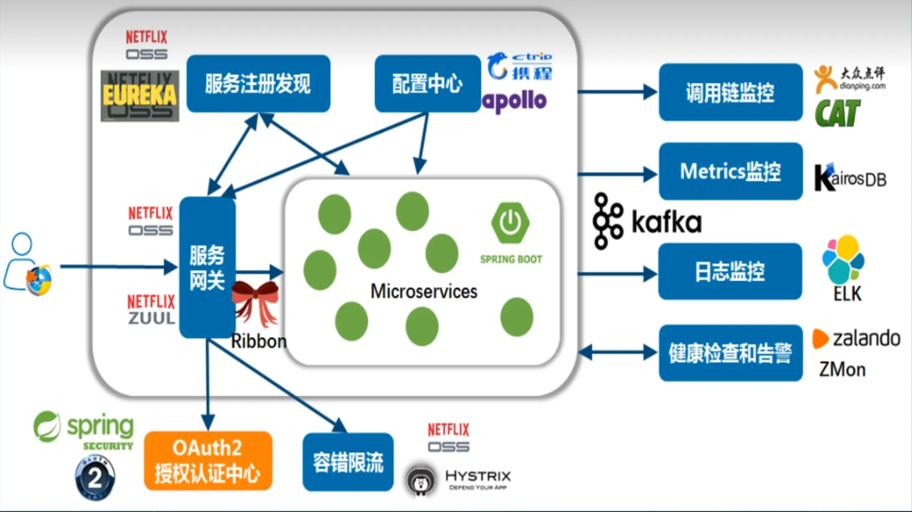

- SpringCloud 2018 年组件

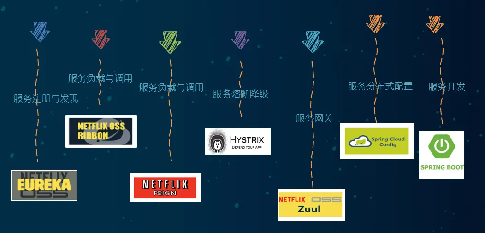

- SpringCloud 移除了 Netflix OOS 体系

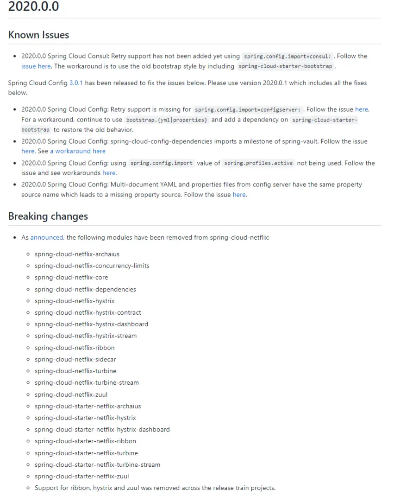

- SpringCloud 2024 年组件

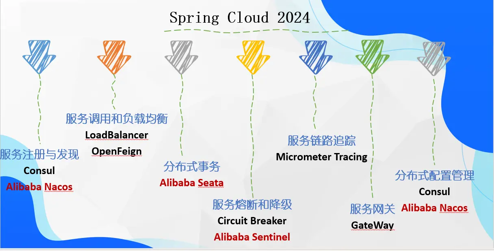

- SpringCloud 组件 Upgrade


## 微服务架构编码 Base 工程模块构建

### 版本选择

- Java：Java17+

- cloud：2023.0.0

- boot：3.2.0

- cloud alibaba：2022.0.0.0-RC2

- Maven：3.9+

- Mysql：8.0+

    [SpringBoot3.0 版本依赖关系](https://github.com/spring-projects/spring-boot/wiki/Spring-Boot-3.0-Release-Notes)

    [Spring Cloud Overview](https://spring.io/projects/spring-cloud#overview)

    [Spring Cloud Alibaba 版本说明](https://github.com/alibaba/spring-cloud-alibaba/wiki/版本说明)

    [Spring Cloud Alibaba 参考文档](https://spring-cloud-alibaba-group.github.io/github-pages/2022/zh-cn/2022.0.0.0-RC2.html)

### 订单-支付业务需求说明

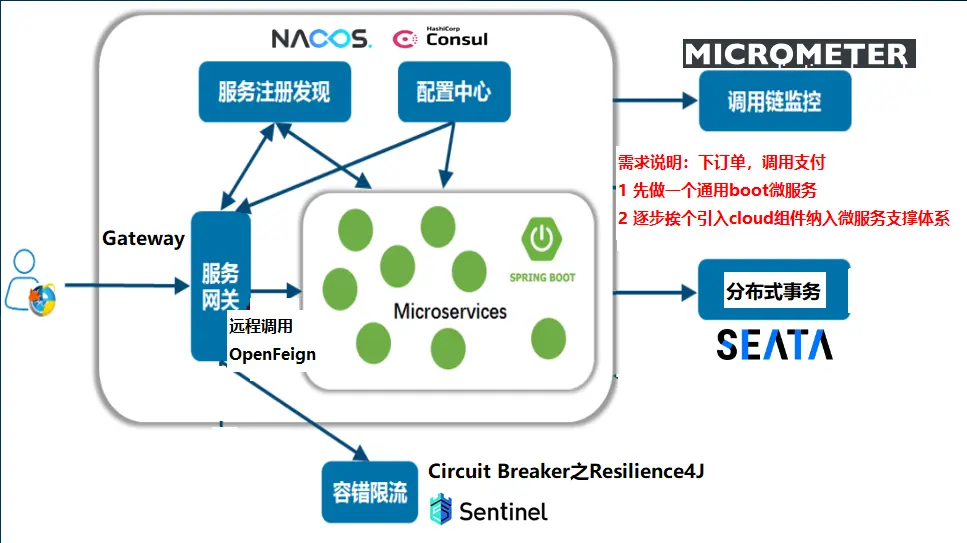

### IDEA 新建 Project 和 Maven 父工程

#### 微服务 Cloud 整体聚合 Maven 父工程 Project

1. New Project

    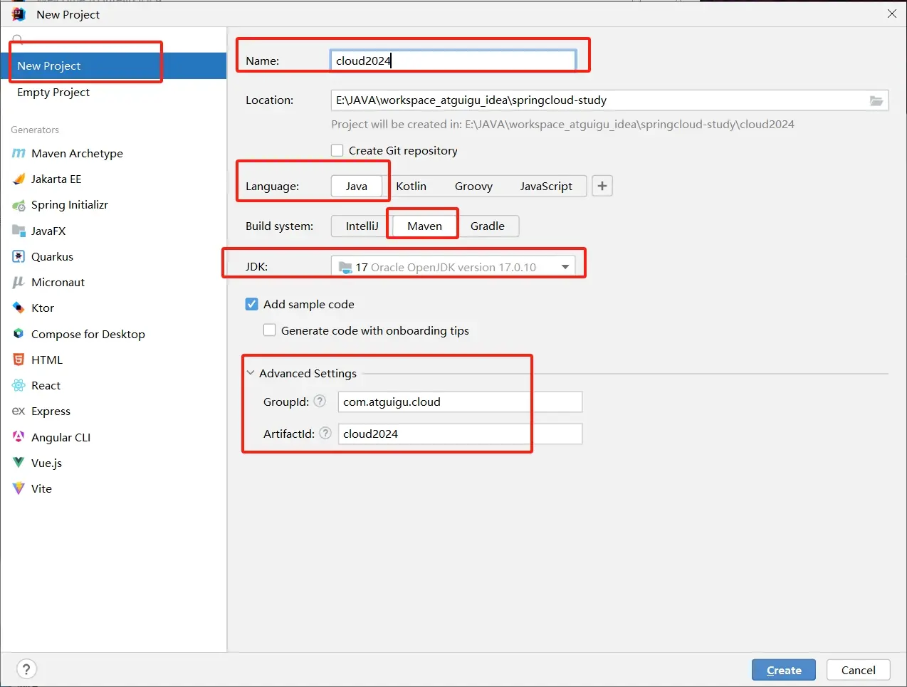

3. 字符编码设置为 UTF-8

    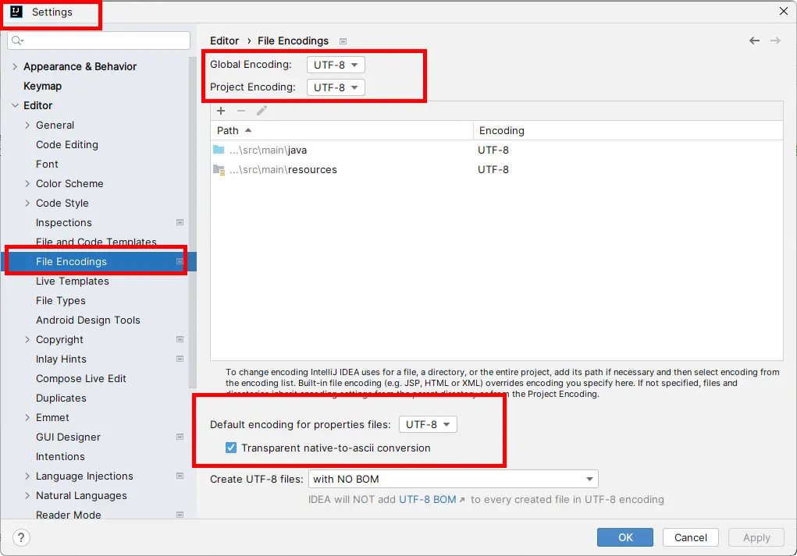

4. 注解生效激活

    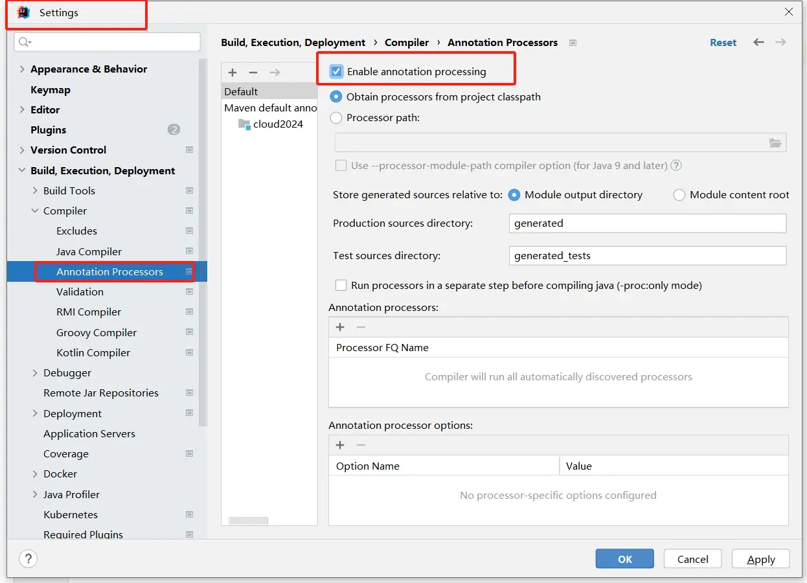

5. Java 编译版本选 17

    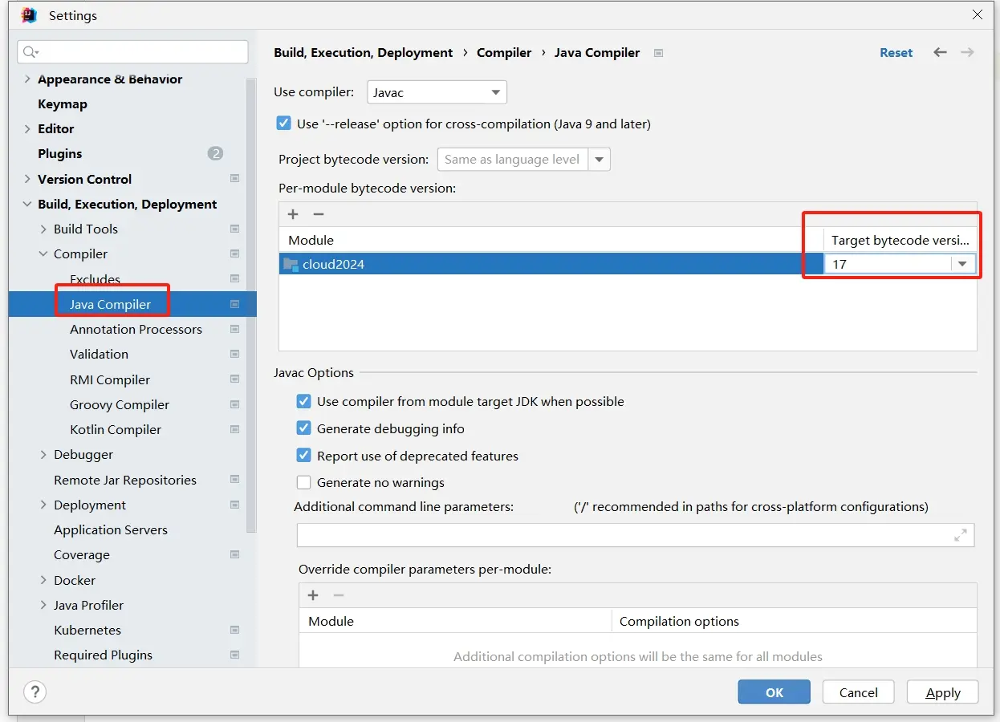

#### 父工程 POM 文件内容

```xml
<?xml version="1.0" encoding="UTF-8"?>
<project xmlns="http://maven.apache.org/POM/4.0.0"
         xmlns:xsi="http://www.w3.org/2001/XMLSchema-instance"
         xsi:schemaLocation="http://maven.apache.org/POM/4.0.0 http://maven.apache.org/xsd/maven-4.0.0.xsd">
    <modelVersion>4.0.0</modelVersion>

    <groupId>com.atguigu.cloud</groupId>
    <artifactId>cloud2024</artifactId>
    <version>1.0-SNAPSHOT</version>
    <packaging>pom</packaging>

    <properties>
        <maven.compiler.source>17</maven.compiler.source>
        <maven.compiler.target>17</maven.compiler.target>
        <project.build.sourceEncoding>UTF-8</project.build.sourceEncoding>
        <hutool.version>5.8.22</hutool.version>
        <lombok.version>1.18.26</lombok.version>
        <druid.version>1.1.20</druid.version>
        <mybatis.springboot.version>3.0.2</mybatis.springboot.version>
        <mysql.version>8.0.11</mysql.version>
        <swagger3.version>2.2.0</swagger3.version>
        <mapper.version>4.2.3</mapper.version>
        <fastjson2.version>2.0.40</fastjson2.version>
        <persistence-api.version>1.0.2</persistence-api.version>
        <spring.boot.test.version>3.1.5</spring.boot.test.version>
        <spring.boot.version>3.2.0</spring.boot.version>
        <spring.cloud.version>2023.0.0</spring.cloud.version>
        <spring.cloud.alibaba.version>2022.0.0.0-RC2</spring.cloud.alibaba.version>
    </properties>

    <dependencyManagement>
        <dependencies>
            <!--springboot 3.2.0-->
            <dependency>
                <groupId>org.springframework.boot</groupId>
                <artifactId>spring-boot-starter-parent</artifactId>
                <version>${spring.boot.version}</version>
                <type>pom</type>
                <scope>import</scope>
            </dependency>
            <!--springcloud 2023.0.0-->
            <dependency>
                <groupId>org.springframework.cloud</groupId>
                <artifactId>spring-cloud-dependencies</artifactId>
                <version>${spring.cloud.version}</version>
                <type>pom</type>
                <scope>import</scope>
            </dependency>
            <!--springcloud alibaba 2022.0.0.0-RC2-->
            <dependency>
                <groupId>com.alibaba.cloud</groupId>
                <artifactId>spring-cloud-alibaba-dependencies</artifactId>
                <version>${spring.cloud.alibaba.version}</version>
                <type>pom</type>
                <scope>import</scope>
            </dependency>
            <!--SpringBoot集成mybatis-->
            <dependency>
                <groupId>org.mybatis.spring.boot</groupId>
                <artifactId>mybatis-spring-boot-starter</artifactId>
                <version>${mybatis.springboot.version}</version>
            </dependency>
            <!--Mysql数据库驱动8 -->
            <dependency>
                <groupId>mysql</groupId>
                <artifactId>mysql-connector-java</artifactId>
                <version>${mysql.version}</version>
            </dependency>
            <!--SpringBoot集成druid连接池-->
            <dependency>
                <groupId>com.alibaba</groupId>
                <artifactId>druid-spring-boot-starter</artifactId>
                <version>${druid.version}</version>
            </dependency>
            <!--通用Mapper4之tk.mybatis-->
            <dependency>
                <groupId>tk.mybatis</groupId>
                <artifactId>mapper</artifactId>
                <version>${mapper.version}</version>
            </dependency>
            <!--persistence-->
            <dependency>
                <groupId>javax.persistence</groupId>
                <artifactId>persistence-api</artifactId>
                <version>${persistence-api.version}</version>
            </dependency>
            <!-- fastjson2 -->
            <dependency>
                <groupId>com.alibaba.fastjson2</groupId>
                <artifactId>fastjson2</artifactId>
                <version>${fastjson2.version}</version>
            </dependency>
            <!-- swagger3 调用方式 http://你的主机IP地址:5555/swagger-ui/index.html -->
            <dependency>
                <groupId>org.springdoc</groupId>
                <artifactId>springdoc-openapi-starter-webmvc-ui</artifactId>
                <version>${swagger3.version}</version>
            </dependency>
            <!--hutool-->
            <dependency>
                <groupId>cn.hutool</groupId>
                <artifactId>hutool-all</artifactId>
                <version>${hutool.version}</version>
            </dependency>
            <!--lombok-->
            <dependency>
                <groupId>org.projectlombok</groupId>
                <artifactId>lombok</artifactId>
                <version>${lombok.version}</version>
                <optional>true</optional>
            </dependency>
            <!-- spring-boot-starter-test -->
            <dependency>
                <groupId>org.springframework.boot</groupId>
                <artifactId>spring-boot-starter-test</artifactId>
                <version>${spring.boot.test.version}</version>
                <scope>test</scope>
            </dependency>
        </dependencies>
    </dependencyManagement>
</project>
```

##### 小细节复习

1. Maven 中的 DependencyManagement 和 Dependencies

    - Maven 使用 dependencyManagement 元素来提供了一种管理依赖版本号的方式。

    - **通常会在一个组织或者项目的最顶层的父 POM 中看到 dependencyManagement 元素**。
    - 使用 pom.xml 中的 dependencyManagement 元素能让所有在子项目中引用一个依赖而不用显式的列出版本号。
    - Maven 会沿着父子层次向上走，直到找到一个拥有 dependencyManagement 元素的项目，然后它就会使用这个 dependencyManagement 元素中指定的版本号。
    - 好处：如果有多个子项目都引用同一样依赖，则可以避免在每个使用的子项目里都声明一个版本号
        - 当想升级或切换到另一个版本时，只需要在顶层父容器里更新，而不需要一个一个子项目的修改 ；
        - 另外如果某个子项目需要另外的一个版本，只需要声明 version 就可。
    - **dependencyManagement 里只是声明依赖，并不实现引入，因此子项目需要显示的声明需要用的依赖**。
    -  如果不在子项目中声明依赖，是不会从父项目中继承下来的，只有在子项目中写了该依赖项并且没有指定具体版本，才会从父项目中继承该项 ，且 version 和 scope 都读取自父 pom。
    - 如果子项目中指定了版本号，那么会使用子项目中指定的 jar 版本。

2. Maven 中跳过单元测试

    - 通过配置

        ```xml
        <build><!-- maven中跳过单元测试 -->
            <plugins>
                <plugin>
                    <groupId>org.apache.maven.plugins</groupId>
                    <artifactId>maven-surefire-plugin</artifactId>
                    <configuration>
                        <skip>true</skip>
                    </configuration>
                </plugin>
            </plugins>
        </build>
        ```

    - IDEA 工具支持（推荐）

        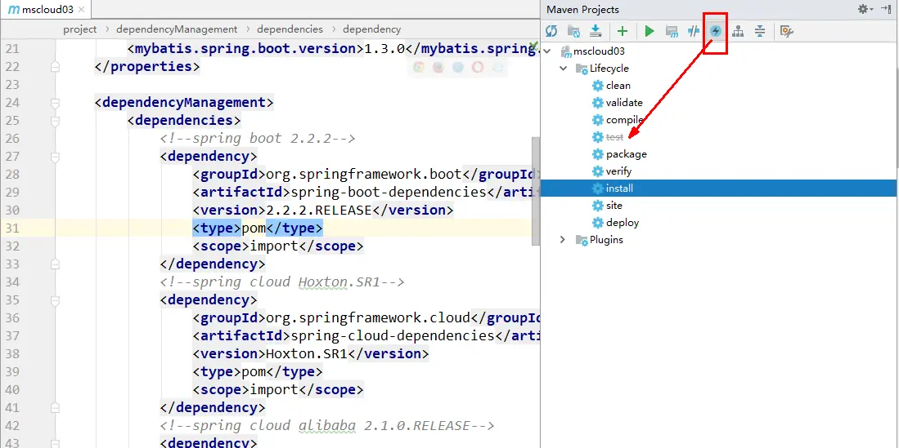

#### Mysql 驱动说明

##### MySQL 5.7

1. application.properties

```properties
# mysql5.7---JDBC四件套
jdbc.driverClass = com.mysql.jdbc.Driver
jdbc.url= jdbc:mysql://localhost:3306/db2024?useUnicode=true&characterEncoding=UTF-8&useSSL=false
jdbc.user = root
jdbc.password =123456
```

2. Maven 的 POM.xml

```xml
<!-- Maven的POM文件处理 -->
<dependency>
    <groupId>mysql</groupId>
    <artifactId>mysql-connector-java</artifactId>
    <version>5.1.47</version>
</dependency>
```

##### MySQL 8.x

1. application.properties

```properties
# mysql8.0---JDBC四件套
jdbc.driverClass = com.mysql.cj.jdbc.Driver
jdbc.url= jdbc:mysql://localhost:3306/db2024?characterEncoding=utf8&useSSL=false&serverTimezone=GMT%2B8&rewriteBatchedStatements=true&allowPublicKeyRetrieval=true
jdbc.user = root
jdbc.password =123456
```

2. Maven 的 POM.xml

```xml
<dependency>
    <groupId>mysql</groupId>
    <artifactId>mysql-connector-java</artifactId>
    <version>8.0.11</version>
</dependency>
```

### Mapper4 之一键生成

#### [mybatis-genetator](https://mybatis.org/generator/)

Mybatis Generator(MBG)是 Mybatis 官方提供的一个代码生成工具，它可以根据数据库表自动生成对应的 Java Model、Mapper 和 XML 文件，甚至还可以生成一些高级查询功能，使用 Mybatis-Generator 可以大大降低开发者的工作量，提高开发效率！

常见的代码生成工具对比见 [Mybatis 代码生成工具比较](https://coderofmutou.github.io/pages/20b7dd/) 或 [Mybatis 代码生成工具比较](https://github.com/coderofmutou/notes/blob/main/02.%E5%BE%AE%E6%9C%8D%E5%8A%A1%E6%A0%B8%E5%BF%83/%E7%9B%B8%E5%85%B3%E7%9F%A5%E8%AF%86/Mybatis%20%E4%BB%A3%E7%A0%81%E7%94%9F%E6%88%90%E5%B7%A5%E5%85%B7%E6%AF%94%E8%BE%83.md)。

#### [MyBatis 通用 Mapper4](https://github.com/abel533/Mapper)

通用 Mapper4 是一个可以实现任意 MyBatis 通用方法的框架，项目提供了常规的增删改查操作以及 Example 相关的单表操作。通用 Mapper 是为了解决 MyBatis 使用中 90% 的基本操作，使用它可以很方便的进行开发，可以节省开发人员大量的时间。

#### 一键生成步骤

1. 新建数据库 db2024 和表 t_pay

```sql
CREATE DATABASE db2024;
USE db2024;
DROP TABLE IF EXISTS `t_pay`;

CREATE TABLE `t_pay` (
	`id` INT (10) UNSIGNED NOT NULL AUTO_INCREMENT,
	`pay_no` VARCHAR (50) NOT NULL COMMENT '支付流水号',
	`order_no` VARCHAR (50) NOT NULL COMMENT '订单流水号',
	`user_id` INT (10) DEFAULT '1' COMMENT '用户账号ID',
	`amount` DECIMAL (8, 2) NOT NULL DEFAULT '9.9' COMMENT '交易金额',
	`deleted` TINYINT (4) UNSIGNED NOT NULL DEFAULT '0' COMMENT '删除标志，默认0不删除，1删除',
	`create_time` TIMESTAMP NOT NULL DEFAULT CURRENT_TIMESTAMP COMMENT '创建时间',
	`update_time` TIMESTAMP NOT NULL DEFAULT CURRENT_TIMESTAMP ON UPDATE CURRENT_TIMESTAMP COMMENT '更新时间',
	PRIMARY KEY (`id`) 
) ENGINE = INNODB AUTO_INCREMENT = 1 DEFAULT CHARSET = utf8mb4 COMMENT = '支付交易表';

INSERT INTO t_pay(pay_no,order_no) VALUES('pay17203699','6544bafb424a');

SELECT * FROM t_pay;
```

2. 新建 Module mybatis_generator2024

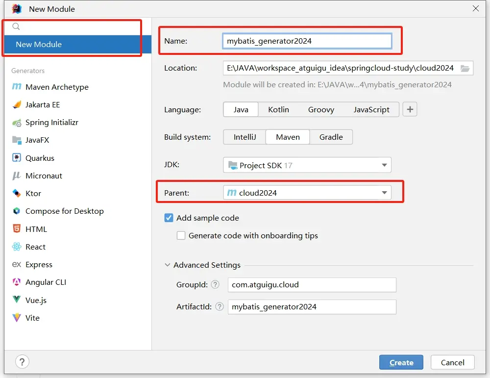

3. POM.xml

```xml
<?xml version="1.0" encoding="UTF-8"?>
<project xmlns="http://maven.apache.org/POM/4.0.0"
         xmlns:xsi="http://www.w3.org/2001/XMLSchema-instance"
         xsi:schemaLocation="http://maven.apache.org/POM/4.0.0 http://maven.apache.org/xsd/maven-4.0.0.xsd">
    <modelVersion>4.0.0</modelVersion>
    <parent>
        <groupId>com.atguigu.cloud</groupId>
        <artifactId>cloud2024</artifactId>
        <version>1.0-SNAPSHOT</version>
    </parent>

    <!--我自己独一份，只是一个普通Maven工程，与boot和cloud无关-->
    <artifactId>mybatis_generator2024</artifactId>

    <properties>
        <maven.compiler.source>17</maven.compiler.source>
        <maven.compiler.target>17</maven.compiler.target>
        <project.build.sourceEncoding>UTF-8</project.build.sourceEncoding>
    </properties>

    <dependencies>
        <!--Mybatis 通用mapper tk单独使用，自己独有+自带版本号-->
        <dependency>
            <groupId>org.mybatis</groupId>
            <artifactId>mybatis</artifactId>
            <version>3.5.13</version>
        </dependency>
        <!-- Mybatis Generator 自己独有+自带版本号-->
        <dependency>
            <groupId>org.mybatis.generator</groupId>
            <artifactId>mybatis-generator-core</artifactId>
            <version>1.4.2</version>
        </dependency>
        <!--通用Mapper-->
        <dependency>
            <groupId>tk.mybatis</groupId>
            <artifactId>mapper</artifactId>
        </dependency>
        <!--mysql8.0-->
        <dependency>
            <groupId>mysql</groupId>
            <artifactId>mysql-connector-java</artifactId>
        </dependency>
        <!--persistence-->
        <dependency>
            <groupId>javax.persistence</groupId>
            <artifactId>persistence-api</artifactId>
        </dependency>
        <!--hutool-->
        <dependency>
            <groupId>cn.hutool</groupId>
            <artifactId>hutool-all</artifactId>
        </dependency>
        <!--lombok-->
        <dependency>
            <groupId>org.projectlombok</groupId>
            <artifactId>lombok</artifactId>
            <optional>true</optional>
        </dependency>
        <dependency>
            <groupId>org.springframework.boot</groupId>
            <artifactId>spring-boot-starter-test</artifactId>
            <scope>test</scope>
            <exclusions>
                <exclusion>
                    <groupId>org.junit.vintage</groupId>
                    <artifactId>junit-vintage-engine</artifactId>
                </exclusion>
            </exclusions>
        </dependency>
    </dependencies>

    <build>
        <resources>
            <resource>
                <directory>${basedir}/src/main/java</directory>
                <includes>
                    <include>**/*.xml</include>
                </includes>
            </resource>
            <resource>
                <directory>${basedir}/src/main/resources</directory>
            </resource>
        </resources>
        <plugins>
            <plugin>
                <groupId>org.springframework.boot</groupId>
                <artifactId>spring-boot-maven-plugin</artifactId>
                <configuration>
                    <excludes>
                        <exclude>
                            <groupId>org.projectlombok</groupId>
                            <artifactId>lombok</artifactId>
                        </exclude>
                    </excludes>
                </configuration>
            </plugin>
            <plugin>
                <groupId>org.mybatis.generator</groupId>
                <artifactId>mybatis-generator-maven-plugin</artifactId>
                <version>1.4.2</version>
                <configuration>
                    <configurationFile>${basedir}/src/main/resources/generatorConfig.xml</configurationFile>
                    <overwrite>true</overwrite>
                    <verbose>true</verbose>
                </configuration>
                <dependencies>
                    <dependency>
                        <groupId>mysql</groupId>
                        <artifactId>mysql-connector-java</artifactId>
                        <version>8.0.33</version>
                    </dependency>
                    <dependency>
                        <groupId>tk.mybatis</groupId>
                        <artifactId>mapper</artifactId>
                        <version>4.2.3</version>
                    </dependency>
                </dependencies>
            </plugin>
        </plugins>
    </build>

</project>
```

4. 配置

src\main\resources 路径下新建配置文件

- config.properties
    - MySQL 5.7

        ```properties
        #User表包名
        package.name=com.atguigu.cloud
        # mysql5.7
        jdbc.driverClass = com.mysql.jdbc.Driver
        jdbc.url= jdbc:mysql://localhost:3306/db2024?useUnicode=true&characterEncoding=UTF-8&useSSL=false
        jdbc.user = root
        jdbc.password =123456
        ```

    - MySQL 8.x
    
        ```properties
        #t_pay表包名
        package.name=com.atguigu.cloud
        
        # mysql8.0
        jdbc.driverClass = com.mysql.cj.jdbc.Driver
        jdbc.url= jdbc:mysql://localhost:3306/db2024?characterEncoding=utf8&useSSL=false&serverTimezone=GMT%2B8&rewriteBatchedStatements=true&allowPublicKeyRetrieval=true
        jdbc.user = root
        jdbc.password =123456
        ```
    
- generatorConfig.xml

```XML
<?xml version="1.0" encoding="UTF-8"?>
<!DOCTYPE generatorConfiguration
        PUBLIC "-//mybatis.org//DTD MyBatis Generator Configuration 1.0//EN"
        "http://mybatis.org/dtd/mybatis-generator-config_1_0.dtd">

<generatorConfiguration>
    <properties resource="config.properties"/>

    <context id="Mysql" targetRuntime="MyBatis3Simple" defaultModelType="flat">
        <property name="beginningDelimiter" value="`"/>
        <property name="endingDelimiter" value="`"/>

        <plugin type="tk.mybatis.mapper.generator.MapperPlugin">
            <property name="mappers" value="tk.mybatis.mapper.common.Mapper"/>
            <property name="caseSensitive" value="true"/>
        </plugin>

        <jdbcConnection driverClass="${jdbc.driverClass}"
                        connectionURL="${jdbc.url}"
                        userId="${jdbc.user}"
                        password="${jdbc.password}">
        </jdbcConnection>

        <javaModelGenerator targetPackage="${package.name}.entities" targetProject="src/main/java"/>

        <sqlMapGenerator targetPackage="${package.name}.mapper" targetProject="src/main/java"/>

        <javaClientGenerator targetPackage="${package.name}.mapper" targetProject="src/main/java" type="XMLMAPPER"/>

        <table tableName="t_pay" domainObjectName="Pay">
            <generatedKey column="id" sqlStatement="JDBC"/>
        </table>
    </context>
</generatorConfiguration>
```

5. 一键生成

双击插件 mybatis-generator:gererate，一键生成 entity + mapper 接口 + xml 实现 SQL

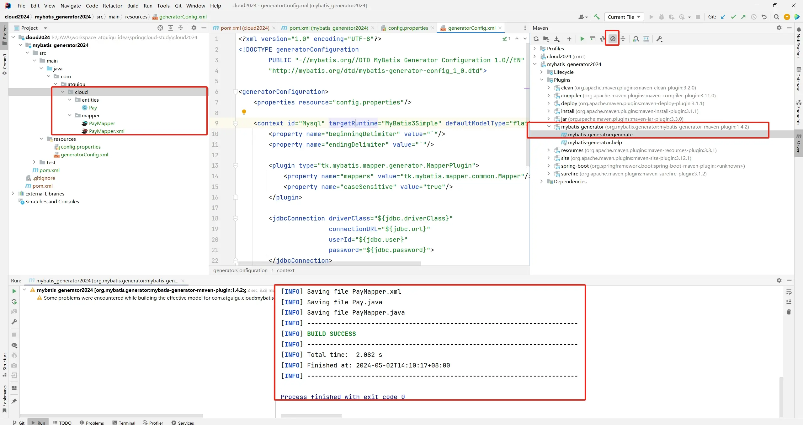

### Rest 通用 Base 工程构建

#### 工程 V1 cloud-provider-payment8001 微服务提供者支付 Module 模块

##### 微服务小口诀

1. 建 module
2. 改 POM
3. 写 YML
4. 主启动
5. 业务类

##### 步骤

###### 建 module cloud-provider-payment8001

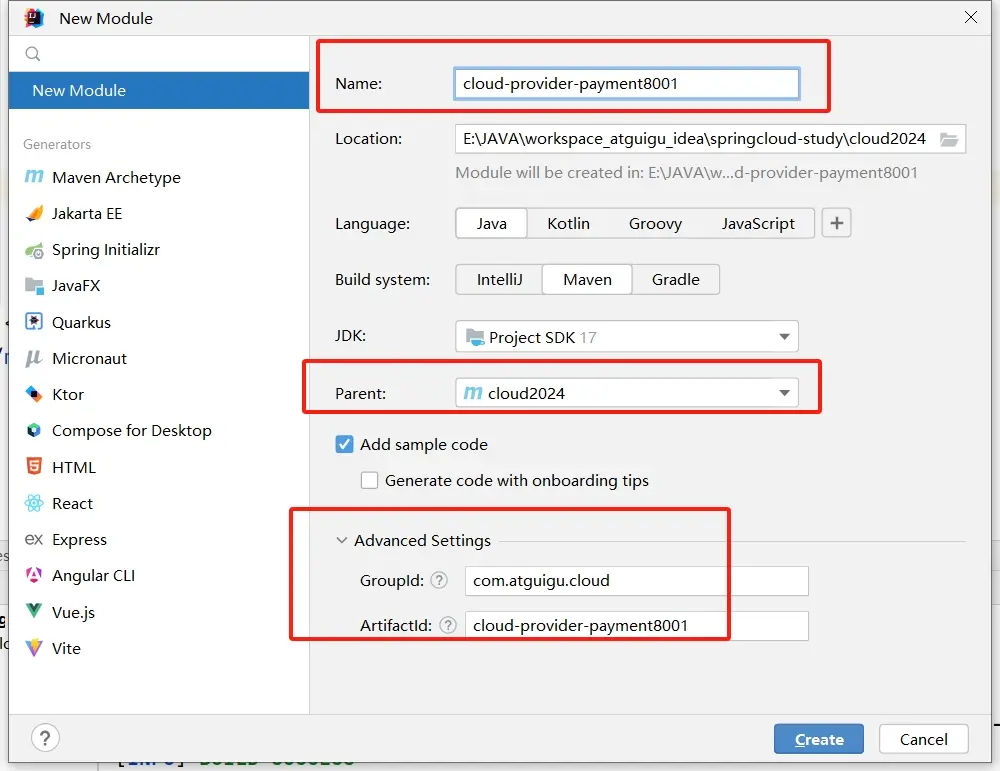

###### 改 POM

```xml
<?xml version="1.0" encoding="UTF-8"?>
<project xmlns="http://maven.apache.org/POM/4.0.0"
         xmlns:xsi="http://www.w3.org/2001/XMLSchema-instance"
         xsi:schemaLocation="http://maven.apache.org/POM/4.0.0 http://maven.apache.org/xsd/maven-4.0.0.xsd">
    <modelVersion>4.0.0</modelVersion>
    <parent>
        <groupId>com.atguigu.cloud</groupId>
        <artifactId>cloud2024</artifactId>
        <version>1.0-SNAPSHOT</version>
    </parent>

    <artifactId>cloud-provider-payment8001</artifactId>

    <properties>
        <maven.compiler.source>17</maven.compiler.source>
        <maven.compiler.target>17</maven.compiler.target>
        <project.build.sourceEncoding>UTF-8</project.build.sourceEncoding>
    </properties>

    <dependencies>
        <!--SpringBoot通用依赖模块-->
        <dependency>
            <groupId>org.springframework.boot</groupId>
            <artifactId>spring-boot-starter-web</artifactId>
        </dependency>
        <dependency>
            <groupId>org.springframework.boot</groupId>
            <artifactId>spring-boot-starter-actuator</artifactId>
        </dependency>
        <!--SpringBoot集成druid连接池-->
        <dependency>
            <groupId>com.alibaba</groupId>
            <artifactId>druid-spring-boot-starter</artifactId>
        </dependency>
        <!-- Swagger3 调用方式 http://你的主机IP地址:5555/swagger-ui/index.html -->
        <dependency>
            <groupId>org.springdoc</groupId>
            <artifactId>springdoc-openapi-starter-webmvc-ui</artifactId>
        </dependency>
        <!--mybatis和springboot整合-->
        <dependency>
            <groupId>org.mybatis.spring.boot</groupId>
            <artifactId>mybatis-spring-boot-starter</artifactId>
        </dependency>
        <!--Mysql数据库驱动8 -->
        <dependency>
            <groupId>mysql</groupId>
            <artifactId>mysql-connector-java</artifactId>
        </dependency>
        <!--persistence-->
        <dependency>
            <groupId>javax.persistence</groupId>
            <artifactId>persistence-api</artifactId>
        </dependency>
        <!--通用Mapper4-->
        <dependency>
            <groupId>tk.mybatis</groupId>
            <artifactId>mapper</artifactId>
        </dependency>
        <!--hutool-->
        <dependency>
            <groupId>cn.hutool</groupId>
            <artifactId>hutool-all</artifactId>
        </dependency>
        <!-- fastjson2 -->
        <dependency>
            <groupId>com.alibaba.fastjson2</groupId>
            <artifactId>fastjson2</artifactId>
        </dependency>
        <!--lombok-->
        <dependency>
            <groupId>org.projectlombok</groupId>
            <artifactId>lombok</artifactId>
            <version>1.18.28</version>
            <scope>provided</scope>
        </dependency>
        <!--test-->
        <dependency>
            <groupId>org.springframework.boot</groupId>
            <artifactId>spring-boot-starter-test</artifactId>
            <scope>test</scope>
        </dependency>
    </dependencies>

    <build>
        <plugins>
            <plugin>
                <groupId>org.springframework.boot</groupId>
                <artifactId>spring-boot-maven-plugin</artifactId>
            </plugin>
        </plugins>
    </build>

</project>
```

###### 写 YML application.yml

```yml
server:
  port: 8001

# ==========applicationName + druid-mysql8 driver===================
spring:
  application:
    name: cloud-payment-service

  datasource:
    type: com.alibaba.druid.pool.DruidDataSource
    driver-class-name: com.mysql.cj.jdbc.Driver
    url: jdbc:mysql://localhost:3306/db2024?characterEncoding=utf8&useSSL=false&serverTimezone=GMT%2B8&rewriteBatchedStatements=true&allowPublicKeyRetrieval=true
    username: root
    password: 123456

# ========================mybatis===================
mybatis:
  mapper-locations: classpath:mapper/*.xml
  type-aliases-package: com.atguigu.cloud.entities
  configuration:
    map-underscore-to-camel-case: true
```

###### 主启动（修改 Main 类名为 Main8001）

```java
package com.atguigu.cloud;

@SpringBootApplication
@MapperScan("com.atguigu.cloud.mapper") //import tk.mybatis.spring.annotation.MapperScan;
public class Main8001 {
    public static void main(String[] args) {
        SpringApplication.run(Main8001.class,args);
    }
}
```

###### 业务类

1. 将之前一键生成的代码直接拷贝进 8001 模块

    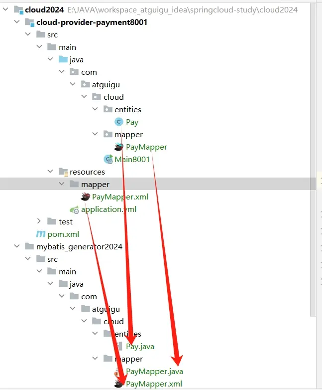

2. entities

    - Pay.java（粘贴一键生成的代码）

    - PayDTO.java

    ```java
    package com.atguigu.cloud.entities;
    
    @Data
    @AllArgsConstructor
    @NoArgsConstructor
    public class PayDTO implements Serializable {
        private Integer id;
        //支付流水号
        private String payNo;
        //订单流水号
        private String orderNo;
        //用户账号ID
        private Integer userId;
        //交易金额
        private BigDecimal amount;
    }
    ```
    
3. mapper

    - Mapper 接口 PayMapper（粘贴一键生成的代码）
    - 映射文件 PayMapper.xml（粘贴一键生成的代码到 src\main\resources\mapper 文件夹）

4. service

    - 服务接口 PayService

        ```java
        package com.atguigu.cloud.service;
        
        public interface PayService {
            int add(Pay pay);
        
            int delete(Integer id);
        
            int update(Pay pay);
        
            Pay getById(Integer id);
        
            public List<Pay> getAll();
        }
        ```
        
    - 实现类 PayServiceImpl
    
        ```java
        package com.atguigu.cloud.service.impl;
        
        @Service
        public class PayServiceImpl implements PayService {
            @Resource
            private PayMapper payMapper;
        
            @Override
            public int add(Pay pay) {
                return payMapper.insertSelective(pay);
            }
        
            @Override
            public int delete(Integer id) {
                return payMapper.deleteByPrimaryKey(id);
            }
        
            @Override
            public int update(Pay pay) {
                return payMapper.updateByPrimaryKeySelective(pay);
            }
        
            @Override
            public Pay getById(Integer id) {
                return payMapper.selectByPrimaryKey(id);
            }
        
            @Override
            public List<Pay> getAll() {
                return payMapper.selectAll();
            }
        }
        ```
    
5. controller

    - PayController

        ```java
        package com.atguigu.cloud.controller;
        
        @RestController
        @Slf4j
        public class PayController {
            @Resource
            private PayService payService;
        
            @PostMapping(value = "/pay/add")
            public String addPay(@RequestBody Pay pay) {
                log.info(pay.toString());
                int i = payService.add(pay);
                return "成功插入记录，返回值：" + i;
            }
        
            @DeleteMapping(value = "/pay/del/{id}")
            public Integer deletePay(@PathVariable("id") Integer id) {
                return payService.delete(id);
            }
        
            @PutMapping(value = "/pay/update")
            public String updatePay(@RequestBody PayDTO payDTO) {
                Pay pay = new Pay();
                BeanUtils.copyProperties(payDTO, pay);
        
                int i = payService.update(pay);
                return "成功修改记录，返回值：" + i;
            }
        
            @GetMapping("/pay/get/{id}")
            public Pay getById(@PathVariable("id") Integer id) {
                return payService.getById(id);
            }
        
            @GetMapping("/pay/getAll")
            public List<Pay> getAll() {
                return payService.getAll();
            }
        }
        ```

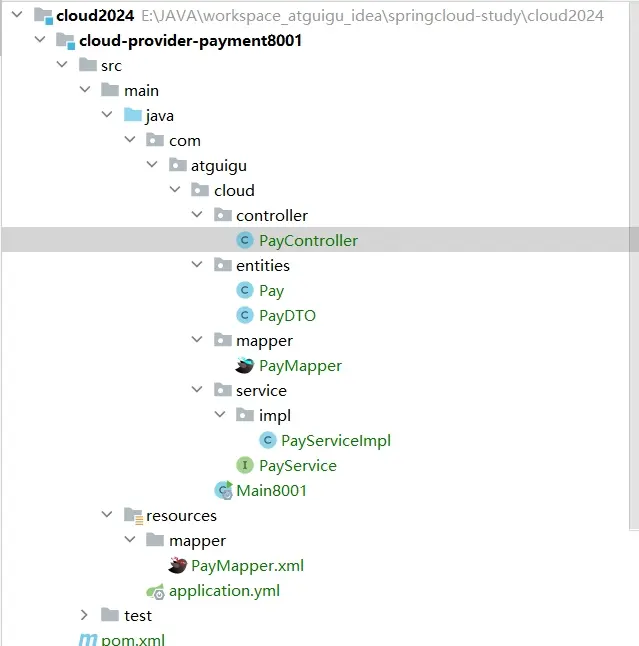

##### 测试

###### PostMan

- add

    ```shell
    curl --location --request POST 'http://localhost:8001/pay/add' \
    --header 'Content-Type: application/json' \
    --data-raw '{
        "payNo": "17204076",
        "orderNo": "6544de1c424a",
        "userId": "2",
        "amount": "19.90"
    }'
    ```

- delete

    ```shell
    curl --location --request DELETE 'http://localhost:8001/pay/del/3'
    ```

- update

    ```shell
    curl --location --request PUT 'http://localhost:8001/pay/update' \
    --header 'Content-Type: application/json' \
    --data-raw '{
        "id": 2,
        "payNo": "17204076update",
        "orderNo": "6544de1c424aupdate",
        "userId": 2,
        "amount": 199.90
    }'
    ```

- select

    ```shell
    curl --location --request GET 'http://localhost:8001/pay/get/2'
    ```

- select all

    ```shell
    curl --location --request GET 'http://localhost:8001/pay/getAll'
    ```

###### Swagger3

1. 常用注解

    - 注解列表

    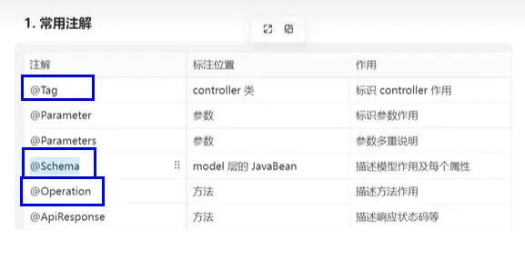

    - Controller

        ```java
        package com.atguigu.cloud.controller;
        
        @RestController
        @Slf4j
        @Tag(name = "支付微服务模块",description = "支付CRUD")
        public class PayController {
            @Resource
            private PayService payService;
        
            @PostMapping(value = "/pay/add")
            @Operation(summary = "新增",description = "新增支付流水方法,json串做参数")
            public String addPay(@RequestBody Pay pay) {
                log.info(pay.toString());
                int i = payService.add(pay);
                return "成功插入记录，返回值：" + i;
            }
        
            @DeleteMapping(value = "/pay/del/{id}")
            @Operation(summary = "删除",description = "删除支付流水方法")
            public Integer deletePay(@PathVariable("id") Integer id) {
                return payService.delete(id);
            }
        
            @PutMapping(value = "/pay/update")
            @Operation(summary = "修改",description = "修改支付流水方法")
            public String updatePay(@RequestBody PayDTO payDTO) {
                Pay pay = new Pay();
                BeanUtils.copyProperties(payDTO, pay);
        
                int i = payService.update(pay);
                return "成功修改记录，返回值：" + i;
            }
        
            @GetMapping("/pay/get/{id}")
            @Operation(summary = "按照ID查流水",description = "查询支付流水方法")
            public Pay getById(@PathVariable("id") Integer id) {
                return payService.getById(id);
            }
        
            @GetMapping("/pay/getAll")
            @Operation(summary = "查所有流水",description = "查询所有支付流水方法")
            public List<Pay> getAll() {
                return payService.getAll();
            }
        }
        ```
        
    - entity 或者 DTO
    
        ```java
        package com.atguigu.cloud.entities;
        
        /**
         * 表名：t_pay
         * 表注释：支付交易表
         */
        @Table(name = "t_pay")
        @Data
        @Schema(title = "支付交易表Entity")
        public class Pay {
            @Id
            @GeneratedValue(generator = "JDBC")
            @Schema(title = "主键")
            private Integer id;
        
            /**
             * 支付流水号
             */
            @Column(name = "pay_no")
            @Schema(title = "支付流水号")
            private String payNo;
        
            /**
             * 订单流水号
             */
            @Column(name = "order_no")
            @Schema(title = "订单流水号")
            private String orderNo;
        
            /**
             * 用户账号ID
             */
            @Column(name = "user_id")
            @Schema(title = "用户账号ID")
            private Integer userId;
        
            /**
             * 交易金额
             */
            @Schema(title = "交易金额")
            private BigDecimal amount;
        
            /**
             * 删除标志，默认0不删除，1删除
             */
            @Schema(title = "删除标志")
            private Byte deleted;
        
            /**
             * 创建时间
             */
            @Column(name = "create_time")
            @Schema(title = "创建时间")
            private Date createTime;
        
            /**
             * 更新时间
             */
            @Column(name = "update_time")
            @Schema(title = "更新时间")
            private Date updateTime;
        }
        ```
    
2. 含分组迭代的 Config 配置类

    ```java
    package com.atguigu.cloud.config;
    
    @Configuration
    public class Swagger3Config
    {
        @Bean
        public GroupedOpenApi PayApi() {
            return GroupedOpenApi.builder().group("支付微服务模块").pathsToMatch("/pay/**").build();
        }
        @Bean
        public GroupedOpenApi OtherApi() {
            return GroupedOpenApi.builder().group("其它微服务模块").pathsToMatch("/other/**", "/others").build();
        }
        /*@Bean
        public GroupedOpenApi CustomerApi() {
            return GroupedOpenApi.builder().group("客户微服务模块").pathsToMatch("/customer/**", "/customers").build();
        }*/
    
        @Bean
        public OpenAPI docsOpenApi() {
            return new OpenAPI()
                    .info(new Info().title("cloud2024")
                            .description("通用设计rest")
                            .version("v1.0"))
                    .externalDocs(new ExternalDocumentation()
                            .description("www.atguigu.com")
                            .url("https://yiyan.baidu.com/"));
        }
    }
    ```
    
3. 调用方式

    http://localhost:8001/swagger-ui/index.html

    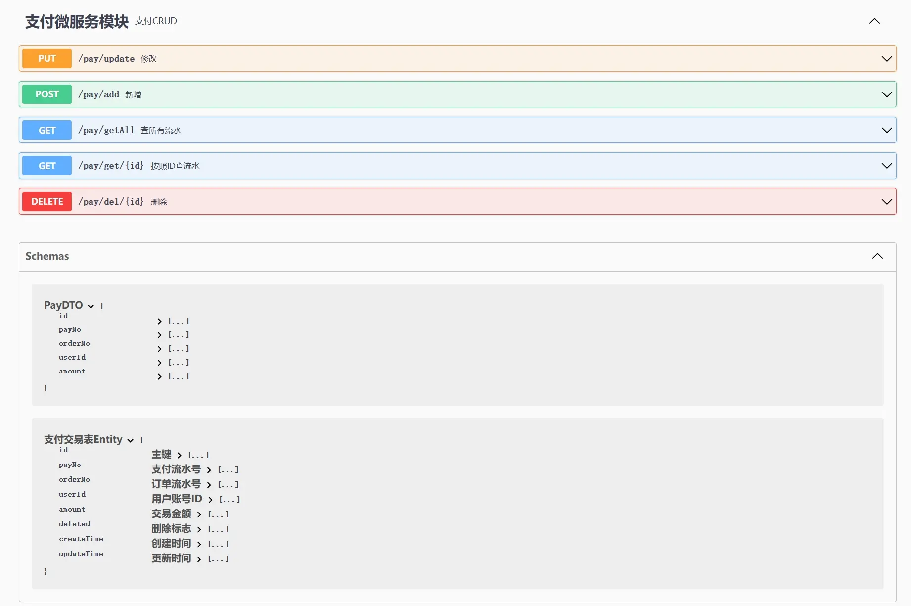

#### 上述模块还有那些问题

1. 时间格式问题：时间日志格式的统一和定制情况
2. Java 如何设计 API 接口实现统一格式返回？影响前端/小程序/app 等交互体验和开发
3. 全局异常接入返回的标准格式：全局异常接入返回的标准格式
4. ...

#### 工程 V2 cloud-provider-payment8001 微服务提供者支付 Module 模块 V2 改进版++

##### 解决：时间格式问题

方式一：可以在相应的类的属性上使用 @JsonFormat 注解

```java
/**
* 创建时间
*/
@Column(name = "create_time")
@Schema(title = "创建时间")
@JsonFormat(pattern = "yyyy-MM-dd HH:mm:ss", timezone = "GMT+8")
private Date createTime;

/**
* 更新时间
*/
@Column(name = "update_time")
@Schema(title = "更新时间")
@JsonFormat(pattern = "yyyy-MM-dd HH:mm:ss", timezone = "GMT+8")
private Date updateTime;
```

方式二：如果是 Spring Boot 项目，也可以在 application.yml 文件中指定

```yml
spring:
  jackson:
    date-format: yyyy-MM-dd HH:mm:ss
    time-zone: GMT+8
```

##### 解决：统一返回值

###### HTTP 请求返回的状态码

| 分类 | 类别                             | 分类描述                                       |
| :--- | -------------------------------- | :--------------------------------------------- |
| 1XX  | Informational（信息性状态码）    | 信息，服务器收到请求，需要请求者继续执行操作   |
| 2XX  | Success（成功状态码）            | 成功，操作被成功接收并处理                     |
| 3XX  | Redirection（重定向）            | 重定向，需要进一步的操作以完成请求             |
| 4XX  | Client Error（客户端错误状态码） | 客户端错误，请求包含语法错误或无法完成请求     |
| 5XX  | Server Error（服务器错误状态码） | 服务器错误，服务器在处理请求的过程中发生了错误 |

[一文牢记 HTTP 状态码（图解 HTTP 状态码）](https://cloud.tencent.com/developer/article/1688459)

[HTTP 状态码 | 菜鸟教程](https://www.runoob.com/http/http-status-codes.html)

###### 思路

1. 定义返回标准格式，3 大标配
    - **code 状态值**：由后端统一定义各种返回结果的状态码
    - **message 描述**：本次接口调用的结果描述
    - **data 数据**：本次返回的数据
2. 扩展
    - 接口调用时间之类
        -  **timestamp**: 接口调用时间

###### 步骤

1. 新建枚举类 **ReturnCodeEnum**

    ```java
    package com.atguigu.cloud.resp;
    
    @Getter
    public enum ReturnCodeEnum {
        // 1. 举值
        /**操作失败**/
        RC999("999","操作XXX失败"),
        /**操作成功**/
        RC200("200","success"),
        /**服务降级**/
        RC201("201","服务开启降级保护,请稍后再试!"),
        /**热点参数限流**/
        RC202("202","热点参数限流,请稍后再试!"),
        /**系统规则不满足**/
        RC203("203","系统规则不满足要求,请稍后再试!"),
        /**授权规则不通过**/
        RC204("204","授权规则不通过,请稍后再试!"),
        /**access_denied**/
        RC403("403","无访问权限,请联系管理员授予权限"),
        /**access_denied**/
        RC401("401","匿名用户访问无权限资源时的异常"),
        RC404("404","404页面找不到的异常"),
        /**服务异常**/
        RC500("500","系统异常，请稍后重试"),
        RC375("375","数学运算异常，请稍后重试"),
    
        INVALID_TOKEN("2001","访问令牌不合法"),
        ACCESS_DENIED("2003","没有权限访问该资源"),
        CLIENT_AUTHENTICATION_FAILED("1001","客户端认证失败"),
        USERNAME_OR_PASSWORD_ERROR("1002","用户名或密码错误"),
        BUSINESS_ERROR("1004","业务逻辑异常"),
        UNSUPPORTED_GRANT_TYPE("1003", "不支持的认证模式");
    
        // 如何定义一个通用的枚举类：举值-构造-遍历
        // 2. 构造
        /**自定义状态码**/
        private final String code;
        /**自定义描述**/
        private final String message;
    
        ReturnCodeEnum(String code, String message){
            this.code = code;
            this.message = message;
        }
    
        // 3. 遍历
        // 3.1 传统版
        public static ReturnCodeEnum getReturnCodeEnumV1(String code) {
            for (ReturnCodeEnum element : ReturnCodeEnum.values()) {
                if(element.getCode().equalsIgnoreCase(code)) {
                    return element;
                }
            }
            return null;
        }
    
        // 3.2 Stream流式计算版
        public static ReturnCodeEnum getReturnCodeEnumV2(String code) {
            return Arrays.stream(ReturnCodeEnum.values())
                    .filter(x -> x.getCode().equalsIgnoreCase(code))
                    .findFirst()
                    .orElse(null);
        }
    
        public static void main(String[] args) {
            System.out.println(getReturnCodeEnumV1("200"));
            System.out.println(getReturnCodeEnumV1("200").getCode());
            System.out.println(getReturnCodeEnumV1("200").getMessage());
    
            System.out.println(getReturnCodeEnumV2("404"));
            System.out.println(getReturnCodeEnumV2("404").getCode());
            System.out.println(getReturnCodeEnumV2("404").getMessage());
        }
    }
    ```
    
2. 新建统一定义返回对象 **ResultData**

    ```java
    package com.atguigu.cloud.resp;
    
    @Data
    @Accessors(chain = true) // 不写默认为false，当该值为 true 时，对应字段的 setter 方法调用后，会返回当前对象。
    public class ResultData<T> {
        /**
         * 结果状态 ,具体状态码参见枚举类ReturnCodeEnum.java
         */
        private String code;
        private String message;
        private T data;
        private long timestamp;
    
        public ResultData() {
            this.timestamp = System.currentTimeMillis();
        }
    
        public static <T> ResultData<T> success(T data) {
            ResultData<T> resultData = new ResultData<>();
            resultData.setCode(ReturnCodeEnum.RC200.getCode());
            resultData.setMessage(ReturnCodeEnum.RC200.getMessage());
            resultData.setData(data);
            return resultData;
        }
    
        public static <T> ResultData<T> fail(String code, String message) {
            ResultData<T> resultData = new ResultData<>();
            resultData.setCode(code);
            resultData.setMessage(message);
            return resultData;
        }
    }
    ```

###### 修改 PayController

```java
package com.atguigu.cloud.controller;

@RestController
@Slf4j
@Tag(name = "支付微服务模块",description = "支付CRUD")
public class PayController {
    @Resource
    private PayService payService;

    @PostMapping(value = "/pay/add")
    @Operation(summary = "新增",description = "新增支付流水方法,json串做参数")
    public ResultData<String> addPay(@RequestBody Pay pay) {
        log.info(pay.toString());
        int i = payService.add(pay);
        return ResultData.success("成功插入记录，返回值：" + i);
    }

    @DeleteMapping(value = "/pay/del/{id}")
    @Operation(summary = "删除",description = "删除支付流水方法")
    public ResultData<Integer> deletePay(@PathVariable("id") Integer id) {
        int i =  payService.delete(id);
        return ResultData.success(i);
    }

    @PutMapping(value = "/pay/update")
    @Operation(summary = "修改",description = "修改支付流水方法")
    public ResultData<String> updatePay(@RequestBody PayDTO payDTO) {
        Pay pay = new Pay();
        BeanUtils.copyProperties(payDTO, pay);

        int i = payService.update(pay);
        return ResultData.success("成功修改记录，返回值：" + i);
    }

    @GetMapping("/pay/get/{id}")
    @Operation(summary = "按照ID查流水",description = "查询支付流水方法")
    public ResultData<Pay> getById(@PathVariable("id") Integer id) {
        Pay pay = payService.getById(id);
        return ResultData.success(pay);
    }

    @GetMapping("/pay/getAll")
    @Operation(summary = "查所有流水",description = "查询所有支付流水方法")
    public ResultData<List<Pay>> getAll() {
        List<Pay> payList = payService.getAll();
        return ResultData.success(payList);
    }
}
```

###### 测试

```shell
curl --location --request POST 'http://localhost:8001/pay/add' \
--header 'Content-Type: application/json' \
--data-raw '{
    "payNo": "paystringret",
    "orderNo": "6544de1c424aret",
    "userId": "1",
    "amount": "119.90"
}'
```

###### 结论

通过 ResultData.success() 对返回结果进行包装后返回给前端

###### 如果某个方法有 bug

```java
@GetMapping("/pay/get/{id}")
@Operation(summary = "按照ID查流水",description = "查询支付流水方法")
public ResultData<Pay> getById(@PathVariable("id") Integer id) {
    if(id == -4) throw new RuntimeException("id不能为负数");
    Pay pay = payService.getById(id);
    return ResultData.success(pay);
}
```

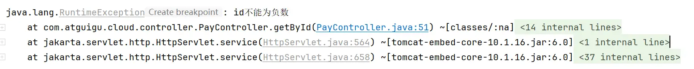

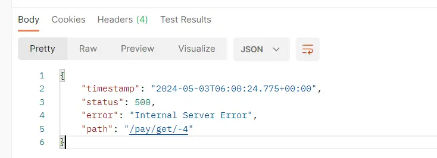

##### 解决：全局异常接入返回的标准格式

###### 为什么需要全局异常处理器

- 不用再手写 try。。。catch。
- 当然，如果非要 trycf 也是可以的。

###### 新建全局异常类 GlobalExceptionHandler

```java
package com.atguigu.cloud.exp;

@Slf4j
@RestControllerAdvice
public class GlobalExceptionHandler {
    @ExceptionHandler(RuntimeException.class)
    @ResponseStatus(HttpStatus.INTERNAL_SERVER_ERROR)
    public ResultData<String> exception(Exception e) {
        System.out.println("####come in GlobalExceptionHandler");
        log.error("全局异常信息:{}", e.getMessage(), e);
        return ResultData.fail(ReturnCodeEnum.RC500.getCode(), e.getMessage());
    }
}
```

`@RestControllerAdvice` 注解：

- 是什么

    - `@RestControllerAdvice` 是一个组合注解，由 `@ControllerAdvice`、`@ResponseBody` 组成；

    - 而 `@ControllerAdvice` 继承了 `@Component`，因此`@RestControllerAdvice` 本质上是个 Component，用于定义 `@ExceptionHandler`，`@InitBinder` 和 `@ModelAttribute` 方法，适用于所有使用 `@RequestMapping` 方法。

- 特点

    - 通过 `@ControllerAdvice` 注解可以将对于控制器的全局配置放在同一个位置。
    - 注解了 `@RestControllerAdvice` 的类的方法可以使用 `@ExceptionHandler`、`@InitBinder`、`@ModelAttribute` 注解到方法上。
        - `@ExceptionHandler`：用于指定异常处理方法。当与 `@RestControllerAdvice` 配合使用时，用于全局处理控制器里的异常。
        - `@InitBinder`：用来设置 WebDataBinder，用于自动绑定前台请求参数到 Model 中。
        - `@ModelAttribute`：本来作用是绑定键值对到 Model 中，当与 `@ControllerAdvice` 配合使用时，可以让全局的 `@RequestMapping` 都能获得在此处设置的键值对。
    - `@RestControllerAdvice` 注解将作用在所有注解了 `@RequestMapping` 的控制器的方法上。

###### 修改 Controller

```java
@GetMapping(value = "/pay/error")
public ResultData<Integer> getPayError() {
    Integer integer = Integer.valueOf(200);

    try {
        System.out.println("come in payerror test");
        int age = 10 / 0;
    } catch (Exception e) {
        e.printStackTrace();
        return ResultData.fail(ReturnCodeEnum.RC500.getCode(), e.getMessage());
    }
    return ResultData.success(integer);
}
```

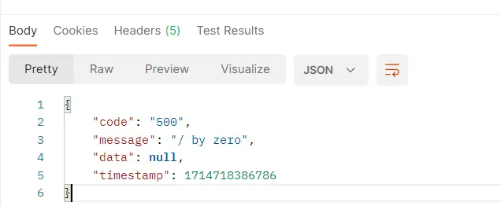

#### 目前工程目录结构

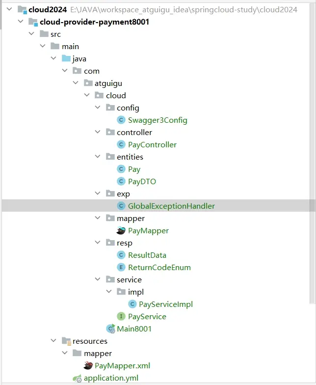

### 引入微服务理念，从这里开始

#### cloud-consumer-order80 微服务调用者订单 Module 模块

##### 建 cloud-consumer-order80

##### 改 POM

```xml
<?xml version="1.0" encoding="UTF-8"?>
<project xmlns="http://maven.apache.org/POM/4.0.0"
         xmlns:xsi="http://www.w3.org/2001/XMLSchema-instance"
         xsi:schemaLocation="http://maven.apache.org/POM/4.0.0 http://maven.apache.org/xsd/maven-4.0.0.xsd">
    <modelVersion>4.0.0</modelVersion>
    <parent>
        <groupId>com.atguigu.cloud</groupId>
        <artifactId>cloud2024</artifactId>
        <version>1.0-SNAPSHOT</version>
    </parent>

    <artifactId>cloud-consumer-order80</artifactId>

    <properties>
        <maven.compiler.source>17</maven.compiler.source>
        <maven.compiler.target>17</maven.compiler.target>
        <project.build.sourceEncoding>UTF-8</project.build.sourceEncoding>
    </properties>

    <dependencies>
        <!--web + actuator-->
        <dependency>
            <groupId>org.springframework.boot</groupId>
            <artifactId>spring-boot-starter-web</artifactId>
        </dependency>
        <dependency>
            <groupId>org.springframework.boot</groupId>
            <artifactId>spring-boot-starter-actuator</artifactId>
        </dependency>
        <!--lombok-->
        <dependency>
            <groupId>org.projectlombok</groupId>
            <artifactId>lombok</artifactId>
            <optional>true</optional>
        </dependency>
        <!--hutool-all-->
        <dependency>
            <groupId>cn.hutool</groupId>
            <artifactId>hutool-all</artifactId>
        </dependency>
        <!--fastjson2-->
        <dependency>
            <groupId>com.alibaba.fastjson2</groupId>
            <artifactId>fastjson2</artifactId>
        </dependency>
        <!-- swagger3 调用方式 http://你的主机IP地址:5555/swagger-ui/index.html -->
        <dependency>
            <groupId>org.springdoc</groupId>
            <artifactId>springdoc-openapi-starter-webmvc-ui</artifactId>
        </dependency>
    </dependencies>

    <build>
        <plugins>
            <plugin>
                <groupId>org.springframework.boot</groupId>
                <artifactId>spring-boot-maven-plugin</artifactId>
            </plugin>
        </plugins>
    </build>

</project>
```

##### 写 YML application.yml

```yaml
server:
  port: 80
```

##### 主启动（修改 Main 类名为 Main80）

```java
package com.atguigu.cloud;

@SpringBootApplication
public class Main80 {
    public static void main(String[] args) {
        SpringApplication.run(Main80.class, args);
    }
}
```

##### 业务类

###### entities

```java
package com.atguigu.cloud.entities;

/**
 * 一般而言，调用者不应该获悉服务提供者的 entity 资源并知道表结构关系，所以服务提供方给出的
 * 接口文档都都应成为 DTO
 */
@Data
@AllArgsConstructor
@NoArgsConstructor
public class PayDTO implements Serializable {
    private Integer id;
    // 支付流水号
    private String payNo;
    // 订单流水号
    private String orderNo;
    // 用户账号 ID
    private Integer userId;
    // 交易金额
    private BigDecimal amount;
}
```

###### ResultData 统一返回值也从 8001 拷贝进来

resp 目录下的 ResultData 和 ReturnCodeEnum

###### [RestTemplete](https://docs.spring.io/spring-framework/docs/6.0.11/javadoc-api/org/springframework/web/client/RestTemplate.html)

**是什么？**

- RestTemplate 提供了多种便捷访问远程 HTTP 服务的方法;
- 是一种简单便捷的访问 restful 服务模板类;
- 是 Spring 提供的用于访问 Rest 服务的客户端模板工具集。

**常用 API 使用说明**

1. 使用说明

    - 使用 restTemplate 访问 restful 接口非常的简单粗暴无脑。

    - (url, requestMap, ResponseBean.class)这三个参数分别代表 REST 请求地址、请求参数、HTTP 响应转换被转换成的对象类型。

        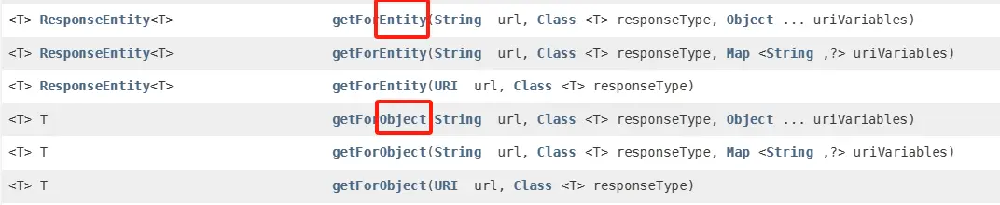

2. getForObject 方法/getForEntity 方法

    - getForObject 方法：返回对象为响应体中数据转化成的对象，基本上可以理解为 Json。
    - getForEntity 方法：返回对象为 ResponseEntity 对象，包含了响应中的一些重要信息，比如响应头、响应状态码、响应体等。

3. GET 请求方法

    ```java
    <T> T getForObject(String url, Class<T> responseType, Object... uriVariables);
    <T> T getForObject(String url, Class<T> responseType, Map<String, ?> uriVariables);
    <T> T getForObject(URI url, Class<T> responseType);
    
    <T> ResponseEntity<T> getForEntity(String url, Class<T> responseType, Object... uriVariables);
    <T> ResponseEntity<T> getForEntity(String url, Class<T> responseType, Map<String, ?> uriVariables);
    <T> ResponseEntity<T> getForEntity(URI var1, Class<T> responseType);
    ```
    
4. POST 请求方法

    ```java
    <T> T postForObject(String url, @Nullable Object request, Class<T> responseType, Object... uriVariables);
    <T> T postForObject(String url, @Nullable Object request, Class<T> responseType, Map<String, ?> uriVariables);
    <T> T postForObject(URI url, @Nullable Object request, Class<T> responseType);
    
    <T> ResponseEntity<T> postForEntity(String url, @Nullable Object request, Class<T> responseType, Object... uriVariables);
    <T> ResponseEntity<T> postForEntity(String url, @Nullable Object request, Class<T> responseType, Map<String, ?> uriVariables);
    <T> ResponseEntity<T> postForEntity(URI url, @Nullable Object request, Class<T> responseType);
    ```

###### config 配置类

```java
package com.atguigu.cloud.config;

@Configuration
public class RestTemplateConfig {
    @Bean
    public RestTemplate restTemplate() {
        return new RestTemplate();
    }
}
```

###### controller

```java
package com.atguigu.cloud.controller;

@RestController
public class OrderController {
    public static final String PAYMENTSRV_URL = "http://localhost:8001"; // 先写死，硬编码

    @Resource
    private RestTemplate restTemplate;

    /**
     * 一般情况下，通过浏览器的地址栏输入url，发送的只能是get请求
     * 我们底层调用的是post方法，模拟消费者发送get请求，客户端消费者
     * 参数可以不添加@RequestBody
     * @param payDTO
     * @return
     */
    @GetMapping("/consumer/pay/add")
    public ResultData addOrder(PayDTO payDTO) {
        return restTemplate.postForObject(PAYMENTSRV_URL + "/pay/add", payDTO, ResultData.class);
    }

    @GetMapping("/consumer/pay/get/{id}")
    public ResultData getPayInfo(@PathVariable("id") Integer id){
        return restTemplate.getForObject(PAYMENTSRV_URL + "/pay/get/"+id, ResultData.class);
    }

    @GetMapping("/consumer/pay/update")
    public ResultData updateOrder(PayDTO payDTO){
        restTemplate.put(PAYMENTSRV_URL + "/pay/update", payDTO);
        return ResultData.success("成功修改记录");
    }

    @GetMapping("/consumer/pay/del/{id}")
    public ResultData delOrder(@PathVariable("id") Integer id){
        restTemplate.delete(PAYMENTSRV_URL + "/pay/del/" + id);
        return ResultData.success("成功删除记录");
    }
}
```

##### PostMan 测试

1. 查找

    ```shell
    curl --location --request GET 'http://localhost/consumer/pay/get/1'
    ```

    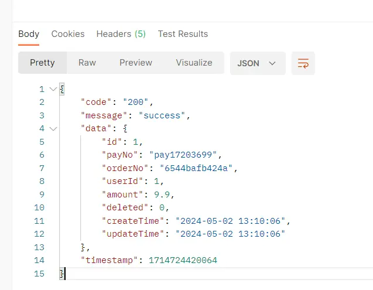

2. 增加

    ```shell
    curl --location --request GET 'http://localhost/consumer/pay/add?payNo=1213&orderNo=1213&userId=2&amount=3.33'
    ```

    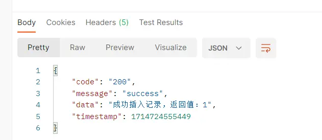

3. 修改

    ```shell
    curl --location --request GET 'http://localhost/consumer/pay/update?id=5&payNo=1213update&orderNo=1213update&userId=2&amount=33.3'
    ```

    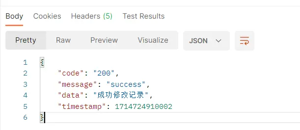

4. 删除

    ```shell
    curl --location --request GET 'http://localhost/consumer/pay/del/5'
    ```

    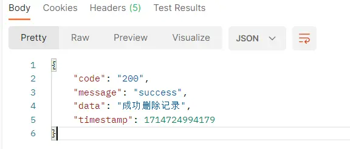

#### 工程重构

##### 存在问题

系统中有重复部分，重构

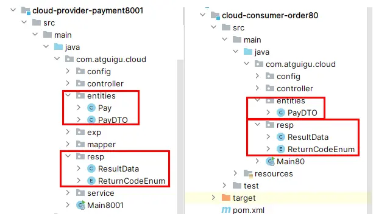

##### 新建 Module

1. cloud-api-commons
2. 对外暴露通用的组件/api/接口/工具类等

##### 改 POM

```xml
<?xml version="1.0" encoding="UTF-8"?>
<project xmlns="http://maven.apache.org/POM/4.0.0"
         xmlns:xsi="http://www.w3.org/2001/XMLSchema-instance"
         xsi:schemaLocation="http://maven.apache.org/POM/4.0.0 http://maven.apache.org/xsd/maven-4.0.0.xsd">
    <modelVersion>4.0.0</modelVersion>
    <parent>
        <groupId>com.atguigu.cloud</groupId>
        <artifactId>cloud2024</artifactId>
        <version>1.0-SNAPSHOT</version>
    </parent>

    <artifactId>cloud-api-commons</artifactId>

    <properties>
        <maven.compiler.source>17</maven.compiler.source>
        <maven.compiler.target>17</maven.compiler.target>
        <project.build.sourceEncoding>UTF-8</project.build.sourceEncoding>
    </properties>

    <dependencies>
        <!--SpringBoot通用依赖模块-->
        <dependency>
            <groupId>org.springframework.boot</groupId>
            <artifactId>spring-boot-starter-web</artifactId>
        </dependency>
        <dependency>
            <groupId>org.springframework.boot</groupId>
            <artifactId>spring-boot-starter-actuator</artifactId>
        </dependency>
        <dependency>
            <groupId>org.projectlombok</groupId>
            <artifactId>lombok</artifactId>
            <optional>true</optional>
        </dependency>
        <!--hutool-->
        <dependency>
            <groupId>cn.hutool</groupId>
            <artifactId>hutool-all</artifactId>
        </dependency>
    </dependencies>

</project>
```

##### entities、全局异常类

拷贝通用部分

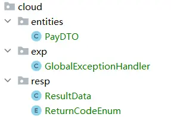

#####  maven 命令 clean install

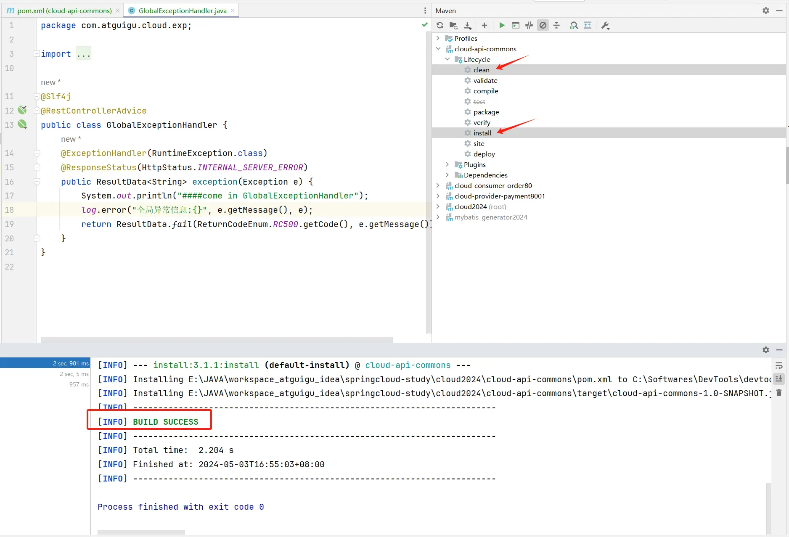

##### 订单 80 和支付 8001 分别改造

1. 删除各自的原先有过的 entities 和统一返回体等内容

2. 各自粘贴 POM 内容

    ```xml
    <!-- 引入自己定义的api通用包 -->
    <dependency>
        <groupId>com.atguigu.cloud</groupId>
        <artifactId>cloud-api-commons</artifactId>
        <version>1.0-SNAPSHOT</version>
    </dependency>
    ```

##### postman 测试

同上

#### 目前工程样图

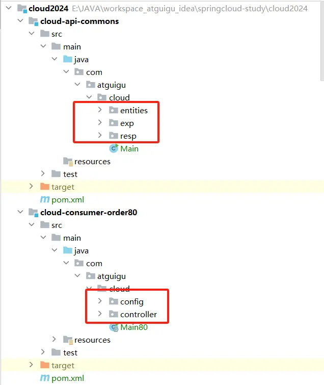

#### 为什么要引入微服务

上一步 controller 存在的问题：**硬编码写死问题**。

## Consul 服务注册与发现

### 为什么要引入服务注册中心

微服务所在的 IP 地址和端口号**硬编码**到订单微服务中，会存在非常多的问题：

1. 如果订单微服务和支付微服务的 IP 地址或者端口号发生了变化，则支付微服务将变得不可用，需要同步修改订单微服务中调用支付微服务的 IP 地址和端口号。
2. 如果系统中提供了多个订单微服务和支付微服务，则无法实现微服务的负载均衡功能。
3. 如果系统需要支持更高的并发，需要部署更多的订单微服务和支付微服务，硬编码订单微服务则后续的维护会变得异常复杂。
4. 所以，在微服务开发的过程中，**需要引入服务治理功能，实现微服务之间的动态注册与发现**，从此刻开始我们正式进入 SpringCloud 实战。

### 为什么不再使用传统老牌的 Eureka

1. Eureka 停更
    - [eureka](https://github.com/Netflix/eureka/wiki)
    
        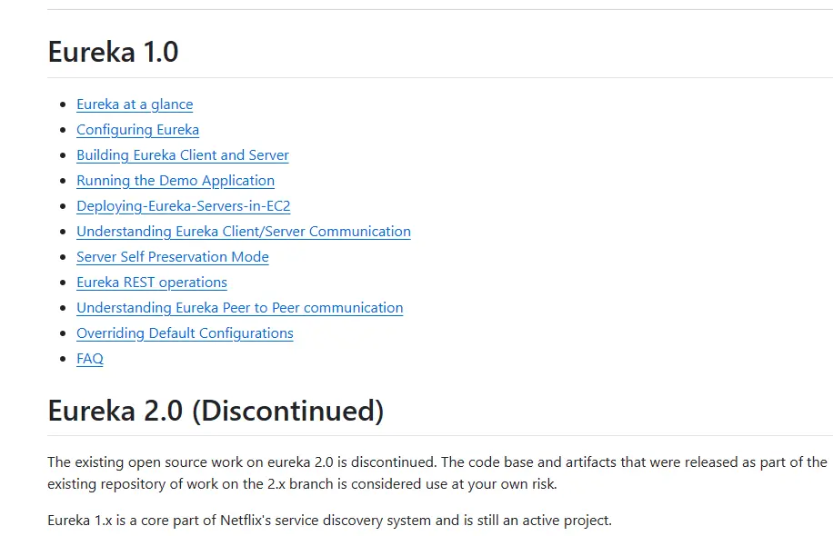
    
2. Eureka 对初学者不友好

3. 注册中心独立且和微服务功能解耦
    - 目前主流服务中心，希望单独隔离出来而不是作为一个独立微服务嵌入到系统中。
    - 按照 Netflix 的之前的思路，注册中心 Eureka 也是作为一个微服务且需要程序员自己开发部署。
    - 实际情况，希望微服务和注册中心分离解耦，注册中心和业务无关的，不要混为一谈。
    - 提供类似 tomcat 一样独立的组件，微服务注册上去使用，是个成品。
    
4. 阿里巴巴 Nacos 的崛起(Service discovery and configuration management)

### consul 简介

#### 是什么

1. [Consul 官网](https://www.consul.io/)

2. [What is Consul？](https://developer.hashicorp.com/consul/docs/intro)
    - Consul 是一套开源的**分布式服务发现和配置管理系统**，由 HashiCorp 公司用 Go 语言开发。
    
    - 提供了微服务系统中的服务治理、配置中心、控制总线等功能。这些功能中的每一个都可以根据需要单独使用，也可以一起使用以构建全方位的服务网格，总之 Consul 提供了一种完整的服务网格解决方案。
    
    - 它具有很多优点。包括： 基于 raft 协议，比较简洁； 支持健康检查, 同时支持 HTTP 和 DNS 协议，支持跨数据中心的 WAN 集群，提供图形界面，跨平台，支持 Linux、Mac、Windows。
    
3. 禁止使用问题：
    - HashiCorp 是一家非常知名的基础软件提供商，很多人可能没听过它的名字，但是其旗下的 6 款主流软件，Terraform、Consul、Vagrant、Nomad、Vault，Packer 相信不少程序员都听说或使用过，尤其是 Consul 使用者不尽其数。
    - 截止目前为止，从 HashiCorp 官网上的声明来看，开源项目其实还是“安全”的，被禁用的只是**Vault 企业版**（并且原因是 Vault 产品目前使用的加密算法在中国不符合法规，另一方面是美国出口管制法在涉及加密相关软件上也有相应规定。因此这两项原因使得 HashiCorp 不得不在声明中说明风险）而非其他所有开源产品（Terraform、Consul 等）。因此，大家可以暂时放下心来，放心使用！

#### 能干啥

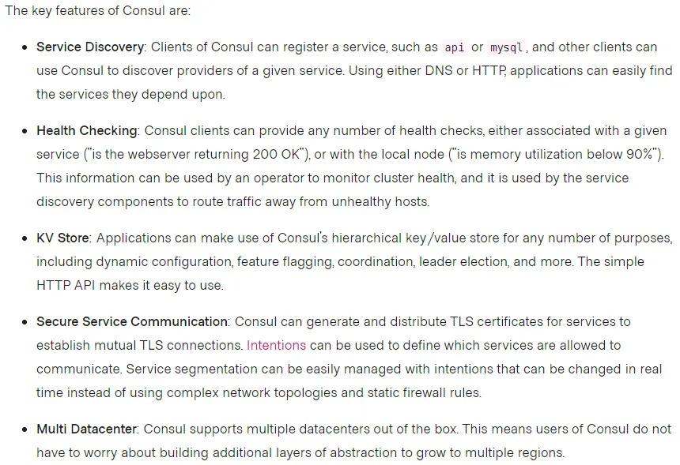

1. 服务发现
    - 提供 HTTP 和 DNS 两种发现方式
2. 健康监测
    - 支持多种方式，HTTP、TCP、Docker、Shell 脚本定制化监控
3. KV 存储
    - Key、Value 的存储方式
4. 多数据中心
    - Consul 支持多数据中心
5. 可视化 Web 界面

#### 去哪下

[Install | Consul | HashiCorp Developer](https://developer.hashicorp.com/consul/install)

#### 怎么玩

**分布式服务发现和配置管理系统**

[Spring Cloud Consul](https://docs.spring.io/spring-cloud-consul/docs/current/reference/html/)

### 安装并运行 consul

#### 下载安装

下载完成后只有一个 consul.exe 文件，对应全路径下查看版本号信息

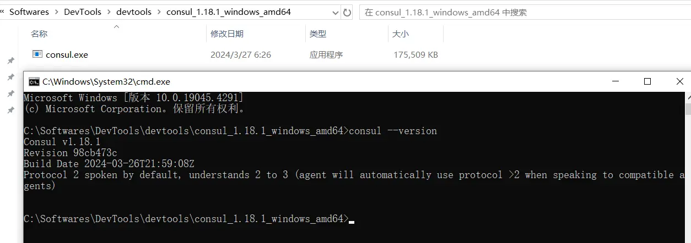

#### 使用开发模式启动

1. `consul agent -dev`

2. 通过以下地址可以访问 Consul 的首页：`http://localhost:8500`

    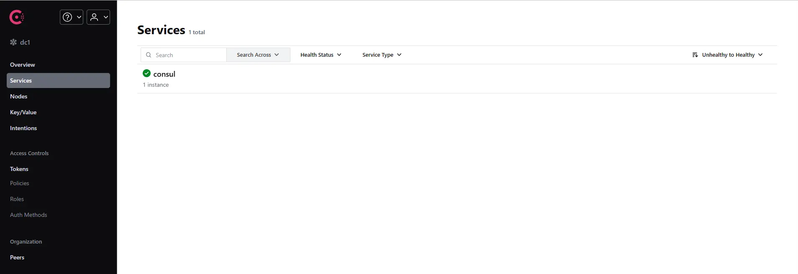

### 服务注册与发现

#### 支付服务 provider8001 注册进 consul

1. POM 中新增依赖

    ```xml
    <!--SpringCloud consul discovery -->
    <dependency>
        <groupId>org.springframework.cloud</groupId>
        <artifactId>spring-cloud-starter-consul-discovery</artifactId>
        <exclusions>
            <exclusion>
                <groupId>commons-logging</groupId>
                <artifactId>commons-logging</artifactId>
            </exclusion>
        </exclusions>
    </dependency>
    ```

2. YML 中新增 consul 配置

    ```yml
    spring:
      application:
        name: cloud-payment-service
    
      cloud:
        consul:
          host: localhost
          port: 8500
          discovery:
            service-name: ${spring.application.name}
    ```

3. 主启动类新增注解 `@EnableDiscoveryClient`，开启服务发现

4. 启动 8001 服务并查看 consul 控制台

    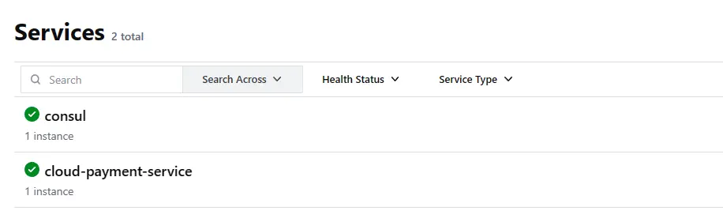

#### 消费者服务 consumer-order80 注册进 consul

1. POM 中新增依赖

    ```xml
    <!--SpringCloud consul discovery -->
    <dependency>
        <groupId>org.springframework.cloud</groupId>
        <artifactId>spring-cloud-starter-consul-discovery</artifactId>
        <exclusions>
            <exclusion>
                <groupId>commons-logging</groupId>
                <artifactId>commons-logging</artifactId>
            </exclusion>
        </exclusions>
    </dependency>
    ```

2. YML 中新增 consul 配置

    ```yml
    spring:
      application:
        name: cloud-consumer-order
      ####Spring Cloud Consul for Service Discovery
      cloud:
        consul:
          host: localhost
          port: 8500
          discovery:
            prefer-ip-address: true #优先使用服务ip进行注册
            service-name: ${spring.application.name}
    ```

3. 主启动类新增注解 `@EnableDiscoveryClient`，开启服务发现

4. 修改 Controller 中的地址硬编码

    ```java
    //    public static final String PAYMENTSRV_URL = "http://localhost:8001"; // 先写死，硬编码
    public static final String PAYMENTSRV_URL = "http://cloud-payment-service";//服务注册中心上的微服务名称
    ```

5. 启动 80 服务并查看 consul 控制台

    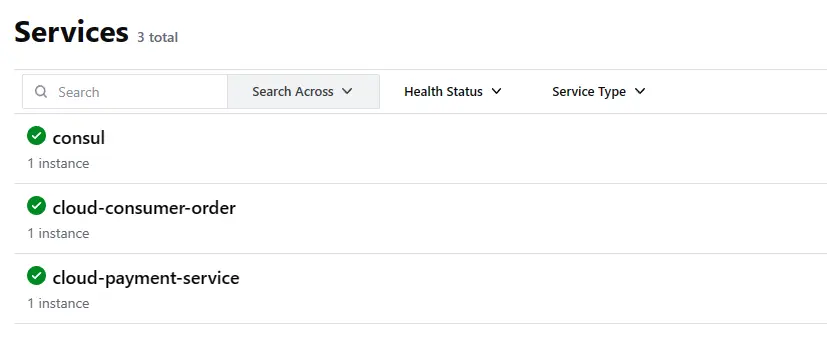

6. 访问测试地址，**出现报错**

    <font color='red' size=5> java.net.UnknownHostException: cloud-payment-service</font>

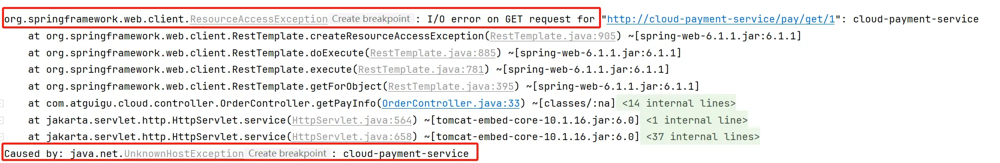

**异常概述：**

​	在 Java 编程中，`java.net.UnknownHostException` 是一个常见的异常，它通常表示在进行网络操作时，无法通过主机名找到对应的 IP 地址。这个异常是 `java.net` 包中的一部分，具体地说，它是 `java.net.UnknownHostException` 类的一个实例。

**异常原因：**

主机名无法解析成有效的 IP 地址，可能由以下原因引起：

- **DNS 解析问题：** 当使用主机名连接到网络资源时，Java 会依赖 DNS(Domain Name System)来将主机名解析为 IP 地址。如果 DNS 服务器无法解析主机名，就会抛出 `UnknownHostException`。
- **网络连接问题：** 如果计算机无法连接到网络，或者网络不稳定，可能导致无法解析主机名。
- **主机名拼写错误：** 可能在代码中输入的主机名有误，或者主机名在 DNS 服务器上不存在。

**异常处理：**

解决 `UnknownHostException` 的方法通常包括以下几个步骤：

- **检查主机名：** 确保在代码中使用的主机名是正确的，没有拼写错误，并且确保该主机名在 DNS 服务器上存在。
- **检查网络连接：** 确保计算机能够连接到网络，并且网络连接是稳定的。网络问题可能导致主机名无法解析。
- **检查 DNS 配置：** 如果是 DNS 解析问题，可以检查计算机的 DNS 配置，确保它能够正确地解析主机名。
- **使用 IP 地址：** 一种绕过 `UnknownHostException` 的方法是直接使用 IP 地址而不是主机名。但这通常不是长期解决方案，因为 IP 地址可能会更改。

7. 修改 RestTemplateConfig 配置

    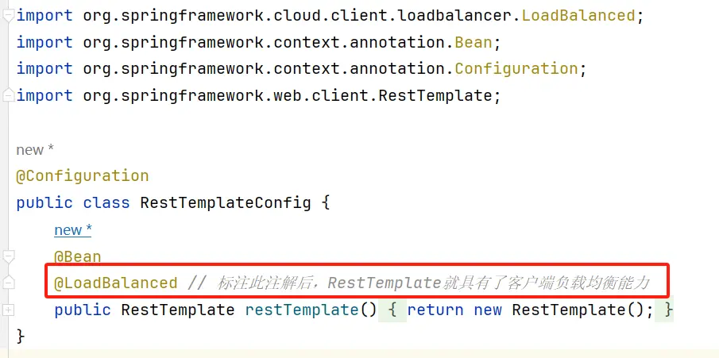

    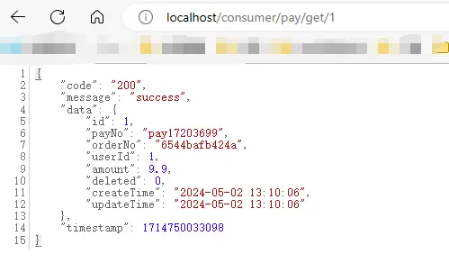

#### 三个注册中心异同点

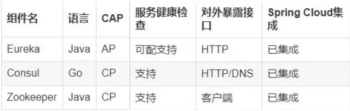

##### CAP

- **C:Consistency（强一致性）**
- **A:Availability（可用性）**
- **P:Partition tolerance（分区容错性）**

##### 经典 CAP 图

- 最多只能同时较好的满足两个。

-  CAP 理论的核心是：一个分布式系统不可能同时很好的满足一致性，可用性和分区容错性这三个需求，因此，根据 CAP 原理将 NoSQL 数据库分成了满足 CA 原则、满足 CP 原则和满足 AP 原则三大类：
    - CA - 单点集群，满足一致性，可用性的系统，通常在可扩展性上不太强大。
    - CP - 满足一致性，分区容忍性的系统，通常性能不是特别高。
    - AP - 满足可用性，分区容忍性的系统，通常可能对一致性要求低一些。

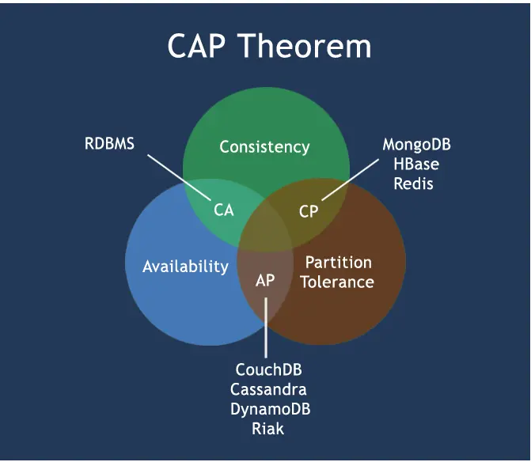

###### AP(Eureka)

- 当网络分区出现后，为了保证可用性，系统 B 可以返回旧值，保证系统的**可用性**。
- 当数据出现不一致时，虽然 A, B 上的注册信息不完全相同，但每个 Eureka 节点依然能够正常对外提供服务，这会出现查询服务信息时如果请求 A 查不到，但请求 B 就能查到。如此保证了可用性但牺牲了一致性。
- **结论：违背了一致性 C 的要求，只满足可用性和分区容错，即 AP**。

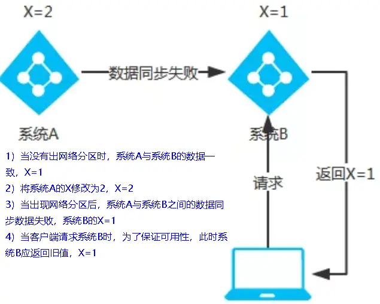

###### CP(Zookeeper/Consul)

- 当网络分区出现后，为了保证一致性，**就必须拒接请求**，否则无法保证一致性。
- Consul 遵循 CAP 原理中的 CP 原则，保证了强一致性和分区容错性，且使用的是 Raft 算法，比 zookeeper 使用的 Paxos 算法更加简单。
- 虽然保证了强一致性，但是可用性就相应下降了，例如服务注册的时间会稍长一些，因为 Consul 的 raft 协议要求必须过半数的节点都写入成功才认为注册成功 ；在 leader 挂掉了之后，重新选举出 leader 之前会导致 Consul 服务不可用。
- **结论：违背了可用性 A 的要求，只满足一致性和分区容错，即 CP**。

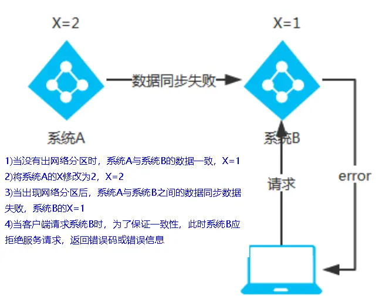

### 服务配置与刷新

#### 分布式系统面临的配置问题

- 微服务意味着要将单体应用中的业务拆分成一个个子服务，每个服务的粒度相对较小，因此系统中会出现大量的服务。
- 由于每个服务都需要必要的配置信息才能运行，所以**一套集中式的、动态的配置管理设施是必不可少的**。
- 比如某些配置文件中的内容大部分都是相同的，只有个别的配置项不同。就拿数据库配置来说吧，如果每个微服务使用的技术栈都是相同的，则每个微服务中关于数据库的配置几乎都是相同的，有时候主机迁移了，我希望一次修改，处处生效。
- 当下我们每一个微服务自己带着一个 application.yml，上百个配置文件的管理......

#### 服务配置案例步骤

##### 需求

1. 通用全局配置信息，直接注册进 Consul 服务器，从 Consul 获取
2. 既然从 Consul 获取自然要遵守 Consul 的配置规则要求

##### 修改 cloud-provider-payment8001

##### POM 中新增依赖

```xml
<!--SpringCloud consul config-->
<dependency>
    <groupId>org.springframework.cloud</groupId>
    <artifactId>spring-cloud-starter-consul-config</artifactId>
</dependency>
<dependency>
    <groupId>org.springframework.cloud</groupId>
    <artifactId>spring-cloud-starter-bootstrap</artifactId>
</dependency>
```

##### YML

###### 配置规则说明

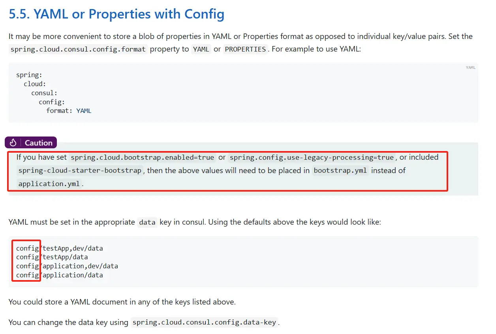

###### 新增配置文件 bootstrap.yml

- applicaiton.yml 是**用户级**的资源配置项
- bootstrap.yml 是**系统级**的，优先级更加高
- Spring Cloud 会创建一个`Bootstrap Context`，作为 Spring 应用的`Application Context`的**父上下文**。初始化的时候，`Bootstrap Context`负责从**外部源**加载配置属性并解析配置。这两个上下文共享一个从外部获取的`Environment`。
- `Bootstrap`属性有**高优先级，默认情况下，它们不会被本地配置覆盖**。 `Bootstrap context`和`Application Context`有着不同的约定，所以新增了一个`bootstrap.yml`文件，保证`Bootstrap Context`和`Application Context`配置的分离。
- **application.yml 文件改为 bootstrap.yml，这是很关键的或者两者共存**
- 因为 bootstrap.yml 是比 application.yml 先加载的。bootstrap.yml 优先级高于 application.yml

**bootstrap.yml：**

```yml
spring:
  application:
    name: cloud-payment-service
  ####Spring Cloud Consul for Service Discovery
  cloud:
    consul:
      host: localhost
      port: 8500
      discovery:
        service-name: ${spring.application.name}
      config:
        profile-separator: '-' # default value is ","，we update '-'
        format: yaml

# config/cloud-payment-service/data
#       /cloud-payment-service-dev/data
#       /cloud-payment-service-prod/data
```

###### 修改 application.yml 配置

```yml
server:
  port: 8001

# ==========druid-mysql8 driver===================
spring:
  datasource:
    type: com.alibaba.druid.pool.DruidDataSource
    driver-class-name: com.mysql.cj.jdbc.Driver
    url: jdbc:mysql://localhost:3306/db2024?characterEncoding=utf8&useSSL=false&serverTimezone=GMT%2B8&rewriteBatchedStatements=true&allowPublicKeyRetrieval=true
    username: root
    password: 123456
  profiles:
   active: dev # 多环境配置加载内容dev/prod,不写就是默认default配置

# ========================mybatis===================
mybatis:
  mapper-locations: classpath:mapper/*.xml
  type-aliases-package: com.atguigu.cloud.entities
  configuration:
    map-underscore-to-camel-case: true
```

##### consul 服务器 key/value 配置填写

1. 参考规则

    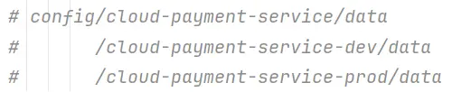

2. 创建 config 文件夹，以 `/` 结尾

    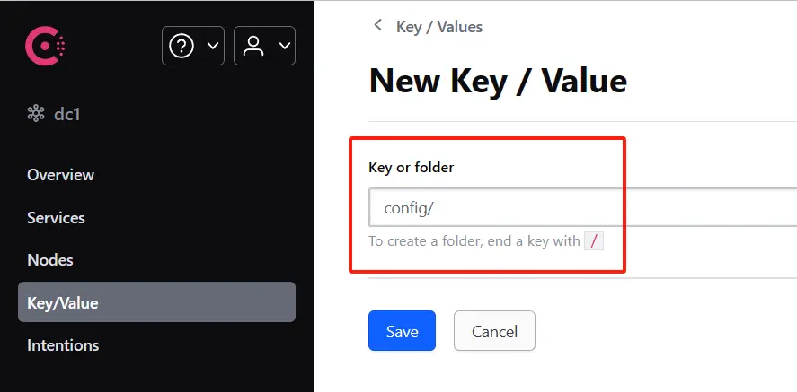

3. config 文件夹下分别创建其它 3 个文件夹，以 `/` 结尾

    - cloud-payment-service
    - cloud-payment-service-dev
    - cloud-payment-service-prod
    - 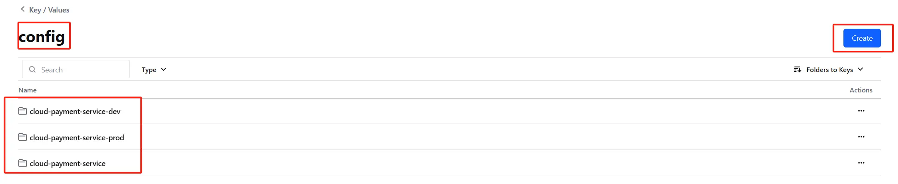

4. 上述 3 个文件夹下分别创建 data 内容，data 不再是文件夹

    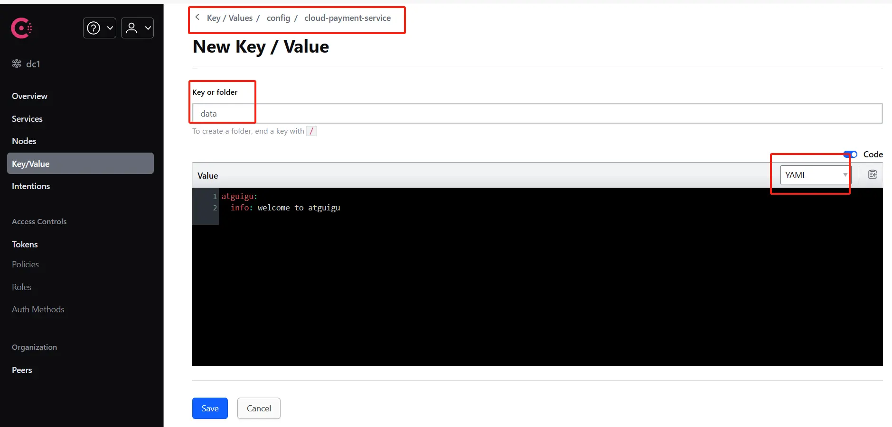

##### 修改 controller

```java
@Value("${server.port}")
private String port;

@GetMapping(value = "/pay/get/info")
private String getInfoByConsul(@Value("${atguigu.info}") String atguiguInfo) {
    return "atguiguInfo: " + atguiguInfo + "\t" + "port: " + port;
}
```

##### 测试

[localhost:8001/pay/get/info](http://localhost:8001/pay/get/info)

```yml
spring:
  profiles:
    active: dev|prod|  # 多环境配置加载内容 dev|prod|默认
```

通过修改 application.yml 里面的激活配置部分，进行内容的验证

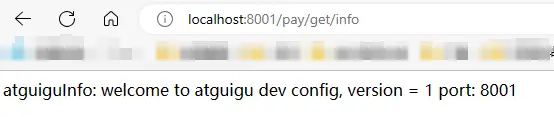

#### 动态刷新案例步骤

##### 问题

接上一步，我们在 consul 的 dev 配置分支修改了 YML 配置内容后马上访问请求，会发现还是原来的内容，**没有做到及时响应和动态刷新**。

##### 步骤

1.  主启动类新增注解 `@RefreshScope`，用于**动态刷新**。

    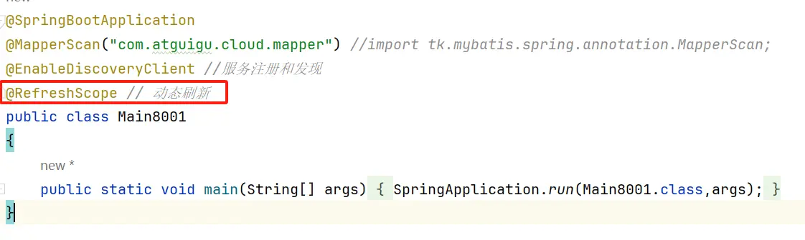

2. bootstrap.yml 修改下(**只为教学，实际别改**) spring.cloud.consul.config.watch.wait-time

    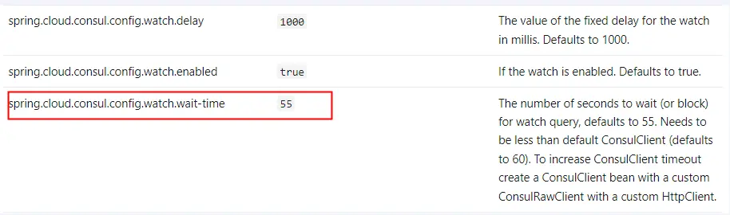

#### 思考

问：截止到这，服务配置和动态刷新全部通过，假设我重启 Consul，之前的配置还在吗？

答：之前配置的 config 信息全部丢失。

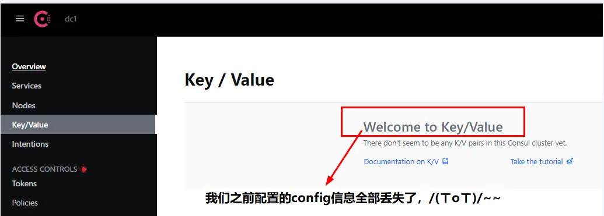

引出问题：<font color="red" size=5>**Consul 配置持久化.....**.</font>

## LoadBalancer 负载均衡服务调用

### Ribbon 目前也进入维护模式

#### 是什么

- Spring Cloud Ribbon 是基于 Netflix Ribbon 实现的一套 **客户端负载均衡的工具**。
- 简单的说，Ribbon 是 Netflix 发布的开源项目，主要功能是**提供客户端的软件负载均衡算法和服务调用**。
- Ribbon 客户端组件提供一系列完善的配置项如连接超时，重试等。
- 简单的说，就是在配置文件中列出 Load Balancer（简称 LB）后面所有的机器，Ribbon 会自动的帮助你基于某种规则（如简单轮询，随机连接等）去连接这些机器。
- 我们很容易使用 Ribbon 实现自定义的负载均衡算法。
- [Netflix/Ribbon(github.com)](https://github.com/Netflix/ribbon)

#### 维护模式不再介绍，了解即可

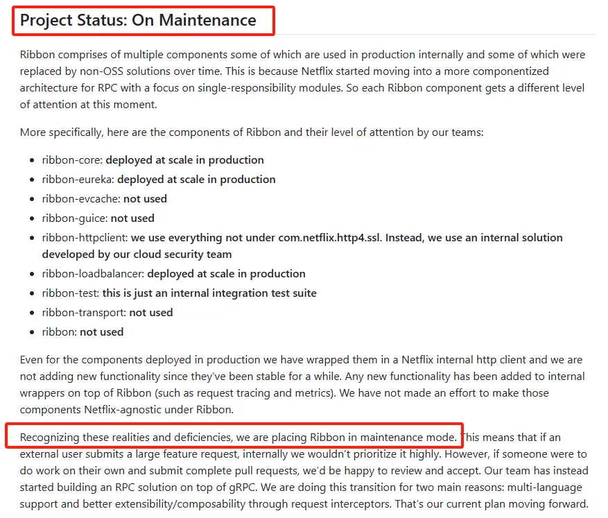

#### Ribbon 未来替换方案：spring-cloud-loadbalancer

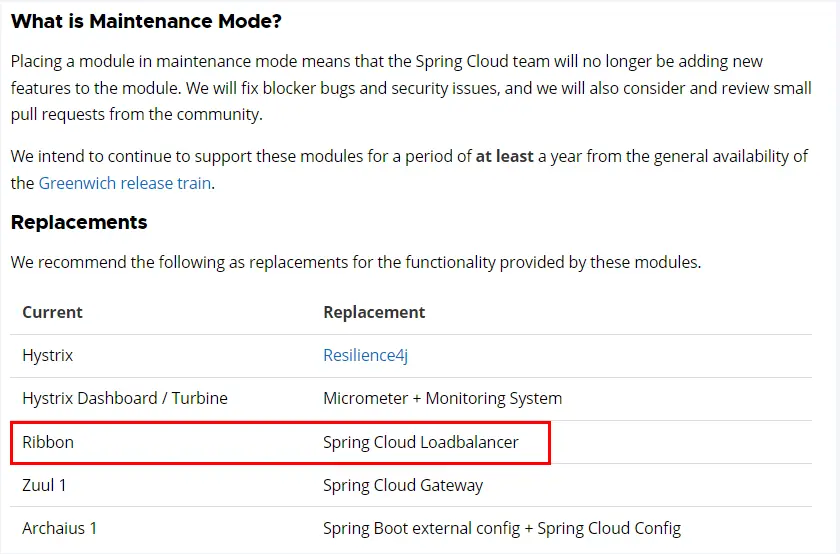

### [spring-cloud-loadbalancer](https://spring.io/projects/spring-cloud-commons#learn) 概述

#### 是什么

[官方文档](https://docs.spring.io/spring-cloud-commons/reference/spring-cloud-commons/loadbalancer.html)

**LB 负载均衡(Load Balance)是什么**

- 简单的说就是将用户的请求平摊的分配到多个服务上，从而达到系统的 HA（高可用），常见的负载均衡有软件 Nginx，LVS，硬件 F5 等。

**spring-cloud-starter-loadbalancer 组件是什么**

- Spring Cloud LoadBalancer 是由 SpringCloud 官方提供的一个开源的、简单易用的**客户端负载均衡器**，它包含在 SpringCloud-commons 中，用它来替换了以前的 Ribbon 组件。

- 相比较于 Ribbon，SpringCloud LoadBalancer 不仅能够支持 RestTemplate，还支持 WebClient（WebClient 是 Spring Web Flux 中提供的功能，可以实现响应式异步请求）。

    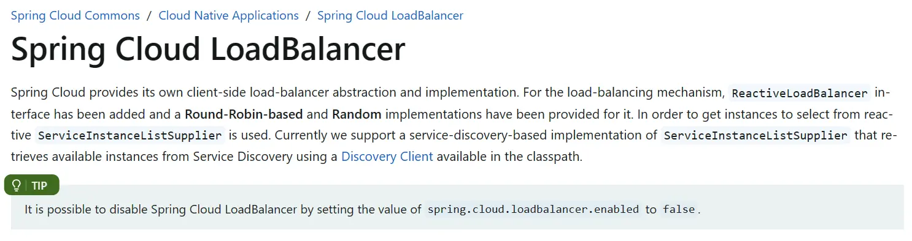

#### 面试题

**loadbalancer 本地负载均衡客户端 VS Nginx 服务端负载均衡区别？**

- Nginx 是 **服务器负载均衡**，客户端所有请求都会交给 nginx，然后由 nginx 实现转发请求，即负载均衡是由服务端实现的。
- loadbalancer **本地负载均衡**，在调用微服务接口时候，会在注册中心上获取注册信息服务列表之后缓存到 JVM 本地，从而在本地实现 RPC 远程服务调用技术。

### spring-cloud-loadbalancer 负载均衡解析

#### 负载均衡演示案例-理论

**架构说明：80 通过轮询负载访问 8001/8002/8003**

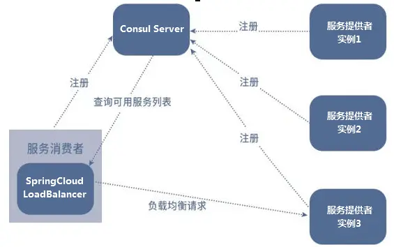

LoadBalancer 在工作时分成两步：

**第一步**：先选择 Consul Server 从服务端查询并拉取服务列表，知道了它有多个服务（上图 3 个服务），这 3 个实现是完全一样的，默认轮询调用谁都可以正常执行。类似生活中求医挂号，某个科室今日出诊的全部医生，客户端你自己选一个。

**第二步**：按照指定的负载均衡策略从 server 取到的服务注册列表中由客户端自己选择一个地址，所以 LoadBalancer 是一个**客户端的**负载均衡器。

#### 负载均衡演示案例-实操

##### 官网参考如何正确使用？

[官方文档](https://docs.spring.io/spring-cloud-commons/reference/spring-cloud-commons/loadbalancer.html)

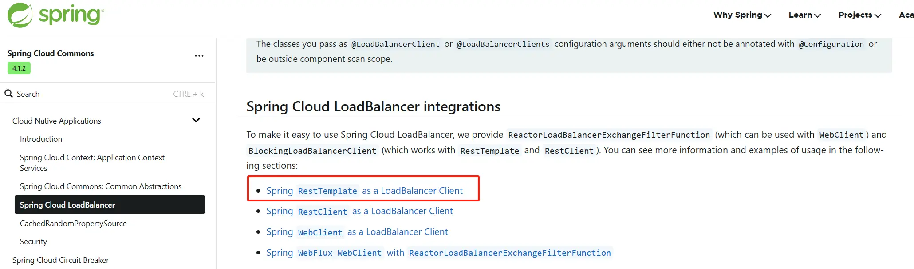

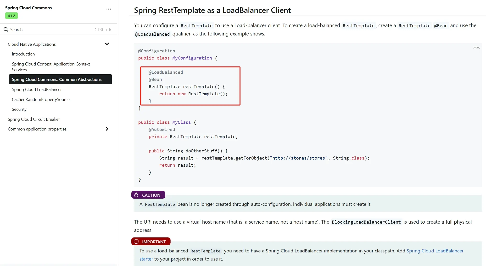

##### 新建 8002 微服务

按照 8001 拷贝进 8002 微服务

##### 启动 Consul，注册微服务

1. `consul agent -dev`

2. 将 8001/8002 启动后注册进微服务

3. 测试出现 BUG
   
    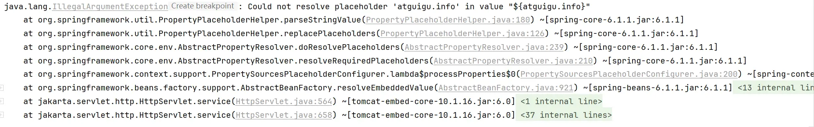

    - 原因：重启 Consul 后，之前的配置丢失了，没有持久化保存。
    
4. 解决方法：**Consul 数据持久化配置并且注册为 Windows 服务**

    1. 在 `consul.exe` 所在目录新建空文件夹  `mydata`

    2. 在 `consul.exe` 所在目录新建文件  `consul_start.bat`

        ```powershell
        @echo.服务启动......  
        @echo off  
        @sc create Consul binpath= "C:\Softwares\DevTools\devtools\consul_1.18.1_windows_amd64\consul.exe agent -server -ui -bind=127.0.0.1 -client=0.0.0.0 -bootstrap-expect  1  -data-dir C:\Softwares\DevTools\devtools\consul_1.18.1_windows_amd64\mydata"
        @net start Consul
        @sc config Consul start= AUTO  
        @echo.Consul start is OK......success
        @pause
        ```

    3. 以管理员身份运行  `consul_start.bat`

    4. 启动结果

        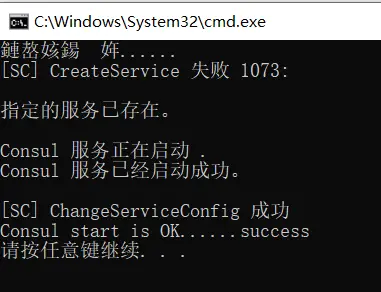

        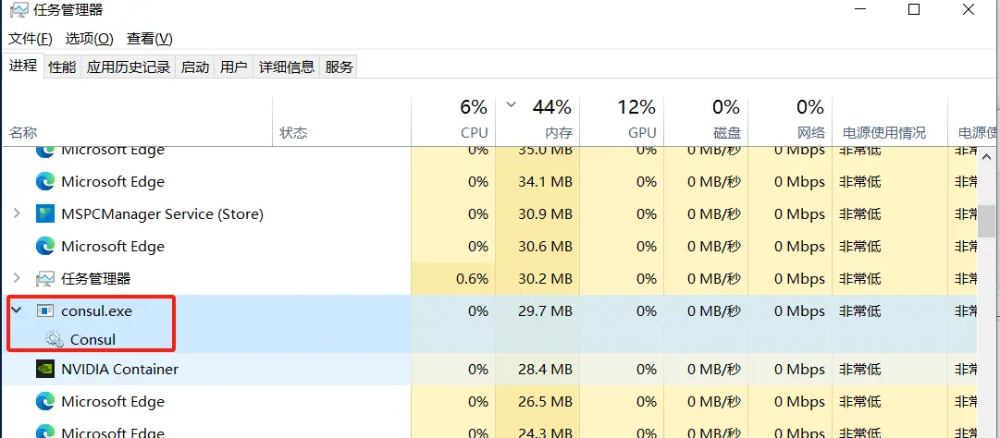

    5. 后续 consul 的配置数据会保存进 mydata 文件夹，重启还会存在

5. 后台自启动 Consul 测试地址：http://localhost:8001/pay/get/info

##### 订单 80 模块修改 POM 并注册进 consul，新增 LoadBalancer 组件

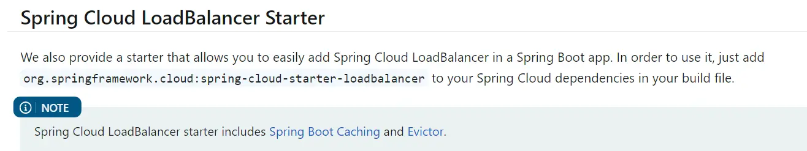

```xml
<!--loadbalancer-->
<dependency>
    <groupId>org.springframework.cloud</groupId>
    <artifactId>spring-cloud-starter-loadbalancer</artifactId>
</dependency>
```

##### 修改订单 80 模块 Controller 并启动

订单 80 模块修改 `OrderController` 并启动

```java
@GetMapping(value = "/consumer/pay/get/info")
private String getInfoByConsul() {
    return restTemplate.getForObject(PAYMENTSRV_URL + "/pay/get/info", String.class);
}
```

##### 目前 consul 上的服务

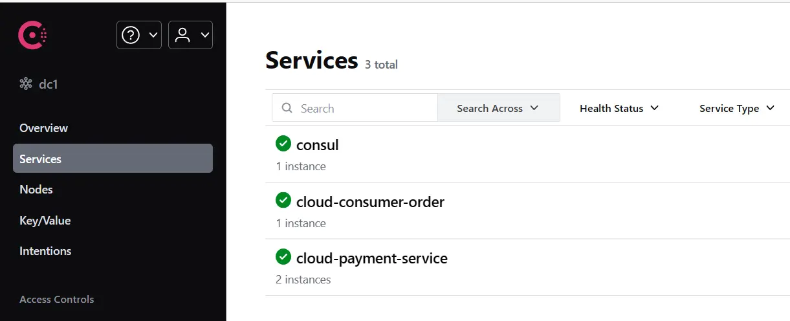

##### 测试

测试地址

- [http://localhost/consumer/pay/get/info](http://localhost/consumer/pay/get/info)
- 通过上述地址，交替访问到了 8001/8002。

#### 负载均衡演示案例-小总结

##### 编码使用 DiscoveryClient 动态获取所有上线的服务列表

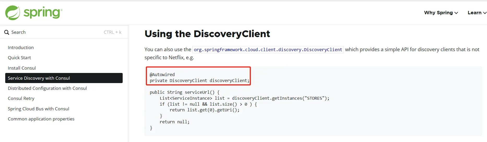

##### 代码解释，修改 80 微服务的 Controller

```java
@Resource
private DiscoveryClient discoveryClient;
@GetMapping("/consumer/discovery")
public String discovery() {
    List<String> services = discoveryClient.getServices();
    for (String element : services) {
        System.out.println(element);
    }
    System.out.println("===================================");
    List<ServiceInstance> instances = discoveryClient.getInstances("cloud-payment-service");
    for (ServiceInstance element : instances) {
        System.out.println(element.getServiceId()+"\t"+element.getHost()+"\t"+element.getPort()+"\t"+element.getUri());
    }
    return instances.get(0).getServiceId()+":"+instances.get(0).getPort();
}
```

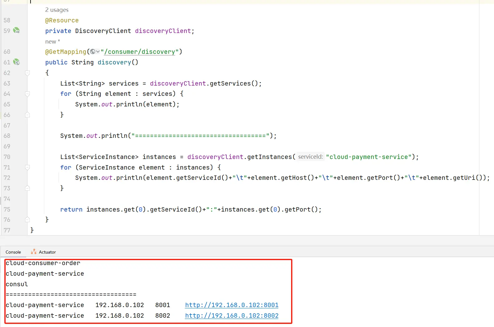

##### 结合前面实操，负载均衡原理小总结

**负载均衡算法：rest 接口第几次请求数 % 服务器集群总数量 = 实际调用服务器位置下标 ，每次服务重启动后 rest 接口计数从 1 开始。**

`List<ServiceInstance> instances = discoveryClient.getInstances("cloud-payment-service");`

如：  

List [0] instances = 127.0.0.1:8002

List [1] instances = 127.0.0.1:8001

8001+ 8002 组合成为集群，它们共计 2 台机器，集群总数为 2， 按照轮询算法原理：

1. 当总请求数为 1 时： 1 % 2 =1 对应下标位置为 1 ，则获得服务地址为 127.0.0.1:8001
2. 当总请求数位 2 时： 2 % 2 =0 对应下标位置为 0 ，则获得服务地址为 127.0.0.1:8002
3. 当总请求数位 3 时： 3 % 2 =1 对应下标位置为 1 ，则获得服务地址为 127.0.0.1:8001
4. 当总请求数位 4 时： 4 % 2 =0 对应下标位置为 0 ，则获得服务地址为 127.0.0.1:8002
5. 如此类推......

### 负载均衡算法原理

#### 默认算法是什么？有几种？

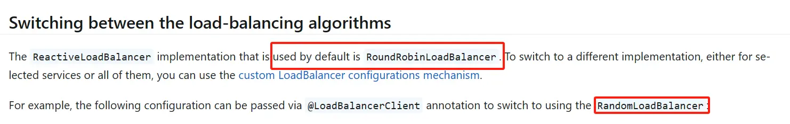

- 轮询
  
    `public class RoundRobinLoadBalancer implements ReactorServiceInstanceLoadBalancer`
    
- 随机
  
    `public class RandomLoadBalancer implements ReactorServiceInstanceLoadBalancer`

#### 算法切换

从默认的轮询，切换为随机算法，修改 `RestTemplateConfig`

```java
@Configuration
@LoadBalancerClient(
//下面的value值大小写一定要和consul里面的名字一样，必须一样
value = "cloud-payment-service",configuration = RestTemplateConfig.class)
public class RestTemplateConfig {
    @Bean
    @LoadBalanced // 标注此注解后，RestTemplate就具有了客户端负载均衡能力
    public RestTemplate restTemplate() {
        return new RestTemplate();
    }

    @Bean
    ReactorLoadBalancer<ServiceInstance> randomLoadBalancer(Environment environment,
                                                            LoadBalancerClientFactory loadBalancerClientFactory) {
        String name = environment.getProperty(LoadBalancerClientFactory.PROPERTY_NAME);
        return new RandomLoadBalancer(loadBalancerClientFactory
                .getLazyProvider(name, ServiceInstanceListSupplier.class),
                name);
    }
}
```

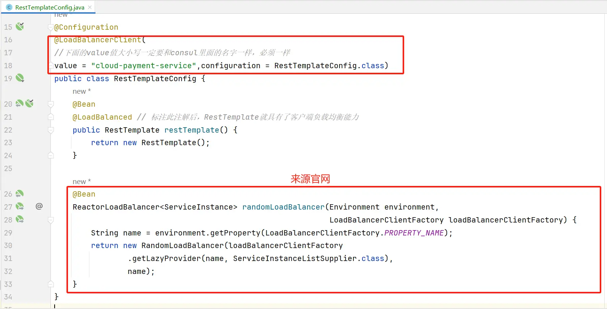

#### 测试

- [http://localhost/consumer/pay/get/info](http://localhost/consumer/pay/get/info)

## OpenFeign 服务接口调用

### OpenFeign 是什么

[官方文档](https://docs.spring.io/spring-cloud-openfeign/docs/current/reference/html/#spring-cloud-feign)

[spring-cloud/spring-cloud-openfeign: Support for using OpenFeign in Spring Cloud apps (github.com)](https://github.com/spring-cloud/spring-cloud-openfeign)

- Feign 是一个 **声明性 web 服务客户端**。它使编写 web 服务客户端变得更容易。使用 Feign 创建一个接口并对其进行注释。它具有可插入的注释支持，包括 Feign 注释和 JAX-RS 注释。Feign 还支持可插拔编码器和解码器。Spring Cloud 添加了对 Spring MVC 注释的支持，以及对使用 Spring Web 中默认使用的 HttpMessageConverter 的支持。Spring Cloud 集成了 Eureka、Spring Cloud CircuitBreaker 以及 Spring Cloud LoadBalancer，以便在使用 Feign 时提供负载平衡的 http 客户端。
-  一句话总结：openfeign 是一个声明式的 Web 服务客户端，**只需创建一个 Rest 接口并在该接口上添加注解 `@FeignClient` 即可**。
- OpenFeign 基本上就是当前微服务之间调用的事实标准。

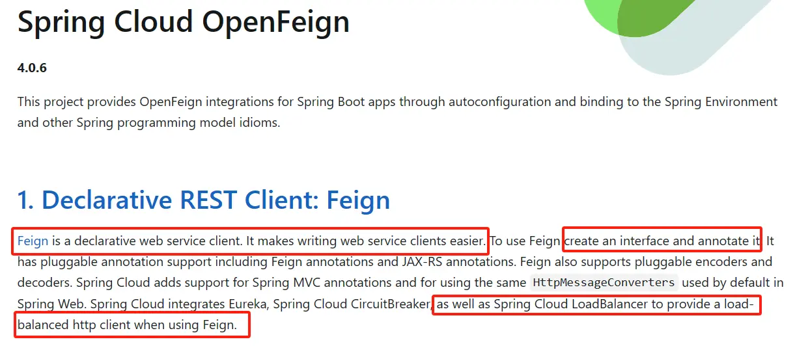

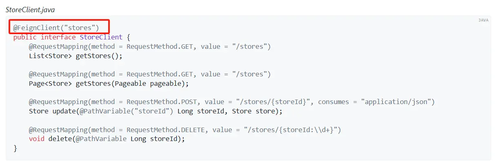

### 能干啥

**OpenFeign 能干什么：**

- 前面在使用 **SpringCloud LoadBalancer** + RestTemplate 时，利用 RestTemplate 对 http 请求的封装处理形成了一套模版化的调用方法。
- **但是在实际开发中，** 由于对服务依赖的调用可能不止一处，**往往一个接口会被多处调用，所以通常都会针对每个微服务自行封装一些客户端类来包装这些依赖服务的调用**。
- 所以，OpenFeign 在此基础上做了进一步封装，由它来帮助我们定义和实现依赖服务接口。
- 在 OpenFeign 的实现下，我们**只需创建一个接口并使用注解的方式来配置它（在一个微服务接口上面标注一个 `@FeignClien` 注解即可）**，即可完成对服务提供方的接口绑定，统一对外暴露可以被调用的接口方法，大大简化和降低了调用客户端的开发量，也即由服务提供者给出调用接口清单，消费者直接通过 OpenFeign 调用即可，O(∩_∩)O。
- **OpenFeign 同时还集成 SpringCloud LoadBalancer。**

- 可以在使用 OpenFeign 时提供 Http 客户端的负载均衡，也可以集成阿里巴巴 Sentinel 来提供熔断、降级等功能。
- 而与 SpringCloud LoadBalancer 不同的是，通过 OpenFeign 只需要定义服务绑定接口且以声明式的方法，优雅而简单的实现了服务调用。

**特性：**

1. 可插拔的注解支持，包括 Feign 注解和 JAX-RS 注解
2. 支持可插拔的 HTTP 编码器和解码器
3. 支持 Sentinel 和它的 Fallback
4. 支持 SpringCloud LoadBalancer 的负载均衡
5. 支持 HTTP 请求和响应的压缩

### OpenFeign 通用步骤

#### 接口+注解

1. 微服务 Api 接口 + `@FeignClient` 注解标签

    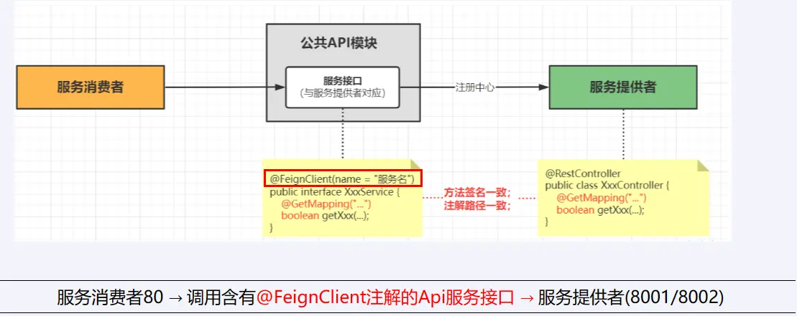

#### 流程步骤

##### 建 Module

cloud-consumer-feign-order80

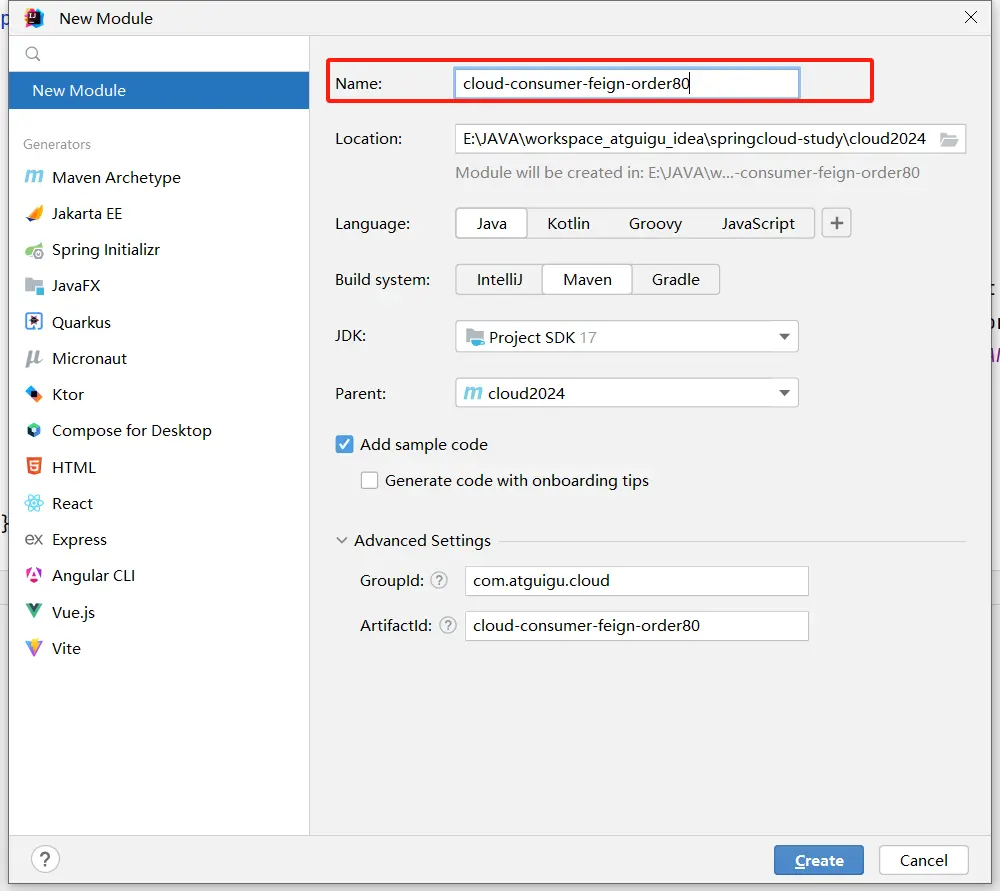

##### 改 POM 文件

引入 openfeign 依赖

```xml
<!--openfeign-->
<dependency>
    <groupId>org.springframework.cloud</groupId>
    <artifactId>spring-cloud-starter-openfeign</artifactId>
</dependency>
```

完整 pom 文件

```xml
<?xml version="1.0" encoding="UTF-8"?>
<project xmlns="http://maven.apache.org/POM/4.0.0"
         xmlns:xsi="http://www.w3.org/2001/XMLSchema-instance"
         xsi:schemaLocation="http://maven.apache.org/POM/4.0.0 http://maven.apache.org/xsd/maven-4.0.0.xsd">
    <modelVersion>4.0.0</modelVersion>
    <parent>
        <groupId>com.atguigu.cloud</groupId>
        <artifactId>cloud2024</artifactId>
        <version>1.0-SNAPSHOT</version>
    </parent>

    <artifactId>cloud-consumer-order80</artifactId>

    <properties>
        <maven.compiler.source>17</maven.compiler.source>
        <maven.compiler.target>17</maven.compiler.target>
        <project.build.sourceEncoding>UTF-8</project.build.sourceEncoding>
    </properties>

    <dependencies>
        <!--loadbalancer-->
        <dependency>
            <groupId>org.springframework.cloud</groupId>
            <artifactId>spring-cloud-starter-loadbalancer</artifactId>
        </dependency>
        <!--SpringCloud consul discovery -->
        <dependency>
            <groupId>org.springframework.cloud</groupId>
            <artifactId>spring-cloud-starter-consul-discovery</artifactId>
            <exclusions>
                <exclusion>
                    <groupId>commons-logging</groupId>
                    <artifactId>commons-logging</artifactId>
                </exclusion>
            </exclusions>
        </dependency>
        <!-- 引入自己定义的api通用包 -->
        <dependency>
            <groupId>com.atguigu.cloud</groupId>
            <artifactId>cloud-api-commons</artifactId>
            <version>1.0-SNAPSHOT</version>
        </dependency>
        <!--web + actuator-->
        <dependency>
            <groupId>org.springframework.boot</groupId>
            <artifactId>spring-boot-starter-web</artifactId>
        </dependency>
        <dependency>
            <groupId>org.springframework.boot</groupId>
            <artifactId>spring-boot-starter-actuator</artifactId>
        </dependency>
        <!--lombok-->
        <dependency>
            <groupId>org.projectlombok</groupId>
            <artifactId>lombok</artifactId>
            <optional>true</optional>
        </dependency>
        <!--hutool-all-->
        <dependency>
            <groupId>cn.hutool</groupId>
            <artifactId>hutool-all</artifactId>
        </dependency>
        <!--fastjson2-->
        <dependency>
            <groupId>com.alibaba.fastjson2</groupId>
            <artifactId>fastjson2</artifactId>
        </dependency>
        <!-- swagger3 调用方式 http://你的主机IP地址:5555/swagger-ui/index.html -->
        <dependency>
            <groupId>org.springdoc</groupId>
            <artifactId>springdoc-openapi-starter-webmvc-ui</artifactId>
        </dependency>
    </dependencies>

    <build>
        <plugins>
            <plugin>
                <groupId>org.springframework.boot</groupId>
                <artifactId>spring-boot-maven-plugin</artifactId>
            </plugin>
        </plugins>
    </build>

</project>
```

##### 写 application.yml

```yml
server:
  port: 80

spring:
  application:
    name: cloud-consumer-openfeign-order
  ####Spring Cloud Consul for Service Discovery
  cloud:
    consul:
      host: localhost
      port: 8500
      discovery:
        prefer-ip-address: true #优先使用服务ip进行注册
        service-name: ${spring.application.name}
```

##### 主启动（修改类名为 MainOpenFeign80）

主启动类上面配置 `@EnableFeignClients` 表示开启 OpenFeign 功能并激活文件里需要开启日志

```java
package com.atguigu.cloud;

@SpringBootApplication
@EnableDiscoveryClient //该注解用于向使用consul为注册中心时注册服务
@EnableFeignClients//启用feign客户端,定义服务+绑定接口，以声明式的方法优雅而简单的实现服务调用
public class MainOpenFeign80 {
    public static void main(String[] args) {
        SpringApplication.run(MainOpenFeign80.class, args);
    }
}
```

##### 业务类

###### 修改 cloud-api-commons 通用模块

订单模块要去调用支付模块，订单和支付两个微服务，需要通过 Api 接口解耦，一般不要在订单模块写非订单相关的业务，自己的业务自己做+其它模块走 FeignApi 接口调用。

1. 引入 openfeign 依赖

    ```xml
    <!--openfeign-->
    <dependency>
        <groupId>org.springframework.cloud</groupId>
        <artifactId>spring-cloud-starter-openfeign</artifactId>
    </dependency>
    ```

2. 参考微服务 8001 的 Controller 层，新建服务接口 PayFeignApi ，头上配置 `@FeignClient` 注解

    ```java
    package com.atguigu.cloud.apis;
    
    @FeignClient(value = "cloud-payment-service")
    public interface PayFeignApi {
        /**
         * 新增一条支付相关流水记录
         * @param payDTO
         * @return
         */
        @PostMapping(value = "/pay/add")
        ResultData addPay(@RequestBody PayDTO payDTO);
    
        /**
         * 按照主键记录查询支付流水信息
         * @param id
         * @return
         */
        @GetMapping("/pay/get/{id}")
    //    ResultData getPayInfo(@PathVariable String id);
        ResultData getPayInfo(@PathVariable("id") Integer id);
    
        /**
         * openfeign 天然支持负载均衡演示
         * @return
         */
        @GetMapping("/pay/get/info")
        String myLoadBalancer();
    }
    ```
    
3. bug 提醒一下（当使用 IDEA 快速推荐时，引入的就是括号里没有参数的形式）

    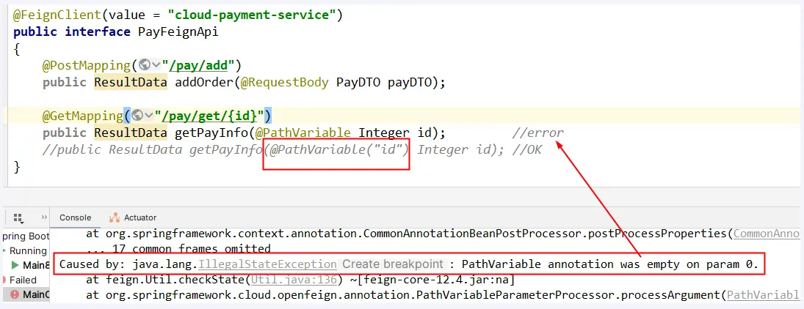

###### 创建 Controller 层 OrderController

```java
package com.atguigu.cloud.controller;

@RestController
@Slf4j
public class OrderController {
    @Resource
    private PayFeignApi payFeignApi;

    @PostMapping("/feign/pay/add")
    public ResultData addOrder(@RequestBody PayDTO payDTO) {
        System.out.println("第一步：模拟本地addOrder新增订单成功(省略sql操作)，第二步：再开启addPay支付微服务远程调用");
        return payFeignApi.addPay(payDTO);
    }

    @GetMapping("/feign/pay/get/{id}")
    public ResultData getPayInfo(@PathVariable("id") Integer id) {
        System.out.println("-------支付微服务远程调用，按照id查询订单支付流水信息");
        ResultData resultData = payFeignApi.getPayInfo(id);
        return resultData;
    }

    /**
     * openfeign天然支持负载均衡演示
     * @return
     */
    @GetMapping(value = "/feign/pay/mylb")
    public String mylb() {
        return payFeignApi.myLoadBalancer();
    }
}
```

#### 测试

1. 先启动 Consul 服务器 [Services - Consul](http://localhost:8500/ui/dc1/services)

2. 再启动微服务 8001

3. 再启动 cloud-consumer-feign-order80

4. PostMan 测试
    - 新增：[http://localhost/feign/pay/add](http://localhost/feign/pay/add)
    
        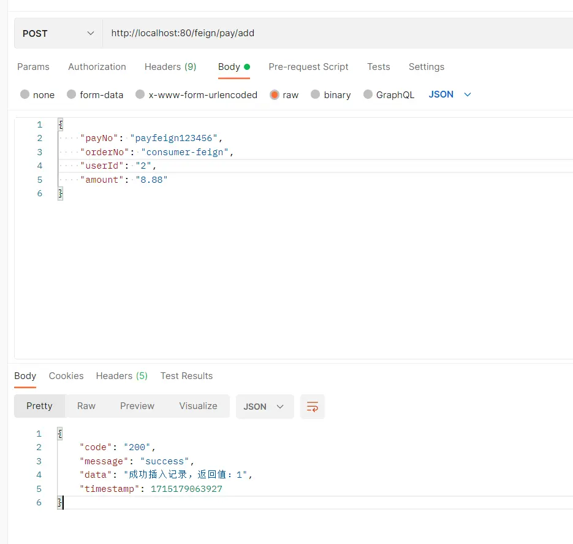
    
    - 查询：[http://localhost/feign/pay/get/1](http://localhost/feign/pay/get/1)
    
        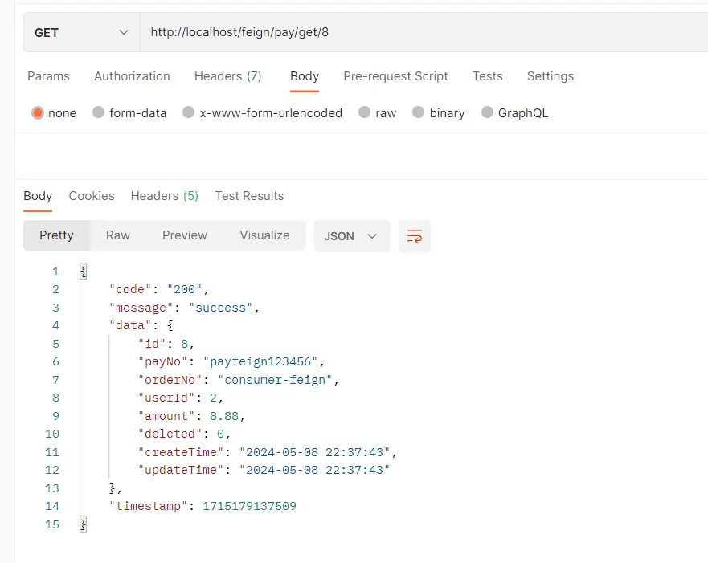
    
5. 再启动微服务 8002，测试
    - [http://localhost/feign/pay/mylb](http://localhost/feign/pay/mylb)
    
    - **OpenFeign 默认集成了 LoadBalancer**
    
        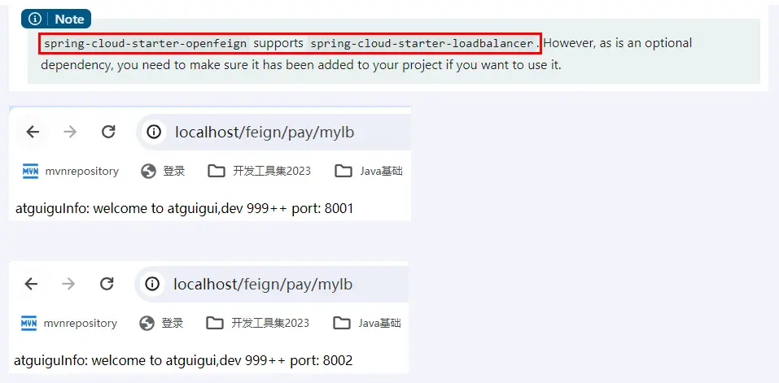

#### 小总结

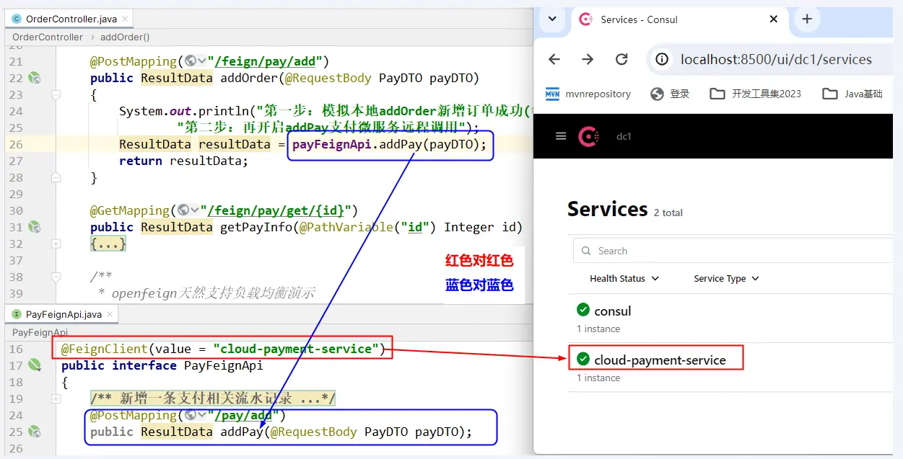

### OpenFeign 高级特性

#### OpenFeign 超时控制

##### 问题描述

在 Spring Cloud 微服务架构中，大部分公司都是利用 OpenFeign 进行服务间的调用，而比较简单的业务使用默认配置是不会有多大问题的，但是如果是业务比较复杂，服务要进行比较繁杂的业务计算，那后台很有可能会出现 Read Timeout 这个异常，因此定制化配置超时时间就有必要了。

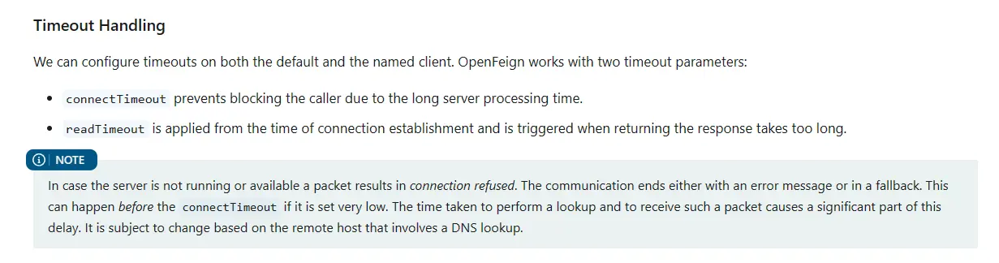

##### 模拟请求超时

1. 服务提供方 cloud-provider-payment8001 故意写暂停 62 秒钟程序

    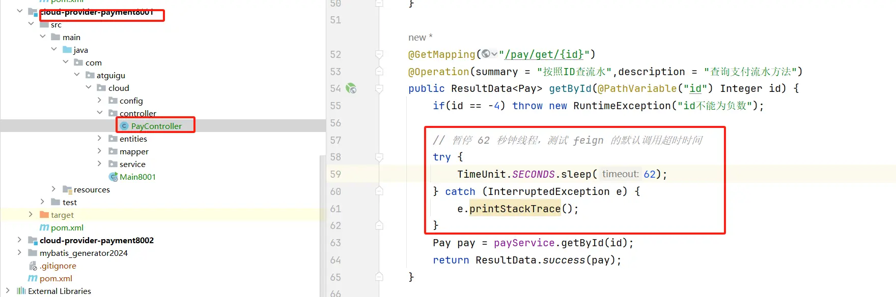

2. 服务调用方 cloud-consumer-feign-order80 写好捕捉超时异常

    ```java
    @GetMapping("/feign/pay/get/{id}")
    public ResultData getPayInfo(@PathVariable("id") Integer id) {
        System.out.println("-------支付微服务远程调用，按照id查询订单支付流水信息");
        ResultData resultData = null;
        try {
            System.out.println("调用开始-----:"+DateUtil.now());
            resultData = payFeignApi.getPayInfo(id);
        } catch (Exception e) {
            e.printStackTrace();
            System.out.println("调用结束-----:"+DateUtil.now());
            ResultData.fail(ReturnCodeEnum.RC500.getCode(),e.getMessage());
        }
        return resultData;
    }
    ```

    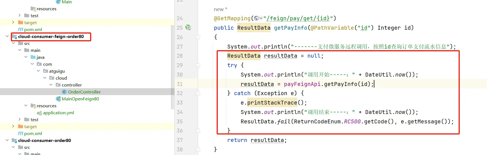

3. 测试结果 http://localhost/feign/pay/get/1

    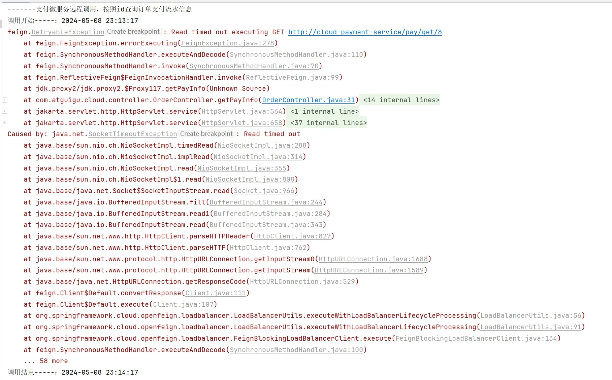

4. **结论：OpenFeign 默认等待 60 秒钟，超过后报错。**

##### 超时时间配置

- 默认 OpenFeign 客户端等待 60 秒钟，但是服务端处理超过规定时间会导致 Feign 客户端返回报错。
- 为了避免这样的情况，有时候我们需要设置 Feign 客户端的超时控制，默认 60 秒太长或者业务时间太短都不好。

在调用 OpenFeign 接口的项目的 yml 文件中开启 OpenFeign 客户端超时控制配置参数：

- connectTimeout    连接超时时间	默认 60s
- readTimeout       请求处理超时时间  默认 2s

**全局配置：**

```yml
spring: 
  cloud:
    openfeign:
      client:
        config:
          default:
            # 连接超时时间
            connectTimeout: 5000
            # 读取超时时间
            readTimeout: 5000
```

**指定配置：**

```yml
spring:
  cloud:
    openfeign:
      client:
        config:
          # default 设置的全局超时时间，指定服务名称可以设置单个服务的超时时间
          default:
            #连接超时时间
            connectTimeout: 4000
            #读取超时时间
            readTimeout: 4000
          
          # 为serviceC这个服务单独配置超时时间，单个配置的超时时间将会覆盖全局配置   
          serviceC:
            #连接超时时间
            connectTimeout: 2000
            #读取超时时间
            readTimeout: 2000
```

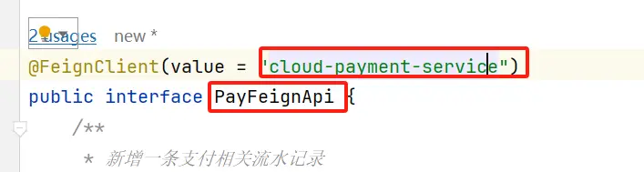

#### OpenFeign 重试机制

1. 默认重试机制是关闭的，给了默认值，调用一次后就结束。

    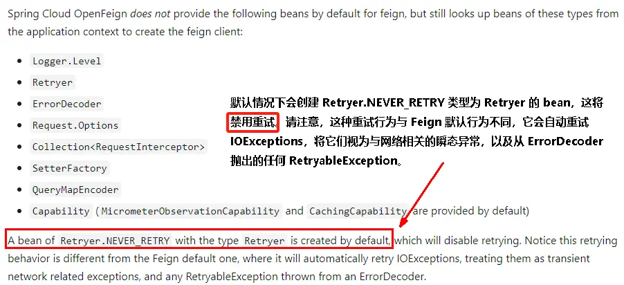

2. 开启 Retryer 功能，新增配置类 `FeignConfig` 并修改 Retryer 配置

    ```java
    package com.atguigu.cloud.config;
    
    @Configuration
    public class FeignConfig{
        @Bean
        public Retryer myRetryer() {
            //return Retryer.NEVER_RETRY; //Feign默认配置是不走重试策略的
            //最大请求次数为3(1+2)，初始间隔时间为100ms，重试间最大间隔时间为1s
            return new Retryer.Default(100,1,3);
        }
    }
    ```
    
3. 结果，总体调用 3 次。

    - 3 = 1(default)+2，一次 4s，三次 12s。
    - 目前控制台没有看到 3 次重试过程，只看到结果，是 feign 的日志打印问题。

    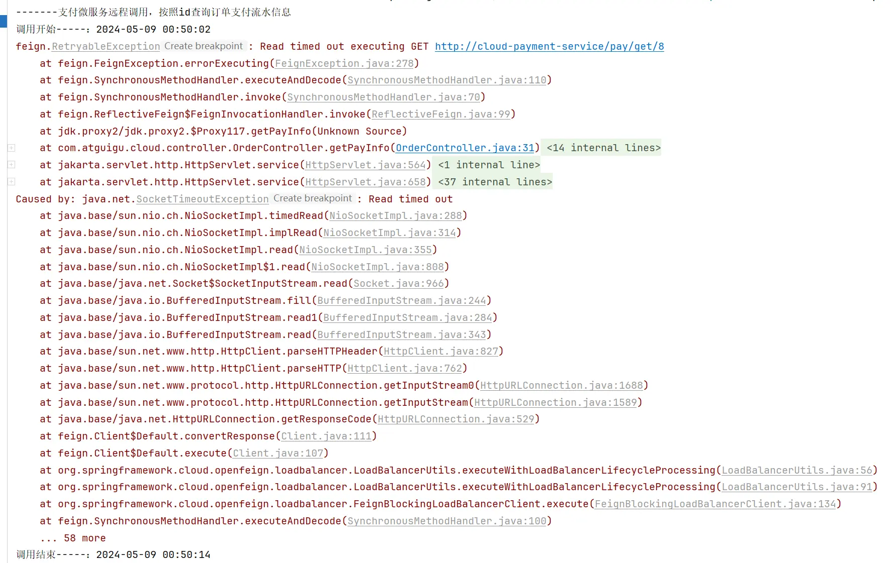

#### OpenFeign 默认 HttpClient 修改

##### 是什么

- OpenFeign 中 http client 如果不做特殊配置，OpenFeign 默认使用 JDK 自带的 `HttpURLConnection` 发送 HTTP 请求。
- 由于默认 `HttpURLConnection` 没有连接池，性能和效率比较低，如果采用默认，性能上不是最优，所以可以对其优化。

##### 为什么替换为 Apache HttpClient 5

`Apache HttpClient 5` 替换 OpenFeign 默认的 `HttpURLConnection`。

- `spring-cloud-starter-openfeign` 支持 `spring-cloud-starter-loadbalancer`。但是，作为一个可选的依赖项，如果您希望使用它，则需要确保已将其添加到项目中。
- 要使用 OkHttpClient 支持的 Feign 客户端和 Http2Client Feign 客户端，请确保您要使用的客户端位于类路径上，并分别将 `spring.cloud.openfeign.okhttp.enabled` 或 `spring.cloud.openfeign.http2client.enabled` 设置为 `true`。
- 当涉及到 Apache HttpClient 5 支持的 Feign 客户端时，确保 HttpClient 5 在类路径上就足够了，但是您仍然可以通过将 `spring.cloud.openfeign.httpclient.hc5.enabled` 设置为 ` false`  来禁用它对 Feign 客户端的使用。当使用 ApacheHC5 时，您可以通过提供 `org.apache.hc.client5.http.impl.classic.CloseableHttpClient` 的 bean 来定制所使用的 HTTP 客户端。

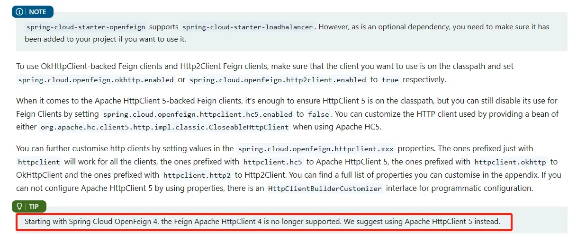

##### 修改微服务 cloud-consumer-openfeign-order80

1. FeignConfig 类里面将 Retryer 属性修改为默认

    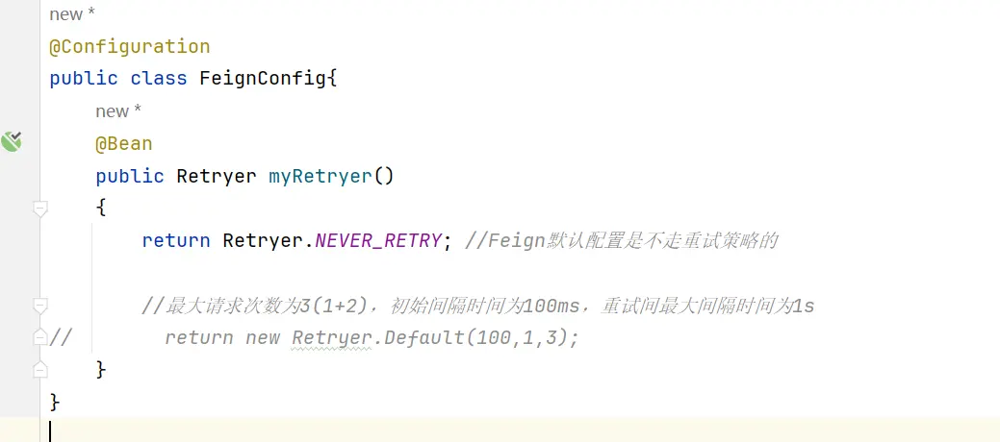

2. 添加依赖

    ```xml
     <!-- httpclient5-->
    <dependency>
        <groupId>org.apache.httpcomponents.client5</groupId>
        <artifactId>httpclient5</artifactId>
        <version>5.3</version>
    </dependency>
    <!-- feign-hc5-->
    <dependency>
        <groupId>io.github.openfeign</groupId>
        <artifactId>feign-hc5</artifactId>
        <version>13.1</version>
    </dependency>
    ```

3. Apache HttpClient5 配置开启

    ```yml
    #  Apache HttpClient5 配置开启
    spring:
      cloud:
        openfeign:
          httpclient:
            hc5:
              enabled: true
    ```

#### OpenFeign 请求/响应压缩

##### 官网说明

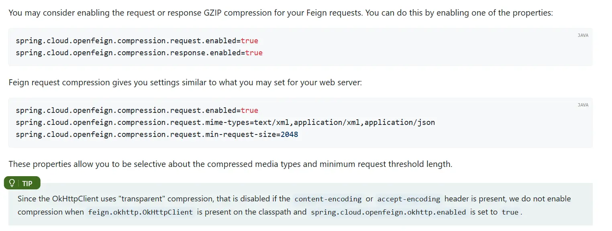

##### 是什么

**对请求和响应进行 GZIP 压缩：**

Spring Cloud OpenFeign 支持对请求和响应进行 GZIP 压缩，以减少通信过程中的性能损耗。

通过下面的两个参数设置，就能开启请求与相应的压缩功能：

```yml
spring.cloud.openfeign.compression.request.enabled=true
spring.cloud.openfeign.compression.response.enabled=true
```

**细粒度化设置：**

对请求压缩做一些更细致的设置，比如下面的配置内容指定压缩的请求数据类型并设置了请求压缩的大小下限，只有超过这个大小的请求才会进行压缩：

```yml
spring.cloud.openfeign.compression.request.enabled=true
spring.cloud.openfeign.compression.request.mime-types=text/xml,application/xml,application/json #触发压缩数据类型
spring.cloud.openfeign.compression.request.min-request-size=2048 #最小触发压缩的大小
```

##### yml

```yml
spring:
  application:
    name: cloud-consumer-openfeign-order
  ####Spring Cloud Consul for Service Discovery
  cloud:
    consul:
      host: localhost
      port: 8500
      discovery:
        prefer-ip-address: true #优先使用服务ip进行注册
        service-name: ${spring.application.name}
    openfeign:
      client:
        config:
          default:
          #cloud-payment-service:
            #连接超时时间
            connectTimeout: 4000
            #读取超时时间
             readTimeout: 4000
      httpclient:
        hc5:
          enabled: true
      compression:
        request:
          enabled: true
          min-request-size: 2048 #最小触发压缩的大小
          mime-types: text/xml,application/xml,application/json #触发压缩数据类型
        response:
          enabled: true
```

注：压缩效果测试在下一章节体现

#### OpenFeign 日志打印功能

##### 日志打印功能是什么

Feign 提供了日志打印功能，我们可以通过配置来调整日志级别，从而了解 Feign 中 Http 请求的细节，说白了就是对 Feign 接口的调用情况进行监控和输出。

##### 日志级别

- `NONE`：默认的，不显示任何日志；
- `BASIC`：仅记录请求方法、URL、响应状态码及执行时间；
- `HEADERS`：除了 `BASIC` 中定义的信息之外，还有请求和响应的头信息；
- `FULL`：除了 `HEADERS` 中定义的信息之外，还有请求和响应的正文及元数据。

##### 配置日志 bean feignLoggerLevel

```java
package com.atguigu.cloud.config;

@Configuration
public class FeignConfig{
    @Bean
    public Retryer myRetryer() {
        return Retryer.NEVER_RETRY; //Feign默认配置是不走重试策略的
        //最大请求次数为3(1+2)，初始间隔时间为100ms，重试间最大间隔时间为1s
//        return new Retryer.Default(100,1,3);
    }

    @Bean
    Logger.Level feignLoggerLevel() {
        return Logger.Level.FULL;
    }
}
```

##### YML 文件里需要开启日志的 Feign 客户端

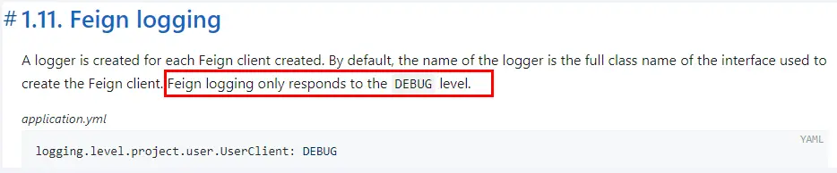

公式（三段）：**logging.level** + 含有 `@FeignClient` 注解的完整带包名的接口名+debug

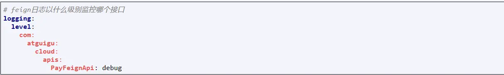

```yml
# feign日志以什么级别监控哪个接口
logging:
  level:
    com:
      atguigu:
        cloud:
          apis:
            PayFeignApi: debug 
```

##### 后台日志查看

**带着压缩调用：**

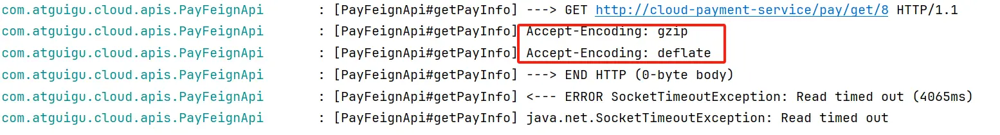

**去掉压缩调用：**

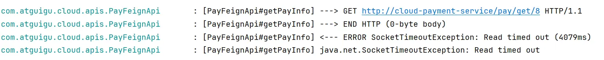

##### 补充实验，重试机制

1. 类 `FeignConfig` 恢复为重试 3 次
2. 控制台看到 3 次过程

### OpenFeign 和 Sentinel 集成实现 fallback 服务降级

<font color="red">见后续 springcloud alibaba 篇章。</font>

## Circuit Breaker 断路器

### Hystrix 目前也进入维护模式

#### 是什么

Hystrix 是一个**用于处理分布式系统的延迟和容错的开源库**，在分布式系统里，许多依赖不可避免的会调用失败，比如超时、异常等，Hystrix 能够保证在一个依赖出问题的情况下，不会导致整体服务失败，避免级联故障，以提高分布式系统的弹性。

#### Hystrix 官宣，停更进维

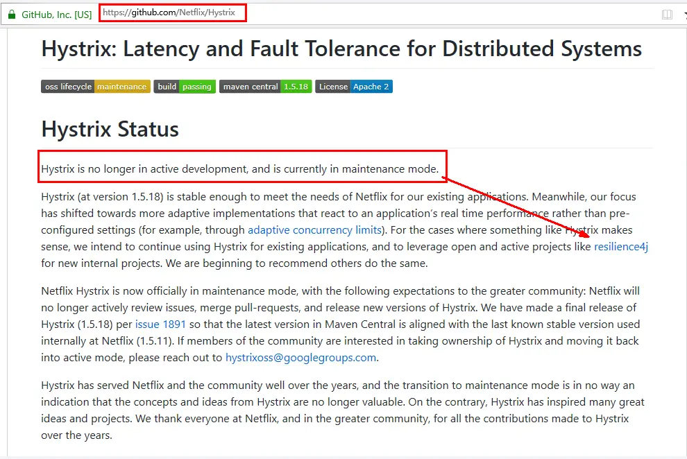

#### Hystrix 未来替换方案：Resilience4j

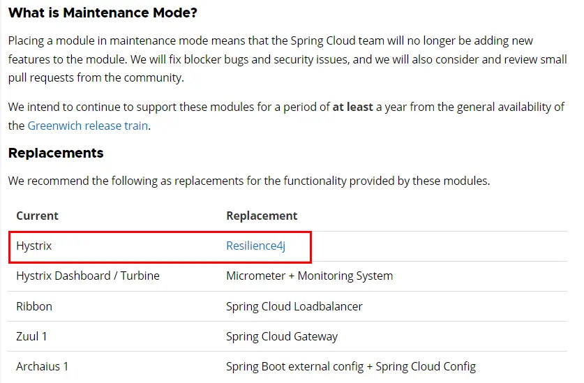

### Circuit Breaker 概述

#### 2023 年影响极大的真实生产故障

1. 语雀崩了(2023.10.23)
2. 阿里系大部分产品(2023.11.12)
3. 阿里云产品控制台

#### 分布式系统面临的问题

**复杂分布式体系结构中的应用程序有数十个依赖关系，每个依赖关系在某些时候将不可避免地失败。**

**服务雪崩**：

- 多个微服务之间调用的时候，假设微服务 A 调用微服务 B 和微服务 C，微服务 B 和微服务 C 又调用其它的微服务，这就是所谓的“扇出”。如果扇出的链路上某个微服务的调用响应时间过长或者不可用，对微服务 A 的调用就会占用越来越多的系统资源，进而引起系统崩溃，所谓的“雪崩效应”。
- 对于高流量的应用来说，单一的后端依赖可能会导致所有服务器上的所有资源都在几秒钟内饱和。比失败更糟糕的是，这些应用程序还可能导致服务之间的延迟增加，备份队列，线程和其他系统资源紧张，导致整个系统发生更多的级联故障。这些都表示需要对故障和延迟进行隔离和管理，以便单个依赖关系的失败，不能取消整个应用程序或系统。
- 所以，通常当你发现一个模块下的某个实例失败后，这时候这个模块依然还会接收流量，然后这个有问题的模块还调用了其他的模块，这样就会发生级联故障，或者叫雪崩。

#### 诉求

1. **问题**
    - 禁止服务雪崩故障
2. **解决**
    - 有问题的节点，快速熔断（快速返回失败处理或者返回默认兜底数据【服务降级】）。

 

- ”断路器”本身是一种开关装置，当某个服务单元发生故障之后，通过断路器的故障监控（类似熔断保险丝），向调用方返回一个符合预期的、可处理的备选响应(FallBack)，而不是长时间的等待或者抛出调用方无法处理的异常，这样就保证了服务调用方的线程不会被长时间、不必要地占用，从而避免了故障在分布式系统中的蔓延，乃至雪崩。
- 一句话，**出故障了“保险丝”跳闸，别把整个家给烧了。**

#### 如何避免系统大面积故障

**Spring Cloud Circuit Breaker**

1. 服务熔断
    - 类比保险丝，保险丝闭合状态(CLOSE)可以正常使用，当达到最大服务访问后，直接拒绝访问跳闸限电(OPEN)，此刻调用方会接受服务降级的处理并返回友好兜底提示。
    - 就是家里保险丝，从闭合 CLOSE 供电状态→跳闸 OPEN 打开状态。
2. 服务降级
    - 服务器忙，请稍后再试。
    - 不让客户端等待并立刻返回一个友好提示，fallback。
3. 服务限流
    - 秒杀高并发等操作，严禁一窝蜂的过来拥挤，大家排队，一秒钟 N 个，有序进行。
4. 服务限时
5. 服务预热
6. 接近实时的监控
7. 兜底处理动作
8. ......

### [Crcuit Breaker](https://spring.io/projects/spring-cloud-circuitbreaker/#overview) 是什么

- CircuitBreaker 的目的是保护分布式系统免受故障和异常，提高系统的可用性和健壮性。
- 当一个组件或服务出现故障时，CircuitBreaker 会迅速切换到 OPEN 状态（保险丝跳闸断电），阻止请求发送到该组件或服，从而避免更多的请求发送到该组件或服务。这可以减少对该组件或服务的负载，防止该组件或服务进一步崩溃，并使整个系统能够继续正常运行。
- 同时，CircuitBreaker 还可以提高系统的可用性和健壮性，因为它可以在分布式系统的各个组件之间自动切换，从而避免单点故障的问题。

**Circuit Breaker 只是一套规范和接口，落地实现者是 Resilience4J。**

### [Resilience4J](https://github.com/resilience4j/resilience4j#1-introduction)

#### 是什么

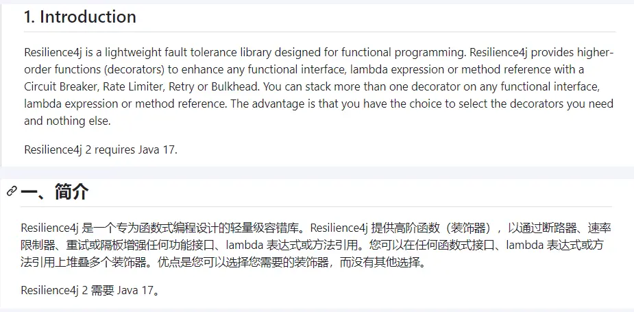

#### 能干啥

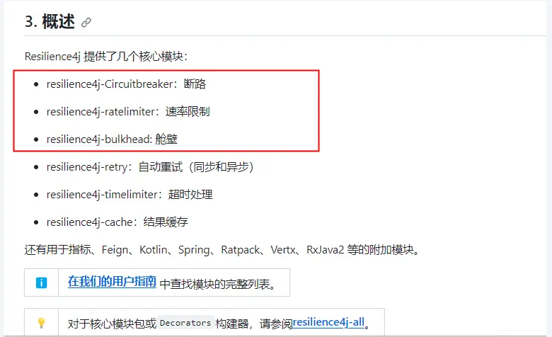

#### 怎么玩

[官网](https://resilience4j.readme.io/docs/circuitbreaker)

[中文手册](https://github.com/lmhmhl/Resilience4j-Guides-Chinese/blob/main/index.md)

### 案例实战

#### 熔断(CircuitBreaker)（服务熔断+服务降级）

##### 断路器 3 大状态

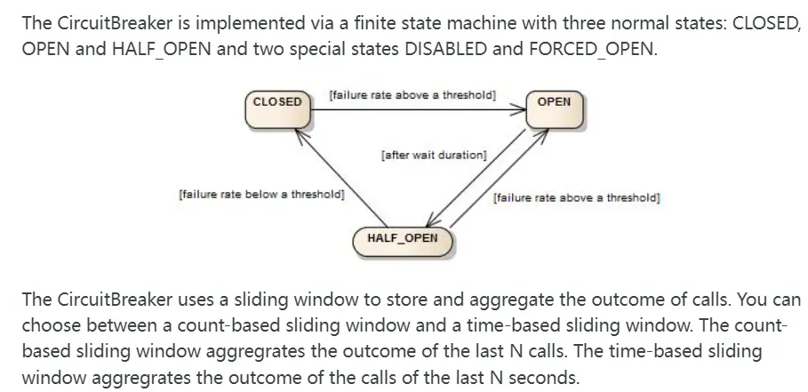

##### 断路器 3 大状态之间的转换

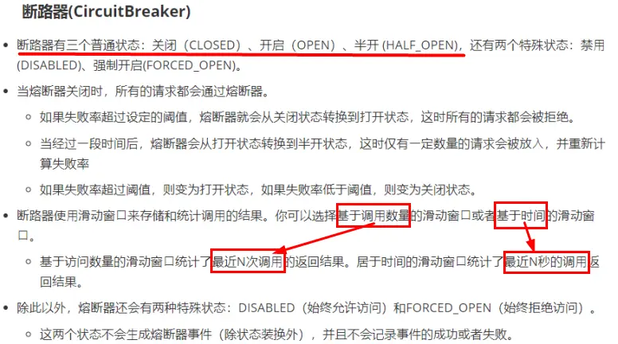

##### 断路器所有配置参数参考

[CircuitBreaker (readme.io)](https://resilience4j.readme.io/docs/circuitbreaker#create-and-configure-a-circuitbreaker)

[Resilience4j-Guides-Chinese (github.com)](https://github.com/lmhmhl/Resilience4j-Guides-Chinese/blob/main/core-modules/CircuitBreaker.md)

默认 CircuitBreaker.java 配置类：`io.github.resilience4j.circuitbreaker.CircuitBreakerConfig`

中文手册简洁版：

| 配置属性                                         | 默认值 | 描述                                                         |
| - | - | - |
| `failure-rate-threshold`                         | 50     | 以百分比配置失败率峰值                                   |
| `sliding-window-type`                            | COUNT_BASED | 断路器的滑动窗口期类型 可以基于“次数”（`COUNT_BASED`）或者“时间”（`TIME_BASED`）进行熔断，默认是 `COUNT_BASED`。 |
| `sliding-window-size`                            | 100 | 若`COUNT_BASED`，则 10 次调用中有 50%失败（即 5 次）打开熔断断路器；若为 TIME_BASED 则，此时还有额外的两个设置属性，含义为：在 N 秒内（`sliding-window-size`）100%（`slow-call-rate-threshold`）的请求超过 N 秒（`slow-call-duration-threshold`）打开断路器。 |
| `slowCallRateThreshold`                        | 100 | 以百分比的方式配置，断路器把调用时间大于 `slowCallDurationThreshold` 的调用视为慢调用，当慢调用比例大于等于峰值时，断路器开启，并进入服务降级。 |
| `slowCallDurationThreshold`                    | 60000 [ms] | 配置调用时间的峰值，高于该峰值的视为慢调用。             |
| `permitted-number-of-calls-in-half-open-state` | 10 | 运行断路器在 `HALF_OPEN` 状态下时进行 N 次调用，如果故障或慢速调用仍然高于阈值，断路器再次进入打开状态。 |
| `minimum-number-of-calls`                      | 100 | 在每个滑动窗口期样本数，配置断路器计算错误率或者慢调用率的最小调用数。比如设置为 5 意味着，在计算故障率之前，必须至少调用 5 次。如果只记录了 4 次，即使 4 次都失败了，断路器也不会进入到打开状态。 |
| `wait-duration-in-open-state`                  | 60000 [ms] | 从 `OPEN` 到 `HALF_OPEN` 状态需要等待的时间              |

##### 熔断+降级案例需求说明

- 6 次访问中当执行方法的失败率达到 **50%** 时 **CircuitBreaker** 将进入开启 **OPEN** 状态**(**保险丝跳闸断电**)**拒绝所有请求。
- 等待**5**秒后，**CircuitBreaker** 将自动从开启 **OPEN** 状态过渡到半开 **HALF_OPEN** 状态，允许一些请求通过以测试服务是否恢复正常。
- 如还是异常 **CircuitBreaker** 将重新进入开启 **OPEN** 状态；如正常将进入关闭 **CLOSE** 闭合状态恢复正常处理请求。

 具体时间和频次等属性见具体实际案例，这里只是作为 case 举例讲解。

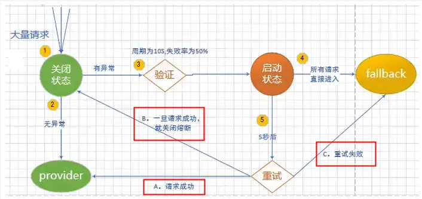

##### 基于计数的滑动窗口 COUNT_BASED

1. 修改 cloud-provider-payment8001

    - 新建 PayCircuitController

        ```java
        package com.atguigu.cloud.controller;
        
        @RestController
        public class PayCircuitController {
            //=========Resilience4j CircuitBreaker 的例子
            @GetMapping(value = "/pay/circuit/{id}")
            public String myCircuit(@PathVariable("id") Integer id) {
                if (id == -4) throw new RuntimeException("----circuit id 不能负数");
                if (id == 9999) {
                    try {
                        TimeUnit.SECONDS.sleep(5);
                    } catch (InterruptedException e) {
                        e.printStackTrace();
                    }
                }
                return "Hello, circuit! inputId:  " + id + " \t " + IdUtil.simpleUUID();
            }
        }
        ```
    
2. cloud-api-commons 中 PayFeignApi 接口新增方法

    ```java
    /**
    * Resilience4j CircuitBreaker 的例子
    * @param id
    * @return
    */
    @GetMapping(value = "/pay/circuit/{id}")
    public String myCircuit(@PathVariable("id") Integer id);
    ```

3. 修改 cloud-consumer-feign-order80

    - pom.xml 新增依赖

        ```xml
        <!--resilience4j-circuitbreaker-->
        <dependency>
            <groupId>org.springframework.cloud</groupId>
            <artifactId>spring-cloud-starter-circuitbreaker-resilience4j</artifactId>
        </dependency>
        <!-- 由于断路保护等需要AOP实现，所以必须导入AOP包 -->
        <dependency>
            <groupId>org.springframework.boot</groupId>
            <artifactId>spring-boot-starter-aop</artifactId>
        </dependency>
        ```

    - yml 新增配置（展示效果时 openfeign 超时时间设置为 20s）

        ```yml
        spring:
          cloud:
            openfeign:
        	  # 开启circuitbreaker和分组激活 spring.cloud.openfeign.circuitbreaker.enabled
        	  # 默认不开启分组。
              # 精确优先就是每个服务调用都将根据其所属的熔断器分组继续处理。
              # 策略优先级：精确优先、分组次之(开了分组)、默认最后
              circuitbreaker:
                enabled: true
                group:
                  enabled: true #没开分组永远不用分组的配置。精确优先、分组次之(开了分组)、默认最后
                  
        # Resilience4j CircuitBreaker 按照次数：COUNT_BASED 的例子
        #  6次访问中当执行方法的失败率达到50%时CircuitBreaker将进入开启OPEN状态(保险丝跳闸断电)拒绝所有请求。
        #  等待5秒后，CircuitBreaker 将自动从开启OPEN状态过渡到半开HALF_OPEN状态，允许一些请求通过以测试服务是否恢复正常。
        #  如还是异常CircuitBreaker 将重新进入开启OPEN状态；如正常将进入关闭CLOSE闭合状态恢复正常处理请求。
        resilience4j:
          circuitbreaker:
            configs:
              default:
                failureRateThreshold: 50 #设置50%的调用失败时打开断路器，超过失败请求百分⽐CircuitBreaker变为OPEN状态。
                slidingWindowType: COUNT_BASED # 滑动窗口的类型
                slidingWindowSize: 6 #滑动窗⼝的⼤⼩配置COUNT_BASED表示6个请求，配置TIME_BASED表示6秒
                minimumNumberOfCalls: 6 #断路器计算失败率或慢调用率之前所需的最小样本(每个滑动窗口周期)。如果minimumNumberOfCalls为10，则必须最少记录10个样本，然后才能计算失败率。如果只记录了9次调用，即使所有9次调用都失败，断路器也不会开启。
                automaticTransitionFromOpenToHalfOpenEnabled: true # 是否启用自动从开启状态过渡到半开状态，默认值为false。如果启用，CircuitBreaker将自动从开启状态过渡到半开状态，并允许一些请求通过以测试服务是否恢复正常
                waitDurationInOpenState: 5s #从OPEN到HALF_OPEN状态需要等待的时间
                permittedNumberOfCallsInHalfOpenState: 2 #半开状态允许的最大请求数，默认值为10。在半开状态下，CircuitBreaker将允许最多permittedNumberOfCallsInHalfOpenState个请求通过，如果其中有任何一个请求失败，CircuitBreaker将重新进入开启状态。
                recordExceptions:
                  - java.lang.Exception
            instances:
              cloud-payment-service:
                baseConfig: default
        ```

    - 新建 OrderCircuitController

        ```java
        package com.atguigu.cloud.controller;
        
        @RestController
        public class OrderCircuitController {
            @Resource
            private PayFeignApi payFeignApi;
        
            @GetMapping(value = "/feign/pay/circuit/{id}")
            @CircuitBreaker(name = "cloud-payment-service", fallbackMethod = "myCircuitFallback")
            public String myCircuitBreaker(@PathVariable("id") Integer id) {
                return payFeignApi.myCircuit(id);
            }
        
            // myCircuitFallback就是服务降级后的兜底处理方法
            public String myCircuitFallback(Integer id, Throwable t) {
                // 这里是容错处理逻辑，返回备用结果
                return "myCircuitFallback，系统繁忙，请稍后再试-----/(ㄒoㄒ)/~~";
            }
        }
        ```

        系统繁忙，请稍后再试。不让调用者等待并立刻返回一个友好提示，fallback。

4. 测试（按照错误次数达到多少后开启断路）

    - 正确请求：http://localhost/feign/pay/circuit/11
    - 错误请求：http://localhost/feign/pay/circuit/-4
    - 一次 error 一次 OK，第 6 次时调正确的也失败。
        - 失败 50%错误后触发熔断并给出服务降级，告知调用者服务不可用。
        - 此时就算是输入正确的访问地址也无法调用服务（我明明是正确的也不让用/(ㄒoㄒ）/~~)，它还在断路中（OPEN 状态），一会儿过度到半开并继续正确地址访问，慢慢切换回 CLOSE 状态，可以正常访问了链路回复。
    - 多次故意填写错误值。
        - 多次故意填写错误值（负 4），然后慢慢填写正确值（正整数 11），发现刚开始不满足条件，就算是正确的访问地址也不能进行。

##### 基于时间的滑动窗口 TIME_BASED

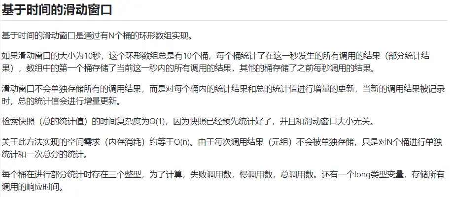

1. 修改 cloud-consumer-feign-order80 YML

    ```yml
    # Resilience4j CircuitBreaker 按照时间：TIME_BASED 的例子
    resilience4j:
      timelimiter:
        configs:
          default:
            timeout-duration: 10s #神坑的位置，timelimiter 默认限制远程1s，超于1s就超时异常，配置了降级，就走降级逻辑
      circuitbreaker:
        configs:
          default:
            failureRateThreshold: 50 #设置50%的调用失败时打开断路器，超过失败请求百分⽐CircuitBreaker变为OPEN状态。
            slowCallDurationThreshold: 2s #慢调用时间阈值，高于这个阈值的视为慢调用并增加慢调用比例。
            slowCallRateThreshold: 30 #慢调用百分比峰值，断路器把调用时间⼤于slowCallDurationThreshold，视为慢调用，当慢调用比例高于阈值，断路器打开，并开启服务降级
            slidingWindowType: TIME_BASED # 滑动窗口的类型
            slidingWindowSize: 2 #滑动窗口的大小配置，配置TIME_BASED表示2秒
            minimumNumberOfCalls: 2 #断路器计算失败率或慢调用率之前所需的最小样本(每个滑动窗口周期)。
            permittedNumberOfCallsInHalfOpenState: 2 #半开状态允许的最大请求数，默认值为10。
            waitDurationInOpenState: 5s #从OPEN到HALF_OPEN状态需要等待的时间
            recordExceptions:
              - java.lang.Exception
        instances:
          cloud-payment-service:
            baseConfig: default
    ```

2. 为避免影响实验效果，记得关闭，FeignConfig 自己写的重试 3 次

3. 测试（慢查询）

    - 一次超时，一次正常访问，同时进行
        - http://localhost/feign/pay/circuit/9999：故意超时，将会单独报错
        - http://localhost/feign/pay/circuit/11：可以访问，我是正常的
    - 多个超时请求，一次正常访问，同时进行。
        - 正常访问也受到了牵连，因为服务熔断不能访问了。

##### 小总结

**断路器开启或者关闭的条件：**

1. 当满足一定的峰值和失败率达到一定条件后，断路器将会进入 OPEN 状态（保险丝跳闸），服务熔断。
2. 当 OPEN 的时候，所有请求都不会调用主业务逻辑方法，而是直接走 fallback method 兜底背锅方法，服务降级。
3. 一段时间之后，这个时候断路器会从 OPEN 进入到 HALF_OPEN 半开状态，会放几个请求过去探探链路是否通？
    - 如成功，断路器会关闭 CLOSE（类似保险丝闭合，恢复可用）；
    - 如失败，继续开启。重复上述。

<font color="red">注：建议不要混合用，推荐按照调用次数 count_based。</font>

#### 隔离(BulkHead)

##### 是什么

[Bulkhead (readme.io)](https://resilience4j.readme.io/docs/bulkhead)

[Resilience4j-Guides-Chinese (github.com)](https://github.com/lmhmhl/Resilience4j-Guides-Chinese/blob/main/core-modules/bulkhead.md)

bulkhead：（船的）舱壁/（飞机的）隔板

隔板来自造船行业，床仓内部一般会分成很多小隔舱，一旦一个隔舱漏水因为隔板的存在而不至于影响其它隔舱和整体船。

限制并发量。

##### 能干啥

**依赖隔离&负载保护：用来限制对于下游服务的最大并发数量的限制**

##### 两种隔离实现方式

Resilience4j 提供了如下两种隔离的实现方式，可以限制并发执行的数量：

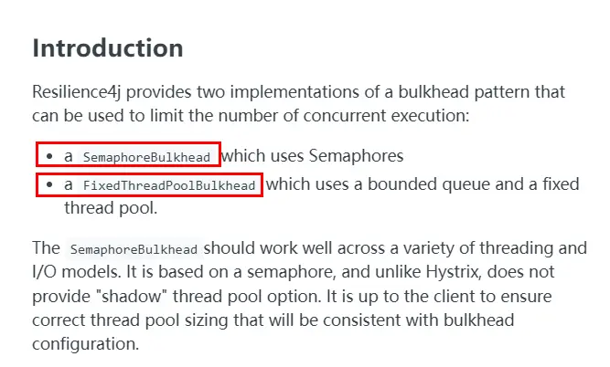

##### 实现 SemaphoreBulkhead（信号量舱壁）

###### 概述

基本上就是 JUC 信号灯内容的同样思想

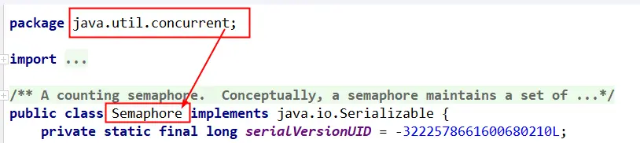

**信号量舱壁(SemaphoreBulkhead)原理：**

- 当信号量有空闲时，进入系统的请求会直接获取信号量并开始业务处理。
- 当信号量全被占用时，接下来的请求将会进入阻塞状态，SemaphoreBulkhead 提供了一个阻塞计时器，
    - 如果阻塞状态的请求在阻塞计时内无法获取到信号量则系统会拒绝这些请求。
    - 若请求在阻塞计时内获取到了信号量，那将直接获取信号量并执行相应的业务处理。

类：`io.github.resilience4j.bulkhead.internal.SemaphoreBulkhead`

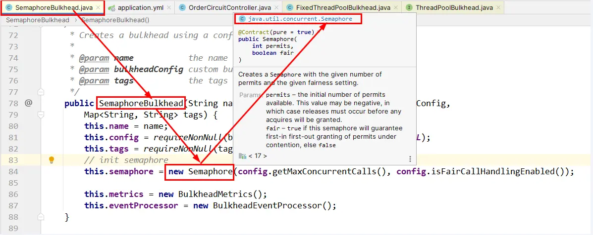

###### 实战

| 属性配置             | 默认值 | 描述                                                         |
| -------------------- | ------ | ------------------------------------------------------------ |
| `maxConcurrentCalls` | 25     | 隔离允许线程并发执行的最大数量                               |
| `maxWaitDuration`    | 0      | 当达到并发调用数量时，新的线程执行时将被阻塞，这个属性表示最长的等待时间。 |

1. cloud-provider-payment8001 支付微服务修改 PayCircuitController

    ```java
    //=========Resilience4j bulkhead 的例子
    @GetMapping(value = "/pay/bulkhead/{id}")
    public String myBulkhead(@PathVariable("id") Integer id) {
        if (id == -4) throw new RuntimeException("----bulkhead id 不能-4");
        if (id == 9999) {
            try {
                TimeUnit.SECONDS.sleep(5);
            } catch (InterruptedException e) {
                e.printStackTrace();
            }
        }
    
        return "Hello, bulkhead! inputId:  " + id + " \t " + IdUtil.simpleUUID();
    }
    ```

2. PayFeignApi 接口新增舱壁 api 方法

    ```java
    /**
     * Resilience4j Bulkhead 的例子
     * @param id
     * @return
     */
    @GetMapping(value = "/pay/bulkhead/{id}")
    public String myBulkhead(@PathVariable("id") Integer id);
    ```

3. cloud-consumer-feign-order80

    -  POM.xml 新增依赖

    ```xml
    <!--resilience4j-bulkhead-->
    <dependency>
        <groupId>io.github.resilience4j</groupId>
        <artifactId>resilience4j-bulkhead</artifactId>
    </dependency>
    ```

    - yml 新增 bulkhead 配置

    ```yml
    #### resilience4j bulkhead 的例子
    resilience4j:
      bulkhead:
        configs:
          default:
            maxConcurrentCalls: 2 # 隔离允许并发线程执行的最大数量
            maxWaitDuration: 1s # 当达到并发调用数量时，新的线程的阻塞时间，我只愿意等待1秒，过时不候进舱壁兜底fallback
        instances:
          cloud-payment-service:
            baseConfig: default
      timelimiter:
        configs:
          default:
            timeout-duration: 20s
    ```

    - OrderCircuitController 业务类新增方法

    ```java
    /**
    * (船的)舱壁,隔离
    * @param id
    * @return
    */
    @GetMapping(value = "/feign/pay/bulkhead/{id}")
    @Bulkhead(name = "cloud-payment-service", fallbackMethod = "myBulkheadFallback", type = Bulkhead.Type.SEMAPHORE)
    public String myBulkhead(@PathVariable("id") Integer id) {
        return payFeignApi.myBulkhead(id);
    }
    
    public String myBulkheadFallback(Throwable t) {
        return "myBulkheadFallback，隔板超出最大数量限制，系统繁忙，请稍后再试-----/(ㄒoㄒ)/~~";
    }
    ```

4. 测试

    - 步骤

        - 浏览器新打开 2 个窗口，各点一次，分别点击 http://localhost/feign/pay/bulkhead/9999
        - 每个请求调用需要耗时 5 秒，2 个线程瞬间达到配置过的最大并发数 2
        - 此时第 3 个请求正常的请求访问http://localhost/feign/pay/bulkhead/3 直接被舱壁限制隔离了，访问不到 8001
        - 等其中一个窗口停止了，再去正常访问，并发数小于 2 了，就可以正常访问

    - 结果

        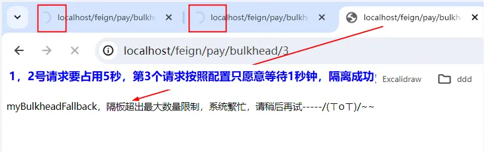

        - 可以看到因为本案例并发线程数为 2(maxConcurrentCalls: 2)，只让 2 个线程进入执行，其他请求降直接降级。

##### 实现 FixedThreadPoolBulkhead（固定线程池舱壁）

###### 概述

基本上就是 JUC-线程池内容的同样思想

- FixedThreadPoolBulkhead 的功能与 SemaphoreBulkhead 一样也是 **用于限制并发执行的次数** 的，但是二者的实现原理存在差别而且表现效果也存在细微的差别。FixedThreadPoolBulkhead 使用一个固定线程池和一个等待队列来实现舱壁。
- 当线程池中存在空闲时，则此时进入系统的请求将直接进入线程池开启新线程或使用空闲线程来处理请求。
- 当线程池中无空闲时时，接下来的请求将进入等待队列，
- 若等待队列仍然无剩余空间时接下来的请求将直接被拒绝，
- 在队列中的请求等待线程池出现空闲时，将进入线程池进行业务处理。
- 另外：ThreadPoolBulkhead 只对 CompletableFuture 方法有效，所以必须创建返回 CompletableFuture 类型的方法。

类：`io.github.resilience4j.bulkhead.internal.FixedThreadPoolBulkhead`

底层就是 JUC 里面的线程池 ThreadPoolExecutor 

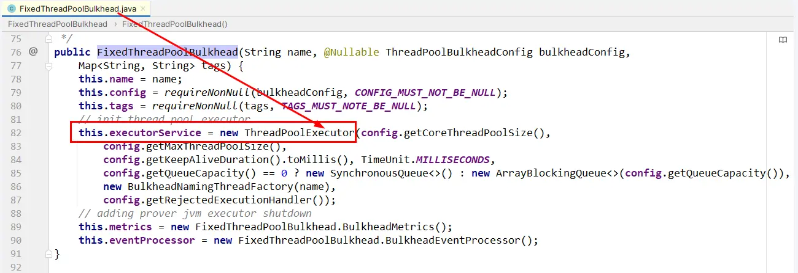

submit 进线程池返回 `CompletableFuture<T>`

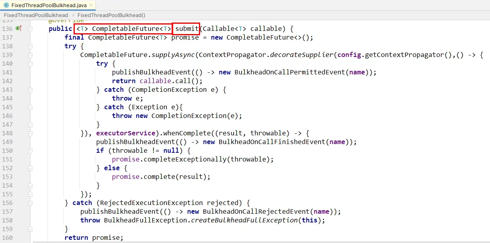

###### 实战

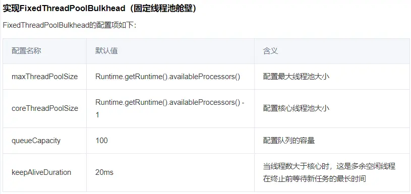

1. 修改 cloud-consumer-feign-order80

    - POM 增加依赖（同上）

    - YML

        ```yml
        ####resilience4j bulkhead -THREADPOOL的例子
        resilience4j:
          timelimiter:
            configs:
              default:
                timeout-duration: 10s #timelimiter默认限制远程1s，超过报错不好演示效果所以加上10秒
          thread-pool-bulkhead:
            configs:
              default:
                core-thread-pool-size: 1
                max-thread-pool-size: 1
                queue-capacity: 1
            instances:
              cloud-payment-service:
                baseConfig: default
        # spring.cloud.openfeign.circuitbreaker.group.enabled 请设置为false 新启线程和原来主线程脱离
        ```

        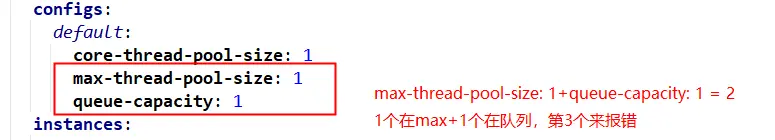

    - OrderCircuitController 业务类新增方法（注释原/feign/pay/bulkhead/{id}请求方法）

        ```java
        /**
        * (船的)舱壁,隔离,THREADPOOL
        * @param id
        * @return
        */
        @GetMapping(value = "/feign/pay/bulkhead/{id}")
        @Bulkhead(name = "cloud-payment-service", fallbackMethod = "myBulkheadPoolFallback", type = Bulkhead.Type.THREADPOOL)
        public CompletableFuture<String> myBulkheadTHREADPOOL(@PathVariable("id") Integer id) {
            System.out.println(Thread.currentThread().getName() + "\t" + "enter the method!!!");
            try {
                TimeUnit.SECONDS.sleep(3);
            } catch (InterruptedException e) {
                e.printStackTrace();
            }
            System.out.println(Thread.currentThread().getName() + "\t" + "exist the method!!!");
        
            return CompletableFuture.supplyAsync(() -> payFeignApi.myBulkhead(id) + "\t" + " Bulkhead.Type.THREADPOOL");
        }
        
        public CompletableFuture<String> myBulkheadPoolFallback(Integer id, Throwable t) {
            return CompletableFuture.supplyAsync(() -> "Bulkhead.Type.THREADPOOL，系统繁忙，请稍后再试-----/(ㄒoㄒ)/~~");
        }
        ```
    
2. 测试地址

    - http://localhost/feign/pay/bulkhead/1
    - http://localhost/feign/pay/bulkhead/2
    - http://localhost/feign/pay/bulkhead/3

    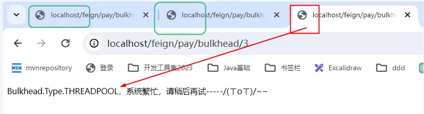

#### 限流(RateLimiter)

##### 是什么

[RateLimiter (readme.io)](https://resilience4j.readme.io/docs/ratelimiter)

[ratelimiter-Chinese (github.com)](https://github.com/lmhmhl/Resilience4j-Guides-Chinese/blob/main/core-modules/ratelimiter.md)

**限流（频率控制）**

- 限流就是限制最大访问流量。系统能提供的最大并发是有限的，同时来的请求又太多，就需要限流。 

    - 比如商城秒杀业务，瞬时大量请求涌入，服务器忙不过就只好排队限流了，和去景点排队买票和去医院办理业务排队等号道理相同。

- 所谓限流，就是通过对并发访问/请求进行限速，或者对一个时间窗口内的请求进行限速，以保护应用系统，一旦达到限制速率则可以拒绝服务、排队或等待、降级等处理。


##### 常见限流算法

###### 漏斗算法(Leaky Bucket)

- 一个固定容量的漏桶，按照设定常量固定速率流出水滴，类似医院打吊针，不管源头流量多大，设定匀速流出。 
- 如果流入水滴超出了桶的容量，则流入的水滴将会溢出了（被丢弃），而漏桶容量是不变的。

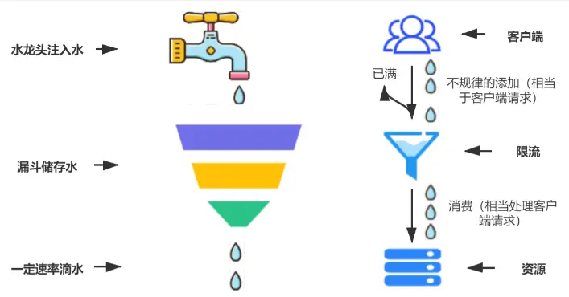

**缺点：**有两个变量，一个是桶的大小，支持流量突发增多时可以存多少的水(burst)，另一个是**水桶漏洞的大小(rate)**。因为漏桶的漏出速率是固定的参数，所以，即使网络中不存在资源冲突（没有发生拥塞），漏桶算法也不能使流突发(burst)到端口速率。因此，**漏桶算法对于存在突发特性的流量来说缺乏效率。**

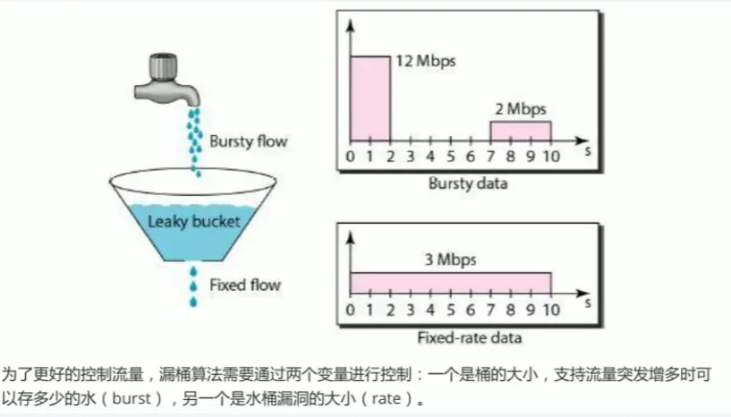

###### 令牌桶算法(Token Bucket)

SpringCloud 默认使用该算法。

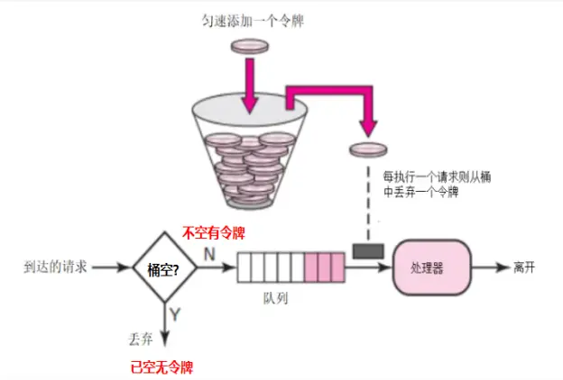

###### 滚动时间窗口(tumbling time window)

- 允许固定数量的请求进入（比如 1 秒取 4 个数据相加，超过 25 值就 over），超过数量就拒绝或者排队，等下一个时间段进入。
- 由于是在一个时间间隔内进行限制，如果用户在上个时间间隔结束前请求（但没有超过限制），同时在当前时间间隔刚开始请求（同样没超过限制），在各自的时间间隔内，这些请求都是正常的。下图统计了 3 次，but......


**缺点**：间隔临界的一段时间内的请求就会超过系统限制，可能导致系统被压垮。

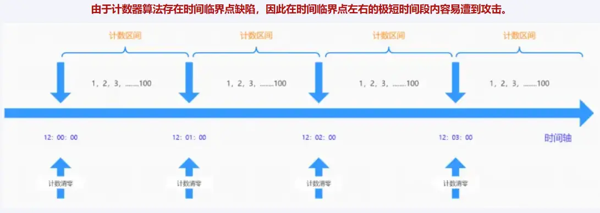

###### 滑动时间窗口(sliding time window)

- 顾名思义，该时间窗口是滑动的。所以，从概念上讲，这里有两个方面的概念需要理解：
    - 窗口：需要定义窗口的大小。
    - 滑动：需要定义在窗口中滑动的大小，但理论上讲滑动的大小不能超过窗口大小。

- 滑动窗口算法是把固定时间片进行划分并且随着时间移动，移动方式为开始时间点变为时间列表中的第 2 个时间点，结束时间点增加一个时间点，不断重复，通过这种方式可以巧妙的避开计数器的临界点的问题。下图统计了 5 次

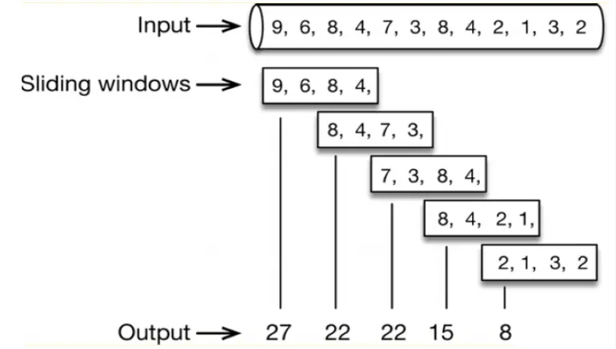

##### 实战

| 属性                 | 默认值  | 描述                                                         |
| -------------------- | ------- | ------------------------------------------------------------ |
| `timeoutDuration`    | 5 秒     | 线程等待权限的默认等待时间                                   |
| `limitRefreshPeriod` | 500 纳秒 | 限流器每隔 limitRefreshPeriod 刷新一次，将允许处理的最大请求数量重置为 limitForPeriod。 |
| `limitForPeriod`     | 50      | 在一次刷新周期内，允许执行的最大请求数                       |

1. cloud-provider-payment8001 支付微服务修改 PayCircuitController 新增 myRatelimit 方法

    ```java
    //=========Resilience4j ratelimit 的例子
    @GetMapping(value = "/pay/ratelimit/{id}")
    public String myRatelimit(@PathVariable("id") Integer id) {
        return "Hello, myRatelimit欢迎到来 inputId:  "+id+" \t " + IdUtil.simpleUUID();
    }
    ```

2. PayFeignApi 接口新增限流 api 方法

    ```java
    /**
     * Resilience4j Ratelimit 的例子
     * @param id
     * @return
     */
    @GetMapping(value = "/pay/ratelimit/{id}")
    public String myRatelimit(@PathVariable("id") Integer id);
    ```

3. 修改 cloud-consumer-feign-order80

    - POM.xml 新增依赖

        ```XML
        <!--resilience4j-ratelimiter-->
        <dependency>
            <groupId>io.github.resilience4j</groupId>
            <artifactId>resilience4j-ratelimiter</artifactId>
        </dependency>
        ```

    - YML 新增 ratelimiter 限流配置

        ```yml
        ####resilience4j ratelimiter 限流的例子
        resilience4j:
          ratelimiter:
            configs:
              default:
                limitForPeriod: 2 #在一次刷新周期内，允许执行的最大请求数
                limitRefreshPeriod: 1s # 限流器每隔limitRefreshPeriod刷新一次，将允许处理的最大请求数量重置为limitForPeriod
                timeout-duration: 1 # 线程等待权限的默认等待时间
            instances:
              cloud-payment-service:
                baseConfig: default
        ```

    - 修改 order 的 controller

        ```java
        @GetMapping(value = "/feign/pay/ratelimit/{id}")
        @RateLimiter(name = "cloud-payment-service",fallbackMethod = "myRatelimitFallback")
        public String myBulkhead(@PathVariable("id") Integer id) {
            return payFeignApi.myRatelimit(id);
        }
        
        public String myRatelimitFallback(Integer id,Throwable t) {
            return "你被限流了，禁止访问/(ㄒoㄒ)/~~";
        }
        ```

4. 测试
    - http://localhost/feign/pay/ratelimit/11
    
        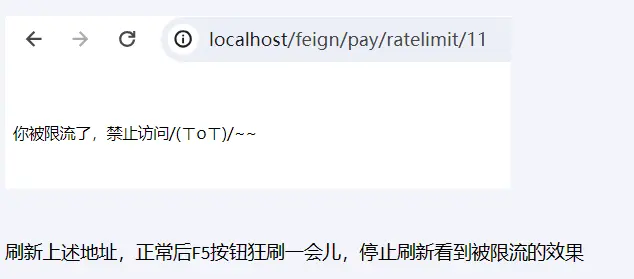

## Sleuth(Micrometer)+ZipKin 分布式链路追踪

### Sleuth 目前也进入维护模式

Sleuth 官宣，改头换面

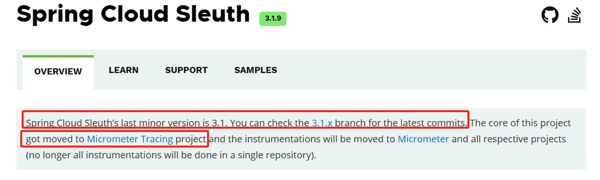

Sleuth 未来替换方案：Micrometer Tracing

### 分布式链路追踪概述

**问：为什么会出现这个技术？**

答：在微服务框架中，一个由客户端发起的请求在后端系统中会经过多个不同的的服务节点调用来协同产生最后的请求结果，每一个前段请求都会形成一条复杂的分布式服务调用链路，链路中的任何一环出现高延时或错误都会引起整个请求最后的失败。

**问：需要解决哪些问题？**

答：在分布式与微服务场景下，我们需要解决如下问题：

1. 在大规模分布式与微服务集群下，如何实时观测系统的整体调用链路情况。
2. 在大规模分布式与微服务集群下，如何快速发现并定位到问题。
3. 在大规模分布式与微服务集群下，如何尽可能精确的判断故障对系统的影响范围与影响程度。
4. 在大规模分布式与微服务集群下，如何尽可能精确的梳理出服务之间的依赖关系，并判断出服务之间的依赖关系是否合理。
5. 在大规模分布式与微服务集群下，如何尽可能精确的分析整个系统调用链路的性能与瓶颈点。
6. 在大规模分布式与微服务集群下，如何尽可能精确的分析系统的存储瓶颈与容量规划。

**上述问题就是我们的落地议题答案：**

分布式链路追踪技术要解决的问题，分布式链路追踪(Distributed Tracing)，就是将一次分布式请求还原成调用链路，进行日志记录，性能监控并将一次分布式请求的调用情况集中展示。比如各个服务节点上的耗时、请求具体到达哪台机器上、每个服务节点的请求状态等等。

### 新一代 Spring Cloud Sleuth：Micrometer

#### 官网重要提示

sleuth 被 micrometer 替代

[新一代 Sleuth：Micrometer](https://micrometer.io/docs/tracing)

[Spring Cloud Sleuth](https://spring.io/projects/spring-cloud-sleuth#overview)

说明：

1. 老项目还能用 Sleuth 开发吗？可以，但能用 micrometer 就用 micrometer。

2. 版本注意：Sleuth 不支持 Spring Boot 3.x，只支持  2.x。

    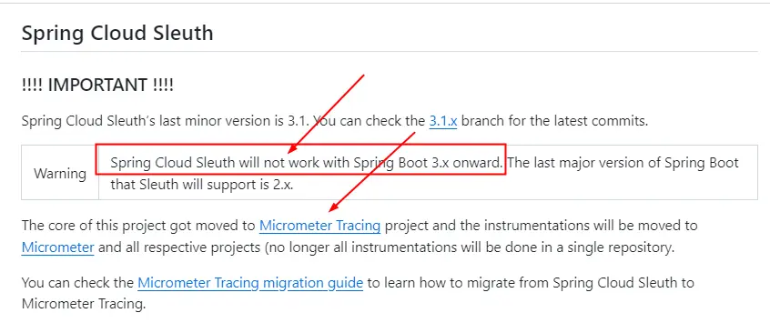

#### zipkin？

Spring Cloud Sleuth(micrometer)提供了一套完整的分布式链路追踪(Distributed Tracing)解决方案且兼容支持了 zipkin 展现。

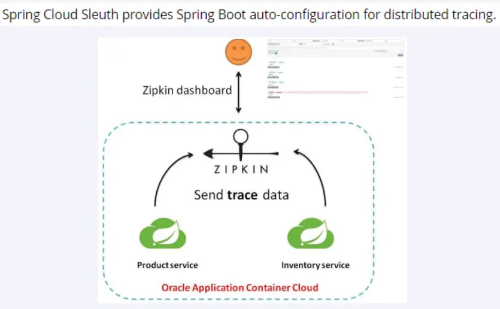

#### 小总结

将一次分布式请求还原成调用链路，进行日志记录和性能监控，并将一次分布式请求的调用情况集中 web 展示。

#### 行业内比较成熟的其它分布式链路追踪技术解决方案

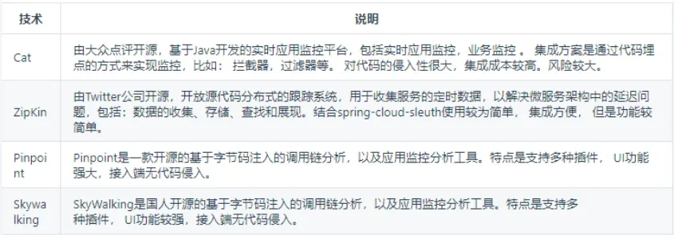

能用 micrometer 就用 micrometer，否则推荐 Skywalking。

### 分布式链路追踪原理

假定三个微服务调用的链路如下图所示：Service 1 调用 Service 2，Service 2 调用 Service 3 和 Service 4。

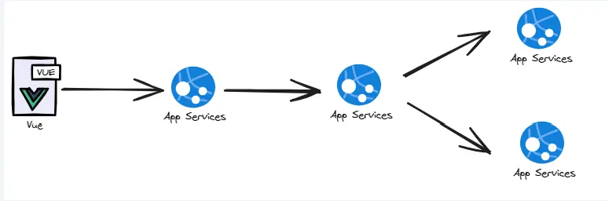

**上一步完整的调用链路：**

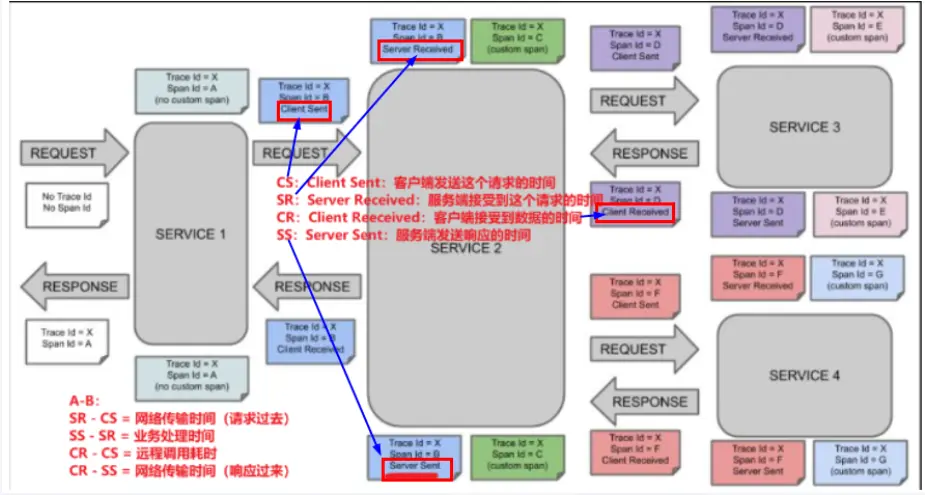

一条链路追踪会在每个服务调用的时候加上 Trace ID 和 Span ID。链路通过 TraceId 唯一标识，Span 标识发起的请求信息，各 span 通过 parent id 关联起来 （Span:表示调用链路来源，通俗的理解 span 就是一次请求信息）。

**简洁版调用链路追踪：**

一条链路通过 Trace Id 唯一标识，Span 标识发起的请求信息，各 span 通过 parent id 关联起来。

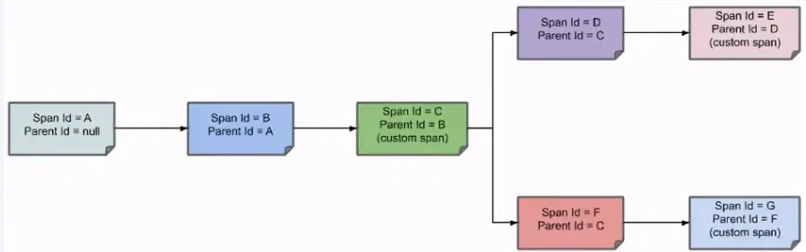

1. 第一个节点：Span ID = A，Parent ID = null，Service 1 接收到请求。
2. 第二个节点：Span ID = B，Parent ID= A，Service 1 发送请求到 Service 2 返回响应给 Service 1 的过程。
3. 第三个节点：Span ID = C，Parent ID= B，Service 2 的 中间解决过程。
4. 第四个节点：Span ID = D，Parent ID= C，Service 2 发送请求到 Service 3 返回响应给 Service 2 的过程。
5. 第五个节点：Span ID = E，Parent ID= D，Service 3 的中间解决过程。
6. 第六个节点：Span ID = F，Parent ID= C，Service 3 发送请求到 Service 4 返回响应给 Service 3 的过程。
7. 第七个节点：Span ID = G，Parent ID= F，Service 4 的中间解决过程。
8. 通过 Parent ID 就可找到父节点，整个链路即可以进行跟踪追溯了。

### Zipkin

#### 是什么

[OpenZipkin · A distributed tracing system](https://zipkin.io/)

Zipkin 是一种分布式链路跟踪系统图形化的工具，Zipkin 是 Twitter 开源的分布式跟踪系统，能够收集微服务运行过程中的实时调用链路信息，并能够将这些调用链路信息展示到 Web 图形化界面上供开发人员分析，开发人员能够从 ZipKin 中分析出调用链路中的性能瓶颈，识别出存在问题的应用程序，进而定位问题和解决问题。

#### Zipkin 为什么出现？单有 Sleuth(Micrometer)行不行？

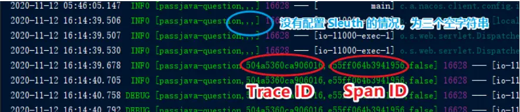

说明：

- 当没有配置 Sleuth 链路追踪的时候，INFO 信息里面是 [passjava-question,,,]，后面跟着三个空字符串。
- 当配置了 Sleuth 链路追踪的时候，追踪到的信息是 [passjava-question,504a5360ca906016,e55ff064b3941956,false] ，第一个是 Trace ID，第二个是 Span ID。只有日志没有图，观看不方便，不美观，so，引入图形化 Zipkin 链路监控让你好看，O(∩_∩)O

#### Zipkin 下载+安装+运行

1. [下载主页](https://zipkin.io/pages/quickstart.html)
2. [下载地址](https://search.maven.org/remote_content?g=io.zipkin&a=zipkin-server&v=LATEST&c=exec)
3. 运行 jar
4. 运行控制台：http://localhost:9411/zipkin/

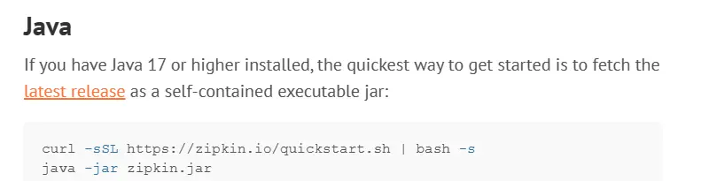

### Micrometer+ZipKin 搭建链路监控案例步骤

#### Micrometer+ZipKin 两者各自的分工

Micrometer：数据采样

ZipKin：图形展示

#### 步骤

1. 总体父工程 POM

    ```xml
    <properties>
        <!-- 增加以下属性-->
        <micrometer-tracing.version>1.2.0</micrometer-tracing.version>
        <micrometer-observation.version>1.12.0</micrometer-observation.version>
        <feign-micrometer.version>12.5</feign-micrometer.version>
        <zipkin-reporter-brave.version>2.17.0</zipkin-reporter-brave.version>
    </properties>
    
    <dependencyManagement>
        <dependencies>
            <!-- 增加以下依赖包-->
            <!--micrometer-tracing-bom导入链路追踪版本中心  1-->
            <dependency>
                <groupId>io.micrometer</groupId>
                <artifactId>micrometer-tracing-bom</artifactId>
                <version>${micrometer-tracing.version}</version>
                <type>pom</type>
                <scope>import</scope>
            </dependency>
            <!--micrometer-tracing指标追踪  2-->
            <dependency>
                <groupId>io.micrometer</groupId>
                <artifactId>micrometer-tracing</artifactId>
                <version>${micrometer-tracing.version}</version>
            </dependency>
            <!--micrometer-tracing-bridge-brave适配zipkin的桥接包 3-->
            <dependency>
                <groupId>io.micrometer</groupId>
                <artifactId>micrometer-tracing-bridge-brave</artifactId>
                <version>${micrometer-tracing.version}</version>
            </dependency>
            <!--micrometer-observation 4-->
            <dependency>
                <groupId>io.micrometer</groupId>
                <artifactId>micrometer-observation</artifactId>
                <version>${micrometer-observation.version}</version>
            </dependency>
            <!--feign-micrometer 5-->
            <dependency>
                <groupId>io.github.openfeign</groupId>
                <artifactId>feign-micrometer</artifactId>
                <version>${feign-micrometer.version}</version>
            </dependency>
            <!--zipkin-reporter-brave 6-->
            <dependency>
                <groupId>io.zipkin.reporter2</groupId>
                <artifactId>zipkin-reporter-brave</artifactId>
                <version>${zipkin-reporter-brave.version}</version>
            </dependency>
        </dependencies>
    </dependencyManagement>
    ```

    - 引入 jar 包解释：

        - 由于 Micrometer Tracing 是一个门面工具自身并没有实现完整的链路追踪系统，具体的链路追踪另外需要引入的是第三方链路追踪系统的依赖。

            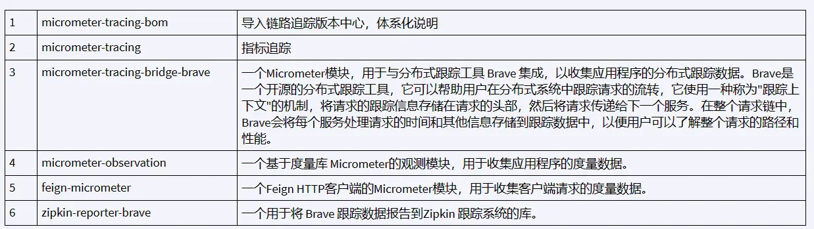

2. 服务提供者 cloud-provider-payment8001

    - POM 新增依赖

        ```xml
        <!--micrometer-tracing指标追踪  1-->
        <dependency>
            <groupId>io.micrometer</groupId>
            <artifactId>micrometer-tracing</artifactId>
        </dependency>
        <!--micrometer-tracing-bridge-brave适配zipkin的桥接包 2-->
        <dependency>
            <groupId>io.micrometer</groupId>
            <artifactId>micrometer-tracing-bridge-brave</artifactId>
        </dependency>
        <!--micrometer-observation 3-->
        <dependency>
            <groupId>io.micrometer</groupId>
            <artifactId>micrometer-observation</artifactId>
        </dependency>
        <!--feign-micrometer 4-->
        <dependency>
            <groupId>io.github.openfeign</groupId>
            <artifactId>feign-micrometer</artifactId>
        </dependency>
        <!--zipkin-reporter-brave 5-->
        <dependency>
            <groupId>io.zipkin.reporter2</groupId>
            <artifactId>zipkin-reporter-brave</artifactId>
        </dependency>
        ```

    - YML 新增 zipkin 配置

        ```yml
        # ========================zipkin===================
        management:
          zipkin:
            tracing:
              endpoint: http://localhost:9411/api/v2/spans
          tracing:
            sampling:
              probability: 1.0 #采样率默认为0.1(0.1就是10次只能有一次被记录下来)，值越大收集越及时。
        ```

    - 新建业务类 PayMicrometerController

        ```java
        package com.atguigu.cloud.controller;
        
        @RestController
        public class PayMicrometerController {
            /**
             * Micrometer(Sleuth)进行链路监控的例子
             * @param id
             * @return
             */
            @GetMapping(value = "/pay/micrometer/{id}")
            public String myMicrometer(@PathVariable("id") Integer id) {
                return "Hello, 欢迎到来myMicrometer inputId:  " + id + " \t    服务返回:" + IdUtil.simpleUUID();
            }
        }
        ```

3. API 接口 PayFeignApi

    ```java
    /**
    * Micrometer(Sleuth)进行链路监控的例子
    * @param id
    * @return
    */
    @GetMapping(value = "/pay/micrometer/{id}")
    public String myMicrometer(@PathVariable("id") Integer id);
    ```

4. 服务调用者 cloud-consumer-feign-order80

    - POM 新增链路追踪相关的五个依赖包（同 8001）

    - YML 新增 zipkin 图形展现地址和采样率设置（同 8001）

    - 新建业务类 OrderMicrometerController

        ```java
        package com.atguigu.cloud.controller;
        
        @RestController
        @Slf4j
        public class OrderMicrometerController {
            @Resource
            private PayFeignApi payFeignApi;
        
            @GetMapping(value = "/feign/micrometer/{id}")
            public String myMicrometer(@PathVariable("id") Integer id) {
                return payFeignApi.myMicrometer(id);
            }
        }
        ```

#### 测试

1. 本次案例，默认已经成功启动 Zipkin

2. 依次启动 8001/80 两个微服务并注册进入 Consul

3. 测试地址：http://localhost/feign/micrometer/1

4. 打开浏览器访问：http://localhost:9411

    - 查看链路

        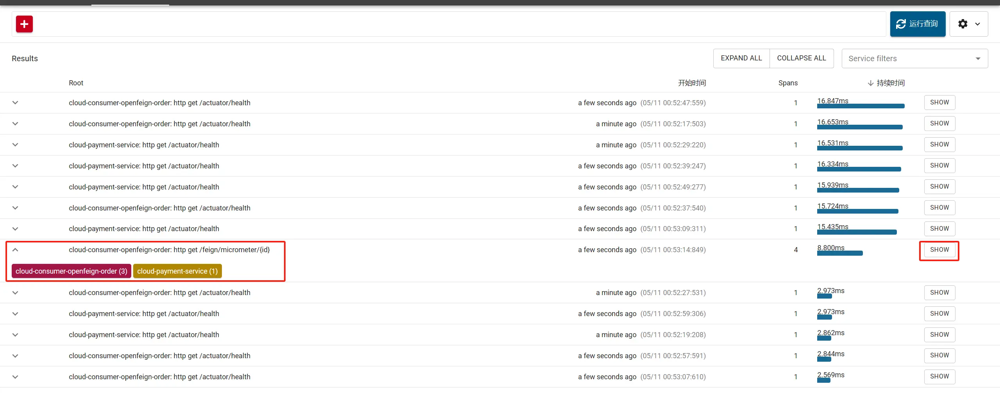

        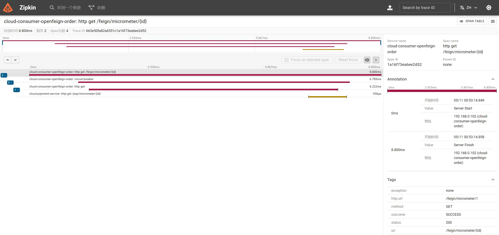

    - 查看依赖关系

        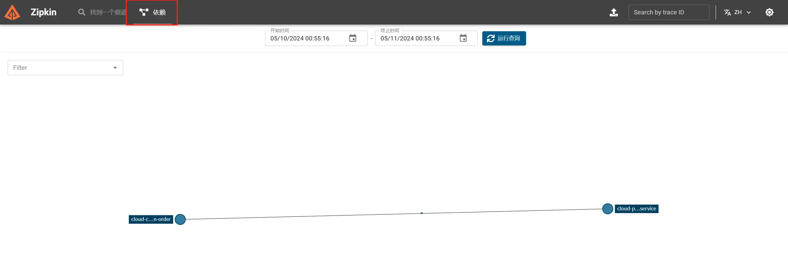

## Gateway 新一代网关

### 概述

#### 是什么

[Spring Cloud Gateway 4.1.3](https://docs.spring.io/spring-cloud-gateway/reference/index.html)

[Spring Cloud Gateway 4.0.4](https://docs.spring.io/spring-cloud-gateway/docs/4.0.4/reference/html/#gateway-starter)

Gateway 提供了一个库，用于在 SpringWebFlux 或 SpringWebMVC 之上构建 API 网关服务。Spring Cloud Gateway 旨在为微服务架构提供一种简单有效的统一的 API 路由管理方式，并为它们提供跨领域的关注点，例如：安全性、监控/度量和恢复能力。

体系定位：

- Cloud 全家桶中有个很重要的组件就是网关，在 1.x 版本中都是采用的 Zuul 网关；
- 但在 2.x 版本中，zuul 的升级一直跳票，SpringCloud 最后自己研发了一个网关 SpringCloud Gateway 替代 Zuul，
- 那就是 SpringCloud Gateway。一句话：gateway 是原 zuul1.x 版的替代。

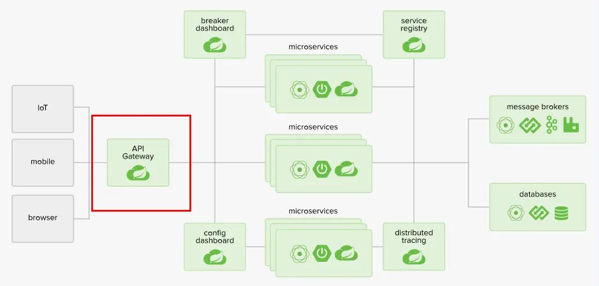

#### 微服务架构中网关在哪里

feign 是服务间的调用，当请求 A 服务，但 A 需要 B 服务。

网关是在 A 之前，Nginx 是在网关之前。

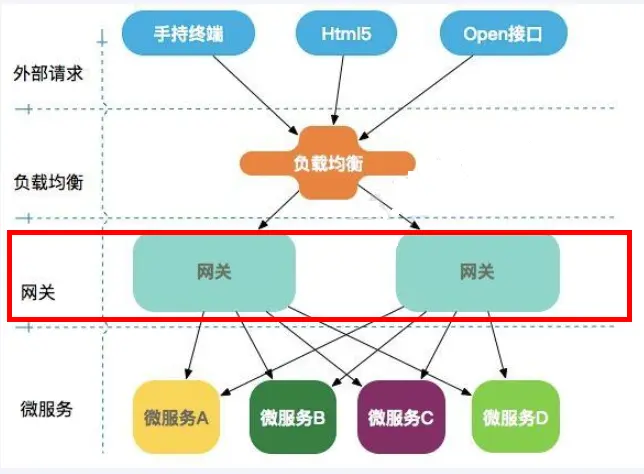

#### 能干嘛

1. 反向代理
2. 鉴权
3. 流量控制
4. 熔断
5. 日志监控

#### 总结

- Spring Cloud Gateway 组件的核心是一系列的过滤器，通过这些过滤器可以将客户端发送的请求转发（路由）到对应的微服务。 
- Spring Cloud Gateway 是加在整个微服务最前沿的防火墙和代理器，隐藏微服务结点 IP 端口信息，从而加强安全保护。
- Spring Cloud Gateway 本身也是一个微服务，需要注册进服务注册中心。

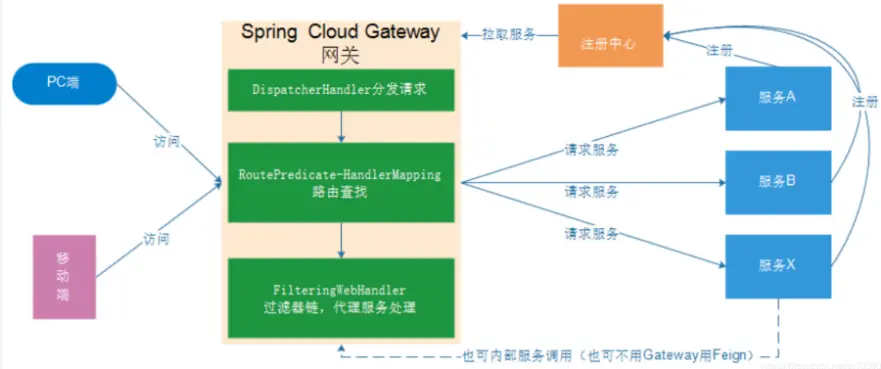

### Gateway 三大核心

- **Route（路由）**：路由是构建网关的基本模块。它由 ID，目标 URI，一系列的断言和过滤器组成，如果断言为 true 则匹配该路由。
- **Predicate（断言）**：参考的是 Java8 的函数断言 `java.util.function.Predicate`。输入类型是 `SpringFrameworkServerWebExchange`。开发人员可以匹配 HTTP 请求中的所有内容（例如请求头或请求参数），如果请求与断言相匹配则进行路由。
- **Filter（过滤）**：指的是 Spring 框架中特定工厂构建的 GatewayFilter 的实例，使用过滤器，可以在请求被路由前或者之后对请求进行修改。

**总结：**

- web 前端请求，通过一些匹配条件，定位到真正的服务节点。并在这个转发过程的前后，进行一些精细化控制。
- predicate 就是我们的匹配条件。
- filter，就可以理解为一个无所不能的拦截器。
- 有了这两个元素，再加上目标 uri，就可以实现一个具体的路由了。

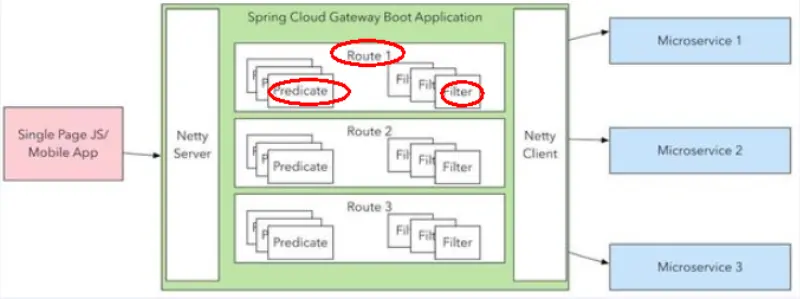

### Gateway 工作流程

- 客户端向 Spring Cloud Gateway 发出请求。然后在 Gateway Handler Mapping 中找到与请求相匹配的路由，将其发送到 Gateway Web Handler。Handler 再通过指定的过滤器链来将请求发送到我们实际的服务执行业务逻辑，然后返回。
- 过滤器之间用虚线分开是因为过滤器可能会在发送代理请求之前(Pre)或之后(Post)执行业务逻辑。
- 在`pre`类型的过滤器可以做参数校验、权限校验、流量监控、日志输出、协议转换等;
- 在`post`类型的过滤器中可以做响应内容、响应头的修改，日志的输出，流量监控等有着非常重要的作用。

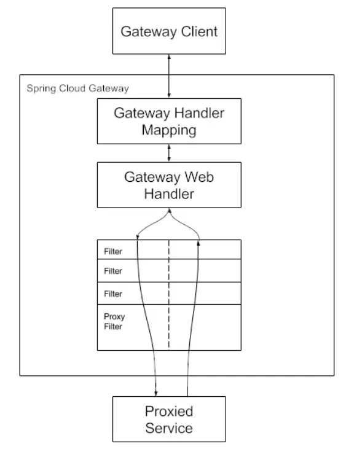

核心逻辑：<font color="red"><strong>路由转发 + 断言判断 + 执行过滤器链</strong></font>

### 入门配置

#### 建 Module

新建 module cloud-gateway9527

#### 改 POM

```xml
<?xml version="1.0" encoding="UTF-8"?>
<project xmlns="http://maven.apache.org/POM/4.0.0"
         xmlns:xsi="http://www.w3.org/2001/XMLSchema-instance"
         xsi:schemaLocation="http://maven.apache.org/POM/4.0.0 http://maven.apache.org/xsd/maven-4.0.0.xsd">
    <modelVersion>4.0.0</modelVersion>
    <parent>
        <groupId>com.atguigu.cloud</groupId>
        <artifactId>cloud2024</artifactId>
        <version>1.0-SNAPSHOT</version>
    </parent>

    <artifactId>cloud-gateway9527</artifactId>

    <properties>
        <maven.compiler.source>17</maven.compiler.source>
        <maven.compiler.target>17</maven.compiler.target>
        <project.build.sourceEncoding>UTF-8</project.build.sourceEncoding>
    </properties>

    <dependencies>
        <!--gateway-->
        <dependency>
            <groupId>org.springframework.cloud</groupId>
            <artifactId>spring-cloud-starter-gateway</artifactId>
        </dependency>
        <!--服务注册发现consul discovery,网关也要注册进服务注册中心统一管控-->
        <dependency>
            <groupId>org.springframework.cloud</groupId>
            <artifactId>spring-cloud-starter-consul-discovery</artifactId>
        </dependency>
        <!-- 指标监控健康检查的actuator,网关是响应式编程删除掉spring-boot-starter-web dependency-->
        <dependency>
            <groupId>org.springframework.boot</groupId>
            <artifactId>spring-boot-starter-actuator</artifactId>
        </dependency>
    </dependencies>

    <build>
        <plugins>
            <plugin>
                <groupId>org.springframework.boot</groupId>
                <artifactId>spring-boot-maven-plugin</artifactId>
            </plugin>
        </plugins>
    </build>
</project>
```

#### 写 YML

```yml
server:
  port: 9527

spring:
  application:
    name: cloud-gateway #以微服务注册进consul或nacos服务列表内
  cloud:
    consul: #配置consul地址
      host: localhost
      port: 8500
      discovery:
        prefer-ip-address: true
        service-name: ${spring.application.name}
```

#### 主启动

```java
package com.atguigu.cloud;

@SpringBootApplication
@EnableDiscoveryClient //服务注册和发现
public class Main9527 {
    public static void main(String[] args) {
        SpringApplication.run(Main9527.class,args);
    }
}
```

#### 业务类

无，不写任何业务代码，网关和业务无关

#### 测试

1. 先启动 8500 服务中心 Consul
2. 再启动 9527 网关入驻

### 9527 网关如何做路由映射

#### 9527 网关如何做路由映射

1. 诉求：我们目前不想暴露 8001 端口，希望在 8001 真正的支付微服务外面套一层 9527 网关

2. 8001 新建 PayGateWayController

    ```java
    package com.atguigu.cloud.controller;
    
    @RestController
    public class PayGateWayController {
        @Resource
        PayService payService;
    
        @GetMapping(value = "/pay/gateway/get/{id}")
        public ResultData<Pay> getById(@PathVariable("id") Integer id) {
            Pay pay = payService.getById(id);
            return ResultData.success(pay);
        }
    
        @GetMapping(value = "/pay/gateway/info")
        public ResultData<String> getGatewayInfo() {
            return ResultData.success("gateway info test：" + IdUtil.simpleUUID());
        }
    }
    ```

3. 启动 8001 支付

4. 8001 自测通过

    - http://localhost:8001/pay/gateway/get/1
    - http://localhost:8001/pay/gateway/info

#### 9527 网关 YML 新增配置

```yml
spring:
  cloud:
    gateway:
      routes:
        - id: pay_routh1 #pay_routh1                #路由的ID(类似mysql主键ID)，没有固定规则但要求唯一，建议配合服务名
          uri: http://localhost:8001                #匹配后提供服务的路由地址
          predicates:
            - Path=/pay/gateway/get/**              # 断言，路径相匹配的进行路由

        - id: pay_routh2 #pay_routh2                #路由的ID(类似mysql主键ID)，没有固定规则但要求唯一，建议配合服务名
          uri: http://localhost:8001                #匹配后提供服务的路由地址
          predicates:
            - Path=/pay/gateway/info/**              # 断言，路径相匹配的进行路由
```

#### 测试 1

1. 启动 Consul 8500 服务

2. 启动 8001 支付

3. 启动 9527 网关

4. 访问说明

    - 添加网关前

        - http://localhost:8001/pay/gateway/get/1
        - http://localhost:8001/pay/gateway/info

    - 隐真示假，映射说明

        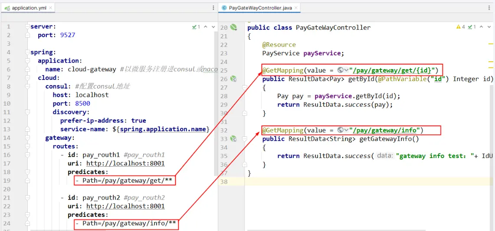

    - 添加网关后：访问端口更换为网关端口 9527

        - http://localhost:9527/pay/gateway/get/1
        - http://localhost:9527/pay/gateway/info

5. 目前 8001 支付微服务前面添加 GateWay 成功

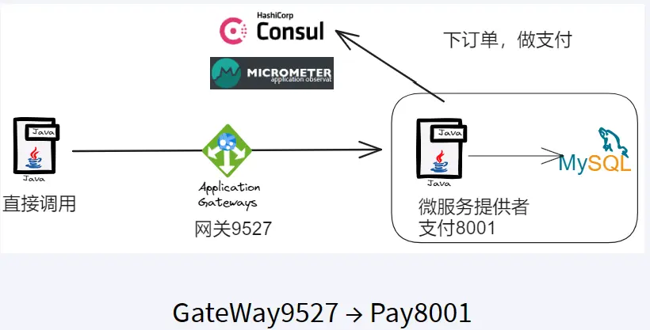

#### 测试 2

##### 启动订单微服务测试，看看是否通过网关？

我们启动 80 订单微服务，它从 Consul 注册中心通过微服务名称找到 8001 支付微服务进行调用，

80 → 9527 → 8001

要求访问 9527 网关后才能访问 8001，如果我们此时启动 80 订单，可以做到吗？

1. 修改 cloud-api-commons PayFeignApi 接口

    ```java
    /**
     * GateWay进行网关测试案例01
     * @param id
     * @return
     */
    @GetMapping(value = "/pay/gateway/get/{id}")
    public ResultData getById(@PathVariable("id") Integer id);
    /**
     * GateWay进行网关测试案例02
     * @return
     */
    @GetMapping(value = "/pay/gateway/info")
    public ResultData<String> getGatewayInfo();
    ```

2. 修改 cloud-consumer-feign-order80，新建 OrderGateWayController

    ```java
    @RestController
    public class OrderGateWayController {
        @Resource
        private PayFeignApi payFeignApi;
    
        @GetMapping(value = "/feign/pay/gateway/get/{id}")
        public ResultData getById(@PathVariable("id") Integer id) {
            return payFeignApi.getById(id);
        }
    
        @GetMapping(value = "/feign/pay/gateway/info")
        public ResultData<String> getGatewayInfo() {
            return payFeignApi.getGatewayInfo();
        }
    }
    ```

3. 网关开启：测试通过√
    - http://localhost/feign/pay/gateway/get/1
    - http://localhost/feign/pay/gateway/info
4. 网关关闭：测试通过√
5. 结论
    - 9527 网关是否启动，毫无影响，o(╥﹏╥)o
    - 目前的配置来看，网关被绕开了......

##### 正确配置

- **同一家公司自己人，系统内环境，直接找微服务**

```java
@FeignClient(value = "cloud-payment-service")//自己人内部，自己访问自己，写微服务名字OK
public interface PayFeignApi {}
```

- **不同家公司有外人，系统外访问，先找网关再服务**

```java
//@FeignClient(value = "cloud-payment-service")
@FeignClient(value = "cloud-gateway")
public interface PayFeignApi {}
```

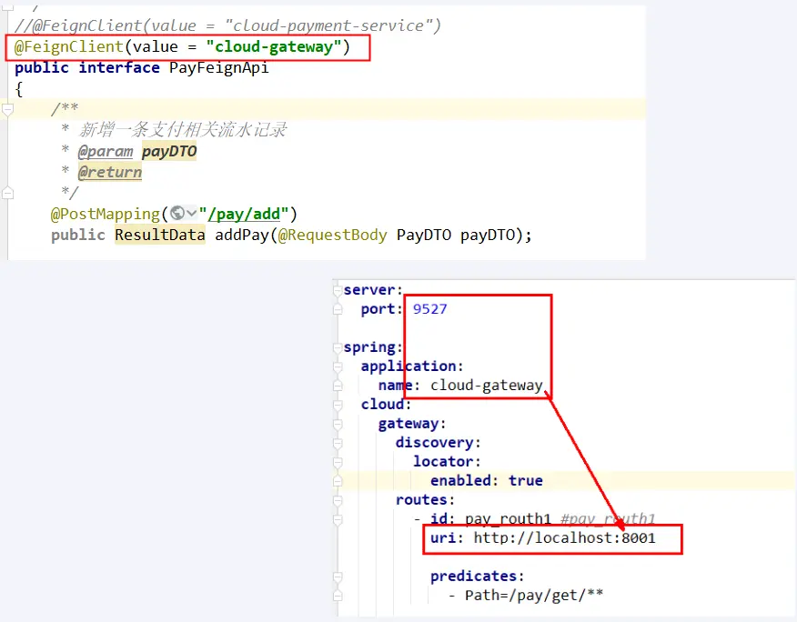

1. 刷新 feign 接口 jar 包

2. 重启 80 订单微服务

3. 有网关正常 success

    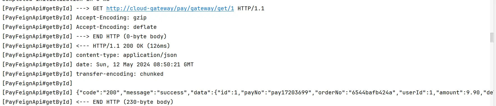

4. 无网关异常

    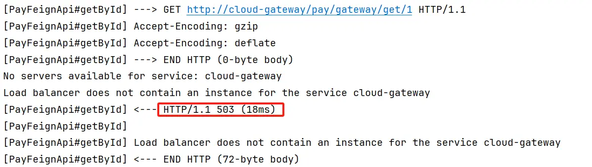

#### 存在问题

网关 9527 的 yml 配置，**映射写死问题**。

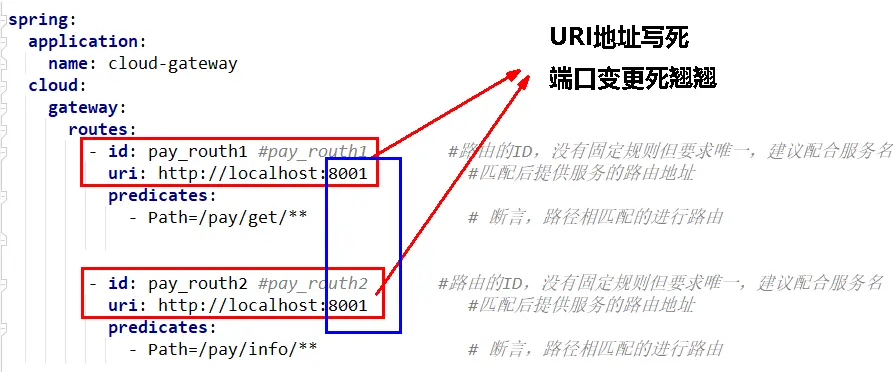

### GateWay 高级特性

#### Route 以微服务名-动态获取服务 URI

##### 痛点

映射写死问题（如上）

##### 是什么

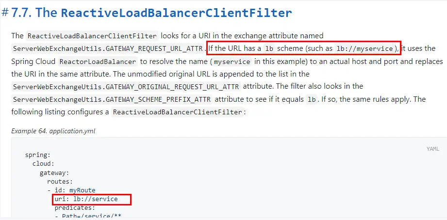

##### 解决 uri 地址写死问题

由固定 URI 修改为通过微服务名动态获取

```yml
spring:
  cloud:
    gateway:
      routes:
        - id: pay_routh1 #pay_routh1                #路由的ID(类似mysql主键ID)，没有固定规则但要求唯一，建议配合服务名
          #uri: http://localhost:8001                #匹配后提供服务的路由地址
          uri: lb://cloud-payment-service
          predicates:
            - Path=/pay/gateway/get/**              # 断言，路径相匹配的进行路由

        - id: pay_routh2 #pay_routh2                #路由的ID(类似mysql主键ID)，没有固定规则但要求唯一，建议配合服务名
          #uri: http://localhost:8001                #匹配后提供服务的路由地址
          uri: lb://cloud-payment-service
          predicates:
            - Path=/pay/gateway/info/**              # 断言，路径相匹配的进行路由
```

##### 测试 1

1. 重启网关 9527，80/8001 保持不变
2. http://localhost/feign/pay/gateway/get/1

##### 测试 2

如果将 8001 微服务 yml 文件端口修改为 8007，照样可以访问（实际启动的程序是 main8001 但是端口名改为 8007）

依据微服务名字，匹配查找即可：`uri: lb://cloud-payment-service`

#### Predicate 断言（谓词）

##### 是什么

[Route Predicate Factories :: Spring Cloud Gateway](https://docs.spring.io/spring-cloud-gateway/reference/spring-cloud-gateway/request-predicates-factories.html)

- Spring Cloud Gateway 将路由匹配作为 Spring WebFlux HandlerMapping 基础架构的一部分。
- Spring Cloud Gateway 包含许多内置的 Route Predicate Factories。所有这些 Predicate 都匹配 HTTP 请求的不同属性。
- Spring Cloud Gateway 创建 Route 时，使用 RoutePredicateFactory 创建 Predicate 对象，Predicate 对象可以赋值给 Route，
- 多个路由断言工厂通过 `and` 逻辑语句组合在一起。

启动微服务 gateway9527 看看 IDEA 后台的输出：

```
Loaded RoutePredicateFactory [After]
Loaded RoutePredicateFactory [Before]
Loaded RoutePredicateFactory [Between]
Loaded RoutePredicateFactory [Cookie]
Loaded RoutePredicateFactory [Header]
Loaded RoutePredicateFactory [Host]
Loaded RoutePredicateFactory [Method]
Loaded RoutePredicateFactory [Path]
Loaded RoutePredicateFactory [Query]
Loaded RoutePredicateFactory [ReadBody]
Loaded RoutePredicateFactory [RemoteAddr]
Loaded RoutePredicateFactory [XForwardedRemoteAddr]
Loaded RoutePredicateFactory [Weight]
Loaded RoutePredicateFactory [CloudFoundryRouteService]
```

##### 整体架构概述

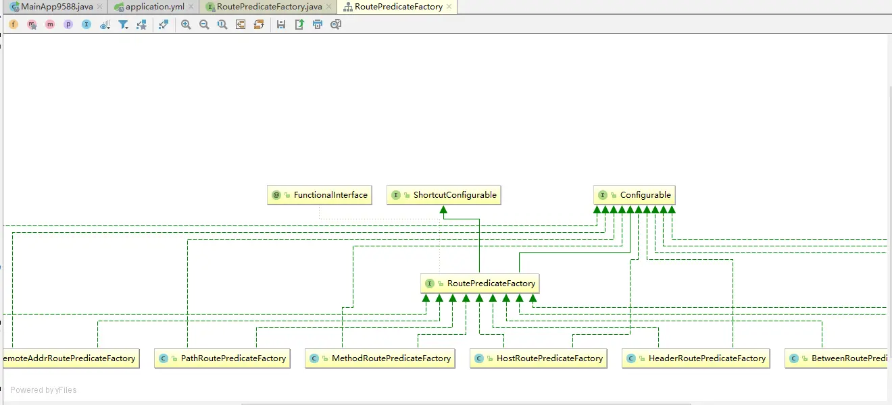

##### 常用的内置 Route Predicate

###### 配置语法总体概述

两种配置方式，二选一

[Spring Cloud Gateway](https://docs.spring.io/spring-cloud-gateway/docs/4.0.4/reference/html/#configuring-route-predicate-factories-and-gateway-filter-factories)

1. There are two ways to configure predicates and filters: shortcuts and fully expanded arguments. **Most examples below use the shortcut way**.

2. Shortcut Configuration

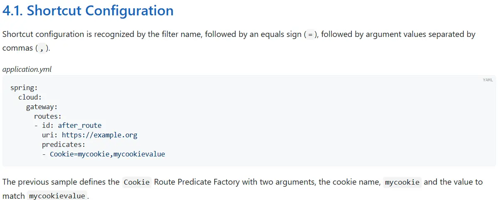

```yml
spring:
  cloud:
    gateway:
      routes:
      - id: after_route
        uri: https://example.org
        predicates:
        - Cookie=mycookie,mycookievalue
```

3. Fully Expanded Arguments

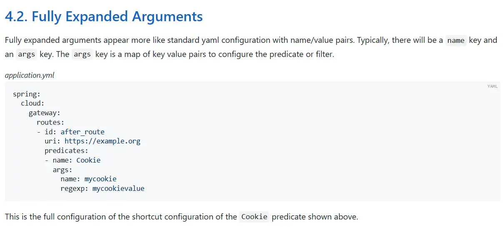

```yml
spring:
  cloud:
    gateway:
      routes:
      - id: after_route
        uri: https://example.org
        predicates:
        - name: Cookie
          args:
            name: mycookie
            regexp: mycookievalue
```

测试地址：http://localhost:9527/pay/gateway/get/1

###### 常用断言 api

```yml
#id：我们自定义的路由 ID，保持唯一
##uri：目标服务地址
##predicates：路由条件，Predicate接受一个输入参数返回一个布尔值。
##            该属性包含多种默认方法来将Predicate组合成其他复杂的逻辑(比如：与，或，非)
```

1. **After/Before/Between Route Predicate Factory**

    - **After Route Predicate Factory** 接受一个参数，即 `datetime` (这是一个 java `ZonedDateTime`)。**此断言匹配在指定日期时间之后发生的请求**。
    - **Before Route Predicate Factory** 接受一个参数，即 `datetime`。**此断言匹配在指定日期时间之前发生的请求**。
    - **Between Route Predicate Factory** 接受两个参数 datetime1 和 datetime2。**此断言匹配在 datetime1 之后和 datetime2 之前发生的请求**。datetime2 参数必须位于 datetime1 之后。

    如何获得 `ZonedDateTime`：

    ```java
    public static void main(String[] args) {
        ZonedDateTime zbj = ZonedDateTime.now(); // 默认时区
        System.out.println(zbj);
    }
    ```

    输出结果：`2024-05-12T20:26:08.937420100+08:00[Asia/Shanghai]`

    示例配置：

    ```yml
    spring:
      cloud:
        gateway:
          routes:
            - id: pay_routh1 #pay_routh1                #路由的ID(类似mysql主键ID)，没有固定规则但要求唯一，建议配合服务名
              uri: lb://cloud-payment-service           #匹配后提供服务的路由地址
              predicates:
                - Path=/pay/gateway/get/**              # 断言，路径相匹配的进行路由
                - After=2024-05-12T20:30:08.937420100+08:00[Asia/Shanghai]
                - Before=2024-05-12T20:44:00.000+08:00[Asia/Shanghai]
                - Between=2024-05-12T20:53:00.000+08:00[Asia/Shanghai],2024-05-12T20:54:00.000+08:00[Asia/Shanghai]
    ```

2. **Cookie Route Predicate Factory**

    - Cookie Route Predicate Factory 接受两个参数: Cookie 名称和 regexp （它是 Java 正则表达式）。
    - 此断言会通过获取对应的 Cookie name 值和正则表达式去匹配，如果匹配上就会执行路由，如果没有匹配上则不执行。

    示例配置：

    ```yml
    spring:
      cloud:
        gateway:
          routes:
            - id: pay_routh1 #pay_routh1                #路由的ID(类似mysql主键ID)，没有固定规则但要求唯一，建议配合服务名
              uri: lb://cloud-payment-service           #匹配后提供服务的路由地址
              predicates:
                - Path=/pay/gateway/get/**              # 断言，路径相匹配的进行路由
                - Cookie=username,xyz
    ```

    - 方法 1，原生命令

        ```shell
        # 不带cookies访问
        curl http://localhost:9527/pay/gateway/get/1
        # 带cookies访问
        curl http://localhost:9527/pay/gateway/get/1 --cookie "username=xyz"
        ```

    - 方法 2，postman

        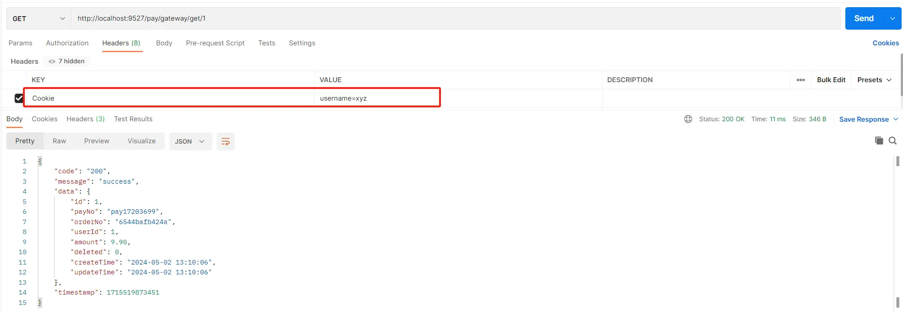

3. **Header Route Predicate Factory**

    - Header Route Predicate Factory 接受两个参数，属性名称 header 和正则表达式 regexp。
    - 此断言与具有和正则表达式匹配的给定名称的头匹配。此断言与具有给定名称的 header 属性名称匹配，其值与正则表达式相匹配。

    示例配置：

    ```yml
    spring:
      cloud:
        gateway:
          routes:
            - id: pay_routh1 #pay_routh1                #路由的ID(类似mysql主键ID)，没有固定规则但要求唯一，建议配合服务名
              uri: lb://cloud-payment-service           #匹配后提供服务的路由地址
              predicates:
                - Path=/pay/gateway/get/**              # 断言，路径相匹配的进行路由
                - Header=X-Request-Id, \d+  # 请求头要有X-Request-Id属性并且值为整数的正则表达式
    ```

    ```shell
    curl http://localhost:9527/pay/gateway/get/1 -H  "X-Request-Id:123456"
    curl http://localhost:9527/pay/gateway/get/1 -H  "X-Request-Id:abcd"
    ```

4. **Host Route Predicate Factory**

    - Host Route Predicate Factory 接收一组参数，一组匹配的域名列表。该模式是一个 Ant 样式的模式，用 `.` 号作为分隔符。
    - 这个断言通过参数中的主机地址作为匹配规则。

    示例配置：

    ```yml
    spring:
      cloud:
        gateway:
          routes:
            - id: pay_routh1 #pay_routh1                #路由的ID(类似mysql主键ID)，没有固定规则但要求唯一，建议配合服务名
              uri: lb://cloud-payment-service           #匹配后提供服务的路由地址
              predicates:
                - Path=/pay/gateway/get/**              # 断言，路径相匹配的进行路由
                - Host=**.atguigu.com
    ```

    ```shell
    #正确
    curl http://localhost:9527/pay/gateway/get/1 -H  "Host:www.atguigu.com"
    curl http://localhost:9527/pay/gateway/get/1 -H  "Host:java.atguigu.com"
    #错误
    curl http://localhost:9527/pay/gateway/get/1 -H  "Host:java.atguigu.net"
    ```

5. **Path Route Predicate Factory**

    - Path Route Predicate Factory 有两个参数: 一个 Spring `PathMatcher` 模式列表和一个可选标志 `matchTrailingSlash` （默认为 true）。
    - 如果 `matchTrailingSlash` 设置为 false，则不会匹配请求路径 `/` 结尾的请求。

    示例配置：

    ```yml
    spring:
      cloud:
        gateway:
          routes:
            - id: pay_routh1 #pay_routh1                #路由的ID(类似mysql主键ID)，没有固定规则但要求唯一，建议配合服务名
              uri: lb://cloud-payment-service           #匹配后提供服务的路由地址
              predicates:
                - Path=/pay/gateway/get/**              # 断言，路径相匹配的进行路由
    ```

6. **Query Route Predicate Factory**

    - Query Route Predicate Factory 接受两个参数: 一个必需的 `param` 和一个可选的 regexp （它是 Java 正则表达式）。
    - 请求必须包含查询指定的参数并满足正则表达式（如果指定）。

    示例配置：

    ```yml
    spring:
      cloud:
        gateway:
          routes:
            - id: pay_routh1 #pay_routh1                #路由的ID(类似mysql主键ID)，没有固定规则但要求唯一，建议配合服务名
              uri: lb://cloud-payment-service           #匹配后提供服务的路由地址
              predicates:
                - Path=/pay/gateway/get/**              # 断言，路径相匹配的进行路由
                - Query=username, \d+  # 要有参数名username并且值还要是整数才能路由
    ```

    ```shell
    curl http://localhost:9527/pay/gateway/get/1?username=123
    # 要有参数名username并且值还要是整数才能路由
    curl http://localhost:9527/pay/gateway/get/1?username=abc 
    ```

7. **RemoteAddr route predicate Factory**

    - RemoteAddr route predicate Factory 接受 `sources` 的列表（最小大小为 1） ，这些 `sources` 是 CIDR 符号（IPv4 或 IPv6）字符串，例如 192.168.0.1/16（其中 192.168.0.1 是 IP 地址，16 是子网掩码）。

    示例配置：

    ```yml
    spring:
      cloud:
        gateway:
          routes:
            - id: pay_routh1 #pay_routh1                #路由的ID(类似mysql主键ID)，没有固定规则但要求唯一，建议配合服务名
              uri: lb://cloud-payment-service           #匹配后提供服务的路由地址
              predicates:
                - Path=/pay/gateway/get/**              # 断言，路径相匹配的进行路由
                - RemoteAddr=192.168.0.102/24 # 外部访问我的IP限制，最大跨度不超过32，目前是1~24它们是 CIDR 表示法。
    ```

    CIDR 网络 IP 划分：无类别域间路由 Classless Inter-Domain Routing 缩写

    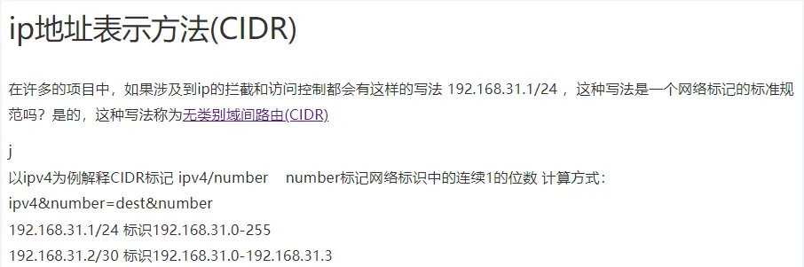

8. **Method Route Predicate Factory**

    - 接受一个 `methods` 参数，它是一个或多个参数，表示要匹配的 HTTP 方法，如 GET、POST。

    示例配置：

    ```yml
    spring:
      cloud:
        gateway:
          routes:
            - id: pay_routh1 #pay_routh1                #路由的ID(类似mysql主键ID)，没有固定规则但要求唯一，建议配合服务名
              uri: lb://cloud-payment-service           #匹配后提供服务的路由地址
              predicates:
                - Path=/pay/gateway/get/**              # 断言，路径相匹配的进行路由
                - Method=GET,POST     # 配置某个请求地址，只能用Get/Post方法访问，方法限制
    ```

###### 上述配置小总结

**Predicate 就是为了实现一组匹配规则，让请求过来找到对应的 Route 进行处理。**

```yml
server:
  port: 9527

spring:
  application:
    name: cloud-gateway #以微服务注册进consul或nacos服务列表内
  cloud:
    consul: #配置consul地址
      host: localhost
      port: 8500
      discovery:
        prefer-ip-address: true
        service-name: ${spring.application.name}
    gateway:
      routes:
        - id: pay_routh1 #pay_routh1                #路由的ID(类似mysql主键ID)，没有固定规则但要求唯一，建议配合服务名
          #uri: http://localhost:8001                #匹配后提供服务的路由地址
          uri: lb://cloud-payment-service
          predicates:
            - Path=/pay/gateway/get/**              # 断言，路径相匹配的进行路由
            #- After=2024-05-12T20:30:08.937420100+08:00[Asia/Shanghai] # 规定时间之后可访问
            #- Before=2024-05-12T20:44:00.000+08:00[Asia/Shanghai]  # 超过规定时间不可访问
            #- Between=2024-05-12T20:53:00.000+08:00[Asia/Shanghai],2024-05-12T20:54:00.000+08:00[Asia/Shanghai]
            #- Cookie=username,xyz
            #- Header=X-Request-Id, \d+  # 请求头要有X-Request-Id属性并且值为整数的正则表达式
            #- Host=**.atguigu.com
            #- Query=username, \d+  # 要有参数名username并且值还要是整数才能路由
            #- RemoteAddr=192.168.0.1/24 # 外部访问我的IP限制，最大跨度不超过32，目前是1~24它们是 CIDR 表示法。
            - Method=GET,POST     # 配置某个请求地址，只能用Get/Post方法访问，方法限制

        - id: pay_routh2 #pay_routh2                #路由的ID(类似mysql主键ID)，没有固定规则但要求唯一，建议配合服务名
          #uri: http://localhost:8001                #匹配后提供服务的路由地址
          uri: lb://cloud-payment-service
          predicates:
            - Path=/pay/gateway/info/**              # 断言，路径相匹配的进行路由
```

##### 自定义断言，XXXRoutePredicateFactory 规则

###### 痛点

原有的断言配置不满足业务怎么办？自定义断言。

模板套路：

- 要么继承 `AbstractRoutePredicateFactory` 抽象类
- 要么实现 `RoutePredicateFactory` 接口
- 开头任意取名，但是必须以 `RoutePredicateFactory` 后缀结尾

###### 自定义路由断言规则步骤套路

1. 新建类名 XXX 需要以 RoutePredicateFactory 结尾并继承 AbstractRoutePredicateFactory 类
2. 重写 apply 方法
3. 新建 apply 方法所需要的静态内部类 MyRoutePredicateFactory.Config，这个 Config 类就是我们的路由断言规则，重要
4. 空参构造方法，内部调用 super
5. 重写 apply 方法具体内容

注：需要导入 Lombok jar 包

```java
package com.atguigu.cloud.mygateway;

/**
 * 需求说明：自定义配置会员等级userType，按照钻、金、银和yml配置的会员等级，以适配是否可以访问
 */
@Component
public class MyRoutePredicateFactory extends AbstractRoutePredicateFactory<MyRoutePredicateFactory.Config> {

    public MyRoutePredicateFactory() {
        super(MyRoutePredicateFactory.Config.class);
    }

    @Override
    public Predicate<ServerWebExchange> apply(MyRoutePredicateFactory.Config config) {
        return new Predicate<ServerWebExchange>() {
            @Override
            public boolean test(ServerWebExchange serverWebExchange) {
                // 检查request的参数里面，userType是否为指定的值，符合配置就通过
                String userType = serverWebExchange.getRequest().getQueryParams().getFirst("userType");
                if (userType == null) return false;
                // 如果说参数存在，就和config的数据进行比较
                return userType.equalsIgnoreCase(config.getUserType());
            }
        };
    }

    // 不加此方法无法使用短格式配置方法
    @Override
    public List<String> shortcutFieldOrder() {
        return Collections.singletonList("userType");
    }

    // 这个Config类就是我们的路由断言规则，重要
    @Validated
    public static class Config {
        @Setter
        @Getter
        @NotEmpty
        private String userType; // 钻、金、银等用户等级
    }
}
```

```yml
server:
  port: 9527

spring:
  application:
    name: cloud-gateway #以微服务注册进consul或nacos服务列表内
  cloud:
    consul: #配置consul地址
      host: localhost
      port: 8500
      discovery:
        prefer-ip-address: true
        service-name: ${spring.application.name}
    gateway:
      routes:
        - id: pay_routh1 #pay_routh1                #路由的ID(类似mysql主键ID)，没有固定规则但要求唯一，建议配合服务名
          uri: lb://cloud-payment-service
          predicates:
            - Path=/pay/gateway/get/**              # 断言，路径相匹配的进行路由
            - My=diamond
#            - name: My
#              args:
#                userType: diamond

        - id: pay_routh2 #pay_routh2                #路由的ID(类似mysql主键ID)，没有固定规则但要求唯一，建议配合服务名
          uri: lb://cloud-payment-service
          predicates:
            - Path=/pay/gateway/info/**              # 断言，路径相匹配的进行路由
```

###### bug 分析

如果自定义路由断言工厂 MyRoutePredicateFactory 没有实现 shortcutFieldOrder 方法，则在配置文件中就无法使用短格式配置方法。

`Caused by: org.springframework.boot.context.properties.bind.validation.BindValidationException: Binding validation errors on`

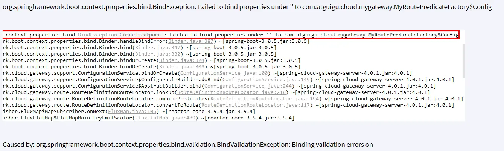

解决方法：

1. 使用 Fully Expanded Arguments
2. 实现 shortcutFieldOrder 方法

###### 测试

http://localhost:9527/pay/gateway/get/1?userType=diamond

#### Filter 过滤

##### 概述

###### 是什么

[Spring Cloud Gateway:gatewayfilter](https://docs.spring.io/spring-cloud-gateway/docs/4.0.4/reference/html/#gatewayfilter-factories)

- SpringMVC 里面的的拦截器 Interceptor，Servlet 的过滤器。
- `pre`和 `post` 分别会在请求被执行前调用和被执行后调用。

###### 能干嘛

- 请求鉴权
- 异常处理
- 记录接口调用时长统计（重点，大厂面试设计题）
- 。。。。。。

###### 类型

1. 全局默认过滤器 Global Filters
    - gateway 出厂默认已有的，直接用即可，主要作用于所有的路由
    - 不需要在配置文件中配置，作用在所有的路由上，实现 GlobalFilter 接口即可
2. 单一内置过滤器 GatewayFilter
    - 也可以称为网关过滤器，这种过滤器主要是作用于单一路由或者某个路由分组
3. 自定义过滤器

##### Gateway 常见的内置过滤器

###### 请求头(RequestHeader)相关组

1. `The AddRequestHeader GatewayFilter Factory`：新增指定请求头内容 ByName
2. `The RemoveRequestHeader GatewayFilter Factory`：删除请求头 ByName
3. `The SetRequestHeader GatewayFilter Factory`：修改请求头 ByName

- 8001 微服务 PayGateWayController 新增方法

    ```java
    @GetMapping(value = "/pay/gateway/filter")
    public ResultData<String> getGatewayFilter(HttpServletRequest request) {
        String result = "";
        Enumeration<String> headers = request.getHeaderNames();
        while (headers.hasMoreElements()) {
            String headName = headers.nextElement();
            String headValue = request.getHeader(headName);
            System.out.println("request headName:" + headName + "---" + "request headValue:" + headValue);
    
            if (headName.equalsIgnoreCase("X-Request-atguigu1")
                || headName.equalsIgnoreCase("X-Request-atguigu2")) {
                result = result + headName + "\t " + headValue + " ";
            }
        }
    
        System.out.println("=============================================");
        String customerId = request.getParameter("customerId");
        System.out.println("request Parameter customerId: " + customerId);
    
        String customerName = request.getParameter("customerName");
        System.out.println("request Parameter customerName: " + customerName);
        System.out.println("=============================================");
    
        return ResultData.success("getGatewayFilter 过滤器 test： " + result + " \t " + DateUtil.now());
    }
    ```

- 9527 网关 YML 添加过滤内容

    ```yml
    - id: pay_routh3 #pay_routh3
      uri: lb://cloud-payment-service                #匹配后提供服务的路由地址
      predicates:
        - Path=/pay/gateway/filter/**              # 断言，路径相匹配的进行路由
      filters:
        - AddRequestHeader=X-Request-atguigu1,atguiguValue1  # 请求头kv，若一头含有多参则重写一行设置
        - AddRequestHeader=X-Request-atguigu2,atguiguValue2
        - RemoveRequestHeader=sec-fetch-site      # 删除请求头sec-fetch-site
        - SetRequestHeader=sec-fetch-mode, Blue-updatebyzzyy # 将请求头sec-fetch-mode对应的值修改为Blue-updatebyzzyy
    ```

- 重启 9527 和 8001 并再次调用地址：http://localhost:9527/pay/gateway/filter

    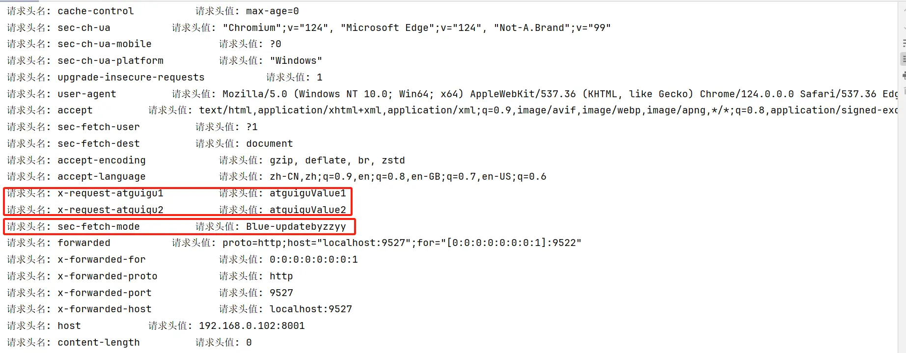

###### 请求参数(RequestParameter)相关组

1. `The AddRequestParameter GatewayFilter Factory`：新增 url 请求参数
2. `The RemoveRequestParameter GatewayFilter Factory`：删除 url 请求参数

- YML 添加过滤内容

    ```yml
    - id: pay_routh3 #pay_routh3
      uri: lb://cloud-payment-service                #匹配后提供服务的路由地址
      predicates:
        - Path=/pay/gateway/filter/**              # 断言，路径相匹配的进行路由
      filters:
        - AddRequestHeader=X-Request-atguigu1,atguiguValue1  # 请求头kv，若一头含有多参则重写一行设置
        - AddRequestHeader=X-Request-atguigu2,atguiguValue2
        - RemoveRequestHeader=sec-fetch-site      # 删除请求头sec-fetch-site
        - SetRequestHeader=sec-fetch-mode, Blue-updatebyzzyy # 将请求头sec-fetch-mode对应的值修改为Blue-updatebyzzyy
        - AddRequestParameter=customerId,9527001 # 新增请求参数Parameter：k ，v
        - RemoveRequestParameter=customerName   # 删除url请求参数customerName，你传递过来也是null
    ```

- 重启 9527 和 8001

    - http://localhost:9527/pay/gateway/filter

        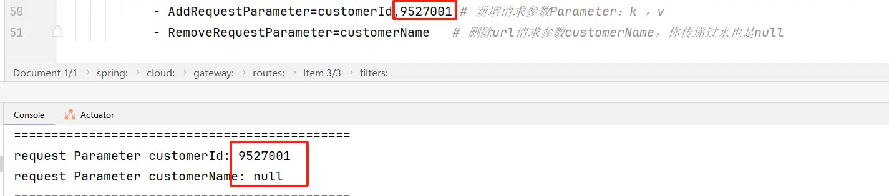

    - http://localhost:9527/pay/gateway/filter?customerId=9999&customerName=z3

        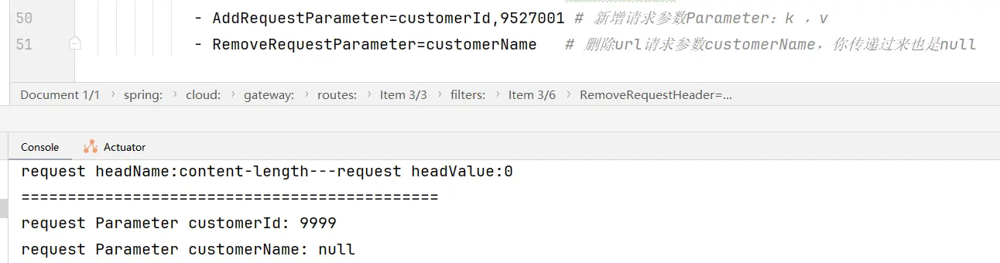

###### 响应头(ResponseHeader)相关组

1. `The AddResponseHeader GatewayFilter Factory`：新增响应头属性
2. `The SetResponseHeader GatewayFilter Factory`：修改响应头属性
3. `The RemoveResponseHeader GatewayFilter Factory`：删除响应头属性

- YML 添加过滤内容

    ```yml
    - id: pay_routh3 #pay_routh3
      uri: lb://cloud-payment-service                #匹配后提供服务的路由地址
      predicates:
        - Path=/pay/gateway/filter/**              # 断言，路径相匹配的进行路由
      filters:
        - AddRequestHeader=X-Request-atguigu1,atguiguValue1  # 请求头kv，若一头含有多参则重写一行设置
        - AddRequestHeader=X-Request-atguigu2,atguiguValue2
        - RemoveRequestHeader=sec-fetch-site      # 删除请求头sec-fetch-site
        - SetRequestHeader=sec-fetch-mode, Blue-updatebyzzyy # 将请求头sec-fetch-mode对应的值修改为Blue-updatebyzzyy
        - AddRequestParameter=customerId,9527001 # 新增请求参数Parameter：k ，v
        - RemoveRequestParameter=customerName   # 删除url请求参数customerName，你传递过来也是null
        - AddResponseHeader=X-Response-atguigu, BlueResponse # 新增请求参数X-Response-atguigu并设值为BlueResponse
        - SetResponseHeader=Date,2099-11-11 # 设置回应头Date值为2099-11-11
        - RemoveResponseHeader=Content-Type # 将默认自带Content-Type回应属性删除
    ```

- 重启 9527 和 8001

    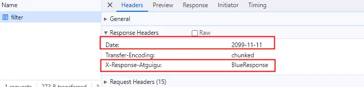

###### 前缀和路径相关组

之前的正确地址：http://localhost:9527/pay/gateway/filter

1. `The PrefixPath GatewayFilter Factory`：自动添加路径前缀

    ```yml
    predicates:
      - Path=/gateway/filter/**              # 断言，为配合PrefixPath测试过滤，暂时注释掉/pay
    filters:
      - PrefixPath=/pay # http://localhost:9527/pay/gateway/filter  被分拆为：PrefixPath + Path
    ```

    访问：http://localhost:9527/gateway/filter

    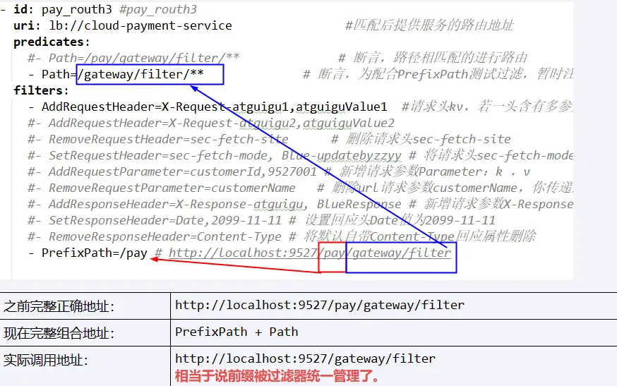

    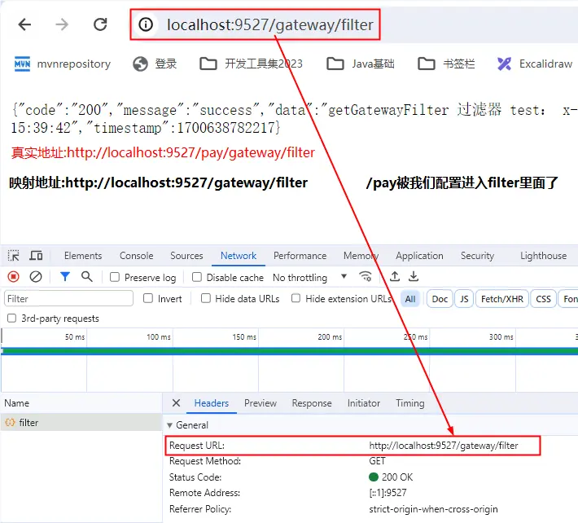

2. `The SetPath GatewayFilter Factory`：访问路径修改

    ```yml
    predicates:
      - Path=/XYZ/abc/{segment}           # 断言，为配合SetPath测试，{segment}的内容最后被SetPath取代
    filters:
      - SetPath=/pay/gateway/{segment}  # {segment}表示占位符，你写abc也行但要上下一致
    ```

    访问：http://localhost:9527/XYZ/abc/filter

    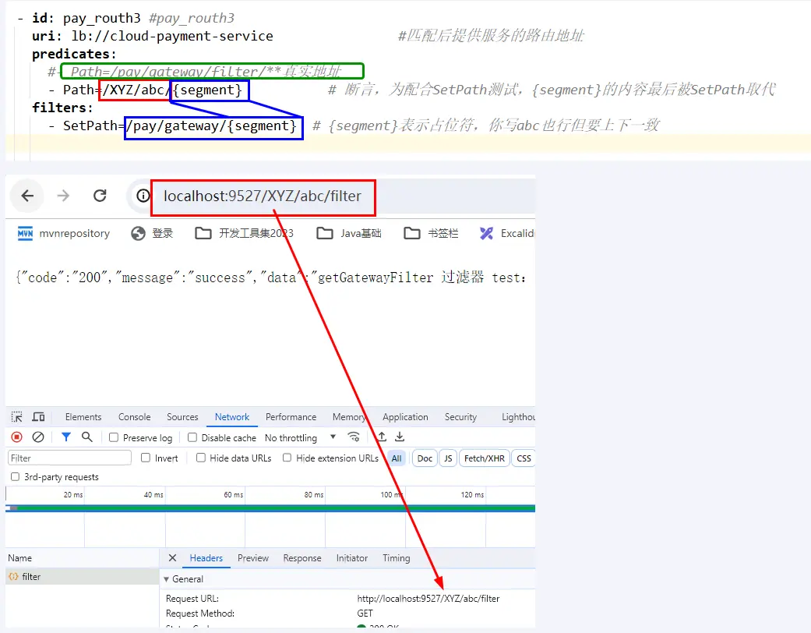

3. `The RedirectTo GatewayFilter Factory`：重定向到某个页面

    ```yml
    predicates:
      - Path=/pay/gateway/filter/** # 真实地址
    filters:
      - RedirectTo=302, http://www.atguigu.com/ # 访问http://localhost:9527/pay/gateway/filter跳转到http://www.atguigu.com/
    ```

    访问：http://localhost:9527/pay/gateway/filter

###### Default Filters

- 要添加一个过滤器并将其应用于所有路由，可以使用 `spring.clod.gatewaydefault-filter`。
- 此属性接受筛选器列表。

- 配置在此处相当于全局通用，自定义秒变 Global

```yml
spring:
  cloud:
    gateway:
      default-filters:
      - AddResponseHeader=X-Response-Default-Red, Default-Blue
      - PrefixPath=/httpbin
```

##### Gateway 自定义过滤器

###### 自定义全局 Filter

**面试题：统计接口调用耗时情况，如何落地，谈谈设计思路**

通过自定义全局过滤器搞定上述需求

**案例：自定义接口调用耗时统计的全局过滤器**

[Combined Global Filter and GatewayFilter Ordering](https://docs.spring.io/spring-cloud-gateway/docs/current/reference/html/#gateway-combined-global-filter-and-gatewayfilter-ordering)

1. 新建类 MyGlobalFilter 并实现 GlobalFilter,Ordered 两个接口

    ```java
    package com.atguigu.cloud.mygateway;
    
    @Component
    @Slf4j
    public class MyGlobalFilter implements GlobalFilter, Ordered {
        public static final String BEGIN_VISIT_TIME = "begin_visit_time"; // 开始调用方法的时间
    
        @Override
        public Mono<Void> filter(ServerWebExchange exchange, GatewayFilterChain chain) {
            // 1. 先记录下访问接口的开始时间
            exchange.getAttributes().put(BEGIN_VISIT_TIME, System.currentTimeMillis());
            // 2, 返回统计的各个结果给后台
            return chain.filter(exchange).then(Mono.fromRunnable(() -> {
                Long beginVisitTime = exchange.getAttribute(BEGIN_VISIT_TIME);
                if (beginVisitTime != null) {
                    log.info("访问接口主机：" + exchange.getRequest().getURI().getHost());
                    log.info("访问接口端口：" + exchange.getRequest().getURI().getPort());
                    log.info("访问接口URL：" + exchange.getRequest().getURI().getPath());
                    log.info("访问接口URL后面参数：" + exchange.getRequest().getURI().getRawQuery());
                    log.info("访问接口时长：" + (System.currentTimeMillis() - beginVisitTime) + "毫秒");
                    log.info("========================分割线========================\n");
                }
            }));
        }
    
        // 数字越小，优先级越高
        @Override
        public int getOrder() {
            return 0;
        }
    }
    ```

2. YML

    ```yml
    server:
      port: 9527
    
    spring:
      application:
        name: cloud-gateway #以微服务注册进consul或nacos服务列表内
      cloud:
        consul: #配置consul地址
          host: localhost
          port: 8500
          discovery:
            prefer-ip-address: true
            service-name: ${spring.application.name}
        gateway:
          routes:
            - id: pay_routh1 #pay_routh1                #路由的ID(类似mysql主键ID)，没有固定规则但要求唯一，建议配合服务名
              uri: lb://cloud-payment-service
              predicates:
                - Path=/pay/gateway/get/**              # 断言，路径相匹配的进行路由
            - id: pay_routh2 #pay_routh2                #路由的ID(类似mysql主键ID)，没有固定规则但要求唯一，建议配合服务名
              uri: lb://cloud-payment-service
              predicates:
                - Path=/pay/gateway/info/**              # 断言，路径相匹配的进行路由
            - id: pay_routh3 #pay_routh3
              uri: lb://cloud-payment-service                #匹配后提供服务的路由地址
              predicates:
                - Path=/pay/gateway/filter/** # 真实地址
    ```

###### 自定义条件 Filter

自定义单一内置过滤器 GatewayFilter，参考几个内置的过滤器。

自定义网关过滤器规则步骤套路：

1. 新建类名 XXX 需要以 GatewayFilterFactory 结尾，并继承 AbstractGatewayFilterFactory 类
2. 新建 XXXGatewayFilterFactory.Config 内部类
3. 重写 apply 方法
4. 重写 shortcutFieldOrder
5. 空参构造方法，内部调用 super

```java
package com.atguigu.cloud.mygateway;

// //单一内置过滤器GatewayFilter
@Component
public class MyGatewayFilterFactory extends AbstractGatewayFilterFactory<MyGatewayFilterFactory.Config> {

    public MyGatewayFilterFactory() {
        super(MyGatewayFilterFactory.Config.class);
    }

    @Override
    public GatewayFilter apply(MyGatewayFilterFactory.Config config) {
        return new GatewayFilter() {
            @Override
            public Mono<Void> filter(ServerWebExchange exchange, GatewayFilterChain chain) {
                ServerHttpRequest request = exchange.getRequest();
                System.out.println("进入了自定义网关过滤器MyGatewayFilterFactory，status：" + config.getStatus());
                if (request.getQueryParams().containsKey("atguigu")) {
                    return chain.filter(exchange);
                } else {
                    exchange.getResponse().setStatusCode(HttpStatus.BAD_REQUEST);
                    return exchange.getResponse().setComplete();
                }
            }
        };
    }

    @Override
    public List<String> shortcutFieldOrder() {
        return Collections.singletonList("status");
    }

    public static class Config {
        @Setter
        @Getter
        private String status; // 设置一个状态值/标志位，它等于多少，匹配才可以访问
    }
}
```

```yml
- id: pay_routh3 #pay_routh3
  uri: lb://cloud-payment-service
  predicates: 
    - Path=/pay/gateway/filter/**
  filters:
    - My=atguigu
```

测试：

```shell
# 错误
http://localhost:9527/pay/gateway/filter
# 正确
http://localhost:9527/pay/gateway/filter?atguigu=java
```

### Gateway 整合阿里巴巴 Sentinel 实现容错

<font color="red" size=5>见后续 springcloud alibaba 篇章</font>

## 参考文档

<a :href="$withBase('/SpringCloud2024.html')" >尚硅谷 SpringCloud 第 3 季 2024 笔记</a>
