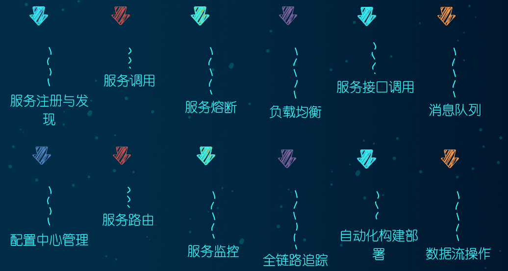
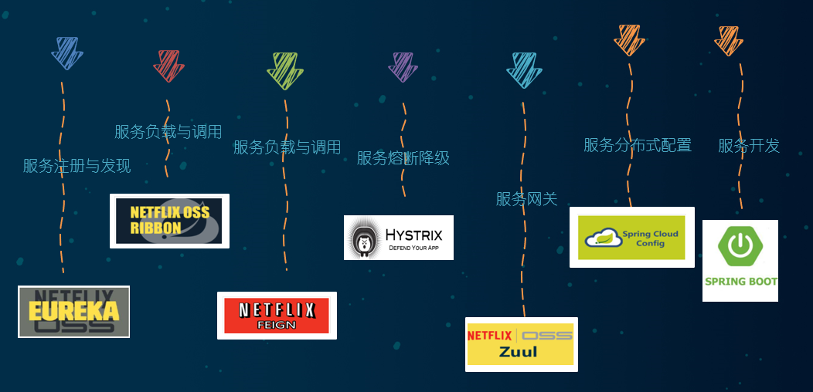
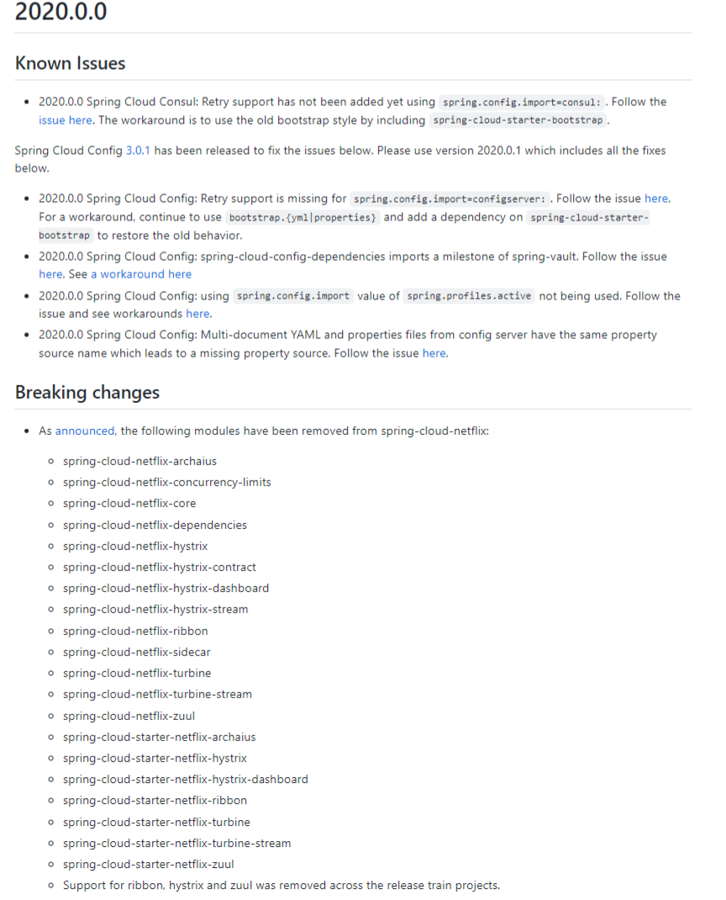
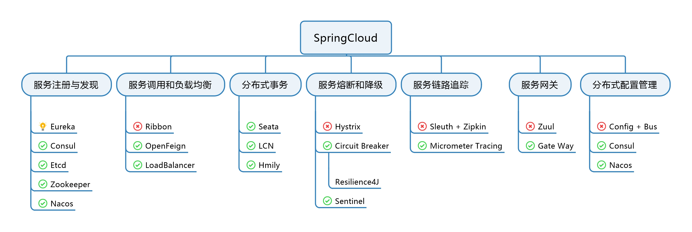
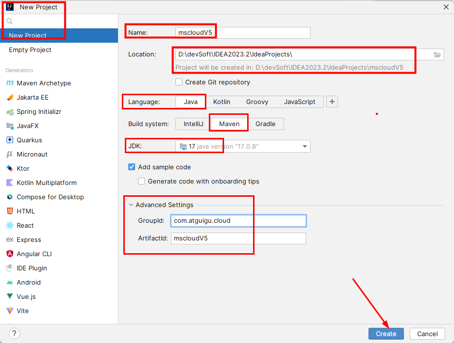
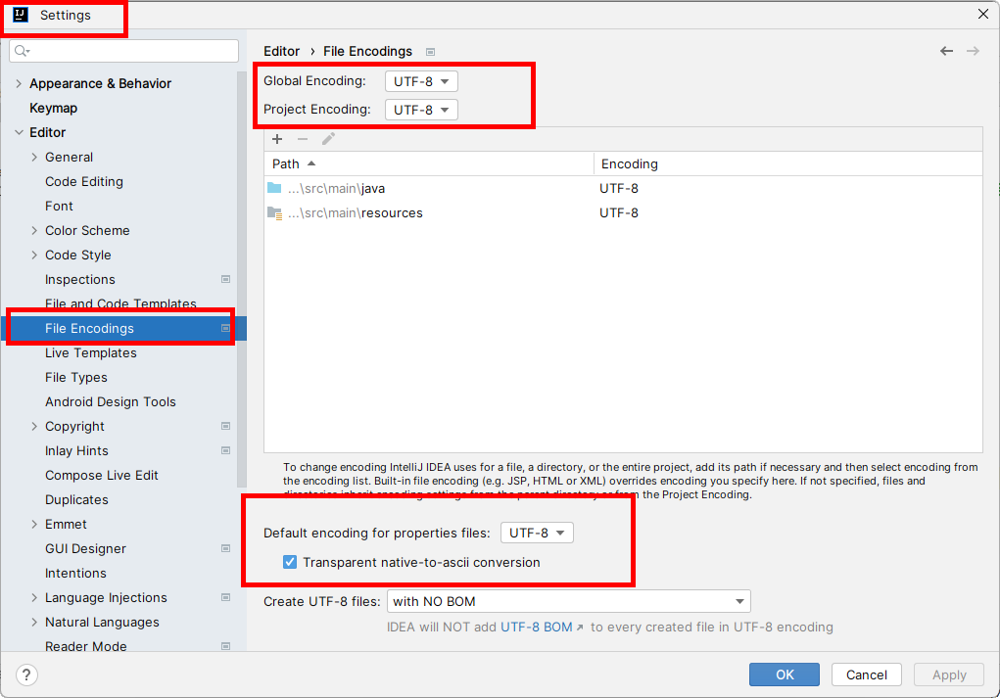
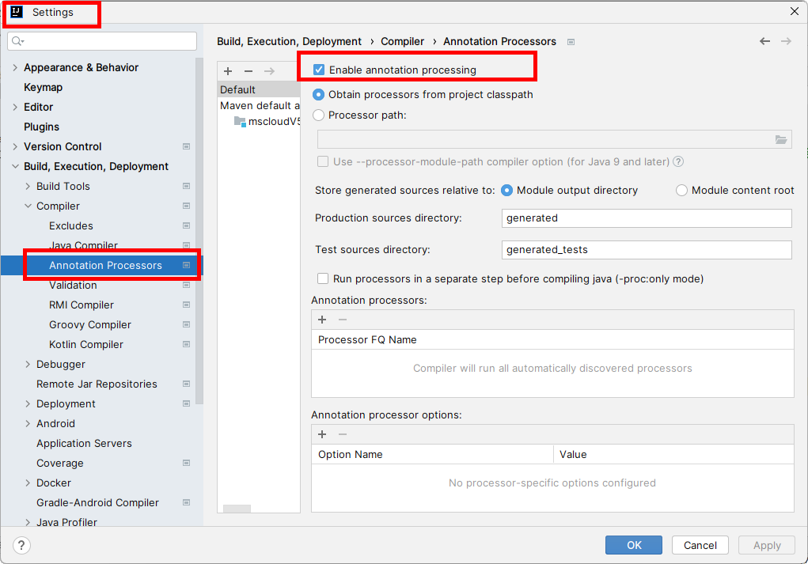
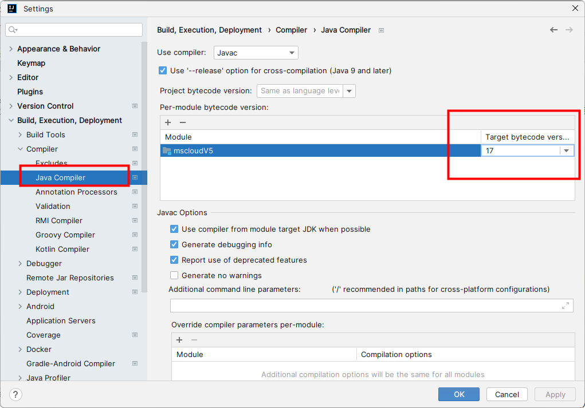
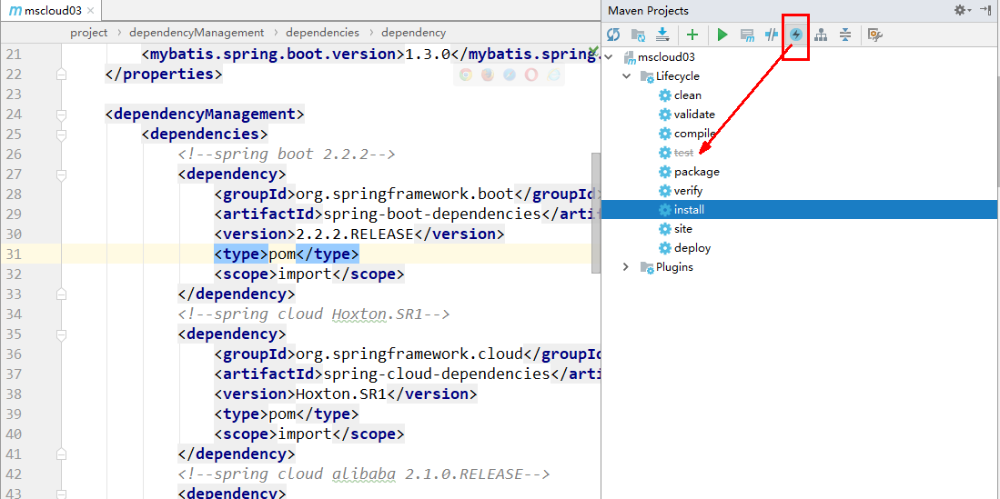

# SpringCloud


## 1. 微服务零基础理论知识入门

### 什么是微服务架构

微服务架构是一种架构模式，它提倡将单一应用程序划分为一组小的服务，服务之间互相协调、互相配合，为用户提供最终价值。每个服务运行在其独立的进程中，服务与服务间采用轻量级的通信机制互相协作（通常是基于HTTP协议的RESTful API）。每个服务都围绕着具体业务进行构建，并且能够被独立的部署到生产环境、类生产环境等。另外，应当尽量避免统一的、集中式的服务管理机制，对具体的一个服务而言，应根据业务上下文，选择合适的语言、工具对其进行构建。




### 1.2. SpringCloud

SpringCloud = 分布式微服务架构的一站式解决方案，是多种微服务架构落地技术的集合体，俗称微服务全家桶。


### 1.3. SpringCloud 组件


- SpringCloud 2018年组件



- SpringCloud移除了Netflix OOS体系



- SpringCloud 2024年组件


- SpringCloud 组件Upgrade



## 微服务架构编码Base工程模块构建

### 版本选择

- Java：Java17+

- cloud：2023.0.0

- boot：3.2.0

- cloud alibaba：2022.0.0.0-RC2

- Maven：3.9+

- Mysql：8.0+

    [SpringBoot3.0版本依赖关系](https://github.com/spring-projects/spring-boot/wiki/Spring-Boot-3.0-Release-Notes)

    [Spring Cloud Overview](https://spring.io/projects/spring-cloud#overview)

    [Spring Cloud Alibaba版本说明](https://github.com/alibaba/spring-cloud-alibaba/wiki/版本说明)

    [Spring Cloud Alibaba 参考文档](https://spring-cloud-alibaba-group.github.io/github-pages/2022/zh-cn/2022.0.0.0-RC2.html)

### 订单-支付业务需求说明


### IDEA新建Project和Maven父工程

#### 微服务Cloud整体聚合Maven父工程Project

1. New Project

    

2. 聚合总父工程名字

    

3. 字符编码设置为UTF-8

    

4. 注解生效激活

    

5. Java编译版本选17

    

#### 父工程POM文件内容

```xml
<?xml version="1.0" encoding="UTF-8"?>
<project xmlns="http://maven.apache.org/POM/4.0.0"
         xmlns:xsi="http://www.w3.org/2001/XMLSchema-instance"
         xsi:schemaLocation="http://maven.apache.org/POM/4.0.0 http://maven.apache.org/xsd/maven-4.0.0.xsd">
    <modelVersion>4.0.0</modelVersion>

    <groupId>com.atguigu.cloud</groupId>
    <artifactId>cloud2024</artifactId>
    <version>1.0-SNAPSHOT</version>
    <packaging>pom</packaging>

    <properties>
        <maven.compiler.source>17</maven.compiler.source>
        <maven.compiler.target>17</maven.compiler.target>
        <project.build.sourceEncoding>UTF-8</project.build.sourceEncoding>
        <hutool.version>5.8.22</hutool.version>
        <lombok.version>1.18.26</lombok.version>
        <druid.version>1.1.20</druid.version>
        <mybatis.springboot.version>3.0.2</mybatis.springboot.version>
        <mysql.version>8.0.11</mysql.version>
        <swagger3.version>2.2.0</swagger3.version>
        <mapper.version>4.2.3</mapper.version>
        <fastjson2.version>2.0.40</fastjson2.version>
        <persistence-api.version>1.0.2</persistence-api.version>
        <spring.boot.test.version>3.1.5</spring.boot.test.version>
        <spring.boot.version>3.2.0</spring.boot.version>
        <spring.cloud.version>2023.0.0</spring.cloud.version>
        <spring.cloud.alibaba.version>2022.0.0.0-RC2</spring.cloud.alibaba.version>
    </properties>

    <dependencyManagement>
        <dependencies>
            <!--springboot 3.2.0-->
            <dependency>
                <groupId>org.springframework.boot</groupId>
                <artifactId>spring-boot-starter-parent</artifactId>
                <version>${spring.boot.version}</version>
                <type>pom</type>
                <scope>import</scope>
            </dependency>
            <!--springcloud 2023.0.0-->
            <dependency>
                <groupId>org.springframework.cloud</groupId>
                <artifactId>spring-cloud-dependencies</artifactId>
                <version>${spring.cloud.version}</version>
                <type>pom</type>
                <scope>import</scope>
            </dependency>
            <!--springcloud alibaba 2022.0.0.0-RC2-->
            <dependency>
                <groupId>com.alibaba.cloud</groupId>
                <artifactId>spring-cloud-alibaba-dependencies</artifactId>
                <version>${spring.cloud.alibaba.version}</version>
                <type>pom</type>
                <scope>import</scope>
            </dependency>
            <!--SpringBoot集成mybatis-->
            <dependency>
                <groupId>org.mybatis.spring.boot</groupId>
                <artifactId>mybatis-spring-boot-starter</artifactId>
                <version>${mybatis.springboot.version}</version>
            </dependency>
            <!--Mysql数据库驱动8 -->
            <dependency>
                <groupId>mysql</groupId>
                <artifactId>mysql-connector-java</artifactId>
                <version>${mysql.version}</version>
            </dependency>
            <!--SpringBoot集成druid连接池-->
            <dependency>
                <groupId>com.alibaba</groupId>
                <artifactId>druid-spring-boot-starter</artifactId>
                <version>${druid.version}</version>
            </dependency>
            <!--通用Mapper4之tk.mybatis-->
            <dependency>
                <groupId>tk.mybatis</groupId>
                <artifactId>mapper</artifactId>
                <version>${mapper.version}</version>
            </dependency>
            <!--persistence-->
            <dependency>
                <groupId>javax.persistence</groupId>
                <artifactId>persistence-api</artifactId>
                <version>${persistence-api.version}</version>
            </dependency>
            <!-- fastjson2 -->
            <dependency>
                <groupId>com.alibaba.fastjson2</groupId>
                <artifactId>fastjson2</artifactId>
                <version>${fastjson2.version}</version>
            </dependency>
            <!-- swagger3 调用方式 http://你的主机IP地址:5555/swagger-ui/index.html -->
            <dependency>
                <groupId>org.springdoc</groupId>
                <artifactId>springdoc-openapi-starter-webmvc-ui</artifactId>
                <version>${swagger3.version}</version>
            </dependency>
            <!--hutool-->
            <dependency>
                <groupId>cn.hutool</groupId>
                <artifactId>hutool-all</artifactId>
                <version>${hutool.version}</version>
            </dependency>
            <!--lombok-->
            <dependency>
                <groupId>org.projectlombok</groupId>
                <artifactId>lombok</artifactId>
                <version>${lombok.version}</version>
                <optional>true</optional>
            </dependency>
            <!-- spring-boot-starter-test -->
            <dependency>
                <groupId>org.springframework.boot</groupId>
                <artifactId>spring-boot-starter-test</artifactId>
                <version>${spring.boot.test.version}</version>
                <scope>test</scope>
            </dependency>
        </dependencies>
    </dependencyManagement>
</project>
```

##### 小细节复习

1. Maven中的 DependencyManagement 和 Dependencies

    - Maven 使用dependencyManagement 元素来提供了一种管理依赖版本号的方式。

    - **通常会在一个组织或者项目的最顶层的父POM 中看到 dependencyManagement 元素**。
    - 使用pom.xml 中的 dependencyManagement 元素能让所有在子项目中引用一个依赖而不用显式的列出版本号。
    - Maven会沿着父子层次向上走，直到找到一个拥有 dependencyManagement 元素的项目，然后它就会使用这个 dependencyManagement 元素中指定的版本号。
    - 好处：如果有多个子项目都引用同一样依赖，则可以避免在每个使用的子项目里都声明一个版本号
        - 当想升级或切换到另一个版本时，只需要在顶层父容器里更新，而不需要一个一个子项目的修改 ；
        - 另外如果某个子项目需要另外的一个版本，只需要声明version就可。
    - **dependencyManagement 里只是声明依赖，并不实现引入，因此子项目需要显示的声明需要用的依赖**。
    -  如果不在子项目中声明依赖，是不会从父项目中继承下来的，只有在子项目中写了该依赖项并且没有指定具体版本，才会从父项目中继承该项 ，且 version 和 scope 都读取自父 pom。
    - 如果子项目中指定了版本号，那么会使用子项目中指定的jar版本。

2. Maven 中跳过单元测试

    - 通过配置

        ```xml
        <build><!-- maven中跳过单元测试 -->
            <plugins>
                <plugin>
                    <groupId>org.apache.maven.plugins</groupId>
                    <artifactId>maven-surefire-plugin</artifactId>
                    <configuration>
                        <skip>true</skip>
                    </configuration>
                </plugin>
            </plugins>
        </build>
        ```

    - IDEA工具支持（推荐）

        

#### Mysql 驱动说明

##### MySQL 5.7

1. application.properties

```properties
# mysql5.7---JDBC四件套
jdbc.driverClass = com.mysql.jdbc.Driver
jdbc.url= jdbc:mysql://localhost:3306/db2024?useUnicode=true&characterEncoding=UTF-8&useSSL=false
jdbc.user = root
jdbc.password =123456
```

2. Maven 的 POM.xml

```xml
<!-- Maven的POM文件处理 -->
<dependency>
    <groupId>mysql</groupId>
    <artifactId>mysql-connector-java</artifactId>
    <version>5.1.47</version>
</dependency>
```

##### MySQL 8.x

1. application.properties

```properties
# mysql8.0---JDBC四件套
jdbc.driverClass = com.mysql.cj.jdbc.Driver
jdbc.url= jdbc:mysql://localhost:3306/db2024?characterEncoding=utf8&useSSL=false&serverTimezone=GMT%2B8&rewriteBatchedStatements=true&allowPublicKeyRetrieval=true
jdbc.user = root
jdbc.password =123456
```

2. Maven 的 POM.xml

```xml
<dependency>
    <groupId>mysql</groupId>
    <artifactId>mysql-connector-java</artifactId>
    <version>8.0.11</version>
</dependency>
```

### Mapper4之一键生成


### Rest通用Base工程构建


### 引入微服务理念，从这里开始


## Consul 服务注册与发现


## LoadBalancer负载均衡服务调用


## OpenFeign服务接口调用


## CircuitBreaker断路器


## Sleuth（Micrometer）+ZipKin分布式链路追踪


## Gateway新一代网关


## SpringCloud Alibaba入门简介


## SpringCloud Alibaba Nacos服务注册和配置中心


## SPringCloud Alibaba Sentinel实现熔断与限流


## SPringCloud Alibaba Seate处理分布式事务


## 总结和回顾