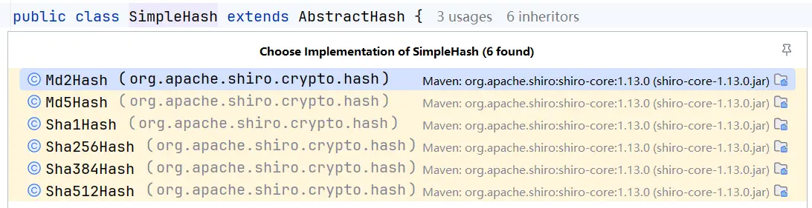

# 安全框架之 Shiro

## 入门概述

### 是什么

- Apache Shiro 是一个功能强大且易于使用的 Java 安全（权限）框架。
- Shiro 可以完成：认证、授权、加密、会话管理、与 Web 集成、缓存等。
- 借助 Shiro 您可以快速轻松地保护任何应用程序——从最小的移动应用程序到最大的 Web 和企业应用程序。
- 官网：[https://shiro.apache.org/](https://shiro.apache.org/)
- [Apache Shiro 中文文档 | Docs4dev](https://www.docs4dev.com/docs/zh/apache-shiro/1.5.3/reference/introduction.html)

### 为什么要用 Shiro

自 2003 年以来，框架格局发生了相当大的变化，因此今天仍然有很多系统在使用 Shiro。这与 Shiro 的特性密不可分。

- **易于使用**：使用 Shiro 构建系统安全框架非常简单。就算第一次接触也可以快速掌握。
- **全面**：Shiro 包含系统安全框架需要的功能，满足安全需求的“一站式服务”。
- **灵活**：Shiro 可以在任何应用程序环境中工作。虽然它可以在 Web、EJB 和 IoC 环境中工作，但不需要依赖它们。Shiro 也没有强制要求任何规范，甚至没有很多依赖项。
- **强力支持 Web**：Shiro 具有出色的 Web 应用程序支持，可以基于应用程序 URL 和 Web 协议（例如 REST）创建灵活的安全策略，同时还提供一组 JSP 库来控制页面输出。
- **兼容性强**：Shiro 的设计模式使其易于与其他框架和应用程序集成。Shiro 与 Spring、Grails、Wicket、Tapestry、Mule、Apache Camel、Vaadin 等框架无缝集成。
- **社区支持**：Shiro 是 Apache 软件基金会的一个开源项目，有完备的社区支持，文档支持。如果需要，像 Katasoft 这样的商业公司也会提供专业的支持和服务。

### Shiro 与 SpringSecurity 的对比

1. Spring Security 基于 Spring 开发，项目若使用 Spring 作为基础，配合 Spring Security 做权限更加方便，而 Shiro 需要和 Spring 进行整合开发；
2. Spring Security 功能比 Shiro 更加丰富些，例如安全维护方面；
3. Spring Security 社区资源相对比 Shiro 更加丰富；
4. Shiro 的配置和使用比较简单，Spring Security 上手复杂些；
5. Shiro 依赖性低，不需要任何框架和容器，可以独立运行。Spring Security 依赖 Spring 容器；
6. Shiro 不仅仅可以使用在 web 中，它可以工作在任何应用环境中。在集群会话时 Shiro 最重要的一个好处或许就是它的会话是独立于容器的。

### 基本功能


1. **Authentication**：身份认证/登录，验证用户是不是拥有相应的身份；
2. **Authorization**：授权，即权限验证，验证某个已认证的用户是否拥有某个权限；即判断用户是否能进行什么操作，如：验证某个用户是否拥有某个角色。或者细粒度的验证某个用户对某个资源是否具有某个权限；
3. **Session Manager**：会话管理，即用户登录后就是一次会话，在没有退出之前，它的所有信息都在会话中；会话可以是普通 JavaSE 环境，也可以是 Web 环境的；
4. **Cryptography**：加密，保护数据的安全性，如密码加密存储到数据库，而不是明文存储；
5. **Web Support**：Web 支持，可以非常容易的集成到 Web 环境；
6. **Caching**：缓存，比如用户登录后，其用户信息、拥有的角色/权限不必每次去查，这样可以提高效率；
7. **Concurrency**：Shiro 支持多线程应用的并发验证，即如在一个线程中开启另一个线程，能把权限自动传播过去；
8. **Testing**：提供测试支持；
9. **Run As**：允许一个用户假装为另一个用户（如果他们允许）的身份进行访问；
10. **Remember Me**：记住我，这个是非常常见的功能，即一次登录后，下次再来的话不用登录了。

### 原理

#### Shiro 架构概述


- **Subject**：应用代码直接交互的对象是 Subject，也就是说 Shiro 的对外 API 核心就是 Subject。Subject 代表了当前“用户”， 这个用户不一定是一个具体的人，与当前应用交互的任何东西都是 Subject，如网络爬虫， 机器人等；与 Subject 的所有交互都会委托给 SecurityManager；Subject 其实是一个门面，SecurityManager 才是实际的执行者；
- **SecurityManager**：安全管理器；即所有与安全有关的操作都会与 SecurityManager 交互；且其管理着所有 Subject；可以看出它是 Shiro 的核心，它负责与 Shiro 的其他组件进行交互，它相当于 SpringMVC 中 DispatcherServlet 的角色；
- **Realm**：Shiro 从 Realm 获取安全数据（如用户、角色、权限），就是说 SecurityManager 要验证用户身份，那么它需要从 Realm 获取相应的用户进行比较以确定用户身份是否合法；也需要从 Realm 得到用户相应的角色/权限进行验证用户是否能进行操作；可以把 Realm 看成 DataSource。

#### Shiro 架构详情


- **Subject** `org.apache.shiro.subject.Subject`：任何可以与应用交互的“用户”；
- **SecurityManager **`org.apache.shiro.mgt.SecurityManager`：相当于 SpringMVC 中的 DispatcherServlet；是 Shiro 的心脏； 所有具体的交互都通过 SecurityManager 进行控制；它管理着所有 Subject、且负责进行认证、授权、会话及缓存的管理。
- **Authenticator** `org.apache.shiro.authc.Authenticator`：负责 Subject 认证，是一个扩展点，可以自定义实现；可以使用认证策略(Authentication Strategy)，即什么情况下算用户认证通过了；
- **Authorizer** `org.apache.shiro.authz.Authorizer)`：授权器、即访问控制器，用来决定主体是否有权限进行相应的操作；即控制着用户能访问应用中的哪些功能；
- **Realm** `org.apache.shiro.authz.Authorizer`：可以有 1 个或多个 Realm，可以认为是安全实体数据源，即用于获取安全实体的；可以是 JDBC 实现，也可以是内存实现等等；由用户提供；所以一般在应用中都需要实现自己的 Realm；
- **SessionManager** `org.apache.shiro.session.mgt.SessionManager`：管理 Session 生命周期的组件；而 Shiro 并不仅仅可以用在 Web 环境，也可以用在如普通的 JavaSE 环境；
- **CacheManager** `org.apache.shiro.cache.CacheManager`：缓存控制器，用来管理如用户、角色、权限等的缓存的；因为这些数据基本上很少改变，放到缓存中后可以提高访问的性能；
- **Cryptography** `org.apache.shiro.crypto.*`：密码模块，Shiro 提高了一些常见的加密组件用于如密码加密/解密。

## 基本使用

### 环境准备

1. Shiro 不依赖容器，直接创建 maven 工程即可

2. 添加依赖

    ```xml
    <dependencies>
        <dependency>
            <groupId>org.apache.shiro</groupId>
            <artifactId>shiro-core</artifactId>
            <version>1.13.0</version>
        </dependency>
        <dependency>
            <groupId>commons-logging</groupId>
            <artifactId>commons-logging</artifactId>
            <version>1.2</version>
        </dependency>
    </dependencies>
    ```

###  INI 文件

<font color="red">注：仅案例 demo 用，后期都是使用数据库。</font>

Shiro 获取权限相关信息可以通过数据库获取，也可以通过 ini 配置文件获取。

创建 ini 文件 `shiro.ini`

```ini
[users]
zhangsan=z3
lisi=l4
```

### 登录认证

#### 登录认证概念

- 身份验证：一般需要提供如身份 ID 等一些标识信息来表明登录者的身份，如提供 email，用户名/密码来证明。
- 在 shiro 中，用户需要提供 principals（身份）和 credentials（证明）给 shiro，从而应用能验证用户身份：
- principals：身份，即主体的标识属性，可以是任何属性，如用户名、邮箱等，唯一即可。一个主体可以有多个 principals，但只有一个 Primary principals，一般是用户名/邮箱/手机号。
- credentials：证明/凭证，即只有主体知道的安全值，如密码/数字证书等。
- 最常见的 principals 和 credentials 组合就是用户名/密码。

#### 登录认证基本流程


1. 收集用户身份/凭证，即如用户名/密码；
2. 调用 `Subject.login()` 进行登录，如果失败将得到相应的 `AuthenticationException` 异常，根据异常提示用户错误信息；否则登录成功；
3. 创建自定义的 Realm 类，继承 `org.apache.shiro.realm.AuthenticatingRealm` 类，实现 `doGetAuthenticationInfo()` 方法。

#### 登录认证实例

创建测试类，获取认证对象，进行登录认证，如下：

```java
public class ShiroRun {
    public static void main(String[] args) {
        // 1. 初始化获取 SecurityManager
        Environment env = new BasicIniEnvironment("classpath:shiro.ini");
        SecurityManager securityManager = (SecurityManager) env.getSecurityManager();
        SecurityUtils.setSecurityManager(securityManager);
        // 2. 获取 Subject 对象
        Subject subject = SecurityUtils.getSubject();
        // 3. 创建 token 对象，web 应用用户名密码从页面传递
        AuthenticationToken token = new UsernamePasswordToken("zhangsan", "z3");
        // 4. 完成登录
        try {
            subject.login(token);
            System.out.println("登录成功");
        } catch (UnknownAccountException e) {
            e.printStackTrace();
            System.out.println("用户不存在");
        } catch (IncorrectCredentialsException e) {
            e.printStackTrace();
            System.out.println("密码错误");
        } catch (AuthenticationException e) {
            e.printStackTrace();
        }
    }
}
```

#### 身份认证流程

1. 首先调用 `Subject.login(token)` 进行登录，其会自动委托给 `SecurityManager`；
2. `SecurityManager` 负责真正的身份验证逻辑；它会委托给 `Authenticator` 进行身份验证；
3. `Authenticator` 才是真正的身份验证者，Shiro API 中核心的身份认证入口点，此处可以自定义插入自己的实现；
4. `Authenticator` 可能会委托给相应的 `AuthenticationStrategy` 进行多 Realm 身份验证，默认 `ModularRealmAuthenticator` 会调用 `AuthenticationStrategy` 进行多 Realm 身份验证；
5. `Authenticator` 会把相应的 token 传入 Realm，从 Realm 获取身份验证信息，如果没有返回/抛出异常表示身份验证失败了。此处可以配置多个 Realm，将按照相应的顺序及策略进行访问。

### 角色、授权

#### 授权概念

**授权**，也叫**访问控制，即在应用中控制谁访问哪些资源**（如访问页面/编辑数据/页面操作等）。在授权中需了解的几个关键对象：主体(Subject)、资源(Resource)、权限 (Permission)、角色(Role)。

- **主体(Subject)**：访问应用的用户，在 Shiro 中使用 **Subject** 代表该用户。用户只有授权后才允许访问相应的资源。
- **资源(Resource)**：**在应用中用户可以访问的 URL**，比如访问 JSP 页面、查看/编辑某些数据、访问某个业务方法、打印文本等等都是资源。用户只要授权后才能访问。
- **权限(Permission)**：安全策略中的原子授权单位，通过权限我们可以表示在应用中用户有没有操作某个资源的权力**。即权限表示在应用中用户能不能访问某个资源**，如：访问用户列表页面查看/新增/修改/删除用户数据（即很多时候都是 CRUD（增查改删）式权限控制）等。权限代表了用户有没有操作某个资源的权利，即反映在某个资源上的操作允不允许。
- Shiro 支持粗粒度权限（如用户模块的所有权限）和细粒度权限（操作某个用户的权限， 即实例级别的）
- **角色(Role)**：**权限的集合**，一般情况下会赋予用户角色而不是权限，即这样用户可以拥有一组权限，赋予权限时比较方便。典型的如：项目经理、技术总监、CTO、开发工程师等都是角色，不同的角色拥有一组不同的权限。

#### 授权方式

1. 编程式：通过 `if/else` 授权代码块完成

    ```java
    if (currentUser.hasRole("admin")) {
        // 有权限
    } else {
        // 无权限
    }
    ```

2. 注解式：通过在执行的 Java 方法上放置相应的注解完成，没有权限将抛出相应的异常

    ```java
    @RequiresRoles("admin")
    public void deleteUser(User user) {
        // 有权限
    }
    ```

3. JSP/GSP 标签：在 JSP/GSP 页面通过相应的标签完成

    ```jsp
    <shiro:hasRole name="admin">
        <!-- 有权限 -->
    </shiro:hasRole>
    ```

#### 授权流程


1. 首先调用 `Subject.isPermitted/hasRole` 接口，其会委托给 `SecurityManager`，而 `SecurityManager` 接着会委托给 `Authorizer`；
2. `Authorizer` 是真正的授权者，如果调用如 `isPermitted("user:view")`，其首先会通过 `PermissionResolver` 把字符串转换成相应的 `Permission` 实例；
3. 在进行授权之前，其会调用相应的 Realm 获取 Subject 相应的角色/权限用于匹配传入的角色/权限；
4. `Authorizer` 会判断 Realm 的角色/权限是否和传入的匹配，如果有多个 Realm，会委托给 `ModularRealmAuthorizer` 进行循环判断，如果匹配`isPermitted/hasRole` 会返回 true，否则返回 false 表示授权失败。

#### 授权实例

1. 获取角色信息

    - 给 `shiro.ini` 增加角色配置

        ```ini
        [users]
        zhangsan=z3,role1,role2
        lisi=l4
        ```

    - 给例子添加代码，通过 `hasRole()` 判断用户是否有指定角色

        ```java
        try {
            subject.login(token);
            System.out.println("登录成功");
            // 5. 判断角色
            boolean hasRole = subject.hasRole("role1");
            System.out.println(subject.getPrincipal() + " 是否拥有此角色: " + hasRole);
        }
        ```

2. 判断权限信息

    - 给 `shiro.ini` 增加权限配置

        ```ini
        [roles]
        role1=user:insert,user:select
        ```

    - 给例子添加代码，判断用户是否有指定权限

        ```java
        // 6. 判断权限
        boolean permitted = subject.isPermitted("user:insert");
        System.out.println(subject.getPrincipal() + " 是否拥有此权限: " + permitted);
        // 也可以用 checkPermission 方法。但没有返回值，没权限抛 UnauthorizedException
        subject.checkPermission("user:delete");
        ```

###  Shiro 加密

实际系统开发中，一些敏感信息需要进行加密，比如说用户的密码。Shiro 内嵌很多常用的加密算法，比如 MD5 加密。Shiro 可以很简单的使用信息加密。

shiro 中实现的常见加密算法：



使用 Shiro 进行密码加密(MD5)：

```java
public class ShiroMD5 {
    public static void main(String[] args) {
        // 密码明文
        String password = "z3";
        // 使用 md5 加密
        Md5Hash md5Hash = new Md5Hash(password);
        System.out.println(password + " 使用 md5加密后为 " + md5Hash);
        // 带盐的 md5 加密，盐就是在密码明文后拼接新字符串，然后再进行加密
        Md5Hash md5Hash2 = new Md5Hash(password, "salt");
        System.out.println(password + " 使用 md5 带盐加密后为 " + md5Hash2.toHex());
        // 为了保证安全，避免被破解还可以多次迭代加密，保证数据安全
        Md5Hash md5Hash3 = new Md5Hash(password, "salt", 3);
        System.out.println(password + " 使用 md5 带盐三次加密后为 " + md5Hash3.toHex());
        // 使用父类实现加密
        SimpleHash simpleHash = new SimpleHash("MD5", password, "salt", 3);
        System.out.println(password + " 使用 父类带盐三次加密后为 " + simpleHash.toHex());
    }
}
```

### Shiro 自定义登录认证

Shiro 默认的登录认证是不带加密的，如果想要实现加密认证需要自定义登录认证，自定义 Realm。

1. 自定义登录认证

    ```java
    public class MyRealm extends AuthenticatingRealm {
        // 自定义登录验证方法，shiro 的 login 方法底层会调用该类的认证方法进行认证。
        // 需要配置自定义的 realm 生效，在 ini 文件中配置，或在 SpringBoot 中配置
        // 该方法只是获取进行对比的信息，认证逻辑还是按照 shiro 底层认证逻辑完成
        @Override
        protected AuthenticationInfo doGetAuthenticationInfo(AuthenticationToken token) throws AuthenticationException {
            // 1. 获取身份信息
            String principal = token.getPrincipal().toString();
            // 2. 获取凭证信息
            String credentials = String.valueOf(((char[]) token.getCredentials()));
            System.out.println("认证用户信息：" + principal + "----" + credentials);
            // 3. 获取数据库中存储的用户信息
            if (principal.equals("zhangsan")) {
                // 3.1 数据库中存储的加盐三次迭代的面密码
                String pwdInfo = "7174f64b13022acd3c56e2781e098a5f";
                // 4. 创建封装校验逻辑的对象，封装数据返回
                AuthenticationInfo info = new SimpleAuthenticationInfo(
                        token.getPrincipal(),
                        pwdInfo, ByteSource.Util.bytes("salt"),
                        token.getPrincipal().toString());
                return info;
            }
            return null;
        }
    }
    ```

2. 在 `shiro.ini` 中添加配置信息

    ```ini
    [main]
    md5CredentialsMatcher=org.apache.shiro.authc.credential.Md5CredentialsMatcher
    md5CredentialsMatcher.hashIterations=3
    
    myrealm=com.atguigu.shirotest.MyRealm
    myrealm.credentialsMatcher=$md5CredentialsMatcher
    securityManager.realms=$myrealm
    ```

## 与 Spring Boot 整合

### 开发环境

- JDK：JDK8+
- Spring Boot：2.7.6（shiro-spring-boot-web-starter 1.13.0 内部包含 2.7.17）

### 框架整合

#### 创建模块

创建模块 shiro_springboot

#### 添加依赖

```xml
<dependencies>
    <!-- shiro -->
    <dependency>
        <groupId>org.apache.shiro</groupId>
        <artifactId>shiro-spring-boot-web-starter</artifactId>
        <version>1.13.0</version>
    </dependency>

    <!-- mybatis-plus -->
    <dependency>
        <groupId>com.baomidou</groupId>
        <artifactId>mybatis-plus-boot-starter</artifactId>
        <version>3.0.5</version>
    </dependency>

    <!-- mysql -->
    <dependency>
        <groupId>mysql</groupId>
        <artifactId>mysql-connector-java</artifactId>
        <version>8.0.33</version>
    </dependency>

    <dependency>
        <groupId>org.projectlombok</groupId>
        <artifactId>lombok</artifactId>
    </dependency>

    <dependency>
        <groupId>org.springframework.boot</groupId>
        <artifactId>spring-boot-starter-thymeleaf</artifactId>
    </dependency>
</dependencies>
```

#### 添加配置文件

```yml
mybatis-plus:
  configuration:
    log-impl: org.apache.ibatis.logging.stdout.StdOutImpl
  mapper-locations: classpath:mapper/*.xml

spring:
  datasource:
    type: com.zaxxer.hikari.HikariDataSource
    driver-class-name: com.mysql.cj.jdbc.Driver
    url: jdbc:mysql://localhost:3306/shirodb?characterEncoding=utf8&useSSL=false&serverTimezone=GMT%2B8&rewriteBatchedStatements=true&allowPublicKeyRetrieval=true
    username: root
    password: 123456
  jackson:
    date-format: yyyy-MM-dd HH:mm:ss
    time-zone: GMT+8

shiro:
  loginUrl: /myController/login
```

#### 添加启动类

```java
@SpringBootApplication
@MapperScan("com.atguigu.shiro_springboot.mapper")
public class ShiroSpringbootApplication {
    public static void main(String[] args) {
        SpringApplication.run(ShiroSpringbootApplication.class, args);
    }
}
```

### 登录认证实现

访问数据库获取用户信息，实现登录认证

#### 后端接口服务实现

1. 创建库表

    ```mysql
    CREATE DATABASE IF NOT EXISTS `shirodb` CHARACTER SET utf8mb4;
    USE `shirodb`;
    
    CREATE TABLE `user` (
    	`id` BIGINT ( 20 ) NOT NULL AUTO_INCREMENT COMMENT '编号',
    	`name` VARCHAR ( 30 ) DEFAULT NULL COMMENT '用户名',
    	`pwd` VARCHAR ( 50 ) DEFAULT NULL COMMENT '密码',
    	`rid` BIGINT ( 20 ) DEFAULT NULL COMMENT '角色编号',
    PRIMARY KEY ( `id` ) 
    ) ENGINE = INNODB AUTO_INCREMENT = 1 DEFAULT CHARSET = utf8 COMMENT = '用户表';
    
    INSERT INTO `shirodb`.`user` (`name`, `pwd`, `rid`) VALUES ('张三', '7174f64b13022acd3c56e2781e098a5f', NULL);
    INSERT INTO `shirodb`.`user` (`name`, `pwd`, `rid`) VALUES ('李四', '7174f64b13022acd3c56e2781e098a5f', NULL);
    ```
    
2. 创建实体

    ```java
    @Data
    @NoArgsConstructor
    @AllArgsConstructor
    public class User {
        private Integer id;
        private String name;
        private String pwd;
        private Integer rid;
    }
    ```

3. 创建 mapper

    ```java
    @Repository
    public interface UserMapper extends BaseMapper<User> {}
    ```

4. 创建 service

    1. 创建接口

        ```java
        public interface UserService {
            // 用户登录
            User getUserInfoByName(String name);
        }
        ```

    2. 创建实现类

        ```java
        @Service
        public class UserServiceImpl implements UserService {
            @Autowired
            UserMapper userMapper;
        
            @Override
            public User getUserInfoByName(String name) {
                QueryWrapper<User> wrapper = new QueryWrapper<>();
                wrapper.eq("name", name);
                return userMapper.selectOne(wrapper);
            }
        }
        ```

5. 自定义 realm

    ```java
    @Component
    public class MyRealm extends AuthorizingRealm {
        @Autowired
        UserService userService;
    
        // 自定义授权方法
        @Override
        protected AuthorizationInfo doGetAuthorizationInfo(PrincipalCollection principals) {
            return null;
        }
    
        // 自定义登录认证方法
        @Override
        protected AuthenticationInfo doGetAuthenticationInfo(AuthenticationToken token) throws AuthenticationException {
            // 1. 获取用户身份信息
            String name = token.getPrincipal().toString();
            // 2. 调用业务层获取用户信息（数据库）
            User user = userService.getUserInfoByName(name);
            // 3. 非空判断，将数据封装返回
            if (user != null) {
                return new SimpleAuthenticationInfo(
                        token.getPrincipal(),
                        user.getPwd(),
                        ByteSource.Util.bytes("salt"),
                        getName()
                );
            }
            return null;
        }
    }
    ```

6. 编写配置类

    ```java
    @Configuration
    public class ShiroConfig {
        @Autowired
        private MyRealm myRealm;
    
        // 配置 SecurityManager
        @Bean
        public DefaultWebSecurityManager defaultWebSecurityManager() {
            // 1. 创建 DefaultWebSecurityManager 对象
            DefaultWebSecurityManager defaultWebSecurityManager = new DefaultWebSecurityManager();
            // 2. 创建加密对象，设置相关属性
            HashedCredentialsMatcher matcher = new HashedCredentialsMatcher();
            // 2.1 采用 md5 加密
            matcher.setHashAlgorithmName("md5");
            // 2.2 迭代加密次数
            matcher.setHashIterations(3);
            // 3. 将加密对象存储到 myRealm 中
            myRealm.setCredentialsMatcher(matcher);
            // 4. 将 myRealm 存储到 DefaultWebSecurityManager 对象
            defaultWebSecurityManager.setRealm(myRealm);
            // 5. 返回
            return defaultWebSecurityManager;
        }
    
        // 配置 Shiro 内置过滤器拦截范围
        @Bean
        public DefaultShiroFilterChainDefinition shiroFilterChainDefinition() {
            DefaultShiroFilterChainDefinition definition = new DefaultShiroFilterChainDefinition();
            // anon 是匿名拦截器，不需要登录就能访问资源
            // authc 是登录拦截器，需要登陆才能访问资源
            // 设置不认证可以访问的资源
            definition.addPathDefinition("/myController/userLogin", "anon");
            definition.addPathDefinition("/myController/login", "anon");
            // 设置需要进行登录认证的拦截范围
            definition.addPathDefinition("/**", "authc");
            return definition;
        }
    }
    ```

7. 实现 controller

    ```java
    @Controller
    @RequestMapping("myController")
    public class MyController {
        @GetMapping("/userLogin")
        @ResponseBody
        public String userLogin(String name, String pwd) {
            // 1. 获取 subject 对象
            Subject subject = SecurityUtils.getSubject();
            // 2. 封装请求数据到 token
            AuthenticationToken token = new UsernamePasswordToken(name, pwd);
            // 3. 调用 subject.login(token) 方法进行登录认证
            try {
                subject.login(token);
                return "登录成功";
            } catch (AuthenticationException e) {
                e.printStackTrace();
                System.out.println("登录失败");
                return "登录失败";
            }
        }
    }
    ```
    
8. 测试：http://localhost:8080/myController/userLogin?name=张三&pwd=z3

#### 前端页面实现

Shiro 整合 Thymeleaf

1. 确认依赖

    ```xml
    <dependency>
        <groupId>org.springframework.boot</groupId>
        <artifactId>spring-boot-starter-thymeleaf</artifactId>
    </dependency>
    ```

2. 添加 login 页面

    ```html
    <!DOCTYPE html>
    <html lang="en">
    <head>
        <meta charset="UTF-8">
        <title>Title</title>
    </head>
    <body>
        <h1>Shiro 登录认证</h1>
        <br>
        <form action="/myController/userLogin">
            <div>用户名：<input type="text" name="name" value=""></div>
            <div>密码：<input type="password" name="pwd" value=""></div>
            <div><input type="submit" value="登录"></div>
        </form>
    </body>
    </html>
    ```

3. 添加 main 页面

    ```html
    <!DOCTYPE html>
    <html lang="en">
    <head>
        <meta charset="UTF-8">
        <title>Title</title>
    </head>
    <body>
        <h1>Shiro 登录认证后主页面</h1>
        <br>
        登录用户为：<span th:text="${session.user}"></span>
    </body>
    </html>
    ```

4. 添加 controller 方法，改造认证方法

    ```java
    @Controller
    @RequestMapping("myController")
    public class MyController {
        //跳转登录页面
        @GetMapping("login")
        public String login() {
            return "login";
        }
    
        @GetMapping("/userLogin")
        public String userLogin(String name, String pwd, HttpSession session) {
            // 1. 获取 subject 对象
            Subject subject = SecurityUtils.getSubject();
            // 2. 封装请求数据到 token
            AuthenticationToken token = new UsernamePasswordToken(name, pwd);
            // 3. 调用 subject.login(token) 方法进行登录认证
            try {
                subject.login(token);
                session.setAttribute("user", subject.getPrincipal().toString());
                return "main";
    //            return "登录成功";
            } catch (AuthenticationException e) {
                e.printStackTrace();
                System.out.println("登录失败");
                return "登录失败";
            }
        }
    }
    ```

5. 修改配置文件

    

6. 修改配置类

    

7. 启动，访问测试

    

    

### 多个 realm 的认证策略设置

#### 多个 realm 实现原理

- 当应用程序配置多个 Realm 时，例如：用户名密码校验、手机号验证码校验等等。Shiro 的 `ModularRealmAuthenticator` 会使用内部的 `AuthenticationStrategy` 组件判断认证是成功还是失败。
- `AuthenticationStrategy` 是一个无状态的组件，它在身份验证尝试中被询问 4 次（这 4 次交互所需的任何必要的状态将被作为方法参数）：
    - 在所有 Realm 被调用之前
    - 在调用 Realm 的 `getAuthenticationInfo` 方法之前
    - 在调用 Realm 的 `getAuthenticationInfo` 方法之后
    - 在所有 Realm 被调用之后

- 认证策略的另外一项工作就是聚合所有 Realm 的结果信息封装至一个 `AuthenticationInfo` 实例中，并将此信息返回，以此作为 Subject 的身份信息。

Shiro 中定义了 3 种认证策略的实现：

| AuthenticationStrategy class   | 描述                                                         |
| ------------------------------ | ------------------------------------------------------------ |
| `AtLeastOneSuccessfulStrategy` | 只要有一个（或更多）的 Realm 验证成功，那么认证将视为成功    |
| `FirstSuccessfulStrategy`      | 第一个 Realm 验证成功，整体认证将视为成功，且后续 Realm 将被忽略 |
| `AllSuccessfulStrategy`        | 所有 Realm 成功，认证才视为成功                              |

- `ModularRealmAuthenticator` 内置的认证策略默认实现是 `AtLeastOneSuccessfulStrategy` 方式。可以通过配置修改策略。

#### 多个 realm 代码实现

```java
//配置SecurityManager
@Bean
public DefaultWebSecurityManager defaultWebSecurityManager() {
    // 1. 创建 DefaultWebSecurityManager 对象
    DefaultWebSecurityManager defaultWebSecurityManager = new DefaultWebSecurityManag
    // 2. 创建认证对象，并设置认证策略
    ModularRealmAuthenticator modularRealmAuthenticator = new ModularRealmAuthenticat
    modularRealmAuthenticator.setAuthenticationStrategy(new AllSuccessfulStrategy());
    defaultWebSecurityManager.setAuthenticator(modularRealmAuthenticator);
    // 3. 封装 myRealm 集合
    List<Realm> list = new ArrayList<>();
    list.add(myRealm);
    list.add(myRealm2);
    
    // 4. 将 myRealm 存储到 DefaultWebSecurityManager 对象
    defaultWebSecurityManager.setRealms(list);
    // 5. 返回
    return defaultWebSecurityManager;
}
```

### remember me 功能

Shiro 提供了记住我(RememberMe)的功能，比如访问一些网站时，关闭了浏览器，下次再打开时还是能记住你是谁， 下次访问时无需再登录即可访问。

#### 基本流程

1. 首先在登录页面选中 RememberMe 然后登录成功；如果是浏览器登录，一般会把 RememberMe 的 Cookie 写到客户端并保存下来；
2. 关闭浏览器再重新打开；会发现浏览器还是记住你的；
3. 访问一般的网页服务器端，仍然知道你是谁，且能正常访问；
4. 但是，如果我们访问电商平台时，如果要查看我的订单或进行支付时，此时还是需要再进行身份认证的，以确保当前用户还是你。

#### 代码实现

1. 修改配置类，设置 rememberMe，cookie 属性设置，创建 Shiro 的 cookie 管理对象，添加存在用户的过滤器(rememberMe)

    ```java
    @Configuration
    public class ShiroConfig {
        @Autowired
        private MyRealm myRealm;
    
        // 配置 SecurityManager
        @Bean
        public DefaultWebSecurityManager defaultWebSecurityManager() {
            // 1. 创建 DefaultWebSecurityManager 对象
            DefaultWebSecurityManager defaultWebSecurityManager = new DefaultWebSecurityManager();
            // 2. 创建加密对象，设置相关属性
            HashedCredentialsMatcher matcher = new HashedCredentialsMatcher();
            // 2.1 采用 md5 加密
            matcher.setHashAlgorithmName("md5");
            // 2.2 迭代加密次数
            matcher.setHashIterations(3);
            // 3. 将加密对象存储到 myRealm 中
            myRealm.setCredentialsMatcher(matcher);
            // 4. 将 myRealm 存储到 DefaultWebSecurityManager 对象
            defaultWebSecurityManager.setRealm(myRealm);
            // 4.5 设置 rememberMe
            defaultWebSecurityManager.setRememberMeManager(rememberMeManager());
            // 5. 返回
            return defaultWebSecurityManager;
        }
    
        // cookie 属性设置
        public SimpleCookie rememberMeCookie() {
            SimpleCookie cookie = new SimpleCookie("rememberMe");
            // 设置跨域
            // cookie.setDomain(domain);
            cookie.setPath("/");
            cookie.setHttpOnly(true);
            cookie.setMaxAge(30 * 24 * 60 * 60);
            return cookie;
        }
    
        // 创建 Shiro 的 cookie 管理对象
        public CookieRememberMeManager rememberMeManager() {
            CookieRememberMeManager cookieRememberMeManager = new CookieRememberMeManager();
            cookieRememberMeManager.setCookie(rememberMeCookie());
            cookieRememberMeManager.setCipherKey("1234567890987654".getBytes());
            return cookieRememberMeManager;
        }
    
        // 配置 Shiro 内置过滤器拦截范围
        @Bean
        public DefaultShiroFilterChainDefinition shiroFilterChainDefinition() {
            DefaultShiroFilterChainDefinition definition = new DefaultShiroFilterChainDefinition();
            // anon 是匿名拦截器，不需要登录就能访问资源
            // authc 是登录拦截器，需要登陆才能访问资源
            // 设置不认证可以访问的资源
            definition.addPathDefinition("/myController/userLogin", "anon");
            definition.addPathDefinition("/myController/login", "anon");
            // 设置需要进行登录认证的拦截范围
            definition.addPathDefinition("/**", "authc");
            // 添加存在用户的过滤器（rememberMe）
            definition.addPathDefinition("/**","user");
            return definition;
        }
    
    }
    ```

2. 修改 controller，添加 rememberMe 参数

    ```java
    @Controller
    @RequestMapping("myController")
    public class MyController {
        //跳转登录页面
        @GetMapping("login")
        public String login() {
            return "login";
        }
    
        @GetMapping("/userLogin")
        public String userLogin(String name, String pwd,
                                @RequestParam(defaultValue = "false") boolean rememberMe,
                                HttpSession session) {
            // 1. 获取 subject 对象
            Subject subject = SecurityUtils.getSubject();
            // 2. 封装请求数据到 token
            AuthenticationToken token = new UsernamePasswordToken(name, pwd, rememberMe);
            // 3. 调用 subject.login(token) 方法进行登录认证
            try {
                subject.login(token);
                session.setAttribute("user", subject.getPrincipal().toString());
                return "main";
            } catch (AuthenticationException e) {
                e.printStackTrace();
                System.out.println("登录失败");
                return "登录失败";
            }
        }
    
        // 登录认证验证rememberMe
        @GetMapping("userLoginRm")
        public String userLogin(HttpSession session) {
            session.setAttribute("user", "rememberMe");
            return "main";
        }
    }
    ```

3. 改造页面 login.html，添加选项框

    ```html
    <!DOCTYPE html>
    <html lang="en">
    <head>
        <meta charset="UTF-8">
        <title>Title</title>
    </head>
    <body>
        <h1>Shiro 登录认证</h1>
        <br>
        <form action="/myController/userLogin">
            <div>用户名：<input type="text" name="name" value=""></div>
            <div>密码：<input type="password" name="pwd" value=""></div>
            <div>记住用户：<input type="checkbox" name="rememberMe" value="true"></div>
            <div><input type="submit" value="登录"></div>
        </form>
    </body>
    </html>
    ```

#### 实验

- 通过地址访问 userLoginRm：http://localhost:8080/myController/userLoginRm，过滤器拦截跳回登录页面
- 登录不记住用户，关闭浏览器再进入无法访问 userLoginRm
- 登录记住用户，关闭浏览器再进入可以访问 userLoginRm

###  用户登录认证后登出

用户登录后，配套的有登出操作。直接通过 Shiro 过滤器即可实现登出

#### 代码实现

1. 修改登录后的 main.html，添加登出链接

    ```html
    <!DOCTYPE html>
    <html lang="en">
    <head>
        <meta charset="UTF-8">
        <title>Title</title>
    </head>
    <body>
        <h1>Shiro 登录认证后主页面</h1>
        <br>
        登录用户为：<span th:text="${session.user}"></span>
        <br>
        <a href="/logout" >登出</a>
    </body>
    </html>
    ```

2. 修改配置类，添加 logout 过滤器

    ```java
    // 配置 Shiro 内置过滤器拦截范围
    @Bean
    public DefaultShiroFilterChainDefinition shiroFilterChainDefinition() {
        DefaultShiroFilterChainDefinition definition = new DefaultShiroFilterChainDefinition();
        // anon 是匿名拦截器，不需要登录就能访问资源
        // authc 是登录拦截器，需要登陆才能访问资源
        // 设置不认证可以访问的资源
        definition.addPathDefinition("/myController/userLogin", "anon");
        definition.addPathDefinition("/myController/login", "anon");
        // 设置登出过滤器
        definition.addPathDefinition("/logout", "logout");
        // 设置需要进行登录认证的拦截范围
        definition.addPathDefinition("/**", "authc");
        // 添加存在用户的过滤器（rememberMe）
        definition.addPathDefinition("/**","user");
        return definition;
    }
    ```

#### 测试

1. 通过登录验证
2. 点击“登出”登出系统，登出后无法再访问 userLoginRm

### 授权、角色认证

#### 授权

- 用户登录后，需要验证是否具有指定角色指定权限。Shiro 也提供了方便的工具进行判断。

- 这个工具就是 Realm 的 doGetAuthorizationInfo 方法进行判断。触发权限判断的有两种方式：
    1. 在页面中通过 `shiro:**属性` 判断
    2. 在接口服务中通过注解 `@Requires**` 进行判断

#### 后端接口服务注解

通过给接口服务方法添加注解可以实现权限校验，可以加在控制器方法上，也可以加在业务方法上，一般加在控制器方法上。常用注解如下：

- `@RequiresAuthentication`：验证用户是否登录，等同于方法 `subject.isAuthenticated()`

- `@RequiresUser`：验证用户是否被记忆：

    - 登录认证成功 `subject.isAuthenticated()` 为 `true`
    - 登录后被记忆 `subject.isRemembered()` 为 `true`

- `@RequiresGuest`：验证是否是一个 guest 的请求，是否是游客的请求，此时 `subject.getPrincipal()` 为 `null`

- `@RequiresRoles`：验证 subject 是否有相应角色，有角色访问方法，没有则会抛出异常 `AuthorizationException`。

    - 例如：只有 subject 有 `aRoleName` 角色才能访问方法 `someMethod()`

        ```java
        @RequiresRoles("aRoleName")
        void someMethod();
        ```

- `@RequiresPermissions`：验证 subject 是否有相应权限，有权限访问方法，没有则会抛出异常 `AuthorizationException`。

    - 例如：subject 必须同时含有 `file:read` 和 `wite:aFile.txt` 权限才能访问方法 `someMethod()`

        ```java
        @RequiresPermissions("file:read","wite:aFile.txt")
        void someMethod();
        ```


#### 授权验证-没有角色无法访问

1. 添加 controller 方法，并添加验证角色注解

    ```java
    // 登录认证验证角色
    @RequiresRoles("admin")
    @GetMapping("userLoginRoles")
    @ResponseBody
    public String userLoginRoles() {
        System.out.println("登录认证验证角色");
        return "验证角色成功";
    }
    ```

2. 修改 main.html

    ```html
    <!DOCTYPE html>
    <html lang="en">
    <head>
        <meta charset="UTF-8">
        <title>Title</title>
    </head>
    <body>
        <h1>Shiro 登录认证后主页面</h1>
        <br>
        登录用户为：<span th:text="${session.user}"></span>
        <br>
        <a href="/logout" >登出</a>
        <br>
        <a href="/myController/userLoginRoles">测试授权-角色验证</a>
    </body>
    </html>
    ```

3. 修改 MyRealm 方法

    ```java
    // 自定义授权方法：获取当前登录用户的角色、权限信息，返回给 shiro 用来进行授权认证
    @Override
    protected AuthorizationInfo doGetAuthorizationInfo(PrincipalCollection principals) {
        System.out.println("自定义授权方法");
        return null;
    }
    ```

4. 运行测试

    

#### 授权验证-获取角色进行验证

1. 修改 MyRealm 方法

    ```java
    // 自定义授权方法：获取当前登录用户的角色、权限信息，返回给 shiro 用来进行授权认证
    @Override
    protected AuthorizationInfo doGetAuthorizationInfo(PrincipalCollection principals) {
        System.out.println("自定义授权方法");
        // 1. 创建对象，封装当前登录用户的角色、权限信息
        SimpleAuthorizationInfo info = new SimpleAuthorizationInfo();
        // 2. 存储角色
        info.addRole("admin");
        // 3. 返回信息
        return info;
    }
    ```

2. 运行测试：验证角色成功

3. 确认库表

    ```mysql
    CREATE TABLE `role` (
    	`id` BIGINT ( 20 ) NOT NULL AUTO_INCREMENT COMMENT '编号',
    	`name` VARCHAR ( 30 ) DEFAULT NULL COMMENT '角色名',
    	`desc` VARCHAR ( 50 ) DEFAULT NULL COMMENT '描述',
    	`realname` VARCHAR ( 20 ) DEFAULT NULL COMMENT '角色显示名',
    PRIMARY KEY ( `id` ) 
    ) ENGINE = INNODB AUTO_INCREMENT = 1 DEFAULT CHARSET = utf8 COMMENT = '角色表';
    
    INSERT INTO `shirodb`.`role` ( `name`, `desc`, `realname` ) VALUES ( "admin", "所有权限", "管理员" );
    INSERT INTO `shirodb`.`role` ( `name`, `desc`, `realname` ) VALUES ( "userMag", "用户管理权限", "用户管理" );
    
    CREATE TABLE `role_user` (
    	`id` BIGINT ( 20 ) NOT NULL AUTO_INCREMENT COMMENT '编号',
    	`uid` BIGINT ( 20 ) DEFAULT NULL COMMENT '用户 id',
    	`rid` BIGINT ( 20 ) DEFAULT NULL COMMENT '角色 id',
    PRIMARY KEY ( `id` ) 
    ) ENGINE = INNODB AUTO_INCREMENT = 1 DEFAULT CHARSET = utf8 COMMENT = '角色用户映射表';
    
    INSERT INTO `shirodb`.`role_user`(`uid`, `rid`) VALUES(1, 1);
    INSERT INTO `shirodb`.`role_user`(`uid`, `rid`) VALUES(1, 2);
    INSERT INTO `shirodb`.`role_user`(`uid`, `rid`) VALUES(2, 2);
    ```

4. 查询 sql，根据用户名查询对应角色信息

    ```mysql
    SELECT NAME FROM role WHERE id IN ( SELECT rid FROM role_user WHERE uid =( SELECT id FROM user WHERE NAME = '张三' ));
    ```

5. mapper 方法

    ```java
    @Repository
    public interface UserMapper extends BaseMapper<User> {
        @Select("SELECT NAME FROM role WHERE id IN ( SELECT rid FROM role_user WHERE uid =( SELECT id FROM user WHERE NAME = #{principal} ));")
        List<String> getUserRoleInfoMapper(@Param("principal") String principal);
    }
    ```

6. service 实现

    ```java
    public interface UserService {
        // 用户登录
        User getUserInfoByName(String name);
        // 根据用户查询角色信息
        List<String> getUserRoleInfo(String principal);
    }
    ```

    ```java
     // 根据用户查询角色信息
     @Override
     public List<String> getUserRoleInfo(String principal) {
         return userMapper.getUserRoleInfoMapper(principal);
     }
    ```

7. MyRealm 方法改造

    ```java
    // 自定义授权方法：获取当前登录用户的角色、权限信息，返回给 shiro 用来进行授权认证
    @Override
    protected AuthorizationInfo doGetAuthorizationInfo(PrincipalCollection principals) {
        System.out.println("自定义授权方法");
        // 1. 获取用户身份信息
        String principal = principals.getPrimaryPrincipal().toString();
        // 2. 调用业务层获取用户角色信息（数据库）
        List<String> roles = userService.getUserRoleInfo(principal);
        System.out.println("当前用户角色信息 = " + roles);
        // 3. 创建对象，封装当前登录用户的角色、权限信息
        SimpleAuthorizationInfo info = new SimpleAuthorizationInfo();
        info.addRoles(roles);
        // 4. 返回信息
        return info;
    }
    ```

8. 启动登录测试：验证角色成功，当前用户角色信息 = [admin, userMag]

#### 授权验证-获取权限进行验证

获取权限验证和获取角色相类似

1. 确认库表

    ```mysql
    CREATE TABLE `permissions` (
    	`id` BIGINT ( 20 ) NOT NULL AUTO_INCREMENT COMMENT '编号',
    	`name` VARCHAR ( 30 ) DEFAULT NULL COMMENT '权限名',
    	`info` VARCHAR ( 30 ) DEFAULT NULL COMMENT '权限信息',
    	`desc` VARCHAR ( 50 ) DEFAULT NULL COMMENT '描述',
    	PRIMARY KEY ( `id` ) 
    ) ENGINE = INNODB AUTO_INCREMENT = 2 DEFAULT CHARSET = utf8 COMMENT = '权限表';
    
    INSERT INTO `shirodb`.`permissions`(`name`, `info`, `desc`) VALUES("删除用户", "user:delete", "删除用户");
    INSERT INTO `shirodb`.`permissions`(`name`, `info`, `desc`) VALUES("新增用户", "user:add", "新增用户");
    INSERT INTO `shirodb`.`permissions`(`name`, `info`, `desc`) VALUES("修改用户", "user:edit", "修改用户");
    
    CREATE TABLE `role_ps` (
    	`id` BIGINT ( 20 ) NOT NULL AUTO_INCREMENT COMMENT '编号',
    	`rid` BIGINT ( 20 ) DEFAULT NULL COMMENT '角色 id',
    	`pid` BIGINT ( 20 ) DEFAULT NULL COMMENT '权限 id',
    	PRIMARY KEY ( `id` ) 
    ) ENGINE = INNODB AUTO_INCREMENT = 2 DEFAULT CHARSET = utf8 COMMENT = '角色权限映射表';
    
    INSERT INTO `shirodb`.`role_ps`(`rid`, `pid`) VALUES(1, 1);
    INSERT INTO `shirodb`.`role_ps`(`rid`, `pid`) VALUES(1, 2);
    INSERT INTO `shirodb`.`role_ps`(`rid`, `pid`) VALUES(1, 3);
    ```

2. 查询 sql，根据角色名查询对应权限信息

    ```mysql
    SELECT info FROM permissions WHERE id in (SELECT pid FROM role_ps WHERE rid in (SELECT id FROM role WHERE name in ('admin', 'userMag')));
    ```

3. mapper 方法

    ```java
    @Select({
        "<script>",
        "select info FROM permissions WHERE id IN ",
        "(SELECT pid FROM role_ps WHERE rid IN (",
        "SELECT id FROM role WHERE NAME IN ",
        "<foreach collection='roles' item='name' open='(' separator=',' close= ')' > ",
        "#{name}",
        "</foreach>",
        "))",
        "</script>"
    })
    List<String> getUserPermissionInfoMapper(@Param("roles") List<String> roles);
    ```

4. service 实现

    ```java
    // 获取用户角色权限信息
    List<String> getUserPermissionInfo(List<String> roles);
    ```

    ```java
    // 获取用户角色权限信息
    @Override
    public List<String> getUserPermissionInfo(List<String> roles) {
        return userMapper.getUserPermissionInfoMapper(roles);
    }
    ```

5. MyRealm 方法改造

    ```java
    // 自定义授权方法：获取当前登录用户的角色、权限信息，返回给 shiro 用来进行授权认证
    @Override
    protected AuthorizationInfo doGetAuthorizationInfo(PrincipalCollection principals) {
        System.out.println("自定义授权方法");
        // 1. 获取用户身份信息
        String principal = principals.getPrimaryPrincipal().toString();
        // 2. 调用业务层获取用户角色信息（数据库）
        List<String> roles = userService.getUserRoleInfo(principal);
        System.out.println("当前用户角色信息 = " + roles);
        // 2.5 调用业务层获取用户权限信息（数据库）
        List<String> permissions = userService.getUserPermissionInfo(roles);
        System.out.println("当前用户权限信息 = " + permissions);
        // 3. 创建对象，封装当前登录用户的角色、权限信息
        SimpleAuthorizationInfo info = new SimpleAuthorizationInfo();
        info.addRoles(roles);
        info.addStringPermissions(permissions);
        // 4. 返回信息
        return info;
    }
    ```

6. 添加 controller 方法

    ```java
    // 登录认证验证权限
    @RequiresPermissions("user:delete")
    @GetMapping("userLoginPermissions")
    @ResponseBody
    public String userLoginPermissions() {
        System.out.println("登录认证验证权限");
        return "验证权限成功";
    }
    ```

7. 改造 main.html

    ```html
    <!DOCTYPE html>
    <html lang="en">
    <head>
        <meta charset="UTF-8">
        <title>Title</title>
    </head>
    <body>
        <h1>Shiro 登录认证后主页面</h1>
        <br>
        登录用户为：<span th:text="${session.user}"></span>
        <br>
        <a href="/logout" >登出</a>
        <br>
        <a href="/myController/userLoginRoles">测试授权-角色验证</a>
        <br>
        <a href="/myController/userLoginPermissions">测试授权-权限验证</a>
    </body>
    </html>
    ```

8. 启动登录测试：验证权限成功，当前用户权限信息 = [user:delete, user:add, user:edit]

#### 授权验证-异常处理

1. 创建认证异常处理类，使用 `@ControllerAdvice` 加 `@ExceptionHandler` 实现特殊异常处理。

    ```java
    @ControllerAdvice
    public class PermissionsException {
        @ResponseBody
        @ExceptionHandler(UnauthorizedException.class)
        public String unauthorizedExceptionHandler(Exception e) {
            return "无权限";
        }
    
        @ResponseBody
        @ExceptionHandler(AuthorizationException.class)
        public String authorizationExceptionHandler(Exception e) {
            return "权限认证失败";
        }
    }
    ```

2. 启动运行，用李四登录测试。

#### 前端页面授权验证

1. 添加依赖

    ```xml
    <!--配置 Thymeleaf 与 Shrio 的整合依赖-->
    <dependency>
        <groupId>com.github.theborakompanioni</groupId>
        <artifactId>thymeleaf-extras-shiro</artifactId>
        <version>2.0.0</version>
    </dependency>
    ```

2. 配置类添加新配置，用于解析 thymeleaf 中的 `shiro:相关属性`

    ```java
    @Bean
    public ShiroDialect shiroDialect(){
        return new ShiroDialect();
    }
    ```

3. Thymeleaf 中常用的 `shiro:属性`

    - **guest 标签**：用户没有身份验证时显示相应信息，即游客访问信息。

        ```html
        <shiro:guest></shiro:guest>
        ```

    - **user 标签**：用户已经身份验证/记住我登录后显示相应的信息。

        ```html
        <shiro:user> </shiro:user>
        ```

    - **authenticated 标签**：用户已经身份验证通过，即 `Subject.login` 登录成功，不是记住我登录的。

        ```html
        <shiro:authenticated> </shiro:authenticated>
        ```

    - **notAuthenticated 标签**：用户已经身份验证通过，即没有调用 `Subject.login` 进行登录，包括记住我自动登录的也属于未进行身份验证。

        ```html
        <shiro:notAuthenticated> </shiro:notAuthenticated>
        ```

    - **principal 标签**：相当于 `((User)Subject.getPrincipals()).getUsername()`。

        ```html
        <shiro: principal/> <shiro:principal property="username"/>
        ```

    - **lacksPermission 标签**：如果当前 Subject 没有权限将显示 body 体内容。

        ```html
        <shiro:lacksPermission name="org:create"> </shiro:lacksPermission>
        ```

    - **hasRole 标签**：如果当前 Subject 有角色将显示 body 体内容。

        ```html
        <shiro:hasRole name="admin"> </shiro:hasRole>
        ```

    - **hasAnyRoles 标签**：如果当前 Subject 有任意一个角色（或的关系）将显示 body 体内容。

        ```html
        <shiro:hasAnyRoles name="admin,user"> </shiro:hasAnyRoles>
        ```

    - **lacksRole 标签**：如果当前 Subject 没有角色将显示 body 体内容。

        ```html
        <shiro:lacksRole name="abc"> </shiro:lacksRole>
        ```

    - **hasPermission 标签**：如果当前 Subject 有权限将显示 body 体内容

        ```html
        <shiro:hasPermission name="user:create"> </shiro:hasPermission>
        ```

4. 改造 main.html

    ```html
    <!DOCTYPE html>
    <html lang="en" xmlns:shiro="http://www.w3.org/1999/xhtml">
    <head>
        <meta charset="UTF-8">
        <title>Title</title>
    </head>
    <body>
        <h1>Shiro 登录认证后主页面</h1>
        <br>
        登录用户为：<span th:text="${session.user}"></span>
        <br>
        <a href="/logout" >登出</a>
        <br>
        <a shiro:hasRole="admin" href="/myController/userLoginRoles">测试授权-角色验证</a>
        <br>
        <a shiro:hasPermission="user:delete" href="/myController/userLoginPermissions">测试授权-权限验证</a>
    </body>
    </html>
    ```

5. 测试

    

    

### 实现缓存

#### 缓存工具 EhCache

- EhCache 是一种广泛使用的开源 Java 分布式缓存。主要面向通用缓存，Java EE 和轻量级容器。可以和大部分 Java 项目无缝整合，例如：Hibernate 中的缓存就是基于 EhCache 实现的。
- EhCache 支持内存和磁盘存储，默认存储在内存中，如内存不够时把缓存数据同步到磁盘中。EhCache 支持基于 Filter 的 Cache 实现，也支持 Gzip 压缩算法。
- EhCache 直接在 JVM 虚拟机中缓存，速度快，效率高；
- EhCache 缺点是缓存共享麻烦，集群分布式应用使用不方便。

#### EhCache 搭建使用

1. 创建模块，添加依赖

    ```xml
    <?xml version="1.0" encoding="UTF-8"?>
    <project xmlns="http://maven.apache.org/POM/4.0.0"
             xmlns:xsi="http://www.w3.org/2001/XMLSchema-instance"
             xsi:schemaLocation="http://maven.apache.org/POM/4.0.0 http://maven.apache.org/xsd/maven-4.0.0.xsd">
        <modelVersion>4.0.0</modelVersion>
    
        <groupId>com.atguigu</groupId>
        <artifactId>ehcache_test</artifactId>
        <version>1.0-SNAPSHOT</version>
    
        <dependencies>
            <dependency>
                <groupId>net.sf.ehcache</groupId>
                <artifactId>ehcache</artifactId>
                <version>2.6.11</version>
                <type>pom</type>
            </dependency>
        </dependencies>
    
    </project>
    ```
    
2. 添加配置文件 `ehcache.xml`

    ```xml
    <?xml version="1.0" encoding="UTF-8"?>
    <ehcache>
        <!-- 磁盘的缓存位置 -->
        <diskStore path="java.io.tmpdir/ehcache"/>
        <!-- 默认缓存 -->
        <defaultCache maxEntriesLocalHeap="10000" eternal="false" timeToIdleSeconds="120" timeToLiveSeconds="120"
                maxEntriesLocalDisk="10000000" diskExpiryThreadIntervalSeconds="120" memoryStoreEvictionPolicy="LRU">
            <persistence strategy="localTempSwap"/>
        </defaultCache>
    
        <!-- helloworld 缓存-->
        <cache name="HelloWorldCache" maxElementsInMemory="1000" eternal="false" timeToIdleSeconds="5"
               timeToLiveSeconds="5" overflowToDisk="false" memoryStoreEvictionPolicy="LRU"/>
        <!--
            defaultCache：默认缓存策略，当 ehcache 找不到定义的缓存时，则使用这个缓存策略。只能定义一个。
        -->
        <!--
        name:缓存名称。
        maxElementsInMemory:缓存最大数目
        maxElementsOnDisk：硬盘最大缓存个数。
        eternal:对象是否永久有效，一但设置了，timeout 将不起作用。
        overflowToDisk:是否保存到磁盘，当系统宕机时
        timeToIdleSeconds:设置对象在失效前的允许闲置时间（单位：秒）。仅当eternal=false 对象不是永久有效时使用，可选属性，默认值是0，也就是可闲置时间无穷大。
        timeToLiveSeconds:设置对象在失效前允许存活时间（单位：秒）。最大时间介于创建时间和失效时间之间。
                          仅当eternal=false 对象不是永久有效时使用，默认是0，也就是对象存活时间无穷大。
        diskPersistent：是否缓存虚拟机重启期数据 Whether the disk store persists between restarts of the Virtual Machine. The default value is false.
        diskSpoolBufferSizeMB：这个参数设置 DiskStore（磁盘缓存）的缓存区大小。默认是30MB。每个 Cache 都应该有自己的一个缓冲区。
        diskExpiryThreadIntervalSeconds：磁盘失效线程运行时间间隔，默认是 120 秒。
        memoryStoreEvictionPolicy：当达到 maxElementsInMemory 限制时，Ehcache 将会根据指定的策略去清理内存。
        默认策略是LRU（最近最少使用）。你可以设置为 FIFO（先进先出）或是 LFU（较少使用）。
        clearOnFlush：内存数量最大时是否清除。
        memoryStoreEvictionPolicy:可选策略有：LRU（最近最少使用，默认策略）、FIFO（先进先出）、LFU（最少访问次数）。
        FIFO，first in first out，这个是大家最熟的，先进先出。
        LFU， Less Frequently Used，就是上面例子中使用的策略，直白一点就是讲一直以来最少被使用的。如上面所讲，缓存的元素有一个hit 属性，hit 值最小的将会被清出缓存。
        LRU，Least Recently Used，最近最少使用的，缓存的元素有一个时间戳，当缓存容量满了，而又需要腾出地方来缓存新的元素的时候，那么现有缓存元素中时间戳离当前时间最远的元素将被清出缓存。
        -->
    </ehcache>
    ```
    
3. 创建测试类，操作缓存

    ```java
    public class TestEH {
        public static void main(String[] args) {
            // 1. 获取编译目录下的资源的流对象
            InputStream input = TestEH.class.getClassLoader().getResourceAsStream("ehcache.xml");
            // 2. 获取 EhCache 的缓存管理对象
            CacheManager cacheManager = new CacheManager(input);
            // 3. 获取缓存对象
            Cache cache = cacheManager.getCache("HelloWorldCache");
            // 4. 创建缓存数据
            Element element = new Element("name", "zhang3");
            // 5. 存入缓存
            cache.put(element);
            // 6. 从缓存中取出数据输出
            Element element1 = cache.get("name");
            System.out.println("缓存中数据 = " + element1.getObjectValue());
        }
    }
    ```

#### Shiro 整合 EhCache

Shiro 官方提供了 `shiro-ehcache`，实现了整合 EhCache 作为 Shiro 的缓存工具。可以缓存认证执行的 Realm 方法，减少对数据库的访问，提高认证效率。

1. 添加依赖

    ```xml
    <dependency>
        <groupId>org.apache.shiro</groupId>
        <artifactId>shiro-ehcache</artifactId>
        <version>1.4.2</version>
    </dependency>
    <dependency>
        <groupId>commons-io</groupId>
        <artifactId>commons-io</artifactId>
        <version>2.6</version>
    </dependency>
    ```

2. 在 `resources` 下添加配置文件 `ehcache/ehcache-shiro.xml`

    ```xml
    <?xml version="1.0" encoding="UTF-8"?>
    <ehcache name="ehcache" updateCheck="false">
        <!-- 磁盘的缓存位置 -->
        <diskStore path="java.io.tmpdir"/>
        <!--默认缓存-->
        <defaultCache maxEntriesLocalHeap="1000" eternal="false" timeToIdleSeconds="3600" timeToLiveSeconds="3600"
                      overflowToDisk="false">
        </defaultCache>
    
        <!-- 登录认证信息缓存：缓存用户角色权限 -->
        <cache name="loginRolePsCache" maxEntriesLocalHeap="2000" eternal="false" timeToIdleSeconds="600"
               timeToLiveSeconds="0" overflowToDisk="false" statistics="true"/>
    </ehcache>
    ```

3. 修改配置类 ShiroConfig

    ```java
    // 配置 SecurityManager
    @Bean
    public DefaultWebSecurityManager defaultWebSecurityManager() {
        // 1. 创建 DefaultWebSecurityManager 对象
        DefaultWebSecurityManager defaultWebSecurityManager = new DefaultWebSecurityManager();
        // 2. 创建加密对象，设置相关属性
        HashedCredentialsMatcher matcher = new HashedCredentialsMatcher();
        // 2.1 采用 md5 加密
        matcher.setHashAlgorithmName("md5");
        // 2.2 迭代加密次数
        matcher.setHashIterations(3);
        // 3. 将加密对象存储到 myRealm 中
        myRealm.setCredentialsMatcher(matcher);
        // 4. 将 myRealm 存储到 DefaultWebSecurityManager 对象
        defaultWebSecurityManager.setRealm(myRealm);
        // 4.5 设置 rememberMe
        defaultWebSecurityManager.setRememberMeManager(rememberMeManager());
        // 4.6 设置缓存管理器
        defaultWebSecurityManager.setCacheManager(getEhCacheManager());
        // 5. 返回
        return defaultWebSecurityManager;
    }
    
    // 缓存管理器
    private EhCacheManager getEhCacheManager() {
        EhCacheManager ehCacheManager = new EhCacheManager();
        ehCacheManager.setCacheManagerConfigFile("classpath:ehcache/ehcache-shiro.xml");
        return ehCacheManager;
    }
    ```

4. 启动测试

### 会话管理

#### SessionManager

- 会话管理器，负责创建和管理用户的会话(Session)生命周期，它能够在任何环境中在本地管理用户会话，即使没有 Web/Servlet/EJB 容器，也一样可以保存会话。
- 默认情况下，Shiro 会检测当前环境中现有的会话机制（比如 Servlet 容器）进行适配，如果没有（比如独立应用程序或者非 Web 环境），它将会使用内置的企业会话管理器来提供相应的会话管理服务，其中还涉及一个名为 SessionDAO 的对象。
- SessionDAO 负责 Session 的持久化操作(CRUD)，允许 Session 数据写入到后端持久化数据库。

#### 会话管理实现


SessionManager 由 SecurityManager 管理。Shiro 提供了三种实现

- `DefaultSessionManager`：用于 JavaSE 环境
- `ServletContainerSessionManager`：用于 web 环境，直接使用 Servlet 容器的会话
- `DefaultWebSessionManager`：用于 web 环境，自己维护会话（不使用 Servlet 容器的会话管理）

#### 获得 session 方式

1. 实现

    ```java
    Session session = SecurityUtils.getSubject().getSession(); 
    session.setAttribute(“key”,”value”)
    ```

2. 说明
    - Controller 中的 request，在 shiro 过滤器中的 `doFilerInternal` 方法，被包装成 `ShiroHttpServletRequest`。
    - `SecurityManager` 和 `SessionManager` 会话管理器决定 session 来源于 ServletRequest 还是由 Shiro 管理的会话。
    - 无论是通过 `request.getSession` 或 `subject.getSession` 获取到 session，操作 session，两者都是等价的。