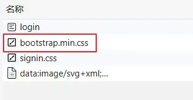

## SpringSecurity 框架简介

### 概要
- Spring 是非常流行和成功的 Java 应用开发框架，SpringSecurity 正是 Spring 家族中的成员。SpringSecurity 基于 Spring 框架，提供了一套 Web 应用安全性的完整解决方案。
- 正如你可能知道的关于安全方面的两个主要区域是“**认证**”和“**授权**”（或者访问控制），一般来说，Web 应用的安全性包括 **用户认证(Authentication)和用户授权(Authorization)** 两个部分，这两点也是 SpringSecurity 重要核心功能。
   - 用户认证指的是验证某个用户是否为系统中的合法主体，也就是说用户能否访问该系统。用户认证一般要求用户提供用户名和密码。系统通过校验用户名和密码来完成认证过程。**通俗点说就是系统认为用户是否能登录**。
   - 用户授权指的是验证某个用户是否有权限执行某个操作。在一个系统中，不同用户所具有的权限是不同的。比如对一个文件来说，有的用户只能进行读取，而有的用户可以进行修改。一般来说，系统会为不同的用户分配不同的角色，而每个角色则对应一系列的权限。**通俗点讲就是系统判断用户是否有权限去做某些事情。**

> Spring Security 是一个框架，提供针对常见攻击的身份验证，授权和保护。通过对命令式和反应式应用程序的一流支持，它是保护基于 Spring 的应用程序的事实标准。

### 同款产品对比
#### [Spring Security](https://spring.io/projects/spring-security)
Spring 技术栈的组成部分。通过提供完整可扩展的认证和授权支持保护你的应用程序。

**特点：**

1. 和 Spring 无缝整合。
2. 全面的权限控制。
3. 专门为 Web 开发而设计。
4. 旧版本不能脱离 Web 环境使用。
5. 新版本对整个框架进行了分层抽取，分成了核心模块和 Web 模块。单独引入核心模块就可以脱离 Web 环境。
6. 重量级。

#### Shiro
Apache 旗下的轻量级权限控制框架。

**特点：**

1. 轻量级。Shiro 主张的理念是把复杂的事情变简单。针对对性能有更高要求的互联网应用有更好表现。
2. 通用性。
3. 好处：不局限于 Web 环境，可以脱离 Web 环境使用。
4. 缺陷：在 Web 环境下一些特定的需求需要手动编写代码定制。

### 总结
- Spring Security 是 Spring 家族中的一个安全管理框架，实际上，在 Spring Boot 出现之前，Spring Security 就已经发展了多年了，但是使用的并不多，安全管理这个领域，一直是 Shiro 的天下。
- 相对于 Shiro，在 SSM 中整合 Spring Security 都是比较麻烦的操作，所以，Spring Security 虽然功能比 Shiro 强大，但是使用反而没有 Shiro 多（Shiro 虽然功能没有 Spring Security 多，但是对于大部分项目而言，Shiro 也够用了）。
- 自从有了 Spring Boot 之后，Spring Boot 对于 Spring Security 提供了自动化配置方案，可以使用更少的配置来使用 Spring Security。
- 因此，一般来说，常见的安全管理技术栈的组合是这样的：
   - SSM + Shiro
   - Spring Boot/Spring Cloud + Spring Security

> 以上只是一个推荐的组合而已，如果单纯从技术上来说，无论怎么组合，都是可以运行的。

### 项目模块划分
在 Spring Security 3.0 中，代码库被细分为单独的 jar，它们更清楚地区分不同的功能区域和第三方依赖项。如

1. **Core**

> `spring-security-core.jar` 包含核心身份验证和 access-contol 类和接口，远程支持和基本配置 API。任何使用 Spring Security 的应用程序都需要。支持独立应用程序，远程客户端，方法（服务层）安全性和 JDBC 用户配置。包含顶级包：`org.springframework.security.core`、`org.springframework.security.access`、`org.springframework.security.authentication`、`org.springframework.security.provisioning`。

2. **Remoting**

> `spring-security-remoting.jar`提供与 Spring Remoting 的整合。除非正在编写使用 Spring 远程处理的远程客户端，否则不需要此操作。主要包是`org.springframework.security.remoting`。

3. **Web**

> `spring-security-web.jar`包含过滤器和相关的 web - 安全基础结构代码。任何具有 servlet API 依赖性的东西。如果您需要 Spring Security web 身份验证服务和基于 URL 的访问控制，则需要它。主要包是`org.springframework.security.web`。

4. **Config**

> `spring-security-config.jar`包含安全名称空间解析代码和 Java 配置代码。如果您使用 Spring Security XML 命名空间进行配置或 Spring Security 的 Java 配置支持，则需要它。主要包是`org.springframework.security.config`。这些类都不打算直接用于应用程序。

5. **LDAP**

> `spring-security-ldap.jar`LDAP 身份验证和配置代码。如果需要使用 LDAP 身份验证或管理 LDAP 用户条目，则为必需。顶级包是`org.springframework.security.ldap`。

6. **OAuth 2.0 Core**

> `spring-security-oauth2-core.jar` 包含为 OAuth 2.0 授权框架和 OpenID Connect Core 1.0 提供支持的核心类和接口。使用 OAuth 2.0 或 OpenID Connect Core 1.0 的应用程序（例如客户端，资源服务器和授权服务器）需要它。顶级包是`org.springframework.security.oauth2.core`。

7. **OAuth 2.0 Client**

> `spring-security-oauth2-client.jar` 是 Spring Security 对 OAuth 2.0 授权框架和 OpenID Connect Core 1.0 的客户端支持。应用程序需要利用**OAuth 2.0 登录**和/或 OAuth 客户端支持。顶级包是`org.springframework.security.oauth2.client`。

8. **OAuth 2.0 JOSE**

> `spring-security-oauth2-jose.jar` 包含 Spring Security 对 JOSE（Javascript 对象签名和加密）框架的支持。JOSE 旨在提供安全地传输双方之间的权利要求的方法。它由一系列规范构建：
>
> -  JSON Web 令牌(JWT) 
> -  JSON Web 签名(JWS) 
> -  JSON Web 加密(JWE) 
> -  JSON Web 密钥(JWK) 
>
> 它包含顶级包：`org.springframework.security.oauth2.jwt`、`org.springframework.security.oauth2.jose`
>

9. **ACL**

> `spring-security-acl.jar` 专门的域对象 ACL 实现。用于将安全性应用于应用程序中的特定域对象实例。顶级包是`org.springframework.security.acls`。

10. **CAS**

> `spring-security-cas.jar` Spring Security CAS 客户端集成。如果要对 CAS 单点登录服务器使用 Spring Security web 身份验证。顶级包是`org.springframework.security.cas`。

11. **OpenID**

> `spring-security-openid.jar` OpenID web 身份验证支持。用于针对外部 OpenID 服务器对用户进行身份验证。`org.springframework.security.openid`。需要 OpenID4Java。

12. **Test**

>  `spring-security-test.jar` 支持使用 Spring Security 进行测试。

### 权限管理中的相关概念
#### 主体
英文单词：principal。**使用系统的用户或设备或从其他系统远程登录的用户等等**。简单说就是谁使用系统谁就是主体。

#### 认证
英文单词：authentication。**权限管理系统确认一个主体的身份，允许主体进入系统**。简单说就是“主体”证明自己是谁。笼统的认为就是以前所做的登录操作。

#### 授权
英文单词：authorization。**将操作系统的“权力”“授予”“主体”，这样主体就具备了操作系统中特定功能的能力**。所以简单来说，授权就是给用户分配权限。

### 获取 Spring Security
#### Spring Boot 和 Maven
```xml
<dependencies>
    <!-- ... 其他依赖元素 ... -->
    <dependency>
        <groupId>org.springframework.boot</groupId>
        <artifactId>spring-boot-starter-security</artifactId>
    </dependency>
</dependencies>
```
#### 没有使用 Spring Boot 的 Maven
```xml
<properties>
    <spring-security.version>6.2.0-SNAPSHOT</spring-security.version>
</properties>

<dependencyManagement>
    <dependencies>
        <!-- ... 其他依赖节点 ... -->
        <dependency>
            <groupId>org.springframework.security</groupId>
            <artifactId>spring-security-bom</artifactId>
            <version>{spring-security-version}</version>
            <type>pom</type>
            <scope>import</scope>
        </dependency>
    </dependencies>
</dependencyManagement>
```
### 概述

#### 基本原理

本质是一个过滤器链：
```java
org.springframework.security.web.context.request.async.WebAsyncManagerIntegrationFilter
org.springframework.security.web.context.SecurityContextPersistenceFilter
org.springframework.security.web.header.HeaderWriterFilter
org.springframework.security.web.csrf.CsrfFilter
org.springframework.security.web.authentication.logout.LogoutFilter
org.springframework.security.web.authentication.UsernamePasswordAuthenticationFilter
org.springframework.security.web.authentication.ui.DefaultLoginPageGeneratingFilter
org.springframework.security.web.authentication.ui.DefaultLogoutPageGeneratingFilter
org.springframework.security.web.savedrequest.RequestCacheAwareFilter
org.springframework.security.web.servletapi.SecurityContextHolderAwareRequestFilter
org.springframework.security.web.authentication.AnonymousAuthenticationFilter
org.springframework.security.web.session.SessionManagementFilter
org.springframework.security.web.access.ExceptionTranslationFilter
org.springframework.security.web.access.intercept.FilterSecurityInterceptor
```
主要的三个过滤器：

`FilterSecurityInterceptor`：是一个方法级的权限过滤器, 基本位于过滤链的最底部。

- `super.beforeInvocation(fi)` 表示查看之前的 filter 是否通过。
- `fi.getChain().doFilter(fi.getRequest(), fi.getResponse());`表示真正的调用后台的服务。


`ExceptionTranslationFilter`：是个异常过滤器，用来处理在认证授权过程中抛出的异常。


`UsernamePasswordAuthenticationFilter` ：对 `/login` 的 POST 请求做拦截，校验表单中用户名，密码。


#### UserDetailsService 接口

- 当什么也没有配置的时候，账号和密码是由 Spring Security 定义生成的。而在实际项目中账号和密码都是从数据库中查询出来的。 所以我们要通过自定义逻辑控制认证逻辑。
- **如果需要自定义逻辑时，只需要实现 UserDetailsService 接口即可**。接口定义如下：


返回值 UserDetails。这个类是系统默认的用户“主体”，我们只需要使用 User 这个实体类即可！

```java
// 表示获取登录用户所有权限
Collection<? extends GrantedAuthority> getAuthorities();

// 表示获取密码
String getPassword();

// 表示获取用户名
String getUsername();

// 表示判断账户是否过期
boolean isAccountNonExpired();

// 表示判断账户是否被锁定
boolean isAccountNonLocked();

// 表示凭证{密码}是否过期
boolean isCredentialsNonExpired();

// 表示当前用户是否可用
boolean isEnabled();
```


方法参数 username：表示用户名。此值是客户端表单传递过来的数据。默认情况下必须叫 username，否则无法接收。但可以在配置类中通过以下方法修改：


#### PasswordEncoder 接口
```java
// 表示把参数按照特定的解析规则进行解析
String encode(CharSequence rawPassword);

// 表示验证从存储中获取的编码密码与编码后提交的原始密码是否匹配。如果密码匹配，则返回 true；如果不匹配，则返回 false。第一个参数表示需要被解析的密码。第二个参数表示存储的密码。
boolean matches(CharSequence rawPassword, String encodedPassword);

// 表示如果解析的密码能够再次进行解析且达到更安全的结果则返回 true，否则返回false。默认返回 false。
default boolean upgradeEncoding(String encodedPassword) { return false; }
```
接口实现类：


**BCryptPasswordEncoder 是 Spring Security 官方推荐的密码解析器，平时多使用这个解析器**。BCryptPasswordEncoder 是对 bcrypt 强散列方法的具体实现。是基于 Hash 算法实现的单向加密。可以通过 strength 控制加密强度，默认 10。

```java
@Test
public void test01(){
    // 创建密码解析
    BCryptPasswordEncoder bCryptPasswordEncoder = new BCryptPasswordEncoder();
    // 对密码进行加密
    String atguigu = bCryptPasswordEncoder.encode("atguigu");
    // 打印加密之后的数据
    System.out.println("加密之后数据：\t"+atguigu);  
    //判断原字符加密后和加密之前是否匹配
    boolean result = bCryptPasswordEncoder.matches("atguigu", atguigu);
    // 打印比较结果
    System.out.println("比较结果：\t"+result);
}
```
#### 配置类实现 WebSecurityConfigurerAdapter 类

> 后续版本已经没有该配置类

```java
@Configuration
public class SecurityConfig extends WebSecurityConfigurerAdapter {

    @Override
    protected void configure(AuthenticationManagerBuilder auth) throws Exception {
       auth.userDetailsService(userDetailsService).passwordEncoder(password());
    }

    @Override
    protected void configure(HttpSecurity http) throws Exception {
//        http.formLogin()
//                .usernameParameter("loginAcct")     // 获取登录用户名
//                .passwordParameter("userpswd");     // 获取登录密码

        // 退出
        http.logout().logoutUrl("/logout").logoutSuccessUrl("/test/hello").permitAll();
        // 配置没有权限访问跳转自定义页面
        http.exceptionHandling().accessDeniedPage("/unauth.html");
        http.formLogin()   // 自定义自己编写的登录页面
                .loginPage("/login.html")   // 登录页面设置
                .loginProcessingUrl("/user/login")     // 登录访问路径
//                .defaultSuccessUrl("/test/index")   // 登录成功之后，跳转路径
                .defaultSuccessUrl("/success.html")
                .permitAll()
                .and().authorizeRequests()
                .antMatchers("/", "/test/hello", "/user/login").permitAll()    // 设置哪些路径可以直接访问，不需要认证
                // 当前登录用户，只有具有admins权限才没有访问这个路径
                // 1. hasAuthority()方法，如果当前的主体具有指定的权限，则返回 true,否则返回 false
//                .antMatchers("/test/index").hasAuthority("admins")
                // 2. hasAnyAuthority()方法，如果当前的主体有任何提供的角色的话，返回true.
                .antMatchers("/test/index")
                .hasAnyAuthority("admins", "manager")   // 需要用户待用admins或manager全写
                // 3. hasRole()方法，注意配置文件中不需要添加“ROLE_”，因为底层代码会自动添加与之进行匹配。
                .antMatchers("/test/index").hasRole("sale")
                .antMatchers("/findAll").hasRole("管理员")
                .antMatchers("/find").hasAnyAuthority("menu:system")
                .anyRequest()   // 其他请求
                .authenticated()    //需要认证
                .and().csrf().disable();    // 关闭csrf防护
        http.rememberMe().
                tokenRepository(persistentTokenRepository())
                .tokenValiditySeconds(60)   // 设置有效时长，单位秒
                .userDetailsService(userDetailsService);
    }	
}
```
#### CSRF

- 跨站请求伪造（英语：Cross-site request forgery），也被称为 one-click attack 或者 session riding，通常缩写为 CSRF 或者 XSRF， 是一种挟制用户在当前已登录的 Web 应用程序上执行非本意的操作的攻击方法。跟跨网站脚本(XSS)相比，XSS 利用的是用户对指定网站的信任，CSRF 利用的是网站对用户网页浏览器的信任。
- 跨站请求攻击，简单地说，是攻击者通过一些技术手段欺骗用户的浏览器去访问一个自己曾经认证过的网站并运行一些操作（如发邮件，发消息，甚至财产操作如转账和购买商品）。由于浏览器曾经认证过，所以被访问的网站会认为是真正的用户操作而去运行。这利用了 web 中用户身份验证的一个漏洞：简单的身份验证只能保证请求发自某个用户的浏览器，却不能保证请求本身是用户自愿发出的。
- 从 Spring Security 4.0 开始，**默认情况下会启用 CSRF 保护**，以防止 CSRF 攻击应用程序，Spring Security CSRF **会针对 PATCH，POST，PUT 和 DELETE 方法进行防护**。
#### SpringSecurity 微服务权限方案

1. 如果是基于 Session，那么 Spring security 会对 cookie 里的 sessionid 进行解析，找到服务器存储的 session 信息，然后判断当前用户是否符合请求的要求。
2. 如果是 token，则是解析出 token，然后将当前请求加入到 Spring security 管理的权限信息中去。


如果系统的模块众多，每个模块都需要进行授权与认证，所以我们选择基于 token 的形式进行授权与认证，用户根据用户名密码认证成功，然后获取当前用户角色的一系列权限值，并以用户名为 key，权限列表为 value 的形式存入 redis 缓存中，根据用户名相关信息生成 token 返回，浏览器将 token 记录到 cookie 中，每次调用 api 接口都默认将 token 携带到 header 请求头中，Spring security 解析 header 头获取 token 信息，解析 token 获取当前用户名，根据用户名就可以从 redis 中获取权限列表，这样 Spring-security 就能够判断当前请求是否有权限访问。

#### 访问令牌 JWT

### SpringSecurity 原理总结
#### SpringSecurity 的过滤器介绍

SpringSecurity 采用的是责任链的设计模式，它有一条很长的过滤器链。现在对这条过滤器链的 15 个过滤器进行说明:

1. `WebAsyncManagerIntegrationFilter`：将 Security 上下文与 Spring Web 中用于处理异步请求映射的 WebAsyncManager 进行集成。
2. `SecurityContextPersistenceFilter`：在每次请求处理之前将该请求相关的安全上下文信息加载到 SecurityContextHolder 中，然后在该次请求处理完成之后，将 SecurityContextHolder 中关于这次请求的信息存储到一个“仓储”中，然后将 SecurityContextHolder 中的信息清除，例如在 Session 中维护一个用户的安全信息就是这个过滤器处理的。
3. `HeaderWriterFilter`：用于将头信息加入响应中。
4. `CsrfFilter`：用于处理跨站请求伪造。
5. `LogoutFilter`：用于处理退出登录。
6. `UsernamePasswordAuthenticationFilter`：用于处理基于表单的登录请求，从表单中获取用户名和密码。默认情况下处理来自 `/login` 的请求。从表单中获取用户名和密码时，默认使用的表单 name 值为 `username` 和 `password`，这两个值可以通过设置这个过滤器的 `usernameParameter` 和 `passwordParameter` 两个参数的值进行修改。
7. `DefaultLoginPageGeneratingFilter`：如果没有配置登录页面，那系统初始化时就会配置这个过滤器，并且用于在需要进行登录时生成一个登录表单页面。
8. `BasicAuthenticationFilter`：检测和处理 http basic 认证。
9. `RequestCacheAwareFilter`：用来处理请求的缓存。
10. `SecurityContextHolderAwareRequestFilter`：主要是包装请求对象 request。
11. `AnonymousAuthenticationFilter`：检测 SecurityContextHolder 中是否存在 Authentication 对象，如果不存在为其提供一个匿名 Authentication。
12. `SessionManagementFilter`：管理 session 的过滤器。
13. `ExceptionTranslationFilter`：处理 AccessDeniedException 和 AuthenticationException 异常。
14. `FilterSecurityInterceptor`：可以看做过滤器链的出口。
15. `RememberMeAuthenticationFilter`：当用户没有登录而直接访问资源时, 从 cookie 里找出用户的信息, 如果 Spring Security 能够识别出用户提供的 remember me cookie, 用户将不必填写用户名和密码, 而是直接登录进入系统，该过滤器默认不开启。

#### SpringSecurity 基本流程

Spring Security 采取过滤链实现认证与授权，只有当前过滤器通过，才能进入下一个过滤器：


**绿色部分**是认证过滤器，需要我们自己配置，可以配置多个认证过滤器。认证过滤器可以使用 Spring Security 提供的认证过滤器，也可以自定义过滤器（例如：短信验证）。认证过滤器要在 configure(HttpSecurity http)方法中配置，没有配置不生效。下面会重点介绍以下三个过滤器：

`UsernamePasswordAuthenticationFilter` 过滤器：该过滤器会拦截前端提交的 POST 方式的登录表单请求，并进行身份认证。

`ExceptionTranslationFilter` 过滤器：该过滤器不需要我们配置，对于前端提交的请求会直接放行，捕获后续抛出的异常并进行处理（例如：权限访问限制）。

`FilterSecurityInterceptor` 过滤器：该过滤器是过滤器链的最后一个过滤器，根据资源权限配置来判断当前请求是否有权限访问对应的资源。如果访问受限会抛出相关异常，并由 ExceptionTranslationFilter 过滤器进行捕获和处理。

#### SpringSecurity 认证流程

认证流程是在 `UsernamePasswordAuthenticationFilter` 过滤器中处理的，具体流程如下所示：


##### UsernamePasswordAuthenticationFilter 源码

当前端提交的是一个 POST 方式的登录表单请求，就会被该过滤器拦截，并进行身份认证。该过滤器的 doFilter() 方法实现在其抽象父类`AbstractAuthenticationProcessingFilter` 中，查看相关源码：


上述的 第二 过程调用了 `UsernamePasswordAuthenticationFilter` 的 `attemptAuthentication() `方法，源码如下：


上述的(3)过程创建的 `UsernamePasswordAuthenticationToken` 是 `Authentication` 接口的实现类，该类有两个构造器，一个用于封装前端请求传入的未认证的用户信息，一个用于封装认证成功后的用户信息：


`Authentication` 接口的实现类用于存储用户认证信息，查看该接口具体定义：


##### ProviderManager 源码

上述过程中，`UsernamePasswordAuthenticationFilter` 过滤器的 `attemptAuthentication()` 方法的(5)过程将未认证的 Authentication 对象传入 ProviderManager 类的 authenticate() 方法进行身份认证。

ProviderManager 是 AuthenticationManager 接口的实现类，该接口是认证相关的核心接口，也是认证的入口。在实际开发中，我们可能有多种不同的认证方式，例如：用户名+ 密码、邮箱+密码、手机号+验证码等，而这些认证方式的入口始终只有一个，那就是 AuthenticationManager。在该接口的常用实现类 ProviderManager 内部会维护一个 `List<AuthenticationProvider>` 列表，存放多种认证方式，实际上这是委托者模式(Delegate)的应用。每种认证方式对应着一个 AuthenticationProvider， AuthenticationManager 根据认证方式的不同（根据传入的 Authentication 类型判断）委托对应的 AuthenticationProvider 进行用户认证。


上述认证成功之后的(6)过程，调用 `CredentialsContainer` 接口定义的 `eraseCredentials()` 方法去除敏感信息。查看`UsernamePasswordAuthenticationToken` 实现的 `eraseCredentials()` 方法，该方法实现在其父类中：


##### 认证成功/失败处理

上述过程就是认证流程的最核心部分，接下来重新回到 `UsernamePasswordAuthenticationFilter` 过滤器的 `doFilter()` 方法，查看认证成功/失败的处理：


查看 `successfulAuthentication()` 和 `unsuccessfulAuthentication()` 方法源码


#### SpringSecurity 权限访问流程

上一个部分通过源码的方式介绍了认证流程，下面介绍权限访问流程，主要是对 `ExceptionTranslationFilter` 过滤器和 `FilterSecurityInterceptor` 过滤器进行介绍。

##### ExceptionTranslationFilter 过滤器

该过滤器是用于处理异常的，不需要我们配置，对于前端提交的请求会直接放行，捕获后续抛出的异常并进行处理（例如：权限访问限制）。具体源码如下：


##### FilterSecurityInterceptor 过滤器

`FilterSecurityInterceptor` 是过滤器链的最后一个过滤器，该过滤器是过滤器链的最后一个过滤器，根据资源权限配置来判断当前请求是否有权限访问对应的资源。如果访问受限会抛出相关异常，最终所抛出的异常会由前一个过滤器 `ExceptionTranslationFilter` 进行捕获和处理。具体源码如下：


需要注意，Spring Security 的过滤器链是配置在 SpringMVC 的核心组件 DispatcherServlet 运行之前。也就是说，请求通过 Spring Security 的所有过滤器， 不意味着能够正常访问资源，该请求还需要通过 SpringMVC 的拦截器链。

#### SpringSecurity 请求间共享认证信息

一般认证成功后的用户信息是通过 Session 在多个请求之间共享，那么 Spring Security 中是如何实现将已认证的用户信息对象 Authentication 与 Session 绑定的进行具体分析。


- 在前面讲解认证成功的处理方法 `successfulAuthentication()` 时，有以下代码：

    

- 查看 SecurityContext 接口及其实现类 `SecurityContextImpl`， 该类其实就是对 Authentication 的封装

    

- 查看  `SecurityContextHolder` 类 ， 该类其实是对 ThreadLocal 的封装 ， 存储 SecurityContext 对象

    

    


##### SecurityContextPersistenceFilter 过滤器

前面提到过，在 `UsernamePasswordAuthenticationFilter` 过滤器认证成功之后，会在认证成功的处理方法中将已认证的用户信息对象 Authentication 封装进 SecurityContext，并存入 SecurityContextHolder。

之后，响应会通过 `SecurityContextPersistenceFilter` 过滤器，该过滤器的位置在所有过滤器的最前面，请求到来先进它，响应返回最后一个通过它，所以在该过滤器中处理已认证的用户信息对象 Authentication 与 Session 绑定。

认证成功的响应通过 `SecurityContextPersistenceFilter` 过滤器时，会从 `SecurityContextHolder` 中取出封装了已认证用户信息对象 Authentication 的 SecurityContext，放进 Session 中。当请求再次到来时，请求首先经过该过滤器，该过滤器会判断当前请求的 Session 是否存有 SecurityContext 对象，如果有则将该对象取出再次放入 `SecurityContextHolder` 中，之后该请求所在的线程获得认证用户信息，后续的资源访问不需要进行身份认证；当响应再次返回时，该过滤器同样从 `SecurityContextHolder` 取出 SecurityContext 对象，放入 Session 中。具体源码如下：


## Spring Security 快速入门

官方文档：[Spring Security :: Spring Security](https://docs.spring.io/spring-security/reference/index.html)

**功能：**

- 身份认证(authentication)
    - 身份认证是验证`谁正在访问系统资源`，判断用户是否为合法用户。认证用户的常见方式是要求用户输入用户名和密码。

- 授权(authorization)
    - 用户进行身份认证后，系统会控制`谁能访问哪些资源`，这个过程叫做授权。用户无法访问没有权限的资源。

- 防御常见攻击(protection against common attacks)
    - CSRF
    - HTTP Headers
    - HTTP Requests


### 身份认证(authentication)

**官方代码示例：**[GitHub - spring-projects/spring-security-samples](https://github.com/spring-projects/spring-security-samples/tree/main)

##### 创建 Spring Boot 项目

项目名：[security-demo](https://gitee.com/ismutou/workspace_atguigu_idea/tree/master/springsecurity-study/springsecutity-new/security-demo)

- JDK：17
- SpringBoot：3.2.0（依赖了 Spring Security 6.2.0）
- Dependencies：Spring Web、Spring Security、Thymeleaf

##### 创建 IndexController

```java
@Controller
public class IndexController {

    @GetMapping("/")
    public String index() {
        return "index";
    }
}
```

##### 创建 index.html

在路径 `resources/templates` 中创建 `index.html`

```html
<html xmlns:th="https://www.thymeleaf.org">
<head>
    <title>Hello Security!</title>
</head>
<body>
<h1>Hello Security</h1>
<!--通过使用@{/logout}，Thymeleaf将自动处理生成正确的URL，以适应当前的上下文路径。
这样，无论应用程序部署在哪个上下文路径下，生成的URL都能正确地指向注销功能。-->
<a th:href="@{/logout}">Log Out 1</a>
<!--如果设置server.servlet.context-path=/demo，此时该url就不能正确指向注销功能-->
<a href="/logout">Log Out 2</a>
</body>
</html>
```

##### 启动项目测试 Controller

浏览器中访问：`http://localhost:8080/`

**浏览器自动跳转到登录页面**：`http://localhost:8080/login`


1. 输入用户名：user
2. 输入密码：在控制台的启动日志中查找初始的默认密码
3. 点击"Sign in"进行登录，浏览器就跳转到了 index 页面

##### 注意事项

###### `@{/logout}` 的作用

通过使用 `@{/logout}`，Thymeleaf 将自动处理生成正确的 URL，以适应当前的上下文路径。这样，无论应用程序部署在哪个上下文路径下，生成的 URL 都能正确地指向注销功能。

例如：如果我们在配置文件中添加如下内容

```yaml
server.servlet.context-path=/demo
```

那么 `@{/logout}` 可以自动处理 url 为正确的相对路径，但是如果是普通的 `/logout`，路径就会不正确

###### 页面样式无法加载的问题

页面样式 `bootstrap.min.css` 是一个 CDN 地址，需要通过科学上网的方式访问



否则你的登录页会加载很久，并且看到的页面是这样的（登录按钮没有样式文件渲染，但是不影响登录功能的执行）


##### Spring Security 默认做了什么

- 保护应用程序 URL，要求对应用程序的任何交互进行身份验证。
- 程序启动时生成一个默认用户“user”。
- 生成一个默认的随机密码，并将此密码记录在控制台上。
- 生成默认的登录表单和注销页面。
- 提供基于表单的登录和注销流程。
- 对于 Web 请求，重定向到登录页面；
- 对于服务请求，返回 401 未经授权。
- 处理跨站请求伪造(CSRF)攻击。
- 处理会话劫持攻击。
- 写入 `Strict-Transport-Security` 以确保 HTTPS。
- 写入 `X-Content-Type-Options` 以处理嗅探攻击。
- 写入 `Cache Control`头来保护经过身份验证的资源。
- 写入 `X-Frame-Options` 以处理点击劫持攻击。

### Spring Security 的底层原理

**官方文档：**[Spring Security 的底层原理](https://docs.spring.io/spring-security/reference/servlet/architecture.html)

**中文文档：**[Spring Security 的底层原理](https://springdoc.cn/spring-security/servlet/architecture.html)

Spring Security 之所以默认帮助我们做了那么多事情，它的底层原理是传统的`Servlet过滤器`

### 程序的启动和运行

#### DefaultSecurityFilterChain

SecurityFilterChain 接口的实现，加载了默认的 16 个 Filter（根据版本不同可能有所不同）


#### SecuritProperties

默认情况下 Spring Security 将初始的用户名和密码存在了 SecurityProperties 类中。这个类中有一个静态内部类 User，配置了默认的用户名（`name = "user"`）和密码（`password = uuid`）


我们也可以将用户名、密码配置在 SpringBoot 的配置文件中：在 `application.properties` 中配置自定义用户名和密码

```properties
spring.security.user.name=admin
spring.security.user.password=111111
```

## Spring Security 自定义配置

**官方文档：**[Java Configuration](https://docs.spring.io/spring-security/reference/servlet/configuration/java.html)

**中文文档：**[Java 配置](https://springdoc.cn/spring-security/servlet/configuration/java.html)

### 基于内存的用户认证

#### 创建自定义配置

实际开发的过程中，我们需要应用程序更加灵活，可以在 SpringSecurity 中创建自定义配置文件

**UserDetailsService** 用来管理用户信息，**InMemoryUserDetailsManager** 是 UserDetailsService 的一个实现，用来管理基于内存的用户信息。

创建一个 WebSecurityConfig 文件，定义一个 Bean，类型是 UserDetailsService，实现是 InMemoryUserDetailsManager

```java
package com.atguigu.securitydemo.config;

@Configuration
//@EnableWebSecurity // Spring 项目总需要添加此注解(在 SpringBoot 项目中可以省略此注解）
public class WebSecurityConfig {

    @Bean
    public UserDetailsService userDetailsService() {
        // 创建基于内存的用户信息管理器
        InMemoryUserDetailsManager manager = new InMemoryUserDetailsManager();
        // 使用 manager 管理 UserDetailsService 对象
        manager.createUser(
                // 创建 UserDetailsService 对象，用于管理用户名、密码、角色、权限等内润
                User.withDefaultPasswordEncoder().username("user").password("111111").roles("USER").build()
        );
        return manager;
    }
}
```

**测试**：使用用户名 user，密码 111111 登录

#### 基于内存的用户认证流程

- 程序启动时：
    - 创建`InMemoryUserDetailsManager`对象
    - 创建 `User` 对象，封装用户名密码
    - 使用 `InMemoryUserDetailsManager` 将 `User` 存入`内存`
- 校验用户时：
    - SpringSecurity 自动使用 `InMemoryUserDetailsManager` 的`loadUserByUsername`方法从`内存中`获取 User 对象
    - 在 `UsernamePasswordAuthenticationFilter` 过滤器中的 `attemptAuthentication` 方法中将用户输入的用户名密码和从内存中获取到的用户信息进行比较，进行用户认证

### 基于数据库的数据源

#### SQL

创建数据库表 user 并插入三个测试数据

```sql
-- 创建数据库
CREATE DATABASE `spring_security`;
USE `spring_security`;

-- 创建用户表
CREATE TABLE `user`(
	`id` INT NOT NULL AUTO_INCREMENT PRIMARY KEY,
	`username` VARCHAR(50) DEFAULT NULL ,
	`password` VARCHAR(500) DEFAULT NULL,
	`enabled` BOOLEAN NOT NULL
);
-- 唯一索引
CREATE UNIQUE INDEX `user_username_uindex` ON `user`(`username`); 

-- 插入用户数据(密码是 "password" )
INSERT INTO `user` (`username`, `password`, `enabled`) VALUES
('admin', '{bcrypt}$2a$10$GRLdNijSQMUvl/au9ofL.eDwmoohzzS7.rmNSJZ.0FxO/BTk76klW', TRUE),
('Helen', '{bcrypt}$2a$10$GRLdNijSQMUvl/au9ofL.eDwmoohzzS7.rmNSJZ.0FxO/BTk76klW', TRUE),
('Tom', '{bcrypt}$2a$10$GRLdNijSQMUvl/au9ofL.eDwmoohzzS7.rmNSJZ.0FxO/BTk76klW', TRUE);
```

#### 引入依赖

```xml
<dependency>
    <groupId>mysql</groupId>
    <artifactId>mysql-connector-java</artifactId>
    <version>8.0.30</version>
</dependency>


<dependency>
    <groupId>com.baomidou</groupId>
    <artifactId>mybatis-plus-boot-starter</artifactId>
    <version>3.5.4.1</version>
    <exclusions>
        <exclusion>
            <groupId>org.mybatis</groupId>
            <artifactId>mybatis-spring</artifactId>
        </exclusion>
    </exclusions>
</dependency>

<dependency>
    <groupId>org.mybatis</groupId>
    <artifactId>mybatis-spring</artifactId>
    <version>3.0.3</version>
</dependency>

<dependency>
    <groupId>org.projectlombok</groupId>
    <artifactId>lombok</artifactId>
</dependency>
```

#### 配置数据源

```properties
#MySQL数据源
spring.datasource.driver-class-name=com.mysql.cj.jdbc.Driver
spring.datasource.url=jdbc:mysql://localhost:3306/spring_security
spring.datasource.username=root
spring.datasource.password=123456
#SQL日志
mybatis-plus.configuration.log-impl=org.apache.ibatis.logging.stdout.StdOutImpl
```

#### 实体类

```java
package com.atguigu.securitydemo.entity;

@Data
public class User {
    @TableId(value = "id", type = IdType.AUTO)
    private Integer id;
    private String username;
    private String password;
    private Boolean enabled;
}
```

#### Mapper

- 接口

```java
package com.atguigu.securitydemo.mapper;

@Mapper
public interface UserMapper extends BaseMapper<User> {}
```

- xml

`resources/mapper/UserMapper.xml`

```xml
<?xml version="1.0" encoding="UTF-8"?>
<!DOCTYPE mapper PUBLIC "-//mybatis.org//DTD Mapper 3.0//EN" "http://mybatis.org/dtd/mybatis-3-mapper.dtd">
<mapper namespace="com.atguigu.securitydemo.mapper.UserMapper">
</mapper>
```

#### Service

- 接口

```java
package com.atguigu.securitydemo.service;
public interface UserService extends IService<User> {}
```

- 实现

```java
package com.atguigu.securitydemo.service.impl;
@Service
public class UserServiceImpl extends ServiceImpl<UserMapper, User> implements UserService {}
```

#### Controller

```java
package com.atguigu.securitydemo.controller;
@RestController
@RequestMapping("/user")
public class UserController {

    @Resource
    public UserService userService;

    @GetMapping("/list")
    public List<User> getList(){
        return userService.list();
    }
}
```

**测试：**`http://localhost:8080/demo/user/list`

### 基于数据库的用户认证

#### 基于数据库的用户认证流程

- 程序启动时：
    - 创建 `DBUserDetailsManager` 类，实现接口 `UserDetailsManager, UserDetailsPasswordService`
    - 在应用程序中初始化这个类的对象
- 校验用户时：
    - SpringSecurity 自动使用 `DBUserDetailsManager` 的 `loadUserByUsername` 方法从`数据库中`获取 User 对象
    - 在 `UsernamePasswordAuthenticationFilter` 过滤器中的 `attemptAuthentication` 方法中将用户输入的用户名密码和从数据库中获取到的用户信息进行比较，进行用户认证

#### 定义 DBUserDetailsManager

```java
package com.atguigu.securitydemo.config;

public class DBUserDetailsManager implements UserDetailsManager, UserDetailsPasswordService {
        
    @Resource
    private UserMapper userMapper;
    
    /**
     * 从数据库中获取用户信息
     * @param username the username identifying the user whose data is required.
     * @return
     * @throws UsernameNotFoundException
     */
    @Override
    public UserDetails loadUserByUsername(String username) throws UsernameNotFoundException {
        QueryWrapper<User> queryWrapper = new QueryWrapper<>();
        queryWrapper.eq("username", username);
        User user = userMapper.selectOne(queryWrapper);
        if (user == null) {
            throw new UsernameNotFoundException(username);
        }
        Collection<? extends GrantedAuthority> authorities = new ArrayList<>();
        return new org.springframework.security.core.userdetails.User(
                user.getUsername(),
                user.getPassword(),
                user.getEnabled(),
                true, // 用户账号是否过期
                true, // 用户凭证是否过期
                true, // 用户是否被锁定
                authorities // 权限列表
        );
    }

    @Override
    public UserDetails updatePassword(UserDetails user, String newPassword) { return null; }

    @Override
    public void createUser(UserDetails user) {}

    @Override
    public void updateUser(UserDetails user) {}

    @Override
    public void deleteUser(String username) {}

    @Override
    public void changePassword(String oldPassword, String newPassword) {}

    @Override
    public boolean userExists(String username) { return false; }
}
```

#### 初始化 UserDetailsService

修改 WebSecurityConfig 中的 userDetailsService 方法如下

```java
@Bean
public UserDetailsService userDetailsService() {
    DBUserDetailsManager manager = new DBUserDetailsManager();
    return manager;
}
```

**或者直接在 DBUserDetailsManager 类上添加 `@Component` 注解**

**测试**：使用数据库中配置的用户名和密码进行登录(password:password)

### SpringSecurity 的默认配置

在 WebSecurityConfig 中添加如下配置

```java
@Bean
public SecurityFilterChain filterChain(HttpSecurity http) throws Exception {
    //authorizeRequests()：开启授权保护
    //anyRequest()：对所有请求开启授权保护
    //authenticated()：已认证请求会自动被授权
    http
        .authorizeRequests(authorize -> authorize.anyRequest().authenticated())
        .formLogin(withDefaults())//表单授权方式
        .httpBasic(withDefaults());//基本授权方式

    return http.build();
}
```

### 添加用户功能

#### Controller

UserController 中添加方法

```java
@PostMapping("/add")
public void add(@RequestBody User user){
    userService.saveUserDetails(user);
}
```

#### Sevice

UserService 接口中添加方法

```java
void saveUserDetails(User user);
```

UserServiceImpl 实现中添加方法

```java
@Service
public class UserServiceImpl extends ServiceImpl<UserMapper, User> implements UserService {
    @Resource
    private DBUserDetailsManager dbUserDetailsManager;

    @Override
    public void saveUserDetails(User user) {
        UserDetails userDetails = org.springframework.security.core.userdetails.User
                .withDefaultPasswordEncoder()
                .username(user.getUsername()).password(user.getPassword()).build();
        dbUserDetailsManager.createUser(userDetails);
    }
}
```

#### 修改配置

DBUserDetailsManager 中添加方法

```java
@Override
public void createUser(UserDetails userDetails) {
    User user = new User();
    user.setUsername(userDetails.getUsername());
    user.setPassword(userDetails.getPassword());
    user.setEnabled(true);
    userMapper.insert(user);
}
```

#### 使用 Swagger 测试

pom 中添加配置用于测试

```xml
<!--swagger测试-->
<dependency>
    <groupId>com.github.xiaoymin</groupId>
    <artifactId>knife4j-openapi3-jakarta-spring-boot-starter</artifactId>
    <version>4.1.0</version>
</dependency>
```

**Swagger 测试地址**：`http://localhost:8080/demo/doc.html`


#### 关闭 csrf 攻击防御

默认情况下 SpringSecurity 开启了 csrf 攻击防御的功能，这要求请求参数中必须有一个隐藏的 **_csrf** 字段，如下：


在 filterChain 方法中添加如下代码，关闭 csrf 攻击防御

```java
//关闭csrf攻击防御
http.csrf((csrf) -> {
    csrf.disable();
});
```

### 密码加密算法

**参考文档：**[Password Storage :: Spring Security](https://docs.spring.io/spring-security/reference/features/authentication/password-storage.html)

[密码存储 :: Spring Security Reference (springdoc.cn)](https://springdoc.cn/spring-security/features/authentication/password-storage.html)

#### 密码加密方式

1. **明文密码**

    最初，密码以明文形式存储在数据库中。但是恶意用户可能会通过 SQL 注入等手段获取到明文密码，或者程序员将数据库数据泄露的情况也可能发生。

2. **Hash 算法**

    Spring Security 的 `PasswordEncoder` 接口用于对密码进行`单向转换`，从而将密码安全地存储。对密码单向转换需要用到`哈希算法`，例如 MD5、SHA-256、SHA-512 等，哈希算法是单向的，`只能加密，不能解密`。

    因此，`数据库中存储的是单向转换后的密码`，Spring Security 在进行用户身份验证时需要将用户输入的密码进行单向转换，然后与数据库的密码进行比较。

    因此，如果发生数据泄露，只有密码的单向哈希会被暴露。由于哈希是单向的，并且在给定哈希的情况下只能通过`暴力破解的方式猜测密码`。

3. **彩虹表**

    恶意用户创建称为`彩虹表`的查找表。彩虹表就是一个庞大的、针对各种可能的字母组合预先生成的哈希值集合，有了它可以快速破解各类密码。越是复杂的密码，需要的彩虹表就越大，主流的彩虹表都是 100G 以上，目前主要的算法有 LM, NTLM, MD5, SHA1, MYSQLSHA1, HALFLMCHALL, NTLMCHALL, ORACLE-SYSTEM, MD5-HALF。

4. **加盐密码**

    为了减轻彩虹表的效果，开发人员开始使用加盐密码。不再只使用密码作为哈希函数的输入，而是为每个用户的密码生成随机字节（称为盐）。盐和用户的密码将一起经过哈希函数运算，生成一个唯一的哈希。盐将以明文形式与用户的密码一起存储。然后，当用户尝试进行身份验证时，盐和用户输入的密码一起经过哈希函数运算，再与存储的密码进行比较。唯一的盐意味着彩虹表不再有效，因为对于每个盐和密码的组合，哈希都是不同的。

5. **自适应单向函数**

    随着硬件的不断发展，加盐哈希也不再安全。原因是，计算机可以每秒执行数十亿次哈希计算。这意味着我们可以轻松地破解每个密码。

    现在，开发人员开始使用自适应单向函数来存储密码。使用自适应单向函数验证密码时，`故意占用资源（故意使用大量的CPU、内存或其他资源）`。自适应单向函数允许配置一个`“工作因子”`，随着硬件的改进而增加。我们建议将“工作因子”调整到系统中验证密码需要约一秒钟的时间。这种权衡是为了`让攻击者难以破解密码`。

    自适应单向函数包括 `bcrypt、PBKDF2、scrypt和argon2`。

#### PasswordEncoder

1. **BCryptPasswordEncoder**

    使用广泛支持的 bcrypt 算法来对密码进行哈希。为了增加对密码破解的抵抗力，bcrypt 故意设计得较慢。和其他自适应单向函数一样，应该调整其参数，使其在您的系统上验证一个密码大约需要 1 秒的时间。BCryptPasswordEncoder 的默认实现使用强度 10。建议您在自己的系统上调整和测试强度参数，以便验证密码时大约需要 1 秒的时间。

2. **Argon2PasswordEncoder**

    使用 Argon2 算法对密码进行哈希处理。Argon2 是密码哈希比赛的获胜者。为了防止在自定义硬件上进行密码破解，Argon2 是一种故意缓慢的算法，需要大量内存。与其他自适应单向函数一样，它应该在您的系统上调整为大约 1 秒来验证一个密码。当前的 Argon2PasswordEncoder 实现需要使用 BouncyCastle 库。

3. **Pbkdf2PasswordEncoder**

    使用 PBKDF2 算法对密码进行哈希处理。为了防止密码破解，PBKDF2 是一种故意缓慢的算法。与其他自适应单向函数一样，它应该在您的系统上调整为大约 1 秒来验证一个密码。当需要 FIPS 认证时，这种算法是一个很好的选择。


4. **SCryptPasswordEncoder** 

    使用 scrypt 算法对密码进行哈希处理。为了防止在自定义硬件上进行密码破解，scrypt 是一种故意缓慢的算法，需要大量内存。与其他自适应单向函数一样，它应该在您的系统上调整为大约 1 秒来验证一个密码。

#### 密码加密测试

在测试类中编写一个测试方法

```java
@Test
void testPassword() {
    // 工作因子，默认值是10，最小值是4，最大值是31，值越大运算速度越慢
    PasswordEncoder encoder = new BCryptPasswordEncoder(4);
    //明文："password"
    //密文：result，即使明文密码相同，每次生成的密文也不一致
    String result = encoder.encode("password");
    System.out.println(result);

    //密码校验
    Assert.isTrue(encoder.matches("password", result), "密码不一致");
}
```

#### DelegatingPasswordEncoder

- 表中存储的密码形式：`{bcrypt}$2a$10$GRLdNijSQMUvl/au9ofL.eDwmoohzzS7.rmNSJZ.0FxO/BTk76klW`
- 通过如下源码可以知道：可以通过`{bcrypt}`前缀动态获取和密码的形式类型一致的 PasswordEncoder 对象
- 目的：方便随时做密码策略的升级，兼容数据库中的老版本密码策略生成的密码


### 自定义登录页面

#### 创建登录 Controller

```java
package com.atguigu.securitydemo.controller;

@Controller
public class LoginController {
    @GetMapping("/login")
    public String login() {
        return "login";
    }
}
```

#### 创建登录页面

`resources/templates/login.html`

```html
<!DOCTYPE html>
<html xmlns:th="https://www.thymeleaf.org">
<head>
    <title>登录</title>
</head>
<body>
<h1>登录</h1>
<div th:if="${param.error}">
    错误的用户名和密码.</div>

<!--method必须为"post"-->
<!--th:action="@{/login}" ，
使用动态参数，表单中会自动生成_csrf隐藏字段，用于防止csrf攻击
login: 和登录页面保持一致即可，SpringSecurity自动进行登录认证-->
<form th:action="@{/login}" method="post">
    <div>
        <!--name必须为"username"-->
        <input type="text" name="username" placeholder="用户名"/>
    </div>
    <div>
        <!--name必须为"password"-->
        <input type="password" name="password" placeholder="密码"/>
    </div>
    <input type="submit" value="登录" />
</form>
</body>
</html>
```

#### 配置 SecurityFilterChain

SecurityConfiguration：

```java
@Bean
public SecurityFilterChain filterChain(HttpSecurity http) throws Exception {
    // 开启授权保护
    http.authorizeRequests(authorize -> authorize
                           // 对所有请求开启授权保护
                           .anyRequest()
                           // 已认证的请求会被自动授权
                           .authenticated()
                          )
        .formLogin(form -> {
            form.loginPage("/login").permitAll()// 无需授权即可访问当前页面
                .usernameParameter("myusername") //自定义表单用户名参数，默认是username
                .passwordParameter("mypassword") //自定义表单用户名参数，默认是username
                .failureUrl("/login?error") //登录失败的返回地址
                ;
        });  // 使用表单授权方式
    //                .httpBasic(withDefaults()); // 使用基本授权方式
    // 关闭 csrf 攻击防御
    http.csrf(csrf -> csrf.disable());
    return http.build();
}
```

## 前后端分离

### 用户认证流程

- 登录成功后调用：AuthenticationSuccessHandler
- 登录失败后调用：AuthenticationFailureHandler


### 引入 fastjson

```xml
<dependency>
    <groupId>com.alibaba.fastjson2</groupId>
    <artifactId>fastjson2</artifactId>
    <version>2.0.37</version>
</dependency>
```

### 认证成功的响应

#### 成功结果处理

```java
package com.atguigu.securitydemo.config;

public class MyAuthenticationSuccessHandler implements AuthenticationSuccessHandler {
    @Override
    public void onAuthenticationSuccess(HttpServletRequest request, HttpServletResponse response, Authentication authentication) throws IOException, ServletException {

        //获取用户身份信息
        Object principal = authentication.getPrincipal();

        //创建结果对象
        HashMap result = new HashMap();
        result.put("code", 0);
        result.put("message", "登录成功");
        result.put("data", principal);

        //转换成json字符串
        String json = JSON.toJSONString(result);

        //返回响应
        response.setContentType("application/json;charset=UTF-8");
        response.getWriter().println(json);
    }
}
```

#### SecurityFilterChain 配置

```java
http.formLogin(form -> {
    form.loginPage("/login").permitAll()// 无需授权即可访问当前页面
        .successHandler(new MyAuthenticationSuccessHandler()); // 认证成功时的处理  
});
```

### 认证失败响应

#### 失败结果处理

```java
package com.atguigu.securitydemo.config;

public class MyAuthenticationFailureHandler implements AuthenticationFailureHandler {

    @Override
    public void onAuthenticationFailure(HttpServletRequest request, HttpServletResponse response, AuthenticationException exception) throws IOException, ServletException {
        //获取错误信息
        String localizedMessage = exception.getLocalizedMessage();

        //创建结果对象
        HashMap result = new HashMap();
        result.put("code", -1);
        result.put("message", localizedMessage);

        //转换成json字符串
        String json = JSON.toJSONString(result);

        //返回响应
        response.setContentType("application/json;charset=UTF-8");
        response.getWriter().println(json);
    }
}
```

#### SecurityFilterChain 配置

```java
http.formLogin(form -> {
    form.loginPage("/login").permitAll()// 无需授权即可访问当前页面理
        .failureHandler(new MyAuthenticationFailureHandler()); // 认证失败时的处理
});
```

### 注销响应

#### 注销结果处理

```java
package com.atguigu.securitydemo.config;

public class MyLogoutSuccessHandler implements LogoutSuccessHandler {

    @Override
    public void onLogoutSuccess(HttpServletRequest request, HttpServletResponse response, Authentication authentication) throws IOException, ServletException {

        //创建结果对象
        HashMap result = new HashMap();
        result.put("code", 0);
        result.put("message", "注销成功");

        //转换成json字符串
        String json = JSON.toJSONString(result);

        //返回响应
        response.setContentType("application/json;charset=UTF-8");
        response.getWriter().println(json);
    }
}
```

#### SecurityFilterChain 配置

```java
@Bean
public SecurityFilterChain filterChain(HttpSecurity http) throws Exception {
    // 开启授权保护
    http.authorizeRequests(authorize -> authorize
                           // 对所有请求开启授权保护
                           .anyRequest()
                           // 已认证的请求会被自动授权
                           .authenticated()
                          );
    http.formLogin(form -> {
        form.loginPage("/login").permitAll()// 无需授权即可访问当前页面
            .usernameParameter("myusername") //自定义表单用户名参数，默认是username
            .passwordParameter("mypassword") //自定义表单用户名参数，默认是username
            .failureUrl("/login?error") //登录失败的返回地址
            .successHandler(new MyAuthenticationSuccessHandler()) // 认证成功时的处理
            .failureHandler(new MyAuthenticationFailureHandler()) // 认证失败时的处理
            ;
    });  // 使用表单授权方式
    //                .httpBasic(withDefaults()); // 使用基本授权方式

    http.logout(logout -> {
        logout.logoutSuccessHandler(new MyLogoutSuccessHandler()); // 注销成功时的处理
    });

    // 关闭 csrf 攻击防御
    http.csrf(csrf -> csrf.disable());
    return http.build();
}
```

### 请求未认证的接口

#### 实现 AuthenticationEntryPoint 接口

[Servlet Authentication Architecture :: Spring Security](https://docs.spring.io/spring-security/reference/servlet/authentication/architecture.html)

[Servlet 认证架构 :: Spring Security Reference (springdoc.cn)](https://springdoc.cn/spring-security/servlet/authentication/architecture.html)

当访问一个需要认证之后才能访问的接口的时候，Spring Security 会使用 `AuthenticationEntryPoint` 将用户请求跳转到登录页面，要求用户提供登录凭证。

这里我们也希望系统`返回json结果`，因此我们定义类`实现AuthenticationEntryPoint接口`

```java
package com.atguigu.securitydemo.config;

public class MyAuthenticationEntryPoint implements AuthenticationEntryPoint {
    @Override
    public void commence(HttpServletRequest request, HttpServletResponse response, AuthenticationException authException) throws IOException, ServletException {

        //获取错误信息
        //String localizedMessage = authException.getLocalizedMessage();

        //创建结果对象
        HashMap result = new HashMap();
        result.put("code", -1);
        result.put("message", "需要登录");

        //转换成json字符串
        String json = JSON.toJSONString(result);

        //返回响应
        response.setContentType("application/json;charset=UTF-8");
        response.getWriter().println(json);
    }
}
```

#### SecurityFilterChain 配置

```java
//错误处理
http.exceptionHandling(exception  -> {
    exception.authenticationEntryPoint(new MyAuthenticationEntryPoint());//请求未认证的接口
});
```

### 跨域

跨域全称是跨域资源共享(Cross-Origin Resources Sharing,CORS)，它是浏览器的保护机制，只允许网页请求统一域名下的服务，同一域名指=>协议、域名、端口号都要保持一致，如果有一项不同，那么就是跨域请求。在前后端分离的项目中，需要解决跨域的问题。


在 SpringSecurity 中解决跨域很简单，在配置文件中添加如下配置即可

```java
// 跨域
http.cors(withDefaults());
```

## 身份认证

### 用户认证信息

#### 基本概念


在 Spring Security 框架中，SecurityContextHolder、SecurityContext、Authentication、Principal 和 Credential 是一些与身份验证和授权相关的重要概念。它们之间的关系如下：

1. SecurityContextHolder：SecurityContextHolder 是 Spring Security 存储已认证用户详细信息的地方。
2. SecurityContext：SecurityContext 是从 SecurityContextHolder 获取的内容，包含当前已认证用户的 Authentication 信息。
3. Authentication：Authentication 表示用户的身份认证信息。它包含了用户的 Principal、Credential 和 Authority 信息。
4. Principal：表示用户的身份标识。它通常是一个表示用户的实体对象，例如用户名。Principal 可以通过 Authentication 对象的 `getPrincipal()` 方法获取。
5. Credentials：表示用户的凭证信息，例如密码、证书或其他认证凭据。Credential 可以通过 Authentication 对象的 `getCredentials()` 方法获取。
6. GrantedAuthority：表示用户被授予的权限

总结起来，SecurityContextHolder 用于管理当前线程的安全上下文，存储已认证用户的详细信息，其中包含了 SecurityContext 对象，该对象包含了 Authentication 对象，后者表示用户的身份验证信息，包括 Principal（用户的身份标识）和 Credential（用户的凭证信息）。

#### 在 Controller 中获取用户信息

IndexController：

```java
package com.atguigu.securitydemo.controller;

@RestController
public class IndexController {

    @GetMapping("/")
    public Map index(){
        System.out.println("index controller");
        SecurityContext context = SecurityContextHolder.getContext();//存储认证对象的上下文
        Authentication authentication = context.getAuthentication();//认证对象
        String username = authentication.getName();//用户名
        Object principal =authentication.getPrincipal();//身份
        Object credentials = authentication.getCredentials();//凭证(脱敏)
        Collection<? extends GrantedAuthority> authorities = authentication.getAuthorities();//权限

        System.out.println(username);
        System.out.println(principal);
        System.out.println(credentials);
        System.out.println(authorities);

        //创建结果对象
        HashMap result = new HashMap();
        result.put("code", 0);
        result.put("data", username);
        return result;
    }
}
```

### 会话并发处理

后登录的账号会使先登录的账号失效

#### 实现处理器接口

实现接口 SessionInformationExpiredStrategy

```java
package com.atguigu.securitydemo.config;

public class MySessionInformationExpiredStrategy implements SessionInformationExpiredStrategy {
    @Override
    public void onExpiredSessionDetected(SessionInformationExpiredEvent event) throws IOException, ServletException {
        //创建结果对象
        HashMap result = new HashMap();
        result.put("code", -1);
        result.put("message", "该账号已从其他设备登录");

        //转换成json字符串
        String json = JSON.toJSONString(result);

        HttpServletResponse response = event.getResponse();
        //返回响应
        response.setContentType("application/json;charset=UTF-8");
        response.getWriter().println(json);
    }
}
```

#### SecurityFilterChain 配置

```java
// 会话管理
http.sessionManagement(session -> {
    session
        .maximumSessions(1)
        .expiredSessionStrategy(new MySessionInformationExpiredStrategy());
});
```

## 授权

授权管理的实现在 SpringSecurity 中非常灵活，可以帮助应用程序实现以下两种常见的授权需求：

- 用户-权限-资源：例如张三的权限是添加用户、查看用户列表，李四的权限是查看用户列表

- 用户-角色-权限-资源：例如张三是角色是管理员、李四的角色是普通用户，管理员能做所有操作，普通用户只能查看信息


### 基于 request 的授权

#### 用户-权限-资源

**需求：**

- 具有 `USER_LIST` 权限的用户可以访问 `/user/list` 接口
- 具有 `USER_ADD` 权限的用户可以访问 `/user/add` 接口

##### 配置权限

SecurityFilterChain

```java
//开启授权保护
http.authorizeRequests(
        authorize -> authorize
    			//具有USER_LIST权限的用户可以访问/user/list
                .requestMatchers("/user/list").hasAuthority("USER_LIST")
    			//具有USER_ADD权限的用户可以访问/user/add
    			.requestMatchers("/user/add").hasAuthority("USER_ADD")
                //对所有请求开启授权保护
                .anyRequest()
                //已认证的请求会被自动授权
                .authenticated()
        );
```

##### 授予权限

DBUserDetailsManager 中的 loadUserByUsername 方法：

```java
Collection<GrantedAuthority> authorities = new ArrayList<>();
authorities.add(()->"USER_LIST");
authorities.add(()->"USER_ADD");
```

##### 请求未授权的接口

SecurityFilterChain

```java
//错误处理
http.exceptionHandling(exception  -> {
    exception.authenticationEntryPoint(new MyAuthenticationEntryPoint());//请求未认证的接口
    exception.accessDeniedHandler((request, response, e)->{ //请求未授权的接口

        //创建结果对象
        HashMap result = new HashMap();
        result.put("code", -1);
        result.put("message", "没有权限");

        //转换成json字符串
        String json = JSON.toJSONString(result);

        //返回响应
        response.setContentType("application/json;charset=UTF-8");
        response.getWriter().println(json);
    });
});
```

**更多的例子：**

- [Authorize HttpServletRequests :: Spring Security](https://docs.spring.io/spring-security/reference/servlet/authorization/authorize-http-requests.html)

- [授权 HttpServletRequest :: Spring Security Reference (springdoc.cn)](https://springdoc.cn/spring-security/servlet/authorization/authorize-http-requests.html)

#### 用户-角色-资源

**需求**：角色为 `ADMIN` 的用户才可以访问 `/user/**` 路径下的资源

##### 配置角色

SecurityFilterChain

```java
//开启授权保护
http.authorizeRequests(
        authorize -> authorize
                //具有管理员角色的用户可以访问/user/**
                .requestMatchers("/user/**").hasRole("ADMIN")
                //对所有请求开启授权保护
                .anyRequest()
                //已认证的请求会被自动授权
                .authenticated()
);
```

##### 授予角色

DBUserDetailsManager 中的 loadUserByUsername 方法：

```java
return org.springframework.security.core.userdetails.User
        .withUsername(user.getUsername())
        .password(user.getPassword())
        .roles("ADMIN")
        .build();
```

#### 用户-角色-权限-资源

RBAC（Role-Based Access Control，基于角色的访问控制）是一种常用的数据库设计方案，它将用户的权限分配和管理与角色相关联。以下是一个基本的 RBAC 数据库设计方案的示例：

1. 用户表(User table)：包含用户的基本信息，例如用户名、密码和其他身份验证信息。

| 列名     | 数据类型 | 描述         |
| -------- | -------- | ------------ |
| user_id  | int      | 用户 ID       |
| username | varchar  | 用户名       |
| password | varchar  | 密码         |
| email    | varchar  | 电子邮件地址 |
| ...      | ...      | ...          |

2. 角色表(Role table)：存储所有可能的角色及其描述。

| 列名        | 数据类型 | 描述     |
| ----------- | -------- | -------- |
| role_id     | int      | 角色 ID   |
| role_name   | varchar  | 角色名称 |
| description | varchar  | 角色描述 |
| ...         | ...      | ...      |

3. 权限表(Permission table)：定义系统中所有可能的权限。

| 列名            | 数据类型 | 描述     |
| --------------- | -------- | -------- |
| permission_id   | int      | 权限 ID   |
| permission_name | varchar  | 权限名称 |
| description     | varchar  | 权限描述 |
| ...             | ...      | ...      |

4. 用户角色关联表(User-Role table)：将用户与角色关联起来。

| 列名         | 数据类型 | 描述           |
| ------------ | -------- | -------------- |
| user_role_id | int      | 用户角色关联 ID |
| user_id      | int      | 用户 ID         |
| role_id      | int      | 角色 ID         |
| ...          | ...      | ...            |

5. 角色权限关联表(Role-Permission table)：将角色与权限关联起来。

| 列名               | 数据类型 | 描述           |
| ------------------ | -------- | -------------- |
| role_permission_id | int      | 角色权限关联 ID |
| role_id            | int      | 角色 ID         |
| permission_id      | int      | 权限 ID         |
| ...                | ...      | ...            |

在这个设计方案中，用户可以被分配一个或多个角色，而每个角色又可以具有一个或多个权限。通过对用户角色关联和角色权限关联表进行操作，可以实现灵活的权限管理和访问控制。

当用户尝试访问系统资源时，系统可以根据用户的角色和权限决定是否允许访问。这样的设计方案使得权限管理更加简单和可维护，因为只需调整角色和权限的分配即可，而不需要针对每个用户进行单独的设置。

### 基于方法的授权

#### 开启方法授权

在配置文件中添加如下注解

```java
@EnableMethodSecurity
```

#### 给用户授予角色和权限

DBUserDetailsManager 中的 loadUserByUsername 方法：

```java
return org.springframework.security.core.userdetails.User
        .withUsername(user.getUsername())
        .password(user.getPassword())
        .roles("ADMIN")
        .authorities("USER_ADD", "USER_UPDATE")
        .build();
```

#### 常用授权注解

```java
// 用户必须有 ADMIN 角色 并且 用户名是 admin 才能访问此方法
@PreAuthorize("hasRole('ADMIN') and authentication.name == 'admim'")
@GetMapping("/list")
public List<User> getList(){
    return userService.list();
}

// 用户必须有 USER_ADD 权限 才能访问此方法
@PreAuthorize("hasAuthority('USER_ADD')")
@PostMapping("/add")
public void add(@RequestBody User user){
    userService.saveUserDetails(user);
}
```

**更多的例子：**

- [Method Security :: Spring Security](https://docs.spring.io/spring-security/reference/servlet/authorization/method-security.html)

- [方法安全(Method Security) :: Spring Security Reference (springdoc.cn)](https://springdoc.cn/spring-security/servlet/authorization/method-security.html)

## OAuth2

### OAuth2 简介

#### OAuth2 是什么

- “Auth” 表示 “授权” Authorization
-  “O” 是 Open 的简称，表示 “开放”
- 连在一起就表示 **“开放授权”**，OAuth2 是一种开放授权协议。
- **OAuth2 最简向导：**
    - [The Simplest Guide To OAuth 2.0](https://darutk.medium.com/the-simplest-guide-to-oauth-2-0-8c71bd9a15bb)
    - [ppt/OAuth2.0 最简向导.pdf · 极客时间/oauth2lab - Gitee.com](https://gitee.com/geektime-geekbang/oauth2lab/blob/master/ppt/OAuth2.0最简向导.pdf)

#### OAuth2 的角色

OAuth 2 协议包含以下角色：

- 资源所有者(Resource Owner)：即用户，资源的拥有人，想要通过客户应用访问资源服务器上的资源。
- 客户应用(Client)：通常是一个 Web 或者无线应用，它需要访问用户的受保护资源。
- 资源服务器(Resource Server)：存储受保护资源的服务器或定义了可以访问到资源的 API，接收并验证客户端的访问令牌，以决定是否授权访问资源。
- 授权服务器(Authorization Server)：负责验证资源所有者的身份并向客户端颁发访问令牌。


#### OAuth2 的使用场景

##### 开放系统间授权

###### 社交登录

在传统的身份验证中，用户需要提供用户名和密码，还有很多网站登录时，允许使用第三方网站的身份，这称为"第三方登录"。所谓第三方登录，实质就是 OAuth 授权。用户想要登录 A 网站，A 网站让用户提供第三方网站的数据，证明自己的身份。获取第三方网站的身份数据，就需要 OAuth 授权。


###### 开放 API

例如云冲印服务的实现


##### 现代微服务安全

###### 单块应用安全


###### 微服务安全


##### 企业内部应用认证授权

- SSO：Single Sign On 单点登录

- IAM：Identity and Access Management 身份识别与访问管理

#### OAuth2 的四种授权模式

RFC6749：

[RFC 6749 - The OAuth 2.0 Authorization Framework (ietf.org)](https://datatracker.ietf.org/doc/html/rfc6749)

阮一峰：

[OAuth 2.0 的四种方式 - 阮一峰的网络日志 (ruanyifeng.com)](https://www.ruanyifeng.com/blog/2019/04/oauth-grant-types.html)

四种模式：

- 授权码(authorization-code)
- 隐藏式(implicit)
- 密码式(password)
- 客户端凭证(client credentials)

##### 第一种方式：授权码

**授权码(authorization code)，指的是第三方应用先申请一个授权码，然后再用该码获取令牌。**

这种方式是最常用，最复杂，也是最安全的，它适用于那些有后端的 Web 应用。授权码通过前端传送，令牌则是储存在后端，而且所有与资源服务器的通信都在后端完成。这样的前后端分离，可以避免令牌泄漏。


- 注册客户应用：客户应用如果想要访问资源服务器需要有凭证，需要在授权服务器上注册客户应用。注册后会**获取到一个 ClientID 和 ClientSecrets**


##### 第二种方式：隐藏式

**隐藏式(implicit)，也叫简化模式，有些 Web 应用是纯前端应用，没有后端。这时就不能用上面的方式了，必须将令牌储存在前端。**

RFC 6749 规定了这种方式，允许直接向前端颁发令牌。这种方式没有授权码这个中间步骤，所以称为隐藏式。这种方式把令牌直接传给前端，是很不安全的。因此，只能用于一些安全要求不高的场景，并且令牌的有效期必须非常短，通常就是会话期间(session)有效，浏览器关掉，令牌就失效了。


```
https://a.com/callback#token=ACCESS_TOKEN
将访问令牌包含在URL锚点中的好处：锚点在HTTP请求中不会发送到服务器，减少了泄漏令牌的风险。
```

##### 第三种方式：密码式

**密码式(Resource Owner Password Credentials)：如果你高度信任某个应用，RFC 6749 也允许用户把用户名和密码，直接告诉该应用。该应用就使用你的密码，申请令牌。**

这种方式需要用户给出自己的用户名/密码，显然风险很大，因此只适用于其他授权方式都无法采用的情况，而且必须是用户高度信任的应用。


##### 第四种方式：凭证式

**凭证式(client credentials)：也叫客户端模式，适用于没有前端的命令行应用，即在命令行下请求令牌。**

这种方式给出的令牌，是针对第三方应用的，而不是针对用户的，即有可能多个用户共享同一个令牌。


#### 授权类型的选择


### Spring 中的 OAuth2

#### 相关角色

**回顾**：OAuth 2 中的角色

1. 资源所有者(Resource Owner)
2. 客户应用(Client)
3. 资源服务器(Resource Server)
4. 授权服务器(Authorization Server)

#### Spring 中的实现

[OAuth2 :: Spring Security](https://docs.spring.io/spring-security/reference/servlet/oauth2/index.html)

[OAuth2 :: Spring Security Reference (springdoc.cn)](https://springdoc.cn/spring-security/servlet/oauth2/index.html)

**Spring Security**

- 客户应用(OAuth2 Client)：OAuth2 客户端功能中包含 OAuth2 Login
- 资源服务器(OAuth2 Resource Server)

**Spring**

- 授权服务器(Spring Authorization Server)：它是在 Spring Security 之上的一个单独的项目。

#### 相关依赖

```xml
<!-- 资源服务器 -->
<dependency>
	<groupId>org.springframework.boot</groupId>
	<artifactId>spring-boot-starter-oauth2-resource-server</artifactId>
</dependency>

<!-- 客户应用 -->
<dependency>
	<groupId>org.springframework.boot</groupId>
	<artifactId>spring-boot-starter-oauth2-client</artifactId>
</dependency>

<!-- 授权服务器 -->
<dependency>
    <groupId>org.springframework.boot</groupId>
    <artifactId>spring-boot-starter-oauth2-authorization-server</artifactId>
</dependency>
```

#### 授权登录的实现思路

使用 OAuth2 Login


### GiuHub 社交登录案例

#### 创建应用

**注册客户应用：**

登录 GitHub，在开发者设置中找到 OAuth Apps，创建一个 application，为客户应用创建访问 GitHub 的凭据：


填写应用信息：`默认的重定向URI模板为{baseUrl}/login/oauth2/code/{registrationId}`。registrationId 是 ClientRegistration 的唯一标识符。


获取应用程序 id，生成应用程序密钥：


#### 创建测试项目

创建一个 springboot 项目 `oauth2-login-demo`，创建时引入如下依赖


示例代码参考：[spring-security-samples/servlet/spring-boot/java/oauth2/login at 6.2.x · spring-projects/spring-security-samples (github.com)](https://github.com/spring-projects/spring-security-samples/tree/6.2.x/servlet/spring-boot/java/oauth2/login)

#### 配置 OAuth 客户端属性

application.yml：

```properties
spring:
  security:
    oauth2:
      client:
        registration:
          github:
            client-id: 7807cc3bb1534abce9f2
            client-secret: 008dc141879134433f4db7f62b693c4a5361771b
#            redirectUri: http://localhost:8200/login/oauth2/code/github
```

#### 创建 Controller

```java
package com.atguigu.oauthdemo.controller;

@Controller
public class IndexController {

    @GetMapping("/")
    public String index(
            Model model,
            @RegisteredOAuth2AuthorizedClient OAuth2AuthorizedClient authorizedClient,
            @AuthenticationPrincipal OAuth2User oauth2User) {
        model.addAttribute("userName", oauth2User.getName());
        model.addAttribute("clientName", authorizedClient.getClientRegistration().getClientName());
        model.addAttribute("userAttributes", oauth2User.getAttributes());
        return "index";
    }
}
```

#### 创建 html 页面

`resources/templates/index.html`

```html
<!DOCTYPE html>
<html xmlns="http://www.w3.org/1999/xhtml" xmlns:th="https://www.thymeleaf.org" xmlns:sec="https://www.thymeleaf.org/thymeleaf-extras-springsecurity5">
<head>
    <title>Spring Security - OAuth 2.0 Login</title>
    <meta charset="utf-8" />
</head>
<body>
<div style="float: right" th:fragment="logout" sec:authorize="isAuthenticated()">
    <div style="float:left">
        <span style="font-weight:bold">User: </span><span sec:authentication="name"></span>
    </div>
    <div style="float:none">&nbsp;</div>
    <div style="float:right">
        <form action="#" th:action="@{/logout}" method="post">
            <input type="submit" value="Logout" />
        </form>
    </div>
</div>
<h1>OAuth 2.0 Login with Spring Security</h1>
<div>
    You are successfully logged in <span style="font-weight:bold" th:text="${userName}"></span>
    via the OAuth 2.0 Client <span style="font-weight:bold" th:text="${clientName}"></span>
</div>
<div>&nbsp;</div>
<div>
    <span style="font-weight:bold">User Attributes:</span>
    <ul>
        <li th:each="userAttribute : ${userAttributes}">
            <span style="font-weight:bold" th:text="${userAttribute.key}"></span>: <span th:text="${userAttribute.value}"></span>
        </li>
    </ul>
</div>
</body>
</html>
```

#### 启动应用程序

- 启动程序并访问 localhost:8080。浏览器将被重定向到默认的自动生成的登录页面，该页面显示了一个用于 GitHub 登录的链接。
- 点击 GitHub 链接，浏览器将被重定向到 GitHub 进行身份验证。
- 使用 GitHub 账户凭据进行身份验证后，用户会看到授权页面，询问用户是否允许或拒绝客户应用访问 GitHub 上的用户数据。点击允许以授权 OAuth 客户端访问用户的基本个人资料信息。
- 此时，OAuth 客户端访问 GitHub 的获取用户信息的接口获取基本个人资料信息，并建立一个已认证的会话。

### 案例分析

#### 登录流程

1. **A 网站让用户跳转到 GitHub，并携带参数 ClientID 以及 Redirection URI。**
2. GitHub 要求用户登录，然后询问用户"A 网站要求获取用户信息的权限，你是否同意？"
3. 用户同意，GitHub 就会重定向回 A 网站，同时发回一个授权码。
4. **A 网站使用授权码，向 GitHub 请求令牌。**
5. GitHub 返回令牌.
6. **A 网站使用令牌，向 GitHub 请求用户数据。**
7. GitHub 返回用户数据
8. **A 网站使用 GitHub 用户数据登录**


#### CommonOAuth2Provider

CommonOAuth2Provider 是一个预定义的通用 OAuth2Provider，为一些知名资源服务 API 提供商（如 Google、GitHub、Facebook）预定义了一组默认的属性。

例如，**授权 URI、令牌 URI 和用户信息 URI** 通常不经常变化。因此，提供默认值以减少所需的配置。

因此，当我们配置 GitHub 客户端时，只需要提供 client-id 和 client-secret 属性。

```java
GITHUB {
    public ClientRegistration.Builder getBuilder(String registrationId) {
        ClientRegistration.Builder builder = this.getBuilder(
        registrationId, 
        ClientAuthenticationMethod.CLIENT_SECRET_BASIC, 
        
        //授权回调地址(GitHub向客户应用发送回调请求，并携带授权码)   
		"{baseUrl}/{action}/oauth2/code/{registrationId}");
        builder.scope(new String[]{"read:user"});
        //授权页面
        builder.authorizationUri("https://github.com/login/oauth/authorize");
        //客户应用使用授权码，向 GitHub 请求令牌
        builder.tokenUri("https://github.com/login/oauth/access_token");
        //客户应用使用令牌向GitHub请求用户数据
        builder.userInfoUri("https://api.github.com/user");
        //username属性显示GitHub中获取的哪个属性的信息
        builder.userNameAttributeName("id");
        //登录页面超链接的文本
        builder.clientName("GitHub");
        return builder;
    }
},
```

## 案例实战

### 开发环境

- JDK：jdk8
- springboot：2.6.13
- spring security：5.6.8

### 认证

#### 思路分析

##### 登录

1. 自定义登录接口
    - 调用 `ProviderManager` 的方法进行认证 如果认证通过生成 jwt
    - 把用户信息存入 redis 中

> `SpringSecurity` 在默认的认证过程中如果账号密码校验成功会返回 Authentication 对象，之后 `UsernamePasswordAuthenticationFilter `会将用户信息 `Authentication` 存入 `SecurityContextHolder` 中
>
> 但是我们在实际运用场景中认证通过后还需要向前端返回一个 JSON 格式的数据里面包括了 JWT
>
> 所以此时我们需要写一个自定义登录接口

2. 自定义 UserDetailsService 接口
    - 在这个实现类中去查询数据库

##### 校验

1. 定义 Jwt 认证过滤器
    - 获取 token
    - 解析 token 获取其中的 userid
    - 从 redis 中获取用户信息
    - 存入 SecurityContextHolder

> `SpringSecurity` 默认是在内存中查找对应的用户名密码然后封装成 `UserDetail`对象交给 `DaoAuthenticationProcider`校验
>
> 但是我们在实际运用场景中是从数据库中查找用户信息	
>
> 所以此时我们需要写一个 `UserDetailsService` 的实现类用来在数据库中查询用户信息并且封装到 `UserDetail`对象中

#### 准备工作

##### 添加依赖

```xml
<dependencies>
    <!-- Spring Boot 安全功能的starter包，用于web应用的安全控制 -->
    <dependency>
        <groupId>org.springframework.boot</groupId>
        <artifactId>spring-boot-starter-security</artifactId>
    </dependency>
    <!-- Spring Boot Web功能的starter包，提供web应用的基本功能 -->
    <dependency>
        <groupId>org.springframework.boot</groupId>
        <artifactId>spring-boot-starter-web</artifactId>
    </dependency>
    <!-- Spring Boot的测试starter包，用于单元测试和集成测试 -->
    <dependency>
        <groupId>org.springframework.boot</groupId>
        <artifactId>spring-boot-starter-test</artifactId>
        <scope>test</scope>
    </dependency>
    <!-- Spring Security的测试包，用于安全测试 -->
    <dependency>
        <groupId>org.springframework.security</groupId>
        <artifactId>spring-security-test</artifactId>
        <scope>test</scope>
    </dependency>
    <!-- Lombok，提供简单的代码生成工具，减少样板代码，设置为可选依赖 -->
    <dependency>
        <groupId>org.projectlombok</groupId>
        <artifactId>lombok</artifactId>
        <optional>true</optional>
    </dependency>
    <!-- Redis的starter包，用于集成Redis作为缓存或持久化方案 -->
    <dependency>
        <groupId>org.springframework.boot</groupId>
        <artifactId>spring-boot-starter-data-redis</artifactId>
    </dependency>
    <!-- FastJSON，一个Java语言编写的高性能功能完备的JSON库 -->
    <dependency>
        <groupId>com.alibaba</groupId>
        <artifactId>fastjson</artifactId>
        <version>1.2.33</version>
    </dependency>
    <!-- JWT（JSON Web Token）的库，用于生成和解析JWT -->
    <dependency>
        <groupId>io.jsonwebtoken</groupId>
        <artifactId>jjwt</artifactId>
        <version>0.9.0</version>
    </dependency>
    <!-- MyBatis Plus，用于简化MyBatis的使用 -->
    <dependency>
        <groupId>com.baomidou</groupId>
        <artifactId>mybatis-plus-boot-starter</artifactId>
        <version>3.4.3</version>
    </dependency>
    <!-- MySQL连接器，用于连接和操作MySQL数据库 -->
    <dependency>
        <groupId>mysql</groupId>
        <artifactId>mysql-connector-java</artifactId>
        <version>8.0.29</version>
    </dependency>
</dependencies>
```

##### 添加 Redis 相关配置

###### FastJsonRedisSerializer

```java
package com.sangeng.sangengtokendemo.utils;

public class FastJsonRedisSerializer<T> implements RedisSerializer<T> {
    public static final Charset DEFAULT_CHARSET = Charset.forName("UTF-8");
    private Class<T> clazz;

    static {
        ParserConfig.getGlobalInstance().setAutoTypeSupport(true);
    }

    public FastJsonRedisSerializer(Class<T> clazz) {
        super();
        this.clazz = clazz;
    }

    @Override
    public byte[] serialize(T t) throws SerializationException {
        if (t == null) {
            return new byte[0];
        }
        return JSON.toJSONString(t, SerializerFeature.WriteClassName).getBytes(DEFAULT_CHARSET);
    }

    @Override
    public T deserialize(byte[] bytes) throws SerializationException {
        if (bytes == null || bytes.length <= 0) {
            return null;
        }
        String str = new String(bytes, DEFAULT_CHARSET);
        return JSON.parseObject(str, clazz);
    }

    protected JavaType getJavaType(Class<?> clazz) {
        return TypeFactory.defaultInstance().constructType(clazz);
    }
}
```

###### RedisConfig

```java
package com.sangeng.sangengtokendemo.config;

@Configuration
public class RedisConfig {
    @Bean
    @SuppressWarnings(value = {"unchecked", "rawtypes"})
    public RedisTemplate<Object, Object> redisTemplate(RedisConnectionFactory connectionFactory) {
        RedisTemplate<Object, Object> template = new RedisTemplate<>();
        template.setConnectionFactory(connectionFactory);
        FastJsonRedisSerializer serializer = new FastJsonRedisSerializer(Object.class);
        // 使用StringRedisSerializer来序列化和反序列化redis的key值
        template.setKeySerializer(new StringRedisSerializer());
        template.setValueSerializer(serializer);
        // Hash的key也采用StringRedisSerializer的序列化方式
        template.setHashKeySerializer(new StringRedisSerializer());
        template.setHashValueSerializer(serializer);
        template.afterPropertiesSet();
        return template;
    }
}
```

##### 响应类 ResponseResult

```java
package com.sangeng.sangengtokendemo.domain;

@JsonInclude(JsonInclude.Include.NON_NULL)
public class ResponseResult<T> {
    /**
     * 状态码
     */
    private Integer code;
    /**
     * 提示信息，如果有错误时，前端可以获取该字段进行提示
     */
    private String msg;
    /**
     * 查询到的结果数据，
     */
    private T data;

    public ResponseResult(Integer code, String msg) {
        this.code = code;
        this.msg = msg;
    }

    public ResponseResult(Integer code, T data) {
        this.code = code;
        this.data = data;
    }

    public Integer getCode() {
        return code;
    }

    public void setCode(Integer code) {
        this.code = code;
    }

    public String getMsg() {
        return msg;
    }

    public void setMsg(String msg) {
        this.msg = msg;
    }

    public T getData() {
        return data;
    }

    public void setData(T data) {
        this.data = data;
    }

    public ResponseResult(Integer code, String msg, T data) {
        this.code = code;
        this.msg = msg;
        this.data = data;
    }
}
```

##### 工具类

###### JWT 工具类

```java
package com.sangeng.sangengtokendemo.utils;

/**
 * JWT工具类
 */
public class JwtUtil {
    //有效期为
    public static final Long JWT_TTL = 60 * 60 * 1000L;// 60 * 60 *1000 一个小时
    //设置秘钥明文
    public static final String JWT_KEY = "sangeng";

    public static String getUUID() {
        String token = UUID.randomUUID().toString().replaceAll("-", "");
        return token;
    }

    /**
     * 生成jwt
     *
     * @param subject token中要存放的数据（json格式）
     * @return
     */
    public static String createJWT(String subject) {
        JwtBuilder builder = getJwtBuilder(subject, null, getUUID());// 设置过期时间
        return builder.compact();
    }

    /**
     * 生成jtw
     *
     * @param subject   token中要存放的数据（json格式）
     * @param ttlMillis token超时时间
     * @return
     */
    public static String createJWT(String subject, Long ttlMillis) {
        JwtBuilder builder = getJwtBuilder(subject, ttlMillis, getUUID());// 设置过期时间
        return builder.compact();
    }

    private static JwtBuilder getJwtBuilder(String subject, Long ttlMillis, String uuid) {
        SignatureAlgorithm signatureAlgorithm = SignatureAlgorithm.HS256;
        SecretKey secretKey = generalKey();
        long nowMillis = System.currentTimeMillis();
        Date now = new Date(nowMillis);
        if (ttlMillis == null) {
            ttlMillis = JwtUtil.JWT_TTL;
        }
        long expMillis = nowMillis + ttlMillis;
        Date expDate = new Date(expMillis);
        return Jwts.builder().setId(uuid) //唯一的ID
                .setSubject(subject) // 主题 可以是JSON数据
                .setIssuer("sg") // 签发者
                .setIssuedAt(now) // 签发时间
                .signWith(signatureAlgorithm, secretKey) //使用HS256对称加密算法签名, 第二个参数为秘钥
                .setExpiration(expDate);
    }

    /**
     * 创建token
     *
     * @param id
     * @param subject
     * @param ttlMillis
     * @return
     */
    public static String createJWT(String id, String subject, Long ttlMillis) {
        JwtBuilder builder = getJwtBuilder(subject, ttlMillis, id);// 设置过期时间
        return builder.compact();
    }

    public static void main(String[] args) throws Exception {
        String token = createJWT("1234");
        System.out.println(token);
        Claims claims = parseJWT(token);
        System.out.println(claims);
    }

    /**
     * 生成加密后的秘钥 secretKey
     *
     * @return
     */
    public static SecretKey generalKey() {
        byte[] encodedKey = Base64.getDecoder().decode(JwtUtil.JWT_KEY);
        SecretKey key = new SecretKeySpec(encodedKey, 0, encodedKey.length, "AES");
        return key;
    }

    /**
     * 解析
     *
     * @param jwt
     * @return
     * @throws Exception
     */
    public static Claims parseJWT(String jwt) throws Exception {
        SecretKey secretKey = generalKey();
        return Jwts.parser().setSigningKey(secretKey).parseClaimsJws(jwt).getBody();
    }
}
```

###### Redis 缓存

```java
package com.sangeng.sangengtokendemo.utils;

@SuppressWarnings(value = {"unchecked", "rawtypes"})
@Component
public class RedisCache {
    @Autowired
    public RedisTemplate redisTemplate;

    /**
     * 缓存基本的对象，Integer、String、实体类等
     *
     * @param key   缓存的键值
     * @param value 缓存的值
     */
    public <T> void setCacheObject(final String key, final T value) {
        redisTemplate.opsForValue().set(key, value);
    }

    /**
     * 缓存基本的对象，Integer、String、实体类等
     *
     * @param key      缓存的键值
     * @param value    缓存的值
     * @param timeout  时间
     * @param timeUnit 时间颗粒度
     */
    public <T> void setCacheObject(final String key, final T value, final Integer timeout, final TimeUnit timeUnit) {
        redisTemplate.opsForValue().set(key, value, timeout, timeUnit);
    }

    /**
     * 设置有效时间
     *
     * @param key     Redis键
     * @param timeout 超时时间
     * @return true=设置成功；false=设置失败
     */
    public boolean expire(final String key, final long timeout) {
        return expire(key, timeout, TimeUnit.SECONDS);
    }

    /**
     * 设置有效时间
     *
     * @param key     Redis键
     * @param timeout 超时时间
     * @param unit    时间单位
     * @return true=设置成功；false=设置失败
     */
    public boolean expire(final String key, final long timeout, final TimeUnit unit) {
        return redisTemplate.expire(key, timeout, unit);
    }

    /**
     * 获得缓存的基本对象。
     *
     * @param key 缓存键值
     * @return 缓存键值对应的数据
     */
    public <T> T getCacheObject(final String key) {
        ValueOperations<String, T> operation = redisTemplate.opsForValue();
        return operation.get(key);
    }

    /**
     * 删除单个对象
     *
     * @param key
     */
    public boolean deleteObject(final String key) {
        return redisTemplate.delete(key);
    }

    /**
     * 删除集合对象
     *
     * @param collection 多个对象
     * @return
     */
    public long deleteObject(final Collection collection) {
        return redisTemplate.delete(collection);
    }

    /**
     * 缓存List数据
     *
     * @param key      缓存的键值
     * @param dataList 待缓存的List数据
     * @return 缓存的对象
     */
    public <T> long setCacheList(final String key, final List<T> dataList) {
        Long count = redisTemplate.opsForList().rightPushAll(key, dataList);
        return count == null ? 0 : count;
    }

    /**
     * 获得缓存的list对象
     *
     * @param key 缓存的键值
     * @return 缓存键值对应的数据
     */
    public <T> List<T> getCacheList(final String key) {
        return redisTemplate.opsForList().range(key, 0, -1);
    }

    /**
     * 缓存Set
     *
     * @param key     缓存键值
     * @param dataSet 缓存的数据
     * @return 缓存数据的对象
     */
    public <T> BoundSetOperations<String, T> setCacheSet(final String key, final Set<T> dataSet) {
        BoundSetOperations<String, T> setOperation = redisTemplate.boundSetOps(key);
        Iterator<T> it = dataSet.iterator();
        while (it.hasNext()) {
            setOperation.add(it.next());
        }
        return setOperation;
    }

    /**
     * 获得缓存的set
     *
     * @param key
     * @return
     */
    public <T> Set<T> getCacheSet(final String key) {
        return redisTemplate.opsForSet().members(key);
    }

    /**
     * 缓存Map
     *
     * @param key
     * @param dataMap
     */
    public <T> void setCacheMap(final String key, final Map<String, T> dataMap) {
        if (dataMap != null) {
            redisTemplate.opsForHash().putAll(key, dataMap);
        }
    }

    /**
     * 获得缓存的Map
     *
     * @param key
     * @return
     */
    public <T> Map<String, T> getCacheMap(final String key) {
        return redisTemplate.opsForHash().entries(key);
    }

    /**
     * 往Hash中存入数据
     *
     * @param key   Redis键
     * @param hKey  Hash键
     * @param value 值
     */
    public <T> void setCacheMapValue(final String key, final String hKey, final T value) {
        redisTemplate.opsForHash().put(key, hKey, value);
    }

    /**
     * 获取Hash中的数据
     *
     * @param key  Redis键
     * @param hKey Hash键
     * @return Hash中的对象
     */
    public <T> T getCacheMapValue(final String key, final String hKey) {
        HashOperations<String, String, T> opsForHash = redisTemplate.opsForHash();
        return opsForHash.get(key, hKey);
    }

    /**
     * 删除Hash中的数据
     *
     * @param key
     * @param hkey
     */
    public void delCacheMapValue(final String key, final String hkey) {
        HashOperations hashOperations = redisTemplate.opsForHash();
        hashOperations.delete(key, hkey);
    }

    /**
     * 获取多个Hash中的数据
     *
     * @param key   Redis键
     * @param hKeys Hash键集合
     * @return Hash对象集合
     */
    public <T> List<T> getMultiCacheMapValue(final String key, final Collection<Object> hKeys) {
        return redisTemplate.opsForHash().multiGet(key, hKeys);
    }

    /**
     * 获得缓存的基本对象列表
     *
     * @param pattern 字符串前缀
     * @return 对象列表
     */
    public Collection<String> keys(final String pattern) {

        return redisTemplate.keys(pattern);
    }
}
```

###### 将字符串渲染到客户端

```java
package com.sangeng.sangengtokendemo.utils;

public class WebUtils {
    /**
     * 将字符串渲染到客户端
     *
     * @param response 渲染对象
     * @param string   待渲染的字符串
     * @return null
     */
    public static String renderString(HttpServletResponse response, String string) {
        try {
            response.setStatus(200);
            response.setContentType("application/json");
            response.setCharacterEncoding("utf-8");
            response.getWriter().print(string);
        } catch (IOException e) {
            e.printStackTrace();
        }
        return null;
    }
}
```

##### 实体类

###### User

```java
package com.sangeng.sangengtokendemo.domain;

/**
 * 用户表
 *
 * @TableName sys_user
 */
@TableName("sys_user")
@Data
@AllArgsConstructor
@NoArgsConstructor
public class User implements Serializable {

    private static final long serialVersionUID = 1L;

    /**
     * 主键
     */
    @TableId(value = "id", type = IdType.AUTO)
    private Long id;

    /**
     * 用户名
     */
    private String userName;

    /**
     * 昵称
     */
    private String nickName;

    /**
     * 密码
     */
    private String password;

    /**
     * 用户类型：0代表普通用户，1代表管理员
     */
    private String type;

    /**
     * 账号状态（0正常 1停用）
     */
    private String status;

    /**
     * 邮箱
     */
    private String email;

    /**
     * 手机号
     */
    private String phonenumber;

    /**
     * 用户性别（0男，1女，2未知）
     */
    private String sex;

    /**
     * 头像
     */
    private String avatar;

    /**
     * 创建人的用户id
     */
    private Long createBy;

    /**
     * 创建时间
     */
    private LocalDateTime createTime;

    /**
     * 更新人
     */
    private Long updateBy;

    /**
     * 更新时间
     */
    private LocalDateTime updateTime;

    /**
     * 删除标志（0代表未删除，1代表已删除）
     */
    private Integer delFlag;

}
```

###### Menu

```java
package com.sangeng.sangengtokendemo.domain;

/**
 * 菜单表（Menu）实体类
 */
@Data
@EqualsAndHashCode(callSuper = false)
@Accessors(chain = true)
@TableName("sys_menu")
public class Menu implements Serializable {

    private static final long serialVersionUID = 1L;

    /**
     * 菜单ID
     */
    @TableId(value = "id", type = IdType.AUTO)
    private Long id;

    /**
     * 菜单名称
     */
    private String menuName;

    /**
     * 父菜单ID
     */
    private Long parentId;

    /**
     * 显示顺序
     */
    private Integer orderNum;

    /**
     * 路由地址
     */
    private String path;

    /**
     * 组件路径
     */
    private String component;

    /**
     * 是否为外链（0是 1否）
     */
    private Integer isFrame;

    /**
     * 菜单类型（M目录 C菜单 F按钮）
     */
    private String menuType;

    /**
     * 菜单状态（0显示 1隐藏）
     */
    private String visible;

    /**
     * 菜单状态（0正常 1停用）
     */
    private String status;

    /**
     * 权限标识
     */
    private String perms;

    /**
     * 菜单图标
     */
    private String icon;

    /**
     * 创建者
     */
    private Long createBy;

    /**
     * 创建时间
     */
    private LocalDateTime createTime;

    /**
     * 更新者
     */
    private Long updateBy;

    /**
     * 更新时间
     */
    private LocalDateTime updateTime;

    /**
     * 备注
     */
    private String remark;

    private String delFlag;
}
```

#### 数据库校验用户

从之前的分析我们可以知道，我们可以自定义一个 UserDetailsService,让 SpringSecurity 使用我们的 UserDetailsService。我们自己的 UserDetailsService 可以从数据库中查询用户名和密码。

##### 准备工作

1. 数据库表, 建表语句如下

    ```mysql
    CREATE TABLE `sys_user` (
    	`id` BIGINT NOT NULL AUTO_INCREMENT COMMENT '主键',
    	`user_name` VARCHAR ( 64 ) NOT NULL DEFAULT 'NULL' COMMENT '用户名',
    	`nick_name` VARCHAR ( 64 ) NOT NULL DEFAULT 'NULL' COMMENT '昵称',
    	`password` VARCHAR ( 64 ) NOT NULL DEFAULT 'NULL' COMMENT '密码',
    	`type` CHAR ( 1 ) DEFAULT '0' COMMENT '用户类型：0代表普通用户，1代表管理员',
    	`status` CHAR ( 1 ) DEFAULT '0' COMMENT '账号状态（0正常 1停用）',
    	`email` VARCHAR ( 64 ) DEFAULT NULL COMMENT '邮箱',
    	`phonenumber` VARCHAR ( 32 ) DEFAULT NULL COMMENT '手机号',
    	`sex` CHAR ( 1 ) DEFAULT NULL COMMENT '用户性别（0男，1女，2未知）',
    	`avatar` VARCHAR ( 128 ) DEFAULT NULL COMMENT '头像',
    	`create_by` BIGINT DEFAULT NULL COMMENT '创建人的用户id',
    	`create_time` datetime DEFAULT NULL COMMENT '创建时间',
    	`update_by` BIGINT DEFAULT NULL COMMENT '更新人',
    	`update_time` datetime DEFAULT NULL COMMENT '更新时间',
    	`del_flag` INT DEFAULT '0' COMMENT '删除标志（0代表未删除，1代表已删除）',
    PRIMARY KEY ( `id` ) 
    ) ENGINE = INNODB AUTO_INCREMENT = 1 DEFAULT CHARSET = utf8mb4 COLLATE = utf8mb4_0900_ai_ci COMMENT = '用户表';
    
    INSERT INTO `sys_user` (`user_name`, `nick_name`, `password`) VALUES ('admin', 'admin', '$2a$10$PQKLmyDowFuRIYCEPZ6cguT2vS3CrPsVtrNWq4t83osKcKyi0HLJa');
    INSERT INTO `sys_user` (`user_name`, `nick_name`, `password`) VALUES ('test', 'test', '$2a$10$PQKLmyDowFuRIYCEPZ6cguT2vS3CrPsVtrNWq4t83osKcKyi0HLJa');
    ```
    
2. 引入 MybatisPuls 和 mysql 驱动的依赖

3. 配置数据库信息（顺带配置好 redis）

    ```yml
    spring:
      application:
        name: TokenApplication
      datasource:
        driver-class-name: com.mysql.cj.jdbc.Driver
        url: jdbc:mysql://localhost:3306/spring_security?useUnicode=true&characterEncoding=utf-8&useSSL=false&serverTimezone=GMT%2B8
        username: root
        password: 123456
      redis:
        host: 192.168.239.200
        port: 6379
        database: 0
        timeout: 1800000
        password: 111111
    ```

4. 定义 Mapper 接口

    ```java
    package com.sangeng.sangengtokendemo.mapper;
    public interface UserMapper extends BaseMapper<User> {}
    ```

5. 配置 Mapper 扫描

    ```java
    package com.sangeng.sangengtokendemo;
    
    @SpringBootApplication
    @MapperScan("com.sangeng.sangengtokendemo.mapper")// 扫描mapper
    public class TokenApplication {
        public static void main(String[] args) { SpringApplication.run(TokenApplication.class, args); }
    }
    ```

6. 测试 MP 是否能正常使用

    ```java
    package com.sangeng.sangengtokendemo;
    
    @SpringBootTest
    class MapperTest {
        @Resource
        private UserMapper userMapper;
    
        @Test
        public void testUserMapper() {
            List<User> users = userMapper.selectList(null);
            users.forEach(System.out::println);
        }
    }
    ```

##### 核心代码实现

1. 创建 UserDetailsService 实现类 

    ```java
    package com.sangeng.sangengtokendemo.service.impl;
    
    @Service
    public class UserDetailsServiceImpl implements UserDetailsService {
        @Resource
        private UserMapper userMapper;
    
        @Override
        public UserDetails loadUserByUsername(String username) throws UsernameNotFoundException {
            // 查询用户信息
            LambdaQueryWrapper<User> queryWrapper = new LambdaQueryWrapper<>();
            queryWrapper.eq(User::getUserName, username);
            User user = userMapper.selectOne(queryWrapper);
            // 如果没有查到用户就抛出异常
            if (Objects.isNull(user)) {
                throw new RuntimeException("用户名或者密码错误");
            }
            // TODO 查询对应的权限信息
    
            // 把数据封装成 UserDetails 返回
            return new LoginUser(user);
        }
    }
    ```

2. 创建 UserDetail 实现类

    ```java
    package com.sangeng.sangengtokendemo.domain;
    
    @Data
    @AllArgsConstructor
    @NoArgsConstructor
    public class LoginUser implements UserDetails {
        // 封装用户信息
        private User user;
    
        // 获取权限
        @Override
        public Collection<? extends GrantedAuthority> getAuthorities() {
            return Collections.emptyList();
        }
    
        // 获取密码
        @Override
        public String getPassword() {
            return user.getPassword();
        }
    
        // 获取用户名
        @Override
        public String getUsername() {
            return getUsername();
        }
    
        // 账户是否未过期
        @Override
        public boolean isAccountNonExpired() {
            return true;
        }
    
        // 账户是否未锁定
        @Override
        public boolean isAccountNonLocked() {
            return true;
        }
    
        // 密码是否未过期
        @Override
        public boolean isCredentialsNonExpired() {
            return true;
        }
    
        // 账户是否可用
        @Override
        public boolean isEnabled() {
            return true;
        }
    }
    ```

**注意**：如果要测试，需要往用户表中写入用户数据，并且如果你想让用户的密码是明文存储，需要在密码前加 `{noop}`。例如: `{noop}111111`，这样就可以使用 `111111` 作为密码登录了。

#### 密码加密存储

- 实际项目中我们不会把密码明文存储在数据库中。
- 默认使用的 PasswordEncoder 要求数据库中的密码格式为：`{id}password` 。它会根据 id 去判断密码的加密方式。
- 但是我们一般不会采用这种方式。所以就需要替换 PasswordEncoder。
- 我们一般使用 SpringSecurity 为我们提供的 `BCryptPasswordEncoder`。
- 我们只需要使用把 `BCryptPasswordEncoder` 对象注入 Spring 容器中，SpringSecurity 就会使用该 PasswordEncoder 来进行密码校验。
- 我们可以定义一个 SpringSecurity 的配置类，SpringSecurity 要求这个配置类要继承 `WebSecurityConfigurerAdapter`。

```java
package com.sangeng.sangengtokendemo.config;

@Configuration
public class SecurityConfig extends WebSecurityConfigurerAdapter {
    // 创建 BCryptPasswordEncoder 注入容器
    @Bean
    public PasswordEncoder passwordEncoder() {
        return new BCryptPasswordEncoder();
    }
}
```

测试：

```java
@Resource
PasswordEncoder passwordEncoder;

@Test
public void TestBCryptPasswordEncoder() {
    String password = passwordEncoder.encode("111111");
    System.out.println(password);
    System.out.println(passwordEncoder.matches("111111", password));
}
```

注：

```
2a – the version of bcrypt, can be 2a,2b,2y strength
10 - the log rounds to use, between 4 and 31
random – the secure random instance to use，即 salt
7 + 22 + 31 = 60
$2a$10$ + salt(22位) + 密文(31)
salt 是 $2a$10$ 后面 22 字符长度的字符串，salt 后面 31 长度的字符串是 hash
比较的时候就从数据库中提取 salt 和明文密码计算得到 hash，再与数据库中的 hash 比较是否相等
```

#### 登录接口

- 接下我们需要自定义登陆接口，然后让 SpringSecurity 对这个接口放行，让用户访问这个接口的时候不用登录也能访问。
- 在接口中我们通过 `AuthenticationManager` 的 `authenticate` 方法来进行用户认证，所以需要在 SecurityConfig 中配置把 `AuthenticationManager` 注入容器。
- 认证成功的话要生成一个 jwt，放入响应中返回。并且为了让用户下回请求时能通过 jwt 识别出具体的是哪个用户，我们需要把用户信息存入 redis，可以把用户 id 作为 key。

##### LoginController

```java
package com.sangeng.sangengtokendemo.controller;

@RestController
public class LoginController {
    @Resource
    private LoginService loginService;

    @PostMapping("/user/login")
    public ResponseResult login(@RequestBody User user) {
        // 登录
        return loginService.login(user);
    }
}
```

##### LoginServcie

```java
package com.sangeng.sangengtokendemo.service;

public interface LoginService {
    ResponseResult login(User user);
}
```

```java
package com.sangeng.sangengtokendemo.service.impl;

@Service
public class LoginServiceImpl implements LoginService {
    @Resource
    private AuthenticationManager authenticationManager;
    @Resource
    private RedisCache redisCache;

    @Override
    public ResponseResult login(User user) {
        // AuthenticationManager.authenticate 进行用户认证
        UsernamePasswordAuthenticationToken token = new UsernamePasswordAuthenticationToken(user.getUserName(), user.getPassword());
        Authentication authenticate = null;
        try {
            authenticate = authenticationManager.authenticate(token);
        } catch (AuthenticationException e) {
            // 如果认证没通过，给出对应的提示
            return new ResponseResult(HttpStatus.FORBIDDEN.value(), "登录失败", e);
        }
        // 如果认证通过，使用 userId 生成一个 jwt， jwt 存入 ResponseResult 返回
        LoginUser loginUser = (LoginUser) authenticate.getPrincipal();
        String userId = loginUser.getUser().getId().toString();
        String jwt = JwtUtil.createJWT(userId);
        Map<String, String> map = new HashMap<>();
        map.put("token", jwt);
        // 把完整的用户信息存入 redis userId 作为 key
        redisCache.setCacheObject("login:" + userId, loginUser);
        return new ResponseResult(HttpStatus.OK.value(), "登录成功", map);
    }
}
```

##### SecurityConfig

```java
package com.sangeng.sangengtokendemo.config;

@Configuration
public class SecurityConfig extends WebSecurityConfigurerAdapter {
    // 创建 BCryptPasswordEncoder 注入容器
    @Bean
    public PasswordEncoder passwordEncoder() {
        return new BCryptPasswordEncoder();
    }

    @Override
    protected void configure(HttpSecurity http) throws Exception {
        http
                // 禁用 CSRF 保护
                .csrf().disable()
                // 不通过 Session 获取 SecurityContext
                .sessionManagement().sessionCreationPolicy(SessionCreationPolicy.STATELESS)
                .and()
                .authorizeRequests()
                // 对于登录接口，允许匿名访问
                .antMatchers("/user/login").anonymous()
                // 除上面外的所有请求全部需要授权认证
                .anyRequest().authenticated();
    }

    @Bean
    @Override
    public AuthenticationManager authenticationManagerBean() throws Exception {
        return super.authenticationManagerBean();
    }
}
```

##### 测试


#### 认证过滤器

1. 我们需要自定义一个过滤器，这个过滤器会去获取请求头中的 token，对 token 进行解析取出其中的 userid。（主要作用于除登录外的请求）
2. 使用 userid 去 redis 中获取对应的 LoginUser 对象。
3. 然后封装 Authentication 对象存入 SecurityContextHolder

##### 认证过滤器

```java
package com.sangeng.sangengtokendemo.filter;

@Component
// OncePerRequestFilter特点是在处理单个HTTP请求时确保过滤器的 doFilterInternal 方法只被调用一次
public class JwtAuthenticationTokenFilter extends OncePerRequestFilter {
    @Resource
    private RedisCache redisCache;

    @Override
    protected void doFilterInternal(HttpServletRequest request, HttpServletResponse response, FilterChain filterChain) throws ServletException, IOException {
        // 获取 token
        String token = request.getHeader("token");
        if (!StringUtils.hasText(token)) {
            // 放行
            filterChain.doFilter(request, response);
            return;
        }
        // 解析 token
        String userId;
        try {
            Claims claims = JwtUtil.parseJWT(token);
            userId = claims.getSubject();
        } catch (Exception e) {
            e.printStackTrace();
            throw new RuntimeException("token 非法");
        }
        // 从 redis 中获取用户信息
        LoginUser loginUser = redisCache.getCacheObject("login:" + userId);
        if (Objects.nonNull(loginUser)) {
            // 存入 SecurityContextHolder
            // TODO 获取权限信息封装到 Authentication 中
            UsernamePasswordAuthenticationToken authenticationToken =
                    new UsernamePasswordAuthenticationToken(loginUser, loginUser.getPassword(), loginUser.getAuthorities());
            SecurityContextHolder.getContext().setAuthentication(authenticationToken);
            // 放行
            filterChain.doFilter(request, response);
        }
    }
}
```

##### SecurityConfig

```java
@Resource
private JwtAuthenticationTokenFilter jwtAuthenticationTokenFilter;

@Override
protected void configure(HttpSecurity http) throws Exception {
    http
        // 禁用 CSRF 保护
        .csrf().disable()
        // 不通过 Session 获取 SecurityContext
        .sessionManagement().sessionCreationPolicy(SessionCreationPolicy.STATELESS)
        .and()
        .authorizeRequests()
        // 对于登录接口，允许匿名访问
        .antMatchers("/user/login").anonymous()
        // 除上面外的所有请求全部需要授权认证
        .anyRequest().authenticated();
    // 添加JWT认证过滤器
    http.addFilterBefore(jwtAuthenticationTokenFilter, UsernamePasswordAuthenticationFilter.class);
}
```

#### 退出登录

我们只需要定义一个登录接口，然后获取 SecurityContextHolder 中的认证信息，删除 redis 中对应的数据即可。

##### LoginController

```java
@GetMapping("/user/logout")
public ResponseResult logout() {
    return loginService.logout();
}
```

##### LoginServiceImpl

```java
ResponseResult logout();
```

```java
@Override
public ResponseResult logout() {
    // 获取 SecurityContextHolder 中的用户 id
    Authentication authentication = SecurityContextHolder.getContext().getAuthentication();
    LoginUser loginUser = (LoginUser) authentication.getPrincipal();
    Long userId = loginUser.getUser().getId();
    // 删除 redis 中的值
    redisCache.deleteObject("login:" + userId);
    return new ResponseResult(HttpStatus.OK.value(), "注销成功");
}
```

### 授权

#### 权限系统的作用

- 例如一个学校图书馆的管理系统，如果是普通学生登录就能看到借书还书相关的功能，不可能让他看到并且去使用添加书籍信息，删除书籍信息等功能。但是如果是一个图书馆管理员的账号登录了，应该就能看到并使用添加书籍信息，删除书籍信息等功能。
- 总结起来就是**不同的用户可以使用不同的功能**。这就是权限系统要去实现的效果。
- 我们不能只依赖前端去判断用户的权限来选择显示哪些菜单哪些按钮。因为如果只是这样，如果有人知道了对应功能的接口地址就可以不通过前端，直接去发送请求来实现相关功能操作。
- 所以我们还需要在后台进行用户权限的判断，判断当前用户是否有相应的权限，必须具有所需权限才能进行相应的操作。

#### 授权基本流程

- 在 SpringSecurity 中，会使用默认的 `FilterSecurityInterceptor` 来进行权限校验。在 `FilterSecurityInterceptor` 中会从 `SecurityContextHolder` 获取其中的 `Authentication`，然后获取其中的权限信息。当前用户是否拥有访问当前资源所需的权限。
- 所以我们在项目中只需要把当前登录用户的权限信息也存入 `Authentication`。
- 然后设置我们的资源所需要的权限即可。

#### 授权基本实现

##### RBAC 权限模型

RBAC 权限模型(Role-Based Access Control)，即：基于角色的权限控制。这是目前最常被开发者使用也是相对易用、通用权限模型。


##### 准备工作

1. 数据库表, 建表语句如下

    ```mysql
    CREATE TABLE `sys_menu` (
    	`id` BIGINT NOT NULL AUTO_INCREMENT COMMENT '菜单ID',
    	`menu_name` VARCHAR ( 50 ) NOT NULL COMMENT '菜单名称',
    	`parent_id` BIGINT DEFAULT '0' COMMENT '父菜单ID',
    	`order_num` INT DEFAULT '0' COMMENT '显示顺序',
    	`path` VARCHAR ( 200 ) DEFAULT '' COMMENT '路由地址',
    	`component` VARCHAR ( 255 ) DEFAULT NULL COMMENT '组件路径',
    	`is_frame` INT DEFAULT '1' COMMENT '是否为外链（0是 1否）',
    	`menu_type` CHAR ( 1 ) DEFAULT '' COMMENT '菜单类型（M目录 C菜单 F按钮）',
    	`visible` CHAR ( 1 ) DEFAULT '0' COMMENT '菜单状态（0显示 1隐藏）',
    	`status` CHAR ( 1 ) DEFAULT '0' COMMENT '菜单状态（0正常 1停用）',
    	`perms` VARCHAR ( 100 ) DEFAULT NULL COMMENT '权限标识',
    	`icon` VARCHAR ( 100 ) DEFAULT '#' COMMENT '菜单图标',
    	`create_by` BIGINT DEFAULT NULL COMMENT '创建者',
    	`create_time` datetime DEFAULT NULL COMMENT '创建时间',
    	`update_by` BIGINT DEFAULT NULL COMMENT '更新者',
    	`update_time` datetime DEFAULT NULL COMMENT '更新时间',
    	`remark` VARCHAR ( 500 ) DEFAULT '' COMMENT '备注',
    	`del_flag` CHAR ( 1 ) DEFAULT '0',
    	PRIMARY KEY ( `id` ) 
    ) ENGINE = INNODB AUTO_INCREMENT = 1 DEFAULT CHARSET = utf8mb3 COMMENT = '菜单权限表';
    
    INSERT INTO `sys_menu` (`menu_name`, `path`, `component`, `perms`) VALUES ('部门管理', 'dept', 'system/dept/index', 'system:dept:list');
    INSERT INTO `sys_menu` (`menu_name`, `path`, `component`, `perms`) VALUES ('测试', 'test', 'system/test/index', 'system:test:list');
    
    CREATE TABLE `sys_role` (
      `id` bigint NOT NULL AUTO_INCREMENT COMMENT '角色ID',
      `role_name` varchar(30) NOT NULL COMMENT '角色名称',
      `role_key` varchar(100) NOT NULL COMMENT '角色权限字符串',
      `role_sort` int NOT NULL COMMENT '显示顺序',
      `status` char(1) NOT NULL COMMENT '角色状态（0正常 1停用）',
      `del_flag` char(1) DEFAULT '0' COMMENT '删除标志（0代表存在 1代表删除）',
      `create_by` bigint DEFAULT NULL COMMENT '创建者',
      `create_time` datetime DEFAULT NULL COMMENT '创建时间',
      `update_by` bigint DEFAULT NULL COMMENT '更新者',
      `update_time` datetime DEFAULT NULL COMMENT '更新时间',
      `remark` varchar(500) DEFAULT NULL COMMENT '备注',
      PRIMARY KEY (`id`)
    ) ENGINE=InnoDB AUTO_INCREMENT=1 DEFAULT CHARSET=utf8mb3 COMMENT='角色信息表';
    
    INSERT INTO `sys_role` (`role_name`, `role_key`, `role_sort`, `status`) VALUES ('CEO', 'ceo', 1, '0');
    INSERT INTO `sys_role` (`role_name`, `role_key`, `role_sort`, `status`) VALUES ('Coder', 'coder', 1, '0');
    
    CREATE TABLE `sys_role_menu` (
      `role_id` bigint NOT NULL COMMENT '角色ID',
      `menu_id` bigint NOT NULL COMMENT '菜单ID',
      PRIMARY KEY (`role_id`,`menu_id`)
    ) ENGINE=InnoDB DEFAULT CHARSET=utf8mb3 COMMENT='角色和菜单关联表';
    
    INSERT INTO `sys_role_menu` (`role_id`, `menu_id`) VALUES (1, 1);
    INSERT INTO `sys_role_menu` (`role_id`, `menu_id`) VALUES (1, 2);
    
    CREATE TABLE `sys_user_role` (
      `user_id` bigint NOT NULL COMMENT '用户ID',
      `role_id` bigint NOT NULL COMMENT '角色ID',
      PRIMARY KEY (`user_id`,`role_id`)
    ) ENGINE=InnoDB DEFAULT CHARSET=utf8mb3 COMMENT='用户和角色关联表';
    
    INSERT INTO `sys_user_role` (`user_id`, `role_id`) VALUES (1, 1);
    ```

2. 定义 Mapper 接口

    ```java
    package com.sangeng.sangengtokendemo.mapper;
    public interface MenuMapper extends BaseMapper<Menu> {
        List<String> selectPermsByUserId (Long userId);
    }
    ```

    ```xml
    <?xml version="1.0" encoding="UTF-8" ?>
    <!DOCTYPE mapper PUBLIC "-//mybatis.org//DTD Mapper 3.0//EN" "http://mybatis.org/dtd/mybatis-3-mapper.dtd" >
    <mapper namespace="com.sangeng.sangengtokendemo.mapper.MenuMapper">
    
        <select id="selectPermsByUserId" resultType="java.lang.String">
            SELECT DISTINCT
                m.perms
            FROM
                sys_user_role ur
                    LEFT JOIN sys_role r ON ur.role_id = r.id
                    LEFT JOIN sys_role_menu rm ON ur.role_id = rm.role_id
                    LEFT JOIN sys_menu m ON m.id = rm.menu_id
            WHERE
                user_id = #{userId}
              AND r.`status` = 0
              AND m.`status` = 0;
        </select>
    </mapper>
    ```

​	然后我们可以在 UserDetailsServiceImpl 中去调用该 mapper 的方法查询权限信息封装到 LoginUser 对象中即可

##### 限制访问资源所需权限

SpringSecurity 为我们提供了基于注解的权限控制方案，这也是我们项目中主要采用的方式。我们可以使用注解去指定访问对应的资源所需的权限。

但是要使用它我们需要先开启相关配置。

```java
@EnableGlobalMethodSecurity(prePostEnabled = true)
public class SecurityConfig extends WebSecurityConfigurerAdapter
```

注：后面版本 `@EnableGlobalMethodSecurity` 已过时，可直接用 `@EnableMethodSecurity` 代替，其不需要在注解中添加 `prePostEnabled`，因为它现在默认为 true。

然后就可以使用对应的注解 `@PreAuthorize`

```java
@RequestMapping("/hello")
@PreAuthorize("hasAuthority('test')")
public String hello() {
    return "Hello";
}
```

##### 封装权限信息

###### LoginUser

- 前面在写 UserDetailsServiceImpl 的时候说过，在查询出用户后还要获取对应的权限信息，封装到 UserDetails 中返回。
- 我们之前定义了 UserDetails 的实现类 LoginUser，想要让其能封装权限信息就要对其进行修改

```java
package com.sangeng.sangengtokendemo.domain;

@Data
@AllArgsConstructor
@NoArgsConstructor
public class LoginUser implements UserDetails {
    // 封装用户信息
    private User user;

    private List<String> permissions;

    // 存储 SpringSecurity 所需要的权限信息的集合
    @JSONField(serialize=false)
    List<SimpleGrantedAuthority> authorities;

    public LoginUser(User user, List<String> permissions) {
        this.user = user;
        this.permissions = permissions;
    }

    // 获取权限
    @Override
    public Collection<? extends GrantedAuthority> getAuthorities() {
        if(Objects.nonNull(authorities)) {
            return authorities;
        }
        // 把 permissions 中 Sting类型的权限信息封装成 SimpleGrantedAuthority 对象
        authorities = permissions.stream()
                .map(SimpleGrantedAuthority::new)
                .collect(Collectors.toList());
        return authorities;
    }

    // 获取密码
    @Override
    public String getPassword() {
        return user.getPassword();
    }

    // 获取用户名
    @Override
    public String getUsername() {
        return user.getUserName();
    }

    // 账户是否未过期
    @Override
    public boolean isAccountNonExpired() {
        return true;
    }

    // 账户是否未锁定
    @Override
    public boolean isAccountNonLocked() {
        return true;
    }

    // 密码是否未过期
    @Override
    public boolean isCredentialsNonExpired() {
        return true;
    }

    // 账户是否可用
    @Override
    public boolean isEnabled() {
        return true;
    }
}
```

###### UserDetailsServiceImpl

LoginUser 修改完后我们就可以在 UserDetailsServiceImpl 中去把权限信息封装到 LoginUser 中了。我们写死权限进行测试，后面我们再从数据库中查询权限信息。

```java
package com.sangeng.sangengtokendemo.service.impl;

@Service
public class UserDetailsServiceImpl implements UserDetailsService {
    @Resource
    private UserMapper userMapper;
    @Resource
    private MenuMapper menuMapper;

    @Override
    public UserDetails loadUserByUsername(String username) throws UsernameNotFoundException {
        // 查询用户信息
        LambdaQueryWrapper<User> queryWrapper = new LambdaQueryWrapper<>();
        queryWrapper.eq(User::getUserName, username);
        User user = userMapper.selectOne(queryWrapper);
        // 如果没有查到用户就抛出异常
        if (Objects.isNull(user)) {
            throw new RuntimeException("用户名或者密码错误");
        }
//        List<String> list = Arrays.asList("test", "admin");
        List<String> perms = menuMapper.selectPermsByUserId(user.getId());
        // 把数据封装成 UserDetails 返回
        return new LoginUser(user, perms);
    }
}
```

**注意**：此处需要注意修改 HelloController 中的权限，之前写的是 `@PreAuthorize("hasAuthority('user')") ` 要改为数据库中对应有的权限

###### JwtAuthenticationTokenFilter

在 SpringSecurity 中，会使用默认的 FilterSecurityInterceptor 来进行权限校验。在 FilterSecurityInterceptor 中会从 SecurityContextHolder 获取其中的 Authentication，然后获取其中的权限信息。当前用户是否拥有访问当前资源所需的权限。所以我们在项目中只需要**把当前登录用户的权限信息也存入 Authentication**。

```java
package com.sangeng.sangengtokendemo.filter;

@Component
// OncePerRequestFilter特点是在处理单个HTTP请求时确保过滤器的 doFilterInternal 方法只被调用一次
public class JwtAuthenticationTokenFilter extends OncePerRequestFilter {
    @Resource
    private RedisCache redisCache;

    @Override
    protected void doFilterInternal(HttpServletRequest request, HttpServletResponse response, FilterChain filterChain) throws ServletException, IOException {
        System.out.println(request.getRemoteAddr());
        // 获取 token
        String token = request.getHeader("token");
        if (!StringUtils.hasText(token)) {
            // 放行
            filterChain.doFilter(request, response);
            return;
        }
        // 解析 token
        String userId;
        try {
            Claims claims = JwtUtil.parseJWT(token);
            userId = claims.getSubject();
        } catch (Exception e) {
            e.printStackTrace();
            throw new RuntimeException("token 非法");
        }
        // 从 redis 中获取用户信息
        LoginUser loginUser = redisCache.getCacheObject("login:" + userId);
        if (Objects.nonNull(loginUser)) {
            // 存入 SecurityContextHolder
            // TODO 获取权限信息封装到 Authentication 中
            UsernamePasswordAuthenticationToken authenticationToken =
                    new UsernamePasswordAuthenticationToken(loginUser, loginUser.getPassword(), loginUser.getAuthorities());
            SecurityContextHolder.getContext().setAuthentication(authenticationToken);
            // 放行
            filterChain.doFilter(request, response);
        }
    }
}
```

### 跨域

- 浏览器出于安全的考虑，使用 `XMLHttpRequest` 对象发起 HTTP 请求时必须遵守同源策略，否则就是跨域的 HTTP 请求
- 默认情况下是被禁止的。 同源策略要求源相同才能正常进行通信，即`协议、域名、端口号都完全一致`。
- 前后端分离项目，前端项目和后端项目一般都不是同源的，所以肯定会存在跨域请求的问题。所以我们就要处理一下，让前端能进行跨域请求。

#### 先对 SpringBoot 配置，允许跨域请求

```java
package com.sangeng.sangengtokendemo.config;

@Configuration
public class CorsConfig implements WebMvcConfigurer {
    @Override
    public void addCorsMappings(CorsRegistry registry) {
        registry.addMapping("/**")
                // 设置允许跨域请求的域名
                .allowedOriginPatterns("*")
                // 是否允许cookie
                .allowCredentials(true)
                // 设置允许的请求方式
                .allowedMethods("GET", "POST", "DELETE", "PUT")
                // 设置允许的header属性
                .allowedHeaders("*")
                // 跨域允许时间
                .maxAge(3600);
    }
}
```

#### 开启 SpringSecurity 的跨域访问

由于我们的资源都会受到 SpringSecurity 的保护，所以想要跨域访问还要让 SpringSecurity 运行跨域访问。`http.cors()`

```java
package com.sangeng.sangengtokendemo.config;

@Configuration
@EnableGlobalMethodSecurity(prePostEnabled = true)
public class SecurityConfig extends WebSecurityConfigurerAdapter {
    // 创建 BCryptPasswordEncoder 注入容器
    @Bean
    public PasswordEncoder passwordEncoder() {
        return new BCryptPasswordEncoder();
    }

    @Resource
    private JwtAuthenticationTokenFilter jwtAuthenticationTokenFilter;

    @Resource
    private AuthenticationEntryPoint authenticationEntryPoint;

    @Resource
    private AccessDeniedHandler accessDeniedHandler;

    @Override
    protected void configure(HttpSecurity http) throws Exception {
        http
                // 禁用 CSRF 保护
                .csrf().disable()
                // 不通过 Session 获取 SecurityContext
                .sessionManagement().sessionCreationPolicy(SessionCreationPolicy.STATELESS)
                .and()
                .authorizeRequests()
                // 对于登录接口，允许匿名访问
                .antMatchers("/user/login").anonymous()
                .antMatchers("/testCors").hasAuthority("system:dept:list")
                // 除上面外的所有请求全部需要授权认证
                .anyRequest().authenticated();
        // 添加JWT认证过滤器
        http.addFilterBefore(jwtAuthenticationTokenFilter, UsernamePasswordAuthenticationFilter.class);

        // 配置异常处理器
        http.exceptionHandling()
                .authenticationEntryPoint(authenticationEntryPoint)
                .accessDeniedHandler(accessDeniedHandler);

        // 允许跨域
        http.cors();
    }

    @Bean
    @Override
    public AuthenticationManager authenticationManagerBean() throws Exception {
        return super.authenticationManagerBean();
    }
}
```

### 其它知识点

#### 自定义失败处理器

- 我们还希望在认证失败或者是授权失败的情况下也能和我们的接口一样返回相同结构的 json，这样可以让前端能对响应进行统一的处理。要实现这个功能我们需要知道 SpringSecurity 的异常处理机制。
- 在 SpringSecurity 中，如果我们在认证或者授权的过程中出现了异常会被 ExceptionTranslationFilter 捕获到。在 ExceptionTranslationFilter 中会去判断是认证失败还是授权失败出现的异常。
- 如果是认证过程中出现的异常会被封装成 AuthenticationException 然后调用 **AuthenticationEntryPoint** 对象的方法去进行异常处理。
- 如果是授权过程中出现的异常会被封装成 AccessDeniedException 然后调用 **AccessDeniedHandler** 对象的方法去进行异常处理。
- 所以如果我们需要自定义异常处理，我们只需要自定义 AuthenticationEntryPoint 和 AccessDeniedHandler 然后配置 SpringSecurity 即可。

```java
@Component
public class AccessDeniedHandlerImpl implements AccessDeniedHandler {
    @Override
    public void handle(HttpServletRequest request, HttpServletResponse response,
                       AccessDeniedException accessDeniedException) throws IOException,
            ServletException {
        ResponseResult result = new ResponseResult(HttpStatus.FORBIDDEN.value(),
                "权限不足");
        String json = JSON.toJSONString(result);
        WebUtils.renderString(response, json);
    }
}
```

```java
@Component
public class AuthenticationEntryPointImpl implements AuthenticationEntryPoint {
    @Override
    public void commence(HttpServletRequest request, HttpServletResponse
            response, AuthenticationException authException) throws IOException,
            ServletException {
        ResponseResult result = new
                ResponseResult(HttpStatus.UNAUTHORIZED.value(), "认证失败请重新登录");
        String json = JSON.toJSONString(result);
        WebUtils.renderString(response, json);
    }
}
```

```java
// 配置异常处理
http.exceptionHandling(exception -> exception.accessDeniedHandler(accessDeniedHandler).authenticationEntryPoint(authenticationEntryPoint));
```

#### 其它权限校验方法

- 除了使用 `@PreAuthorize` 注解，然后在在其中使用的是 `hasAuthority` 方法进行校验外，SpringSecurity 还为我们提供了其它方法例如：`hasAnyAuthority`，`hasRole`，`hasAnyRole` 等。
- `hasAuthority` 方法实际是执行到了 `SecurityExpressionRoot` 的 `hasAuthority`，它内部其实是调用 `authentication` 的 `getAuthorities` 方法获取用户的权限列表。然后判断存入的方法参数数据是否在权限列表中。

`hasAnyAuthority` 方法可以传入多个权限，只有用户有其中任意一个权限都可以访问对应资源。

```java
@PreAuthorize("hasAnyAuthority('admin','test','system:dept:list')")
public String hello(){
      return "hello";
}
```

`hasRole` 要求有对应的角色才可以访问，但是它内部会把我们传入的参数拼接上 **ROLE_** 后再去比较。所以这种情况下要用户对应的权限也要有 **ROLE_** 这个前缀才可以。

```java
@PreAuthorize("hasRole('system:dept:list')")
public String hello(){
    return "hello";
}
```

`hasAnyRole` 有任意的角色就可以访问。它内部也会把我们传入的参数拼接上 **ROLE_** 后再去比较。所以这种情况下要用用户对应的权限也要有 **ROLE_** 这个前缀才可以。

```java
@PreAuthorize("hasAnyRole('admin','system:dept:list')")
public String hello(){
    return "hello";
}
```

#### 自定义权限校验方法

我们也可以定义自己的权限校验方法，在 `@PreAuthorize` 注解中使用我们的方法。

```java
package com.sangeng.sangengtokendemo.expression;

@Component
public class MySecurityExpressionRoot {

    public boolean hasAuthority(String authority) {
        // 获取当前用户的权限
        Authentication authentication = SecurityContextHolder.getContext().getAuthentication();
        LoginUser loginUser = (LoginUser) authentication.getPrincipal();
        List<String> permissions = loginUser.getPermissions();
        // 判断用户权限集合中是否存在 authority
        return permissions.contains(authority);
    }
}
```

在 SPEL 表达式中使用 `@mySecurityExpressionRoot` 相当于获取容器中 bean 的名字为 `mySecurityExpressionRoot` 的对象。然后再调用这个对象的 `hasAuthority` 方法

```java
@RequestMapping("/hello")
//@PreAuthorize("hasAuthority('system:dept:list')")
@PreAuthorize("@mySecurityExpressionRoot.hasAuthority('system:dept:list')")
public String hello() {
    return "Hello";
}
```

#### 基于配置的权限控制

我们也可以在配置类中使用使用配置的方式对资源进行权限控制。

```java
protected void configure(HttpSecurity http) throws Exception {
    http
        // 禁用 CSRF 保护
        .csrf().disable()
        // 不通过 Session 获取 SecurityContext
        .sessionManagement().sessionCreationPolicy(SessionCreationPolicy.STATELESS)
        .and()
        .authorizeRequests()
        // 对于登录接口，允许匿名访问
        .antMatchers("/user/login").anonymous()
        .antMatchers("/testCors").hasAuthority("system:dept:list")
        // 除上面外的所有请求全部需要授权认证
        .anyRequest().authenticated();
    // 添加JWT认证过滤器
    http.addFilterBefore(jwtAuthenticationTokenFilter, UsernamePasswordAuthenticationFilter.class);

    // 配置异常处理器
    http.exceptionHandling()
        .authenticationEntryPoint(authenticationEntryPoint)
        .accessDeniedHandler(accessDeniedHandler);

    // 允许跨域
    http.cors();
}
```

#### CSRF

- CSRF 是指跨站请求伪造(Cross-site request forgery)，是 web 常见的攻击之一。
- [CSRF 攻击与防御-CSDN 博客](https://blog.csdn.net/freeking101/article/details/86537087)
- SpringSecurity 去防止 CSRF 攻击的方式就是通过 `csrf_token`。后端会生成一个 `csrf_token`，前端发起请求的时候需要携带这个 `csrf_token`，后端会有过滤器进行校验，如果没有携带或者是伪造的就不允许访问。
- 我们可以发现 CSRF 攻击依靠的是 cookie 中所携带的认证信息。但是在前后端分离的项目中我们的认证信息其实是 token，而 token 并不是存储中 cookie 中，并且需要前端代码去把 token 设置到请求头中才可以，所以 CSRF 攻击也就不用担心了。

## 认证方案总结

### 方案 1

1. 实现 `UserDetailsManager` 方法，从数据库查询用户信息

2. 在配置类进行各种配置，如

    ```java
    @Bean
    public SecurityFilterChain filterChain(HttpSecurity http) throws Exception {
        // 开启授权保护
        http.authorizeRequests(authorize -> authorize
                               // 对所有请求开启授权保护
                               .anyRequest()
                               // 已认证的请求会被自动授权
                               .authenticated()
                              );
        http.formLogin(form -> {
            form.loginPage("/login").permitAll()// 无需授权即可访问当前页面
                .usernameParameter("myusername") //自定义表单用户名参数，默认是username
                .passwordParameter("mypassword") //自定义表单用户名参数，默认是username
                .failureUrl("/login?error") //登录失败的返回地址
                .successHandler(new MyAuthenticationSuccessHandler()) // 认证成功时的处理
                .failureHandler(new MyAuthenticationFailureHandler()) // 认证失败时的处理
                .loginProcessingUrl("/user/login")     // 登录访问路径
                .defaultSuccessUrl("/success.html") // 登录成功之后，跳转路径
                ;
        });  // 使用表单授权方式
        //                .httpBasic(withDefaults()); // 使用基本授权方式
    
        // 退出相关配置
        http.logout(logout -> {
            logout.logoutSuccessHandler(new MyLogoutSuccessHandler()) // 注销成功时的处理
                .logoutUrl("/logout")   // 退出访问路径
                .logoutSuccessUrl("/login?logout"); // 退出成功之后，跳转路径
    
        });
    
        // 配置没有权限访问跳转自定义页面
        http.exceptionHandling(exception -> {
            exception.authenticationEntryPoint(new MyAuthenticationEntryPoint()); // 请求未认证的处理
            exception.accessDeniedHandler(new MyAccessDeniedHandler());	// 请求未授权的接口
            exception.accessDeniedPage("unauth.html");  // 没有权限访问跳转自定义页面
        });
    
        http.sessionManagement(session -> {
            session.maximumSessions(1).expiredSessionStrategy(new MySessionInformationExpiredStrategy());
        });
    
        // 跨域
        http.cors(withDefaults());
    
        // 关闭 csrf 攻击防御
        http.csrf(csrf -> csrf.disable());
        
        // remember me
        http.rememberMe(withDefaults());
        return http.build();
    }
    
    @Bean
    public HttpSessionEventPublisher httpSessionEventPublisher() {
        return new HttpSessionEventPublisher();
    }
    ```

### 方案 2

如案例实战，自己写登录验证方法

还可参考 [springsecurity-study](https://gitee.com/ismutou/workspace_atguigu_idea/tree/master/springsecurity-study/acl_parent)

## 参考资料

[Spring Security 中文文档](https://www.springcloud.cc/spring-security.html)

[Spring Security 中文文档 :: Spring Security Reference (springdoc.cn)](https://springdoc.cn/spring-security/)

[Spring Security：升级已弃用的 WebSecurityConfigurerAdapter - spring 中文网 (springdoc.cn)](https://springdoc.cn/spring-deprecated-websecurityconfigureradapter/)
