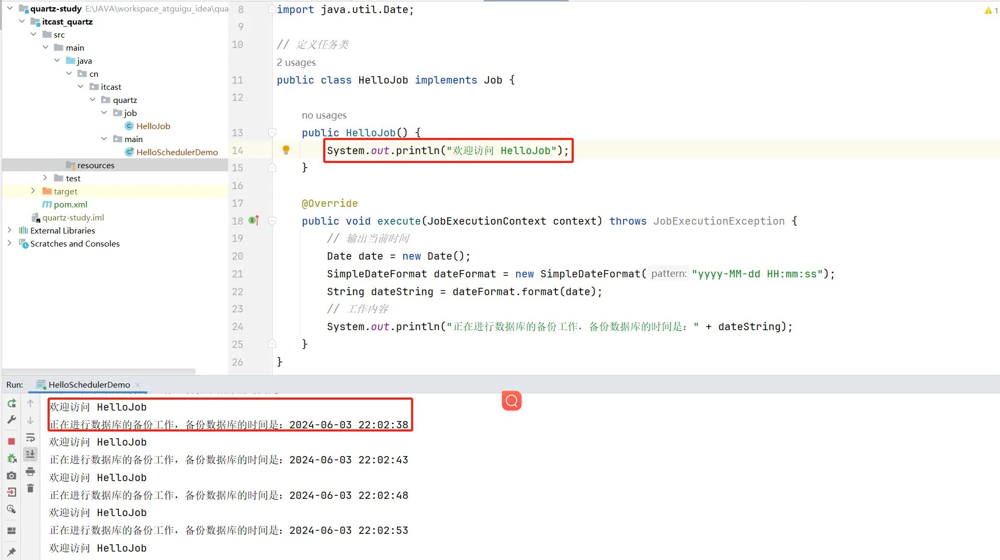

# Quartz 任务调度

## SpringTask 与 Timer 实现定时任务

### Timer 实现定时任务

1. JDK 1.3 开始推出定时任务实现工具类 `java.util.Timer`

2. API

    - `Timer timer = new Timer();`
    - `timer.schedule(任务,延迟时间|执行时间)`
    - `timer.schedule(任务,延迟时间,重复频率)`
    - `timer.schedule(任务,首次执行时间,重复频率)`

3. 案例

    ```java
    public class MyTimer {
        public static void main(String[] args) throws ParseException {
            // 创建 Timer 对象
            Timer timer = new Timer();
            // 1. 实现定时任务（hello,timer!）-具体时间点
            String str = "2024-06-08 02:14:00";
            Date start = new SimpleDateFormat("yyyy-MM-dd HH:mm:ss").parse(str);
            MyTimerTask task = new MyTimerTask();
    //        timer.schedule(task, start);
            // 2. 实现定时任务（hello,timer!）-具体时间频率(2秒)
            timer.schedule(task, 0, 2000);
        }
    
        static class MyTimerTask extends TimerTask {
            @Override
            public void run() {
                System.out.println("hello,timer!");
                System.out.println("run time: " + new Date().toLocaleString());
            }
        }
    }
    ```

### SpringTask 实现定时任务

1. Spring V3.0 开始推出定时任务功能，无需引入额外的依赖（SpringTask 集成在 SpringContext 中），**默认单线程方式执行所有**

2. `@EnableScheduling`：SpringBoot 启动类上添加该注解，开启定时任务功能。

3. `@Scheduled`：方法上添加 `@Scheduled(cron="cron表达式")`

    ```java
    @Component
    public class MyTask {
        @Scheduled(cron = "0/1 * * * * ?")
        public void task1() {
            System.out.println("=================================================");
            System.out.println("hello,task!");
            System.out.println("run time:" + new Date().toLocaleString());
            System.out.println("Thread.currentThread().getName() = " + Thread.currentThread().getName());
            // 执行时间 > 时间频率
            try {
                Thread.sleep(5000L);
            } catch (InterruptedException e) {
                throw new RuntimeException(e);
            }
            System.out.println("=================================================");
        }
    
        @Scheduled(cron = "0/1 * * * * ?")
        public void task2() {
            System.out.println("=================================================");
            System.out.println("你好,task!");
            System.out.println("run time:" + new Date().toLocaleString());
            System.out.println("Thread.currentThread().getName() = " + Thread.currentThread().getName());
            System.out.println("=================================================");
        }
    }
    ```

4. 多线程设置

    ```yml
    spring:
      task:
        scheduling:
          # 线程名前缀
          thread-name-prefix: mytask_
          # 线程池的线程数
          pool:
            size: 2
          shutdown:
            # 线程关闭前是否等待所有任务执行完毕
            await-termination: false # 默认 false
            # 线程关闭前的最大等待时间（防止无限执行的任务）
            await-termination-period: 10s
    ```

## Quartz 基本介绍

### Quartz 概念
- Quartz 是 OpenSymphony 开源组织在 Job scheduling 领域又一个开源项目，它可以与 J2EE 与 J2SE 应用程序相结合也可以单独使用。

- quartz 是开源且具有丰富特性的"任务调度库"，能够集成于任何的 java 应用，小到独立的应用，大至电子商业系统。
- quartz 能够创建亦简单亦复杂的调度，以执行上十、上百，甚至上万的任务。任务 job 被定义为标准的 java 组件，能够执行任何你想要实现的功能。quartz 调度框架包含许多企业级的特性，如 JTA 事务、集群的支持。
- 简而言之，quartz 就是基于 java 实现的任务调度框架，用于执行你想要执行的任何任务。

官网：[Quartz Enterprise Job Scheduler](https://www.quartz-scheduler.org/)

中文文档：[Quartz 官方文档_w3cschool](https://www.w3cschool.cn/quartz_doc/)

### Quartz 运行环境

- Quartz 可以运行嵌入在另一个独立式应用程序
- Quartz 可以在应用程序服务器（或 servlet 容器）内被实例化，并且参与事务
- Quartz 可以作为一个独立的程序运行（其自己的 Java 虚拟机内），可以通过 RMI 使用
- Quartz 可以被实例化，作为独立的项目集群（负载平衡和故障转移功能），用于作业的执行

### Quartz 设计模式
- Builder 模式
- Factory 模式
- 组件模式
- 链式编程

### Quartz 学习的核心概念

 - **任务 Job**：Job 就是想要实现的任务类，每一个 Job 必须实现 `org.quartz.job` 接口，且只需实现接口定义的 `execute()` 方法。

 - **触发器 Trigger**：Trigger 为执行任务的触发器，比如你想每天定时 3 点发送一份统计邮件，Trigger 将会设置 3 点进行执行该任务。Trigger 主要包含两种 `SimpleTrigger` 和 `CronTrigger` 两种。

 - **调度器 Scheduler**：Scheduler 为任务的调度器，它会将任务 job 及触发器 Trigger 整合起来，负责基于 Trigger 设定的时间来执行 Job。

### Quartz 的体系结构


### Quartz 的几个常用 API
以下是 Quartz 编程 API 几个重要接口，也是 Quartz 的重要组件

- **Scheduler**：用于与调度程序交互的主要接口。Scheduler 调度程序-任务执行计划表，只有安排进执行计划的任务 Job（通过 `scheduler.scheduleJob` 方法安排进执行计划），当它预先定义的执行时间到了的时候（任务触发 trigger），该任务才会执行。
- **Job**：预先定义的希望在未来时间能被调度程序执行的任务类，可自定义。
- **JobDetail**：使用 JobDetail 来定义定时任务的实例，JobDetail 实例是通过 JobBuilder 类创建的。
- **JobDataMap**：可以包含不限量的（序列化的）数据对象，在 job 实例执行的时候，可以使用其中的数据；JobDataMap 是 Java Map 接口的一个实现，额外增加了一些便于存取基本类型的数据的方法。
- **Trigger 触发器**：Trigger 对象是用来触发执行 Job 的。当调度一个 job 时，我们实例一个触发器然后调整它的属性来满足 job 执行的条件。表明任务在什么时候会执行。定义了一个已经被安排的任务将会在什么时候执行的时间条件，比如每 2 秒就执行一次。
- **JobBuilder**：用于声明一个任务实例，也可以定义关于该任务的详情比如任务名、组名等，这个声明的实例将会作为一个实际执行的任务。
- **TriggerBuilder**：触发器创建器，用于创建触发器 trigger 实例。
- **JobListener、TriggerListener、SchedulerListener 监听器**：用于对组件的监听。

## Quartz 的使用

### 使用基本步骤

Quartz Scheduler 是一个功能强大且广泛使用的开源调度框架，用于在 Java 应用程序中实现定时任务调度。下面是使用 Quartz Scheduler 的基本步骤：

1. 添加依赖：首先，在项目构建文件（如 Maven 或 Gradle）中添加 Quartz 的依赖项，确保可以引入 Quartz 框架。
2. 创建 Job 类：定义一个实现 `org.quartz.Job` 接口的 Java 类，该类封装了要执行的任务逻辑。你需要实现 execute 方法，该方法会在任务被触发时被调用。
3. 创建 Trigger：创建一个 `org.quartz.Trigger` 对象，用于定义触发任务执行的时间规则，例如每隔一段时间执行、每天固定时间执行等。
4. 创建 Scheduler：通过 `org.quartz.SchedulerFactory` 创建一个 `org.quartz.Scheduler` 实例，它是 Quartz 的核心调度器。通过调度器，你可以配置和管理任务。
5. 创建 JobDetail：使用 `org.quartz.JobBuilder` 创建一个 `org.quartz.JobDetail` 对象，用于定义要执行的具体任务（即前面创建的 Job 类）。
6. 将 JobDetail 和 Trigger 绑定到 Scheduler：使用 `org.quartz.Scheduler` 的 scheduleJob 方法，将 JobDetail 和 Trigger 绑定到调度器，以指定任务的执行时间规则。
7. 启动 Scheduler：通过调度器的 start 方法启动 Scheduler，使其开始调度任务。

通过上述步骤，你可以实现定时任务的调度。Quartz Scheduler 会根据 Trigger 定义的时间规则触发执行 Job 任务。

此外，Quartz Scheduler 还提供了其他功能，例如任务暂停、恢复、修改触发时间规则、动态添加和删除任务等。你可以根据具体需求进一步探索 Quartz Scheduler 的高级功能。

### 准备工作

建立 Maven 工程，导入依赖

```xml
<?xml version="1.0" encoding="UTF-8"?>
<project xmlns="http://maven.apache.org/POM/4.0.0"
         xmlns:xsi="http://www.w3.org/2001/XMLSchema-instance"
         xsi:schemaLocation="http://maven.apache.org/POM/4.0.0 http://maven.apache.org/xsd/maven-4.0.0.xsd">
    <modelVersion>4.0.0</modelVersion>

    <groupId>cn.itcast.maven</groupId>
    <artifactId>itcast_quartz</artifactId>
    <version>1.0-SNAPSHOT</version>

    <dependencies>
        <!-- quartz 核心包 -->
        <dependency>
            <groupId>org.quartz-scheduler</groupId>
            <artifactId>quartz</artifactId>
            <version>2.3.2</version>
        </dependency>
        <!-- quartz-jobs 工具包 -->
        <dependency>
            <groupId>org.quartz-scheduler</groupId>
            <artifactId>quartz-jobs</artifactId>
            <version>2.3.2</version>
        </dependency>
        <dependency>
            <groupId>org.apache.logging.log4j</groupId>
            <artifactId>log4j-slf4j-impl</artifactId>
            <version>2.17.2</version>
        </dependency>
    </dependencies>

    <build>
        <plugins>
            <plugin>
                <groupId>org.apache.maven.plugins</groupId>
                <artifactId>maven-compiler-plugin</artifactId>
                <version>3.11.0</version>
                <configuration>
                    <target>1.8</target>
                    <source>1.8</source>
                </configuration>
            </plugin>
        </plugins>
    </build>
</project>
```

### 入门案例

1. 创建 HelloJob 任务类

    ```java
    // 定义任务类
    public class HelloJob implements Job {
        @Override
        public void execute(JobExecutionContext context) throws JobExecutionException {
            // 输出当前时间
            Date date = new Date();
            SimpleDateFormat dateFormat = new SimpleDateFormat("yyyy-MM-dd HH:mm:ss");
            String dateString = dateFormat.format(date);
            // 工作内容
            System.out.println("正在进行数据库的备份工作，备份数据库的时间是：" + dateString);
        }
    }
    ```
    
2. 创建任务调度类 HelloSchedulerDemo

    ```java
    public class HelloSchedulerDemo {
        public static void main(String[] args) throws Exception {
            // 1. 调度器（Scheduler），从工厂中获取调度的实例（默认：实例化 new StdSchedulerFactory()）
            Scheduler scheduler = StdSchedulerFactory.getDefaultScheduler();
            // 2. 任务实列（JobDetail）
            JobDetail jobDetail = JobBuilder.newJob(HelloJob.class)   // 加载任务类，与HelloJob完成绑定，要求HelloJob实现Job接口
                    .withIdentity("job1", "group1") // 参数1：任务的名称（唯一实例）；参数2：任务组的名称）
                    .build();
            // 3. 触发器（Trigger）
            Trigger trigger = TriggerBuilder.newTrigger()
                    .withIdentity("trigger1", "group1") // 参数1：触发器的名称（唯一实例）；参数2：触发器组的名称）
                    .startNow() // 马上启动触发器
                    .withSchedule(SimpleScheduleBuilder.simpleSchedule().withIntervalInSeconds(5).repeatForever()) // 每5s重复执行一次
                    .build();
            // 4. 让调度器关联任务和触发器，保证按照触发器定义的条件执行任务
            scheduler.scheduleJob(jobDetail, trigger);
            // 5. 启动
            scheduler.start();
        }
    }
    ```
    
3. 实现效果


### Job 和 JobDetail 介绍

- Job：工作任务调度的接口，任务类需要实现该接口。该接口中定义 execute 方法，类似 JDK 提供的 TimeTask 类的 run 方法。在里面编写任务执行的业务逻辑。

- **Job 实例在 Quartz 中的生命周期**：每次调度器执行 Job 时，它在调用 execute 方法前会**创建一个新的 Job 实例**，当调用完成后，关联的 Job 对象实例会被释放，释放的实例会被垃圾回收机制回收。

    

- JobDetail：JobDetail 为 Job 实例提供了许多设置属性，以及 JobDetaMap 成员变量属性，它用来存储特定 Job 实例的状态信息，调度器需要借助 JobDetail 对象来添加 Job 实例。

- JobDetail 重要属性：name、group、jobClass、jobDataMap

```java
JobDetail jobDetail = JobBuilder.newJob(HelloJob.class)
        .withIdentity("job1", "group1")
        .build();
System.out.println("名称："+jobDetail.getKey().getName());
System.out.println("组的名称："+jobDetail.getKey().getGroup());  // 如果没有指定组名：DEFAULT
System.out.println("任务类:"+jobDetail.getJobClass().getName());
```

### JobExecutionContext 介绍

- 当 Scheduler 调用一个 Job，就会将 `JobExecutionContext` 传递给 Job 的 `execute()` 方法；
- Job 能通过 `JobExecutionContext` 对象访问到 Quartz 运行时候的环境以及 Job 本身的明细数据。

```java
// 获取JobDetail的内容
JobKey jobKey = context.getJobDetail().getKey();
System.out.println("工作任务名称："+jobKey.getName()+";工作任务组："+jobKey.getGroup());
System.out.println("任务类名称（带包名）："+context.getJobDetail().getJobClass().getName());
System.out.println("任务类名称："+context.getJobDetail().getJobClass().getSimpleName());
System.out.println("当前任务执行时间："+context.getFireTime());
System.out.println("下一任务执行时间："+context.getNextFireTime());
// 获取Trigger的内容
TriggerKey triggerKey = context.getTrigger().getKey();
System.out.println("触发器名称" + triggerKey.getName() + "   触发器组"  + triggerKey.getGroup());
```

### JobDataMap 介绍

1. 使用 Map 获取。
    - 在进行任务调度时，`JobDataMap` 存储在` JobExecutionContext` 中，非常方便获取。
    - `JobDataMap` 可以用来装载任何可序列化的数据对象，当 job 实例对象被执行时这些参数对象会传递给它。
    - `JobDataMap` 实现了 JDK 的 Map 接口，并且添加了非常方便的方法用来存取基本数据类型。

```java
// 2：定义一个任务调度实例，将该实例与HelloJob绑定，任务类需要实现Job接口
JobDetail job = JobBuilder.newJob(HelloJob.class)
    .withIdentity("job1", "group1") // 定义该实例唯一标识
    .usingJobData("message", "打印日志")
    .build();
// 3：定义触发器 ，马上执行, 然后每5秒重复执行一次
Trigger trigger = TriggerBuilder.newTrigger()
    .withIdentity("trigger1", "group1") // 定义该实例唯一标识
    .startNow()  // 马上执行
    .withSchedule(SimpleScheduleBuilder.simpleSchedule().withIntervalInSeconds(5).repeatForever()) // 每5s重复执行一次
    .usingJobData("message", "simple触发器")
    .build();
```

```java
JobDataMap jobDataMap = context.getJobDetail().getJobDataMap();
String jobMessage = jobDataMap.getString("message");
System.out.println("任务参数消息值："+jobMessage);
JobDataMap triggerDataMap = context.getTrigger().getJobDataMap();
String triggerMessage = triggerDataMap.getString("message");
System.out.println("触发器参数消息值："+triggerMessage);
```

2. Job 实现类中添加 setter 方法对应 JobDataMap 的键值，Quartz 框架默认的 JobFactory 实现类在初始化 job 实例对象时会自动地调用这些 setter 方法。

HelloJob.java

```java
private String message;
public void setMessage(String message) {
	this.message = message;
}
```

**注意**：如果遇到同名的 key，Trigger 中的 `.usingJobData("message", "simple 触发器")` 会覆盖 JobDetail 中的 `.usingJobData("message", "打印日志")`。

### Job 状态与并发

`@DisallowConcurrentExecution`：

- 将该注解加到 job 类上，告诉 Quartz 不要并发地执行同一个 job 定义（这里指特定的 job 类）的多个实例。
- 如果“SalesReportJob”类上有该注解，则同一时刻仅允许执行一个“SalesReportForJoe”实例，但可以并发地执行“SalesReportForMike”类的一个实例。

`@PersistJobDataAfterExecution`:

- 将该注解加在 job 类上，告诉 Quartz 在成功执行了 job 类的 execute 方法后（没有发生任何异常），更新 JobDetail 中 JobDataMap 的数据，使得该 job（即 JobDetail）在下一次执行的时候，JobDataMap 中是更新后的数据，而不是更新前的旧数据。
- 有状态的 Job 可以理解为多次 Job 调用期间可以持有一些状态信息，这些状态信息存储在 JobDataMap 中，而默认的无状态 job 每次调用时都会创建一个新的 JobDataMap。在 Job 类上添加 `@PersistJobDataAfterExecution` 注解即为有状态的 Job。

1. 修改 HelloSchedulerDemo，添加 `.usingJobData("count", 0)`，表示计数器。

    ```java
    JobDetail job = JobBuilder.newJob(HelloJob.class)
        		.withIdentity("job1", "group1") // 定义该实例唯一标识
        		.usingJobData("message", "打印日志")
        		.usingJobData("count", 0)
        		.build();
    ```

2. 修改 HelloJob，添加 count 的 setting 和 getting 方法。

    ```java
    private Integer count;
    public void setCount(Integer count) {
    	this.count = count;
    }
    ```

3. 在 `public void execute(JobExecutionContext context) throws JobExecutionException` 的方法中添加。

    ```java
    private Integer count;
    public void setCount(Integer count) {
    	this.count = count;
    }
    ```

4. 总结
    - HelloJob 类没有添加 `@PersistJobDataAfterExecution` 注解，每次调用时都会创建一个新的 JobDataMap，不会累加；
    - HelloJob 类添加 `@PersistJobDataAfterExecution` 注解，多次 Job 调用期间可以持有一些状态信息，即可以实现 count 的累加。
    - 如果你使用了`@PersistJobDataAfterExecution` 注解，强烈建议同时使用 `@DisallowConcurrentExecution` 注解，因为当同一个 job(JobDetail)的两个实例被并发执行时，由于竞争，JobDataMap 中存储的数据很可能是不确定的。

### Trigger 介绍


Quartz 有一些不同的触发器类型，不过，用得最多的是 SimpleTrigger 和 CronTrigger。

1. **jobKey**：表示 job 实例的标识，触发器被触发时，指定的 job 实例会被执行。

2. **startTime**：设置触发器第一次触发的时间。

3. **endTime**：指定触发器失效的时间。

**案例：**

HelloJobTrigger.java

```java
// 定义任务类
public class HelloJobTrigger implements Job {
    @Override
    public void execute(JobExecutionContext context) throws JobExecutionException {
        // 输出当前时间
        Date date = new Date();
        SimpleDateFormat dateFormat = new SimpleDateFormat("yyyy-MM-dd HH:mm:ss");
        String dateString = dateFormat.format(date);
        // 工作内容
        System.out.println("正在进行数据库的备份工作，备份数据库的时间是：" + dateString);

        // 获取jobKey、startTime、endTime
        Trigger trigger = context.getTrigger();
        System.out.println("jobKey的名称：" + trigger.getJobKey().getName() + "\tjobKey的组名称：" + trigger.getJobKey().getGroup());
        System.out.println("任务的开始时间：" + dateFormat.format(trigger.getStartTime()) + "\t任务的结束时间：" + dateFormat.format(trigger.getEndTime())) ;
    }
}
```

HelloSchedulerDemoTrigger.java

```java
public class HelloSchedulerDemoTrigger {
    public static void main(String[] args) throws Exception {
        // 1. 调度器（Scheduler），从工厂中获取调度的实例（默认：实例化 new StdSchedulerFactory()）
        Scheduler scheduler = StdSchedulerFactory.getDefaultScheduler();
        // 设置任务的开始时间推迟3秒
        Date startDate = DateBuilder.futureDate(3, DateBuilder.IntervalUnit.SECOND);
        // 设置任务的结束时间推迟10秒(10秒后停止）
        Date endDate = DateBuilder.futureDate(10, DateBuilder.IntervalUnit.SECOND);

        // 2. 任务实列（JobDetail）
        JobDetail jobDetail = JobBuilder.newJob(HelloJobTrigger.class)
                .withIdentity("job1", "group1")
                .usingJobData("message", "打印日志") 
                .build();
        // 3. 触发器（Trigger）
        Trigger trigger = TriggerBuilder.newTrigger()
                .withIdentity("trigger1", "group1") // 参数1：触发器的名称（唯一实例）；参数2：触发器组的名称）
//                .startNow() // 马上启动触发器
                .withSchedule(SimpleScheduleBuilder.simpleSchedule().withIntervalInSeconds(5).repeatForever())
                .startAt(startDate) // 设置任务的开始时间
                .endAt(endDate) // 设置任务的结束时间
                .build();
        // 4. 让调度器关联任务和触发器，保证按照触发器定义的条件执行任务
        scheduler.scheduleJob(jobDetail, trigger);
        // 5. 启动
        scheduler.start();
    }
}
```

### SimpleTrigger 触发器

- SimpleTrigger 对于设置和使用，是最为简单的一种 QuartzTrigger。
- 它是为那种需要**在特定的日期/时间启动，且以一个可能的间隔时间重复执行 n 次的 Job** 所设计的。

**案例一：在一个指定的时间段内，执行一次作业任务。**

HelloJobSimpleTrigger.java


```java
public class HelloJobSimpleTrigger implements Job {
    @Override
    public void execute(JobExecutionContext context) throws JobExecutionException {
        Date date = new Date();
        SimpleDateFormat dateFormat = new SimpleDateFormat("yyyy-MM-dd HH:mm:ss");
        String dateString = dateFormat.format(date);
        System.out.println("正在进行数据库的备份工作，备份数据库的时间是：" + dateString);
    }
}
```

HelloSchedulerDemoSimpleTrigger.java

```java
public class HelloSchedulerDemoSimpleTrigger {
    public static void main(String[] args) throws Exception {
        // 1. 调度器（Scheduler），从工厂中获取调度的实例（默认：实例化 new StdSchedulerFactory()）
        Scheduler scheduler = StdSchedulerFactory.getDefaultScheduler();
        // 设置任务的开始时间推迟3秒
        Date startDate = DateBuilder.futureDate(3, DateBuilder.IntervalUnit.SECOND);

        // 2. 任务实列（JobDetail）
        JobDetail jobDetail = JobBuilder.newJob(HelloJobSimpleTrigger.class)
                .withIdentity("job1", "group1")
                .build();
        // 3. 触发器（Trigger）
        Trigger trigger = TriggerBuilder.newTrigger()
                .withIdentity("trigger1", "group1")
                .startAt(startDate) // 设置任务的开始时间
                .build();
        // 4. 让调度器关联任务和触发器，保证按照触发器定义的条件执行任务
        scheduler.scheduleJob(jobDetail, trigger);
        // 5. 启动
        scheduler.start();
    }
}
```

**案例二：在指定的时间间隔内多次执行作业任务。**

修改 HelloSchedulerDemoSimpleTrigger.java

```java
// 设置任务的开始时间推迟3秒
Date startDate = DateBuilder.futureDate(3, DateBuilder.IntervalUnit.SECOND);
// 3：定义触发器
Trigger trigger = TriggerBuilder.newTrigger()
        .withIdentity("trigger1", "group1") // 参数1：触发器的名称（唯一实例）；参数2：触发器组的名称）
        .startAt(startDate) // 设置任务的开始时间
        .withSchedule(SimpleScheduleBuilder.repeatSecondlyForever(5)
                .withRepeatCount(3))  // 5秒后重复执行，只重复执行3次（共4次）
```

**案例三：指定任务的结束时间。**

修改 HelloSchedulerDemoSimpleTrigger.java

```java
// 设置任务的开始时间推迟3秒
Date startDate = DateBuilder.futureDate(3, DateBuilder.IntervalUnit.SECOND);
// 设置任务的结束时间推迟10秒(10秒后停止）
Date endDate = DateBuilder.futureDate(10, DateBuilder.IntervalUnit.SECOND);

Trigger trigger = TriggerBuilder.newTrigger()
        .withIdentity("trigger1", "group1") // 参数1：触发器的名称（唯一实例）；参数2：触发器组的名称）
        .startAt(startDate) // 设置任务的开始时间
        .endAt(endDate)
        .withSchedule(SimpleScheduleBuilder.repeatSecondlyForever(5)
                .withRepeatCount(3)) // 5秒后重复执行，只重复执行3次（共4次）
        .build();
```

**需要注意的点：**

- SimpleTrigger 的属性有：开始时间、结束时间、重复次数和重复的时间间隔。
- 重复次数属性的值可以为 0、正整数、或常量 `SimpleTrigger.REPEAT_INDEFINITELY`。
- 重复的时间间隔属性值必须为长整型的正整数。
- 如果有指定结束时间属性值，则**结束时间属性优先于重复次数属性**，这样的好处在于：当我们需要创建一个每间隔 10 秒钟触发一次直到指定的结束时间的 Trigger，而无需去计算从开始到结束的所重复的次数，我们只需简单的指定结束时间和使用 `REPEAT_INDEFINITELY` 作为重复次数的属性值即可。

### CronTrigger 触发器

- 如果你需要像日历那样按日程来触发任务，而不是像 SimpleTrigger 那样每隔特定的间隔时间触发，CronTriggers 通常比 SimpleTrigger 更有用，因为它是基于日历的作业调度器。
- 使用 CronTrigger，你可以指定诸如“每个周五中午”，或者“每个工作日的 9:30”或者“从每个周一、周三、周五的上午 9:00 到上午 10:00 之间每隔五分钟”这样日程安排来触发。甚至，像 SimpleTrigger 一样，CronTrigger 也有一个 startTime 以指定日程从什么时候开始，也有一个（可选的）endTime 以指定何时日程不再继续。

1. Cron 表达式

    Cron 表达式被用来配置 CronTrigger 实例。Cron 表达式是一个由 7 个子表达式组成的字符串。每个子表达式都描述了一个单独的日程细节。这些子表达式用空格分隔，分别表示：

    1. Seconds 秒
    2. Minutes 分钟
    3. Hours 小时
    4. Day-of-Month 月中的天
    5. Month 月
    6. Day-of-Week 周中的天
    7. Year (optional field) 年（可选的域）

取值：


- 单个子表达式可以包含范围或者列表。例如：前面例子中的周中的天这个域（这里是"WED"）可以被替换为"MON-FRI", "MON, WED, FRI"或者甚至"MON-WED,SAT"。
- 所有的域中的值都有特定的合法范围，这些值的合法范围相当明显，例如：秒和分域的合法值为 0 到 59，小时的合法范围是 0 到 23，Day-of-Month 中值得合法凡范围是 1 到 31，但是需要注意不同的月份中的天数不同。月份的合法值是 1 到 12。或者用字符串 JAN,FEB MAR, APR, MAY, JUN, JUL, AUG, SEP, OCT, NOV 及 DEC 来表示。Days-of-Week 可以用 1 到 7 来表示（1=星期日）或者用字符串 SUN, MON, TUE, WED, THU, FRI 和 SAT 来表示。


**练习：**

	"0 0 10,14,16 * * ?" 每天上午10点，下午2点，4点
	"0 0/30 9-17 * * ?"   朝九晚五工作时间内每半小时，从0分开始每隔30分钟发送一次
	"0 0 12 ? * WED" 表示每个星期三中午12点 
	"0 0 12 * * ?" 每天中午12点触发 
	"0 15 10 ? * *" 每天上午10:15触发 
	"0 15 10 * * ?" 每天上午10:15触发 
	"0 15 10 * * ? *" 每天上午10:15触发 
	"0 15 10 * * ? 2005" 2005年的每天上午10:15触发 
	"0 * 14 * * ?" 在每天下午2点到下午2:59期间的每1分钟触发 
	"0 0/55 14 * * ?" 在每天下午2点到下午2:55期间，从0开始到55分钟触发 
	"0 0/55 14,18 * * ?" 在每天下午2点到2:55期间和下午6点到6:55期间的，从0开始到55分钟触发 
	"0 0-5 14 * * ?" 在每天下午2点到下午2:05期间的每1分钟触发 
	"0 10,44 14 ? 3 WED" 每年三月的星期三的下午2:10和2:44触发 
	"0 15 10 ? * MON-FRI" 周一至周五的上午10:15触发 
	"0 15 10 15 * ?" 每月15日上午10:15触发 
	"0 15 10 L * ?" 每月最后一日的上午10:15触发 
	"0 15 10 ? * 6L" 每月的最后一个星期五上午10:15触发 
	"0 15 10 ? * 6L 2002-2005" 2002年至2005年的每月的最后一个星期五上午10:15触发 
	"0 15 10 ? * 6#3" 每月的第三个星期五上午10:15触发 
**案例：**

HelloJobCronTrigger.java


```java
public class HelloJobCronTrigger implements Job {
    @Override
    public void execute(JobExecutionContext context) throws JobExecutionException {
        Date date = new Date();
        SimpleDateFormat dateFormat = new SimpleDateFormat("yyyy-MM-dd HH:mm:ss");
        String dateString = dateFormat.format(date);
        System.out.println("正在进行数据库的备份工作，备份数据库的时间是：" + dateString);
    }
}
```


HelloSchedulerDemoCronTrigger.java

```java
public class HelloSchedulerDemoCronTrigger {
    public static void main(String[] args) throws Exception {
        // 1. 调度器（Scheduler），从工厂中获取调度的实例（默认：实例化 new StdSchedulerFactory()）
        Scheduler scheduler = StdSchedulerFactory.getDefaultScheduler();
        // 2. 任务实列（JobDetail）
        JobDetail jobDetail = JobBuilder.newJob(HelloJobCronTrigger.class) 
                .withIdentity("job1", "group1") // 参数1：任务的名称（唯一实例）；参数2：任务组的名称）
                .build();
        // 3. 触发器（Trigger）
        Trigger trigger = TriggerBuilder.newTrigger()
                .withIdentity("trigger1", "group1") // 参数1：触发器的名称（唯一实例）；参数2：触发器组的名称）
                .startNow()
                .withSchedule(CronScheduleBuilder.cronSchedule("0/5 * * * * ?")) // 日历 从整点开始每5s执行一次
                .build();
        // 4. 让调度器关联任务和触发器，保证按照触发器定义的条件执行任务
        scheduler.scheduleJob(jobDetail, trigger);
        // 5. 启动
        scheduler.start();
    }
}
```

小提示：

- ‘L’和‘W’可以一起使用。（企业可用在工资计算）
- ‘#’可表示月中第几个周几。（企业可用在计算母亲节和父亲节）
- 周字段英文字母不区分大小写，例如 MON==mon。
- 利用工具，在线生成。

### 配置、资源 SchedulerFactory

- Quartz 以模块方式构架，因此，要使它运行，几个组件必须很好的咬合在一起。幸运的是，已经有了一些现存的助手可以完成这些工作。
- 所有的 Scheduler 实例由 SchedulerFactory 创建。
- Quartz 的三个核心概念：调度器、任务、触发器，三者之间的关系是：


一个作业，比较重要的三个要素就是 Schduler，jobDetail，Trigger；而 Trigger 对于 job 而言就好比一个驱动器；没有触发器来定时驱动作业，作业就无法运行；对于 Job 而言，**一个 job 可以对应多个 Trigger**，但对于 Trigger 而言，**一个 Trigger 只能对应一个 job**；所以一个 Trigger 只能被指派给一个 Job；如果你需要一个更复杂的触发计划，你可以创建多个 Trigger 并指派它们给同一个 Job。


**Scheduler 的创建方式：**

1. StdSchedulerFactory:

    Quartz 默认的 SchedulerFactory

    - 使用一组参数(`java.util.Properties`)来创建和初始化 Quartz 调度器
    
    - 配置参数一般存储在 `quartz.properties` 文件中
    
    - 调用 getScheduler 方法就能创建和初始化调度器对象
    
        ```java
        // Scheduler scheduler = StdSchedulerFactory.getDefaultScheduler();
        SchedulerFactory schedulerFactory = new StdSchedulerFactory();
        Scheduler scheduler = schedulerFactory.getScheduler();
        ```

- 用法一：输出调度器开始的时间（重要：使得任务和触发器进行关联）：

    `Date scheduleJob(JobDetail jobDetail, Trigger trigger)`

    ```java
    Date date = scheduler.scheduleJob(jobDetail, trigger);
    SimpleDateFormat dateFormat = new SimpleDateFormat("yyyy-MM-dd HH:mm:ss");
    System.out.println("调度器的开始时间是：" + dateFormat.format(date));
    ```

- 用法二：启动任务调度：

    `void start()`

    ```java
    scheduler.start();	
    ```

- 用法三：任务调度挂起，即暂停操作

    `void standby()`

    ```java
    // Scheduler执行2秒后自动挂起
    Thread.sleep(2000L);
    scheduler.standby();	
    // Scheduler执行5秒后自动开启
    Thread.sleep(5000L);
    scheduler.start();	
    ```

- 用法四：关闭任务调度

    `void shutdown()`

    - `shutdown(true)`：表示等待所有正在执行的 job 执行完毕之后，再关闭 Scheduler；

    - `shutdown(false)`：表示直接关闭 Scheduler

    - 测试一：

        ```java
        // Scheduler执行2秒后自动挂起
        Thread.sleep(2000L);
        scheduler.shutdown();
        // Scheduler执行5秒后自动开启
        Thread.sleep(5000L);
        scheduler.start();
        ```

        

    - 测试二：

        ```java
        // Scheduler执行2秒后自动挂起
        Thread.sleep(2000L);
        /**
         * shutdown(true)：表示等待所有正在执行的job执行完毕之后，再关闭Scheduler；
         * shutdown(false)：表示直接关闭Scheduler
         */
        scheduler.shutdown(false);
        System.out.println("scheduler是否被关闭："+scheduler.isShutdown());
        ```

        同时修改：HelloJobScheduler.java，任务调度延迟 5 秒执行

        ```java
        // 延迟任务执行的时间，推迟5秒向后执行
        try {
        	Thread.sleep(5000L);
        } catch (InterruptedException e) {
        	e.printStackTrace();
        }
        ```

2. DirectSchedulerFactory（了解）：

    DirectSchedulerFactory 是对 SchedulerFactory 的直接实现,通过它可以直接构建 Scheduler、threadpool 等
    
    ```java
    DirectSchedulerFactory directSchedulerFactory = DirectSchedulerFactory.getInstance();
    Scheduler scheduler = directSchedulerFactory.getScheduler();
    ```

### Quartz.properties

- 默认路径：quartz-x.x.x.jar 中的 org.quartz 中的 `quartz.properties`
- 也可以在项目的资源下添加 `quartz.properties` 文件，去覆盖底层的配置文件。

**组成部分**

- 调度器属性
    - `org.quartz.scheduler.instanceName` ：用来区分特定的调度器实例，可以按照功能用途来给调度器起名。
    - `org.quartz.scheduler.instanceId` ：和前者一样，也允许任何字符串，但这个值必须在所有调度器实例中是唯一的，尤其是在一个集群环境中，作为集群的唯一 key。假如你想 Quartz 帮你生成这个值的话，可以设置为 `AUTO`。


- 线程池属性
    - `org.quartz.threadPool.threadCount`：处理 Job 的线程个数，至少为 1，但最多的话最好不要超过 100，在多数机器上设置该值超过 100 的话就会显得相当不实用了，特别是在你的 Job 执行时间较长的情况下。
    - `org.quartz.threadPool.threadPriority`：线程的优先级，优先级别高的线程比级别低的线程优先得到执行。最小为 1，最大为 10，默认为 5。
    - `org.quartz.threadPool.class`：一个实现了 `org.quartz.spi.ThreadPool` 接口的类，Quartz 自带的线程池实现类是 `org.quartz.smpl.SimpleThreadPool`。


- 作业存储设置
    - `org.quartz.jobStore.class`：描述了在调度器实例的生命周期中，Job 和 Trigger 信息是如何被存储的。默认为`org.quartz.simpl.RAMJobStore`，表示使用内存存储。


- 插件配置
    - 满足特定需求用到的 Quartz 插件的配置。


**例子**

```properties
#===============================================================
#Configure Main Scheduler Properties     调度器属性
#===============================================================
#调度器的实例名，默认为DefaultQuartzScheduler
org.quartz.scheduler.instanceName = QuartzScheduler
#调度器的实例ID，大多数情况设置为auto即可
org.quartz.scheduler.instanceId = AUTO

#===============================================================
#Configure ThreadPool     线程池属性
#===============================================================
#处理Job的线程个数，至少为1，但最多的话最好不要超过100，在多数机器上设置该值超过100的话就会显得相当不实用了，特别是在你的 Job 执行时间较长的情况下，默认为10
org.quartz.threadPool.threadCount =  5
#线程的优先级，优先级别高的线程比级别低的线程优先得到执行。最小为1，最大为10，默认为5
org.quartz.threadPool.threadPriority = 5
#一个实现了 org.quartz.spi.ThreadPool 接口的类，Quartz 自带的线程池实现类是 org.quartz.smpl.SimpleThreadPool
org.quartz.threadPool.class = org.quartz.simpl.SimpleThreadPool

#===============================================================
#Configure JobStore 作业存储设置
#===============================================================
#要使 Job 存储在内存中需通过设置  org.quartz.jobStrore.class 属性为 org.quartz.simpl.RAMJobStore
org.quartz.jobStore.class = org.quartz.simpl.RAMJobStore

#===============================================================
#Configure Plugins    插件配置
#在1.8版之前 jobInitializer的配置为：
#org.quartz.plugin.jobInitializer.class = org.quartz.plugins.xml.JobInitializationPlugin
#1.8版之后 jobInitializer采用：
#org.quartz.plugin.jobInitializer.class = org.quartz.plugins.xml.XMLSchedulingDataProcessorPlugin
#===============================================================
org.quartz.plugin.jobInitializer.class = org.quartz.plugins.xml.XMLSchedulingDataProcessorPlugin
org.quartz.plugin.jobInitializer.overWriteExistingJobs = true
org.quartz.plugin.jobInitializer.failOnFileNotFound = true
org.quartz.plugin.jobInitializer.validating=false
```


也可以编写程序代码操作 `quartz.properties` 文件的内容：

```java
public class QuartzProperties {
    public static void main(String[] args) throws SchedulerException {
        // 创建配置工厂的属性的对象
        Properties properties = new Properties();
        properties.put(StdSchedulerFactory.PROP_THREAD_POOL_CLASS, "org.quartz.simpl.SimpleThreadPool"); // 线程池的定义
        properties.put("org.quartz.threadPool.threadCount", "5");
        // 创建工厂实例
        StdSchedulerFactory stdSchedulerFactory = new StdSchedulerFactory();
        // 使用定义的属性初始化工厂
        stdSchedulerFactory.initialize(properties);
        Scheduler scheduler = stdSchedulerFactory.getScheduler();
        scheduler.start();
    }
}
```

**通过 Properties 设置工厂属性的缺点在用硬编码，假如需要修改例子中线程数量，将不得不修改代码，然后重新编译。这里不推荐使用。**

### Quartz 监听器

#### 概念

- Quartz 的监听器用于当任务调度中你所关注事件发生时，能够及时获取这一事件的通知。类似于任务执行过程中的邮件、短信类的提醒。
- Quartz 监听器主要有 JobListener、TriggerListener、SchedulerListener 三种，顾名思义，分别表示任务、触发器、调度器对应的监听器。
- 三者的使用方法类似，在开始介绍三种监听器之前，需要明确两个概念：全局监听器与非全局监听器，二者的区别在于：
    - 全局监听器能够接收到所有的 Job/Trigger 的事件通知。
    - 而非全局监听器只能接收到在其上注册的 Job 或 Trigger 的事件，不在其上注册的 Job 或 Trigger 则不会进行监听。
- 为了方便起见，实现这些接口，你的类也可以扩展 JobListenerSupport 类或 TriggerListenerSupport 类，并且只需覆盖你感兴趣的事件。

#### JobListener

任务调度过程中，与任务 Job 相关的事件包括：**job 开始要执行的提示; job 执行完成的提示**。


```java
 public interface JobListener {
  	String getName();
  	void jobToBeExecuted(JobExecutionContext context);
  	void jobExecutionVetoed(JobExecutionContext context);   
    void jobWasExecuted(JobExecutionContext context, JobExecutionException jobException);
}
```

 其中：

1) `getName()` ：用于获取该 JobListener 的名称。
2) `jobToBeExecuted()`：Scheduler 在 JobDetail 将要被执行时调用这个方法。
3) `jobExecutionVetoed()`：Scheduler 在 JobDetail 即将被执行，但又被 TriggerListerner 否决时会调用该方法。
4) `jobWasExecuted()`：Scheduler 在 JobDetail 被执行之后调用这个方法。

示例：

1. 创建 Job 类 HelloJobListener

    ```java
    public class HelloJobListener implements Job {
        @Override
        public void execute(JobExecutionContext context) throws JobExecutionException {
            Date date = new Date();
            SimpleDateFormat dateFormat = new SimpleDateFormat("yyyy-MM-dd HH:mm:ss");
            String dateString = dateFormat.format(date);
            System.out.println("进行数据库备份操作。当前任务执行的时间："+dateString);
        }
    }
    ```

2. 创建自定义的 MyJobListener

    ```java
    public class MyJobListener implements JobListener {
        @Override
        public String getName() {
            String name = getClass().getSimpleName();
            System.out.println("监听器的名称是：" + name);
            return name;
        }
    
        @Override
        public void jobToBeExecuted(JobExecutionContext context) {
            String jobName = context.getJobDetail().getKey().getName();
            System.out.println("Job的名称是：" + jobName + "\tScheduler在JobDetail将要被执行时调用这个方法");
        }
    
        @Override
        public void jobExecutionVetoed(JobExecutionContext context) {
            String jobName = context.getJobDetail().getKey().getName();
            System.out.println("Job的名称是：" + jobName + "\tScheduler在JobDetail即将被执行，但又被TriggerListener否决时会调用该方法");
        }
    
        @Override
        public void jobWasExecuted(JobExecutionContext context, JobExecutionException jobException) {
            String jobName = context.getJobDetail().getKey().getName();
            System.out.println("Job的名称是：" + jobName + "\tScheduler在JobDetail被执行之后调用这个方法");
        }
    }
    ```

3. 执行调度器 HelloSchedulerDemoJobListener

    ```java
    public class HelloSchedulerDemoJobListener {
        public static void main(String[] args) throws Exception {
            // 1. 调度器（Scheduler），从工厂中获取调度的实例（默认：实例化 new StdSchedulerFactory()）
            Scheduler scheduler = StdSchedulerFactory.getDefaultScheduler();
    
            // 2. 任务实列（JobDetail）
            JobDetail jobDetail = JobBuilder.newJob(HelloJobListener.class)   // 加载任务类，与HelloJob完成绑定，要求HelloJob实现Job接口
                    .withIdentity("job1", "group1") // 参数1：任务的名称（唯一实例）；参数2：任务组的名称）
                    .build();
            // 3. 触发器（Trigger）
            Trigger trigger = TriggerBuilder.newTrigger()
                    .withIdentity("trigger1", "group1") // 参数1：触发器的名称（唯一实例）；参数2：触发器组的名称）
                    .startNow()
                    .withSchedule(SimpleScheduleBuilder.repeatSecondlyForever(5)
                            .withRepeatCount(3))
                    .build();
            // 4. 让调度器关联任务和触发器，保证按照触发器定义的条件执行任务
            scheduler.scheduleJob(jobDetail, trigger);
            // 创建并注册一个全局的 Job Listener
            //scheduler.getListenerManager().addJobListener(new MyJobListener(), EverythingMatcher.allJobs());
            // 创建并注册一个局部的 Job Listener，表示指定的任务 Job
            scheduler.getListenerManager().addJobListener(new MyJobListener(), KeyMatcher.keyEquals(JobKey.jobKey("job1", "group1")));
            // 5. 启动
            scheduler.start();
        }
    }
    ```

#### TriggerListener

任务调度过程中，与触发器 Trigger 相关的事件包括：**触发器触发、触发器未正常触发、触发器完成等**。

```java
public interface TriggerListener {
    public String getName();
    public void triggerFired(Trigger trigger, JobExecutionContext context);
    public boolean vetoJobExecution(Trigger trigger, JobExecutionContext context);
    public void triggerMisfired(Trigger trigger);
    public void triggerComplete(Trigger trigger, JobExecutionContext context, int triggerInstructionCode);
}
```

其中：

1) `getName()`：用于获取触发器的名称

2) `triggerFired()`：当与监听器相关联的 Trigger 被触发，Job 上的 `execute()` 方法将被执行时，Scheduler 就调用该方法。

3) `vetoJobExecution()`：在 Trigger 触发后，Job 将要被执行时由 Scheduler 调用这个方法。TriggerListener 给了一个选择去否决 Job 的执行。假如这个方法返回 true，这个 Job 将不会为此次 Trigger 触发而得到执行。

4) `triggerMisfired()`：Scheduler 调用这个方法是在 Trigger 错过触发时。你应该关注此方法中持续时间长的逻辑：在出现许多错过触发的 Trigger 时，长逻辑会导致骨牌效应。你应当保持这上方法尽量的小。

5) `triggerComplete()`：Trigger 被触发并且完成了 Job 的执行时，Scheduler 调用这个方法。

 示例：

下面的例子简单展示了 TriggerListener 的使用，其中创建并注册 TriggerListener 与 JobListener 几乎类似。

1. 创建 Job 类 HelloJobListener（同上）

2. MyTriggerListener

    ```java
    public class MyTriggerListener implements TriggerListener {
        private String name;
    
        // 构造方法，自定义传递的触发器名称，默认是类名
        public MyTriggerListener(String name) {
            this.name = name;
        }
    
        @Override
        public String getName() {
            System.out.println("触发器的名称是：" + name);
            return name;
        }
    
        @Override
        public void triggerFired(Trigger trigger, JobExecutionContext context) {
            String triggerName = trigger.getKey().getName();
            // 当与监听器相关联的 Trigger 被触发，Job 上的 execute()方法将被执行时，Scheduler 就调用该方法。
            System.out.println(triggerName + " 被触发");
        }
    
        @Override
        public boolean vetoJobExecution(Trigger trigger, JobExecutionContext context) {
            String triggerName = trigger.getKey().getName();
            // 在 Trigger 触发后，Job 将要被执行时由 Scheduler 调用这个方法。T
            System.out.println(triggerName + " 没有被触发");
            return false; // true：表示不会执行Job的方法
        }
    
        @Override
        public void triggerMisfired(Trigger trigger) {
            String triggerName = trigger.getKey().getName();
            // Scheduler 调用这个方法是在 Trigger 错过触发时。
            System.out.println(triggerName + " 错过触发");
        }
    
        @Override
        public void triggerComplete(Trigger trigger, JobExecutionContext context, Trigger.CompletedExecutionInstruction triggerInstructionCode) {
            String triggerName = trigger.getKey().getName();
            // Trigger 被触发并且完成了 Job 的执行时，Scheduler 调用这个方法。
            System.out.println(triggerName + " 完成之后触发");
        }
    }
    ```

3. 任务调度类 HelloSchedulerDemoTriggerListener

    ```java
    public class HelloSchedulerDemoTriggerListener {
        public static void main(String[] args) throws Exception {
            // ...
            // 4. 让调度器关联任务和触发器，保证按照触发器定义的条件执行任务
            scheduler.scheduleJob(jobDetail, trigger);
            // 创建并注册一个全局的 Trigger Listener
    //        scheduler.getListenerManager().addTriggerListener(new MyTriggerListener("SimpleName"), EverythingMatcher.allTriggers());
            // 创建并注册一个局部的 Trigger Listener
            scheduler.getListenerManager().addTriggerListener(new MyTriggerListener("SimpleName"),
                    KeyMatcher.keyEquals(TriggerKey.triggerKey("trigger1", "group1")));
            // 5. 启动
            scheduler.start();
        }
    }
    ```

#### SchedulerListener

SchedulerListener 会在 Scheduler 的生命周期中关键事件发生时被调用。与 Scheduler 有关的事件包括：**增加一个 job/trigger，删除一个 job/trigger，scheduler 发生严重错误，关闭 scheduler 等**。

```java
public interface SchedulerListener {
    public void jobScheduled(Trigger trigger);
    public void jobUnscheduled(String triggerName, String triggerGroup);
    public void triggerFinalized(Trigger trigger);
    public void triggersPaused(String triggerName, String triggerGroup);
    public void triggersResumed(String triggerName, String triggerGroup);
    public void jobsPaused(String jobName, String jobGroup);
    public void jobsResumed(String jobName, String jobGroup);
    public void schedulerError(String msg, SchedulerException cause);
    public void schedulerStarted();
    public void schedulerInStandbyMode();
    public void schedulerShutdown();
    public void schedulingDataCleared();
}
```

其中：

1) `jobScheduled()`：用于部署 JobDetail 时调用

2) `jobUnscheduled()`：用于卸载 JobDetail 时调用

3) `triggerFinalized()`：当一个 Trigger 来到了再也不会触发的状态时调用这个方法。除非这个 Job 已设置成了持久性，否则它就会从 Scheduler 中移除。

4) `triggersPaused()`：Scheduler 调用这个方法是发生在一个 Trigger 或 Trigger 组被暂停时。假如是 Trigger 组的话，triggerName 参数将为 null。

5) `triggersResumed()`：Scheduler 调用这个方法是发生成一个 Trigger 或 Trigger 组从暂停中恢复时。假如是 Trigger 组的话，triggerName 参数将为 null。
6) `jobsPaused()`：当一个或一组 JobDetail 暂停时调用这个方法。
7) `jobsResumed()`：当一个或一组 Job 从暂停上恢复时调用这个方法。假如是一个 Job 组，jobName 参数将为 null。
8) `schedulerError()`：在 Scheduler 的正常运行期间产生一个严重错误时调用这个方法。
9) `schedulerStarted()`：当 Scheduler 开启时，调用该方法。
10) `schedulerInStandbyMode()`： 当 Scheduler 处于 StandBy 模式时，调用该方法
11) `schedulerShutdown()`：当 Scheduler 停止时，调用该方法。
12) `schedulingDataCleare()`：当 Scheduler 中的数据被清除时，调用该方法。

 示例：

下面的代码简单描述了如何使用 SchedulerListener 方法：

1. 创建 Job 类 HelloJobListener（同上）

2. MySchedulerListener.java

    ```java
    public class MySchedulerListener implements SchedulerListener {
        @Override
        public void jobScheduled(Trigger trigger) {
            String jobName = trigger.getJobKey().getName();
            System.out.println(jobName + " 完成部署");
        }
    
        @Override
        public void jobUnscheduled(TriggerKey triggerKey) {
            System.out.println(triggerKey + " 完成卸载");
        }
    
        @Override
        public void triggerFinalized(Trigger trigger) {
            System.out.println("触发器被移除 " + trigger.getJobKey().getName());
        }
    
        @Override
        public void triggerPaused(TriggerKey triggerKey) {
            System.out.println(triggerKey + " 正在被暂停");
        }
    
        @Override
        public void triggersPaused(String triggerGroup) {
            System.out.println("触发器组 " + triggerGroup + " 正在被暂停");
        }
    
        @Override
        public void triggerResumed(TriggerKey triggerKey) {
            System.out.println(triggerKey + " 正在从暂停中恢复");
        }
    
        @Override
        public void triggersResumed(String triggerGroup) {
            System.out.println("触发器组 " + triggerGroup + " 正在从暂停中恢复");
        }
    
        @Override
        public void jobAdded(JobDetail jobDetail) {
            System.out.println(jobDetail.getKey() + " 添加工作任务");
        }
    
        @Override
        public void jobDeleted(JobKey jobKey) {
            System.out.println(jobKey + " 删除工作任务");
        }
    
        @Override
        public void jobPaused(JobKey jobKey) {
            System.out.println(jobKey + " 工作任务正在被暂停");
        }
    
        @Override
        public void jobsPaused(String jobGroup) {
            System.out.println("工作任务组 " + jobGroup + " 正在被暂停");
        }
    
        @Override
        public void jobResumed(JobKey jobKey) {
            System.out.println(jobKey + " 正在从暂停中恢复");
        }
    
        @Override
        public void jobsResumed(String jobGroup) {
            System.out.println("工作任务组 " + jobGroup + " 正在从暂停中恢复");
        }
    
        @Override
        public void schedulerError(String msg, SchedulerException cause) {
            System.out.println("产生严重错误时调用：\t" + msg + "\t" + cause.getUnderlyingException());
        }
    
        @Override
        public void schedulerInStandbyMode() {
            System.out.println("调度器在挂起模式下调用");
        }
    
        @Override
        public void schedulerStarted() {
            System.out.println("调度器 开启时调用");
        }
    
        @Override
        public void schedulerStarting() {
            System.out.println("调度器 正在开启时调用");
        }
    
        @Override
        public void schedulerShutdown() {
            System.out.println("调度器 已经被关闭 时调用");
        }
    
        @Override
        public void schedulerShuttingdown() {
            System.out.println("调度器 正在被关闭 时调用");
        }
    
        @Override
        public void schedulingDataCleared() {
            System.out.println("调度器的数据被清除时调用");
        }
    }
    ```

3. HelloSchedulerDemoSchedulerListener.java

    ```java
    public class HelloSchedulerDemoSchedulerListener {
        public static void main(String[] args) throws Exception {
            // ...
            // 4. 让调度器关联任务和触发器，保证按照触发器定义的条件执行任务
            scheduler.scheduleJob(jobDetail, trigger);
            // 创建并注册一个全局的 Scheduler Listener
            scheduler.getListenerManager().addSchedulerListener(new MySchedulerListener());
            // 5. 启动
            scheduler.start();
            scheduler.standby();
            scheduler.start();
            scheduler.pauseJob(JobKey.jobKey("job1", "group1"));
            scheduler.resumeJob(JobKey.jobKey("job1", "group1"));
            scheduler.pauseTrigger(TriggerKey.triggerKey("trigger1", "group1"));
            scheduler.resumeTrigger(TriggerKey.triggerKey("trigger1", "group1"));
            // 移除监听器的监听
            scheduler.getListenerManager().removeSchedulerListener(new MySchedulerListener());
            // 关闭
            scheduler.shutdown();
        }
    }
    ```

### Quartz 中的错过补偿机制 MisFire

**什么是 misfire：**

1. 定时任务被出发了成为 fire，那么 misfire 自然就称之为“错过的触发”
2. 误解：失火、哑火

**为什么出现 misfire：**

1. 资源紧张，定时任务请求不到对应的线程
2. 调度器关闭
3. 设置定时任务的开始时间早于启动时间（未明确指定开始时间，则开始时间=启动时间）

**misfire 的补偿：**

1. 不同的 trigger，存在不同的补偿策略
2. CronTrigger 补偿策略
    - `CronTrigger.MISFIRE_INSTRUCTION_DO_NOTHING`：`withMisfireHandlingInstructionDoNothing()`
        - 说明：错误的不再补偿，然后正常调度
    - `CronTrigger.MISFIRE_INSTRUCTION_FIRE_NOW`：`withMisfireHandlingInstructionFireAndProceed()`
        - 说明：错过的全部合并成一次，并立即补偿（即使任务终止时间已达到），然后正常调取。**默认值**。
    - `CronTrigger.MISFIRE_INSTRUCTION_IGNORE_MISFIRE_POLICY`：`withMisfireHandlingInstructionIgnoreMisfires()`
        - 说明：错过的全部立即补偿（即使任务终止时间已达到），然后正常调度

### Job Stores

- JobStore 负责跟踪您提供给调度程序的所有“工作数据”：jobs，triggers，日历等。
- 您声明您提供给用于生成调度程序实例的 SchedulerFactory 的属性文件（或对象）中您的调度程序应使用哪个 JobStore（以及它的配置设置）。
- JobStore 用于 Quartz 本身的幕后使用，切勿在代码中直接使用 JobStore 实例。你必须告诉 Quartz（通过配置）使用哪个 JobStore，但是你应该只在代码中使用 Scheduler 界面。

#### RAMJobStore

- RAMJobStore 是使用最简单的 JobStore，它也是性能最高的（在 CPU 时间方面）。
- RAMJobStore 以其明显的方式获取其名称：它将其所有数据保存在 RAM 中。这就是为什么它是闪电般快的，也是为什么这么简单的配置。
- 缺点是当您的应用程序结束（或崩溃）时，所有调度信息都将丢失。这意味着 RAMJobStore 无法履行 Job 和 Triggers 上的“非易失性”设置。对于某些应用程序，这是可以接受的，甚至是所需的行为，但对于其他应用程序，这可能是灾难性的。

要使用 RAMJobStore（并假设您使用的是 StdSchedulerFactory），只需在配置文件中设置：

```properties
org.quartz.jobStore.class = org.quartz.simpl.RAMJobStore
```

#### JDBC JobStore

- JDBCJobStore 也被恰当地命名 - 它通过 JDBC 将其所有数据保存在数据库中。因此，配置比 RAMJobStore 要复杂一点，而且也不是那么快。
- 但是，性能下降并不是很糟糕，特别是如果您在主键上构建具有索引的数据库表。在相当现代的一套具有体面的 LAN（在调度程序和数据库之间）的机器上，检索和更新触发 triggers 的时间通常将小于 10 毫秒。
- JDBCJobStore 几乎与任何数据库一起使用，已被广泛应用于 Oracle，PostgreSQL，MySQL，MS SQLServer，HSQLDB 和 DB2。
- 要使用 JDBCJobStore，必须首先创建一组数据库表以供 Quartz 使用。您可以在 Quartz 发行版的 `docs/dbTables` 目录或 `quartz-core\src\main\resources\org\quartz\impl\jdbcjobstore` 中找到表创建 SQL 脚本。
- 有关属性的详细信息，可参考 `docs/config` 文件夹中的示例配置文件。

要使用 JDBCJobStore（并假定您使用的是 StdSchedulerFactory），首先需要将 Quartz 配置的 JobStore 类属性设置为`org.quartz.impl.jdbcjobstore.JobStoreTX`或 `org.quartz.impl.jdbcjobstore.JobStoreCMT`。

```properties
# 配置Quartz以使用JobStoreTx
org.quartz.jobStore.class = org.quartz.impl.jdbcjobstore.JobStoreTX
# 配置JDBCJobStore以使用DriverDelegate
org.quartz.jobStore.driverDelegateClass = org.quartz.impl.jdbcjobstore.StdJDBCDelegate
# 使用表前缀配置JDBCJobStore
org.quartz.jobStore.tablePrefix = QRTZ_
# 使用要使用的DataSource的名称配置JDBCJobStore
org.quartz.jobStore.dataSource = myDS
```

具体介绍见：[Job Stores](https://www.w3cschool.cn/quartz_doc/quartz_doc-ib1j2d6x.html)

#### TerracottaJobStore

- TerracottaJobStore 提供了一种缩放和鲁棒性的手段，而不使用数据库。这意味着您的数据库可以免受 Quartz 的负载，可以将其所有资源保存为应用程序的其余部分。
- TerracottaJobStore 可以运行群集或非群集，并且在任一情况下，为应用程序重新启动之间持续的作业数据提供存储介质，因为数据存储在 Terracotta 服务器中。它的性能比通过 JDBCJobStore 使用数据库要好得多（约一个数量级更好），但比 RAMJobStore 要慢。

要使用 TerracottaJobStore（并且假设您使用的是 StdSchedulerFactory），只需将类名称 `org.quartz.jobStore.class = org.terracotta.quartz.TerracottaJobStore` 指定为用于配置石英的 JobStore 类属性，并添加一个额外的行配置来指定 Terracotta 服务器的位置

```properties
org.quartz.jobStore.class = org.terracotta.quartz.TerracottaJobStore
org.quartz.jobStore.tcConfigUrl = localhost:951
```

## SpringBoot 整合 Quartz

### 简单案例

#### 引入依赖

`spring-boot-starter-quartz`

```xml
<?xml version="1.0" encoding="UTF-8"?>
<project xmlns="http://maven.apache.org/POM/4.0.0" xmlns:xsi="http://www.w3.org/2001/XMLSchema-instance"
         xsi:schemaLocation="http://maven.apache.org/POM/4.0.0 https://maven.apache.org/xsd/maven-4.0.0.xsd">
    <modelVersion>4.0.0</modelVersion>
    <groupId>com.bombax.springboot.quartz</groupId>
    <artifactId>springboot-quartz</artifactId>
    <version>0.0.1-SNAPSHOT</version>
    <name>springboot-quartz</name>
    <description>springboot-quartz</description>
    <properties>
        <java.version>1.8</java.version>
        <project.build.sourceEncoding>UTF-8</project.build.sourceEncoding>
        <project.reporting.outputEncoding>UTF-8</project.reporting.outputEncoding>
        <spring-boot.version>2.3.12.RELEASE</spring-boot.version>
    </properties>
    <dependencies>
        <dependency>
            <groupId>org.springframework.boot</groupId>
            <artifactId>spring-boot-starter-web</artifactId>
        </dependency>
        <dependency>
            <groupId>org.springframework.boot</groupId>
            <artifactId>spring-boot-starter-quartz</artifactId>
        </dependency>

        <dependency>
            <groupId>org.projectlombok</groupId>
            <artifactId>lombok</artifactId>
        </dependency>
    </dependencies>
    <dependencyManagement>
        <dependencies>
            <dependency>
                <groupId>org.springframework.boot</groupId>
                <artifactId>spring-boot-dependencies</artifactId>
                <version>${spring-boot.version}</version>
                <type>pom</type>
                <scope>import</scope>
            </dependency>
        </dependencies>
    </dependencyManagement>

</project>
```

#### 创建 Job

- 自定义任务实现类
- `@PersistJobDataAfterExecution` ，有状态的 job
- `@DisallowConcurrentExecution`，禁止并发访问同一个 job 定义

```java
package com.bombax.springboot.quartz.job;

@PersistJobDataAfterExecution   // 有状态的job
@DisallowConcurrentExecution    // 禁止并发访问同一个 job 定义
public class MyJob implements Job {
    @Override
    public void execute(JobExecutionContext context) throws JobExecutionException {
        // context-定时任务执行的环境（上下文）
        // 获取 JobDetail 对象
        JobDetail jobDetail = context.getJobDetail();
        System.out.println("System.identityHashCode(jobDetail) = " + System.identityHashCode(jobDetail));
        // 输出详情
        System.out.println("任务名字：" + jobDetail.getKey().getName());
        System.out.println("任务分组名字：" + jobDetail.getKey().getGroup());
        System.out.println("任务类名字：" + jobDetail.getJobClass().getName());
        System.out.println("本次执行时间：" + context.getFireTime());
        System.out.println("下次执行时间：" + context.getNextFireTime());

        // 记录任务执行次数
        JobDataMap jobDataMap = jobDetail.getJobDataMap();
        Integer count = (Integer) jobDataMap.get("count");
        System.out.println("第" + count + "次执行");
        jobDataMap.put("count", ++count);   // 更新共享数据

        // 休眠3秒
        try {
            Thread.sleep(3000L);
        } catch (InterruptedException e) {
            throw new RuntimeException(e);
        }
    }
}

```

#### 创建 JobDetail 和 Trigger

- 配置类 QuartzConfig

```java
package com.bombax.springboot.quartz.config;

@Configuration
public class QuartzConfig {
    @Bean
    public JobDetail jobDetail() {
        return JobBuilder.newJob(MyJob.class)
                .storeDurably() // 持久化
                .withIdentity("job1", "group1") // 唯一标识
                .usingJobData("count", 1)   // （共享）数据初始化
                .build();
    }

    @Bean
    public Trigger trigger() {
        // cron 表达式
        String cronExpression = "0/2 * * * * ? *"; // 每隔2秒执行一次
        return TriggerBuilder.newTrigger()
                .withIdentity("trigger1", "group1")
                .forJob(jobDetail())
                .withSchedule(CronScheduleBuilder.cronSchedule(cronExpression)) // 时间规则（cron 表达式
                .build();
    }
}
```

#### 主启动类

```java
package com.bombax.springboot.quartz;

@SpringBootApplication
public class SpringbootQuartzApplication {

    public static void main(String[] args) {
        SpringApplication.run(SpringbootQuartzApplication.class, args);
    }

}
```

#### 测试

1. `@PersistJobDataAfterExecution`  注解：有状态的 job

    - 不使用 `@PersistJobDataAfterExecution`  注解

        

    - 使用 `@PersistJobDataAfterExecution`  注解

        

2. `@DisallowConcurrentExecution` ：当任务处理时间超过了定时的时间，禁止并发访问同一个 job 定义。

    - 不使用`@DisallowConcurrentExecution`

        

    - 使用`@DisallowConcurrentExecution`

        

### Quartz 实现定时任务的动态调度

#### 什么是动态定时任务

1. 动态定时任务，即定时任务的动态调度，可根据需求自动的进行任务的生成、暂停、恢复、删除和更新操作。
2. Quartz 本身没有提供动态调度的功能，需要自己根据相关的 API 开发。

#### 动态定时任务的使用场景

1. 订单成功后自动发短信通知
2. 每日推送的功能引发用户不满，不再定时推送
3. 每日下班前 30 分钟发送工作报表，遇节假日暂停发送
4. ......

#### Scheduler 调度器常用 API

1. `schedule.scheduleJob(JobDetail jobDetail, Trigger trigger)`：生成一个新的定时任务
2. `schedule.pauseJob(JobKey jobKey)`：暂停一个定时任务，参数  jobKey 代表该任务的唯一标识
3. `schedule.resumeJob(JobKey jobKey)`：恢复一个定时任务
2. `schedule.deleteJob(JobKey jobKey)`：删除一个定时任务
2. `schedule.rescheduleJob(TriggerKey triggerKey, Trigger newTrigger) `：修改一个定时任务
2. `schedule.triggerJob(JobKey jobKey)`：执行一次定时任务

#### 实现动态调度的定时任务

##### 自定义任务类

```java
package com.bombax.springboot.quartz.job;

@PersistJobDataAfterExecution   // 有状态的job
@DisallowConcurrentExecution    // 禁止并发访问同一个 job 定义
public class MyJob implements Job {
    @Override
    public void execute(JobExecutionContext context) throws JobExecutionException {
        JobDetail jobDetail = context.getJobDetail();
        JobDataMap jobDataMap = jobDetail.getJobDataMap();
        Integer count = (Integer) jobDataMap.get("count");
        System.out.println("第" + count + "次执行，本次执行时间：" + context.getFireTime());
        jobDataMap.put("count", ++count);
    }
}
```

##### 任务 Bean

```java
package com.bombax.springboot.quartz.entity;

@Data
@AllArgsConstructor
@NoArgsConstructor
public class JobBean {
    /**
     * 任务名字
     */
    private String jobName;

    /**
     * 任务类
     */
    private String jobClass;

    /**
     * cron 表达式
     */
    private String cronExpression;
}
```

##### 操作任务的工具类

```java
package com.bombax.springboot.quartz.utils;

public class JobUtils {
    /**
     * 生成一个定时任务
     * @param scheduler 调度器
     * @param jobBean 任务 Bean
     */
    public static void createJob(Scheduler scheduler, JobBean jobBean) {
        Class <? extends Job> jobClass = null;
        JobDetail jobDetail = null;
        Trigger trigger = null;
        String cronExpression = jobBean.getCronExpression();
        try {
            jobClass = (Class<? extends Job>) Class.forName(jobBean.getJobClass());
            jobDetail = JobBuilder.newJob(jobClass)
                    .storeDurably() // 任务持久化
                    .withIdentity(jobBean.getJobName()) // 设置任务详细信息的唯一标识
                    .usingJobData("count", 1)   // （共享）数据初始化
                    .build();
            trigger = TriggerBuilder.newTrigger()
                    .withIdentity(jobBean.getJobName() + "_trigger")
                    .forJob(jobDetail)
                    .withSchedule(CronScheduleBuilder.cronSchedule(cronExpression)) // 时间规则（cron 表达式
                    .build();
            scheduler.scheduleJob(jobDetail, trigger);
        } catch (ClassNotFoundException | SchedulerException e) {
            throw new RuntimeException(e);
        }

    }

    /**
     * 暂停定时任务
     * @param scheduler 调度器
     * @param jobName 任务名字
     */
    public static void pauseJob(Scheduler scheduler, String jobName) {
        JobKey jobKey = JobKey.jobKey(jobName);
        try {
            scheduler.pauseJob(jobKey);
        } catch (SchedulerException e) {
            throw new RuntimeException(e);
        }
    }

    /**
     * 恢复定时任务
     * @param scheduler 调度器
     * @param jobName 任务名字
     */
    public static void resumeJob(Scheduler scheduler, String jobName) {
        JobKey jobKey = JobKey.jobKey(jobName);
        try {
            scheduler.resumeJob(jobKey);
        } catch (SchedulerException e) {
            throw new RuntimeException(e);
        }
    }

    /**
     * 删除定时任务
     * @param scheduler 调度器
     * @param jobName 任务名字
     */
    public static void deleteJob(Scheduler scheduler, String jobName) {
        JobKey jobKey = JobKey.jobKey(jobName);
        try {
            scheduler.deleteJob(jobKey);
        } catch (SchedulerException e) {
            throw new RuntimeException(e);
        }
    }

    /**
     * 执行一次定时任务
     * @param scheduler 调度器
     * @param jobName 任务名字
     */
    public static void runJobOnce(Scheduler scheduler, String jobName) {
        JobKey jobKey = JobKey.jobKey(jobName);
        try {
            scheduler.triggerJob(jobKey);
        } catch (SchedulerException e) {
            throw new RuntimeException(e);
        }
    }

    /**
     * 修改定时任务
     * @param scheduler 调度器
     * @param jobBean 任务 Bean
     */
    public static void modifyJob(Scheduler scheduler, JobBean jobBean) {
        // 获取任务触发器的唯一标识
        TriggerKey triggerKey = TriggerKey.triggerKey(jobBean.getJobName() + "_trigger");
        try {
            // 通过唯一标识获取旧的触发器对象
            CronTrigger oldTrigger = (CronTrigger) scheduler.getTrigger(triggerKey);
            // 使用新 cron 表达式构建新的触发器
            String newCron = jobBean.getCronExpression();
            CronTrigger newTrigger = oldTrigger.getTriggerBuilder()
                    .withSchedule(CronScheduleBuilder.cronSchedule(newCron).withMisfireHandlingInstructionDoNothing())
                    .build();
            // 调度器更新任务的触发器
            scheduler.rescheduleJob(triggerKey, newTrigger);
        } catch (SchedulerException e) {
            throw new RuntimeException(e);
        }
    }
}
```

##### 编写控制器操作任务

```java
package com.bombax.springboot.quartz.controller;

@RestController
@RequestMapping("/quartz")
public class QuartzController {
    @Resource
    Scheduler scheduler;
    private String jobName = "myjob";

    @GetMapping("/create")
    public String createJob() {
        JobBean jobBean = new JobBean(jobName, MyJob.class.getName(), "0/2 * * * * ? *");
        JobUtils.createJob(scheduler, jobBean);
        return "任务创建成功";
    }

    @GetMapping("/pause")
    public String pauseJob() {
        JobUtils.pauseJob(scheduler, jobName);
        return "任务暂停成功";
    }

    @GetMapping("resume")
    public String resumeJob() {
        JobUtils.resumeJob(scheduler, jobName);
        return "任务恢复成功";
    }

    @GetMapping("/delete")
    public String deleteJob() {
        JobUtils.deleteJob(scheduler, jobName);
        return "任务删除成功";
    }

    @GetMapping("/once")
    public String runOnceJob() {
        JobUtils.runJobOnce(scheduler, jobName);
        return "任务执行一次成功";
    }

    @GetMapping("/modify")
    public String modifyJob() {
        JobBean jobBean = new JobBean(jobName, MyJob.class.getName(), "0/5 * * * * ? *");
        JobUtils.modifyJob(scheduler, jobBean);
        return "任务修改成功";
    }

}
```

##### 测试

```sh
### 生成一个定时任务
GET http://localhost:8080/quartz/create

### 暂停定时任务
GET http://localhost:8080/quartz/pause

### 恢复定时任务
GET http://localhost:8080/quartz/resume

### 删除定时任务
GET http://localhost:8080/quartz/delete

### 执行一次定时任务
GET http://localhost:8080/quartz/once

### 修改定时任务
GET http://localhost:8080/quartz/modify
```

#### 关于修改定时任务的问题

**问题描述：**

- 当调度器执行 `schedule.rescheduleJob(TriggerKey triggerKey, Trigger newTrigger) ` 去更新某个 triggerKey 对应的新 trigger 时，会导致新 trigger 相关联的定时任务立即执行一次（暂停任务亦如此）。

**解决方法：**

- 为 CronScheduleBuilder 设置 `withMisfireHandlingInstructionDoNothing()`，忽略所有错误的任务，按正常调度继续执行。

### Quartz 的持久化

#### 为什么需要 Quartz 持久化

- Quartz 持久化即将定时任务保存在介质中，持久化目的是保证任务在发生异常后也不会丢失。
- Quartz 默认将定时任务存在内存(RAMJobSrote)，优点是数据读取速度快，缺点是一旦异常发生，任务数据就没有了。
- Quartz 还提供另外一种存储在数据库的方案(JDBCJobStore)解决上面的问题。

#### 如何实现 JDBCJobStore

1. 创建持久化相关表：可以在 Quartz 发行版的 `docs/dbTables` 目录或 `quartz-core\src\main\resources\org\quartz\impl\jdbcjobstore` 中找到表创建 SQL 脚本。

2. 引入相关依赖

    ```xml
    <dependency>
        <groupId>org.springframework.boot</groupId>
        <artifactId>spring-boot-starter-web</artifactId>
    </dependency>
    <!-- quartz -->
    <dependency>
        <groupId>org.springframework.boot</groupId>
        <artifactId>spring-boot-starter-quartz</artifactId>
    </dependency>
    <!-- lombok -->
    <dependency>
        <groupId>org.projectlombok</groupId>
        <artifactId>lombok</artifactId>
    </dependency>
    <!-- druid 数据库连接池 -->
    <dependency>
        <groupId>com.alibaba</groupId>
        <artifactId>druid-spring-boot-starter</artifactId>
        <version>1.2.16</version>
    </dependency>
    <!-- 驱动程序 -->
    <dependency>
        <groupId>mysql</groupId>
        <artifactId>mysql-connector-java</artifactId>
        <version>8.0.33</version>
    </dependency>
    <!-- ORM 框架：mybatis-plus -->
    <dependency>
        <groupId>com.baomidou</groupId>
        <artifactId>mybatis-plus-boot-starter</artifactId>
        <version>3.5.5</version>
    </dependency>
    ```

3. 相关配置

    ```yml
    spring:
      # 数据源配置
      datasource:
        driver-class-name: com.mysql.cj.jdbc.Driver
        username: root
        password: 123456
        url: jdbc:mysql://localhost:3306/quartz-db?characterEncoding=utf8&useSSL=false&serverTimezone=GMT%2B8&rewriteBatchedStatements=true&allowPublicKeyRetrieval=true
      # quartz 存储设置
      quartz:
        # 默认存储到 memory
        job-store-type: jdbc
        jdbc:
          # always-每次先清空数据库进行初始化
          # embedded-只初始化内存数据库，默认值
          # never-不进行初始化
          initialize-schema: always # 首次运行请使用 always
    ```

4. 任务详细消息的持久化设置

    - `storeDurably()`

        ```java
        @Bean
        public JobDetail jobDetail() {
            return JobBuilder.newJob(MyJob.class)
                .storeDurably() // 持久化
                .withIdentity("job1", "group1") // 唯一标识
                .usingJobData("count", 1)   // （共享）数据初始化
                .build();
        }
        ```

5. 项目中配置的是 Cron 触发器，涉及到记录 `qrtz_cron_triggers`、`qrtz_job_details`、`qrtz_triggers`三表。

### Quartz 的集群操作

#### 为什么需要 Quartz 集群

1. 防止单点故障，减少对业务的影响。
    - 例如：一个任务在一台机器上跑，如果这台机器下线，可以将任务分配到第二台机器执行。
2. 通过负载均衡，减少节点的压力。
    - 例如：在 10 点要触发 1000 个任务，如果有 10 个节点，则每个节点只需要执行 100 个任务。
3. 注意事项
    - Quartz 集群不能选择存储内存类型（必须持久化到数据库），因集群的多个节点要进行数据共享和通信。
    - Quartz 使用的是随机的负载均衡算法，不能执行节点执行。
    - 注意 Quartz 服务器时间的同步。

#### Quartz 集群的实现

##### 集群 properties 常用配置

- 集群开关：`org.quartz.jobStore.isClustered`: `true | false(默认)`
    - 注意该属性与 `job-store-type` 的值关联，只有 `job-store-type: jdbc` 时可设置为 `true`
- 线程池大小：`org.quartz.threadPool.threadCount`，默认 10 个
- 集群实例名：`org.quartz.scheduler.instanceName`，同一个集群内多个节点上的该名称必须一致。默认值 `quartzScheduler`
- 实例 id：`org.quartz.scheduler.instanceId`，同一个集群内多个节点上的实例 id 必须不同。
    - 设置为 `AUTO` 表示让 Quartz 自动生成一个唯一的实例 ID（计算机名+时间戳）。
    - 如果不指定，所有实例 id 的值均为 `NON_CLUSTERED`
- 持久化类（含事务管理）：`org.quartz.jobStore.class`，其值可选用 `RAMJobStore`、`JobStoreTX`、`JobStoreCMT`等。
    - 当 `job-store-type: memory` 时，默认值 `org.quartz.simpl.RAMJobStore`
    - 当 `job-store-type: jdbc` 时，默认值 `JobStoreCMT` 的子类 `LocalDataSourceJobStore`
- 数据库驱动代理类：`org.quartz.jobStore.driverDelegateClass`，用来匹配不投数据库的实现类。
    - 默认值为标准 JDBC 驱动代理：`org.quartz.impl.jdbcjobstore.StdJDBCDelegate`，Quartz 将会根据所使用的数据库驱动自动选择合适的代理类。
- misfire 阈值：`org.quartz.jobStore.misfireThreshold`，单位：毫秒，默认 60000ms

```yml
spring:
  # 数据源配置
  datasource:
    driver-class-name: com.mysql.cj.jdbc.Driver
    username: root
    password: 123456
    url: jdbc:mysql://localhost:3306/quartz-db?characterEncoding=utf8&useSSL=false&serverTimezone=GMT%2B8&rewriteBatchedStatements=true&allowPublicKeyRetrieval=true
  # quartz 存储设置
  quartz:
    # 默认存储到 memory
    job-store-type: jdbc
    jdbc:
      # always-每次先清空数据库进行初始化
      # embedded-只初始化内存数据库，默认值
      # never-不进行初始化
      initialize-schema: always # 首次运行请使用 always
    properties:
      org:
        quartz:
          jobStore:
            isClustered: true
            class: org.springframework.scheduling.quartz.LocalDataSourceJobStore
            driverDelegateClass: org.quartz.impl.jdbcjobstore.StdJDBCDelegate
            misfireThreshold: 120000
          threadPool:
            threadCount: 20
          scheduler:
            instanceName: test-cluster
            instanceId: AUTO
```

##### 节点的重复执行问题

- 防止集群的节点重复执行任务，其原理就是使用锁。
- Quartz 默认使用基于数据库的锁定机制来确保同一时刻只有一个节点在运行作业
    - 如果一个节点无法获得锁，则它将等待直到能够获得锁（相关表 `qrtz_locks`）。
    - 如果一个节点获得了锁，任务将在该节点上执行，完成任务时，节点会将作业状态更新到数据库通知其他节点。

- 出现问题的原因是两个节点 `initialize-schema` 设置的都是 `true`，导致**第二个节点启动时再次清空数据库进行初始化**。
