# 分布式调度 XXL-JOB

## 前言

### 任务场景

- 用户画像
- 消息推送
- T+1 报表
- 状态同步

### 常用方式及存在问题

#### 定时任务实现方式

- **Timer**：java 自带的 `java.util.Timer` 类，这个类允许你调用一个 `java.util.TimerTask` 任务。使用这种方式可以让你的程序按照某一个频率执行，但不能在指定时间运行（指的是使用 Cron 表达式）。一般用的较少。
- **ScheduledExecutorService**：jdk 自带的一个类；是基于线程池设计的定时任务类，每个调度任务都会分配到线程池中的一个线程去执行。也就是说，任务是并发执行，互不影响。
- **Spring Task**：Spring 3.0 以后自带的 task，可以将它看成一个轻量级的 Quartz，而且使用起来比 Quartz 简单许多。
- **Quartz**：一个功能比较强大的调度器，可以让你的程序在指定时间执行，也可以按照某一个频率执行。配置稍显复杂，不支持分片，没有界面。

#### 存在的问题

- **执行一次**：如果想让它马上执行一次，这个时候可能就需要额外再写一个 Rest 接口或者再另外写一个单独的 Job。
- **更改执行时间**：需要修改代码，提交测试，然后打包上线。
- **暂停任务**：比如一些定时报警的需求，当报警突然变得很多，这个时候需要暂停一下让其停止发送报警，我们需要用配置的开关去做，在逻辑中判断定时任务开关是否打开来做。这样做虽然比较简单，但是我们这样需要新添加一些与任务无关的逻辑。
- **监控**：没有管理界面，不方便查看任务执行情况。
- **分片执行**：单台服务处理大批量数据时间太长、效率低下，需要其它机器协调执行。

### 解决方案

支持任务分片、文档完善、提供管理台、接入简单、弹性扩容...

- **XXL-JOB**：调度中心通过获取 DB 锁来保证集群中执行任务的唯一性，如果短任务很多，随着调度中心集群数量增加，那么数据库的锁竞争会比较厉害，性能不好。
- **Elastic-Job**：需要引入 zookeeper。

## 概述

### 什么是任务调度

我们可以思考一下下面业务场景的解决方案:

- 某电商平台需要每天上午 10 点，下午 3 点，晚上 8 点发放一批优惠券。
- 某银行系统需要在信用卡到期还款日的前三天进行短信提醒。
- 某财务系统需要在每天凌晨 0:10 分结算前一天的财务数据，统计汇总。

以上场景就是任务调度所需要解决的问题。

**任务调度是为了自动完成特定任务，在约定的特定时刻去执行任务的过程**

### 为什么需要分布式调度

- 使用 Spring 中提供的注解 `@Scheduled`，也能实现调度的功能

    - 在业务类中方法中贴上这个注解,然后在启动类上贴上`@EnableScheduling`注解

        ```java
        @Scheduled(cron = "0/20 * * * * ? ")
        public void doWork(){
        	//doSomething   
        }
        ```

感觉 Spring 给我们提供的这个注解可以完成任务调度的功能，好像已经完美解决问题了，为什么还需要分布式呢?

主要有如下这几点原因：

1. **高可用**：单机版的定式任务调度只能在一台机器上运行，如果程序或者系统出现异常就会导致功能不可用。
2. **防止重复执行**：在单机模式下，定时任务是没什么问题的。但当我们部署了多台服务，同时每台服务又有定时任务时，若不进行合理的控制在同一时间，只有一个定时任务启动执行，这时，定时执行的结果就可能存在混乱和错误了。
3. **单机处理极限**：原本 1 分钟内需要处理 1 万个订单，但是现在需要 1 分钟内处理 10 万个订单；原来一个统计需要 1 小时，现在业务方需要 10 分钟就统计出来。你也许会说，你也可以多线程、单机多进程处理。的确，多线程并行处理可以提高单位时间的处理效率，但是单机能力毕竟有限（主要是 CPU、内存和磁盘），始终会有单机处理不过来的情况。

### XXL-JOB 介绍

- XXL-JOB 是一个分布式任务调度平台，是一个轻量级分布式任务调度平台，其核心设计目标是开发迅速、学习简单、轻量级、易扩展。现已开放源代码并接入多家公司线上产品线，开箱即用。
- 大众点评目前已接入 XXL-JOB，该系统在内部已调度约 100 万次，表现优异。
- 目前已有多家公司接入 xxl-job，包括比较知名的大众点评，京东，优信二手车，360 金融 (360)，联想集团 （联想），易信 （网易）等等
- 官方文档 [分布式任务调度平台 XXL-JOB](https://www.xuxueli.com/xxl-job/)

#### 系统架构图

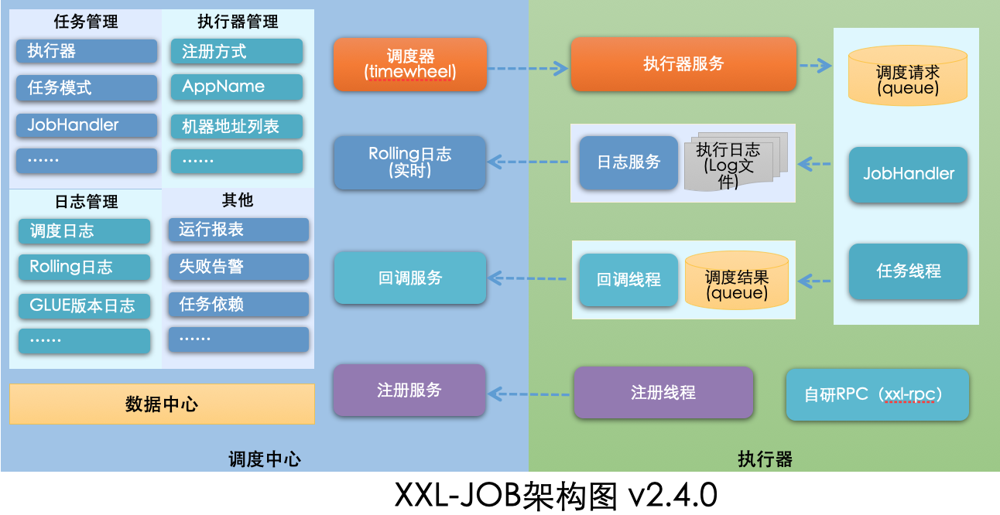

#### 设计思想

- 将调度行为抽象形成“调度中心”公共平台，而平台自身并不承担业务逻辑，“调度中心”负责发起调度请求。
- 将任务抽象成分散的 JobHandler，交由“执行器”统一管理，“执行器”负责接收调度请求并执行对应的 JobHandler 中业务逻辑。
- 因此，“调度”和“任务”两部分可以相互解耦，提高系统整体稳定性和扩展性。

**执行器**：相当于应用程序

- 添加 xxl-job 的依赖
- 添加 xxl 的任务注解
- 编写任务的处理逻辑
- 配置调度中心的地址（启动的时候注册信息）

**调度中心**：拥有执行器的地址和端口

- 配置任务的信息(Cron)
- 当达到任务的时间，由调度中心调用执行器的方法
- 收集任务的执行情况，可视化的界面展示任务执行的情况

## 快速入门

### 下载源码

**源码下载地址:**

https://github.com/xuxueli/xxl-job

https://gitee.com/xuxueli0323/xxl-job

### 初始化调度数据库

请下载项目源码并解压，获取 “调度数据库初始化 SQL 脚本” 并执行即可。

“调度数据库初始化 SQL 脚本” 位置为:

```
/xxl-job/doc/db/tables_xxl_job.sql
```

### 编译源码

解压源码，按照 maven 格式将源码导入 IDE，使用 maven 进行编译即可，源码结构如下：

```
xxl-job-admin：调度中心
xxl-job-core：公共依赖
xxl-job-executor-samples：执行器Sample示例（选择合适的版本执行器，可直接使用，也可以参考其并将现有项目改造成执行器）
    ：xxl-job-executor-sample-springboot：Springboot版本，通过Springboot管理执行器，推荐这种方式；
    ：xxl-job-executor-sample-frameless：无框架版本；
```

### 配置部署调度中心

调度中心项目：`xxl-job-admin`

作用：统一管理任务调度平台上调度任务，负责触发调度执行，并且提供任务管理平台。

#### 调度中心配置

修改 `xxl-job-admin` 项目的配置文件 `application.properties`，把数据库账号密码配置上

```properties
### web
server.port=8080
server.servlet.context-path=/xxl-job-admin

### actuator
management.server.servlet.context-path=/actuator
management.health.mail.enabled=false

### resources
spring.mvc.servlet.load-on-startup=0
spring.mvc.static-path-pattern=/static/**
spring.resources.static-locations=classpath:/static/

### freemarker
spring.freemarker.templateLoaderPath=classpath:/templates/
spring.freemarker.suffix=.ftl
spring.freemarker.charset=UTF-8
spring.freemarker.request-context-attribute=request
spring.freemarker.settings.number_format=0.##########

### mybatis
mybatis.mapper-locations=classpath:/mybatis-mapper/*Mapper.xml
#mybatis.type-aliases-package=com.xxl.job.admin.core.model

### xxl-job, datasource
spring.datasource.url=jdbc:mysql://192.168.202.200:3306/xxl_job?useUnicode=true&characterEncoding=UTF-8&autoReconnect=true&serverTimezone=Asia/Shanghai
spring.datasource.username=root
spring.datasource.password=WolfCode_2017
spring.datasource.driver-class-name=com.mysql.cj.jdbc.Driver

### datasource-pool
spring.datasource.type=com.zaxxer.hikari.HikariDataSource
spring.datasource.hikari.minimum-idle=10
spring.datasource.hikari.maximum-pool-size=30
spring.datasource.hikari.auto-commit=true
spring.datasource.hikari.idle-timeout=30000
spring.datasource.hikari.pool-name=HikariCP
spring.datasource.hikari.max-lifetime=900000
spring.datasource.hikari.connection-timeout=10000
spring.datasource.hikari.connection-test-query=SELECT 1
spring.datasource.hikari.validation-timeout=1000

### xxl-job, email
spring.mail.host=smtp.qq.com
spring.mail.port=25
spring.mail.username=xxx@qq.com
spring.mail.from=xxx@qq.com
spring.mail.password=xxx
spring.mail.properties.mail.smtp.auth=true
spring.mail.properties.mail.smtp.starttls.enable=true
spring.mail.properties.mail.smtp.starttls.required=true
spring.mail.properties.mail.smtp.socketFactory.class=javax.net.ssl.SSLSocketFactory

### xxl-job, access token
xxl.job.accessToken=default_token

### xxl-job, i18n (default is zh_CN, and you can choose "zh_CN", "zh_TC" and "en")
xxl.job.i18n=zh_CN

## xxl-job, triggerpool max size
xxl.job.triggerpool.fast.max=200
xxl.job.triggerpool.slow.max=100

### xxl-job, log retention days
xxl.job.logretentiondays=30
```

#### 部署项目

运行 `XxlJobAdminApplication` 程序即可.

调度中心访问地址: http://localhost:8080/xxl-job-admin

默认登录账号 “admin/123456”, 登录后运行界面如下图所示。

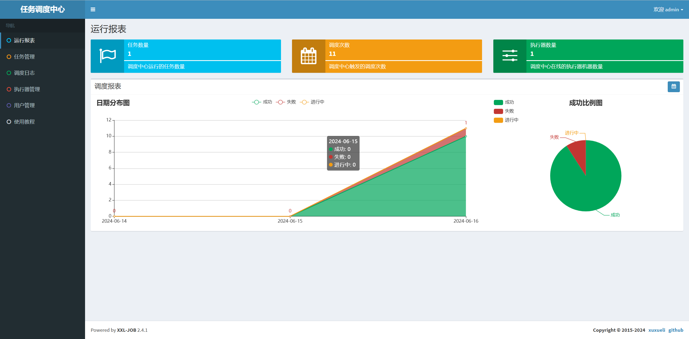

至此“调度中心”项目已经部署成功。

### 配置部署执行器项目

#### 添加 Maven 依赖

创建 SpringBoot 项目并且添加如下依赖：

```xml
<dependency>
    <groupId>com.xuxueli</groupId>
    <artifactId>xxl-job-core</artifactId>
    <version>2.3.1</version>
</dependency>
```

#### 执行器配置

在配置文件中添加如下配置：

```properties
### 调度中心部署根地址 [选填]：如调度中心集群部署存在多个地址则用逗号分隔。执行器将会使用该地址进行"执行器心跳注册"和"任务结果回调"；为空则关闭自动注册；
xxl.job.admin.addresses=http://127.0.0.1:8080/xxl-job-admin
### 执行器通讯TOKEN [选填]：非空时启用；
xxl.job.accessToken=default_token
### 执行器AppName [选填]：执行器心跳注册分组依据；为空则关闭自动注册
xxl.job.executor.appname=xxl-job-executor-sample
### 执行器注册 [选填]：优先使用该配置作为注册地址，为空时使用内嵌服务 ”IP:PORT“ 作为注册地址。从而更灵活的支持容器类型执行器动态IP和动态映射端口问题。
xxl.job.executor.address=
### 执行器IP [选填]：默认为空表示自动获取IP，多网卡时可手动设置指定IP，该IP不会绑定Host仅作为通讯实用；地址信息用于 "执行器注册" 和 "调度中心请求并触发任务"；
xxl.job.executor.ip=127.0.0.1
### 执行器端口号 [选填]：小于等于0则自动获取；默认端口为9999，单机部署多个执行器时，注意要配置不同执行器端口；
xxl.job.executor.port=9999
### 执行器运行日志文件存储磁盘路径 [选填] ：需要对该路径拥有读写权限；为空则使用默认路径；
xxl.job.executor.logpath=/data/applogs/xxl-job/jobhandler
### 执行器日志文件保存天数 [选填] ： 过期日志自动清理, 限制值大于等于3时生效; 否则, 如-1, 关闭自动清理功能；
xxl.job.executor.logretentiondays=30
```

#### 添加执行器配置

创建 `XxlJobConfig` 配置对象:

```java
@Configuration
public class XxlJobConfig {
    @Value("${xxl.job.admin.addresses}")
    private String adminAddresses;
    @Value("${xxl.job.accessToken}")
    private String accessToken;
    @Value("${xxl.job.executor.appname}")
    private String appname;
    @Value("${xxl.job.executor.address}")
    private String address;
    @Value("${xxl.job.executor.ip}")
    private String ip;
    @Value("${xxl.job.executor.port}")
    private int port;
    @Value("${xxl.job.executor.logpath}")
    private String logPath;
    @Value("${xxl.job.executor.logretentiondays}")
    private int logRetentionDays;

    @Bean
    public XxlJobSpringExecutor xxlJobExecutor() {
        XxlJobSpringExecutor xxlJobSpringExecutor = new XxlJobSpringExecutor();
        xxlJobSpringExecutor.setAdminAddresses(adminAddresses);
        xxlJobSpringExecutor.setAppname(appname);
        xxlJobSpringExecutor.setAddress(address);
        xxlJobSpringExecutor.setIp(ip);
        xxlJobSpringExecutor.setPort(port);
        xxlJobSpringExecutor.setAccessToken(accessToken);
        xxlJobSpringExecutor.setLogPath(logPath);
        xxlJobSpringExecutor.setLogRetentionDays(logRetentionDays);
        return xxlJobSpringExecutor;
    }
}
```

#### 添加任务处理类

添加任务处理类，交给 Spring 容器管理，在处理方法上贴上 `@XxlJob` 注解

```java
@Component
public class SimpleXxlJob {
    @XxlJob("demoJobHandler")
    public void demoJobHandler() throws Exception {
        System.out.println("执行定时任务,执行时间:"+new Date());
    }
}
```

### 运行 HelloWorld 程序

#### 任务配置&触发执行

登录调度中心,在任务管理中新增任务,配置内容如下：

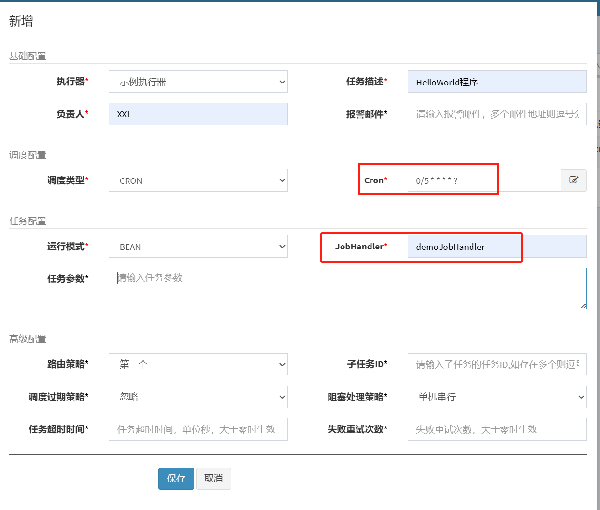

新增后界面如下：

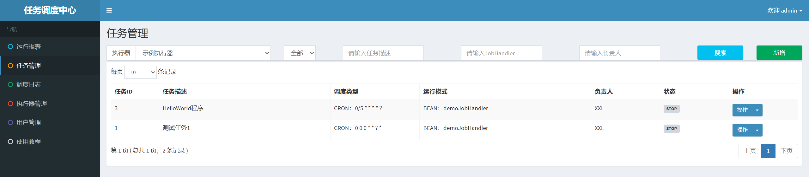

接着启动定时调度任务：

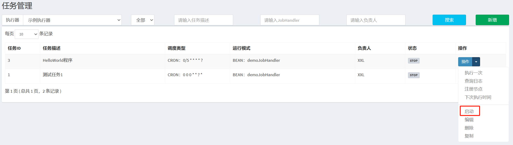

#### 查看日志

在调度中心的调度日志中就可以看到，任务的执行结果。

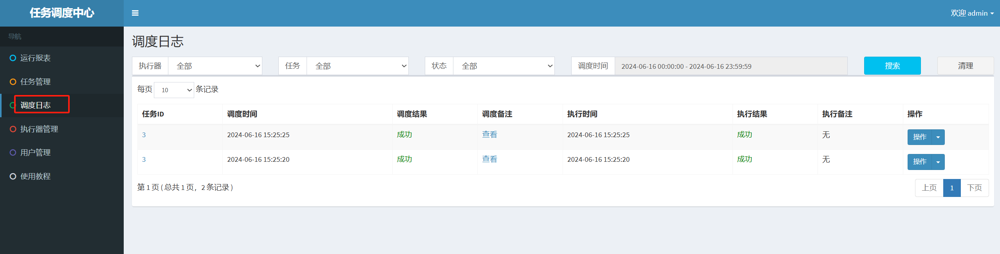

管控台也可以看到任务的执行信息。

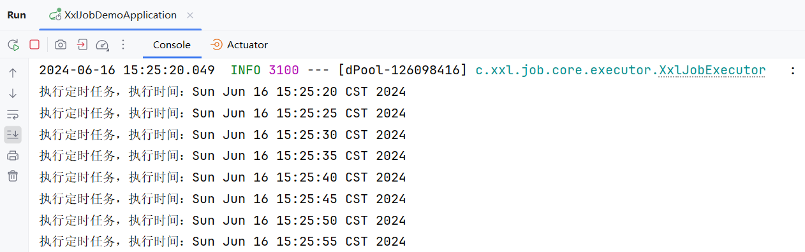

### GLUE 模式(Java)

- 任务以源码方式维护在调度中心，支持通过 Web IDE 在线更新，实时编译和生效，因此不需要指定 JobHandler。
-  “GLUE 模式(Java)” 运行模式的任务实际上是一段继承自 IJobHandler 的 Java 类代码，它在执行器项目中运行，可使用 [@Resource](https://github.com/Resource)/[@Autowire](https://github.com/Autowire) 注入执行器里中的其他服务。

**添加 Service**

```java
@Service
public class HelloService {
    public void methodA(){
        System.out.println("执行MethodA的方法");
    }
    public void methodB(){
        System.out.println("执行MethodB的方法");
    }
}
```

**添加任务配置**

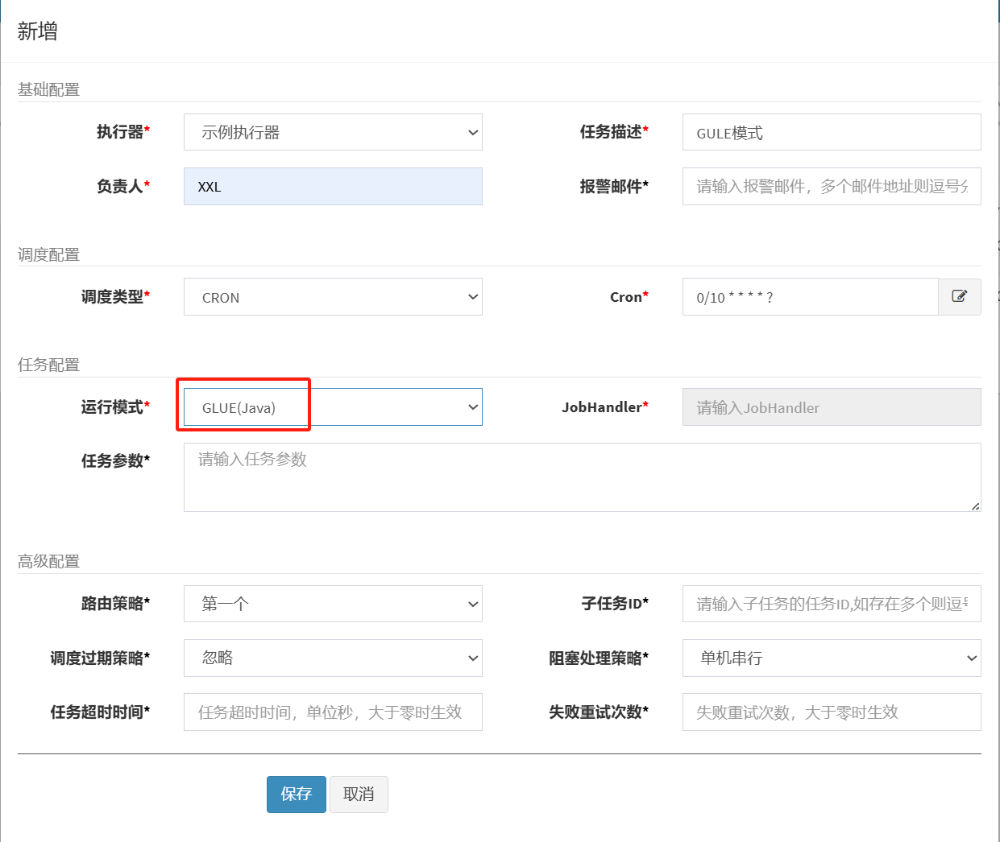

**通过 GLUE IDE 在线编辑代码**

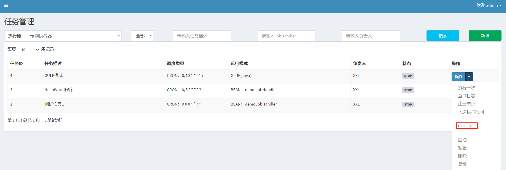

****

编写内容如下：

```java
package com.xxl.job.service.handler;

import org.springframework.beans.factory.annotation.Autowired;
import com.xxl.job.core.handler.IJobHandler;
import com.bombax.xxljobdemo.service.HelloService;

public class DemoGlueJobHandler extends IJobHandler {

	@Autowired
    private HelloService helloService;
    @Override
    public void execute() throws Exception {
        helloService.methodA();
    }
}
```

**启动并执行程序**

### 执行器集群

#### 集群环境搭建

- 调度中心支持集群部署，集群情况下各节点务必连接同一个 mysql 实例;
- 如果 mysql 做主从,调度中心集群节点务必强制走主库。

在 IDEA 中设置 SpringBoot 项目运行开启多个集群

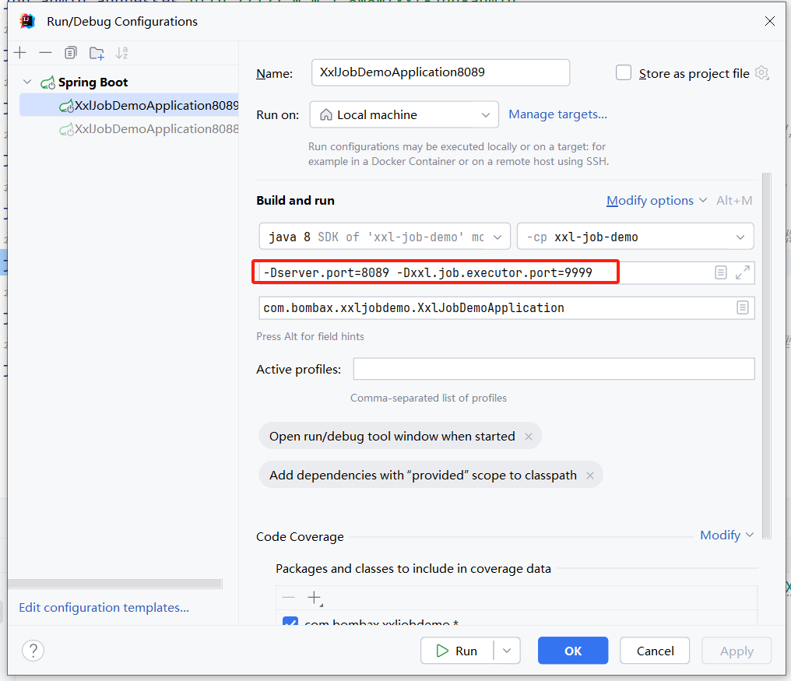

启动两个 SpringBoot 程序,需要修改 Tomcat 端口和执行器端口

- Tomcat 端口 8088 程序的命令行参数如下:

  ```shell
  -Dserver.port=8088 -Dxxl.job.executor.port=9998
  ```

- Tomcat 端口 8089 程序的命令行参数如下:

  ```sh
  -Dserver.port=8089 -Dxxl.job.executor.port=9999
  ```

在任务管理中，修改路由策略，修改成`轮询`

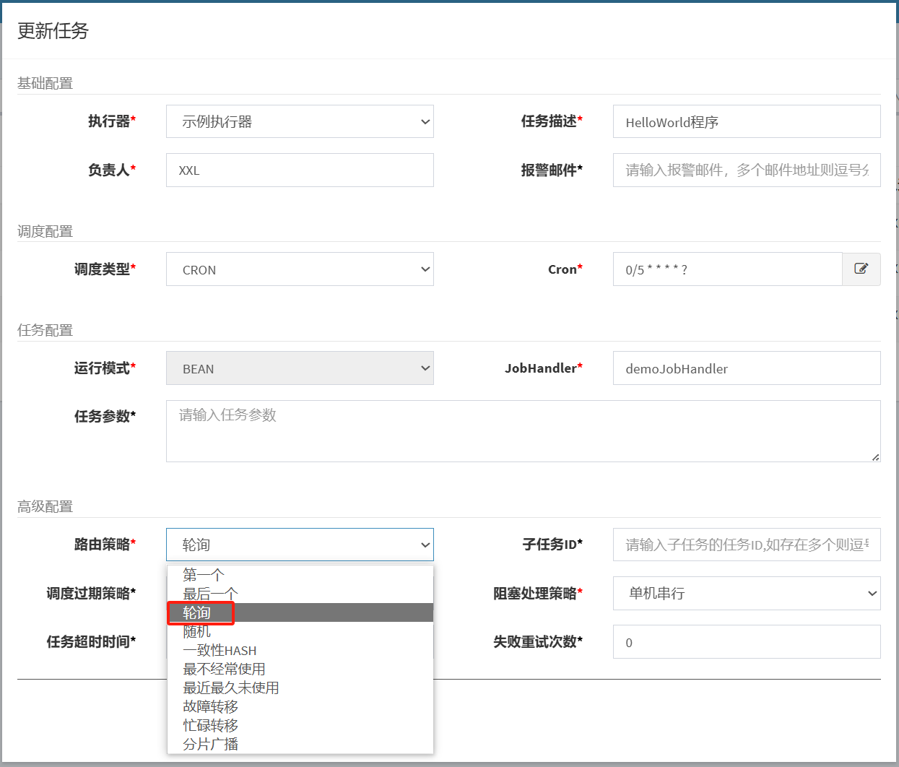

重新启动，我们可以看到效果是,定时任务会在这两台机器中进行轮询的执行

- 8088 端口的控制台日志如下:

  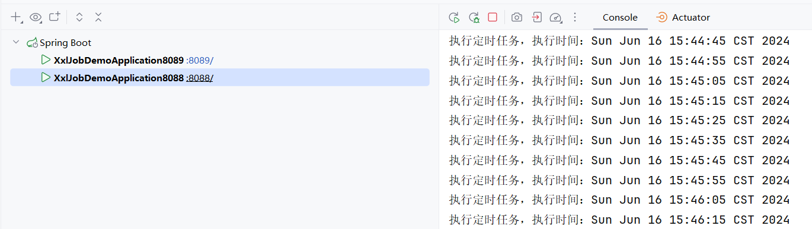

- 8089 端口的控制台日志如下:

  

#### 调度路由算法讲解

当执行器集群部署时，提供丰富的路由策略，包括:

1. `FIRST（第一个）：固定选择第一个机器`

2. `LAST（最后一个）：固定选择最后一个机器；`

3. `ROUND（轮询）：依次的选择在线的机器发起调度`

4. `RANDOM（随机）：随机选择在线的机器；`

5. `CONSISTENT_HASH（一致性HASH）：`        

   `每个任务按照Hash算法固定选择某一台机器，且所有任务均匀散列在不同机器上。`

6. `LEAST_FREQUENTLY_USED（最不经常使用）：使用频率最低的机器优先被选举；`

7. `LEAST_RECENTLY_USED（最近最久未使用）：最久未使用的机器优先被选举；`

8. `FAILOVER（故障转移）：按照顺序依次进行心跳检测，第一个心跳检测成功的机器选定为目标执行器并发起调度；`

9. `BUSYOVER（忙碌转移）：按照顺序依次进行空闲检测，第一个空闲检测成功的机器选定为目标执行器并发起调度；`

10. `SHARDING_BROADCAST(分片广播)：广播触发对应集群中所有机器执行一次任务，同时系统自动传递分片参数；可根据分片参数开发分片任务；`

## 分片功能讲解

- 比如有 2000+条数据，如果不采取分片形式的话，任务只会在一台机器上执行，这样的话需要 20+秒才能执行完任务。
- 如果采取分片广播的形式的话，一次任务调度将会广播触发对应集群中所有执行器执行一次任务，同时系统自动传递分片参数；可根据分片参数开发分片任务。

获取分片参数方式：

```java
// 可参考Sample示例执行器中的示例任务"ShardingJobHandler"了解使用 
int shardIndex = XxlJobHelper.getShardIndex();
int shardTotal = XxlJobHelper.getShardTotal();
```

通过这两个参数，我们可以通过求模取余的方式，分别查询，分别执行，这样的话就可以提高处理的速度。

之前 2000+条数据只在一台机器上执行需要 20+秒才能完成任务，分片后，有两台机器可以共同完成 2000+条数据，每台机器处理 1000+条数据，这样的话只需要 10+秒就能完成任务。
