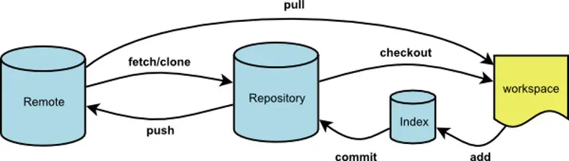

# Git 

## Git 常规操作

| **命令名称**                           | **作用**                                         |
| -------------------------------------- | ------------------------------------------------ |
| `git config --global user.name 用户名` | 设置用户签名                                     |
| `git config --global user.email 邮箱`  | 设置用户邮箱                                     |
| `git init`                             | 初始化一个空的 Git 仓库                          |
| `git status`                           | 查看本地当前工作区和暂存区的状态                 |
| `git add <file>`                       | 将需要管理的文件添加到暂存区                     |
| `git add .`                            | 一次性将所有变更添加到暂存区                     |
| `git commit -m "Initial commit"`       | 提交暂存区中的变更到本地仓库，并添加一个描述信息 |
| `git reflog`                           | 查看提交历史记录                                 |
| `git log`                              | 查看版本详细信息                                 |
| `git reset --hard 版本号`              | 版本穿梭                                         |
| `git branch`                           | 管理分支                                         |
| `git remote`                           | 管理远程仓库                                     |

## 设置用户签名

```shell
git config --global user.name 用户名
git config --global user.email 邮箱
git config --list # 查看全局配置
cat ~/.gitconfig  # cat linux中查看文本的命令  ~ 家 [你当前用户的家]/ .gitconfig
```

> 说明：签名的作用是区分不同操作者身份。用户的签名信息在每一个版本的提交信息中能够看到，以此确认本次提交是谁做的。Git 首次安装必须设置一下用户签名，否则无法提交代码。
>
>  注意：这里设置用户签名和将来登录 GitHub（或其他代码托管中心）的账号没有任何关系。

## 查看历史版本

```shell
# 查看版本信息
git reflog
git reflog -n 数量

# 查看版本详细信息
git log
```

## 版本穿梭/回退

```shell
git reset --hard 版本号
```

>  Git 切换版本，底层其实是移动的 HEAD 指针。

**撤消上次提交并返回到上一个提交:**

```shell
git reset HEAD~1
```

这将使 HEAD 指向上一个提交，但**不会删除您最新的更改**。如果您希望**完全返回到以前的提交并放弃所有更改**，则可以添加 `--hard` 选项：

```shell
git reset --hard HEAD~1
```

> 请注意，此操作将永久删除您最新的更改，请谨慎使用。如果您已经将更改推送到远程存储库，则在执行此操作之前应先备份这些更改。
>
> 上一个版本就是`HEAD^`，上上一个版本就是`HEAD^^`，当然往上 100 个版本写 100 个`^`比较容易数不过来，所以写成 `HEAD~100`。

## 撤销修改和删除文件操作

**撤销对文件的修改**，此命令将覆盖工作树中指定文件的更改，**还原为最近提交或上次检出的状态**。

```shell
git checkout -- <filename>
```

> - 如果 `filename` 自修改后还没有被放到暂存区，现在，撤销修改就回到和版本库一模一样的状态；
> - 如果 `filename` 已经添加到暂存区后，又作了修改，现在，撤销修改就回到添加到暂存区后的状态。
> - 总之，就是让这个文件回到最近一次 `git commit` 或 `git add` 时的状态。

如果修改只是添加到了暂存区，还没有提交，以下命令可以**把暂存区的修改撤销掉，重新放回工作区**：

```shell
git reset HEAD <file>
```

**删除文件并将此更改提交到 Git 存储库中**

```shell
git rm <filename>
git commit -m "Remove file"
```

这将从工作树和版本历史记录中删除指定的文件。如果只是想从 Git 版本库中删除文件但保留在工作树中

```shell
git rm --cached <filename>
git commit -m "Remove file from repository"
```

## 远程仓库

**添加远程仓库**：

```shell
# 首先，将本地代码库初始化为Git仓库（如果尚未完成）：
git init
# 添加远程仓库的URL，其中<remote-name>是自定义名称，<remote-url>是远程仓库的URL：
git remote add <remote-name> <remote-url>
# 可以使用以下命令确认远程仓库是否已成功添加：
git remote -v
```

>  此后，就可以使用 `git push` 命令将代码推送到远程仓库，或使用 `git pull` 命令从远程仓库拉取代码。

**从远程仓库克隆代码到本地:**

```shell
git clone <remote-url>
```

执行此命令后，Git 将**在当前目录下创建一个新目录**，其中包含克隆的代码库副本。如果想指定不同的目录名，可以将目录名作为可选参数添加到命令中：

```shell
git clone <remote-url> <directory-name>
```

## 创建与合并分支

**创建一个新的分支：**

```shell
git branch <branch_name>
```

**切换到新创建的分支：**

```shell
git checkout <branch_name>
```

**创建并立即切换到该分支：**

```shell
git checkout -b <branch_name>
```

合并分支：将 `<branch_name>` 分支中的更改合并到当前分支。

```shell
git merge <branch_name>
```

**处理冲突：**

1. 运行 `git status` 命令查看哪些文件包含冲突。
2. 编辑有冲突的文件，手动解决文件中的冲突。
3. 对编辑后的文件进行 `git add`，标记为已解决冲突的文件。
4. 使用 `git commit` 提交更改，Git 会自动生成一个合并提交，其中包含各自分支中的更改。

> 注意：在解决冲突前，最好先备份当前的代码状态，以免不小心破坏代码库。另外，在处理冲突之前，可以通过运行 `git diff` 命令来查看冲突的源代码，以便更好地理解要解决的问题。

## 推送和抓取分支

**推送分支：**

1. 推送当前分支到远程仓库，并与远程分支关联：

    ```shell
    git push -u origin <branch-name>
    ```

2. 推送当前分支到远程仓库，并与远程分支合并：

    ```shell
    git push origin <branch-name>
    ```

3. 强制推送当前分支到远程仓库：

    ```shell
    git push -f origin <branch-name>
    ```

4. 删除远程分支：

    ```shell
    git push origin :<branch-name>
    # 或
    git push --delete origin <branch-name>
    ```

> 建议采用 pull request 和 code review 等工具和流程来对分支进行审查和反馈，以确保代码质量和稳定性。同时，也应该避免直接向主分支（如 master 分支）提交代码，而是应该使用分支管理策略来组织和管理代码。

**抓取分支：**

1. 拉取所有远程分支并更新本地分支：

    ```shell
    git fetch [--all]
    ```

2. 拉取一个特定的远程分支到本地：

    ```shell
    git fetch origin <branch-name>
    ```

3. 在本地创建基于远程分支的新分支：

    ```shell
    git checkout -b <new-branch-name> origin/<remote-branch-name>
    ```

4. 拉取远程分支并自动与本地分支关联：

    ```shell
    git checkout --track origin/<remote-branch-name>
    # 或
    git checkout -t origin/<remote-branch-name>
    ```

> 抓取分支时，需要注意避免覆盖当前分支中未提交的更改。如果本地分支和远程分支存在冲突，需要解决冲突后才能将更改合并到本地分支中。

## git fetch & pull




-  `git fetch`是将远程主机的最新内容拉到本地，用户在检查了以后决定是否合并到工作本机分支中。
- `git pull` 则是将远程主机的最新内容拉下来后直接合并，即：`git pull = git fetch + git merge`，这样可能会产生冲突，需要手动解决。

## 分支的基本操作

```shell
# 查看本地所有分支 
git branch
# 查看远程所有分支
git branch -r
# 查看本地和远程的所有分支
git branch -a
# 新建分支
git branch <branchname>
# 删除本地分支
git branch -d <branchname>
# 删除远程分支，删除后还需推送到服务器
git branch -d -r <branchname>
git push origin:<branchname> # 删除后推送至服务器
# 重命名本地分支
git branch -m <oldbranch> <newbranch>

# 重命名远程分支：
# 1、删除远程待修改分支
# 2、push本地新分支到远程服务器

# git中一些选项解释:
-d
--delete：删除

-D
--delete --force 的快捷键

-f
--force：强制

-m
--move：移动或重命名

-M
--move --force 的快捷键

-r
--remote：远程

-a
--all：所有
```

## 撤销本地提交 & 恢复远程仓库提交

### 撤销还没有推送到 remote 仓库的提交

#### 完全撤销-舍弃全部改动，销毁提交

当你新加了一些改动，并且添加这些改动，然后 commit 提交到本地，这时你发现的你的改动完全做错了，你想撤销这个提交，而且不需要保留之前的改动。

```shell
git reset --hard HEAD~
```

> 执行完 reset 命令后，执行 git status 命令来查看你 branch 状态，你可以发现你刚刚的提交消失了，并且之前的 change 改动也消失了

- 撤销提交后又想恢复刚刚销毁的提交：

    - 当你用 `git reset --hard HEAD~ `来撤销提交后，你销毁了你的提交，但假如这时你突然又想恢复刚刚销毁的提交，来看看之前做的改动

    ```shell
    #  执行git reflog命令来查看你刚刚销毁提交的记录及其哈希值。
    git reflog
    # 找到相对应的哈希值，执行git checkout -b someNewBranchName shaYouDestroyed命令
    git checkout -b fix/recover-commit-remove-before 7144f51
    # 你可以在“fix/recover-commit-remove-before”分支上查看该提交。     
    ```

#### 撤销-但保留改动

当你做了一些改动，并且添加这些改动，然后 commit 提交到本地，这时你发现的你的改动有点小问题，你想撤销这个 commit 提交，而且要保留之前的改动，方便在之前的改动基础上做一些新的改动。

```shell
git reset HEAD~
```

执行完 reset 命令后，再执行 `git status` 来查看你之前的那些改动，你会发现你之前的哪些改动都还在

#### 最安全轻微的撤销 

保留文件的改动及索引状态，撤销完成后将会到 git 添加改动的状态，实现方法为

```shell
git reset --soft HEAD~
```

撤销完成，回到 git 添加改动后的状态。

### 撤销已经推送到 remote 仓库的提交

#### 利用 git revert 来撤销远程提交

```shell
git revert HEAD   （恢复HEAD提交）
或者
git revert <commit_hash> （恢复对应哈希值的提交）
```


